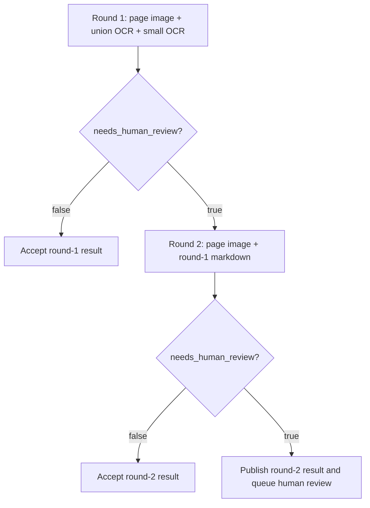

# Two-Round Page Reconciliation Design

## Purpose

Improve page-level PDF reconciliation quality without making every page pay for a
second model call.

The current v4 reconciler already sends each page image plus two OCR Markdown
drafts to a vision model. The source page image is the ground truth, but v4
review found material page-level mistakes in high-value well data, especially in
dense tables, locations, dates, and checkbox states.

This design keeps the existing output schema and publishing contract, then adds
selective second-round verification for pages that are high-risk or materially
ambiguous.

## Current Contract

The reconciler currently returns:

```text
reconciled_markdown
winner
warnings
needs_human_review
```

Valid `winner` values remain:

```text
union
small
mixed
uncertain
```

The stored `needs_human_review` value remains true when either the model returns
`needs_human_review = true` or the model returns `winner = "uncertain"`.

This design does not add `needs_second_round`, `difficulty`, field-level
confidence, or a verbose evidence object.

## Design Decision

Use `needs_human_review` as the only routing signal.

Round one interprets `needs_human_review = true` as:

```text
Do not accept this page from round one without verification.
```

Round two interprets `needs_human_review = true` as:

```text
Even after image-grounded verification, material ambiguity remains and a human
should review the page.
```

Warnings remain short audit notes for humans. They are not a routing signal.

## Flow



Round two receives only:

- The original rendered PDF page image.
- The round-one reconciled Markdown.

Round two does not receive union OCR, small OCR, rendered Markdown screenshots,
or prior warning text by default. The goal is to make the model compare the
candidate final Markdown directly against the page image and correct factual
errors, omissions, table alignment issues, checkbox states, dates, emails,
coordinates, and other visible page facts.

## Round-One Prompt Policy

Round one should still reconcile the two OCR drafts into clean Markdown, but it
must be more conservative about review routing.

Set `needs_human_review = true` in round one when the page contains a narrow
high-risk structure or material ambiguity.

Narrow high-risk structures are:

- Dense technical numeric tables: casing, tubing, cement, formation tops,
  lithology, directional survey, directional targets, and coordinate tables.
- Well and land location descriptions: latitude, longitude, +N/-S offsets,
  +E/-W offsets, section-township-range, surface hole location, and bottom-hole
  location.
- Checkbox groups where the checked or unchecked state changes the meaning of
  the document.
- Handwritten or crossed-out corrections that change typed values.
- Maps, plots, or diagrams with meaningful labels, markers, paths, depths,
  measured values, or coordinate-like information.

Material ambiguity includes:

- Important numbers, dates, names, emails, API numbers, locations, or table
  cells cannot be confidently read from the page image.
- Union OCR and small OCR disagree on a material value and the image does not
  clearly resolve the conflict.
- Table row, column, header, or merged-cell alignment is uncertain.
- Visible material text appears omitted, truncated, or structurally misplaced.
- Checkbox state cannot be confidently determined.

Do not set `needs_human_review = true` merely because the page contains ordinary
headers, stamps, signatures, simple prose, simple clearly-readable dates,
decorative graphics, or low-value metadata.

## Round-Two Prompt Policy

Round two is a verifier and finalizer, not a fresh OCR merger.

The prompt should instruct the model to:

- Treat the PDF page image as authoritative.
- Treat the round-one Markdown as a candidate final answer.
- Correct any factual, structural, table, checkbox, date, email, coordinate,
  location, or omission errors visible in the page image.
- Preserve Markdown readability and the existing table policy.
- Set `needs_human_review = false` only when the corrected Markdown is faithful
  to the page and no material ambiguity remains.
- Set `needs_human_review = true` when the page still contains unresolved
  material ambiguity after verification.

The round-two `winner` should normally be `mixed` when corrections were made and
may remain the round-one winner only when the candidate Markdown was accepted
without material changes. It should use `uncertain` only when unresolved
material ambiguity remains.

## Decision Artifact

`decision.json` should keep the existing compact fields and add an `llm_calls`
array. Each element records one model call.

Suggested shape:

```json
{
  "document_id": "Full_30015375000000",
  "page": 28,
  "winner": "mixed",
  "warnings": [],
  "needs_human_review": false,
  "model": "gpt-5.4-mini",
  "prompt_version": "reconcile-page-v5",
  "source_refs": {
    "page_image": "runs/.../page.png",
    "union_markdown": "runs/.../union/.../output.md",
    "small_markdown": "runs/.../small/.../output.md"
  },
  "llm_calls": [
    {
      "round": 1,
      "model": "gpt-5.4-mini",
      "prompt_version": "reconcile-page-v5",
      "response_id": "resp_...",
      "input_tokens": 18420,
      "cached_input_tokens": 0,
      "output_tokens": 820,
      "reasoning_tokens": 0,
      "total_tokens": 19240,
      "input_text_tokens_derived": 1460,
      "input_image_tokens_derived": 16960,
      "input_split_method": "responses.input_tokens_delta",
      "image_count": 1,
      "image_detail": "high",
      "estimated_cost_usd": 0.0175,
      "pricing": {
        "input_per_1m": 0.75,
        "cached_input_per_1m": 0.075,
        "output_per_1m": 4.5,
        "currency": "USD",
        "source": "https://openai.com/api/pricing/",
        "captured_at": "2026-06-08"
      }
    }
  ]
}
```

`response.usage` remains the authoritative source for total input, cached input,
output, reasoning, and total tokens. The text/image split is derived by calling
the Responses input-token counting endpoint for the full request and for the
same request without image input:

```text
input_image_tokens_derived = full_input_tokens - text_only_input_tokens
input_text_tokens_derived = text_only_input_tokens
```

The derived split is for page-level reporting and cost analysis. It is not
presented as the final billing record.

Estimated cost uses:

```text
uncached_input_tokens / 1_000_000 * input_rate
+ cached_input_tokens / 1_000_000 * cached_input_rate
+ output_tokens / 1_000_000 * output_rate
```

Pricing should be logged with the rate snapshot used for the estimate because
published model prices can change.

## Storage And Catalog

The existing published Markdown remains the final page output. If round two
runs, its corrected Markdown replaces the round-one Markdown for publication.

The SQLite page catalog may continue storing only compact page status,
`needs_human_review`, warning count, asset count, and Markdown text. Detailed
call accounting belongs in `decision.json`; aggregate cost reporting can read
the decision artifacts later instead of widening the catalog immediately.

## Error Handling

If round one fails validation, the page is not published and the existing
failure path should record the error.

If round two fails after round one requested verification, do not silently accept
round one as final. Publish should fail for that page unless an explicit
developer option later allows a fallback. This prevents the routing signal from
being ignored during transient model or validation failures.

If token preflight fails but generation succeeds, publish the result with
`input_text_tokens_derived = null`, `input_image_tokens_derived = null`, and a
short call-accounting warning in the call metadata. The page content should not
fail solely because optional accounting failed.

## Testing Strategy

Unit tests should cover:

- Round one false publishes one call and does not run round two.
- Round one true runs round two and publishes the round-two Markdown.
- Round two true leaves the final published page marked for human review.
- `winner = "uncertain"` forces `needs_human_review = true`.
- Warnings alone do not trigger round two when `needs_human_review = false`.
- Round two receives only page image and round-one Markdown.
- `decision.json` records one or two `llm_calls`.
- Token usage and cost fields are preserved when available.
- Token split fields are nullable when preflight counting is unavailable.

Prompt tests should assert that the round-one prompt names the narrow high-risk
structures and material ambiguity conditions, and that the round-two prompt
describes image-grounded verification against candidate Markdown.

## Non-Goals

- No new schema field for `needs_second_round`.
- No difficulty score.
- No field-level confidence model.
- No always-on second round.
- No section-level wellbore fact reconciliation.
- No requirement to store chain-of-thought or verbose evidence.
