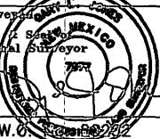

DISTRICT I

1625 N. French Dr., Hobbs, NM 88240

DISTRICT II

1301 W. Grand Avenue, Artesia, NM 88210

DISTRICT III

1000 Rio Brazos Rd., Aztec, NM 87410

DISTRICT IV

1220 S. St. Francis Dr., Santa Fe, NM 87505

# State of New Mexico Energy, Minerals and Natural Resources Department

Revised October 12, 2005

# OIL CONSERVATION DIVISION 1220 South St. Francis Dr. Santa Fe, New Mexico 87505

Submit to Appropriate District Office

Fee Lease - 3 Copies

WELL LOCATION AND ACREAGE DEDICATION PLAT

□ AMENDED REPORT

<table border=1 style='margin: auto; word-wrap: break-word;'><tr><td style='text-align: center; word-wrap: break-word;'>API Number</td><td style='text-align: center; word-wrap: break-word;'>Pool Code</td><td colspan="2">Pool Name\nWILDCAT MORROW</td></tr><tr><td style='text-align: center; word-wrap: break-word;'>Property Code</td><td style='text-align: center; word-wrap: break-word;'>Property Name\nPERDOMO &quot;BMP&quot; STATE</td><td style='text-align: center; word-wrap: break-word;'></td><td style='text-align: center; word-wrap: break-word;'>Well Number\n1</td></tr><tr><td style='text-align: center; word-wrap: break-word;'>OGRID No.\n025575</td><td style='text-align: center; word-wrap: break-word;'>Operator Name\nYATES PETROLEUM CORP.</td><td style='text-align: center; word-wrap: break-word;'></td><td style='text-align: center; word-wrap: break-word;'>Elevation\n3149&#x27;</td></tr></table>

Surface Location

<table border=1 style='margin: auto; word-wrap: break-word;'><tr><td style='text-align: center; word-wrap: break-word;'>UL or lot No.</td><td style='text-align: center; word-wrap: break-word;'>Section</td><td style='text-align: center; word-wrap: break-word;'>Township</td><td style='text-align: center; word-wrap: break-word;'>Range</td><td style='text-align: center; word-wrap: break-word;'>Lot Idn</td><td style='text-align: center; word-wrap: break-word;'>Feet from the</td><td style='text-align: center; word-wrap: break-word;'>North/South line</td><td style='text-align: center; word-wrap: break-word;'>Feet from the</td><td style='text-align: center; word-wrap: break-word;'>East/West line</td><td style='text-align: center; word-wrap: break-word;'>County</td></tr><tr><td style='text-align: center; word-wrap: break-word;'>L</td><td style='text-align: center; word-wrap: break-word;'>24</td><td style='text-align: center; word-wrap: break-word;'>24 S</td><td style='text-align: center; word-wrap: break-word;'>27 E</td><td style='text-align: center; word-wrap: break-word;'></td><td style='text-align: center; word-wrap: break-word;'>1650</td><td style='text-align: center; word-wrap: break-word;'>SOUTH</td><td style='text-align: center; word-wrap: break-word;'>660</td><td style='text-align: center; word-wrap: break-word;'>WEST</td><td style='text-align: center; word-wrap: break-word;'>EDDY</td></tr></table>

Bottom Hole Location If Different From Surface

<table border=1 style='margin: auto; word-wrap: break-word;'><tr><td style='text-align: center; word-wrap: break-word;'>UL or Lot No.</td><td style='text-align: center; word-wrap: break-word;'>Section</td><td style='text-align: center; word-wrap: break-word;'>Township</td><td style='text-align: center; word-wrap: break-word;'>Range</td><td style='text-align: center; word-wrap: break-word;'>Lot Idn</td><td style='text-align: center; word-wrap: break-word;'>Feet from the</td><td style='text-align: center; word-wrap: break-word;'>North/South line</td><td style='text-align: center; word-wrap: break-word;'>Feet from the</td><td style='text-align: center; word-wrap: break-word;'>East/West line</td><td style='text-align: center; word-wrap: break-word;'>County</td></tr><tr><td style='text-align: center; word-wrap: break-word;'></td><td style='text-align: center; word-wrap: break-word;'></td><td style='text-align: center; word-wrap: break-word;'></td><td style='text-align: center; word-wrap: break-word;'></td><td style='text-align: center; word-wrap: break-word;'></td><td style='text-align: center; word-wrap: break-word;'></td><td style='text-align: center; word-wrap: break-word;'></td><td style='text-align: center; word-wrap: break-word;'></td><td style='text-align: center; word-wrap: break-word;'></td><td style='text-align: center; word-wrap: break-word;'></td></tr><tr><td style='text-align: center; word-wrap: break-word;'>Dedicated Acres\n320</td><td colspan="2">Joint or Infill</td><td colspan="2">Consolidation Code</td><td colspan="4">Order No.</td><td style='text-align: center; word-wrap: break-word;'></td></tr></table>

NO ALLOWABLE WILL BE ASSIGNED TO THIS COMPLETION UNTIL ALL INTERESTS HAVE BEEN CONSOLIDATED OR A NON-STANDARD UNIT HAS BEEN APPROVED BY THE DIVISION

