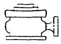
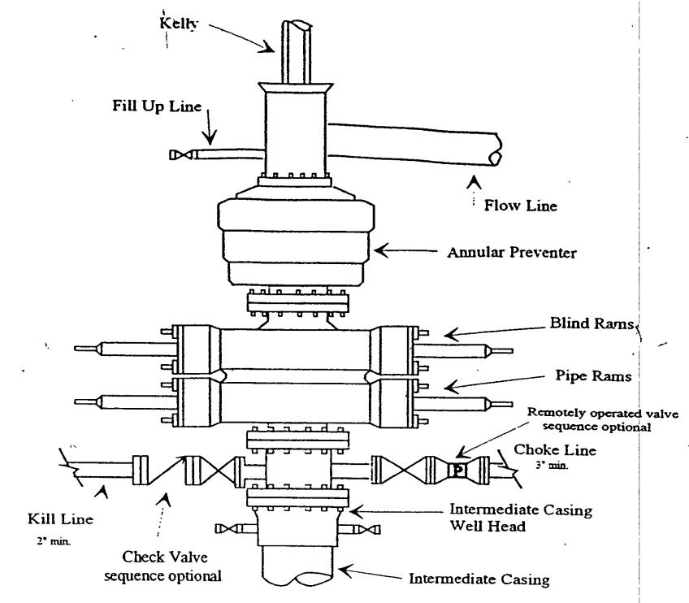
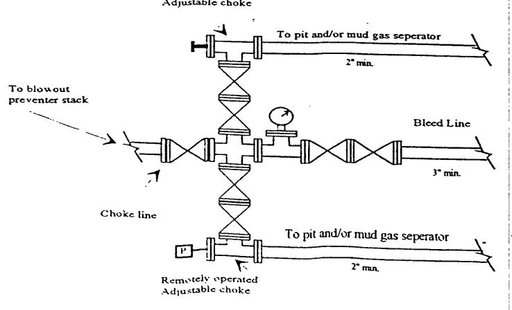

Yates Petroleum Corporation

Typical 5,000 psi Pressure System

Schematic

Annular with Double Ram Preventer Stack

Typical 5,000 psi choke manifold assembly with at least these minimum features

Adjustable choke

