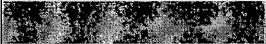

Submit 3 Copies To Appropriate District Office

District I

1625 N. French Dr., Hobbs, NM 88240

District II

1301 W. Grand Ave., Artesia, NM 88210

District III

1000 Rio Brazos Rd., Aztec, NM 87410

District IV

1220 S. St. Francis Dr., Santa Fe, NM

87505

# State of New Mexico Energy, Minerals and Natural Resources

Form C-103

# OIL CONSERVATION DIVISION 1220 South St. Francis Dr. Santa Fe, NM 87505

June 19, 2008

12. Check Appropriate Box to Indicate Nature of Notice, Report or Other Data

NOTICE OF INTENTION TO:

PERFORM REMEDIAL WORK ☐ PLUG AND ABANDON ☐ SUBSEQUENT REPORT OF:

TEMPORARILY ABANDON

REMEDIAL WORK

☐ CHANGE PLANS

PULL OR ALTER CASING

□ ALTERING CASING □

COMMENCE DRILLING OPNS.□ P AND A

□ MULTIPLE COMPL

DOWNHOLE COMMINGLE

OTHER:

OTHER: 5' new hole

13. Describe proposed or completed operations. (Clearly state all pertinent details, and give pertinent dates, including estimated date of starting any proposed work). SEE RULE 1103. For Multiple Completions: Attach wellbore diagram of proposed completion or recompletion.

8/20/08 – Made 5' new hole at 9:00 AM. TD 15'. Hole size 12-1/4".

ACCEPTEDED FOR RECORD

AUG 26 2008

Gerry Guye, Deputy Field Inspector NMOCD-District II ARTESIA

Spud Date:

Rig Release Date:

I hereby certify that the information above is true and complete to the best of my knowledge and belief.

SIGNATURE

Type or print name ___ Tina Huerta ___ E-mail address: ___ tinah@ypcnm.com PHONE: ___ 575-748-4168

APPROVED BY: ___ TITLE ___ DATE ___

Conditions of Approval (if any):