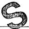

FEB-9 2009

Form C-103

June 19, 2008

### 12. Check Appropriate Box to Indicate Nature of Notice, Report or Other Data

NOTICE OF INTENTION TO:

PERFORM REMEDIAL WORK ☐ PLUG AND ABANDON ☐ SUBSEQUENT REPORT OF:

□ ALTERING CASING □

DOWNHOLE COMMINGLE

OTHER:

OTHER: 5' new hole

13. Describe proposed or completed operations. (Clearly state all pertinent details, and give pertinent dates, including estimated date of starting any proposed work). SEE RULE 1103. For Multiple Completions: Attach wellbore diagram of proposed completion or recompletion.

2/4/09 - Made 5' new hole at 9:00 AM. TD 60'. Hole size 12-1/4".

Spud Date:

Rig Release Date:

I hereby certify that the information above is true and complete to the best of my knowledge and belief.

Type or print name  $ \underline{\text{Tina Huerta}} $ E-mail address:  $ \underline{\text{tinah@yatespetroleum.com}} $ PHONE:  $ \underline{\text{575-748-4168}} $ For State Use Only

APPROVED BY:

Accepted for record

Conditions of Approval (if any):

FEB 23 2009