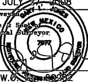

1625 N. French Dr., Hobbs, NM 68240

DISTRICT II

1301 W. Grand Avenue, Artesia, NM 88210

DISTRICT III

1000 Rio Brazos Rd., Aztec, NM 87410

DISTRICT IV

1220 S. St. Francis Dr., Santa Fe, NM 87505

# State of New Mexico Energy, Minerals and Natural Resources Department

# OIL CONSERVATION DIVISION 1220 South St. Francis Dr. Santa Fe, New Mexico 87505

Submit to Appropriate District Office

State Lease – 4 Copies

Fee Lease – 3 Copies

☐ AMENDED REPORT

WELL LOCATION AND ACREAGE DEDICATION PLAT

<table border=1 style='margin: auto; word-wrap: break-word;'><tr><td style='text-align: center; word-wrap: break-word;'>API Number</td><td style='text-align: center; word-wrap: break-word;'>Pool Code</td><td colspan="2">Pool Name Wildcat Morrow</td></tr><tr><td style='text-align: center; word-wrap: break-word;'>Property Code</td><td colspan="2">Property Name PERDOMO &quot;BMP&quot; STATE COM</td><td style='text-align: center; word-wrap: break-word;'>Well Number 1H</td></tr><tr><td style='text-align: center; word-wrap: break-word;'>OGRID No. 025575</td><td colspan="2">Operator Name YATES PETROLEUM CORP.</td><td style='text-align: center; word-wrap: break-word;'>Elevation 3149&#x27;</td></tr></table>

Surface Location

<table border=1 style='margin: auto; word-wrap: break-word;'><tr><td style='text-align: center; word-wrap: break-word;'>UL or lot No.</td><td style='text-align: center; word-wrap: break-word;'>Section</td><td style='text-align: center; word-wrap: break-word;'>Township</td><td style='text-align: center; word-wrap: break-word;'>Range</td><td style='text-align: center; word-wrap: break-word;'>Lot Idn</td><td style='text-align: center; word-wrap: break-word;'>Feet from the</td><td style='text-align: center; word-wrap: break-word;'>North/South line</td><td style='text-align: center; word-wrap: break-word;'>Feet from the</td><td style='text-align: center; word-wrap: break-word;'>East/West line</td><td style='text-align: center; word-wrap: break-word;'>County</td></tr><tr><td style='text-align: center; word-wrap: break-word;'>L</td><td style='text-align: center; word-wrap: break-word;'>24</td><td style='text-align: center; word-wrap: break-word;'>24 S</td><td style='text-align: center; word-wrap: break-word;'>27 E</td><td style='text-align: center; word-wrap: break-word;'></td><td style='text-align: center; word-wrap: break-word;'>1650</td><td style='text-align: center; word-wrap: break-word;'>SOUTH</td><td style='text-align: center; word-wrap: break-word;'>660</td><td style='text-align: center; word-wrap: break-word;'>WEST</td><td style='text-align: center; word-wrap: break-word;'>EDDY</td></tr></table>

Bottom Hole Location If Different From Surface

<table border=1 style='margin: auto; word-wrap: break-word;'><tr><td style='text-align: center; word-wrap: break-word;'>UL or lot No.</td><td style='text-align: center; word-wrap: break-word;'>Section</td><td style='text-align: center; word-wrap: break-word;'>Township</td><td style='text-align: center; word-wrap: break-word;'>Range</td><td style='text-align: center; word-wrap: break-word;'>Lot Id</td><td style='text-align: center; word-wrap: break-word;'>Feet from the</td><td style='text-align: center; word-wrap: break-word;'>North/South line</td><td style='text-align: center; word-wrap: break-word;'>Feet from the</td><td style='text-align: center; word-wrap: break-word;'>East/West line</td><td style='text-align: center; word-wrap: break-word;'>County</td></tr><tr><td style='text-align: center; word-wrap: break-word;'>1</td><td style='text-align: center; word-wrap: break-word;'>24</td><td style='text-align: center; word-wrap: break-word;'>24 S</td><td style='text-align: center; word-wrap: break-word;'>27 E</td><td style='text-align: center; word-wrap: break-word;'></td><td style='text-align: center; word-wrap: break-word;'>1650</td><td style='text-align: center; word-wrap: break-word;'>SOUTH</td><td style='text-align: center; word-wrap: break-word;'>330</td><td style='text-align: center; word-wrap: break-word;'>EAST</td><td style='text-align: center; word-wrap: break-word;'>EDDY</td></tr><tr><td colspan="2">Dedicated Acres</td><td style='text-align: center; word-wrap: break-word;'>Joint or Infill</td><td colspan="2">Consolidation Code</td><td colspan="5">Order No.</td></tr><tr><td colspan="2">160</td><td style='text-align: center; word-wrap: break-word;'></td><td style='text-align: center; word-wrap: break-word;'></td><td style='text-align: center; word-wrap: break-word;'></td><td style='text-align: center; word-wrap: break-word;'></td><td style='text-align: center; word-wrap: break-word;'></td><td style='text-align: center; word-wrap: break-word;'></td><td style='text-align: center; word-wrap: break-word;'></td><td style='text-align: center; word-wrap: break-word;'></td></tr></table>

NO ALLOWABLE WILL BE ASSIGNED TO THIS COMPLETION UNTIL ALL INTERESTS HAVE BEEN CONSOLIDATED OR A NON-STANDARD UNIT HAS BEEN APPROVED BY THE DIVISION

<table border=1 style='margin: auto; word-wrap: break-word;'><tr><td style='text-align: center; word-wrap: break-word;'>OPERATOR CERTIFICATION</td></tr><tr><td style='text-align: center; word-wrap: break-word;'>I hereby certify that the information contained herein is true and complete to the best of my knowledge and belief, and that this organization either owns a working interest or unleased mineral interest in the land including the proposed bottom hole location pursuant to a contract with an owner of such a mineral or working interest, or to a voluntary pooling agreement or a compulsory pooling order heretofore entered by the division.</td></tr><tr><td style='text-align: center; word-wrap: break-word;'>Signature 1/6/10 Date</td></tr></table>

Clifton May

<table border=1 style='margin: auto; word-wrap: break-word;'><tr><td style='text-align: center; word-wrap: break-word;'>Printed Name</td></tr><tr><td style='text-align: center; word-wrap: break-word;'>SURVEYOR CERTIFICATION\nI hereby certify that the well location shown on this plat was plotted from field notes of actual surveys made by me or under my supervision and that the same is true and correct to the best of my belief.</td></tr><tr><td style='text-align: center; word-wrap: break-word;'>Date Sur Signature Profession </td></tr><tr><td style='text-align: center; word-wrap: break-word;'>Certificate No. Gary L. Jones 7977\nRASIN SURVEYS</td></tr></table>