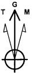

PROJECT DETAILS: Eddy County Geodetic System US State Plane 1983

Datum: North American Datum 1983

Ellipsoid: GRS 1980

Zone: New Mexico Eastern Zone

System Datum: Mean Sea Level

Local North Grid

Sec MD Inc Azl TVD +N/S +E/W DLeg TFace VSec Target

1 5750.00 0.95 209.07 5748.97 1.63 -7.71 0.00 0.00 -1.67

2 6493.87 90.00 179.56 6220.00 -475.30 -7.90 11.99 -29.51 476.25

3 12795.18 90.00 179.56 6220.00 -6777.43 40.49 0.00 0.00 6777.55 PBHL(Perdomo)

WELLBORE TARGET DETAILS (MAP CO-ORDINATES)

Name: TVD +N/S +EI/W Northing: Easting Shape PBHL(Perdomo) 6220.00 -6777.43 4038 429915.644 597858.492 Point

WELL DETAILS #1H

round Elevation 314900

RKB Elevation WELL @ 3175 50ft (Original Well Elev)

Rig Name Original Well Elev

Northing Easting Latitude Longitude Slot 436693070 597818.111 32°12′1.492N 104°9′2.637W