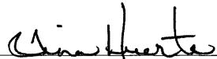

## Form C-103 continued:

8/11/10 – Spotted 1500g 7-1/2% HCL acid at 10,487'. Perforated Bone Spring 10,487', 10,337', 10,187' and 10,037' for a total of 40 holes. Spearhead 1500g 7-1/2% HCL acid ahead of frac. Frac w/a 30# borate XL, 5577 bbls fluid, 60,893# 40/70 Ottawa, 118,519# 20/40 Ottawa, 79,937# 20/40 RCS.

8/12/10 – Spotted 1500g 7-1/2% HCL acid at 9887'. Perforated Bone Spring 9887', 9737', 9587' and 9437' for a total of 40 holes. Spearhead 1500g 7-1/2% HCL acid ahead of frac. Frac w/a 30# borate XL, 5564 bbls fluid, 60,474# 40/70 Ottawa, 116,638# 20/40 Ottawa, 80,792# 20/40 RCS. Spotted 1500g 7-1/2% HCL acid at 9287'. Perforated Bone Spring 9287', 9137', 8987' and 8837' for a total of 40 holes. Spearhead 1500g 7-1/2% HCL acid ahead of frac. Frac w/a 30# borate XL, 5691 bbls fluid, 61,682# 40/70 Ottawa, 117,107# 20/40 Ottawa, 87,311# 20/40 RCS. Spotted 1500g 7-1/2% HCL acid at 8687'.

8/13/10 – Perforated Bone Spring 8687’, 8537’, 8387’ and 8237’ for a total of 40 holes. Spearhead 1500g 7-1/2% HCL acid ahead of frac. Frac w/a 30# borate XL, 5543 bbls fluid, 62,573# 40/70 Ottawa, 109,893# 20/40 Ottawa, 60,486# 20/40 RCS. Spotted 1500g 7-1/2% HCL acid at 8087’. Perforated Bone Spring 8087’, 7937’, 7787’ and 7637’ for a total of 40 holes. Spearhead 1500g 7-1/2% HCL acid ahead of frac. Frac w/a 30# borate XL, 5583 bbls fluid, 58,697# 40/70 Ottawa, 118,885# 20/40 Ottawa, 42,286# 20/40 RCS. Spotted 1500g 7-1/2% HCL acid at 7487’. Perforated Bone Spring 7487’, 7337’, 7187’ and 7037’ for a total of 40 holes. Spearhead 1500g 7-1/2% HCL acid ahead of frac. Frac w/a 30# borate XL, 5390 bbls fluid, 66,177# 40/70 Ottawa, 114,628# 20/40 Ottawa, 27,890# 20/40 RCS. Spotted 1500g 7-1/2% HCL acid at 6887’. Perforated Bone Spring 6887’, 6737’, 6587’ and 6437’ for a total of 40 holes. Spearhead 1500g 7-1/2% HCL acid ahead of frac. Frac w/a 30# borate XL, 5493 bbls fluid, 64,843# 40/70 Ottawa, 117,360# 20/40 Ottawa, 61,553# 20/40 RCS. 2-7/8” 6.5# L-80 tubing and 5-1/2” 17# WL set AS-1 packer with 2.25” blanking plug in place at 5645’.

Regulatory Compliance Supervisor August 26, 2010

