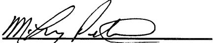
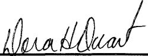
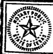

3D-015-36499

RECEIVED

AUG 30 2010

NMOCD ARTESIA

Patriot Drilling, LLC

M. Leroy Peterson, Executive Vice-

President

The foregoing instrument was acknowledged before me on this 25th day of May, 2010 by M. Leroy Peterson, Executive Vice-President of Patriot Drilling, LLC.

My Commission Expires: 5/29/2013

DORA H. DUARTE

Dora H. Duarte

Notary Public for Midland Co., Texas