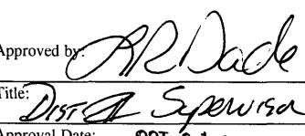

# State of New Mexico

☐ AMENDED REPORT

TOWABLE AND AUTHORIZATION TO TRANSPORT

<table border=1 style='margin: auto; word-wrap: break-word;'><tr><td rowspan="2">$ ^{{1}} $ Operator name and Address\nYates Petroleum Corporation\n105 South Fourth Street\nArtesia, NM 88210</td><td rowspan="2">the pool designated below\nnotify the Hobbs OCD Geologist.</td><td style='text-align: center; word-wrap: break-word;'>$ ^{{2}} $ OGRID Number\n025575</td></tr><tr><td style='text-align: center; word-wrap: break-word;'>$ ^{{3}} $ Reason for Filing Code/ Effective Date\nNW</td></tr><tr><td style='text-align: center; word-wrap: break-word;'>$ ^{{4}} $ API Number\n30 - 015 - 36499</td><td style='text-align: center; word-wrap: break-word;'>$ ^{{5}} $ Pool Name\nWillow Lake\nWildeat; Bone Spring West</td><td style='text-align: center; word-wrap: break-word;'>$ ^{{6}} $ Pool Code\n96403 96415</td></tr><tr><td style='text-align: center; word-wrap: break-word;'>$ ^{{7}} $ Property Code\n37296 37989</td><td style='text-align: center; word-wrap: break-word;'>$ ^{{8}} $ Property Name\nPerdomo BMP State Com</td><td style='text-align: center; word-wrap: break-word;'>$ ^{{9}} $ Well Number\n1H</td></tr></table>

<table border=1 style='margin: auto; word-wrap: break-word;'><tr><td style='text-align: center; word-wrap: break-word;'>Ul or lot no. L</td><td style='text-align: center; word-wrap: break-word;'>Section 24</td><td style='text-align: center; word-wrap: break-word;'>Township 24S</td><td style='text-align: center; word-wrap: break-word;'>Range 27E</td><td style='text-align: center; word-wrap: break-word;'>Lot Idn</td><td style='text-align: center; word-wrap: break-word;'>Feet from the 1650</td><td style='text-align: center; word-wrap: break-word;'>North/South Line South</td><td style='text-align: center; word-wrap: break-word;'>Feet from the 660</td><td style='text-align: center; word-wrap: break-word;'>East/West line West</td><td style='text-align: center; word-wrap: break-word;'>County Eddy</td></tr></table>

Bottom Hole Location

<table border=1 style='margin: auto; word-wrap: break-word;'><tr><td style='text-align: center; word-wrap: break-word;'>UL or lot no. M</td><td style='text-align: center; word-wrap: break-word;'>Section 25</td><td style='text-align: center; word-wrap: break-word;'>Township 24S</td><td style='text-align: center; word-wrap: break-word;'>Range 27E</td><td style='text-align: center; word-wrap: break-word;'>Lot Idn</td><td style='text-align: center; word-wrap: break-word;'>Feet from the 5125</td><td style='text-align: center; word-wrap: break-word;'>North/South line South</td><td style='text-align: center; word-wrap: break-word;'>Feet from the 667</td><td style='text-align: center; word-wrap: break-word;'>East/West line West</td><td style='text-align: center; word-wrap: break-word;'>County Eddy</td></tr><tr><td style='text-align: center; word-wrap: break-word;'>$ ^{{12}} $ Lse Code S</td><td colspan="2">$ ^{{13}} $ Producing Method Code F</td><td colspan="2">$ ^{{14}} $ Gas Connection Date 8/22/10</td><td colspan="2">$ ^{{15}} $ C-129 Permit Number</td><td colspan="2">$ ^{{16}} $ C-129 Effective Date</td><td style='text-align: center; word-wrap: break-word;'>$ ^{{17}} $ C-129 Expiration Date</td></tr></table>

### III. Oil and Gas Transporters

<table border=1 style='margin: auto; word-wrap: break-word;'><tr><td style='text-align: center; word-wrap: break-word;'>$ ^{{18}} $ Transporter OGRID</td><td style='text-align: center; word-wrap: break-word;'>$ ^{{19}} $ Transporter Name and Address</td><td style='text-align: center; word-wrap: break-word;'>$ ^{{20}} $ O/G/W</td></tr><tr><td style='text-align: center; word-wrap: break-word;'>147831</td><td rowspan="2">Agave Energy Company\n105 South Fourth Street\nArtesia, NM 88210</td><td style='text-align: center; word-wrap: break-word;'>G</td></tr><tr><td style='text-align: center; word-wrap: break-word;'></td><td style='text-align: center; word-wrap: break-word;'></td></tr><tr><td style='text-align: center; word-wrap: break-word;'>016696</td><td rowspan="2">Occidental Energy Trans LLC\n5 Greenway Plaza, Suite 110\nHouston, TX 77046</td><td style='text-align: center; word-wrap: break-word;'>O</td></tr><tr><td style='text-align: center; word-wrap: break-word;'></td><td style='text-align: center; word-wrap: break-word;'></td></tr><tr><td style='text-align: center; word-wrap: break-word;'></td><td rowspan="2"></td><td style='text-align: center; word-wrap: break-word;'></td></tr><tr><td style='text-align: center; word-wrap: break-word;'></td><td style='text-align: center; word-wrap: break-word;'></td></tr><tr><td style='text-align: center; word-wrap: break-word;'></td><td rowspan="2"></td><td style='text-align: center; word-wrap: break-word;'></td></tr><tr><td style='text-align: center; word-wrap: break-word;'></td><td style='text-align: center; word-wrap: break-word;'></td></tr></table>

IV. Well Completion Data

<table border=1 style='margin: auto; word-wrap: break-word;'><tr><td style='text-align: center; word-wrap: break-word;'>$ ^{{21}} $ Spud Date\nRH 8/1/08\nRT 4/30/10</td><td style='text-align: center; word-wrap: break-word;'>$ ^{{22}} $ Ready Date\n8/21/10</td><td style='text-align: center; word-wrap: break-word;'>$ ^{{23}} $ TD\n12,797&#x27;</td><td style='text-align: center; word-wrap: break-word;'>$ ^{{24}} $ PBTD\n12,749&#x27;</td><td style='text-align: center; word-wrap: break-word;'>$ ^{{25}} $ Perforations\n6437&#x27;-12,747&#x27;</td><td style='text-align: center; word-wrap: break-word;'>$ ^{{26}} $ DHC, MC</td></tr><tr><td colspan="2">$ ^{{27}} $ Hole Size</td><td style='text-align: center; word-wrap: break-word;'>$ ^{{28}} $ Casing &amp; Tubing Size</td><td colspan="2">$ ^{{29}} $ Depth Set</td><td style='text-align: center; word-wrap: break-word;'>$ ^{{30}} $ Sacks Cement</td></tr><tr><td colspan="2">26&quot;</td><td style='text-align: center; word-wrap: break-word;'>20&quot;</td><td colspan="2">90&#x27;</td><td style='text-align: center; word-wrap: break-word;'>Redi-mix to surface</td></tr><tr><td colspan="2">17-1/2&quot;</td><td style='text-align: center; word-wrap: break-word;'>13-3/8&quot;</td><td colspan="2">805&#x27;</td><td style='text-align: center; word-wrap: break-word;'>650 sx (circ)</td></tr><tr><td colspan="2">12-1/4&quot;</td><td style='text-align: center; word-wrap: break-word;'>9-5/8&quot;</td><td colspan="2">2286&#x27;</td><td style='text-align: center; word-wrap: break-word;'>750 sx (circ)</td></tr><tr><td colspan="2">8-3/4&quot;</td><td style='text-align: center; word-wrap: break-word;'>5-1/2&quot;</td><td colspan="2">12,797&#x27;</td><td style='text-align: center; word-wrap: break-word;'>2010 sx</td></tr><tr><td colspan="2"></td><td style='text-align: center; word-wrap: break-word;'>2-7/8&quot;</td><td colspan="2">5645&#x27;</td><td style='text-align: center; word-wrap: break-word;'></td></tr></table>

### V. Well Test Data

 $ K\in\mathbb{Z} $