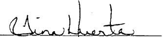

## C-105 continued:

26. Perforation Record (interval, size, and number)

<table border=1 style='margin: auto; word-wrap: break-word;'><tr><td style='text-align: center; word-wrap: break-word;'>12,747&#x27;</td><td style='text-align: center; word-wrap: break-word;'>10,997&#x27;</td><td style='text-align: center; word-wrap: break-word;'>9287&#x27;</td><td style='text-align: center; word-wrap: break-word;'>7787&#x27;</td></tr><tr><td style='text-align: center; word-wrap: break-word;'>12,572&#x27;</td><td style='text-align: center; word-wrap: break-word;'>10,822&#x27;</td><td style='text-align: center; word-wrap: break-word;'>9137&#x27;</td><td style='text-align: center; word-wrap: break-word;'>7637&#x27;</td></tr><tr><td style='text-align: center; word-wrap: break-word;'>12,397&#x27;</td><td style='text-align: center; word-wrap: break-word;'>10,487&#x27;</td><td style='text-align: center; word-wrap: break-word;'>8987&#x27;</td><td style='text-align: center; word-wrap: break-word;'>7487&#x27;</td></tr><tr><td style='text-align: center; word-wrap: break-word;'>12,222&#x27;</td><td style='text-align: center; word-wrap: break-word;'>10,337&#x27;</td><td style='text-align: center; word-wrap: break-word;'>8837&#x27;</td><td style='text-align: center; word-wrap: break-word;'>7337&#x27;</td></tr><tr><td style='text-align: center; word-wrap: break-word;'>12,047&#x27;</td><td style='text-align: center; word-wrap: break-word;'>10,187&#x27;</td><td style='text-align: center; word-wrap: break-word;'>8687&#x27;</td><td style='text-align: center; word-wrap: break-word;'>7187&#x27;</td></tr><tr><td style='text-align: center; word-wrap: break-word;'>11,872&#x27;</td><td style='text-align: center; word-wrap: break-word;'>10,037&#x27;</td><td style='text-align: center; word-wrap: break-word;'>8537&#x27;</td><td style='text-align: center; word-wrap: break-word;'>7037&#x27;</td></tr><tr><td style='text-align: center; word-wrap: break-word;'>11,697&#x27;</td><td style='text-align: center; word-wrap: break-word;'>9887&#x27;</td><td style='text-align: center; word-wrap: break-word;'>8387&#x27;</td><td style='text-align: center; word-wrap: break-word;'>6887&#x27;</td></tr><tr><td style='text-align: center; word-wrap: break-word;'>11,522&#x27;</td><td style='text-align: center; word-wrap: break-word;'>9737&#x27;</td><td style='text-align: center; word-wrap: break-word;'>8237&#x27;</td><td style='text-align: center; word-wrap: break-word;'>6737&#x27;</td></tr><tr><td style='text-align: center; word-wrap: break-word;'>11,347&#x27;</td><td style='text-align: center; word-wrap: break-word;'>9587&#x27;</td><td style='text-align: center; word-wrap: break-word;'>8087&#x27;</td><td style='text-align: center; word-wrap: break-word;'>6587&#x27;</td></tr><tr><td style='text-align: center; word-wrap: break-word;'>11,172&#x27;</td><td style='text-align: center; word-wrap: break-word;'>9437&#x27;</td><td style='text-align: center; word-wrap: break-word;'>7937&#x27;</td><td style='text-align: center; word-wrap: break-word;'>6437&#x27;</td></tr></table>

27. Acid, Shot, Fracture, Cement, Squeeze, ETC.

<table border=1 style='margin: auto; word-wrap: break-word;'><tr><td style='text-align: center; word-wrap: break-word;'>Depth Interval</td><td style='text-align: center; word-wrap: break-word;'>Amount and Kind Material Used</td></tr><tr><td style='text-align: center; word-wrap: break-word;'>11,000&#x27;-12,749&#x27;</td><td style='text-align: center; word-wrap: break-word;'>Spotted 1500g 7-1/2% IC HCL inhibitor acid</td></tr><tr><td style='text-align: center; word-wrap: break-word;'>12,222&#x27;-12,747&#x27;</td><td style='text-align: center; word-wrap: break-word;'>Frac w/a 30# borate XL, 5716 bbls fluid, 64,129# 40/70 white sand, 116,469# 20/40 white sand, 73,850# 20/40 RCS</td></tr><tr><td style='text-align: center; word-wrap: break-word;'>10,822&#x27;-12,047&#x27;</td><td style='text-align: center; word-wrap: break-word;'>Frac w/a 30# borate XL, 10,342 bbls fluid, 110,542# 40/70 Ottawa, 267,783# 20/40 Ottawa, 121,878# 20/40 RCS</td></tr><tr><td style='text-align: center; word-wrap: break-word;'>10,487&#x27;</td><td style='text-align: center; word-wrap: break-word;'>Spotted 1500g 7-1/2% HCL acid</td></tr><tr><td style='text-align: center; word-wrap: break-word;'>10,037&#x27;-10,487&#x27;</td><td style='text-align: center; word-wrap: break-word;'>Spearhead 1500g 7-1/2% HCL acid ahead of frac, Frac w/a 30# borate XL, 5577 bbls fluid, 60,893# 40/70 Ottawa, 118,519# 20/40 Ottawa, 79,937# 20/40 RCS</td></tr><tr><td style='text-align: center; word-wrap: break-word;'>9887&#x27;</td><td style='text-align: center; word-wrap: break-word;'>Spotted 1500g 7-1/2% HCL acid</td></tr><tr><td style='text-align: center; word-wrap: break-word;'>9437&#x27;-9887&#x27;</td><td style='text-align: center; word-wrap: break-word;'>Spearhead 1500g 7-1/2% HCL acid ahead of frac, Frac w/a 30# borate XL, 5564 bbls fluid, 60,474# 40/70 Ottawa, 116,638# 20/40 Ottawa, 80,792# 20/40 RCS</td></tr><tr><td style='text-align: center; word-wrap: break-word;'>9287&#x27;</td><td style='text-align: center; word-wrap: break-word;'>Spotted 1500g 7-1/2% HCL acid</td></tr><tr><td style='text-align: center; word-wrap: break-word;'>8837&#x27;-9287&#x27;</td><td style='text-align: center; word-wrap: break-word;'>Spearhead 1500g 7-1/2% HCL acid ahead of frac, Frac w/a 30# borate XL, 5691 bbls fluid, 61,682# 40/70 Ottawa, 117,107# 20/40 Ottawa, 87,311# 20/40 RCS</td></tr><tr><td style='text-align: center; word-wrap: break-word;'>8687&#x27;</td><td style='text-align: center; word-wrap: break-word;'>Spotted 1500g 7-1/2% HCL acid</td></tr><tr><td style='text-align: center; word-wrap: break-word;'>8237&#x27;-8687&#x27;</td><td style='text-align: center; word-wrap: break-word;'>Spearhead 1500g 7-1/2% HCL acid ahead of frac, Frac w/a 30# borate XL, 5543 bbls fluid, 62,573# 40/70 Ottawa, 109,893# 20/40 Ottawa, 60,486# 20/40 RCS</td></tr><tr><td style='text-align: center; word-wrap: break-word;'>8087&#x27;</td><td style='text-align: center; word-wrap: break-word;'>Spearhead 1500g 7-1/2% HCL acid</td></tr><tr><td style='text-align: center; word-wrap: break-word;'>7637&#x27;-8087&#x27;</td><td style='text-align: center; word-wrap: break-word;'>Spearhead 1500g 7-1/2% HCL acid ahead of frac, Frac w/a 30# borate XL, 5583 bbls fluid, 58,697# 40/70 Ottawa, 118,885# 20/40 Ottawa, 42,286# 20/40 RCS</td></tr><tr><td style='text-align: center; word-wrap: break-word;'>7487&#x27;</td><td style='text-align: center; word-wrap: break-word;'>Spotted 1500g 7-1/2% HCL acid</td></tr><tr><td style='text-align: center; word-wrap: break-word;'>7037&#x27;-7487&#x27;</td><td style='text-align: center; word-wrap: break-word;'>Spearhead 1500g 7-1/2% HCL acid ahead of frac, Frac w/a 30# borate XL, 5390 bbls fluid, 66,177# 40/70 Ottawa, 114,628# 20/40 Ottawa, 27,890# 20/40 RCS</td></tr><tr><td style='text-align: center; word-wrap: break-word;'>6887&#x27;</td><td style='text-align: center; word-wrap: break-word;'>Spotted 1500g 7-1/2% HCL acid</td></tr><tr><td style='text-align: center; word-wrap: break-word;'>6437&#x27;-6887&#x27;</td><td style='text-align: center; word-wrap: break-word;'>Spearhead 1500g 7-1/2% HCL acid ahead of frac, Frac w/a 30# borate XL, 5493 bbls fluid, 64,843# 40/70 Ottawa, 117,360# 20/40 Ottawa, 61,553# 20/40 RCS</td></tr></table>

Regulatory Compliance Supervisor August 26, 2010

