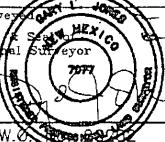

# RECEIVED

DISTRICT II

1301 W. Grand Avenue, Artesla, NM 89210

SEP 29 20 Energy, Minerals and Natural Resources Department

DISTRICT III

1000 Rio Brazos Rd. Aztec NM 87410

HOBBSQCDONSERVATION DIVISION

Submit to Appropriate District Office

State Lease - 4 Copies

Fee Lease - 3 Copies

1220 S. St. Francis Dr., Santa Fe, NM 87505

☐ AMENDED REPORT

WELL LOCATION AND ACREAGE DEDICATION PLAT

<table border=1 style='margin: auto; word-wrap: break-word;'><tr><td style='text-align: center; word-wrap: break-word;'>API Number\n30-015-36499</td><td style='text-align: center; word-wrap: break-word;'>Pool Code 0415\n96403</td><td style='text-align: center; word-wrap: break-word;'>Willow Lake Name\nWhitecat Bone Spring w\nWell Number</td></tr><tr><td style='text-align: center; word-wrap: break-word;'>Property Code\n37296</td><td style='text-align: center; word-wrap: break-word;'>Property Name\nPERDOMO &quot;BMP&quot; STATE</td><td style='text-align: center; word-wrap: break-word;'>1H</td></tr><tr><td style='text-align: center; word-wrap: break-word;'>OGRID No.\n025575</td><td style='text-align: center; word-wrap: break-word;'>Operator Name\nYATES PETROLEUM CORP.</td><td style='text-align: center; word-wrap: break-word;'>Elevation\n3149&#x27;</td></tr></table>

Surface Location

<table border=1 style='margin: auto; word-wrap: break-word;'><tr><td style='text-align: center; word-wrap: break-word;'>UL or lot No.</td><td style='text-align: center; word-wrap: break-word;'>Section</td><td style='text-align: center; word-wrap: break-word;'>Township</td><td style='text-align: center; word-wrap: break-word;'>Range</td><td style='text-align: center; word-wrap: break-word;'>Lot Idn</td><td style='text-align: center; word-wrap: break-word;'>Feet from the</td><td style='text-align: center; word-wrap: break-word;'>North/South line</td><td style='text-align: center; word-wrap: break-word;'>Feet from the</td><td style='text-align: center; word-wrap: break-word;'>East/West line</td><td style='text-align: center; word-wrap: break-word;'>County</td></tr><tr><td style='text-align: center; word-wrap: break-word;'>L</td><td style='text-align: center; word-wrap: break-word;'>24</td><td style='text-align: center; word-wrap: break-word;'>24 S</td><td style='text-align: center; word-wrap: break-word;'>27 E</td><td style='text-align: center; word-wrap: break-word;'></td><td style='text-align: center; word-wrap: break-word;'>1650</td><td style='text-align: center; word-wrap: break-word;'>SOUTH</td><td style='text-align: center; word-wrap: break-word;'>660</td><td style='text-align: center; word-wrap: break-word;'>WEST</td><td style='text-align: center; word-wrap: break-word;'>EDDY</td></tr></table>

<table border=1 style='margin: auto; word-wrap: break-word;'><tr><td colspan="2">UL or lot No.</td><td style='text-align: center; word-wrap: break-word;'>Section</td><td style='text-align: center; word-wrap: break-word;'>Township</td><td style='text-align: center; word-wrap: break-word;'>Range</td><td style='text-align: center; word-wrap: break-word;'>Lot Idn</td><td style='text-align: center; word-wrap: break-word;'>Feet from the North/South line</td><td style='text-align: center; word-wrap: break-word;'>Feet from the South</td><td style='text-align: center; word-wrap: break-word;'>East/West line</td><td style='text-align: center; word-wrap: break-word;'>County</td></tr><tr><td style='text-align: center; word-wrap: break-word;'>M</td><td style='text-align: center; word-wrap: break-word;'>25</td><td style='text-align: center; word-wrap: break-word;'>24 S</td><td style='text-align: center; word-wrap: break-word;'>27 E</td><td style='text-align: center; word-wrap: break-word;'></td><td style='text-align: center; word-wrap: break-word;'>5125</td><td style='text-align: center; word-wrap: break-word;'>SOUTH</td><td style='text-align: center; word-wrap: break-word;'>667</td><td style='text-align: center; word-wrap: break-word;'>WEST</td><td style='text-align: center; word-wrap: break-word;'>EDDY</td></tr><tr><td colspan="2">Dedicated Acres</td><td style='text-align: center; word-wrap: break-word;'>Joint or Infill</td><td colspan="2">Consolidation Code</td><td colspan="5">Order No.</td></tr><tr><td colspan="2">200</td><td style='text-align: center; word-wrap: break-word;'></td><td style='text-align: center; word-wrap: break-word;'></td><td style='text-align: center; word-wrap: break-word;'></td><td style='text-align: center; word-wrap: break-word;'></td><td style='text-align: center; word-wrap: break-word;'></td><td style='text-align: center; word-wrap: break-word;'></td><td style='text-align: center; word-wrap: break-word;'></td><td style='text-align: center; word-wrap: break-word;'></td></tr></table>

NO ALLOWABLE WILL BE ASSIGNED TO THIS COMPLETION UNTIL ALL INTERESTS HAVE BEEN CONSOLIDATED OR A NON-STANDARD UNIT HAS BEEN APPROVED BY THE DIVISION

<table border=1 style='margin: auto; word-wrap: break-word;'><tr><td style='text-align: center; word-wrap: break-word;'>OPERATOR CERTIFICATION\nI hereby certify that the information contained herein is true and complete to the best of my knowledge and belief, and that this organization either owns a working interest or unleased mineral interest in the land including the proposed bottom hole location pursuant to a contract with an owner of such a mineral or working interest, or to a voluntary posting agreement or a compulsory posting order heretofore entered by the division.</td></tr><tr><td style='text-align: center; word-wrap: break-word;'>Signature Date\nTINA HUELTA\nPrinted Name</td></tr><tr><td style='text-align: center; word-wrap: break-word;'>SURVEYOR CERTIFICATION\nI hereby certify that the well location shown on this plat was plotted from field notes of actual surveys made by me or under my supervision and that the same is true and correct to the best of my belief.</td></tr><tr><td style='text-align: center; word-wrap: break-word;'>Date Sur\nSignature\nProfession </td></tr><tr><td style='text-align: center; word-wrap: break-word;'>Certificate No. Gary L. Jones 7977\nBASIN SURVEYS</td></tr></table>