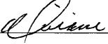
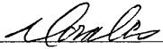

(For Division Use Only)

# APPLICATION FOR EXCEPTION TO NO-FLARE RULE 19.15.18.12 (See Rule 19.15.18.12 NMAC and Rule 19.15.7.37 NMAC)

A. Applicant  $ \underline{\text{Yates Petroleum Corporation}} $ ___,

whose address is  $ \underline{\text{105 S. 4th}} $ St., Artesia, NM 88210 _____ _____

hereby requests an exception to Rule 19.15.18.12 for  $ \underline{\text{1-2 days per month}} $ _____ until

 $ \underline{\text{February 1}} $____, Yr  $ \underline{\text{2012}} $____, for the following described tank battery (or LACT):

30-015-36499

Name of Lease Perdomo BMP State Com #1H Name of Pool Bone Springs ___

Location of Battery: Unit Letter  $ \underline{L} $____ Section  $ \underline{24} $____ Township  $ \underline{24S} $____ Range  $ \underline{27E} $____ Number of wells producing into battery  $ \underline{1} $____

B. Based upon oil production of  $ \underline{5}} $ approx. _____ barrels per day, the estimated * volume of gas to be flared is  $ \underline{550} $ approx _____ MCF; Value _____ per day.

C. Name and location of nearest gas gathering facility:

CP

D. Distance  $ \underline{0.5} $ mi. approx Estimated cost of connection _____

E. This exception is requested for the following reasons:  $ \underline{\text{Due to CO2 content, DCP plant is unable to accept gas until additional equipment is installed. Under Rule 19.15.18.12.B. we are requesting this periodic flaring to prevent undue hardship in regards to lease agreement.}} $

OPERATOR

I hereby certify that the rules and regulations of the Oil Conservation Division have been complied with and that the information given above is true and complete to the best of my knowledge and belief.

Signature

Printed Name

& Title  $ \underline{\text{Miriam Morales- Production Analyst}} $

E-mail Address  $ \underline{\text{mmorales@yatespetroleum.com}} $

Approved Until  $ \underline{\text{Feb 1-2012}} $

OIL CONSERVATION DIVISION

By R.D.

Date 9/28/11

Title D157 E7 Superw-

Date Oct 24-2010