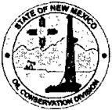

# State of New Mexico Energy, Minerals and Natural Resources Department

Susana Martinez

Governor

David Martin

Cabinet Secretary

David Catanach

Division Director

Oil Conservation Division

Tony Delfin

Deputy Cabinet Secretary

FOR IMMEDIATE RELEASE

Contact: Jim Winchester (505)231-8800 E-Mail: jim.winchester@state.nm.us

## Notice to Oil and Gas Facilities and Operators Flaring Gas in New Mexico

SANTA FE, NM – The Oil Conservation Division (OCD) encourages all oil and gas facilities with flare stacks and well operators that are flaring gas to upgrade their Fire Awareness Programs this year. New Mexico State Forestry reports that 460 fires have burned 25,475 acres on state and private land in calendar year 2012.

Forecasts remain dismal this spring with fewer chances for normal precipitation, particularly in southwestern New Mexico and southeastern Arizona. Temperatures could also be higher than normal.

Open flames and gas flares should be monitored carefully and oil and gas operators should create a defensible space to help prevent wildfires. Defensible Space is the area around a structure where combustible vegetation that can spread fire has been cleared, reduced or replaced. This space acts as a barrier between a structure and an advancing wildfire.

During the course of the upcoming fire season, it may become necessary for New Mexico State Forestry to issue fire restriction on State and private land. Log on to  $ \underline{\text{www.nmforestry.com}} $ for updates or call your local district office.

New Mexico State Forestry offers the following guidelines for establishing effective defensible space:

- Create a "Lean, Clean and Green" firebreak area by removing flammable vegetation and growth within 30 feet of each structure. Single trees and shrubs may be retained if they are well spaced, pruned and placed so they avoid the spread of fire. Maintain an irrigation system for any vegetation near structures.

• Keep grass and weeds mowed.

• Prune lower tree limbs to at least 6 feet up to 15 feet (or lower 1/3 of branches on smaller trees).

- Remove vegetation and debris around propane tanks.

For the latest fire weather information please visit USDA Forest Service website: http://activefiremaps.fs.fed.us/current.php

###

The Energy, Minerals and Natural Resources Department provides resource protection and renewable energy resource development services to the public and other state agencies.