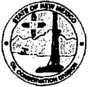

# State of New Mexico Energy, Minerals and Natural Resources Department

Susana Martínez

Governor

David Martin

Cabinet Secretary

David R. Catanach, Division Director Oil Conservation Division

Tony Delfin

Deputy Cabinet Secretary

## NOTICE TO OPERATORS

The Oil Conservation Division ("OCD") has been tasked to study flaring and develop a gas capture plan by the end of the year with the ultimate goal to reduce natural gas emissions.

Current OCD reporting has no specific method to differentiate flared and vented volumes reported on C-115 reports. This prevents the OCD from having quantifiable flaring data per Rule 19.15.18.12.F NMAC.

Therefore, to collect flaring volumes and differentiate actual vented volumes going forward, NMOCD will implement a new "Non-Transported Disposition" Code (for gas) to be reported on the C-115 reports. The new code will be "F" for Flared. The new code "F" is to be used to report the volume of gas that is flared on a well basis, or total volume if flared at a common battery or gathering system and reported under one point of disposition. Operators must report vented and flared volumes separately to their respective "Non Transported Disposition" code ("V" for vented and "F" for flared).

The change will become effective for the November 2015 production month with reporting due by January 15, 2016.

The NMOCD will be conducting operator outreach training sessions in the Southeast and Northwest to provide information and answer questions regarding the process.

Meeting notices will be posted on NMOCD website at: http://www.emnrd.state.nm.us/OCD/announcements.html

The C-115 instructions are available on NMOCD website at: http://www.emnrd.state.nm.us/OCD/documents/eC115_FullInstructions.pdf