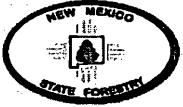

Susana Martinez Governor

Ken McQueen

Cabinet Secretary

Donald Griego, State Forester Forestry Division

Matthias Sayer

Deputy Cabinet Secretary

May 30, 2018

News Release

Contact: Wendy Mason 505-476-3209, wendy.mason@state.nm.us

Beth Wojahn 505-476-3226, beth.wojahn@state.nm.us

## Energy, Minerals and Natural Resources Department Cabinet Secretary and State Forester Announce Fire Restrictions on All State Lands in New Mexico

SANTA FE, NM – New Mexico Energy, Minerals and Natural Resources Secretary Ken McQueen and State Forester Donald Griego today announced restrictions on fireworks, smoking, campfires and open fires on all state-owned land, as incidences of wildfires increase. Fire danger throughout the state is high due to warm temperatures, low humidity, high winds, and the abundance of dry, fine fuels. The restrictions will go into effect at 12:01 a.m. on Friday, June 1, 2018 and remain in effect until further notice on all state lands.

"We're urging all New Mexicans to follow the restriction guidelines on state lands and to be vigilant on their own private land to help protect lives and property from wildfire in their communities," said State Forester Donald Griego. "We also encourage local municipalities and counties to consider necessary and appropriate restrictions for their area if they haven't done so already."

State Forestry will continue to coordinate with other jurisdictions including federal, counties and municipalities to ensure that appropriate protections are in place as fire danger and wildfires increase.

SMOKING, FIREWORKS, CAMPFIRES, OPEN BURNING, AND OPEN FIRES ARE PROHIBITED ON STATE-OWNED LAND UNLESS THE FOLLOWING CONDITIONS ARE MET:

Smoking is prohibited except in enclosed buildings, within vehicles equipped with ashtrays, and on paved or surfaced roads, developed recreation sites, or while stopped in an area at least three feet in diameter that is barren or cleared of all flammable material.

Fireworks use is prohibited on lands covered wholly or in part in timber, brush, grass, grain, or other flammable vegetation. The State Forester is allowing exceptions to the ban on fireworks where they are a part of a public exhibit approved by the local fire department.

Campfires are prohibited unless the following exceptions are met. An exception is granted where cooking or heating devices use kerosene, white gas, or propane as a fuel in an improved camping area that is cleared of flammable vegetation for at least 30 feet or has a water source. New Mexico