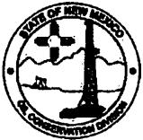

Susana Martinez Governor

David Martin

Cabinet Secretary

Heather Riley, Division Director

Oil Conservation Division

Brett F. Woods, Ph.D.

Deputy Cabinet Secretary

March 6, 2018

FOR IMMEDIATE RELEASE

Contact: Beth Wojahn (505) 476-3226 E-Mail:  $ \underline{\text{Beth.Wojahn@state.nm.us}} $

## Notice to Oil and Gas Facilities and Operators Flaring Gas in New Mexico

SANTA FE, NM – The Oil Conservation Division (OCD) encourages all oil and gas facilities with flare stacks and well operators that are flaring gas to upgrade their Fire Awareness Programs this year. New Mexico State Forestry reports that 370 fires burned 33,154 acres on state and private land in calendar year 2017.

Open flames and gas flares should be monitored carefully and oil and gas operators should create a defensible space to help prevent wildfires. Defensible Space is the area around a structure where combustible vegetation that can spread fire has been cleared, reduced or replaced. This space acts as a barrier between a structure and an advancing wildfire.

This means that as a general rule of thumb, the area around staffed flaring facilities should be mowed and maintained at a length not to exceed 4 inches and all other flammable products or debris should be cleared in the area for a distance of at least one and one half times the height of the stack.

If flaring is to take place at an unstaffed facility, then the mowed area around the flare stack should be increased to three times the height of the stack. On “red flag” days local fire departments should be notified prior to the flaring operations.

During the course of the upcoming fire season, it may become necessary for New Mexico State Forestry to issue fire restrictions on State and private land. Log on to  $ \underline{\text{www.nmforestry.com}} $ for updates or to get information on how contact your local State Forestry District office. For the latest fire weather information please visit USDA Forest Service website:

http://gacc.nifc.gov/swcc/predictive/outlooks/monthly/swa_monthly.pdf

The Energy, Minerals and Natural Resources Department provides resource protection and renewable energy resource development services to the public and other state agencies.