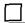

Form C-103

October 13, 2009

12. Check Appropriate Box to Indicate Nature of Notice, Report or Other Data

NOTICE OF INTENTION TO:

SUBSEQUENT REPORT OF:

TEMPORARILY ABANDON

☐ CHANGE PLANS

PULL OR ALTER CASING

□ ALTERING CASING □

□ MULTIPLE COMPL

DOWNHOLE COMMINGLE

 $ \underline{\text{OTHER}} $:

13. Describe proposed or completed operations. (Clearly state all pertinent details, and give pertinent dates, including estimated date of starting any proposed work). SEE RULE 19.15.7.14 NMAC. For Multiple Completions: Attach wellbore diagram of proposed completion or recompletion.

6/11/10 - Set 40' of 20" conductor at 1:30 PM. Notified Mike Bratch NMOCD-Artesia of operations.

with

Spud Date:

2/1/10

Rig Release Date:

I hereby certify that the information above is true and complete to the best of my knowledge and belief.

SIGNATURE

For State Use Only

APPROVED BY: ___ TITLE ___ DATE ___

Conditions of Approval (if any):

102