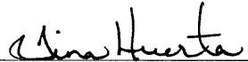

## Form C-105 continued:

<table border=1 style='margin: auto; word-wrap: break-word;'><tr><td colspan="3">26. Perforation Record (interval, size and number)</td></tr><tr><td style='text-align: center; word-wrap: break-word;'>10,434&#x27; (9)</td><td style='text-align: center; word-wrap: break-word;'>8334&#x27; (9)</td><td style='text-align: center; word-wrap: break-word;'></td></tr><tr><td style='text-align: center; word-wrap: break-word;'>10,284&#x27; (9)</td><td style='text-align: center; word-wrap: break-word;'>8184&#x27; (9)</td><td style='text-align: center; word-wrap: break-word;'></td></tr><tr><td style='text-align: center; word-wrap: break-word;'>10,134&#x27; (9)</td><td style='text-align: center; word-wrap: break-word;'>8034&#x27; (9)</td><td style='text-align: center; word-wrap: break-word;'></td></tr><tr><td style='text-align: center; word-wrap: break-word;'>9984&#x27; (9)</td><td style='text-align: center; word-wrap: break-word;'>7884&#x27; (9)</td><td style='text-align: center; word-wrap: break-word;'></td></tr><tr><td style='text-align: center; word-wrap: break-word;'>9834&#x27; (9)</td><td style='text-align: center; word-wrap: break-word;'>7734&#x27; (9)</td><td style='text-align: center; word-wrap: break-word;'></td></tr><tr><td style='text-align: center; word-wrap: break-word;'>9684&#x27; (9)</td><td style='text-align: center; word-wrap: break-word;'>7584&#x27; (9)</td><td style='text-align: center; word-wrap: break-word;'></td></tr><tr><td style='text-align: center; word-wrap: break-word;'>9534&#x27; (9)</td><td style='text-align: center; word-wrap: break-word;'>7434&#x27; (9)</td><td style='text-align: center; word-wrap: break-word;'></td></tr><tr><td style='text-align: center; word-wrap: break-word;'>9384&#x27; (9)</td><td style='text-align: center; word-wrap: break-word;'>7284&#x27; (9)</td><td style='text-align: center; word-wrap: break-word;'></td></tr><tr><td style='text-align: center; word-wrap: break-word;'>9234&#x27; (9)</td><td style='text-align: center; word-wrap: break-word;'>7134&#x27; (9)</td><td style='text-align: center; word-wrap: break-word;'></td></tr><tr><td style='text-align: center; word-wrap: break-word;'>9084&#x27; (9)</td><td style='text-align: center; word-wrap: break-word;'>6984&#x27; (9)</td><td style='text-align: center; word-wrap: break-word;'></td></tr><tr><td style='text-align: center; word-wrap: break-word;'>8934&#x27; (9)</td><td style='text-align: center; word-wrap: break-word;'>6834&#x27; (9)</td><td style='text-align: center; word-wrap: break-word;'></td></tr><tr><td style='text-align: center; word-wrap: break-word;'>8734&#x27; (9)</td><td style='text-align: center; word-wrap: break-word;'>6684&#x27; (9)</td><td style='text-align: center; word-wrap: break-word;'></td></tr><tr><td style='text-align: center; word-wrap: break-word;'>8634&#x27; (9)</td><td style='text-align: center; word-wrap: break-word;'>6534&#x27; (9)</td><td style='text-align: center; word-wrap: break-word;'></td></tr><tr><td style='text-align: center; word-wrap: break-word;'>8484&#x27; (9)</td><td style='text-align: center; word-wrap: break-word;'>6384&#x27; (9)</td><td style='text-align: center; word-wrap: break-word;'></td></tr></table>

<table border=1 style='margin: auto; word-wrap: break-word;'><tr><td colspan="2">27. Acid, Shot, Fracture, Cement, Squeeze, Etc.</td></tr><tr><td style='text-align: center; word-wrap: break-word;'>Depth Interval</td><td style='text-align: center; word-wrap: break-word;'>Amount and Kind Material Used</td></tr><tr><td style='text-align: center; word-wrap: break-word;'>9984&#x27;-10,434&#x27;</td><td style='text-align: center; word-wrap: break-word;'>Frac with a 30# borate gel, pumped 66,508# Ottawa 40/70, 73,044# Super LC 20/40, 38,655# into formation</td></tr><tr><td style='text-align: center; word-wrap: break-word;'>9854&#x27;</td><td style='text-align: center; word-wrap: break-word;'>Spotted 1500g 7-1/2% HCL acid</td></tr><tr><td style='text-align: center; word-wrap: break-word;'>9384&#x27;-9834&#x27;</td><td style='text-align: center; word-wrap: break-word;'>Frac with a 30# borate gel, pumped 1500g 7-1/2% HCL acid, 59,417# Ottawa 40/70, 120,000# Ottawa 20/40, 80,000# Super LC 20/40</td></tr><tr><td style='text-align: center; word-wrap: break-word;'>9250&#x27;</td><td style='text-align: center; word-wrap: break-word;'>Spotted 1500g 7-1/2% HCL acid</td></tr><tr><td style='text-align: center; word-wrap: break-word;'>8734&#x27;-9234&#x27;</td><td style='text-align: center; word-wrap: break-word;'>Frac with a 30# borate gel, pumped 1500g 7-1/2% HCL acid, 65,013# 40/70, 124,965# Ottawa 20/40, 78,743# Super LC 20/40</td></tr><tr><td style='text-align: center; word-wrap: break-word;'>8654&#x27;</td><td style='text-align: center; word-wrap: break-word;'>Spotted 1500g 7-1/2% HCL acid</td></tr><tr><td style='text-align: center; word-wrap: break-word;'>8184&#x27;-8634&#x27;</td><td style='text-align: center; word-wrap: break-word;'>Frac with a 30# borate gel, pumped 1500g 7-1/2% HCL acid, 64,803# Ottawa 40/70, 122,448# Ottawa 20/40, 81,814# Super LC 20/40</td></tr><tr><td style='text-align: center; word-wrap: break-word;'>8054&#x27;</td><td style='text-align: center; word-wrap: break-word;'>Spotted 1500g 7-1/2% HCL acid</td></tr><tr><td style='text-align: center; word-wrap: break-word;'>7584&#x27;-8034&#x27;</td><td style='text-align: center; word-wrap: break-word;'>Frac with a 30# borate gel, pumped 1500g 7-1/2% HCL acid, 62,996# Ottawa 40/70, 118,657# Ottawa 20/40, 81,550# Super LC 20/40</td></tr><tr><td style='text-align: center; word-wrap: break-word;'>7454&#x27;</td><td style='text-align: center; word-wrap: break-word;'>Spotted 1500g 7-1/2% HCL acid</td></tr><tr><td style='text-align: center; word-wrap: break-word;'>6984&#x27;-7434&#x27;</td><td style='text-align: center; word-wrap: break-word;'>Frac with a 30# borate gel, pumped 1500g 7-1/2% HCL acid, 62,528# Ottawa 40/70, 118,125# Ottawa 20/40, 82,525# Super LC 20/40</td></tr><tr><td style='text-align: center; word-wrap: break-word;'>6854&#x27;</td><td style='text-align: center; word-wrap: break-word;'>Spotted 1500g 7-1/2% HCL acid</td></tr><tr><td style='text-align: center; word-wrap: break-word;'>6384&#x27;-6834&#x27;</td><td style='text-align: center; word-wrap: break-word;'>Frac with a 30# borate gel, pumped 1500g 7-1/2% HCL acid, 23,248# Ottawa 40/70, 91,828# Ottawa 20/40, 71,106# Super LC 20/40</td></tr></table>

Regulatory Compliance Supervisor

October 15, 2010