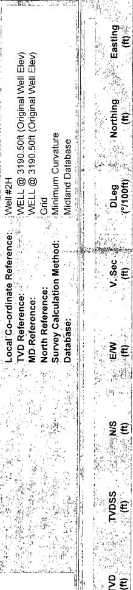
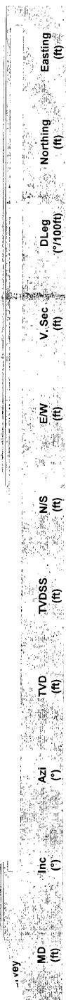

<table border=1 style='margin: auto; word-wrap: break-word;'><tr><td style='text-align: center; word-wrap: break-word;'>Company:</td><td style='text-align: center; word-wrap: break-word;'>Yates Petroleum Corp.</td><td style='text-align: center; word-wrap: break-word;'></td><td style='text-align: center; word-wrap: break-word;'>Local Co-ordinate Reference:</td><td style='text-align: center; word-wrap: break-word;'>Well #2H</td></tr><tr><td style='text-align: center; word-wrap: break-word;'>Project:</td><td style='text-align: center; word-wrap: break-word;'>Eddy County</td><td style='text-align: center; word-wrap: break-word;'></td><td style='text-align: center; word-wrap: break-word;'>TVD Reference:</td><td style='text-align: center; word-wrap: break-word;'>WELL @ 3190.50ft (Original Well Elev)</td></tr><tr><td style='text-align: center; word-wrap: break-word;'>Site:</td><td style='text-align: center; word-wrap: break-word;'>Jericho &quot;BKJ&quot; State Com</td><td style='text-align: center; word-wrap: break-word;'></td><td style='text-align: center; word-wrap: break-word;'>MD Reference:</td><td style='text-align: center; word-wrap: break-word;'>WELL @ 3190.50ft (Original Well Elev)</td></tr><tr><td style='text-align: center; word-wrap: break-word;'>Well:</td><td style='text-align: center; word-wrap: break-word;'>#2H</td><td style='text-align: center; word-wrap: break-word;'></td><td style='text-align: center; word-wrap: break-word;'>North Reference:</td><td style='text-align: center; word-wrap: break-word;'>Grid</td></tr><tr><td style='text-align: center; word-wrap: break-word;'>Wellbore:</td><td style='text-align: center; word-wrap: break-word;'>OH</td><td style='text-align: center; word-wrap: break-word;'></td><td style='text-align: center; word-wrap: break-word;'>Survey Calculation Method:</td><td style='text-align: center; word-wrap: break-word;'>Minimum Curvature</td></tr><tr><td style='text-align: center; word-wrap: break-word;'>Design:</td><td style='text-align: center; word-wrap: break-word;'>OH</td><td style='text-align: center; word-wrap: break-word;'></td><td style='text-align: center; word-wrap: break-word;'>Database:</td><td style='text-align: center; word-wrap: break-word;'>Midland Database</td></tr></table>

07/12/2010 8:21:59AM

COMPASS 2003.16 Build 71