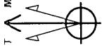
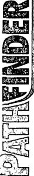

<table border=1 style='margin: auto; word-wrap: break-word;'><tr><td colspan="4">Lease Line</td></tr></table>

<table border=1 style='margin: auto; word-wrap: break-word;'><tr><td style='text-align: center; word-wrap: break-word;'>Sec</td><td style='text-align: center; word-wrap: break-word;'>MD</td><td style='text-align: center; word-wrap: break-word;'>Inc</td><td style='text-align: center; word-wrap: break-word;'>Azi</td><td style='text-align: center; word-wrap: break-word;'>TVD</td><td colspan="7">SECTION DETAILS</td></tr><tr><td style='text-align: center; word-wrap: break-word;'>1</td><td style='text-align: center; word-wrap: break-word;'>5669.00</td><td style='text-align: center; word-wrap: break-word;'>0.64</td><td style='text-align: center; word-wrap: break-word;'>108.28</td><td style='text-align: center; word-wrap: break-word;'>5667.94</td><td style='text-align: center; word-wrap: break-word;'>+N/-S</td><td style='text-align: center; word-wrap: break-word;'>+E/-W</td><td style='text-align: center; word-wrap: break-word;'>DLeg</td><td style='text-align: center; word-wrap: break-word;'>TFace</td><td style='text-align: center; word-wrap: break-word;'>VSec</td><td style='text-align: center; word-wrap: break-word;'>Target</td><td style='text-align: center; word-wrap: break-word;'></td></tr><tr><td style='text-align: center; word-wrap: break-word;'>2</td><td style='text-align: center; word-wrap: break-word;'>6423.33</td><td style='text-align: center; word-wrap: break-word;'>90.00</td><td style='text-align: center; word-wrap: break-word;'>270.22</td><td style='text-align: center; word-wrap: break-word;'>6150.00</td><td style='text-align: center; word-wrap: break-word;'>8.93</td><td style='text-align: center; word-wrap: break-word;'>-2.47</td><td style='text-align: center; word-wrap: break-word;'>0.00</td><td style='text-align: center; word-wrap: break-word;'>0.00</td><td style='text-align: center; word-wrap: break-word;'>2.52</td><td style='text-align: center; word-wrap: break-word;'></td><td style='text-align: center; word-wrap: break-word;'></td></tr><tr><td style='text-align: center; word-wrap: break-word;'>3</td><td style='text-align: center; word-wrap: break-word;'>10587.99</td><td style='text-align: center; word-wrap: break-word;'>90.00</td><td style='text-align: center; word-wrap: break-word;'>270.22</td><td style='text-align: center; word-wrap: break-word;'>6150.00</td><td style='text-align: center; word-wrap: break-word;'>9.09</td><td style='text-align: center; word-wrap: break-word;'>-479.43</td><td style='text-align: center; word-wrap: break-word;'>12.01</td><td style='text-align: center; word-wrap: break-word;'>161.93</td><td style='text-align: center; word-wrap: break-word;'>479.47</td><td style='text-align: center; word-wrap: break-word;'></td><td style='text-align: center; word-wrap: break-word;'></td></tr><tr><td style='text-align: center; word-wrap: break-word;'></td><td style='text-align: center; word-wrap: break-word;'></td><td style='text-align: center; word-wrap: break-word;'></td><td style='text-align: center; word-wrap: break-word;'></td><td style='text-align: center; word-wrap: break-word;'></td><td style='text-align: center; word-wrap: break-word;'>25.08</td><td style='text-align: center; word-wrap: break-word;'>-4644.06</td><td style='text-align: center; word-wrap: break-word;'>0.00</td><td style='text-align: center; word-wrap: break-word;'>0.00</td><td style='text-align: center; word-wrap: break-word;'>4644.13</td><td style='text-align: center; word-wrap: break-word;'>PBHL(JSC#2H)</td><td style='text-align: center; word-wrap: break-word;'></td></tr></table>

<table border=1 style='margin: auto; word-wrap: break-word;'><tr><td colspan="7">WELLBORE TARGET DETAILS (MAP CO-ORDINATES)</td></tr><tr><td style='text-align: center; word-wrap: break-word;'>Name PBHL(JSC#2H)</td><td style='text-align: center; word-wrap: break-word;'>TVD 6150.00</td><td style='text-align: center; word-wrap: break-word;'>+N/-S 25.06</td><td style='text-align: center; word-wrap: break-word;'>+E/-W -4644.06</td><td style='text-align: center; word-wrap: break-word;'>Northing 413105.285</td><td style='text-align: center; word-wrap: break-word;'>Easting 587035.283</td><td style='text-align: center; word-wrap: break-word;'>Shape Point</td></tr></table>

<table border=1 style='margin: auto; word-wrap: break-word;'><tr><td colspan="7">WELL DETAILS: #2H</td></tr><tr><td style='text-align: center; word-wrap: break-word;'></td><td style='text-align: center; word-wrap: break-word;'>Ground Elevation:</td><td style='text-align: center; word-wrap: break-word;'>3172.00\nRKB Elevation:</td><td colspan="4">WELL @ 3190.50ft (Original Well Elev\nRig Name: Original Well Elev</td></tr><tr><td style='text-align: center; word-wrap: break-word;'>+N/-S</td><td style='text-align: center; word-wrap: break-word;'>+E/-W</td><td style='text-align: center; word-wrap: break-word;'>0.00</td><td style='text-align: center; word-wrap: break-word;'>413080.221</td><td style='text-align: center; word-wrap: break-word;'>Easting</td><td style='text-align: center; word-wrap: break-word;'>Latitude</td><td style='text-align: center; word-wrap: break-word;'>Longitude</td></tr><tr><td style='text-align: center; word-wrap: break-word;'>0.00</td><td style='text-align: center; word-wrap: break-word;'></td><td style='text-align: center; word-wrap: break-word;'></td><td style='text-align: center; word-wrap: break-word;'></td><td style='text-align: center; word-wrap: break-word;'>591679.342</td><td style='text-align: center; word-wrap: break-word;'>32° 8′ 7.915 N</td><td style='text-align: center; word-wrap: break-word;'>104° 10′ 14.500 W</td></tr></table>

# /ertical Section at 270.31° (200 ft/in)

South(-)/North(+) (200 ft/in)

<table border=1 style='margin: auto; word-wrap: break-word;'><tr><td style='text-align: center; word-wrap: break-word;'>5600</td><td style='text-align: center; word-wrap: break-word;'>0000000000000000000000000000000000000000000000000000000000000000000000000000000000000000000000000000000000000000000000000000000000000000000000000000000000000000000000000000000000000000000000000000000000000000000000000000000000000000000000000000000000000000000000000000000000000000000000000000000000000000000000000000000000000000000000000000000000000000000000000000000000000000000000000000000000000000000000000000000000000000000000000000000000000000000000000000000000000000000000000000000000000000000000000000000000000000000000000000000000000000000000000000000000000000000000000000000000000000000000000000000000000000000000000000000000000000000000000000000000000000000000000000000000000000000000000000000000000000000000000000000000000000000000000000000000000000000000000000000000000000000000000000000000000000000000000000000000000000000000000000000000000000000000000000000000000000000000000000000000000000000000000000000000000000000000000000000000000000000000000000000000000000000000000000000000000000000000000000000000000000000000000000000000000000000000000000000000000000000000000000000000000000000000000000000000000000000000000000000000000000000000000000000000000000000000000000000000000000000000000000000000000000000000000000000000000000000000000000000000000000000000000000000000000000000000000000000000000000000000000000000000000000000000000000000000000000000000000000000000000000000000000000000000000000000000000000000000000000000000000000000000000000000000000000000000000000000000000000000000000000000000000000000000000000000000000000000000000000000000000000000000000000000000000000000000000000000000000000000000000000000000000000000000000000000000000000000000000000000000000000000000000000000000000000000000000000000000000000000000000000000000000000000000000000000000000000000000000000000000000000000000000000000000000000000000000000000000000000000000000000000000000000000000000000000000000000000000000000000000000000000000000000000000000000000000000000000000000000000000000000000000000000000000000000000000000000000000000000000000000000000000000000000000000000000000000000000000000000000000000000000000000000000000000000000000000000000000000000000000000000000000000000000000000000000000000000000000000000000000000000000000000000000000000000000000000000000000000000000000000000000000000000000000000000000000000000000000000000000000000000000000000000000000000000000000000000000000000000000000000000000000000000000000000000000000000000000000000000000000000000000000000000000000000000000000000000000000000000000000000000000000000000000000000000000000000000000000000000000000000000000000000000000000000000000000000000000000000000000000000000000000000000000000000000000000000000000000000000000000000000000000000000000000000000000000000000000000000000000000000000000000000000000000000000000000000000000000000000000000000000000000000000000000000000000000000000000000000000000000000000000000000000000000000000000000000000000000000000000000000000000000000000000000000000000000000000000000000000000000000000000000000000000000000000000000000000000000000000000000000000000000000000000000000000000000000000000000000000000000000000000000000000000000000000000000000000000000000000000000000000000000000000000000000000000000000000000000000000000000000000000000000000000000000000000000000000000000000000000000000000000000000000000000000000000000000000000000000000000000000000000000000000000000000000000000000000000000000000000000000000000000000000000000000000000000000000000000000000000000000000000000000000000000000000000000000000000000000000000000000000000000000000000000000000000000000000000000000000000000000000000000000000000000000000000000000000000000000000000000000000000000000000000000000000000000000000000000000000000000000000000000000000000000000000000000000000000000000000000000000000000000000000000000000000000000000000000000000000000000000000000000000000000000000000000000000000000000000000000000000000000000000000000000000000000000000000000000000000000000000000000000000000000000000000000000000000000000000000000000000000000000000000000000000000000000000000000000000000000000000000000000</td></tr></table>

:t(-)/East(+) (200 ft/in)

<one: New Mexico Eastern System Datum: Mean Sea Level Local North Grid

Model: IGRF2010

Zone: New Mexico Eastern Zone

Dip Angle:  $ 60.02^{\circ} $

Datum: NORTH ALIER

Ellipsoid: GRS 1980

Strength: 48594.4snT

Datum: North American Datum 1983

Magnetic Field

Magnetic North: 7.88°

PROJECT DETAILS: Eddy County

Plan: Plan #2 (#2H/OH)

Wellbore: OH

Well: #2H

Azimuths to Grid North

N

Site: Jericho "BKJ" State Com

G

Project: Eddy County

