# Page 1

# State of New Mexico Energy, Minerals and Natural Resources Oil Conservation Division 1220 S. St Francis Dr. Santa Fe, NM 87505

APPLICATION FOR PERMIT TO DRILL, RE-ENTER, DEEPEN, PLUGBACK, OR ADD A ZONE

<table border=1 style='margin: auto; word-wrap: break-word;'><tr><td rowspan="2">1. Operator Name and Address YATES PETROLEUM CORPORATION 105 S 4TH ST ARTESIA , NM 88210</td><td style='text-align: center; word-wrap: break-word;'>2. OGRID Number 25575</td></tr><tr><td style='text-align: center; word-wrap: break-word;'>3. API Number 30-015-37500</td></tr><tr><td style='text-align: center; word-wrap: break-word;'>4. Property Code 36591</td><td style='text-align: center; word-wrap: break-word;'>5. Property Name 002H</td></tr></table>

7. Surface Location

<table border=1 style='margin: auto; word-wrap: break-word;'><tr><td style='text-align: center; word-wrap: break-word;'>UL - Lot A</td><td style='text-align: center; word-wrap: break-word;'>Section 15</td><td style='text-align: center; word-wrap: break-word;'>Township 25S</td><td style='text-align: center; word-wrap: break-word;'>Range 27E</td><td style='text-align: center; word-wrap: break-word;'>Lot Idn A</td><td style='text-align: center; word-wrap: break-word;'>Feet From 660</td><td style='text-align: center; word-wrap: break-word;'>N/S Line N</td><td style='text-align: center; word-wrap: break-word;'>Feet From 330</td><td style='text-align: center; word-wrap: break-word;'>E/W Line E</td><td style='text-align: center; word-wrap: break-word;'>County EDDY</td></tr></table>

8. Pool Information

Undesignated Bone Spring

Additional Well Information

<table border=1 style='margin: auto; word-wrap: break-word;'><tr><td style='text-align: center; word-wrap: break-word;'>9. Work Type\nNew Well</td><td style='text-align: center; word-wrap: break-word;'>10. Well Type\nOIL</td><td style='text-align: center; word-wrap: break-word;'>11. Cable/Rotary</td><td style='text-align: center; word-wrap: break-word;'>12. Lease Type\nState</td><td style='text-align: center; word-wrap: break-word;'>13. Ground Level Elevation\n3172</td></tr><tr><td style='text-align: center; word-wrap: break-word;'>14. Multiple\nN</td><td style='text-align: center; word-wrap: break-word;'>15. Proposed Depth\n11375</td><td style='text-align: center; word-wrap: break-word;'>16. Formation\nBone Spring</td><td style='text-align: center; word-wrap: break-word;'>17. Contractor</td><td style='text-align: center; word-wrap: break-word;'>18. Spud Date\n2/1/2010</td></tr><tr><td colspan="2">Depth to Ground water</td><td colspan="2">Distance from nearest fresh water well</td><td style='text-align: center; word-wrap: break-word;'>Distance to nearest surface water</td></tr><tr><td style='text-align: center; word-wrap: break-word;'>Pit: Liner Synthetic Closed Loop System</td><td style='text-align: center; word-wrap: break-word;'>mils thick Clay</td><td style='text-align: center; word-wrap: break-word;'>Pit Volume:</td><td style='text-align: center; word-wrap: break-word;'>bbls Drilling Method:\nFresh Water Brine</td><td style='text-align: center; word-wrap: break-word;'>Diesel Oil-based Gas/Air</td></tr></table>

19. Proposed Casing and Cement Program

<table border=1 style='margin: auto; word-wrap: break-word;'><tr><td style='text-align: center; word-wrap: break-word;'>Type</td><td style='text-align: center; word-wrap: break-word;'>Hole Size</td><td style='text-align: center; word-wrap: break-word;'>Casing Type</td><td style='text-align: center; word-wrap: break-word;'>Casing Weight/ft</td><td style='text-align: center; word-wrap: break-word;'>Setting Depth</td><td style='text-align: center; word-wrap: break-word;'>Sacks of Cement</td><td style='text-align: center; word-wrap: break-word;'>Estimated TOC</td></tr><tr><td style='text-align: center; word-wrap: break-word;'>Surf</td><td style='text-align: center; word-wrap: break-word;'>17.5</td><td style='text-align: center; word-wrap: break-word;'>13.375</td><td style='text-align: center; word-wrap: break-word;'>48</td><td style='text-align: center; word-wrap: break-word;'>400</td><td style='text-align: center; word-wrap: break-word;'>425</td><td style='text-align: center; word-wrap: break-word;'>0</td></tr><tr><td style='text-align: center; word-wrap: break-word;'>Int1</td><td style='text-align: center; word-wrap: break-word;'>12.25</td><td style='text-align: center; word-wrap: break-word;'>9.625</td><td style='text-align: center; word-wrap: break-word;'>36</td><td style='text-align: center; word-wrap: break-word;'>2400</td><td style='text-align: center; word-wrap: break-word;'>825</td><td style='text-align: center; word-wrap: break-word;'>0</td></tr><tr><td style='text-align: center; word-wrap: break-word;'>Prod</td><td style='text-align: center; word-wrap: break-word;'>7.875</td><td style='text-align: center; word-wrap: break-word;'>5.5</td><td style='text-align: center; word-wrap: break-word;'>17</td><td style='text-align: center; word-wrap: break-word;'>11375</td><td style='text-align: center; word-wrap: break-word;'>2075</td><td style='text-align: center; word-wrap: break-word;'>1900</td></tr></table>

Casing/Cement Program: Additional Comments

H2S is not anticipated for this well.

Proposed Blowout Prevention Program

<table border=1 style='margin: auto; word-wrap: break-word;'><tr><td style='text-align: center; word-wrap: break-word;'>Type</td><td style='text-align: center; word-wrap: break-word;'>Working Pressure</td><td style='text-align: center; word-wrap: break-word;'>Test Pressure</td><td style='text-align: center; word-wrap: break-word;'>Manufacturer</td></tr><tr><td style='text-align: center; word-wrap: break-word;'>DoubleRam</td><td style='text-align: center; word-wrap: break-word;'>3000</td><td style='text-align: center; word-wrap: break-word;'>3000</td><td style='text-align: center; word-wrap: break-word;'></td></tr></table>

<table border=1 style='margin: auto; word-wrap: break-word;'><tr><td rowspan="2">I hereby certify that the information given above is true and complete to the best of my knowledge and belief. I further certify that the drilling pit will be constructed according to NMOCD guidelines, a general permit, or an (attached) alternative OCD-approved plan.</td><td colspan="2">OIL CONSERVATION DIVISION</td></tr><tr><td colspan="2">Approved By: Jacqueta Reeves</td></tr><tr><td style='text-align: center; word-wrap: break-word;'>Printed Name: Electronically filed by Monti Sanders</td><td colspan="2">Title: District Geologist</td></tr><tr><td style='text-align: center; word-wrap: break-word;'>Title:</td><td style='text-align: center; word-wrap: break-word;'>Approved Date: 1/19/2010</td><td style='text-align: center; word-wrap: break-word;'>Expiration Date: 1/19/2012</td></tr><tr><td style='text-align: center; word-wrap: break-word;'>Email Address: montis@yatespetroleum.com</td><td colspan="2"></td></tr><tr><td style='text-align: center; word-wrap: break-word;'>Date: 1/6/2010</td><td style='text-align: center; word-wrap: break-word;'>Phone: 575-748-4244</td><td style='text-align: center; word-wrap: break-word;'></td></tr></table>

# Page 2

## District I

1625 N. French Dr., Hobbs, NM 88240

Phone: (505) 393-6161 Fax: (505) 393-0720

## District II

1301 W. Grand Ave., Artesia, NM 88210 Phone: (505) 748-1283 Fax: (505) 748-9720

## District III

1000 Rio Brazos Rd., Aztec, NM 87410

Phone: (505) 334-6178 Fax: (505) 334-6170

## District IV

1220 S. St Francis Dr., Santa Fe, NM 87505

Phone: (505) 476-3470 Fax: (505) 476-3462

WELL LOCATION AND ACREAGE DEDICATION PLAT

<table border=1 style='margin: auto; word-wrap: break-word;'><tr><td style='text-align: center; word-wrap: break-word;'>1. API Number\n30-015-37500</td><td style='text-align: center; word-wrap: break-word;'>2. Pool Code</td><td style='text-align: center; word-wrap: break-word;'>3. Pool Name\nUndesignated Bone Spring</td></tr><tr><td style='text-align: center; word-wrap: break-word;'>4. Property Code\n36591</td><td colspan="2">5. Property Name\nJERICHO BKJ STATE COM</td></tr><tr><td style='text-align: center; word-wrap: break-word;'>7. OGRID No.\n25575</td><td colspan="2">8. Operator Name\nYATES PETROLEUM CORPORATION</td></tr></table>

10. Surface Location

<table border=1 style='margin: auto; word-wrap: break-word;'><tr><td style='text-align: center; word-wrap: break-word;'>UL - Lot A</td><td style='text-align: center; word-wrap: break-word;'>Section 15</td><td style='text-align: center; word-wrap: break-word;'>Township 25S</td><td style='text-align: center; word-wrap: break-word;'>Range 27E</td><td style='text-align: center; word-wrap: break-word;'>Lot Idn</td><td style='text-align: center; word-wrap: break-word;'>Feet From 660</td><td style='text-align: center; word-wrap: break-word;'>N/S Line N</td><td style='text-align: center; word-wrap: break-word;'>Feet From 330</td><td style='text-align: center; word-wrap: break-word;'>E/W Line E</td><td style='text-align: center; word-wrap: break-word;'>County EDDY</td></tr></table>

11. Bottom Hole Location If Different From Surface

<table border=1 style='margin: auto; word-wrap: break-word;'><tr><td style='text-align: center; word-wrap: break-word;'>UL - Lot\nD</td><td style='text-align: center; word-wrap: break-word;'>Section\n15</td><td style='text-align: center; word-wrap: break-word;'>Township\n25S</td><td style='text-align: center; word-wrap: break-word;'>Range\n27E</td><td style='text-align: center; word-wrap: break-word;'>Lot Id\nD</td><td style='text-align: center; word-wrap: break-word;'>Feet From\n660</td><td style='text-align: center; word-wrap: break-word;'>N/S Line\nN</td><td style='text-align: center; word-wrap: break-word;'>Feet From\n330</td><td style='text-align: center; word-wrap: break-word;'>E/W Line\nW</td><td style='text-align: center; word-wrap: break-word;'>County\nEDDY</td></tr><tr><td colspan="2">12. Dedicated Acres\n160.00</td><td colspan="3">13. Joint or Infill</td><td colspan="2">14. Consolidation Code</td><td colspan="3">15. Order No.</td></tr></table>

## NO ALLOWABLE WILL BE ASSIGNED TO THIS COMPLETION UNTIL ALL INTERESTS HAVE BEEN CONSOLIDATED OR A NON-STANDARD UNIT HAS BEEN APPROVED BY THE DIVISION

<table border=1 style='margin: auto; word-wrap: break-word;'><tr><td style='text-align: center; word-wrap: break-word;'></td><td style='text-align: center; word-wrap: break-word;'></td><td style='text-align: center; word-wrap: break-word;'></td><td style='text-align: center; word-wrap: break-word;'></td></tr><tr><td style='text-align: center; word-wrap: break-word;'></td><td style='text-align: center; word-wrap: break-word;'></td><td style='text-align: center; word-wrap: break-word;'></td><td style='text-align: center; word-wrap: break-word;'></td></tr><tr><td style='text-align: center; word-wrap: break-word;'></td><td style='text-align: center; word-wrap: break-word;'></td><td style='text-align: center; word-wrap: break-word;'></td><td style='text-align: center; word-wrap: break-word;'></td></tr><tr><td style='text-align: center; word-wrap: break-word;'></td><td style='text-align: center; word-wrap: break-word;'></td><td style='text-align: center; word-wrap: break-word;'></td><td style='text-align: center; word-wrap: break-word;'></td></tr></table>

## OPERATOR CERTIFICATION

I hereby certify that the information contained herein is true and complete to the best of my knowledge and belief, and that this organization either owns a working interest or unleased mineral interest in the land including the proposed bottom hole location(s) or has a right to drill this well at this location pursuant to a contract with an owner of such a mineral or working interest, or to a voluntary pooling agreement or a compulsory pooling order heretofore entered by the division.

E-Signed By: Monti Sanders

Title:

Date: 1/6/2010

## SURVEYOR CERTIFICATION

I hereby certify that the well location shown on this plat was plotted from field notes of actual surveys made by me or under my supervision, and that the same is true and correct to the best of my belief.

Surveyed By: Gary Jones

Date of Survey: 12/10/2009

Certificate Number: 7977

# Page 3

# Permit Comments

Well: JERICHO BKJ STATE COM #002H

API:30-015-37500

<table border=1 style='margin: auto; word-wrap: break-word;'><tr><td style='text-align: center; word-wrap: break-word;'>Comment Date</td><td style='text-align: center; word-wrap: break-word;'></td><td style='text-align: center; word-wrap: break-word;'></td></tr><tr><td style='text-align: center; word-wrap: break-word;'>MSANDERS</td><td style='text-align: center; word-wrap: break-word;'>MUD PROGRAM: 0-400&#x27; Fresh Water; 400&#x27;-2400&#x27; Brine Water; 2400&#x27;-8500&#x27; Cut Brine; 8500&#x27;-11375&#x27; Cut Brine (lateral).</td><td style='text-align: center; word-wrap: break-word;'>1/5/2010</td></tr><tr><td style='text-align: center; word-wrap: break-word;'>MSANDERS</td><td style='text-align: center; word-wrap: break-word;'>BOPE PROGRAM: 3000# psi system nippled up on 13 3/8&quot; and 9 5/8&quot; casing.</td><td style='text-align: center; word-wrap: break-word;'>1/5/2010</td></tr><tr><td style='text-align: center; word-wrap: break-word;'>MSANDERS</td><td style='text-align: center; word-wrap: break-word;'>MAXIMUM ANTICIPATED BHP: 0-400&#x27; 191 PSI; 400&#x27;-2400&#x27; 1248 PSI; 2400&#x27;-8500&#x27; 4199 PSI. Depths are TVD.</td><td style='text-align: center; word-wrap: break-word;'>1/5/2010</td></tr><tr><td style='text-align: center; word-wrap: break-word;'>MSANDERS</td><td style='text-align: center; word-wrap: break-word;'>Pilot hole drilled vertically to 8500&#x27;. Well will be plugged back with 400&#x27;-500&#x27; kick off plug at approx. 6483&#x27; and directionally drilled at 12 degrees per 100&#x27; with a 8 3/4&quot; hole to 7233&#x27; MD (6960&#x27; TVD). If hole conditions dictate, 7&quot; casing will be set.</td><td style='text-align: center; word-wrap: break-word;'>1/5/2010</td></tr><tr><td style='text-align: center; word-wrap: break-word;'>MSANDERS</td><td style='text-align: center; word-wrap: break-word;'>A 6 1/8&quot; hole will then be drilled to 11375&#x27; MD (6960&#x27; TVD) where 4 1/2&quot; casing will be set and cemented. If 7&quot; casing is not set, then hole size will be reduced to 7 7/8&quot; and drilled to 11375&#x27; MD (6960&#x27; TVD) where 5 1/2&quot; casing will be set and cemented.</td><td style='text-align: center; word-wrap: break-word;'>1/5/2010</td></tr><tr><td style='text-align: center; word-wrap: break-word;'>MSANDERS</td><td style='text-align: center; word-wrap: break-word;'>Penetration point of producing zone will be encountered at 660&#x27; FNL and 808&#x27; FEL, 15-25S-27E. Deepest TVD in the well is 8500&#x27; in the pilot hole. Deepest TVD in the lateral will be 6960&#x27;.</td><td style='text-align: center; word-wrap: break-word;'>1/5/2010</td></tr><tr><td style='text-align: center; word-wrap: break-word;'>MSANDERS</td><td style='text-align: center; word-wrap: break-word;'>C-144; Casing Design Plan and Drilling Plan to follow by mail.</td><td style='text-align: center; word-wrap: break-word;'>1/5/2010</td></tr></table>

# Page 4

# Closed-Loop System Permit or Closure Plan Application

## (that only use above ground steel tanks or haul-off bins and propose to implement waste removal for closure)

Type of action: ☒ Permit ☐ Closure

Instructions: Please submit one application (Form C-144 CLEZ) per individual closed-loop system request. For any application request other than for a closed-loop system that only use above ground steel tanks or haul-off bins and propose to implement waste removal for closure, please submit a Form C-144. Please be advised that approval of this request does not relieve the operator of liability should operations result in pollution of surface water, ground water or the environment. Nor does approval relieve the operator of its responsibility to comply with any other applicable governmental authority's rules, regulations or ordinances.

Operator:  $ \underline{\text{Yates Petroleum Corporation}} $

OGRID #: 02557

Address:  $ \underline{\text{105 South Fourth Street, Artesia, New Mexico 88210}} $

RECEIVED

Facility or well name:  $ \underline{\text{Jericho BKJ State Com #2H}} $

JAN - 6 2010

API Number: 30-015-37500

209903

U/L or Qtr/Qtr ___ A ___ Section ___ 15 ___ Township ___ 25S ___ Range ___ 27E ___ County. ___

NMOCD ARTESIA

Center of Proposed Design: Latitude N 32.135547 Longitude W 104.170700 NAD: 1927 1983

Surface Owner: ☐ Federal ☒ State ☐ Private ☐ Tribal Trust or Indian Allotment

Operation: Drilling a new well ☐ Workover or Drilling (Applies to activities which require prior approval of a permit or notice of intent) ☐ P&A

Above, Ground Steel Tanks or ☒ Haul-off Bins.

Signs: Subsection C of 19.15.17 11 NMAC

☐ 12"x 24", 2" lettering, providing Operator's name, site location, and emergency telephone numbers

Signed in compliance with 19.15.3.103 NMAC

###### Closed-loop Systems Permit Application Attachment Checklist: Subsection B of 19.15.17.9 NMAC Instructions: Each of the following items must be attached to the application. Please indicate, by a check mark in the box, that the documents are attached

☒ Design Plan - based upon the appropriate requirements of 19.15 17.11 NMAC

☒ Operating and Maintenance Plan - based upon the appropriate requirements of 19.15.17 12 NMAC

Closure Plan (Please complete Box 5) - based upon the appropriate requirements of Subsection C of 19.15.17.9 NMAC and 19.15 17.13 NMAC

☐ Previously Approved Design (attach copy of design) API Number: ___

☐ Previously Approved Operating and Maintenance Plan API Number: _____

###### Waste Removal Closure For Closed-loop Systems That Utilize Above Ground Steel Tanks or Haul-off Bins Only: (19 15.17.13.D NMAC) Instructions: Please indentify the facility or facilities for the disposal of liquids, drilling fluids and drill cuttings. Use attachment if more than two facilities are required

Disposal Facility Name: Gandy Marley Disposal Facility Permit Number: NM-01-0019

Disposal Facility Name: CRI Disposal Facility Permit Number: R-9166

Disposal Facility Name: Lea Land Farm Disposal Facility Permit Number: WM-1-035

Disposal Facility Name: Sundance Services Inc. Disposal Facility Permit Number: NM-01-0003

Will any of the proposed closed-loop system operations and associated activities occur on or in areas that will not be used for future service and operations? ☐ Yes (If yes, please provide the information below) ☒ No

Soil Backfill and Cover Design Specifications -- based upon the appropriate requirements of Subsection H of 19.15 17.13 NMAC

Re-vegetation Plan - based upon the appropriate requirements of Subsection I of 19 15 17.13 NMAC

Site Reclamation Plan - based upon the appropriate requirements of Subsection G of 19.15.17.13 NMAC

# Page 5

## Operator Application Certification:

I hereby certify that the information submitted with this application is true, accurate and complete to the best of my knowledge and belief.

Name (Pr $ \underline{i} $nt):  $ \underline{\text{Monti Sanders}} $

Title.  $ \underline{\text{Land Regulatory Technician}} $

Signature: Minders

Date:  $ \underline{\text{1/5/10}} $

e-mail address:  $ \underline{\text{montis@yatespetroleum.com}} $

Telephone:  $ \underline{\text{575-748-4244}} $

 $ \underline{\text{OCD Approval}} $: ☒ Permit Application (including closure plan) ☐ Closure Plan (only)

OCD Representative Signature: Teurs K Lada

Approval Date: 01/26/2010

Title: Dist II Super152

OCD Permit Number: 209903

Closure Report (required within 60 days of closure completion): Subsection K of 19 15 17.13 NMAC

Instructions: Operators are required to obtain an approved closure plan prior to implementing any closure activities and submitting the closure report. The closure report is required to be submitted to the division within 60 days of the completion of the closure activities. Please do not complete this section of the form until an approved closure plan has been obtained and the closure activities have been completed.

☐ Closure Completion Date:___

## Closure Report Regarding Waste Removal Closure For Closed-loop Systems That Utilize Above Ground Steel Tanks or Haul-off Bins Only:

Instructions: Please indentify the facility or facilities for where the liquids, drilling fluids and drill cuttings were disposed. Use attachment if more than two facilities were utilized.

Disposal Facility Name: ___ Disposal Facility Permit Number: ___

Disposal Facility Name: ___

Disposal Facility Permit Number: ___

Were the closed-loop system operations and associated activities performed on or in areas that will not be used for future service and operations?

☐ Yes (If yes, please demonstrate compliance to the items below) ☐ No

Required for impacted areas which will not be used for future service and operations

☐ Site Reclamation (Photo Documentation)

☐ Soil Backfilling and Cover Installation

☐ Re-vegetation Application Rates and Seeding Technique

### 10. 

## Operator Closure Certification:

I hereby certify that the information and attachments submitted with this closure report is true, accurate and complete to the best of my knowledge and belief. I also certify that the closure complies with all applicable closure requirements and conditions specified in the approved closure plan.

Name (Print): ___

Title: ___

Signature: ___

Date: ___

e-mail address ___

Telephone: ___

# Page 6

# Yates Petroleum Corporation Closed Loop System

##  $ \underline{\text{Equipment Design Plan}} $

Closed Loop System will consist of:

1 – double panel shale shaker

1 – (minimum) Centrifuge, certain wells and flow rates may require 2 centrifuges

On certain wells, the Centrifuge will be replaced by a Clackco Settling Tank System

1 – minimum centrifugal pump to transfer fluids

2-500 bbl. FW Tanks

1 – 500 bbl. BW Tank

1 – half round frac tank – 250 bbl. capacity as necessary to catch cement / excess mud returns generated during a cement job.

1 Set of rail cars / catch bins

Certain wells will use an ASC Auger Tank

##  $ \underline{\text{Operation Plan}} $

All equipment will be inspected at least hourly by rig personnel and daily by contractors' personnel.

Any spills / leaks will be reported to YPC, NMOCD, and cleaned up without delay.

##  $ \underline{\text{Closure Plan}} $

Drilling with Closed Loop System, haul off bins will be taken to Gandy Marley, Lea Land Farm, CRI or Sundance Services Inc.

# Page 7

## Contingency Casing Design

If hole conditions dictate, 7" casing will be set at 7 233' MD (6,960' TVD) A 6 1/8" hole will then be drilled to 11 375' MD (6,960' TVD) where 4 1/2" casing will be set and cemented with one stage up to dv tool. After completion procedures, the 4 1/2" casing will be cut and pulled at 6400'

2nd Intermediate

<table border=1 style='margin: auto; word-wrap: break-word;'><tr><td style='text-align: center; word-wrap: break-word;'></td><td colspan="3">0 ft to 100 ft</td><td colspan="2">Make up Torque ft-lbs</td><td style='text-align: center; word-wrap: break-word;'>Total ft = 100</td></tr><tr><td style='text-align: center; word-wrap: break-word;'>O D</td><td style='text-align: center; word-wrap: break-word;'>Weight</td><td style='text-align: center; word-wrap: break-word;'>Grade</td><td style='text-align: center; word-wrap: break-word;'>Threads</td><td style='text-align: center; word-wrap: break-word;'>opt min</td><td style='text-align: center; word-wrap: break-word;'>mx</td><td style='text-align: center; word-wrap: break-word;'></td></tr><tr><td style='text-align: center; word-wrap: break-word;'>7 inches</td><td style='text-align: center; word-wrap: break-word;'>26 #/ft</td><td style='text-align: center; word-wrap: break-word;'>J-55</td><td style='text-align: center; word-wrap: break-word;'>LT&amp;C</td><td style='text-align: center; word-wrap: break-word;'>3670</td><td style='text-align: center; word-wrap: break-word;'>2750</td><td style='text-align: center; word-wrap: break-word;'>4590</td></tr><tr><td style='text-align: center; word-wrap: break-word;'>Collapse Resistance</td><td style='text-align: center; word-wrap: break-word;'>Internal Yield</td><td colspan="2">Joint Strength</td><td style='text-align: center; word-wrap: break-word;'>Body Yield</td><td style='text-align: center; word-wrap: break-word;'>Drift</td><td style='text-align: center; word-wrap: break-word;'></td></tr><tr><td style='text-align: center; word-wrap: break-word;'>4,320 psi</td><td style='text-align: center; word-wrap: break-word;'>4,980 psi</td><td colspan="2">367 ,000 #</td><td style='text-align: center; word-wrap: break-word;'>415 ,000 #</td><td style='text-align: center; word-wrap: break-word;'>6.151</td><td style='text-align: center; word-wrap: break-word;'></td></tr></table>

<table border=1 style='margin: auto; word-wrap: break-word;'><tr><td style='text-align: center; word-wrap: break-word;'></td><td style='text-align: center; word-wrap: break-word;'>100 ft. to</td><td style='text-align: center; word-wrap: break-word;'>5,800 ft</td><td style='text-align: center; word-wrap: break-word;'>Make up Torque ft-lbs</td><td style='text-align: center; word-wrap: break-word;'>Total ft =</td><td style='text-align: center; word-wrap: break-word;'>5,700</td></tr><tr><td style='text-align: center; word-wrap: break-word;'>O D</td><td style='text-align: center; word-wrap: break-word;'>Weight</td><td style='text-align: center; word-wrap: break-word;'>Grade</td><td style='text-align: center; word-wrap: break-word;'>Threads</td><td style='text-align: center; word-wrap: break-word;'>min</td><td style='text-align: center; word-wrap: break-word;'>mx</td></tr><tr><td style='text-align: center; word-wrap: break-word;'>7 inches</td><td style='text-align: center; word-wrap: break-word;'>23#/ft</td><td style='text-align: center; word-wrap: break-word;'>J-55</td><td style='text-align: center; word-wrap: break-word;'>LT&amp;C</td><td style='text-align: center; word-wrap: break-word;'>3130</td><td style='text-align: center; word-wrap: break-word;'>2350</td></tr><tr><td style='text-align: center; word-wrap: break-word;'>Collapse Resistance</td><td style='text-align: center; word-wrap: break-word;'>Internal Yield</td><td colspan="2">Joint Strength</td><td style='text-align: center; word-wrap: break-word;'>Body Yield</td><td style='text-align: center; word-wrap: break-word;'>Draft</td></tr><tr><td style='text-align: center; word-wrap: break-word;'>3,270</td><td style='text-align: center; word-wrap: break-word;'>4,350 psi</td><td colspan="2">...:313,000#</td><td style='text-align: center; word-wrap: break-word;'>366,000#</td><td style='text-align: center; word-wrap: break-word;'>6.25</td></tr></table>

<table border=1 style='margin: auto; word-wrap: break-word;'><tr><td style='text-align: center; word-wrap: break-word;'></td><td style='text-align: center; word-wrap: break-word;'>5,800 ft to</td><td style='text-align: center; word-wrap: break-word;'>7,233 ft</td><td style='text-align: center; word-wrap: break-word;'>Make up Torque ft-ibs</td><td style='text-align: center; word-wrap: break-word;'>Total ft =</td><td style='text-align: center; word-wrap: break-word;'>1,433</td></tr><tr><td style='text-align: center; word-wrap: break-word;'>O.D</td><td style='text-align: center; word-wrap: break-word;'>Weight</td><td style='text-align: center; word-wrap: break-word;'>Grade</td><td style='text-align: center; word-wrap: break-word;'>Threads</td><td style='text-align: center; word-wrap: break-word;'>min</td><td style='text-align: center; word-wrap: break-word;'>mx</td></tr><tr><td style='text-align: center; word-wrap: break-word;'>7 inches</td><td style='text-align: center; word-wrap: break-word;'>26 #/ft</td><td style='text-align: center; word-wrap: break-word;'>J-55</td><td style='text-align: center; word-wrap: break-word;'>LT&amp;C</td><td style='text-align: center; word-wrap: break-word;'>3670</td><td style='text-align: center; word-wrap: break-word;'>2750</td></tr><tr><td style='text-align: center; word-wrap: break-word;'>Collapse Resistance</td><td style='text-align: center; word-wrap: break-word;'>Internal Yield</td><td style='text-align: center; word-wrap: break-word;'>Joint Strength</td><td style='text-align: center; word-wrap: break-word;'>Body Yield</td><td style='text-align: center; word-wrap: break-word;'>Dnft</td><td style='text-align: center; word-wrap: break-word;'></td></tr><tr><td style='text-align: center; word-wrap: break-word;'>$ 4,320^{{psi}} $</td><td style='text-align: center; word-wrap: break-word;'>4,980 psi</td><td style='text-align: center; word-wrap: break-word;'>367,000 #</td><td style='text-align: center; word-wrap: break-word;'>415,000 #</td><td style='text-align: center; word-wrap: break-word;'>6,151</td><td style='text-align: center; word-wrap: break-word;'></td></tr></table>

Lead w/760sx Lite crete (YLD 2 66 Wt 9 9) tail w/125sx PVL (YLD 1 41 Wt 13) TOC = Surface

Production

<table border=1 style='margin: auto; word-wrap: break-word;'><tr><td style='text-align: center; word-wrap: break-word;'></td><td colspan="3">0 ft to 11,375 ft</td><td colspan="2">Make up Torque ft-lbs</td><td style='text-align: center; word-wrap: break-word;'>Total ft = 11,375</td></tr><tr><td style='text-align: center; word-wrap: break-word;'>O D\n4.5 inches</td><td style='text-align: center; word-wrap: break-word;'>Weight\n11.6 #/ft</td><td style='text-align: center; word-wrap: break-word;'>Grade\nHCP-110</td><td style='text-align: center; word-wrap: break-word;'>Threads\nLT&amp;C</td><td style='text-align: center; word-wrap: break-word;'>opt\n3020</td><td style='text-align: center; word-wrap: break-word;'>min\n2270</td><td style='text-align: center; word-wrap: break-word;'>mx\n3780</td></tr><tr><td style='text-align: center; word-wrap: break-word;'>Collapse Resistance\n8,650 psi</td><td style='text-align: center; word-wrap: break-word;'>Internal Yield\n10,690 psi</td><td colspan="2">Joint Strength\n279 ,000 #</td><td colspan="2">Body Yield\n367 ,000 #</td><td style='text-align: center; word-wrap: break-word;'>Dnft\n3.875</td></tr></table>

UV tool placed at approx 6400' and cemented with one stage up to UV tool. After completion procedures, the

4 1/2" casing will be cut and pulled at 6400'.

# Page 8

3D $ ^{3} $ Directional Drilling Planner - 3D View

Company: Yates Petroleum Corporation

Well: Jericho BKJ State Com. #2H

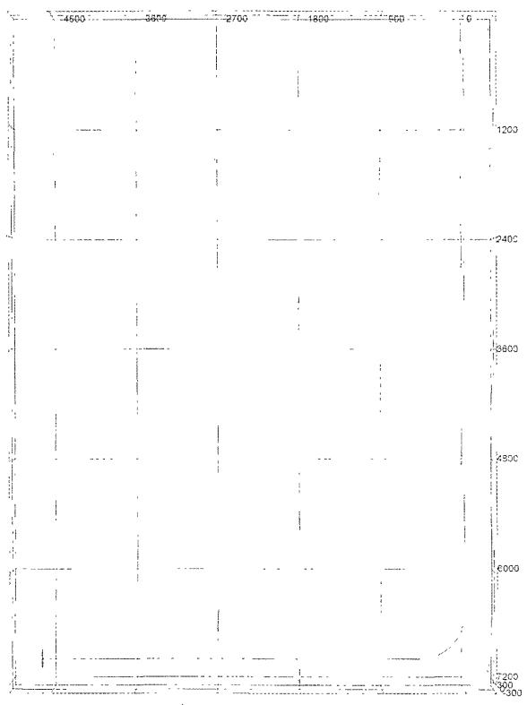

File: G:\drilling toolbox wellplans\Horizontal\jericho2h wpp

# Page 9

<table border=1 style='margin: auto; word-wrap: break-word;'><tr><td colspan="2">3D $ ^{{3}} $ Directional Drilling Planner - 3D View</td></tr><tr><td colspan="2">Company Yates Petroleum Corporation\nWell. Jericho BKJ State Com. #2H</td></tr><tr><td style='text-align: center; word-wrap: break-word;'></td><td style='text-align: center; word-wrap: break-word;'></td></tr><tr><td style='text-align: center; word-wrap: break-word;'></td><td style='text-align: center; word-wrap: break-word;'></td></tr><tr><td style='text-align: center; word-wrap: break-word;'>File: G:\drilling toolbox wellplans\Horizontal\jericho2h wpp</td><td style='text-align: center; word-wrap: break-word;'></td></tr></table>

# Page 10

<table border=1 style='margin: auto; word-wrap: break-word;'><tr><td rowspan="4">Submit 1 Copy To Appropriate District Office\nDistrict I 1625 N. French Dr., Hobbs, NM 88240\nDistrict II 1301 W. Grand Ave , Artesia, NM 88210\nDistrict III 1000 Rio Brazos Rd , Aztec, NM 87410\nDistrict IV 1220 S. St. Francis Dr , Santa Fe, NM\n87505</td><td style='text-align: center; word-wrap: break-word;'>State of New Mexico\nEnergy, Minerals and Natural Resources</td><td style='text-align: center; word-wrap: break-word;'>Form C-103\nOctober 13, 2009</td></tr><tr><td rowspan="3">OIL CONSERVATION DIVISION\n1220 South St. Francis Dr.\nSanta Fe, NM 87505</td><td style='text-align: center; word-wrap: break-word;'>WELL API NO.\n30-015-37500</td></tr><tr><td style='text-align: center; word-wrap: break-word;'>5. Indicate Type of Lease\nSTATE ☒ FEE ☐</td></tr><tr><td style='text-align: center; word-wrap: break-word;'>6. State Oil &amp; Gas Lease No.</td></tr><tr><td colspan="2">SUNDRY NOTICES AND REPORTS ON WELLS\n(DO NOT USE THIS FORM FOR PROPOSALS TO DRILL OR TO DEEPEN OR PLUG BACK TO A DIFFERENT RESERVOIR. USE &quot;APPLICATION FOR PERMIT&quot; (FORM C-101) FOR SUCH PROPOSALS.)\n1. Type of Well: Oil Well ☒ Gas Well ☐ Other</td><td style='text-align: center; word-wrap: break-word;'>7. Lease Name or Unit Agreement Name\nJericho BKJ State Com</td></tr><tr><td style='text-align: center; word-wrap: break-word;'>2. Name of Operator\nYates Petroleum Corporation</td><td style='text-align: center; word-wrap: break-word;'>RECEIVED</td><td style='text-align: center; word-wrap: break-word;'>8. Well Number\n2H</td></tr><tr><td style='text-align: center; word-wrap: break-word;'>3. Address of Operator\n105 South Fourth Street, Artesia, NM 88210</td><td style='text-align: center; word-wrap: break-word;'>FEB - 9 2010</td><td style='text-align: center; word-wrap: break-word;'>9. OGRID Number\n025575</td></tr><tr><td colspan="3">4. Well Location\nUnit Letter A : 660 feet from the North line and 330 feet from the East line</td></tr><tr><td colspan="3">Section 15 Township 25S Range 27E NMPM Eddy County</td></tr><tr><td style='text-align: center; word-wrap: break-word;'></td><td style='text-align: center; word-wrap: break-word;'>11. Elevation (Show whether DR, RKB, RT, GR, etc.)\n3172&#x27;GR</td><td style='text-align: center; word-wrap: break-word;'></td></tr></table>

12. Check Appropriate Box to Indicate Nature of Notice, Report or Other Data

NOTICE OF INTENTION TO:

PERFORM REMEDIAL WORK ☐ PLUG AND ABANDON

SUBSEQUENT REPORT OF:

TEMPORARILY ABANDON

☐ CHANGE PLANS

REMEDIAL WORK

PULL OR ALTER CASING

□ ALTERING CASING □

□ MULTIPLE COMPL

COMMENCE DRILLING OPNS.

DOWNHOLE COMMINGLE

☐ PANDA

CASING/CEMENT JOB

OTHER:

OTHER: Spud

13. Describe proposed or completed operations. (Clearly state all pertinent details, and give pertinent dates, including estimated date of starting any proposed work). SEE RULE 19.15.7.14 NMAC. For Multiple Completions: Attach wellbore diagram of proposed completion or recompletion.

2/1/10 – Spudded 12-1/4" hole at 4:00 PM. Drilled to 10'. Notified Mike Bratcher Artesia NMOCD (via email) of operations.

Spud Date:

2/1/10

Rig Release Date:

I hereby certify that the information above is true and complete to the best of my knowledge and belief.

SIGNATURE ___ TITLE

Type or print name  $ \underline{\text{Tina Huerta}} $

 $ \underline{\text{Regulatory Compliance Supervisor}} $ DATE  $ \underline{\text{February 4, 2010}} $

For State Use Only

E-mail address:  $ \underline{\text{tinah@yatespetroleum.com}} $

APPROVED BY: Donald Gray

PHONE:  $ \underline{\text{575-748-4168}} $

TITLE Field Supervisor

Conditions of Approval (if any):

DATE 2-11-2010

# Page 11

<table border=1 style='margin: auto; word-wrap: break-word;'><tr><td rowspan="4">Submit 1 Copy To Appropriate District Office\nDistrict I\n1625 N. French Dr., Hobbs, NM 88240\nDistrict II\n1301 W. Grand Ave., Artesia, NM 88210\nDistrict III\n1000 Rio Brazos Rd., Aztec, NM 87410\nDistrict IV\n1220 S. St Francis Dr., Santa Fe, NM\n87505</td><td style='text-align: center; word-wrap: break-word;'>State of New Mexico\nEnergy, Minerals and Natural Resources</td><td style='text-align: center; word-wrap: break-word;'>Form C-103\nOctober 13, 2009</td></tr><tr><td rowspan="3">OIL CONSERVATION DIVISION\n1220 South St. Francis Dr.\nSanta Fe, NM 87505</td><td style='text-align: center; word-wrap: break-word;'>WELL API NO.\n30-015-37500</td></tr><tr><td style='text-align: center; word-wrap: break-word;'>5. Indicate Type of Lease\nSTATE ☒ FEE ☐</td></tr><tr><td style='text-align: center; word-wrap: break-word;'>6. State Oil &amp; Gas Lease No.</td></tr><tr><td colspan="2">SUNDRY NOTICES AND REPORTS ON WELLS\n(DO NOT USE THIS FORM FOR PROPOSALS TO DRILL OR TO DEEPEN OR PLUG BACK TO A DIFFERENT RESERVOIR USE &quot;APPLICATION FOR PERMIT&quot; (FORM C-101) FOR SUCH PROPOSALS )\n1. Type of Well: Oil Well ☒ Gas Well ☐ Other</td><td style='text-align: center; word-wrap: break-word;'>7. Lease Name or Unit Agreement Name\nJericho BKJ State Com</td></tr><tr><td style='text-align: center; word-wrap: break-word;'>2. Name of Operator\nYates Petroleum Corporation</td><td style='text-align: center; word-wrap: break-word;'>RECEIVED</td><td style='text-align: center; word-wrap: break-word;'>2H</td></tr><tr><td style='text-align: center; word-wrap: break-word;'>3. Address of Operator\n105 South Fourth Street, Artesia, NM 88210</td><td style='text-align: center; word-wrap: break-word;'>FEB 25 2010</td><td style='text-align: center; word-wrap: break-word;'>9. OGRID Number\n025575</td></tr><tr><td style='text-align: center; word-wrap: break-word;'>4. Well Location\nUnit Letter A : 660 feet from the Section 15</td><td colspan="2">NMOCD ARTESIA\nNorth line and 330 feet from the East line\nTownship 25S Range 27E NMPM Eddy County</td></tr><tr><td style='text-align: center; word-wrap: break-word;'></td><td style='text-align: center; word-wrap: break-word;'>11. Elevation (Show whether DR, RKB, RT, GR, etc.)\n3172&#x27;GR</td><td style='text-align: center; word-wrap: break-word;'></td></tr></table>

12. Check Appropriate Box to Indicate Nature of Notice, Report or Other Data

NOTICE OF INTENTION TO:

PERFORM REMEDIAL WORK ☐ PLUG AND ABANDON ☐ SUBSEQUENT REPORT OF:

□ CHANGE PLANS

REMEDIAL WORK

PULL OR ALTER CASING

□ ALTERING CASING □

COMMENCE DRILLING OPNS.□ P AND A

□ MULTIPLE COMPL

DOWNHOLE COMMINGLE

CASING/CEMENT JOB

OTHER:

OTHER: 5' new hole

13. Describe proposed or completed operations. (Clearly state all pertinent details, and give pertinent dates, including estimated date of starting any proposed work). SEE RULE 19.15.7.14 NMAC. For Multiple Completions: Attach wellbore diagram of proposed completion or recompletion.

2/19/10 – Made 5' new hole at 11:30 AM. TD 15'. Hole size 12-1/4".

Spud Date:

2/1/10

Rig Release Date:

I hereby certify that the information above is true and complete to the best of my knowledge and belief.

SIGNATURE  $ \underline{\text{Aristo}} $

TITLE  $ \underline{\text{Regulatory Compliance Supervisor}} $ DATE  $ \underline{\text{February 23, 2010}} $

E-mail address:  $ \underline{\text{tinah@yatespetroleum.com}} $

APPROVED BY: Daold Wray

PHONE:  $ \underline{\text{575-748-4168}} $

Conditions of Approval (if any):

TITLE Field Supervisor

DATE 2-25-2010

# Page 12

<table border=1 style='margin: auto; word-wrap: break-word;'><tr><td rowspan="4">Submit 1 Copy To Appropriate District Office\nDistrict I\n1625 N. French Dr, Hobbs, NM 88240\nDistrict II\n1301 W. Grand Ave., Artesia, NM 88210\nDistrict III\n1000 Rio Brazos Rd., Aztec, NM 87410\nDistrict IV\n1220 S. St. Francis Dr., Santa Fe, NM\n87505</td><td style='text-align: center; word-wrap: break-word;'>State of New Mexico\nEnergy, Minerals and Natural Resources</td><td style='text-align: center; word-wrap: break-word;'>Form C-103\nOctober 13, 2009</td></tr><tr><td rowspan="3">OIL CONSERVATION DIVISION\n1220 South St. Francis Dr.\nSanta Fe, NM 87505</td><td style='text-align: center; word-wrap: break-word;'>WELL API NO.\n30-015-37500</td></tr><tr><td style='text-align: center; word-wrap: break-word;'>5. Indicate Type of Lease\nSTATE ☒ FEE ☐</td></tr><tr><td style='text-align: center; word-wrap: break-word;'>6. State Oil &amp; Gas Lease No.</td></tr><tr><td rowspan="2">SUNDRY NOTICES AND REPORTS ON WELLS\n(DO NOT USE THIS FORM FOR PROPOSALS TO DRILL OR TO DEEPEN OR PLUG BACK TO A DIFFERENT RESERVOIR USE &quot;APPLICATION FOR PERMIT&quot; (FORM C-101) FOR SUCH PROPOSALS )</td><td rowspan="2">RECEIVED\nMAR 17 2010</td><td style='text-align: center; word-wrap: break-word;'>7. Lease Name or Unit Agreement Name\nJericho BKJ State Com</td></tr><tr><td style='text-align: center; word-wrap: break-word;'>8. Well Number\n2H</td></tr><tr><td style='text-align: center; word-wrap: break-word;'>1. Type of Well: Oil Well ☒ Gas Well ☐ Other</td><td rowspan="3">NMOCD ARTESIA</td><td style='text-align: center; word-wrap: break-word;'>9. OGRID Number\n025575</td></tr><tr><td style='text-align: center; word-wrap: break-word;'>2. Name of Operator\nYates Petroleum Corporation</td><td rowspan="2">10. Pool name or Wildcat\nUndesignated; Bone Spring</td></tr><tr><td style='text-align: center; word-wrap: break-word;'>3. Address of Operator\n105 South Fourth Street, Artesia, NM 88210</td></tr><tr><td colspan="3">4. Well Location\nUnit Letter A : 660 feet from the North line and 330 feet from the East line</td></tr><tr><td colspan="3">Section 15 Township 25S Range 27E NMPM Eddy County</td></tr><tr><td style='text-align: center; word-wrap: break-word;'></td><td style='text-align: center; word-wrap: break-word;'>11. Elevation (Show whether DR, RKB, RT, GR, etc.)\n3172&#x27;GR</td><td style='text-align: center; word-wrap: break-word;'></td></tr></table>

### 12. Check Appropriate Box to Indicate Nature of Notice, Report or Other Data

NOTICE OF INTENTION TO:

PERFORM REMEDIAL WORK ☐ PLUG AND ABANDON ☐

SUBSEQUENT REPORT OF:

TEMPORARILY ABANDON

REMEDIAL WORK

□ CHANGE PLANS

□ ALTERING CASING □

PULL OR ALTER CASING

COMMENCE DRILLING OPNS.□ P AND A

□ MULTIPLE COMPL

DOWNHOLE COMMINGLE

CASING/CEMENT JOB

OTHER:

OTHER: 5' new hole

13. Describe proposed or completed operations. (Clearly state all pertinent details, and give pertinent dates, including estimated date of starting any proposed work). SEE RULE 19.15.7.14 NMAC. For Multiple Completions: Attach wellbore diagram of proposed completion or recompletion.

3/10/10 – Made 5' new hole at 1:40 PM. TD 20'. Hole size 12-1/4".

Spud Date:

2/1/10

Rig Release Date:

I hereby certify that the information above is true and complete to the best of my knowledge and belief.

SIGNATURE

Type or print name  $ \underline{\text{Tina Huerta}} $

TITLE  $ \underline{\text{Regulatory Compliance Supervisor}} $ DATE  $ \underline{\text{March 15, 2010}} $

For State Use Only

APPROVED BY: Dauld Way

PHONE:  $ \underline{\text{575-748-4168}} $

Conditions of Approval (if any):

TITLE Field Supervisor

DATE 3-18-2010

# Page 13

<table border=1 style='margin: auto; word-wrap: break-word;'><tr><td rowspan="4">Submit 1 Copy To Appropriate District Office\nDistrict I\n1625 N French Dr, Hobbs, NM 88240\nDistrict II\n1301 W Grand Ave, Artesia, NM 88210\nDistrict III\n1000 Rio Brazos Rd, Aztec, NM 87410\nDistrict IV\n1220 S. St. Francis Dr., Santa Fe, NM\n87505</td><td style='text-align: center; word-wrap: break-word;'>State of New Mexico\nEnergy, Minerals and Natural Resources</td><td colspan="2">Form C-103\nOctober 13, 2009</td></tr><tr><td rowspan="3">OIL CONSERVATION DIVISION\n1220 South St. Francis Dr.\nSanta Fe, NM 87505</td><td colspan="2">WELL API NO.\n30-015-37500</td></tr><tr><td colspan="2">5. Indicate Type of Lease\nSTATE ☒ FEE ☐</td></tr><tr><td colspan="2">6. State Oil &amp; Gas Lease No.</td></tr><tr><td rowspan="2">SUNDRY NOTICES AND REPORTS ON WELLS\n(DO NOT USE THIS FORM FOR PROPOSALS TO DRILL OR TO DEEPEN OR PLUG BACK TO A DIFFERENT RESERVOIR. USE &quot;APPLICATION FOR PERMIT&quot; (FORM C-101) FOR SUCH PROPOSALS)\n1. Type of Well: Oil Well ☒ Gas Well ☐ Other</td><td rowspan="2">RECEIVED</td><td colspan="2">7. Lease Name or Unit Agreement Name\nJericho BKJ State Com</td></tr><tr><td colspan="2">8. Well Number\n2H</td></tr><tr><td style='text-align: center; word-wrap: break-word;'>2. Name of Operator\nYates Petroleum Corporation</td><td style='text-align: center; word-wrap: break-word;'>APR - 5 2010</td><td colspan="2">9. OGRID Number\n025575</td></tr><tr><td style='text-align: center; word-wrap: break-word;'>3. Address of Operator\n105 South Fourth Street, Artesia, NM 88210</td><td style='text-align: center; word-wrap: break-word;'>NMOCD ARTESIA</td><td colspan="2">10. Pool name or Wildcat\nUndesignated; Bone Spring</td></tr><tr><td colspan="4">4. Well Location\nUnit Letter A : 660 feet from the North line and 330 feet from the East line</td></tr><tr><td colspan="4">Section 15 Township 25S Range 27E NMPM Eddy County</td></tr><tr><td style='text-align: center; word-wrap: break-word;'></td><td colspan="3">11. Elevation (Show whether DR, RKB, RT, GR, etc.)\n3172&#x27;GR</td></tr></table>

### 12. Check Appropriate Box to Indicate Nature of Notice, Report or Other Data

NOTICE OF INTENTION TO:

PERFORM REMEDIAL WORK ☐ PLUG AND ABANDON

SUBSEQUENT REPORT OF:

TEMPORARILY ABANDON

☐ CHANGE PLANS

PULL OR ALTER CASING

□ ALTERING CASING □

□ MULTIPLE COMPL

DOWNHOLE COMMINGLE

OTHER:

13. Describe proposed or completed operations. (Clearly state all pertinent details, and give pertinent dates, including estimated date of starting any proposed work). SEE RULE 19.15.7.14 NMAC. For Multiple Completions: Attach wellbore diagram of proposed completion or recompletion.

3/29/10 – Made 5' new hole at 10:00 AM. TD 25'. Hole size 12-1/4".

Spud Date:

2/1/10

Rig Release Date:

I hereby certify that the information above is true and complete to the best of my knowledge and belief.

SIGNATURE

Regulatory Compliance Supervisor DATE April 1, 2010

Type or print name  $ \underline{\text{Tina Huerta}} $

For State Use Only

PHONE:  $ \underline{\text{575-748-4168}} $

APPROVED BY:  $ \underline{\text{Donald Gray}} $

Conditions of Approval (if any):

 $ \underline{\text{TITLE}} $  $ \underline{\text{Field supervisor}} $

DATE 4-6-2010

# Page 14

<table border=1 style='margin: auto; word-wrap: break-word;'><tr><td rowspan="4">Submit 1 Copy To Appropriate District Office\nDistrict I\n1625 N French Dr., Hobbs, NM 88240\nDistrict II\n1301 W Grand Ave., Artesia, NM 88210\nDistrict III\n1000 Rio Brazos Rd, Aztec, NM 87410\nDistrict IV\n1220 S St Francis Dr, Santa Fe, NM\n87505</td><td style='text-align: center; word-wrap: break-word;'>State of New Mexico\nEnergy, Minerals and Natural Resources</td><td style='text-align: center; word-wrap: break-word;'>Form C-103\nOctober 13, 2009</td></tr><tr><td rowspan="3">OIL CONSERVATION DIVISION\n1220 South St. Francis Dr.\nSanta Fe, NM 87505</td><td style='text-align: center; word-wrap: break-word;'>WELL API NO.\n30-015-37500</td></tr><tr><td style='text-align: center; word-wrap: break-word;'>5. Indicate Type of Lease\nSTATE ☒ FEE ☐</td></tr><tr><td style='text-align: center; word-wrap: break-word;'>6. State Oil &amp; Gas Lease No.</td></tr><tr><td rowspan="2">SUNDRY NOTICES AND REPORTS ON WELLS\n(DO NOT USE THIS FORM FOR PROPOSALS TO DRILL OR TO DEEPEN OR PLUG BACK TO A DIFFERENT RESERVOIR. USE &quot;APPLICATION FOR PERMIT&quot; (FORM C-101) FOR SUCH PROPOSALS.)\n1. Type of Well: Oil Well ☒ Gas Well ☐ Other</td><td rowspan="2">RECEIVED</td><td style='text-align: center; word-wrap: break-word;'>7. Lease Name or Unit Agreement Name\nJericho BKJ State Com</td></tr><tr><td style='text-align: center; word-wrap: break-word;'>8. Well Number\n2H</td></tr><tr><td style='text-align: center; word-wrap: break-word;'>2. Name of Operator\nYates Petroleum Corporation</td><td style='text-align: center; word-wrap: break-word;'>APR 22 2010</td><td style='text-align: center; word-wrap: break-word;'>9. OGRID Number\n025575</td></tr><tr><td style='text-align: center; word-wrap: break-word;'>3. Address of Operator\n105 South Fourth Street, Artesia, NM 88210</td><td style='text-align: center; word-wrap: break-word;'>NMOCD ARTESIA</td><td style='text-align: center; word-wrap: break-word;'>10. Pool name or Wildcat\nUndesignated; Bone Spring</td></tr><tr><td colspan="3">4. Well Location\nUnit Letter A : 660 feet from the North line and 330 feet from the East line</td></tr><tr><td colspan="3">Section 15 Township 25S Range 27E NMPM Eddy County</td></tr><tr><td style='text-align: center; word-wrap: break-word;'></td><td style='text-align: center; word-wrap: break-word;'>11. Elevation (Show whether DR, RKB, RT, GR, etc.)\n3172&#x27;GR</td><td style='text-align: center; word-wrap: break-word;'></td></tr></table>

12. Check Appropriate Box to Indicate Nature of Notice, Report or Other Data

NOTICE OF INTENTION TO:

PERFORM REMEDIAL WORK ☐ PLUG AND ABANDON

SUBSEQUENT REPORT OF:

TEMPORARILY ABANDON

☐ CHANGE PLANS

PULL OR ALTER CASING

□ ALTERING CASING □

□ MULTIPLE COMPL

DOWNHOLE COMMINGLE

OTHER:

OTHER: 5' new hole

13. Describe proposed or completed operations. (Clearly state all pertinent details, and give pertinent dates, including estimated date of starting any proposed work). SEE RULE 19.15.7.14 NMAC. For Multiple Completions: Attach wellbore diagram of proposed completion or recompletion.

4/16/10 – Made 5' new hole at 9:15 AM. TD 30'. Hole size 12-1/4".

Spud Date:

2/1/10

Rig Release Date:

I hereby certify that the information above is true and complete to the best of my knowledge and belief.

SIGNATURE ___

Regulatory Compliance Supervisor DATE April 20, 2010

Type or print name ___ Tina Huerta ___ E-mail address:  $ \underline{\text{tinah@yatespetroleum.com}} $ PHONE: ___ 575-748-4168 For State Use Only

APPROVED BY: Donald Hway TITLE Field Supervisor DATE 4-22-10 Conditions of Approval (if any):

# Page 15

<table border=1 style='margin: auto; word-wrap: break-word;'><tr><td style='text-align: center; word-wrap: break-word;'>Submit I Copy To Appropriate District Office\nDistrict I</td><td style='text-align: center; word-wrap: break-word;'>State of New Mexico\nEnergy, Minerals and Natural Resources</td><td style='text-align: center; word-wrap: break-word;'>Form C-103\nOctober 13, 2009</td></tr><tr><td rowspan="3">1625 N French Dr, Hobbs, NM 88240\nDistrict II\n1301 W Grand Ave, Artesia, NM 88210\nDistrict III\n1000 Rio Brazos Rd, Aztec, NM 87410\nDistrict IV\n1220 S St Francis Dr, Santa Fe, NM\n87505</td><td rowspan="3">OIL CONSERVATION DIVISION\n1220 South St. Francis Dr.\nSanta Fe, NM 87505</td><td style='text-align: center; word-wrap: break-word;'>WELL API NO.\n30-015-37500</td></tr><tr><td style='text-align: center; word-wrap: break-word;'>5. Indicate Type of Lease\nSTATE ☒ FEE ☐</td></tr><tr><td style='text-align: center; word-wrap: break-word;'>6. State Oil &amp; Gas Lease No.</td></tr><tr><td rowspan="2">SUNDRY NOTICES AND REPORTS ON WELLS\n(DO NOT USE THIS FORM FOR PROPOSALS TO DRILL OR TO DEEPEN OR PLUG BACK TO A DIFFERENT RESERVOIR USE &quot;APPLICATION FOR PERMIT&quot; (FORM C-101) FOR SUCH PROPOSALS)\n1. Type of Well: Oil Well ☒ Gas Well ☐ Other</td><td rowspan="2">RECEIVED\nMAY 12 2010</td><td style='text-align: center; word-wrap: break-word;'>7. Lease Name or Unit Agreement Name\nJericho BKJ State Com</td></tr><tr><td style='text-align: center; word-wrap: break-word;'>8. Well Number\n2H</td></tr><tr><td style='text-align: center; word-wrap: break-word;'>2. Name of Operator\nYates Petroleum Corporation</td><td style='text-align: center; word-wrap: break-word;'>NMOCD ARTESIA</td><td style='text-align: center; word-wrap: break-word;'>9. OGRID Number\n025575</td></tr><tr><td style='text-align: center; word-wrap: break-word;'>3. Address of Operator\n105 South Fourth Street, Artesia, NM 88210</td><td style='text-align: center; word-wrap: break-word;'></td><td style='text-align: center; word-wrap: break-word;'>10. Pool name or Wildcat\nUndesignated; Bone Spring</td></tr><tr><td colspan="3">4. Well Location\nUnit Letter A : 660 feet from the North line and 330 feet from the East line</td></tr><tr><td colspan="3">Section 15 Township 25S Range 27E NMPM Eddy County</td></tr><tr><td colspan="3">11. Elevation (Show whether DR, RKB, RT, GR, etc.)\n3172&#x27;GR</td></tr></table>

12. Check Appropriate Box to Indicate Nature of Notice, Report or Other Data

NOTICE OF INTENTION TO:

SUBSEQUENT REPORT OF:

TEMPORARILY ABANDON

☐ CHANGE PLANS

PULL OR ALTER CASING

□ ALTERING CASING □

□ MULTIPLE COMPL

DOWNHOLE COMMINGLE

OTHER:

OTHER: 5' new hole

13. Describe proposed or completed operations. (Clearly state all pertinent details, and give pertinent dates, including estimated date of starting any proposed work). SEE RULE 19.15.7.14 NMAC. For Multiple Completions: Attach wellbore diagram of proposed completion or recompletion.

5/5/10 – Made 5' new hole at 8:45 AM. TD 35'. Hole size 12-1/4".

Spud Date:

2/1/10

Rig Release Date:

I hereby certify that the information above is true and complete to the best of my knowledge and belief.

SIGNATURE TITLE

 $ \underline{\text{Regulatory Compliance Supervisor}} $ DATE  $ \underline{\text{May 11, 2010}} $

APPROVED BY: David Hray

Conditions of Approval (if any):

TITLE Field Supervisor

# Page 16

<table border=1 style='margin: auto; word-wrap: break-word;'><tr><td rowspan="4">Submit I Copy To Appropriate District Office\nDistrict I\n1625 N French Dr., Hobbs, NM 88240\nDistrict II\n1301 W. Grand Ave., Artesia, NM 88210\nDistrict III\n1000 Rio Brazos Rd., Aztec, NM 87410\nDistrict IV\n1220 S. St. Francis Dr., Santa Fe, NM\n87505</td><td style='text-align: center; word-wrap: break-word;'>State of New Mexico\nEnergy, Minerals and Natural Resources</td><td style='text-align: center; word-wrap: break-word;'>Form C-103\nOctober 13, 2009</td></tr><tr><td rowspan="3">OIL CONSERVATION DIVISION\n1220 South St. Francis Dr.\nSanta Fe, NM 87505</td><td style='text-align: center; word-wrap: break-word;'>WELL API NO.\n30-015-37500</td></tr><tr><td style='text-align: center; word-wrap: break-word;'>5. Indicate Type of Lease\nSTATE ☒ FEE ☐</td></tr><tr><td style='text-align: center; word-wrap: break-word;'>6. State Oil &amp; Gas Lease No.</td></tr><tr><td rowspan="2">SUNDRY NOTICES AND REPORTS ON WELLS\n(DO NOT USE THIS FORM FOR PROPOSALS TO DRILL OR TO DEEPEN OR PLUG BACK TO A DIFFERENT RESERVOIR USE &quot;APPLICATION FOR PERMIT&quot; (FORM C-101) FOR SUCH PROPOSALS)\n1. Type of Well: Oil Well ☒ Gas Well ☐ Other RECEIVED</td><td style='text-align: center; word-wrap: break-word;'>7. Lease Name or Unit Agreement Name\nJericho BKJ State Com</td><td style='text-align: center; word-wrap: break-word;'></td></tr><tr><td style='text-align: center; word-wrap: break-word;'>8. Well Number\n2H</td><td style='text-align: center; word-wrap: break-word;'></td></tr><tr><td style='text-align: center; word-wrap: break-word;'>2. Name of Operator\nYates Petroleum Corporation</td><td style='text-align: center; word-wrap: break-word;'>MAY 27 2010</td><td style='text-align: center; word-wrap: break-word;'></td></tr><tr><td style='text-align: center; word-wrap: break-word;'>3. Address of Operator\n105 South Fourth Street, Artesia, NM 88210</td><td style='text-align: center; word-wrap: break-word;'>NMOCD ARTESIA</td><td style='text-align: center; word-wrap: break-word;'></td></tr><tr><td colspan="2">4. Well Location\nUnit Letter A : 660 feet from the North line and 330 feet from the East line</td><td style='text-align: center; word-wrap: break-word;'></td></tr><tr><td colspan="2">Section 15 Township 25S Range 27E NMPM Eddy County</td><td style='text-align: center; word-wrap: break-word;'></td></tr><tr><td colspan="2">11. Elevation (Show whether DR, RKB, RT, GR, etc.)\n3172&#x27;GR</td><td style='text-align: center; word-wrap: break-word;'></td></tr></table>

12. Check Appropriate Box to Indicate Nature of Notice, Report or Other Data

NOTICE OF INTENTION TO:

SUBSEQUENT REPORT OF:

TEMPORARILY ABANDON

☐ CHANGE PLANS

PULL OR ALTER CASING

□ ALTERING CASING □

□ MULTIPLE COMPL

DOWNHOLE COMMINGLE

OTHER:

OTHER: 5' new hole

13. Describe proposed or completed operations. (Clearly state all pertinent details, and give pertinent dates, including estimated date of starting any proposed work). SEE RULE 19.15.7.14 NMAC. For Multiple Completions: Attach wellbore diagram of proposed completion or recompletion.

5/24/10 – Made 5' new hole at 11:00 AM. TD 40'. Hole size 12-1/4".

Spud Date:

2/1/10

Rig Release Date:

I hereby certify that the information above is true and complete to the best of my knowledge and belief.

SIGNATURE

Type or print name  $ \underline{\text{Tina Huerta}} $

TITLE  $ \underline{\text{Regulatory Compliance Supervisor}} $ DATE  $ \underline{\text{May 25, 2010}} $

FOR STATE USE ONLY

APPROVED BY: Acqui

E-mail address: tinah@yatespetroleum.com

PHONE: 575-748-4168

Conditions of Approval (if any):

TITLE Zoologist

# Page 17

<table border=1 style='margin: auto; word-wrap: break-word;'><tr><td rowspan="4">-- Submit 3 Copies To Appropriate District Office\nDistrict I\n1625 N. French Dr., Hobbs, NM 88240\nDistrict II\n1301 W. Grand Ave., Artesia, NM 88210\nDistrict III\n1000 Rio Brazos Rd., Aztec, NM 87410\nDistrict IV\n1220 S. St. Francis Dr., Santa Fe, NM\n87505</td><td style='text-align: center; word-wrap: break-word;'>State of New Mexico\nEnergy, Minerals and Natural Resources</td><td style='text-align: center; word-wrap: break-word;'>Form C-103\nMay 27, 2004</td></tr><tr><td rowspan="3">OIL CONSERVATION DIVISION\n1220 South St. Francis Dr.\nSanta Fe, NM 87505</td><td style='text-align: center; word-wrap: break-word;'>WELL API NO.\n30-015-37500</td></tr><tr><td style='text-align: center; word-wrap: break-word;'>5. Indicate Type of Lease\nSTATE ☒ FEE ☐</td></tr><tr><td style='text-align: center; word-wrap: break-word;'>6. State Oil &amp; Gas Lease No.\nV-7318</td></tr><tr><td style='text-align: center; word-wrap: break-word;'>SUNDRY NOTICES AND REPORTS ON WELLS\n(DO NOT USE THIS FORM FOR PROPOSALS TO DRILL OR TO DEEPEN OR PLUG BACK TO A DIFFERENT RESERVOIR. USE &quot;APPLICATION FOR PERMIT&quot; (FORM C-101) FOR SUCH PROPOSALS.)\n1. Type of Well: Oil Well ☒ Gas Well ☐ Other RECEIVED</td><td style='text-align: center; word-wrap: break-word;'>7. Lease Name or Unit Agreement Name\nJericho BKJ State Com.</td><td style='text-align: center; word-wrap: break-word;'></td></tr><tr><td style='text-align: center; word-wrap: break-word;'>2. Name of Operator\nYates Petroleum Corporation</td><td style='text-align: center; word-wrap: break-word;'>JUN 15 2010</td><td style='text-align: center; word-wrap: break-word;'>8. Well Number\n2H</td></tr><tr><td style='text-align: center; word-wrap: break-word;'>3. Address of Operator\n105 S.  $ 4^{{th}} $ Street, Artesia, NM 88210</td><td style='text-align: center; word-wrap: break-word;'>NMOCD ARTESIA</td><td style='text-align: center; word-wrap: break-word;'>9. OGRID Number\n025575</td></tr><tr><td colspan="3">4. Well Location\nUnit Letter A : 660 feet from the North line and 330 feet from the East line</td></tr><tr><td colspan="3">Section 15 Township 25S Range 27E NMPM Eddy County</td></tr><tr><td colspan="3">11. Elevation (Show whether DR, RKB, RT, GR, etc.)\n3170&#x27;</td></tr><tr><td colspan="3">Pit or Below-grade Tank Application ☐ or Closure ☐</td></tr><tr><td colspan="3">Pit type ________ Depth to Groundwater ________ Distance from nearest fresh water well ________ Distance from nearest surface water ________</td></tr><tr><td colspan="3">Pit Liner Thickness: ________ mil Below-Grade Tank: Volume ________ bbls; Construction Material</td></tr></table>

12. Check Appropriate Box to Indicate Nature of Notice, Report or Other Data

<table border=1 style='margin: auto; word-wrap: break-word;'><tr><td colspan="3">NOTICE OF INTENTION TO:</td><td colspan="3">SUBSEQUENT REPORT OF:</td></tr><tr><td style='text-align: center; word-wrap: break-word;'>PERFORM REMEDIAL WORK ☐</td><td style='text-align: center; word-wrap: break-word;'>PLUG AND ABANDON ☐</td><td style='text-align: center; word-wrap: break-word;'></td><td style='text-align: center; word-wrap: break-word;'>REMEDIAL WORK ☐</td><td style='text-align: center; word-wrap: break-word;'>ALTERING CASING ☐</td><td style='text-align: center; word-wrap: break-word;'></td></tr><tr><td style='text-align: center; word-wrap: break-word;'>TEMPORARILY ABANDON ☐</td><td style='text-align: center; word-wrap: break-word;'>CHANGE PLANS ☒</td><td style='text-align: center; word-wrap: break-word;'></td><td style='text-align: center; word-wrap: break-word;'>COMMENCE DRILLING OPNS. ☐</td><td style='text-align: center; word-wrap: break-word;'>PLUG AND ABANDON ☐</td><td style='text-align: center; word-wrap: break-word;'></td></tr><tr><td style='text-align: center; word-wrap: break-word;'>PULL OR ALTER CASING ☐</td><td style='text-align: center; word-wrap: break-word;'>MULTIPLE COMPL ☐</td><td style='text-align: center; word-wrap: break-word;'></td><td style='text-align: center; word-wrap: break-word;'>CASING/CEMENT JOB ☐</td><td style='text-align: center; word-wrap: break-word;'></td><td style='text-align: center; word-wrap: break-word;'></td></tr><tr><td style='text-align: center; word-wrap: break-word;'>OTHER:</td><td style='text-align: center; word-wrap: break-word;'>☐</td><td style='text-align: center; word-wrap: break-word;'></td><td style='text-align: center; word-wrap: break-word;'>OTHER:</td><td style='text-align: center; word-wrap: break-word;'>☐</td><td style='text-align: center; word-wrap: break-word;'></td></tr></table>

13. Describe proposed or completed operations. (Clearly state all pertinent details, and give pertinent dates, including estimated date of starting any proposed work). SEE RULE 1103. For Multiple Completions: Attach wellbore diagram of proposed completion or recompletion.

Bottom hole location for this well is Section 15, T25S-R27E, Unit D. 660' FNL and 330' FWL.

Yates Petroleum Corporation respectfully requests permission to change the target formation for this well.

Attached is the new directional plan as well as revised production casing design.

Thank-you.

I hereby certify that the information above is true and complete to the best of my knowledge and belief. I further certify that any pit or below-grade tank has been/will be constructed or closed according to NMOCD guidelines □, a general permit ☒ or an (attached) alternative OCD-approved plan □.

SIGNATURE  $ \underline{\text{Jeremim Mullin}} $ TITLE  $ \underline{\text{Well Planning Technician}} $ DATE  $ \underline{\text{6/11/10}} $

Type or print name  $ \underline{\text{Jeremiah Mullen}} $ E-mail address:  $ \underline{\text{jmullen@yatespetroleum.com}} $ Telephone No.  $ \underline{\text{575-748-4378}} $

For State Use Only APPROVED BY: / Acqu TITLE Geologist DATE (01301000

# Page 18

Production

<table border=1 style='margin: auto; word-wrap: break-word;'><tr><td style='text-align: center; word-wrap: break-word;'></td><td colspan="3">0 ft to 6,400 ft</td><td colspan="2">Make up Torque ft-lbs</td><td style='text-align: center; word-wrap: break-word;'>Total ft = 6,400</td></tr><tr><td style='text-align: center; word-wrap: break-word;'>O.D.</td><td style='text-align: center; word-wrap: break-word;'>Weight</td><td style='text-align: center; word-wrap: break-word;'>Grade</td><td style='text-align: center; word-wrap: break-word;'>Threads</td><td style='text-align: center; word-wrap: break-word;'>opt. min.</td><td style='text-align: center; word-wrap: break-word;'>mx.</td><td style='text-align: center; word-wrap: break-word;'></td></tr><tr><td style='text-align: center; word-wrap: break-word;'>5.5 inches</td><td style='text-align: center; word-wrap: break-word;'>17#/ft</td><td style='text-align: center; word-wrap: break-word;'>P-110</td><td style='text-align: center; word-wrap: break-word;'>LT&amp;C</td><td style='text-align: center; word-wrap: break-word;'>4620</td><td style='text-align: center; word-wrap: break-word;'>3470</td><td style='text-align: center; word-wrap: break-word;'>5780</td></tr><tr><td style='text-align: center; word-wrap: break-word;'>Collapse Resistance 7,480 psi</td><td style='text-align: center; word-wrap: break-word;'>Internal Yield 10,640 psi</td><td style='text-align: center; word-wrap: break-word;'>Joint Strength 445,000#</td><td style='text-align: center; word-wrap: break-word;'>Body Yield 546,000#</td><td colspan="2">Drift 4,767</td><td style='text-align: center; word-wrap: break-word;'></td></tr></table>

<table border=1 style='margin: auto; word-wrap: break-word;'><tr><td style='text-align: center; word-wrap: break-word;'></td><td colspan="3">6,400 ft to 10,200 ft</td><td colspan="2">Make up Torque ft-lbs</td><td style='text-align: center; word-wrap: break-word;'>Total ft = 3,800</td></tr><tr><td style='text-align: center; word-wrap: break-word;'>O.D.</td><td style='text-align: center; word-wrap: break-word;'>Weight</td><td style='text-align: center; word-wrap: break-word;'>Grade</td><td style='text-align: center; word-wrap: break-word;'>Threads</td><td style='text-align: center; word-wrap: break-word;'>opt. min.</td><td style='text-align: center; word-wrap: break-word;'>mx.</td><td style='text-align: center; word-wrap: break-word;'></td></tr><tr><td style='text-align: center; word-wrap: break-word;'>5.5 inches</td><td style='text-align: center; word-wrap: break-word;'>17 #/ft</td><td style='text-align: center; word-wrap: break-word;'>L-80</td><td style='text-align: center; word-wrap: break-word;'>LT&amp;C</td><td style='text-align: center; word-wrap: break-word;'>3410</td><td style='text-align: center; word-wrap: break-word;'>2560</td><td style='text-align: center; word-wrap: break-word;'>4260</td></tr><tr><td style='text-align: center; word-wrap: break-word;'>Collapse Resistance 6,290</td><td style='text-align: center; word-wrap: break-word;'>Internal Yield 7,740 psi</td><td colspan="2">Joint Strength 338,000 #</td><td style='text-align: center; word-wrap: break-word;'>Body Yield 397,000 #</td><td style='text-align: center; word-wrap: break-word;'>Drift 4.767</td><td style='text-align: center; word-wrap: break-word;'></td></tr></table>

Production hole size will be 8 3/4" from drill out of interm. csg to TD of the pilot hole Hole will then be plugged back and kicked off at approx. 5647' with a 8 3/4" hole and drilled to 6.400' MD(6,125 TVD), hole size will then be reduced to 7 7/8" and drilled to 10,200' MD (6,125' TVD) where 5 1/2" casing will be run and cemented.

## Contingency Casing Design

If hole conditions dictate, 7" casing will be set at 6,400' MD (6,125' TVD). A 6 1/8" hole will then be drilled to 10,200' MD (6,125' TVD) where 4 1/2" casing will be set and cemented with one stage up to dv tool. After completion procedures, the 4 1/2" casing will be cut and pulled at 5600'.

2nd Intermediate

<table border=1 style='margin: auto; word-wrap: break-word;'><tr><td style='text-align: center; word-wrap: break-word;'></td><td colspan="3">0 ft to 100 ft</td><td colspan="2">Make up Torque ft-lbs</td><td style='text-align: center; word-wrap: break-word;'>Total ft = 100</td></tr><tr><td style='text-align: center; word-wrap: break-word;'>O.D.</td><td style='text-align: center; word-wrap: break-word;'>Weight</td><td style='text-align: center; word-wrap: break-word;'>Grade</td><td style='text-align: center; word-wrap: break-word;'>Threads</td><td style='text-align: center; word-wrap: break-word;'>opt.</td><td style='text-align: center; word-wrap: break-word;'>min. mx.</td><td style='text-align: center; word-wrap: break-word;'></td></tr><tr><td style='text-align: center; word-wrap: break-word;'>7 inches</td><td style='text-align: center; word-wrap: break-word;'>26#/ft</td><td style='text-align: center; word-wrap: break-word;'>J-55</td><td style='text-align: center; word-wrap: break-word;'>LT&amp;C</td><td style='text-align: center; word-wrap: break-word;'>3670</td><td style='text-align: center; word-wrap: break-word;'>2750</td><td style='text-align: center; word-wrap: break-word;'>4590</td></tr><tr><td style='text-align: center; word-wrap: break-word;'>Collapse Resistance</td><td style='text-align: center; word-wrap: break-word;'>Internal Yield</td><td colspan="2">Joint Strength</td><td style='text-align: center; word-wrap: break-word;'>Body Yield</td><td style='text-align: center; word-wrap: break-word;'>Drift</td><td style='text-align: center; word-wrap: break-word;'></td></tr><tr><td style='text-align: center; word-wrap: break-word;'>4,320 psi</td><td style='text-align: center; word-wrap: break-word;'>4,980 psi</td><td colspan="2">367,000#</td><td style='text-align: center; word-wrap: break-word;'>415,000#</td><td style='text-align: center; word-wrap: break-word;'>6.151</td><td style='text-align: center; word-wrap: break-word;'></td></tr></table>

<table border=1 style='margin: auto; word-wrap: break-word;'><tr><td style='text-align: center; word-wrap: break-word;'></td><td style='text-align: center; word-wrap: break-word;'>100 ft to</td><td style='text-align: center; word-wrap: break-word;'>5,900 ft</td><td style='text-align: center; word-wrap: break-word;'>Make up Torque ft-lbs</td><td style='text-align: center; word-wrap: break-word;'>Total ft =</td><td style='text-align: center; word-wrap: break-word;'>5,800</td></tr><tr><td style='text-align: center; word-wrap: break-word;'>O.D.</td><td style='text-align: center; word-wrap: break-word;'>Weight</td><td style='text-align: center; word-wrap: break-word;'>Grade</td><td style='text-align: center; word-wrap: break-word;'>Threads</td><td style='text-align: center; word-wrap: break-word;'>min. mx.</td><td style='text-align: center; word-wrap: break-word;'></td></tr><tr><td style='text-align: center; word-wrap: break-word;'>7 inches</td><td style='text-align: center; word-wrap: break-word;'>23#/ft</td><td style='text-align: center; word-wrap: break-word;'>J-55</td><td style='text-align: center; word-wrap: break-word;'>LT&amp;G</td><td style='text-align: center; word-wrap: break-word;'>3130 2350 3910</td><td style='text-align: center; word-wrap: break-word;'></td></tr><tr><td style='text-align: center; word-wrap: break-word;'>Collapse Resistance 3,270</td><td style='text-align: center; word-wrap: break-word;'>Internal Yield 4,360 psi</td><td style='text-align: center; word-wrap: break-word;'>Joint Strength 313,000#</td><td style='text-align: center; word-wrap: break-word;'>Body Yield 366,000#</td><td style='text-align: center; word-wrap: break-word;'>Drift 6,25</td><td style='text-align: center; word-wrap: break-word;'></td></tr></table>

<table border=1 style='margin: auto; word-wrap: break-word;'><tr><td style='text-align: center; word-wrap: break-word;'></td><td colspan="3">5,900 ft to 6,400 ft</td><td colspan="2">Make up Torque ft-lbs</td><td style='text-align: center; word-wrap: break-word;'>Total ft = 500</td></tr><tr><td style='text-align: center; word-wrap: break-word;'>O.D.</td><td style='text-align: center; word-wrap: break-word;'>Weight</td><td style='text-align: center; word-wrap: break-word;'>Grade</td><td style='text-align: center; word-wrap: break-word;'>Threads</td><td style='text-align: center; word-wrap: break-word;'>opt. min.</td><td style='text-align: center; word-wrap: break-word;'>mx.</td><td style='text-align: center; word-wrap: break-word;'></td></tr><tr><td style='text-align: center; word-wrap: break-word;'>7 inches</td><td style='text-align: center; word-wrap: break-word;'>26 #/ft</td><td style='text-align: center; word-wrap: break-word;'>J-55</td><td style='text-align: center; word-wrap: break-word;'>LT&amp;C</td><td style='text-align: center; word-wrap: break-word;'>3670</td><td style='text-align: center; word-wrap: break-word;'>2750</td><td style='text-align: center; word-wrap: break-word;'>4590</td></tr><tr><td style='text-align: center; word-wrap: break-word;'>Collapse Resistance 4,320 psi</td><td style='text-align: center; word-wrap: break-word;'>Internal Yield 4,980 psi</td><td colspan="2">Joint Strength 367,000 #</td><td colspan="2">Body Yield 415,000 #</td><td style='text-align: center; word-wrap: break-word;'>Drift 6,151</td></tr></table>

Lead w/450sx Lite crete (YLD 2.66 Wt. 9.9) tail w/125sx PVL (YLD 1.41 Wt 13) TOC = 1900'

Production

<table border=1 style='margin: auto; word-wrap: break-word;'><tr><td style='text-align: center; word-wrap: break-word;'></td><td colspan="3">0 ft to 10,200 ft</td><td style='text-align: center; word-wrap: break-word;'>Make up Torque ft-lbs</td><td style='text-align: center; word-wrap: break-word;'>Total ft = 10,200</td></tr><tr><td style='text-align: center; word-wrap: break-word;'>O.D.</td><td style='text-align: center; word-wrap: break-word;'>Weight</td><td style='text-align: center; word-wrap: break-word;'>Grade</td><td style='text-align: center; word-wrap: break-word;'>Threads</td><td style='text-align: center; word-wrap: break-word;'>opt. min. mx.</td><td style='text-align: center; word-wrap: break-word;'></td></tr><tr><td style='text-align: center; word-wrap: break-word;'>4.5 inches</td><td style='text-align: center; word-wrap: break-word;'>11.6 #/ft</td><td style='text-align: center; word-wrap: break-word;'>HCP-110</td><td style='text-align: center; word-wrap: break-word;'>LT&amp;C</td><td style='text-align: center; word-wrap: break-word;'>3020 2270 3780</td><td style='text-align: center; word-wrap: break-word;'></td></tr><tr><td style='text-align: center; word-wrap: break-word;'>Collapse Resistance 8,650 psi</td><td style='text-align: center; word-wrap: break-word;'>Internal Yield 10,690 psi</td><td colspan="2">Joint Strength 279,000 #</td><td colspan="2">Body Yield Drift 367,000 #</td></tr></table>

DV tool placed at approx. 5600' and cemented with one stage up to dv tool. After completion procedures, the

4 1/2" casing will be cut and pulled at 5600'.

Cemented w/625sx PVL (YLD 1.41 Wt 13) TOC= 5600'

# Page 19

<table border=1 style='margin: auto; word-wrap: break-word;'><tr><td colspan="5">Co: 0</td><td colspan="4">Units: Feet, ° 9100ft</td><td colspan="2">VS Az: 270.00</td><td colspan="2">Tgt TVD: 6125.00</td></tr><tr><td colspan="5">Drillers: 0</td><td colspan="4">Elevation:</td><td colspan="2">Tgt Radius: 0.00</td><td colspan="2">Tgt MD: 0.00</td></tr><tr><td colspan="5">Well Name: Jericho BKJ State Com #2H</td><td colspan="4">Northing:</td><td colspan="2">Tgt N/S: 0.00</td><td colspan="2">Tgt Displ.: 0.00</td></tr><tr><td colspan="5">Location: 0</td><td colspan="4">Easting:</td><td colspan="2">Tgt E/W: -4280.00</td><td colspan="2">Method: Minimum Curvature</td></tr><tr><td colspan="5">Jericho BKJ State Com 2H</td><td colspan="4"></td><td colspan="2"></td><td colspan="2"></td></tr><tr><td style='text-align: center; word-wrap: break-word;'>No</td><td style='text-align: center; word-wrap: break-word;'>MD</td><td style='text-align: center; word-wrap: break-word;'>CL</td><td style='text-align: center; word-wrap: break-word;'>Inc.</td><td style='text-align: center; word-wrap: break-word;'>Azi.</td><td style='text-align: center; word-wrap: break-word;'>TVD</td><td style='text-align: center; word-wrap: break-word;'>VS</td><td style='text-align: center; word-wrap: break-word;'>+N/S-</td><td style='text-align: center; word-wrap: break-word;'>+E/W-</td><td style='text-align: center; word-wrap: break-word;'>BR</td><td style='text-align: center; word-wrap: break-word;'>WR</td><td style='text-align: center; word-wrap: break-word;'>DLS</td><td style='text-align: center; word-wrap: break-word;'>Comments</td></tr><tr><td style='text-align: center; word-wrap: break-word;'>0</td><td style='text-align: center; word-wrap: break-word;'>0.00</td><td style='text-align: center; word-wrap: break-word;'>0.00</td><td style='text-align: center; word-wrap: break-word;'>0.00</td><td style='text-align: center; word-wrap: break-word;'>0.00</td><td style='text-align: center; word-wrap: break-word;'>0.00</td><td style='text-align: center; word-wrap: break-word;'>0.00</td><td style='text-align: center; word-wrap: break-word;'>0.00</td><td style='text-align: center; word-wrap: break-word;'>0.00</td><td style='text-align: center; word-wrap: break-word;'></td><td style='text-align: center; word-wrap: break-word;'></td><td style='text-align: center; word-wrap: break-word;'></td><td style='text-align: center; word-wrap: break-word;'></td></tr><tr><td style='text-align: center; word-wrap: break-word;'>1</td><td style='text-align: center; word-wrap: break-word;'>500.00</td><td style='text-align: center; word-wrap: break-word;'>500.00</td><td style='text-align: center; word-wrap: break-word;'>0.00</td><td style='text-align: center; word-wrap: break-word;'>360.00</td><td style='text-align: center; word-wrap: break-word;'>500.00</td><td style='text-align: center; word-wrap: break-word;'>0.00</td><td style='text-align: center; word-wrap: break-word;'>0.00</td><td style='text-align: center; word-wrap: break-word;'>0.00</td><td style='text-align: center; word-wrap: break-word;'>0.00</td><td style='text-align: center; word-wrap: break-word;'>0.00</td><td style='text-align: center; word-wrap: break-word;'>0.00 Castille</td><td style='text-align: center; word-wrap: break-word;'></td></tr><tr><td style='text-align: center; word-wrap: break-word;'>2</td><td style='text-align: center; word-wrap: break-word;'>700.04</td><td style='text-align: center; word-wrap: break-word;'>200.04</td><td style='text-align: center; word-wrap: break-word;'>0.00</td><td style='text-align: center; word-wrap: break-word;'>360.00</td><td style='text-align: center; word-wrap: break-word;'>700.04</td><td style='text-align: center; word-wrap: break-word;'>0.00</td><td style='text-align: center; word-wrap: break-word;'>0.00</td><td style='text-align: center; word-wrap: break-word;'>0.00</td><td style='text-align: center; word-wrap: break-word;'>0.00</td><td style='text-align: center; word-wrap: break-word;'>0.00</td><td style='text-align: center; word-wrap: break-word;'>0.00 TOS</td><td style='text-align: center; word-wrap: break-word;'></td></tr><tr><td style='text-align: center; word-wrap: break-word;'>3</td><td style='text-align: center; word-wrap: break-word;'>2100.00</td><td style='text-align: center; word-wrap: break-word;'>1399.96</td><td style='text-align: center; word-wrap: break-word;'>0.00</td><td style='text-align: center; word-wrap: break-word;'>360.00</td><td style='text-align: center; word-wrap: break-word;'>2100.00</td><td style='text-align: center; word-wrap: break-word;'>0.00</td><td style='text-align: center; word-wrap: break-word;'>0.00</td><td style='text-align: center; word-wrap: break-word;'>0.00</td><td style='text-align: center; word-wrap: break-word;'>0.00</td><td style='text-align: center; word-wrap: break-word;'>0.00</td><td style='text-align: center; word-wrap: break-word;'>0.00 BOS</td><td style='text-align: center; word-wrap: break-word;'></td></tr><tr><td style='text-align: center; word-wrap: break-word;'>4</td><td style='text-align: center; word-wrap: break-word;'>2280.00</td><td style='text-align: center; word-wrap: break-word;'>180.00</td><td style='text-align: center; word-wrap: break-word;'>0.00</td><td style='text-align: center; word-wrap: break-word;'>360.00</td><td style='text-align: center; word-wrap: break-word;'>2280.00</td><td style='text-align: center; word-wrap: break-word;'>0.00</td><td style='text-align: center; word-wrap: break-word;'>0.00</td><td style='text-align: center; word-wrap: break-word;'>0.00</td><td style='text-align: center; word-wrap: break-word;'>0.00</td><td style='text-align: center; word-wrap: break-word;'>0.00</td><td style='text-align: center; word-wrap: break-word;'>0.00 Bell Canyon</td><td style='text-align: center; word-wrap: break-word;'></td></tr><tr><td style='text-align: center; word-wrap: break-word;'>5</td><td style='text-align: center; word-wrap: break-word;'>3050.01</td><td style='text-align: center; word-wrap: break-word;'>770.01</td><td style='text-align: center; word-wrap: break-word;'>0.00</td><td style='text-align: center; word-wrap: break-word;'>360.00</td><td style='text-align: center; word-wrap: break-word;'>3050.01</td><td style='text-align: center; word-wrap: break-word;'>0.00</td><td style='text-align: center; word-wrap: break-word;'>0.00</td><td style='text-align: center; word-wrap: break-word;'>0.00</td><td style='text-align: center; word-wrap: break-word;'>0.00</td><td style='text-align: center; word-wrap: break-word;'>0.00</td><td style='text-align: center; word-wrap: break-word;'>0.00 Cherry Canyon</td><td style='text-align: center; word-wrap: break-word;'></td></tr><tr><td style='text-align: center; word-wrap: break-word;'>6</td><td style='text-align: center; word-wrap: break-word;'>4179.99</td><td style='text-align: center; word-wrap: break-word;'>1129.99</td><td style='text-align: center; word-wrap: break-word;'>0.00</td><td style='text-align: center; word-wrap: break-word;'>360.00</td><td style='text-align: center; word-wrap: break-word;'>4179.99</td><td style='text-align: center; word-wrap: break-word;'>0.00</td><td style='text-align: center; word-wrap: break-word;'>0.00</td><td style='text-align: center; word-wrap: break-word;'>0.00</td><td style='text-align: center; word-wrap: break-word;'>0.00</td><td style='text-align: center; word-wrap: break-word;'>0.00</td><td style='text-align: center; word-wrap: break-word;'>0.00 Brushy Canyon</td><td style='text-align: center; word-wrap: break-word;'></td></tr><tr><td style='text-align: center; word-wrap: break-word;'>7</td><td style='text-align: center; word-wrap: break-word;'>5530.00</td><td style='text-align: center; word-wrap: break-word;'>1350.01</td><td style='text-align: center; word-wrap: break-word;'>0.00</td><td style='text-align: center; word-wrap: break-word;'>360.00</td><td style='text-align: center; word-wrap: break-word;'>5530.00</td><td style='text-align: center; word-wrap: break-word;'>0.00</td><td style='text-align: center; word-wrap: break-word;'>0.00</td><td style='text-align: center; word-wrap: break-word;'>0.00</td><td style='text-align: center; word-wrap: break-word;'>0.00</td><td style='text-align: center; word-wrap: break-word;'>0.00</td><td style='text-align: center; word-wrap: break-word;'>0.00 Brushy Canyon Marker</td><td style='text-align: center; word-wrap: break-word;'></td></tr><tr><td style='text-align: center; word-wrap: break-word;'>8</td><td style='text-align: center; word-wrap: break-word;'>5647.54</td><td style='text-align: center; word-wrap: break-word;'>5647.54</td><td style='text-align: center; word-wrap: break-word;'>0.00</td><td style='text-align: center; word-wrap: break-word;'>270.00</td><td style='text-align: center; word-wrap: break-word;'>5647.54</td><td style='text-align: center; word-wrap: break-word;'>0.00</td><td style='text-align: center; word-wrap: break-word;'>0.00</td><td style='text-align: center; word-wrap: break-word;'>0.00</td><td style='text-align: center; word-wrap: break-word;'>0.00</td><td style='text-align: center; word-wrap: break-word;'>-1.59</td><td style='text-align: center; word-wrap: break-word;'>0.00 KOP</td><td style='text-align: center; word-wrap: break-word;'></td></tr><tr><td style='text-align: center; word-wrap: break-word;'>9</td><td style='text-align: center; word-wrap: break-word;'>5700.00</td><td style='text-align: center; word-wrap: break-word;'>52.46</td><td style='text-align: center; word-wrap: break-word;'>6.29</td><td style='text-align: center; word-wrap: break-word;'>270.00</td><td style='text-align: center; word-wrap: break-word;'>5699.89</td><td style='text-align: center; word-wrap: break-word;'>2.88</td><td style='text-align: center; word-wrap: break-word;'>0.00</td><td style='text-align: center; word-wrap: break-word;'>-2.88</td><td style='text-align: center; word-wrap: break-word;'>12.00</td><td style='text-align: center; word-wrap: break-word;'>0.00</td><td style='text-align: center; word-wrap: break-word;'>12.00</td><td style='text-align: center; word-wrap: break-word;'></td></tr><tr><td style='text-align: center; word-wrap: break-word;'>10</td><td style='text-align: center; word-wrap: break-word;'>5802.76</td><td style='text-align: center; word-wrap: break-word;'>155.23</td><td style='text-align: center; word-wrap: break-word;'>18.62</td><td style='text-align: center; word-wrap: break-word;'>270.00</td><td style='text-align: center; word-wrap: break-word;'>5800.04</td><td style='text-align: center; word-wrap: break-word;'>25.00</td><td style='text-align: center; word-wrap: break-word;'>0.00</td><td style='text-align: center; word-wrap: break-word;'>-25.00</td><td style='text-align: center; word-wrap: break-word;'>12.00</td><td style='text-align: center; word-wrap: break-word;'>0.00</td><td style='text-align: center; word-wrap: break-word;'>12.00 Bone Springs</td><td style='text-align: center; word-wrap: break-word;'></td></tr><tr><td style='text-align: center; word-wrap: break-word;'>11</td><td style='text-align: center; word-wrap: break-word;'>5900.00</td><td style='text-align: center; word-wrap: break-word;'>97.24</td><td style='text-align: center; word-wrap: break-word;'>30.30</td><td style='text-align: center; word-wrap: break-word;'>270.00</td><td style='text-align: center; word-wrap: break-word;'>5888.40</td><td style='text-align: center; word-wrap: break-word;'>65.19</td><td style='text-align: center; word-wrap: break-word;'>0.00</td><td style='text-align: center; word-wrap: break-word;'>-65.19</td><td style='text-align: center; word-wrap: break-word;'>12.01</td><td style='text-align: center; word-wrap: break-word;'>0.00</td><td style='text-align: center; word-wrap: break-word;'>12.01</td><td style='text-align: center; word-wrap: break-word;'></td></tr><tr><td style='text-align: center; word-wrap: break-word;'>12</td><td style='text-align: center; word-wrap: break-word;'>6100.00</td><td style='text-align: center; word-wrap: break-word;'>200.00</td><td style='text-align: center; word-wrap: break-word;'>54.30</td><td style='text-align: center; word-wrap: break-word;'>270.00</td><td style='text-align: center; word-wrap: break-word;'>6035.26</td><td style='text-align: center; word-wrap: break-word;'>198.80</td><td style='text-align: center; word-wrap: break-word;'>0.01</td><td style='text-align: center; word-wrap: break-word;'>-198.80</td><td style='text-align: center; word-wrap: break-word;'>12.00</td><td style='text-align: center; word-wrap: break-word;'>0.00</td><td style='text-align: center; word-wrap: break-word;'>12.00</td><td style='text-align: center; word-wrap: break-word;'></td></tr><tr><td style='text-align: center; word-wrap: break-word;'>13</td><td style='text-align: center; word-wrap: break-word;'>6300.00</td><td style='text-align: center; word-wrap: break-word;'>200.00</td><td style='text-align: center; word-wrap: break-word;'>78.30</td><td style='text-align: center; word-wrap: break-word;'>270.00</td><td style='text-align: center; word-wrap: break-word;'>6115.08</td><td style='text-align: center; word-wrap: break-word;'>380.59</td><td style='text-align: center; word-wrap: break-word;'>0.01</td><td style='text-align: center; word-wrap: break-word;'>-380.59</td><td style='text-align: center; word-wrap: break-word;'>12.00</td><td style='text-align: center; word-wrap: break-word;'>0.00</td><td style='text-align: center; word-wrap: break-word;'>12.00</td><td style='text-align: center; word-wrap: break-word;'></td></tr><tr><td style='text-align: center; word-wrap: break-word;'>14</td><td style='text-align: center; word-wrap: break-word;'>6397.53</td><td style='text-align: center; word-wrap: break-word;'>750.00</td><td style='text-align: center; word-wrap: break-word;'>90.00</td><td style='text-align: center; word-wrap: break-word;'>270.00</td><td style='text-align: center; word-wrap: break-word;'>6125.00</td><td style='text-align: center; word-wrap: break-word;'>477.46</td><td style='text-align: center; word-wrap: break-word;'>0.00</td><td style='text-align: center; word-wrap: break-word;'>-477.46</td><td style='text-align: center; word-wrap: break-word;'>12.00</td><td style='text-align: center; word-wrap: break-word;'>0.00</td><td style='text-align: center; word-wrap: break-word;'>12.00 EOC (Avalon Shale Target)</td><td style='text-align: center; word-wrap: break-word;'></td></tr><tr><td style='text-align: center; word-wrap: break-word;'>15</td><td style='text-align: center; word-wrap: break-word;'>6700.00</td><td style='text-align: center; word-wrap: break-word;'>302.47</td><td style='text-align: center; word-wrap: break-word;'>90.00</td><td style='text-align: center; word-wrap: break-word;'>270.00</td><td style='text-align: center; word-wrap: break-word;'>6125.00</td><td style='text-align: center; word-wrap: break-word;'>779.93</td><td style='text-align: center; word-wrap: break-word;'>0.01</td><td style='text-align: center; word-wrap: break-word;'>-779.93</td><td style='text-align: center; word-wrap: break-word;'>0.00</td><td style='text-align: center; word-wrap: break-word;'>0.00</td><td style='text-align: center; word-wrap: break-word;'>0.00</td><td style='text-align: center; word-wrap: break-word;'></td></tr><tr><td style='text-align: center; word-wrap: break-word;'>16</td><td style='text-align: center; word-wrap: break-word;'>7200.00</td><td style='text-align: center; word-wrap: break-word;'>500.00</td><td style='text-align: center; word-wrap: break-word;'>90.00</td><td style='text-align: center; word-wrap: break-word;'>270.00</td><td style='text-align: center; word-wrap: break-word;'>6125.00</td><td style='text-align: center; word-wrap: break-word;'>1279.93</td><td style='text-align: center; word-wrap: break-word;'>0.01</td><td style='text-align: center; word-wrap: break-word;'>-1279.93</td><td style='text-align: center; word-wrap: break-word;'>0.00</td><td style='text-align: center; word-wrap: break-word;'>0.00</td><td style='text-align: center; word-wrap: break-word;'>0.00</td><td style='text-align: center; word-wrap: break-word;'></td></tr><tr><td style='text-align: center; word-wrap: break-word;'>17</td><td style='text-align: center; word-wrap: break-word;'>7700.00</td><td style='text-align: center; word-wrap: break-word;'>500.00</td><td style='text-align: center; word-wrap: break-word;'>90.00</td><td style='text-align: center; word-wrap: break-word;'>270.00</td><td style='text-align: center; word-wrap: break-word;'>6125.00</td><td style='text-align: center; word-wrap: break-word;'>1779.93</td><td style='text-align: center; word-wrap: break-word;'>0.01</td><td style='text-align: center; word-wrap: break-word;'>-1779.93</td><td style='text-align: center; word-wrap: break-word;'>0.00</td><td style='text-align: center; word-wrap: break-word;'>0.00</td><td style='text-align: center; word-wrap: break-word;'>0.00</td><td style='text-align: center; word-wrap: break-word;'></td></tr><tr><td style='text-align: center; word-wrap: break-word;'>18</td><td style='text-align: center; word-wrap: break-word;'>8200.00</td><td style='text-align: center; word-wrap: break-word;'>500.00</td><td style='text-align: center; word-wrap: break-word;'>90.00</td><td style='text-align: center; word-wrap: break-word;'>270.00</td><td style='text-align: center; word-wrap: break-word;'>6125.00</td><td style='text-align: center; word-wrap: break-word;'>2279.93</td><td style='text-align: center; word-wrap: break-word;'>0.01</td><td style='text-align: center; word-wrap: break-word;'>-2279.93</td><td style='text-align: center; word-wrap: break-word;'>0.00</td><td style='text-align: center; word-wrap: break-word;'>0.00</td><td style='text-align: center; word-wrap: break-word;'>0.00</td><td style='text-align: center; word-wrap: break-word;'></td></tr><tr><td style='text-align: center; word-wrap: break-word;'>19</td><td style='text-align: center; word-wrap: break-word;'>8700.00</td><td style='text-align: center; word-wrap: break-word;'>500.00</td><td style='text-align: center; word-wrap: break-word;'>90.00</td><td style='text-align: center; word-wrap: break-word;'>270.00</td><td style='text-align: center; word-wrap: break-word;'>6125.00</td><td style='text-align: center; word-wrap: break-word;'>2779.93</td><td style='text-align: center; word-wrap: break-word;'>0.01</td><td style='text-align: center; word-wrap: break-word;'>-2779.93</td><td style='text-align: center; word-wrap: break-word;'>0.00</td><td style='text-align: center; word-wrap: break-word;'>0.00</td><td style='text-align: center; word-wrap: break-word;'>0.00</td><td style='text-align: center; word-wrap: break-word;'></td></tr><tr><td style='text-align: center; word-wrap: break-word;'>20</td><td style='text-align: center; word-wrap: break-word;'>9200.00</td><td style='text-align: center; word-wrap: break-word;'>500.00</td><td style='text-align: center; word-wrap: break-word;'>90.00</td><td style='text-align: center; word-wrap: break-word;'>270.00</td><td style='text-align: center; word-wrap: break-word;'>6125.01</td><td style='text-align: center; word-wrap: break-word;'>3279.93</td><td style='text-align: center; word-wrap: break-word;'>0.01</td><td style='text-align: center; word-wrap: break-word;'>-3279.93</td><td style='text-align: center; word-wrap: break-word;'>0.00</td><td style='text-align: center; word-wrap: break-word;'>0.00</td><td style='text-align: center; word-wrap: break-word;'>0.00</td><td style='text-align: center; word-wrap: break-word;'></td></tr><tr><td style='text-align: center; word-wrap: break-word;'>21</td><td style='text-align: center; word-wrap: break-word;'>9700.00</td><td style='text-align: center; word-wrap: break-word;'>500.00</td><td style='text-align: center; word-wrap: break-word;'>90.00</td><td style='text-align: center; word-wrap: break-word;'>270.00</td><td style='text-align: center; word-wrap: break-word;'>6125.01</td><td style='text-align: center; word-wrap: break-word;'>3779.93</td><td style='text-align: center; word-wrap: break-word;'>0.01</td><td style='text-align: center; word-wrap: break-word;'>-3779.93</td><td style='text-align: center; word-wrap: break-word;'>0.00</td><td style='text-align: center; word-wrap: break-word;'>0.00</td><td style='text-align: center; word-wrap: break-word;'>0.00</td><td style='text-align: center; word-wrap: break-word;'></td></tr><tr><td style='text-align: center; word-wrap: break-word;'>22</td><td style='text-align: center; word-wrap: break-word;'>10200.00</td><td style='text-align: center; word-wrap: break-word;'>500.00</td><td style='text-align: center; word-wrap: break-word;'>90.00</td><td style='text-align: center; word-wrap: break-word;'>270.00</td><td style='text-align: center; word-wrap: break-word;'>6125.01</td><td style='text-align: center; word-wrap: break-word;'>4279.93</td><td style='text-align: center; word-wrap: break-word;'>0.01</td><td style='text-align: center; word-wrap: break-word;'>-4279.93</td><td style='text-align: center; word-wrap: break-word;'>0.00</td><td style='text-align: center; word-wrap: break-word;'>0.00</td><td style='text-align: center; word-wrap: break-word;'>0.00</td><td style='text-align: center; word-wrap: break-word;'></td></tr><tr><td style='text-align: center; word-wrap: break-word;'>23</td><td style='text-align: center; word-wrap: break-word;'>10200.07</td><td style='text-align: center; word-wrap: break-word;'>3802.54</td><td style='text-align: center; word-wrap: break-word;'>90.00</td><td style='text-align: center; word-wrap: break-word;'>270.00</td><td style='text-align: center; word-wrap: break-word;'>6125.01</td><td style='text-align: center; word-wrap: break-word;'>4280.00</td><td style='text-align: center; word-wrap: break-word;'>0.01</td><td style='text-align: center; word-wrap: break-word;'>-4280.00</td><td style='text-align: center; word-wrap: break-word;'>0.00</td><td style='text-align: center; word-wrap: break-word;'>0.00</td><td style='text-align: center; word-wrap: break-word;'>0.00 EOL</td><td style='text-align: center; word-wrap: break-word;'></td></tr></table>

# Page 20

Scale = 1 500; TVD v. VS @azl 270

<table border=1 style='margin: auto; word-wrap: break-word;'><tr><td colspan="12">Scale = 1 500; TVD v. VS @azl 270</td></tr><tr><td style='text-align: center; word-wrap: break-word;'>-500</td><td style='text-align: center; word-wrap: break-word;'>0</td><td style='text-align: center; word-wrap: break-word;'>500</td><td style='text-align: center; word-wrap: break-word;'>1000</td><td style='text-align: center; word-wrap: break-word;'>1500</td><td style='text-align: center; word-wrap: break-word;'>2000</td><td style='text-align: center; word-wrap: break-word;'>2500</td><td style='text-align: center; word-wrap: break-word;'>3000</td><td style='text-align: center; word-wrap: break-word;'>3500</td><td style='text-align: center; word-wrap: break-word;'>4000</td><td style='text-align: center; word-wrap: break-word;'>4500</td><td style='text-align: center; word-wrap: break-word;'>5000</td></tr><tr><td style='text-align: center; word-wrap: break-word;'></td><td style='text-align: center; word-wrap: break-word;'>0</td><td style='text-align: center; word-wrap: break-word;'>0.00</td><td style='text-align: center; word-wrap: break-word;'></td><td style='text-align: center; word-wrap: break-word;'></td><td style='text-align: center; word-wrap: break-word;'></td><td style='text-align: center; word-wrap: break-word;'></td><td style='text-align: center; word-wrap: break-word;'></td><td style='text-align: center; word-wrap: break-word;'></td><td style='text-align: center; word-wrap: break-word;'></td><td style='text-align: center; word-wrap: break-word;'></td><td style='text-align: center; word-wrap: break-word;'></td></tr></table>

<table border=1 style='margin: auto; word-wrap: break-word;'><tr><td style='text-align: center; word-wrap: break-word;'>500</td><td style='text-align: center; word-wrap: break-word;'>Cold</td><td colspan="12">Jericho BKJ State Corn 2H</td></tr><tr><td style='text-align: center; word-wrap: break-word;'>No.</td><td style='text-align: center; word-wrap: break-word;'>MTD</td><td style='text-align: center; word-wrap: break-word;'>GL</td><td style='text-align: center; word-wrap: break-word;'>TMD</td><td style='text-align: center; word-wrap: break-word;'>ZAG</td><td style='text-align: center; word-wrap: break-word;'>TMD</td><td style='text-align: center; word-wrap: break-word;'>TMD</td><td style='text-align: center; word-wrap: break-word;'>VS</td><td style='text-align: center; word-wrap: break-word;'>+NS</td><td style='text-align: center; word-wrap: break-word;'>+EW</td><td style='text-align: center; word-wrap: break-word;'>BIK</td><td style='text-align: center; word-wrap: break-word;'>Wks</td><td style='text-align: center; word-wrap: break-word;'>DLS</td><td style='text-align: center; word-wrap: break-word;'>Estimates</td></tr><tr><td style='text-align: center; word-wrap: break-word;'>700.04</td><td style='text-align: center; word-wrap: break-word;'>TOS</td><td style='text-align: center; word-wrap: break-word;'>0</td><td style='text-align: center; word-wrap: break-word;'>0.00</td><td style='text-align: center; word-wrap: break-word;'>0.00</td><td style='text-align: center; word-wrap: break-word;'>0.00</td><td style='text-align: center; word-wrap: break-word;'>0.00</td><td style='text-align: center; word-wrap: break-word;'>0.00</td><td style='text-align: center; word-wrap: break-word;'>0.00</td><td style='text-align: center; word-wrap: break-word;'>0.00</td><td style='text-align: center; word-wrap: break-word;'>0.00</td><td style='text-align: center; word-wrap: break-word;'>0.00</td><td style='text-align: center; word-wrap: break-word;'>0.00</td><td style='text-align: center; word-wrap: break-word;'>0.00</td></tr><tr><td style='text-align: center; word-wrap: break-word;'></td><td style='text-align: center; word-wrap: break-word;'>1</td><td style='text-align: center; word-wrap: break-word;'>500.00</td><td style='text-align: center; word-wrap: break-word;'>500.00</td><td style='text-align: center; word-wrap: break-word;'>0.00</td><td style='text-align: center; word-wrap: break-word;'>360.00</td><td style='text-align: center; word-wrap: break-word;'>500.00</td><td style='text-align: center; word-wrap: break-word;'>0.00</td><td style='text-align: center; word-wrap: break-word;'>0.00</td><td style='text-align: center; word-wrap: break-word;'>0.00</td><td style='text-align: center; word-wrap: break-word;'>0.00</td><td style='text-align: center; word-wrap: break-word;'>0.00</td><td style='text-align: center; word-wrap: break-word;'>0.00</td><td style='text-align: center; word-wrap: break-word;'>Castile</td></tr><tr><td style='text-align: center; word-wrap: break-word;'></td><td style='text-align: center; word-wrap: break-word;'>2</td><td style='text-align: center; word-wrap: break-word;'>700.04</td><td style='text-align: center; word-wrap: break-word;'>200.04</td><td style='text-align: center; word-wrap: break-word;'>0.00</td><td style='text-align: center; word-wrap: break-word;'>360.00</td><td style='text-align: center; word-wrap: break-word;'>700.04</td><td style='text-align: center; word-wrap: break-word;'>0.00</td><td style='text-align: center; word-wrap: break-word;'>0.00</td><td style='text-align: center; word-wrap: break-word;'>0.00</td><td style='text-align: center; word-wrap: break-word;'>0.00</td><td style='text-align: center; word-wrap: break-word;'>0.00</td><td style='text-align: center; word-wrap: break-word;'>0.00</td><td style='text-align: center; word-wrap: break-word;'>TOS</td></tr><tr><td style='text-align: center; word-wrap: break-word;'>-1000</td><td style='text-align: center; word-wrap: break-word;'></td><td style='text-align: center; word-wrap: break-word;'>3</td><td style='text-align: center; word-wrap: break-word;'>2100.00</td><td style='text-align: center; word-wrap: break-word;'>1399.96</td><td style='text-align: center; word-wrap: break-word;'>0.00</td><td style='text-align: center; word-wrap: break-word;'>360.00</td><td style='text-align: center; word-wrap: break-word;'>2100.00</td><td style='text-align: center; word-wrap: break-word;'>0.00</td><td style='text-align: center; word-wrap: break-word;'>0.00</td><td style='text-align: center; word-wrap: break-word;'>0.00</td><td style='text-align: center; word-wrap: break-word;'>0.00</td><td style='text-align: center; word-wrap: break-word;'>0.00</td><td style='text-align: center; word-wrap: break-word;'>BOS</td></tr><tr><td style='text-align: center; word-wrap: break-word;'></td><td style='text-align: center; word-wrap: break-word;'>4</td><td style='text-align: center; word-wrap: break-word;'>2280.10</td><td style='text-align: center; word-wrap: break-word;'>160.00</td><td style='text-align: center; word-wrap: break-word;'>0.00</td><td style='text-align: center; word-wrap: break-word;'>2280.10</td><td style='text-align: center; word-wrap: break-word;'>2280.10</td><td style='text-align: center; word-wrap: break-word;'>0.00</td><td style='text-align: center; word-wrap: break-word;'>0.00</td><td style='text-align: center; word-wrap: break-word;'>0.00</td><td style='text-align: center; word-wrap: break-word;'>0.00</td><td style='text-align: center; word-wrap: break-word;'>0.00</td><td style='text-align: center; word-wrap: break-word;'>0.00</td><td style='text-align: center; word-wrap: break-word;'>Bell Canyon</td></tr><tr><td style='text-align: center; word-wrap: break-word;'></td><td style='text-align: center; word-wrap: break-word;'>5</td><td style='text-align: center; word-wrap: break-word;'>3560.01</td><td style='text-align: center; word-wrap: break-word;'>770.01</td><td style='text-align: center; word-wrap: break-word;'>0.00</td><td style='text-align: center; word-wrap: break-word;'>360.00</td><td style='text-align: center; word-wrap: break-word;'>3050.01</td><td style='text-align: center; word-wrap: break-word;'>0.00</td><td style='text-align: center; word-wrap: break-word;'>0.00</td><td style='text-align: center; word-wrap: break-word;'>0.00</td><td style='text-align: center; word-wrap: break-word;'>0.00</td><td style='text-align: center; word-wrap: break-word;'>0.00</td><td style='text-align: center; word-wrap: break-word;'>0.00</td><td style='text-align: center; word-wrap: break-word;'>Cherry Canyon</td></tr><tr><td style='text-align: center; word-wrap: break-word;'></td><td style='text-align: center; word-wrap: break-word;'>6</td><td style='text-align: center; word-wrap: break-word;'>4179.99</td><td style='text-align: center; word-wrap: break-word;'>1129.99</td><td style='text-align: center; word-wrap: break-word;'>0.00</td><td style='text-align: center; word-wrap: break-word;'>360.00</td><td style='text-align: center; word-wrap: break-word;'>4179.99</td><td style='text-align: center; word-wrap: break-word;'>0.00</td><td style='text-align: center; word-wrap: break-word;'>0.00</td><td style='text-align: center; word-wrap: break-word;'>0.00</td><td style='text-align: center; word-wrap: break-word;'>0.00</td><td style='text-align: center; word-wrap: break-word;'>0.00</td><td style='text-align: center; word-wrap: break-word;'>0.00</td><td style='text-align: center; word-wrap: break-word;'>Brushy Canyon</td></tr><tr><td style='text-align: center; word-wrap: break-word;'>-500</td><td style='text-align: center; word-wrap: break-word;'>7</td><td style='text-align: center; word-wrap: break-word;'>5530.00</td><td style='text-align: center; word-wrap: break-word;'>1350.01</td><td style='text-align: center; word-wrap: break-word;'>0.00</td><td style='text-align: center; word-wrap: break-word;'>360.00</td><td style='text-align: center; word-wrap: break-word;'>5530.00</td><td style='text-align: center; word-wrap: break-word;'>0.00</td><td style='text-align: center; word-wrap: break-word;'>0.00</td><td style='text-align: center; word-wrap: break-word;'>0.00</td><td style='text-align: center; word-wrap: break-word;'>0.00</td><td style='text-align: center; word-wrap: break-word;'>0.00</td><td style='text-align: center; word-wrap: break-word;'>0.00</td><td style='text-align: center; word-wrap: break-word;'>Brushy Canyon Marker</td></tr><tr><td style='text-align: center; word-wrap: break-word;'></td><td style='text-align: center; word-wrap: break-word;'>8</td><td style='text-align: center; word-wrap: break-word;'>5647.54</td><td style='text-align: center; word-wrap: break-word;'>5647.54</td><td style='text-align: center; word-wrap: break-word;'>0.00</td><td style='text-align: center; word-wrap: break-word;'>270.00</td><td style='text-align: center; word-wrap: break-word;'>5647.54</td><td style='text-align: center; word-wrap: break-word;'>0.00</td><td style='text-align: center; word-wrap: break-word;'>0.00</td><td style='text-align: center; word-wrap: break-word;'>0.00</td><td style='text-align: center; word-wrap: break-word;'>0.00</td><td style='text-align: center; word-wrap: break-word;'>-1.59</td><td style='text-align: center; word-wrap: break-word;'>0.00</td><td style='text-align: center; word-wrap: break-word;'>KOP</td></tr><tr><td style='text-align: center; word-wrap: break-word;'></td><td style='text-align: center; word-wrap: break-word;'>9</td><td style='text-align: center; word-wrap: break-word;'>5700.00</td><td style='text-align: center; word-wrap: break-word;'>5246.46</td><td style='text-align: center; word-wrap: break-word;'>8.29</td><td style='text-align: center; word-wrap: break-word;'>270.00</td><td style='text-align: center; word-wrap: break-word;'>5699.49</td><td style='text-align: center; word-wrap: break-word;'>2.88</td><td style='text-align: center; word-wrap: break-word;'>0.00</td><td style='text-align: center; word-wrap: break-word;'>-2.88</td><td style='text-align: center; word-wrap: break-word;'>12.00</td><td style='text-align: center; word-wrap: break-word;'>0.00</td><td style='text-align: center; word-wrap: break-word;'>12.00</td><td style='text-align: center; word-wrap: break-word;'>12.00</td></tr><tr><td style='text-align: center; word-wrap: break-word;'></td><td style='text-align: center; word-wrap: break-word;'>10</td><td style='text-align: center; word-wrap: break-word;'>5802.76</td><td style='text-align: center; word-wrap: break-word;'>155.23</td><td style='text-align: center; word-wrap: break-word;'>18.62</td><td style='text-align: center; word-wrap: break-word;'>270.00</td><td style='text-align: center; word-wrap: break-word;'>5800.04</td><td style='text-align: center; word-wrap: break-word;'>25.00</td><td style='text-align: center; word-wrap: break-word;'>0.00</td><td style='text-align: center; word-wrap: break-word;'>-25.00</td><td style='text-align: center; word-wrap: break-word;'>12.00</td><td style='text-align: center; word-wrap: break-word;'>0.00</td><td style='text-align: center; word-wrap: break-word;'>12.00</td><td style='text-align: center; word-wrap: break-word;'>Bone Springs</td></tr><tr><td style='text-align: center; word-wrap: break-word;'></td><td style='text-align: center; word-wrap: break-word;'>11</td><td style='text-align: center; word-wrap: break-word;'>5900.00</td><td style='text-align: center; word-wrap: break-word;'>97.24</td><td style='text-align: center; word-wrap: break-word;'>30.30</td><td style='text-align: center; word-wrap: break-word;'>270.00</td><td style='text-align: center; word-wrap: break-word;'>5888.40</td><td style='text-align: center; word-wrap: break-word;'>65.19</td><td style='text-align: center; word-wrap: break-word;'>0.00</td><td style='text-align: center; word-wrap: break-word;'>-65.19</td><td style='text-align: center; word-wrap: break-word;'>12.01</td><td style='text-align: center; word-wrap: break-word;'>0.00</td><td style='text-align: center; word-wrap: break-word;'>12.01</td><td style='text-align: center; word-wrap: break-word;'></td></tr><tr><td style='text-align: center; word-wrap: break-word;'>-2000</td><td style='text-align: center; word-wrap: break-word;'>12</td><td style='text-align: center; word-wrap: break-word;'>6100.00</td><td style='text-align: center; word-wrap: break-word;'>200.00</td><td style='text-align: center; word-wrap: break-word;'>54.30</td><td style='text-align: center; word-wrap: break-word;'>270.00</td><td style='text-align: center; word-wrap: break-word;'>6035.26</td><td style='text-align: center; word-wrap: break-word;'>198.80</td><td style='text-align: center; word-wrap: break-word;'>0.01</td><td style='text-align: center; word-wrap: break-word;'>-198.80</td><td style='text-align: center; word-wrap: break-word;'>12.00</td><td style='text-align: center; word-wrap: break-word;'>0.00</td><td style='text-align: center; word-wrap: break-word;'>12.00</td><td style='text-align: center; word-wrap: break-word;'></td></tr><tr><td style='text-align: center; word-wrap: break-word;'></td><td style='text-align: center; word-wrap: break-word;'>13</td><td style='text-align: center; word-wrap: break-word;'>6300.00</td><td style='text-align: center; word-wrap: break-word;'>200.00</td><td style='text-align: center; word-wrap: break-word;'>78.30</td><td style='text-align: center; word-wrap: break-word;'>270.00</td><td style='text-align: center; word-wrap: break-word;'>6115.08</td><td style='text-align: center; word-wrap: break-word;'>380.89</td><td style='text-align: center; word-wrap: break-word;'>0.01</td><td style='text-align: center; word-wrap: break-word;'>-380.89</td><td style='text-align: center; word-wrap: break-word;'>12.00</td><td style='text-align: center; word-wrap: break-word;'>0.00</td><td style='text-align: center; word-wrap: break-word;'>12.00</td><td style='text-align: center; word-wrap: break-word;'></td></tr><tr><td style='text-align: center; word-wrap: break-word;'></td><td style='text-align: center; word-wrap: break-word;'>14</td><td style='text-align: center; word-wrap: break-word;'>6397.53</td><td style='text-align: center; word-wrap: break-word;'>750.00</td><td style='text-align: center; word-wrap: break-word;'>90.00</td><td style='text-align: center; word-wrap: break-word;'>270.00</td><td style='text-align: center; word-wrap: break-word;'>6125.00</td><td style='text-align: center; word-wrap: break-word;'>477.46</td><td style='text-align: center; word-wrap: break-word;'>0.00</td><td style='text-align: center; word-wrap: break-word;'>-477.46</td><td style='text-align: center; word-wrap: break-word;'>12.00</td><td style='text-align: center; word-wrap: break-word;'>0.00</td><td style='text-align: center; word-wrap: break-word;'>12.00</td><td style='text-align: center; word-wrap: break-word;'>EQC</td></tr><tr><td style='text-align: center; word-wrap: break-word;'>-2200</td><td style='text-align: center; word-wrap: break-word;'>Bell Canyon</td><td style='text-align: center; word-wrap: break-word;'>15</td><td style='text-align: center; word-wrap: break-word;'>6700.00</td><td style='text-align: center; word-wrap: break-word;'>302.47</td><td style='text-align: center; word-wrap: break-word;'>90.00</td><td style='text-align: center; word-wrap: break-word;'>270.00</td><td style='text-align: center; word-wrap: break-word;'>779.93</td><td style='text-align: center; word-wrap: break-word;'>0.01</td><td style='text-align: center; word-wrap: break-word;'>-779.93</td><td style='text-align: center; word-wrap: break-word;'>0.00</td><td style='text-align: center; word-wrap: break-word;'>0.00</td><td style='text-align: center; word-wrap: break-word;'>0.00</td><td style='text-align: center; word-wrap: break-word;'></td></tr><tr><td style='text-align: center; word-wrap: break-word;'></td><td style='text-align: center; word-wrap: break-word;'>16</td><td style='text-align: center; word-wrap: break-word;'>7200.00</td><td style='text-align: center; word-wrap: break-word;'>500.00</td><td style='text-align: center; word-wrap: break-word;'>90.00</td><td style='text-align: center; word-wrap: break-word;'>270.00</td><td style='text-align: center; word-wrap: break-word;'>6125.00</td><td style='text-align: center; word-wrap: break-word;'>1279.93</td><td style='text-align: center; word-wrap: break-word;'>0.01</td><td style='text-align: center; word-wrap: break-word;'>-1279.93</td><td style='text-align: center; word-wrap: break-word;'>0.00</td><td style='text-align: center; word-wrap: break-word;'>0.00</td><td style='text-align: center; word-wrap: break-word;'>0.00</td><td style='text-align: center; word-wrap: break-word;'></td></tr><tr><td style='text-align: center; word-wrap: break-word;'>-2500</td><td style='text-align: center; word-wrap: break-word;'>17</td><td style='text-align: center; word-wrap: break-word;'>7700.00</td><td style='text-align: center; word-wrap: break-word;'>500.00</td><td style='text-align: center; word-wrap: break-word;'>90.00</td><td style='text-align: center; word-wrap: break-word;'>270.00</td><td style='text-align: center; word-wrap: break-word;'>6125.00</td><td style='text-align: center; word-wrap: break-word;'>2779.93</td><td style='text-align: center; word-wrap: break-word;'>0.01</td><td style='text-align: center; word-wrap: break-word;'>-1779.93</td><td style='text-align: center; word-wrap: break-word;'>0.00</td><td style='text-align: center; word-wrap: break-word;'>0.00</td><td style='text-align: center; word-wrap: break-word;'>0.00</td><td style='text-align: center; word-wrap: break-word;'></td></tr><tr><td style='text-align: center; word-wrap: break-word;'></td><td style='text-align: center; word-wrap: break-word;'>18</td><td style='text-align: center; word-wrap: break-word;'>8200.00</td><td style='text-align: center; word-wrap: break-word;'>500.00</td><td style='text-align: center; word-wrap: break-word;'>90.00</td><td style='text-align: center; word-wrap: break-word;'>270.00</td><td style='text-align: center; word-wrap: break-word;'>6125.00</td><td style='text-align: center; word-wrap: break-word;'>2279.93</td><td style='text-align: center; word-wrap: break-word;'>0.01</td><td style='text-align: center; word-wrap: break-word;'>-2279.93</td><td style='text-align: center; word-wrap: break-word;'>0.00</td><td style='text-align: center; word-wrap: break-word;'>0.00</td><td style='text-align: center; word-wrap: break-word;'>0.00</td><td style='text-align: center; word-wrap: break-word;'></td></tr><tr><td style='text-align: center; word-wrap: break-word;'></td><td style='text-align: center; word-wrap: break-word;'>19</td><td style='text-align: center; word-wrap: break-word;'>8700.00</td><td style='text-align: center; word-wrap: break-word;'>500.00</td><td style='text-align: center; word-wrap: break-word;'>90.00</td><td style='text-align: center; word-wrap: break-word;'>270.00</td><td style='text-align: center; word-wrap: break-word;'>6125.00</td><td style='text-align: center; word-wrap: break-word;'>2779.93</td><td style='text-align: center; word-wrap: break-word;'>0.01</td><td style='text-align: center; word-wrap: break-word;'>-2779.93</td><td style='text-align: center; word-wrap: break-word;'>0.00</td><td style='text-align: center; word-wrap: break-word;'>0.00</td><td style='text-align: center; word-wrap: break-word;'>0.00</td><td style='text-align: center; word-wrap: break-word;'></td></tr><tr><td style='text-align: center; word-wrap: break-word;'></td><td style='text-align: center; word-wrap: break-word;'>20</td><td style='text-align: center; word-wrap: break-word;'>9200.00</td><td style='text-align: center; word-wrap: break-word;'>500.00</td><td style='text-align: center; word-wrap: break-word;'>90.00</td><td style='text-align: center; word-wrap: break-word;'>270.00</td><td style='text-align: center; word-wrap: break-word;'>6125.01</td><td style='text-align: center; word-wrap: break-word;'>3279.93</td><td style='text-align: center; word-wrap: break-word;'>0.01</td><td style='text-align: center; word-wrap: break-word;'>-3279.93</td><td style='text-align: center; word-wrap: break-word;'>0.00</td><td style='text-align: center; word-wrap: break-word;'>0.00</td><td style='text-align: center; word-wrap: break-word;'>0.00</td><td style='text-align: center; word-wrap: break-word;'></td></tr><tr><td style='text-align: center; word-wrap: break-word;'>-3000</td><td style='text-align: center; word-wrap: break-word;'>3050.01</td><td style='text-align: center; word-wrap: break-word;'>Cherry Canyon</td><td style='text-align: center; word-wrap: break-word;'>22</td><td style='text-align: center; word-wrap: break-word;'>10200.00</td><td style='text-align: center; word-wrap: break-word;'>500.00</td><td style='text-align: center; word-wrap: break-word;'>270.00</td><td style='text-align: center; word-wrap: break-word;'>6125.01</td><td style='text-align: center; word-wrap: break-word;'>3779.93</td><td style='text-align: center; word-wrap: break-word;'>0.01</td><td style='text-align: center; word-wrap: break-word;'>-3779.93</td><td style='text-align: center; word-wrap: break-word;'>0.00</td><td style='text-align: center; word-wrap: break-word;'>0.00</td><td style='text-align: center; word-wrap: break-word;'>0.00</td></tr><tr><td style='text-align: center; word-wrap: break-word;'></td><td style='text-align: center; word-wrap: break-word;'>23</td><td style='text-align: center; word-wrap: break-word;'>10200.07</td><td style='text-align: center; word-wrap: break-word;'>3802.54</td><td style='text-align: center; word-wrap: break-word;'>90.00</td><td style='text-align: center; word-wrap: break-word;'>270.00</td><td style='text-align: center; word-wrap: break-word;'>6125.01</td><td style='text-align: center; word-wrap: break-word;'>4290.00</td><td style='text-align: center; word-wrap: break-word;'>0.01</td><td style='text-align: center; word-wrap: break-word;'>-4290.00</td><td style='text-align: center; word-wrap: break-word;'>0.00</td><td style='text-align: center; word-wrap: break-word;'>0.00</td><td style='text-align: center; word-wrap: break-word;'>0.00</td><td style='text-align: center; word-wrap: break-word;'>EOL</td></tr></table>

<table border=1 style='margin: auto; word-wrap: break-word;'><tr><td style='text-align: center; word-wrap: break-word;'>3500</td><td style='text-align: center; word-wrap: break-word;'></td><td style='text-align: center; word-wrap: break-word;'></td><td style='text-align: center; word-wrap: break-word;'></td><td style='text-align: center; word-wrap: break-word;'></td><td style='text-align: center; word-wrap: break-word;'></td><td style='text-align: center; word-wrap: break-word;'></td><td style='text-align: center; word-wrap: break-word;'></td><td style='text-align: center; word-wrap: break-word;'></td><td style='text-align: center; word-wrap: break-word;'></td></tr><tr><td style='text-align: center; word-wrap: break-word;'>4000</td><td style='text-align: center; word-wrap: break-word;'>4179.99</td><td style='text-align: center; word-wrap: break-word;'>Brusley Canyon</td><td style='text-align: center; word-wrap: break-word;'></td><td style='text-align: center; word-wrap: break-word;'></td><td style='text-align: center; word-wrap: break-word;'></td><td style='text-align: center; word-wrap: break-word;'></td><td style='text-align: center; word-wrap: break-word;'></td><td style='text-align: center; word-wrap: break-word;'></td><td style='text-align: center; word-wrap: break-word;'></td></tr><tr><td style='text-align: center; word-wrap: break-word;'>4500</td><td style='text-align: center; word-wrap: break-word;'></td><td style='text-align: center; word-wrap: break-word;'></td><td style='text-align: center; word-wrap: break-word;'></td><td style='text-align: center; word-wrap: break-word;'></td><td style='text-align: center; word-wrap: break-word;'></td><td style='text-align: center; word-wrap: break-word;'></td><td style='text-align: center; word-wrap: break-word;'></td><td style='text-align: center; word-wrap: break-word;'></td><td style='text-align: center; word-wrap: break-word;'></td></tr><tr><td style='text-align: center; word-wrap: break-word;'>5000</td><td style='text-align: center; word-wrap: break-word;'></td><td style='text-align: center; word-wrap: break-word;'></td><td style='text-align: center; word-wrap: break-word;'></td><td style='text-align: center; word-wrap: break-word;'></td><td style='text-align: center; word-wrap: break-word;'></td><td style='text-align: center; word-wrap: break-word;'></td><td style='text-align: center; word-wrap: break-word;'></td><td style='text-align: center; word-wrap: break-word;'></td><td style='text-align: center; word-wrap: break-word;'></td></tr><tr><td style='text-align: center; word-wrap: break-word;'>5500</td><td style='text-align: center; word-wrap: break-word;'>5530</td><td style='text-align: center; word-wrap: break-word;'>Brusley Canyon Marker</td><td style='text-align: center; word-wrap: break-word;'></td><td style='text-align: center; word-wrap: break-word;'></td><td style='text-align: center; word-wrap: break-word;'></td><td style='text-align: center; word-wrap: break-word;'></td><td style='text-align: center; word-wrap: break-word;'></td><td style='text-align: center; word-wrap: break-word;'></td><td style='text-align: center; word-wrap: break-word;'></td></tr><tr><td style='text-align: center; word-wrap: break-word;'></td><td style='text-align: center; word-wrap: break-word;'>5847.54</td><td style='text-align: center; word-wrap: break-word;'>KOP</td><td style='text-align: center; word-wrap: break-word;'></td><td style='text-align: center; word-wrap: break-word;'></td><td style='text-align: center; word-wrap: break-word;'></td><td style='text-align: center; word-wrap: break-word;'></td><td style='text-align: center; word-wrap: break-word;'></td><td style='text-align: center; word-wrap: break-word;'></td><td style='text-align: center; word-wrap: break-word;'></td></tr><tr><td style='text-align: center; word-wrap: break-word;'></td><td style='text-align: center; word-wrap: break-word;'>5800.04</td><td style='text-align: center; word-wrap: break-word;'>Bone Springs</td><td style='text-align: center; word-wrap: break-word;'></td><td style='text-align: center; word-wrap: break-word;'></td><td style='text-align: center; word-wrap: break-word;'></td><td style='text-align: center; word-wrap: break-word;'></td><td style='text-align: center; word-wrap: break-word;'></td><td style='text-align: center; word-wrap: break-word;'></td><td style='text-align: center; word-wrap: break-word;'></td></tr><tr><td style='text-align: center; word-wrap: break-word;'>6000</td><td style='text-align: center; word-wrap: break-word;'></td><td style='text-align: center; word-wrap: break-word;'></td><td style='text-align: center; word-wrap: break-word;'></td><td style='text-align: center; word-wrap: break-word;'></td><td style='text-align: center; word-wrap: break-word;'></td><td style='text-align: center; word-wrap: break-word;'></td><td style='text-align: center; word-wrap: break-word;'></td><td style='text-align: center; word-wrap: break-word;'></td><td style='text-align: center; word-wrap: break-word;'></td></tr><tr><td style='text-align: center; word-wrap: break-word;'></td><td style='text-align: center; word-wrap: break-word;'></td><td style='text-align: center; word-wrap: break-word;'></td><td style='text-align: center; word-wrap: break-word;'></td><td style='text-align: center; word-wrap: break-word;'></td><td style='text-align: center; word-wrap: break-word;'></td><td style='text-align: center; word-wrap: break-word;'></td><td style='text-align: center; word-wrap: break-word;'></td><td style='text-align: center; word-wrap: break-word;'></td><td style='text-align: center; word-wrap: break-word;'></td></tr><tr><td style='text-align: center; word-wrap: break-word;'>6500</td><td style='text-align: center; word-wrap: break-word;'></td><td style='text-align: center; word-wrap: break-word;'></td><td style='text-align: center; word-wrap: break-word;'></td><td style='text-align: center; word-wrap: break-word;'></td><td style='text-align: center; word-wrap: break-word;'></td><td style='text-align: center; word-wrap: break-word;'></td><td style='text-align: center; word-wrap: break-word;'></td><td style='text-align: center; word-wrap: break-word;'></td><td style='text-align: center; word-wrap: break-word;'></td></tr></table>

Scale = 1:500; +N/S- v. +EW-

SuRF ©2007-2009 Trant Logistics, LLC

# Page 21

<table border=1 style='margin: auto; word-wrap: break-word;'><tr><td rowspan="4">Submit 1 Copy To Appropriate District Office\nDistrict I\n1625 N French Dr, Hobbs, NM 88240\nDistrict II\n1301 W Grand Ave, Artesia, NM 88210\nDistrict III\n1000 Rio Brazos Rd, Aztec, NM 87410\nDistrict IV\n1220 S St Francis Dr, Santa Fe, NM\n87505</td><td style='text-align: center; word-wrap: break-word;'>State of New Mexico\nEnergy, Minerals and Natural Resources</td><td style='text-align: center; word-wrap: break-word;'>Form C-103\nOctober 13, 2009</td></tr><tr><td rowspan="3">OIL CONSERVATION DIVISION\n1220 South St. Francis Dr.\nSanta Fe, NM 87505</td><td style='text-align: center; word-wrap: break-word;'>WELL API NO.\n30-015-37500</td></tr><tr><td style='text-align: center; word-wrap: break-word;'>5. Indicate Type of Lease\nSTATE ☒ FEE ☐</td></tr><tr><td style='text-align: center; word-wrap: break-word;'>6. State Oil &amp; Gas Lease No.</td></tr><tr><td rowspan="2">SUNDRY NOTICES AND REPORTS ON WELLS\n(DO NOT USE THIS FORM FOR PROPOSALS TO DRILL OR TO DEEPEN OR PLUG BACK TO A DIFFERENT RESERVOIR USE &quot;APPLICATION FOR PERMIT&quot; (FORM PROPOSALS)</td><td rowspan="2">RECEIVED\nJUN 18 2010\nNMOCD ARTESIA</td><td style='text-align: center; word-wrap: break-word;'>7. Lease Name or Unit Agreement Name\nJericho BKJ State Com</td></tr><tr><td style='text-align: center; word-wrap: break-word;'>8. Well Number\n2H</td></tr><tr><td style='text-align: center; word-wrap: break-word;'>1. Type of Well: Oil Well ☒ Gas Well ☐ Other</td><td style='text-align: center; word-wrap: break-word;'></td><td style='text-align: center; word-wrap: break-word;'>9. OGRID Number\n025575</td></tr><tr><td style='text-align: center; word-wrap: break-word;'>2. Name of Operator\nYates Petroleum Corporation</td><td style='text-align: center; word-wrap: break-word;'></td><td style='text-align: center; word-wrap: break-word;'>10. Pool name or Wildcat\nUndesignated; Bone Spring</td></tr><tr><td style='text-align: center; word-wrap: break-word;'>3. Address of Operator\n105 South Fourth Street, Artesia, NM 88210</td><td style='text-align: center; word-wrap: break-word;'></td><td style='text-align: center; word-wrap: break-word;'></td></tr><tr><td colspan="3">4. Well Location\nUnit Letter A : 660 feet from the North line and 330 feet from the East line</td></tr><tr><td colspan="3">Section 15 Township 25S Range 27E NMPM Eddy County</td></tr><tr><td style='text-align: center; word-wrap: break-word;'></td><td style='text-align: center; word-wrap: break-word;'>11. Elevation (Show whether DR, RKB, RT, GR, etc.)\n3172&#x27;GR</td><td style='text-align: center; word-wrap: break-word;'></td></tr></table>

12. Check Appropriate Box to Indicate Nature of Notice, Report or Other Data

NOTICE OF INTENTION TO:

SUBSEQUENT REPORT OF:

TEMPORARILY ABANDON

☐ CHANGE PLANS

PULL OR ALTER CASING

□ ALTERING CASING □

□ MULTIPLE COMPL

DOWNHOLE COMMINGLE

 $ \underline{\text{OTHER}} $:

13. Describe proposed or completed operations. (Clearly state all pertinent details, and give pertinent dates, including estimated date of starting any proposed work). SEE RULE 19.15.7.14 NMAC. For Multiple Completions: Attach wellbore diagram of proposed completion or recompletion.

6/11/10 - Set 40' of 20" conductor at 1:30 PM. Notified Mike Bratch NMOCD-Artesia of operations.

Please contact Darold Gray

with future matters

Spud Date:

2/1/10

Rig Release Date:

I hereby certify that the information above is true and complete to the best of my knowledge and belief.

SIGNATURE

Type or print name ___ Tina Huerta ___ E-mail address:  $ \underline{\text{tinah@yatespetroleum.com}} $ PHONE:  $ \underline{\text{575-748-4168}} $ For State Use Only

APPROVED BY: ___ TITLE ___ DATE ___

Conditions of Approval (if any):

102

# Page 22

<table border=1 style='margin: auto; word-wrap: break-word;'><tr><td rowspan="4">Submit 1 Copy To Appropriate District Office\nDistrict I\n1625 N French Dr, Hobbs, NM 88240\nDistrict II\n1301 W Grand Ave, Artesia, NM 88210\nDistrict III\n1000 Rio Brazos Rd, Aztec, NM 87410\nDistrict IV\n1220 S St Francis Dr, Santa Fe, NM\n87505</td><td style='text-align: center; word-wrap: break-word;'>State of New Mexico\nEnergy, Minerals and Natural Resources</td><td style='text-align: center; word-wrap: break-word;'>Form C-103\nOctober 13, 2009</td></tr><tr><td rowspan="3">OIL CONSERVATION DIVISION\n1220 South St. Francis Dr.\nSanta Fe, NM 87505</td><td style='text-align: center; word-wrap: break-word;'>WELL API NO.\n30-015-37500</td></tr><tr><td style='text-align: center; word-wrap: break-word;'>5. Indicate Type of Lease\nSTATE ☒ FEE ☐</td></tr><tr><td style='text-align: center; word-wrap: break-word;'>6. State Oil &amp; Gas Lease No.</td></tr><tr><td rowspan="2">SUNDRY NOTICES AND REPORTS ON WELLS\n(DO NOT USE THIS FORM FOR PROPOSALS TO DRILL OR TO DEEPEN OR PLUG BACK TO A DIFFERENT RESERVOIR. USE &quot;APPLICATION FOR PERMIT&quot; (FORM C-101) FOR SUCH PROPOSALS )\n1. Type of Well: Oil Well ☒ Gas Well ☐ Other</td><td style='text-align: center; word-wrap: break-word;'>7. Lease Name or Unit Agreement Name\nJericho BKJ State Com</td><td style='text-align: center; word-wrap: break-word;'></td></tr><tr><td style='text-align: center; word-wrap: break-word;'>8. Well Number\n2H</td><td style='text-align: center; word-wrap: break-word;'></td></tr><tr><td style='text-align: center; word-wrap: break-word;'>2. Name of Operator\nYates Petroleum Corporation\nRECEIVED\nJUL 7 2010</td><td style='text-align: center; word-wrap: break-word;'>9. OGRID Number\n025575</td><td style='text-align: center; word-wrap: break-word;'></td></tr><tr><td style='text-align: center; word-wrap: break-word;'>3. Address of Operator\n105 South Fourth Street, Artesia, NM 88210</td><td style='text-align: center; word-wrap: break-word;'>10. Pool name or Wildcat\nUndesignated; Bone Spring</td><td style='text-align: center; word-wrap: break-word;'></td></tr><tr><td style='text-align: center; word-wrap: break-word;'>4. Well Location\nUnit Letter A : 660 feet from the Section 15</td><td style='text-align: center; word-wrap: break-word;'>30 feet from the East line\nNMPM Eddy County</td><td style='text-align: center; word-wrap: break-word;'></td></tr><tr><td style='text-align: center; word-wrap: break-word;'></td><td style='text-align: center; word-wrap: break-word;'>11. Elevation (Show whether DR, RKB, RT, GR, etc.)\n3172&#x27;GR</td><td style='text-align: center; word-wrap: break-word;'></td></tr></table>

### 12. Check Appropriate Box to Indicate Nature of Notice, Report or Other Data

NOTICE OF INTENTION TO:

PERFORM REMEDIAL WORK ☐ PLUG AND ABANDON ☐

PERFORM REMEDIAL WORLD TEMPORARILY ABANDON PULL OR ALTER CASING DOWNHOLE COMMINGLE

SUBSEQUENT REPORT OF:

□ CHANGE PLANS

□ ALTERING CASING □

□ MULTIPLE COMPL

 $ \underline{\text{OTHER}} $:

OTHER: Surface and intermediate casing

13. Describe proposed or completed operations. (Clearly state all pertinent details, and give pertinent dates, including estimated date of starting any proposed work). SEE RULE 19.15.7.14 NMAC. For Multiple Completions: Attach wellbore diagram of proposed completion or recompletion.

6/18/10 – Resumed drilling at 7:30 AM. TD 17-1/2" hole to 470'. Set 13-3/8" 48# H-40 ST&C casing at 470'. Cemented with 165 sx Class “C” + 0.125#/sx D130 + 4% D20 + 2% S1 + 0.2% D46 (yld 1.96, wt 12.9). Tailed in with 200 sx Class “C” + 0.5% S1 (yld 1.34, wt 14.8). Circulated 120 sx to pit. Tested casing to 600 psi for 30 min. WOC 22 hrs 45 min. Reduced hole to 12-1/4" and resumed drilling.

6/21/10 – TD 12-1/4" hole to 2232'. Set 9-5/8" 36# J-55 LT&C casing at 2232'. Cemented with 560 sx 35:65:6 Poz "C" + 0.125#/sx D130 + 2#/sx D142 + 6% D20 + 5% D44 + 0.2% D46 (yld 2.08, wt 12.6). Tailed in with 200 sx Class "C" (yld 1.33, wt 14.8). Circulated 140 sx to pit. Tested casing to 1200 psi for 30 min. WOC 20 hrs 36 min. Reduced hole to 8-3/4" and resumed drilling.

Spud Date:

2/1/10

Rig Release Date:

I hereby certify that the information above is true and complete to the best of my knowledge and belief.

SIGNATURE

TITLE Regulatory Compliance Supervisor DATE July 1, 2010

Type or print name  $ \underline{\text{Tina Huerta}} $ E-mail address:  $ \underline{\text{tinah@yatespetroleum.com}} $ PHONE:  $ \underline{\text{575-748-4168}} $ For State Use Only

APPROVED BY: Donald May TITLE Field Supervisor DATE 7-8-10 Conditions of Approval (if any):

# Page 23

<table border=1 style='margin: auto; word-wrap: break-word;'><tr><td rowspan="4">Submit 1 Copy To Appropriate District Office\nDistrict I 1625 N. French Dr., Hobbs, NM 8220\nDistrict II 1301 W. Grand Ave., Artesia, NM 8406 AUG 11 2010 CONSERVATION DIVISION 1220 South St. Francis Dr. 1000 Rio Brazos Rd., Aztec NM 87410 NMOCD ARTESIA Santa Fe, NM 87505 1220 S. St. Francis Dr., Santa Fe, NM 87505</td><td rowspan="4">State of New Mexico\nMinerals and Natural Resources</td><td style='text-align: center; word-wrap: break-word;'>Form C-103\nOctober 13, 2009</td></tr><tr><td style='text-align: center; word-wrap: break-word;'>WELL API NO.\n30-015-37500</td></tr><tr><td style='text-align: center; word-wrap: break-word;'>5. Indicate Type of Lease\nSTATE ☒ FEE ☐</td></tr><tr><td style='text-align: center; word-wrap: break-word;'>6. State Oil &amp; Gas Lease No.</td></tr><tr><td rowspan="2">SUNDRY NOTICES AND REPORTS ON WELLS\n(DO NOT USE THIS FORM FOR PROPOSALS TO DRILL OR TO DEEPEN OR PLUG BACK TO A DIFFERENT RESERVOIR. USE &quot;APPLICATION FOR PERMIT&quot; (FORM C-101) FOR SUCH PROPOSALS.)\n1. Type of Well: Oil Well ☒ Gas Well ☐ Other</td><td colspan="2">7. Lease Name or Unit Agreement Name\nJericho BKJ State Com</td></tr><tr><td colspan="2">8. Well Number\n2H</td></tr><tr><td style='text-align: center; word-wrap: break-word;'>2. Name of Operator\nYates Petroleum Corporation</td><td colspan="2">9. OGRID Number\n025575</td></tr><tr><td style='text-align: center; word-wrap: break-word;'>3. Address of Operator\n105 South Fourth Street, Artesia, NM 88210</td><td colspan="2">10. Pool name or Wildcat\nUndesignated; Bone Spring</td></tr><tr><td colspan="2">4. Well Location\nUnit Letter A : 660 feet from the North line and 330 feet from the Section 15 Township 25S Range 27E NMPM Eddy</td><td style='text-align: center; word-wrap: break-word;'>East line County</td></tr><tr><td style='text-align: center; word-wrap: break-word;'></td><td style='text-align: center; word-wrap: break-word;'>11. Elevation (Show whether DR, RKB, RT, GR, etc.)\n3172&#x27;GR</td><td style='text-align: center; word-wrap: break-word;'></td></tr></table>

### 12. Check Appropriate Box to Indicate Nature of Notice, Report or Other Data

<table border=1 style='margin: auto; word-wrap: break-word;'><tr><td colspan="3">NOTICE OF INTENTION TO:</td><td colspan="2">SUBSEQUENT REPORT OF:</td></tr><tr><td style='text-align: center; word-wrap: break-word;'>PERFORM REMEDIAL WORK ☐</td><td style='text-align: center; word-wrap: break-word;'>PLUG AND ABANDON ☐</td><td style='text-align: center; word-wrap: break-word;'>REMEDIAL WORK ☐</td><td style='text-align: center; word-wrap: break-word;'>ALTERING CASING ☐</td><td style='text-align: center; word-wrap: break-word;'></td></tr><tr><td style='text-align: center; word-wrap: break-word;'>TEMPORARILY ABANDON ☐</td><td style='text-align: center; word-wrap: break-word;'>CHANGE PLANS ☐</td><td style='text-align: center; word-wrap: break-word;'>COMMENCE DRILLING OPNS. ☐</td><td style='text-align: center; word-wrap: break-word;'>P AND A ☐</td><td style='text-align: center; word-wrap: break-word;'></td></tr><tr><td style='text-align: center; word-wrap: break-word;'>PULL OR ALTER CASING ☐</td><td style='text-align: center; word-wrap: break-word;'>MULTIPLE COMPL ☐</td><td style='text-align: center; word-wrap: break-word;'>CASING/CEMENT JOB ☐</td><td style='text-align: center; word-wrap: break-word;'></td><td style='text-align: center; word-wrap: break-word;'></td></tr><tr><td style='text-align: center; word-wrap: break-word;'>DOWNHOLE COMMINGLE ☐</td><td style='text-align: center; word-wrap: break-word;'></td><td style='text-align: center; word-wrap: break-word;'></td><td style='text-align: center; word-wrap: break-word;'></td><td style='text-align: center; word-wrap: break-word;'></td></tr><tr><td style='text-align: center; word-wrap: break-word;'>OTHER:</td><td style='text-align: center; word-wrap: break-word;'>☐</td><td colspan="3">OTHER: Production casing ☒</td></tr></table>

13. Describe proposed or completed operations. (Clearly state all pertinent details, and give pertinent dates, including estimated date of starting any proposed work). SEE RULE 19.15.7.14 NMAC. For Multiple Completions: Attach wellbore diagram of proposed completion or recompletion.

6/28/10 – TD pilot hole to 8500' at 6:00 PM.

6/30/10 – Set isolation plug from 6600'-6815' with 120 sx Class "H" with additives. Set kick off plug from 5380'-5880' with 300 sx Class "H" with additives. WOC. Tagged cement at 5569', slide to 5710' and started directionally drilling.

7/11/10 – Reached TD 8-3/4" hole to 10,495'.

7/13/10 – Set 5-1/2" 17# L-80 LT&C 8rd casing at 10,490'. Float collar at 10,444'. Cemented stage 1 with 700 sx PVL + 0.2% D112 + 30% D151 + 2% D174 + 0.01 GPS D177 + 0.2% D46 + 0.8% D800 + 0.5% D079 (yld 1.83, wt 13). Circulated 107 sx cement off DV tool. Cemented stage 2 with 680 sx 35:65:6 Poz "C" + 0.2% D13 + 0.125#/sx D130 + 0.01 GPS D177 + 6% D20 + 2#/sx D42 + 5% D44 + 0.2% D46 (yld 2.07, wt 12.6).

Rig Release Date:

I hereby certify that the information above is true and complete to the best of my knowledge and belief.

APPROVED BY: David Gray

Conditions of Approval (if any):

# Page 24

District I

1625 N. French Dr., Hobbs, NM 88240

District II

1301 W. Grand Avenue, Artesia, NM 88210

District III

1000 Rio Brazos Rd., Aztec, NM 87410

District IV

1220 S. St. Francis Dr., Santa Fe, N!

Submit one copy to appropriate District Office

☐ AMENDED REPORT

LOWABLE AND AUTHORIZATION TO TRANSPORT

<table border=1 style='margin: auto; word-wrap: break-word;'><tr><td rowspan="2">Operator name and Address
Yates Petroleum Corporation
105 South Fourth Street
Artesia, NM 88210</td><td style='text-align: center; word-wrap: break-word;'>² OGRID Number 025575</td></tr><tr><td style='text-align: center; word-wrap: break-word;'>³ Reason for Filing Code/ Effective Date
321060 RT for September, 2010
for Bone Spring 6384&#x27;-10,434&#x27;</td></tr><tr><td style='text-align: center; word-wrap: break-word;'>⁴ API Number
30 - 015 - 37500</td><td style='text-align: center; word-wrap: break-word;'>⁵ Pool Name
Wildcat; Bone Spring</td></tr><tr><td style='text-align: center; word-wrap: break-word;'>⁷ Property Code
36591</td><td style='text-align: center; word-wrap: break-word;'>⁸ Property Name
Jericho BKJ State Com</td></tr></table>

<table border=1 style='margin: auto; word-wrap: break-word;'><tr><td style='text-align: center; word-wrap: break-word;'>Ul or lot no. A</td><td style='text-align: center; word-wrap: break-word;'>Section 15</td><td style='text-align: center; word-wrap: break-word;'>Township 25S</td><td style='text-align: center; word-wrap: break-word;'>Range 27E</td><td style='text-align: center; word-wrap: break-word;'>Lot Idn</td><td style='text-align: center; word-wrap: break-word;'>Feet from the 660</td><td style='text-align: center; word-wrap: break-word;'>North/South Line North</td><td style='text-align: center; word-wrap: break-word;'>Feet from the 330</td><td style='text-align: center; word-wrap: break-word;'>East/West line East</td><td style='text-align: center; word-wrap: break-word;'>County Eddy</td></tr></table>

<table border=1 style='margin: auto; word-wrap: break-word;'><tr><td style='text-align: center; word-wrap: break-word;'>UL or lot no.\nD</td><td style='text-align: center; word-wrap: break-word;'>Section\n15</td><td style='text-align: center; word-wrap: break-word;'>Township\n25S</td><td style='text-align: center; word-wrap: break-word;'>Range\n27E</td><td style='text-align: center; word-wrap: break-word;'>Lot Id\n703</td><td style='text-align: center; word-wrap: break-word;'>Feet from the\n703</td><td style='text-align: center; word-wrap: break-word;'>North/South line\nNorth</td><td style='text-align: center; word-wrap: break-word;'>Feet from the\n4518</td><td style='text-align: center; word-wrap: break-word;'>East/West line\nEast</td><td style='text-align: center; word-wrap: break-word;'>County\nEddy</td></tr><tr><td style='text-align: center; word-wrap: break-word;'>$ ^{{12}} $ Lse Code\nS</td><td style='text-align: center; word-wrap: break-word;'>$ ^{{13}} $ Producing Method Code\nFlowing</td><td style='text-align: center; word-wrap: break-word;'>$ ^{{14}} $ Gas Connection Date\n9/21/10</td><td style='text-align: center; word-wrap: break-word;'></td><td colspan="2">$ ^{{15}} $ C-129 Permit Number</td><td colspan="2">$ ^{{16}} $ C-129 Effective Date</td><td colspan="2">$ ^{{17}} $ C-129 Expiration Date</td></tr></table>

<table border=1 style='margin: auto; word-wrap: break-word;'><tr><td style='text-align: center; word-wrap: break-word;'>$ ^{{18}} $ Transporter OGRID</td><td style='text-align: center; word-wrap: break-word;'>$ ^{{19}} $ Transporter Name and Address</td><td style='text-align: center; word-wrap: break-word;'>$ ^{{20}} $ O/G/W</td></tr><tr><td style='text-align: center; word-wrap: break-word;'>147831</td><td rowspan="2">Agave Energy Company\n105 South Fourth Street\nArtesia, NM 88210</td><td style='text-align: center; word-wrap: break-word;'>G</td></tr><tr><td style='text-align: center; word-wrap: break-word;'></td><td style='text-align: center; word-wrap: break-word;'></td></tr><tr><td style='text-align: center; word-wrap: break-word;'>016696</td><td rowspan="2">Occidental Energy Trans LLC\n5 Greenway Plaza, Suite 110\nHouston, TX 77046</td><td style='text-align: center; word-wrap: break-word;'>O</td></tr><tr><td style='text-align: center; word-wrap: break-word;'></td><td style='text-align: center; word-wrap: break-word;'></td></tr><tr><td style='text-align: center; word-wrap: break-word;'></td><td rowspan="2">Testing Allowable</td><td style='text-align: center; word-wrap: break-word;'></td></tr><tr><td style='text-align: center; word-wrap: break-word;'></td><td style='text-align: center; word-wrap: break-word;'></td></tr><tr><td style='text-align: center; word-wrap: break-word;'></td><td style='text-align: center; word-wrap: break-word;'>Expires: 10/30/10</td><td style='text-align: center; word-wrap: break-word;'></td></tr></table>

IV. Well Completion Data

<table border=1 style='margin: auto; word-wrap: break-word;'><tr><td style='text-align: center; word-wrap: break-word;'>$ ^{{21}} $ Spud Date</td><td style='text-align: center; word-wrap: break-word;'>$ ^{{22}} $ Ready Date</td><td style='text-align: center; word-wrap: break-word;'>$ ^{{23}} $ TD</td><td style='text-align: center; word-wrap: break-word;'>$ ^{{24}} $ PBTD</td><td style='text-align: center; word-wrap: break-word;'>$ ^{{25}} $ Perforations</td><td style='text-align: center; word-wrap: break-word;'>$ ^{{26}} $ DHC, MC</td></tr><tr><td style='text-align: center; word-wrap: break-word;'>$ ^{{27}} $ Hole Size</td><td style='text-align: center; word-wrap: break-word;'>$ ^{{28}} $ Casing &amp; Tubing Size</td><td colspan="2">$ ^{{29}} $ Depth Set</td><td colspan="2">$ ^{{30}} $ Sacks Cement</td></tr><tr><td style='text-align: center; word-wrap: break-word;'></td><td style='text-align: center; word-wrap: break-word;'></td><td style='text-align: center; word-wrap: break-word;'></td><td style='text-align: center; word-wrap: break-word;'></td><td colspan="2"></td></tr><tr><td style='text-align: center; word-wrap: break-word;'></td><td style='text-align: center; word-wrap: break-word;'></td><td style='text-align: center; word-wrap: break-word;'></td><td style='text-align: center; word-wrap: break-word;'></td><td style='text-align: center; word-wrap: break-word;'></td><td style='text-align: center; word-wrap: break-word;'>RECEIVED SEP 29 2010 NMOOD ARTESIA</td></tr><tr><td style='text-align: center; word-wrap: break-word;'></td><td style='text-align: center; word-wrap: break-word;'></td><td style='text-align: center; word-wrap: break-word;'></td><td style='text-align: center; word-wrap: break-word;'></td><td style='text-align: center; word-wrap: break-word;'></td><td style='text-align: center; word-wrap: break-word;'></td></tr></table>

<table border=1 style='margin: auto; word-wrap: break-word;'><tr><td style='text-align: center; word-wrap: break-word;'>$ ^{{31}} $ Date New Oil</td><td style='text-align: center; word-wrap: break-word;'>$ ^{{32}} $ Gas Delivery Date</td><td style='text-align: center; word-wrap: break-word;'>$ ^{{33}} $ Test Date</td><td style='text-align: center; word-wrap: break-word;'>$ ^{{34}} $ Test Length</td><td style='text-align: center; word-wrap: break-word;'>$ ^{{35}} $ Tbg. Pressure</td><td style='text-align: center; word-wrap: break-word;'>$ ^{{36}} $ Csg. Pressure</td></tr><tr><td style='text-align: center; word-wrap: break-word;'>$ ^{{37}} $ Choke Size</td><td style='text-align: center; word-wrap: break-word;'>$ ^{{38}} $ Oil</td><td style='text-align: center; word-wrap: break-word;'>$ ^{{39}} $ Water</td><td style='text-align: center; word-wrap: break-word;'>$ ^{{40}} $ Gas</td><td style='text-align: center; word-wrap: break-word;'></td><td style='text-align: center; word-wrap: break-word;'>$ ^{{41}} $ Test Method</td></tr><tr><td colspan="3">$ ^{{42}} $ I hereby certify that the rules of the Oil Conservation Division have been complied with and that the information given above is true and complete to the best of my knowledge and belief.\nSignature:</td><td colspan="3">OIL CONSERVATION DIVISION\nApproved by:</td></tr><tr><td colspan="3">Printed name:\nTina Huerta</td><td colspan="3">Title:</td></tr><tr><td colspan="3">Title:\nRegulatory Compliance Supervisor</td><td colspan="2">Approval Date:</td><td style='text-align: center; word-wrap: break-word;'>NOV 0 1 2010</td></tr><tr><td colspan="3">E-mail Address:\ntinah@yatespetroleum.com</td><td rowspan="2" colspan="3"></td></tr><tr><td style='text-align: center; word-wrap: break-word;'>Date:\nSeptember 27, 2010</td><td colspan="2">Phone:\n575-748-4168</td></tr></table>

# Page 25

District I

1625 N. French Dr., Hobbs, NM 88240

District II

1301 W. Grand Avenue, Artesia, NM 88210

District III

1000 Rio Brazos Rd., Aztec, NM 87410

District IV

1220 S. St. Francis Dr. Santa Fe, NM 87505

# State of New Mexico Energy, Minerals & Natural Resources

1220 S. St. Francis Dr., Santa Fe, NM 87505

Oil Conservation Division

Submit one copy to appropriate District Office

Santa Fe

□ AMENDED REPORT

## TO TRANSPORT

<table border=1 style='margin: auto; word-wrap: break-word;'><tr><td rowspan="2">Operator name and Address\nYates Petroleum Corporation\n105 South Fourth Street\nArtesia, NM 88210</td><td rowspan="2" colspan="2">This well has\nIf you do not concur\nThis well has</td><td style='text-align: center; word-wrap: break-word;'>OGRID Number\n025575</td></tr><tr><td style='text-align: center; word-wrap: break-word;'>$ ^{{3}} $ Reason for Filing Code/ Effective Date\nNW</td></tr><tr><td style='text-align: center; word-wrap: break-word;'>$ ^{{4}} $ API Number\n30-015-37500</td><td style='text-align: center; word-wrap: break-word;'>$ ^{{5}} $ Pool Name</td><td style='text-align: center; word-wrap: break-word;'>WILD CAT G-02 S252715A\nWildent Bone Spring</td><td style='text-align: center; word-wrap: break-word;'>$ ^{{6}} $ Pool Code\n96403 97816</td></tr><tr><td style='text-align: center; word-wrap: break-word;'>$ ^{{7}} $ Property Code\n36591</td><td style='text-align: center; word-wrap: break-word;'>$ ^{{8}} $ Property Name</td><td style='text-align: center; word-wrap: break-word;'>Jericho BKJ State Com</td><td style='text-align: center; word-wrap: break-word;'>$ ^{{9}} $ Well Number\n2H</td></tr></table>

II.  $ ^{10} $ Surface Location

<table border=1 style='margin: auto; word-wrap: break-word;'><tr><td style='text-align: center; word-wrap: break-word;'>Ul or lot no. A</td><td style='text-align: center; word-wrap: break-word;'>Section 15</td><td style='text-align: center; word-wrap: break-word;'>Township 25S</td><td style='text-align: center; word-wrap: break-word;'>Range 27E</td><td style='text-align: center; word-wrap: break-word;'>Lot Idn</td><td style='text-align: center; word-wrap: break-word;'>Feet from the 660</td><td style='text-align: center; word-wrap: break-word;'>North/South Line North</td><td style='text-align: center; word-wrap: break-word;'>Feet from the 330</td><td style='text-align: center; word-wrap: break-word;'>East/West line East</td><td style='text-align: center; word-wrap: break-word;'>County Eddy</td></tr></table>

Bottom Hole Location

<table border=1 style='margin: auto; word-wrap: break-word;'><tr><td style='text-align: center; word-wrap: break-word;'>UL or lot no. D</td><td style='text-align: center; word-wrap: break-word;'>Section 15</td><td style='text-align: center; word-wrap: break-word;'>Township 25S</td><td style='text-align: center; word-wrap: break-word;'>Range 27E</td><td style='text-align: center; word-wrap: break-word;'>Lot Idn</td><td style='text-align: center; word-wrap: break-word;'>Feet from the 703</td><td style='text-align: center; word-wrap: break-word;'>North/South line North</td><td style='text-align: center; word-wrap: break-word;'>Feet from the 4518</td><td style='text-align: center; word-wrap: break-word;'>East/West line East</td><td style='text-align: center; word-wrap: break-word;'>County Eddy</td></tr><tr><td style='text-align: center; word-wrap: break-word;'>$ ^{{12}} $ Lse Code S</td><td colspan="2">$ ^{{13}} $ Producing Method Code P</td><td colspan="2">$ ^{{14}} $ Gas Connection Date 9/21/10</td><td colspan="2">$ ^{{15}} $ C-129 Permit Number</td><td colspan="2">$ ^{{16}} $ C-129 Effective Date</td><td style='text-align: center; word-wrap: break-word;'>$ ^{{17}} $ C-129 Expiration Date</td></tr></table>

### III. Oil and Gas Transporters

<table border=1 style='margin: auto; word-wrap: break-word;'><tr><td style='text-align: center; word-wrap: break-word;'>$ ^{{18}} $ Transporter OGRID</td><td style='text-align: center; word-wrap: break-word;'>$ ^{{19}} $ Transporter Name and Address</td><td style='text-align: center; word-wrap: break-word;'>$ ^{{20}} $ O/G/W</td></tr><tr><td style='text-align: center; word-wrap: break-word;'>147831</td><td rowspan="2">Agave Energy Company\n105 South Fourth Street\nArtesia, NM 88210</td><td style='text-align: center; word-wrap: break-word;'>G</td></tr><tr><td style='text-align: center; word-wrap: break-word;'></td><td style='text-align: center; word-wrap: break-word;'></td></tr><tr><td style='text-align: center; word-wrap: break-word;'>016696</td><td rowspan="2">Occidental Energy Trans LLC\n5 Greenway Plaza, Suite 110\nHouston, TX 77046</td><td style='text-align: center; word-wrap: break-word;'>O</td></tr><tr><td style='text-align: center; word-wrap: break-word;'></td><td style='text-align: center; word-wrap: break-word;'></td></tr><tr><td style='text-align: center; word-wrap: break-word;'></td><td rowspan="2"></td><td style='text-align: center; word-wrap: break-word;'>RECEIVED\nOCT 18 2010</td></tr><tr><td style='text-align: center; word-wrap: break-word;'></td><td style='text-align: center; word-wrap: break-word;'></td></tr><tr><td style='text-align: center; word-wrap: break-word;'></td><td rowspan="2"></td><td style='text-align: center; word-wrap: break-word;'>NMOCD ARTESIA</td></tr><tr><td style='text-align: center; word-wrap: break-word;'></td><td style='text-align: center; word-wrap: break-word;'></td></tr></table>

IV. Well Completion Data

<table border=1 style='margin: auto; word-wrap: break-word;'><tr><td style='text-align: center; word-wrap: break-word;'>$ ^{{21}} $ Spud Date\nRH 2/1/10\nRT 6/18/10</td><td style='text-align: center; word-wrap: break-word;'>$ ^{{22}} $ Ready Date\n9/20/10</td><td style='text-align: center; word-wrap: break-word;'>$ ^{{23}} $ TD\n10,495&#x27;</td><td style='text-align: center; word-wrap: break-word;'>$ ^{{24}} $ PBTD\n10,440&#x27;</td><td style='text-align: center; word-wrap: break-word;'>$ ^{{25}} $ Perforations\n6384&#x27;-10,434&#x27;</td><td style='text-align: center; word-wrap: break-word;'>$ ^{{26}} $ DHC, MC</td></tr><tr><td colspan="2">$ ^{{27}} $ Hole Size</td><td style='text-align: center; word-wrap: break-word;'>$ ^{{28}} $ Casing &amp; Tubing Size</td><td colspan="2">$ ^{{29}} $ Depth Set</td><td style='text-align: center; word-wrap: break-word;'>$ ^{{30}} $ Sacks Cement</td></tr><tr><td colspan="2">26&quot;</td><td style='text-align: center; word-wrap: break-word;'>20&quot;</td><td colspan="2">40&#x27;</td><td style='text-align: center; word-wrap: break-word;'>Redi-mix to surface</td></tr><tr><td colspan="2">17-1/2&quot;</td><td style='text-align: center; word-wrap: break-word;'>13-3/8&quot;</td><td colspan="2">470&#x27;</td><td style='text-align: center; word-wrap: break-word;'>365 sx (circ)</td></tr><tr><td colspan="2">12-1/4&quot;</td><td style='text-align: center; word-wrap: break-word;'>9-5/8&quot;</td><td colspan="2">2232&#x27;</td><td style='text-align: center; word-wrap: break-word;'>760 sx (circ)</td></tr><tr><td colspan="2">8-3/4&quot;</td><td style='text-align: center; word-wrap: break-word;'>5-1/2&quot;</td><td colspan="2">10,490&#x27;</td><td style='text-align: center; word-wrap: break-word;'>1380 sx (TOC 1700&#x27;est)</td></tr><tr><td colspan="2"></td><td style='text-align: center; word-wrap: break-word;'>2-7/8&quot;</td><td colspan="2">5600&#x27;</td><td style='text-align: center; word-wrap: break-word;'></td></tr></table>

### V. Well Test Data

<table border=1 style='margin: auto; word-wrap: break-word;'><tr><td style='text-align: center; word-wrap: break-word;'>$ ^{{31}} $ Date New Oil\n9/21/10</td><td style='text-align: center; word-wrap: break-word;'>$ ^{{32}} $ Gas Delivery Date\n9/21/10</td><td style='text-align: center; word-wrap: break-word;'>$ ^{{33}} $ Test Date\n10/7/10</td><td style='text-align: center; word-wrap: break-word;'>$ ^{{34}} $ Test Length\n24 hrs.</td><td style='text-align: center; word-wrap: break-word;'>$ ^{{35}} $ Tbg. Pressure\n200 psi</td><td style='text-align: center; word-wrap: break-word;'>$ ^{{36}} $ Csg. Pressure\n760 psi</td></tr><tr><td style='text-align: center; word-wrap: break-word;'>$ ^{{37}} $ Choke Size\nNA</td><td style='text-align: center; word-wrap: break-word;'>$ ^{{38}} $ Oil\n81</td><td style='text-align: center; word-wrap: break-word;'>$ ^{{39}} $ Water\n818</td><td style='text-align: center; word-wrap: break-word;'>$ ^{{40}} $ Gas\n4729</td><td style='text-align: center; word-wrap: break-word;'></td><td style='text-align: center; word-wrap: break-word;'>$ ^{{41}} $ Test Method\nPump Test</td></tr><tr><td colspan="3">$ ^{{42}} $ I hereby certify that the rules of the Oil Conservation Division have been complied with and that the information given above is true and complete to the best of my knowledge and belief.\nSignature:</td><td colspan="3">OIL CONSERVATION DIVISION\nApproved by:</td></tr><tr><td colspan="3">Printed name:\nTina Huerta</td><td colspan="3">Title:</td></tr><tr><td colspan="3">Title:\nRegulatory Compliance Supervisor</td><td colspan="2">Approval Date:</td><td style='text-align: center; word-wrap: break-word;'>NOV 0 3 2010</td></tr><tr><td colspan="3">E-mail Address:\ntinah@yatespetroleum.com</td><td rowspan="2" colspan="3"></td></tr><tr><td style='text-align: center; word-wrap: break-word;'>Date:\nOctober 15, 2010</td><td colspan="2">Phone:\n575-748-4168</td></tr></table>

# Page 26

<table border=1 style='margin: auto; word-wrap: break-word;'><tr><td style='text-align: center; word-wrap: break-word;'>Submit Copy to Appropriate District Office\nDistrict I</td><td style='text-align: center; word-wrap: break-word;'>State of New Mexico\nEnergy, Minerals and Natural Resources</td><td colspan="3">Form C-103\nOctober 13, 2009</td></tr><tr><td rowspan="3">1625 N. Beach Dr., Hobbs, NM 88240\nDistrict II\n130 W. Grand Ave., Artesia, NM 88210\nDistrict III\n1000 Rio Brazos Rd., Aztec, NM 87410\nDistrict IV\n1220 S. St. Francis Dr., Santa Fe, NM\n87505</td><td rowspan="3">OIL CONSERVATION DIVISION\n1220 South St. Francis Dr.\nSanta Fe, NM 87505</td><td colspan="3">WELL API NO.\n30-015-37500</td></tr><tr><td colspan="3">5. Indicate Type of Lease\nSTATE ☒ FEE ☐</td></tr><tr><td colspan="3">6. State Oil &amp; Gas Lease No.\nV-7318</td></tr><tr><td rowspan="2" colspan="2">SUNDRY NOTICES AND REPORTS ON WELLS\n(DO NOT USE THIS FORM FOR PROPOSALS TO DRILL OR TO DEEPEN OR PLUG BACK TO A DIFFERENT RESERVOIR. USE &quot;APPLICATION FOR PERMIT&quot; (FORM C-101) FOR SUCH PROPOSALS.)\n1. Type of Well: Oil Well ☒ Gas Well ☐ Other</td><td colspan="3">7. Lease Name or Unit Agreement Name\nJericho BKJ State Com</td></tr><tr><td colspan="3">8. Well Number\n2H</td></tr><tr><td colspan="2">2. Name of Operator\nYates Petroleum Corporation</td><td colspan="3">9. OGRID Number\n025575</td></tr><tr><td colspan="2">3. Address of Operator\n105 South Fourth Street, Artesia, NM 88210</td><td colspan="3">10. Pool name or Wildcat Wildcat; Bone Spring</td></tr><tr><td colspan="5">4. Well Location\nSurf-Unit Letter A : 660 feet from the North line and 330 feet from the East line\nBHL-Unit Letter D : 703 feet from the North line and 4518 feet from the East line</td></tr><tr><td colspan="5">Section 15 Township 25S Range 27E NMPM Eddy County</td></tr><tr><td style='text-align: center; word-wrap: break-word;'></td><td colspan="2">11. Elevation (Show whether DR, RKB, RT, GR, etc.)\n3172&#x27;GR</td><td style='text-align: center; word-wrap: break-word;'></td><td style='text-align: center; word-wrap: break-word;'></td></tr></table>

### 12. Check Appropriate Box to Indicate Nature of Notice, Report or Other Data

<table border=1 style='margin: auto; word-wrap: break-word;'><tr><td style='text-align: center; word-wrap: break-word;'>NOTICE OF INTENTION TO: PERFORM REMEDIAL WORK ☐ PLUG AND ABANDON ☐ TEMPORARILY ABANDON ☐ CHANGE PLANS ☐ PULL OR ALTER CASING ☐ MULTIPLE COMPLADE ☐ DOWNHOLE COMMINGLE ☐ OTHER:</td><td style='text-align: center; word-wrap: break-word;'>SUBSEQUENT REPORT OF: REMEDIAL WORK ☐ ALTERING CASING ☐ COMMENCE DRILLING OPNS. ☐ P AND A CASING/CEMENT JOB ☐ OTHER: Completion Operations</td><td style='text-align: center; word-wrap: break-word;'>☒</td></tr></table>

13. Describe proposed or completed operations. (Clearly state all pertinent details, and give pertinent dates, including estimated date of starting any proposed work). SEE RULE 19.15.7.14 NMAC. For Multiple Completions: Attach wellbore diagram of proposed completion or recompletion.

7/26/10 – Tagged up at 5374'. Started drilling cement down to 5496'. Began drilling DV tool. Drilled out and circulated clean. Pressured up on casing to 3000 psi, held good for 15 min.

7/27/10 – Tagged PBTD at 10,440'. Pickled tubing with 1000g 15% NEFE HCL and spotted 1500g 10% acetic acid. Cleaned up DV tool at 5496'.

7/28/10 – Tested casing to 3000 psi, held good. Est TOC 1700'. Perforated Bone Spring 9984' (9), 10,134' (9), 10,284' (9) and 10,434' (9). Frac with a 30# borate gel, pumped 66,508# Ottawa 40/70, 73,044# Super LC 20/40, 38,655# into formation.

9/10/10 – Spotted 1500g 7-1/2% HCL acid at 9854'. Perforated Bone Spring 9834' (9), 9684' (9), 9534' (9) and 9384' (9). Frac with a 30# borate gel, pumped 1500g 7-1/2% HCL acid, 59,417# Ottawa 40/70, 120,000# Ottawa 20/40, 80,000# Super LC 20/40. Spotted 1500g 7-1/2% HCL acid at 9250'. Perforated Bone Spring 9234' (9), 9084' (9), 8934' (9) and 8734' (9). Frac with a 30# borate gel, pumped 1500g 7-1/2% HCL acid, 65,013# 40/70, 124,965# Ottawa 20/40, 78,743# Super LC 20/40.

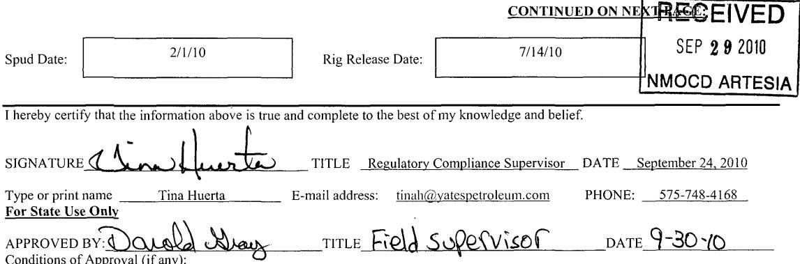

NMOCD ARTESIA

SIGNATURE

APPROVED BY: Donald Wary TITLE Field Supervisor DATE 9-30-10 Conditions of Approval (if any):

# Page 27

Yates Petroleum Corporation

Jericho BKJ State Com #2H

Section 15-T25S-R27E

Eddy County, New Mexico

Page 2

## Form C-103 continued:

9/11/10 – Spotted 1500g 7-1/2% HCL acid at 8654'. Perforated Bone Spring 8634' (9), 8484' (9), 8334' (9) and 8184' (9). Frac with a 30# borate gel, pumped 1500g 7-1/2% HCL acid, 64,803# Ottawa 40/70, 122,448# Ottawa 20/40, 81,814# Super LC 20/40. Spotted 1500g 7-1/2% HCL acid at 8054'. Perforated Bone Spring 8034' (9), 7884' (9), 7734' (9) and 7584' (9). Frac with a 30# borate gel, pumped 1500g 7-1/2% HCL acid, 62,996# Ottawa 40/70, 118,657# Ottawa 20/40, 81,550# Super LC 20/40. Spotted 1500g 7-1/2% HCL acid at 7454'. Perforated Bone Spring 7434' (9), 7284' (9), 7134' (9) and 6984' (9). Frac with a 30# borate gel, pumped 1500g 7-1/2% HCL acid, 62,528# Ottawa 40/70, 118,125# Ottawa 20/40, 82,525# Super LC 20/40. Spotted 1500g 7-1/2% HCL acid at 6854'. Perforated Bone Spring 6834' (9), 6684' (9), 6534' (9) and 6384' (9). Frac with a 30# borate gel, pumped 1500g 7-1/2% HCL acid, 23,248# Ottawa 40/70, 91,828# Ottawa 20/40, 71,106# Super LC 20/40. Flow thru plugs at 6854', 7454', 8054', 8654', 9250' and 9854'. AS-1 packer with 2.25" S-lok in place and 2-7/8" 6.5# L-80 tubing at 5600'.

Regulatory Compliance Supervisor

September 24, 2010

# Page 28

<table border=1 style='margin: auto; word-wrap: break-word;'><tr><td colspan="2">Submit To Appropriate District Office
Two Copies
District I</td><td colspan="3">State of New Mexico
Energy, Minerals and Natural Resources</td><td colspan="3">Form C-105
July 17, 2008</td></tr><tr><td colspan="2">1625 N. French Dr., Hobbs, NM 88240
District II</td><td rowspan="4" colspan="3">Oil Conservation Division
1220 South St. Francis Dr.
Santa Fe, NM 87505</td><td colspan="3">1. WELL API NO.
30-015-37500</td></tr><tr><td colspan="2">1301 W. Grand Avenue, Artesia, NM 88210
District III</td><td colspan="3">2. Type of Lease
☒ STATE ☐ FEE ☐ FED/INDIAN</td></tr><tr><td colspan="2">1000 Rio Brazos Rd., Aztec, NM 87410
District IV</td><td rowspan="2" colspan="3">3. State Oil &amp; Gas Lease No.
V-7318</td></tr><tr><td colspan="2">1220 S. St. Francis Dr., Santa Fe, NM 87505</td></tr><tr><td colspan="5">WELL COMPLETION OR RECOMPLETION REPORT AND LOG</td><td colspan="3">5. Lease Name or Unit Agreement Name
Jericho BKJ State Com</td></tr><tr><td colspan="5">4. Reason for filing:
☒ COMPLETION REPORT (Fill in boxes #1 through #31 for State and Fee wells only)
☐ C-144 CLOSURE ATTACHMENT (Fill in boxes #1 through #9, #15 Date Rig Released and #32 and/or #33; attach this and the plat to the C-144 closure report in accordance with 19.15.17.13.K NMAC)</td><td rowspan="2" colspan="2">6. Well Number:
2H</td><td rowspan="2">RECEIVED
OCT 18 2010</td></tr><tr><td colspan="5">7. Type of Completion:
☒ NEW WELL ☐ WORKOVER ☐ DEEPENING ☐ PLUGBACK ☐ DIFFERENT RESERVOIR ☐ OTHER</td></tr><tr><td colspan="5">8. Name of Operator
Yates Petroleum Corporation</td><td colspan="2">9. OGRID
025575</td><td style='text-align: center; word-wrap: break-word;'>NMOCD ARTESIA</td></tr><tr><td colspan="5">10. Address of Operator
105 South Fourth Street, Artesia, NM 88210</td><td colspan="3">11. Pool name or Wildcat Wildcat 6-02 S25271A Wildcat Bone Spring (Oil)</td></tr><tr><td style='text-align: center; word-wrap: break-word;'>12. Location</td><td style='text-align: center; word-wrap: break-word;'>Unit Ltr</td><td style='text-align: center; word-wrap: break-word;'>Section</td><td style='text-align: center; word-wrap: break-word;'>Township</td><td style='text-align: center; word-wrap: break-word;'>Range</td><td style='text-align: center; word-wrap: break-word;'>Lot</td><td style='text-align: center; word-wrap: break-word;'>Feet from the</td><td style='text-align: center; word-wrap: break-word;'>N/S Line</td></tr><tr><td style='text-align: center; word-wrap: break-word;'>Surface:</td><td style='text-align: center; word-wrap: break-word;'>A</td><td style='text-align: center; word-wrap: break-word;'>15</td><td style='text-align: center; word-wrap: break-word;'>25S</td><td style='text-align: center; word-wrap: break-word;'>27E</td><td style='text-align: center; word-wrap: break-word;'>660</td><td style='text-align: center; word-wrap: break-word;'>North</td><td style='text-align: center; word-wrap: break-word;'>330</td></tr><tr><td style='text-align: center; word-wrap: break-word;'>BH:</td><td style='text-align: center; word-wrap: break-word;'>D</td><td style='text-align: center; word-wrap: break-word;'>15</td><td style='text-align: center; word-wrap: break-word;'>25S</td><td style='text-align: center; word-wrap: break-word;'>27E</td><td style='text-align: center; word-wrap: break-word;'>703</td><td style='text-align: center; word-wrap: break-word;'>North</td><td style='text-align: center; word-wrap: break-word;'>4518</td></tr><tr><td style='text-align: center; word-wrap: break-word;'>13. Date Spudded RH 2/1/10
RT 6/18/10</td><td style='text-align: center; word-wrap: break-word;'>14. Date T.D. Reached
7/1/10</td><td style='text-align: center; word-wrap: break-word;'>15. Date Rig Released
7/14/10</td><td style='text-align: center; word-wrap: break-word;'>16. Date Completed (Ready to Produce)
9/20/10</td><td colspan="4">17. Elevations (DF and RKB, RT, GR, etc.)
3172&#x27;GR 3191&#x27;KB</td></tr><tr><td style='text-align: center; word-wrap: break-word;'>18. Total Measured Depth of Well
10,495&#x27;</td><td style='text-align: center; word-wrap: break-word;'>19. Plug Back Measured Depth
10,440&#x27;</td><td style='text-align: center; word-wrap: break-word;'>20. Was Directional Survey Made?
Yes (Attached)</td><td colspan="5">21. Type Electric and Other Logs Run
CNL, Hi-Res Laterolog Array, CBL</td></tr><tr><td colspan="5">22. Producing Interval(s), of this completion - Top, Bottom, Name
6384&#x27;- 10,434&#x27; Bone Spring</td><td colspan="3"></td></tr><tr><td colspan="8">23. CASING RECORD (Report all strings set in well)</td></tr><tr><td colspan="2">CASING SIZE</td><td style='text-align: center; word-wrap: break-word;'>WEIGHT LB./FT.</td><td style='text-align: center; word-wrap: break-word;'>DEPTH SET</td><td style='text-align: center; word-wrap: break-word;'>HOLE SIZE</td><td style='text-align: center; word-wrap: break-word;'>CEMENTING RECORD</td><td colspan="2">AMOUNT PULLED</td></tr><tr><td colspan="2">20&quot;</td><td style='text-align: center; word-wrap: break-word;'>Conductor</td><td style='text-align: center; word-wrap: break-word;'>40&#x27;</td><td style='text-align: center; word-wrap: break-word;'>26&quot;</td><td style='text-align: center; word-wrap: break-word;'>Redi-mix</td><td colspan="2"></td></tr><tr><td colspan="2">13-3/8&quot;</td><td style='text-align: center; word-wrap: break-word;'>48#</td><td style='text-align: center; word-wrap: break-word;'>470&#x27;</td><td style='text-align: center; word-wrap: break-word;'>17-1/2&quot;</td><td style='text-align: center; word-wrap: break-word;'>365 sx (circ)</td><td colspan="2"></td></tr><tr><td colspan="2">9-5/8&quot;</td><td style='text-align: center; word-wrap: break-word;'>36#</td><td style='text-align: center; word-wrap: break-word;'>2232&#x27;</td><td style='text-align: center; word-wrap: break-word;'>12-1/4&quot;</td><td style='text-align: center; word-wrap: break-word;'>760 sx (circ)</td><td colspan="2"></td></tr><tr><td colspan="2">5-1/2&quot;</td><td style='text-align: center; word-wrap: break-word;'>17#</td><td style='text-align: center; word-wrap: break-word;'>10,490&#x27;</td><td style='text-align: center; word-wrap: break-word;'>8-3/4&quot;</td><td style='text-align: center; word-wrap: break-word;'>1380 sx (TOC 1700&#x27;est)</td><td colspan="2"></td></tr><tr><td colspan="5">24. LINER RECORD</td><td colspan="3">25. TUBING RECORD</td></tr><tr><td style='text-align: center; word-wrap: break-word;'>SIZE</td><td style='text-align: center; word-wrap: break-word;'>TOP</td><td style='text-align: center; word-wrap: break-word;'>BOTTOM</td><td style='text-align: center; word-wrap: break-word;'>SACKS CEMENT</td><td style='text-align: center; word-wrap: break-word;'>SCREEN</td><td style='text-align: center; word-wrap: break-word;'>SIZE</td><td style='text-align: center; word-wrap: break-word;'>DEPTH SET</td><td style='text-align: center; word-wrap: break-word;'>PACKER SET</td></tr><tr><td style='text-align: center; word-wrap: break-word;'></td><td style='text-align: center; word-wrap: break-word;'></td><td style='text-align: center; word-wrap: break-word;'></td><td style='text-align: center; word-wrap: break-word;'></td><td style='text-align: center; word-wrap: break-word;'></td><td style='text-align: center; word-wrap: break-word;'></td><td style='text-align: center; word-wrap: break-word;'>2-7/8&quot;</td><td style='text-align: center; word-wrap: break-word;'>5600&#x27;</td></tr><tr><td rowspan="4" colspan="5">26. Perforation record (interval, size, and number)
SEE ATTACHED SHEET</td><td colspan="3">27. ACID, SHOT, FRACTURE, CEMENT, SQUEEZE, ETC.</td></tr><tr><td style='text-align: center; word-wrap: break-word;'>DEPTH INTERVAL</td><td colspan="2">AMOUNT AND KIND MATERIAL USED</td></tr><tr><td style='text-align: center; word-wrap: break-word;'></td><td colspan="2"></td></tr><tr><td colspan="3">SEE ATTACHED SHEET</td></tr><tr><td colspan="8">28. PRODUCTION</td></tr><tr><td colspan="2">Date First Production
9/21/10</td><td colspan="3">Production Method (Flowing, gas lift, pumping - Size and type pump)
Pumping</td><td colspan="3">Well Status (Prod. or Shut-in)
Producing</td></tr><tr><td style='text-align: center; word-wrap: break-word;'>Date of Test
10/7/10</td><td style='text-align: center; word-wrap: break-word;'>Hours Tested
24 hrs</td><td style='text-align: center; word-wrap: break-word;'>Choke Size
NA</td><td style='text-align: center; word-wrap: break-word;'>Prod&#x27;n For
Test Period</td><td style='text-align: center; word-wrap: break-word;'>Oil - Bbl
81</td><td style='text-align: center; word-wrap: break-word;'>Gas - MCF
4729</td><td style='text-align: center; word-wrap: break-word;'>Water - Bbl.
818</td><td style='text-align: center; word-wrap: break-word;'>Gas - Oil Ratio
NA</td></tr><tr><td style='text-align: center; word-wrap: break-word;'>Flow Tubing Press.
200 psi</td><td style='text-align: center; word-wrap: break-word;'>Casing Pressure
760 psi</td><td style='text-align: center; word-wrap: break-word;'>Calculated 24-
Hour Rate</td><td style='text-align: center; word-wrap: break-word;'>Oil - Bbl.
81</td><td style='text-align: center; word-wrap: break-word;'>Gas - MCF
4729</td><td style='text-align: center; word-wrap: break-word;'>Water - Bbl.
818</td><td colspan="2">Oil Gravity - API - (Corr.)
NA</td></tr><tr><td colspan="6">29. Disposition of Gas (Sold, used for fuel, vented, etc.)</td><td colspan="2">30. Test Witnessed By
R. Smith</td></tr><tr><td colspan="8">31. List Attachments</td></tr><tr><td colspan="8">Logs, Directional and Deviation Surveys</td></tr><tr><td colspan="8">32. If a temporary pit was used at the well, attach a plat with the location of the temporary pit.</td></tr><tr><td colspan="8">33. If an on-site burial was used at the well, report the exact location of the on-site burial:
Latitude Longitude NAD 1927 1983</td></tr><tr><td colspan="8">I hereby certify that the information shown on both sides of this form is true and complete to the best of my knowledge and belief
Signature Name Printed
Name Tina Huerta Title Regulatory Compliance Supervisor Date October 15, 2010</td></tr><tr><td colspan="8">E-mail Address linah@vatespetroleum.com</td></tr></table>

# Page 29

# INSTRUCTIONS

This form is to be filed with the appropriate District Office of the Division not later than 20 days after the completion of any newly-drilled or deepened well and not later than 60 days after completion of closure. When submitted as a completion report, this shall be accompanied by on copy of all electrical and radio-activity logs run on the well and a summary of all special tests conducted, including drill stem tests. All depths reported shall be measured depths. In the case of directionally drilled wells, true vertical depths shall also be reported. For multiple completion items 11, 12 and 26-31 shall be reported for each zone.

INDICATE FORMATION TOPS IN CONFORMANCE WITH GEOGRAPHICAL SECTION OF STATE

<table border=1 style='margin: auto; word-wrap: break-word;'><tr><td colspan="4">Southeastern New Mexico</td><td colspan="4">Northwestern New Mexico</td></tr><tr><td colspan="2">T. Anhy</td><td colspan="2">T. Canyon</td><td colspan="3">T. Ojo Alamo</td><td style='text-align: center; word-wrap: break-word;'>T. Penn A</td></tr><tr><td style='text-align: center; word-wrap: break-word;'>T. Salt</td><td style='text-align: center; word-wrap: break-word;'>734&#x27;</td><td colspan="2">T. Strawn</td><td colspan="3">T. Kirtland</td><td style='text-align: center; word-wrap: break-word;'>T. Penn. &quot;B</td></tr><tr><td style='text-align: center; word-wrap: break-word;'>B. Salt</td><td style='text-align: center; word-wrap: break-word;'>2117&#x27;</td><td colspan="2">T. Atoka</td><td colspan="3">T. Fruitland</td><td style='text-align: center; word-wrap: break-word;'>T. Penn. &quot;C</td></tr><tr><td colspan="2">T. Yates</td><td colspan="2">T. Miss</td><td colspan="3">T. Pictured Cliffs</td><td style='text-align: center; word-wrap: break-word;'>T. Penn. &quot;D</td></tr><tr><td colspan="2">T. 7 Rivers</td><td colspan="2">T. Devonian</td><td colspan="3">T. Cliff House</td><td style='text-align: center; word-wrap: break-word;'>T. Leadville</td></tr><tr><td colspan="2">T. Queen</td><td colspan="2">T. Silurian</td><td colspan="3">T. Menefee</td><td style='text-align: center; word-wrap: break-word;'>T. Madison</td></tr><tr><td colspan="2">T. Grayburg</td><td colspan="2">T. Montoya</td><td colspan="3">T. Point Lookout</td><td style='text-align: center; word-wrap: break-word;'>T. Elbert</td></tr><tr><td colspan="2">T. San Andres</td><td colspan="2">T. Simpson</td><td colspan="3">T. Mancos</td><td style='text-align: center; word-wrap: break-word;'>T. McCracken</td></tr><tr><td colspan="2">T. Glorieta</td><td colspan="2">T. McKee</td><td colspan="3">T. Gallup</td><td style='text-align: center; word-wrap: break-word;'>T. Ignacio Otzte</td></tr><tr><td colspan="2">T. Paddock</td><td colspan="2">T. Ellenburger</td><td colspan="3">Base Greenhorn</td><td style='text-align: center; word-wrap: break-word;'>T. Granite</td></tr><tr><td colspan="2">T. Blinebry</td><td colspan="2">T. Gr. Wash</td><td colspan="3">T. Dakota</td><td style='text-align: center; word-wrap: break-word;'></td></tr><tr><td colspan="2">T.Tubb</td><td style='text-align: center; word-wrap: break-word;'>T. Castile</td><td style='text-align: center; word-wrap: break-word;'>460&#x27;</td><td colspan="3">T. Morrison</td><td style='text-align: center; word-wrap: break-word;'></td></tr><tr><td colspan="2">T. Drinkard</td><td style='text-align: center; word-wrap: break-word;'>T. Bell Canyon</td><td style='text-align: center; word-wrap: break-word;'>2358&#x27;</td><td colspan="3">T.Todilto</td><td style='text-align: center; word-wrap: break-word;'></td></tr><tr><td colspan="2">T. Abo</td><td style='text-align: center; word-wrap: break-word;'>T. Cherry Canyon</td><td style='text-align: center; word-wrap: break-word;'>3174&#x27;</td><td colspan="3">T. Entrada</td><td style='text-align: center; word-wrap: break-word;'></td></tr><tr><td colspan="2">T. Wolfcamp</td><td style='text-align: center; word-wrap: break-word;'>T. Brushy Canyon</td><td style='text-align: center; word-wrap: break-word;'>4250&#x27;</td><td colspan="3">T. Wingate</td><td style='text-align: center; word-wrap: break-word;'></td></tr><tr><td colspan="2">T. Penn</td><td style='text-align: center; word-wrap: break-word;'>T. Bone Spring</td><td style='text-align: center; word-wrap: break-word;'>5828&#x27;</td><td colspan="3">T. Chinle</td><td style='text-align: center; word-wrap: break-word;'></td></tr><tr><td colspan="2">T. Cisco</td><td colspan="2">T</td><td colspan="3">T. Permian</td><td style='text-align: center; word-wrap: break-word;'></td></tr><tr><td colspan="8">OIL OR GAS SANOR ZONES</td></tr><tr><td colspan="8">No. 1, from...................................................to........................... No. 3, from...................................................to........................... No. 2, from...................................................to........................... No. 4, from...................................................to...........................</td></tr><tr><td colspan="8">IMPORTANT WATER SANDS</td></tr><tr><td colspan="8">Include data on rate of water inflow and elevation to which water rose in hole.</td></tr><tr><td colspan="8">No. 1, from...................................................to........................... feet...........................................</td></tr><tr><td colspan="8">No. 2, from...................................................to........................... feet...........................................</td></tr><tr><td colspan="8">No. 3, from...................................................to........................... feet...........................................</td></tr><tr><td colspan="8">LITHOLOGY RECORD (Attach additional sheet if necessary)</td></tr><tr><td style='text-align: center; word-wrap: break-word;'>From</td><td style='text-align: center; word-wrap: break-word;'>To</td><td style='text-align: center; word-wrap: break-word;'>Thickness In Feet</td><td style='text-align: center; word-wrap: break-word;'>Lithology</td><td style='text-align: center; word-wrap: break-word;'>From</td><td style='text-align: center; word-wrap: break-word;'>To</td><td style='text-align: center; word-wrap: break-word;'>Thickness In Feet</td><td style='text-align: center; word-wrap: break-word;'>Lithology</td></tr><tr><td style='text-align: center; word-wrap: break-word;'></td><td style='text-align: center; word-wrap: break-word;'></td><td style='text-align: center; word-wrap: break-word;'></td><td style='text-align: center; word-wrap: break-word;'></td><td style='text-align: center; word-wrap: break-word;'></td><td style='text-align: center; word-wrap: break-word;'></td><td style='text-align: center; word-wrap: break-word;'></td><td style='text-align: center; word-wrap: break-word;'></td></tr></table>

# Page 30

## Form C-105 continued:

<table border=1 style='margin: auto; word-wrap: break-word;'><tr><td colspan="3">26. Perforation Record (interval, size and number)</td></tr><tr><td style='text-align: center; word-wrap: break-word;'>10,434&#x27; (9)</td><td style='text-align: center; word-wrap: break-word;'>8334&#x27; (9)</td><td style='text-align: center; word-wrap: break-word;'></td></tr><tr><td style='text-align: center; word-wrap: break-word;'>10,284&#x27; (9)</td><td style='text-align: center; word-wrap: break-word;'>8184&#x27; (9)</td><td style='text-align: center; word-wrap: break-word;'></td></tr><tr><td style='text-align: center; word-wrap: break-word;'>10,134&#x27; (9)</td><td style='text-align: center; word-wrap: break-word;'>8034&#x27; (9)</td><td style='text-align: center; word-wrap: break-word;'></td></tr><tr><td style='text-align: center; word-wrap: break-word;'>9984&#x27; (9)</td><td style='text-align: center; word-wrap: break-word;'>7884&#x27; (9)</td><td style='text-align: center; word-wrap: break-word;'></td></tr><tr><td style='text-align: center; word-wrap: break-word;'>9834&#x27; (9)</td><td style='text-align: center; word-wrap: break-word;'>7734&#x27; (9)</td><td style='text-align: center; word-wrap: break-word;'></td></tr><tr><td style='text-align: center; word-wrap: break-word;'>9684&#x27; (9)</td><td style='text-align: center; word-wrap: break-word;'>7584&#x27; (9)</td><td style='text-align: center; word-wrap: break-word;'></td></tr><tr><td style='text-align: center; word-wrap: break-word;'>9534&#x27; (9)</td><td style='text-align: center; word-wrap: break-word;'>7434&#x27; (9)</td><td style='text-align: center; word-wrap: break-word;'></td></tr><tr><td style='text-align: center; word-wrap: break-word;'>9384&#x27; (9)</td><td style='text-align: center; word-wrap: break-word;'>7284&#x27; (9)</td><td style='text-align: center; word-wrap: break-word;'></td></tr><tr><td style='text-align: center; word-wrap: break-word;'>9234&#x27; (9)</td><td style='text-align: center; word-wrap: break-word;'>7134&#x27; (9)</td><td style='text-align: center; word-wrap: break-word;'></td></tr><tr><td style='text-align: center; word-wrap: break-word;'>9084&#x27; (9)</td><td style='text-align: center; word-wrap: break-word;'>6984&#x27; (9)</td><td style='text-align: center; word-wrap: break-word;'></td></tr><tr><td style='text-align: center; word-wrap: break-word;'>8934&#x27; (9)</td><td style='text-align: center; word-wrap: break-word;'>6834&#x27; (9)</td><td style='text-align: center; word-wrap: break-word;'></td></tr><tr><td style='text-align: center; word-wrap: break-word;'>8734&#x27; (9)</td><td style='text-align: center; word-wrap: break-word;'>6684&#x27; (9)</td><td style='text-align: center; word-wrap: break-word;'></td></tr><tr><td style='text-align: center; word-wrap: break-word;'>8634&#x27; (9)</td><td style='text-align: center; word-wrap: break-word;'>6534&#x27; (9)</td><td style='text-align: center; word-wrap: break-word;'></td></tr><tr><td style='text-align: center; word-wrap: break-word;'>8484&#x27; (9)</td><td style='text-align: center; word-wrap: break-word;'>6384&#x27; (9)</td><td style='text-align: center; word-wrap: break-word;'></td></tr></table>

<table border=1 style='margin: auto; word-wrap: break-word;'><tr><td colspan="2">27. Acid, Shot, Fracture, Cement, Squeeze, Etc.</td></tr><tr><td style='text-align: center; word-wrap: break-word;'>Depth Interval</td><td style='text-align: center; word-wrap: break-word;'>Amount and Kind Material Used</td></tr><tr><td style='text-align: center; word-wrap: break-word;'>9984&#x27;-10,434&#x27;</td><td style='text-align: center; word-wrap: break-word;'>Frac with a 30# borate gel, pumped 66,508# Ottawa 40/70, 73,044# Super LC 20/40, 38,655# into formation</td></tr><tr><td style='text-align: center; word-wrap: break-word;'>9854&#x27;</td><td style='text-align: center; word-wrap: break-word;'>Spotted 1500g 7-1/2% HCL acid</td></tr><tr><td style='text-align: center; word-wrap: break-word;'>9384&#x27;-9834&#x27;</td><td style='text-align: center; word-wrap: break-word;'>Frac with a 30# borate gel, pumped 1500g 7-1/2% HCL acid, 59,417# Ottawa 40/70, 120,000# Ottawa 20/40, 80,000# Super LC 20/40</td></tr><tr><td style='text-align: center; word-wrap: break-word;'>9250&#x27;</td><td style='text-align: center; word-wrap: break-word;'>Spotted 1500g 7-1/2% HCL acid</td></tr><tr><td style='text-align: center; word-wrap: break-word;'>8734&#x27;-9234&#x27;</td><td style='text-align: center; word-wrap: break-word;'>Frac with a 30# borate gel, pumped 1500g 7-1/2% HCL acid, 65,013# 40/70, 124,965# Ottawa 20/40, 78,743# Super LC 20/40</td></tr><tr><td style='text-align: center; word-wrap: break-word;'>8654&#x27;</td><td style='text-align: center; word-wrap: break-word;'>Spotted 1500g 7-1/2% HCL acid</td></tr><tr><td style='text-align: center; word-wrap: break-word;'>8184&#x27;-8634&#x27;</td><td style='text-align: center; word-wrap: break-word;'>Frac with a 30# borate gel, pumped 1500g 7-1/2% HCL acid, 64,803# Ottawa 40/70, 122,448# Ottawa 20/40, 81,814# Super LC 20/40</td></tr><tr><td style='text-align: center; word-wrap: break-word;'>8054&#x27;</td><td style='text-align: center; word-wrap: break-word;'>Spotted 1500g 7-1/2% HCL acid</td></tr><tr><td style='text-align: center; word-wrap: break-word;'>7584&#x27;-8034&#x27;</td><td style='text-align: center; word-wrap: break-word;'>Frac with a 30# borate gel, pumped 1500g 7-1/2% HCL acid, 62,996# Ottawa 40/70, 118,657# Ottawa 20/40, 81,550# Super LC 20/40</td></tr><tr><td style='text-align: center; word-wrap: break-word;'>7454&#x27;</td><td style='text-align: center; word-wrap: break-word;'>Spotted 1500g 7-1/2% HCL acid</td></tr><tr><td style='text-align: center; word-wrap: break-word;'>6984&#x27;-7434&#x27;</td><td style='text-align: center; word-wrap: break-word;'>Frac with a 30# borate gel, pumped 1500g 7-1/2% HCL acid, 62,528# Ottawa 40/70, 118,125# Ottawa 20/40, 82,525# Super LC 20/40</td></tr><tr><td style='text-align: center; word-wrap: break-word;'>6854&#x27;</td><td style='text-align: center; word-wrap: break-word;'>Spotted 1500g 7-1/2% HCL acid</td></tr><tr><td style='text-align: center; word-wrap: break-word;'>6384&#x27;-6834&#x27;</td><td style='text-align: center; word-wrap: break-word;'>Frac with a 30# borate gel, pumped 1500g 7-1/2% HCL acid, 23,248# Ottawa 40/70, 91,828# Ottawa 20/40, 71,106# Super LC 20/40</td></tr></table>

Regulatory Compliance Supervisor

October 15, 2010

# Page 31

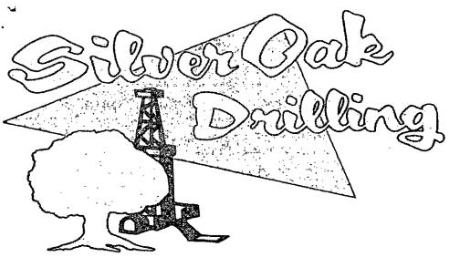

PO Box 1370

Artesia, NM 88211-1370

(505) 748-1288

July 15, 2010

Yates Petroleum Corporation

105 S. 4th

Artesia, NM 88211-1395

RE: Jericho BKJ St Com.#2H

660' F2L & 330' FEL

Sec. 15, T25S, R27E

Eddy County, New Mexico

Dear Sir,

The attached is the Deviation Survey for the above captioned well.

Very truly yours,

Eddie LaRue Operations Manager

State of New Mexico }

County of Eddy }

The foregoing was acknowledged before me this 15th day of July, 2010.

# Page 32

<table border=1 style='margin: auto; word-wrap: break-word;'><tr><td style='text-align: center; word-wrap: break-word;'># Date</td><td style='text-align: center; word-wrap: break-word;'>Depth</td><td style='text-align: center; word-wrap: break-word;'>Deviation</td><td style='text-align: center; word-wrap: break-word;'>Direction</td><td style='text-align: center; word-wrap: break-word;'>TVD</td><td style='text-align: center; word-wrap: break-word;'>Horiz</td></tr><tr><td style='text-align: center; word-wrap: break-word;'>6/18/2010</td><td style='text-align: center; word-wrap: break-word;'>214</td><td style='text-align: center; word-wrap: break-word;'>0.80</td><td style='text-align: center; word-wrap: break-word;'>0.00</td><td style='text-align: center; word-wrap: break-word;'>0.00</td><td style='text-align: center; word-wrap: break-word;'>0.00</td></tr><tr><td style='text-align: center; word-wrap: break-word;'>6/20/2010</td><td style='text-align: center; word-wrap: break-word;'>420</td><td style='text-align: center; word-wrap: break-word;'>1.60</td><td style='text-align: center; word-wrap: break-word;'>0.00</td><td style='text-align: center; word-wrap: break-word;'>0.00</td><td style='text-align: center; word-wrap: break-word;'>0.00</td></tr><tr><td style='text-align: center; word-wrap: break-word;'>6/20/2010</td><td style='text-align: center; word-wrap: break-word;'>522</td><td style='text-align: center; word-wrap: break-word;'>1.23</td><td style='text-align: center; word-wrap: break-word;'>279.05</td><td style='text-align: center; word-wrap: break-word;'>0.00</td><td style='text-align: center; word-wrap: break-word;'>0.00</td></tr><tr><td style='text-align: center; word-wrap: break-word;'>6/20/2010</td><td style='text-align: center; word-wrap: break-word;'>706</td><td style='text-align: center; word-wrap: break-word;'>2.29</td><td style='text-align: center; word-wrap: break-word;'>283.15</td><td style='text-align: center; word-wrap: break-word;'>0.00</td><td style='text-align: center; word-wrap: break-word;'>0.00</td></tr><tr><td style='text-align: center; word-wrap: break-word;'>6/20/2010</td><td style='text-align: center; word-wrap: break-word;'>890</td><td style='text-align: center; word-wrap: break-word;'>1.23</td><td style='text-align: center; word-wrap: break-word;'>0.00</td><td style='text-align: center; word-wrap: break-word;'>0.00</td><td style='text-align: center; word-wrap: break-word;'>0.00</td></tr><tr><td style='text-align: center; word-wrap: break-word;'>6/20/2010</td><td style='text-align: center; word-wrap: break-word;'>1074</td><td style='text-align: center; word-wrap: break-word;'>1.49</td><td style='text-align: center; word-wrap: break-word;'>0.00</td><td style='text-align: center; word-wrap: break-word;'>0.00</td><td style='text-align: center; word-wrap: break-word;'>0.00</td></tr><tr><td style='text-align: center; word-wrap: break-word;'>6/20/2010</td><td style='text-align: center; word-wrap: break-word;'>1259</td><td style='text-align: center; word-wrap: break-word;'>2.10</td><td style='text-align: center; word-wrap: break-word;'>280.64</td><td style='text-align: center; word-wrap: break-word;'>0.00</td><td style='text-align: center; word-wrap: break-word;'>0.00</td></tr><tr><td style='text-align: center; word-wrap: break-word;'>6/21/2010</td><td style='text-align: center; word-wrap: break-word;'>1449</td><td style='text-align: center; word-wrap: break-word;'>2.55</td><td style='text-align: center; word-wrap: break-word;'>272.64</td><td style='text-align: center; word-wrap: break-word;'>0.00</td><td style='text-align: center; word-wrap: break-word;'>0.00</td></tr><tr><td style='text-align: center; word-wrap: break-word;'>6/21/2010</td><td style='text-align: center; word-wrap: break-word;'>1544</td><td style='text-align: center; word-wrap: break-word;'>2.20</td><td style='text-align: center; word-wrap: break-word;'>269.43</td><td style='text-align: center; word-wrap: break-word;'>0.00</td><td style='text-align: center; word-wrap: break-word;'>0.00</td></tr><tr><td style='text-align: center; word-wrap: break-word;'>6/21/2010</td><td style='text-align: center; word-wrap: break-word;'>1639</td><td style='text-align: center; word-wrap: break-word;'>0.62</td><td style='text-align: center; word-wrap: break-word;'>220.50</td><td style='text-align: center; word-wrap: break-word;'>0.00</td><td style='text-align: center; word-wrap: break-word;'>0.00</td></tr><tr><td style='text-align: center; word-wrap: break-word;'>6/21/2010</td><td style='text-align: center; word-wrap: break-word;'>1830</td><td style='text-align: center; word-wrap: break-word;'>1.41</td><td style='text-align: center; word-wrap: break-word;'>119.44</td><td style='text-align: center; word-wrap: break-word;'>0.00</td><td style='text-align: center; word-wrap: break-word;'>0.00</td></tr><tr><td style='text-align: center; word-wrap: break-word;'>6/21/2010</td><td style='text-align: center; word-wrap: break-word;'>2019</td><td style='text-align: center; word-wrap: break-word;'>3.34</td><td style='text-align: center; word-wrap: break-word;'>103.74</td><td style='text-align: center; word-wrap: break-word;'>0.00</td><td style='text-align: center; word-wrap: break-word;'>0.00</td></tr><tr><td style='text-align: center; word-wrap: break-word;'>6/21/2010</td><td style='text-align: center; word-wrap: break-word;'>2178</td><td style='text-align: center; word-wrap: break-word;'>2.46</td><td style='text-align: center; word-wrap: break-word;'>82.33</td><td style='text-align: center; word-wrap: break-word;'>0.00</td><td style='text-align: center; word-wrap: break-word;'>0.00</td></tr><tr><td style='text-align: center; word-wrap: break-word;'>6/23/2010</td><td style='text-align: center; word-wrap: break-word;'>2284</td><td style='text-align: center; word-wrap: break-word;'>2.20</td><td style='text-align: center; word-wrap: break-word;'>75.53</td><td style='text-align: center; word-wrap: break-word;'>0.00</td><td style='text-align: center; word-wrap: break-word;'>0.00</td></tr><tr><td style='text-align: center; word-wrap: break-word;'>6/23/2010</td><td style='text-align: center; word-wrap: break-word;'>2537</td><td style='text-align: center; word-wrap: break-word;'>0.88</td><td style='text-align: center; word-wrap: break-word;'>356.49</td><td style='text-align: center; word-wrap: break-word;'>0.00</td><td style='text-align: center; word-wrap: break-word;'>0.00</td></tr><tr><td style='text-align: center; word-wrap: break-word;'>6/23/2010</td><td style='text-align: center; word-wrap: break-word;'>3012</td><td style='text-align: center; word-wrap: break-word;'>0.79</td><td style='text-align: center; word-wrap: break-word;'>20.18</td><td style='text-align: center; word-wrap: break-word;'>0.00</td><td style='text-align: center; word-wrap: break-word;'>0.00</td></tr><tr><td style='text-align: center; word-wrap: break-word;'>6/23/2010</td><td style='text-align: center; word-wrap: break-word;'>3488</td><td style='text-align: center; word-wrap: break-word;'>0.26</td><td style='text-align: center; word-wrap: break-word;'>42.72</td><td style='text-align: center; word-wrap: break-word;'>0.00</td><td style='text-align: center; word-wrap: break-word;'>0.00</td></tr><tr><td style='text-align: center; word-wrap: break-word;'>6/23/2010</td><td style='text-align: center; word-wrap: break-word;'>3964</td><td style='text-align: center; word-wrap: break-word;'>0.18</td><td style='text-align: center; word-wrap: break-word;'>218.12</td><td style='text-align: center; word-wrap: break-word;'>0.00</td><td style='text-align: center; word-wrap: break-word;'>0.00</td></tr><tr><td style='text-align: center; word-wrap: break-word;'>6/24/2010</td><td style='text-align: center; word-wrap: break-word;'>4439</td><td style='text-align: center; word-wrap: break-word;'>0.79</td><td style='text-align: center; word-wrap: break-word;'>185.89</td><td style='text-align: center; word-wrap: break-word;'>0.00</td><td style='text-align: center; word-wrap: break-word;'>0.00</td></tr><tr><td style='text-align: center; word-wrap: break-word;'>6/24/2010</td><td style='text-align: center; word-wrap: break-word;'>4915</td><td style='text-align: center; word-wrap: break-word;'>0.97</td><td style='text-align: center; word-wrap: break-word;'>81.76</td><td style='text-align: center; word-wrap: break-word;'>0.00</td><td style='text-align: center; word-wrap: break-word;'>0.00</td></tr><tr><td style='text-align: center; word-wrap: break-word;'>6/24/2010</td><td style='text-align: center; word-wrap: break-word;'>5390</td><td style='text-align: center; word-wrap: break-word;'>0.97</td><td style='text-align: center; word-wrap: break-word;'>96.81</td><td style='text-align: center; word-wrap: break-word;'>0.00</td><td style='text-align: center; word-wrap: break-word;'>0.00</td></tr><tr><td style='text-align: center; word-wrap: break-word;'>6/25/2010</td><td style='text-align: center; word-wrap: break-word;'>5869</td><td style='text-align: center; word-wrap: break-word;'>0.79</td><td style='text-align: center; word-wrap: break-word;'>197.15</td><td style='text-align: center; word-wrap: break-word;'>0.00</td><td style='text-align: center; word-wrap: break-word;'>0.00</td></tr><tr><td style='text-align: center; word-wrap: break-word;'>6/25/2010</td><td style='text-align: center; word-wrap: break-word;'>6336</td><td style='text-align: center; word-wrap: break-word;'>0.44</td><td style='text-align: center; word-wrap: break-word;'>85.98</td><td style='text-align: center; word-wrap: break-word;'>0.00</td><td style='text-align: center; word-wrap: break-word;'>0.00</td></tr><tr><td style='text-align: center; word-wrap: break-word;'>6/26/2010</td><td style='text-align: center; word-wrap: break-word;'>6800</td><td style='text-align: center; word-wrap: break-word;'>1.32</td><td style='text-align: center; word-wrap: break-word;'>203.05</td><td style='text-align: center; word-wrap: break-word;'>0.00</td><td style='text-align: center; word-wrap: break-word;'>0.00</td></tr><tr><td style='text-align: center; word-wrap: break-word;'>6/27/2010</td><td style='text-align: center; word-wrap: break-word;'>7267</td><td style='text-align: center; word-wrap: break-word;'>0.79</td><td style='text-align: center; word-wrap: break-word;'>288.38</td><td style='text-align: center; word-wrap: break-word;'>0.00</td><td style='text-align: center; word-wrap: break-word;'>0.00</td></tr><tr><td style='text-align: center; word-wrap: break-word;'>6/27/2010</td><td style='text-align: center; word-wrap: break-word;'>7735</td><td style='text-align: center; word-wrap: break-word;'>5.80</td><td style='text-align: center; word-wrap: break-word;'>31.06</td><td style='text-align: center; word-wrap: break-word;'>0.00</td><td style='text-align: center; word-wrap: break-word;'>0.00</td></tr><tr><td style='text-align: center; word-wrap: break-word;'>6/27/2010</td><td style='text-align: center; word-wrap: break-word;'>7922</td><td style='text-align: center; word-wrap: break-word;'>3.52</td><td style='text-align: center; word-wrap: break-word;'>60.81</td><td style='text-align: center; word-wrap: break-word;'>0.00</td><td style='text-align: center; word-wrap: break-word;'>0.00</td></tr><tr><td style='text-align: center; word-wrap: break-word;'>6/28/2010</td><td style='text-align: center; word-wrap: break-word;'>8295</td><td style='text-align: center; word-wrap: break-word;'>1.85</td><td style='text-align: center; word-wrap: break-word;'>68.51</td><td style='text-align: center; word-wrap: break-word;'>0.00</td><td style='text-align: center; word-wrap: break-word;'>0.00</td></tr><tr><td style='text-align: center; word-wrap: break-word;'>6/28/2010</td><td style='text-align: center; word-wrap: break-word;'>8453</td><td style='text-align: center; word-wrap: break-word;'>0.70</td><td style='text-align: center; word-wrap: break-word;'>49.36</td><td style='text-align: center; word-wrap: break-word;'>0.00</td><td style='text-align: center; word-wrap: break-word;'>0.00</td></tr><tr><td style='text-align: center; word-wrap: break-word;'>7/3/2010</td><td style='text-align: center; word-wrap: break-word;'>5641</td><td style='text-align: center; word-wrap: break-word;'>1.06</td><td style='text-align: center; word-wrap: break-word;'>130.28</td><td style='text-align: center; word-wrap: break-word;'>0.00</td><td style='text-align: center; word-wrap: break-word;'>0.00</td></tr><tr><td style='text-align: center; word-wrap: break-word;'>7/3/2010</td><td style='text-align: center; word-wrap: break-word;'>5672</td><td style='text-align: center; word-wrap: break-word;'>0.79</td><td style='text-align: center; word-wrap: break-word;'>141.99</td><td style='text-align: center; word-wrap: break-word;'>5670.00</td><td style='text-align: center; word-wrap: break-word;'>2.42</td></tr><tr><td style='text-align: center; word-wrap: break-word;'>7/3/2010</td><td style='text-align: center; word-wrap: break-word;'>5704</td><td style='text-align: center; word-wrap: break-word;'>1.14</td><td style='text-align: center; word-wrap: break-word;'>241.40</td><td style='text-align: center; word-wrap: break-word;'>5702.00</td><td style='text-align: center; word-wrap: break-word;'>2.56</td></tr><tr><td style='text-align: center; word-wrap: break-word;'>7/3/2010</td><td style='text-align: center; word-wrap: break-word;'>5736</td><td style='text-align: center; word-wrap: break-word;'>3.96</td><td style='text-align: center; word-wrap: break-word;'>268.53</td><td style='text-align: center; word-wrap: break-word;'>5734.00</td><td style='text-align: center; word-wrap: break-word;'>3.95</td></tr><tr><td style='text-align: center; word-wrap: break-word;'>7/4/2010</td><td style='text-align: center; word-wrap: break-word;'>5767</td><td style='text-align: center; word-wrap: break-word;'>8.18</td><td style='text-align: center; word-wrap: break-word;'>272.15</td><td style='text-align: center; word-wrap: break-word;'>5765.00</td><td style='text-align: center; word-wrap: break-word;'>7.20</td></tr><tr><td style='text-align: center; word-wrap: break-word;'>7/4/2010</td><td style='text-align: center; word-wrap: break-word;'>5799</td><td style='text-align: center; word-wrap: break-word;'>12.75</td><td style='text-align: center; word-wrap: break-word;'>273.49</td><td style='text-align: center; word-wrap: break-word;'>5797.00</td><td style='text-align: center; word-wrap: break-word;'>13.00</td></tr><tr><td style='text-align: center; word-wrap: break-word;'>7/4/2010</td><td style='text-align: center; word-wrap: break-word;'>5831</td><td style='text-align: center; word-wrap: break-word;'>17.59</td><td style='text-align: center; word-wrap: break-word;'>274.15</td><td style='text-align: center; word-wrap: break-word;'>5828.00</td><td style='text-align: center; word-wrap: break-word;'>15.13</td></tr><tr><td style='text-align: center; word-wrap: break-word;'>7/4/2010</td><td style='text-align: center; word-wrap: break-word;'>5862</td><td style='text-align: center; word-wrap: break-word;'>22.42</td><td style='text-align: center; word-wrap: break-word;'>274.20</td><td style='text-align: center; word-wrap: break-word;'>5857.00</td><td style='text-align: center; word-wrap: break-word;'>31.96</td></tr><tr><td style='text-align: center; word-wrap: break-word;'>7/4/2010</td><td style='text-align: center; word-wrap: break-word;'>5894</td><td style='text-align: center; word-wrap: break-word;'>27.08</td><td style='text-align: center; word-wrap: break-word;'>272.81</td><td style='text-align: center; word-wrap: break-word;'>5886.00</td><td style='text-align: center; word-wrap: break-word;'>45.33</td></tr><tr><td style='text-align: center; word-wrap: break-word;'>7/4/2010</td><td style='text-align: center; word-wrap: break-word;'>5926</td><td style='text-align: center; word-wrap: break-word;'>30.86</td><td style='text-align: center; word-wrap: break-word;'>270.80</td><td style='text-align: center; word-wrap: break-word;'>59.14</td><td style='text-align: center; word-wrap: break-word;'>60.80</td></tr><tr><td style='text-align: center; word-wrap: break-word;'>7/4/2010</td><td style='text-align: center; word-wrap: break-word;'>5958</td><td style='text-align: center; word-wrap: break-word;'>33.94</td><td style='text-align: center; word-wrap: break-word;'>269.82</td><td style='text-align: center; word-wrap: break-word;'>0.00</td><td style='text-align: center; word-wrap: break-word;'>0.00</td></tr><tr><td style='text-align: center; word-wrap: break-word;'>7/4/2010</td><td style='text-align: center; word-wrap: break-word;'>5989</td><td style='text-align: center; word-wrap: break-word;'>37.02</td><td style='text-align: center; word-wrap: break-word;'>269.03</td><td style='text-align: center; word-wrap: break-word;'>5966.00</td><td style='text-align: center; word-wrap: break-word;'>95.95</td></tr><tr><td style='text-align: center; word-wrap: break-word;'>7/4/2010</td><td style='text-align: center; word-wrap: break-word;'>6026</td><td style='text-align: center; word-wrap: break-word;'>41.33</td><td style='text-align: center; word-wrap: break-word;'>268.15</td><td style='text-align: center; word-wrap: break-word;'>5995.00</td><td style='text-align: center; word-wrap: break-word;'>119.00</td></tr><tr><td style='text-align: center; word-wrap: break-word;'>7/4/2010</td><td style='text-align: center; word-wrap: break-word;'>6057</td><td style='text-align: center; word-wrap: break-word;'>45.99</td><td style='text-align: center; word-wrap: break-word;'>267.30</td><td style='text-align: center; word-wrap: break-word;'>6017.00</td><td style='text-align: center; word-wrap: break-word;'>140.00</td></tr><tr><td style='text-align: center; word-wrap: break-word;'>7/5/2010</td><td style='text-align: center; word-wrap: break-word;'>6088</td><td style='text-align: center; word-wrap: break-word;'>50.65</td><td style='text-align: center; word-wrap: break-word;'>266.73</td><td style='text-align: center; word-wrap: break-word;'>6038.00</td><td style='text-align: center; word-wrap: break-word;'>163.00</td></tr><tr><td style='text-align: center; word-wrap: break-word;'>7/5/2010</td><td style='text-align: center; word-wrap: break-word;'>6119</td><td style='text-align: center; word-wrap: break-word;'>55.49</td><td style='text-align: center; word-wrap: break-word;'>267.02</td><td style='text-align: center; word-wrap: break-word;'>6056.00</td><td style='text-align: center; word-wrap: break-word;'>188.00</td></tr><tr><td style='text-align: center; word-wrap: break-word;'>7/5/2010</td><td style='text-align: center; word-wrap: break-word;'>6150</td><td style='text-align: center; word-wrap: break-word;'>59.18</td><td style='text-align: center; word-wrap: break-word;'>267.24</td><td style='text-align: center; word-wrap: break-word;'>6073.00</td><td style='text-align: center; word-wrap: break-word;'>214.00</td></tr><tr><td style='text-align: center; word-wrap: break-word;'>7/5/2010</td><td style='text-align: center; word-wrap: break-word;'>6181</td><td style='text-align: center; word-wrap: break-word;'>61.99</td><td style='text-align: center; word-wrap: break-word;'>269.95</td><td style='text-align: center; word-wrap: break-word;'>6088.00</td><td style='text-align: center; word-wrap: break-word;'>241.00</td></tr><tr><td style='text-align: center; word-wrap: break-word;'>7/5/2010</td><td style='text-align: center; word-wrap: break-word;'>6213</td><td style='text-align: center; word-wrap: break-word;'>64.98</td><td style='text-align: center; word-wrap: break-word;'>270.90</td><td style='text-align: center; word-wrap: break-word;'>6103.00</td><td style='text-align: center; word-wrap: break-word;'>270.00</td></tr><tr><td style='text-align: center; word-wrap: break-word;'>7/5/2010</td><td style='text-align: center; word-wrap: break-word;'>6224</td><td style='text-align: center; word-wrap: break-word;'>67.97</td><td style='text-align: center; word-wrap: break-word;'>272.00</td><td style='text-align: center; word-wrap: break-word;'>6115.00</td><td style='text-align: center; word-wrap: break-word;'>298.00</td></tr></table>

# Page 33

<table border=1 style='margin: auto; word-wrap: break-word;'><tr><td style='text-align: center; word-wrap: break-word;'># Date</td><td style='text-align: center; word-wrap: break-word;'>Depth</td><td style='text-align: center; word-wrap: break-word;'>Deviation</td><td style='text-align: center; word-wrap: break-word;'>Direction</td><td style='text-align: center; word-wrap: break-word;'>TVD</td><td style='text-align: center; word-wrap: break-word;'>Horiz</td></tr><tr><td style='text-align: center; word-wrap: break-word;'>7/5/2010</td><td style='text-align: center; word-wrap: break-word;'>6275</td><td style='text-align: center; word-wrap: break-word;'>71.84</td><td style='text-align: center; word-wrap: break-word;'>272.79</td><td style='text-align: center; word-wrap: break-word;'>6126.00</td><td style='text-align: center; word-wrap: break-word;'>327.00</td></tr><tr><td style='text-align: center; word-wrap: break-word;'>7/5/2010</td><td style='text-align: center; word-wrap: break-word;'>6306</td><td style='text-align: center; word-wrap: break-word;'>76.41</td><td style='text-align: center; word-wrap: break-word;'>272.22</td><td style='text-align: center; word-wrap: break-word;'>6134.00</td><td style='text-align: center; word-wrap: break-word;'>357.00</td></tr><tr><td style='text-align: center; word-wrap: break-word;'>7/5/2010</td><td style='text-align: center; word-wrap: break-word;'>6337</td><td style='text-align: center; word-wrap: break-word;'>81.25</td><td style='text-align: center; word-wrap: break-word;'>271.56</td><td style='text-align: center; word-wrap: break-word;'>6140.00</td><td style='text-align: center; word-wrap: break-word;'>387.87</td></tr><tr><td style='text-align: center; word-wrap: break-word;'>7/5/2010</td><td style='text-align: center; word-wrap: break-word;'>6368</td><td style='text-align: center; word-wrap: break-word;'>85.03</td><td style='text-align: center; word-wrap: break-word;'>270.74</td><td style='text-align: center; word-wrap: break-word;'>6144.00</td><td style='text-align: center; word-wrap: break-word;'>418.00</td></tr><tr><td style='text-align: center; word-wrap: break-word;'>7/6/2010</td><td style='text-align: center; word-wrap: break-word;'>6451</td><td style='text-align: center; word-wrap: break-word;'>90.04</td><td style='text-align: center; word-wrap: break-word;'>270.82</td><td style='text-align: center; word-wrap: break-word;'>6147.00</td><td style='text-align: center; word-wrap: break-word;'>501.00</td></tr><tr><td style='text-align: center; word-wrap: break-word;'>7/6/2010</td><td style='text-align: center; word-wrap: break-word;'>6547</td><td style='text-align: center; word-wrap: break-word;'>89.43</td><td style='text-align: center; word-wrap: break-word;'>271.70</td><td style='text-align: center; word-wrap: break-word;'>6148.00</td><td style='text-align: center; word-wrap: break-word;'>597.00</td></tr><tr><td style='text-align: center; word-wrap: break-word;'>7/6/2010</td><td style='text-align: center; word-wrap: break-word;'>6733</td><td style='text-align: center; word-wrap: break-word;'>88.64</td><td style='text-align: center; word-wrap: break-word;'>271.75</td><td style='text-align: center; word-wrap: break-word;'>6152.00</td><td style='text-align: center; word-wrap: break-word;'>783.00</td></tr><tr><td style='text-align: center; word-wrap: break-word;'>7/6/2010</td><td style='text-align: center; word-wrap: break-word;'>6827</td><td style='text-align: center; word-wrap: break-word;'>89.52</td><td style='text-align: center; word-wrap: break-word;'>271.45</td><td style='text-align: center; word-wrap: break-word;'>6153.00</td><td style='text-align: center; word-wrap: break-word;'>877.00</td></tr><tr><td style='text-align: center; word-wrap: break-word;'>7/7/2010</td><td style='text-align: center; word-wrap: break-word;'>6920</td><td style='text-align: center; word-wrap: break-word;'>88.99</td><td style='text-align: center; word-wrap: break-word;'>271.40</td><td style='text-align: center; word-wrap: break-word;'>6155.00</td><td style='text-align: center; word-wrap: break-word;'>970.00</td></tr><tr><td style='text-align: center; word-wrap: break-word;'>7/7/2010</td><td style='text-align: center; word-wrap: break-word;'>7013</td><td style='text-align: center; word-wrap: break-word;'>89.96</td><td style='text-align: center; word-wrap: break-word;'>271.65</td><td style='text-align: center; word-wrap: break-word;'>6155.00</td><td style='text-align: center; word-wrap: break-word;'>1063.00</td></tr><tr><td style='text-align: center; word-wrap: break-word;'>7/7/2010</td><td style='text-align: center; word-wrap: break-word;'>7106</td><td style='text-align: center; word-wrap: break-word;'>90.13</td><td style='text-align: center; word-wrap: break-word;'>270.94</td><td style='text-align: center; word-wrap: break-word;'>6155.00</td><td style='text-align: center; word-wrap: break-word;'>1156.00</td></tr><tr><td style='text-align: center; word-wrap: break-word;'>7/7/2010</td><td style='text-align: center; word-wrap: break-word;'>7199</td><td style='text-align: center; word-wrap: break-word;'>89.52</td><td style='text-align: center; word-wrap: break-word;'>271.09</td><td style='text-align: center; word-wrap: break-word;'>6156.00</td><td style='text-align: center; word-wrap: break-word;'>1249.00</td></tr><tr><td style='text-align: center; word-wrap: break-word;'>7/7/2010</td><td style='text-align: center; word-wrap: break-word;'>7292</td><td style='text-align: center; word-wrap: break-word;'>91.19</td><td style='text-align: center; word-wrap: break-word;'>271.30</td><td style='text-align: center; word-wrap: break-word;'>6155.00</td><td style='text-align: center; word-wrap: break-word;'>1342.00</td></tr><tr><td style='text-align: center; word-wrap: break-word;'>7/7/2010</td><td style='text-align: center; word-wrap: break-word;'>7386</td><td style='text-align: center; word-wrap: break-word;'>91.89</td><td style='text-align: center; word-wrap: break-word;'>271.66</td><td style='text-align: center; word-wrap: break-word;'>6153.00</td><td style='text-align: center; word-wrap: break-word;'>1436.00</td></tr><tr><td style='text-align: center; word-wrap: break-word;'>7/7/2010</td><td style='text-align: center; word-wrap: break-word;'>7479</td><td style='text-align: center; word-wrap: break-word;'>91.63</td><td style='text-align: center; word-wrap: break-word;'>271.93</td><td style='text-align: center; word-wrap: break-word;'>6150.00</td><td style='text-align: center; word-wrap: break-word;'>1529.00</td></tr><tr><td style='text-align: center; word-wrap: break-word;'>7/7/2010</td><td style='text-align: center; word-wrap: break-word;'>7573</td><td style='text-align: center; word-wrap: break-word;'>90.66</td><td style='text-align: center; word-wrap: break-word;'>272.03</td><td style='text-align: center; word-wrap: break-word;'>6148.00</td><td style='text-align: center; word-wrap: break-word;'>1623.00</td></tr><tr><td style='text-align: center; word-wrap: break-word;'>7/7/2010</td><td style='text-align: center; word-wrap: break-word;'>7668</td><td style='text-align: center; word-wrap: break-word;'>89.43</td><td style='text-align: center; word-wrap: break-word;'>271.83</td><td style='text-align: center; word-wrap: break-word;'>6148.00</td><td style='text-align: center; word-wrap: break-word;'>1718.00</td></tr><tr><td style='text-align: center; word-wrap: break-word;'>7/7/2010</td><td style='text-align: center; word-wrap: break-word;'>7763</td><td style='text-align: center; word-wrap: break-word;'>88.20</td><td style='text-align: center; word-wrap: break-word;'>271.27</td><td style='text-align: center; word-wrap: break-word;'>6150.00</td><td style='text-align: center; word-wrap: break-word;'>1813.00</td></tr><tr><td style='text-align: center; word-wrap: break-word;'>7/8/2010</td><td style='text-align: center; word-wrap: break-word;'>7881</td><td style='text-align: center; word-wrap: break-word;'>90.57</td><td style='text-align: center; word-wrap: break-word;'>270.40</td><td style='text-align: center; word-wrap: break-word;'>6151.00</td><td style='text-align: center; word-wrap: break-word;'>1930.00</td></tr><tr><td style='text-align: center; word-wrap: break-word;'>7/8/2010</td><td style='text-align: center; word-wrap: break-word;'>7975</td><td style='text-align: center; word-wrap: break-word;'>90.48</td><td style='text-align: center; word-wrap: break-word;'>270.57</td><td style='text-align: center; word-wrap: break-word;'>6150.00</td><td style='text-align: center; word-wrap: break-word;'>2024.00</td></tr><tr><td style='text-align: center; word-wrap: break-word;'>7/8/2010</td><td style='text-align: center; word-wrap: break-word;'>8068</td><td style='text-align: center; word-wrap: break-word;'>90.22</td><td style='text-align: center; word-wrap: break-word;'>271.10</td><td style='text-align: center; word-wrap: break-word;'>6149.00</td><td style='text-align: center; word-wrap: break-word;'>2117.00</td></tr><tr><td style='text-align: center; word-wrap: break-word;'>7/9/2010</td><td style='text-align: center; word-wrap: break-word;'>8161</td><td style='text-align: center; word-wrap: break-word;'>89.43</td><td style='text-align: center; word-wrap: break-word;'>271.02</td><td style='text-align: center; word-wrap: break-word;'>6150.00</td><td style='text-align: center; word-wrap: break-word;'>2210.00</td></tr><tr><td style='text-align: center; word-wrap: break-word;'>7/9/2010</td><td style='text-align: center; word-wrap: break-word;'>8255</td><td style='text-align: center; word-wrap: break-word;'>88.90</td><td style='text-align: center; word-wrap: break-word;'>270.24</td><td style='text-align: center; word-wrap: break-word;'>6151.64</td><td style='text-align: center; word-wrap: break-word;'>2304.96</td></tr><tr><td style='text-align: center; word-wrap: break-word;'>7/9/2010</td><td style='text-align: center; word-wrap: break-word;'>8348</td><td style='text-align: center; word-wrap: break-word;'>90.22</td><td style='text-align: center; word-wrap: break-word;'>268.86</td><td style='text-align: center; word-wrap: break-word;'>6152.00</td><td style='text-align: center; word-wrap: break-word;'>2397.00</td></tr><tr><td style='text-align: center; word-wrap: break-word;'>7/9/2010</td><td style='text-align: center; word-wrap: break-word;'>8441</td><td style='text-align: center; word-wrap: break-word;'>89.43</td><td style='text-align: center; word-wrap: break-word;'>268.08</td><td style='text-align: center; word-wrap: break-word;'>6152.00</td><td style='text-align: center; word-wrap: break-word;'>2490.00</td></tr><tr><td style='text-align: center; word-wrap: break-word;'>7/9/2010</td><td style='text-align: center; word-wrap: break-word;'>8534</td><td style='text-align: center; word-wrap: break-word;'>88.37</td><td style='text-align: center; word-wrap: break-word;'>267.99</td><td style='text-align: center; word-wrap: break-word;'>6154.00</td><td style='text-align: center; word-wrap: break-word;'>2585.00</td></tr><tr><td style='text-align: center; word-wrap: break-word;'>7/9/2010</td><td style='text-align: center; word-wrap: break-word;'>8629</td><td style='text-align: center; word-wrap: break-word;'>89.16</td><td style='text-align: center; word-wrap: break-word;'>268.07</td><td style='text-align: center; word-wrap: break-word;'>6159.00</td><td style='text-align: center; word-wrap: break-word;'>2678.00</td></tr><tr><td style='text-align: center; word-wrap: break-word;'>7/9/2010</td><td style='text-align: center; word-wrap: break-word;'>8721</td><td style='text-align: center; word-wrap: break-word;'>89.34</td><td style='text-align: center; word-wrap: break-word;'>267.43</td><td style='text-align: center; word-wrap: break-word;'>6157.00</td><td style='text-align: center; word-wrap: break-word;'>2770.00</td></tr><tr><td style='text-align: center; word-wrap: break-word;'>7/9/2010</td><td style='text-align: center; word-wrap: break-word;'>8813</td><td style='text-align: center; word-wrap: break-word;'>89.87</td><td style='text-align: center; word-wrap: break-word;'>266.89</td><td style='text-align: center; word-wrap: break-word;'>6158.00</td><td style='text-align: center; word-wrap: break-word;'>2862.00</td></tr><tr><td style='text-align: center; word-wrap: break-word;'>7/9/2010</td><td style='text-align: center; word-wrap: break-word;'>8902</td><td style='text-align: center; word-wrap: break-word;'>93.83</td><td style='text-align: center; word-wrap: break-word;'>266.07</td><td style='text-align: center; word-wrap: break-word;'>6155.00</td><td style='text-align: center; word-wrap: break-word;'>2956.00</td></tr><tr><td style='text-align: center; word-wrap: break-word;'>7/10/2010</td><td style='text-align: center; word-wrap: break-word;'>8999</td><td style='text-align: center; word-wrap: break-word;'>92.95</td><td style='text-align: center; word-wrap: break-word;'>266.70</td><td style='text-align: center; word-wrap: break-word;'>6149.00</td><td style='text-align: center; word-wrap: break-word;'>3047.00</td></tr><tr><td style='text-align: center; word-wrap: break-word;'>7/10/2010</td><td style='text-align: center; word-wrap: break-word;'>9093</td><td style='text-align: center; word-wrap: break-word;'>92.51</td><td style='text-align: center; word-wrap: break-word;'>267.10</td><td style='text-align: center; word-wrap: break-word;'>6145.00</td><td style='text-align: center; word-wrap: break-word;'>3141.00</td></tr><tr><td style='text-align: center; word-wrap: break-word;'>7/10/2010</td><td style='text-align: center; word-wrap: break-word;'>9186</td><td style='text-align: center; word-wrap: break-word;'>91.89</td><td style='text-align: center; word-wrap: break-word;'>267.43</td><td style='text-align: center; word-wrap: break-word;'>6141.00</td><td style='text-align: center; word-wrap: break-word;'>3234.00</td></tr><tr><td style='text-align: center; word-wrap: break-word;'>7/10/2010</td><td style='text-align: center; word-wrap: break-word;'>9280</td><td style='text-align: center; word-wrap: break-word;'>90.75</td><td style='text-align: center; word-wrap: break-word;'>267.09</td><td style='text-align: center; word-wrap: break-word;'>6139.00</td><td style='text-align: center; word-wrap: break-word;'>3328.00</td></tr><tr><td style='text-align: center; word-wrap: break-word;'>7/10/2010</td><td style='text-align: center; word-wrap: break-word;'>9373</td><td style='text-align: center; word-wrap: break-word;'>89.78</td><td style='text-align: center; word-wrap: break-word;'>267.76</td><td style='text-align: center; word-wrap: break-word;'>6139.00</td><td style='text-align: center; word-wrap: break-word;'>3421.00</td></tr><tr><td style='text-align: center; word-wrap: break-word;'>7/10/2010</td><td style='text-align: center; word-wrap: break-word;'>9467</td><td style='text-align: center; word-wrap: break-word;'>92.51</td><td style='text-align: center; word-wrap: break-word;'>268.30</td><td style='text-align: center; word-wrap: break-word;'>6137.00</td><td style='text-align: center; word-wrap: break-word;'>3514.00</td></tr><tr><td style='text-align: center; word-wrap: break-word;'>7/10/2010</td><td style='text-align: center; word-wrap: break-word;'>9562</td><td style='text-align: center; word-wrap: break-word;'>92.95</td><td style='text-align: center; word-wrap: break-word;'>268.14</td><td style='text-align: center; word-wrap: break-word;'>6132.00</td><td style='text-align: center; word-wrap: break-word;'>3609.00</td></tr><tr><td style='text-align: center; word-wrap: break-word;'>7/11/2010</td><td style='text-align: center; word-wrap: break-word;'>9655</td><td style='text-align: center; word-wrap: break-word;'>90.31</td><td style='text-align: center; word-wrap: break-word;'>267.01</td><td style='text-align: center; word-wrap: break-word;'>6130.00</td><td style='text-align: center; word-wrap: break-word;'>3702.00</td></tr><tr><td style='text-align: center; word-wrap: break-word;'>7/11/2010</td><td style='text-align: center; word-wrap: break-word;'>9748</td><td style='text-align: center; word-wrap: break-word;'>88.90</td><td style='text-align: center; word-wrap: break-word;'>266.28</td><td style='text-align: center; word-wrap: break-word;'>6130.00</td><td style='text-align: center; word-wrap: break-word;'>3795.00</td></tr><tr><td style='text-align: center; word-wrap: break-word;'>7/11/2010</td><td style='text-align: center; word-wrap: break-word;'>9841</td><td style='text-align: center; word-wrap: break-word;'>87.32</td><td style='text-align: center; word-wrap: break-word;'>266.89</td><td style='text-align: center; word-wrap: break-word;'>6133.00</td><td style='text-align: center; word-wrap: break-word;'>3888.00</td></tr><tr><td style='text-align: center; word-wrap: break-word;'>7/11/2010</td><td style='text-align: center; word-wrap: break-word;'>9936</td><td style='text-align: center; word-wrap: break-word;'>88.02</td><td style='text-align: center; word-wrap: break-word;'>268.63</td><td style='text-align: center; word-wrap: break-word;'>6137.00</td><td style='text-align: center; word-wrap: break-word;'>3983.00</td></tr><tr><td style='text-align: center; word-wrap: break-word;'>7/11/2010</td><td style='text-align: center; word-wrap: break-word;'>10029</td><td style='text-align: center; word-wrap: break-word;'>92.77</td><td style='text-align: center; word-wrap: break-word;'>270.54</td><td style='text-align: center; word-wrap: break-word;'>6137.00</td><td style='text-align: center; word-wrap: break-word;'>4075.00</td></tr><tr><td style='text-align: center; word-wrap: break-word;'>7/11/2010</td><td style='text-align: center; word-wrap: break-word;'>10122</td><td style='text-align: center; word-wrap: break-word;'>93.74</td><td style='text-align: center; word-wrap: break-word;'>270.34</td><td style='text-align: center; word-wrap: break-word;'>61.32</td><td style='text-align: center; word-wrap: break-word;'>4168.00</td></tr><tr><td style='text-align: center; word-wrap: break-word;'>7/11/2010</td><td style='text-align: center; word-wrap: break-word;'>10216</td><td style='text-align: center; word-wrap: break-word;'>94.09</td><td style='text-align: center; word-wrap: break-word;'>270.32</td><td style='text-align: center; word-wrap: break-word;'>6125.00</td><td style='text-align: center; word-wrap: break-word;'>4262.00</td></tr><tr><td style='text-align: center; word-wrap: break-word;'>7/12/2010</td><td style='text-align: center; word-wrap: break-word;'>10310</td><td style='text-align: center; word-wrap: break-word;'>90.75</td><td style='text-align: center; word-wrap: break-word;'>269.90</td><td style='text-align: center; word-wrap: break-word;'>6121.00</td><td style='text-align: center; word-wrap: break-word;'>4356.00</td></tr><tr><td style='text-align: center; word-wrap: break-word;'>7/12/2010</td><td style='text-align: center; word-wrap: break-word;'>10414</td><td style='text-align: center; word-wrap: break-word;'>88.55</td><td style='text-align: center; word-wrap: break-word;'>269.19</td><td style='text-align: center; word-wrap: break-word;'>6122.00</td><td style='text-align: center; word-wrap: break-word;'>4460.00</td></tr><tr><td colspan="6"># EOF</td></tr></table>

# Page 34

## Yates Petroleum Corp

Eddy County

Jericho "BKJ" State Com

Survey: MWD #1

Pathfinder X & Y Survey Report

12 July, 2010

# Page 35

<table border=1 style='margin: auto; word-wrap: break-word;'><tr><td colspan="4">Pathfinder X &amp; Y Survey Report</td></tr></table>

Page 2

07/12/2010 8:21:59 AM

# Page 36

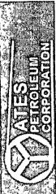

<table border=1 style='margin: auto; word-wrap: break-word;'><tr><td style='text-align: center; word-wrap: break-word;'>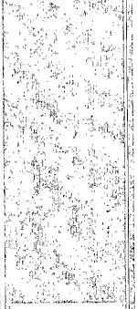\n</td><td rowspan="3">Local Co-ordinate Reference:\nTVD Reference:\nMD Reference:\nNorth Reference:\nSurvey Calculation Method:\nDatabase:</td><td rowspan="3">Well #2H\nWELL @ 3190.50ft (Original Well Elev)\nWELL @ 3190.50ft (Original Well Elev)\nGrid\nMinimum Curvature\nMidland Database</td></tr><tr><td style='text-align: center; word-wrap: break-word;'>Surve</td></tr><tr><td style='text-align: center; word-wrap: break-word;'>Company:\nProject:\nSite:\nWell:\nWellbore:\nDesign:</td></tr></table>

<table border=1 style='margin: auto; word-wrap: break-word;'><tr><td style='text-align: center; word-wrap: break-word;'>5,600.00</td><td style='text-align: center; word-wrap: break-word;'>0.75</td><td style='text-align: center; word-wrap: break-word;'>99.63</td><td style='text-align: center; word-wrap: break-word;'>5,598.94</td><td style='text-align: center; word-wrap: break-word;'>2,408.44</td><td style='text-align: center; word-wrap: break-word;'>9.13</td><td style='text-align: center; word-wrap: break-word;'>-3.28</td><td style='text-align: center; word-wrap: break-word;'>3.33</td><td style='text-align: center; word-wrap: break-word;'>0.00</td><td style='text-align: center; word-wrap: break-word;'>413,089.35</td><td style='text-align: center; word-wrap: break-word;'>591,070.06</td></tr><tr><td style='text-align: center; word-wrap: break-word;'>5,641.00</td><td style='text-align: center; word-wrap: break-word;'>1.06</td><td style='text-align: center; word-wrap: break-word;'>130.38</td><td style='text-align: center; word-wrap: break-word;'>5,639.94</td><td style='text-align: center; word-wrap: break-word;'>2,449.44</td><td style='text-align: center; word-wrap: break-word;'>8.84</td><td style='text-align: center; word-wrap: break-word;'>-2.73</td><td style='text-align: center; word-wrap: break-word;'>2.77</td><td style='text-align: center; word-wrap: break-word;'>1.38</td><td style='text-align: center; word-wrap: break-word;'>413,089.06</td><td style='text-align: center; word-wrap: break-word;'>591,676.62</td></tr><tr><td style='text-align: center; word-wrap: break-word;'>5,672.00</td><td style='text-align: center; word-wrap: break-word;'>0.79</td><td style='text-align: center; word-wrap: break-word;'>141.99</td><td style='text-align: center; word-wrap: break-word;'>5,670.93</td><td style='text-align: center; word-wrap: break-word;'>2,480.43</td><td style='text-align: center; word-wrap: break-word;'>8.48</td><td style='text-align: center; word-wrap: break-word;'>-2.38</td><td style='text-align: center; word-wrap: break-word;'>2.42</td><td style='text-align: center; word-wrap: break-word;'>1.06</td><td style='text-align: center; word-wrap: break-word;'>413,088.71</td><td style='text-align: center; word-wrap: break-word;'>591,676.97</td></tr><tr><td style='text-align: center; word-wrap: break-word;'>5,704.00</td><td style='text-align: center; word-wrap: break-word;'>1.14</td><td style='text-align: center; word-wrap: break-word;'>241.40</td><td style='text-align: center; word-wrap: break-word;'>5,702.93</td><td style='text-align: center; word-wrap: break-word;'>2,512.43</td><td style='text-align: center; word-wrap: break-word;'>8.16</td><td style='text-align: center; word-wrap: break-word;'>-2.52</td><td style='text-align: center; word-wrap: break-word;'>2.56</td><td style='text-align: center; word-wrap: break-word;'>4.65</td><td style='text-align: center; word-wrap: break-word;'>413,088.38</td><td style='text-align: center; word-wrap: break-word;'>591,676.82</td></tr><tr><td style='text-align: center; word-wrap: break-word;'>5,736.00</td><td style='text-align: center; word-wrap: break-word;'>3.96</td><td style='text-align: center; word-wrap: break-word;'>268.53</td><td style='text-align: center; word-wrap: break-word;'>5,734.90</td><td style='text-align: center; word-wrap: break-word;'>2,544.40</td><td style='text-align: center; word-wrap: break-word;'>7.98</td><td style='text-align: center; word-wrap: break-word;'>-3.90</td><td style='text-align: center; word-wrap: break-word;'>3.95</td><td style='text-align: center; word-wrap: break-word;'>9.35</td><td style='text-align: center; word-wrap: break-word;'>413,088.20</td><td style='text-align: center; word-wrap: break-word;'>591,675.44</td></tr><tr><td style='text-align: center; word-wrap: break-word;'>5,767.00</td><td style='text-align: center; word-wrap: break-word;'>8.18</td><td style='text-align: center; word-wrap: break-word;'>272.15</td><td style='text-align: center; word-wrap: break-word;'>5,765.72</td><td style='text-align: center; word-wrap: break-word;'>2,575.22</td><td style='text-align: center; word-wrap: break-word;'>8.03</td><td style='text-align: center; word-wrap: break-word;'>-7.18</td><td style='text-align: center; word-wrap: break-word;'>7.22</td><td style='text-align: center; word-wrap: break-word;'>13.66</td><td style='text-align: center; word-wrap: break-word;'>413,088.25</td><td style='text-align: center; word-wrap: break-word;'>591,672.16</td></tr><tr><td style='text-align: center; word-wrap: break-word;'>5,799.00</td><td style='text-align: center; word-wrap: break-word;'>12.75</td><td style='text-align: center; word-wrap: break-word;'>273.49</td><td style='text-align: center; word-wrap: break-word;'>5,797.18</td><td style='text-align: center; word-wrap: break-word;'>2,606.68</td><td style='text-align: center; word-wrap: break-word;'>8.33</td><td style='text-align: center; word-wrap: break-word;'>-12.98</td><td style='text-align: center; word-wrap: break-word;'>13.03</td><td style='text-align: center; word-wrap: break-word;'>14.30</td><td style='text-align: center; word-wrap: break-word;'>413,088.55</td><td style='text-align: center; word-wrap: break-word;'>591,666.36</td></tr><tr><td style='text-align: center; word-wrap: break-word;'>5,831.00</td><td style='text-align: center; word-wrap: break-word;'>17.59</td><td style='text-align: center; word-wrap: break-word;'>274.15</td><td style='text-align: center; word-wrap: break-word;'>5,828.05</td><td style='text-align: center; word-wrap: break-word;'>2,637.55</td><td style='text-align: center; word-wrap: break-word;'>8.90</td><td style='text-align: center; word-wrap: break-word;'>-21.34</td><td style='text-align: center; word-wrap: break-word;'>21.38</td><td style='text-align: center; word-wrap: break-word;'>15.13</td><td style='text-align: center; word-wrap: break-word;'>413,089.12</td><td style='text-align: center; word-wrap: break-word;'>591,658.01</td></tr><tr><td style='text-align: center; word-wrap: break-word;'>5,862.00</td><td style='text-align: center; word-wrap: break-word;'>22.42</td><td style='text-align: center; word-wrap: break-word;'>274.20</td><td style='text-align: center; word-wrap: break-word;'>5,857.17</td><td style='text-align: center; word-wrap: break-word;'>2,666.67</td><td style='text-align: center; word-wrap: break-word;'>9.67</td><td style='text-align: center; word-wrap: break-word;'>-31.91</td><td style='text-align: center; word-wrap: break-word;'>31.96</td><td style='text-align: center; word-wrap: break-word;'>15.58</td><td style='text-align: center; word-wrap: break-word;'>413,089.89</td><td style='text-align: center; word-wrap: break-word;'>591,647.43</td></tr><tr><td style='text-align: center; word-wrap: break-word;'>5,894.00</td><td style='text-align: center; word-wrap: break-word;'>27.08</td><td style='text-align: center; word-wrap: break-word;'>272.81</td><td style='text-align: center; word-wrap: break-word;'>5,886.23</td><td style='text-align: center; word-wrap: break-word;'>2,695.73</td><td style='text-align: center; word-wrap: break-word;'>10.47</td><td style='text-align: center; word-wrap: break-word;'>-45.28</td><td style='text-align: center; word-wrap: break-word;'>45.33</td><td style='text-align: center; word-wrap: break-word;'>14.67</td><td style='text-align: center; word-wrap: break-word;'>413,090.70</td><td style='text-align: center; word-wrap: break-word;'>591,634.06</td></tr><tr><td style='text-align: center; word-wrap: break-word;'>5,926.00</td><td style='text-align: center; word-wrap: break-word;'>30.86</td><td style='text-align: center; word-wrap: break-word;'>270.80</td><td style='text-align: center; word-wrap: break-word;'>5,914.22</td><td style='text-align: center; word-wrap: break-word;'>2,723.72</td><td style='text-align: center; word-wrap: break-word;'>10.95</td><td style='text-align: center; word-wrap: break-word;'>-60.76</td><td style='text-align: center; word-wrap: break-word;'>60.82</td><td style='text-align: center; word-wrap: break-word;'>12.20</td><td style='text-align: center; word-wrap: break-word;'>413,091.17</td><td style='text-align: center; word-wrap: break-word;'>591,618.58</td></tr><tr><td style='text-align: center; word-wrap: break-word;'>5,958.00</td><td style='text-align: center; word-wrap: break-word;'>33.95</td><td style='text-align: center; word-wrap: break-word;'>269.82</td><td style='text-align: center; word-wrap: break-word;'>5,941.23</td><td style='text-align: center; word-wrap: break-word;'>2,750.73</td><td style='text-align: center; word-wrap: break-word;'>11.03</td><td style='text-align: center; word-wrap: break-word;'>-77.91</td><td style='text-align: center; word-wrap: break-word;'>77.97</td><td style='text-align: center; word-wrap: break-word;'>9.79</td><td style='text-align: center; word-wrap: break-word;'>413,091.25</td><td style='text-align: center; word-wrap: break-word;'>591,601.43</td></tr><tr><td style='text-align: center; word-wrap: break-word;'>5,989.00</td><td style='text-align: center; word-wrap: break-word;'>37.02</td><td style='text-align: center; word-wrap: break-word;'>269.03</td><td style='text-align: center; word-wrap: break-word;'>5,966.47</td><td style='text-align: center; word-wrap: break-word;'>2,775.97</td><td style='text-align: center; word-wrap: break-word;'>10.85</td><td style='text-align: center; word-wrap: break-word;'>-95.90</td><td style='text-align: center; word-wrap: break-word;'>95.96</td><td style='text-align: center; word-wrap: break-word;'>10.01</td><td style='text-align: center; word-wrap: break-word;'>413,091.07</td><td style='text-align: center; word-wrap: break-word;'>591,583.44</td></tr><tr><td style='text-align: center; word-wrap: break-word;'>6,026.00</td><td style='text-align: center; word-wrap: break-word;'>41.33</td><td style='text-align: center; word-wrap: break-word;'>268.15</td><td style='text-align: center; word-wrap: break-word;'>5,995.15</td><td style='text-align: center; word-wrap: break-word;'>2,804.65</td><td style='text-align: center; word-wrap: break-word;'>10.26</td><td style='text-align: center; word-wrap: break-word;'>-119.26</td><td style='text-align: center; word-wrap: break-word;'>119.32</td><td style='text-align: center; word-wrap: break-word;'>11.74</td><td style='text-align: center; word-wrap: break-word;'>413,090.49</td><td style='text-align: center; word-wrap: break-word;'>591,560.08</td></tr><tr><td style='text-align: center; word-wrap: break-word;'>6,057.00</td><td style='text-align: center; word-wrap: break-word;'>45.99</td><td style='text-align: center; word-wrap: break-word;'>267.30</td><td style='text-align: center; word-wrap: break-word;'>6,017.57</td><td style='text-align: center; word-wrap: break-word;'>2,827.07</td><td style='text-align: center; word-wrap: break-word;'>9.41</td><td style='text-align: center; word-wrap: break-word;'>-140.64</td><td style='text-align: center; word-wrap: break-word;'>140.69</td><td style='text-align: center; word-wrap: break-word;'>15.15</td><td style='text-align: center; word-wrap: break-word;'>413,089.63</td><td style='text-align: center; word-wrap: break-word;'>591,538.70</td></tr><tr><td style='text-align: center; word-wrap: break-word;'>6,088.00</td><td style='text-align: center; word-wrap: break-word;'>50.65</td><td style='text-align: center; word-wrap: break-word;'>266.73</td><td style='text-align: center; word-wrap: break-word;'>6,038.18</td><td style='text-align: center; word-wrap: break-word;'>2,847.68</td><td style='text-align: center; word-wrap: break-word;'>8.20</td><td style='text-align: center; word-wrap: break-word;'>-163.75</td><td style='text-align: center; word-wrap: break-word;'>163.80</td><td style='text-align: center; word-wrap: break-word;'>15.09</td><td style='text-align: center; word-wrap: break-word;'>413,088.42</td><td style='text-align: center; word-wrap: break-word;'>591,515.59</td></tr><tr><td style='text-align: center; word-wrap: break-word;'>6,119.00</td><td style='text-align: center; word-wrap: break-word;'>55.49</td><td style='text-align: center; word-wrap: break-word;'>267.02</td><td style='text-align: center; word-wrap: break-word;'>6,056.80</td><td style='text-align: center; word-wrap: break-word;'>2,866.30</td><td style='text-align: center; word-wrap: break-word;'>6.85</td><td style='text-align: center; word-wrap: break-word;'>-188.49</td><td style='text-align: center; word-wrap: break-word;'>188.53</td><td style='text-align: center; word-wrap: break-word;'>15.63</td><td style='text-align: center; word-wrap: break-word;'>413,087.07</td><td style='text-align: center; word-wrap: break-word;'>591,490.85</td></tr><tr><td style='text-align: center; word-wrap: break-word;'>6,150.00</td><td style='text-align: center; word-wrap: break-word;'>59.18</td><td style='text-align: center; word-wrap: break-word;'>267.24</td><td style='text-align: center; word-wrap: break-word;'>6,073.53</td><td style='text-align: center; word-wrap: break-word;'>2,883.03</td><td style='text-align: center; word-wrap: break-word;'>5.55</td><td style='text-align: center; word-wrap: break-word;'>-214.55</td><td style='text-align: center; word-wrap: break-word;'>214.58</td><td style='text-align: center; word-wrap: break-word;'>11.92</td><td style='text-align: center; word-wrap: break-word;'>413,085.77</td><td style='text-align: center; word-wrap: break-word;'>591,464.79</td></tr><tr><td style='text-align: center; word-wrap: break-word;'>6,181.00</td><td style='text-align: center; word-wrap: break-word;'>61.99</td><td style='text-align: center; word-wrap: break-word;'>269.95</td><td style='text-align: center; word-wrap: break-word;'>6,088.75</td><td style='text-align: center; word-wrap: break-word;'>2,898.25</td><td style='text-align: center; word-wrap: break-word;'>4.89</td><td style='text-align: center; word-wrap: break-word;'>-241.54</td><td style='text-align: center; word-wrap: break-word;'>241.56</td><td style='text-align: center; word-wrap: break-word;'>11.84</td><td style='text-align: center; word-wrap: break-word;'>413,085.11</td><td style='text-align: center; word-wrap: break-word;'>591,437.80</td></tr><tr><td style='text-align: center; word-wrap: break-word;'>6,213.00</td><td style='text-align: center; word-wrap: break-word;'>64.98</td><td style='text-align: center; word-wrap: break-word;'>270.99</td><td style='text-align: center; word-wrap: break-word;'>6,103.04</td><td style='text-align: center; word-wrap: break-word;'>2,912.54</td><td style='text-align: center; word-wrap: break-word;'>5.13</td><td style='text-align: center; word-wrap: break-word;'>-270.17</td><td style='text-align: center; word-wrap: break-word;'>270.19</td><td style='text-align: center; word-wrap: break-word;'>9.79</td><td style='text-align: center; word-wrap: break-word;'>413,085.35</td><td style='text-align: center; word-wrap: break-word;'>591,409.17</td></tr><tr><td style='text-align: center; word-wrap: break-word;'>6,244.00</td><td style='text-align: center; word-wrap: break-word;'>67.97</td><td style='text-align: center; word-wrap: break-word;'>272.02</td><td style='text-align: center; word-wrap: break-word;'>6,115.41</td><td style='text-align: center; word-wrap: break-word;'>2,924.91</td><td style='text-align: center; word-wrap: break-word;'>5.88</td><td style='text-align: center; word-wrap: break-word;'>-298.58</td><td style='text-align: center; word-wrap: break-word;'>298.61</td><td style='text-align: center; word-wrap: break-word;'>10.11</td><td style='text-align: center; word-wrap: break-word;'>413,086.10</td><td style='text-align: center; word-wrap: break-word;'>591,380.76</td></tr><tr><td style='text-align: center; word-wrap: break-word;'>6,275.00</td><td style='text-align: center; word-wrap: break-word;'>71.84</td><td style='text-align: center; word-wrap: break-word;'>272.79</td><td style='text-align: center; word-wrap: break-word;'>6,126.06</td><td style='text-align: center; word-wrap: break-word;'>2,935.56</td><td style='text-align: center; word-wrap: break-word;'>7.10</td><td style='text-align: center; word-wrap: break-word;'>-327.66</td><td style='text-align: center; word-wrap: break-word;'>327.69</td><td style='text-align: center; word-wrap: break-word;'>12.70</td><td style='text-align: center; word-wrap: break-word;'>413,087.32</td><td style='text-align: center; word-wrap: break-word;'>591,351.68</td></tr><tr><td style='text-align: center; word-wrap: break-word;'>6,306.00</td><td style='text-align: center; word-wrap: break-word;'>76.41</td><td style='text-align: center; word-wrap: break-word;'>272.22</td><td style='text-align: center; word-wrap: break-word;'>6,134.53</td><td style='text-align: center; word-wrap: break-word;'>2,944.03</td><td style='text-align: center; word-wrap: break-word;'>8.40</td><td style='text-align: center; word-wrap: break-word;'>-357.44</td><td style='text-align: center; word-wrap: break-word;'>357.48</td><td style='text-align: center; word-wrap: break-word;'>14.85</td><td style='text-align: center; word-wrap: break-word;'>413,088.63</td><td style='text-align: center; word-wrap: break-word;'>591,321.90</td></tr><tr><td style='text-align: center; word-wrap: break-word;'>6,337.00</td><td style='text-align: center; word-wrap: break-word;'>81.25</td><td style='text-align: center; word-wrap: break-word;'>271.56</td><td style='text-align: center; word-wrap: break-word;'>6,140.54</td><td style='text-align: center; word-wrap: break-word;'>2,950.04</td><td style='text-align: center; word-wrap: break-word;'>9.41</td><td style='text-align: center; word-wrap: break-word;'>-387.83</td><td style='text-align: center; word-wrap: break-word;'>387.87</td><td style='text-align: center; word-wrap: break-word;'>15.75</td><td style='text-align: center; word-wrap: break-word;'>413,089.63</td><td style='text-align: center; word-wrap: break-word;'>591,291.51</td></tr><tr><td style='text-align: center; word-wrap: break-word;'>6,368.00</td><td style='text-align: center; word-wrap: break-word;'>85.03</td><td style='text-align: center; word-wrap: break-word;'>270.74</td><td style='text-align: center; word-wrap: break-word;'>6,144.24</td><td style='text-align: center; word-wrap: break-word;'>2,953.74</td><td style='text-align: center; word-wrap: break-word;'>10.02</td><td style='text-align: center; word-wrap: break-word;'>-418.60</td><td style='text-align: center; word-wrap: break-word;'>418.64</td><td style='text-align: center; word-wrap: break-word;'>12.47</td><td style='text-align: center; word-wrap: break-word;'>413,090.24</td><td style='text-align: center; word-wrap: break-word;'>591,260.75</td></tr><tr><td style='text-align: center; word-wrap: break-word;'>6,451.00</td><td style='text-align: center; word-wrap: break-word;'>90.04</td><td style='text-align: center; word-wrap: break-word;'>270.82</td><td style='text-align: center; word-wrap: break-word;'>6,147.81</td><td style='text-align: center; word-wrap: break-word;'>2,957.31</td><td style='text-align: center; word-wrap: break-word;'>11.15</td><td style='text-align: center; word-wrap: break-word;'>-501.48</td><td style='text-align: center; word-wrap: break-word;'>501.54</td><td style='text-align: center; word-wrap: break-word;'>6.04</td><td style='text-align: center; word-wrap: break-word;'>413,091.37</td><td style='text-align: center; word-wrap: break-word;'>591,177.86</td></tr><tr><td style='text-align: center; word-wrap: break-word;'>6,547.00</td><td style='text-align: center; word-wrap: break-word;'>89.43</td><td style='text-align: center; word-wrap: break-word;'>271.70</td><td style='text-align: center; word-wrap: break-word;'>6,148.25</td><td style='text-align: center; word-wrap: break-word;'>2,957.75</td><td style='text-align: center; word-wrap: break-word;'>13.26</td><td style='text-align: center; word-wrap: break-word;'>-597.46</td><td style='text-align: center; word-wrap: break-word;'>597.52</td><td style='text-align: center; word-wrap: break-word;'>1.12</td><td style='text-align: center; word-wrap: break-word;'>413,093.48</td><td style='text-align: center; word-wrap: break-word;'>591,081.88</td></tr></table>

07/12/2010 8:21:59 AM

COMPASS 2003.16 Build 71

# Page 37

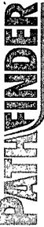

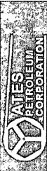

<table border=1 style='margin: auto; word-wrap: break-word;'><tr><td style='text-align: center; word-wrap: break-word;'>[F2]</td><td style='text-align: center; word-wrap: break-word;'>6,640.00</td><td style='text-align: center; word-wrap: break-word;'>88.46</td><td style='text-align: center; word-wrap: break-word;'>271.79</td><td style='text-align: center; word-wrap: break-word;'>6,149.97</td><td style='text-align: center; word-wrap: break-word;'>2,959.47</td><td style='text-align: center; word-wrap: break-word;'>16.09</td><td style='text-align: center; word-wrap: break-word;'>-690.40</td><td style='text-align: center; word-wrap: break-word;'>690.48</td><td style='text-align: center; word-wrap: break-word;'>1.05</td><td style='text-align: center; word-wrap: break-word;'>413,096.31</td><td style='text-align: center; word-wrap: break-word;'>590,988.94</td></tr><tr><td style='text-align: center; word-wrap: break-word;'>6,733.00</td><td style='text-align: center; word-wrap: break-word;'></td><td style='text-align: center; word-wrap: break-word;'>88.64</td><td style='text-align: center; word-wrap: break-word;'>271.75</td><td style='text-align: center; word-wrap: break-word;'>6,152.32</td><td style='text-align: center; word-wrap: break-word;'>2,961.82</td><td style='text-align: center; word-wrap: break-word;'>18.97</td><td style='text-align: center; word-wrap: break-word;'>-783.32</td><td style='text-align: center; word-wrap: break-word;'>783.42</td><td style='text-align: center; word-wrap: break-word;'>0.20</td><td style='text-align: center; word-wrap: break-word;'>413,099.19</td><td style='text-align: center; word-wrap: break-word;'>590,896.02</td></tr><tr><td style='text-align: center; word-wrap: break-word;'>6,827.00</td><td style='text-align: center; word-wrap: break-word;'></td><td style='text-align: center; word-wrap: break-word;'>89.52</td><td style='text-align: center; word-wrap: break-word;'>271.45</td><td style='text-align: center; word-wrap: break-word;'>6,153.83</td><td style='text-align: center; word-wrap: break-word;'>2,963.33</td><td style='text-align: center; word-wrap: break-word;'>21.59</td><td style='text-align: center; word-wrap: break-word;'>-877.27</td><td style='text-align: center; word-wrap: break-word;'>877.38</td><td style='text-align: center; word-wrap: break-word;'>0.99</td><td style='text-align: center; word-wrap: break-word;'>413,101.81</td><td style='text-align: center; word-wrap: break-word;'>590,802.07</td></tr><tr><td style='text-align: center; word-wrap: break-word;'>6,920.00</td><td style='text-align: center; word-wrap: break-word;'></td><td style='text-align: center; word-wrap: break-word;'>88.99</td><td style='text-align: center; word-wrap: break-word;'>271.40</td><td style='text-align: center; word-wrap: break-word;'>6,155.04</td><td style='text-align: center; word-wrap: break-word;'>2,964.54</td><td style='text-align: center; word-wrap: break-word;'>23.90</td><td style='text-align: center; word-wrap: break-word;'>-970.24</td><td style='text-align: center; word-wrap: break-word;'>970.35</td><td style='text-align: center; word-wrap: break-word;'>0.57</td><td style='text-align: center; word-wrap: break-word;'>413,104.12</td><td style='text-align: center; word-wrap: break-word;'>590,709.10</td></tr><tr><td style='text-align: center; word-wrap: break-word;'>7,013.00</td><td style='text-align: center; word-wrap: break-word;'></td><td style='text-align: center; word-wrap: break-word;'>89.96</td><td style='text-align: center; word-wrap: break-word;'>271.65</td><td style='text-align: center; word-wrap: break-word;'>6,155.89</td><td style='text-align: center; word-wrap: break-word;'>2,965.39</td><td style='text-align: center; word-wrap: break-word;'>26.38</td><td style='text-align: center; word-wrap: break-word;'>-1,063.20</td><td style='text-align: center; word-wrap: break-word;'>1,063.33</td><td style='text-align: center; word-wrap: break-word;'>1.08</td><td style='text-align: center; word-wrap: break-word;'>413,106.60</td><td style='text-align: center; word-wrap: break-word;'>590,616.14</td></tr><tr><td style='text-align: center; word-wrap: break-word;'>7,106.00</td><td style='text-align: center; word-wrap: break-word;'></td><td style='text-align: center; word-wrap: break-word;'>90.13</td><td style='text-align: center; word-wrap: break-word;'>270.94</td><td style='text-align: center; word-wrap: break-word;'>6,155.82</td><td style='text-align: center; word-wrap: break-word;'>2,965.32</td><td style='text-align: center; word-wrap: break-word;'>28.48</td><td style='text-align: center; word-wrap: break-word;'>-1,156.18</td><td style='text-align: center; word-wrap: break-word;'>1,156.31</td><td style='text-align: center; word-wrap: break-word;'>0.79</td><td style='text-align: center; word-wrap: break-word;'>413,108.70</td><td style='text-align: center; word-wrap: break-word;'>590,523.17</td></tr><tr><td style='text-align: center; word-wrap: break-word;'>7,199.00</td><td style='text-align: center; word-wrap: break-word;'></td><td style='text-align: center; word-wrap: break-word;'>89.52</td><td style='text-align: center; word-wrap: break-word;'>271.09</td><td style='text-align: center; word-wrap: break-word;'>6,156.10</td><td style='text-align: center; word-wrap: break-word;'>2,965.60</td><td style='text-align: center; word-wrap: break-word;'>30.13</td><td style='text-align: center; word-wrap: break-word;'>-1,249.16</td><td style='text-align: center; word-wrap: break-word;'>1,249.30</td><td style='text-align: center; word-wrap: break-word;'>0.68</td><td style='text-align: center; word-wrap: break-word;'>413,110.35</td><td style='text-align: center; word-wrap: break-word;'>590,430.18</td></tr><tr><td style='text-align: center; word-wrap: break-word;'>7,292.00</td><td style='text-align: center; word-wrap: break-word;'></td><td style='text-align: center; word-wrap: break-word;'>91.19</td><td style='text-align: center; word-wrap: break-word;'>271.30</td><td style='text-align: center; word-wrap: break-word;'>6,155.52</td><td style='text-align: center; word-wrap: break-word;'>2,965.02</td><td style='text-align: center; word-wrap: break-word;'>32.07</td><td style='text-align: center; word-wrap: break-word;'>-1,342.13</td><td style='text-align: center; word-wrap: break-word;'>1,342.29</td><td style='text-align: center; word-wrap: break-word;'>1.81</td><td style='text-align: center; word-wrap: break-word;'>413,112.29</td><td style='text-align: center; word-wrap: break-word;'>590,337.21</td></tr><tr><td style='text-align: center; word-wrap: break-word;'>7,386.00</td><td style='text-align: center; word-wrap: break-word;'></td><td style='text-align: center; word-wrap: break-word;'>91.89</td><td style='text-align: center; word-wrap: break-word;'>271.66</td><td style='text-align: center; word-wrap: break-word;'>6,153.00</td><td style='text-align: center; word-wrap: break-word;'>2,962.50</td><td style='text-align: center; word-wrap: break-word;'>34.49</td><td style='text-align: center; word-wrap: break-word;'>-1,436.07</td><td style='text-align: center; word-wrap: break-word;'>1,436.23</td><td style='text-align: center; word-wrap: break-word;'>0.84</td><td style='text-align: center; word-wrap: break-word;'>413,114.71</td><td style='text-align: center; word-wrap: break-word;'>590,243.27</td></tr><tr><td style='text-align: center; word-wrap: break-word;'>7,479.00</td><td style='text-align: center; word-wrap: break-word;'></td><td style='text-align: center; word-wrap: break-word;'>91.63</td><td style='text-align: center; word-wrap: break-word;'>271.93</td><td style='text-align: center; word-wrap: break-word;'>6,150.14</td><td style='text-align: center; word-wrap: break-word;'>2,959.64</td><td style='text-align: center; word-wrap: break-word;'>37.40</td><td style='text-align: center; word-wrap: break-word;'>-1,528.98</td><td style='text-align: center; word-wrap: break-word;'>1,529.16</td><td style='text-align: center; word-wrap: break-word;'>0.40</td><td style='text-align: center; word-wrap: break-word;'>413,117.63</td><td style='text-align: center; word-wrap: break-word;'>590,150.36</td></tr><tr><td style='text-align: center; word-wrap: break-word;'>7,573.00</td><td style='text-align: center; word-wrap: break-word;'></td><td style='text-align: center; word-wrap: break-word;'>90.66</td><td style='text-align: center; word-wrap: break-word;'>272.03</td><td style='text-align: center; word-wrap: break-word;'>6,148.26</td><td style='text-align: center; word-wrap: break-word;'>2,957.76</td><td style='text-align: center; word-wrap: break-word;'>40.65</td><td style='text-align: center; word-wrap: break-word;'>-1,622.90</td><td style='text-align: center; word-wrap: break-word;'>1,623.10</td><td style='text-align: center; word-wrap: break-word;'>1.04</td><td style='text-align: center; word-wrap: break-word;'>413,120.87</td><td style='text-align: center; word-wrap: break-word;'>590,056.44</td></tr><tr><td style='text-align: center; word-wrap: break-word;'>7,668.00</td><td style='text-align: center; word-wrap: break-word;'></td><td style='text-align: center; word-wrap: break-word;'>89.43</td><td style='text-align: center; word-wrap: break-word;'>271.83</td><td style='text-align: center; word-wrap: break-word;'>6,148.19</td><td style='text-align: center; word-wrap: break-word;'>2,957.69</td><td style='text-align: center; word-wrap: break-word;'>43.85</td><td style='text-align: center; word-wrap: break-word;'>-1,717.85</td><td style='text-align: center; word-wrap: break-word;'>1,718.06</td><td style='text-align: center; word-wrap: break-word;'>1.31</td><td style='text-align: center; word-wrap: break-word;'>413,124.07</td><td style='text-align: center; word-wrap: break-word;'>589,961.50</td></tr><tr><td style='text-align: center; word-wrap: break-word;'>7,763.00</td><td style='text-align: center; word-wrap: break-word;'></td><td style='text-align: center; word-wrap: break-word;'>88.20</td><td style='text-align: center; word-wrap: break-word;'>271.27</td><td style='text-align: center; word-wrap: break-word;'>6,150.15</td><td style='text-align: center; word-wrap: break-word;'>2,959.65</td><td style='text-align: center; word-wrap: break-word;'>46.42</td><td style='text-align: center; word-wrap: break-word;'>-1,812.79</td><td style='text-align: center; word-wrap: break-word;'>1,813.01</td><td style='text-align: center; word-wrap: break-word;'>1.42</td><td style='text-align: center; word-wrap: break-word;'>413,126.64</td><td style='text-align: center; word-wrap: break-word;'>589,866.55</td></tr><tr><td style='text-align: center; word-wrap: break-word;'>7,881.00</td><td style='text-align: center; word-wrap: break-word;'></td><td style='text-align: center; word-wrap: break-word;'>90.57</td><td style='text-align: center; word-wrap: break-word;'>270.40</td><td style='text-align: center; word-wrap: break-word;'>6,151.42</td><td style='text-align: center; word-wrap: break-word;'>2,960.92</td><td style='text-align: center; word-wrap: break-word;'>48.14</td><td style='text-align: center; word-wrap: break-word;'>-1,930.76</td><td style='text-align: center; word-wrap: break-word;'>1,930.99</td><td style='text-align: center; word-wrap: break-word;'>2.14</td><td style='text-align: center; word-wrap: break-word;'>413,128.36</td><td style='text-align: center; word-wrap: break-word;'>589,748.58</td></tr><tr><td style='text-align: center; word-wrap: break-word;'>7,975.00</td><td style='text-align: center; word-wrap: break-word;'></td><td style='text-align: center; word-wrap: break-word;'>90.48</td><td style='text-align: center; word-wrap: break-word;'>270.57</td><td style='text-align: center; word-wrap: break-word;'>6,150.56</td><td style='text-align: center; word-wrap: break-word;'>2,960.06</td><td style='text-align: center; word-wrap: break-word;'>48.93</td><td style='text-align: center; word-wrap: break-word;'>-2,024.75</td><td style='text-align: center; word-wrap: break-word;'>2,024.99</td><td style='text-align: center; word-wrap: break-word;'>0.20</td><td style='text-align: center; word-wrap: break-word;'>413,129.16</td><td style='text-align: center; word-wrap: break-word;'>589,654.59</td></tr><tr><td style='text-align: center; word-wrap: break-word;'>8,068.00</td><td style='text-align: center; word-wrap: break-word;'></td><td style='text-align: center; word-wrap: break-word;'>90.22</td><td style='text-align: center; word-wrap: break-word;'>271.10</td><td style='text-align: center; word-wrap: break-word;'>6,149.99</td><td style='text-align: center; word-wrap: break-word;'>2,959.49</td><td style='text-align: center; word-wrap: break-word;'>50.29</td><td style='text-align: center; word-wrap: break-word;'>-2,117.74</td><td style='text-align: center; word-wrap: break-word;'>2,117.98</td><td style='text-align: center; word-wrap: break-word;'>0.63</td><td style='text-align: center; word-wrap: break-word;'>413,130.51</td><td style='text-align: center; word-wrap: break-word;'>589,561.60</td></tr><tr><td style='text-align: center; word-wrap: break-word;'>8,161.00</td><td style='text-align: center; word-wrap: break-word;'></td><td style='text-align: center; word-wrap: break-word;'>89.43</td><td style='text-align: center; word-wrap: break-word;'>271.02</td><td style='text-align: center; word-wrap: break-word;'>6,150.27</td><td style='text-align: center; word-wrap: break-word;'>2,959.77</td><td style='text-align: center; word-wrap: break-word;'>52.01</td><td style='text-align: center; word-wrap: break-word;'>-2,210.72</td><td style='text-align: center; word-wrap: break-word;'>2,210.97</td><td style='text-align: center; word-wrap: break-word;'>0.85</td><td style='text-align: center; word-wrap: break-word;'>413,132.23</td><td style='text-align: center; word-wrap: break-word;'>589,468.62</td></tr><tr><td style='text-align: center; word-wrap: break-word;'>8,255.00</td><td style='text-align: center; word-wrap: break-word;'></td><td style='text-align: center; word-wrap: break-word;'>88.90</td><td style='text-align: center; word-wrap: break-word;'>270.24</td><td style='text-align: center; word-wrap: break-word;'>6,151.64</td><td style='text-align: center; word-wrap: break-word;'>2,961.14</td><td style='text-align: center; word-wrap: break-word;'>53.04</td><td style='text-align: center; word-wrap: break-word;'>-2,304.71</td><td style='text-align: center; word-wrap: break-word;'>2,304.96</td><td style='text-align: center; word-wrap: break-word;'>1.00</td><td style='text-align: center; word-wrap: break-word;'>413,133.26</td><td style='text-align: center; word-wrap: break-word;'>589,374.63</td></tr><tr><td style='text-align: center; word-wrap: break-word;'>8,348.00</td><td style='text-align: center; word-wrap: break-word;'></td><td style='text-align: center; word-wrap: break-word;'>90.22</td><td style='text-align: center; word-wrap: break-word;'>268.86</td><td style='text-align: center; word-wrap: break-word;'>6,152.36</td><td style='text-align: center; word-wrap: break-word;'>2,961.86</td><td style='text-align: center; word-wrap: break-word;'>52.31</td><td style='text-align: center; word-wrap: break-word;'>-2,397.70</td><td style='text-align: center; word-wrap: break-word;'>2,397.95</td><td style='text-align: center; word-wrap: break-word;'>2.05</td><td style='text-align: center; word-wrap: break-word;'>413,132.53</td><td style='text-align: center; word-wrap: break-word;'>589,281.64</td></tr><tr><td style='text-align: center; word-wrap: break-word;'>8,441.00</td><td style='text-align: center; word-wrap: break-word;'></td><td style='text-align: center; word-wrap: break-word;'>89.43</td><td style='text-align: center; word-wrap: break-word;'>268.08</td><td style='text-align: center; word-wrap: break-word;'>6,152.64</td><td style='text-align: center; word-wrap: break-word;'>2,962.14</td><td style='text-align: center; word-wrap: break-word;'>49.83</td><td style='text-align: center; word-wrap: break-word;'>-2,490.66</td><td style='text-align: center; word-wrap: break-word;'>2,490.90</td><td style='text-align: center; word-wrap: break-word;'>1.19</td><td style='text-align: center; word-wrap: break-word;'>413,130.05</td><td style='text-align: center; word-wrap: break-word;'>589,188.68</td></tr><tr><td style='text-align: center; word-wrap: break-word;'>8,535.00</td><td style='text-align: center; word-wrap: break-word;'></td><td style='text-align: center; word-wrap: break-word;'>88.37</td><td style='text-align: center; word-wrap: break-word;'>267.99</td><td style='text-align: center; word-wrap: break-word;'>6,154.45</td><td style='text-align: center; word-wrap: break-word;'>2,963.95</td><td style='text-align: center; word-wrap: break-word;'>46.61</td><td style='text-align: center; word-wrap: break-word;'>-2,584.59</td><td style='text-align: center; word-wrap: break-word;'>2,584.80</td><td style='text-align: center; word-wrap: break-word;'>1.13</td><td style='text-align: center; word-wrap: break-word;'>413,126.83</td><td style='text-align: center; word-wrap: break-word;'>589,094.75</td></tr><tr><td style='text-align: center; word-wrap: break-word;'>8,629.00</td><td style='text-align: center; word-wrap: break-word;'></td><td style='text-align: center; word-wrap: break-word;'>89.16</td><td style='text-align: center; word-wrap: break-word;'>268.07</td><td style='text-align: center; word-wrap: break-word;'>6,156.47</td><td style='text-align: center; word-wrap: break-word;'>2,965.97</td><td style='text-align: center; word-wrap: break-word;'>43.38</td><td style='text-align: center; word-wrap: break-word;'>-2,678.51</td><td style='text-align: center; word-wrap: break-word;'>2,678.71</td><td style='text-align: center; word-wrap: break-word;'>0.84</td><td style='text-align: center; word-wrap: break-word;'>413,123.60</td><td style='text-align: center; word-wrap: break-word;'>589,000.83</td></tr><tr><td style='text-align: center; word-wrap: break-word;'>8,721.00</td><td style='text-align: center; word-wrap: break-word;'></td><td style='text-align: center; word-wrap: break-word;'>89.34</td><td style='text-align: center; word-wrap: break-word;'>267.43</td><td style='text-align: center; word-wrap: break-word;'>6,157.68</td><td style='text-align: center; word-wrap: break-word;'>2,967.18</td><td style='text-align: center; word-wrap: break-word;'>39.77</td><td style='text-align: center; word-wrap: break-word;'>-2,770.43</td><td style='text-align: center; word-wrap: break-word;'>2,770.61</td><td style='text-align: center; word-wrap: break-word;'>0.72</td><td style='text-align: center; word-wrap: break-word;'>413,119.99</td><td style='text-align: center; word-wrap: break-word;'>588,908.91</td></tr><tr><td style='text-align: center; word-wrap: break-word;'>8,813.00</td><td style='text-align: center; word-wrap: break-word;'></td><td style='text-align: center; word-wrap: break-word;'>89.87</td><td style='text-align: center; word-wrap: break-word;'>266.89</td><td style='text-align: center; word-wrap: break-word;'>6,158.31</td><td style='text-align: center; word-wrap: break-word;'>2,967.81</td><td style='text-align: center; word-wrap: break-word;'>35.21</td><td style='text-align: center; word-wrap: break-word;'>-2,862.32</td><td style='text-align: center; word-wrap: break-word;'>2,862.46</td><td style='text-align: center; word-wrap: break-word;'>0.82</td><td style='text-align: center; word-wrap: break-word;'>413,115.43</td><td style='text-align: center; word-wrap: break-word;'>588,817.03</td></tr><tr><td style='text-align: center; word-wrap: break-word;'>8,907.00</td><td style='text-align: center; word-wrap: break-word;'></td><td style='text-align: center; word-wrap: break-word;'>93.83</td><td style='text-align: center; word-wrap: break-word;'>266.07</td><td style='text-align: center; word-wrap: break-word;'>6,155.28</td><td style='text-align: center; word-wrap: break-word;'>2,964.78</td><td style='text-align: center; word-wrap: break-word;'>29.44</td><td style='text-align: center; word-wrap: break-word;'>-2,956.07</td><td style='text-align: center; word-wrap: break-word;'>2,956.19</td><td style='text-align: center; word-wrap: break-word;'>4.30</td><td style='text-align: center; word-wrap: break-word;'>413,109.66</td><td style='text-align: center; word-wrap: break-word;'>588,723.27</td></tr><tr><td style='text-align: center; word-wrap: break-word;'>8,999.00</td><td style='text-align: center; word-wrap: break-word;'></td><td style='text-align: center; word-wrap: break-word;'>92.95</td><td style='text-align: center; word-wrap: break-word;'>266.70</td><td style='text-align: center; word-wrap: break-word;'>6,149.84</td><td style='text-align: center; word-wrap: break-word;'>2,959.34</td><td style='text-align: center; word-wrap: break-word;'>23.65</td><td style='text-align: center; word-wrap: break-word;'>-3,047.72</td><td style='text-align: center; word-wrap: break-word;'>3,047.81</td><td style='text-align: center; word-wrap: break-word;'>1.18</td><td style='text-align: center; word-wrap: break-word;'>413,103.87</td><td style='text-align: center; word-wrap: break-word;'>588,631.62</td></tr><tr><td style='text-align: center; word-wrap: break-word;'>9,093.00</td><td style='text-align: center; word-wrap: break-word;'></td><td style='text-align: center; word-wrap: break-word;'>92.51</td><td style='text-align: center; word-wrap: break-word;'>267.10</td><td style='text-align: center; word-wrap: break-word;'>6,145.36</td><td style='text-align: center; word-wrap: break-word;'>2,954.86</td><td style='text-align: center; word-wrap: break-word;'>18.57</td><td style='text-align: center; word-wrap: break-word;'>-3,141.48</td><td style='text-align: center; word-wrap: break-word;'>3,141.53</td><td style='text-align: center; word-wrap: break-word;'>0.63</td><td style='text-align: center; word-wrap: break-word;'>413,098.79</td><td style='text-align: center; word-wrap: break-word;'>588,537.86</td></tr></table>

07/12/2010 8:21:59AM

COMPASS 2003.16 Build 71

# Page 38

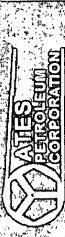

<table border=1 style='margin: auto; word-wrap: break-word;'><tr><td style='text-align: center; word-wrap: break-word;'>Company:</td><td colspan="5">Yates Petroleum Corp.</td><td colspan="2">Local Co-ordinate Reference:</td><td colspan="3">Well #2H</td></tr><tr><td style='text-align: center; word-wrap: break-word;'>Project:</td><td colspan="5">Eddy County</td><td colspan="2">TVD Reference:</td><td colspan="3">WELL @ 3190.50ft (Original Well Elev)</td></tr><tr><td style='text-align: center; word-wrap: break-word;'>Site:</td><td colspan="5">Jencho &quot;BKJ&quot; State Com</td><td colspan="2">MD Reference:</td><td colspan="3">WELL @ 3190.50ft (Original Well Elev)</td></tr><tr><td style='text-align: center; word-wrap: break-word;'>Well:</td><td colspan="5">#2H</td><td colspan="2">North Reference:</td><td colspan="3">Grid</td></tr><tr><td style='text-align: center; word-wrap: break-word;'>Wellbore:</td><td colspan="5">OH</td><td colspan="2">Survey Calculation Method:</td><td colspan="3">Minimum Curvature</td></tr><tr><td style='text-align: center; word-wrap: break-word;'>Design:</td><td colspan="5">OH</td><td colspan="2">Database:</td><td colspan="3">Midland Database</td></tr><tr><td colspan="11">Survey</td></tr><tr><td style='text-align: center; word-wrap: break-word;'>MD</td><td style='text-align: center; word-wrap: break-word;'>Inc.</td><td style='text-align: center; word-wrap: break-word;'>Azi</td><td style='text-align: center; word-wrap: break-word;'>TVD</td><td style='text-align: center; word-wrap: break-word;'>TVDSS</td><td style='text-align: center; word-wrap: break-word;'>N/S</td><td style='text-align: center; word-wrap: break-word;'>E/W</td><td style='text-align: center; word-wrap: break-word;'>V. Sec</td><td style='text-align: center; word-wrap: break-word;'>DLeg</td><td style='text-align: center; word-wrap: break-word;'>Northing</td><td style='text-align: center; word-wrap: break-word;'>Easting</td></tr><tr><td style='text-align: center; word-wrap: break-word;'>(ft)</td><td style='text-align: center; word-wrap: break-word;'>(°)</td><td style='text-align: center; word-wrap: break-word;'>(°)</td><td style='text-align: center; word-wrap: break-word;'>(ft)</td><td style='text-align: center; word-wrap: break-word;'>(ft)</td><td style='text-align: center; word-wrap: break-word;'>(ft)</td><td style='text-align: center; word-wrap: break-word;'>(ft)</td><td style='text-align: center; word-wrap: break-word;'>(ft)</td><td style='text-align: center; word-wrap: break-word;'>(°/100ft)</td><td style='text-align: center; word-wrap: break-word;'>(ft)</td><td style='text-align: center; word-wrap: break-word;'>(ft)</td></tr><tr><td style='text-align: center; word-wrap: break-word;'>9,186.00</td><td style='text-align: center; word-wrap: break-word;'>91.89</td><td style='text-align: center; word-wrap: break-word;'>267.43</td><td style='text-align: center; word-wrap: break-word;'>6,141.79</td><td style='text-align: center; word-wrap: break-word;'>2,951.29</td><td style='text-align: center; word-wrap: break-word;'>14.14</td><td style='text-align: center; word-wrap: break-word;'>-3,234.31</td><td style='text-align: center; word-wrap: break-word;'>3,234.33</td><td style='text-align: center; word-wrap: break-word;'>0.76</td><td style='text-align: center; word-wrap: break-word;'>413.094.36</td><td style='text-align: center; word-wrap: break-word;'>588,445.04</td></tr><tr><td style='text-align: center; word-wrap: break-word;'>9,280.00</td><td style='text-align: center; word-wrap: break-word;'>90.75</td><td style='text-align: center; word-wrap: break-word;'>267.09</td><td style='text-align: center; word-wrap: break-word;'>6,139.62</td><td style='text-align: center; word-wrap: break-word;'>2,949.12</td><td style='text-align: center; word-wrap: break-word;'>9.65</td><td style='text-align: center; word-wrap: break-word;'>-3,328.17</td><td style='text-align: center; word-wrap: break-word;'>3,328.17</td><td style='text-align: center; word-wrap: break-word;'>1.27</td><td style='text-align: center; word-wrap: break-word;'>413.089.87</td><td style='text-align: center; word-wrap: break-word;'>588,351.17</td></tr><tr><td style='text-align: center; word-wrap: break-word;'>9,373.00</td><td style='text-align: center; word-wrap: break-word;'>89.78</td><td style='text-align: center; word-wrap: break-word;'>267.76</td><td style='text-align: center; word-wrap: break-word;'>6,139.19</td><td style='text-align: center; word-wrap: break-word;'>2,948.69</td><td style='text-align: center; word-wrap: break-word;'>5.47</td><td style='text-align: center; word-wrap: break-word;'>-3,421.07</td><td style='text-align: center; word-wrap: break-word;'>3,421.05</td><td style='text-align: center; word-wrap: break-word;'>1.27</td><td style='text-align: center; word-wrap: break-word;'>413.085.69</td><td style='text-align: center; word-wrap: break-word;'>588,258.27</td></tr><tr><td style='text-align: center; word-wrap: break-word;'>9,467.00</td><td style='text-align: center; word-wrap: break-word;'>92.51</td><td style='text-align: center; word-wrap: break-word;'>268.30</td><td style='text-align: center; word-wrap: break-word;'>6,137.32</td><td style='text-align: center; word-wrap: break-word;'>2,946.82</td><td style='text-align: center; word-wrap: break-word;'>2.24</td><td style='text-align: center; word-wrap: break-word;'>-3,514.99</td><td style='text-align: center; word-wrap: break-word;'>3,514.95</td><td style='text-align: center; word-wrap: break-word;'>2.96</td><td style='text-align: center; word-wrap: break-word;'>413.082.46</td><td style='text-align: center; word-wrap: break-word;'>588,164.35</td></tr><tr><td style='text-align: center; word-wrap: break-word;'>9,562.00</td><td style='text-align: center; word-wrap: break-word;'>92.95</td><td style='text-align: center; word-wrap: break-word;'>268.14</td><td style='text-align: center; word-wrap: break-word;'>6,132.79</td><td style='text-align: center; word-wrap: break-word;'>2,942.29</td><td style='text-align: center; word-wrap: break-word;'>-0.71</td><td style='text-align: center; word-wrap: break-word;'>-3,609.84</td><td style='text-align: center; word-wrap: break-word;'>3,609.78</td><td style='text-align: center; word-wrap: break-word;'>0.49</td><td style='text-align: center; word-wrap: break-word;'>413.079.51</td><td style='text-align: center; word-wrap: break-word;'>588,069.50</td></tr><tr><td style='text-align: center; word-wrap: break-word;'>9,655.00</td><td style='text-align: center; word-wrap: break-word;'>90.31</td><td style='text-align: center; word-wrap: break-word;'>267.01</td><td style='text-align: center; word-wrap: break-word;'>6,130.15</td><td style='text-align: center; word-wrap: break-word;'>2,939.65</td><td style='text-align: center; word-wrap: break-word;'>-4.64</td><td style='text-align: center; word-wrap: break-word;'>-3,702.71</td><td style='text-align: center; word-wrap: break-word;'>3,702.63</td><td style='text-align: center; word-wrap: break-word;'>3.09</td><td style='text-align: center; word-wrap: break-word;'>413.075.58</td><td style='text-align: center; word-wrap: break-word;'>587,976.64</td></tr><tr><td style='text-align: center; word-wrap: break-word;'>9,748.00</td><td style='text-align: center; word-wrap: break-word;'>88.90</td><td style='text-align: center; word-wrap: break-word;'>266.28</td><td style='text-align: center; word-wrap: break-word;'>6,130.79</td><td style='text-align: center; word-wrap: break-word;'>2,940.29</td><td style='text-align: center; word-wrap: break-word;'>-10.09</td><td style='text-align: center; word-wrap: break-word;'>-3,795.54</td><td style='text-align: center; word-wrap: break-word;'>3,795.43</td><td style='text-align: center; word-wrap: break-word;'>1.71</td><td style='text-align: center; word-wrap: break-word;'>413.070.14</td><td style='text-align: center; word-wrap: break-word;'>587,883.80</td></tr><tr><td style='text-align: center; word-wrap: break-word;'>9,841.00</td><td style='text-align: center; word-wrap: break-word;'>87.32</td><td style='text-align: center; word-wrap: break-word;'>266.89</td><td style='text-align: center; word-wrap: break-word;'>6,133.85</td><td style='text-align: center; word-wrap: break-word;'>2,943.35</td><td style='text-align: center; word-wrap: break-word;'>-15.62</td><td style='text-align: center; word-wrap: break-word;'>-3,888.32</td><td style='text-align: center; word-wrap: break-word;'>3,888.18</td><td style='text-align: center; word-wrap: break-word;'>1.82</td><td style='text-align: center; word-wrap: break-word;'>413.064.60</td><td style='text-align: center; word-wrap: break-word;'>587,791.02</td></tr><tr><td style='text-align: center; word-wrap: break-word;'>9,936.00</td><td style='text-align: center; word-wrap: break-word;'>88.02</td><td style='text-align: center; word-wrap: break-word;'>268.63</td><td style='text-align: center; word-wrap: break-word;'>6,137.72</td><td style='text-align: center; word-wrap: break-word;'>2,947.22</td><td style='text-align: center; word-wrap: break-word;'>-19.33</td><td style='text-align: center; word-wrap: break-word;'>-3,983.17</td><td style='text-align: center; word-wrap: break-word;'>3,983.00</td><td style='text-align: center; word-wrap: break-word;'>1.97</td><td style='text-align: center; word-wrap: break-word;'>413.060.89</td><td style='text-align: center; word-wrap: break-word;'>587,696.17</td></tr><tr><td style='text-align: center; word-wrap: break-word;'>10,029.00</td><td style='text-align: center; word-wrap: break-word;'>92.77</td><td style='text-align: center; word-wrap: break-word;'>270.54</td><td style='text-align: center; word-wrap: break-word;'>6,137.08</td><td style='text-align: center; word-wrap: break-word;'>2,946.58</td><td style='text-align: center; word-wrap: break-word;'>-20.01</td><td style='text-align: center; word-wrap: break-word;'>-4,076.13</td><td style='text-align: center; word-wrap: break-word;'>4,075.96</td><td style='text-align: center; word-wrap: break-word;'>5.50</td><td style='text-align: center; word-wrap: break-word;'>413.060.22</td><td style='text-align: center; word-wrap: break-word;'>587,603.27</td></tr><tr><td style='text-align: center; word-wrap: break-word;'>10,122.00</td><td style='text-align: center; word-wrap: break-word;'>93.74</td><td style='text-align: center; word-wrap: break-word;'>270.34</td><td style='text-align: center; word-wrap: break-word;'>6,131.80</td><td style='text-align: center; word-wrap: break-word;'>2,941.30</td><td style='text-align: center; word-wrap: break-word;'>-19.29</td><td style='text-align: center; word-wrap: break-word;'>-4,168.98</td><td style='text-align: center; word-wrap: break-word;'>4,168.81</td><td style='text-align: center; word-wrap: break-word;'>1.06</td><td style='text-align: center; word-wrap: break-word;'>413.060.93</td><td style='text-align: center; word-wrap: break-word;'>587,510.30</td></tr><tr><td style='text-align: center; word-wrap: break-word;'>10,216.00</td><td style='text-align: center; word-wrap: break-word;'>94.09</td><td style='text-align: center; word-wrap: break-word;'>270.32</td><td style='text-align: center; word-wrap: break-word;'>6,125.38</td><td style='text-align: center; word-wrap: break-word;'>2,934.88</td><td style='text-align: center; word-wrap: break-word;'>-18.75</td><td style='text-align: center; word-wrap: break-word;'>-4,262.76</td><td style='text-align: center; word-wrap: break-word;'>4,262.59</td><td style='text-align: center; word-wrap: break-word;'>0.37</td><td style='text-align: center; word-wrap: break-word;'>413.061.47</td><td style='text-align: center; word-wrap: break-word;'>587,416.59</td></tr><tr><td style='text-align: center; word-wrap: break-word;'>10,310.00</td><td style='text-align: center; word-wrap: break-word;'>90.75</td><td style='text-align: center; word-wrap: break-word;'>269.80</td><td style='text-align: center; word-wrap: break-word;'>6,121.41</td><td style='text-align: center; word-wrap: break-word;'>2,930.91</td><td style='text-align: center; word-wrap: break-word;'>-18.65</td><td style='text-align: center; word-wrap: break-word;'>-4,356.66</td><td style='text-align: center; word-wrap: break-word;'>4,356.49</td><td style='text-align: center; word-wrap: break-word;'>3.60</td><td style='text-align: center; word-wrap: break-word;'>413.061.57</td><td style='text-align: center; word-wrap: break-word;'>587,322.66</td></tr><tr><td style='text-align: center; word-wrap: break-word;'>10,414.00</td><td style='text-align: center; word-wrap: break-word;'>88.55</td><td style='text-align: center; word-wrap: break-word;'>269.19</td><td style='text-align: center; word-wrap: break-word;'>6,122.04</td><td style='text-align: center; word-wrap: break-word;'>2,931.54</td><td style='text-align: center; word-wrap: break-word;'>-19.57</td><td style='text-align: center; word-wrap: break-word;'>-4,460.65</td><td style='text-align: center; word-wrap: break-word;'>4,460.48</td><td style='text-align: center; word-wrap: break-word;'>2.20</td><td style='text-align: center; word-wrap: break-word;'>413.060.65</td><td style='text-align: center; word-wrap: break-word;'>587,218.70</td></tr><tr><td style='text-align: center; word-wrap: break-word;'>10,495.00</td><td style='text-align: center; word-wrap: break-word;'>88.55</td><td style='text-align: center; word-wrap: break-word;'>269.19</td><td style='text-align: center; word-wrap: break-word;'>6,124.09</td><td style='text-align: center; word-wrap: break-word;'>2,933.59</td><td style='text-align: center; word-wrap: break-word;'>-20.72</td><td style='text-align: center; word-wrap: break-word;'>-4,541.61</td><td style='text-align: center; word-wrap: break-word;'>4,541.43</td><td style='text-align: center; word-wrap: break-word;'>0.00</td><td style='text-align: center; word-wrap: break-word;'>413.059.51</td><td style='text-align: center; word-wrap: break-word;'>587,137.70</td></tr><tr><td colspan="11">BHL-10495.00&#x27;MD,88.55°INC,269.19°AZI,6124.09&#x27;TVD,4541.43&#x27;VS, -20.72&#x27;N, -4541.61&#x27;E</td></tr></table>

<table border=1 style='margin: auto; word-wrap: break-word;'><tr><td style='text-align: center; word-wrap: break-word;'>Target Name</td><td style='text-align: center; word-wrap: break-word;'>- hit/miss target</td><td style='text-align: center; word-wrap: break-word;'>- Shape</td><td style='text-align: center; word-wrap: break-word;'>PBHL(JSC#2H) - survey misses target center by 115.16ft at 10495.00ft MD (6124.09 TVD, -20.72 N, -4541.61 E)</td><td style='text-align: center; word-wrap: break-word;'>+ E/-W</td><td style='text-align: center; word-wrap: break-word;'>+ E/-W</td><td style='text-align: center; word-wrap: break-word;'>+ E/-W</td><td style='text-align: center; word-wrap: break-word;'>+ E</td></tr></table>

# Page 39

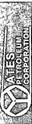

Pathfinder

Pathfinder X & Y Survey Report

<table border=1 style='margin: auto; word-wrap: break-word;'><tr><td style='text-align: center; word-wrap: break-word;'>Company:</td><td style='text-align: center; word-wrap: break-word;'>Yates Petroleum Corp.</td><td style='text-align: center; word-wrap: break-word;'></td><td style='text-align: center; word-wrap: break-word;'></td><td style='text-align: center; word-wrap: break-word;'>Local Co-ordinate Reference:</td><td style='text-align: center; word-wrap: break-word;'>Well #2H</td></tr><tr><td style='text-align: center; word-wrap: break-word;'>Project:</td><td style='text-align: center; word-wrap: break-word;'>Eddy County</td><td style='text-align: center; word-wrap: break-word;'></td><td style='text-align: center; word-wrap: break-word;'></td><td style='text-align: center; word-wrap: break-word;'>TVD Reference:</td><td style='text-align: center; word-wrap: break-word;'>WELL @ 3190.50ft (Original Well Elev)</td></tr><tr><td style='text-align: center; word-wrap: break-word;'>Site:</td><td style='text-align: center; word-wrap: break-word;'>Jericho &quot;BKJ&quot; State Com</td><td style='text-align: center; word-wrap: break-word;'></td><td style='text-align: center; word-wrap: break-word;'></td><td style='text-align: center; word-wrap: break-word;'>MD Reference:</td><td style='text-align: center; word-wrap: break-word;'>WELL @ 3190.50ft (Original Well Elev)</td></tr><tr><td style='text-align: center; word-wrap: break-word;'>Well:</td><td style='text-align: center; word-wrap: break-word;'>#2H</td><td style='text-align: center; word-wrap: break-word;'></td><td style='text-align: center; word-wrap: break-word;'></td><td style='text-align: center; word-wrap: break-word;'>North Reference:</td><td style='text-align: center; word-wrap: break-word;'>Grid</td></tr><tr><td style='text-align: center; word-wrap: break-word;'>Wellbore:</td><td style='text-align: center; word-wrap: break-word;'>OH</td><td style='text-align: center; word-wrap: break-word;'></td><td style='text-align: center; word-wrap: break-word;'></td><td style='text-align: center; word-wrap: break-word;'>Survey Calculation Method:</td><td style='text-align: center; word-wrap: break-word;'>Minimum Curvature</td></tr><tr><td style='text-align: center; word-wrap: break-word;'>Design:</td><td style='text-align: center; word-wrap: break-word;'>OH</td><td style='text-align: center; word-wrap: break-word;'></td><td style='text-align: center; word-wrap: break-word;'></td><td style='text-align: center; word-wrap: break-word;'>Database:</td><td style='text-align: center; word-wrap: break-word;'>Midland Database</td></tr><tr><td colspan="6">Survey Annotations</td></tr><tr><td rowspan="2">Measured Depth (ft)</td><td rowspan="2">Vertical Depth (ft)</td><td colspan="3">Local Coordinates</td><td rowspan="2">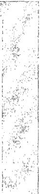</td></tr><tr><td style='text-align: center; word-wrap: break-word;'>+N/-S (ft)</td><td style='text-align: center; word-wrap: break-word;'>+E/-W (ft)</td><td style='text-align: center; word-wrap: break-word;'>Comment</td></tr><tr><td style='text-align: center; word-wrap: break-word;'>10,495.00</td><td style='text-align: center; word-wrap: break-word;'>6,124.09</td><td style='text-align: center; word-wrap: break-word;'>-20.72</td><td style='text-align: center; word-wrap: break-word;'>-4,541.61</td><td colspan="2">BHL-10495.00MD,88.55° INC,269.19° AZI, 6124.09° TVD, 4541.43° VS, -:</td></tr><tr><td style='text-align: center; word-wrap: break-word;'>Checked By: ________</td><td colspan="4">Approved By: ________</td><td style='text-align: center; word-wrap: break-word;'>Date:</td></tr></table>

# Page 40

<table border=1 style='margin: auto; word-wrap: break-word;'><tr><td colspan="4">Lease Line</td></tr></table>

<table border=1 style='margin: auto; word-wrap: break-word;'><tr><td style='text-align: center; word-wrap: break-word;'>Sec</td><td style='text-align: center; word-wrap: break-word;'>MD</td><td style='text-align: center; word-wrap: break-word;'>Inc</td><td style='text-align: center; word-wrap: break-word;'>Azi</td><td style='text-align: center; word-wrap: break-word;'>TVD</td><td colspan="7">SECTION DETAILS</td></tr><tr><td style='text-align: center; word-wrap: break-word;'>1</td><td style='text-align: center; word-wrap: break-word;'>5669.00</td><td style='text-align: center; word-wrap: break-word;'>0.64</td><td style='text-align: center; word-wrap: break-word;'>108.28</td><td style='text-align: center; word-wrap: break-word;'>5667.94</td><td style='text-align: center; word-wrap: break-word;'>+N/-S</td><td style='text-align: center; word-wrap: break-word;'>+E/-W</td><td style='text-align: center; word-wrap: break-word;'>DLeg</td><td style='text-align: center; word-wrap: break-word;'>TFace</td><td style='text-align: center; word-wrap: break-word;'>VSec</td><td style='text-align: center; word-wrap: break-word;'>Target</td><td style='text-align: center; word-wrap: break-word;'></td></tr><tr><td style='text-align: center; word-wrap: break-word;'>2</td><td style='text-align: center; word-wrap: break-word;'>6423.33</td><td style='text-align: center; word-wrap: break-word;'>90.00</td><td style='text-align: center; word-wrap: break-word;'>270.22</td><td style='text-align: center; word-wrap: break-word;'>6150.00</td><td style='text-align: center; word-wrap: break-word;'>8.93</td><td style='text-align: center; word-wrap: break-word;'>-2.47</td><td style='text-align: center; word-wrap: break-word;'>0.00</td><td style='text-align: center; word-wrap: break-word;'>0.00</td><td style='text-align: center; word-wrap: break-word;'>2.52</td><td style='text-align: center; word-wrap: break-word;'></td><td style='text-align: center; word-wrap: break-word;'></td></tr><tr><td style='text-align: center; word-wrap: break-word;'>3</td><td style='text-align: center; word-wrap: break-word;'>10587.99</td><td style='text-align: center; word-wrap: break-word;'>90.00</td><td style='text-align: center; word-wrap: break-word;'>270.22</td><td style='text-align: center; word-wrap: break-word;'>6150.00</td><td style='text-align: center; word-wrap: break-word;'>9.09</td><td style='text-align: center; word-wrap: break-word;'>-479.43</td><td style='text-align: center; word-wrap: break-word;'>12.01</td><td style='text-align: center; word-wrap: break-word;'>161.93</td><td style='text-align: center; word-wrap: break-word;'>479.47</td><td style='text-align: center; word-wrap: break-word;'></td><td style='text-align: center; word-wrap: break-word;'></td></tr><tr><td style='text-align: center; word-wrap: break-word;'></td><td style='text-align: center; word-wrap: break-word;'></td><td style='text-align: center; word-wrap: break-word;'></td><td style='text-align: center; word-wrap: break-word;'></td><td style='text-align: center; word-wrap: break-word;'></td><td style='text-align: center; word-wrap: break-word;'>25.08</td><td style='text-align: center; word-wrap: break-word;'>-4644.06</td><td style='text-align: center; word-wrap: break-word;'>0.00</td><td style='text-align: center; word-wrap: break-word;'>0.00</td><td style='text-align: center; word-wrap: break-word;'>4644.13</td><td style='text-align: center; word-wrap: break-word;'>PBHL(JSC#2H)</td><td style='text-align: center; word-wrap: break-word;'></td></tr></table>

<table border=1 style='margin: auto; word-wrap: break-word;'><tr><td colspan="10">WELL DETAILS: #2H</td></tr><tr><td colspan="10">Ground Elevation: 3172.00\nRKB Elevation: Well @ 3190.50R (Original Well Elev\nRig Name: Original Well Elev</td></tr><tr><td style='text-align: center; word-wrap: break-word;'>+N/S\n0.00</td><td style='text-align: center; word-wrap: break-word;'>+E/W\n0.00</td><td style='text-align: center; word-wrap: break-word;'>Northing\n413000.221</td><td style='text-align: center; word-wrap: break-word;'>Easting\n591679.342</td><td style='text-align: center; word-wrap: break-word;'>Latitude\n32° 8&#x27; 7.915 N</td><td colspan="2">Longitude\n104° 10&#x27; 14.500 W</td><td colspan="3">Slot</td></tr><tr><td colspan="10">WELLBORE TARGET DETAILS (MAP CO-ORDINATES)</td></tr><tr><td style='text-align: center; word-wrap: break-word;'>Name\nPBHL(JSC#2H)</td><td style='text-align: center; word-wrap: break-word;'>TVD\n6150.00</td><td style='text-align: center; word-wrap: break-word;'>+N/S\n25.06</td><td style='text-align: center; word-wrap: break-word;'>+E/W\n4644.06</td><td style='text-align: center; word-wrap: break-word;'>Northing\n413105.285</td><td style='text-align: center; word-wrap: break-word;'>Easting\n587035.283</td><td colspan="4">Shape\nPoint</td></tr></table>

# /ertical Section at 270.31° (200 ft/in)

South(-)/North(+) (200 ft/in)

<table border=1 style='margin: auto; word-wrap: break-word;'><tr><td style='text-align: center; word-wrap: break-word;'>5600</td><td style='text-align: center; word-wrap: break-word;'>0000000000000000000000000000000000000000000000000000000000000000000000000000000000000000000000000000000000000000000000000000000000000000000000000000000000000000000000000000000000000000000000000000000000000000000000000000000000000000000000000000000000000000000000000000000000000000000000000000000000000000000000000000000000000000000000000000000000000000000000000000000000000000000000000000000000000000000000000000000000000000000000000000000000000000000000000000000000000000000000000000000000000000000000000000000000000000000000000000000000000000000000000000000000000000000000000000000000000000000000000000000000000000000000000000000000000000000000000000000000000000000000000000000000000000000000000000000000000000000000000000000000000000000000000000000000000000000000000000000000000000000000000000000000000000000000000000000000000000000000000000000000000000000000000000000000000000000000000000000000000000000000000000000000000000000000000000000000000000000000000000000000000000000000000000000000000000000000000000000000000000000000000000000000000000000000000000000000000000000000000000000000000000000000000000000000000000000000000000000000000000000000000000000000000000000000000000000000000000000000000000000000000000000000000000000000000000000000000000000000000000000000000000000000000000000000000000000000000000000000000000000000000000000000000000000000000000000000000000000000000000000000000000000000000000000000000000000000000000000000000000000000000000000000000000000000000000000000000000000000000000000000000000000000000000000000000000000000000000000000000000000000000000000000000000000000000000000000000000000000000000000000000000000000000000000000000000000000000000000000000000000000000000000000000000000000000000000000000000000000000000000000000000000000000000000000000000000000000000000000000000000000000000000000000000000000000000000000000000000000000000000000000000000000000000000000000000000000000000000000000000000000000000000000000000000000000000000000000000000000000000000000000000000000000000000000000000000000000000000000000000000000000000000000000000000000000000000000000000000000000000000000000000000000000000000000000000000000000000000000000000000000000000000000000000000000000000000000000000000000000000000000000000000000000000000000000000000000000000000000000000000000000000000000000000000000000000000000000000000000000000000000000000000000000000000000000000000000000000000000000000000000000000000000000000000000000000000000000000000000000000000000000000000000000000000000000000000000000000000000000000000000000000000000000000000000000000000000000000000000000000000000000000000000000000000000000000000000000000000000000000000000000000000000000000000000000000000000000000000000000000000000000000000000000000000000000000000000000000000000000000000000000000000000000000000000000000000000000000000000000000000000000000000000000000000000000000000000000000000000000000000000000000000000000000000000000000000000000000000000000000000000000000000000000000000000000000000000000000000000000000000000000000000000000000000000000000000000000000000000000000000000000000000000000000000000000000000000000000000000000000000000000000000000000000000000000000000000000000000000000000000000000000000000000000000000000000000000000000000000000000000000000000000000000000000000000000000000000000000000000000000000000000000000000000000000000000000000000000000000000000000000000000000000000000000000000000000000000000000000000000000000000000000000000000000000000000000000000000000000000000000000000000000000000000000000000000000000000000000000000000000000000000000000000000000000000000000000000000000000000000000000000000000000000000000000000000000000000000000000000000000000000000000000000000000000000000000000000000000000000000000000000000000000000000000000000000000000000000000000000000000000000000000000000000000000000000000000000000000000000000000000000000000000000000000000000000000000000000000000000000000000000000000000000000000000000000000000000000000000000000000000000000000000000000000000000000000000000000000000000000000000000000000000000000000000000000000000000000000000000000000000</td></tr></table>

:t(-)/East(+) (200 ft/in)

<one: New Mexico Eastern System Datum: Mean Sea Level Local North Grid

Model: IGRF2010

Zone: New Mexico Eastern Zone

Dip Angle:  $ 60.02^{\circ} $

Datum: NORTH ALIER

Ellipsoid: GRS 1980

Strength: 48594.4snT

Datum: North American Datum 1983

Magnetic Field

Magnetic North: 7.88°

PROJECT DETAILS: Eddy County

Plan: Plan #2 (#2H/OH)

Wellbore: OH

Well: #2H

Azimuths to Grid North

N

Site: Jericho "BKJ" State Com

G

Project: Eddy County

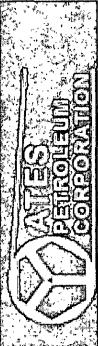

# Page 41

An Operating Unit of Smith International, Inc.

DIRECTIONAL SURVEY REPORT

YATES PETROLEUM

JERICHO "BKJ" STATE COM #2H

EDDY COUNTY, NEW MEXICO

PREPARED BY: FRANCISCO SINISTERRA

Pathfinder Energy Services, Inc.

6213 W. Interstate 20 • Midland, TX • 79706

(432) 681-6000

# Page 42

DIRECTIONAL SURVEY COMPANY REPORT:

1. NAME OF SURVEYING COMPANY: PATHFINDER ENERGY SERVICES

2. NAME OF PERSON(S) PERFORMING SURVEY:

A) BRYANT BLAKEMORE

3. POSITION OF SAID PERSON(S): (A-F) SURVEYORS (FIELD ENGINEERS)

4. DATE(S) ON WHICH SURVEY WAS PERFORMED: 06-19-10 TO 06-21-10

5. STATE IN WHICH SURVEY WAS PERFORMED: NEW MEXICO

6. LOCATION OF WELL: EDDY COUNTY

7. TYPE OF SURVEY(S) PERFORMED: MWD

8. COMPLETE IDENTIFICATION OF WELL:

YATES PETROLEUM

JERICHO "BKJ" STATE COM #2H

EDDY COUNTY, NM

RIG: SILVER OAK 10

9. SURVEY CERTIFIED FROM: 522 TO 2178 FEET MEASURED DEPTH.

THIS IS TO VERIFY THAT ATTACHED DOCUMENTS SHOWING THE WELL TO BE DISPLACED AT 15.73 FEET ON A BEARING OF 270.20 DEGREES FROM THE CENTER OF THE ROTARY TABLE AT A PROJECTED BIT DEPTH OF 2232 FEET, ARE TRUE AND CORRECT TO THE BEST OF MY KNOWLEDGE.

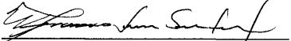

FRANCISCO SINISTERRA

MWD COORDINATOR

# Page 43

# PathFinder Energy Services, Inc. BHL Report

Page 01/01

Date Completed: 06/21/2010

Tie-in Date: 06/19/2010

YATES PETROLEUM

JERICHO BKJ STATE COM #2H - STRAIGHT HOLE CONTROL

EDDY COUNTY, NEW MEXICO

PathFinder Office Supervisor: FRANCISCO SINISTERRA

PathFinder Field Engineers:BRYANT BLAKEMORE

GABE GARCIA

Survey Horiz. Reference: WELLHEAD

Ref Coordinates: LAT:32.8.7.9146 N LON:104.10.14.5000 W

GRID Reference:NAD83 new mexico east Transverse Mercator

Ref GRID Coor: X: 591679.3420 Y: 413080.2210

Total Magnetic Correction:  $ 7.88^{\circ} $ EAST TO GRID

Vertical Section Plane: 0.00

Survey Vert. Reference: 18.00' Kelly Bushing To Ground

Altitude:3172.00' Ground To MSL

<table border=1 style='margin: auto; word-wrap: break-word;'><tr><td style='text-align: center; word-wrap: break-word;'>Measured Depth</td><td style='text-align: center; word-wrap: break-word;'>2232.00</td><td style='text-align: center; word-wrap: break-word;'>(feet)</td></tr><tr><td style='text-align: center; word-wrap: break-word;'>Inclination</td><td style='text-align: center; word-wrap: break-word;'>2.46</td><td style='text-align: center; word-wrap: break-word;'>(deg)</td></tr><tr><td style='text-align: center; word-wrap: break-word;'>Azimuth</td><td style='text-align: center; word-wrap: break-word;'>82.33</td><td style='text-align: center; word-wrap: break-word;'>(deg)</td></tr><tr><td style='text-align: center; word-wrap: break-word;'>True Vertical Depth</td><td style='text-align: center; word-wrap: break-word;'>2230.99</td><td style='text-align: center; word-wrap: break-word;'>(feet)</td></tr><tr><td style='text-align: center; word-wrap: break-word;'>Vertical Section</td><td style='text-align: center; word-wrap: break-word;'>0.06</td><td style='text-align: center; word-wrap: break-word;'>(feet)</td></tr><tr><td style='text-align: center; word-wrap: break-word;'>Survey X cord</td><td style='text-align: center; word-wrap: break-word;'>591663.61</td><td style='text-align: center; word-wrap: break-word;'>(feet)</td></tr><tr><td style='text-align: center; word-wrap: break-word;'>Survey Y cord</td><td style='text-align: center; word-wrap: break-word;'>413080.28</td><td style='text-align: center; word-wrap: break-word;'>(feet)</td></tr><tr><td style='text-align: center; word-wrap: break-word;'>Survey Lat</td><td style='text-align: center; word-wrap: break-word;'>32.13553206 N</td><td style='text-align: center; word-wrap: break-word;'>(deg)</td></tr><tr><td style='text-align: center; word-wrap: break-word;'>Survey Lon</td><td style='text-align: center; word-wrap: break-word;'>104.17074526 W</td><td style='text-align: center; word-wrap: break-word;'>(deg)</td></tr><tr><td style='text-align: center; word-wrap: break-word;'>Rectangular Corr. N/S</td><td style='text-align: center; word-wrap: break-word;'>0.06 N</td><td style='text-align: center; word-wrap: break-word;'>(feet)</td></tr><tr><td style='text-align: center; word-wrap: break-word;'>Rectangular Corr. E/W</td><td style='text-align: center; word-wrap: break-word;'>15.73 W</td><td style='text-align: center; word-wrap: break-word;'>(feet)</td></tr><tr><td style='text-align: center; word-wrap: break-word;'>Closure Distance</td><td style='text-align: center; word-wrap: break-word;'>15.73</td><td style='text-align: center; word-wrap: break-word;'>(feet)</td></tr><tr><td style='text-align: center; word-wrap: break-word;'>Direction of Closure</td><td style='text-align: center; word-wrap: break-word;'>270.20</td><td style='text-align: center; word-wrap: break-word;'>(deg)</td></tr><tr><td style='text-align: center; word-wrap: break-word;'>Dogleg Severity</td><td style='text-align: center; word-wrap: break-word;'>0.00</td><td style='text-align: center; word-wrap: break-word;'>(deg/100)</td></tr></table>

# Page 44

Page 01/01, Tie-in Date: 06/19/2010

Date Completed: 06/21/2010

JERICHO BKJ STATE COM #2H - STRAIGHT HOLE CONTROL

EDDY COUNTY, NEW MEXICO

Survey Horiz. Reference:WELLHEAD

Ref Coordinates: LAT:32.8.7.9146 N LON:104.10.14.5000 W

GRID Reference: NAD83 new mexico east Transverse Mercator

Ref GRID Coor: X: 591679.3420 Y: 413080.2210

## GABE GARCIA

Total Magnetic Correction: 7.88° EAST TO

Survey Calculations by PathCalc v2.00 using Minimum Curvature

Vertical Section Plane: U.00

Survey Vert. Reference: 18.00' Kelly Bushing To Ground

Altitude: 3172.00' Ground To MSL

<table border=1 style='margin: auto; word-wrap: break-word;'><tr><td style='text-align: center; word-wrap: break-word;'>Measured Depth (ft)</td><td style='text-align: center; word-wrap: break-word;'>Incl (deg)</td><td style='text-align: center; word-wrap: break-word;'>Drift Dir. (deg)</td><td style='text-align: center; word-wrap: break-word;'>TVD (ft)</td><td style='text-align: center; word-wrap: break-word;'>Course Length (ft)</td><td style='text-align: center; word-wrap: break-word;'>Vertical Section (ft)</td><td style='text-align: center; word-wrap: break-word;'>TOTAL Rectangular Offsets (ft)</td><td style='text-align: center; word-wrap: break-word;'>Closure Dist (ft)</td><td style='text-align: center; word-wrap: break-word;'>DIs (deg)</td><td style='text-align: center; word-wrap: break-word;'>DLS (dg/100)</td></tr><tr><td colspan="10">ASSUMING VERTICAL DEPTH @ 422&#x27; MD.</td></tr><tr><td style='text-align: center; word-wrap: break-word;'>422.00</td><td style='text-align: center; word-wrap: break-word;'>0.00</td><td style='text-align: center; word-wrap: break-word;'>0.00</td><td style='text-align: center; word-wrap: break-word;'>422.00</td><td style='text-align: center; word-wrap: break-word;'>0.00</td><td style='text-align: center; word-wrap: break-word;'>0.00</td><td style='text-align: center; word-wrap: break-word;'>0.00</td><td style='text-align: center; word-wrap: break-word;'>0.00@</td><td style='text-align: center; word-wrap: break-word;'>0.00</td><td style='text-align: center; word-wrap: break-word;'>0.00</td></tr><tr><td colspan="10">THE FOLLOWING ARE PATHFINDER MWD SURVEYS.</td></tr><tr><td style='text-align: center; word-wrap: break-word;'>522.00</td><td style='text-align: center; word-wrap: break-word;'>1.23</td><td style='text-align: center; word-wrap: break-word;'>279.05</td><td style='text-align: center; word-wrap: break-word;'>521.99</td><td style='text-align: center; word-wrap: break-word;'>100.00</td><td style='text-align: center; word-wrap: break-word;'>0.17</td><td style='text-align: center; word-wrap: break-word;'>0.17 N</td><td style='text-align: center; word-wrap: break-word;'>1.06 W</td><td style='text-align: center; word-wrap: break-word;'>1.07@</td><td style='text-align: center; word-wrap: break-word;'>279.05</td></tr><tr><td style='text-align: center; word-wrap: break-word;'>706.00</td><td style='text-align: center; word-wrap: break-word;'>2.29</td><td style='text-align: center; word-wrap: break-word;'>283.15</td><td style='text-align: center; word-wrap: break-word;'>705.90</td><td style='text-align: center; word-wrap: break-word;'>184.00</td><td style='text-align: center; word-wrap: break-word;'>1.32</td><td style='text-align: center; word-wrap: break-word;'>1.32 N</td><td style='text-align: center; word-wrap: break-word;'>6.59 W</td><td style='text-align: center; word-wrap: break-word;'>6.72@</td><td style='text-align: center; word-wrap: break-word;'>281.29</td></tr><tr><td style='text-align: center; word-wrap: break-word;'>890.00</td><td style='text-align: center; word-wrap: break-word;'>1.23</td><td style='text-align: center; word-wrap: break-word;'>282.19</td><td style='text-align: center; word-wrap: break-word;'>889.81</td><td style='text-align: center; word-wrap: break-word;'>184.00</td><td style='text-align: center; word-wrap: break-word;'>2.57</td><td style='text-align: center; word-wrap: break-word;'>2.57 N</td><td style='text-align: center; word-wrap: break-word;'>12.10 W</td><td style='text-align: center; word-wrap: break-word;'>12.37@</td><td style='text-align: center; word-wrap: break-word;'>281.99</td></tr><tr><td style='text-align: center; word-wrap: break-word;'>1074.00</td><td style='text-align: center; word-wrap: break-word;'>1.49</td><td style='text-align: center; word-wrap: break-word;'>281.00</td><td style='text-align: center; word-wrap: break-word;'>1073.76</td><td style='text-align: center; word-wrap: break-word;'>184.00</td><td style='text-align: center; word-wrap: break-word;'>3.44</td><td style='text-align: center; word-wrap: break-word;'>3.44 N</td><td style='text-align: center; word-wrap: break-word;'>16.38 W</td><td style='text-align: center; word-wrap: break-word;'>16.74@</td><td style='text-align: center; word-wrap: break-word;'>281.87</td></tr><tr><td style='text-align: center; word-wrap: break-word;'>1257.00</td><td style='text-align: center; word-wrap: break-word;'>2.11</td><td style='text-align: center; word-wrap: break-word;'>280.64</td><td style='text-align: center; word-wrap: break-word;'>1256.67</td><td style='text-align: center; word-wrap: break-word;'>183.00</td><td style='text-align: center; word-wrap: break-word;'>4.52</td><td style='text-align: center; word-wrap: break-word;'>4.52 N</td><td style='text-align: center; word-wrap: break-word;'>22.03 W</td><td style='text-align: center; word-wrap: break-word;'>22.48@</td><td style='text-align: center; word-wrap: break-word;'>281.59</td></tr><tr><td style='text-align: center; word-wrap: break-word;'>1449.00</td><td style='text-align: center; word-wrap: break-word;'>2.55</td><td style='text-align: center; word-wrap: break-word;'>272.64</td><td style='text-align: center; word-wrap: break-word;'>1448.51</td><td style='text-align: center; word-wrap: break-word;'>192.00</td><td style='text-align: center; word-wrap: break-word;'>5.37</td><td style='text-align: center; word-wrap: break-word;'>5.37 N</td><td style='text-align: center; word-wrap: break-word;'>29.77 W</td><td style='text-align: center; word-wrap: break-word;'>30.25@</td><td style='text-align: center; word-wrap: break-word;'>280.22</td></tr><tr><td style='text-align: center; word-wrap: break-word;'>1639.00</td><td style='text-align: center; word-wrap: break-word;'>0.62</td><td style='text-align: center; word-wrap: break-word;'>220.50</td><td style='text-align: center; word-wrap: break-word;'>1638.44</td><td style='text-align: center; word-wrap: break-word;'>190.00</td><td style='text-align: center; word-wrap: break-word;'>4.78</td><td style='text-align: center; word-wrap: break-word;'>4.78 N</td><td style='text-align: center; word-wrap: break-word;'>34.66 W</td><td style='text-align: center; word-wrap: break-word;'>34.98@</td><td style='text-align: center; word-wrap: break-word;'>277.85</td></tr><tr><td style='text-align: center; word-wrap: break-word;'>1830.00</td><td style='text-align: center; word-wrap: break-word;'>1.41</td><td style='text-align: center; word-wrap: break-word;'>119.44</td><td style='text-align: center; word-wrap: break-word;'>1829.41</td><td style='text-align: center; word-wrap: break-word;'>191.00</td><td style='text-align: center; word-wrap: break-word;'>2.84</td><td style='text-align: center; word-wrap: break-word;'>2.84 N</td><td style='text-align: center; word-wrap: break-word;'>33.28 W</td><td style='text-align: center; word-wrap: break-word;'>33.40@</td><td style='text-align: center; word-wrap: break-word;'>274.88</td></tr><tr><td style='text-align: center; word-wrap: break-word;'>2019.00</td><td style='text-align: center; word-wrap: break-word;'>3.34</td><td style='text-align: center; word-wrap: break-word;'>103.73</td><td style='text-align: center; word-wrap: break-word;'>2018.24</td><td style='text-align: center; word-wrap: break-word;'>189.00</td><td style='text-align: center; word-wrap: break-word;'>0.39</td><td style='text-align: center; word-wrap: break-word;'>0.39 N</td><td style='text-align: center; word-wrap: break-word;'>25.91 W</td><td style='text-align: center; word-wrap: break-word;'>25.91@</td><td style='text-align: center; word-wrap: break-word;'>270.86</td></tr><tr><td style='text-align: center; word-wrap: break-word;'>2178.00</td><td style='text-align: center; word-wrap: break-word;'>2.46</td><td style='text-align: center; word-wrap: break-word;'>82.33</td><td style='text-align: center; word-wrap: break-word;'>2177.04</td><td style='text-align: center; word-wrap: break-word;'>159.00</td><td style='text-align: center; word-wrap: break-word;'>-0.25</td><td style='text-align: center; word-wrap: break-word;'>0.25 S</td><td style='text-align: center; word-wrap: break-word;'>18.03 W</td><td style='text-align: center; word-wrap: break-word;'>18.03@</td><td style='text-align: center; word-wrap: break-word;'>269.19</td></tr><tr><td colspan="10">STRAIGHT LINE PROJECTION TO THE BIT @ 2232&#x27; MD.</td></tr><tr><td style='text-align: center; word-wrap: break-word;'>2232.00</td><td style='text-align: center; word-wrap: break-word;'>2.46</td><td style='text-align: center; word-wrap: break-word;'>82.33</td><td style='text-align: center; word-wrap: break-word;'>2230.99</td><td style='text-align: center; word-wrap: break-word;'>54.00</td><td style='text-align: center; word-wrap: break-word;'>0.06</td><td style='text-align: center; word-wrap: break-word;'>0.06 N</td><td style='text-align: center; word-wrap: break-word;'>15.73 W</td><td style='text-align: center; word-wrap: break-word;'>15.73@</td><td style='text-align: center; word-wrap: break-word;'>270.20</td></tr></table>

# Page 45

# TIE-IN SURVEY INFORMATION SHEET

CLIENT INFORMATION

<table border=1 style='margin: auto; word-wrap: break-word;'><tr><td style='text-align: center; word-wrap: break-word;'>CLIENT:</td><td colspan="3">YATES PETROLEUM</td></tr><tr><td style='text-align: center; word-wrap: break-word;'>LEASE / WELL No.:</td><td style='text-align: center; word-wrap: break-word;'>JERICHO BKJ</td><td colspan="2">STATE COM #2</td></tr><tr><td style='text-align: center; word-wrap: break-word;'>WELL LOCATION:</td><td colspan="3">EDDY COUNTY, NEW MEXICO</td></tr><tr><td style='text-align: center; word-wrap: break-word;'>COUNTY / STATE / COUNTRY:</td><td style='text-align: center; word-wrap: break-word;'>EDDY COUNTY</td><td style='text-align: center; word-wrap: break-word;'>NEW MEXICO</td><td style='text-align: center; word-wrap: break-word;'>USA</td></tr><tr><td style='text-align: center; word-wrap: break-word;'>RIG:</td><td colspan="3">SILVER OAK 10</td></tr><tr><td style='text-align: center; word-wrap: break-word;'>API WELL No:</td><td colspan="3">30-015-37500</td></tr><tr><td style='text-align: center; word-wrap: break-word;'>JOB No:</td><td colspan="3">101010753 WT-WT</td></tr><tr><td style='text-align: center; word-wrap: break-word;'>P.O. / AFE No.</td><td colspan="3"></td></tr><tr><td style='text-align: center; word-wrap: break-word;'>DIRECTIONAL COMPANY:</td><td colspan="3">PATHFINDER ENERGY</td></tr></table>

WELL SITE INFORMATION

<table border=1 style='margin: auto; word-wrap: break-word;'><tr><td colspan="6">MAGNETIC DECLINATION:</td></tr><tr><td style='text-align: center; word-wrap: break-word;'>On Wall Plat:</td><td style='text-align: center; word-wrap: break-word;'>7.89</td><td style='text-align: center; word-wrap: break-word;'>LWD Calculated:</td><td style='text-align: center; word-wrap: break-word;'>7.88</td><td style='text-align: center; word-wrap: break-word;'>Agreed Upon:</td><td style='text-align: center; word-wrap: break-word;'>7.88</td></tr><tr><td style='text-align: center; word-wrap: break-word;'>X =</td><td style='text-align: center; word-wrap: break-word;'>591679.342000</td><td style='text-align: center; word-wrap: break-word;'>Feet</td><td style='text-align: center; word-wrap: break-word;'></td><td style='text-align: center; word-wrap: break-word;'>Y =</td><td style='text-align: center; word-wrap: break-word;'>413080.221000</td></tr><tr><td style='text-align: center; word-wrap: break-word;'>SITE LATITUDE:</td><td colspan="2">32.135532 N</td><td style='text-align: center; word-wrap: break-word;'>SITE LONGITUDE:</td><td colspan="2">104.170694 W</td></tr><tr><td style='text-align: center; word-wrap: break-word;'>GRID SYSTEM:</td><td style='text-align: center; word-wrap: break-word;'>TRUE ☐</td><td style='text-align: center; word-wrap: break-word;'>UTM ☑</td><td style='text-align: center; word-wrap: break-word;'>LAMBERT ☐</td><td style='text-align: center; word-wrap: break-word;'>ZONE:</td><td style='text-align: center; word-wrap: break-word;'>new mexico east</td></tr><tr><td colspan="4">PROPOSED DRIFT DIRECTION:</td><td colspan="2">0</td></tr><tr><td colspan="4">KELLY BUSHING ELEVATION:</td><td colspan="2">18</td></tr><tr><td style='text-align: center; word-wrap: break-word;'>ALTITUDE:</td><td style='text-align: center; word-wrap: break-word;'>3172</td><td style='text-align: center; word-wrap: break-word;'>Feet</td><td style='text-align: center; word-wrap: break-word;'>WATER DEPTH:</td><td style='text-align: center; word-wrap: break-word;'>N/A</td><td style='text-align: center; word-wrap: break-word;'>Feet</td></tr></table>

TIE-IN SURVEY

<table border=1 style='margin: auto; word-wrap: break-word;'><tr><td style='text-align: center; word-wrap: break-word;'>MEASURED DEPTH:</td><td colspan="3">520</td></tr><tr><td style='text-align: center; word-wrap: break-word;'>DRIFT ANGLE:</td><td colspan="3">0</td></tr><tr><td style='text-align: center; word-wrap: break-word;'>DRIFT DIRECTION:</td><td colspan="3">0</td></tr><tr><td style='text-align: center; word-wrap: break-word;'>TRUE VERTICAL DEPTH:</td><td colspan="3">520</td></tr><tr><td style='text-align: center; word-wrap: break-word;'>VERTICAL SECTION:</td><td colspan="3">0</td></tr><tr><td style='text-align: center; word-wrap: break-word;'>RECTANGULAR COORDINATE ( N / S ) :</td><td colspan="3">0</td></tr><tr><td style='text-align: center; word-wrap: break-word;'>RECTANGULAR COORDINATE ( E / W ) :</td><td colspan="3">0</td></tr><tr><td style='text-align: center; word-wrap: break-word;'>CLOSURE DISTANCE / DIRECTION:</td><td style='text-align: center; word-wrap: break-word;'>0</td><td colspan="2">0</td></tr><tr><td style='text-align: center; word-wrap: break-word;'>SURVEY CALCULATION METHOD:</td><td colspan="3">AA ☐ MC ☑ RC ☐ BT ☐</td></tr><tr><td style='text-align: center; word-wrap: break-word;'>SOURCE OF TIE-IN DATA ( COMPANY ):</td><td colspan="3">N /A</td></tr><tr><td style='text-align: center; word-wrap: break-word;'>COPY OF TIE-IN SURVEY REPORT</td><td colspan="3">☐ YES ☑ NO</td></tr></table>

WELL PLAN

<table border=1 style='margin: auto; word-wrap: break-word;'><tr><td style='text-align: center; word-wrap: break-word;'>KICKOFF DEPTH:</td><td style='text-align: center; word-wrap: break-word;'>520</td><td style='text-align: center; word-wrap: break-word;'>TOTAL DEPTH:</td><td style='text-align: center; word-wrap: break-word;'>2400</td></tr><tr><td style='text-align: center; word-wrap: break-word;'>KICKOFF ANGLE:</td><td style='text-align: center; word-wrap: break-word;'>0</td><td style='text-align: center; word-wrap: break-word;'>MAX ANGLE:</td><td style='text-align: center; word-wrap: break-word;'>0</td></tr></table>

<table border=1 style='margin: auto; word-wrap: break-word;'><tr><td style='text-align: center; word-wrap: break-word;'>PES Engineers:</td><td style='text-align: center; word-wrap: break-word;'>BRYANT BLAKEMORE</td></tr><tr><td style='text-align: center; word-wrap: break-word;'></td><td style='text-align: center; word-wrap: break-word;'>GABE GARCIA</td></tr></table>

**Signature of both field engineers required if applicable**

# Page 46

# PathFinder Energy Services, Inc. Magnetic & Grid Calculations

YATES PETROLEUM

JERICHO BKJ STATE COM #2H

EDDY COUNTY, NEW MEXICO

Rig:SILVER OAK #10

Wed Jun 16 11:35:15 2010

## Coordinates

Latitude: 32.135532 N (32 deg. 8 min. 7.9146 sec.)

Longitude: 104.170694 W (-104 deg. 10 min. 14.5000 sec.)

Elevation:

3190.00 feet.

Calculation Date: Jun/16/2010

## Magnetic Calculations

Model: IGRF2010

Dip Angle: 60.0225 degrees

Total Magnetic Field: 0.48596 gauss

Magnetic Declination: 7.971997 degrees

Horizontal Intensity: 0.242813 gauss

To Convert a Magnetic Dir. to a TRUE North Dir. Add 7.971997 Degs

## Transverse Mercurator Grid Calculations NAD83

Grid System: Transverse Mercator: new mexico east

Ellipsoid: GRS80

X: 591679.3420 feet

Y: 413080.2210 feet

True to Grid: (convergence) -0.086512 degrees

Magnetic to Grid: 7.885485 degrees

To Convert a Magnetic Dir. to a GRID dir. Add 7.885485 Degs.

# Page 47

# PathFinder Energy Services, Inc. Magnetic & Grid Calculations

YATES PETROLEUM

JERICHO BKJ STATE COM #2H

EDDY COUNTY, NEW MEXICO

Rig:SILVER OAK 10

Sat Jun 19 19:08:43 2010

## Coordinates

Latitude: 32.135532 N (32 deg. 8 min. 7.9146 sec.)

Longitude: 104.170694 W (-104 deg. 10 min. 14.5000 sec.)

Elevation: 3190.00 feet.

Calculation Date: Jun/19/2010

## Magnetic Calculations

Model: IGRF2010

Dip Angle: 60.0223 degrees

Total Magnetic Field: 0.48595 gauss

Magnetic Declination: 7.971005 degrees

Horizontal Intensity: 0.242810 gauss

To Convert a Magnetic Dir. to a TRUE North Dir. Add 7.971005 Degs

## Transverse Mercator Grid Calculations NAD83

Grid System: Transverse Mercator: new mexico east

Ellipsoid: GRS80

X: 591679.3420 feet

Y: 413080.2210 feet

True to Grid: (convergence) -0.086512 degrees

Magnetic to Grid: 7.884493 degrees

To Convert a Magnetic Dir. to a GRID dir. Add 7.884493 Degs.

Field

Calculations

Straight

Hole

# Page 48

An Operating Unit of Smith International, Inc.

# DIRECTIONAL SURVEY REPORT

YATES PETROLEUM

JERICHO "BKJ" STATE COM #2H- PILOT HOLE

EDDY COUNTY, NEW MEXICO

PREPARED BY: FRANCISCO SINISTERRA

Pathfinder Energy Services, Inc.

6213 W. Interstate 20 • Midland, TX • 79706

(432) 681-6000

# Page 49

DIRECTIONAL SURVEY COMPANY REPORT:

1. NAME OF SURVEYING COMPANY: PATHFINDER ENERGY SERVICES

2. NAME OF PERSON(S) PERFORMING SURVEY:

A) BRYANT BLAKEMORE

3. POSITION OF SAID PERSON(S): (A-F) SURVEYORS (FIELD ENGINEERS)

4. DATE(S) ON WHICH SURVEY WAS PERFORMED: 06-20-10 TO 06-28-10

5. STATE IN WHICH SURVEY WAS PERFORMED: NEW MEXICO

6. LOCATION OF WELL: EDDY COUNTY

7. TYPE OF SURVEY(S) PERFORMED: MWD

8. COMPLETE IDENTIFICATION OF WELL:

YATES PETROLEUM

JERICHO "BKJ" STATE COM #2H- PILOT HOLE

EDDY COUNTY, NM

RIG: SILVER OAK 10

9. SURVEY CERTIFIED FROM: 522 TO 8453 FEET MEASURED DEPTH.

THIS IS TO VERIFY THAT ATTACHED DOCUMENTS SHOWING THE WELL TO BE DISPLACED AT 54.60 FEET ON A BEARING OF 50.98 DEGREES FROM THE CENTER OF THE ROTARY TABLE AT A PROJECTED BIT DEPTH OF 8500 FEET, ARE TRUE AND CORRECT TO THE BEST OF MY KNOWLEDGE.

FRANCISCO SINISTERRA

MWD COORDINATOR

# Page 50

# PathFinder Energy Services, Inc. BHL Report

Tie-in Date: 06/19/2010

Page 01/01

Date Completed: 06/28/2010

YATES PETROLEUM

JERICHO BKJ STATE COM #2H - PILOT HOLE

EDDY COUNTY, NEW MEXICO

Rig:SILVER OAK #10

PathFinder Office Supervisor: FRANCISCO SINISTERRA

PathFinder Field Engineers:BRYANT BLAKEMORE

GABE GARCIA

Survey Horiz. Reference: WELLHEAD

Ref Coordinates: LAT:32.8.7.9146 N LON:104.10.14.5000 W

GRID Reference:NAD83 new mexico east Transverse Mercator

Ref GRID Coor: X: 591679.3420 Y: 413080.221

Total Magnetic Correction:  $ 7.88^{\circ} $ EAST TO GRID

Vertical Section Plane: 270.31

Survey Vert. Reference: 18.00' Kelly Bushing To Ground

Altitude:3172.00' Ground To MSL

<table border=1 style='margin: auto; word-wrap: break-word;'><tr><td style='text-align: center; word-wrap: break-word;'>Measured Depth</td><td style='text-align: center; word-wrap: break-word;'>8500.00</td><td style='text-align: center; word-wrap: break-word;'>(feet)</td></tr><tr><td style='text-align: center; word-wrap: break-word;'>Inclination</td><td style='text-align: center; word-wrap: break-word;'>0.70</td><td style='text-align: center; word-wrap: break-word;'>(deg)</td></tr><tr><td style='text-align: center; word-wrap: break-word;'>Azimuth</td><td style='text-align: center; word-wrap: break-word;'>49.36</td><td style='text-align: center; word-wrap: break-word;'>(deg)</td></tr><tr><td style='text-align: center; word-wrap: break-word;'>True Vertical Depth</td><td style='text-align: center; word-wrap: break-word;'>8496.69</td><td style='text-align: center; word-wrap: break-word;'>(feet)</td></tr><tr><td style='text-align: center; word-wrap: break-word;'>Vertical Section</td><td style='text-align: center; word-wrap: break-word;'>-42.23</td><td style='text-align: center; word-wrap: break-word;'>(feet)</td></tr><tr><td style='text-align: center; word-wrap: break-word;'>Survey X cord</td><td style='text-align: center; word-wrap: break-word;'>591721.74</td><td style='text-align: center; word-wrap: break-word;'>(feet)</td></tr><tr><td style='text-align: center; word-wrap: break-word;'>Survey Y cord</td><td style='text-align: center; word-wrap: break-word;'>413114.58</td><td style='text-align: center; word-wrap: break-word;'>(feet)</td></tr><tr><td style='text-align: center; word-wrap: break-word;'>Survey Lat</td><td style='text-align: center; word-wrap: break-word;'>32.13562613 N</td><td style='text-align: center; word-wrap: break-word;'>(deg)</td></tr><tr><td style='text-align: center; word-wrap: break-word;'>Survey Lon</td><td style='text-align: center; word-wrap: break-word;'>104.17055731 W</td><td style='text-align: center; word-wrap: break-word;'>(deg)</td></tr><tr><td style='text-align: center; word-wrap: break-word;'>Rectangular Corr. N/S</td><td style='text-align: center; word-wrap: break-word;'>34.38 N</td><td style='text-align: center; word-wrap: break-word;'>(feet)</td></tr><tr><td style='text-align: center; word-wrap: break-word;'>Rectangular Corr. E/W</td><td style='text-align: center; word-wrap: break-word;'>42.41 E</td><td style='text-align: center; word-wrap: break-word;'>(feet)</td></tr><tr><td style='text-align: center; word-wrap: break-word;'>Closure Distance</td><td style='text-align: center; word-wrap: break-word;'>54.60</td><td style='text-align: center; word-wrap: break-word;'>(feet)</td></tr><tr><td style='text-align: center; word-wrap: break-word;'>Direction of Closure</td><td style='text-align: center; word-wrap: break-word;'>50.98</td><td style='text-align: center; word-wrap: break-word;'>(deg)</td></tr><tr><td style='text-align: center; word-wrap: break-word;'>Dogleg Severity</td><td style='text-align: center; word-wrap: break-word;'>0.00</td><td style='text-align: center; word-wrap: break-word;'>(deg/100f)</td></tr></table>

# Page 51

Page 01/02

Tie-in Date: 06/19/2010

Date Completed: 06/28/2010

Survey Horiz. Reference: WELLHEAD

Ref Coordinates: LAT:32.8.7.9146 N LON:104.10.14.5000 W

GRID Reference: NAD83 new mexico east Transverse Mercator

Ref GRID Coor: X: 591679.3420 Y: 413080.2210

YATES PEIHOLEUM

JERICHO BKJ STATE COM #2H - PILOT HOLE

EDDY COUNTY, NEW MEXICO

## North Aligned To: GRID NORTH

Survey Calculations by RX5 V6.03A using Minimum Curvature

<table border=1 style='margin: auto; word-wrap: break-word;'><tr><td style='text-align: center; word-wrap: break-word;'>Measured Depth (ft)</td><td style='text-align: center; word-wrap: break-word;'>Incl (deg)</td><td style='text-align: center; word-wrap: break-word;'>Drift Dir. (deg)</td><td style='text-align: center; word-wrap: break-word;'>TVD (ft)</td><td style='text-align: center; word-wrap: break-word;'>Course Length (ft)</td><td style='text-align: center; word-wrap: break-word;'>Vertical Section (ft)</td><td style='text-align: center; word-wrap: break-word;'>TOTAL Rectangular Offsets (ft)</td><td style='text-align: center; word-wrap: break-word;'>Closure Dist (ft)</td><td style='text-align: center; word-wrap: break-word;'>Dis Dist (deg)</td><td style='text-align: center; word-wrap: break-word;'>DLS (deg/100)</td></tr><tr><td colspan="10">ASSUMING VERTICAL DEPTH @ 422&#x27; MD.</td></tr><tr><td style='text-align: center; word-wrap: break-word;'>422.00</td><td style='text-align: center; word-wrap: break-word;'>0.00</td><td style='text-align: center; word-wrap: break-word;'>0.00</td><td style='text-align: center; word-wrap: break-word;'>422.00</td><td style='text-align: center; word-wrap: break-word;'>0.00</td><td style='text-align: center; word-wrap: break-word;'>0.00</td><td style='text-align: center; word-wrap: break-word;'>0.00</td><td style='text-align: center; word-wrap: break-word;'>0.00@</td><td style='text-align: center; word-wrap: break-word;'>0.00</td><td style='text-align: center; word-wrap: break-word;'>0.00</td></tr><tr><td colspan="10">THE FOLLOWING ARE PATHFINDER MWD SURVEYS.</td></tr><tr><td style='text-align: center; word-wrap: break-word;'>522.00</td><td style='text-align: center; word-wrap: break-word;'>1.23</td><td style='text-align: center; word-wrap: break-word;'>279.05</td><td style='text-align: center; word-wrap: break-word;'>522.00</td><td style='text-align: center; word-wrap: break-word;'>2.00</td><td style='text-align: center; word-wrap: break-word;'>0.02</td><td style='text-align: center; word-wrap: break-word;'>0.00 N</td><td style='text-align: center; word-wrap: break-word;'>0.02 W</td><td style='text-align: center; word-wrap: break-word;'>0.02@</td><td style='text-align: center; word-wrap: break-word;'>279.05</td></tr><tr><td style='text-align: center; word-wrap: break-word;'>706.00</td><td style='text-align: center; word-wrap: break-word;'>2.29</td><td style='text-align: center; word-wrap: break-word;'>283.15</td><td style='text-align: center; word-wrap: break-word;'>705.91</td><td style='text-align: center; word-wrap: break-word;'>184.00</td><td style='text-align: center; word-wrap: break-word;'>5.56</td><td style='text-align: center; word-wrap: break-word;'>1.15 N</td><td style='text-align: center; word-wrap: break-word;'>5.55 W</td><td style='text-align: center; word-wrap: break-word;'>5.67@</td><td style='text-align: center; word-wrap: break-word;'>281.71</td></tr><tr><td style='text-align: center; word-wrap: break-word;'>890.00</td><td style='text-align: center; word-wrap: break-word;'>1.23</td><td style='text-align: center; word-wrap: break-word;'>282.19</td><td style='text-align: center; word-wrap: break-word;'>889.82</td><td style='text-align: center; word-wrap: break-word;'>184.00</td><td style='text-align: center; word-wrap: break-word;'>11.07</td><td style='text-align: center; word-wrap: break-word;'>2.40 N</td><td style='text-align: center; word-wrap: break-word;'>11.06 W</td><td style='text-align: center; word-wrap: break-word;'>11.32@</td><td style='text-align: center; word-wrap: break-word;'>282.26</td></tr><tr><td style='text-align: center; word-wrap: break-word;'>1074.00</td><td style='text-align: center; word-wrap: break-word;'>1.49</td><td style='text-align: center; word-wrap: break-word;'>281.00</td><td style='text-align: center; word-wrap: break-word;'>1073.77</td><td style='text-align: center; word-wrap: break-word;'>184.00</td><td style='text-align: center; word-wrap: break-word;'>15.36</td><td style='text-align: center; word-wrap: break-word;'>3.28 N</td><td style='text-align: center; word-wrap: break-word;'>15.34 W</td><td style='text-align: center; word-wrap: break-word;'>15.69@</td><td style='text-align: center; word-wrap: break-word;'>282.06</td></tr><tr><td style='text-align: center; word-wrap: break-word;'>1257.00</td><td style='text-align: center; word-wrap: break-word;'>2.11</td><td style='text-align: center; word-wrap: break-word;'>280.64</td><td style='text-align: center; word-wrap: break-word;'>1256.68</td><td style='text-align: center; word-wrap: break-word;'>183.00</td><td style='text-align: center; word-wrap: break-word;'>21.01</td><td style='text-align: center; word-wrap: break-word;'>4.35 N</td><td style='text-align: center; word-wrap: break-word;'>20.99 W</td><td style='text-align: center; word-wrap: break-word;'>21.43@</td><td style='text-align: center; word-wrap: break-word;'>281.72</td></tr><tr><td style='text-align: center; word-wrap: break-word;'>1449.00</td><td style='text-align: center; word-wrap: break-word;'>2.55</td><td style='text-align: center; word-wrap: break-word;'>272.64</td><td style='text-align: center; word-wrap: break-word;'>1448.52</td><td style='text-align: center; word-wrap: break-word;'>192.00</td><td style='text-align: center; word-wrap: break-word;'>28.75</td><td style='text-align: center; word-wrap: break-word;'>5.20 N</td><td style='text-align: center; word-wrap: break-word;'>28.73 W</td><td style='text-align: center; word-wrap: break-word;'>29.19@</td><td style='text-align: center; word-wrap: break-word;'>280.27</td></tr><tr><td style='text-align: center; word-wrap: break-word;'>1639.00</td><td style='text-align: center; word-wrap: break-word;'>0.62</td><td style='text-align: center; word-wrap: break-word;'>220.50</td><td style='text-align: center; word-wrap: break-word;'>1638.44</td><td style='text-align: center; word-wrap: break-word;'>190.00</td><td style='text-align: center; word-wrap: break-word;'>33.64</td><td style='text-align: center; word-wrap: break-word;'>4.62 N</td><td style='text-align: center; word-wrap: break-word;'>33.62 W</td><td style='text-align: center; word-wrap: break-word;'>33.93@</td><td style='text-align: center; word-wrap: break-word;'>277.82</td></tr><tr><td style='text-align: center; word-wrap: break-word;'>1830.00</td><td style='text-align: center; word-wrap: break-word;'>1.41</td><td style='text-align: center; word-wrap: break-word;'>119.44</td><td style='text-align: center; word-wrap: break-word;'>1829.42</td><td style='text-align: center; word-wrap: break-word;'>191.00</td><td style='text-align: center; word-wrap: break-word;'>32.26</td><td style='text-align: center; word-wrap: break-word;'>2.67 N</td><td style='text-align: center; word-wrap: break-word;'>32.24 W</td><td style='text-align: center; word-wrap: break-word;'>32.35@</td><td style='text-align: center; word-wrap: break-word;'>274.74</td></tr><tr><td style='text-align: center; word-wrap: break-word;'>2019.00</td><td style='text-align: center; word-wrap: break-word;'>3.34</td><td style='text-align: center; word-wrap: break-word;'>103.73</td><td style='text-align: center; word-wrap: break-word;'>2018.25</td><td style='text-align: center; word-wrap: break-word;'>189.00</td><td style='text-align: center; word-wrap: break-word;'>24.87</td><td style='text-align: center; word-wrap: break-word;'>0.22 N</td><td style='text-align: center; word-wrap: break-word;'>24.87 W</td><td style='text-align: center; word-wrap: break-word;'>24.87@</td><td style='text-align: center; word-wrap: break-word;'>270.52</td></tr><tr><td style='text-align: center; word-wrap: break-word;'>2178.00</td><td style='text-align: center; word-wrap: break-word;'>2.46</td><td style='text-align: center; word-wrap: break-word;'>82.33</td><td style='text-align: center; word-wrap: break-word;'>2177.05</td><td style='text-align: center; word-wrap: break-word;'>159.00</td><td style='text-align: center; word-wrap: break-word;'>16.98</td><td style='text-align: center; word-wrap: break-word;'>0.42 S</td><td style='text-align: center; word-wrap: break-word;'>16.99 W</td><td style='text-align: center; word-wrap: break-word;'>16.99@</td><td style='text-align: center; word-wrap: break-word;'>268.59</td></tr><tr><td style='text-align: center; word-wrap: break-word;'>2284.00</td><td style='text-align: center; word-wrap: break-word;'>2.20</td><td style='text-align: center; word-wrap: break-word;'>75.53</td><td style='text-align: center; word-wrap: break-word;'>2282.96</td><td style='text-align: center; word-wrap: break-word;'>106.00</td><td style='text-align: center; word-wrap: break-word;'>12.76</td><td style='text-align: center; word-wrap: break-word;'>0.39 N</td><td style='text-align: center; word-wrap: break-word;'>12.76 W</td><td style='text-align: center; word-wrap: break-word;'>12.77@</td><td style='text-align: center; word-wrap: break-word;'>271.76</td></tr><tr><td style='text-align: center; word-wrap: break-word;'>2537.00</td><td style='text-align: center; word-wrap: break-word;'>0.88</td><td style='text-align: center; word-wrap: break-word;'>356.49</td><td style='text-align: center; word-wrap: break-word;'>2535.89</td><td style='text-align: center; word-wrap: break-word;'>253.00</td><td style='text-align: center; word-wrap: break-word;'>8.20</td><td style='text-align: center; word-wrap: break-word;'>3.55 N</td><td style='text-align: center; word-wrap: break-word;'>8.18 W</td><td style='text-align: center; word-wrap: break-word;'>8.91@</td><td style='text-align: center; word-wrap: break-word;'>293.44</td></tr><tr><td style='text-align: center; word-wrap: break-word;'>3012.00</td><td style='text-align: center; word-wrap: break-word;'>0.79</td><td style='text-align: center; word-wrap: break-word;'>20.18</td><td style='text-align: center; word-wrap: break-word;'>3010.84</td><td style='text-align: center; word-wrap: break-word;'>475.00</td><td style='text-align: center; word-wrap: break-word;'>7.33</td><td style='text-align: center; word-wrap: break-word;'>10.26 N</td><td style='text-align: center; word-wrap: break-word;'>7.27 W</td><td style='text-align: center; word-wrap: break-word;'>12.58@</td><td style='text-align: center; word-wrap: break-word;'>324.67</td></tr><tr><td style='text-align: center; word-wrap: break-word;'>3488.00</td><td style='text-align: center; word-wrap: break-word;'>0.26</td><td style='text-align: center; word-wrap: break-word;'>47.72</td><td style='text-align: center; word-wrap: break-word;'>3486.82</td><td style='text-align: center; word-wrap: break-word;'>476.00</td><td style='text-align: center; word-wrap: break-word;'>5.42</td><td style='text-align: center; word-wrap: break-word;'>14.07 N</td><td style='text-align: center; word-wrap: break-word;'>5.34 W</td><td style='text-align: center; word-wrap: break-word;'>15.05@</td><td style='text-align: center; word-wrap: break-word;'>339.21</td></tr><tr><td style='text-align: center; word-wrap: break-word;'>3964.00</td><td style='text-align: center; word-wrap: break-word;'>0.18</td><td style='text-align: center; word-wrap: break-word;'>218.12</td><td style='text-align: center; word-wrap: break-word;'>3962.82</td><td style='text-align: center; word-wrap: break-word;'>476.00</td><td style='text-align: center; word-wrap: break-word;'>5.08</td><td style='text-align: center; word-wrap: break-word;'>14.20 N</td><td style='text-align: center; word-wrap: break-word;'>5.00 W</td><td style='text-align: center; word-wrap: break-word;'>15.06@</td><td style='text-align: center; word-wrap: break-word;'>340.60</td></tr><tr><td style='text-align: center; word-wrap: break-word;'>4439.00</td><td style='text-align: center; word-wrap: break-word;'>0.79</td><td style='text-align: center; word-wrap: break-word;'>185.89</td><td style='text-align: center; word-wrap: break-word;'>4437.80</td><td style='text-align: center; word-wrap: break-word;'>475.00</td><td style='text-align: center; word-wrap: break-word;'>5.86</td><td style='text-align: center; word-wrap: break-word;'>10.36 N</td><td style='text-align: center; word-wrap: break-word;'>5.80 W</td><td style='text-align: center; word-wrap: break-word;'>11.87@</td><td style='text-align: center; word-wrap: break-word;'>330.76</td></tr><tr><td style='text-align: center; word-wrap: break-word;'>4915.00</td><td style='text-align: center; word-wrap: break-word;'>0.97</td><td style='text-align: center; word-wrap: break-word;'>81.76</td><td style='text-align: center; word-wrap: break-word;'>4913.76</td><td style='text-align: center; word-wrap: break-word;'>476.00</td><td style='text-align: center; word-wrap: break-word;'>2.19</td><td style='text-align: center; word-wrap: break-word;'>7.67 N</td><td style='text-align: center; word-wrap: break-word;'>2.15 W</td><td style='text-align: center; word-wrap: break-word;'>7.97@</td><td style='text-align: center; word-wrap: break-word;'>344.36</td></tr><tr><td style='text-align: center; word-wrap: break-word;'>5390.00</td><td style='text-align: center; word-wrap: break-word;'>0.97</td><td style='text-align: center; word-wrap: break-word;'>96.81</td><td style='text-align: center; word-wrap: break-word;'>5388.70</td><td style='text-align: center; word-wrap: break-word;'>475.00</td><td style='text-align: center; word-wrap: break-word;'>-5.78</td><td style='text-align: center; word-wrap: break-word;'>7.77 N</td><td style='text-align: center; word-wrap: break-word;'>5.82 E</td><td style='text-align: center; word-wrap: break-word;'>9.71@</td><td style='text-align: center; word-wrap: break-word;'>36.83</td></tr><tr><td style='text-align: center; word-wrap: break-word;'>5869.00</td><td style='text-align: center; word-wrap: break-word;'>0.79</td><td style='text-align: center; word-wrap: break-word;'>197.15</td><td style='text-align: center; word-wrap: break-word;'>5867.66</td><td style='text-align: center; word-wrap: break-word;'>479.00</td><td style='text-align: center; word-wrap: break-word;'>-8.85</td><td style='text-align: center; word-wrap: break-word;'>4.14 N</td><td style='text-align: center; word-wrap: break-word;'>8.87 E</td><td style='text-align: center; word-wrap: break-word;'>9.79@</td><td style='text-align: center; word-wrap: break-word;'>65.01</td></tr><tr><td style='text-align: center; word-wrap: break-word;'>6336.00</td><td style='text-align: center; word-wrap: break-word;'>0.44</td><td style='text-align: center; word-wrap: break-word;'>85.98</td><td style='text-align: center; word-wrap: break-word;'>6334.65</td><td style='text-align: center; word-wrap: break-word;'>467.00</td><td style='text-align: center; word-wrap: break-word;'>-9.71</td><td style='text-align: center; word-wrap: break-word;'>1.19 N</td><td style='text-align: center; word-wrap: break-word;'>9.71 E</td><td style='text-align: center; word-wrap: break-word;'>9.79@</td><td style='text-align: center; word-wrap: break-word;'>83.04</td></tr><tr><td style='text-align: center; word-wrap: break-word;'>6800.00</td><td style='text-align: center; word-wrap: break-word;'>1.32</td><td style='text-align: center; word-wrap: break-word;'>203.05</td><td style='text-align: center; word-wrap: break-word;'>6798.61</td><td style='text-align: center; word-wrap: break-word;'>464.00</td><td style='text-align: center; word-wrap: break-word;'>-9.42</td><td style='text-align: center; word-wrap: break-word;'>3.61 S</td><td style='text-align: center; word-wrap: break-word;'>9.40 E</td><td style='text-align: center; word-wrap: break-word;'>10.07@</td><td style='text-align: center; word-wrap: break-word;'>110.99</td></tr><tr><td style='text-align: center; word-wrap: break-word;'>7267.00</td><td style='text-align: center; word-wrap: break-word;'>0.79</td><td style='text-align: center; word-wrap: break-word;'>288.38</td><td style='text-align: center; word-wrap: break-word;'>7265.55</td><td style='text-align: center; word-wrap: break-word;'>467.00</td><td style='text-align: center; word-wrap: break-word;'>-4.28</td><td style='text-align: center; word-wrap: break-word;'>7.54 S</td><td style='text-align: center; word-wrap: break-word;'>4.24 E</td><td style='text-align: center; word-wrap: break-word;'>8.65@</td><td style='text-align: center; word-wrap: break-word;'>150.67</td></tr><tr><td style='text-align: center; word-wrap: break-word;'>7735.00</td><td style='text-align: center; word-wrap: break-word;'>5.80</td><td style='text-align: center; word-wrap: break-word;'>31.06</td><td style='text-align: center; word-wrap: break-word;'>7732.76</td><td style='text-align: center; word-wrap: break-word;'>468.00</td><td style='text-align: center; word-wrap: break-word;'>-13.31</td><td style='text-align: center; word-wrap: break-word;'>13.75 N</td><td style='text-align: center; word-wrap: break-word;'>13.38 E</td><td style='text-align: center; word-wrap: break-word;'>19.19@</td><td style='text-align: center; word-wrap: break-word;'>44.22</td></tr></table>

# Page 52

YATES PEIROLEUM

JERICHO BKJ STATE COM #2H - PILOT HOLE

EDDY COUNTY, NEW MEXICO

RIG:SILVER OAK # 10

<table border=1 style='margin: auto; word-wrap: break-word;'><tr><td style='text-align: center; word-wrap: break-word;'>Measured Depth (ft)</td><td style='text-align: center; word-wrap: break-word;'>Incl</td><td style='text-align: center; word-wrap: break-word;'>Drift Dir. (deg)</td><td style='text-align: center; word-wrap: break-word;'>TVD</td><td style='text-align: center; word-wrap: break-word;'>Course Length (ft)</td><td style='text-align: center; word-wrap: break-word;'>Vertical Section (ft)</td><td style='text-align: center; word-wrap: break-word;'>TOTAL Rectangular Offsets (ft)</td><td style='text-align: center; word-wrap: break-word;'>Closure Dist Dir (ft)</td><td style='text-align: center; word-wrap: break-word;'>DLS (deg/100ft)</td></tr><tr><td style='text-align: center; word-wrap: break-word;'>7922.00</td><td style='text-align: center; word-wrap: break-word;'>3.52</td><td style='text-align: center; word-wrap: break-word;'>60.81</td><td style='text-align: center; word-wrap: break-word;'>7919.15</td><td style='text-align: center; word-wrap: break-word;'>187.00</td><td style='text-align: center; word-wrap: break-word;'>-23.14</td><td style='text-align: center; word-wrap: break-word;'>24.65 N</td><td style='text-align: center; word-wrap: break-word;'>23.27 E</td><td style='text-align: center; word-wrap: break-word;'>33.90@</td></tr><tr><td style='text-align: center; word-wrap: break-word;'>8295.00</td><td style='text-align: center; word-wrap: break-word;'>1.85</td><td style='text-align: center; word-wrap: break-word;'>68.51</td><td style='text-align: center; word-wrap: break-word;'>8291.73</td><td style='text-align: center; word-wrap: break-word;'>373.00</td><td style='text-align: center; word-wrap: break-word;'>-38.70</td><td style='text-align: center; word-wrap: break-word;'>32.44 N</td><td style='text-align: center; word-wrap: break-word;'>38.87 E</td><td style='text-align: center; word-wrap: break-word;'>50.63@</td></tr><tr><td style='text-align: center; word-wrap: break-word;'>8453.00</td><td style='text-align: center; word-wrap: break-word;'>0.70</td><td style='text-align: center; word-wrap: break-word;'>49.36</td><td style='text-align: center; word-wrap: break-word;'>8449.69</td><td style='text-align: center; word-wrap: break-word;'>158.00</td><td style='text-align: center; word-wrap: break-word;'>-41.79</td><td style='text-align: center; word-wrap: break-word;'>34.00 N</td><td style='text-align: center; word-wrap: break-word;'>41.98 E</td><td style='text-align: center; word-wrap: break-word;'>54.02@</td></tr><tr><td style='text-align: center; word-wrap: break-word;'>STRAIGHT</td><td style='text-align: center; word-wrap: break-word;'>0.70</td><td style='text-align: center; word-wrap: break-word;'>49.36</td><td style='text-align: center; word-wrap: break-word;'>8496.69</td><td style='text-align: center; word-wrap: break-word;'>47.00</td><td style='text-align: center; word-wrap: break-word;'>-42.23</td><td style='text-align: center; word-wrap: break-word;'>34.38 N</td><td style='text-align: center; word-wrap: break-word;'>42.41 E</td><td style='text-align: center; word-wrap: break-word;'>54.60@</td></tr></table>

# Page 53

# TIE-IN SURVEY INFORMATION SHEET

CLIENT INFORMATION

<table border=1 style='margin: auto; word-wrap: break-word;'><tr><td style='text-align: center; word-wrap: break-word;'>CLIENT:</td><td colspan="3">YATES PETROLEUM</td></tr><tr><td style='text-align: center; word-wrap: break-word;'>LEASE / WELL No.:</td><td style='text-align: center; word-wrap: break-word;'>JERICHO BKJ</td><td colspan="2">STATE COM #2</td></tr><tr><td style='text-align: center; word-wrap: break-word;'>WELL LOCATION:</td><td colspan="3">EDDY COUNTY, NEW MEXICO</td></tr><tr><td style='text-align: center; word-wrap: break-word;'>COUNTY / STATE / COUNTRY:</td><td style='text-align: center; word-wrap: break-word;'>EDDY COUNTY</td><td style='text-align: center; word-wrap: break-word;'>NEW MEXICO</td><td style='text-align: center; word-wrap: break-word;'>USA</td></tr><tr><td style='text-align: center; word-wrap: break-word;'>RIG:</td><td colspan="3">SILVER OAK 10</td></tr><tr><td style='text-align: center; word-wrap: break-word;'>API WELL No:</td><td colspan="3">30-015-37500</td></tr><tr><td style='text-align: center; word-wrap: break-word;'>JOB No:</td><td colspan="3">101010753 WT-WT</td></tr><tr><td style='text-align: center; word-wrap: break-word;'>P.O. / AFE No.</td><td colspan="3"></td></tr><tr><td style='text-align: center; word-wrap: break-word;'>DIRECTIONAL COMPANY:</td><td colspan="3">PATHFINDER ENERGY SERVICES</td></tr></table>

WELL SITE INFORMATION

<table border=1 style='margin: auto; word-wrap: break-word;'><tr><td colspan="6">MAGNETIC DECLINATION:</td></tr><tr><td style='text-align: center; word-wrap: break-word;'>On Wall Plat:</td><td style='text-align: center; word-wrap: break-word;'>7.89</td><td style='text-align: center; word-wrap: break-word;'>LWD Calculated:</td><td style='text-align: center; word-wrap: break-word;'>7.88</td><td style='text-align: center; word-wrap: break-word;'>Agreed Upon:</td><td style='text-align: center; word-wrap: break-word;'>7.88</td></tr><tr><td style='text-align: center; word-wrap: break-word;'>X =</td><td style='text-align: center; word-wrap: break-word;'>591679.342000</td><td style='text-align: center; word-wrap: break-word;'>Feet</td><td style='text-align: center; word-wrap: break-word;'></td><td style='text-align: center; word-wrap: break-word;'>Y =</td><td style='text-align: center; word-wrap: break-word;'>413080.221000</td></tr><tr><td style='text-align: center; word-wrap: break-word;'>SITE LATITUDE:</td><td colspan="2">32.135532 N</td><td style='text-align: center; word-wrap: break-word;'>SITE LONGITUDE:</td><td colspan="2">104.170694 W</td></tr><tr><td style='text-align: center; word-wrap: break-word;'>GRID SYSTEM:</td><td style='text-align: center; word-wrap: break-word;'>TRUE ☐</td><td style='text-align: center; word-wrap: break-word;'>UTM ☑</td><td style='text-align: center; word-wrap: break-word;'>LAMBERT ☐</td><td style='text-align: center; word-wrap: break-word;'>ZONE:</td><td style='text-align: center; word-wrap: break-word;'>new mexico east</td></tr><tr><td colspan="4">PROPOSED DRIFT DIRECTION:</td><td colspan="2">0</td></tr><tr><td colspan="4">KELLY BUSHING ELEVATION:</td><td colspan="2">18</td></tr><tr><td style='text-align: center; word-wrap: break-word;'>ALTITUDE:</td><td style='text-align: center; word-wrap: break-word;'>3172</td><td style='text-align: center; word-wrap: break-word;'>Feet</td><td style='text-align: center; word-wrap: break-word;'>WATER DEPTH:</td><td style='text-align: center; word-wrap: break-word;'>N/A</td><td style='text-align: center; word-wrap: break-word;'>Feet</td></tr></table>

TIE-IN SURVEY

<table border=1 style='margin: auto; word-wrap: break-word;'><tr><td style='text-align: center; word-wrap: break-word;'>MEASURED DEPTH:</td><td colspan="2">520</td></tr><tr><td style='text-align: center; word-wrap: break-word;'>DRIFT ANGLE:</td><td colspan="2">0</td></tr><tr><td style='text-align: center; word-wrap: break-word;'>DRIFT DIRECTION:</td><td colspan="2">0</td></tr><tr><td style='text-align: center; word-wrap: break-word;'>TRUE VERTICAL DEPTH:</td><td colspan="2">520</td></tr><tr><td style='text-align: center; word-wrap: break-word;'>VERTICAL SECTION:</td><td colspan="2">0</td></tr><tr><td style='text-align: center; word-wrap: break-word;'>RECTANGULAR COORDINATE (N / S):</td><td colspan="2">0</td></tr><tr><td style='text-align: center; word-wrap: break-word;'>RECTANGULAR COORDINATE (E / W):</td><td colspan="2">0</td></tr><tr><td style='text-align: center; word-wrap: break-word;'>CLOSURE DISTANCE / DIRECTION:</td><td style='text-align: center; word-wrap: break-word;'>0</td><td style='text-align: center; word-wrap: break-word;'>0</td></tr><tr><td style='text-align: center; word-wrap: break-word;'>SURVEY CALCULATION METHOD:</td><td colspan="2">AA ☐ MC ☑ RC ☐ BT ☐</td></tr><tr><td style='text-align: center; word-wrap: break-word;'>SOURCE OF TIE-IN DATA (COMPANY):</td><td colspan="2">N/A</td></tr><tr><td style='text-align: center; word-wrap: break-word;'>COPY OF TIE-IN SURVEY REPORT</td><td colspan="2">☐YES ☑ NO</td></tr></table>

WELL PLAN

<table border=1 style='margin: auto; word-wrap: break-word;'><tr><td style='text-align: center; word-wrap: break-word;'>KICKOFF DEPTH:</td><td style='text-align: center; word-wrap: break-word;'>520</td><td style='text-align: center; word-wrap: break-word;'>TOTAL DEPTH:</td><td style='text-align: center; word-wrap: break-word;'>2400</td></tr><tr><td style='text-align: center; word-wrap: break-word;'>KICKOFF ANGLE:</td><td style='text-align: center; word-wrap: break-word;'>0</td><td style='text-align: center; word-wrap: break-word;'>MAX ANGLE:</td><td style='text-align: center; word-wrap: break-word;'>0</td></tr><tr><td rowspan="2">PES Engineers:</td><td style='text-align: center; word-wrap: break-word;'>BRYANT BLAKEMORE</td><td rowspan="2" colspan="2">$ ^{{**}}Signature $ of both field engineers required if applicable</td></tr><tr><td style='text-align: center; word-wrap: break-word;'>GABE GARCIA</td></tr><tr><td style='text-align: center; word-wrap: break-word;'>Directional Driller:</td><td style='text-align: center; word-wrap: break-word;'>RICHARD HILL</td><td style='text-align: center; word-wrap: break-word;'>DATE:</td><td style='text-align: center; word-wrap: break-word;'>20-Jun-2010</td></tr></table>

# Page 54

# PathFinder Energy Services, Inc. Magnetic & Grid Calculations

YATES PETROLEUM

JERICHO BKJ STATE COM #2H

EDDY COUNTY, NEW MEXICO

Rig:SILVER OAK #10

Wed Jun 16 11:35:15 2010

## Coordinates

Latitude: 32.135532 N (32 deg. 8 min. 7.9146 sec.)

Longitude:

104.170694 W (-104 deg. 10 min. 14.5000 sec.)

Elevation:

3190.00 feet.

Calculation Date: Jun/16/2010

## Magnetic Calculations

Model: IGRF2010

Dip Angle: 60.0225 degrees

Total Magnetic Field: 0.48596 gauss

Magnetic Declination: 7.971997 degrees

Horizontal Intensity: 0.242813 gauss

To Convert a Magnetic Dir. to a TRUE North Dir. Add 7.971997 Degs

## Transverse Mercator Grid Calculations NAD83

Grid System: Transverse Mercator: new mexico east

Ellipsoid: GRS80

X: 591679.3420 feet

Y: 413080.2210 feet

True to Grid: (convergence) -0.086512 degrees

Magnetic to Grid: 7.885485 degrees

To Convert a Magnetic Dir. to a GRID dir. Add 7.885485 Degs.

# Page 55

District I

1625 N. French Dr., Hobbs, NM 88240

District II

1301 W. Grand Avenue, Artesia, NM 88210

District III

1000 Rio Brazos Rd., Aztec, NM 87410

District IV

Form C-102

# State of New Mexico Energy, Minerals & Natural Resources Department OIL CONSERVATION DIVISION 1220 South St. Francis Dr. Santa Fe, NM 87505

Revised July 16, 2010

Submit one copy to appropriate

1220 S. St. Francis Dr., Santa Fe, NM 87505

District Office

☐ AMENDED REPORT

WELL LOCATION AND ACREAGE DEDICATION PLAT

<table border=1 style='margin: auto; word-wrap: break-word;'><tr><td style='text-align: center; word-wrap: break-word;'>API Number\n30-015-37500</td><td style='text-align: center; word-wrap: break-word;'>Pool Code\n96403</td><td colspan="2">Pool Name\nWildcat; Bone Spring</td></tr><tr><td style='text-align: center; word-wrap: break-word;'>Property Code\n36591</td><td colspan="2">Property Name\nJericho BKJ State Com</td><td style='text-align: center; word-wrap: break-word;'>Well Number\n2H</td></tr><tr><td style='text-align: center; word-wrap: break-word;'>OGRID No.\n025575</td><td colspan="2">Operator Name\nYates Petroleum Corporation</td><td style='text-align: center; word-wrap: break-word;'>Elevation\n3172&#x27;GR</td></tr></table>

 $ ^{0} $ Surface Location

<table border=1 style='margin: auto; word-wrap: break-word;'><tr><td style='text-align: center; word-wrap: break-word;'>UL or lot no. A</td><td style='text-align: center; word-wrap: break-word;'>Section 15</td><td style='text-align: center; word-wrap: break-word;'>Township 25S</td><td style='text-align: center; word-wrap: break-word;'>Range 27E</td><td style='text-align: center; word-wrap: break-word;'>Lot Idn</td><td style='text-align: center; word-wrap: break-word;'>Feet from the 660</td><td style='text-align: center; word-wrap: break-word;'>North/South line North</td><td style='text-align: center; word-wrap: break-word;'>Feet from the 330</td><td style='text-align: center; word-wrap: break-word;'>East/West line East</td><td style='text-align: center; word-wrap: break-word;'>County Eddy</td></tr></table>

Bottom Hole Location If Different From Surface

<table border=1 style='margin: auto; word-wrap: break-word;'><tr><td style='text-align: center; word-wrap: break-word;'>UL or lot no. D</td><td style='text-align: center; word-wrap: break-word;'>Section 15</td><td style='text-align: center; word-wrap: break-word;'>Township 25S</td><td style='text-align: center; word-wrap: break-word;'>Range 27E</td><td style='text-align: center; word-wrap: break-word;'>Lot Idn</td><td style='text-align: center; word-wrap: break-word;'>Feet from the 703</td><td style='text-align: center; word-wrap: break-word;'>North/South line North</td><td style='text-align: center; word-wrap: break-word;'>Feet from the 4518</td><td style='text-align: center; word-wrap: break-word;'>East/West line East</td><td style='text-align: center; word-wrap: break-word;'>County Eddy</td></tr><tr><td style='text-align: center; word-wrap: break-word;'>$ ^{{11}} $ Dedicated Acres 160</td><td colspan="2">$ ^{{13}} $ Joint or Infill</td><td colspan="2">$ ^{{14}} $ Consolidation Code</td><td colspan="5">$ ^{{15}} $ Order No.</td></tr></table>

No allowable will be assigned to this completion until all interests have been consolidated or a non-standard unit has been approved by the division.

<table border=1 style='margin: auto; word-wrap: break-word;'><tr><td style='text-align: center; word-wrap: break-word;'>16\n703 N\n4518&#x27;E\nBHL</td><td style='text-align: center; word-wrap: break-word;'></td><td style='text-align: center; word-wrap: break-word;'></td><td style='text-align: center; word-wrap: break-word;'>N099\nSurface 330°E</td><td style='text-align: center; word-wrap: break-word;'>17 OPERATOR CERTIFICATION\nI hereby certify that the information contained herein is true and complete to the best of my knowledge and belief, and that this organization either owns a working interest or unleaved universal interest in the land including the proposed bottom hole location or has a right to drill this well in this location pursuant to a consumer with an owner of such a mineral on working interest, or to a voluntary pooling agreement or a compulsory pooling order here before entered by the division.\nNovember 2, 2010</td></tr><tr><td style='text-align: center; word-wrap: break-word;'></td><td style='text-align: center; word-wrap: break-word;'></td><td style='text-align: center; word-wrap: break-word;'></td><td style='text-align: center; word-wrap: break-word;'></td><td style='text-align: center; word-wrap: break-word;'>Signature Date:\nTina Huerta\nPrinted Name:\nlinsh@yuexiesgroup.com\nE-mail Address</td></tr><tr><td style='text-align: center; word-wrap: break-word;'></td><td style='text-align: center; word-wrap: break-word;'></td><td style='text-align: center; word-wrap: break-word;'></td><td style='text-align: center; word-wrap: break-word;'></td><td style='text-align: center; word-wrap: break-word;'>18 SURVEYOR CERTIFICATION\nI hereby certify that the well location shown on this play was plotted from field notes of actual surveys made by me or under my supervision, and that the same is true and correct to the best of my belief.\nDate of Survey\nSignature and Seal of Professional Surveyor:\nCertificate Number</td></tr></table>

# Page 56

District I

1625 N. French Dr., Hobbs, NM 88240

District II

1301 W. Grand Avenue, Artesia, NM 88210

District III

1000 Rio Brazos Rd., Aztec, NM 87410

District IV

# State of New Mexico Energy, Minerals & Natural Resources Department OIL CONSERVATION DIVISION 1220 South St. Francis Dr. Santa Fe, NM 87505

Form C-102

Revised July 16, 2010

Submit one copy to appropriate

1220 S. St. Francis Dr., Santa Fe, NM 87505

District Office

☐ AMENDED REPORT

WELL LOCATION AND ACREAGE DEDICATION PLAT

<table border=1 style='margin: auto; word-wrap: break-word;'><tr><td style='text-align: center; word-wrap: break-word;'>API Number\n30-015-37500</td><td style='text-align: center; word-wrap: break-word;'>Pool Code\n96403</td><td colspan="2">Pool Name\nWildcat; Bone Spring</td></tr><tr><td style='text-align: center; word-wrap: break-word;'>Property Code\n36591</td><td colspan="2">Property Name\nJericho BKJ State Com</td><td style='text-align: center; word-wrap: break-word;'>Well Number\n2H</td></tr><tr><td style='text-align: center; word-wrap: break-word;'>OGRID No.\n025575</td><td colspan="2">Operator Name\nYates Petroleum Corporation</td><td style='text-align: center; word-wrap: break-word;'>Elevation\n3172&#x27;GR</td></tr></table>

10 Surface Location

<table border=1 style='margin: auto; word-wrap: break-word;'><tr><td style='text-align: center; word-wrap: break-word;'>UL or lot no. A</td><td style='text-align: center; word-wrap: break-word;'>Section 15</td><td style='text-align: center; word-wrap: break-word;'>Township 25S</td><td style='text-align: center; word-wrap: break-word;'>Range 27E</td><td style='text-align: center; word-wrap: break-word;'>Lot Idn</td><td style='text-align: center; word-wrap: break-word;'>Feet from the 660</td><td style='text-align: center; word-wrap: break-word;'>North/South line North</td><td style='text-align: center; word-wrap: break-word;'>Feet from the 330</td><td style='text-align: center; word-wrap: break-word;'>East/West line East</td><td style='text-align: center; word-wrap: break-word;'>County Eddy</td></tr></table>

Bottom Hole Location If Different From Surface

<table border=1 style='margin: auto; word-wrap: break-word;'><tr><td style='text-align: center; word-wrap: break-word;'>UL or lot no. D</td><td style='text-align: center; word-wrap: break-word;'>Section 15</td><td style='text-align: center; word-wrap: break-word;'>Township 2SS</td><td style='text-align: center; word-wrap: break-word;'>Range 27E</td><td style='text-align: center; word-wrap: break-word;'>Lot Idn</td><td style='text-align: center; word-wrap: break-word;'>Feet from the 703</td><td style='text-align: center; word-wrap: break-word;'>North/South line North</td><td style='text-align: center; word-wrap: break-word;'>Feet from the 4518</td><td style='text-align: center; word-wrap: break-word;'>East/West line East</td><td style='text-align: center; word-wrap: break-word;'>County Eddy</td></tr><tr><td style='text-align: center; word-wrap: break-word;'>$ ^{{13}} $ Dedicated Acres 160</td><td colspan="2">$ ^{{13}} $ Joint or Infill</td><td colspan="2">$ ^{{14}} $ Consolidation Code</td><td colspan="5">$ ^{{15}} $ Order No.</td></tr></table>

No allowable will be assigned to this completion until all interests have been consolidated or a non-standard unit has been approved by the division.

<table border=1 style='margin: auto; word-wrap: break-word;'><tr><td style='text-align: center; word-wrap: break-word;'>16\n703.N\n4518&#x27;E\nBHL</td><td style='text-align: center; word-wrap: break-word;'></td><td style='text-align: center; word-wrap: break-word;'></td><td style='text-align: center; word-wrap: break-word;'>N099\nSurface 330&#x27;E</td><td style='text-align: center; word-wrap: break-word;'>17 OPERATOR CERTIFICATION\nI hereby certify that the information contained herein is true and complete to the best of any knowledge and belief, and that this organization either owns a working interest or unleased unlevel interest in the land including the proposed bottom land location or has a right to drill this well or this location pursuant to a counter with all owner of such a mineral on working interest, or to a voluntary pooling agreement or a compulsory pooling on the hereafter entered by the division.\nNovember 2, 2010</td></tr><tr><td style='text-align: center; word-wrap: break-word;'></td><td style='text-align: center; word-wrap: break-word;'></td><td style='text-align: center; word-wrap: break-word;'></td><td style='text-align: center; word-wrap: break-word;'></td><td style='text-align: center; word-wrap: break-word;'>Signature\nDnic\nTing Huerta\nPrinted Name:\nting@vtrspectrolown.com\nE-mail Address</td></tr><tr><td style='text-align: center; word-wrap: break-word;'></td><td style='text-align: center; word-wrap: break-word;'></td><td style='text-align: center; word-wrap: break-word;'></td><td style='text-align: center; word-wrap: break-word;'></td><td style='text-align: center; word-wrap: break-word;'>18 SURVEYOR CERTIFICATION\nI hereby certify that the well location shown on this plat was plotted from field notes of actual surveys made by me or under my supervision, and that the same is true and correct to the best of my belief.\nDate of Survey\nSignature and Seal of Professional Surveyor:\nCertificate Number</td></tr></table>

# Page 57

# APPLICATION FOR EXCEPTION TO NO-FLARE RULE 19.15.18.12 (See Rule 19.15.18.12 NMAC and Rule 19.15.7.37 NMAC)

A. Applicant  $ \underline{\text{Yates Petroleum Corporation}} $ ___,

whose address is  $ \underline{\text{105 S. 4th}} $ St., Artesia, NM 88210_____，

hereby requests an exception to Rule 19.15.18.12 for  $ \underline{\text{1-2 days per month}} $ until

 $ \underline{\text{February 1}} $____, Yr  $ \underline{\text{2012}} $____, for the following described tank battery (or LACT):

30-015-37500

Name of Lease Jericho BKJ State Com #2H Name of Pool Bone Springs

Location of Battery: Unit Letter  $ \underline{A} $ Section  $ \underline{15} $ Township  $ \underline{25S} $ Range  $ \underline{27E} $ Number of wells producing into battery  $ \underline{1} $

B. Based upon oil production of  $ \underline{5}} $ approx. _____ barrels per day, the estimated * volume of gas to be flared is  $ \underline{700} $ approx _____ MCF; Value _____ per day.

C. Name and location of nearest gas gathering facility:

DCP

D. Distance  $ \underline{2.5} $ mi. approx Estimated cost of connection _____

E. This exception is requested for the following reasons:  $ \underline{\text{Due to CO2 content, DCP plant is unable to accept gas until additional equipment is installed.}} $ Under Rule 19.15.18.12.B. we are requesting this periodic flaring to prevent undue hardship in regards to lease agreement. _____

OPERATOR

I hereby certify that the rules and regulations of the Oil Conservation Division have been complied with and that the information given above is true and complete to the best of my knowledge and belief.

Signature & Pian Morales

Printed Name

& Title  $ \underline{\text{Miriam Morales- Production Analyst}} $

E-mail Address  $ \underline{\text{mmorales@yatespetroleum.com}} $

OIL CONSERVATION DIVISION

Approved Until 9631-2012

Date 9/28/11 Telephone No. 575-748-1471

By __

Title Dost D Super

Date Oct 24-20/

# Page 58

# NEW MEXICO OIL CONSERVATION DIVISION DISTRICT 2 OFFICE 811 SOUTH FIRST STREET ARTESIA, NM 88210 (575)748-1283

CONDITIONS OF APPROVAL for FLARING or VENTING GAS

1. Venting gas is absolutely not allowed.

2. Prior to flaring gas, C-129 must be filed & approved. Blanket approval cannot be given for this operation.

3. Flared volumes of gas are to be metered & reported.

4. Flares WILL be manned at all times. Brush should be cut down to 1 or 2 inches around flare stack at least a radial distance of 2 times the height of the flare stack.

5. Flares WILL NOT be left unattended.

6. No flaring operations to be conducted during red-flag days.

http://www.gacc.nifc.gov/swcc (go to "Predictive Services" on SWCC website) to check for red flag warnings.

7. Follow safe practices for flaring guidelines.

8. Permit may be rescinded at any time by NMOCD.

9. If well is able to be connected to a gas gathering system, it will be done so as soon as possible.

Your initials here AD

10 6M 2011

# Page 59

DISTRICT I

1625 N. French Dr., Hobbs, NM 88240

Phone (575) 393-8161 Fax: (575) 393-0720

DISTRICT II

811 S. First St., Artesia, NM 88210

Phone (575) 748-1283 Fax: (575) 748-9720

DISTRICT III

1000 Rio Brazos Rd., Aztec, NM 87410

Phone (505) 334-6178 Fax: (505) 334-6170

DISTRICT IV

1220 S. St. Francis Dr., Santa Fe, NM 87505

Phone (505) 476-3460 Fax: (505) 476-3462

# State of New Mexico RECEIVED Form C-102 Energy, Minerals and Natural Resources Department

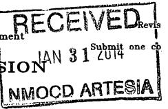

# OIL CONSERVATION DIVISION 1220 South St. Francis Dr. Santa Fe, New Mexico 87505 NMOCD ARTESIA

WELL LOCATION AND ACREAGE DEDICATION PLAT

☐ AMENDED REPORT

<table border=1 style='margin: auto; word-wrap: break-word;'><tr><td colspan="2">API Number\n30-015-37500</td><td style='text-align: center; word-wrap: break-word;'>Pool Code\n37955</td><td colspan="2">Pool Name\nWildcat G-02; BoneSpring</td></tr><tr><td colspan="2">Property Code</td><td colspan="2">Property Name\nPERFECTO BOX STATE COM</td><td style='text-align: center; word-wrap: break-word;'>Well Number\n2H</td></tr><tr><td colspan="2">OGRID No.\n025575</td><td colspan="2">Operator Name\nYATES PETROLEUM CORPORATION</td><td style='text-align: center; word-wrap: break-word;'>Elevation\n3156</td></tr></table>

Surface Location

<table border=1 style='margin: auto; word-wrap: break-word;'><tr><td style='text-align: center; word-wrap: break-word;'>UL or lot No. E</td><td style='text-align: center; word-wrap: break-word;'>Section 14</td><td style='text-align: center; word-wrap: break-word;'>Township 25 S</td><td style='text-align: center; word-wrap: break-word;'>Range 27 E</td><td style='text-align: center; word-wrap: break-word;'>Lot Idn</td><td style='text-align: center; word-wrap: break-word;'>Feet from the 1980</td><td style='text-align: center; word-wrap: break-word;'>SOUTH/South line NORTH</td><td style='text-align: center; word-wrap: break-word;'>Feet from the 15</td><td style='text-align: center; word-wrap: break-word;'>East/EAST line WEST</td><td style='text-align: center; word-wrap: break-word;'>County EDDY</td></tr></table>

Bottom Hole Location If Different From Surface

<table border=1 style='margin: auto; word-wrap: break-word;'><tr><td style='text-align: center; word-wrap: break-word;'>UL or lot No.</td><td style='text-align: center; word-wrap: break-word;'>Section</td><td style='text-align: center; word-wrap: break-word;'>Township</td><td style='text-align: center; word-wrap: break-word;'>Range</td><td style='text-align: center; word-wrap: break-word;'>Lot Idn</td><td style='text-align: center; word-wrap: break-word;'>Feet from the</td><td style='text-align: center; word-wrap: break-word;'>SOUTH/South line</td><td style='text-align: center; word-wrap: break-word;'>Feet from the</td><td style='text-align: center; word-wrap: break-word;'>East/EAST line</td><td style='text-align: center; word-wrap: break-word;'>County</td></tr><tr><td style='text-align: center; word-wrap: break-word;'>H</td><td style='text-align: center; word-wrap: break-word;'>14</td><td style='text-align: center; word-wrap: break-word;'>25 S</td><td style='text-align: center; word-wrap: break-word;'>27 E</td><td style='text-align: center; word-wrap: break-word;'>1980</td><td style='text-align: center; word-wrap: break-word;'>NORTH</td><td style='text-align: center; word-wrap: break-word;'>330</td><td style='text-align: center; word-wrap: break-word;'>EAST</td><td style='text-align: center; word-wrap: break-word;'>EDDY</td><td style='text-align: center; word-wrap: break-word;'></td></tr><tr><td style='text-align: center; word-wrap: break-word;'>Dedicated Acres 160</td><td style='text-align: center; word-wrap: break-word;'>Joint or Infill</td><td colspan="2">Consolidation Code</td><td colspan="5">Order No.</td><td style='text-align: center; word-wrap: break-word;'></td></tr></table>

NO ALLOWABLE WILL BE ASSIGNED TO THIS COMPLETION UNTIL ALL INTERESTS HAVE BEEN CONSOLIDATED OR A NON-STANDARD UNIT HAS BEEN APPROVED BY THE DIVISION

<table border=1 style='margin: auto; word-wrap: break-word;'><tr><td style='text-align: center; word-wrap: break-word;'>N.: 413740.3\nE.: 592004.1\n(NAD83)</td><td style='text-align: center; word-wrap: break-word;'>N.: 413735.11\nE.: 594653.4\n(NAD83)</td><td style='text-align: center; word-wrap: break-word;'>N.: 413727.9\nE.: 597299.5\n(NAD83)</td></tr><tr><td style='text-align: center; word-wrap: break-word;'>Penetration Point\n1980&#x27; FNL &amp; 4797FWL</td><td colspan="2">Project Area\nProduction Zone</td></tr><tr><td style='text-align: center; word-wrap: break-word;'>SURFACE LOCATION\nLot - N 32°07&#x27;54.85&quot;\nLong - W.104°10&#x27;10.38&quot;\nNMSPCE - N 411760.8\nE 592034.4\n(NAD-83)</td><td style='text-align: center; word-wrap: break-word;'>4955.6&#x27;</td><td style='text-align: center; word-wrap: break-word;'>PROPOSED BOTTOM\nHOLE LOCATION\nLot - N 32°07&#x27;54.66&quot;\nLong - W 104°09&#x27;12.77&quot;\nNMSPCE - N 411749.4\nE 596988.8\n(NAD-83)</td></tr><tr><td style='text-align: center; word-wrap: break-word;'>N.: 408432.9\nE.: 592047.4\n(NAD83)</td><td style='text-align: center; word-wrap: break-word;'></td><td style='text-align: center; word-wrap: break-word;'>N.: 408403.5\nE.: 597350.7\n(NAD83)</td></tr></table>

I hereby certify that the information contained herein is true and complete to the best of my knowledge and belief, and that this organization either owns a working interest or unleased mineral interest in the land including the proposed bottom hole location or has a right to drill this well at this location pursuant to a contract with an owner of such a mineral or working interest, or to a voluntary pooling agreement or a compulsory pooling order heretofore entered by the division.

Travis Hahn

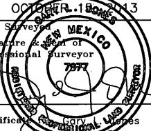

# Page 60

District I

1625 N. French Dr., Hobbs, NM 88240

Phone: (575) 393-6161 Fax: (575) 393-0720

District II

811 S. First St., Artesia, NM 88210

Phone: (575) 748-1283 Fax: (575) 748-9720

District III

1000 Rio Brazos Rd., Aztec, NM 87410

Phone: (505) 334-6178 Fax: (505) 334-6170

District IV

1220 S. St Francis Dr., Santa Fe, NM 87505

Phone: (505) 476-3470 Fax: (505) 476-3462

# State of New Mexico Energy, Minerals and Natural Resources Oil Conservation Division 1220 S. St Francis Dr. Santa Fe, NM 87505

Change of Operator Name

OGRID: 25575

Effective Date: 11/1/2016

## Previous Operator Name and Information

Name: YATES PETROLEUM CORPORATION

Address: 105 S 4TH ST

<table border=1 style='margin: auto; word-wrap: break-word;'><tr><td colspan="2">New Operator Name and Information</td></tr><tr><td style='text-align: center; word-wrap: break-word;'>Name:</td><td style='text-align: center; word-wrap: break-word;'>EOG Y Resources, Inc.</td></tr><tr><td style='text-align: center; word-wrap: break-word;'>Address:</td><td style='text-align: center; word-wrap: break-word;'>105 South Fourth Street</td></tr><tr><td style='text-align: center; word-wrap: break-word;'>Address:</td><td style='text-align: center; word-wrap: break-word;'></td></tr><tr><td style='text-align: center; word-wrap: break-word;'>City, State, Zip:</td><td style='text-align: center; word-wrap: break-word;'>Artesia, NM 88210</td></tr></table>

City, State, Zip:  $ \underline{\text{ARTESIA, NM 88210}} $

I hereby certify that the rules of the Oil Conservation Division have been complied with and that the information given on this form and the certified list of wells is true to the best of my knowledge and belief.

Signature: ___

Printed Name:  $ \underline{\text{Reese}} $ Lantrip

Title: Vice President & General Manager

Date:  $ \underline{\text{11/16/16}} $ Phone:  $ \underline{\text{817-374-3289}} $

NMOCD Approval

Date:  $ \underline{\text{November 17, 2016}} $

# Page 61

## District I

1625 N. French Dr., Hobbs, NM 88240

Phone: (575) 393-6161 Fax: (575) 393-0720

811 S. First St., Artesia, NM 88210

Phone: (575) 748-1283 Fax: (575) 748-9720

District III

1000 Rio Brazos Rd., Aztec, NM 87410

Phone: (505) 334-6178 Fax: (505) 334-6170

District IV

1220 S. St Francis Dr., Santa Fe, NM 87505 Phone: (505) 476-3470 Fax: (505) 476-3462

Permit 228791

# State of New Mexico Energy, Minerals and Natural Resources Oil Conservation Division 1220 S. St Francis Dr. Santa Fe, NM 87505

NAMECHANGE COMMENTS

<table border=1 style='margin: auto; word-wrap: break-word;'><tr><td style='text-align: center; word-wrap: break-word;'>Operator:</td><td style='text-align: center; word-wrap: break-word;'>OGRID:</td><td style='text-align: center; word-wrap: break-word;'>25575</td></tr><tr><td style='text-align: center; word-wrap: break-word;'>EOG Y Resources, Inc.</td><td rowspan="3">Permit Number:</td><td style='text-align: center; word-wrap: break-word;'>228791</td></tr><tr><td style='text-align: center; word-wrap: break-word;'>105 S 4TH ST</td><td style='text-align: center; word-wrap: break-word;'>Permit Type:</td></tr><tr><td style='text-align: center; word-wrap: break-word;'>ARTESIA, NM 88210</td><td style='text-align: center; word-wrap: break-word;'>NameChange</td></tr></table>

## Comments

<table border=1 style='margin: auto; word-wrap: break-word;'><tr><td style='text-align: center; word-wrap: break-word;'>Created By</td><td style='text-align: center; word-wrap: break-word;'>Comment</td><td style='text-align: center; word-wrap: break-word;'>Comment Date</td></tr><tr><td colspan="3">There are no Comments for this Permit</td></tr></table>

There are no Comments for this Permit

# Page 62

District I

1825 N. French Dr., Hobbs, NM 68240

Phone: (575) 393-6181 Fax: (575) 393-0720

District II

811 S. First St., Artesia, NM 68210

Phone: (575) 748-1283 Fax: (575) 748-9720

District III

1000 Rio Brazos Rd., Azleoc, NM 87410

Phone: (505) 334-8178 Fax: (505) 334-6170

District IV

1220 S. St Francis Dr., Santa Fe, NM 87505

Phone: (505) 478-3470 Fax: (505) 478-3482

Form C-145

Revised May 19, 2017

# State of New Mexico Energy, Minerals and Natura Resources Oil Conservation Division 1220 S. St Francis Dr. Santa Fe, NM 87505 Change of Operator

Permit 261318

NM OIL CONSERVATION

ARTESIA DISTRICT

JAN 07 2019

RECEIVED

## Previous Operator Information

## New Operator Information

<table border=1 style='margin: auto; word-wrap: break-word;'><tr><td colspan="3">E\nD</td></tr><tr><td style='text-align: center; word-wrap: break-word;'>OGRID:</td><td style='text-align: center; word-wrap: break-word;'>25575</td><td style='text-align: center; word-wrap: break-word;'>O</td></tr><tr><td style='text-align: center; word-wrap: break-word;'>Name:</td><td style='text-align: center; word-wrap: break-word;'>EOG Y RESOURCES, INC.</td><td style='text-align: center; word-wrap: break-word;'>N</td></tr><tr><td style='text-align: center; word-wrap: break-word;'>Address:</td><td style='text-align: center; word-wrap: break-word;'>104 S 4th St</td><td style='text-align: center; word-wrap: break-word;'>A</td></tr><tr><td style='text-align: center; word-wrap: break-word;'>City, State, Zip:</td><td style='text-align: center; word-wrap: break-word;'>Artesia, NM 88210</td><td style='text-align: center; word-wrap: break-word;'>C</td></tr></table>

City, State, Zip:

<table border=1 style='margin: auto; word-wrap: break-word;'><tr><td style='text-align: center; word-wrap: break-word;'>Effective on the date of approval by the OCD</td></tr><tr><td style='text-align: center; word-wrap: break-word;'>7377</td></tr><tr><td style='text-align: center; word-wrap: break-word;'>EOG RESOURCES INC</td></tr><tr><td style='text-align: center; word-wrap: break-word;'>P.O. Box 2267</td></tr><tr><td style='text-align: center; word-wrap: break-word;'></td></tr><tr><td style='text-align: center; word-wrap: break-word;'>Midland, TX 79702</td></tr></table>

I hereby certify that the rules of the Oil Conservation Division ("OCD") have been complied with and that the information on this form and the certified list of wells is true to the best of my knowledge and belief.

Additionally, by signing below, EOG RESOURCES INC certifies that it has read and understands the following synopsis of applicable rules.

PREVIOUS OPERATOR certifies that all below-grade tanks constructed and installed prior to June 16, 2008 associated with the selected wells being transferred are either (1) in compliance with 19.15.17 NMAC, (2) have been closed pursuant to 19.15.17.13 NMAC or (3) have been retrofitted to comply with Paragraphs 1 through 4 of 19.15.17.11(I) NMAC.

EOG RESOURCES INC understands that the OCD's approval of this operator change:

1. constitutes approval of the transfer of the permit for any permitted pit, below-grade tank or closed-loop system associated with the selected wells; and

2. constitutes approval of the transfer of any below-grade tanks constructed and installed prior to June 16, 2008 associated with the selected wells, regardless of whether the transferor has disclosed the existence of those below-grade tanks to the transferee or to the OCD, and regardless of whether the below-grade tanks are in compliance with 19.15.17 NMAC.

# Page 63

## As the operator of record of wells in New Mexico, EOG RESOURCES INC agrees to the following statements:

1. Initials I am responsible for ensuring that the wells and related facilities comply with applicable statutes and rules, and am responsible for all regulatory filings with the OCD. I am responsible for knowing all applicable statutes and rules, not just the rules referenced in this list. I understand that the OCD's rules are available on the OCD website under "Rules," and that the Water Quality Control Commission rules are available on the OCD website on the "Publications" page.

2. Initials  $ \overline{a} $ understand that if I acquire wells from another operator, the OCD must approve the operator change before I begin operating those wells. See Subsection B of 19.15.9.9 NMAC. I understand that if I acquire wells or facilities subject to a compliance order addressing inactive wells or environmental cleanup, before the OCD will approve the operator change it may require me to enter into an enforceable agreement to return those wells to compliance. See Paragraph (2) of Subsection C of 19.15.9.9 NMAC.

3. Initials I must file a monthly C-115 report showing production for each non-plugged well completion for which the OCD has approved an allowable and authorization to transport, and injection for each injection well. See 19.15.7.24 NMAC. I understand that the OCD may cancel my authority to transport from or inject into all the wells I operate if I fail to file C-115 reports. See Subsection C of 19.15.7.24 NMAC.

4. Initials Q2 I understand that New Mexico requires wells that have been inactive for certain time periods to be plugged or placed in approved temporary abandonment. See 19.15.25.8 NMAC. I understand the requirements for plugging and approved temporary abandonment in 19.15.25 NMAC. I understand that I can check my compliance with the basic requirements of 19.15.25.8 NMAC by using the "Inactive Well List" on OCD's website.

5. Initials I must keep current with financial assurances for well plugging. I understand that New Mexico requires each state or fee well that has been inactive for more than two years and has not been plugged and released to be covered by a single-well financial assurance or a "blanket plugging financial assurance for wells in temporarily abandoned statues", even if the well is also covered by a blanket financial assurance and even if the well is on approved temporary abandonment status. See Subsection C of 19.15.8.9 NMAC. I understand that I can check my compliance with the financial assurance requirement by using the "Inactive Well Additional Financial Assurance Report" on the OCD's website.

6. Initials I am responsible for reporting and remediating releases pursuant to 19.15.29 NMAC. I understand the OCD will look to me as the operator of record to take corrective action for releases at my wells and related facilities, including releases that occurred before I became operator of record. I am responsible for conducting my own due diligence for any releases that have occurred prior to becoming operator of my wells and related facilities and am responsible for any open releases of unreported releases.

7. Initials I have read 19.15.5.9 NMAC, commonly known as "Part 5.9," and understand that to be in compliance with its requirements I must have the appropriate financial assurances in place, comply with orders requiring corrective action, pay penalties assessed by the courts or agreed to by me in a settlement agreement, and not have too many wells out of compliance with the inactive well rule (19.15.25.8 NMAC). If I am in violation of Part 5.9, I may not be allowed to drill, acquire or produce any additional wells, and will not be able to obtain any new injection permits. See 19.15.18.19 NMAC, 19.15.26.8 NMAC, 19.15.9.9 NMAC and 19.15.14.10 NMAC. If I am in violation of Part 5.9 the OCD may, after notice and hearing, revoke my existing injection permits and seek other relief. See 19.15.26.8 NMAC and 19.15.5.10 NMAC.

8. Initials For injection wells, I understand that I must report injection on my monthly C-115 report and must operate my wells in compliance with 19.15.26 NMAC and the terms of my injection permit. I understand that I must conduct mechanical integrity tests on my injection wells at least once every five years. See 19.15.26.11 NMAC, I understand that when there is a continuous one-year period of non-injection into all wells in an injection or storage project or into a saltwater disposal well or special purpose injection well, authority for that injection automatically terminates. See 19.15.26.12 NMAC, I understand that if I transfer operation of an injection well to another operator, the OCD must approve the transfer of authority to inject, and the OCD may require me to demonstrate the well's mechanical integrity prior to approving that transfer. See 19.15.26.15 NMAC.

9. Initials I am responsible for providing the OCD with my current address of record and emergency contact information, and I am responsible for updating that information when it changes. See Subsection C of 19.15.9.8 NMAC. I understand that I can update that information on the OCD's website under "Electronic Permitting."

10. Initials @ If I transfer well operations to another operator, the OCD must approve the change before the new operator can begin operations. See Subsection B of 19.15.9.9 NMAC. I remain responsible for the wells and related facilities and all related regulatory filings until the OCD approves the operator change. I understand that the transfer will not relieve me of responsibility or liability for any act or omission which occurred while I operated the wells and related facilities.

11. Initials No person with an interest exceeding 25% in the undersigned company is, or was within the last 5 years, an officer, director, partner or person with a 25% or greater interest in another entity that is not currently in compliance with Subsection A of 19.15.5.9 NMAC.

12. Initials NMOCD Rule Subsection E and F of 19.15.16.8 NMAC: An operator shall have 90 days from the effective date of an operator name change to change the operator name on the well sign unless the division grants an extension time, for good cause shown, along with a schedule for making the changes. Each sign shall show the (1) well number, (2) property name, (3) operator's name, (4) location by footage, quarter-quarter section, township and range (or unit letter can be substituted for the quarter-quarter section), and (5) API number.

# Page 64

I hereby certify I understand the above. The statements I have made are true and correct and a condition precedent to the Oil Conservation Division accepting this Change of Operator.

<table border=1 style='margin: auto; word-wrap: break-word;'><tr><td colspan="3">Previous Operator</td></tr><tr><td style='text-align: center; word-wrap: break-word;'>Signature:</td><td colspan="2"></td></tr><tr><td style='text-align: center; word-wrap: break-word;'>Printed Name:</td><td colspan="2">Reese Lantrip</td></tr><tr><td style='text-align: center; word-wrap: break-word;'>Title:</td><td colspan="2">VP &amp; GM</td></tr><tr><td style='text-align: center; word-wrap: break-word;'>Date:</td><td style='text-align: center; word-wrap: break-word;'>1/4/19</td><td style='text-align: center; word-wrap: break-word;'>Phone: 575-748-1471</td></tr></table>

New Operator

Signature:

Printed

Name: Jeff Leitzell

Title: ___ VP + GM

Date: 1-7-19 Phone: 432-686-6901

Permit 261318

NMOCD Approval

Electronic Signature:  $ \underline{\text{Brandon Powell, District 3}} $

Date:  $ \underline{\text{January 16, 2019}} $

# Page 65

## District I

1625 N. French Dr., Hobbs, NM 88240

Phone: (575) 393-6161 Fax: (575) 393-0720

## District II

811 S. First St., Artesia, NM 88210 Phone: (575) 748-1283 Fax: (575) 748-9720

## District III

1000 Rio Brazos Rd., Aztec, NM 87410

Phone: (505) 334-6178 Fax: (505) 334-6170

## District IV

1220 S. St Francis Dr., Santa Fe, NM 87505

Phone: (505) 476-3470 Fax: (505) 476-3462

# State of New Mexico Energy, Minerals and Natural Resources Oil Conservation Division 1220 S. St Francis Dr. Santa Fe, NM 87505

1915 Wells Selected for Transfer

<table border=1 style='margin: auto; word-wrap: break-word;'><tr><td style='text-align: center; word-wrap: break-word;'>From:</td><td style='text-align: center; word-wrap: break-word;'>OGRID:</td></tr><tr><td style='text-align: center; word-wrap: break-word;'>EOG Y RESOURCES, INC.</td><td style='text-align: center; word-wrap: break-word;'>25575</td></tr><tr><td style='text-align: center; word-wrap: break-word;'>To:</td><td style='text-align: center; word-wrap: break-word;'>OGRID:</td></tr><tr><td style='text-align: center; word-wrap: break-word;'>EOG RESOURCES INC</td><td style='text-align: center; word-wrap: break-word;'>7377</td></tr></table>

OCD District Hobbs (256 Wells selected.)

<table border=1 style='margin: auto; word-wrap: break-word;'><tr><td style='text-align: center; word-wrap: break-word;'>Property</td><td style='text-align: center; word-wrap: break-word;'>Well</td><td style='text-align: center; word-wrap: break-word;'>Lease Type</td><td style='text-align: center; word-wrap: break-word;'>ULSTR</td><td style='text-align: center; word-wrap: break-word;'>OCD Unit</td><td style='text-align: center; word-wrap: break-word;'>API</td><td style='text-align: center; word-wrap: break-word;'>Well Type</td><td style='text-align: center; word-wrap: break-word;'>Pool ID</td><td style='text-align: center; word-wrap: break-word;'>Pool Name</td></tr><tr><td style='text-align: center; word-wrap: break-word;'>323190</td><td style='text-align: center; word-wrap: break-word;'>ABBY BLF STATE #001</td><td style='text-align: center; word-wrap: break-word;'>S</td><td style='text-align: center; word-wrap: break-word;'>N-10-09S-33E</td><td style='text-align: center; word-wrap: break-word;'>N</td><td style='text-align: center; word-wrap: break-word;'>30-025-38951</td><td style='text-align: center; word-wrap: break-word;'>O</td><td style='text-align: center; word-wrap: break-word;'>24615</td><td style='text-align: center; word-wrap: break-word;'>FLYING M; PENN</td></tr><tr><td style='text-align: center; word-wrap: break-word;'>323196</td><td style='text-align: center; word-wrap: break-word;'>ACTION BTI STATE COM #001H</td><td style='text-align: center; word-wrap: break-word;'>S</td><td style='text-align: center; word-wrap: break-word;'>D-16-24S-33E</td><td style='text-align: center; word-wrap: break-word;'>D</td><td style='text-align: center; word-wrap: break-word;'>30-025-40864</td><td style='text-align: center; word-wrap: break-word;'>O</td><td style='text-align: center; word-wrap: break-word;'>96674</td><td style='text-align: center; word-wrap: break-word;'>TRIPLE X; BONE SPRING, WEST</td></tr><tr><td style='text-align: center; word-wrap: break-word;'></td><td style='text-align: center; word-wrap: break-word;'>ACTION BTI STATE COM #002H</td><td style='text-align: center; word-wrap: break-word;'>S</td><td style='text-align: center; word-wrap: break-word;'>C-16-24S-33E</td><td style='text-align: center; word-wrap: break-word;'>C</td><td style='text-align: center; word-wrap: break-word;'>30-025-41631</td><td style='text-align: center; word-wrap: break-word;'>O</td><td style='text-align: center; word-wrap: break-word;'>96674</td><td style='text-align: center; word-wrap: break-word;'>TRIPLE X; BONE SPRING, WEST</td></tr><tr><td style='text-align: center; word-wrap: break-word;'>323197</td><td style='text-align: center; word-wrap: break-word;'>ADDER BSE STATE #001H</td><td style='text-align: center; word-wrap: break-word;'>S</td><td style='text-align: center; word-wrap: break-word;'>B-31-24S-33E</td><td style='text-align: center; word-wrap: break-word;'>B</td><td style='text-align: center; word-wrap: break-word;'>30-025-40513</td><td style='text-align: center; word-wrap: break-word;'>O</td><td style='text-align: center; word-wrap: break-word;'>97784</td><td style='text-align: center; word-wrap: break-word;'>WC-025 G-06 S253201M; UPPER BONE SPRING</td></tr><tr><td style='text-align: center; word-wrap: break-word;'>323210</td><td style='text-align: center; word-wrap: break-word;'>ALLEN B FEDERAL SWD #001</td><td style='text-align: center; word-wrap: break-word;'>F</td><td style='text-align: center; word-wrap: break-word;'>G-28-24S-32E</td><td style='text-align: center; word-wrap: break-word;'>G</td><td style='text-align: center; word-wrap: break-word;'>30-025-28237</td><td style='text-align: center; word-wrap: break-word;'>S</td><td style='text-align: center; word-wrap: break-word;'>96802</td><td style='text-align: center; word-wrap: break-word;'>SWD; BELL CANYON-CHERRY CANYON</td></tr><tr><td style='text-align: center; word-wrap: break-word;'>323221</td><td style='text-align: center; word-wrap: break-word;'>AMAZING BAZ FEDERAL #002</td><td style='text-align: center; word-wrap: break-word;'>F</td><td style='text-align: center; word-wrap: break-word;'>C-21-22S-32E</td><td style='text-align: center; word-wrap: break-word;'>C</td><td style='text-align: center; word-wrap: break-word;'>30-025-39699</td><td style='text-align: center; word-wrap: break-word;'>O</td><td style='text-align: center; word-wrap: break-word;'>39366</td><td style='text-align: center; word-wrap: break-word;'>LIVINGSTON RIDGE; DELAWARE, EAST</td></tr><tr><td style='text-align: center; word-wrap: break-word;'></td><td style='text-align: center; word-wrap: break-word;'>AMAZING BAZ FEDERAL #003</td><td style='text-align: center; word-wrap: break-word;'>F</td><td style='text-align: center; word-wrap: break-word;'>P-30-22S-32E</td><td style='text-align: center; word-wrap: break-word;'>P</td><td style='text-align: center; word-wrap: break-word;'>30-025-38450</td><td style='text-align: center; word-wrap: break-word;'>O</td><td style='text-align: center; word-wrap: break-word;'>39380</td><td style='text-align: center; word-wrap: break-word;'>LIVINGSTON RIDGE; DELAWARE, SE</td></tr><tr><td style='text-align: center; word-wrap: break-word;'></td><td style='text-align: center; word-wrap: break-word;'>AMAZING BAZ FEDERAL #005</td><td style='text-align: center; word-wrap: break-word;'>F</td><td style='text-align: center; word-wrap: break-word;'>M-29-22S-32E</td><td style='text-align: center; word-wrap: break-word;'>M</td><td style='text-align: center; word-wrap: break-word;'>30-025-41260</td><td style='text-align: center; word-wrap: break-word;'>O</td><td style='text-align: center; word-wrap: break-word;'>39380</td><td style='text-align: center; word-wrap: break-word;'>LIVINGSTON RIDGE; DELAWARE, SE</td></tr><tr><td style='text-align: center; word-wrap: break-word;'>323262</td><td style='text-align: center; word-wrap: break-word;'>ATOKA BANK BDJ STATE COM #001</td><td style='text-align: center; word-wrap: break-word;'>S</td><td style='text-align: center; word-wrap: break-word;'>O-17-24S-33E</td><td style='text-align: center; word-wrap: break-word;'>O</td><td style='text-align: center; word-wrap: break-word;'>30-025-36594</td><td style='text-align: center; word-wrap: break-word;'>G</td><td style='text-align: center; word-wrap: break-word;'>86430</td><td style='text-align: center; word-wrap: break-word;'>TRISTE DRAW; ATOKA, EAST (GAS)</td></tr><tr><td style='text-align: center; word-wrap: break-word;'></td><td style='text-align: center; word-wrap: break-word;'>ATOKA BANK BDJ STATE COM #001</td><td style='text-align: center; word-wrap: break-word;'>S</td><td style='text-align: center; word-wrap: break-word;'>O-17-24S-33E</td><td style='text-align: center; word-wrap: break-word;'>O</td><td style='text-align: center; word-wrap: break-word;'>30-025-36594</td><td style='text-align: center; word-wrap: break-word;'>G</td><td style='text-align: center; word-wrap: break-word;'>96765</td><td style='text-align: center; word-wrap: break-word;'>TRISTE DRAW; MORROW, EAST (GAS)</td></tr><tr><td style='text-align: center; word-wrap: break-word;'></td><td style='text-align: center; word-wrap: break-word;'>ATOKA BANK BDJ STATE COM #002H</td><td style='text-align: center; word-wrap: break-word;'>S</td><td style='text-align: center; word-wrap: break-word;'>B-17-24S-33E</td><td style='text-align: center; word-wrap: break-word;'>B</td><td style='text-align: center; word-wrap: break-word;'>30-025-41055</td><td style='text-align: center; word-wrap: break-word;'>O</td><td style='text-align: center; word-wrap: break-word;'>96674</td><td style='text-align: center; word-wrap: break-word;'>TRIPLE X; BONE SPRING, WEST</td></tr><tr><td style='text-align: center; word-wrap: break-word;'></td><td style='text-align: center; word-wrap: break-word;'>ATOKA BANK BDJ STATE COM #003H</td><td style='text-align: center; word-wrap: break-word;'>S</td><td style='text-align: center; word-wrap: break-word;'>A-17-24S-33E</td><td style='text-align: center; word-wrap: break-word;'>A</td><td style='text-align: center; word-wrap: break-word;'>30-025-41058</td><td style='text-align: center; word-wrap: break-word;'>O</td><td style='text-align: center; word-wrap: break-word;'>96674</td><td style='text-align: center; word-wrap: break-word;'>TRIPLE X; BONE SPRING, WEST</td></tr><tr><td style='text-align: center; word-wrap: break-word;'>323264</td><td style='text-align: center; word-wrap: break-word;'>AUDACIOUS BTL FEDERAL #001H</td><td style='text-align: center; word-wrap: break-word;'>F</td><td style='text-align: center; word-wrap: break-word;'>G-19-25S-33E</td><td style='text-align: center; word-wrap: break-word;'>G</td><td style='text-align: center; word-wrap: break-word;'>30-025-43429</td><td style='text-align: center; word-wrap: break-word;'>O</td><td style='text-align: center; word-wrap: break-word;'>97903</td><td style='text-align: center; word-wrap: break-word;'>WC-025 G-08 S253235G; LWR BONE SPRIN</td></tr><tr><td style='text-align: center; word-wrap: break-word;'>323270</td><td style='text-align: center; word-wrap: break-word;'>AVIAN AYA STATE #001</td><td style='text-align: center; word-wrap: break-word;'>S</td><td style='text-align: center; word-wrap: break-word;'>P-20-15S-32E</td><td style='text-align: center; word-wrap: break-word;'>P</td><td style='text-align: center; word-wrap: break-word;'>30-025-35377</td><td style='text-align: center; word-wrap: break-word;'>G</td><td style='text-align: center; word-wrap: break-word;'>24210</td><td style='text-align: center; word-wrap: break-word;'>FEATHER; WOLFCAMP</td></tr><tr><td style='text-align: center; word-wrap: break-word;'>323274</td><td style='text-align: center; word-wrap: break-word;'>AVOCADO BRO STATE #001H</td><td style='text-align: center; word-wrap: break-word;'>S</td><td style='text-align: center; word-wrap: break-word;'>D-32-20S-35E</td><td style='text-align: center; word-wrap: break-word;'>D</td><td style='text-align: center; word-wrap: break-word;'>30-025-40472</td><td style='text-align: center; word-wrap: break-word;'>O</td><td style='text-align: center; word-wrap: break-word;'>5535</td><td style='text-align: center; word-wrap: break-word;'>BERRY; BONE SPRING, NORTH</td></tr><tr><td style='text-align: center; word-wrap: break-word;'>323275</td><td style='text-align: center; word-wrap: break-word;'>AZURE BNE STATE COM #001</td><td style='text-align: center; word-wrap: break-word;'>S</td><td style='text-align: center; word-wrap: break-word;'>C-18-12S-35E</td><td style='text-align: center; word-wrap: break-word;'>C</td><td style='text-align: center; word-wrap: break-word;'>30-025-36916</td><td style='text-align: center; word-wrap: break-word;'>G</td><td style='text-align: center; word-wrap: break-word;'>97082</td><td style='text-align: center; word-wrap: break-word;'>FOUR LAKES; MORROW (GAS)</td></tr><tr><td style='text-align: center; word-wrap: break-word;'></td><td style='text-align: center; word-wrap: break-word;'>AZURE BNE STATE COM #001</td><td style='text-align: center; word-wrap: break-word;'>S</td><td style='text-align: center; word-wrap: break-word;'>C-18-12S-35E</td><td style='text-align: center; word-wrap: break-word;'>C</td><td style='text-align: center; word-wrap: break-word;'>30-025-36916</td><td style='text-align: center; word-wrap: break-word;'>G</td><td style='text-align: center; word-wrap: break-word;'>97349</td><td style='text-align: center; word-wrap: break-word;'>RANGER LAKE; ATOKA, NORTH (GAS)</td></tr><tr><td style='text-align: center; word-wrap: break-word;'>323291</td><td style='text-align: center; word-wrap: break-word;'>BARGAIN BQA FEDERAL #001H</td><td style='text-align: center; word-wrap: break-word;'>F</td><td style='text-align: center; word-wrap: break-word;'>J-22-22S-33E</td><td style='text-align: center; word-wrap: break-word;'>J</td><td style='text-align: center; word-wrap: break-word;'>30-025-33341</td><td style='text-align: center; word-wrap: break-word;'>O</td><td style='text-align: center; word-wrap: break-word;'>97846</td><td style='text-align: center; word-wrap: break-word;'>WILDCAT G-06 S223322J; BONE SPRING</td></tr><tr><td style='text-align: center; word-wrap: break-word;'>323296</td><td style='text-align: center; word-wrap: break-word;'>BASILISK BQS STATE COM #001H</td><td style='text-align: center; word-wrap: break-word;'>S</td><td style='text-align: center; word-wrap: break-word;'>N-36-24S-32E</td><td style='text-align: center; word-wrap: break-word;'>N</td><td style='text-align: center; word-wrap: break-word;'>30-025-40054</td><td style='text-align: center; word-wrap: break-word;'>O</td><td style='text-align: center; word-wrap: break-word;'>97784</td><td style='text-align: center; word-wrap: break-word;'>WC-025 G-06 S253201M; UPPER BONE SPRING</td></tr><tr><td style='text-align: center; word-wrap: break-word;'>323311</td><td style='text-align: center; word-wrap: break-word;'>BELCO AIA FEDERAL #001</td><td style='text-align: center; word-wrap: break-word;'>F</td><td style='text-align: center; word-wrap: break-word;'>J-14-20S-32E</td><td style='text-align: center; word-wrap: break-word;'>J</td><td style='text-align: center; word-wrap: break-word;'>30-025-26826</td><td style='text-align: center; word-wrap: break-word;'>O</td><td style='text-align: center; word-wrap: break-word;'>53565</td><td style='text-align: center; word-wrap: break-word;'>SALT LAKE; DELAWARE</td></tr><tr><td style='text-align: center; word-wrap: break-word;'></td><td style='text-align: center; word-wrap: break-word;'>BELCO AIA FEDERAL #002H</td><td style='text-align: center; word-wrap: break-word;'>F</td><td style='text-align: center; word-wrap: break-word;'>M-14-20S-32E</td><td style='text-align: center; word-wrap: break-word;'>M</td><td style='text-align: center; word-wrap: break-word;'>30-025-38527</td><td style='text-align: center; word-wrap: break-word;'>O</td><td style='text-align: center; word-wrap: break-word;'>53565</td><td style='text-align: center; word-wrap: break-word;'>SALT LAKE; DELAWARE</td></tr><tr><td style='text-align: center; word-wrap: break-word;'></td><td style='text-align: center; word-wrap: break-word;'>BELCO AIA FEDERAL #003H</td><td style='text-align: center; word-wrap: break-word;'>F</td><td style='text-align: center; word-wrap: break-word;'>J-14-20S-32E</td><td style='text-align: center; word-wrap: break-word;'>J</td><td style='text-align: center; word-wrap: break-word;'>30-025-38719</td><td style='text-align: center; word-wrap: break-word;'>O</td><td style='text-align: center; word-wrap: break-word;'>53565</td><td style='text-align: center; word-wrap: break-word;'>SALT LAKE; DELAWARE</td></tr><tr><td style='text-align: center; word-wrap: break-word;'></td><td style='text-align: center; word-wrap: break-word;'>BELCO AIA FEDERAL #004H</td><td style='text-align: center; word-wrap: break-word;'>F</td><td style='text-align: center; word-wrap: break-word;'>M-14-20S-32E</td><td style='text-align: center; word-wrap: break-word;'>M</td><td style='text-align: center; word-wrap: break-word;'>30-025-38818</td><td style='text-align: center; word-wrap: break-word;'>O</td><td style='text-align: center; word-wrap: break-word;'>53565</td><td style='text-align: center; word-wrap: break-word;'>SALT LAKE; DELAWARE</td></tr><tr><td style='text-align: center; word-wrap: break-word;'>323312</td><td style='text-align: center; word-wrap: break-word;'>BELFAST BSL STATE COM #001</td><td style='text-align: center; word-wrap: break-word;'>S</td><td style='text-align: center; word-wrap: break-word;'>13-06-21S-34E</td><td style='text-align: center; word-wrap: break-word;'>E</td><td style='text-align: center; word-wrap: break-word;'>30-025-40627</td><td style='text-align: center; word-wrap: break-word;'>O</td><td style='text-align: center; word-wrap: break-word;'></td><td style='text-align: center; word-wrap: break-word;'></td></tr><tr><td style='text-align: center; word-wrap: break-word;'></td><td style='text-align: center; word-wrap: break-word;'>BELFAST BSL STATE COM #001Y</td><td style='text-align: center; word-wrap: break-word;'>S</td><td style='text-align: center; word-wrap: break-word;'>13-06-21S-34E</td><td style='text-align: center; word-wrap: break-word;'>M</td><td style='text-align: center; word-wrap: break-word;'>30-025-41121</td><td style='text-align: center; word-wrap: break-word;'>O</td><td style='text-align: center; word-wrap: break-word;'>5535</td><td style='text-align: center; word-wrap: break-word;'>BERRY; BONE SPRING, NORTH</td></tr><tr><td style='text-align: center; word-wrap: break-word;'>319282</td><td style='text-align: center; word-wrap: break-word;'>BERRY APN STATE #002H</td><td style='text-align: center; word-wrap: break-word;'>S</td><td style='text-align: center; word-wrap: break-word;'>13-05-21S-34E</td><td style='text-align: center; word-wrap: break-word;'>E</td><td style='text-align: center; word-wrap: break-word;'>30-025-40374</td><td style='text-align: center; word-wrap: break-word;'>O</td><td style='text-align: center; word-wrap: break-word;'>5535</td><td style='text-align: center; word-wrap: break-word;'>BERRY; BONE SPRING, NORTH</td></tr><tr><td style='text-align: center; word-wrap: break-word;'></td><td style='text-align: center; word-wrap: break-word;'>BERRY APN STATE #003H</td><td style='text-align: center; word-wrap: break-word;'>S</td><td style='text-align: center; word-wrap: break-word;'>J-05-21S-34E</td><td style='text-align: center; word-wrap: break-word;'>J</td><td style='text-align: center; word-wrap: break-word;'>30-025-40630</td><td style='text-align: center; word-wrap: break-word;'>O</td><td style='text-align: center; word-wrap: break-word;'>5535</td><td style='text-align: center; word-wrap: break-word;'>BERRY; BONE SPRING, NORTH</td></tr><tr><td style='text-align: center; word-wrap: break-word;'>323325</td><td style='text-align: center; word-wrap: break-word;'>BIG HAT BKH STATE COM #001</td><td style='text-align: center; word-wrap: break-word;'>S</td><td style='text-align: center; word-wrap: break-word;'>L-02-16S-33E</td><td style='text-align: center; word-wrap: break-word;'>L</td><td style='text-align: center; word-wrap: break-word;'>30-025-12712</td><td style='text-align: center; word-wrap: break-word;'>G</td><td style='text-align: center; word-wrap: break-word;'>85620</td><td style='text-align: center; word-wrap: break-word;'>SOMBRERO; MORROW (GAS)</td></tr><tr><td style='text-align: center; word-wrap: break-word;'>323329</td><td style='text-align: center; word-wrap: break-word;'>BIG SKY ABY STATE #001</td><td style='text-align: center; word-wrap: break-word;'>S</td><td style='text-align: center; word-wrap: break-word;'>M-26-08S-33E</td><td style='text-align: center; word-wrap: break-word;'>M</td><td style='text-align: center; word-wrap: break-word;'>30-005-21020</td><td style='text-align: center; word-wrap: break-word;'>O</td><td style='text-align: center; word-wrap: break-word;'></td><td style='text-align: center; word-wrap: break-word;'></td></tr><tr><td style='text-align: center; word-wrap: break-word;'>323330</td><td style='text-align: center; word-wrap: break-word;'>BILBREY SWD #001</td><td style='text-align: center; word-wrap: break-word;'>S</td><td style='text-align: center; word-wrap: break-word;'>2-05-22S-32E</td><td style='text-align: center; word-wrap: break-word;'>B</td><td style='text-align: center; word-wrap: break-word;'>30-025-27620</td><td style='text-align: center; word-wrap: break-word;'>S</td><td style='text-align: center; word-wrap: break-word;'>96100</td><td style='text-align: center; word-wrap: break-word;'>SWD; DELAWARE</td></tr><tr><td style='text-align: center; word-wrap: break-word;'>323339</td><td style='text-align: center; word-wrap: break-word;'>BLACK RAIDER BQK STATE #001H</td><td style='text-align: center; word-wrap: break-word;'>S</td><td style='text-align: center; word-wrap: break-word;'>M-36-24S-34E</td><td style='text-align: center; word-wrap: break-word;'>M</td><td style='text-align: center; word-wrap: break-word;'>30-025-40088</td><td style='text-align: center; word-wrap: break-word;'>O</td><td style='text-align: center; word-wrap: break-word;'>97959</td><td style='text-align: center; word-wrap: break-word;'>WC-025 G-06 S243436M; DELAWARE</td></tr><tr><td style='text-align: center; word-wrap: break-word;'>323340</td><td style='text-align: center; word-wrap: break-word;'>BLACKBERRY BKB STATE COM #001H</td><td style='text-align: center; word-wrap: break-word;'>S</td><td style='text-align: center; word-wrap: break-word;'>16-06-21S-34E</td><td style='text-align: center; word-wrap: break-word;'>H</td><td style='text-align: center; word-wrap: break-word;'>30-025-39941</td><td style='text-align: center; word-wrap: break-word;'>O</td><td style='text-align: center; word-wrap: break-word;'>5535</td><td style='text-align: center; word-wrap: break-word;'>BERRY; BONE SPRING, NORTH</td></tr><tr><td style='text-align: center; word-wrap: break-word;'>323352</td><td style='text-align: center; word-wrap: break-word;'>BLITZEN AUB STATE #002</td><td style='text-align: center; word-wrap: break-word;'>S</td><td style='text-align: center; word-wrap: break-word;'>P-16-11S-34E</td><td style='text-align: center; word-wrap: break-word;'>P</td><td style='text-align: center; word-wrap: break-word;'>30-025-34859</td><td style='text-align: center; word-wrap: break-word;'>O</td><td style='text-align: center; word-wrap: break-word;'>97190</td><td style='text-align: center; word-wrap: break-word;'>EIGHT MILE DRAW; MORROW NW (GAS)</td></tr><tr><td style='text-align: center; word-wrap: break-word;'>323365</td><td style='text-align: center; word-wrap: break-word;'>BOMBAY BSB FEDERAL COM #001H</td><td style='text-align: center; word-wrap: break-word;'>F</td><td style='text-align: center; word-wrap: break-word;'>H-32-24S-32E</td><td style='text-align: center; word-wrap: break-word;'>H</td><td style='text-align: center; word-wrap: break-word;'>30-025-40718</td><td style='text-align: center; word-wrap: break-word;'>O</td><td style='text-align: center; word-wrap: break-word;'>49490</td><td style='text-align: center; word-wrap: break-word;'>PADUCA; DELAWARE, NORTH</td></tr><tr><td style='text-align: center; word-wrap: break-word;'>323371</td><td style='text-align: center; word-wrap: break-word;'>BOOMERANG BTM STATE #001</td><td style='text-align: center; word-wrap: break-word;'>S</td><td style='text-align: center; word-wrap: break-word;'>I-26-08S-33E</td><td style='text-align: center; word-wrap: break-word;'>I</td><td style='text-align: center; word-wrap: break-word;'>30-005-29036</td><td style='text-align: center; word-wrap: break-word;'>O</td><td style='text-align: center; word-wrap: break-word;'>59350</td><td style='text-align: center; word-wrap: break-word;'>TOBAC; UPPER PENN</td></tr><tr><td style='text-align: center; word-wrap: break-word;'>323372</td><td style='text-align: center; word-wrap: break-word;'>BOOMERANG BTR STATE #002</td><td style='text-align: center; word-wrap: break-word;'>S</td><td style='text-align: center; word-wrap: break-word;'>E-25-08S-33E</td><td style='text-align: center; word-wrap: break-word;'>E</td><td style='text-align: center; word-wrap: break-word;'>30-005-29084</td><td style='text-align: center; word-wrap: break-word;'>O</td><td style='text-align: center; word-wrap: break-word;'>59350</td><td style='text-align: center; word-wrap: break-word;'>TOBAC; UPPER PENN</td></tr><tr><td style='text-align: center; word-wrap: break-word;'>323373</td><td style='text-align: center; word-wrap: break-word;'>BOOTS BOO STATE COM #001</td><td style='text-align: center; word-wrap: break-word;'>S</td><td style='text-align: center; word-wrap: break-word;'>E-09-11S-35E</td><td style='text-align: center; word-wrap: break-word;'>E</td><td style='text-align: center; word-wrap: break-word;'>30-025-36940</td><td style='text-align: center; word-wrap: break-word;'>G</td><td style='text-align: center; word-wrap: break-word;'>84871</td><td style='text-align: center; word-wrap: break-word;'>SAND SPRINGS; ATOKA-MORROW (GAS)</td></tr><tr><td style='text-align: center; word-wrap: break-word;'>323378</td><td style='text-align: center; word-wrap: break-word;'>BOSTON BSN STATE COM #001H</td><td style='text-align: center; word-wrap: break-word;'>S</td><td style='text-align: center; word-wrap: break-word;'>13-06-21S-34E</td><td style='text-align: center; word-wrap: break-word;'>E</td><td style='text-align: center; word-wrap: break-word;'>30-025-40573</td><td style='text-align: center; word-wrap: break-word;'>O</td><td style='text-align: center; word-wrap: break-word;'>5535</td><td style='text-align: center; word-wrap: break-word;'>BERRY; BONE SPRING, NORTH</td></tr><tr><td style='text-align: center; word-wrap: break-word;'>323406</td><td style='text-align: center; word-wrap: break-word;'>BROWN SWD #001</td><td style='text-align: center; word-wrap: break-word;'>P</td><td style='text-align: center; word-wrap: break-word;'>H-26-16S-37E</td><td style='text-align: center; word-wrap: break-word;'>H</td><td style='text-align: center; word-wrap: break-word;'>30-025-29842</td><td style='text-align: center; word-wrap: break-word;'>S</td><td style='text-align: center; word-wrap: break-word;'>96135</td><td style='text-align: center; word-wrap: break-word;'>SWD; WOLFCAMP</td></tr><tr><td style='text-align: center; word-wrap: break-word;'>323442</td><td style='text-align: center; word-wrap: break-word;'>CAPELLA BOP FEDERAL #001</td><td style='text-align: center; word-wrap: break-word;'>F</td><td style='text-align: center; word-wrap: break-word;'>M-09-21S-32E</td><td style='text-align: center; word-wrap: break-word;'>M</td><td style='text-align: center; word-wrap: break-word;'>30-025-39528</td><td style='text-align: center; word-wrap: break-word;'>O</td><td style='text-align: center; word-wrap: break-word;'>40299</td><td style='text-align: center; word-wrap: break-word;'>LOST TANK; DELAWARE</td></tr><tr><td style='text-align: center; word-wrap: break-word;'></td><td style='text-align: center; word-wrap: break-word;'>CAPELLA BOP FEDERAL #002</td><td style='text-align: center; word-wrap: break-word;'>F</td><td style='text-align: center; word-wrap: break-word;'>P-08-21S-32E</td><td style='text-align: center; word-wrap: break-word;'>P</td><td style='text-align: center; word-wrap: break-word;'>30-025-39529</td><td style='text-align: center; word-wrap: break-word;'>O</td><td style='text-align: center; word-wrap: break-word;'>40299</td><td style='text-align: center; word-wrap: break-word;'>LOST TANK; DELAWARE</td></tr><tr><td style='text-align: center; word-wrap: break-word;'></td><td style='text-align: center; word-wrap: break-word;'>CAPELLA BOP FEDERAL #009H</td><td style='text-align: center; word-wrap: break-word;'>F</td><td style='text-align: center; word-wrap: break-word;'>A-09-21S-32E</td><td style='text-align: center; word-wrap: break-word;'>A</td><td style='text-align: center; word-wrap: break-word;'>30-025-43749</td><td style='text-align: center; word-wrap: break-word;'>O</td><td style='text-align: center; word-wrap: break-word;'>40299</td><td style='text-align: center; word-wrap: break-word;'>LOST TANK; DELAWARE</td></tr><tr><td style='text-align: center; word-wrap: break-word;'>323443</td><td style='text-align: center; word-wrap: break-word;'>CAPER BFE FEDERAL #001</td><td style='text-align: center; word-wrap: break-word;'>F</td><td style='text-align: center; word-wrap: break-word;'>O-17-21S-32E</td><td style='text-align: center; word-wrap: break-word;'>O</td><td style='text-align: center; word-wrap: break-word;'>30-025-36954</td><td style='text-align: center; word-wrap: break-word;'>O</td><td style='text-align: center; word-wrap: break-word;'>40299</td><td style='text-align: center; word-wrap: break-word;'>LOST TANK; DELAWARE</td></tr><tr><td style='text-align: center; word-wrap: break-word;'></td><td style='text-align: center; word-wrap: break-word;'>CAPER BFE FEDERAL #002</td><td style='text-align: center; word-wrap: break-word;'>F</td><td style='text-align: center; word-wrap: break-word;'>K-17-21S-32E</td><td style='text-align: center; word-wrap: break-word;'>K</td><td style='text-align: center; word-wrap: break-word;'>30-025-37439</td><td style='text-align: center; word-wrap: break-word;'>O</td><td style='text-align: center; word-wrap: break-word;'>40299</td><td style='text-align: center; word-wrap: break-word;'>LOST TANK; DELAWARE</td></tr><tr><td style='text-align: center; word-wrap: break-word;'></td><td style='text-align: center; word-wrap: break-word;'>CAPER BFE FEDERAL #002</td><td style='text-align: center; word-wrap: break-word;'>F</td><td style='text-align: center; word-wrap: break-word;'>K-17-21S-32E</td><td style='text-align: center; word-wrap: break-word;'>K</td><td style='text-align: center; word-wrap: break-word;'>30-025-37439</td><td style='text-align: center; word-wrap: break-word;'>O</td><td style='text-align: center; word-wrap: break-word;'>97961</td><td style='text-align: center; word-wrap: break-word;'>WC-025 G-06 S213217K; BONE SPRING</td></tr><tr><td style='text-align: center; word-wrap: break-word;'></td><td style='text-align: center; word-wrap: break-word;'>CAPER BFE FEDERAL #003</td><td style='text-align: center; word-wrap: break-word;'>F</td><td style='text-align: center; word-wrap: break-word;'>N-17-21S-32E</td><td style='text-align: center; word-wrap: break-word;'>N</td><td style='text-align: center; word-wrap: break-word;'>30-025-37450</td><td style='text-align: center; word-wrap: break-word;'>O</td><td style='text-align: center; word-wrap: break-word;'>40299</td><td style='text-align: center; word-wrap: break-word;'>LOST TANK; DELAWARE</td></tr><tr><td style='text-align: center; word-wrap: break-word;'></td><td style='text-align: center; word-wrap: break-word;'>CAPER BFE FEDERAL #004</td><td style='text-align: center; word-wrap: break-word;'>F</td><td style='text-align: center; word-wrap: break-word;'>P-17-21S-32E</td><td style='text-align: center; word-wrap: break-word;'>P</td><td style='text-align: center; word-wrap: break-word;'>30-025-37449</td><td style='text-align: center; word-wrap: break-word;'>O</td><td style='text-align: center; word-wrap: break-word;'>40299</td><td style='text-align: center; word-wrap: break-word;'>LOST TANK; DELAWARE</td></tr><tr><td style='text-align: center; word-wrap: break-word;'></td><td style='text-align: center; word-wrap: break-word;'>CAPER BFE FEDERAL #005</td><td style='text-align: center; word-wrap: break-word;'>F</td><td style='text-align: center; word-wrap: break-word;'>J-17-21S-32E</td><td style='text-align: center; word-wrap: break-word;'>J</td><td style='text-align: center; word-wrap: break-word;'>30-025-37448</td><td style='text-align: center; word-wrap: break-word;'>O</td><td style='text-align: center; word-wrap: break-word;'>40299</td><td style='text-align: center; word-wrap: break-word;'>LOST TANK; DELAWARE</td></tr><tr><td style='text-align: center; word-wrap: break-word;'></td><td style='text-align: center; word-wrap: break-word;'>CAPER BFE FEDERAL #006H</td><td style='text-align: center; word-wrap: break-word;'>F</td><td style='text-align: center; word-wrap: break-word;'>A-17-21S-32E</td><td style='text-align: center; word-wrap: break-word;'>A</td><td style='text-align: center; word-wrap: break-word;'>30-025-38091</td><td style='text-align: center; word-wrap: break-word;'>O</td><td style='text-align: center; word-wrap: break-word;'>40299</td><td style='text-align: center; word-wrap: break-word;'>LOST TANK; DELAWARE</td></tr><tr><td style='text-align: center; word-wrap: break-word;'></td><td style='text-align: center; word-wrap: break-word;'>CAPER BFE FEDERAL #006H</td><td style='text-align: center; word-wrap: break-word;'>F</td><td style='text-align: center; word-wrap: break-word;'>A-17-21S-32E</td><td style='text-align: center; word-wrap: break-word;'>A</td><td style='text-align: center; word-wrap: break-word;'>30-025-38091</td><td style='text-align: center; word-wrap: break-word;'>O</td><td style='text-align: center; word-wrap: break-word;'>96036</td><td style='text-align: center; word-wrap: break-word;'>WILDCAT; GROUP 5</td></tr><tr><td style='text-align: center; word-wrap: break-word;'></td><td style='text-align: center; word-wrap: break-word;'>CAPER BFE FEDERAL #016H</td><td style='text-align: center; word-wrap: break-word;'>F</td><td style='text-align: center; word-wrap: break-word;'>M-17-21S-32E</td><td style='text-align: center; word-wrap: break-word;'>M</td><td style='text-align: center; word-wrap: break-word;'>30-025-38101</td><td style='text-align: center; word-wrap: break-word;'>O</td><td style='text-align: center; word-wrap: break-word;'>40299</td><td style='text-align: center; word-wrap: break-word;'>LOST TANK; DELAWARE</td></tr><tr><td style='text-align: center; word-wrap: break-word;'></td><td style='text-align: center; word-wrap: break-word;'>CAPER BFE FEDERAL #016H</td><td style='text-align: center; word-wrap: break-word;'>F</td><td style='text-align: center; word-wrap: break-word;'>M-17-21S-32E</td><td style='text-align: center; word-wrap: break-word;'>M</td><td style='text-align: center; word-wrap: break-word;'>30-025-38101</td><td style='text-align: center; word-wrap: break-word;'>O</td><td style='text-align: center; word-wrap: break-word;'>96036</td><td style='text-align: center; word-wrap: break-word;'>WILDCAT; GROUP 5</td></tr></table>

# Page 66

<table border=1 style='margin: auto; word-wrap: break-word;'><tr><td style='text-align: center; word-wrap: break-word;'>323445</td><td style='text-align: center; word-wrap: break-word;'>CARAVAN BVU STATE #001</td><td style='text-align: center; word-wrap: break-word;'>S</td><td style='text-align: center; word-wrap: break-word;'>B-32-24S-33E</td><td style='text-align: center; word-wrap: break-word;'>B</td><td style='text-align: center; word-wrap: break-word;'>30-025-39609</td><td style='text-align: center; word-wrap: break-word;'>G</td><td style='text-align: center; word-wrap: break-word;'>86435</td><td style='text-align: center; word-wrap: break-word;'>TRISTE DRAW, WOLFCAMP, EAST (GAS)</td></tr><tr><td style='text-align: center; word-wrap: break-word;'>323446</td><td style='text-align: center; word-wrap: break-word;'>CARAVAN BVV STATE #006H</td><td style='text-align: center; word-wrap: break-word;'>S</td><td style='text-align: center; word-wrap: break-word;'>C-33-24S-33E</td><td style='text-align: center; word-wrap: break-word;'>C</td><td style='text-align: center; word-wrap: break-word;'>30-025-41610</td><td style='text-align: center; word-wrap: break-word;'>O</td><td style='text-align: center; word-wrap: break-word;'>96682</td><td style='text-align: center; word-wrap: break-word;'>TRISTE DRAW, BONE SPRING, EAST</td></tr><tr><td style='text-align: center; word-wrap: break-word;'>323447</td><td style='text-align: center; word-wrap: break-word;'>CARAVAN BVW STATE #008H</td><td style='text-align: center; word-wrap: break-word;'>S</td><td style='text-align: center; word-wrap: break-word;'>D-33-24S-33E</td><td style='text-align: center; word-wrap: break-word;'>D</td><td style='text-align: center; word-wrap: break-word;'>30-025-41602</td><td style='text-align: center; word-wrap: break-word;'>O</td><td style='text-align: center; word-wrap: break-word;'>96682</td><td style='text-align: center; word-wrap: break-word;'>TRISTE DRAW, BONE SPRING, EAST</td></tr><tr><td style='text-align: center; word-wrap: break-word;'>323448</td><td style='text-align: center; word-wrap: break-word;'>CARAVAN BVW STATE #009H</td><td style='text-align: center; word-wrap: break-word;'>S</td><td style='text-align: center; word-wrap: break-word;'>C-33-24S-33E</td><td style='text-align: center; word-wrap: break-word;'>C</td><td style='text-align: center; word-wrap: break-word;'>30-025-41641</td><td style='text-align: center; word-wrap: break-word;'>O</td><td style='text-align: center; word-wrap: break-word;'>96682</td><td style='text-align: center; word-wrap: break-word;'>TRISTE DRAW, BONE SPRING, EAST</td></tr><tr><td style='text-align: center; word-wrap: break-word;'>317531</td><td style='text-align: center; word-wrap: break-word;'>CARAVAN BVX STATE #010H</td><td style='text-align: center; word-wrap: break-word;'>S</td><td style='text-align: center; word-wrap: break-word;'>B-33-24S-33E</td><td style='text-align: center; word-wrap: break-word;'>B</td><td style='text-align: center; word-wrap: break-word;'>30-025-41744</td><td style='text-align: center; word-wrap: break-word;'>O</td><td style='text-align: center; word-wrap: break-word;'>96682</td><td style='text-align: center; word-wrap: break-word;'>TRISTE DRAW, BONE SPRING, EAST</td></tr><tr><td style='text-align: center; word-wrap: break-word;'>323454</td><td style='text-align: center; word-wrap: break-word;'>CARPER MCALESTER ATE STATE #001</td><td style='text-align: center; word-wrap: break-word;'>S</td><td style='text-align: center; word-wrap: break-word;'>C-25-11S-34E</td><td style='text-align: center; word-wrap: break-word;'>C</td><td style='text-align: center; word-wrap: break-word;'>30-025-20388</td><td style='text-align: center; word-wrap: break-word;'>G</td><td style='text-align: center; word-wrap: break-word;'>21450</td><td style='text-align: center; word-wrap: break-word;'>EIGHT MILE DRAW; ABO</td></tr><tr><td style='text-align: center; word-wrap: break-word;'>323458</td><td style='text-align: center; word-wrap: break-word;'>CASH BNG STATE #003</td><td style='text-align: center; word-wrap: break-word;'>S</td><td style='text-align: center; word-wrap: break-word;'>K-18-10S-34E</td><td style='text-align: center; word-wrap: break-word;'>K</td><td style='text-align: center; word-wrap: break-word;'>30-025-36748</td><td style='text-align: center; word-wrap: break-word;'>G</td><td style='text-align: center; word-wrap: break-word;'>62459</td><td style='text-align: center; word-wrap: break-word;'>VADA; UPPER PENN</td></tr><tr><td style='text-align: center; word-wrap: break-word;'>323459</td><td style='text-align: center; word-wrap: break-word;'>CASH BNG STATE #003</td><td style='text-align: center; word-wrap: break-word;'>S</td><td style='text-align: center; word-wrap: break-word;'>K-18-10S-34E</td><td style='text-align: center; word-wrap: break-word;'>K</td><td style='text-align: center; word-wrap: break-word;'>30-025-36748</td><td style='text-align: center; word-wrap: break-word;'>G</td><td style='text-align: center; word-wrap: break-word;'>97824</td><td style='text-align: center; word-wrap: break-word;'>WILDCAT G-06 S103418K; WOLFCAMP</td></tr><tr><td style='text-align: center; word-wrap: break-word;'>323460</td><td style='text-align: center; word-wrap: break-word;'>CASH BNJ STATE COM #005</td><td style='text-align: center; word-wrap: break-word;'>S</td><td style='text-align: center; word-wrap: break-word;'>B-19-10S-34E</td><td style='text-align: center; word-wrap: break-word;'>B</td><td style='text-align: center; word-wrap: break-word;'>30-025-36994</td><td style='text-align: center; word-wrap: break-word;'>G</td><td style='text-align: center; word-wrap: break-word;'>97382</td><td style='text-align: center; word-wrap: break-word;'>X-4 RANCH; MORROW, WEST (GAS)</td></tr><tr><td style='text-align: center; word-wrap: break-word;'>323516</td><td style='text-align: center; word-wrap: break-word;'>CLEARY AKC FEDERAL #003</td><td style='text-align: center; word-wrap: break-word;'>F</td><td style='text-align: center; word-wrap: break-word;'>C-17-22S-32E</td><td style='text-align: center; word-wrap: break-word;'>C</td><td style='text-align: center; word-wrap: break-word;'>30-025-38176</td><td style='text-align: center; word-wrap: break-word;'>O</td><td style='text-align: center; word-wrap: break-word;'></td><td style='text-align: center; word-wrap: break-word;'></td></tr><tr><td style='text-align: center; word-wrap: break-word;'>323517</td><td style='text-align: center; word-wrap: break-word;'>CLEARY FEDERAL SWD #002</td><td style='text-align: center; word-wrap: break-word;'>F</td><td style='text-align: center; word-wrap: break-word;'>E-17-22S-32E</td><td style='text-align: center; word-wrap: break-word;'>E</td><td style='text-align: center; word-wrap: break-word;'>30-025-38177</td><td style='text-align: center; word-wrap: break-word;'>O</td><td style='text-align: center; word-wrap: break-word;'></td><td style='text-align: center; word-wrap: break-word;'>SWD; BELL CANYON-CHERRY CANYON</td></tr><tr><td style='text-align: center; word-wrap: break-word;'>323521</td><td style='text-align: center; word-wrap: break-word;'>COACHMAN STATE #001</td><td style='text-align: center; word-wrap: break-word;'>S</td><td style='text-align: center; word-wrap: break-word;'>D-17-22S-32E</td><td style='text-align: center; word-wrap: break-word;'>D</td><td style='text-align: center; word-wrap: break-word;'>30-025-31926</td><td style='text-align: center; word-wrap: break-word;'>S</td><td style='text-align: center; word-wrap: break-word;'>96802</td><td style='text-align: center; word-wrap: break-word;'>SWD; BELL CANYON-CHERRY CANYON</td></tr><tr><td style='text-align: center; word-wrap: break-word;'>323526</td><td style='text-align: center; word-wrap: break-word;'>COLA ADO STATE COM #002</td><td style='text-align: center; word-wrap: break-word;'>S</td><td style='text-align: center; word-wrap: break-word;'>2-31-08S-33E</td><td style='text-align: center; word-wrap: break-word;'>E</td><td style='text-align: center; word-wrap: break-word;'>30-005-21147</td><td style='text-align: center; word-wrap: break-word;'>O</td><td style='text-align: center; word-wrap: break-word;'>4709</td><td style='text-align: center; word-wrap: break-word;'>BAR-U; PENN</td></tr><tr><td style='text-align: center; word-wrap: break-word;'>323535</td><td style='text-align: center; word-wrap: break-word;'>COMET AUC STATE #001</td><td style='text-align: center; word-wrap: break-word;'>S</td><td style='text-align: center; word-wrap: break-word;'>O-23-11S-34E</td><td style='text-align: center; word-wrap: break-word;'>O</td><td style='text-align: center; word-wrap: break-word;'>30-025-20698</td><td style='text-align: center; word-wrap: break-word;'>G</td><td style='text-align: center; word-wrap: break-word;'>76880</td><td style='text-align: center; word-wrap: break-word;'>FOUR LAKES; ATOKA, NORTH (GAS)</td></tr><tr><td style='text-align: center; word-wrap: break-word;'>323540</td><td style='text-align: center; word-wrap: break-word;'>COMET AUC STATE #001</td><td style='text-align: center; word-wrap: break-word;'>S</td><td style='text-align: center; word-wrap: break-word;'>O-23-11S-34E</td><td style='text-align: center; word-wrap: break-word;'>O</td><td style='text-align: center; word-wrap: break-word;'>30-025-20698</td><td style='text-align: center; word-wrap: break-word;'>O</td><td style='text-align: center; word-wrap: break-word;'>97015</td><td style='text-align: center; word-wrap: break-word;'>EIGHT MILE DRAW; MISSSISPIPIAN (GAS)</td></tr><tr><td style='text-align: center; word-wrap: break-word;'>323546</td><td style='text-align: center; word-wrap: break-word;'>CONTINENTAL APJ FEDERAL #008</td><td style='text-align: center; word-wrap: break-word;'>F</td><td style='text-align: center; word-wrap: break-word;'>O-20-23S-32E</td><td style='text-align: center; word-wrap: break-word;'>O</td><td style='text-align: center; word-wrap: break-word;'>30-025-37089</td><td style='text-align: center; word-wrap: break-word;'>O</td><td style='text-align: center; word-wrap: break-word;'>96916</td><td style='text-align: center; word-wrap: break-word;'>DIAMONDTAIL; DELAWARE, SOUTHWEST</td></tr><tr><td style='text-align: center; word-wrap: break-word;'>317532</td><td style='text-align: center; word-wrap: break-word;'>CONVOY BUC STATE #002H</td><td style='text-align: center; word-wrap: break-word;'>S</td><td style='text-align: center; word-wrap: break-word;'>O-28-24S-33E</td><td style='text-align: center; word-wrap: break-word;'>O</td><td style='text-align: center; word-wrap: break-word;'>30-025-41642</td><td style='text-align: center; word-wrap: break-word;'>O</td><td style='text-align: center; word-wrap: break-word;'>96682</td><td style='text-align: center; word-wrap: break-word;'>TRISTE DRAW, BONE SPRING, EAST</td></tr><tr><td style='text-align: center; word-wrap: break-word;'>323565</td><td style='text-align: center; word-wrap: break-word;'>CONDWREY BBQ STATE #001</td><td style='text-align: center; word-wrap: break-word;'>S</td><td style='text-align: center; word-wrap: break-word;'>E-11-09S-31E</td><td style='text-align: center; word-wrap: break-word;'>E</td><td style='text-align: center; word-wrap: break-word;'>30-005-20650</td><td style='text-align: center; word-wrap: break-word;'>G</td><td style='text-align: center; word-wrap: break-word;'>74260</td><td style='text-align: center; word-wrap: break-word;'>CARSON; MORROW (GAS)</td></tr><tr><td style='text-align: center; word-wrap: break-word;'>323575</td><td style='text-align: center; word-wrap: break-word;'>CROSSROADS AFX FEDERAL #001</td><td style='text-align: center; word-wrap: break-word;'>S</td><td style='text-align: center; word-wrap: break-word;'>E-11-09S-31E</td><td style='text-align: center; word-wrap: break-word;'>E</td><td style='text-align: center; word-wrap: break-word;'>30-005-20650</td><td style='text-align: center; word-wrap: break-word;'>G</td><td style='text-align: center; word-wrap: break-word;'>97780</td><td style='text-align: center; word-wrap: break-word;'>WILDCAT S093111E; CANYON (GAS)</td></tr><tr><td style='text-align: center; word-wrap: break-word;'>323607</td><td style='text-align: center; word-wrap: break-word;'>DEAN APQ FEDERAL #002H</td><td style='text-align: center; word-wrap: break-word;'>S</td><td style='text-align: center; word-wrap: break-word;'>N-03-26S-34E</td><td style='text-align: center; word-wrap: break-word;'>N</td><td style='text-align: center; word-wrap: break-word;'>30-025-40089</td><td style='text-align: center; word-wrap: break-word;'>O</td><td style='text-align: center; word-wrap: break-word;'>96661</td><td style='text-align: center; word-wrap: break-word;'>HARDIN TANK; BONE SPRING</td></tr><tr><td style='text-align: center; word-wrap: break-word;'>323641</td><td style='text-align: center; word-wrap: break-word;'>DONNER AUH STATE #001</td><td style='text-align: center; word-wrap: break-word;'>S</td><td style='text-align: center; word-wrap: break-word;'>A-26-11S-34E</td><td style='text-align: center; word-wrap: break-word;'>A</td><td style='text-align: center; word-wrap: break-word;'>30-025-34860</td><td style='text-align: center; word-wrap: break-word;'>G</td><td style='text-align: center; word-wrap: break-word;'>21450</td><td style='text-align: center; word-wrap: break-word;'>EIGHT MILE DRAW; ABO</td></tr><tr><td style='text-align: center; word-wrap: break-word;'>323653</td><td style='text-align: center; word-wrap: break-word;'>DWIGHT AZI STATE #001</td><td style='text-align: center; word-wrap: break-word;'>F</td><td style='text-align: center; word-wrap: break-word;'>P-15-09S-32E</td><td style='text-align: center; word-wrap: break-word;'>P</td><td style='text-align: center; word-wrap: break-word;'>30-025-00004</td><td style='text-align: center; word-wrap: break-word;'>G</td><td style='text-align: center; word-wrap: break-word;'>24590</td><td style='text-align: center; word-wrap: break-word;'>FLYING M; ABO; SOUTH</td></tr><tr><td style='text-align: center; word-wrap: break-word;'>323657</td><td style='text-align: center; word-wrap: break-word;'>DWIGHT AZI STATE #001</td><td style='text-align: center; word-wrap: break-word;'>F</td><td style='text-align: center; word-wrap: break-word;'>P-15-09S-32E</td><td style='text-align: center; word-wrap: break-word;'>P</td><td style='text-align: center; word-wrap: break-word;'>30-025-00004</td><td style='text-align: center; word-wrap: break-word;'>G</td><td style='text-align: center; word-wrap: break-word;'>53230</td><td style='text-align: center; word-wrap: break-word;'>S.R.R.; UPPER PENN</td></tr><tr><td style='text-align: center; word-wrap: break-word;'>323657</td><td style='text-align: center; word-wrap: break-word;'>EAST BAGLEY AHK STATE #001</td><td style='text-align: center; word-wrap: break-word;'>S</td><td style='text-align: center; word-wrap: break-word;'>G-06-12S-34E</td><td style='text-align: center; word-wrap: break-word;'>G</td><td style='text-align: center; word-wrap: break-word;'>30-025-29515</td><td style='text-align: center; word-wrap: break-word;'>O</td><td style='text-align: center; word-wrap: break-word;'>3790</td><td style='text-align: center; word-wrap: break-word;'>BAGLEY; PENN; EAST</td></tr><tr><td style='text-align: center; word-wrap: break-word;'>323657</td><td style='text-align: center; word-wrap: break-word;'>EAST BAGLEY AHK STATE #001</td><td style='text-align: center; word-wrap: break-word;'>S</td><td style='text-align: center; word-wrap: break-word;'>G-06-12S-34E</td><td style='text-align: center; word-wrap: break-word;'>G</td><td style='text-align: center; word-wrap: break-word;'>30-025-29515</td><td style='text-align: center; word-wrap: break-word;'>O</td><td style='text-align: center; word-wrap: break-word;'>97839</td><td style='text-align: center; word-wrap: break-word;'>WILDCAT; SAN ANDRES</td></tr><tr><td style='text-align: center; word-wrap: break-word;'>323658</td><td style='text-align: center; word-wrap: break-word;'>EAST BAGLEY AHK STATE #001</td><td style='text-align: center; word-wrap: break-word;'>S</td><td style='text-align: center; word-wrap: break-word;'>G-06-12S-34E</td><td style='text-align: center; word-wrap: break-word;'>G</td><td style='text-align: center; word-wrap: break-word;'>30-025-29515</td><td style='text-align: center; word-wrap: break-word;'>O</td><td style='text-align: center; word-wrap: break-word;'>97867</td><td style='text-align: center; word-wrap: break-word;'>WILDCAT; YESO</td></tr><tr><td style='text-align: center; word-wrap: break-word;'>323658</td><td style='text-align: center; word-wrap: break-word;'>EAST SAND SPRINGS BFW STATE COM #006</td><td style='text-align: center; word-wrap: break-word;'>S</td><td style='text-align: center; word-wrap: break-word;'>N-18-11S-35E</td><td style='text-align: center; word-wrap: break-word;'>N</td><td style='text-align: center; word-wrap: break-word;'>30-025-30676</td><td style='text-align: center; word-wrap: break-word;'>G</td><td style='text-align: center; word-wrap: break-word;'>76880</td><td style='text-align: center; word-wrap: break-word;'>FOUR LAKES; ATOKA, NORTH (GAS)</td></tr><tr><td style='text-align: center; word-wrap: break-word;'>323660</td><td style='text-align: center; word-wrap: break-word;'>EAST SAND SPRINGS BFY STATE #002</td><td style='text-align: center; word-wrap: break-word;'>S</td><td style='text-align: center; word-wrap: break-word;'>N-24-11S-34E</td><td style='text-align: center; word-wrap: break-word;'>N</td><td style='text-align: center; word-wrap: break-word;'>30-025-34862</td><td style='text-align: center; word-wrap: break-word;'>G</td><td style='text-align: center; word-wrap: break-word;'>97041</td><td style='text-align: center; word-wrap: break-word;'>EIGHT MILE DRAW; MORROW (GAS)</td></tr><tr><td style='text-align: center; word-wrap: break-word;'>323685</td><td style='text-align: center; word-wrap: break-word;'>EL ZORRO C FEDERAL #003</td><td style='text-align: center; word-wrap: break-word;'>F</td><td style='text-align: center; word-wrap: break-word;'>C-11-09S-36E</td><td style='text-align: center; word-wrap: break-word;'>C</td><td style='text-align: center; word-wrap: break-word;'>30-025-30464</td><td style='text-align: center; word-wrap: break-word;'>O</td><td style='text-align: center; word-wrap: break-word;'>1149</td><td style='text-align: center; word-wrap: break-word;'>ALLISON; UPPER PENN</td></tr><tr><td style='text-align: center; word-wrap: break-word;'>323686</td><td style='text-align: center; word-wrap: break-word;'>EL ZORRO D FEDERAL #001</td><td style='text-align: center; word-wrap: break-word;'>F</td><td style='text-align: center; word-wrap: break-word;'>A-31-08S-37E</td><td style='text-align: center; word-wrap: break-word;'>A</td><td style='text-align: center; word-wrap: break-word;'>30-041-20718</td><td style='text-align: center; word-wrap: break-word;'>O</td><td style='text-align: center; word-wrap: break-word;'>1149</td><td style='text-align: center; word-wrap: break-word;'>ALLISON; UPPER PENN</td></tr><tr><td style='text-align: center; word-wrap: break-word;'>323687</td><td style='text-align: center; word-wrap: break-word;'>EL ZORRO FREMONT FEDERAL #001</td><td style='text-align: center; word-wrap: break-word;'>F</td><td style='text-align: center; word-wrap: break-word;'>H-01-09S-36E</td><td style='text-align: center; word-wrap: break-word;'>H</td><td style='text-align: center; word-wrap: break-word;'>30-025-33147</td><td style='text-align: center; word-wrap: break-word;'>O</td><td style='text-align: center; word-wrap: break-word;'>96450</td><td style='text-align: center; word-wrap: break-word;'>ALLISON; DEVONIAN</td></tr><tr><td style='text-align: center; word-wrap: break-word;'>323689</td><td style='text-align: center; word-wrap: break-word;'>EL ZORRO K FEDERAL #001</td><td style='text-align: center; word-wrap: break-word;'>F</td><td style='text-align: center; word-wrap: break-word;'>N-19-08S-37E</td><td style='text-align: center; word-wrap: break-word;'>N</td><td style='text-align: center; word-wrap: break-word;'>30-041-00210</td><td style='text-align: center; word-wrap: break-word;'>G</td><td style='text-align: center; word-wrap: break-word;'>1149</td><td style='text-align: center; word-wrap: break-word;'>ALLISON; UPPER PENN</td></tr><tr><td style='text-align: center; word-wrap: break-word;'>323692</td><td style='text-align: center; word-wrap: break-word;'>ELVIS BOV STATE COM #001</td><td style='text-align: center; word-wrap: break-word;'>S</td><td style='text-align: center; word-wrap: break-word;'>N-22-10S-34E</td><td style='text-align: center; word-wrap: break-word;'>N</td><td style='text-align: center; word-wrap: break-word;'>30-025-36873</td><td style='text-align: center; word-wrap: break-word;'>G</td><td style='text-align: center; word-wrap: break-word;'>97090</td><td style='text-align: center; word-wrap: break-word;'>X-4 RANCH; ATOKA (GAS)</td></tr><tr><td style='text-align: center; word-wrap: break-word;'>323715</td><td style='text-align: center; word-wrap: break-word;'>FARBER BOB FEDERAL #001H</td><td style='text-align: center; word-wrap: break-word;'>F</td><td style='text-align: center; word-wrap: break-word;'>M-01-25S-32E</td><td style='text-align: center; word-wrap: break-word;'>M</td><td style='text-align: center; word-wrap: break-word;'>30-025-39525</td><td style='text-align: center; word-wrap: break-word;'>O</td><td style='text-align: center; word-wrap: break-word;'>97784</td><td style='text-align: center; word-wrap: break-word;'>WC-025 G-06 S253201M; UPPER BONE SPRING</td></tr><tr><td style='text-align: center; word-wrap: break-word;'>323716</td><td style='text-align: center; word-wrap: break-word;'>FARBER BOB FEDERAL #002H</td><td style='text-align: center; word-wrap: break-word;'>F</td><td style='text-align: center; word-wrap: break-word;'>P-01-25S-32E</td><td style='text-align: center; word-wrap: break-word;'>P</td><td style='text-align: center; word-wrap: break-word;'>30-025-43435</td><td style='text-align: center; word-wrap: break-word;'>O</td><td style='text-align: center; word-wrap: break-word;'>97964</td><td style='text-align: center; word-wrap: break-word;'>WC-025 G-07 S243225C; LWR BONE SPRING</td></tr><tr><td style='text-align: center; word-wrap: break-word;'>323716</td><td style='text-align: center; word-wrap: break-word;'>FARON BPO STATE COM #001</td><td style='text-align: center; word-wrap: break-word;'>S</td><td style='text-align: center; word-wrap: break-word;'>2-05-09S-32E</td><td style='text-align: center; word-wrap: break-word;'>B</td><td style='text-align: center; word-wrap: break-word;'>30-025-37075</td><td style='text-align: center; word-wrap: break-word;'>G</td><td style='text-align: center; word-wrap: break-word;'>97522</td><td style='text-align: center; word-wrap: break-word;'>BUTTON MESA, STRAWN (GAS)</td></tr><tr><td style='text-align: center; word-wrap: break-word;'>317750</td><td style='text-align: center; word-wrap: break-word;'>FEARLESS BSF FEDERAL COM #001H</td><td style='text-align: center; word-wrap: break-word;'>F</td><td style='text-align: center; word-wrap: break-word;'>J-23-25S-32E</td><td style='text-align: center; word-wrap: break-word;'>J</td><td style='text-align: center; word-wrap: break-word;'>30-025-41213</td><td style='text-align: center; word-wrap: break-word;'>O</td><td style='text-align: center; word-wrap: break-word;'>97903</td><td style='text-align: center; word-wrap: break-word;'>WC-025 G-08 S253235G; LWR BONE SPRING</td></tr><tr><td style='text-align: center; word-wrap: break-word;'>323771</td><td style='text-align: center; word-wrap: break-word;'>FLAMENCO FEDERAL #001</td><td style='text-align: center; word-wrap: break-word;'>F</td><td style='text-align: center; word-wrap: break-word;'>3-07-22S-32E</td><td style='text-align: center; word-wrap: break-word;'>L</td><td style='text-align: center; word-wrap: break-word;'>30-025-31076</td><td style='text-align: center; word-wrap: break-word;'>S</td><td style='text-align: center; word-wrap: break-word;'>96100</td><td style='text-align: center; word-wrap: break-word;'>SWD; DELAWARE</td></tr><tr><td style='text-align: center; word-wrap: break-word;'>323774</td><td style='text-align: center; word-wrap: break-word;'>FLOOD AFN FEDERAL #001</td><td style='text-align: center; word-wrap: break-word;'>F</td><td style='text-align: center; word-wrap: break-word;'>4-30-19S-32E</td><td style='text-align: center; word-wrap: break-word;'>M</td><td style='text-align: center; word-wrap: break-word;'>30-025-30944</td><td style='text-align: center; word-wrap: break-word;'>O</td><td style='text-align: center; word-wrap: break-word;'>41540</td><td style='text-align: center; word-wrap: break-word;'>LUSK; DELAWARE, WEST</td></tr><tr><td style='text-align: center; word-wrap: break-word;'>323784</td><td style='text-align: center; word-wrap: break-word;'>FOX A STATE #005</td><td style='text-align: center; word-wrap: break-word;'>S</td><td style='text-align: center; word-wrap: break-word;'>F-02-09S-36E</td><td style='text-align: center; word-wrap: break-word;'>F</td><td style='text-align: center; word-wrap: break-word;'>30-025-31343</td><td style='text-align: center; word-wrap: break-word;'>I</td><td style='text-align: center; word-wrap: break-word;'>1149</td><td style='text-align: center; word-wrap: break-word;'>ALLISON; UPPER PENN</td></tr><tr><td style='text-align: center; word-wrap: break-word;'>323785</td><td style='text-align: center; word-wrap: break-word;'>FOX C STATE #001</td><td style='text-align: center; word-wrap: break-word;'>S</td><td style='text-align: center; word-wrap: break-word;'>G-36-08S-36E</td><td style='text-align: center; word-wrap: break-word;'>G</td><td style='text-align: center; word-wrap: break-word;'>30-041-00076</td><td style='text-align: center; word-wrap: break-word;'>O</td><td style='text-align: center; word-wrap: break-word;'></td><td style='text-align: center; word-wrap: break-word;'></td></tr><tr><td style='text-align: center; word-wrap: break-word;'>323785</td><td style='text-align: center; word-wrap: break-word;'>FOX C STATE #004</td><td style='text-align: center; word-wrap: break-word;'>S</td><td style='text-align: center; word-wrap: break-word;'>A-36-08S-36E</td><td style='text-align: center; word-wrap: break-word;'>A</td><td style='text-align: center; word-wrap: break-word;'>30-041-20865</td><td style='text-align: center; word-wrap: break-word;'>O</td><td style='text-align: center; word-wrap: break-word;'></td><td style='text-align: center; word-wrap: break-word;'></td></tr><tr><td style='text-align: center; word-wrap: break-word;'>323785</td><td style='text-align: center; word-wrap: break-word;'>FOX C STATE #005</td><td style='text-align: center; word-wrap: break-word;'>S</td><td style='text-align: center; word-wrap: break-word;'>H-36-08S-36E</td><td style='text-align: center; word-wrap: break-word;'>H</td><td style='text-align: center; word-wrap: break-word;'>30-041-20900</td><td style='text-align: center; word-wrap: break-word;'>O</td><td style='text-align: center; word-wrap: break-word;'></td><td style='text-align: center; word-wrap: break-word;'></td></tr><tr><td style='text-align: center; word-wrap: break-word;'>323796</td><td style='text-align: center; word-wrap: break-word;'>FRUIT STATE SWD #001</td><td style='text-align: center; word-wrap: break-word;'>S</td><td style='text-align: center; word-wrap: break-word;'>A-19-21S-34E</td><td style='text-align: center; word-wrap: break-word;'>A</td><td style='text-align: center; word-wrap: break-word;'>30-025-41592</td><td style='text-align: center; word-wrap: break-word;'>S</td><td style='text-align: center; word-wrap: break-word;'>97003</td><td style='text-align: center; word-wrap: break-word;'>SWD; CHERRY CANYON</td></tr><tr><td style='text-align: center; word-wrap: break-word;'>323800</td><td style='text-align: center; word-wrap: break-word;'>GAMBLER BTJ STATE COM #001</td><td style='text-align: center; word-wrap: break-word;'>S</td><td style='text-align: center; word-wrap: break-word;'>O-32-11S-32E</td><td style='text-align: center; word-wrap: break-word;'>O</td><td style='text-align: center; word-wrap: break-word;'>30-025-40073</td><td style='text-align: center; word-wrap: break-word;'>G</td><td style='text-align: center; word-wrap: break-word;'>97690</td><td style='text-align: center; word-wrap: break-word;'>CAPROCK; MORROW, NORTH (GAS)</td></tr><tr><td style='text-align: center; word-wrap: break-word;'>323805</td><td style='text-align: center; word-wrap: break-word;'>GAMBLER BTJ STATE COM #001</td><td style='text-align: center; word-wrap: break-word;'>S</td><td style='text-align: center; word-wrap: break-word;'>O-32-11S-32E</td><td style='text-align: center; word-wrap: break-word;'>O</td><td style='text-align: center; word-wrap: break-word;'>30-025-40073</td><td style='text-align: center; word-wrap: break-word;'>G</td><td style='text-align: center; word-wrap: break-word;'>97791</td><td style='text-align: center; word-wrap: break-word;'>WILDCAT; MISSSISPIPIAN (GAS)</td></tr><tr><td style='text-align: center; word-wrap: break-word;'>323805</td><td style='text-align: center; word-wrap: break-word;'>GATO LOCO BFT COM #001</td><td style='text-align: center; word-wrap: break-word;'>P</td><td style='text-align: center; word-wrap: break-word;'>I-31-08S-34E</td><td style='text-align: center; word-wrap: break-word;'>I</td><td style='text-align: center; word-wrap: break-word;'>30-041-20912</td><td style='text-align: center; word-wrap: break-word;'>G</td><td style='text-align: center; word-wrap: break-word;'>62459</td><td style='text-align: center; word-wrap: break-word;'>VADA; UPPER PENN</td></tr><tr><td style='text-align: center; word-wrap: break-word;'>323810</td><td style='text-align: center; word-wrap: break-word;'>GATO LOCO BFT COM #001</td><td style='text-align: center; word-wrap: break-word;'>P</td><td style='text-align: center; word-wrap: break-word;'>I-31-08S-34E</td><td style='text-align: center; word-wrap: break-word;'>I</td><td style='text-align: center; word-wrap: break-word;'>30-041-20912</td><td style='text-align: center; word-wrap: break-word;'>G</td><td style='text-align: center; word-wrap: break-word;'>79323</td><td style='text-align: center; word-wrap: break-word;'>JENKINS; ATOKA, NORTHWEST (GAS)</td></tr><tr><td style='text-align: center; word-wrap: break-word;'>323810</td><td style='text-align: center; word-wrap: break-word;'>GEMINI BOQ COM #001H</td><td style='text-align: center; word-wrap: break-word;'>F</td><td style='text-align: center; word-wrap: break-word;'>P-12-15S-31E</td><td style='text-align: center; word-wrap: break-word;'>P</td><td style='text-align: center; word-wrap: break-word;'>30-005-27972</td><td style='text-align: center; word-wrap: break-word;'>O</td><td style='text-align: center; word-wrap: break-word;'>97715</td><td style='text-align: center; word-wrap: break-word;'>WILDCAT G-05 S1531110; ABO-WOLFCAMP</td></tr><tr><td style='text-align: center; word-wrap: break-word;'>323821</td><td style='text-align: center; word-wrap: break-word;'>GILL BGJ #001</td><td style='text-align: center; word-wrap: break-word;'>P</td><td style='text-align: center; word-wrap: break-word;'>L-29-09S-35E</td><td style='text-align: center; word-wrap: break-word;'>L</td><td style='text-align: center; word-wrap: break-word;'>30-025-37103</td><td style='text-align: center; word-wrap: break-word;'>G</td><td style='text-align: center; word-wrap: break-word;'>33930</td><td style='text-align: center; word-wrap: break-word;'>JENKINS; DEVONIAN</td></tr><tr><td style='text-align: center; word-wrap: break-word;'>323832</td><td style='text-align: center; word-wrap: break-word;'>GOMEZ A #001</td><td style='text-align: center; word-wrap: break-word;'>P</td><td style='text-align: center; word-wrap: break-word;'>J-09-09S-36E</td><td style='text-align: center; word-wrap: break-word;'>J</td><td style='text-align: center; word-wrap: break-word;'>30-025-33188</td><td style='text-align: center; word-wrap: break-word;'>G</td><td style='text-align: center; word-wrap: break-word;'>96505</td><td style='text-align: center; word-wrap: break-word;'>CROSSROADS; DEVONIAN, NORTH</td></tr><tr><td style='text-align: center; word-wrap: break-word;'>323835</td><td style='text-align: center; word-wrap: break-word;'>GOSDEN BGI STATE #001</td><td style='text-align: center; word-wrap: break-word;'>S</td><td style='text-align: center; word-wrap: break-word;'>F-01-10S-33E</td><td style='text-align: center; word-wrap: break-word;'>F</td><td style='text-align: center; word-wrap: break-word;'>30-025-37077</td><td style='text-align: center; word-wrap: break-word;'>G</td><td style='text-align: center; word-wrap: break-word;'>97382</td><td style='text-align: center; word-wrap: break-word;'>X-4 RANCH; MORROW, WEST (GAS)</td></tr><tr><td style='text-align: center; word-wrap: break-word;'>323837</td><td style='text-align: center; word-wrap: break-word;'>GRACE FEDERAL COM #001</td><td style='text-align: center; word-wrap: break-word;'>F</td><td style='text-align: center; word-wrap: break-word;'>G-20-22S-32E</td><td style='text-align: center; word-wrap: break-word;'>G</td><td style='text-align: center; word-wrap: break-word;'>30-025-24215</td><td style='text-align: center; word-wrap: break-word;'>G</td><td style='text-align: center; word-wrap: break-word;'>97276</td><td style='text-align: center; word-wrap: break-word;'>WILDCAT S223220G; ATOKA (GAS)</td></tr><tr><td style='text-align: center; word-wrap: break-word;'>323853</td><td style='text-align: center; word-wrap: break-word;'>GUAVA BRU STATE #001H</td><td style='text-align: center; word-wrap: break-word;'>S</td><td style='text-align: center; word-wrap: break-word;'>H-31-20S-35E</td><td style='text-align: center; word-wrap: break-word;'>H</td><td style='text-align: center; word-wrap: break-word;'>30-025-40514</td><td style='text-align: center; word-wrap: break-word;'>O</td><td style='text-align: center; word-wrap: break-word;'>5535</td><td style='text-align: center; word-wrap: break-word;'>BERRY; BONE SPRING, NORTH</td></tr><tr><td style='text-align: center; word-wrap: break-word;'>323876</td><td style='text-align: center; word-wrap: break-word;'>HARACZ AMO FEDERAL #011H</td><td style='text-align: center; word-wrap: break-word;'>F</td><td style='text-align: center; word-wrap: break-word;'>B-19-24S-32E</td><td style='text-align: center; word-wrap: break-word;'>B</td><td style='text-align: center; word-wrap: break-word;'>30-025-40918</td><td style='text-align: center; word-wrap: break-word;'>O</td><td style='text-align: center; word-wrap: break-word;'>96556</td><td style='text-align: center; word-wrap: break-word;'>COTTON DRAW; BONE SPRING, EAST</td></tr><tr><td style='text-align: center; word-wrap: break-word;'>323887</td><td style='text-align: center; word-wrap: break-word;'>HEARTTHROB BSK STATE #001H</td><td style='text-align: center; word-wrap: break-word;'>S</td><td style='text-align: center; word-wrap: break-word;'>D-17-24S-33E</td><td style='text-align: center; word-wrap: break-word;'>D</td><td style='text-align: center; word-wrap: break-word;'>30-025-41056</td><td style='text-align: center; word-wrap: break-word;'>O</td><td style='text-align: center; word-wrap: break-word;'>96674</td><td style='text-align: center; word-wrap: break-word;'>TRIPLE X; BONE SPRING, WEST</td></tr><tr><td style='text-align: center; word-wrap: break-word;'>323890</td><td style='text-align: center; word-wrap: break-word;'>HEARTTHROB BSK STATE #002H</td><td style='text-align: center; word-wrap: break-word;'>S</td><td style='text-align: center; word-wrap: break-word;'>C-17-24S-33E</td><td style='text-align: center; word-wrap: break-word;'>C</td><td style='text-align: center; word-wrap: break-word;'>30-025-41057</td><td style='text-align: center; word-wrap: break-word;'>O</td><td style='text-align: center; word-wrap: break-word;'>96674</td><td style='text-align: center; word-wrap: break-word;'>TRIPLE X; BONE SPRING, WEST</td></tr><tr><td style='text-align: center; word-wrap: break-word;'>323890</td><td style='text-align: center; word-wrap: break-word;'>HEMOLOCK BSH STATE #001H</td><td style='text-align: center; word-wrap: break-word;'>S</td><td style='text-align: center; word-wrap: break-word;'>C-32-23S-33E</td><td style='text-align: center; word-wrap: break-word;'>C</td><td style='text-align: center; word-wrap: break-word;'>30-025-40489</td><td style='text-align: center; word-wrap: break-word;'>O</td><td style='text-align: center; word-wrap: break-word;'>59900</td><td style='text-align: center; word-wrap: break-word;'>TRIPLE X; BONE SPRING</td></tr><tr><td style='text-align: center; word-wrap: break-word;'>323898</td><td style='text-align: center; word-wrap: break-word;'>HILLIARD B FEDERAL #001</td><td style='text-align: center; word-wrap: break-word;'>F</td><td style='text-align: center; word-wrap: break-word;'>L-26-</td><td style='text-align: center; word-wrap: break-word;'></td><td style='text-align: center; word-wrap: break-word;'></td><td style='text-align: center; word-wrap: break-word;'></td><td style='text-align: center; word-wrap: break-word;'></td><td style='text-align: center; word-wrap: break-word;'></td></tr></table>

# Page 67

<table border=1 style='margin: auto; word-wrap: break-word;'><tr><td style='text-align: center; word-wrap: break-word;'></td><td style='text-align: center; word-wrap: break-word;'>IKE BQI STATE #002</td><td style='text-align: center; word-wrap: break-word;'>S</td><td style='text-align: center; word-wrap: break-word;'>N-31-12S-35E</td><td style='text-align: center; word-wrap: break-word;'>N</td><td style='text-align: center; word-wrap: break-word;'>30-025-38168</td><td style='text-align: center; word-wrap: break-word;'>G</td><td style='text-align: center; word-wrap: break-word;'>97295</td><td style='text-align: center; word-wrap: break-word;'>RANGER LAKE; LWR MISS LIME, SOUTH (G)</td></tr><tr><td style='text-align: center; word-wrap: break-word;'>323940</td><td style='text-align: center; word-wrap: break-word;'>INDIGO BHB STATE #001</td><td style='text-align: center; word-wrap: break-word;'>S</td><td style='text-align: center; word-wrap: break-word;'>A-07-12S-35E</td><td style='text-align: center; word-wrap: break-word;'>A</td><td style='text-align: center; word-wrap: break-word;'>30-025-34991</td><td style='text-align: center; word-wrap: break-word;'>G</td><td style='text-align: center; word-wrap: break-word;'>97082</td><td style='text-align: center; word-wrap: break-word;'>FOUR LAKES; MORROW (GAS)</td></tr><tr><td style='text-align: center; word-wrap: break-word;'>323944</td><td style='text-align: center; word-wrap: break-word;'>INEXCO AHY FEDERAL #001</td><td style='text-align: center; word-wrap: break-word;'>F</td><td style='text-align: center; word-wrap: break-word;'>H-07-19S-33E</td><td style='text-align: center; word-wrap: break-word;'>H</td><td style='text-align: center; word-wrap: break-word;'>30-025-25470</td><td style='text-align: center; word-wrap: break-word;'>G</td><td style='text-align: center; word-wrap: break-word;'>73000</td><td style='text-align: center; word-wrap: break-word;'>BUFFALO; PENN (GAS)</td></tr><tr><td style='text-align: center; word-wrap: break-word;'>323961</td><td style='text-align: center; word-wrap: break-word;'>JACKSON FEDERAL SWD #001</td><td style='text-align: center; word-wrap: break-word;'>F</td><td style='text-align: center; word-wrap: break-word;'>D-26-24S-32E</td><td style='text-align: center; word-wrap: break-word;'>D</td><td style='text-align: center; word-wrap: break-word;'>30-025-28242</td><td style='text-align: center; word-wrap: break-word;'>S</td><td style='text-align: center; word-wrap: break-word;'>96802</td><td style='text-align: center; word-wrap: break-word;'>SWD; BELL CANYON-CHERRY CANYON</td></tr><tr><td style='text-align: center; word-wrap: break-word;'>323967</td><td style='text-align: center; word-wrap: break-word;'>JEFE BSJ FEDERAL COM #001H</td><td style='text-align: center; word-wrap: break-word;'>F</td><td style='text-align: center; word-wrap: break-word;'>O-32-25S-32E</td><td style='text-align: center; word-wrap: break-word;'>O</td><td style='text-align: center; word-wrap: break-word;'>30-025-40722</td><td style='text-align: center; word-wrap: break-word;'>O</td><td style='text-align: center; word-wrap: break-word;'>97838</td><td style='text-align: center; word-wrap: break-word;'>JENNINGS; UPPER BONE SPRING SHALE</td></tr><tr><td style='text-align: center; word-wrap: break-word;'>323971</td><td style='text-align: center; word-wrap: break-word;'>JERRY JEFF BED STATE COM #001</td><td style='text-align: center; word-wrap: break-word;'>S</td><td style='text-align: center; word-wrap: break-word;'>K-07-10S-34E</td><td style='text-align: center; word-wrap: break-word;'>K</td><td style='text-align: center; word-wrap: break-word;'>30-025-36694</td><td style='text-align: center; word-wrap: break-word;'>G</td><td style='text-align: center; word-wrap: break-word;'>97382</td><td style='text-align: center; word-wrap: break-word;'>X-4 RANCH; MORROW, WEST (GAS)</td></tr><tr><td style='text-align: center; word-wrap: break-word;'>323991</td><td style='text-align: center; word-wrap: break-word;'>JUDSON AUU STATE COM #002</td><td style='text-align: center; word-wrap: break-word;'>S</td><td style='text-align: center; word-wrap: break-word;'>O-26-10S-34E</td><td style='text-align: center; word-wrap: break-word;'>O</td><td style='text-align: center; word-wrap: break-word;'>30-025-36886</td><td style='text-align: center; word-wrap: break-word;'>G</td><td style='text-align: center; word-wrap: break-word;'>84871</td><td style='text-align: center; word-wrap: break-word;'>SAND SPRINGS; ATOKA-MORROW (GAS)</td></tr><tr><td style='text-align: center; word-wrap: break-word;'>324003</td><td style='text-align: center; word-wrap: break-word;'>KEMNITZ SOUTH AFL STATE #001</td><td style='text-align: center; word-wrap: break-word;'>S</td><td style='text-align: center; word-wrap: break-word;'>O-31-16S-34E</td><td style='text-align: center; word-wrap: break-word;'>O</td><td style='text-align: center; word-wrap: break-word;'>30-025-31636</td><td style='text-align: center; word-wrap: break-word;'>O</td><td style='text-align: center; word-wrap: break-word;'>62180</td><td style='text-align: center; word-wrap: break-word;'>VACUUM; GRAYBURG-SAN ANDRES</td></tr><tr><td style='text-align: center; word-wrap: break-word;'>324018</td><td style='text-align: center; word-wrap: break-word;'>KIWI AKX STATE #001</td><td style='text-align: center; word-wrap: break-word;'>S</td><td style='text-align: center; word-wrap: break-word;'>P-16-22S-32E</td><td style='text-align: center; word-wrap: break-word;'>P</td><td style='text-align: center; word-wrap: break-word;'>30-025-31576</td><td style='text-align: center; word-wrap: break-word;'>O</td><td style='text-align: center; word-wrap: break-word;'>39366</td><td style='text-align: center; word-wrap: break-word;'>LIVINGSTON RIDGE; DELAWARE, EAST</td></tr><tr><td style='text-align: center; word-wrap: break-word;'></td><td style='text-align: center; word-wrap: break-word;'>KIWI AKX STATE #002</td><td style='text-align: center; word-wrap: break-word;'>S</td><td style='text-align: center; word-wrap: break-word;'>I-16-22S-32E</td><td style='text-align: center; word-wrap: break-word;'>I</td><td style='text-align: center; word-wrap: break-word;'>30-025-31595</td><td style='text-align: center; word-wrap: break-word;'>O</td><td style='text-align: center; word-wrap: break-word;'>39366</td><td style='text-align: center; word-wrap: break-word;'>LIVINGSTON RIDGE; DELAWARE, EAST</td></tr><tr><td style='text-align: center; word-wrap: break-word;'></td><td style='text-align: center; word-wrap: break-word;'>KIWI AKX STATE #004</td><td style='text-align: center; word-wrap: break-word;'>S</td><td style='text-align: center; word-wrap: break-word;'>O-16-22S-32E</td><td style='text-align: center; word-wrap: break-word;'>O</td><td style='text-align: center; word-wrap: break-word;'>30-025-31600</td><td style='text-align: center; word-wrap: break-word;'>O</td><td style='text-align: center; word-wrap: break-word;'></td><td style='text-align: center; word-wrap: break-word;'></td></tr><tr><td style='text-align: center; word-wrap: break-word;'></td><td style='text-align: center; word-wrap: break-word;'>KIWI AKX STATE #006</td><td style='text-align: center; word-wrap: break-word;'>S</td><td style='text-align: center; word-wrap: break-word;'>N-16-22S-32E</td><td style='text-align: center; word-wrap: break-word;'>N</td><td style='text-align: center; word-wrap: break-word;'>30-025-31645</td><td style='text-align: center; word-wrap: break-word;'>O</td><td style='text-align: center; word-wrap: break-word;'></td><td style='text-align: center; word-wrap: break-word;'></td></tr><tr><td style='text-align: center; word-wrap: break-word;'>324019</td><td style='text-align: center; word-wrap: break-word;'>KIWI SWD #005</td><td style='text-align: center; word-wrap: break-word;'>S</td><td style='text-align: center; word-wrap: break-word;'>J-16-22S-32E</td><td style='text-align: center; word-wrap: break-word;'>J</td><td style='text-align: center; word-wrap: break-word;'>30-025-31644</td><td style='text-align: center; word-wrap: break-word;'>S</td><td style='text-align: center; word-wrap: break-word;'>96100</td><td style='text-align: center; word-wrap: break-word;'>SWD; DELAWARE</td></tr><tr><td style='text-align: center; word-wrap: break-word;'></td><td style='text-align: center; word-wrap: break-word;'>KIWI SWD #008</td><td style='text-align: center; word-wrap: break-word;'>S</td><td style='text-align: center; word-wrap: break-word;'>F-16-22S-32E</td><td style='text-align: center; word-wrap: break-word;'>F</td><td style='text-align: center; word-wrap: break-word;'>30-025-31889</td><td style='text-align: center; word-wrap: break-word;'>S</td><td style='text-align: center; word-wrap: break-word;'>96100</td><td style='text-align: center; word-wrap: break-word;'>SWD; DELAWARE</td></tr><tr><td style='text-align: center; word-wrap: break-word;'></td><td style='text-align: center; word-wrap: break-word;'>KIWI SWD #010</td><td style='text-align: center; word-wrap: break-word;'>S</td><td style='text-align: center; word-wrap: break-word;'>K-16-22S-32E</td><td style='text-align: center; word-wrap: break-word;'>K</td><td style='text-align: center; word-wrap: break-word;'>30-025-36006</td><td style='text-align: center; word-wrap: break-word;'>S</td><td style='text-align: center; word-wrap: break-word;'>96100</td><td style='text-align: center; word-wrap: break-word;'>SWD; DELAWARE</td></tr><tr><td style='text-align: center; word-wrap: break-word;'>324023</td><td style='text-align: center; word-wrap: break-word;'>KOOKABURRA AZB STATE #002</td><td style='text-align: center; word-wrap: break-word;'>S</td><td style='text-align: center; word-wrap: break-word;'>B-24-12S-34E</td><td style='text-align: center; word-wrap: break-word;'>B</td><td style='text-align: center; word-wrap: break-word;'>30-025-29741</td><td style='text-align: center; word-wrap: break-word;'>O</td><td style='text-align: center; word-wrap: break-word;'>97349</td><td style='text-align: center; word-wrap: break-word;'>RANGER LAKE; ATOKA, NORTH (GAS)</td></tr><tr><td style='text-align: center; word-wrap: break-word;'></td><td style='text-align: center; word-wrap: break-word;'>KOOKABURRA AZB STATE #002</td><td style='text-align: center; word-wrap: break-word;'>S</td><td style='text-align: center; word-wrap: break-word;'>B-24-12S-34E</td><td style='text-align: center; word-wrap: break-word;'>B</td><td style='text-align: center; word-wrap: break-word;'>30-025-29741</td><td style='text-align: center; word-wrap: break-word;'>O</td><td style='text-align: center; word-wrap: break-word;'>97362</td><td style='text-align: center; word-wrap: break-word;'>RANGER LAKE; MORROW, NORTH (GAS)</td></tr><tr><td style='text-align: center; word-wrap: break-word;'>324033</td><td style='text-align: center; word-wrap: break-word;'>KRUISER BLK STATE #002</td><td style='text-align: center; word-wrap: break-word;'>S</td><td style='text-align: center; word-wrap: break-word;'>J-36-15S-30E</td><td style='text-align: center; word-wrap: break-word;'>J</td><td style='text-align: center; word-wrap: break-word;'>30-005-29131</td><td style='text-align: center; word-wrap: break-word;'>O</td><td style='text-align: center; word-wrap: break-word;'>97722</td><td style='text-align: center; word-wrap: break-word;'>WILDCAT G-05 S153117E; ABO-WOLFCAMP</td></tr><tr><td style='text-align: center; word-wrap: break-word;'>324038</td><td style='text-align: center; word-wrap: break-word;'>LACY BLE STATE COM #004</td><td style='text-align: center; word-wrap: break-word;'>S</td><td style='text-align: center; word-wrap: break-word;'>C-07-12S-34E</td><td style='text-align: center; word-wrap: break-word;'>C</td><td style='text-align: center; word-wrap: break-word;'>30-025-37112</td><td style='text-align: center; word-wrap: break-word;'>G</td><td style='text-align: center; word-wrap: break-word;'>97424</td><td style='text-align: center; word-wrap: break-word;'>BAGLEY; MORROW, EAST (GAS)</td></tr><tr><td style='text-align: center; word-wrap: break-word;'>324039</td><td style='text-align: center; word-wrap: break-word;'>LACY J BIB STATE COM #001</td><td style='text-align: center; word-wrap: break-word;'>S</td><td style='text-align: center; word-wrap: break-word;'>I-08-12S-34E</td><td style='text-align: center; word-wrap: break-word;'>I</td><td style='text-align: center; word-wrap: break-word;'>30-025-36639</td><td style='text-align: center; word-wrap: break-word;'>G</td><td style='text-align: center; word-wrap: break-word;'>97371</td><td style='text-align: center; word-wrap: break-word;'>BAGLEY; ATOKA, EAST (GAS)</td></tr><tr><td style='text-align: center; word-wrap: break-word;'>324040</td><td style='text-align: center; word-wrap: break-word;'>LACY J BIB STATE COM #002</td><td style='text-align: center; word-wrap: break-word;'>S</td><td style='text-align: center; word-wrap: break-word;'>P-06-12S-34E</td><td style='text-align: center; word-wrap: break-word;'>P</td><td style='text-align: center; word-wrap: break-word;'>30-025-36790</td><td style='text-align: center; word-wrap: break-word;'>G</td><td style='text-align: center; word-wrap: break-word;'>97424</td><td style='text-align: center; word-wrap: break-word;'>BAGLEY; MORROW, EAST (GAS)</td></tr><tr><td style='text-align: center; word-wrap: break-word;'>324041</td><td style='text-align: center; word-wrap: break-word;'>LACY J BIZ STATE #003</td><td style='text-align: center; word-wrap: break-word;'>S</td><td style='text-align: center; word-wrap: break-word;'>E-05-12S-34E</td><td style='text-align: center; word-wrap: break-word;'>E</td><td style='text-align: center; word-wrap: break-word;'>30-025-37115</td><td style='text-align: center; word-wrap: break-word;'>G</td><td style='text-align: center; word-wrap: break-word;'>97424</td><td style='text-align: center; word-wrap: break-word;'>BAGLEY; MORROW, EAST (GAS)</td></tr><tr><td style='text-align: center; word-wrap: break-word;'>324042</td><td style='text-align: center; word-wrap: break-word;'>LACY J BOC STATE COM #005</td><td style='text-align: center; word-wrap: break-word;'>S</td><td style='text-align: center; word-wrap: break-word;'>D-08-12S-34E</td><td style='text-align: center; word-wrap: break-word;'>D</td><td style='text-align: center; word-wrap: break-word;'>30-025-37422</td><td style='text-align: center; word-wrap: break-word;'>G</td><td style='text-align: center; word-wrap: break-word;'>97424</td><td style='text-align: center; word-wrap: break-word;'>BAGLEY; MORROW, EAST (GAS)</td></tr><tr><td style='text-align: center; word-wrap: break-word;'>324045</td><td style='text-align: center; word-wrap: break-word;'>LAGARTO AMZ STATE #002</td><td style='text-align: center; word-wrap: break-word;'>S</td><td style='text-align: center; word-wrap: break-word;'>J-01-11S-34E</td><td style='text-align: center; word-wrap: break-word;'>J</td><td style='text-align: center; word-wrap: break-word;'>30-025-36523</td><td style='text-align: center; word-wrap: break-word;'>G</td><td style='text-align: center; word-wrap: break-word;'>84871</td><td style='text-align: center; word-wrap: break-word;'>SAND SPRINGS; ATOKA-MORROW (GAS)</td></tr><tr><td style='text-align: center; word-wrap: break-word;'>324064</td><td style='text-align: center; word-wrap: break-word;'>LEE BRC #001</td><td style='text-align: center; word-wrap: break-word;'>P</td><td style='text-align: center; word-wrap: break-word;'>N-35-11S-31E</td><td style='text-align: center; word-wrap: break-word;'>N</td><td style='text-align: center; word-wrap: break-word;'>30-005-29177</td><td style='text-align: center; word-wrap: break-word;'>G</td><td style='text-align: center; word-wrap: break-word;'>86560</td><td style='text-align: center; word-wrap: break-word;'>TV; PENN (GAS)</td></tr><tr><td style='text-align: center; word-wrap: break-word;'></td><td style='text-align: center; word-wrap: break-word;'>LEE BRC #001</td><td style='text-align: center; word-wrap: break-word;'>P</td><td style='text-align: center; word-wrap: break-word;'>N-35-11S-31E</td><td style='text-align: center; word-wrap: break-word;'>N</td><td style='text-align: center; word-wrap: break-word;'>30-005-29177</td><td style='text-align: center; word-wrap: break-word;'>G</td><td style='text-align: center; word-wrap: break-word;'>97791</td><td style='text-align: center; word-wrap: break-word;'>WILDCAT; MISSISSIPPIAN (GAS)</td></tr><tr><td style='text-align: center; word-wrap: break-word;'>324067</td><td style='text-align: center; word-wrap: break-word;'>LEFTY BEV STATE COM #001</td><td style='text-align: center; word-wrap: break-word;'>S</td><td style='text-align: center; word-wrap: break-word;'>K-32-11S-34E</td><td style='text-align: center; word-wrap: break-word;'>K</td><td style='text-align: center; word-wrap: break-word;'>30-025-36763</td><td style='text-align: center; word-wrap: break-word;'>G</td><td style='text-align: center; word-wrap: break-word;'>97424</td><td style='text-align: center; word-wrap: break-word;'>BAGLEY; MORROW, EAST (GAS)</td></tr><tr><td style='text-align: center; word-wrap: break-word;'>324078</td><td style='text-align: center; word-wrap: break-word;'>LIMBAUGH AYO STATE #002</td><td style='text-align: center; word-wrap: break-word;'>S</td><td style='text-align: center; word-wrap: break-word;'>P-12-12S-34E</td><td style='text-align: center; word-wrap: break-word;'>P</td><td style='text-align: center; word-wrap: break-word;'>30-025-37111</td><td style='text-align: center; word-wrap: break-word;'>G</td><td style='text-align: center; word-wrap: break-word;'>97349</td><td style='text-align: center; word-wrap: break-word;'>RANGER LAKE; ATOKA, NORTH (GAS)</td></tr><tr><td style='text-align: center; word-wrap: break-word;'>324102</td><td style='text-align: center; word-wrap: break-word;'>LOTUS ALT STATE #003</td><td style='text-align: center; word-wrap: break-word;'>S</td><td style='text-align: center; word-wrap: break-word;'>C-32-22S-32E</td><td style='text-align: center; word-wrap: break-word;'>C</td><td style='text-align: center; word-wrap: break-word;'>30-025-36005</td><td style='text-align: center; word-wrap: break-word;'>O</td><td style='text-align: center; word-wrap: break-word;'>39380</td><td style='text-align: center; word-wrap: break-word;'>LIVINGSTON RIDGE; DELAWARE, SE</td></tr><tr><td style='text-align: center; word-wrap: break-word;'></td><td style='text-align: center; word-wrap: break-word;'>LOTUS ALT STATE #005</td><td style='text-align: center; word-wrap: break-word;'>S</td><td style='text-align: center; word-wrap: break-word;'>E-32-22S-32E</td><td style='text-align: center; word-wrap: break-word;'>E</td><td style='text-align: center; word-wrap: break-word;'>30-025-36136</td><td style='text-align: center; word-wrap: break-word;'>O</td><td style='text-align: center; word-wrap: break-word;'>39380</td><td style='text-align: center; word-wrap: break-word;'>LIVINGSTON RIDGE; DELAWARE, SE</td></tr><tr><td style='text-align: center; word-wrap: break-word;'>324103</td><td style='text-align: center; word-wrap: break-word;'>LOTUS SWD #001</td><td style='text-align: center; word-wrap: break-word;'>S</td><td style='text-align: center; word-wrap: break-word;'>A-32-22S-32E</td><td style='text-align: center; word-wrap: break-word;'>A</td><td style='text-align: center; word-wrap: break-word;'>30-025-36004</td><td style='text-align: center; word-wrap: break-word;'>S</td><td style='text-align: center; word-wrap: break-word;'>96100</td><td style='text-align: center; word-wrap: break-word;'>SWD; DELAWARE</td></tr><tr><td style='text-align: center; word-wrap: break-word;'></td><td style='text-align: center; word-wrap: break-word;'>LOTUS SWD #002</td><td style='text-align: center; word-wrap: break-word;'>S</td><td style='text-align: center; word-wrap: break-word;'>G-32-22S-32E</td><td style='text-align: center; word-wrap: break-word;'>G</td><td style='text-align: center; word-wrap: break-word;'>30-025-31694</td><td style='text-align: center; word-wrap: break-word;'>S</td><td style='text-align: center; word-wrap: break-word;'>96100</td><td style='text-align: center; word-wrap: break-word;'>SWD; DELAWARE</td></tr><tr><td style='text-align: center; word-wrap: break-word;'></td><td style='text-align: center; word-wrap: break-word;'>LOTUS SWD #004</td><td style='text-align: center; word-wrap: break-word;'>S</td><td style='text-align: center; word-wrap: break-word;'>D-32-22S-32E</td><td style='text-align: center; word-wrap: break-word;'>D</td><td style='text-align: center; word-wrap: break-word;'>30-025-36135</td><td style='text-align: center; word-wrap: break-word;'>S</td><td style='text-align: center; word-wrap: break-word;'>97003</td><td style='text-align: center; word-wrap: break-word;'>SWD; CHERRY CANYON</td></tr><tr><td style='text-align: center; word-wrap: break-word;'></td><td style='text-align: center; word-wrap: break-word;'>LOTUS SWD #012</td><td style='text-align: center; word-wrap: break-word;'>S</td><td style='text-align: center; word-wrap: break-word;'>B-32-22S-32E</td><td style='text-align: center; word-wrap: break-word;'>B</td><td style='text-align: center; word-wrap: break-word;'>30-025-37799</td><td style='text-align: center; word-wrap: break-word;'>S</td><td style='text-align: center; word-wrap: break-word;'>96100</td><td style='text-align: center; word-wrap: break-word;'>SWD; DELAWARE</td></tr><tr><td style='text-align: center; word-wrap: break-word;'>324105</td><td style='text-align: center; word-wrap: break-word;'>LOVELADY SWD #001</td><td style='text-align: center; word-wrap: break-word;'>S</td><td style='text-align: center; word-wrap: break-word;'>J-31-08S-33E</td><td style='text-align: center; word-wrap: break-word;'>J</td><td style='text-align: center; word-wrap: break-word;'>30-005-20474</td><td style='text-align: center; word-wrap: break-word;'>S</td><td style='text-align: center; word-wrap: break-word;'>96121</td><td style='text-align: center; word-wrap: break-word;'>SWD; SAN ANDRES</td></tr><tr><td style='text-align: center; word-wrap: break-word;'>324108</td><td style='text-align: center; word-wrap: break-word;'>LUCILLE BKU STATE COM #001</td><td style='text-align: center; word-wrap: break-word;'>S</td><td style='text-align: center; word-wrap: break-word;'>2-05-12S-32E</td><td style='text-align: center; word-wrap: break-word;'>B</td><td style='text-align: center; word-wrap: break-word;'>30-025-38593</td><td style='text-align: center; word-wrap: break-word;'>G</td><td style='text-align: center; word-wrap: break-word;'>97690</td><td style='text-align: center; word-wrap: break-word;'>CAPROCK; MORROW, NORTH (GAS)</td></tr><tr><td style='text-align: center; word-wrap: break-word;'>324118</td><td style='text-align: center; word-wrap: break-word;'>LUSK AHB FEDERAL #002</td><td style='text-align: center; word-wrap: break-word;'>F</td><td style='text-align: center; word-wrap: break-word;'>G-35-19S-32E</td><td style='text-align: center; word-wrap: break-word;'>G</td><td style='text-align: center; word-wrap: break-word;'>30-025-31042</td><td style='text-align: center; word-wrap: break-word;'>O</td><td style='text-align: center; word-wrap: break-word;'>41520</td><td style='text-align: center; word-wrap: break-word;'>LUSK; DELAWARE, EAST</td></tr><tr><td style='text-align: center; word-wrap: break-word;'></td><td style='text-align: center; word-wrap: break-word;'>LUSK AHB FEDERAL #003</td><td style='text-align: center; word-wrap: break-word;'>F</td><td style='text-align: center; word-wrap: break-word;'>J-35-19S-32E</td><td style='text-align: center; word-wrap: break-word;'>J</td><td style='text-align: center; word-wrap: break-word;'>30-025-31111</td><td style='text-align: center; word-wrap: break-word;'>O</td><td style='text-align: center; word-wrap: break-word;'>41520</td><td style='text-align: center; word-wrap: break-word;'>LUSK; DELAWARE, EAST</td></tr><tr><td style='text-align: center; word-wrap: break-word;'></td><td style='text-align: center; word-wrap: break-word;'>LUSK AHB FEDERAL #005</td><td style='text-align: center; word-wrap: break-word;'>F</td><td style='text-align: center; word-wrap: break-word;'>B-35-19S-32E</td><td style='text-align: center; word-wrap: break-word;'>B</td><td style='text-align: center; word-wrap: break-word;'>30-025-31151</td><td style='text-align: center; word-wrap: break-word;'>O</td><td style='text-align: center; word-wrap: break-word;'>41520</td><td style='text-align: center; word-wrap: break-word;'>LUSK; DELAWARE, EAST</td></tr><tr><td style='text-align: center; word-wrap: break-word;'></td><td style='text-align: center; word-wrap: break-word;'>LUSK AHB FEDERAL #010H</td><td style='text-align: center; word-wrap: break-word;'>F</td><td style='text-align: center; word-wrap: break-word;'>D-35-19S-32E</td><td style='text-align: center; word-wrap: break-word;'>D</td><td style='text-align: center; word-wrap: break-word;'>30-025-40990</td><td style='text-align: center; word-wrap: break-word;'>O</td><td style='text-align: center; word-wrap: break-word;'>41442</td><td style='text-align: center; word-wrap: break-word;'>LUSK; BONE SPRING, EAST</td></tr><tr><td style='text-align: center; word-wrap: break-word;'>324128</td><td style='text-align: center; word-wrap: break-word;'>MAMBA BQN STATE COM #001H</td><td style='text-align: center; word-wrap: break-word;'>S</td><td style='text-align: center; word-wrap: break-word;'>N-30-24S-33E</td><td style='text-align: center; word-wrap: break-word;'>N</td><td style='text-align: center; word-wrap: break-word;'>30-025-40039</td><td style='text-align: center; word-wrap: break-word;'>O</td><td style='text-align: center; word-wrap: break-word;'>96403</td><td style='text-align: center; word-wrap: break-word;'>WILDCAT; BONE SPRING</td></tr><tr><td style='text-align: center; word-wrap: break-word;'></td><td style='text-align: center; word-wrap: break-word;'>MAMBA BQN STATE COM #001H</td><td style='text-align: center; word-wrap: break-word;'>S</td><td style='text-align: center; word-wrap: break-word;'>N-30-24S-33E</td><td style='text-align: center; word-wrap: break-word;'>N</td><td style='text-align: center; word-wrap: break-word;'>30-025-40039</td><td style='text-align: center; word-wrap: break-word;'>O</td><td style='text-align: center; word-wrap: break-word;'>97784</td><td style='text-align: center; word-wrap: break-word;'>WC-025 G-06 S253201M; UPPER BONE SPRING</td></tr><tr><td style='text-align: center; word-wrap: break-word;'></td><td style='text-align: center; word-wrap: break-word;'>MAMBA BQN STATE COM #002H</td><td style='text-align: center; word-wrap: break-word;'>S</td><td style='text-align: center; word-wrap: break-word;'>C-31-24S-33E</td><td style='text-align: center; word-wrap: break-word;'>C</td><td style='text-align: center; word-wrap: break-word;'>30-025-41648</td><td style='text-align: center; word-wrap: break-word;'>O</td><td style='text-align: center; word-wrap: break-word;'>97964</td><td style='text-align: center; word-wrap: break-word;'>WC-025 G-07 S243225C; LWR BONE SPRING</td></tr><tr><td style='text-align: center; word-wrap: break-word;'>324132</td><td style='text-align: center; word-wrap: break-word;'>MANGO BRM STATE #001H</td><td style='text-align: center; word-wrap: break-word;'>S</td><td style='text-align: center; word-wrap: break-word;'>C-27-20S-35E</td><td style='text-align: center; word-wrap: break-word;'>C</td><td style='text-align: center; word-wrap: break-word;'>30-025-40517</td><td style='text-align: center; word-wrap: break-word;'>O</td><td style='text-align: center; word-wrap: break-word;'>24250</td><td style='text-align: center; word-wrap: break-word;'>FEATHERSTONE; BONE SPRING</td></tr><tr><td style='text-align: center; word-wrap: break-word;'>324147</td><td style='text-align: center; word-wrap: break-word;'>MATTEA BFA STATE #001</td><td style='text-align: center; word-wrap: break-word;'>S</td><td style='text-align: center; word-wrap: break-word;'>N-35-10S-34E</td><td style='text-align: center; word-wrap: break-word;'>N</td><td style='text-align: center; word-wrap: break-word;'>30-025-36867</td><td style='text-align: center; word-wrap: break-word;'>O</td><td style='text-align: center; word-wrap: break-word;'>96803</td><td style='text-align: center; word-wrap: break-word;'>SAND SPRINGS; ABO</td></tr><tr><td style='text-align: center; word-wrap: break-word;'></td><td style='text-align: center; word-wrap: break-word;'>MATTEA BFA STATE #001</td><td style='text-align: center; word-wrap: break-word;'>S</td><td style='text-align: center; word-wrap: break-word;'>N-35-10S-34E</td><td style='text-align: center; word-wrap: break-word;'>N</td><td style='text-align: center; word-wrap: break-word;'>30-025-36867</td><td style='text-align: center; word-wrap: break-word;'>O</td><td style='text-align: center; word-wrap: break-word;'>97125</td><td style='text-align: center; word-wrap: break-word;'>SAND SPRINGS; MISSISSIPPIAN (GAS)</td></tr><tr><td style='text-align: center; word-wrap: break-word;'>324149</td><td style='text-align: center; word-wrap: break-word;'>MCBRIDE BEH STATE COM #001</td><td style='text-align: center; word-wrap: break-word;'>S</td><td style='text-align: center; word-wrap: break-word;'>E-04-10S-34E</td><td style='text-align: center; word-wrap: break-word;'>E</td><td style='text-align: center; word-wrap: break-word;'>30-025-37107</td><td style='text-align: center; word-wrap: break-word;'>G</td><td style='text-align: center; word-wrap: break-word;'>97049</td><td style='text-align: center; word-wrap: break-word;'>X-4 RANCH; MORROW (GAS)</td></tr><tr><td style='text-align: center; word-wrap: break-word;'>324159</td><td style='text-align: center; word-wrap: break-word;'>MCKAMEY BHM FEDERAL #001</td><td style='text-align: center; word-wrap: break-word;'>F</td><td style='text-align: center; word-wrap: break-word;'>F-26-15S-30E</td><td style='text-align: center; word-wrap: break-word;'>F</td><td style='text-align: center; word-wrap: break-word;'>30-005-21087</td><td style='text-align: center; word-wrap: break-word;'>O</td><td style='text-align: center; word-wrap: break-word;'>11785</td><td style='text-align: center; word-wrap: break-word;'>CEDAR POINT; STRAWN</td></tr><tr><td style='text-align: center; word-wrap: break-word;'>324170</td><td style='text-align: center; word-wrap: break-word;'>MERLE BOF STATE #014</td><td style='text-align: center; word-wrap: break-word;'>S</td><td style='text-align: center; word-wrap: break-word;'>L-13-10S-34E</td><td style='text-align: center; word-wrap: break-word;'>L</td><td style='text-align: center; word-wrap: break-word;'>30-025-38396</td><td style='text-align: center; word-wrap: break-word;'>O</td><td style='text-align: center; word-wrap: break-word;'>36676</td><td style='text-align: center; word-wrap: break-word;'>LANE; ABO; SOUTHEAST</td></tr><tr><td style='text-align: center; word-wrap: break-word;'>324171</td><td style='text-align: center; word-wrap: break-word;'>MERLE BOG STATE #003</td><td style='text-align: center; word-wrap: break-word;'>S</td><td style='text-align: center; word-wrap: break-word;'>P-14-10S-34E</td><td style='text-align: center; word-wrap: break-word;'>P</td><td style='text-align: center; word-wrap: break-word;'>30-025-37545</td><td style='text-align: center; word-wrap: break-word;'>O</td><td style='text-align: center; word-wrap: break-word;'>36676</td><td style='text-align: center; word-wrap: break-word;'>LANE; ABO; SOUTHEAST</td></tr><tr><td style='text-align: center; word-wrap: break-word;'></td><td style='text-align: center; word-wrap: break-word;'>MERLE BOG STATE #007</td><td style='text-align: center; word-wrap: break-word;'>S</td><td style='text-align: center; word-wrap: break-word;'>J-14-10S-34E</td><td style='text-align: center; word-wrap: break-word;'>J</td><td style='text-align: center; word-wrap: break-word;'>30-025-37979</td><td style='text-align: center; word-wrap: break-word;'>O</td><td style='text-align: center; word-wrap: break-word;'>36676</td><td style='text-align: center; word-wrap: break-word;'>LANE; ABO; SOUTHEAST</td></tr><tr><td style='text-align: center; word-wrap: break-word;'></td><td style='text-align: center; word-wrap: break-word;'>MERLE BOG STATE #010</td><td style='text-align: center; word-wrap: break-word;'>S</td><td style='text-align: center; word-wrap: break-word;'>M-14-10S-34E</td><td style='text-align: center; word-wrap: break-word;'>M</td><td style='text-align: center; word-wrap: break-word;'>30-025-38253</td><td style='text-align: center; word-wrap: break-word;'>O</td><td style='text-align: center; word-wrap: break-word;'>36676</td><td style='text-align: center; word-wrap: break-word;'>LANE; ABO; SOUTHEAST</td></tr><tr><td style='text-align: center; word-wrap: break-word;'>324172</td><td style='text-align: center; word-wrap: break-word;'>MERLE BOH STATE #006</td><td style='text-align: center; word-wrap: break-word;'>S</td><td style='text-align: center; word-wrap: break-word;'>G-14-10S-34E</td><td style='text-align: center; word-wrap: break-word;'>G</td><td style='text-align: center; word-wrap: break-word;'>30-025-38184</td><td style='text-align: center; word-wrap: break-word;'>O</td><td style='text-align: center; word-wrap: break-word;'>36676</td><td style='text-align: center; word-wrap: break-word;'>LANE; ABO; SOUTHEAST</td></tr><tr><td style='text-align: center; word-wrap: break-word;'></td><td style='text-align: center; word-wrap: break-word;'>MERLE BOH STATE #012</td><td style='text-align: center; word-wrap: break-word;'>S</td><td style='text-align: center; word-wrap: break-word;'>B-14-10S-34E</td><td style='text-align: center; word-wrap: break-word;'>B</td><td style='text-align: center; word-wrap: break-word;'>30-025-38392</td><td style='text-align: center; word-wrap: break-word;'>O</td><td style='text-align: center; word-wrap: break-word;'>36676</td><td style='text-align: center; word-wrap: break-word;'>LANE; ABO; SOUTHEAST</td></tr><tr><td style='text-align: center; word-wrap: break-word;'>324173</td><td style='text-align: center; word-wrap: break-word;'>MERLE BOI STATE #005</td><td style='text-align: center; word-wrap: break-word;'>S</td><td style='text-align: center; word-wrap: break-word;'>A-23-10S-34E</td><td style='text-align: center; word-wrap: break-word;'>A</td><td style='text-align: center; word-wrap: break-word;'>30-025-37911</td><td style='text-align: center; word-wrap: break-word;'>O</td><td style='text-align: center; word-wrap: break-word;'>36676</td><td style='text-align: center; word-wrap: break-word;'>LANE; ABO; SOUTHEAST</td></tr><tr><td style='text-align: center; word-wrap: break-word;'></td><td style='text-align: center; word-wrap: break-word;'>MERLE BOI STATE #008</td><td style='text-align: center; word-wrap: break-word;'>S</td><td style='text-align: center; word-wrap: break-word;'>D-23-10S-34E</td><td style='text-align: center; word-wrap: break-word;'>D</td><td style='text-align: center; word-wrap: break-word;'>30-025-38017</td><td style='text-align: center; word-wrap: break-word;'>O</td><td style='text-align: center; word-wrap: break-word;'>36676</td><td style='text-align: center; word-wrap: break-word;'>LANE; ABO; SOUTHEAST</td></tr><tr><td style='text-align: center; word-wrap: break-word;'>324174</td><td style='text-align: center; word-wrap: break-word;'>MERLE BOJ STATE COM #011</td><td style='text-align: center; word-wrap: break-word;'>S</td><td style='text-align: center; word-wrap: break-word;'>A-11-10S-34E</td><td style='text-align: center; word-wrap: break-word;'>A</td><td style='text-align: center; word-wrap: break-word;'>30-025-38252</td><td style='text-align: center; word-wrap: break-word;'>G</td><td style='text-align: center; word-wrap: break-word;'>97090</td><td style='text-align: center; word-wrap: break-word;'>X-4 RANCH; ATOKA (GAS)</td></tr><tr><td style='text-align: center; word-wrap: break-word;'>324175</td><td style='text-align: center; word-wrap: break-word;'>MERLE BOK STATE #013</td><td style='text-align: center; word-wrap: break-word;'>S</td><td style='text-align: center; word-wrap: break-word;'>M-11-10S-34E</td><td style='text-align: center; word-wrap: break-word;'>M</td><td style='text-align: center; word-wrap: break-word;'>30-025-38393</td><td style='text-align: center; word-wrap: break-word;'>O</td><td style='text-align: center; word-wrap: break-word;'>36676</td><td style='text-align: center; word-wrap: break-word;'>LANE; ABO; SOUTHEAST</td></tr><tr><td style='text-align: center; word-wrap: break-word;'>324177</td><td style='text-align: center; word-wrap: break-word;'>MERRELL #001</td><td style='text-align: center; word-wrap: break-word;'>P</td><td style='text-align: center; word-wrap: break-word;'>H-10-09S-36E</td><td style='text-align: center; word-wrap: break-word;'>H</td><td style='text-align: center; word-wrap: break-word;'>30-025-03563</td><td style='text-align: center; word-wrap: break-word;'>S</td><td style='text-align: center; word-wrap: break-word;'></td><td style='text-align: center; word-wrap: break-word;'></td></tr><tr><td style='text-align: center; word-wrap: break-word;'>324179</td><td style='text-align: center; word-wrap: break-word;'>MESCALERO ARL STATE #001</td><td style='text-align: center; word-wrap: break-word;'>S</td><td style='text-align: center; word-wrap: break-word;'>P-02-10S-32E</td><td style='text-align: center; word-wrap: break-word;'>P</td><td style='text-align: center; word-wrap: break-word;'>30-025-33969</td><td style='text-align: center; word-wrap: break-word;'>O</td><td style='text-align: center; word-wrap: break-word;'>45750</td><td style='text-align: center; word-wrap: break-word;'>MESCALERO; UPPER PENN, NORTH</td></tr><tr><td style='text-align: center; word-wrap: break-word;'></td><td style='text-align: center; word-wrap: break-word;'>MESCALERO ARL STATE #002</td><td style='text-align: center; word-wrap: break-word;'>S</td><td style='text-align: center; word-wrap: break-word;'>O-02-10S-32E</td><td style='text-align: center; word-wrap: break-word;'>O</td><td style='text-align: center; word-wrap: break-word;'>30-025-37039</td><td style='text-align: center; word-wrap: break-word;'>G</td><td style='text-align: center; word-wrap: break-word;'>45750</td><td style='text-align: center; word-wrap: break-word;'>MESCALERO; UPPER PENN, NORTH</td></tr><tr><td style='text-align: center; word-wrap: break-word;'></td><td style='text-align: center; word-wrap: break-word;'>MESCALERO ARL STATE #003</td><td style='text-align: center; word-wrap: break-word;'>S</td><td style='text-align: center; word-wrap: break-word;'>N-02-10S-32E</td><td style='text-align: center; word-wrap: break-word;'>N</td><td style='text-align: center; word-wrap: break-word;'>30-0</td><td style='text-align: center; word-wrap: break-word;'></td><td style='text-align: center; word-wrap: break-word;'></td><td style='text-align: center; word-wrap: break-word;'></td></tr></table>

# Page 68

<table border=1 style='margin: auto; word-wrap: break-word;'><tr><td style='text-align: center; word-wrap: break-word;'>324204</td><td style='text-align: center; word-wrap: break-word;'>MOCHA AQL STATE #001</td><td style='text-align: center; word-wrap: break-word;'>P</td><td style='text-align: center; word-wrap: break-word;'>3-02-13S-34E</td><td style='text-align: center; word-wrap: break-word;'>C</td><td style='text-align: center; word-wrap: break-word;'>30-025-35761</td><td style='text-align: center; word-wrap: break-word;'>G</td><td style='text-align: center; word-wrap: break-word;'>97230</td><td style='text-align: center; word-wrap: break-word;'>RANGER LAKE, MORROW, SOUTH (GAS)</td></tr><tr><td style='text-align: center; word-wrap: break-word;'>324216</td><td style='text-align: center; word-wrap: break-word;'>MOCHA AQL STATE #001</td><td style='text-align: center; word-wrap: break-word;'>P</td><td style='text-align: center; word-wrap: break-word;'>3-02-13S-34E</td><td style='text-align: center; word-wrap: break-word;'>C</td><td style='text-align: center; word-wrap: break-word;'>30-025-35761</td><td style='text-align: center; word-wrap: break-word;'>G</td><td style='text-align: center; word-wrap: break-word;'>97231</td><td style='text-align: center; word-wrap: break-word;'>RANGER LAKE, AUSTIN, SOUTH (GAS)</td></tr><tr><td style='text-align: center; word-wrap: break-word;'>324230</td><td style='text-align: center; word-wrap: break-word;'>NAGUSS BRN STATE COM #001H</td><td style='text-align: center; word-wrap: break-word;'>S</td><td style='text-align: center; word-wrap: break-word;'>4-30-21S-34E</td><td style='text-align: center; word-wrap: break-word;'>M</td><td style='text-align: center; word-wrap: break-word;'>30-025-40303</td><td style='text-align: center; word-wrap: break-word;'>O</td><td style='text-align: center; word-wrap: break-word;'>97872</td><td style='text-align: center; word-wrap: break-word;'>WILDCAT G-06 S1531260; WOLFCAMP</td></tr><tr><td style='text-align: center; word-wrap: break-word;'>324234</td><td style='text-align: center; word-wrap: break-word;'>NECTARINE BSQ STATE COM #002</td><td style='text-align: center; word-wrap: break-word;'>S</td><td style='text-align: center; word-wrap: break-word;'>L-24-21S-33E</td><td style='text-align: center; word-wrap: break-word;'>L</td><td style='text-align: center; word-wrap: break-word;'>30-025-42460</td><td style='text-align: center; word-wrap: break-word;'>O</td><td style='text-align: center; word-wrap: break-word;'>97962</td><td style='text-align: center; word-wrap: break-word;'>WC-025 G-07 S213430M; BONE SPRING</td></tr><tr><td style='text-align: center; word-wrap: break-word;'>324249</td><td style='text-align: center; word-wrap: break-word;'>NINJA BMN STATE COM #001H</td><td style='text-align: center; word-wrap: break-word;'>F</td><td style='text-align: center; word-wrap: break-word;'>A-11-15S-31E</td><td style='text-align: center; word-wrap: break-word;'>A</td><td style='text-align: center; word-wrap: break-word;'>30-005-29083</td><td style='text-align: center; word-wrap: break-word;'>O</td><td style='text-align: center; word-wrap: break-word;'>97715</td><td style='text-align: center; word-wrap: break-word;'>WILDCAT G-05 S1531110; ABO-WOLFCAMP</td></tr><tr><td style='text-align: center; word-wrap: break-word;'>324274</td><td style='text-align: center; word-wrap: break-word;'>OAKRIDGE BIL STATE COM #002</td><td style='text-align: center; word-wrap: break-word;'>S</td><td style='text-align: center; word-wrap: break-word;'>O-20-11S-34E</td><td style='text-align: center; word-wrap: break-word;'>O</td><td style='text-align: center; word-wrap: break-word;'>30-025-36750</td><td style='text-align: center; word-wrap: break-word;'>G</td><td style='text-align: center; word-wrap: break-word;'>97190</td><td style='text-align: center; word-wrap: break-word;'>EIGHT MILE DRAW; MORROW NW (GAS)</td></tr><tr><td style='text-align: center; word-wrap: break-word;'>324275</td><td style='text-align: center; word-wrap: break-word;'>OAKRIDGE BIO STATE COM #003</td><td style='text-align: center; word-wrap: break-word;'>S</td><td style='text-align: center; word-wrap: break-word;'>J-31-11S-34E</td><td style='text-align: center; word-wrap: break-word;'>J</td><td style='text-align: center; word-wrap: break-word;'>30-025-38887</td><td style='text-align: center; word-wrap: break-word;'>G</td><td style='text-align: center; word-wrap: break-word;'>97424</td><td style='text-align: center; word-wrap: break-word;'>BAGLEY; MORROW, EAST (GAS)</td></tr><tr><td style='text-align: center; word-wrap: break-word;'>324283</td><td style='text-align: center; word-wrap: break-word;'>ORBISON BOM STATE COM #001</td><td style='text-align: center; word-wrap: break-word;'>S</td><td style='text-align: center; word-wrap: break-word;'>H-14-12S-34E</td><td style='text-align: center; word-wrap: break-word;'>H</td><td style='text-align: center; word-wrap: break-word;'>30-025-36816</td><td style='text-align: center; word-wrap: break-word;'>G</td><td style='text-align: center; word-wrap: break-word;'>97164</td><td style='text-align: center; word-wrap: break-word;'>FOUR LAKES; AUSTIN, SOUTH (GAS)</td></tr><tr><td style='text-align: center; word-wrap: break-word;'>324284</td><td style='text-align: center; word-wrap: break-word;'>ORBISON BON STATE COM #002</td><td style='text-align: center; word-wrap: break-word;'>S</td><td style='text-align: center; word-wrap: break-word;'>J-14-12S-34E</td><td style='text-align: center; word-wrap: break-word;'>J</td><td style='text-align: center; word-wrap: break-word;'>30-025-38888</td><td style='text-align: center; word-wrap: break-word;'>O</td><td style='text-align: center; word-wrap: break-word;'>97728</td><td style='text-align: center; word-wrap: break-word;'>WILDCAT G-08 S123414J; DEVONIAN</td></tr><tr><td style='text-align: center; word-wrap: break-word;'>324303</td><td style='text-align: center; word-wrap: break-word;'>PARSLEY ARA FEDERAL #001</td><td style='text-align: center; word-wrap: break-word;'>F</td><td style='text-align: center; word-wrap: break-word;'>P-26-23S-32E</td><td style='text-align: center; word-wrap: break-word;'>P</td><td style='text-align: center; word-wrap: break-word;'>30-025-33863</td><td style='text-align: center; word-wrap: break-word;'>O</td><td style='text-align: center; word-wrap: break-word;'>59930</td><td style='text-align: center; word-wrap: break-word;'>TRISTE DRAW; DELAWARE</td></tr><tr><td style='text-align: center; word-wrap: break-word;'>324304</td><td style='text-align: center; word-wrap: break-word;'>PARSLEY ARA FEDERAL #001</td><td style='text-align: center; word-wrap: break-word;'>F</td><td style='text-align: center; word-wrap: break-word;'>P-26-23S-32E</td><td style='text-align: center; word-wrap: break-word;'>P</td><td style='text-align: center; word-wrap: break-word;'>30-025-33863</td><td style='text-align: center; word-wrap: break-word;'>O</td><td style='text-align: center; word-wrap: break-word;'>96003</td><td style='text-align: center; word-wrap: break-word;'>TRISTE DRAW; BONE SPRING</td></tr><tr><td style='text-align: center; word-wrap: break-word;'>324310</td><td style='text-align: center; word-wrap: break-word;'>PATSY BPH STATE COM #006</td><td style='text-align: center; word-wrap: break-word;'>S</td><td style='text-align: center; word-wrap: break-word;'>M-26-23S-32E</td><td style='text-align: center; word-wrap: break-word;'>M</td><td style='text-align: center; word-wrap: break-word;'>30-025-41686</td><td style='text-align: center; word-wrap: break-word;'>O</td><td style='text-align: center; word-wrap: break-word;'>96003</td><td style='text-align: center; word-wrap: break-word;'>TRISTE DRAW; BONE SPRING</td></tr><tr><td style='text-align: center; word-wrap: break-word;'>324311</td><td style='text-align: center; word-wrap: break-word;'>PATSY BPH STATE COM #006</td><td style='text-align: center; word-wrap: break-word;'>S</td><td style='text-align: center; word-wrap: break-word;'>2-02-12S-31E</td><td style='text-align: center; word-wrap: break-word;'>B</td><td style='text-align: center; word-wrap: break-word;'>30-005-29109</td><td style='text-align: center; word-wrap: break-word;'>G</td><td style='text-align: center; word-wrap: break-word;'>73780</td><td style='text-align: center; word-wrap: break-word;'>CAPROCK; MORROW, WEST (GAS)</td></tr><tr><td style='text-align: center; word-wrap: break-word;'>324312</td><td style='text-align: center; word-wrap: break-word;'>PATSY BPH STATE COM #007</td><td style='text-align: center; word-wrap: break-word;'>S</td><td style='text-align: center; word-wrap: break-word;'>O-35-11S-31E</td><td style='text-align: center; word-wrap: break-word;'>O</td><td style='text-align: center; word-wrap: break-word;'>30-005-29121</td><td style='text-align: center; word-wrap: break-word;'>G</td><td style='text-align: center; word-wrap: break-word;'>96039</td><td style='text-align: center; word-wrap: break-word;'>WILDCAT; GROUP 8</td></tr><tr><td style='text-align: center; word-wrap: break-word;'>324313</td><td style='text-align: center; word-wrap: break-word;'>PATSY BPH STATE COM #002</td><td style='text-align: center; word-wrap: break-word;'>S</td><td style='text-align: center; word-wrap: break-word;'>M-11-12S-31E</td><td style='text-align: center; word-wrap: break-word;'>M</td><td style='text-align: center; word-wrap: break-word;'>30-005-27934</td><td style='text-align: center; word-wrap: break-word;'>G</td><td style='text-align: center; word-wrap: break-word;'>96039</td><td style='text-align: center; word-wrap: break-word;'>WILDCAT; GROUP 8</td></tr><tr><td style='text-align: center; word-wrap: break-word;'>324313</td><td style='text-align: center; word-wrap: break-word;'>PATSY BPH STATE COM #008</td><td style='text-align: center; word-wrap: break-word;'>S</td><td style='text-align: center; word-wrap: break-word;'>H-14-12S-31E</td><td style='text-align: center; word-wrap: break-word;'>H</td><td style='text-align: center; word-wrap: break-word;'>30-005-20981</td><td style='text-align: center; word-wrap: break-word;'>G</td><td style='text-align: center; word-wrap: break-word;'>97838</td><td style='text-align: center; word-wrap: break-word;'>JENNINGS; UPPER BONE SPRING SHALE</td></tr><tr><td style='text-align: center; word-wrap: break-word;'>324367</td><td style='text-align: center; word-wrap: break-word;'>PRESIDENTE BPD STATE COM #001H</td><td style='text-align: center; word-wrap: break-word;'>S</td><td style='text-align: center; word-wrap: break-word;'>D-32-25S-32E</td><td style='text-align: center; word-wrap: break-word;'>D</td><td style='text-align: center; word-wrap: break-word;'>30-025-39660</td><td style='text-align: center; word-wrap: break-word;'>O</td><td style='text-align: center; word-wrap: break-word;'>97838</td><td style='text-align: center; word-wrap: break-word;'>JENNINGS; UPPER BONE SPRING SHALE</td></tr><tr><td style='text-align: center; word-wrap: break-word;'>324385</td><td style='text-align: center; word-wrap: break-word;'>QUETZAL AQA STATE #001</td><td style='text-align: center; word-wrap: break-word;'>S</td><td style='text-align: center; word-wrap: break-word;'>J-08-11S-33E</td><td style='text-align: center; word-wrap: break-word;'>J</td><td style='text-align: center; word-wrap: break-word;'>30-025-33460</td><td style='text-align: center; word-wrap: break-word;'>O</td><td style='text-align: center; word-wrap: break-word;'>3820</td><td style='text-align: center; word-wrap: break-word;'>BAGLEY; PERMO PENN, NORTH</td></tr><tr><td style='text-align: center; word-wrap: break-word;'>324387</td><td style='text-align: center; word-wrap: break-word;'>QUJOTE BQJ STATE COM #001H</td><td style='text-align: center; word-wrap: break-word;'>S</td><td style='text-align: center; word-wrap: break-word;'>O-02-26S-32E</td><td style='text-align: center; word-wrap: break-word;'>O</td><td style='text-align: center; word-wrap: break-word;'>30-025-39947</td><td style='text-align: center; word-wrap: break-word;'>O</td><td style='text-align: center; word-wrap: break-word;'>97879</td><td style='text-align: center; word-wrap: break-word;'>WILDCAT G-06 S2632020; BONE SPRING</td></tr><tr><td style='text-align: center; word-wrap: break-word;'>324390</td><td style='text-align: center; word-wrap: break-word;'>QUOTA AQT STATE #001</td><td style='text-align: center; word-wrap: break-word;'>S</td><td style='text-align: center; word-wrap: break-word;'>F-01-09S-32E</td><td style='text-align: center; word-wrap: break-word;'>F</td><td style='text-align: center; word-wrap: break-word;'>30-025-33743</td><td style='text-align: center; word-wrap: break-word;'>O</td><td style='text-align: center; word-wrap: break-word;'>4709</td><td style='text-align: center; word-wrap: break-word;'>BAR-U; PENN</td></tr><tr><td style='text-align: center; word-wrap: break-word;'>324392</td><td style='text-align: center; word-wrap: break-word;'>RAITT BID STATE #001</td><td style='text-align: center; word-wrap: break-word;'>S</td><td style='text-align: center; word-wrap: break-word;'>P-35-10S-32E</td><td style='text-align: center; word-wrap: break-word;'>P</td><td style='text-align: center; word-wrap: break-word;'>30-025-37982</td><td style='text-align: center; word-wrap: break-word;'>G</td><td style='text-align: center; word-wrap: break-word;'>14980</td><td style='text-align: center; word-wrap: break-word;'>CUERNO LARGO; UPPER PENNSYLVANIAN</td></tr><tr><td style='text-align: center; word-wrap: break-word;'>324398</td><td style='text-align: center; word-wrap: break-word;'>RAY BBR STATE #001</td><td style='text-align: center; word-wrap: break-word;'>S</td><td style='text-align: center; word-wrap: break-word;'>P-25-11S-35E</td><td style='text-align: center; word-wrap: break-word;'>P</td><td style='text-align: center; word-wrap: break-word;'>30-025-02674</td><td style='text-align: center; word-wrap: break-word;'>G</td><td style='text-align: center; word-wrap: break-word;'>97291</td><td style='text-align: center; word-wrap: break-word;'>DEMPSTER MILL; MISSISSIPPIAN (GAS)</td></tr><tr><td style='text-align: center; word-wrap: break-word;'>324399</td><td style='text-align: center; word-wrap: break-word;'>RAY BBR STATE COM #001</td><td style='text-align: center; word-wrap: break-word;'>S</td><td style='text-align: center; word-wrap: break-word;'>P-25-11S-35E</td><td style='text-align: center; word-wrap: break-word;'>P</td><td style='text-align: center; word-wrap: break-word;'>30-025-02674</td><td style='text-align: center; word-wrap: break-word;'>G</td><td style='text-align: center; word-wrap: break-word;'>97299</td><td style='text-align: center; word-wrap: break-word;'>DEMPSTER MILL; ATOKA (GAS)</td></tr><tr><td style='text-align: center; word-wrap: break-word;'>324401</td><td style='text-align: center; word-wrap: break-word;'>REBA BNS STATE COM #001</td><td style='text-align: center; word-wrap: break-word;'>S</td><td style='text-align: center; word-wrap: break-word;'>C-29-11S-35E</td><td style='text-align: center; word-wrap: break-word;'>C</td><td style='text-align: center; word-wrap: break-word;'>30-025-36527</td><td style='text-align: center; word-wrap: break-word;'>G</td><td style='text-align: center; word-wrap: break-word;'>97053</td><td style='text-align: center; word-wrap: break-word;'>FOUR LAKES; MISSISSIPPIAN (GAS)</td></tr><tr><td style='text-align: center; word-wrap: break-word;'>324401</td><td style='text-align: center; word-wrap: break-word;'>REBA BNU STATE COM #005</td><td style='text-align: center; word-wrap: break-word;'>S</td><td style='text-align: center; word-wrap: break-word;'>K-32-11S-35E</td><td style='text-align: center; word-wrap: break-word;'>K</td><td style='text-align: center; word-wrap: break-word;'>30-025-31243</td><td style='text-align: center; word-wrap: break-word;'>O</td><td style='text-align: center; word-wrap: break-word;'>97082</td><td style='text-align: center; word-wrap: break-word;'>FOUR LAKES; MORROW (GAS)</td></tr><tr><td style='text-align: center; word-wrap: break-word;'>324405</td><td style='text-align: center; word-wrap: break-word;'>RED HAT STATE SWD #001</td><td style='text-align: center; word-wrap: break-word;'>S</td><td style='text-align: center; word-wrap: break-word;'>15-02-16S-33E</td><td style='text-align: center; word-wrap: break-word;'>G</td><td style='text-align: center; word-wrap: break-word;'>30-025-31110</td><td style='text-align: center; word-wrap: break-word;'>S</td><td style='text-align: center; word-wrap: break-word;'>96127</td><td style='text-align: center; word-wrap: break-word;'>SWD; SAN ANDRES-GLORIETA</td></tr><tr><td style='text-align: center; word-wrap: break-word;'>324409</td><td style='text-align: center; word-wrap: break-word;'>REESE BDE STATE COM #001</td><td style='text-align: center; word-wrap: break-word;'>S</td><td style='text-align: center; word-wrap: break-word;'>J-13-12S-34E</td><td style='text-align: center; word-wrap: break-word;'>J</td><td style='text-align: center; word-wrap: break-word;'>30-025-29791</td><td style='text-align: center; word-wrap: break-word;'>O</td><td style='text-align: center; word-wrap: break-word;'>97349</td><td style='text-align: center; word-wrap: break-word;'>RANGER LAKE; ATOKA, NORTH (GAS)</td></tr><tr><td style='text-align: center; word-wrap: break-word;'>324414</td><td style='text-align: center; word-wrap: break-word;'>RENEGADE BPG FEDERAL #001H</td><td style='text-align: center; word-wrap: break-word;'>F</td><td style='text-align: center; word-wrap: break-word;'>1-18-26S-35E</td><td style='text-align: center; word-wrap: break-word;'>D</td><td style='text-align: center; word-wrap: break-word;'>30-025-39768</td><td style='text-align: center; word-wrap: break-word;'>O</td><td style='text-align: center; word-wrap: break-word;'>96672</td><td style='text-align: center; word-wrap: break-word;'>WC-025 G-08 S263412K; BONE SPRING</td></tr><tr><td style='text-align: center; word-wrap: break-word;'>324415</td><td style='text-align: center; word-wrap: break-word;'>RESOLUTE BTO FEDERAL #001H</td><td style='text-align: center; word-wrap: break-word;'>F</td><td style='text-align: center; word-wrap: break-word;'>A-12-25S-32E</td><td style='text-align: center; word-wrap: break-word;'>A</td><td style='text-align: center; word-wrap: break-word;'>30-025-42214</td><td style='text-align: center; word-wrap: break-word;'>O</td><td style='text-align: center; word-wrap: break-word;'>97903</td><td style='text-align: center; word-wrap: break-word;'>WC-025 G-08 S252325G; LWR BONE SPRIN</td></tr><tr><td style='text-align: center; word-wrap: break-word;'>324416</td><td style='text-align: center; word-wrap: break-word;'>RESOLUTE BTO FEDERAL COM #002H</td><td style='text-align: center; word-wrap: break-word;'>F</td><td style='text-align: center; word-wrap: break-word;'>G-24-25S-32E</td><td style='text-align: center; word-wrap: break-word;'>G</td><td style='text-align: center; word-wrap: break-word;'>30-025-41452</td><td style='text-align: center; word-wrap: break-word;'>O</td><td style='text-align: center; word-wrap: break-word;'>97784</td><td style='text-align: center; word-wrap: break-word;'>WC-025 G-06 S253201M; UPPER BONE SPR</td></tr><tr><td style='text-align: center; word-wrap: break-word;'>324421</td><td style='text-align: center; word-wrap: break-word;'>RIDER BRQ FEDERAL COM #002H</td><td style='text-align: center; word-wrap: break-word;'>F</td><td style='text-align: center; word-wrap: break-word;'>M-13-25S-34E</td><td style='text-align: center; word-wrap: break-word;'>M</td><td style='text-align: center; word-wrap: break-word;'>30-025-40558</td><td style='text-align: center; word-wrap: break-word;'>O</td><td style='text-align: center; word-wrap: break-word;'>96340</td><td style='text-align: center; word-wrap: break-word;'>FAIRVIEW MILLS; BONE SPRING</td></tr><tr><td style='text-align: center; word-wrap: break-word;'>324446</td><td style='text-align: center; word-wrap: break-word;'>ROKESMITH BDI STATE COM #001</td><td style='text-align: center; word-wrap: break-word;'>S</td><td style='text-align: center; word-wrap: break-word;'>I-02-11S-34E</td><td style='text-align: center; word-wrap: break-word;'>I</td><td style='text-align: center; word-wrap: break-word;'>30-025-36582</td><td style='text-align: center; word-wrap: break-word;'>G</td><td style='text-align: center; word-wrap: break-word;'>84871</td><td style='text-align: center; word-wrap: break-word;'>SAN D SPRINGS; ATOKA-MORROW (GAS)</td></tr><tr><td style='text-align: center; word-wrap: break-word;'>324453</td><td style='text-align: center; word-wrap: break-word;'>ROKESMITH BDI STATE COM #001</td><td style='text-align: center; word-wrap: break-word;'>S</td><td style='text-align: center; word-wrap: break-word;'>I-02-11S-34E</td><td style='text-align: center; word-wrap: break-word;'>I</td><td style='text-align: center; word-wrap: break-word;'>30-025-36582</td><td style='text-align: center; word-wrap: break-word;'>G</td><td style='text-align: center; word-wrap: break-word;'>97125</td><td style='text-align: center; word-wrap: break-word;'>SAN D SPRINGS; MISSISSIPPIAN (GAS)</td></tr><tr><td style='text-align: center; word-wrap: break-word;'>324490</td><td style='text-align: center; word-wrap: break-word;'>ROSEMARY SWD #001</td><td style='text-align: center; word-wrap: break-word;'>F</td><td style='text-align: center; word-wrap: break-word;'>6-06-22S-32E</td><td style='text-align: center; word-wrap: break-word;'>L</td><td style='text-align: center; word-wrap: break-word;'>30-025-31227</td><td style='text-align: center; word-wrap: break-word;'>S</td><td style='text-align: center; word-wrap: break-word;'>96100</td><td style='text-align: center; word-wrap: break-word;'>SWD; DELAWARE</td></tr><tr><td style='text-align: center; word-wrap: break-word;'>324492</td><td style='text-align: center; word-wrap: break-word;'>SAN SIMON AWO STATE COM #001</td><td style='text-align: center; word-wrap: break-word;'>S</td><td style='text-align: center; word-wrap: break-word;'>O-18-23S-35E</td><td style='text-align: center; word-wrap: break-word;'>O</td><td style='text-align: center; word-wrap: break-word;'>30-025-33000</td><td style='text-align: center; word-wrap: break-word;'>O</td><td style='text-align: center; word-wrap: break-word;'>96446</td><td style='text-align: center; word-wrap: break-word;'>SAN SIMON SINK; MORROW (GAS)</td></tr><tr><td style='text-align: center; word-wrap: break-word;'>324492</td><td style='text-align: center; word-wrap: break-word;'>SAN SPRINGS ASU STATE COM #001</td><td style='text-align: center; word-wrap: break-word;'>S</td><td style='text-align: center; word-wrap: break-word;'>C-11-11S-34E</td><td style='text-align: center; word-wrap: break-word;'>C</td><td style='text-align: center; word-wrap: break-word;'>30-025-29843</td><td style='text-align: center; word-wrap: break-word;'>G</td><td style='text-align: center; word-wrap: break-word;'>84871</td><td style='text-align: center; word-wrap: break-word;'>SAN SPRINGS; ATOKA-MORROW (GAS)</td></tr><tr><td style='text-align: center; word-wrap: break-word;'>324492</td><td style='text-align: center; word-wrap: break-word;'>SAN SPRINGS ASU STATE COM #003</td><td style='text-align: center; word-wrap: break-word;'>S</td><td style='text-align: center; word-wrap: break-word;'>J-11-11S-34E</td><td style='text-align: center; word-wrap: break-word;'>J</td><td style='text-align: center; word-wrap: break-word;'>30-025-34861</td><td style='text-align: center; word-wrap: break-word;'>G</td><td style='text-align: center; word-wrap: break-word;'>84871</td><td style='text-align: center; word-wrap: break-word;'>SAN SPRINGS; ATOKA-MORROW (GAS)</td></tr><tr><td style='text-align: center; word-wrap: break-word;'>324492</td><td style='text-align: center; word-wrap: break-word;'>SAN SPRINGS ASU STATE COM #004</td><td style='text-align: center; word-wrap: break-word;'>S</td><td style='text-align: center; word-wrap: break-word;'>B-11-11S-34E</td><td style='text-align: center; word-wrap: break-word;'>B</td><td style='text-align: center; word-wrap: break-word;'>30-025-34899</td><td style='text-align: center; word-wrap: break-word;'>O</td><td style='text-align: center; word-wrap: break-word;'>84871</td><td style='text-align: center; word-wrap: break-word;'>SAN SPRINGS; ATOKA-MORROW (GAS)</td></tr><tr><td style='text-align: center; word-wrap: break-word;'>324514</td><td style='text-align: center; word-wrap: break-word;'>SAN SPRINGS ASU STATE COM #005</td><td style='text-align: center; word-wrap: break-word;'>S</td><td style='text-align: center; word-wrap: break-word;'>L-11-11S-34E</td><td style='text-align: center; word-wrap: break-word;'>L</td><td style='text-align: center; word-wrap: break-word;'>30-025-37265</td><td style='text-align: center; word-wrap: break-word;'>G</td><td style='text-align: center; word-wrap: break-word;'>84871</td><td style='text-align: center; word-wrap: break-word;'>SAN SPRINGS; ATOKA-MORROW (GAS)</td></tr><tr><td style='text-align: center; word-wrap: break-word;'>324514</td><td style='text-align: center; word-wrap: break-word;'>SCOOTER BPR FEDERAL #001H</td><td style='text-align: center; word-wrap: break-word;'>F</td><td style='text-align: center; word-wrap: break-word;'>A-28-15S-31E</td><td style='text-align: center; word-wrap: break-word;'>A</td><td style='text-align: center; word-wrap: break-word;'>30-005-29172</td><td style='text-align: center; word-wrap: break-word;'>O</td><td style='text-align: center; word-wrap: break-word;'>97722</td><td style='text-align: center; word-wrap: break-word;'>WILDCAT G-05 S153117E; ABO-WOLFCAMP</td></tr><tr><td style='text-align: center; word-wrap: break-word;'>324524</td><td style='text-align: center; word-wrap: break-word;'>SCOOTER BPR FEDERAL #002H</td><td style='text-align: center; word-wrap: break-word;'>F</td><td style='text-align: center; word-wrap: break-word;'>H-28-15S-31E</td><td style='text-align: center; word-wrap: break-word;'>H</td><td style='text-align: center; word-wrap: break-word;'>30-005-29173</td><td style='text-align: center; word-wrap: break-word;'>O</td><td style='text-align: center; word-wrap: break-word;'>97722</td><td style='text-align: center; word-wrap: break-word;'>WILDCAT G-05 S153117E; ABO-WOLFCAMP</td></tr><tr><td style='text-align: center; word-wrap: break-word;'>324524</td><td style='text-align: center; word-wrap: break-word;'>SEPTEMBER GRASS BSG STATE COM #001H</td><td style='text-align: center; word-wrap: break-word;'>S</td><td style='text-align: center; word-wrap: break-word;'>J-05-21S-34E</td><td style='text-align: center; word-wrap: break-word;'>J</td><td style='text-align: center; word-wrap: break-word;'>30-025-40576</td><td style='text-align: center; word-wrap: break-word;'>O</td><td style='text-align: center; word-wrap: break-word;'>5535</td><td style='text-align: center; word-wrap: break-word;'>BERRY; BONE SPRING, NORTH</td></tr><tr><td style='text-align: center; word-wrap: break-word;'>324535</td><td style='text-align: center; word-wrap: break-word;'>SHINNERY AZG STATE #001</td><td style='text-align: center; word-wrap: break-word;'>S</td><td style='text-align: center; word-wrap: break-word;'>D-09-10S-34E</td><td style='text-align: center; word-wrap: break-word;'>D</td><td style='text-align: center; word-wrap: break-word;'>30-025-34989</td><td style='text-align: center; word-wrap: break-word;'>G</td><td style='text-align: center; word-wrap: break-word;'>36673</td><td style='text-align: center; word-wrap: break-word;'>LANE; ABO; EAST</td></tr><tr><td style='text-align: center; word-wrap: break-word;'>324539</td><td style='text-align: center; word-wrap: break-word;'>SHINNERY AZG STATE #002Y</td><td style='text-align: center; word-wrap: break-word;'>S</td><td style='text-align: center; word-wrap: break-word;'>F-09-10S-34E</td><td style='text-align: center; word-wrap: break-word;'>F</td><td style='text-align: center; word-wrap: break-word;'>30-025-38573</td><td style='text-align: center; word-wrap: break-word;'>O</td><td style='text-align: center; word-wrap: break-word;'>36676</td><td style='text-align: center; word-wrap: break-word;'>LANE; ABO; SOUTHEAST</td></tr><tr><td style='text-align: center; word-wrap: break-word;'>324545</td><td style='text-align: center; word-wrap: break-word;'>SHOOTING STAR STATE SWD #001</td><td style='text-align: center; word-wrap: break-word;'>P</td><td style='text-align: center; word-wrap: break-word;'>J-11-18S-35E</td><td style='text-align: center; word-wrap: break-word;'>J</td><td style='text-align: center; word-wrap: break-word;'>30-025-29805</td><td style='text-align: center; word-wrap: break-word;'>S</td><td style='text-align: center; word-wrap: break-word;'>96095</td><td style='text-align: center; word-wrap: break-word;'>SWD; BONE SPRING</td></tr><tr><td style='text-align: center; word-wrap: break-word;'>324545</td><td style='text-align: center; word-wrap: break-word;'>SIMANOLA AWM STATE COM #001</td><td style='text-align: center; word-wrap: break-word;'>S</td><td style='text-align: center; word-wrap: break-word;'>K-15-10S-34E</td><td style='text-align: center; word-wrap: break-word;'>K</td><td style='text-align: center; word-wrap: break-word;'>30-025-31943</td><td style='text-align: center; word-wrap: break-word;'>O</td><td style='text-align: center; word-wrap: break-word;'>36676</td><td style='text-align: center; word-wrap: break-word;'>LANE; ABO; SOUTHEAST</td></tr><tr><td style='text-align: center; word-wrap: break-word;'>324548</td><td style='text-align: center; word-wrap: break-word;'>SKAGGES BES STATE COM #001</td><td style='text-align: center; word-wrap: break-word;'>S</td><td style='text-align: center; word-wrap: break-word;'>G-15-10S-34E</td><td style='text-align: center; word-wrap: break-word;'>G</td><td style='text-align: center; word-wrap: break-word;'>30-025-36729</td><td style='text-align: center; word-wrap: break-word;'>G</td><td style='text-align: center; word-wrap: break-word;'>36676</td><td style='text-align: center; word-wrap: break-word;'>LANE; ABO; SOUTHEAST</td></tr><tr><td style='text-align: center; word-wrap: break-word;'>324566</td><td style='text-align: center; word-wrap: break-word;'>SOMBREO MS STATE COM #001</td><td style='text-align: center; word-wrap: break-word;'>S</td><td style='text-align: center; word-wrap: break-word;'>J-22-16S-33E</td><td style='text-align: center; word-wrap: break-word;'>J</td><td style='text-align: center; word-wrap: break-word;'>30-025-26591</td><td style='text-align: center; word-wrap: break-word;'>O</td><td style='text-align: center; word-wrap: break-word;'>35330</td><td style='text-align: center; word-wrap: break-word;'>KEMNITZ; CISCO; SOUTH</td></tr><tr><td style='text-align: center; word-wrap: break-word;'>324568</td><td style='text-align: center; word-wrap: break-word;'>SOMBREO MS STATE COM #001</td><td style='text-align: center; word-wrap: break-word;'>S</td><td style='text-align: center; word-wrap: break-word;'>J-22-16S-33E</td><td style='text-align: center; word-wrap: break-word;'>J</td><td style='text-align: center; word-wrap: break-word;'>30-025-26591</td><td style='text-align: center; word-wrap: break-word;'>O</td><td style='text-align: center; word-wrap: break-word;'>35330</td><td style='text-align: center; word-wrap: break-word;'>KEMNITZ; LOWER WOLFCAMP</td></tr><tr><td style='text-align: center; word-wrap: break-word;'>324618</td><td style='text-align: center; word-wrap: break-word;'>SOONER AHP FED #001</td><td style='text-align: center; word-wrap: break-word;'>F</td><td style='text-align: center; word-wrap: break-word;'>N-26-09S-33E</td><td style='text-align: center; word-wrap: break-word;'>N</td><td style='text-align: center; word-wrap: break-word;'>30-025-30938</td><td style='text-align: center; word-wrap: break-word;'>O</td><td style='text-align: center; word-wrap: break-word;'>36671</td><td style='text-align: center; word-wrap: break-word;'>LANE; ABO</td></tr><tr><td style='text-align: center; word-wrap: break-word;'>324618</td><td style='text-align: center; word-wrap: break-word;'>STATE QE 13 #001</td><td style='text-align: center; word-wrap: break-word;'>S</td><td style='text-align: center; word-wrap: break-word;'>N-13-12S-34E</td><td style='text-align: center; word-wrap: break-word;'>N</td><td style='text-align: center; word-wrap: break-word;'>30-025-29634</td><td style='text-align: center; word-wrap: break-word;'>O</td><td style='text-align: center; word-wrap: break-word;'>97362</td><td style='text-align: center; word-wrap: break-word;'>RANGER LAKE; MORROW, NORTH (GAS)</td></tr><tr><td style='text-align: center; word-wrap: break-word;'>324631</td><td style='text-align: center; word-wrap: break-word;'>STRAIT BLH STATE #001</td><td style='text-align: center; word-wrap: break-word;'>S</td><td style='text-align: center; word-wrap: break-word;'>I-33-10S-34E</td><td style='text-align: center; word-wrap: break-word;'>I</td><td style='text-align: center; word-wrap: break-word;'>30-025-36253</td><td style='text-align: center; word-wrap: break-word;'>G</td><td style='text-align: center; word-wrap: break-word;'>84871</td><td style='text-align: center; word-wrap: break-word;'>SAN SPRINGS; ATOKA-MORROW (GAS)</td></tr><tr><td style='text-align: center; word-wrap: break-word;'>324631</td><td style='text-align: center; word-wrap: break-word;'>STRAIT BLH STATE #007</td><td style='text-align: center; word-wrap: break-word;'>S</td><td style='text-align: center; word-wrap: break-word;'>K-33-10S-34E</td><td style='text-align: center; word-wrap: break-word;'>K</td><td style='text-align: center; word-wrap: break-word;'>30-025-38863</td><td style='text-align: center; word-wrap: break-word;'>G</td><td style='text-align: center; word-wrap: break-word;'>84871</td><td style='text-align: center; word-wrap: break-word;'>SAN SPRINGS; ATOKA-MORROW (GAS)</td></tr><tr><td style='text-align: center; word-wrap: break-word;'>324632</td><td style='text-align: center; word-wrap: break-word;'>STRAIT BLH STATE COM #004</td><td style='text-align: center; word-wrap: break-word;'>S</td><td style='text-align: center; word-wrap: break-word;'>K-33-10S-34E</td><td style='text-align: center; word-wrap: break-word;'>K</td><td style='text-align: center; word-wrap: break-word;'>30-025-38863</td><td style='text-align: center; word-wrap: break-word;'>G</td><td style='text-align: center; word-wrap: break-word;'>97125</td><td style='text-align: center; word-wrap: break-word;'>SAN SPRINGS; MISSISSIPPIAN (GAS)</td></tr><tr><td style='text-align: center; word-wrap: break-word;'>324632</td><td style='text-align: center; word-wrap: break-word;'>TRAIT BLJ STATE COM #004</td><td style='text-align: center; word-wrap: break-word;'>S</td><td style='text-align: center; word-wrap: break-word;'>J-21-10S-34E</td><td style='text-align: center; word-wrap: break-word;'>J</td><td style='text-align: center; word-wrap: break-word;'>30-025-37260</td><td style='text-align: center; word-wrap: break-word;'>G</td><td style='text-align: center; word-wrap: break-word;'>97049</td><td style='text-align: center; word-wrap: break-word;'>X-4 RANCH; MORROW (GAS)</td></tr><tr><td style='text-align: center; word-wrap: break-word;'>324632</td><td style='text-align: center; word-wrap: break-word;'>TRAIT BLJ STATE COM #005</td><td style='text-align: center; word-wrap: break-word;'>S</td><td style='text-align: center; word-wrap: break-word;'>J-21-10S-34E</td><td style='text-align: center; word-wrap: break-word;'>J</td><td style='text-align: center; word-wrap: break-word;'>30-025-37260</td><td style='text-align: center; word-wrap: break-word;'>G</td><td style='text-align: center; word-wrap: break-word;'>97090</td><td style='text-align: center; word-wrap: break-word;'>X-4 RANCH; ATOKA (GAS)</td></tr><tr><td style='text-align: center; word-wrap: break-word;'>324632</td><td style='text-align: center; word-wrap: break-word;'>TRAIT BLN STATE COM #005</td><td style='text-align: center; word-wrap: break-word;'>S</td><td style='text-align: center; word-wrap: break-word;'></td><td style='text-align: center; word-wrap: break-word;'></td><td style='text-align: center; word-wrap: break-word;'></td><td style='text-align: center; word-wrap: break-word;'></td><td style='text-align: center; word-wrap: break-word;'></td><td style='text-align: center; word-wrap: break-word;'></td></tr></table>

# Page 69

<table border=1 style='margin: auto; word-wrap: break-word;'><tr><td style='text-align: center; word-wrap: break-word;'>324661</td><td style='text-align: center; word-wrap: break-word;'>TANGO BTP STATE COM #004H</td><td style='text-align: center; word-wrap: break-word;'>S</td><td style='text-align: center; word-wrap: break-word;'>A-36-20S-33E</td><td style='text-align: center; word-wrap: break-word;'>A</td><td style='text-align: center; word-wrap: break-word;'>30-025-41562</td><td style='text-align: center; word-wrap: break-word;'>O</td><td style='text-align: center; word-wrap: break-word;'>97995</td><td style='text-align: center; word-wrap: break-word;'>WC-015 G-05 S202935P; BONE SPRING</td></tr><tr><td style='text-align: center; word-wrap: break-word;'>324666</td><td style='text-align: center; word-wrap: break-word;'>TENNECO SWD #001</td><td style='text-align: center; word-wrap: break-word;'>S</td><td style='text-align: center; word-wrap: break-word;'>P-02-11S-34E</td><td style='text-align: center; word-wrap: break-word;'>P</td><td style='text-align: center; word-wrap: break-word;'>30-025-25762</td><td style='text-align: center; word-wrap: break-word;'>S</td><td style='text-align: center; word-wrap: break-word;'>96101</td><td style='text-align: center; word-wrap: break-word;'>SWD; DEVONIAN</td></tr><tr><td style='text-align: center; word-wrap: break-word;'>324682</td><td style='text-align: center; word-wrap: break-word;'>THUMBS UP AZT STATE COM #001</td><td style='text-align: center; word-wrap: break-word;'>S</td><td style='text-align: center; word-wrap: break-word;'>M-36-09S-34E</td><td style='text-align: center; word-wrap: break-word;'>M</td><td style='text-align: center; word-wrap: break-word;'>30-025-20473</td><td style='text-align: center; word-wrap: break-word;'>G</td><td style='text-align: center; word-wrap: break-word;'>97475</td><td style='text-align: center; word-wrap: break-word;'>JENKINS; ATOKA, SOUTH (GAS)</td></tr><tr><td style='text-align: center; word-wrap: break-word;'>324703</td><td style='text-align: center; word-wrap: break-word;'>TRES CANAL BAL STATE #001</td><td style='text-align: center; word-wrap: break-word;'>S</td><td style='text-align: center; word-wrap: break-word;'>K-26-08S-33E</td><td style='text-align: center; word-wrap: break-word;'>K</td><td style='text-align: center; word-wrap: break-word;'>30-005-21162</td><td style='text-align: center; word-wrap: break-word;'>G</td><td style='text-align: center; word-wrap: break-word;'>59350</td><td style='text-align: center; word-wrap: break-word;'>TOBAC; UPPER PENN</td></tr><tr><td style='text-align: center; word-wrap: break-word;'></td><td style='text-align: center; word-wrap: break-word;'>TRES CANAL BAL STATE #001</td><td style='text-align: center; word-wrap: break-word;'>S</td><td style='text-align: center; word-wrap: break-word;'>K-26-08S-33E</td><td style='text-align: center; word-wrap: break-word;'>K</td><td style='text-align: center; word-wrap: break-word;'>30-005-21162</td><td style='text-align: center; word-wrap: break-word;'>G</td><td style='text-align: center; word-wrap: break-word;'>97124</td><td style='text-align: center; word-wrap: break-word;'>TOBAC; ATOKA-MORROW, EAST (GAS)</td></tr><tr><td style='text-align: center; word-wrap: break-word;'>324711</td><td style='text-align: center; word-wrap: break-word;'>TRUCKER BRK STATE #001</td><td style='text-align: center; word-wrap: break-word;'>S</td><td style='text-align: center; word-wrap: break-word;'>L-02-24S-33E</td><td style='text-align: center; word-wrap: break-word;'>L</td><td style='text-align: center; word-wrap: break-word;'>30-025-26309</td><td style='text-align: center; word-wrap: break-word;'>O</td><td style='text-align: center; word-wrap: break-word;'>59900</td><td style='text-align: center; word-wrap: break-word;'>TRIPLE X; BONE SPRING</td></tr><tr><td style='text-align: center; word-wrap: break-word;'></td><td style='text-align: center; word-wrap: break-word;'>TRUCKER BRK STATE #002H</td><td style='text-align: center; word-wrap: break-word;'>S</td><td style='text-align: center; word-wrap: break-word;'>M-02-24S-33E</td><td style='text-align: center; word-wrap: break-word;'>M</td><td style='text-align: center; word-wrap: break-word;'>30-025-41972</td><td style='text-align: center; word-wrap: break-word;'>O</td><td style='text-align: center; word-wrap: break-word;'>59900</td><td style='text-align: center; word-wrap: break-word;'>TRIPLE X; BONE SPRING</td></tr><tr><td style='text-align: center; word-wrap: break-word;'>324712</td><td style='text-align: center; word-wrap: break-word;'>TUBB BNK STATE COM #001</td><td style='text-align: center; word-wrap: break-word;'>S</td><td style='text-align: center; word-wrap: break-word;'>G-16-10S-34E</td><td style='text-align: center; word-wrap: break-word;'>G</td><td style='text-align: center; word-wrap: break-word;'>30-025-22509</td><td style='text-align: center; word-wrap: break-word;'>O</td><td style='text-align: center; word-wrap: break-word;'>97049</td><td style='text-align: center; word-wrap: break-word;'>X-4 RANCH; MORROW (GAS)</td></tr><tr><td style='text-align: center; word-wrap: break-word;'></td><td style='text-align: center; word-wrap: break-word;'>TUBB BNK STATE COM #001</td><td style='text-align: center; word-wrap: break-word;'>S</td><td style='text-align: center; word-wrap: break-word;'>G-16-10S-34E</td><td style='text-align: center; word-wrap: break-word;'>G</td><td style='text-align: center; word-wrap: break-word;'>30-025-22509</td><td style='text-align: center; word-wrap: break-word;'>O</td><td style='text-align: center; word-wrap: break-word;'>97407</td><td style='text-align: center; word-wrap: break-word;'>X-4 RANCH; AUSTIN (GAS)</td></tr><tr><td style='text-align: center; word-wrap: break-word;'>324717</td><td style='text-align: center; word-wrap: break-word;'>TWAIN BCW STATE #001</td><td style='text-align: center; word-wrap: break-word;'>S</td><td style='text-align: center; word-wrap: break-word;'>D-12-11S-34E</td><td style='text-align: center; word-wrap: break-word;'>D</td><td style='text-align: center; word-wrap: break-word;'>30-025-36258</td><td style='text-align: center; word-wrap: break-word;'>G</td><td style='text-align: center; word-wrap: break-word;'>84871</td><td style='text-align: center; word-wrap: break-word;'>SAND SPRINGS; ATOKA-MORROW (GAS)</td></tr><tr><td style='text-align: center; word-wrap: break-word;'>324721</td><td style='text-align: center; word-wrap: break-word;'>UNDAUNTED BSD STATE COM #001H</td><td style='text-align: center; word-wrap: break-word;'>S</td><td style='text-align: center; word-wrap: break-word;'>O-02-25S-32E</td><td style='text-align: center; word-wrap: break-word;'>O</td><td style='text-align: center; word-wrap: break-word;'>30-025-40408</td><td style='text-align: center; word-wrap: break-word;'>O</td><td style='text-align: center; word-wrap: break-word;'>97784</td><td style='text-align: center; word-wrap: break-word;'>WC-025 G-06 S253201M; UPPER BONE SPRING</td></tr><tr><td style='text-align: center; word-wrap: break-word;'></td><td style='text-align: center; word-wrap: break-word;'>UNDAUNTED BSD STATE COM #001H</td><td style='text-align: center; word-wrap: break-word;'>S</td><td style='text-align: center; word-wrap: break-word;'>O-02-25S-32E</td><td style='text-align: center; word-wrap: break-word;'>O</td><td style='text-align: center; word-wrap: break-word;'>30-025-40408</td><td style='text-align: center; word-wrap: break-word;'>O</td><td style='text-align: center; word-wrap: break-word;'>97964</td><td style='text-align: center; word-wrap: break-word;'>WC-025 G-07 S243225C; LWR BONE SPRING</td></tr><tr><td style='text-align: center; word-wrap: break-word;'>324723</td><td style='text-align: center; word-wrap: break-word;'>UNION AJS FEDERAL #001</td><td style='text-align: center; word-wrap: break-word;'>F</td><td style='text-align: center; word-wrap: break-word;'>J-08-21S-32E</td><td style='text-align: center; word-wrap: break-word;'>J</td><td style='text-align: center; word-wrap: break-word;'>30-025-31412</td><td style='text-align: center; word-wrap: break-word;'>S</td><td style='text-align: center; word-wrap: break-word;'>96100</td><td style='text-align: center; word-wrap: break-word;'>SWD; DELAWARE</td></tr><tr><td style='text-align: center; word-wrap: break-word;'>324731</td><td style='text-align: center; word-wrap: break-word;'>VADA AVJ STATE COM #001</td><td style='text-align: center; word-wrap: break-word;'>S</td><td style='text-align: center; word-wrap: break-word;'>L-03-10S-34E</td><td style='text-align: center; word-wrap: break-word;'>L</td><td style='text-align: center; word-wrap: break-word;'>30-025-01813</td><td style='text-align: center; word-wrap: break-word;'>O</td><td style='text-align: center; word-wrap: break-word;'>97049</td><td style='text-align: center; word-wrap: break-word;'>X-4 RANCH; MORROW (GAS)</td></tr><tr><td style='text-align: center; word-wrap: break-word;'>324736</td><td style='text-align: center; word-wrap: break-word;'>VAN ZANT BJN STATE COM #001</td><td style='text-align: center; word-wrap: break-word;'>S</td><td style='text-align: center; word-wrap: break-word;'>2-01-10S-32E</td><td style='text-align: center; word-wrap: break-word;'>B</td><td style='text-align: center; word-wrap: break-word;'>30-025-38077</td><td style='text-align: center; word-wrap: break-word;'>G</td><td style='text-align: center; word-wrap: break-word;'>76720</td><td style='text-align: center; word-wrap: break-word;'>FLYING M; ATOKA, SOUTH (GAS)</td></tr><tr><td style='text-align: center; word-wrap: break-word;'>324746</td><td style='text-align: center; word-wrap: break-word;'>VERMINATOR BWV STATE COM #002H</td><td style='text-align: center; word-wrap: break-word;'>S</td><td style='text-align: center; word-wrap: break-word;'>O-07-23S-35E</td><td style='text-align: center; word-wrap: break-word;'>O</td><td style='text-align: center; word-wrap: break-word;'>30-025-43255</td><td style='text-align: center; word-wrap: break-word;'>O</td><td style='text-align: center; word-wrap: break-word;'>2205</td><td style='text-align: center; word-wrap: break-word;'>ANTELOPE RIDGE; BONE SPRING, NORTH</td></tr><tr><td style='text-align: center; word-wrap: break-word;'>324747</td><td style='text-align: center; word-wrap: break-word;'>VESPA BME FEDERAL #001H</td><td style='text-align: center; word-wrap: break-word;'>F</td><td style='text-align: center; word-wrap: break-word;'>I-12-15S-31E</td><td style='text-align: center; word-wrap: break-word;'>I</td><td style='text-align: center; word-wrap: break-word;'>30-005-29095</td><td style='text-align: center; word-wrap: break-word;'>O</td><td style='text-align: center; word-wrap: break-word;'>97715</td><td style='text-align: center; word-wrap: break-word;'>WILDCAT G-05 S153111O; ABO-WOLFCAMP</td></tr><tr><td style='text-align: center; word-wrap: break-word;'>324748</td><td style='text-align: center; word-wrap: break-word;'>VESPA BME FEDERAL COM #002H</td><td style='text-align: center; word-wrap: break-word;'>F</td><td style='text-align: center; word-wrap: break-word;'>M-09-15S-31E</td><td style='text-align: center; word-wrap: break-word;'>M</td><td style='text-align: center; word-wrap: break-word;'>30-005-29110</td><td style='text-align: center; word-wrap: break-word;'>O</td><td style='text-align: center; word-wrap: break-word;'>97722</td><td style='text-align: center; word-wrap: break-word;'>WILDCAT G-05 S153117E; ABO-WOLFCAMP</td></tr><tr><td style='text-align: center; word-wrap: break-word;'>324750</td><td style='text-align: center; word-wrap: break-word;'>VINCE BGH #001</td><td style='text-align: center; word-wrap: break-word;'>P</td><td style='text-align: center; word-wrap: break-word;'>J-30-09S-35E</td><td style='text-align: center; word-wrap: break-word;'>J</td><td style='text-align: center; word-wrap: break-word;'>30-025-37104</td><td style='text-align: center; word-wrap: break-word;'>O</td><td style='text-align: center; word-wrap: break-word;'>33950</td><td style='text-align: center; word-wrap: break-word;'>JENKINS; SAN ANDRES</td></tr><tr><td style='text-align: center; word-wrap: break-word;'>324766</td><td style='text-align: center; word-wrap: break-word;'>WARRIOR BRW STATE COM #001H</td><td style='text-align: center; word-wrap: break-word;'>S</td><td style='text-align: center; word-wrap: break-word;'>D-28-23S-35E</td><td style='text-align: center; word-wrap: break-word;'>D</td><td style='text-align: center; word-wrap: break-word;'>30-025-40220</td><td style='text-align: center; word-wrap: break-word;'>O</td><td style='text-align: center; word-wrap: break-word;'>97958</td><td style='text-align: center; word-wrap: break-word;'>WC-025 G-08 S233528D; LWR BONE SPRING</td></tr><tr><td style='text-align: center; word-wrap: break-word;'>324768</td><td style='text-align: center; word-wrap: break-word;'>WAYLON BLX STATE COM #002</td><td style='text-align: center; word-wrap: break-word;'>S</td><td style='text-align: center; word-wrap: break-word;'>M-15-11S-34E</td><td style='text-align: center; word-wrap: break-word;'>M</td><td style='text-align: center; word-wrap: break-word;'>30-025-36320</td><td style='text-align: center; word-wrap: break-word;'>G</td><td style='text-align: center; word-wrap: break-word;'>97028</td><td style='text-align: center; word-wrap: break-word;'>EIGHT MILE DRAW; ATOKA, NW (GAS)</td></tr><tr><td style='text-align: center; word-wrap: break-word;'></td><td style='text-align: center; word-wrap: break-word;'>WAYLON BLX STATE COM #002</td><td style='text-align: center; word-wrap: break-word;'>S</td><td style='text-align: center; word-wrap: break-word;'>M-15-11S-34E</td><td style='text-align: center; word-wrap: break-word;'>M</td><td style='text-align: center; word-wrap: break-word;'>30-025-36320</td><td style='text-align: center; word-wrap: break-word;'>G</td><td style='text-align: center; word-wrap: break-word;'>97190</td><td style='text-align: center; word-wrap: break-word;'>EIGHT MILE DRAW; MORROW NW (GAS)</td></tr><tr><td style='text-align: center; word-wrap: break-word;'>324769</td><td style='text-align: center; word-wrap: break-word;'>WAYLON BLX STATE COM #004</td><td style='text-align: center; word-wrap: break-word;'>S</td><td style='text-align: center; word-wrap: break-word;'>2-15-11S-34E</td><td style='text-align: center; word-wrap: break-word;'>G</td><td style='text-align: center; word-wrap: break-word;'>30-025-36677</td><td style='text-align: center; word-wrap: break-word;'>G</td><td style='text-align: center; word-wrap: break-word;'>97190</td><td style='text-align: center; word-wrap: break-word;'>EIGHT MILE DRAW; MORROW NW (GAS)</td></tr><tr><td style='text-align: center; word-wrap: break-word;'>324770</td><td style='text-align: center; word-wrap: break-word;'>WAYLON BLX STATE COM #003</td><td style='text-align: center; word-wrap: break-word;'>S</td><td style='text-align: center; word-wrap: break-word;'>N-21-11S-34E</td><td style='text-align: center; word-wrap: break-word;'>N</td><td style='text-align: center; word-wrap: break-word;'>30-025-36580</td><td style='text-align: center; word-wrap: break-word;'>G</td><td style='text-align: center; word-wrap: break-word;'>97190</td><td style='text-align: center; word-wrap: break-word;'>EIGHT MILE DRAW; MORROW NW (GAS)</td></tr><tr><td style='text-align: center; word-wrap: break-word;'>324771</td><td style='text-align: center; word-wrap: break-word;'>WAYLON BMC STATE COM #007</td><td style='text-align: center; word-wrap: break-word;'>S</td><td style='text-align: center; word-wrap: break-word;'>D-22-11S-34E</td><td style='text-align: center; word-wrap: break-word;'>D</td><td style='text-align: center; word-wrap: break-word;'>30-025-38753</td><td style='text-align: center; word-wrap: break-word;'>G</td><td style='text-align: center; word-wrap: break-word;'>97015</td><td style='text-align: center; word-wrap: break-word;'>EIGHT MILE DRAW; MISSSISSPIAN (GAS)</td></tr><tr><td style='text-align: center; word-wrap: break-word;'></td><td style='text-align: center; word-wrap: break-word;'>WAYLON BMC STATE COM #007</td><td style='text-align: center; word-wrap: break-word;'>S</td><td style='text-align: center; word-wrap: break-word;'>D-22-11S-34E</td><td style='text-align: center; word-wrap: break-word;'>D</td><td style='text-align: center; word-wrap: break-word;'>30-025-38753</td><td style='text-align: center; word-wrap: break-word;'>G</td><td style='text-align: center; word-wrap: break-word;'>97190</td><td style='text-align: center; word-wrap: break-word;'>EIGHT MILE DRAW; MORROW NW (GAS)</td></tr><tr><td style='text-align: center; word-wrap: break-word;'>324773</td><td style='text-align: center; word-wrap: break-word;'>WAYLON BMD STATE #008</td><td style='text-align: center; word-wrap: break-word;'>S</td><td style='text-align: center; word-wrap: break-word;'>C-14-11S-34E</td><td style='text-align: center; word-wrap: break-word;'>C</td><td style='text-align: center; word-wrap: break-word;'>30-025-38256</td><td style='text-align: center; word-wrap: break-word;'>G</td><td style='text-align: center; word-wrap: break-word;'>97190</td><td style='text-align: center; word-wrap: break-word;'>EIGHT MILE DRAW; MORROW NW (GAS)</td></tr><tr><td style='text-align: center; word-wrap: break-word;'>324773</td><td style='text-align: center; word-wrap: break-word;'>WEASEL BXD STATE COM #001H</td><td style='text-align: center; word-wrap: break-word;'>S</td><td style='text-align: center; word-wrap: break-word;'>D-17-23S-35E</td><td style='text-align: center; word-wrap: break-word;'>D</td><td style='text-align: center; word-wrap: break-word;'>30-025-43254</td><td style='text-align: center; word-wrap: break-word;'>O</td><td style='text-align: center; word-wrap: break-word;'>2205</td><td style='text-align: center; word-wrap: break-word;'>ANTELOPE RIDGE; BONE SPRING, NORTH</td></tr><tr><td style='text-align: center; word-wrap: break-word;'>324774</td><td style='text-align: center; word-wrap: break-word;'>WEISTROP ABB FEDERAL #001</td><td style='text-align: center; word-wrap: break-word;'>F</td><td style='text-align: center; word-wrap: break-word;'>I-10-07S-33E</td><td style='text-align: center; word-wrap: break-word;'>I</td><td style='text-align: center; word-wrap: break-word;'>30-041-20768</td><td style='text-align: center; word-wrap: break-word;'>O</td><td style='text-align: center; word-wrap: break-word;'>12020</td><td style='text-align: center; word-wrap: break-word;'>CHAVEROO; PERMO PENN, NORTH</td></tr><tr><td style='text-align: center; word-wrap: break-word;'>324802</td><td style='text-align: center; word-wrap: break-word;'>WILLIE BNV STATE COM #001</td><td style='text-align: center; word-wrap: break-word;'>S</td><td style='text-align: center; word-wrap: break-word;'>K-31-11S-35E</td><td style='text-align: center; word-wrap: break-word;'>K</td><td style='text-align: center; word-wrap: break-word;'>30-025-36525</td><td style='text-align: center; word-wrap: break-word;'>G</td><td style='text-align: center; word-wrap: break-word;'>97082</td><td style='text-align: center; word-wrap: break-word;'>FOUR LAKES; MORROW (GAS)</td></tr><tr><td style='text-align: center; word-wrap: break-word;'>324803</td><td style='text-align: center; word-wrap: break-word;'>WILLIE BNW STATE #004</td><td style='text-align: center; word-wrap: break-word;'>S</td><td style='text-align: center; word-wrap: break-word;'>3-06-12S-35E</td><td style='text-align: center; word-wrap: break-word;'>C</td><td style='text-align: center; word-wrap: break-word;'>30-025-37469</td><td style='text-align: center; word-wrap: break-word;'>G</td><td style='text-align: center; word-wrap: break-word;'>97053</td><td style='text-align: center; word-wrap: break-word;'>FOUR LAKES; MISSSISSPIAN (GAS)</td></tr><tr><td style='text-align: center; word-wrap: break-word;'>324804</td><td style='text-align: center; word-wrap: break-word;'>WILLIE BNW STATE COM #003</td><td style='text-align: center; word-wrap: break-word;'>S</td><td style='text-align: center; word-wrap: break-word;'>3-06-12S-35E</td><td style='text-align: center; word-wrap: break-word;'>C</td><td style='text-align: center; word-wrap: break-word;'>30-025-37469</td><td style='text-align: center; word-wrap: break-word;'>G</td><td style='text-align: center; word-wrap: break-word;'>97349</td><td style='text-align: center; word-wrap: break-word;'>RANGER LAKE; ATOKA, NORTH (GAS)</td></tr><tr><td style='text-align: center; word-wrap: break-word;'>324804</td><td style='text-align: center; word-wrap: break-word;'>WILLIE BNW STATE COM #003</td><td style='text-align: center; word-wrap: break-word;'>S</td><td style='text-align: center; word-wrap: break-word;'>1-06-12S-35E</td><td style='text-align: center; word-wrap: break-word;'>A</td><td style='text-align: center; word-wrap: break-word;'>30-025-36684</td><td style='text-align: center; word-wrap: break-word;'>G</td><td style='text-align: center; word-wrap: break-word;'>97082</td><td style='text-align: center; word-wrap: break-word;'>FOUR LAKES; MORROW (GAS)</td></tr><tr><td style='text-align: center; word-wrap: break-word;'>324805</td><td style='text-align: center; word-wrap: break-word;'>WILLIE BNX STATE #005</td><td style='text-align: center; word-wrap: break-word;'>S</td><td style='text-align: center; word-wrap: break-word;'>1-06-12S-35E</td><td style='text-align: center; word-wrap: break-word;'>A</td><td style='text-align: center; word-wrap: break-word;'>30-025-36684</td><td style='text-align: center; word-wrap: break-word;'>G</td><td style='text-align: center; word-wrap: break-word;'>97349</td><td style='text-align: center; word-wrap: break-word;'>RANGER LAKE; ATOKA, NORTH (GAS)</td></tr><tr><td style='text-align: center; word-wrap: break-word;'>324820</td><td style='text-align: center; word-wrap: break-word;'>WOLVERINE BWT STATE COM #001H</td><td style='text-align: center; word-wrap: break-word;'>S</td><td style='text-align: center; word-wrap: break-word;'>A-36-11S-34E</td><td style='text-align: center; word-wrap: break-word;'>A</td><td style='text-align: center; word-wrap: break-word;'>30-025-39294</td><td style='text-align: center; word-wrap: break-word;'>O</td><td style='text-align: center; word-wrap: break-word;'>97041</td><td style='text-align: center; word-wrap: break-word;'>EIGHT MILE DRAW; MORROW (GAS)</td></tr><tr><td style='text-align: center; word-wrap: break-word;'>324821</td><td style='text-align: center; word-wrap: break-word;'>WOMACK BGW #001</td><td style='text-align: center; word-wrap: break-word;'>P</td><td style='text-align: center; word-wrap: break-word;'>M-33-09S-34E</td><td style='text-align: center; word-wrap: break-word;'>M</td><td style='text-align: center; word-wrap: break-word;'>30-025-43003</td><td style='text-align: center; word-wrap: break-word;'>O</td><td style='text-align: center; word-wrap: break-word;'>2205</td><td style='text-align: center; word-wrap: break-word;'>ANTELOPE RIDGE; BONE SPRING, NORTH</td></tr><tr><td style='text-align: center; word-wrap: break-word;'>324826</td><td style='text-align: center; word-wrap: break-word;'>WOODSTOCK STATE UNIT #001</td><td style='text-align: center; word-wrap: break-word;'>S</td><td style='text-align: center; word-wrap: break-word;'>P-05-09S-33E</td><td style='text-align: center; word-wrap: break-word;'>P</td><td style='text-align: center; word-wrap: break-word;'>30-025-37206</td><td style='text-align: center; word-wrap: break-word;'>G</td><td style='text-align: center; word-wrap: break-word;'></td><td style='text-align: center; word-wrap: break-word;'></td></tr><tr><td style='text-align: center; word-wrap: break-word;'>324830</td><td style='text-align: center; word-wrap: break-word;'>WYNONA BMW STATE #001</td><td style='text-align: center; word-wrap: break-word;'>S</td><td style='text-align: center; word-wrap: break-word;'>A-20-12S-34E</td><td style='text-align: center; word-wrap: break-word;'>A</td><td style='text-align: center; word-wrap: break-word;'>30-025-37070</td><td style='text-align: center; word-wrap: break-word;'>O</td><td style='text-align: center; word-wrap: break-word;'>24615</td><td style='text-align: center; word-wrap: break-word;'>FLYING M; PENN</td></tr><tr><td style='text-align: center; word-wrap: break-word;'>324836</td><td style='text-align: center; word-wrap: break-word;'>YARROW BHY STATE #001</td><td style='text-align: center; word-wrap: break-word;'>S</td><td style='text-align: center; word-wrap: break-word;'>A-32-23S-33E</td><td style='text-align: center; word-wrap: break-word;'>A</td><td style='text-align: center; word-wrap: break-word;'>30-025-37561</td><td style='text-align: center; word-wrap: break-word;'>G</td><td style='text-align: center; word-wrap: break-word;'>97502</td><td style='text-align: center; word-wrap: break-word;'>HIGHTOWER; MORROW, EAST (GAS)</td></tr><tr><td style='text-align: center; word-wrap: break-word;'></td><td style='text-align: center; word-wrap: break-word;'>YARROW BHY STATE #001</td><td style='text-align: center; word-wrap: break-word;'>S</td><td style='text-align: center; word-wrap: break-word;'>A-32-23S-33E</td><td style='text-align: center; word-wrap: break-word;'>A</td><td style='text-align: center; word-wrap: break-word;'>30-025-37561</td><td style='text-align: center; word-wrap: break-word;'>O</td><td style='text-align: center; word-wrap: break-word;'>59900</td><td style='text-align: center; word-wrap: break-word;'>TRIPLE X; BONE SPRING</td></tr><tr><td style='text-align: center; word-wrap: break-word;'></td><td style='text-align: center; word-wrap: break-word;'>YARROW BHY STATE #004H</td><td style='text-align: center; word-wrap: break-word;'>S</td><td style='text-align: center; word-wrap: break-word;'>B-32-23S-33E</td><td style='text-align: center; word-wrap: break-word;'>B</td><td style='text-align: center; word-wrap: break-word;'>30-025-41054</td><td style='text-align: center; word-wrap: break-word;'>O</td><td style='text-align: center; word-wrap: break-word;'>96193</td><td style='text-align: center; word-wrap: break-word;'>BRINNINGSTOOL; DELAWARE</td></tr><tr><td style='text-align: center; word-wrap: break-word;'></td><td style='text-align: center; word-wrap: break-word;'>YARROW BHY STATE #005H</td><td style='text-align: center; word-wrap: break-word;'>S</td><td style='text-align: center; word-wrap: break-word;'>A-32-23S-33E</td><td style='text-align: center; word-wrap: break-word;'>A</td><td style='text-align: center; word-wrap: break-word;'>30-025-40907</td><td style='text-align: center; word-wrap: break-word;'>O</td><td style='text-align: center; word-wrap: break-word;'>59900</td><td style='text-align: center; word-wrap: break-word;'>TRIPLE X; BONE SPRING</td></tr></table>

OCD District: Artesia (1653 Wells selected.)

<table border=1 style='margin: auto; word-wrap: break-word;'><tr><td style='text-align: center; word-wrap: break-word;'>Property</td><td style='text-align: center; word-wrap: break-word;'>Well</td><td style='text-align: center; word-wrap: break-word;'>Lease Type</td><td style='text-align: center; word-wrap: break-word;'>ULSTR</td><td style='text-align: center; word-wrap: break-word;'>OCD Unit</td><td style='text-align: center; word-wrap: break-word;'>API</td><td style='text-align: center; word-wrap: break-word;'>Well Type</td><td style='text-align: center; word-wrap: break-word;'>Pool ID</td><td style='text-align: center; word-wrap: break-word;'>Pool Name</td></tr><tr><td style='text-align: center; word-wrap: break-word;'>323192</td><td style='text-align: center; word-wrap: break-word;'>ABUNDANCE AVZ #002H</td><td style='text-align: center; word-wrap: break-word;'>P</td><td style='text-align: center; word-wrap: break-word;'>B-23-19S-25E</td><td style='text-align: center; word-wrap: break-word;'>B</td><td style='text-align: center; word-wrap: break-word;'>30-015-41782</td><td style='text-align: center; word-wrap: break-word;'>O</td><td style='text-align: center; word-wrap: break-word;'>97565</td><td style='text-align: center; word-wrap: break-word;'>N. SEVEN RIVERS; GLORIETA-YESO</td></tr><tr><td style='text-align: center; word-wrap: break-word;'></td><td style='text-align: center; word-wrap: break-word;'>ABUNDANCE AVZ #003H</td><td style='text-align: center; word-wrap: break-word;'>P</td><td style='text-align: center; word-wrap: break-word;'>B-23-19S-25E</td><td style='text-align: center; word-wrap: break-word;'>B</td><td style='text-align: center; word-wrap: break-word;'>30-015-41773</td><td style='text-align: center; word-wrap: break-word;'>O</td><td style='text-align: center; word-wrap: break-word;'>97565</td><td style='text-align: center; word-wrap: break-word;'>N. SEVEN RIVERS; GLORIETA-YESO</td></tr><tr><td style='text-align: center; word-wrap: break-word;'>323193</td><td style='text-align: center; word-wrap: break-word;'>ACHEN FREY DM #005</td><td style='text-align: center; word-wrap: break-word;'>P</td><td style='text-align: center; word-wrap: break-word;'>J-13-17S-25E</td><td style='text-align: center; word-wrap: break-word;'>J</td><td style='text-align: center; word-wrap: break-word;'>30-015-21345</td><td style='text-align: center; word-wrap: break-word;'>O</td><td style='text-align: center; word-wrap: break-word;'>20420</td><td style='text-align: center; word-wrap: break-word;'>EAGLE CREEK; SAN ANDRES</td></tr><tr><td style='text-align: center; word-wrap: break-word;'></td><td style='text-align: center; word-wrap: break-word;'>ACHEN FREY DM #010</td><td style='text-align: center; word-wrap: break-word;'>P</td><td style='text-align: center; word-wrap: break-word;'>L-13-17S-25E</td><td style='text-align: center; word-wrap: break-word;'>L</td><td style='text-align: center; word-wrap: break-word;'>30-015-24396</td><td style='text-align: center; word-wrap: break-word;'>O</td><td style='text-align: center; word-wrap: break-word;'></td><td style='text-align: center; word-wrap: break-word;'></td></tr><tr><td style='text-align: center; word-wrap: break-word;'></td><td style='text-align: center; word-wrap: break-word;'>ACHEN FREY DM #011</td><td style='text-align: center; word-wrap: break-word;'>P</td><td style='text-align: center; word-wrap: break-word;'>I-14-17S-25E</td><td style='text-align: center; word-wrap: break-word;'>I</td><td style='text-align: center; word-wrap: break-word;'>30-015-24536</td><td style='text-align: center; word-wrap: break-word;'>O</td><td style='text-align: center; word-wrap: break-word;'></td><td style='text-align: center; word-wrap: break-word;'></td></tr><tr><td style='text-align: center; word-wrap: break-word;'>323194</td><td style='text-align: center; word-wrap: break-word;'>ACME #001</td><td style='text-align: center; word-wrap: break-word;'>P</td><td style='text-align: center; word-wrap: break-word;'>L-29-08S-26E</td><td style='text-align: center; word-wrap: break-word;'>L</td><td style='text-align: center; word-wrap: break-word;'>30-005-60647</td><td style='text-align: center; word-wrap: break-word;'>G</td><td style='text-align: center; word-wrap: break-word;'>82730</td><td style='text-align: center; word-wrap: break-word;'>PECOS SLOPE; ABO (GAS)</td></tr><tr><td style='text-align: center; word-wrap: break-word;'></td><td style='text-align: center; word-wrap: break-word;'>ACME #002</td><td style='text-align: center; word-wrap: break-word;'>P</td><td style='text-align: center; word-wrap: break-word;'>G-29-08S-26E</td><td style='text-align: center; word-wrap: break-word;'>G</td><td style='text-align: center; word-wrap: break-word;'>30-005-60894</td><td style='text-align: center; word-wrap: break-word;'>G</td><td style='text-align: center; word-wrap: break-word;'>82730</td><td style='text-align: center; word-wrap: break-word;'>PECOS SLOPE; ABO (GAS)</td></tr><tr><td style='text-align: center; word-wrap: break-word;'></td><td style='text-align: center; word-wrap: break-word;'>ACME #003</td><td style='text-align: center; word-wrap: break-word;'>P</td><td style='text-align: center; word-wrap: break-word;'>J-30-08S-26E</td><td style='text-align: center; word-wrap: break-word;'>J</td><td style='text-align: center; word-wrap: break-word;'>30-005-60895</td><td style='text-align: center; word-wrap: break-word;'>G</td><td style='text-align: center; word-wrap: break-word;'>82730</td><td style='text-align: center; word-wrap: break-word;'>PECOS SLOPE; ABO (GAS)</td></tr><tr><td style='text-align: center; word-wrap: break-word;'></td><td style='text-align: center; word-wrap: break-word;'>ACME #006</td><td style='text-align: center; word-wrap: break-word;'>P</td><td style='text-align: center; word-wrap: break-word;'>J-29-08S-26E</td><td style='text-align: center; word-wrap: break-word;'>J</td><td style='text-align: center; word-wrap: break-word;'>30-005-61169</td><td style='text-align: center; word-wrap: break-word;'>G</td><td style='text-align: center; word-wrap: break-word;'>82730</td><td style='text-align: center; word-wrap: break-word;'>PECOS SLOPE; ABO (GAS)</td></tr><tr><td style='text-align: center; word-wrap: break-word;'></td><td style='text-align: center; word-wrap: break-word;'>ACME #008</td><td style='text-align: center; word-wrap: break-word;'>P</td><td style='text-align: center; word-wrap: break-word;'>F-29-08S-26E</td><td style='text-align: center; word-wrap: break-word;'>F</td><td style='text-align: center; word-wrap: break-word;'>30-005-61171</td><td style='text-align: center; word-wrap: break-word;'>G</td><td style='text-align: center; word-wrap: break-word;'>82730</td><td style='text-align: center; word-wrap: break-word;'>PECOS SLOPE; ABO (GAS)</td></tr><tr><td style='text-align: center; word-wrap: break-word;'>323198</td><td style='text-align: center; word-wrap: break-word;'>ADELINE ALN FEDERAL #001</td><td style='text-align: center; word-wrap: break-word;'>F</td><td style='text-align: center; word-wrap: break-word;'>F-06-24S-31E</td><td style='text-align: center; word-wrap: break-word;'>F</td><td style='text-align: center; word-wrap: break-word;'>30-015-20939</td><td style='text-align: center; word-wrap: break-word;'>O</td><td style='text-align: center; word-wrap: break-word;'>53818</td><td style='text-align: center; word-wrap: break-word;'>SAND DUNES; DELAWARE, SOUTH</td></tr><tr><td style='text-align: center; word-wrap: break-word;'></td><td style='text-align: center; word-wrap: break-word;'>ADELINE ALN FEDERAL #002</td><td style='text-align: center; word-wrap: break-word;'>F</td><td style='text-align: center; word-wrap: break-word;'>1-06-24S-31E</td><td style='text-align: center; word-wrap: break-word;'>A</td><td style='text-align: center; word-wrap: break-word;'>30-015-27241</td><td style='text-align: center; word-wrap: break-word;'>O</td><td style='text-align: center; word-wrap: break-word;'>53818</td><td style='text-align: center; word-wrap: break-word;'>SAND DUNES; DELAWARE, SOUTH</td></tr><tr><td style='text-align: center; word-wrap: break-word;'></td><td style='text-align: center; word-wrap: break-word;'>ADELINE ALN FEDERAL #003</td><td style='text-align: center; word-wrap: break-word;'>F</td><td style='text-align: center; word-wrap: break-word;'>2-06-24S-31E</td><td style='text-align: center; word-wrap: break-word;'>B</td><td style='text-align: center; word-wrap: break-word;'>30-015-27244</td><td style='text-align: center; word-wrap: break-word;'>O</td><td style='text-align: center; word-wrap: break-word;'>53818</td><td style='text-align: center; word-wrap: break-word;'>SAND DUNES; DELAWARE, SOUTH</td></tr><tr><td style='text-align: center; word-wrap: break-word;'></td><td style='text-align: center; word-wrap: break-word;'>ADELINE ALN FEDERAL #004</td><td style='text-align: center; word-wrap: break-word;'>F</td><td style='text-align: center; word-wrap: break-word;'>C-06-24S-31E</td><td style='text-align: center; word-wrap: break-word;'>C</td><td style='text-align: center; word-wrap: break-word;'>30-015-35523</td><td style='text-align: center; word-wrap: break-word;'>O</td><td style='text-align: center; word-wrap: break-word;'>53818</td><td style='text-align: center; word-wrap: break-word;'>SAND DUNES; DELAWARE, SOUTH</td></tr><tr><td style='text-align: center; word-wrap: break-word;'></td><td style='text-align: center; word-wrap: break-word;'>ADELINE ALN FEDERAL #004T</td><td style='text-align: center; word-wrap: break-word;'>F</td><td style='text-align: center; word-wrap: break-word;'>3-06-24S-31E</td><td style='text-align: center; word-wrap: break-word;'>3</td><td style='text-align: center; word-wrap: break-word;'>30-015-33940</td><td style='text-align: center; word-wrap: break-word;'>O</td><td style='text-align: center; word-wrap: break-word;'>53818</td><td style='text-align: center; word-wrap: break-word;'>SAND DUNES; DELAWARE, SOUTH</td></tr><tr><td style='text-align: center; word-wrap: break-word;'></td><td style='text-align: center; word-wrap: break-word;'>ADELINE ALN FEDERAL #005</td><td style='text-align: center; word-wrap: break-word;'>F</td><td style='text-align: center; word-wrap: break-word;'>D-06-24S-31E</td><td style='text-align: center; word-wrap: break-word;'>D</td><td style='text-align: center; word-wrap: break-word;'>30-015-36090</td><td style='text-align: center; word-wrap: break-word;'>O</td><td style='text-align: center; word-wrap: break-word;'>53818</td><td style='text-align: center; word-wrap: break-word;'>SAND DUNES; DELAWARE, SOUTH</td></tr><tr><td style='text-align: center; word-wrap: break-word;'></td><td style='text-align: center; word-wrap: break-word;'>ADELINE ALN FEDERAL #006</td><td style='text-align: center; word-wrap: break-word;'>F</td><td style='text-align: center; word-wrap: break-word;'>5-06-24S-31E</td><td style='text-align: center; word-wrap: break-word;'>E</td><td style='text-align: center; word-wrap: break-word;'>30-015-32013</td><td style='text-align: center; word-wrap: break-word;'>O</td><td style='text-align: center; word-wrap: break-word;'>53818</td><td style='text-align: center; word-wrap: break-word;'>SAND DUNES; DELAWARE, SOUTH</td></tr><tr><td style='text-align: center; word-wrap: break-word;'></td><td style='text-align: center; word-wrap: break-word;'>ADELINE ALN FEDERAL #008</td><td style='text-align: center; word-wrap: break-word;'>F</td><td style='text-align: center; word-wrap: break-word;'>H-06-24S-31E</td><td style='text-align: center; word-wrap: break-word;'>H</td><td style='text-align: center; word-wrap: break-word;'>30-015-27249</td><td style='text-align: center; word-wrap: break-word;'>O</td><td style='text-align: center; word-wrap: break-word;'>53818</td><td style='text-align: center; word-wrap: break-word;'>SAND DUNES; DELAWARE, SOUTH</td></tr><tr><td style='text-align: center; word-wrap: break-word;'></td><td style='text-align: center; word-wrap: break-word;'>ADELINE ALN FEDERAL #009</td><td style='text-align: center; word-wrap: break-word;'>F</td><td style='text-align: center; word-wrap: break-word;'>I-06-24S-31E</td><td style='text-align: center; word-wrap: break-word;'>I</td><td style='text-align: center; word-wrap: break-word;'>30-015-27250</td><td style='text-align: center; word-wrap: break-word;'>O</td><td style='text-align: center; word-wrap: break-word;'>53818</td><td style='text-align: center; word-wrap: break-word;'>SAND DUNES; DELAWARE, SOUTH</td></tr><tr><td style='text-align: center; word-wrap: break-word;'></td><td style='text-align: center; word-wrap: break-word;'>ADELINE ALN FEDERAL #011</td><td style='text-align: center; word-wrap: break-word;'>F</td><td style='text-align: center; word-wrap: break-word;'>K-06-24S-31E</td><td style='text-align: center; word-wrap: break-word;'>K</td><td style='text-align: center; word-wrap: break-word;'>30-015-31885</td><td style='text-align: center; word-wrap: break-word;'>O</td><td style='text-align: center; word-wrap: break-word;'>53818</td><td style='text-align: center; word-wrap: break-word;'>SAND DUNES; DELAWARE, SOUTH</td></tr><tr><td style='text-align: center; word-wrap: break-word;'></td><td style='text-align: center; word-wrap: break-word;'>ADELINE ALN FEDERAL #012</td><td style='text-align: center; word-wrap: break-word;'>F</td><td style='text-align: center; word-wrap: break-word;'>6-06-24S-31E</td><td style='text-align: center; word-wrap: break-word;'>L</td><td style='text-align: center; word-wrap: break-word;'>30-015-32014</td><td style='text-align: center; word-wrap: break-word;'>O</td><td style='text-align: center; word-wrap: break-word;'>53818</td><td style='text-align: center; word-wrap: break-word;'>SAND DUNES; DELAWARE, SOUTH</td></tr></table>

# Page 70

<table border=1 style='margin: auto; word-wrap: break-word;'><tr><td style='text-align: center; word-wrap: break-word;'></td><td style='text-align: center; word-wrap: break-word;'>DELINE ALN FEDERAL #013A</td><td style='text-align: center; word-wrap: break-word;'>F</td><td style='text-align: center; word-wrap: break-word;'>7-06-24S-31E</td><td style='text-align: center; word-wrap: break-word;'></td><td style='text-align: center; word-wrap: break-word;'>30-015-32942</td><td style='text-align: center; word-wrap: break-word;'>O</td><td style='text-align: center; word-wrap: break-word;'>53818</td><td style='text-align: center; word-wrap: break-word;'>SAND DUNES, DELAWARE, SOUTH</td></tr><tr><td style='text-align: center; word-wrap: break-word;'></td><td style='text-align: center; word-wrap: break-word;'>DELINE ALN FEDERAL #015</td><td style='text-align: center; word-wrap: break-word;'>F</td><td style='text-align: center; word-wrap: break-word;'>O-06-24S-31E</td><td style='text-align: center; word-wrap: break-word;'></td><td style='text-align: center; word-wrap: break-word;'>30-015-27328</td><td style='text-align: center; word-wrap: break-word;'>O</td><td style='text-align: center; word-wrap: break-word;'>53818</td><td style='text-align: center; word-wrap: break-word;'>SAND DUNES, DELAWARE, SOUTH</td></tr><tr><td style='text-align: center; word-wrap: break-word;'></td><td style='text-align: center; word-wrap: break-word;'>DELINE ALN FEDERAL #016</td><td style='text-align: center; word-wrap: break-word;'>F</td><td style='text-align: center; word-wrap: break-word;'>P-06-24S-31E</td><td style='text-align: center; word-wrap: break-word;'>P</td><td style='text-align: center; word-wrap: break-word;'>30-015-27280</td><td style='text-align: center; word-wrap: break-word;'>O</td><td style='text-align: center; word-wrap: break-word;'>53818</td><td style='text-align: center; word-wrap: break-word;'>SAND DUNES, DELAWARE, SOUTH</td></tr><tr><td style='text-align: center; word-wrap: break-word;'></td><td style='text-align: center; word-wrap: break-word;'>DELINE ALN FEDERAL #017</td><td style='text-align: center; word-wrap: break-word;'>F</td><td style='text-align: center; word-wrap: break-word;'>M-05-24S-31E</td><td style='text-align: center; word-wrap: break-word;'></td><td style='text-align: center; word-wrap: break-word;'>30-015-27281</td><td style='text-align: center; word-wrap: break-word;'>O</td><td style='text-align: center; word-wrap: break-word;'>53815</td><td style='text-align: center; word-wrap: break-word;'>SAND DUNES, DELAWARE, WEST</td></tr><tr><td style='text-align: center; word-wrap: break-word;'>323199</td><td style='text-align: center; word-wrap: break-word;'>AGAVE AAJ STATE #001</td><td style='text-align: center; word-wrap: break-word;'>S</td><td style='text-align: center; word-wrap: break-word;'>A-32-19S-24E</td><td style='text-align: center; word-wrap: break-word;'>A</td><td style='text-align: center; word-wrap: break-word;'>30-015-25049</td><td style='text-align: center; word-wrap: break-word;'>G</td><td style='text-align: center; word-wrap: break-word;'>75980</td><td style='text-align: center; word-wrap: break-word;'>DAGGER DRAW; WOLFCAMP, WEST (GAS)</td></tr><tr><td style='text-align: center; word-wrap: break-word;'>323200</td><td style='text-align: center; word-wrap: break-word;'>AGAVE STATE #001</td><td style='text-align: center; word-wrap: break-word;'>S</td><td style='text-align: center; word-wrap: break-word;'>G-09-19S-28E</td><td style='text-align: center; word-wrap: break-word;'>G</td><td style='text-align: center; word-wrap: break-word;'>30-015-33756</td><td style='text-align: center; word-wrap: break-word;'>G</td><td style='text-align: center; word-wrap: break-word;'>81365</td><td style='text-align: center; word-wrap: break-word;'>MILLMAN; MORROW, SOUTH (GAS)</td></tr><tr><td style='text-align: center; word-wrap: break-word;'>323201</td><td style='text-align: center; word-wrap: break-word;'>AGNES BEB #001</td><td style='text-align: center; word-wrap: break-word;'>P</td><td style='text-align: center; word-wrap: break-word;'>2-03-18S-26E</td><td style='text-align: center; word-wrap: break-word;'>B</td><td style='text-align: center; word-wrap: break-word;'>30-015-33448</td><td style='text-align: center; word-wrap: break-word;'>G</td><td style='text-align: center; word-wrap: break-word;'>79520</td><td style='text-align: center; word-wrap: break-word;'>KENNEDY FARMS; MORROW (GAS)</td></tr><tr><td style='text-align: center; word-wrap: break-word;'>323202</td><td style='text-align: center; word-wrap: break-word;'>AIKMAN BDK STATE COM #001</td><td style='text-align: center; word-wrap: break-word;'>S</td><td style='text-align: center; word-wrap: break-word;'>P-36-06S-26E</td><td style='text-align: center; word-wrap: break-word;'>P</td><td style='text-align: center; word-wrap: break-word;'>30-005-61804</td><td style='text-align: center; word-wrap: break-word;'>G</td><td style='text-align: center; word-wrap: break-word;'>78320</td><td style='text-align: center; word-wrap: break-word;'>HAYSTACK CISCO (GAS)</td></tr><tr><td style='text-align: center; word-wrap: break-word;'>323204</td><td style='text-align: center; word-wrap: break-word;'>ALBERT AJH #001</td><td style='text-align: center; word-wrap: break-word;'>P</td><td style='text-align: center; word-wrap: break-word;'>A-21-20S-24E</td><td style='text-align: center; word-wrap: break-word;'>A</td><td style='text-align: center; word-wrap: break-word;'>30-015-26720</td><td style='text-align: center; word-wrap: break-word;'>G</td><td style='text-align: center; word-wrap: break-word;'>76840</td><td style='text-align: center; word-wrap: break-word;'>FOSTER RANCH; MORROW (GAS)</td></tr><tr><td style='text-align: center; word-wrap: break-word;'>323205</td><td style='text-align: center; word-wrap: break-word;'>ALBITUS TH FEDERAL #001</td><td style='text-align: center; word-wrap: break-word;'>F</td><td style='text-align: center; word-wrap: break-word;'>B-21-07S-25E</td><td style='text-align: center; word-wrap: break-word;'>B</td><td style='text-align: center; word-wrap: break-word;'>30-005-61439</td><td style='text-align: center; word-wrap: break-word;'>G</td><td style='text-align: center; word-wrap: break-word;'>82730</td><td style='text-align: center; word-wrap: break-word;'>PECOS SLOPE; ABO (GAS)</td></tr><tr><td style='text-align: center; word-wrap: break-word;'></td><td style='text-align: center; word-wrap: break-word;'>ALBITUS TH FEDERAL #002</td><td style='text-align: center; word-wrap: break-word;'>F</td><td style='text-align: center; word-wrap: break-word;'>E-21-07S-25E</td><td style='text-align: center; word-wrap: break-word;'>E</td><td style='text-align: center; word-wrap: break-word;'>30-005-61746</td><td style='text-align: center; word-wrap: break-word;'>G</td><td style='text-align: center; word-wrap: break-word;'>82730</td><td style='text-align: center; word-wrap: break-word;'>PECOS SLOPE; ABO (GAS)</td></tr><tr><td style='text-align: center; word-wrap: break-word;'></td><td style='text-align: center; word-wrap: break-word;'>ALBITUS TH FEDERAL #003</td><td style='text-align: center; word-wrap: break-word;'>F</td><td style='text-align: center; word-wrap: break-word;'>N-21-07S-25E</td><td style='text-align: center; word-wrap: break-word;'>N</td><td style='text-align: center; word-wrap: break-word;'>30-005-61747</td><td style='text-align: center; word-wrap: break-word;'>G</td><td style='text-align: center; word-wrap: break-word;'>82730</td><td style='text-align: center; word-wrap: break-word;'>PECOS SLOPE; ABO (GAS)</td></tr><tr><td style='text-align: center; word-wrap: break-word;'></td><td style='text-align: center; word-wrap: break-word;'>ALBITUS TH FEDERAL #004</td><td style='text-align: center; word-wrap: break-word;'>F</td><td style='text-align: center; word-wrap: break-word;'>I-21-07S-25E</td><td style='text-align: center; word-wrap: break-word;'>I</td><td style='text-align: center; word-wrap: break-word;'>30-005-61689</td><td style='text-align: center; word-wrap: break-word;'>G</td><td style='text-align: center; word-wrap: break-word;'>82730</td><td style='text-align: center; word-wrap: break-word;'>PECOS SLOPE; ABO (GAS)</td></tr><tr><td style='text-align: center; word-wrap: break-word;'>323207</td><td style='text-align: center; word-wrap: break-word;'>ALGERITA AHR STATE #001</td><td style='text-align: center; word-wrap: break-word;'>S</td><td style='text-align: center; word-wrap: break-word;'>H-16-20S-24E</td><td style='text-align: center; word-wrap: break-word;'>H</td><td style='text-align: center; word-wrap: break-word;'>30-015-26383</td><td style='text-align: center; word-wrap: break-word;'>G</td><td style='text-align: center; word-wrap: break-word;'>15475</td><td style='text-align: center; word-wrap: break-word;'>DAGGER DRAW; UP PENN, SOUTH (ASSOC)</td></tr><tr><td style='text-align: center; word-wrap: break-word;'>323211</td><td style='text-align: center; word-wrap: break-word;'>ALLIE LEE ABH #001</td><td style='text-align: center; word-wrap: break-word;'>P</td><td style='text-align: center; word-wrap: break-word;'>C-34-18S-26E</td><td style='text-align: center; word-wrap: break-word;'>C</td><td style='text-align: center; word-wrap: break-word;'>30-015-25127</td><td style='text-align: center; word-wrap: break-word;'>O</td><td style='text-align: center; word-wrap: break-word;'>3250</td><td style='text-align: center; word-wrap: break-word;'>ATOKA; GLORIETA-YESO</td></tr><tr><td style='text-align: center; word-wrap: break-word;'></td><td style='text-align: center; word-wrap: break-word;'>ALLIE LEE ABH #002</td><td style='text-align: center; word-wrap: break-word;'>P</td><td style='text-align: center; word-wrap: break-word;'>C-34-18S-26E</td><td style='text-align: center; word-wrap: break-word;'>C</td><td style='text-align: center; word-wrap: break-word;'>30-015-28426</td><td style='text-align: center; word-wrap: break-word;'>O</td><td style='text-align: center; word-wrap: break-word;'>3250</td><td style='text-align: center; word-wrap: break-word;'>ATOKA; GLORIETA-YESO</td></tr><tr><td style='text-align: center; word-wrap: break-word;'>323212</td><td style='text-align: center; word-wrap: break-word;'>ALLIED AUS STATE COM #001</td><td style='text-align: center; word-wrap: break-word;'>S</td><td style='text-align: center; word-wrap: break-word;'>G-33-09S-26E</td><td style='text-align: center; word-wrap: break-word;'>G</td><td style='text-align: center; word-wrap: break-word;'>30-005-60275</td><td style='text-align: center; word-wrap: break-word;'>G</td><td style='text-align: center; word-wrap: break-word;'>76750</td><td style='text-align: center; word-wrap: break-word;'>FOOR RANCH; WOLFCAMP (GAS)</td></tr><tr><td style='text-align: center; word-wrap: break-word;'></td><td style='text-align: center; word-wrap: break-word;'>ALLIED AUS STATE COM #002</td><td style='text-align: center; word-wrap: break-word;'>S</td><td style='text-align: center; word-wrap: break-word;'>L-33-09S-26E</td><td style='text-align: center; word-wrap: break-word;'>L</td><td style='text-align: center; word-wrap: break-word;'>30-005-63287</td><td style='text-align: center; word-wrap: break-word;'>G</td><td style='text-align: center; word-wrap: break-word;'>76730</td><td style='text-align: center; word-wrap: break-word;'>FOOR RANCH; PRE PERMIAN (GAS)</td></tr><tr><td style='text-align: center; word-wrap: break-word;'></td><td style='text-align: center; word-wrap: break-word;'>ALLIED AUS STATE COM #002</td><td style='text-align: center; word-wrap: break-word;'>S</td><td style='text-align: center; word-wrap: break-word;'>L-33-09S-26E</td><td style='text-align: center; word-wrap: break-word;'>L</td><td style='text-align: center; word-wrap: break-word;'>30-005-63287</td><td style='text-align: center; word-wrap: break-word;'>G</td><td style='text-align: center; word-wrap: break-word;'>76750</td><td style='text-align: center; word-wrap: break-word;'>FOOR RANCH; WOLFCAMP (GAS)</td></tr><tr><td style='text-align: center; word-wrap: break-word;'>323213</td><td style='text-align: center; word-wrap: break-word;'>ALLISON CO FEDERAL #008</td><td style='text-align: center; word-wrap: break-word;'>F</td><td style='text-align: center; word-wrap: break-word;'>I-14-19S-24E</td><td style='text-align: center; word-wrap: break-word;'>I</td><td style='text-align: center; word-wrap: break-word;'>30-015-24263</td><td style='text-align: center; word-wrap: break-word;'>G</td><td style='text-align: center; word-wrap: break-word;'>72840</td><td style='text-align: center; word-wrap: break-word;'>BOYD; MORROW (GAS)</td></tr><tr><td style='text-align: center; word-wrap: break-word;'></td><td style='text-align: center; word-wrap: break-word;'>ALLISON CO FEDERAL #008</td><td style='text-align: center; word-wrap: break-word;'>F</td><td style='text-align: center; word-wrap: break-word;'>I-14-19S-24E</td><td style='text-align: center; word-wrap: break-word;'>I</td><td style='text-align: center; word-wrap: break-word;'>30-015-24263</td><td style='text-align: center; word-wrap: break-word;'>G</td><td style='text-align: center; word-wrap: break-word;'>82775</td><td style='text-align: center; word-wrap: break-word;'>PENASCO DRAW; PERMO PENN (GAS)</td></tr><tr><td style='text-align: center; word-wrap: break-word;'></td><td style='text-align: center; word-wrap: break-word;'>ALLISON CO FEDERAL #009</td><td style='text-align: center; word-wrap: break-word;'>F</td><td style='text-align: center; word-wrap: break-word;'>D-15-19S-24E</td><td style='text-align: center; word-wrap: break-word;'>D</td><td style='text-align: center; word-wrap: break-word;'>30-015-24133</td><td style='text-align: center; word-wrap: break-word;'>G</td><td style='text-align: center; word-wrap: break-word;'>78590</td><td style='text-align: center; word-wrap: break-word;'>HOAG TANK; WOLFCAMP (GAS)</td></tr><tr><td style='text-align: center; word-wrap: break-word;'></td><td style='text-align: center; word-wrap: break-word;'>ALLISON CO FEDERAL #010</td><td style='text-align: center; word-wrap: break-word;'>F</td><td style='text-align: center; word-wrap: break-word;'>H-13-19S-24E</td><td style='text-align: center; word-wrap: break-word;'>H</td><td style='text-align: center; word-wrap: break-word;'>30-015-26195</td><td style='text-align: center; word-wrap: break-word;'>G</td><td style='text-align: center; word-wrap: break-word;'>82775</td><td style='text-align: center; word-wrap: break-word;'>PENASCO DRAW; PERMO PENN (GAS)</td></tr><tr><td style='text-align: center; word-wrap: break-word;'></td><td style='text-align: center; word-wrap: break-word;'>ALLISON CO FEDERAL #010</td><td style='text-align: center; word-wrap: break-word;'>F</td><td style='text-align: center; word-wrap: break-word;'>H-13-19S-24E</td><td style='text-align: center; word-wrap: break-word;'>H</td><td style='text-align: center; word-wrap: break-word;'>30-015-26195</td><td style='text-align: center; word-wrap: break-word;'>G</td><td style='text-align: center; word-wrap: break-word;'>97394</td><td style='text-align: center; word-wrap: break-word;'>N. SEVEN RIVERS; WOLFCAMP (GAS)</td></tr><tr><td style='text-align: center; word-wrap: break-word;'>323214</td><td style='text-align: center; word-wrap: break-word;'>ALLISON CO FEDERAL COM #002</td><td style='text-align: center; word-wrap: break-word;'>F</td><td style='text-align: center; word-wrap: break-word;'>L-12-19S-24E</td><td style='text-align: center; word-wrap: break-word;'>L</td><td style='text-align: center; word-wrap: break-word;'>30-015-22935</td><td style='text-align: center; word-wrap: break-word;'>G</td><td style='text-align: center; word-wrap: break-word;'>72840</td><td style='text-align: center; word-wrap: break-word;'>BOYD; MORROW (GAS)</td></tr><tr><td style='text-align: center; word-wrap: break-word;'></td><td style='text-align: center; word-wrap: break-word;'>ALLISON CO FEDERAL COM #002</td><td style='text-align: center; word-wrap: break-word;'>F</td><td style='text-align: center; word-wrap: break-word;'>L-12-19S-24E</td><td style='text-align: center; word-wrap: break-word;'>L</td><td style='text-align: center; word-wrap: break-word;'>30-015-22935</td><td style='text-align: center; word-wrap: break-word;'>G</td><td style='text-align: center; word-wrap: break-word;'>82775</td><td style='text-align: center; word-wrap: break-word;'>PENASCO DRAW; PERMO PENN (GAS)</td></tr><tr><td style='text-align: center; word-wrap: break-word;'></td><td style='text-align: center; word-wrap: break-word;'>ALLISON CO FEDERAL COM #007</td><td style='text-align: center; word-wrap: break-word;'>F</td><td style='text-align: center; word-wrap: break-word;'>E-23-19S-24E</td><td style='text-align: center; word-wrap: break-word;'>E</td><td style='text-align: center; word-wrap: break-word;'>30-015-23778</td><td style='text-align: center; word-wrap: break-word;'>G</td><td style='text-align: center; word-wrap: break-word;'>82775</td><td style='text-align: center; word-wrap: break-word;'>PENASCO DRAW; PERMO PENN (GAS)</td></tr><tr><td style='text-align: center; word-wrap: break-word;'>323217</td><td style='text-align: center; word-wrap: break-word;'>ALTO AOL #002H</td><td style='text-align: center; word-wrap: break-word;'>P</td><td style='text-align: center; word-wrap: break-word;'>E-21-19S-25E</td><td style='text-align: center; word-wrap: break-word;'>E</td><td style='text-align: center; word-wrap: break-word;'>30-015-43894</td><td style='text-align: center; word-wrap: break-word;'>O</td><td style='text-align: center; word-wrap: break-word;'>97565</td><td style='text-align: center; word-wrap: break-word;'>N. SEVEN RIVERS; GLORIETA-YESO</td></tr><tr><td style='text-align: center; word-wrap: break-word;'>323218</td><td style='text-align: center; word-wrap: break-word;'>ALTWEIN B FEDERAL COM #001</td><td style='text-align: center; word-wrap: break-word;'>F</td><td style='text-align: center; word-wrap: break-word;'>N-12-19S-23E</td><td style='text-align: center; word-wrap: break-word;'>N</td><td style='text-align: center; word-wrap: break-word;'>30-015-25404</td><td style='text-align: center; word-wrap: break-word;'>G</td><td style='text-align: center; word-wrap: break-word;'>96931</td><td style='text-align: center; word-wrap: break-word;'>WC HOAG TANK; ATOKA, NORTHWEST (GAS)</td></tr><tr><td style='text-align: center; word-wrap: break-word;'>323219</td><td style='text-align: center; word-wrap: break-word;'>ALTWEIN FEDERAL COM #001</td><td style='text-align: center; word-wrap: break-word;'>F</td><td style='text-align: center; word-wrap: break-word;'>F-12-19S-23E</td><td style='text-align: center; word-wrap: break-word;'></td><td style='text-align: center; word-wrap: break-word;'>30-015-25286</td><td style='text-align: center; word-wrap: break-word;'>G</td><td style='text-align: center; word-wrap: break-word;'>78560</td><td style='text-align: center; word-wrap: break-word;'>HOAG TANK; MORROW (GAS)</td></tr><tr><td style='text-align: center; word-wrap: break-word;'>323220</td><td style='text-align: center; word-wrap: break-word;'>AMARANTH AMG FEDERAL COM #001</td><td style='text-align: center; word-wrap: break-word;'>F</td><td style='text-align: center; word-wrap: break-word;'>B-12-20S-30E</td><td style='text-align: center; word-wrap: break-word;'>B</td><td style='text-align: center; word-wrap: break-word;'>30-015-27375</td><td style='text-align: center; word-wrap: break-word;'>G</td><td style='text-align: center; word-wrap: break-word;'>76076</td><td style='text-align: center; word-wrap: break-word;'>DOS HERMANOS; MORROW, NE (GAS)</td></tr><tr><td style='text-align: center; word-wrap: break-word;'></td><td style='text-align: center; word-wrap: break-word;'>AMARANTH AMG FEDERAL COM #001</td><td style='text-align: center; word-wrap: break-word;'>F</td><td style='text-align: center; word-wrap: break-word;'>B-12-20S-30E</td><td style='text-align: center; word-wrap: break-word;'>B</td><td style='text-align: center; word-wrap: break-word;'>30-015-27375</td><td style='text-align: center; word-wrap: break-word;'>G</td><td style='text-align: center; word-wrap: break-word;'>96475</td><td style='text-align: center; word-wrap: break-word;'>DOS HERMANOS; MORROW (GAS)</td></tr><tr><td style='text-align: center; word-wrap: break-word;'>323223</td><td style='text-align: center; word-wrap: break-word;'>AMIGO WT STATE #001</td><td style='text-align: center; word-wrap: break-word;'>S</td><td style='text-align: center; word-wrap: break-word;'>L-16-19S-27E</td><td style='text-align: center; word-wrap: break-word;'>L</td><td style='text-align: center; word-wrap: break-word;'>30-015-24422</td><td style='text-align: center; word-wrap: break-word;'>G</td><td style='text-align: center; word-wrap: break-word;'>70310</td><td style='text-align: center; word-wrap: break-word;'>ANGEL RANCH; ATOKA-MORROW (GAS)</td></tr><tr><td style='text-align: center; word-wrap: break-word;'>323224</td><td style='text-align: center; word-wrap: break-word;'>AMOCO QT FEDERAL #002</td><td style='text-align: center; word-wrap: break-word;'>F</td><td style='text-align: center; word-wrap: break-word;'>P-29-19S-24E</td><td style='text-align: center; word-wrap: break-word;'>P</td><td style='text-align: center; word-wrap: break-word;'>30-015-25367</td><td style='text-align: center; word-wrap: break-word;'>G</td><td style='text-align: center; word-wrap: break-word;'>70520</td><td style='text-align: center; word-wrap: break-word;'>ANTELOPE SINK; UPPER PENN (GAS)</td></tr><tr><td style='text-align: center; word-wrap: break-word;'>323227</td><td style='text-align: center; word-wrap: break-word;'>AMOLE AMM STATE #001</td><td style='text-align: center; word-wrap: break-word;'>P</td><td style='text-align: center; word-wrap: break-word;'>M-16-19S-25E</td><td style='text-align: center; word-wrap: break-word;'>M</td><td style='text-align: center; word-wrap: break-word;'>30-015-27314</td><td style='text-align: center; word-wrap: break-word;'>O</td><td style='text-align: center; word-wrap: break-word;'>97565</td><td style='text-align: center; word-wrap: break-word;'>N. SEVEN RIVERS; GLORIETA-YESO</td></tr><tr><td style='text-align: center; word-wrap: break-word;'>323228</td><td style='text-align: center; word-wrap: break-word;'>AMOLE AMM STATE COM #002</td><td style='text-align: center; word-wrap: break-word;'>S</td><td style='text-align: center; word-wrap: break-word;'>N-16-19S-25E</td><td style='text-align: center; word-wrap: break-word;'>N</td><td style='text-align: center; word-wrap: break-word;'>30-015-28552</td><td style='text-align: center; word-wrap: break-word;'>O</td><td style='text-align: center; word-wrap: break-word;'>97565</td><td style='text-align: center; word-wrap: break-word;'>N. SEVEN RIVERS; GLORIETA-YESO</td></tr><tr><td style='text-align: center; word-wrap: break-word;'>323228</td><td style='text-align: center; word-wrap: break-word;'>AMOLE AMM STATE COM #004</td><td style='text-align: center; word-wrap: break-word;'>S</td><td style='text-align: center; word-wrap: break-word;'>K-16-19S-25E</td><td style='text-align: center; word-wrap: break-word;'>K</td><td style='text-align: center; word-wrap: break-word;'>30-015-28424</td><td style='text-align: center; word-wrap: break-word;'>O</td><td style='text-align: center; word-wrap: break-word;'>97565</td><td style='text-align: center; word-wrap: break-word;'>N. SEVEN RIVERS; GLORIETA-YESO</td></tr><tr><td style='text-align: center; word-wrap: break-word;'></td><td style='text-align: center; word-wrap: break-word;'>AMOLE AMM STATE COM #005H</td><td style='text-align: center; word-wrap: break-word;'>S</td><td style='text-align: center; word-wrap: break-word;'>I-17-19S-25E</td><td style='text-align: center; word-wrap: break-word;'>I</td><td style='text-align: center; word-wrap: break-word;'>30-015-28542</td><td style='text-align: center; word-wrap: break-word;'>O</td><td style='text-align: center; word-wrap: break-word;'>97565</td><td style='text-align: center; word-wrap: break-word;'>N. SEVEN RIVERS; GLORIETA-YESO</td></tr><tr><td style='text-align: center; word-wrap: break-word;'>323230</td><td style='text-align: center; word-wrap: break-word;'>ANADARKO PARDUE FARMS ANQ FEDERAL COM #002</td><td style='text-align: center; word-wrap: break-word;'>F</td><td style='text-align: center; word-wrap: break-word;'>D-27-21S-24E</td><td style='text-align: center; word-wrap: break-word;'>D</td><td style='text-align: center; word-wrap: break-word;'>30-015-41987</td><td style='text-align: center; word-wrap: break-word;'>O</td><td style='text-align: center; word-wrap: break-word;'>50270</td><td style='text-align: center; word-wrap: break-word;'>PENASCO DRAW; SA-YESO (ASSOC)</td></tr><tr><td style='text-align: center; word-wrap: break-word;'>323231</td><td style='text-align: center; word-wrap: break-word;'>ANCHITO AZE FEDERAL COM #001</td><td style='text-align: center; word-wrap: break-word;'>F</td><td style='text-align: center; word-wrap: break-word;'>P-26-10S-25E</td><td style='text-align: center; word-wrap: break-word;'>P</td><td style='text-align: center; word-wrap: break-word;'>30-005-63742</td><td style='text-align: center; word-wrap: break-word;'>G</td><td style='text-align: center; word-wrap: break-word;'>33685</td><td style='text-align: center; word-wrap: break-word;'>INDIAN BASIN; UPPER PENN (ASSOC)</td></tr><tr><td style='text-align: center; word-wrap: break-word;'>323232</td><td style='text-align: center; word-wrap: break-word;'>ANDERSON CS STATE #002</td><td style='text-align: center; word-wrap: break-word;'>S</td><td style='text-align: center; word-wrap: break-word;'>J-14-18S-24E</td><td style='text-align: center; word-wrap: break-word;'>J</td><td style='text-align: center; word-wrap: break-word;'>30-015-23961</td><td style='text-align: center; word-wrap: break-word;'>G</td><td style='text-align: center; word-wrap: break-word;'>82730</td><td style='text-align: center; word-wrap: break-word;'>PECOS SLOPE; ABO (GAS)</td></tr><tr><td style='text-align: center; word-wrap: break-word;'>323233</td><td style='text-align: center; word-wrap: break-word;'>ANDERSON CS STATE COM #001Y</td><td style='text-align: center; word-wrap: break-word;'>S</td><td style='text-align: center; word-wrap: break-word;'>G-14-18S-24E</td><td style='text-align: center; word-wrap: break-word;'>G</td><td style='text-align: center; word-wrap: break-word;'>30-015-20131</td><td style='text-align: center; word-wrap: break-word;'>G</td><td style='text-align: center; word-wrap: break-word;'>82775</td><td style='text-align: center; word-wrap: break-word;'>PENASCO DRAW; PERMO PENN (GAS)</td></tr><tr><td style='text-align: center; word-wrap: break-word;'>323235</td><td style='text-align: center; word-wrap: break-word;'>ANDROMEDA SWD #001</td><td style='text-align: center; word-wrap: break-word;'>S</td><td style='text-align: center; word-wrap: break-word;'>C-25-26S-27E</td><td style='text-align: center; word-wrap: break-word;'>C</td><td style='text-align: center; word-wrap: break-word;'>30-015-43029</td><td style='text-align: center; word-wrap: break-word;'>S</td><td style='text-align: center; word-wrap: break-word;'>96101</td><td style='text-align: center; word-wrap: break-word;'>SWC; DEVONIAN</td></tr><tr><td style='text-align: center; word-wrap: break-word;'>323236</td><td style='text-align: center; word-wrap: break-word;'>ANEMONE ANE FEDERAL #001</td><td style='text-align: center; word-wrap: break-word;'>F</td><td style='text-align: center; word-wrap: break-word;'>K-09-22S-24E</td><td style='text-align: center; word-wrap: break-word;'>K</td><td style='text-align: center; word-wrap: break-word;'>30-015-28041</td><td style='text-align: center; word-wrap: break-word;'>G</td><td style='text-align: center; word-wrap: break-word;'>33685</td><td style='text-align: center; word-wrap: break-word;'>INDIAN BASIN; UPPER PENN (ASSOC)</td></tr><tr><td style='text-align: center; word-wrap: break-word;'>323237</td><td style='text-align: center; word-wrap: break-word;'>ANEMONE ANE FEDERAL #004</td><td style='text-align: center; word-wrap: break-word;'>F</td><td style='text-align: center; word-wrap: break-word;'>J-09-22S-24E</td><td style='text-align: center; word-wrap: break-word;'>J</td><td style='text-align: center; word-wrap: break-word;'>30-015-28133</td><td style='text-align: center; word-wrap: break-word;'>G</td><td style='text-align: center; word-wrap: break-word;'>33685</td><td style='text-align: center; word-wrap: break-word;'>INDIAN BASIN; UPPER PENN (ASSOC)</td></tr><tr><td style='text-align: center; word-wrap: break-word;'>323238</td><td style='text-align: center; word-wrap: break-word;'>ANEMONE ANE FEDERAL #005</td><td style='text-align: center; word-wrap: break-word;'>F</td><td style='text-align: center; word-wrap: break-word;'>A-09-22S-24E</td><td style='text-align: center; word-wrap: break-word;'>A</td><td style='text-align: center; word-wrap: break-word;'>30-015-31323</td><td style='text-align: center; word-wrap: break-word;'>G</td><td style='text-align: center; word-wrap: break-word;'>97943</td><td style='text-align: center; word-wrap: break-word;'>WC-015 G-03 S222409A; BONE SPRING</td></tr><tr><td style='text-align: center; word-wrap: break-word;'>323239</td><td style='text-align: center; word-wrap: break-word;'>ANEMONE ANE FEDERAL #006</td><td style='text-align: center; word-wrap: break-word;'>F</td><td style='text-align: center; word-wrap: break-word;'>C-09-22S-24E</td><td style='text-align: center; word-wrap: break-word;'>C</td><td style='text-align: center; word-wrap: break-word;'>30-015-33043</td><td style='text-align: center; word-wrap: break-word;'>O</td><td style='text-align: center; word-wrap: break-word;'>97943</td><td style='text-align: center; word-wrap: break-word;'>WC-015 G-03 S222409A; BONE SPRING</td></tr><tr><td style='text-align: center; word-wrap: break-word;'>323240</td><td style='text-align: center; word-wrap: break-word;'>ANEMONE ANE FEDERAL #007</td><td style='text-align: center; word-wrap: break-word;'>F</td><td style='text-align: center; word-wrap: break-word;'>M-09-22S-24E</td><td style='text-align: center; word-wrap: break-word;'>M</td><td style='text-align: center; word-wrap: break-word;'>30-015-33044</td><td style='text-align: center; word-wrap: break-word;'>G</td><td style='text-align: center; word-wrap: break-word;'>96364</td><td style='text-align: center; word-wrap: break-word;'>MCKITTRICK HILLS; MORROW, WEST GAS</td></tr><tr><td style='text-align: center; word-wrap: break-word;'>323237</td><td style='text-align: center; word-wrap: break-word;'>ANTHILL AAK STATE #001</td><td style='text-align: center; word-wrap: break-word;'>S</td><td style='text-align: center; word-wrap: break-word;'>O-02-20S-29E</td><td style='text-align: center; word-wrap: break-word;'>O</td><td style='text-align: center; word-wrap: break-word;'>30-015-24964</td><td style='text-align: center; word-wrap: break-word;'>G</td><td style='text-align: center; word-wrap: break-word;'>73400</td><td style='text-align: center; word-wrap: break-word;'>BURTON FLAT; STRAWN, EAST (GAS)</td></tr><tr><td style='text-align: center; word-wrap: break-word;'>323238</td><td style='text-align: center; word-wrap: break-word;'>ANTHILL AAK STATE COM #002H</td><td style='text-align: center; word-wrap: break-word;'>S</td><td style='text-align: center; word-wrap: break-word;'>I-02-20S-29E</td><td style='text-align: center; word-wrap: break-word;'>I</td><td style='text-align: center; word-wrap: break-word;'>30-015-38575</td><td style='text-align: center; word-wrap: break-word;'>O</td><td style='text-align: center; word-wrap: break-word;'>49622</td><td style='text-align: center; word-wrap: break-word;'>PARKWAY; BONE SPRING</td></tr><tr><td style='text-align: center; word-wrap: break-word;'>323239</td><td style='text-align: center; word-wrap: break-word;'>ANTHILL AAK STATE COM #003H</td><td style='text-align: center; word-wrap: break-word;'>S</td><td style='text-align: center; word-wrap: break-word;'>P-02-20S-29E</td><td style='text-align: center; word-wrap: break-word;'>P</td><td style='text-align: center; word-wrap: break-word;'>30-015-38576</td><td style='text-align: center; word-wrap: break-word;'>O</td><td style='text-align: center; word-wrap: break-word;'>49622</td><td style='text-align: center; word-wrap: break-word;'>PARKWAY; BONE SPRING</td></tr><tr><td style='text-align: center; word-wrap: break-word;'>323240</td><td style='text-align: center; word-wrap: break-word;'>ANTHILL STATE SWD #005</td><td style='text-align: center; word-wrap: break-word;'>S</td><td style='text-align: center; word-wrap: break-word;'>P-02-20S-29E</td><td style='text-align: center; word-wrap: break-word;'>P</td><td style='text-align: center; word-wrap: break-word;'>30-015-40731</td><td style='text-align: center; word-wrap: break-word;'>O</td><td style='text-align: center; word-wrap: break-word;'>49622</td><td style='text-align: center; word-wrap: break-word;'>PARKWAY; BONE SPRING</td></tr><tr><td style='text-align: center; word-wrap: break-word;'>323241</td><td style='text-align: center; word-wrap: break-word;'>ANTONIOVANNI MJ FEDERAL #001</td><td style='text-align: center; word-wrap: break-word;'>F</td><td style='text-align: center; word-wrap: break-word;'>O-01-20S-28E</td><td style='text-align: center; word-wrap: break-word;'>O</td><td style='text-align: center; word-wrap: break-word;'>30-015-23180</td><td style='text-align: center; word-wrap: break-word;'>G</td><td style='text-align: center; word-wrap: break-word;'>96101</td><td style='text-align: center; word-wrap: break-word;'>SWC; DEVONIAN</td></tr><tr><td style='text-align: center; word-wrap: break-word;'>323241</td><td style='text-align: center; word-wrap: break-word;'>ANTONIOVANNI MJ FEDERAL #001</td><td style='text-align: center; word-wrap: break-word;'>F</td><td style='text-align: center; word-wrap: break-word;'>O-01-20S-28E</td><td style='text-align: center; word-wrap: break-word;'>O</td><td style='text-align: center; word-wrap: break-word;'>30-015-23180</td><td style='text-align: center; word-wrap: break-word;'>G</td><td style='text-align: center; word-wrap: break-word;'>97300</td><td style='text-align: center; word-wrap: break-word;'>BURTON FLAT; ATOKA, EAST (GAS)</td></tr><tr><td style='text-align: center; word-wrap: break-word;'>323241</td><td style='text-align: center; word-wrap: break-word;'>ANTWEIL ANU FEDERAL #002H</td><td style='text-align: center; word-wrap: break-word;'>F</td><td style='text-align: center; word-wrap: break-word;'>O-30-19S-30E</td><td style='text-align: center; word-wrap: break-word;'>O</td><td style='text-align: center; word-wrap: break-word;'>30-015-40425</td><td style='text-align: center; word-wrap: break-word;'>O</td><td style='text-align: center; word-wrap: break-word;'>49622</td><td style='text-align: center; word-wrap: break-word;'>PARKWAY; BONE SPRING</td></tr><tr><td style='text-align: center; word-wrap: break-word;'>323241</td><td style='text-align: center; word-wrap: break-word;'>ANTWEIL ANU FEDERAL #003H</td><td style='text-align: center; word-wrap: break-word;'>F</td><td style='text-align: center; word-wrap: break-word;'>O-19-19S-30E</td><td style='text-align: center; word-wrap: break-word;'>O</td><td style='text-align: center; word-wrap: break-word;'>30-015-40523</td><td style='text-align: center; word-wrap: break-word;'>O</td><td style='text-align: center; word-wrap: break-word;'>60660</td><td style='text-align: center; word-wrap: break-word;'>TURKEY TRACK; BONE SPRING</td></tr><tr><td style='text-align: center; word-wrap: break-word;'>323241</td><td style='text-align: center; word-wrap: break-word;'>ANTWEIL ANU FEDERAL #004H</td><td style='text-align: center; word-wrap: break-word;'>F</td><td style='text-align: center; word-wrap: break-word;'>M-29-19S-30E</td><td style='text-align: center; word-wrap: break-word;'>M</td><td style='text-align: center; word-wrap: break-word;'>30-015-40426</td><td style='text-align: center; word-wrap: break-word;'>O</td><td style='text-align: center; word-wrap: break-word;'>49622</td><td style='text-align: center; word-wrap: break-word;'>PARKWAY; BONE SPRING</td></tr><tr><td style='text-align: center; word-wrap: break-word;'>323242</td><td style='text-align: center; word-wrap: break-word;'>APAREJO APA STATE #003</td><td style='text-align: center; word-wrap: break-word;'>S</td><td style='text-align: center; word-wrap: break-word;'>B-16-19S-25E</td><td style='text-align: center; word-wrap: break-word;'>B</td><td style='text-align: center; word-wrap: break-word;'>30-015-28413</td><td style='text-align: center; word-wrap: break-word;'>O</td><td style='text-align: center; word-wrap: break-word;'>97565</td><td style='text-align: center; word-wrap: break-word;'></td></tr></table>

# Page 71

<table border=1 style='margin: auto; word-wrap: break-word;'><tr><td style='text-align: center; word-wrap: break-word;'></td><td style='text-align: center; word-wrap: break-word;'></td><td style='text-align: center; word-wrap: break-word;'></td><td style='text-align: center; word-wrap: break-word;'></td><td style='text-align: center; word-wrap: break-word;'></td><td style='text-align: center; word-wrap: break-word;'></td><td style='text-align: center; word-wrap: break-word;'></td><td style='text-align: center; word-wrap: break-word;'>(GAS)</td><td style='text-align: center; word-wrap: break-word;'></td></tr><tr><td style='text-align: center; word-wrap: break-word;'></td><td style='text-align: center; word-wrap: break-word;'>ARMSTRONG CT COM #001</td><td style='text-align: center; word-wrap: break-word;'>P</td><td style='text-align: center; word-wrap: break-word;'>L-05-18S-26E</td><td style='text-align: center; word-wrap: break-word;'>L</td><td style='text-align: center; word-wrap: break-word;'>30-015-20863</td><td style='text-align: center; word-wrap: break-word;'>G</td><td style='text-align: center; word-wrap: break-word;'>76320</td><td style='text-align: center; word-wrap: break-word;'>EAGLE CREEK, STRAWN (GAS)</td></tr><tr><td style='text-align: center; word-wrap: break-word;'>323258</td><td style='text-align: center; word-wrap: break-word;'>ARROW ARW FEDERAL COM #001</td><td style='text-align: center; word-wrap: break-word;'>F</td><td style='text-align: center; word-wrap: break-word;'>J-11-19S-25E</td><td style='text-align: center; word-wrap: break-word;'>J</td><td style='text-align: center; word-wrap: break-word;'>30-015-28898</td><td style='text-align: center; word-wrap: break-word;'>O</td><td style='text-align: center; word-wrap: break-word;'>72850</td><td style='text-align: center; word-wrap: break-word;'>BOYD; PERMO PENN (GAS)</td></tr><tr><td style='text-align: center; word-wrap: break-word;'>323259</td><td style='text-align: center; word-wrap: break-word;'>ARROW ARW FEDERAL COM #002H</td><td style='text-align: center; word-wrap: break-word;'>F</td><td style='text-align: center; word-wrap: break-word;'>L-11-19S-25E</td><td style='text-align: center; word-wrap: break-word;'>L</td><td style='text-align: center; word-wrap: break-word;'>30-015-43700</td><td style='text-align: center; word-wrap: break-word;'>O</td><td style='text-align: center; word-wrap: break-word;'>97565</td><td style='text-align: center; word-wrap: break-word;'>N. SEVEN RIVERS; GLORIETA-YESO</td></tr><tr><td style='text-align: center; word-wrap: break-word;'>323259</td><td style='text-align: center; word-wrap: break-word;'>ARTEMIS BUA FEDERAL COM #001H</td><td style='text-align: center; word-wrap: break-word;'>F</td><td style='text-align: center; word-wrap: break-word;'>C-23-19S-25E</td><td style='text-align: center; word-wrap: break-word;'>C</td><td style='text-align: center; word-wrap: break-word;'>30-015-42750</td><td style='text-align: center; word-wrap: break-word;'>O</td><td style='text-align: center; word-wrap: break-word;'>97565</td><td style='text-align: center; word-wrap: break-word;'>N. SEVEN RIVERS; GLORIETA-YESO</td></tr><tr><td style='text-align: center; word-wrap: break-word;'>323260</td><td style='text-align: center; word-wrap: break-word;'>ARTESIA AIRPORT CF #001</td><td style='text-align: center; word-wrap: break-word;'>P</td><td style='text-align: center; word-wrap: break-word;'>M-11-17S-25E</td><td style='text-align: center; word-wrap: break-word;'>M</td><td style='text-align: center; word-wrap: break-word;'>30-015-20519</td><td style='text-align: center; word-wrap: break-word;'>G</td><td style='text-align: center; word-wrap: break-word;'>76200</td><td style='text-align: center; word-wrap: break-word;'>EAGLE CREEK; ATOKA (GAS)</td></tr><tr><td style='text-align: center; word-wrap: break-word;'>323263</td><td style='text-align: center; word-wrap: break-word;'>ATOM ANT FEDERAL COM #001</td><td style='text-align: center; word-wrap: break-word;'>F</td><td style='text-align: center; word-wrap: break-word;'>D-10-22S-24E</td><td style='text-align: center; word-wrap: break-word;'>D</td><td style='text-align: center; word-wrap: break-word;'>30-015-27721</td><td style='text-align: center; word-wrap: break-word;'>O</td><td style='text-align: center; word-wrap: break-word;'>97943</td><td style='text-align: center; word-wrap: break-word;'>WC-015-G-03 S222409A; BONE SPRING</td></tr><tr><td style='text-align: center; word-wrap: break-word;'>323265</td><td style='text-align: center; word-wrap: break-word;'>AURORA AUR STATE #001</td><td style='text-align: center; word-wrap: break-word;'>S</td><td style='text-align: center; word-wrap: break-word;'>I-16-09S-26E</td><td style='text-align: center; word-wrap: break-word;'>I</td><td style='text-align: center; word-wrap: break-word;'>30-005-63236</td><td style='text-align: center; word-wrap: break-word;'>G</td><td style='text-align: center; word-wrap: break-word;'>76750</td><td style='text-align: center; word-wrap: break-word;'>FOUR RANCH; WOLFCAMP (GAS)</td></tr><tr><td style='text-align: center; word-wrap: break-word;'>323267</td><td style='text-align: center; word-wrap: break-word;'>AVALON YI COM SOUTH #001</td><td style='text-align: center; word-wrap: break-word;'>P</td><td style='text-align: center; word-wrap: break-word;'>K-23-21S-26E</td><td style='text-align: center; word-wrap: break-word;'>K</td><td style='text-align: center; word-wrap: break-word;'>30-015-24769</td><td style='text-align: center; word-wrap: break-word;'>G</td><td style='text-align: center; word-wrap: break-word;'>78075</td><td style='text-align: center; word-wrap: break-word;'>HAPPY VALLEY; STRAWN, NE (GAS)</td></tr><tr><td style='text-align: center; word-wrap: break-word;'>323269</td><td style='text-align: center; word-wrap: break-word;'>AVENUE AVU STATE #001</td><td style='text-align: center; word-wrap: break-word;'>S</td><td style='text-align: center; word-wrap: break-word;'>I-21-09S-26E</td><td style='text-align: center; word-wrap: break-word;'>I</td><td style='text-align: center; word-wrap: break-word;'>30-005-63259</td><td style='text-align: center; word-wrap: break-word;'>G</td><td style='text-align: center; word-wrap: break-word;'>76755</td><td style='text-align: center; word-wrap: break-word;'>FOUR RANCH; WOLFCAMP, NORTH (GAS)</td></tr><tr><td style='text-align: center; word-wrap: break-word;'>323276</td><td style='text-align: center; word-wrap: break-word;'>AVENUE AVU STATE #002</td><td style='text-align: center; word-wrap: break-word;'>S</td><td style='text-align: center; word-wrap: break-word;'>K-21-09S-26E</td><td style='text-align: center; word-wrap: break-word;'>K</td><td style='text-align: center; word-wrap: break-word;'>30-005-63260</td><td style='text-align: center; word-wrap: break-word;'>G</td><td style='text-align: center; word-wrap: break-word;'>76755</td><td style='text-align: center; word-wrap: break-word;'>FOUR RANCH; WOLFCAMP, NORTH (GAS)</td></tr><tr><td style='text-align: center; word-wrap: break-word;'>323273</td><td style='text-align: center; word-wrap: break-word;'>AVIETTE ALK STATE COM #001</td><td style='text-align: center; word-wrap: break-word;'>S</td><td style='text-align: center; word-wrap: break-word;'>L-17-21S-27E</td><td style='text-align: center; word-wrap: break-word;'>L</td><td style='text-align: center; word-wrap: break-word;'>30-015-21546</td><td style='text-align: center; word-wrap: break-word;'>G</td><td style='text-align: center; word-wrap: break-word;'>73360</td><td style='text-align: center; word-wrap: break-word;'>BURTON FLAT; STRAWN (PRORATED GAS)</td></tr><tr><td style='text-align: center; word-wrap: break-word;'>323276</td><td style='text-align: center; word-wrap: break-word;'>B GRAHAM BPU STATE #001H</td><td style='text-align: center; word-wrap: break-word;'>S</td><td style='text-align: center; word-wrap: break-word;'>M-01-26S-28E</td><td style='text-align: center; word-wrap: break-word;'>M</td><td style='text-align: center; word-wrap: break-word;'>30-015-37549</td><td style='text-align: center; word-wrap: break-word;'>O</td><td style='text-align: center; word-wrap: break-word;'>51010</td><td style='text-align: center; word-wrap: break-word;'>RED BLUFF; BONE SPRING; SOUTH</td></tr><tr><td style='text-align: center; word-wrap: break-word;'>323277</td><td style='text-align: center; word-wrap: break-word;'>BABCOCK IR #001</td><td style='text-align: center; word-wrap: break-word;'>P</td><td style='text-align: center; word-wrap: break-word;'>O-26-18S-25E</td><td style='text-align: center; word-wrap: break-word;'>O</td><td style='text-align: center; word-wrap: break-word;'>30-015-22311</td><td style='text-align: center; word-wrap: break-word;'>O</td><td style='text-align: center; word-wrap: break-word;'>50270</td><td style='text-align: center; word-wrap: break-word;'>PENASCO DRAW; SA-YESO (ASSOC)</td></tr><tr><td style='text-align: center; word-wrap: break-word;'>323278</td><td style='text-align: center; word-wrap: break-word;'>BAFFLED BCA FEDERAL COM #001</td><td style='text-align: center; word-wrap: break-word;'>F</td><td style='text-align: center; word-wrap: break-word;'>E-11-21S-24E</td><td style='text-align: center; word-wrap: break-word;'>E</td><td style='text-align: center; word-wrap: break-word;'>30-015-32850</td><td style='text-align: center; word-wrap: break-word;'>G</td><td style='text-align: center; word-wrap: break-word;'>96714</td><td style='text-align: center; word-wrap: break-word;'>SEVEN RIVERS HILLS; ATOKA</td></tr><tr><td style='text-align: center; word-wrap: break-word;'>37754</td><td style='text-align: center; word-wrap: break-word;'>BAILOUT BOA FEDERAL COM #001H</td><td style='text-align: center; word-wrap: break-word;'>F</td><td style='text-align: center; word-wrap: break-word;'>I-12-18S-29E</td><td style='text-align: center; word-wrap: break-word;'>I</td><td style='text-align: center; word-wrap: break-word;'>30-015-37168</td><td style='text-align: center; word-wrap: break-word;'>O</td><td style='text-align: center; word-wrap: break-word;'>96832</td><td style='text-align: center; word-wrap: break-word;'>SAND TANK; BONE SPRING</td></tr><tr><td style='text-align: center; word-wrap: break-word;'>323281</td><td style='text-align: center; word-wrap: break-word;'>BALSAM BNL FEDERAL COM #001H</td><td style='text-align: center; word-wrap: break-word;'>F</td><td style='text-align: center; word-wrap: break-word;'>A-08-24S-29E</td><td style='text-align: center; word-wrap: break-word;'>A</td><td style='text-align: center; word-wrap: break-word;'>30-015-37035</td><td style='text-align: center; word-wrap: break-word;'>O</td><td style='text-align: center; word-wrap: break-word;'>11520</td><td style='text-align: center; word-wrap: break-word;'>CEDAR CANYON; BONE SPRING</td></tr><tr><td style='text-align: center; word-wrap: break-word;'>323282</td><td style='text-align: center; word-wrap: break-word;'>BAMBOOZLED BBX FEDERAL COM #001</td><td style='text-align: center; word-wrap: break-word;'>F</td><td style='text-align: center; word-wrap: break-word;'>9-03-21S-24E</td><td style='text-align: center; word-wrap: break-word;'>O</td><td style='text-align: center; word-wrap: break-word;'>30-015-35596</td><td style='text-align: center; word-wrap: break-word;'>G</td><td style='text-align: center; word-wrap: break-word;'>74640</td><td style='text-align: center; word-wrap: break-word;'>CEMETARY; MORROW (GAS)</td></tr><tr><td style='text-align: center; word-wrap: break-word;'>323283</td><td style='text-align: center; word-wrap: break-word;'>BAMBOOZLED BBX FEDERAL COM #002</td><td style='text-align: center; word-wrap: break-word;'>F</td><td style='text-align: center; word-wrap: break-word;'>P-03-21S-24E</td><td style='text-align: center; word-wrap: break-word;'>P</td><td style='text-align: center; word-wrap: break-word;'>30-015-32885</td><td style='text-align: center; word-wrap: break-word;'>G</td><td style='text-align: center; word-wrap: break-word;'>74640</td><td style='text-align: center; word-wrap: break-word;'>CEMETARY; MORROW (GAS)</td></tr><tr><td style='text-align: center; word-wrap: break-word;'>323284</td><td style='text-align: center; word-wrap: break-word;'>BANDANA BNA FEDERAL #001</td><td style='text-align: center; word-wrap: break-word;'>F</td><td style='text-align: center; word-wrap: break-word;'>H-20-22S-24E</td><td style='text-align: center; word-wrap: break-word;'>H</td><td style='text-align: center; word-wrap: break-word;'>30-015-27313</td><td style='text-align: center; word-wrap: break-word;'>O</td><td style='text-align: center; word-wrap: break-word;'>96172</td><td style='text-align: center; word-wrap: break-word;'>INDIAN BASIN; UP PENN, SOUTH (GAS)</td></tr><tr><td style='text-align: center; word-wrap: break-word;'>323284</td><td style='text-align: center; word-wrap: break-word;'>BANJO BNO FEDERAL #001</td><td style='text-align: center; word-wrap: break-word;'>F</td><td style='text-align: center; word-wrap: break-word;'>P-05-26S-30E</td><td style='text-align: center; word-wrap: break-word;'>P</td><td style='text-align: center; word-wrap: break-word;'>30-015-36923</td><td style='text-align: center; word-wrap: break-word;'>O</td><td style='text-align: center; word-wrap: break-word;'>13354</td><td style='text-align: center; word-wrap: break-word;'>CORRAL CANYON; BONE SPRING, SOUTH</td></tr><tr><td style='text-align: center; word-wrap: break-word;'>323285</td><td style='text-align: center; word-wrap: break-word;'>BANJO BNO FEDERAL #002H</td><td style='text-align: center; word-wrap: break-word;'>F</td><td style='text-align: center; word-wrap: break-word;'>M-05-26S-30E</td><td style='text-align: center; word-wrap: break-word;'>M</td><td style='text-align: center; word-wrap: break-word;'>30-015-37363</td><td style='text-align: center; word-wrap: break-word;'>O</td><td style='text-align: center; word-wrap: break-word;'>96403</td><td style='text-align: center; word-wrap: break-word;'>WILDCAT; BONE SPRING</td></tr><tr><td style='text-align: center; word-wrap: break-word;'>323285</td><td style='text-align: center; word-wrap: break-word;'>BANQUET BKQ FEDERAL #001</td><td style='text-align: center; word-wrap: break-word;'>F</td><td style='text-align: center; word-wrap: break-word;'>L-24-21S-21E</td><td style='text-align: center; word-wrap: break-word;'>L</td><td style='text-align: center; word-wrap: break-word;'>30-015-36316</td><td style='text-align: center; word-wrap: break-word;'>G</td><td style='text-align: center; word-wrap: break-word;'>72780</td><td style='text-align: center; word-wrap: break-word;'>BOX CANYON; PERMO PENN (GAS)</td></tr><tr><td style='text-align: center; word-wrap: break-word;'>323286</td><td style='text-align: center; word-wrap: break-word;'>BANZAI BKZ FEDERAL #001</td><td style='text-align: center; word-wrap: break-word;'>F</td><td style='text-align: center; word-wrap: break-word;'>A-23-25S-25E</td><td style='text-align: center; word-wrap: break-word;'>A</td><td style='text-align: center; word-wrap: break-word;'>30-015-20346</td><td style='text-align: center; word-wrap: break-word;'>G</td><td style='text-align: center; word-wrap: break-word;'>98220</td><td style='text-align: center; word-wrap: break-word;'>PURPLE SAGE; WOLFCAMP (GAS)</td></tr><tr><td style='text-align: center; word-wrap: break-word;'>323287</td><td style='text-align: center; word-wrap: break-word;'>BARBARA FEDERAL #010</td><td style='text-align: center; word-wrap: break-word;'>F</td><td style='text-align: center; word-wrap: break-word;'>M-17-19S-25E</td><td style='text-align: center; word-wrap: break-word;'>M</td><td style='text-align: center; word-wrap: break-word;'>30-015-26570</td><td style='text-align: center; word-wrap: break-word;'>O</td><td style='text-align: center; word-wrap: break-word;'>97565</td><td style='text-align: center; word-wrap: break-word;'>N. SEVEN RIVERS; GLORIETA-YESO</td></tr><tr><td style='text-align: center; word-wrap: break-word;'>323287</td><td style='text-align: center; word-wrap: break-word;'>BARBARA FEDERAL #019</td><td style='text-align: center; word-wrap: break-word;'>F</td><td style='text-align: center; word-wrap: break-word;'>C-17-19S-25E</td><td style='text-align: center; word-wrap: break-word;'>C</td><td style='text-align: center; word-wrap: break-word;'>30-015-27165</td><td style='text-align: center; word-wrap: break-word;'>O</td><td style='text-align: center; word-wrap: break-word;'>97565</td><td style='text-align: center; word-wrap: break-word;'>N. SEVEN RIVERS; GLORIETA-YESO</td></tr><tr><td style='text-align: center; word-wrap: break-word;'>323288</td><td style='text-align: center; word-wrap: break-word;'>BARBARA FEDERAL COM #021H</td><td style='text-align: center; word-wrap: break-word;'>F</td><td style='text-align: center; word-wrap: break-word;'>I-17-19S-25E</td><td style='text-align: center; word-wrap: break-word;'>I</td><td style='text-align: center; word-wrap: break-word;'>30-015-43968</td><td style='text-align: center; word-wrap: break-word;'>O</td><td style='text-align: center; word-wrap: break-word;'>97565</td><td style='text-align: center; word-wrap: break-word;'>N. SEVEN RIVERS; GLORIETA-YESO</td></tr><tr><td style='text-align: center; word-wrap: break-word;'>323289</td><td style='text-align: center; word-wrap: break-word;'>BARBARA FEDERAL COM #022H</td><td style='text-align: center; word-wrap: break-word;'>F</td><td style='text-align: center; word-wrap: break-word;'>P-17-19S-25E</td><td style='text-align: center; word-wrap: break-word;'>P</td><td style='text-align: center; word-wrap: break-word;'>30-015-43128</td><td style='text-align: center; word-wrap: break-word;'>O</td><td style='text-align: center; word-wrap: break-word;'>97565</td><td style='text-align: center; word-wrap: break-word;'>N. SEVEN RIVERS; GLORIETA-YESO</td></tr><tr><td style='text-align: center; word-wrap: break-word;'>323290</td><td style='text-align: center; word-wrap: break-word;'>BARCLAY ALM COM #001</td><td style='text-align: center; word-wrap: break-word;'>P</td><td style='text-align: center; word-wrap: break-word;'>F-33-06S-26E</td><td style='text-align: center; word-wrap: break-word;'>F</td><td style='text-align: center; word-wrap: break-word;'>30-005-63009</td><td style='text-align: center; word-wrap: break-word;'>G</td><td style='text-align: center; word-wrap: break-word;'></td><td style='text-align: center; word-wrap: break-word;'></td></tr><tr><td style='text-align: center; word-wrap: break-word;'>323292</td><td style='text-align: center; word-wrap: break-word;'>BARQUE BTQ FEDERAL COM #001H</td><td style='text-align: center; word-wrap: break-word;'>F</td><td style='text-align: center; word-wrap: break-word;'>J-06-19S-30E</td><td style='text-align: center; word-wrap: break-word;'>J</td><td style='text-align: center; word-wrap: break-word;'>30-015-43148</td><td style='text-align: center; word-wrap: break-word;'>O</td><td style='text-align: center; word-wrap: break-word;'>54600</td><td style='text-align: center; word-wrap: break-word;'>SANTO NINO; BONE SPRING</td></tr><tr><td style='text-align: center; word-wrap: break-word;'>323293</td><td style='text-align: center; word-wrap: break-word;'>BARREL BFK STATE COM #001</td><td style='text-align: center; word-wrap: break-word;'>S</td><td style='text-align: center; word-wrap: break-word;'>D-16-25S-26E</td><td style='text-align: center; word-wrap: break-word;'>D</td><td style='text-align: center; word-wrap: break-word;'>30-015-33857</td><td style='text-align: center; word-wrap: break-word;'>G</td><td style='text-align: center; word-wrap: break-word;'>74900</td><td style='text-align: center; word-wrap: break-word;'>CHOSA DRAW; MORROW (GAS)</td></tr><tr><td style='text-align: center; word-wrap: break-word;'>323295</td><td style='text-align: center; word-wrap: break-word;'>BARREL BFK STATE COM #001</td><td style='text-align: center; word-wrap: break-word;'>S</td><td style='text-align: center; word-wrap: break-word;'>D-16-25S-26E</td><td style='text-align: center; word-wrap: break-word;'>D</td><td style='text-align: center; word-wrap: break-word;'>30-015-33857</td><td style='text-align: center; word-wrap: break-word;'>G</td><td style='text-align: center; word-wrap: break-word;'>97334</td><td style='text-align: center; word-wrap: break-word;'>SAGE DRAW; ATOKA (G)</td></tr><tr><td style='text-align: center; word-wrap: break-word;'>323295</td><td style='text-align: center; word-wrap: break-word;'>BASIL ANS COM #001</td><td style='text-align: center; word-wrap: break-word;'>F</td><td style='text-align: center; word-wrap: break-word;'>A-23-07S-25E</td><td style='text-align: center; word-wrap: break-word;'>A</td><td style='text-align: center; word-wrap: break-word;'>30-005-63012</td><td style='text-align: center; word-wrap: break-word;'>G</td><td style='text-align: center; word-wrap: break-word;'>82730</td><td style='text-align: center; word-wrap: break-word;'>PECOS SLOPE; ABO (GAS)</td></tr><tr><td style='text-align: center; word-wrap: break-word;'>323297</td><td style='text-align: center; word-wrap: break-word;'>BASKET BDT FEDERAL #001</td><td style='text-align: center; word-wrap: break-word;'>F</td><td style='text-align: center; word-wrap: break-word;'>E-30-10S-26E</td><td style='text-align: center; word-wrap: break-word;'>E</td><td style='text-align: center; word-wrap: break-word;'>30-005-64012</td><td style='text-align: center; word-wrap: break-word;'>G</td><td style='text-align: center; word-wrap: break-word;'>96542</td><td style='text-align: center; word-wrap: break-word;'>WILDCAT; GRANITE</td></tr><tr><td style='text-align: center; word-wrap: break-word;'>323298</td><td style='text-align: center; word-wrap: break-word;'>BASKETBALL BBI FEDERAL #001</td><td style='text-align: center; word-wrap: break-word;'>F</td><td style='text-align: center; word-wrap: break-word;'>D-12-12S-26E</td><td style='text-align: center; word-wrap: break-word;'>D</td><td style='text-align: center; word-wrap: break-word;'>30-005-62792</td><td style='text-align: center; word-wrap: break-word;'>G</td><td style='text-align: center; word-wrap: break-word;'>96542</td><td style='text-align: center; word-wrap: break-word;'>WILDCAT; GRANITE</td></tr><tr><td style='text-align: center; word-wrap: break-word;'>323300</td><td style='text-align: center; word-wrap: break-word;'>BASKETBALL BBI FEDERAL #001</td><td style='text-align: center; word-wrap: break-word;'>F</td><td style='text-align: center; word-wrap: break-word;'>D-12-12S-26E</td><td style='text-align: center; word-wrap: break-word;'>D</td><td style='text-align: center; word-wrap: break-word;'>30-005-62792</td><td style='text-align: center; word-wrap: break-word;'>G</td><td style='text-align: center; word-wrap: break-word;'>97361</td><td style='text-align: center; word-wrap: break-word;'>COYOTE; WOLFCAMP (G)</td></tr><tr><td style='text-align: center; word-wrap: break-word;'>323301</td><td style='text-align: center; word-wrap: break-word;'>BEAN #001</td><td style='text-align: center; word-wrap: break-word;'>P</td><td style='text-align: center; word-wrap: break-word;'>M-20-07S-26E</td><td style='text-align: center; word-wrap: break-word;'>M</td><td style='text-align: center; word-wrap: break-word;'>30-005-61837</td><td style='text-align: center; word-wrap: break-word;'>G</td><td style='text-align: center; word-wrap: break-word;'>82730</td><td style='text-align: center; word-wrap: break-word;'>PECOS SLOPE; ABO (GAS)</td></tr><tr><td style='text-align: center; word-wrap: break-word;'>323302</td><td style='text-align: center; word-wrap: break-word;'>BEAN COM #002</td><td style='text-align: center; word-wrap: break-word;'>P</td><td style='text-align: center; word-wrap: break-word;'>H-20-07S-26E</td><td style='text-align: center; word-wrap: break-word;'>H</td><td style='text-align: center; word-wrap: break-word;'>30-005-61316</td><td style='text-align: center; word-wrap: break-word;'>G</td><td style='text-align: center; word-wrap: break-word;'>82730</td><td style='text-align: center; word-wrap: break-word;'>PECOS SLOPE; ABO (GAS)</td></tr><tr><td style='text-align: center; word-wrap: break-word;'>323302</td><td style='text-align: center; word-wrap: break-word;'>BEARD QQ FEDERAL #002</td><td style='text-align: center; word-wrap: break-word;'>F</td><td style='text-align: center; word-wrap: break-word;'>C-18-07S-26E</td><td style='text-align: center; word-wrap: break-word;'>C</td><td style='text-align: center; word-wrap: break-word;'>30-005-61840</td><td style='text-align: center; word-wrap: break-word;'>G</td><td style='text-align: center; word-wrap: break-word;'>82730</td><td style='text-align: center; word-wrap: break-word;'>PECOS SLOPE; ABO (GAS)</td></tr><tr><td style='text-align: center; word-wrap: break-word;'>323303</td><td style='text-align: center; word-wrap: break-word;'>BEARD QQ FEDERAL COM #001</td><td style='text-align: center; word-wrap: break-word;'>F</td><td style='text-align: center; word-wrap: break-word;'>4-18-07S-26E</td><td style='text-align: center; word-wrap: break-word;'>M</td><td style='text-align: center; word-wrap: break-word;'>30-005-60934</td><td style='text-align: center; word-wrap: break-word;'>G</td><td style='text-align: center; word-wrap: break-word;'>82730</td><td style='text-align: center; word-wrap: break-word;'>PECOS SLOPE; ABO (GAS)</td></tr><tr><td style='text-align: center; word-wrap: break-word;'>323306</td><td style='text-align: center; word-wrap: break-word;'>BEAUREGARD COM #001</td><td style='text-align: center; word-wrap: break-word;'>S</td><td style='text-align: center; word-wrap: break-word;'>K-23-18S-27E</td><td style='text-align: center; word-wrap: break-word;'>K</td><td style='text-align: center; word-wrap: break-word;'>30-015-22871</td><td style='text-align: center; word-wrap: break-word;'>G</td><td style='text-align: center; word-wrap: break-word;'>83620</td><td style='text-align: center; word-wrap: break-word;'>RED LAKE; ATOKA-MORROW (GAS)</td></tr><tr><td style='text-align: center; word-wrap: break-word;'>323307</td><td style='text-align: center; word-wrap: break-word;'>BEDFORD FEDERAL COM #001</td><td style='text-align: center; word-wrap: break-word;'>F</td><td style='text-align: center; word-wrap: break-word;'>J-31-06S-25E</td><td style='text-align: center; word-wrap: break-word;'>J</td><td style='text-align: center; word-wrap: break-word;'>30-005-60791</td><td style='text-align: center; word-wrap: break-word;'>G</td><td style='text-align: center; word-wrap: break-word;'>82730</td><td style='text-align: center; word-wrap: break-word;'>PECOS SLOPE; ABO (GAS)</td></tr><tr><td style='text-align: center; word-wrap: break-word;'>323310</td><td style='text-align: center; word-wrap: break-word;'>BEHIKE BKE STATE COM #001</td><td style='text-align: center; word-wrap: break-word;'>S</td><td style='text-align: center; word-wrap: break-word;'>P-27-24S-27E</td><td style='text-align: center; word-wrap: break-word;'>P</td><td style='text-align: center; word-wrap: break-word;'>30-015-35208</td><td style='text-align: center; word-wrap: break-word;'>G</td><td style='text-align: center; word-wrap: break-word;'>97352</td><td style='text-align: center; word-wrap: break-word;'>BLACK RIVER; MORROW, SOUTH (G)</td></tr><tr><td style='text-align: center; word-wrap: break-word;'>323313</td><td style='text-align: center; word-wrap: break-word;'>BELLAGIO BBY FEDERAL #001</td><td style='text-align: center; word-wrap: break-word;'>F</td><td style='text-align: center; word-wrap: break-word;'>D-33-20S-25E</td><td style='text-align: center; word-wrap: break-word;'>D</td><td style='text-align: center; word-wrap: break-word;'>30-015-32611</td><td style='text-align: center; word-wrap: break-word;'>G</td><td style='text-align: center; word-wrap: break-word;'>74640</td><td style='text-align: center; word-wrap: break-word;'>CEMETARY; MORROW (GAS)</td></tr><tr><td style='text-align: center; word-wrap: break-word;'>323313</td><td style='text-align: center; word-wrap: break-word;'>BELLAGIO BBY FEDERAL #002</td><td style='text-align: center; word-wrap: break-word;'>F</td><td style='text-align: center; word-wrap: break-word;'>A-33-20S-25E</td><td style='text-align: center; word-wrap: break-word;'>A</td><td style='text-align: center; word-wrap: break-word;'>30-015-34084</td><td style='text-align: center; word-wrap: break-word;'>G</td><td style='text-align: center; word-wrap: break-word;'>74640</td><td style='text-align: center; word-wrap: break-word;'>CEMETARY; MORROW (GAS)</td></tr><tr><td style='text-align: center; word-wrap: break-word;'>323314</td><td style='text-align: center; word-wrap: break-word;'>BENNETT FEDERAL #001</td><td style='text-align: center; word-wrap: break-word;'>F</td><td style='text-align: center; word-wrap: break-word;'>A-33-20S-25E</td><td style='text-align: center; word-wrap: break-word;'>A</td><td style='text-align: center; word-wrap: break-word;'>30-015-34084</td><td style='text-align: center; word-wrap: break-word;'>G</td><td style='text-align: center; word-wrap: break-word;'>74680</td><td style='text-align: center; word-wrap: break-word;'>CEMETARY; WOLFCAMP (GAS)</td></tr><tr><td style='text-align: center; word-wrap: break-word;'>323314</td><td style='text-align: center; word-wrap: break-word;'>BENNETT FEDERAL #003H</td><td style='text-align: center; word-wrap: break-word;'>F</td><td style='text-align: center; word-wrap: break-word;'>O-30-25S-30E</td><td style='text-align: center; word-wrap: break-word;'>O</td><td style='text-align: center; word-wrap: break-word;'>30-015-24071</td><td style='text-align: center; word-wrap: break-word;'>O</td><td style='text-align: center; word-wrap: break-word;'>96620</td><td style='text-align: center; word-wrap: break-word;'>CORRAL CANYON; DELAWARE, SOUTH</td></tr><tr><td style='text-align: center; word-wrap: break-word;'>323315</td><td style='text-align: center; word-wrap: break-word;'>BENSON DEEP AAS FEDERAL COM #002H</td><td style='text-align: center; word-wrap: break-word;'>F</td><td style='text-align: center; word-wrap: break-word;'>N-30-25S-30E</td><td style='text-align: center; word-wrap: break-word;'>N</td><td style='text-align: center; word-wrap: break-word;'>30-015-40872</td><td style='text-align: center; word-wrap: break-word;'>O</td><td style='text-align: center; word-wrap: break-word;'>13354</td><td style='text-align: center; word-wrap: break-word;'>CORRAL CANYON; BONE SPRING, SOUTH</td></tr><tr><td style='text-align: center; word-wrap: break-word;'>323315</td><td style='text-align: center; word-wrap: break-word;'>BENSON DEEP AAS FEDERAL COM #003H</td><td style='text-align: center; word-wrap: break-word;'>F</td><td style='text-align: center; word-wrap: break-word;'>D-33-18S-30E</td><td style='text-align: center; word-wrap: break-word;'>D</td><td style='text-align: center; word-wrap: break-word;'>30-015-41247</td><td style='text-align: center; word-wrap: break-word;'>O</td><td style='text-align: center; word-wrap: break-word;'>37920</td><td style='text-align: center; word-wrap: break-word;'>LEO; BONE SPRING; SOUTH</td></tr><tr><td style='text-align: center; word-wrap: break-word;'>323317</td><td style='text-align: center; word-wrap: break-word;'>BENSON DEEP BDX FEDERAL #001</td><td style='text-align: center; word-wrap: break-word;'>F</td><td style='text-align: center; word-wrap: break-word;'>E-33-18S-30E</td><td style='text-align: center; word-wrap: break-word;'>E</td><td style='text-align: center; word-wrap: break-word;'>30-015-41352</td><td style='text-align: center; word-wrap: break-word;'>O</td><td style='text-align: center; word-wrap: break-word;'>37920</td><td style='text-align: center; word-wrap: break-word;'>LEO; BONE SPRING; SOUTH</td></tr><tr><td style='text-align: center; word-wrap: break-word;'>323317</td><td style='text-align: center; word-wrap: break-word;'>BENSON DEEP BDX FEDERAL #002H</td><td style='text-align: center; word-wrap: break-word;'>F</td><td style='text-align: center; word-wrap: break-word;'>O-33-18S-30E</td><td style='text-align: center; word-wrap: break-word;'>O</td><td style='text-align: center; word-wrap: break-word;'>30-015-22793</td><td style='text-align: center; word-wrap: break-word;'>G</td><td style='text-align: center; word-wrap: break-word;'>37920</td><td style='text-align: center; word-wrap: break-word;'>LEO; BONE SPRING; SOUTH</td></tr><tr><td style='text-align: center; word-wrap: break-word;'>323322</td><td style='text-align: center; word-wrap: break-word;'>BESTWALL ST #002</td><td style='text-align: center; word-wrap: break-word;'>P</td><td style='text-align: center; word-wrap: break-word;'>M-20-08S-26E</td><td style='text-align: center; word-wrap: break-word;'>M</td><td style='text-align: center; word-wrap: break-word;'>30-015-41966</td><td style='text-align: center; word-wrap: break-word;'>G</td><td style='text-align: center; word-wrap: break-word;'>37920</td><td style='text-align: center; word-wrap: break-word;'>LEO; BONE SPRING; SOUTH</td></tr><tr><td style='text-align: center; word-wrap: break-word;'>323323</td><td style='text-align: center; word-wrap: break-word;'>BESTWALL ST. COM #001</td><td style='text-align: center; word-wrap: break-word;'>P</td><td style='text-align: center; word-wrap: break-word;'>N-20-08S-26E</td><td style='text-align: center; word-wrap: break-word;'>N</td><td style='text-align: center; word-wrap: break-word;'>30-005-63229</td><td style='text-align: center; word-wrap: break-word;'>G</td><td style='text-align: center; word-wrap: break-word;'>82730</td><td style='text-align: center; word-wrap: break-word;'>PECOS SLOPE; ABO (GAS)</td></tr><tr><td style='text-align: center; word-wrap: break-word;'>323326</td><td style='text-align: center; word-wrap: break-word;'>BIG EDDY UNIT #079Y</td><td style='text-align: center; word-wrap: break-word;'>F</td><td style='text-align: center; word-wrap: break-word;'>J-21-21S-28E</td><td style='text-align: center; word-wrap: break-word;'>J</td><td style='text-align: center; word-wrap: break-word;'>30-015-23385</td><td style='text-align: center; word-wrap: break-word;'>S</td><td style='text-align: center; word-wrap: break-word;'>96100</td><td style='text-align: center; word-wrap: break-word;'>SWD; DELAWARE</td></tr><tr><td style='text-align: center; word-wrap: break-word;'>323328</td><td style='text-align: center; word-wrap: break-word;'>BIG MIGUEL BKN STATE COM #001H</td><td style='text-align: center; word-wrap: break-word;'>S</td><td style='text-align: center; word-wrap: break-word;'>M-02-16S-29E</td><td style='text-align: center; word-wrap: break-word;'>M</td><td style='text-align: center; word-wrap: break-word;'>30-015-36027</td><td style='text-align: center; word-wrap: break-word;'>O</td><td style='text-align: center; word-wrap: break-word;'>97197</td><td style='text-align: center; word-wrap: break-word;'>COUNTY LINE TANK; ABO (O)</td></tr><tr><td style='text-align: center; word-wrap: break-word;'>323331</td><td style='text-align: center; word-wrap: break-word;'>BINGER AKU #002</td><td style='text-align: center; word-wrap: break-word;'>P</td><td style='text-align: center; word-wrap: break-word;'>G-29-19S-25E</td><td style='text-align: center; word-wrap: break-word;'>G</td><td style='text-align: center; word-wrap: break-word;'>30-015-28669</td><td style='text-align: center; word-wrap: break-word;'>O</td><td style='text-align: center; word-wrap: break-word;'>97711</td><td style='text-align: center; word-wrap: break-word;'>WC; SEVEN RIVERS; BONE SPRINGS (O)</td></tr><tr><td style='text-align: center; word-wrap: break-word;'>323332</td><td style='text-align: center; word-wrap: break-word;'>BINNION TT FEDERAL #001</td><td style='text-align: center; word-wrap: break-word;'>F</td><td style='text-align: center; word-wrap: break-word;'>G-24-07S-25E</td><td style='text-align: center; word-wrap: break-word;'>G</td><td style='text-align: center; word-wrap: break-word;'>30-005-61915</td><td style='text-align: center; word-wrap: break-word;'>G</td><td style='text-align: center; word-wrap: break-word;'>82730</td><td style='text-align: center; word-wrap: break-word;'>PECOS SLOPE; ABO (GAS)</td></tr><tr><td style='text-align: center; word-wrap: break-word;'>323332</td><td style='text-align: center; word-wrap: break-word;'>BINNION TT FEDERAL #002</td><td style='text-align: center; word-wrap: break-word;'>F</td><td style='text-align: center; word-wrap: break-word;'>K-24-07S-25E</td><td style='text-align: center; word-wrap: break-word;'>K</td><td style='text-align: center; word-wrap: break-word;'>30-005-61916</td><td style='text-align: center; word-wrap: break-word;'>G</td><td style='text-align: center; word-wrap: break-word;'>8273</td><td style='text-align: center; word-wrap: break-word;'></td></tr></table>

# Page 72

<table border=1 style='margin: auto; word-wrap: break-word;'><tr><td style='text-align: center; word-wrap: break-word;'>BITTERSWEET AOZ STATE COM #001</td><td style='text-align: center; word-wrap: break-word;'>F</td><td style='text-align: center; word-wrap: break-word;'>J-28-09S-26E</td><td style='text-align: center; word-wrap: break-word;'>J</td><td style='text-align: center; word-wrap: break-word;'>30-005-62756</td><td style='text-align: center; word-wrap: break-word;'>G</td><td style='text-align: center; word-wrap: break-word;'>76755</td><td style='text-align: center; word-wrap: break-word;'>FOOR RANCH: WOLFCAMP, NORTH (GAS)</td><td style='text-align: center; word-wrap: break-word;'></td></tr><tr><td style='text-align: center; word-wrap: break-word;'>323342</td><td style='text-align: center; word-wrap: break-word;'>BLACKBIRD BKR STATE COM #003H</td><td style='text-align: center; word-wrap: break-word;'>S</td><td style='text-align: center; word-wrap: break-word;'>M-32-16S-28E</td><td style='text-align: center; word-wrap: break-word;'>M</td><td style='text-align: center; word-wrap: break-word;'>30-015-38317</td><td style='text-align: center; word-wrap: break-word;'>O</td><td style='text-align: center; word-wrap: break-word;'>97691</td><td style='text-align: center; word-wrap: break-word;'>WC: CROW FLATS; ABO</td></tr><tr><td style='text-align: center; word-wrap: break-word;'>323345</td><td style='text-align: center; word-wrap: break-word;'>BLANCO #002</td><td style='text-align: center; word-wrap: break-word;'>P</td><td style='text-align: center; word-wrap: break-word;'>B-12-07S-25E</td><td style='text-align: center; word-wrap: break-word;'>B</td><td style='text-align: center; word-wrap: break-word;'>30-005-61249</td><td style='text-align: center; word-wrap: break-word;'>G</td><td style='text-align: center; word-wrap: break-word;'>82730</td><td style='text-align: center; word-wrap: break-word;'>PECOS SLOPE: ABO (GAS)</td></tr><tr><td style='text-align: center; word-wrap: break-word;'>323346</td><td style='text-align: center; word-wrap: break-word;'>BLAST BLA FEDERAL #004H</td><td style='text-align: center; word-wrap: break-word;'>F</td><td style='text-align: center; word-wrap: break-word;'>H-20-26S-27E</td><td style='text-align: center; word-wrap: break-word;'>H</td><td style='text-align: center; word-wrap: break-word;'>30-015-43912</td><td style='text-align: center; word-wrap: break-word;'>O</td><td style='text-align: center; word-wrap: break-word;'>64010</td><td style='text-align: center; word-wrap: break-word;'>WELCH; BONE SPRING</td></tr><tr><td style='text-align: center; word-wrap: break-word;'>BLAST BLA FEDERAL #005H</td><td style='text-align: center; word-wrap: break-word;'>F</td><td style='text-align: center; word-wrap: break-word;'>E-21-26S-27E</td><td style='text-align: center; word-wrap: break-word;'>E</td><td style='text-align: center; word-wrap: break-word;'>30-015-43911</td><td style='text-align: center; word-wrap: break-word;'>O</td><td style='text-align: center; word-wrap: break-word;'>64010</td><td style='text-align: center; word-wrap: break-word;'>WELCH; BONE SPRING</td><td style='text-align: center; word-wrap: break-word;'></td></tr><tr><td style='text-align: center; word-wrap: break-word;'>BLAST BLA FEDERAL #006H</td><td style='text-align: center; word-wrap: break-word;'>F</td><td style='text-align: center; word-wrap: break-word;'>I-20-26S-27E</td><td style='text-align: center; word-wrap: break-word;'>I</td><td style='text-align: center; word-wrap: break-word;'>30-015-43903</td><td style='text-align: center; word-wrap: break-word;'>O</td><td style='text-align: center; word-wrap: break-word;'>64010</td><td style='text-align: center; word-wrap: break-word;'>WELCH; BONE SPRING</td><td style='text-align: center; word-wrap: break-word;'></td></tr><tr><td style='text-align: center; word-wrap: break-word;'>BLAST BLA FEDERAL #007H</td><td style='text-align: center; word-wrap: break-word;'>F</td><td style='text-align: center; word-wrap: break-word;'>L-21-26S-27E</td><td style='text-align: center; word-wrap: break-word;'>L</td><td style='text-align: center; word-wrap: break-word;'>30-015-43904</td><td style='text-align: center; word-wrap: break-word;'>O</td><td style='text-align: center; word-wrap: break-word;'>64010</td><td style='text-align: center; word-wrap: break-word;'>WELCH; BONE SPRING</td><td style='text-align: center; word-wrap: break-word;'></td></tr><tr><td style='text-align: center; word-wrap: break-word;'>BLAST BLA FEDERAL #008H</td><td style='text-align: center; word-wrap: break-word;'>F</td><td style='text-align: center; word-wrap: break-word;'>P-20-26S-27E</td><td style='text-align: center; word-wrap: break-word;'>P</td><td style='text-align: center; word-wrap: break-word;'>30-015-43535</td><td style='text-align: center; word-wrap: break-word;'>O</td><td style='text-align: center; word-wrap: break-word;'>64010</td><td style='text-align: center; word-wrap: break-word;'>WELCH; BONE SPRING</td><td style='text-align: center; word-wrap: break-word;'></td></tr><tr><td style='text-align: center; word-wrap: break-word;'>BLAST BLA FEDERAL #009H</td><td style='text-align: center; word-wrap: break-word;'>F</td><td style='text-align: center; word-wrap: break-word;'>M-21-26S-27E</td><td style='text-align: center; word-wrap: break-word;'>M</td><td style='text-align: center; word-wrap: break-word;'>30-015-43534</td><td style='text-align: center; word-wrap: break-word;'>O</td><td style='text-align: center; word-wrap: break-word;'>64010</td><td style='text-align: center; word-wrap: break-word;'>WELCH; BONE SPRING</td><td style='text-align: center; word-wrap: break-word;'></td></tr><tr><td style='text-align: center; word-wrap: break-word;'>BLAST BLA FEDERAL #010H</td><td style='text-align: center; word-wrap: break-word;'>F</td><td style='text-align: center; word-wrap: break-word;'>A-17-26S-27E</td><td style='text-align: center; word-wrap: break-word;'>A</td><td style='text-align: center; word-wrap: break-word;'>30-015-43976</td><td style='text-align: center; word-wrap: break-word;'>O</td><td style='text-align: center; word-wrap: break-word;'>64010</td><td style='text-align: center; word-wrap: break-word;'>WELCH; BONE SPRING</td><td style='text-align: center; word-wrap: break-word;'></td></tr><tr><td style='text-align: center; word-wrap: break-word;'>BLAST BLA FEDERAL #012H</td><td style='text-align: center; word-wrap: break-word;'>F</td><td style='text-align: center; word-wrap: break-word;'>I-17-26S-27E</td><td style='text-align: center; word-wrap: break-word;'>I</td><td style='text-align: center; word-wrap: break-word;'>30-015-43945</td><td style='text-align: center; word-wrap: break-word;'>O</td><td style='text-align: center; word-wrap: break-word;'>64010</td><td style='text-align: center; word-wrap: break-word;'>WELCH; BONE SPRING</td><td style='text-align: center; word-wrap: break-word;'></td></tr><tr><td style='text-align: center; word-wrap: break-word;'>BLAST BLA FEDERAL COM #013H</td><td style='text-align: center; word-wrap: break-word;'>F</td><td style='text-align: center; word-wrap: break-word;'>P-17-26S-27E</td><td style='text-align: center; word-wrap: break-word;'>P</td><td style='text-align: center; word-wrap: break-word;'>30-015-43640</td><td style='text-align: center; word-wrap: break-word;'>O</td><td style='text-align: center; word-wrap: break-word;'>64010</td><td style='text-align: center; word-wrap: break-word;'>WELCH; BONE SPRING</td><td style='text-align: center; word-wrap: break-word;'></td></tr><tr><td style='text-align: center; word-wrap: break-word;'>BLEU BBP FEDERAL #001</td><td style='text-align: center; word-wrap: break-word;'>F</td><td style='text-align: center; word-wrap: break-word;'>D-34-16S-27E</td><td style='text-align: center; word-wrap: break-word;'>D</td><td style='text-align: center; word-wrap: break-word;'>30-015-33276</td><td style='text-align: center; word-wrap: break-word;'>G</td><td style='text-align: center; word-wrap: break-word;'>96348</td><td style='text-align: center; word-wrap: break-word;'>DUFFIELD; STRAWN GAS POOL</td><td style='text-align: center; word-wrap: break-word;'></td></tr><tr><td style='text-align: center; word-wrap: break-word;'>BLEU BBP FEDERAL #001</td><td style='text-align: center; word-wrap: break-word;'>F</td><td style='text-align: center; word-wrap: break-word;'>D-34-16S-27E</td><td style='text-align: center; word-wrap: break-word;'>D</td><td style='text-align: center; word-wrap: break-word;'>30-015-33276</td><td style='text-align: center; word-wrap: break-word;'>G</td><td style='text-align: center; word-wrap: break-word;'>97286</td><td style='text-align: center; word-wrap: break-word;'>EMPIRE; WOLFCAMP, NORTHWEST</td><td style='text-align: center; word-wrap: break-word;'></td></tr><tr><td style='text-align: center; word-wrap: break-word;'>BLEU BBP FEDERAL #001</td><td style='text-align: center; word-wrap: break-word;'>F</td><td style='text-align: center; word-wrap: break-word;'>D-34-16S-27E</td><td style='text-align: center; word-wrap: break-word;'>D</td><td style='text-align: center; word-wrap: break-word;'>30-015-33276</td><td style='text-align: center; word-wrap: break-word;'>G</td><td style='text-align: center; word-wrap: break-word;'>98001</td><td style='text-align: center; word-wrap: break-word;'>WC-015 G-01 S162728P; CISCO</td><td style='text-align: center; word-wrap: break-word;'></td></tr><tr><td style='text-align: center; word-wrap: break-word;'>BLEU PEARL BAF STATE COM #001</td><td style='text-align: center; word-wrap: break-word;'>S</td><td style='text-align: center; word-wrap: break-word;'>O-34-16S-27E</td><td style='text-align: center; word-wrap: break-word;'>O</td><td style='text-align: center; word-wrap: break-word;'>30-015-32249</td><td style='text-align: center; word-wrap: break-word;'>G</td><td style='text-align: center; word-wrap: break-word;'>75720</td><td style='text-align: center; word-wrap: break-word;'>CROW FLATS; MORROW (GAS)</td><td style='text-align: center; word-wrap: break-word;'></td></tr><tr><td style='text-align: center; word-wrap: break-word;'>BLEU PEARL BAF STATE COM #001</td><td style='text-align: center; word-wrap: break-word;'>S</td><td style='text-align: center; word-wrap: break-word;'>O-34-16S-27E</td><td style='text-align: center; word-wrap: break-word;'>O</td><td style='text-align: center; word-wrap: break-word;'>30-015-32249</td><td style='text-align: center; word-wrap: break-word;'>G</td><td style='text-align: center; word-wrap: break-word;'>97002</td><td style='text-align: center; word-wrap: break-word;'>DIAMOND MOUND; ATOKA, SOUTH (G)</td><td style='text-align: center; word-wrap: break-word;'></td></tr><tr><td style='text-align: center; word-wrap: break-word;'>BLEVINS IK COM #001</td><td style='text-align: center; word-wrap: break-word;'>P</td><td style='text-align: center; word-wrap: break-word;'>D-35-17S-26E</td><td style='text-align: center; word-wrap: break-word;'>D</td><td style='text-align: center; word-wrap: break-word;'>30-015-22287</td><td style='text-align: center; word-wrap: break-word;'>G</td><td style='text-align: center; word-wrap: break-word;'>79525</td><td style='text-align: center; word-wrap: break-word;'>KENNEDY FARMS; UPPER PENN (GAS)</td><td style='text-align: center; word-wrap: break-word;'></td></tr><tr><td style='text-align: center; word-wrap: break-word;'>BLONDIE BHI FEDERAL #001</td><td style='text-align: center; word-wrap: break-word;'>F</td><td style='text-align: center; word-wrap: break-word;'>F-29-21S-22E</td><td style='text-align: center; word-wrap: break-word;'>F</td><td style='text-align: center; word-wrap: break-word;'>30-015-34258</td><td style='text-align: center; word-wrap: break-word;'>G</td><td style='text-align: center; word-wrap: break-word;'>96595</td><td style='text-align: center; word-wrap: break-word;'>ROCKY ARROYO; MORROW, SE GAS</td><td style='text-align: center; word-wrap: break-word;'></td></tr><tr><td style='text-align: center; word-wrap: break-word;'>BODACIOUS BSM FEDERAL #001H</td><td style='text-align: center; word-wrap: break-word;'>F</td><td style='text-align: center; word-wrap: break-word;'>M-01-26S-26E</td><td style='text-align: center; word-wrap: break-word;'>M</td><td style='text-align: center; word-wrap: break-word;'>30-015-41158</td><td style='text-align: center; word-wrap: break-word;'>O</td><td style='text-align: center; word-wrap: break-word;'>97818</td><td style='text-align: center; word-wrap: break-word;'>WC-015 G-03 S252636M; BONE SPRING</td><td style='text-align: center; word-wrap: break-word;'></td></tr><tr><td style='text-align: center; word-wrap: break-word;'>BODACIOUS BSM FEDERAL #003H</td><td style='text-align: center; word-wrap: break-word;'>F</td><td style='text-align: center; word-wrap: break-word;'>C-01-26S-26E</td><td style='text-align: center; word-wrap: break-word;'>C</td><td style='text-align: center; word-wrap: break-word;'>30-015-44034</td><td style='text-align: center; word-wrap: break-word;'>O</td><td style='text-align: center; word-wrap: break-word;'>98006</td><td style='text-align: center; word-wrap: break-word;'>WC-015 G-03 S262608C; BONE SPRING</td><td style='text-align: center; word-wrap: break-word;'></td></tr><tr><td style='text-align: center; word-wrap: break-word;'>BODACIOUS BSM FEDERAL #004H</td><td style='text-align: center; word-wrap: break-word;'>F</td><td style='text-align: center; word-wrap: break-word;'>B-01-26S-26E</td><td style='text-align: center; word-wrap: break-word;'>B</td><td style='text-align: center; word-wrap: break-word;'>30-015-44035</td><td style='text-align: center; word-wrap: break-word;'>O</td><td style='text-align: center; word-wrap: break-word;'>98006</td><td style='text-align: center; word-wrap: break-word;'>WC-015 G-03 S262608C; BONE SPRING</td><td style='text-align: center; word-wrap: break-word;'></td></tr><tr><td style='text-align: center; word-wrap: break-word;'>BODACIOUS BSM FEDERAL #005H</td><td style='text-align: center; word-wrap: break-word;'>F</td><td style='text-align: center; word-wrap: break-word;'>A-01-26S-26E</td><td style='text-align: center; word-wrap: break-word;'>A</td><td style='text-align: center; word-wrap: break-word;'>30-015-44033</td><td style='text-align: center; word-wrap: break-word;'>O</td><td style='text-align: center; word-wrap: break-word;'>98006</td><td style='text-align: center; word-wrap: break-word;'>WC-015 G-03 S262608C; BONE SPRING</td><td style='text-align: center; word-wrap: break-word;'></td></tr><tr><td style='text-align: center; word-wrap: break-word;'>BODDINGTON BKF FEDERAL COM #001</td><td style='text-align: center; word-wrap: break-word;'>F</td><td style='text-align: center; word-wrap: break-word;'>J-05-20S-23E</td><td style='text-align: center; word-wrap: break-word;'>J</td><td style='text-align: center; word-wrap: break-word;'>30-015-34651</td><td style='text-align: center; word-wrap: break-word;'>G</td><td style='text-align: center; word-wrap: break-word;'>73100</td><td style='text-align: center; word-wrap: break-word;'>BUNTING RANCH; MORROW (GAS)</td><td style='text-align: center; word-wrap: break-word;'></td></tr><tr><td style='text-align: center; word-wrap: break-word;'>BODDINGTON BKF FEDERAL COM #001</td><td style='text-align: center; word-wrap: break-word;'>F</td><td style='text-align: center; word-wrap: break-word;'>J-05-20S-23E</td><td style='text-align: center; word-wrap: break-word;'>J</td><td style='text-align: center; word-wrap: break-word;'>30-015-34651</td><td style='text-align: center; word-wrap: break-word;'>G</td><td style='text-align: center; word-wrap: break-word;'>97338</td><td style='text-align: center; word-wrap: break-word;'>WC: MISSSISPIAN GAS</td><td style='text-align: center; word-wrap: break-word;'></td></tr><tr><td style='text-align: center; word-wrap: break-word;'>BOFFIN BKX STATE #001</td><td style='text-align: center; word-wrap: break-word;'>S</td><td style='text-align: center; word-wrap: break-word;'>J-16-09S-27E</td><td style='text-align: center; word-wrap: break-word;'>J</td><td style='text-align: center; word-wrap: break-word;'>30-005-63684</td><td style='text-align: center; word-wrap: break-word;'>G</td><td style='text-align: center; word-wrap: break-word;'>82730</td><td style='text-align: center; word-wrap: break-word;'>PECOS SLOPE; ABO (GAS)</td><td style='text-align: center; word-wrap: break-word;'></td></tr><tr><td style='text-align: center; word-wrap: break-word;'>BOFFIN BLY STATE COM #002</td><td style='text-align: center; word-wrap: break-word;'>S</td><td style='text-align: center; word-wrap: break-word;'>F-16-09S-27E</td><td style='text-align: center; word-wrap: break-word;'>F</td><td style='text-align: center; word-wrap: break-word;'>30-005-64061</td><td style='text-align: center; word-wrap: break-word;'>G</td><td style='text-align: center; word-wrap: break-word;'>76730</td><td style='text-align: center; word-wrap: break-word;'>FOOR RANCH; PRE PERMIAN (GAS)</td><td style='text-align: center; word-wrap: break-word;'></td></tr><tr><td style='text-align: center; word-wrap: break-word;'>BOGART PS #001</td><td style='text-align: center; word-wrap: break-word;'>P</td><td style='text-align: center; word-wrap: break-word;'>2-04-19S-26E</td><td style='text-align: center; word-wrap: break-word;'>B</td><td style='text-align: center; word-wrap: break-word;'>30-015-23656</td><td style='text-align: center; word-wrap: break-word;'>O</td><td style='text-align: center; word-wrap: break-word;'>3250</td><td style='text-align: center; word-wrap: break-word;'>ATOKA; GLORIETA-YESO</td><td style='text-align: center; word-wrap: break-word;'></td></tr><tr><td style='text-align: center; word-wrap: break-word;'>BOLVAR BRD FEDERAL COM #001H</td><td style='text-align: center; word-wrap: break-word;'>F</td><td style='text-align: center; word-wrap: break-word;'>I-33-24S-27E</td><td style='text-align: center; word-wrap: break-word;'>I</td><td style='text-align: center; word-wrap: break-word;'>30-015-40742</td><td style='text-align: center; word-wrap: break-word;'>O</td><td style='text-align: center; word-wrap: break-word;'>96415</td><td style='text-align: center; word-wrap: break-word;'>WILLOW LAKE; BONE SPRING, WEST</td><td style='text-align: center; word-wrap: break-word;'></td></tr><tr><td style='text-align: center; word-wrap: break-word;'>BOLSA BRF FEDERAL COM #001H</td><td style='text-align: center; word-wrap: break-word;'>F</td><td style='text-align: center; word-wrap: break-word;'>3-01-21S-28E</td><td style='text-align: center; word-wrap: break-word;'>C</td><td style='text-align: center; word-wrap: break-word;'>30-015-42704</td><td style='text-align: center; word-wrap: break-word;'>O</td><td style='text-align: center; word-wrap: break-word;'>97995</td><td style='text-align: center; word-wrap: break-word;'>WC-015 G-05 S202935P; BONE SPRING</td><td style='text-align: center; word-wrap: break-word;'></td></tr><tr><td style='text-align: center; word-wrap: break-word;'>BONANZA AQQ STATE COM #001</td><td style='text-align: center; word-wrap: break-word;'>S</td><td style='text-align: center; word-wrap: break-word;'>P-17-18S-25E</td><td style='text-align: center; word-wrap: break-word;'>P</td><td style='text-align: center; word-wrap: break-word;'>30-015-31969</td><td style='text-align: center; word-wrap: break-word;'>G</td><td style='text-align: center; word-wrap: break-word;'>82775</td><td style='text-align: center; word-wrap: break-word;'>PENASCO DRAW; PERMO PENN (GAS)</td><td style='text-align: center; word-wrap: break-word;'></td></tr><tr><td style='text-align: center; word-wrap: break-word;'>BONANZA AQQ STATE COM #001</td><td style='text-align: center; word-wrap: break-word;'>S</td><td style='text-align: center; word-wrap: break-word;'>P-17-18S-25E</td><td style='text-align: center; word-wrap: break-word;'>P</td><td style='text-align: center; word-wrap: break-word;'>30-015-31969</td><td style='text-align: center; word-wrap: break-word;'>G</td><td style='text-align: center; word-wrap: break-word;'>83840</td><td style='text-align: center; word-wrap: break-word;'>RICHARD KNOB; ATOKA-MORROW (GAS)</td><td style='text-align: center; word-wrap: break-word;'></td></tr><tr><td style='text-align: center; word-wrap: break-word;'>BONBON BNN STATE COM #001H</td><td style='text-align: center; word-wrap: break-word;'>S</td><td style='text-align: center; word-wrap: break-word;'>M-27-25S-28E</td><td style='text-align: center; word-wrap: break-word;'>M</td><td style='text-align: center; word-wrap: break-word;'>30-015-36913</td><td style='text-align: center; word-wrap: break-word;'>O</td><td style='text-align: center; word-wrap: break-word;'>50990</td><td style='text-align: center; word-wrap: break-word;'>RED BLUFF; BONE SPRING</td><td style='text-align: center; word-wrap: break-word;'></td></tr><tr><td style='text-align: center; word-wrap: break-word;'>BONES BAD #001</td><td style='text-align: center; word-wrap: break-word;'>P</td><td style='text-align: center; word-wrap: break-word;'>C-31-18S-26E</td><td style='text-align: center; word-wrap: break-word;'>C</td><td style='text-align: center; word-wrap: break-word;'>30-015-32450</td><td style='text-align: center; word-wrap: break-word;'>G</td><td style='text-align: center; word-wrap: break-word;'>70800</td><td style='text-align: center; word-wrap: break-word;'>ATOKA; PENN</td><td style='text-align: center; word-wrap: break-word;'></td></tr><tr><td style='text-align: center; word-wrap: break-word;'>BONES BAD #001</td><td style='text-align: center; word-wrap: break-word;'>P</td><td style='text-align: center; word-wrap: break-word;'>C-31-18S-26E</td><td style='text-align: center; word-wrap: break-word;'>C</td><td style='text-align: center; word-wrap: break-word;'>30-015-32450</td><td style='text-align: center; word-wrap: break-word;'>G</td><td style='text-align: center; word-wrap: break-word;'>76020</td><td style='text-align: center; word-wrap: break-word;'>DAYTON; WOLFCAMP (GAS)</td><td style='text-align: center; word-wrap: break-word;'></td></tr><tr><td style='text-align: center; word-wrap: break-word;'>BONNEVILLE AKK STATE #002</td><td style='text-align: center; word-wrap: break-word;'>F</td><td style='text-align: center; word-wrap: break-word;'>P-24-21S-31E</td><td style='text-align: center; word-wrap: break-word;'>P</td><td style='text-align: center; word-wrap: break-word;'>30-015-27001</td><td style='text-align: center; word-wrap: break-word;'>O</td><td style='text-align: center; word-wrap: break-word;'>40299</td><td style='text-align: center; word-wrap: break-word;'>LOST TANK; DELAWARE</td><td style='text-align: center; word-wrap: break-word;'></td></tr><tr><td style='text-align: center; word-wrap: break-word;'>BOSQUE GRANDE SQ FED #002</td><td style='text-align: center; word-wrap: break-word;'>F</td><td style='text-align: center; word-wrap: break-word;'>H-17-07S-26E</td><td style='text-align: center; word-wrap: break-word;'>H</td><td style='text-align: center; word-wrap: break-word;'>30-005-62264</td><td style='text-align: center; word-wrap: break-word;'>G</td><td style='text-align: center; word-wrap: break-word;'>82730</td><td style='text-align: center; word-wrap: break-word;'>PECOS SLOPE; ABO (GAS)</td><td style='text-align: center; word-wrap: break-word;'></td></tr><tr><td style='text-align: center; word-wrap: break-word;'>BOSQUE GRANDE SQ FEDERAL COM #001</td><td style='text-align: center; word-wrap: break-word;'>F</td><td style='text-align: center; word-wrap: break-word;'>A-08-07S-26E</td><td style='text-align: center; word-wrap: break-word;'>A</td><td style='text-align: center; word-wrap: break-word;'>30-005-61510</td><td style='text-align: center; word-wrap: break-word;'>G</td><td style='text-align: center; word-wrap: break-word;'>82730</td><td style='text-align: center; word-wrap: break-word;'>PECOS SLOPE; ABO (GAS)</td><td style='text-align: center; word-wrap: break-word;'></td></tr><tr><td style='text-align: center; word-wrap: break-word;'>BOX ACH COM #1 #001</td><td style='text-align: center; word-wrap: break-word;'>F</td><td style='text-align: center; word-wrap: break-word;'>L-04-18S-26E</td><td style='text-align: center; word-wrap: break-word;'>L</td><td style='text-align: center; word-wrap: break-word;'>30-015-25249</td><td style='text-align: center; word-wrap: break-word;'>G</td><td style='text-align: center; word-wrap: break-word;'>79520</td><td style='text-align: center; word-wrap: break-word;'>KENNEDY FARMS; MORROW (GAS)</td><td style='text-align: center; word-wrap: break-word;'></td></tr><tr><td style='text-align: center; word-wrap: break-word;'>BOX CANYON 34 BAB FEDERAL #001</td><td style='text-align: center; word-wrap: break-word;'>F</td><td style='text-align: center; word-wrap: break-word;'>I-34-20S-21E</td><td style='text-align: center; word-wrap: break-word;'>I</td><td style='text-align: center; word-wrap: break-word;'>30-015-30779</td><td style='text-align: center; word-wrap: break-word;'>G</td><td style='text-align: center; word-wrap: break-word;'>79122</td><td style='text-align: center; word-wrap: break-word;'>INDIAN LOAFER DRAW; UPPER PENN (GAS)</td><td style='text-align: center; word-wrap: break-word;'></td></tr><tr><td style='text-align: center; word-wrap: break-word;'>BOX CANYON 34 BAB FEDERAL #002</td><td style='text-align: center; word-wrap: break-word;'>F</td><td style='text-align: center; word-wrap: break-word;'>N-34-20S-21E</td><td style='text-align: center; word-wrap: break-word;'>N</td><td style='text-align: center; word-wrap: break-word;'>30-015-31280</td><td style='text-align: center; word-wrap: break-word;'>G</td><td style='text-align: center; word-wrap: break-word;'>79122</td><td style='text-align: center; word-wrap: break-word;'>INDIAN LOAFER DRAW; UPPER PENN (GAS)</td><td style='text-align: center; word-wrap: break-word;'></td></tr><tr><td style='text-align: center; word-wrap: break-word;'>BOX CANYON BKY FEDERAL #005</td><td style='text-align: center; word-wrap: break-word;'>F</td><td style='text-align: center; word-wrap: break-word;'>H-24-21S-21E</td><td style='text-align: center; word-wrap: break-word;'>H</td><td style='text-align: center; word-wrap: break-word;'>30-015-33155</td><td style='text-align: center; word-wrap: break-word;'>O</td><td style='text-align: center; word-wrap: break-word;'>96640</td><td style='text-align: center; word-wrap: break-word;'>LITTLE BOX CANYON; STRAWN GAS</td><td style='text-align: center; word-wrap: break-word;'></td></tr><tr><td style='text-align: center; word-wrap: break-word;'>BOX CANYON BKY FEDERAL #006</td><td style='text-align: center; word-wrap: break-word;'>F</td><td style='text-align: center; word-wrap: break-word;'>E-24-21S-21E</td><td style='text-align: center; word-wrap: break-word;'>E</td><td style='text-align: center; word-wrap: break-word;'>30-015-35480</td><td style='text-align: center; word-wrap: break-word;'>G</td><td style='text-align: center; word-wrap: break-word;'>80240</td><td style='text-align: center; word-wrap: break-word;'>LITTLE BOX CANYON; MORROW (GAS)</td><td style='text-align: center; word-wrap: break-word;'></td></tr><tr><td style='text-align: center; word-wrap: break-word;'>BOX CANYON BKY FEDERAL #006</td><td style='text-align: center; word-wrap: break-word;'>F</td><td style='text-align: center; word-wrap: break-word;'>E-24-21S-21E</td><td style='text-align: center; word-wrap: break-word;'>E</td><td style='text-align: center; word-wrap: break-word;'>30-015-35480</td><td style='text-align: center; word-wrap: break-word;'>G</td><td style='text-align: center; word-wrap: break-word;'>96049</td><td style='text-align: center; word-wrap: break-word;'>WC; ATOKA DO NOT USE</td><td style='text-align: center; word-wrap: break-word;'></td></tr><tr><td style='text-align: center; word-wrap: break-word;'>BOXCAR BCX FEDERAL COM #001</td><td style='text-align: center; word-wrap: break-word;'>F</td><td style='text-align: center; word-wrap: break-word;'>P-25-10S-25E</td><td style='text-align: center; word-wrap: break-word;'>P</td><td style='text-align: center; word-wrap: break-word;'>30-005-63572</td><td style='text-align: center; word-wrap: break-word;'>G</td><td style='text-align: center; word-wrap: break-word;'>82730</td><td style='text-align: center; word-wrap: break-word;'>PECOS SLOPE; ABO (GAS)</td><td style='text-align: center; word-wrap: break-word;'></td></tr><tr><td style='text-align: center; word-wrap: break-word;'>BOYD BN COM #001</td><td style='text-align: center; word-wrap: break-word;'>P</td><td style='text-align: center; word-wrap: break-word;'>H-15-19S-25E</td><td style='text-align: center; word-wrap: break-word;'>H</td><td style='text-align: center; word-wrap: break-word;'>30-015-20153</td><td style='text-align: center; word-wrap: break-word;'>G</td><td style='text-align: center; word-wrap: break-word;'>72840</td><td style='text-align: center; word-wrap: break-word;'>BOYD; MORROW (GAS)</td><td style='text-align: center; word-wrap: break-word;'></td></tr><tr><td style='text-align: center; word-wrap: break-word;'>BOYD X STATE #004</td><td style='text-align: center; word-wrap: break-word;'>S</td><td style='text-align: center; word-wrap: break-word;'>K-29-19S-25E</td><td style='text-align: center; word-wrap: break-word;'>K</td><td style='text-align: center; word-wrap: break-word;'>30-015-27355</td><td style='text-align: center; word-wrap: break-word;'>O</td><td style='text-align: center; word-wrap: break-word;'>97565</td><td style='text-align: center; word-wrap: break-word;'>N. SEVEN RIVERS; GLORIETA-YESO</td><td style='text-align: center; word-wrap: break-word;'></td></tr><tr><td style='text-align: center; word-wrap: break-word;'>BOYD X STATE #006</td><td style='text-align: center; word-wrap: break-word;'>S</td><td style='text-align: center; word-wrap: break-word;'>O-29-19S-25E</td><td style='text-align: center; word-wrap: break-word;'>O</td><td style='text-align: center; word-wrap: break-word;'>30-015-28370</td><td style='text-align: center; word-wrap: break-word;'>O</td><td style='text-align: center; word-wrap: break-word;'>97565</td><td style='text-align: center; word-wrap: break-word;'>N. SEVEN RIVERS; GLORIETA-YESO</td><td style='text-align: center; word-wrap: break-word;'></td></tr><tr><td style='text-align: center; word-wrap: break-word;'>BOYD X STATE #006</td><td style='text-align: center; word-wrap: break-word;'>S</td><td style='text-align: center; word-wrap: break-word;'>O-29-19S-25E</td><td style='text-align: center; word-wrap: break-word;'>O</td><td style='text-align: center; word-wrap: break-word;'>30-015-28370</td><td style='text-align: center; word-wrap: break-word;'>O</td><td style='text-align: center; word-wrap: break-word;'>97711</td><td style='text-align: center; word-wrap: break-word;'>WC; SEVEN RIVERS; BONE SPRINGS (O)</td><td style='text-align: center; word-wrap: break-word;'></td></tr><tr><td style='text-align: center; word-wrap: break-word;'>BOYD X STATE #012</td><td style='text-align: center; word-wrap: break-word;'>S</td><td style='text-align: center; word-wrap: break-word;'>H-16-19S-25E</td><td style='text-align: center; word-wrap: break-word;'>H</td><td style='text-align: center; word-wrap: break-word;'>30-015-28738</td><td style='text-align: center; word-wrap: break-word;'>O</td><td style='text-align: center; word-wrap: break-word;'>97565</td><td style='text-align: center; word-wrap: break-word;'>N. SEVEN RIVERS; GLORIETA-YESO</td><td style='text-align: center; word-wrap: break-word;'></td></tr><tr><td style='text-align: center; word-wrap: break-word;'>BOYD X STATE COM #013H</td><td style='text-align: center; word-wrap: break-word;'>S</td><td style='text-align: center; word-wrap: break-word;'>P-17-19S-25E</td><td style='text-align: center; word-wrap: break-word;'>P</td><td style='text-align: center; word-wrap: break-word;'>30-015-42539</td><td style='text-align: center; word-wrap: break-word;'>O</td><td style='text-align: center; word-wrap: break-word;'>97565</td><td style='text-align: center; word-wrap: break-word;'>N. SEVEN RIVERS; GLORIETA-YESO</td><td style='text-align: center; word-wrap: break-word;'></td></tr><tr><td style='text-align: center; word-wrap: break-word;'>BOYD X STATE COM #014H</td><td style='text-align: center; word-wrap: break-word;'>S</td><td style='text-align: center; word-wrap: break-word;'>D-16-19S-25E</td><td style='text-align: center; word-wrap: break-word;'>D</td><td style='text-align: center; word-wrap: break-word;'>30-015-42253</td><td style='text-align: center; word-wrap: break-word;'>O</td><td style='text-align: center; word-wrap: break-word;'>97565</td><td style='text-align: center; word-wrap: break-word;'>N. SEVEN RIVERS; GLORIETA-YESO</td><td style='text-align: center; word-wrap: break-word;'></td></tr><tr><td style='text-align: center; word-wrap: break-word;'>BOYD X STATE WELL #001</td><td style='text-align: center; word-wrap: break-word;'>S</td><td style='text-align: center; word-wrap: break-word;'>F-16-19S-25E</td><td style='text-align: center; word-wrap: break-word;'>F</td><td style='text-align: center; word-wrap: break-word;'>30-015-20680</td><td style='text-align: center; word-wrap: break-word;'>M</td><td style='text-align: center; word-wrap: break-word;'>98227</td><td style='text-align: center; word-wrap: break-word;'>SEISMIC MONITOR; YESO</td><td style='text-align: center; word-wrap: break-word;'></td></tr><tr><td style='text-align: center; word-wrap: break-word;'>BOYKIN ACV COM #001</td><td style='text-align: center; word-wrap: break-word;'>P</td><td style='text-align: center; word-wrap: break-word;'>D-34-18S-26E</td><td style='text-align: center; word-wrap: break-word;'>D</td><td style='text-align: center; word-wrap: break-word;'>30-015-25334</td><td style='text-align: center; word-wrap: break-word;'>O</td><td style='text-align: center; word-wrap: break-word;'>3250</td><td style='text-align: center; word-wrap: break-word;'>ATOKA; GLORIETA-YESO</td><td style='text-align: center; word-wrap: break-word;'></td></tr><tr><td style='text-align: center; word-wrap: break-word;'>BOZARTH UC #001</td><td style='text-align: center; word-wrap: break-word;'>P</td><td style='text-align: center; word-wrap: break-word;'>P-22-07S-25E</td><td style='text-align: center; word-wrap: break-word;'>P</td><td style='text-align: center; word-wrap: break-word;'>30-005-61537</td><td style='text-align: center; word-wrap: break-word;'>G</td><td style='text-align: center; word-wrap: break-word;'></td><td style='text-align: center; word-wrap: break-word;'></td><td style='text-align: center; word-wrap: break-word;'></td></tr><tr><td style='text-align: center; word-wrap: break-word;'>BRACKET BRE FEDERAL #001H</td><td style='text-align: center; word-wrap: break-word;'>F</td><td style='text-align: center; word-wrap: break-word;'>O-06-19S-30E</td><td style='text-align: center; word-wrap: break-word;'>O</td><td style='text-align: center; word-wrap: break-word;'>30-015-42850</td><td style='text-align: center; word-wrap: break-word;'>O</td><td style='text-align: center; word-wrap: break-word;'>54600</td><td style='text-align: center; word-wrap: break-word;'>SANTO NINO; BONE SPRING</td><td style='text-align: center; word-wrap: break-word;'></td></tr><tr><td style='text-align: center; word-wrap: break-word;'>BRAINERD IO FED #001</td><td style='text-align: center; word-wrap: break-word;'>F</td><td style='text-align: center; word-wrap: break-word;'>2-01-22S-21E</td><td style='text-align: center; word-wrap: break-word;'>B</td><td style='text-align: center; word-wrap: break-word;'>30-015-22149</td><td style='text-align: center; word-wrap: break-word;'>G</td><td style='text-align: center; word-wrap: break-word;'>72780</td><td style='text-align: center; word-wrap: break-word;'>BOX CANYON; PERMO PENN (GAS)</td><td style='text-align: center; word-wrap: break-word;'></td></tr><tr><td style='text-align: center; word-wrap: break-word;'>BRANNIGAN ANF FEDERAL #004</td><td style='text-align: center; word-wrap: break-word;'>F</td><td style='text-align: center; word-wrap: break-word;'>N-06-22S-24E</td><td style='text-align: center; word-wrap: break-word;'>N</td><td style='text-align: center; word-wrap: break-word;'>30-015-29357</td><td style='text-align: center; word-wrap: break-word;'>O</td><td style='text-align: center; word-wrap: break-word;'>33685</td><td style='text-align: center; word-wrap: break-word;'>INDIAN BASIN; UPPER PENN (ASSOC)</td><td style='text-align: center; word-wrap: break-word;'></td></tr><tr><td style='text-align: center; word-wrap: break-word;'>BRANNIGAN ANF FEDERAL #005</td><td style='text-align: center; word-wrap: break-word;'>F</td><td style='text-align: center; word-wrap: break-word;'>I-06-22S-24E</td><td style='text-align: center; word-wrap: break-word;'>I</td><td style='text-align: center; word-wrap: break-word;'>30-015-30207</td><td style='text-align: center; word-wrap: break-word;'>O</td><td style='text-align: center; word-wrap: break-word;'>33685</td><td style='text-align: center; word-wrap: break-word;'>INDIAN BASIN; UPPER PENN (ASSOC)</td><td style='text-align: center; word-wrap: break-word;'></td></tr><tr><td style='text-align: center; word-wrap: break-word;'>BRANNIGAN ANF FEDERAL #007</td><td style='text-align: center; word-wrap: break-word;'>F</td><td style='text-align: center; word-wrap: break-word;'>G-06-22S-24E</td><td style='text-align: center; word-wrap: break-word;'>G</td><td style='text-align: center; word-wrap: break-word;'>30-015-36008</td><td style='text-align: center; word-wrap: break-word;'>O</td><td style='text-align: center; word-wrap: break-word;'>33685</td><td style='text-align: center; word-wrap: break-word;'>INDIAN BASIN; UPPER PENN (ASSOC)</td><td style='text-align: center; word-wrap: break-word;'></td></tr><tr><td style='text-align: center; word-wrap: break-word;'>BRANNIGAN ANF FEDERAL #008</td><td style='text-align: center; word-wrap: break-word;'>F</td><td style='text-align: center; word-wrap: break-word;'>G-06-22S-24E</td><td style='text-align: center; word-wrap: break-word;'>G</td><td style='text-align: center; word-wrap: break-word;'>30-015-35991</td><td style='text-align: center; word-wrap: break-word;'>G</td><td style='text-align: center; word-wrap: break-word;'>33685</td><td style='text-align: center; word-wrap: break-word;'>INDIAN BASIN; UPPER PENN (ASSOC)</td><td style='text-align: center; word-wrap: break-word;'></td></tr><tr><td style='text-align: center; word-wrap: break-word;'>BRICK BPN STATE COM #001</td><td style='text-align: center; word-wrap: break-word;'>S</td><td style='text-align: center; word-wrap: break-word;'>D-09-08S-27E</td><td style='text-align: center; word-wrap: break-word;'>D</td><td style='text-align: center; word-wrap: break-word;'>30-005-63737</td><td style='text-align: center; word-wrap: break-word;'>G</td><td style='text-align: center; word-wrap: break-word;'>97170</td><td style='text-align: center; word-wrap: break-word;'>FOOR RANCH; PRE-PERMAN NE (G)</td><td style='text-align: center; word-wrap: break-word;'></td></tr><tr><td style='text-align: center; word-wrap: break-word;'>&lt;ecel&gt;</td><td style='text-align: center; word-wrap: break-word;'></td><td style='text-align: center; word-wrap: break-word;'></td><td style='text-align: center; word-wrap: break-word;'></td><td style='text-align: center; word-wrap: break-word;'></td><td style='text-align: center; word-wrap: break-word;'></td><td style='text-align: center; word-wrap: break-word;'></td><td style='text-align: center; word-wrap: break-word;'></td><td style='text-align: center; word-wrap: break-word;'></td></tr></table>

# Page 73

<table border=1 style='margin: auto; word-wrap: break-word;'><tr><td style='text-align: center; word-wrap: break-word;'>323413</td><td style='text-align: center; word-wrap: break-word;'>BUDER ACN FEDERAL #003</td><td style='text-align: center; word-wrap: break-word;'>F</td><td style='text-align: center; word-wrap: break-word;'>F-22-06S-26E</td><td style='text-align: center; word-wrap: break-word;'>F</td><td style='text-align: center; word-wrap: break-word;'>30-005-63576</td><td style='text-align: center; word-wrap: break-word;'>G</td><td style='text-align: center; word-wrap: break-word;'>82730</td><td style='text-align: center; word-wrap: break-word;'>PECOS SLOPE; ABO (GAS)</td></tr><tr><td style='text-align: center; word-wrap: break-word;'>323415</td><td style='text-align: center; word-wrap: break-word;'>BUENO BUE FEDERAL COM #001H</td><td style='text-align: center; word-wrap: break-word;'>F</td><td style='text-align: center; word-wrap: break-word;'>M-12-20S-29E</td><td style='text-align: center; word-wrap: break-word;'>M</td><td style='text-align: center; word-wrap: break-word;'>30-015-43948</td><td style='text-align: center; word-wrap: break-word;'>O</td><td style='text-align: center; word-wrap: break-word;'>49622</td><td style='text-align: center; word-wrap: break-word;'>PARKWAY; BONE SPRING</td></tr><tr><td style='text-align: center; word-wrap: break-word;'>323415</td><td style='text-align: center; word-wrap: break-word;'>BUHO BQH STATE #001H</td><td style='text-align: center; word-wrap: break-word;'>S</td><td style='text-align: center; word-wrap: break-word;'>A-35-26S-28E</td><td style='text-align: center; word-wrap: break-word;'>A</td><td style='text-align: center; word-wrap: break-word;'>30-015-38223</td><td style='text-align: center; word-wrap: break-word;'>O</td><td style='text-align: center; word-wrap: break-word;'>30215</td><td style='text-align: center; word-wrap: break-word;'>HAY HOLLOW; BONE SPRING</td></tr><tr><td style='text-align: center; word-wrap: break-word;'>323421</td><td style='text-align: center; word-wrap: break-word;'>BURTIS COM #002</td><td style='text-align: center; word-wrap: break-word;'>P</td><td style='text-align: center; word-wrap: break-word;'>A-11-07S-25E</td><td style='text-align: center; word-wrap: break-word;'>A</td><td style='text-align: center; word-wrap: break-word;'>30-005-61230</td><td style='text-align: center; word-wrap: break-word;'>G</td><td style='text-align: center; word-wrap: break-word;'>82730</td><td style='text-align: center; word-wrap: break-word;'>PECOS SLOPE; ABO (GAS)</td></tr><tr><td style='text-align: center; word-wrap: break-word;'>323424</td><td style='text-align: center; word-wrap: break-word;'>BURTON FLATS SWD #001</td><td style='text-align: center; word-wrap: break-word;'>F</td><td style='text-align: center; word-wrap: break-word;'>F-21-20S-29E</td><td style='text-align: center; word-wrap: break-word;'>F</td><td style='text-align: center; word-wrap: break-word;'>30-015-21387</td><td style='text-align: center; word-wrap: break-word;'>S</td><td style='text-align: center; word-wrap: break-word;'>96100</td><td style='text-align: center; word-wrap: break-word;'>SWD; DELAWARE</td></tr><tr><td style='text-align: center; word-wrap: break-word;'>323427</td><td style='text-align: center; word-wrap: break-word;'>BYERS ZV #001</td><td style='text-align: center; word-wrap: break-word;'>P</td><td style='text-align: center; word-wrap: break-word;'>N-08-08S-26E</td><td style='text-align: center; word-wrap: break-word;'>N</td><td style='text-align: center; word-wrap: break-word;'>30-005-62162</td><td style='text-align: center; word-wrap: break-word;'>G</td><td style='text-align: center; word-wrap: break-word;'>82730</td><td style='text-align: center; word-wrap: break-word;'>PECOS SLOPE; ABO (GAS)</td></tr><tr><td style='text-align: center; word-wrap: break-word;'>323428</td><td style='text-align: center; word-wrap: break-word;'>BYERS ZV #001</td><td style='text-align: center; word-wrap: break-word;'>P</td><td style='text-align: center; word-wrap: break-word;'>N-08-08S-26E</td><td style='text-align: center; word-wrap: break-word;'>N</td><td style='text-align: center; word-wrap: break-word;'>30-005-62162</td><td style='text-align: center; word-wrap: break-word;'>G</td><td style='text-align: center; word-wrap: break-word;'>97179</td><td style='text-align: center; word-wrap: break-word;'>ROCK SCHOOL HOUSE, NE (G)</td></tr><tr><td style='text-align: center; word-wrap: break-word;'>323428</td><td style='text-align: center; word-wrap: break-word;'>CABEZA AUD FEDERAL COM #001</td><td style='text-align: center; word-wrap: break-word;'>F</td><td style='text-align: center; word-wrap: break-word;'>D-10-18S-29E</td><td style='text-align: center; word-wrap: break-word;'>D</td><td style='text-align: center; word-wrap: break-word;'>30-015-31039</td><td style='text-align: center; word-wrap: break-word;'>G</td><td style='text-align: center; word-wrap: break-word;'>76400</td><td style='text-align: center; word-wrap: break-word;'>EMPIRE; MORROW, SOUTH (GAS)</td></tr><tr><td style='text-align: center; word-wrap: break-word;'>323428</td><td style='text-align: center; word-wrap: break-word;'>CABEZA AUD FEDERAL COM #001</td><td style='text-align: center; word-wrap: break-word;'>F</td><td style='text-align: center; word-wrap: break-word;'>D-10-18S-29E</td><td style='text-align: center; word-wrap: break-word;'>D</td><td style='text-align: center; word-wrap: break-word;'>30-015-31039</td><td style='text-align: center; word-wrap: break-word;'>G</td><td style='text-align: center; word-wrap: break-word;'>86445</td><td style='text-align: center; word-wrap: break-word;'>TURKEY TRACK; ATOKA (GAS)</td></tr><tr><td style='text-align: center; word-wrap: break-word;'>323429</td><td style='text-align: center; word-wrap: break-word;'>CABEZA AUD FEDERAL COM #001</td><td style='text-align: center; word-wrap: break-word;'>F</td><td style='text-align: center; word-wrap: break-word;'>D-10-18S-29E</td><td style='text-align: center; word-wrap: break-word;'>D</td><td style='text-align: center; word-wrap: break-word;'>30-015-31039</td><td style='text-align: center; word-wrap: break-word;'>G</td><td style='text-align: center; word-wrap: break-word;'>96845</td><td style='text-align: center; word-wrap: break-word;'>LOCO HILLS; CHESTER GAS</td></tr><tr><td style='text-align: center; word-wrap: break-word;'>323429</td><td style='text-align: center; word-wrap: break-word;'>CACTUS AG STATE COM #001</td><td style='text-align: center; word-wrap: break-word;'>S</td><td style='text-align: center; word-wrap: break-word;'>J-02-20S-24E</td><td style='text-align: center; word-wrap: break-word;'>J</td><td style='text-align: center; word-wrap: break-word;'>30-015-26047</td><td style='text-align: center; word-wrap: break-word;'>G</td><td style='text-align: center; word-wrap: break-word;'></td><td style='text-align: center; word-wrap: break-word;'></td></tr><tr><td style='text-align: center; word-wrap: break-word;'>323431</td><td style='text-align: center; word-wrap: break-word;'>CACTUS FLOWERS AMC STATE #001</td><td style='text-align: center; word-wrap: break-word;'>S</td><td style='text-align: center; word-wrap: break-word;'>K-19-08S-27E</td><td style='text-align: center; word-wrap: break-word;'>K</td><td style='text-align: center; word-wrap: break-word;'>30-005-62557</td><td style='text-align: center; word-wrap: break-word;'>G</td><td style='text-align: center; word-wrap: break-word;'>70005</td><td style='text-align: center; word-wrap: break-word;'>ACME; PENN, SOUTH (GAS)</td></tr><tr><td style='text-align: center; word-wrap: break-word;'>323437</td><td style='text-align: center; word-wrap: break-word;'>CANDELILLA AKD STATE COM #001</td><td style='text-align: center; word-wrap: break-word;'>S</td><td style='text-align: center; word-wrap: break-word;'>O-02-20S-24E</td><td style='text-align: center; word-wrap: break-word;'>O</td><td style='text-align: center; word-wrap: break-word;'>30-015-26879</td><td style='text-align: center; word-wrap: break-word;'>O</td><td style='text-align: center; word-wrap: break-word;'>15472</td><td style='text-align: center; word-wrap: break-word;'>DAGGER DRAW; UPPER PENN, NORTH</td></tr><tr><td style='text-align: center; word-wrap: break-word;'>323438</td><td style='text-align: center; word-wrap: break-word;'>CANDELILLA AKD STATE COM #002</td><td style='text-align: center; word-wrap: break-word;'>S</td><td style='text-align: center; word-wrap: break-word;'>N-02-20S-24E</td><td style='text-align: center; word-wrap: break-word;'>N</td><td style='text-align: center; word-wrap: break-word;'>30-015-26961</td><td style='text-align: center; word-wrap: break-word;'>O</td><td style='text-align: center; word-wrap: break-word;'>15472</td><td style='text-align: center; word-wrap: break-word;'>DAGGER DRAW; UPPER PENN, NORTH</td></tr><tr><td style='text-align: center; word-wrap: break-word;'>323438</td><td style='text-align: center; word-wrap: break-word;'>CANDY GRAM STATE COM #001</td><td style='text-align: center; word-wrap: break-word;'>S</td><td style='text-align: center; word-wrap: break-word;'>N-01-19S-27E</td><td style='text-align: center; word-wrap: break-word;'>N</td><td style='text-align: center; word-wrap: break-word;'>30-015-34410</td><td style='text-align: center; word-wrap: break-word;'>G</td><td style='text-align: center; word-wrap: break-word;'>70310</td><td style='text-align: center; word-wrap: break-word;'>ANGEL RANCH; ATOKA-MORROW (GAS)</td></tr><tr><td style='text-align: center; word-wrap: break-word;'>323439</td><td style='text-align: center; word-wrap: break-word;'>CANNON FW #001</td><td style='text-align: center; word-wrap: break-word;'>P</td><td style='text-align: center; word-wrap: break-word;'>C-21-18S-26E</td><td style='text-align: center; word-wrap: break-word;'>C</td><td style='text-align: center; word-wrap: break-word;'>30-015-21775</td><td style='text-align: center; word-wrap: break-word;'>O</td><td style='text-align: center; word-wrap: break-word;'>3610</td><td style='text-align: center; word-wrap: break-word;'>ATOKA; SAN ANDRES</td></tr><tr><td style='text-align: center; word-wrap: break-word;'>323440</td><td style='text-align: center; word-wrap: break-word;'>CANNON FW #002</td><td style='text-align: center; word-wrap: break-word;'>P</td><td style='text-align: center; word-wrap: break-word;'>E-21-18S-26E</td><td style='text-align: center; word-wrap: break-word;'>E</td><td style='text-align: center; word-wrap: break-word;'>30-015-21791</td><td style='text-align: center; word-wrap: break-word;'>O</td><td style='text-align: center; word-wrap: break-word;'>3610</td><td style='text-align: center; word-wrap: break-word;'>ATOKA; SAN ANDRES</td></tr><tr><td style='text-align: center; word-wrap: break-word;'>323440</td><td style='text-align: center; word-wrap: break-word;'>CANYON BJK STATE #001Y</td><td style='text-align: center; word-wrap: break-word;'>S</td><td style='text-align: center; word-wrap: break-word;'>1-01-25S-29E</td><td style='text-align: center; word-wrap: break-word;'>A</td><td style='text-align: center; word-wrap: break-word;'>30-015-36605</td><td style='text-align: center; word-wrap: break-word;'>O</td><td style='text-align: center; word-wrap: break-word;'>96473</td><td style='text-align: center; word-wrap: break-word;'>PIERCE CROSSING; BONE SPRING, EAST</td></tr><tr><td style='text-align: center; word-wrap: break-word;'>323441</td><td style='text-align: center; word-wrap: break-word;'>CANYON BJK STATE COM #002H</td><td style='text-align: center; word-wrap: break-word;'>S</td><td style='text-align: center; word-wrap: break-word;'>O-06-25S-30E</td><td style='text-align: center; word-wrap: break-word;'>O</td><td style='text-align: center; word-wrap: break-word;'>30-015-39735</td><td style='text-align: center; word-wrap: break-word;'>O</td><td style='text-align: center; word-wrap: break-word;'>47545</td><td style='text-align: center; word-wrap: break-word;'>NASH DRAW; DELAWARE/BS (AVALON SAND)</td></tr><tr><td style='text-align: center; word-wrap: break-word;'>323448</td><td style='text-align: center; word-wrap: break-word;'>CARDDECK BDD STATE COM #001</td><td style='text-align: center; word-wrap: break-word;'>S</td><td style='text-align: center; word-wrap: break-word;'>N-16-10S-26E</td><td style='text-align: center; word-wrap: break-word;'>N</td><td style='text-align: center; word-wrap: break-word;'>30-005-63608</td><td style='text-align: center; word-wrap: break-word;'>G</td><td style='text-align: center; word-wrap: break-word;'>76750</td><td style='text-align: center; word-wrap: break-word;'>FOOR RANCH; WOLFCAMP (GAS)</td></tr><tr><td style='text-align: center; word-wrap: break-word;'>323451</td><td style='text-align: center; word-wrap: break-word;'>CARDDECK BDD STATE COM #001</td><td style='text-align: center; word-wrap: break-word;'>S</td><td style='text-align: center; word-wrap: break-word;'>N-16-10S-26E</td><td style='text-align: center; word-wrap: break-word;'>N</td><td style='text-align: center; word-wrap: break-word;'>30-005-63608</td><td style='text-align: center; word-wrap: break-word;'>G</td><td style='text-align: center; word-wrap: break-word;'>82730</td><td style='text-align: center; word-wrap: break-word;'>PECOS SLOPE; ABO (GAS)</td></tr><tr><td style='text-align: center; word-wrap: break-word;'>323451</td><td style='text-align: center; word-wrap: break-word;'>CARL TP COM #001</td><td style='text-align: center; word-wrap: break-word;'>P</td><td style='text-align: center; word-wrap: break-word;'>I-22-20S-24E</td><td style='text-align: center; word-wrap: break-word;'>I</td><td style='text-align: center; word-wrap: break-word;'>30-015-26138</td><td style='text-align: center; word-wrap: break-word;'>O</td><td style='text-align: center; word-wrap: break-word;'>15475</td><td style='text-align: center; word-wrap: break-word;'>DAGGER DRAW; UP PENN, SOUTH (ASSOC)</td></tr><tr><td style='text-align: center; word-wrap: break-word;'>323461</td><td style='text-align: center; word-wrap: break-word;'>CARL TP COM #003</td><td style='text-align: center; word-wrap: break-word;'>S</td><td style='text-align: center; word-wrap: break-word;'>C-22-20S-24E</td><td style='text-align: center; word-wrap: break-word;'></td><td style='text-align: center; word-wrap: break-word;'>30-015-27731</td><td style='text-align: center; word-wrap: break-word;'>O</td><td style='text-align: center; word-wrap: break-word;'>15475</td><td style='text-align: center; word-wrap: break-word;'>DAGGER DRAW; UP PENN, SOUTH (ASSOC)</td></tr><tr><td style='text-align: center; word-wrap: break-word;'>323461</td><td style='text-align: center; word-wrap: break-word;'>CASINO AXC STATE #001</td><td style='text-align: center; word-wrap: break-word;'>S</td><td style='text-align: center; word-wrap: break-word;'>K-02-10S-26E</td><td style='text-align: center; word-wrap: break-word;'>K</td><td style='text-align: center; word-wrap: break-word;'>30-005-63403</td><td style='text-align: center; word-wrap: break-word;'>G</td><td style='text-align: center; word-wrap: break-word;'>76730</td><td style='text-align: center; word-wrap: break-word;'>FOOR RANCH; PRE PERMIAN (GAS)</td></tr><tr><td style='text-align: center; word-wrap: break-word;'>323462</td><td style='text-align: center; word-wrap: break-word;'>CASINO AXC STATE #002</td><td style='text-align: center; word-wrap: break-word;'>S</td><td style='text-align: center; word-wrap: break-word;'>O-02-10S-26E</td><td style='text-align: center; word-wrap: break-word;'>O</td><td style='text-align: center; word-wrap: break-word;'>30-005-63402</td><td style='text-align: center; word-wrap: break-word;'>G</td><td style='text-align: center; word-wrap: break-word;'>76750</td><td style='text-align: center; word-wrap: break-word;'>FOOR RANCH; WOLFCAMP (GAS)</td></tr><tr><td style='text-align: center; word-wrap: break-word;'>323462</td><td style='text-align: center; word-wrap: break-word;'>CASKEY EV #001</td><td style='text-align: center; word-wrap: break-word;'>P</td><td style='text-align: center; word-wrap: break-word;'>N-30-17S-26E</td><td style='text-align: center; word-wrap: break-word;'>N</td><td style='text-align: center; word-wrap: break-word;'>30-015-21680</td><td style='text-align: center; word-wrap: break-word;'>G</td><td style='text-align: center; word-wrap: break-word;'>76240</td><td style='text-align: center; word-wrap: break-word;'>EAGLE CREEK; ATOKA-MORROW, E (GAS)</td></tr><tr><td style='text-align: center; word-wrap: break-word;'>323464</td><td style='text-align: center; word-wrap: break-word;'>CASKEY EV #001</td><td style='text-align: center; word-wrap: break-word;'>P</td><td style='text-align: center; word-wrap: break-word;'>N-30-17S-26E</td><td style='text-align: center; word-wrap: break-word;'>N</td><td style='text-align: center; word-wrap: break-word;'>30-015-21680</td><td style='text-align: center; word-wrap: break-word;'>G</td><td style='text-align: center; word-wrap: break-word;'>76320</td><td style='text-align: center; word-wrap: break-word;'>EAGLE CREEK; STRAWN (GAS)</td></tr><tr><td style='text-align: center; word-wrap: break-word;'>323464</td><td style='text-align: center; word-wrap: break-word;'>CASSIOPEIA BOD STATE COM #001H</td><td style='text-align: center; word-wrap: break-word;'>S</td><td style='text-align: center; word-wrap: break-word;'>B-25-26S-27E</td><td style='text-align: center; word-wrap: break-word;'>B</td><td style='text-align: center; word-wrap: break-word;'>30-015-38082</td><td style='text-align: center; word-wrap: break-word;'>O</td><td style='text-align: center; word-wrap: break-word;'>30215</td><td style='text-align: center; word-wrap: break-word;'>HAY HOLLOW; BONE SPRING</td></tr><tr><td style='text-align: center; word-wrap: break-word;'>323465</td><td style='text-align: center; word-wrap: break-word;'>CASSIOPEIA BOD STATE COM #002H</td><td style='text-align: center; word-wrap: break-word;'>S</td><td style='text-align: center; word-wrap: break-word;'>P-24-26S-27E</td><td style='text-align: center; word-wrap: break-word;'>P</td><td style='text-align: center; word-wrap: break-word;'>30-015-41797</td><td style='text-align: center; word-wrap: break-word;'>O</td><td style='text-align: center; word-wrap: break-word;'>30215</td><td style='text-align: center; word-wrap: break-word;'>HAY HOLLOW; BONE SPRING</td></tr><tr><td style='text-align: center; word-wrap: break-word;'>323465</td><td style='text-align: center; word-wrap: break-word;'>CATCLAW AGM STATE COM #003</td><td style='text-align: center; word-wrap: break-word;'>S</td><td style='text-align: center; word-wrap: break-word;'>G-02-20S-24E</td><td style='text-align: center; word-wrap: break-word;'>G</td><td style='text-align: center; word-wrap: break-word;'>30-015-26912</td><td style='text-align: center; word-wrap: break-word;'>O</td><td style='text-align: center; word-wrap: break-word;'>15472</td><td style='text-align: center; word-wrap: break-word;'>DAGGER DRAW; UPPER PENN, NORTH</td></tr><tr><td style='text-align: center; word-wrap: break-word;'>323465</td><td style='text-align: center; word-wrap: break-word;'>CATCLAW AGM STATE COM #004</td><td style='text-align: center; word-wrap: break-word;'>S</td><td style='text-align: center; word-wrap: break-word;'>1-02-20S-24E</td><td style='text-align: center; word-wrap: break-word;'>A</td><td style='text-align: center; word-wrap: break-word;'>30-015-26913</td><td style='text-align: center; word-wrap: break-word;'>O</td><td style='text-align: center; word-wrap: break-word;'>15472</td><td style='text-align: center; word-wrap: break-word;'>DAGGER DRAW; UPPER PENN, NORTH</td></tr><tr><td style='text-align: center; word-wrap: break-word;'>323465</td><td style='text-align: center; word-wrap: break-word;'>CATTERSON SS FEDERAL #001</td><td style='text-align: center; word-wrap: break-word;'>F</td><td style='text-align: center; word-wrap: break-word;'>P-21-07S-26E</td><td style='text-align: center; word-wrap: break-word;'>P</td><td style='text-align: center; word-wrap: break-word;'>30-005-61544</td><td style='text-align: center; word-wrap: break-word;'>G</td><td style='text-align: center; word-wrap: break-word;'>82730</td><td style='text-align: center; word-wrap: break-word;'>PECOS SLOPE; ABO (GAS)</td></tr><tr><td style='text-align: center; word-wrap: break-word;'>323465</td><td style='text-align: center; word-wrap: break-word;'>CATTERSON SS FEDERAL #002</td><td style='text-align: center; word-wrap: break-word;'>F</td><td style='text-align: center; word-wrap: break-word;'>K-21-07S-26E</td><td style='text-align: center; word-wrap: break-word;'>K</td><td style='text-align: center; word-wrap: break-word;'>30-005-61941</td><td style='text-align: center; word-wrap: break-word;'>G</td><td style='text-align: center; word-wrap: break-word;'>82730</td><td style='text-align: center; word-wrap: break-word;'>PECOS SLOPE; ABO (GAS)</td></tr><tr><td style='text-align: center; word-wrap: break-word;'>323465</td><td style='text-align: center; word-wrap: break-word;'>CATTERSON SS FEDERAL #003</td><td style='text-align: center; word-wrap: break-word;'>F</td><td style='text-align: center; word-wrap: break-word;'>A-07-07S-26E</td><td style='text-align: center; word-wrap: break-word;'>A</td><td style='text-align: center; word-wrap: break-word;'>30-005-62758</td><td style='text-align: center; word-wrap: break-word;'>G</td><td style='text-align: center; word-wrap: break-word;'>82730</td><td style='text-align: center; word-wrap: break-word;'>PECOS SLOPE; ABO (GAS)</td></tr><tr><td style='text-align: center; word-wrap: break-word;'>323465</td><td style='text-align: center; word-wrap: break-word;'>CATTERSON SS FEDERAL #004</td><td style='text-align: center; word-wrap: break-word;'>F</td><td style='text-align: center; word-wrap: break-word;'>2-07-07S-26E</td><td style='text-align: center; word-wrap: break-word;'>E</td><td style='text-align: center; word-wrap: break-word;'>30-005-62721</td><td style='text-align: center; word-wrap: break-word;'>G</td><td style='text-align: center; word-wrap: break-word;'>82730</td><td style='text-align: center; word-wrap: break-word;'>PECOS SLOPE; ABO (GAS)</td></tr><tr><td style='text-align: center; word-wrap: break-word;'>323465</td><td style='text-align: center; word-wrap: break-word;'>CATTERSON SS FEDERAL #005</td><td style='text-align: center; word-wrap: break-word;'>F</td><td style='text-align: center; word-wrap: break-word;'>K-07-07S-26E</td><td style='text-align: center; word-wrap: break-word;'>K</td><td style='text-align: center; word-wrap: break-word;'>30-005-62833</td><td style='text-align: center; word-wrap: break-word;'>G</td><td style='text-align: center; word-wrap: break-word;'>82730</td><td style='text-align: center; word-wrap: break-word;'>PECOS SLOPE; ABO (GAS)</td></tr><tr><td style='text-align: center; word-wrap: break-word;'>323465</td><td style='text-align: center; word-wrap: break-word;'>CATTERSON SS FEDERAL #006</td><td style='text-align: center; word-wrap: break-word;'>F</td><td style='text-align: center; word-wrap: break-word;'>O-07-07S-26E</td><td style='text-align: center; word-wrap: break-word;'>O</td><td style='text-align: center; word-wrap: break-word;'>30-005-62857</td><td style='text-align: center; word-wrap: break-word;'>G</td><td style='text-align: center; word-wrap: break-word;'>82730</td><td style='text-align: center; word-wrap: break-word;'>PECOS SLOPE; ABO (GAS)</td></tr><tr><td style='text-align: center; word-wrap: break-word;'>323465</td><td style='text-align: center; word-wrap: break-word;'>CATTERSON SS FEDERAL #007</td><td style='text-align: center; word-wrap: break-word;'>F</td><td style='text-align: center; word-wrap: break-word;'>I-21-07S-26E</td><td style='text-align: center; word-wrap: break-word;'>I</td><td style='text-align: center; word-wrap: break-word;'>30-005-63033</td><td style='text-align: center; word-wrap: break-word;'>G</td><td style='text-align: center; word-wrap: break-word;'>82730</td><td style='text-align: center; word-wrap: break-word;'>PECOS SLOPE; ABO (GAS)</td></tr><tr><td style='text-align: center; word-wrap: break-word;'>323465</td><td style='text-align: center; word-wrap: break-word;'>CATTERSON SS FEDERAL #008</td><td style='text-align: center; word-wrap: break-word;'>F</td><td style='text-align: center; word-wrap: break-word;'>N-21-07S-26E</td><td style='text-align: center; word-wrap: break-word;'>N</td><td style='text-align: center; word-wrap: break-word;'>30-005-63326</td><td style='text-align: center; word-wrap: break-word;'>G</td><td style='text-align: center; word-wrap: break-word;'>80145</td><td style='text-align: center; word-wrap: break-word;'>LESLIE SPRING; PENN (GAS)</td></tr><tr><td style='text-align: center; word-wrap: break-word;'>323467</td><td style='text-align: center; word-wrap: break-word;'>CATWOMAN BBC FEDERAL #001H</td><td style='text-align: center; word-wrap: break-word;'>F</td><td style='text-align: center; word-wrap: break-word;'>L-20-19S-21E</td><td style='text-align: center; word-wrap: break-word;'>L</td><td style='text-align: center; word-wrap: break-word;'>30-015-35739</td><td style='text-align: center; word-wrap: break-word;'>G</td><td style='text-align: center; word-wrap: break-word;'>97605</td><td style='text-align: center; word-wrap: break-word;'>BUNTING RANCH; WOLFCAMP (GAS)</td></tr><tr><td style='text-align: center; word-wrap: break-word;'>323469</td><td style='text-align: center; word-wrap: break-word;'>CATWOMAN BBC FEDERAL #002H</td><td style='text-align: center; word-wrap: break-word;'>F</td><td style='text-align: center; word-wrap: break-word;'>E-20-19S-21E</td><td style='text-align: center; word-wrap: break-word;'>E</td><td style='text-align: center; word-wrap: break-word;'>30-015-35872</td><td style='text-align: center; word-wrap: break-word;'>G</td><td style='text-align: center; word-wrap: break-word;'>97005</td><td style='text-align: center; word-wrap: break-word;'>DEAN; WOLFCAMP; SOUTHEAST</td></tr><tr><td style='text-align: center; word-wrap: break-word;'>323469</td><td style='text-align: center; word-wrap: break-word;'>CC TANK UNIT #004</td><td style='text-align: center; word-wrap: break-word;'>F</td><td style='text-align: center; word-wrap: break-word;'>J-08-20S-24E</td><td style='text-align: center; word-wrap: break-word;'>J</td><td style='text-align: center; word-wrap: break-word;'>30-015-20203</td><td style='text-align: center; word-wrap: break-word;'>G</td><td style='text-align: center; word-wrap: break-word;'>15475</td><td style='text-align: center; word-wrap: break-word;'>DAGGER DRAW; UP PENN, SOUTH (ASSOC)</td></tr><tr><td style='text-align: center; word-wrap: break-word;'>323470</td><td style='text-align: center; word-wrap: break-word;'>CENIZA AGZ COM #001</td><td style='text-align: center; word-wrap: break-word;'>P</td><td style='text-align: center; word-wrap: break-word;'>P-02-20S-24E</td><td style='text-align: center; word-wrap: break-word;'>P</td><td style='text-align: center; word-wrap: break-word;'>30-015-26342</td><td style='text-align: center; word-wrap: break-word;'>O</td><td style='text-align: center; word-wrap: break-word;'></td><td style='text-align: center; word-wrap: break-word;'></td></tr><tr><td style='text-align: center; word-wrap: break-word;'>323470</td><td style='text-align: center; word-wrap: break-word;'>CENIZA AGZ COM #003</td><td style='text-align: center; word-wrap: break-word;'>P</td><td style='text-align: center; word-wrap: break-word;'>E-13-20S-24E</td><td style='text-align: center; word-wrap: break-word;'>E</td><td style='text-align: center; word-wrap: break-word;'>30-015-26467</td><td style='text-align: center; word-wrap: break-word;'>O</td><td style='text-align: center; word-wrap: break-word;'>74640</td><td style='text-align: center; word-wrap: break-word;'>CEMETARY; MORROW (GAS)</td></tr><tr><td style='text-align: center; word-wrap: break-word;'>323471</td><td style='text-align: center; word-wrap: break-word;'>CENIZA AGZ FEDERAL COM #007H</td><td style='text-align: center; word-wrap: break-word;'>F</td><td style='text-align: center; word-wrap: break-word;'>L-13-20S-24E</td><td style='text-align: center; word-wrap: break-word;'>L</td><td style='text-align: center; word-wrap: break-word;'>30-015-43229</td><td style='text-align: center; word-wrap: break-word;'>O</td><td style='text-align: center; word-wrap: break-word;'>97451</td><td style='text-align: center; word-wrap: break-word;'>LONG DRAW; GLORIETA-YESO</td></tr><tr><td style='text-align: center; word-wrap: break-word;'>323474</td><td style='text-align: center; word-wrap: break-word;'>CERRITOS APT FED COM #001</td><td style='text-align: center; word-wrap: break-word;'>F</td><td style='text-align: center; word-wrap: break-word;'>F-01-18S-29E</td><td style='text-align: center; word-wrap: break-word;'>F</td><td style='text-align: center; word-wrap: break-word;'>30-015-29690</td><td style='text-align: center; word-wrap: break-word;'>G</td><td style='text-align: center; word-wrap: break-word;'>84872</td><td style='text-align: center; word-wrap: break-word;'>SAND TANK; MORROW (GAS)</td></tr><tr><td style='text-align: center; word-wrap: break-word;'>323475</td><td style='text-align: center; word-wrap: break-word;'>CERROS AQF FEDERAL COM #001</td><td style='text-align: center; word-wrap: break-word;'>F</td><td style='text-align: center; word-wrap: break-word;'>I-15-18S-29E</td><td style='text-align: center; word-wrap: break-word;'>I</td><td style='text-align: center; word-wrap: break-word;'>30-015-29276</td><td style='text-align: center; word-wrap: break-word;'>G</td><td style='text-align: center; word-wrap: break-word;'>86500</td><td style='text-align: center; word-wrap: break-word;'>TURKEY TRACK; MORROW, NORTH (GAS)</td></tr><tr><td style='text-align: center; word-wrap: break-word;'>323476</td><td style='text-align: center; word-wrap: break-word;'>CERROS LOCOS AQM FEDERAL COM #001</td><td style='text-align: center; word-wrap: break-word;'>F</td><td style='text-align: center; word-wrap: break-word;'>5-06-18S-30E</td><td style='text-align: center; word-wrap: break-word;'>E</td><td style='text-align: center; word-wrap: break-word;'>30-015-29336</td><td style='text-align: center; word-wrap: break-word;'>G</td><td style='text-align: center; word-wrap: break-word;'>84872</td><td style='text-align: center; word-wrap: break-word;'>SAND TANK; MORROW (GAS)</td></tr><tr><td style='text-align: center; word-wrap: break-word;'>323480</td><td style='text-align: center; word-wrap: break-word;'>CHAMAELEON BIN STATE COM #001H</td><td style='text-align: center; word-wrap: break-word;'>S</td><td style='text-align: center; word-wrap: break-word;'>B-25-26S-27E</td><td style='text-align: center; word-wrap: break-word;'>B</td><td style='text-align: center; word-wrap: break-word;'>30-015-37942</td><td style='text-align: center; word-wrap: break-word;'>O</td><td style='text-align: center; word-wrap: break-word;'>30215</td><td style='text-align: center; word-wrap: break-word;'>HAY HOLLOW; BONE SPRING</td></tr><tr><td style='text-align: center; word-wrap: break-word;'>323480</td><td style='text-align: center; word-wrap: break-word;'>CHAMAELEON BIN STATE COM #002H</td><td style='text-align: center; word-wrap: break-word;'>S</td><td style='text-align: center; word-wrap: break-word;'>A-25-26S-27E</td><td style='text-align: center; word-wrap: break-word;'>A</td><td style='text-align: center; word-wrap: break-word;'>30-015-42059</td><td style='text-align: center; word-wrap: break-word;'>O</td><td style='text-align: center; word-wrap: break-word;'>30215</td><td style='text-align: center; word-wrap: break-word;'>HAY HOLLOW; BONE SPRING</td></tr><tr><td style='text-align: center; word-wrap: break-word;'>323482</td><td style='text-align: center; word-wrap: break-word;'>CHAMOIS AKE FEDERAL COM #001</td><td style='text-align: center; word-wrap: break-word;'>F</td><td style='text-align: center; word-wrap: break-word;'>G-33-20S-29E</td><td style='text-align: center; word-wrap: break-word;'>G</td><td style='text-align: center; word-wrap: break-word;'>30-015-26923</td><td style='text-align: center; word-wrap: break-word;'>G</td><td style='text-align: center; word-wrap: break-word;'>84960</td><td style='text-align: center; word-wrap: break-word;'>SCANLON; STRAWN (GAS)</td></tr><tr><td style='text-align: center; word-wrap: break-word;'>323485</td><td style='text-align: center; word-wrap: break-word;'>CHARLIE ZA FEDERAL #001</td><td style='text-align: center; word-wrap: break-word;'>F</td><td style='text-align: center; word-wrap: break-word;'>O-22-08S-26E</td><td style='text-align: center; word-wrap: break-word;'>O</td><td style='text-align: center; word-wrap: break-word;'>30-005-62134</td><td style='text-align: center; word-wrap: break-word;'>G</td><td style='text-align: center; word-wrap: break-word;'>82730</td><td style='text-align: center; word-wrap: break-word;'>PECOS SLOPE; ABO (GAS)</td></tr><tr><td style='text-align: center; word-wrap: break-word;'>323485</td><td style='text-align: center; word-wrap: break-word;'>CHARLIE ZA FEDERAL #002</td><td style='text-align: center; word-wrap: break-word;'>F</td><td style='text-align: center; word-wrap: break-word;'>H-22-08S-26E</td><td style='text-align: center; word-wrap: break-word;'>H</td><td style='text-align: center; word-wrap: break-word;'>30-005-63499</td><td style='text-align: center; word-wrap: break-word;'>G</td><td style='text-align: center; word-wrap: break-word;'>82730</td><td style='text-align: center; word-wrap: break-word;'>PECOS SLOPE; ABO (GAS)</td></tr><tr><td style='text-align: center; word-wrap: break-word;'>323485</td><td style='text-align: center; word-wrap: break-word;'>CHARLIE ZA FEDERAL #003</td><td style='text-align: center; word-wrap: break-word;'>F</td><td style='text-align: center; word-wrap: break-word;'>L-23-08S-26E</td><td style='text-align: center; word-wrap: break-word;'>L</td><td style='text-align: center; word-wrap: break-word;'>30-005-63581</td><td style='text-align: center; word-wrap: break-word;'>G</td><td style='text-align: center; word-wrap: break-word;'>82730</td><td style='text-align: center; word-wrap: break-word;'>PECOS SLOPE; ABO (GAS)</td></tr><tr><td style='text-align: center; word-wrap: break-word;'>323487</td><td style='text-align: center; word-wrap: break-word;'>CHARLOTTE FEDERAL #001</td><td style='text-align: center; word-wrap: break-word;'>F</td><td style='text-align: center; word-wrap: break-word;'>1-30-07S-26E</td><td style='text-align: center; word-wrap: break-word;'>D</td><td style='text-align: center; word-wrap: break-word;'>30-005-61194</td><td style='text-align: center; word-wrap: break-word;'>G</td><td style='text-align: center; word-wrap: break-word;'>82730</td><td style='text-align: center; word-wrap: break-word;'>PECOS SLOPE; ABO (GAS)</td></tr><tr><td style='text-align: center; word-wrap: break-word;'>323487</td><td style='text-align: center; word-wrap: break-word;'>CHARLOTTE FEDERAL #003</td><td style='text-align: center; word-wrap: break-word;'>F</td><td style='text-align: center; word-wrap: break-word;'>B-30-07S-26E</td><td style='text-align: center; word-wrap: break-word;'>B</td><td style='text-align: center; word-wrap: break-word;'>30-005-61304</td><td style='text-align: center; word-wrap: break-word;'>G</td><td style='text-align: center; word-wrap: break-word;'>82730</td><td style='text-align: center; word-wrap: break-word;'>PECOS SLOPE; ABO (GAS)</td></tr><tr><td style='text-align: center; word-wrap: break-word;'>323488</td><td style='text-align: center; word-wrap: break-word;'>CHARLOTTE FEDERAL COM #005</td><td style='text-align: center; word-wrap: break-word;'>F</td><td style='text-align: center; word-wrap: break-word;'>E-29-07S-26E</td><td style='text-align: center; word-wrap: break-word;'>E</td><td style='text-align: center; word-wrap: break-word;'>30-005-61480</td><td style='text-align: center; word-wrap: break-word;'>G</td><td style='text-align: center; word-wrap: break-word;'>82730</td><td style='text-align: center; word-wrap: break-word;'>PECOS SLOPE; ABO (GAS)</td></tr><tr><td style='text-align: center; word-wrap: break-word;'>323489</td><td style='text-align: center; word-wrap: break-word;'>CHARLOTTE MCKAY FEDERAL COM #004</td><td style='text-align: center; word-wrap: break-word;'>P</td><td style='text-align: center; word-wrap: break-word;'>E-25-20S-24E</td><td style='text-align: center; word-wrap: break-word;'>E</td><td style='text-align: center; word-wrap: break-word;'>30-015-26936</td><td style='text-align: center; word-wrap: break-word;'>G</td><td style='text-align: center; word-wrap: break-word;'></td><td style='text-align: center; word-wrap: break-word;'></td></tr><tr><td style='text-align: center; word-wrap: break-word;'>323492</td><td style='text-align: center; word-wrap: break-word;'>CHECKER BIC</td><td style='text-align: center; word-wrap: break-word;'></td><td style='text-align: center; word-wrap: break-word;'></td><td style='text-align: center; word-wrap: break-word;'></td><td style='text-align: center; word-wrap: break-word;'></td><td style='text-align: center; word-wrap: break-word;'></td><td style='text-align: center; word-wrap: break-word;'></td><td style='text-align: center; word-wrap: break-word;'></td></tr></table>

# Page 74

<table border=1 style='margin: auto; word-wrap: break-word;'><tr><td style='text-align: center; word-wrap: break-word;'></td><td style='text-align: center; word-wrap: break-word;'>CHOSA ATR FEDERAL #002</td><td style='text-align: center; word-wrap: break-word;'>F</td><td style='text-align: center; word-wrap: break-word;'>13-05-25S-26E</td><td style='text-align: center; word-wrap: break-word;'>M</td><td style='text-align: center; word-wrap: break-word;'>30-015-34210</td><td style='text-align: center; word-wrap: break-word;'>G</td><td style='text-align: center; word-wrap: break-word;'>96542</td><td style='text-align: center; word-wrap: break-word;'>WILDCAT, GRANITE</td></tr><tr><td style='text-align: center; word-wrap: break-word;'></td><td style='text-align: center; word-wrap: break-word;'>CHOSA ATR FEDERAL #002</td><td style='text-align: center; word-wrap: break-word;'>F</td><td style='text-align: center; word-wrap: break-word;'>13-05-25S-26E</td><td style='text-align: center; word-wrap: break-word;'>M</td><td style='text-align: center; word-wrap: break-word;'>30-015-34210</td><td style='text-align: center; word-wrap: break-word;'>G</td><td style='text-align: center; word-wrap: break-word;'>97334</td><td style='text-align: center; word-wrap: break-word;'>SAGE DRAW, ATOKA (G)</td></tr><tr><td style='text-align: center; word-wrap: break-word;'>323505</td><td style='text-align: center; word-wrap: break-word;'>CHOSA ATR FEDERAL COM #003</td><td style='text-align: center; word-wrap: break-word;'>F</td><td style='text-align: center; word-wrap: break-word;'>J-17-25S-26E</td><td style='text-align: center; word-wrap: break-word;'>J</td><td style='text-align: center; word-wrap: break-word;'>30-015-34441</td><td style='text-align: center; word-wrap: break-word;'>G</td><td style='text-align: center; word-wrap: break-word;'>98220</td><td style='text-align: center; word-wrap: break-word;'>PURPLE SAGE, WOLFCAMP (GAS)</td></tr><tr><td style='text-align: center; word-wrap: break-word;'></td><td style='text-align: center; word-wrap: break-word;'>CHOSA ATR FEDERAL COM #003</td><td style='text-align: center; word-wrap: break-word;'>F</td><td style='text-align: center; word-wrap: break-word;'>J-17-25S-26E</td><td style='text-align: center; word-wrap: break-word;'>J</td><td style='text-align: center; word-wrap: break-word;'>30-015-34441</td><td style='text-align: center; word-wrap: break-word;'>G</td><td style='text-align: center; word-wrap: break-word;'>74900</td><td style='text-align: center; word-wrap: break-word;'>CHOSA DRAW, MORROW (GAS)</td></tr><tr><td style='text-align: center; word-wrap: break-word;'>323506</td><td style='text-align: center; word-wrap: break-word;'>CHUMBLEY XS COM #001</td><td style='text-align: center; word-wrap: break-word;'>P</td><td style='text-align: center; word-wrap: break-word;'>G-08-18S-26E</td><td style='text-align: center; word-wrap: break-word;'>G</td><td style='text-align: center; word-wrap: break-word;'>30-015-24635</td><td style='text-align: center; word-wrap: break-word;'>G</td><td style='text-align: center; word-wrap: break-word;'>76240</td><td style='text-align: center; word-wrap: break-word;'>EAGLE CREEK, ATOKA-MORROW, E (GAS)</td></tr><tr><td style='text-align: center; word-wrap: break-word;'>323507</td><td style='text-align: center; word-wrap: break-word;'>CIGAR BCM STATE COM #002</td><td style='text-align: center; word-wrap: break-word;'>S</td><td style='text-align: center; word-wrap: break-word;'>P-36-23S-27E</td><td style='text-align: center; word-wrap: break-word;'>P</td><td style='text-align: center; word-wrap: break-word;'>30-015-33061</td><td style='text-align: center; word-wrap: break-word;'>G</td><td style='text-align: center; word-wrap: break-word;'>72170</td><td style='text-align: center; word-wrap: break-word;'>BLACK RIVER, MORROW (GAS)</td></tr><tr><td style='text-align: center; word-wrap: break-word;'></td><td style='text-align: center; word-wrap: break-word;'>CIGAR BCM STATE COM #002</td><td style='text-align: center; word-wrap: break-word;'>S</td><td style='text-align: center; word-wrap: break-word;'>P-36-23S-27E</td><td style='text-align: center; word-wrap: break-word;'>P</td><td style='text-align: center; word-wrap: break-word;'>30-015-33061</td><td style='text-align: center; word-wrap: break-word;'>G</td><td style='text-align: center; word-wrap: break-word;'>80705</td><td style='text-align: center; word-wrap: break-word;'>LOVING, ATOKA, SOUTHEAST (GAS)</td></tr><tr><td style='text-align: center; word-wrap: break-word;'>323508</td><td style='text-align: center; word-wrap: break-word;'>CIGARILLO SWD #001</td><td style='text-align: center; word-wrap: break-word;'>S</td><td style='text-align: center; word-wrap: break-word;'>G-36-23S-27E</td><td style='text-align: center; word-wrap: break-word;'>G</td><td style='text-align: center; word-wrap: break-word;'>30-015-21643</td><td style='text-align: center; word-wrap: break-word;'>S</td><td style='text-align: center; word-wrap: break-word;'>96101</td><td style='text-align: center; word-wrap: break-word;'>SWD, DEVONIAN</td></tr><tr><td style='text-align: center; word-wrap: break-word;'>323510</td><td style='text-align: center; word-wrap: break-word;'>CITIES JG STATE COM #001</td><td style='text-align: center; word-wrap: break-word;'>S</td><td style='text-align: center; word-wrap: break-word;'>P-13-18S-24E</td><td style='text-align: center; word-wrap: break-word;'>P</td><td style='text-align: center; word-wrap: break-word;'>30-015-22711</td><td style='text-align: center; word-wrap: break-word;'>G</td><td style='text-align: center; word-wrap: break-word;'>82775</td><td style='text-align: center; word-wrap: break-word;'>PENASCO DRAW, PERMO PENN (GAS)</td></tr><tr><td style='text-align: center; word-wrap: break-word;'>323513</td><td style='text-align: center; word-wrap: break-word;'>CLARENCE BCU #001</td><td style='text-align: center; word-wrap: break-word;'>P</td><td style='text-align: center; word-wrap: break-word;'>D-14-16S-26E</td><td style='text-align: center; word-wrap: break-word;'>D</td><td style='text-align: center; word-wrap: break-word;'>30-015-33148</td><td style='text-align: center; word-wrap: break-word;'>G</td><td style='text-align: center; word-wrap: break-word;'>97375</td><td style='text-align: center; word-wrap: break-word;'>PECOS RIVER, MORROW</td></tr><tr><td style='text-align: center; word-wrap: break-word;'></td><td style='text-align: center; word-wrap: break-word;'>CLARENCE BCU #001</td><td style='text-align: center; word-wrap: break-word;'>P</td><td style='text-align: center; word-wrap: break-word;'>D-14-16S-26E</td><td style='text-align: center; word-wrap: break-word;'>D</td><td style='text-align: center; word-wrap: break-word;'>30-015-33148</td><td style='text-align: center; word-wrap: break-word;'>G</td><td style='text-align: center; word-wrap: break-word;'>97402</td><td style='text-align: center; word-wrap: break-word;'>COTTONWOOD LEVEE, ATOKA (G)</td></tr><tr><td style='text-align: center; word-wrap: break-word;'>323514</td><td style='text-align: center; word-wrap: break-word;'>CLARENCE BCU COM #004</td><td style='text-align: center; word-wrap: break-word;'>P</td><td style='text-align: center; word-wrap: break-word;'>J-14-16S-26E</td><td style='text-align: center; word-wrap: break-word;'>J</td><td style='text-align: center; word-wrap: break-word;'>30-015-33583</td><td style='text-align: center; word-wrap: break-word;'>G</td><td style='text-align: center; word-wrap: break-word;'>97375</td><td style='text-align: center; word-wrap: break-word;'>PECOS RIVER, MORROW</td></tr><tr><td style='text-align: center; word-wrap: break-word;'></td><td style='text-align: center; word-wrap: break-word;'>CLARENCE BCU COM #006</td><td style='text-align: center; word-wrap: break-word;'>P</td><td style='text-align: center; word-wrap: break-word;'>C-23-16S-26E</td><td style='text-align: center; word-wrap: break-word;'>C</td><td style='text-align: center; word-wrap: break-word;'>30-015-34168</td><td style='text-align: center; word-wrap: break-word;'>G</td><td style='text-align: center; word-wrap: break-word;'>97375</td><td style='text-align: center; word-wrap: break-word;'>PECOS RIVER, MORROW</td></tr><tr><td style='text-align: center; word-wrap: break-word;'>323515</td><td style='text-align: center; word-wrap: break-word;'>CLAYTON BFO STATE COM #001</td><td style='text-align: center; word-wrap: break-word;'>S</td><td style='text-align: center; word-wrap: break-word;'>I-16-19S-26E</td><td style='text-align: center; word-wrap: break-word;'>I</td><td style='text-align: center; word-wrap: break-word;'>30-015-33733</td><td style='text-align: center; word-wrap: break-word;'>G</td><td style='text-align: center; word-wrap: break-word;'>76960</td><td style='text-align: center; word-wrap: break-word;'>FOUR MILE DRAW, MORROW (GAS)</td></tr><tr><td style='text-align: center; word-wrap: break-word;'></td><td style='text-align: center; word-wrap: break-word;'>CLAYTON BFO STATE COM #001</td><td style='text-align: center; word-wrap: break-word;'>S</td><td style='text-align: center; word-wrap: break-word;'>I-16-19S-26E</td><td style='text-align: center; word-wrap: break-word;'>I</td><td style='text-align: center; word-wrap: break-word;'>30-015-33733</td><td style='text-align: center; word-wrap: break-word;'>G</td><td style='text-align: center; word-wrap: break-word;'>97642</td><td style='text-align: center; word-wrap: break-word;'>CRANE, ATOKA (G)</td></tr><tr><td style='text-align: center; word-wrap: break-word;'></td><td style='text-align: center; word-wrap: break-word;'>CLAYTON BFO STATE COM #003</td><td style='text-align: center; word-wrap: break-word;'>S</td><td style='text-align: center; word-wrap: break-word;'>N-16-19S-26E</td><td style='text-align: center; word-wrap: break-word;'>N</td><td style='text-align: center; word-wrap: break-word;'>30-015-35746</td><td style='text-align: center; word-wrap: break-word;'>G</td><td style='text-align: center; word-wrap: break-word;'>76960</td><td style='text-align: center; word-wrap: break-word;'>FOUR MILE DRAW, MORROW (GAS)</td></tr><tr><td style='text-align: center; word-wrap: break-word;'></td><td style='text-align: center; word-wrap: break-word;'>CLAYTON BFO STATE COM #003</td><td style='text-align: center; word-wrap: break-word;'>S</td><td style='text-align: center; word-wrap: break-word;'>N-16-19S-26E</td><td style='text-align: center; word-wrap: break-word;'>N</td><td style='text-align: center; word-wrap: break-word;'>30-015-35746</td><td style='text-align: center; word-wrap: break-word;'>G</td><td style='text-align: center; word-wrap: break-word;'>97338</td><td style='text-align: center; word-wrap: break-word;'>WC. MISSISSIPPIAN GAS</td></tr><tr><td style='text-align: center; word-wrap: break-word;'></td><td style='text-align: center; word-wrap: break-word;'>CLAYTON BFO STATE COM #003</td><td style='text-align: center; word-wrap: break-word;'>S</td><td style='text-align: center; word-wrap: break-word;'>N-16-19S-26E</td><td style='text-align: center; word-wrap: break-word;'>N</td><td style='text-align: center; word-wrap: break-word;'>30-015-35746</td><td style='text-align: center; word-wrap: break-word;'>G</td><td style='text-align: center; word-wrap: break-word;'>97642</td><td style='text-align: center; word-wrap: break-word;'>CRANE, ATOKA (G)</td></tr><tr><td style='text-align: center; word-wrap: break-word;'>323518</td><td style='text-align: center; word-wrap: break-word;'>CLEAVELAND #001</td><td style='text-align: center; word-wrap: break-word;'>P</td><td style='text-align: center; word-wrap: break-word;'>B-33-18S-26E</td><td style='text-align: center; word-wrap: break-word;'>B</td><td style='text-align: center; word-wrap: break-word;'>30-015-00259</td><td style='text-align: center; word-wrap: break-word;'>O</td><td style='text-align: center; word-wrap: break-word;'>3250</td><td style='text-align: center; word-wrap: break-word;'>ATOKA, GLORIETA-YESO</td></tr><tr><td style='text-align: center; word-wrap: break-word;'></td><td style='text-align: center; word-wrap: break-word;'>CLEAVELAND #002</td><td style='text-align: center; word-wrap: break-word;'>P</td><td style='text-align: center; word-wrap: break-word;'>B-33-18S-26E</td><td style='text-align: center; word-wrap: break-word;'>B</td><td style='text-align: center; word-wrap: break-word;'>30-015-00260</td><td style='text-align: center; word-wrap: break-word;'>O</td><td style='text-align: center; word-wrap: break-word;'>16160</td><td style='text-align: center; word-wrap: break-word;'>DAYTON, SAN ANDRES, WEST</td></tr><tr><td style='text-align: center; word-wrap: break-word;'>323519</td><td style='text-align: center; word-wrap: break-word;'>CLIFFORD ADD #001</td><td style='text-align: center; word-wrap: break-word;'>P</td><td style='text-align: center; word-wrap: break-word;'>P-35-19S-24E</td><td style='text-align: center; word-wrap: break-word;'>P</td><td style='text-align: center; word-wrap: break-word;'>30-015-26226</td><td style='text-align: center; word-wrap: break-word;'>O</td><td style='text-align: center; word-wrap: break-word;'>15472</td><td style='text-align: center; word-wrap: break-word;'>DAGGER DRAW, UPPER PENN, NORTH</td></tr><tr><td style='text-align: center; word-wrap: break-word;'></td><td style='text-align: center; word-wrap: break-word;'>CLIFFORD ADD #002</td><td style='text-align: center; word-wrap: break-word;'>P</td><td style='text-align: center; word-wrap: break-word;'>I-35-19S-24E</td><td style='text-align: center; word-wrap: break-word;'>I</td><td style='text-align: center; word-wrap: break-word;'>30-015-26670</td><td style='text-align: center; word-wrap: break-word;'>O</td><td style='text-align: center; word-wrap: break-word;'>15472</td><td style='text-align: center; word-wrap: break-word;'>DAGGER DRAW, UPPER PENN, NORTH</td></tr><tr><td style='text-align: center; word-wrap: break-word;'></td><td style='text-align: center; word-wrap: break-word;'>CLIFFORD ADD #002</td><td style='text-align: center; word-wrap: break-word;'>P</td><td style='text-align: center; word-wrap: break-word;'>I-35-19S-24E</td><td style='text-align: center; word-wrap: break-word;'>I</td><td style='text-align: center; word-wrap: break-word;'>30-015-26670</td><td style='text-align: center; word-wrap: break-word;'>O</td><td style='text-align: center; word-wrap: break-word;'>75960</td><td style='text-align: center; word-wrap: break-word;'>DAGGER DRAW, WOLFCAMP (GAS)</td></tr><tr><td style='text-align: center; word-wrap: break-word;'>323524</td><td style='text-align: center; word-wrap: break-word;'>COFFMAN NY FEDERAL #001</td><td style='text-align: center; word-wrap: break-word;'>F</td><td style='text-align: center; word-wrap: break-word;'>E-25-07S-25E</td><td style='text-align: center; word-wrap: break-word;'>E</td><td style='text-align: center; word-wrap: break-word;'>30-005-60742</td><td style='text-align: center; word-wrap: break-word;'>G</td><td style='text-align: center; word-wrap: break-word;'>82730</td><td style='text-align: center; word-wrap: break-word;'>PECOS SLOPE: ABO (GAS)</td></tr><tr><td style='text-align: center; word-wrap: break-word;'></td><td style='text-align: center; word-wrap: break-word;'>COFFMAN NY FEDERAL #002</td><td style='text-align: center; word-wrap: break-word;'>F</td><td style='text-align: center; word-wrap: break-word;'>A-25-07S-25E</td><td style='text-align: center; word-wrap: break-word;'>A</td><td style='text-align: center; word-wrap: break-word;'>30-005-61421</td><td style='text-align: center; word-wrap: break-word;'>G</td><td style='text-align: center; word-wrap: break-word;'>82730</td><td style='text-align: center; word-wrap: break-word;'>PECOS SLOPE: ABO (GAS)</td></tr><tr><td style='text-align: center; word-wrap: break-word;'></td><td style='text-align: center; word-wrap: break-word;'>COFFMAN NY FEDERAL #003</td><td style='text-align: center; word-wrap: break-word;'>F</td><td style='text-align: center; word-wrap: break-word;'>C-25-07S-25E</td><td style='text-align: center; word-wrap: break-word;'>C</td><td style='text-align: center; word-wrap: break-word;'>30-005-63089</td><td style='text-align: center; word-wrap: break-word;'>G</td><td style='text-align: center; word-wrap: break-word;'>82730</td><td style='text-align: center; word-wrap: break-word;'>PECOS SLOPE: ABO (GAS)</td></tr><tr><td style='text-align: center; word-wrap: break-word;'>323525</td><td style='text-align: center; word-wrap: break-word;'>COHIBA BPY STATE #001</td><td style='text-align: center; word-wrap: break-word;'>S</td><td style='text-align: center; word-wrap: break-word;'>4-01-25S-27E</td><td style='text-align: center; word-wrap: break-word;'>D</td><td style='text-align: center; word-wrap: break-word;'>30-015-33999</td><td style='text-align: center; word-wrap: break-word;'>O</td><td style='text-align: center; word-wrap: break-word;'>96053</td><td style='text-align: center; word-wrap: break-word;'>WC, BONE SPRING</td></tr><tr><td style='text-align: center; word-wrap: break-word;'></td><td style='text-align: center; word-wrap: break-word;'>COHIBA BPY STATE #001</td><td style='text-align: center; word-wrap: break-word;'>S</td><td style='text-align: center; word-wrap: break-word;'>4-01-25S-27E</td><td style='text-align: center; word-wrap: break-word;'>D</td><td style='text-align: center; word-wrap: break-word;'>30-015-33999</td><td style='text-align: center; word-wrap: break-word;'>O</td><td style='text-align: center; word-wrap: break-word;'>96819</td><td style='text-align: center; word-wrap: break-word;'>SALT DRAW, MORROW, WEST (G)</td></tr><tr><td style='text-align: center; word-wrap: break-word;'></td><td style='text-align: center; word-wrap: break-word;'>COHIBA BPY STATE #002H</td><td style='text-align: center; word-wrap: break-word;'>S</td><td style='text-align: center; word-wrap: break-word;'>4-01-25S-27E</td><td style='text-align: center; word-wrap: break-word;'>D</td><td style='text-align: center; word-wrap: break-word;'>30-015-43877</td><td style='text-align: center; word-wrap: break-word;'>O</td><td style='text-align: center; word-wrap: break-word;'>96415</td><td style='text-align: center; word-wrap: break-word;'>WILLOW LAKE, BONE SPRING, WEST</td></tr><tr><td style='text-align: center; word-wrap: break-word;'></td><td style='text-align: center; word-wrap: break-word;'>COHIBA BPY STATE #003H</td><td style='text-align: center; word-wrap: break-word;'>S</td><td style='text-align: center; word-wrap: break-word;'>E-01-25S-27E</td><td style='text-align: center; word-wrap: break-word;'>E</td><td style='text-align: center; word-wrap: break-word;'>30-015-41821</td><td style='text-align: center; word-wrap: break-word;'>O</td><td style='text-align: center; word-wrap: break-word;'>96415</td><td style='text-align: center; word-wrap: break-word;'>WILLOW LAKE, BONE SPRING, WEST</td></tr><tr><td style='text-align: center; word-wrap: break-word;'>323527</td><td style='text-align: center; word-wrap: break-word;'>COLE AAE COM #001</td><td style='text-align: center; word-wrap: break-word;'>P</td><td style='text-align: center; word-wrap: break-word;'>J-05-18S-26E</td><td style='text-align: center; word-wrap: break-word;'>J</td><td style='text-align: center; word-wrap: break-word;'>30-015-25028</td><td style='text-align: center; word-wrap: break-word;'>G</td><td style='text-align: center; word-wrap: break-word;'>76240</td><td style='text-align: center; word-wrap: break-word;'>EAGLE CREEK, ATOKA-MORROW, E (GAS)</td></tr><tr><td style='text-align: center; word-wrap: break-word;'>323528</td><td style='text-align: center; word-wrap: break-word;'>COLOSSAL BUO STATE #001H</td><td style='text-align: center; word-wrap: break-word;'>S</td><td style='text-align: center; word-wrap: break-word;'>I-32-23S-27E</td><td style='text-align: center; word-wrap: break-word;'>I</td><td style='text-align: center; word-wrap: break-word;'>30-015-42314</td><td style='text-align: center; word-wrap: break-word;'>O</td><td style='text-align: center; word-wrap: break-word;'>97837</td><td style='text-align: center; word-wrap: break-word;'>WILDCAT G-02 S2427030; BONE SPRING</td></tr><tr><td style='text-align: center; word-wrap: break-word;'>323530</td><td style='text-align: center; word-wrap: break-word;'>COMANCHE HILLS VE STATE #001</td><td style='text-align: center; word-wrap: break-word;'>F</td><td style='text-align: center; word-wrap: break-word;'>B-36-10S-25E</td><td style='text-align: center; word-wrap: break-word;'>B</td><td style='text-align: center; word-wrap: break-word;'>30-005-61754</td><td style='text-align: center; word-wrap: break-word;'>G</td><td style='text-align: center; word-wrap: break-word;'>82730</td><td style='text-align: center; word-wrap: break-word;'>PECOS SLOPE: ABO (GAS)</td></tr><tr><td style='text-align: center; word-wrap: break-word;'>323531</td><td style='text-align: center; word-wrap: break-word;'>COMANCHE HILLS VE STATE COM #002</td><td style='text-align: center; word-wrap: break-word;'>S</td><td style='text-align: center; word-wrap: break-word;'>F-36-10S-25E</td><td style='text-align: center; word-wrap: break-word;'>F</td><td style='text-align: center; word-wrap: break-word;'>30-005-63757</td><td style='text-align: center; word-wrap: break-word;'>G</td><td style='text-align: center; word-wrap: break-word;'>82730</td><td style='text-align: center; word-wrap: break-word;'>PECOS SLOPE: ABO (GAS)</td></tr><tr><td style='text-align: center; word-wrap: break-word;'></td><td style='text-align: center; word-wrap: break-word;'>COMANCHE HILLS VE STATE COM #002</td><td style='text-align: center; word-wrap: break-word;'>S</td><td style='text-align: center; word-wrap: break-word;'>F-36-10S-25E</td><td style='text-align: center; word-wrap: break-word;'>F</td><td style='text-align: center; word-wrap: break-word;'>30-005-63757</td><td style='text-align: center; word-wrap: break-word;'>G</td><td style='text-align: center; word-wrap: break-word;'>96542</td><td style='text-align: center; word-wrap: break-word;'>WILDCAT, GRANITE</td></tr><tr><td style='text-align: center; word-wrap: break-word;'>323532</td><td style='text-align: center; word-wrap: break-word;'>COMANCHE HILLS ZU FEDERAL #001</td><td style='text-align: center; word-wrap: break-word;'>F</td><td style='text-align: center; word-wrap: break-word;'>N-25-10S-25E</td><td style='text-align: center; word-wrap: break-word;'>N</td><td style='text-align: center; word-wrap: break-word;'>30-005-62168</td><td style='text-align: center; word-wrap: break-word;'>G</td><td style='text-align: center; word-wrap: break-word;'>82730</td><td style='text-align: center; word-wrap: break-word;'>PECOS SLOPE: ABO (GAS)</td></tr><tr><td style='text-align: center; word-wrap: break-word;'>323534</td><td style='text-align: center; word-wrap: break-word;'>COMANCHERO BCZ FEDERAL COM #001</td><td style='text-align: center; word-wrap: break-word;'>F</td><td style='text-align: center; word-wrap: break-word;'>E-26-10S-25E</td><td style='text-align: center; word-wrap: break-word;'>E</td><td style='text-align: center; word-wrap: break-word;'>30-005-62113</td><td style='text-align: center; word-wrap: break-word;'>G</td><td style='text-align: center; word-wrap: break-word;'>82730</td><td style='text-align: center; word-wrap: break-word;'>PECOS SLOPE: ABO (GAS)</td></tr><tr><td style='text-align: center; word-wrap: break-word;'></td><td style='text-align: center; word-wrap: break-word;'>COMANCHERO BCZ FEDERAL COM #001</td><td style='text-align: center; word-wrap: break-word;'>F</td><td style='text-align: center; word-wrap: break-word;'>E-26-10S-25E</td><td style='text-align: center; word-wrap: break-word;'>E</td><td style='text-align: center; word-wrap: break-word;'>30-005-62113</td><td style='text-align: center; word-wrap: break-word;'>G</td><td style='text-align: center; word-wrap: break-word;'>97347</td><td style='text-align: center; word-wrap: break-word;'>BITTER LAKES, PENN (G)</td></tr><tr><td style='text-align: center; word-wrap: break-word;'>323536</td><td style='text-align: center; word-wrap: break-word;'>COMPROMISE SWD #001</td><td style='text-align: center; word-wrap: break-word;'>F</td><td style='text-align: center; word-wrap: break-word;'>H-30-18S-27E</td><td style='text-align: center; word-wrap: break-word;'>H</td><td style='text-align: center; word-wrap: break-word;'>30-015-25665</td><td style='text-align: center; word-wrap: break-word;'>S</td><td style='text-align: center; word-wrap: break-word;'>96134</td><td style='text-align: center; word-wrap: break-word;'>SWD, UPPER PENN</td></tr><tr><td style='text-align: center; word-wrap: break-word;'>323540</td><td style='text-align: center; word-wrap: break-word;'>CONEJO RH STATE #001</td><td style='text-align: center; word-wrap: break-word;'>S</td><td style='text-align: center; word-wrap: break-word;'>P-02-07S-25E</td><td style='text-align: center; word-wrap: break-word;'>P</td><td style='text-align: center; word-wrap: break-word;'>30-005-61026</td><td style='text-align: center; word-wrap: break-word;'>G</td><td style='text-align: center; word-wrap: break-word;'>82730</td><td style='text-align: center; word-wrap: break-word;'>PECOS SLOPE: ABO (GAS)</td></tr><tr><td style='text-align: center; word-wrap: break-word;'></td><td style='text-align: center; word-wrap: break-word;'>CONEJO RH STATE #002</td><td style='text-align: center; word-wrap: break-word;'>S</td><td style='text-align: center; word-wrap: break-word;'>M-02-07S-25E</td><td style='text-align: center; word-wrap: break-word;'>M</td><td style='text-align: center; word-wrap: break-word;'>30-005-61201</td><td style='text-align: center; word-wrap: break-word;'>G</td><td style='text-align: center; word-wrap: break-word;'>82730</td><td style='text-align: center; word-wrap: break-word;'>PECOS SLOPE: ABO (GAS)</td></tr><tr><td style='text-align: center; word-wrap: break-word;'></td><td style='text-align: center; word-wrap: break-word;'>CONEJO RH STATE #004</td><td style='text-align: center; word-wrap: break-word;'>S</td><td style='text-align: center; word-wrap: break-word;'>E-02-07S-25E</td><td style='text-align: center; word-wrap: break-word;'>E</td><td style='text-align: center; word-wrap: break-word;'>30-005-61329</td><td style='text-align: center; word-wrap: break-word;'>G</td><td style='text-align: center; word-wrap: break-word;'>82730</td><td style='text-align: center; word-wrap: break-word;'>PECOS SLOPE: ABO (GAS)</td></tr><tr><td style='text-align: center; word-wrap: break-word;'></td><td style='text-align: center; word-wrap: break-word;'>CONEJO RH STATE #005R</td><td style='text-align: center; word-wrap: break-word;'>S</td><td style='text-align: center; word-wrap: break-word;'>F-02-07S-25E</td><td style='text-align: center; word-wrap: break-word;'>F</td><td style='text-align: center; word-wrap: break-word;'>30-005-63233</td><td style='text-align: center; word-wrap: break-word;'>G</td><td style='text-align: center; word-wrap: break-word;'>82730</td><td style='text-align: center; word-wrap: break-word;'>PECOS SLOPE: ABO (GAS)</td></tr><tr><td style='text-align: center; word-wrap: break-word;'></td><td style='text-align: center; word-wrap: break-word;'>CONEJO RH STATE #005R</td><td style='text-align: center; word-wrap: break-word;'>S</td><td style='text-align: center; word-wrap: break-word;'>F-02-07S-25E</td><td style='text-align: center; word-wrap: break-word;'>F</td><td style='text-align: center; word-wrap: break-word;'>30-005-63233</td><td style='text-align: center; word-wrap: break-word;'>G</td><td style='text-align: center; word-wrap: break-word;'>97129</td><td style='text-align: center; word-wrap: break-word;'>FIVE MILE DRAW, PENN (G)</td></tr><tr><td style='text-align: center; word-wrap: break-word;'>323541</td><td style='text-align: center; word-wrap: break-word;'>CONNOR RR COM #001</td><td style='text-align: center; word-wrap: break-word;'>P</td><td style='text-align: center; word-wrap: break-word;'>K-23-18S-25E</td><td style='text-align: center; word-wrap: break-word;'>K</td><td style='text-align: center; word-wrap: break-word;'>30-015-23941</td><td style='text-align: center; word-wrap: break-word;'>G</td><td style='text-align: center; word-wrap: break-word;'>70760</td><td style='text-align: center; word-wrap: break-word;'>ATOKA, MORROW, WEST (GAS)</td></tr><tr><td style='text-align: center; word-wrap: break-word;'>323542</td><td style='text-align: center; word-wrap: break-word;'>CONOCO #001</td><td style='text-align: center; word-wrap: break-word;'>P</td><td style='text-align: center; word-wrap: break-word;'>A-18-19S-25E</td><td style='text-align: center; word-wrap: break-word;'>A</td><td style='text-align: center; word-wrap: break-word;'>30-015-26672</td><td style='text-align: center; word-wrap: break-word;'>O</td><td style='text-align: center; word-wrap: break-word;'></td><td style='text-align: center; word-wrap: break-word;'></td></tr><tr><td style='text-align: center; word-wrap: break-word;'>323545</td><td style='text-align: center; word-wrap: break-word;'>CONOCO AGK FEDERAL COM #001</td><td style='text-align: center; word-wrap: break-word;'>F</td><td style='text-align: center; word-wrap: break-word;'>C-11-20S-24E</td><td style='text-align: center; word-wrap: break-word;'>C</td><td style='text-align: center; word-wrap: break-word;'>30-015-26133</td><td style='text-align: center; word-wrap: break-word;'>O</td><td style='text-align: center; word-wrap: break-word;'>97014</td><td style='text-align: center; word-wrap: break-word;'>DAGGER DRAW, ATOKA, SE (G)</td></tr><tr><td style='text-align: center; word-wrap: break-word;'></td><td style='text-align: center; word-wrap: break-word;'>CONOCO AGK FEDERAL COM #010</td><td style='text-align: center; word-wrap: break-word;'>F</td><td style='text-align: center; word-wrap: break-word;'>J-11-20S-24E</td><td style='text-align: center; word-wrap: break-word;'>J</td><td style='text-align: center; word-wrap: break-word;'>30-015-26953</td><td style='text-align: center; word-wrap: break-word;'>O</td><td style='text-align: center; word-wrap: break-word;'>15475</td><td style='text-align: center; word-wrap: break-word;'>DAGGER DRAW, UP PENN, SOUTH (ASSOC)</td></tr><tr><td style='text-align: center; word-wrap: break-word;'>323547</td><td style='text-align: center; word-wrap: break-word;'>COOGAN AUN STATE #001</td><td style='text-align: center; word-wrap: break-word;'>S</td><td style='text-align: center; word-wrap: break-word;'>2-32-20H-22E</td><td style='text-align: center; word-wrap: break-word;'>J</td><td style='text-align: center; word-wrap: break-word;'>30-015-34351</td><td style='text-align: center; word-wrap: break-word;'>G</td><td style='text-align: center; word-wrap: break-word;'>80240</td><td style='text-align: center; word-wrap: break-word;'>LITTLE BOX CANYON, MORROW (GAS)</td></tr><tr><td style='text-align: center; word-wrap: break-word;'>323548</td><td style='text-align: center; word-wrap: break-word;'>COOKER BCB FEDERAL COM #003</td><td style='text-align: center; word-wrap: break-word;'>F</td><td style='text-align: center; word-wrap: break-word;'>J-14-06S-26E</td><td style='text-align: center; word-wrap: break-word;'></td><td style='text-align: center; word-wrap: break-word;'>30-005-63996</td><td style='text-align: center; word-wrap: break-word;'>G</td><td style='text-align: center; word-wrap: break-word;'>96079</td><td style='text-align: center; word-wrap: break-word;'>WC, SILURIAN (GAS) DO NOT USE</td></tr><tr><td style='text-align: center; word-wrap: break-word;'></td><td style='text-align: center; word-wrap: break-word;'>COOKER BCB FEDERAL COM #003</td><td style='text-align: center; word-wrap: break-word;'>F</td><td style='text-align: center; word-wrap: break-word;'>J-14-06S-26E</td><td style='text-align: center; word-wrap: break-word;'></td><td style='text-align: center; word-wrap: break-word;'>30-005-63996</td><td style='text-align: center; word-wrap: break-word;'>G</td><td style='text-align: center; word-wrap: break-word;'>96542</td><td style='text-align: center; word-wrap: break-word;'>WILDCAT, GRANITE</td></tr><tr><td style='text-align: center; word-wrap: break-word;'></td><td style='text-align: center; word-wrap: break-word;'>COOKER BCB FEDERAL COM #003</td><td style='text-align: center; word-wrap: break-word;'>F</td><td style='text-align: center; word-wrap: break-word;'>J-14-06S-26E</td><td style='text-align: center; word-wrap: break-word;'></td><td style='text-align: center; word-wrap: break-word;'>30-005-63996</td><td style='text-align: center; word-wrap: break-word;'>G</td><td style='text-align: center; word-wrap: break-word;'>97284</td><td style='text-align: center; word-wrap: break-word;'>ALKALI DRAW, SILURO-DEVONIAN</td></tr><tr><td style='text-align: center; word-wrap: break-word;'>323550</td><td style='text-align: center; word-wrap: break-word;'>COOPER AHH #001</td><td style='text-align: center; word-wrap: break-word;'>P</td><td style='text-align: center; word-wrap: break-word;'>F-01-20S-24E</td><td style='text-align: center; word-wrap: break-word;'>F</td><td style='text-align: center; word-wrap: break-word;'>30-015-26299</td><td style='text-align: center; word-wrap: break-word;'>O</td><td style='text-align: center; word-wrap: break-word;'></td><td style='text-align: center; word-wrap: break-word;'></td></tr><tr><td style='text-align: center; word-wrap: break-word;'></td><td style='text-align: center; word-wrap: break-word;'>COOPER AHH #002</td><td style='text-align: center; word-wrap: break-word;'>P</td><td style='text-align: center; word-wrap: break-word;'>E-01-20S-24E</td><td style='text-align: center; word-wrap: break-word;'>E</td><td style='text-align: center; word-wrap: break-word;'>30-015-26693</td><td style='text-align: center; word-wrap: break-word;'>O</td><td style='text-align: center; word-wrap: break-word;'>15472</td><td style='text-align: center; word-wrap: break-word;'>DAGGER DRAW, UPPER PENN, NORTH</td></tr><tr><td style='text-align: center; word-wrap: break-word;'>323556</td><td style='text-align: center; word-wrap: break-word;'>CORNETT TI #001</td><td style='text-align: center; word-wrap: break-word;'>P</td><td style='text-align: center; word-wrap: break-word;'>1-03-08S-26E</td><td style='text-align: center; word-wrap: break-word;'>A</td><td style='text-align: center; word-wrap: break-word;'>30-005-61575</td><td style='text-align: center; word-wrap: break-word;'>G</td><td style='text-align: center; word-wrap: break-word;'>82730</td><td style='text-align: center; word-wrap: break-word;'>PECOS SLOPE: ABO (GAS)</td></tr><tr><td style='text-align: center; word-wrap: break-word;'>323557</td><td style='text-align: center; word-wrap: break-word;'>CORONET TI #002</td><td style='text-align: center; word-wrap: break-word;'>P</td><td style='text-align: center; word-wrap: break-word;'>H-03-08S-26E</td><td style='text-align: center; word-wrap: break-word;'>H</td><td style='text-align: center; word-wrap: break-word;'>30-005-63231</td><td style='text-align: center; word-wrap: break-word;'>G</td><td style='text-align: center; word-wrap: break-word;'>82730</td><td style='text-align: center; word-wrap: break-word;'>PECOS SLOPE: ABO (GAS)</td></tr><tr><td style='text-align: center; word-wrap: break-word;'></td><td style='text-align: center; word-wrap: break-word;'>CORONET TI #003</td><td style='text-align: center; word-wrap: break-word;'>P</td><td style='text-align: center; word-wrap: break-word;'>G-03-08S-26E</td><td style='text-align: center; word-wrap: break-word;'>G</td><td style='text-align: center; word-wrap: break-word;'>30-005-63369</td><td style='text-align: center; word-wrap: break-word;'>G</td><td style='text-align: center; word-wrap: break-word;'>97110</td><td style='text-align: center; word-wrap: break-word;'>LESLIE SPRING, WOLFCAMP, SOUTH (G)</td></tr><tr><td style='text-align: center; word-wrap: break-word;'>323558</td><td style='text-align: center; word-wrap: break-word;'>CORRAL DRAW AOH FEDERAL #001</td><td style='text-align: center; word-wrap: break-word;'>F</td><td style='text-align: center; word-wrap: break-word;'>L-13-24S-29E</td><td style='text-align: center; word-wrap: break-word;'>L</td><td style='text-align: center; word-wrap: break-word;'>30-015-29396</td><td style='text-align: center; word-wrap: break-word;'>O</td><td style='text-align: center; word-wrap: break-word;'>11540</td><td style='text-align: center; word-wrap: break-word;'>CEDAR CANYON, DELAWARE</td></tr><tr><td style='text-align: center; word-wrap: break-word;'></td><td style='text-align: center; word-wrap: break-word;'>CORRAL DRAW AOH FEDERAL #001</td><td style='text-align: center; word-wrap: break-word;'>F</td><td style='text-align: center; word-wrap: break-word;'>L-13-24S-29E</td><td style='text-align: center; word-wrap: break-word;'>L</td><td style='text-align: center; word-wrap: break-word;'>30-015-29396</td><td style='text-align: center; word-wrap: break-word;'>O</td><td style='text-align: center; word-wrap: break-word;'>96473</td><td style='text-align: center; word-wrap: break-word;'>PIERCE CROSSING; BONE SPRING, EAST</td></tr><tr><td style='text-align: center; word-wrap: break-word;'></td><td style='text-align: center; word-wrap: break-word;'>CORRAL DRAW AOH FEDERAL #002</td><td style='text-align: center; word-wrap: break-word;'>F</td><td style='text-align: center; word-wrap: break-word;'>F-13-24S-29E</td><td style='text-align: center; word-wrap: break-word;'>F</td><td style='text-align: center; word-wrap: break-word;'>30-015-34257</td><td style='text-align: center; word-wrap: break-word;'>O</td><td style='text-align: center; word-wrap: break-word;'>11540</td><td style='text-align: center; word-wrap: break-word;'>CEDAR CANYON, DELAWARE</td></tr><tr><td style='text-align: center; word-wrap: break-word;'></td><td style='text-align: center; word-wrap: break-word;'>CORRAL DRAW AOH FEDERAL #002</td><td style='text-align: center; word-wrap: break-word;'>F</td><td style='text-align: center; word-wrap: break-word;'>F-13-24S-29E</td><td style='text-align: center; word-wrap: break-word;'>F</td><td style='text-align: center; word-wrap: break-word;'>30-015-34257</td><td style='text-align: center; word-wrap: break-word;'>O</td><td style='text-align: center; word-wrap: break-word;'>96473</td><td style='text-align: center; word-wrap: break-word;'>PIERCE CROSSING; BONE SPRING, EAST</td></tr><tr><td style='text-align: center; word-wrap: break-word;'></td><td style='text-align: center; word-wrap: break-word;'>CORRAL DRAW AOH FEDERAL #003H</td><td style='text-align: center; word-wrap: break-word;'>F</td><td style='text-align: center; word-wrap: break-word;'>N</td><td style='text-align: center; word-wrap: break-word;'></td><td style='text-align: center; word-wrap: break-word;'></td><td style='text-align: center; word-wrap: break-word;'></td><td style='text-align: center; word-wrap: break-word;'></td><td style='text-align: center; word-wrap: break-word;'></td></tr></table>

# Page 75

<table border=1 style='margin: auto; word-wrap: break-word;'><tr><td style='text-align: center; word-wrap: break-word;'></td><td style='text-align: center; word-wrap: break-word;'>COTTON DRAW AJT FEDERAL #002</td><td style='text-align: center; word-wrap: break-word;'>F</td><td style='text-align: center; word-wrap: break-word;'>F-23-24S-31E</td><td style='text-align: center; word-wrap: break-word;'>F</td><td style='text-align: center; word-wrap: break-word;'>30-015-35600</td><td style='text-align: center; word-wrap: break-word;'>O</td><td style='text-align: center; word-wrap: break-word;'>96546</td><td style='text-align: center; word-wrap: break-word;'>COTTON DRAW, BONE SPRING, SOUTH</td></tr><tr><td style='text-align: center; word-wrap: break-word;'>323561</td><td style='text-align: center; word-wrap: break-word;'>COTTON MX FEDERAL COM #001</td><td style='text-align: center; word-wrap: break-word;'>F</td><td style='text-align: center; word-wrap: break-word;'>C-14-19S-25E</td><td style='text-align: center; word-wrap: break-word;'>C</td><td style='text-align: center; word-wrap: break-word;'>30-015-23315</td><td style='text-align: center; word-wrap: break-word;'>S</td><td style='text-align: center; word-wrap: break-word;'>96134</td><td style='text-align: center; word-wrap: break-word;'>SWD. UPPER PENN</td></tr><tr><td style='text-align: center; word-wrap: break-word;'>323562</td><td style='text-align: center; word-wrap: break-word;'>COTTONWOOD FEDERAL #001</td><td style='text-align: center; word-wrap: break-word;'>F</td><td style='text-align: center; word-wrap: break-word;'>I-26-06S-25E</td><td style='text-align: center; word-wrap: break-word;'>I</td><td style='text-align: center; word-wrap: break-word;'>30-005-60959</td><td style='text-align: center; word-wrap: break-word;'>G</td><td style='text-align: center; word-wrap: break-word;'>82730</td><td style='text-align: center; word-wrap: break-word;'>PECOS SLOPE, ABO (GAS)</td></tr><tr><td style='text-align: center; word-wrap: break-word;'></td><td style='text-align: center; word-wrap: break-word;'>COTTONWOOD FEDERAL #002</td><td style='text-align: center; word-wrap: break-word;'>F</td><td style='text-align: center; word-wrap: break-word;'>H-26-06S-25E</td><td style='text-align: center; word-wrap: break-word;'>H</td><td style='text-align: center; word-wrap: break-word;'>30-005-61136</td><td style='text-align: center; word-wrap: break-word;'>G</td><td style='text-align: center; word-wrap: break-word;'>82730</td><td style='text-align: center; word-wrap: break-word;'>PECOS SLOPE, ABO (GAS)</td></tr><tr><td style='text-align: center; word-wrap: break-word;'></td><td style='text-align: center; word-wrap: break-word;'>COTTONWOOD FEDERAL #003</td><td style='text-align: center; word-wrap: break-word;'>F</td><td style='text-align: center; word-wrap: break-word;'>B-26-06S-25E</td><td style='text-align: center; word-wrap: break-word;'>B</td><td style='text-align: center; word-wrap: break-word;'>30-005-62992</td><td style='text-align: center; word-wrap: break-word;'>G</td><td style='text-align: center; word-wrap: break-word;'>82730</td><td style='text-align: center; word-wrap: break-word;'>PECOS SLOPE, ABO (GAS)</td></tr><tr><td style='text-align: center; word-wrap: break-word;'></td><td style='text-align: center; word-wrap: break-word;'>COTTONWOOD FEDERAL #005</td><td style='text-align: center; word-wrap: break-word;'>F</td><td style='text-align: center; word-wrap: break-word;'>J-26-06S-25E</td><td style='text-align: center; word-wrap: break-word;'>J</td><td style='text-align: center; word-wrap: break-word;'>30-005-63448</td><td style='text-align: center; word-wrap: break-word;'>G</td><td style='text-align: center; word-wrap: break-word;'>82730</td><td style='text-align: center; word-wrap: break-word;'>PECOS SLOPE, ABO (GAS)</td></tr><tr><td style='text-align: center; word-wrap: break-word;'></td><td style='text-align: center; word-wrap: break-word;'>COTTONWOOD FEDERAL #005</td><td style='text-align: center; word-wrap: break-word;'>F</td><td style='text-align: center; word-wrap: break-word;'>J-26-06S-25E</td><td style='text-align: center; word-wrap: break-word;'>J</td><td style='text-align: center; word-wrap: break-word;'>30-005-63448</td><td style='text-align: center; word-wrap: break-word;'>G</td><td style='text-align: center; word-wrap: break-word;'>97285</td><td style='text-align: center; word-wrap: break-word;'>CROCKETT DRAW, WOLFCAMP (G)</td></tr><tr><td style='text-align: center; word-wrap: break-word;'>323563</td><td style='text-align: center; word-wrap: break-word;'>COTTONWOOD KI FEDERAL COM #001</td><td style='text-align: center; word-wrap: break-word;'>F</td><td style='text-align: center; word-wrap: break-word;'>J-17-16S-25E</td><td style='text-align: center; word-wrap: break-word;'>J</td><td style='text-align: center; word-wrap: break-word;'>30-015-22856</td><td style='text-align: center; word-wrap: break-word;'>G</td><td style='text-align: center; word-wrap: break-word;'>75280</td><td style='text-align: center; word-wrap: break-word;'>COTTONWOOD DRAW, STRAWN (GAS)</td></tr><tr><td style='text-align: center; word-wrap: break-word;'></td><td style='text-align: center; word-wrap: break-word;'>COTTONWOOD KI FEDERAL COM #002H</td><td style='text-align: center; word-wrap: break-word;'>F</td><td style='text-align: center; word-wrap: break-word;'>H-18-16S-25E</td><td style='text-align: center; word-wrap: break-word;'></td><td style='text-align: center; word-wrap: break-word;'>30-015-36403</td><td style='text-align: center; word-wrap: break-word;'>G</td><td style='text-align: center; word-wrap: break-word;'>75250</td><td style='text-align: center; word-wrap: break-word;'>COTTONWOOD CREEK; WOLFCAMP (GAS)</td></tr><tr><td style='text-align: center; word-wrap: break-word;'></td><td style='text-align: center; word-wrap: break-word;'>COTTONWOOD KI FEDERAL COM #004H</td><td style='text-align: center; word-wrap: break-word;'>F</td><td style='text-align: center; word-wrap: break-word;'>P-18-16S-25E</td><td style='text-align: center; word-wrap: break-word;'>P</td><td style='text-align: center; word-wrap: break-word;'>30-015-36404</td><td style='text-align: center; word-wrap: break-word;'>G</td><td style='text-align: center; word-wrap: break-word;'>75250</td><td style='text-align: center; word-wrap: break-word;'>COTTONWOOD CREEK; WOLFCAMP (GAS)</td></tr><tr><td style='text-align: center; word-wrap: break-word;'></td><td style='text-align: center; word-wrap: break-word;'>COTTONWOOD KI FEDERAL COM #005H</td><td style='text-align: center; word-wrap: break-word;'>F</td><td style='text-align: center; word-wrap: break-word;'>D-17-16S-25E</td><td style='text-align: center; word-wrap: break-word;'>D</td><td style='text-align: center; word-wrap: break-word;'>30-015-41086</td><td style='text-align: center; word-wrap: break-word;'>O</td><td style='text-align: center; word-wrap: break-word;'>75250</td><td style='text-align: center; word-wrap: break-word;'>COTTONWOOD CREEK; WOLFCAMP (GAS)</td></tr><tr><td style='text-align: center; word-wrap: break-word;'>323564</td><td style='text-align: center; word-wrap: break-word;'>COTTONWOOD RANCH MK STATE #002</td><td style='text-align: center; word-wrap: break-word;'>S</td><td style='text-align: center; word-wrap: break-word;'>F-36-06S-25E</td><td style='text-align: center; word-wrap: break-word;'>F</td><td style='text-align: center; word-wrap: break-word;'>30-005-61471</td><td style='text-align: center; word-wrap: break-word;'>G</td><td style='text-align: center; word-wrap: break-word;'>82730</td><td style='text-align: center; word-wrap: break-word;'>PECOS SLOPE; ABO (GAS)</td></tr><tr><td style='text-align: center; word-wrap: break-word;'></td><td style='text-align: center; word-wrap: break-word;'>COTTONWOOD RANCH MK STATE #003</td><td style='text-align: center; word-wrap: break-word;'>S</td><td style='text-align: center; word-wrap: break-word;'>M-36-06S-25E</td><td style='text-align: center; word-wrap: break-word;'>M</td><td style='text-align: center; word-wrap: break-word;'>30-005-61491</td><td style='text-align: center; word-wrap: break-word;'>G</td><td style='text-align: center; word-wrap: break-word;'>82730</td><td style='text-align: center; word-wrap: break-word;'>PECOS SLOPE; ABO (GAS)</td></tr><tr><td style='text-align: center; word-wrap: break-word;'></td><td style='text-align: center; word-wrap: break-word;'>COTTONWOOD RANCH MK STATE #004</td><td style='text-align: center; word-wrap: break-word;'>S</td><td style='text-align: center; word-wrap: break-word;'>O-36-06S-25E</td><td style='text-align: center; word-wrap: break-word;'>O</td><td style='text-align: center; word-wrap: break-word;'>30-005-61581</td><td style='text-align: center; word-wrap: break-word;'>G</td><td style='text-align: center; word-wrap: break-word;'>82730</td><td style='text-align: center; word-wrap: break-word;'>PECOS SLOPE; ABO (GAS)</td></tr><tr><td style='text-align: center; word-wrap: break-word;'></td><td style='text-align: center; word-wrap: break-word;'>COTTONWOOD RANCH MK STATE #005</td><td style='text-align: center; word-wrap: break-word;'>S</td><td style='text-align: center; word-wrap: break-word;'>H-36-06S-25E</td><td style='text-align: center; word-wrap: break-word;'>H</td><td style='text-align: center; word-wrap: break-word;'>30-005-63148</td><td style='text-align: center; word-wrap: break-word;'>G</td><td style='text-align: center; word-wrap: break-word;'>82730</td><td style='text-align: center; word-wrap: break-word;'>PECOS SLOPE; ABO (GAS)</td></tr><tr><td style='text-align: center; word-wrap: break-word;'></td><td style='text-align: center; word-wrap: break-word;'>COTTONWOOD RANCH MK STATE #006</td><td style='text-align: center; word-wrap: break-word;'>S</td><td style='text-align: center; word-wrap: break-word;'>D-36-06S-25E</td><td style='text-align: center; word-wrap: break-word;'>D</td><td style='text-align: center; word-wrap: break-word;'>30-005-63421</td><td style='text-align: center; word-wrap: break-word;'>G</td><td style='text-align: center; word-wrap: break-word;'>82730</td><td style='text-align: center; word-wrap: break-word;'>PECOS SLOPE; ABO (GAS)</td></tr><tr><td style='text-align: center; word-wrap: break-word;'>323566</td><td style='text-align: center; word-wrap: break-word;'>COYOTE FEDERAL #001</td><td style='text-align: center; word-wrap: break-word;'>F</td><td style='text-align: center; word-wrap: break-word;'>H-05-07S-25E</td><td style='text-align: center; word-wrap: break-word;'>H</td><td style='text-align: center; word-wrap: break-word;'>30-005-60759</td><td style='text-align: center; word-wrap: break-word;'>G</td><td style='text-align: center; word-wrap: break-word;'>82730</td><td style='text-align: center; word-wrap: break-word;'>PECOS SLOPE; ABO (GAS)</td></tr><tr><td style='text-align: center; word-wrap: break-word;'></td><td style='text-align: center; word-wrap: break-word;'>COYOTE FEDERAL #002</td><td style='text-align: center; word-wrap: break-word;'>F</td><td style='text-align: center; word-wrap: break-word;'>H-08-07S-25E</td><td style='text-align: center; word-wrap: break-word;'>H</td><td style='text-align: center; word-wrap: break-word;'>30-005-60779</td><td style='text-align: center; word-wrap: break-word;'>G</td><td style='text-align: center; word-wrap: break-word;'>82730</td><td style='text-align: center; word-wrap: break-word;'>PECOS SLOPE; ABO (GAS)</td></tr><tr><td style='text-align: center; word-wrap: break-word;'></td><td style='text-align: center; word-wrap: break-word;'>COYOTE FEDERAL #004</td><td style='text-align: center; word-wrap: break-word;'>F</td><td style='text-align: center; word-wrap: break-word;'>E-20-07S-25E</td><td style='text-align: center; word-wrap: break-word;'>E</td><td style='text-align: center; word-wrap: break-word;'>30-005-60818</td><td style='text-align: center; word-wrap: break-word;'>G</td><td style='text-align: center; word-wrap: break-word;'>82730</td><td style='text-align: center; word-wrap: break-word;'>PECOS SLOPE; ABO (GAS)</td></tr><tr><td style='text-align: center; word-wrap: break-word;'></td><td style='text-align: center; word-wrap: break-word;'>COYOTE FEDERAL #005</td><td style='text-align: center; word-wrap: break-word;'>F</td><td style='text-align: center; word-wrap: break-word;'>H-19-07S-25E</td><td style='text-align: center; word-wrap: break-word;'>H</td><td style='text-align: center; word-wrap: break-word;'>30-005-60860</td><td style='text-align: center; word-wrap: break-word;'>G</td><td style='text-align: center; word-wrap: break-word;'>82730</td><td style='text-align: center; word-wrap: break-word;'>PECOS SLOPE; ABO (GAS)</td></tr><tr><td style='text-align: center; word-wrap: break-word;'></td><td style='text-align: center; word-wrap: break-word;'>COYOTE FEDERAL #006</td><td style='text-align: center; word-wrap: break-word;'>F</td><td style='text-align: center; word-wrap: break-word;'>I-08-07S-25E</td><td style='text-align: center; word-wrap: break-word;'>I</td><td style='text-align: center; word-wrap: break-word;'>30-005-61209</td><td style='text-align: center; word-wrap: break-word;'>G</td><td style='text-align: center; word-wrap: break-word;'>82730</td><td style='text-align: center; word-wrap: break-word;'>PECOS SLOPE; ABO (GAS)</td></tr><tr><td style='text-align: center; word-wrap: break-word;'></td><td style='text-align: center; word-wrap: break-word;'>COYOTE FEDERAL #008</td><td style='text-align: center; word-wrap: break-word;'>F</td><td style='text-align: center; word-wrap: break-word;'>K-20-07S-25E</td><td style='text-align: center; word-wrap: break-word;'>K</td><td style='text-align: center; word-wrap: break-word;'>30-005-61217</td><td style='text-align: center; word-wrap: break-word;'>G</td><td style='text-align: center; word-wrap: break-word;'>82730</td><td style='text-align: center; word-wrap: break-word;'>PECOS SLOPE; ABO (GAS)</td></tr><tr><td style='text-align: center; word-wrap: break-word;'></td><td style='text-align: center; word-wrap: break-word;'>COYOTE FEDERAL #009</td><td style='text-align: center; word-wrap: break-word;'>F</td><td style='text-align: center; word-wrap: break-word;'>I-19-07S-25E</td><td style='text-align: center; word-wrap: break-word;'>I</td><td style='text-align: center; word-wrap: break-word;'>30-005-61296</td><td style='text-align: center; word-wrap: break-word;'>G</td><td style='text-align: center; word-wrap: break-word;'>82730</td><td style='text-align: center; word-wrap: break-word;'>PECOS SLOPE; ABO (GAS)</td></tr><tr><td style='text-align: center; word-wrap: break-word;'>323568</td><td style='text-align: center; word-wrap: break-word;'>CRANDALL UD #001</td><td style='text-align: center; word-wrap: break-word;'>P</td><td style='text-align: center; word-wrap: break-word;'>H-06-07S-26E</td><td style='text-align: center; word-wrap: break-word;'>H</td><td style='text-align: center; word-wrap: break-word;'>30-005-61576</td><td style='text-align: center; word-wrap: break-word;'>G</td><td style='text-align: center; word-wrap: break-word;'>82730</td><td style='text-align: center; word-wrap: break-word;'>PECOS SLOPE; ABO (GAS)</td></tr><tr><td style='text-align: center; word-wrap: break-word;'></td><td style='text-align: center; word-wrap: break-word;'>CRANDALL UD #002</td><td style='text-align: center; word-wrap: break-word;'>P</td><td style='text-align: center; word-wrap: break-word;'>2-06-07S-26E</td><td style='text-align: center; word-wrap: break-word;'>B</td><td style='text-align: center; word-wrap: break-word;'>30-005-63016</td><td style='text-align: center; word-wrap: break-word;'>G</td><td style='text-align: center; word-wrap: break-word;'>82730</td><td style='text-align: center; word-wrap: break-word;'>PECOS SLOPE; ABO (GAS)</td></tr><tr><td style='text-align: center; word-wrap: break-word;'>323569</td><td style='text-align: center; word-wrap: break-word;'>CRAWFORD FEDERAL COM #001</td><td style='text-align: center; word-wrap: break-word;'>F</td><td style='text-align: center; word-wrap: break-word;'>I-30-07S-26E</td><td style='text-align: center; word-wrap: break-word;'>I</td><td style='text-align: center; word-wrap: break-word;'>30-005-61579</td><td style='text-align: center; word-wrap: break-word;'>G</td><td style='text-align: center; word-wrap: break-word;'>82730</td><td style='text-align: center; word-wrap: break-word;'>PECOS SLOPE; ABO (GAS)</td></tr><tr><td style='text-align: center; word-wrap: break-word;'></td><td style='text-align: center; word-wrap: break-word;'>CRAWFORD FEDERAL COM #004</td><td style='text-align: center; word-wrap: break-word;'>F</td><td style='text-align: center; word-wrap: break-word;'>3-31-07S-26E</td><td style='text-align: center; word-wrap: break-word;'>L</td><td style='text-align: center; word-wrap: break-word;'>30-005-61533</td><td style='text-align: center; word-wrap: break-word;'>G</td><td style='text-align: center; word-wrap: break-word;'>82730</td><td style='text-align: center; word-wrap: break-word;'>PECOS SLOPE; ABO (GAS)</td></tr><tr><td style='text-align: center; word-wrap: break-word;'>323570</td><td style='text-align: center; word-wrap: break-word;'>CREEK AL FEDERAL #003</td><td style='text-align: center; word-wrap: break-word;'>F</td><td style='text-align: center; word-wrap: break-word;'>C-25-18S-30E</td><td style='text-align: center; word-wrap: break-word;'>C</td><td style='text-align: center; word-wrap: break-word;'>30-015-20234</td><td style='text-align: center; word-wrap: break-word;'>O</td><td style='text-align: center; word-wrap: break-word;'>56439</td><td style='text-align: center; word-wrap: break-word;'>SHUGART; YATES-7RS-QU-GRAYBURG</td></tr><tr><td style='text-align: center; word-wrap: break-word;'></td><td style='text-align: center; word-wrap: break-word;'>CREEK AL FEDERAL #010</td><td style='text-align: center; word-wrap: break-word;'>F</td><td style='text-align: center; word-wrap: break-word;'>P-23-18S-30E</td><td style='text-align: center; word-wrap: break-word;'>P</td><td style='text-align: center; word-wrap: break-word;'>30-015-20731</td><td style='text-align: center; word-wrap: break-word;'>O</td><td style='text-align: center; word-wrap: break-word;'>56439</td><td style='text-align: center; word-wrap: break-word;'>SHUGART; YATES-7RS-QU-GRAYBURG</td></tr><tr><td style='text-align: center; word-wrap: break-word;'></td><td style='text-align: center; word-wrap: break-word;'>CREEK AL FEDERAL #012</td><td style='text-align: center; word-wrap: break-word;'>F</td><td style='text-align: center; word-wrap: break-word;'>E-25-18S-30E</td><td style='text-align: center; word-wrap: break-word;'>I</td><td style='text-align: center; word-wrap: break-word;'>30-015-27775</td><td style='text-align: center; word-wrap: break-word;'>O</td><td style='text-align: center; word-wrap: break-word;'>56439</td><td style='text-align: center; word-wrap: break-word;'>SHUGART; YATES-7RS-QU-GRAYBURG</td></tr><tr><td style='text-align: center; word-wrap: break-word;'></td><td style='text-align: center; word-wrap: break-word;'>CREEK AL FEDERAL #015</td><td style='text-align: center; word-wrap: break-word;'>F</td><td style='text-align: center; word-wrap: break-word;'>H-24-18S-30E</td><td style='text-align: center; word-wrap: break-word;'>H</td><td style='text-align: center; word-wrap: break-word;'>30-015-32095</td><td style='text-align: center; word-wrap: break-word;'>O</td><td style='text-align: center; word-wrap: break-word;'>56405</td><td style='text-align: center; word-wrap: break-word;'>SHUGART; BONE SPRING, NORTH</td></tr><tr><td style='text-align: center; word-wrap: break-word;'></td><td style='text-align: center; word-wrap: break-word;'>CREEK AL FEDERAL #016A</td><td style='text-align: center; word-wrap: break-word;'>F</td><td style='text-align: center; word-wrap: break-word;'>O-24-18S-30E</td><td style='text-align: center; word-wrap: break-word;'>O</td><td style='text-align: center; word-wrap: break-word;'>30-015-34789</td><td style='text-align: center; word-wrap: break-word;'>O</td><td style='text-align: center; word-wrap: break-word;'>56405</td><td style='text-align: center; word-wrap: break-word;'>SHUGART; BONE SPRING, NORTH</td></tr><tr><td style='text-align: center; word-wrap: break-word;'></td><td style='text-align: center; word-wrap: break-word;'>CREEK AL FEDERAL #018</td><td style='text-align: center; word-wrap: break-word;'>F</td><td style='text-align: center; word-wrap: break-word;'>A-25-18S-30E</td><td style='text-align: center; word-wrap: break-word;'>A</td><td style='text-align: center; word-wrap: break-word;'>30-015-36113</td><td style='text-align: center; word-wrap: break-word;'>O</td><td style='text-align: center; word-wrap: break-word;'>56405</td><td style='text-align: center; word-wrap: break-word;'>SHUGART; BONE SPRING, NORTH</td></tr><tr><td style='text-align: center; word-wrap: break-word;'></td><td style='text-align: center; word-wrap: break-word;'>CREEK AL FEDERAL #019</td><td style='text-align: center; word-wrap: break-word;'>F</td><td style='text-align: center; word-wrap: break-word;'>E-25-18S-30E</td><td style='text-align: center; word-wrap: break-word;'>E</td><td style='text-align: center; word-wrap: break-word;'>30-015-32896</td><td style='text-align: center; word-wrap: break-word;'>G</td><td style='text-align: center; word-wrap: break-word;'>56405</td><td style='text-align: center; word-wrap: break-word;'>SHUGART; BONE SPRING, NORTH</td></tr><tr><td style='text-align: center; word-wrap: break-word;'>323571</td><td style='text-align: center; word-wrap: break-word;'>CREEK AL FEDERAL COM #020</td><td style='text-align: center; word-wrap: break-word;'>F</td><td style='text-align: center; word-wrap: break-word;'>H-25-18S-30E</td><td style='text-align: center; word-wrap: break-word;'>E</td><td style='text-align: center; word-wrap: break-word;'>30-015-35908</td><td style='text-align: center; word-wrap: break-word;'>G</td><td style='text-align: center; word-wrap: break-word;'>96785</td><td style='text-align: center; word-wrap: break-word;'>HACKBERRY; MORROW, NORTH (G)</td></tr><tr><td style='text-align: center; word-wrap: break-word;'>323574</td><td style='text-align: center; word-wrap: break-word;'>CROSBY TV FEDERAL #002</td><td style='text-align: center; word-wrap: break-word;'>F</td><td style='text-align: center; word-wrap: break-word;'>F-15-08S-25E</td><td style='text-align: center; word-wrap: break-word;'>F</td><td style='text-align: center; word-wrap: break-word;'>30-005-63218</td><td style='text-align: center; word-wrap: break-word;'>G</td><td style='text-align: center; word-wrap: break-word;'>82730</td><td style='text-align: center; word-wrap: break-word;'>PECOS SLOPE; ABO (GAS)</td></tr><tr><td style='text-align: center; word-wrap: break-word;'>323576</td><td style='text-align: center; word-wrap: break-word;'>CROW ASM STATE COM #001</td><td style='text-align: center; word-wrap: break-word;'>S</td><td style='text-align: center; word-wrap: break-word;'>N-32-16S-28E</td><td style='text-align: center; word-wrap: break-word;'>N</td><td style='text-align: center; word-wrap: break-word;'>30-015-30166</td><td style='text-align: center; word-wrap: break-word;'>O</td><td style='text-align: center; word-wrap: break-word;'>97312</td><td style='text-align: center; word-wrap: break-word;'>CROW FLATS; ATOKA (G)</td></tr><tr><td style='text-align: center; word-wrap: break-word;'></td><td style='text-align: center; word-wrap: break-word;'>CROW ASM STATE COM #002H</td><td style='text-align: center; word-wrap: break-word;'>S</td><td style='text-align: center; word-wrap: break-word;'>A-32-16S-28E</td><td style='text-align: center; word-wrap: break-word;'>A</td><td style='text-align: center; word-wrap: break-word;'>30-015-37061</td><td style='text-align: center; word-wrap: break-word;'>O</td><td style='text-align: center; word-wrap: break-word;'>97691</td><td style='text-align: center; word-wrap: break-word;'>WC; CROW FLATS; ABO</td></tr><tr><td style='text-align: center; word-wrap: break-word;'>36749</td><td style='text-align: center; word-wrap: break-word;'>CRUSOE BKO FED COM #002H</td><td style='text-align: center; word-wrap: break-word;'>F</td><td style='text-align: center; word-wrap: break-word;'>H-24-16S-24E</td><td style='text-align: center; word-wrap: break-word;'>H</td><td style='text-align: center; word-wrap: break-word;'>30-015-35824</td><td style='text-align: center; word-wrap: break-word;'>G</td><td style='text-align: center; word-wrap: break-word;'>75260</td><td style='text-align: center; word-wrap: break-word;'>COTTONWOOD CREEK; WC, WEST (GAS)</td></tr><tr><td style='text-align: center; word-wrap: break-word;'>303851</td><td style='text-align: center; word-wrap: break-word;'>CRUSOE BKO FEDERAL COM #001H</td><td style='text-align: center; word-wrap: break-word;'>F</td><td style='text-align: center; word-wrap: break-word;'>A-24-16S-24E</td><td style='text-align: center; word-wrap: break-word;'>I</td><td style='text-align: center; word-wrap: break-word;'>30-015-34729</td><td style='text-align: center; word-wrap: break-word;'>G</td><td style='text-align: center; word-wrap: break-word;'>75260</td><td style='text-align: center; word-wrap: break-word;'>COTTONWOOD CREEK; WC, WEST (GAS)</td></tr><tr><td style='text-align: center; word-wrap: break-word;'>323577</td><td style='text-align: center; word-wrap: break-word;'>CUADRITO AZO FEDERAL #001</td><td style='text-align: center; word-wrap: break-word;'>F</td><td style='text-align: center; word-wrap: break-word;'>1-31-20S-23E</td><td style='text-align: center; word-wrap: break-word;'>1</td><td style='text-align: center; word-wrap: break-word;'>30-015-32172</td><td style='text-align: center; word-wrap: break-word;'>G</td><td style='text-align: center; word-wrap: break-word;'>98256</td><td style='text-align: center; word-wrap: break-word;'>WC 015 202331D ABO</td></tr><tr><td style='text-align: center; word-wrap: break-word;'></td><td style='text-align: center; word-wrap: break-word;'>CUADRITO AZO FEDERAL #002</td><td style='text-align: center; word-wrap: break-word;'>F</td><td style='text-align: center; word-wrap: break-word;'>G-31-20S-23E</td><td style='text-align: center; word-wrap: break-word;'>G</td><td style='text-align: center; word-wrap: break-word;'>30-015-34202</td><td style='text-align: center; word-wrap: break-word;'>G</td><td style='text-align: center; word-wrap: break-word;'>80240</td><td style='text-align: center; word-wrap: break-word;'>LITTLE BOX CANYON; MORROW (GAS)</td></tr><tr><td style='text-align: center; word-wrap: break-word;'>323578</td><td style='text-align: center; word-wrap: break-word;'>CULEBRA BLV FEDERAL COM #001H</td><td style='text-align: center; word-wrap: break-word;'>F</td><td style='text-align: center; word-wrap: break-word;'>1-07-23S-29E</td><td style='text-align: center; word-wrap: break-word;'>D</td><td style='text-align: center; word-wrap: break-word;'>30-015-37615</td><td style='text-align: center; word-wrap: break-word;'>O</td><td style='text-align: center; word-wrap: break-word;'>30670</td><td style='text-align: center; word-wrap: break-word;'>HERRADURA BEND; DELAWARE, EAST</td></tr><tr><td style='text-align: center; word-wrap: break-word;'>323579</td><td style='text-align: center; word-wrap: break-word;'>CUMMINGS TO FEDERAL #002</td><td style='text-align: center; word-wrap: break-word;'>F</td><td style='text-align: center; word-wrap: break-word;'>G-14-08S-25E</td><td style='text-align: center; word-wrap: break-word;'>G</td><td style='text-align: center; word-wrap: break-word;'>30-005-61917</td><td style='text-align: center; word-wrap: break-word;'>G</td><td style='text-align: center; word-wrap: break-word;'>82730</td><td style='text-align: center; word-wrap: break-word;'>PECOS SLOPE; ABO (GAS)</td></tr><tr><td style='text-align: center; word-wrap: break-word;'>323580</td><td style='text-align: center; word-wrap: break-word;'>CUTTER APC #001</td><td style='text-align: center; word-wrap: break-word;'>P</td><td style='text-align: center; word-wrap: break-word;'>P-21-19S-25E</td><td style='text-align: center; word-wrap: break-word;'>P</td><td style='text-align: center; word-wrap: break-word;'>30-015-28397</td><td style='text-align: center; word-wrap: break-word;'>O</td><td style='text-align: center; word-wrap: break-word;'>97565</td><td style='text-align: center; word-wrap: break-word;'>N. SEVEN RIVERS; GLORIETA-YESO</td></tr><tr><td style='text-align: center; word-wrap: break-word;'></td><td style='text-align: center; word-wrap: break-word;'>CUTTER APC #002H</td><td style='text-align: center; word-wrap: break-word;'>P</td><td style='text-align: center; word-wrap: break-word;'>M-21-19S-25E</td><td style='text-align: center; word-wrap: break-word;'>M</td><td style='text-align: center; word-wrap: break-word;'>30-015-41786</td><td style='text-align: center; word-wrap: break-word;'>O</td><td style='text-align: center; word-wrap: break-word;'>97565</td><td style='text-align: center; word-wrap: break-word;'>N. SEVEN RIVERS; GLORIETA-YESO</td></tr><tr><td style='text-align: center; word-wrap: break-word;'>323581</td><td style='text-align: center; word-wrap: break-word;'>DAGGER DRAW #010</td><td style='text-align: center; word-wrap: break-word;'>P</td><td style='text-align: center; word-wrap: break-word;'>4-19-19S-25E</td><td style='text-align: center; word-wrap: break-word;'>M</td><td style='text-align: center; word-wrap: break-word;'>30-015-26662</td><td style='text-align: center; word-wrap: break-word;'>O</td><td style='text-align: center; word-wrap: break-word;'>97565</td><td style='text-align: center; word-wrap: break-word;'>N. SEVEN RIVERS; GLORIETA-YESO</td></tr><tr><td style='text-align: center; word-wrap: break-word;'>323582</td><td style='text-align: center; word-wrap: break-word;'>DAGGER DRAW FEDERAL #013</td><td style='text-align: center; word-wrap: break-word;'>P</td><td style='text-align: center; word-wrap: break-word;'>F-30-19S-25E</td><td style='text-align: center; word-wrap: break-word;'>F</td><td style='text-align: center; word-wrap: break-word;'>30-015-27179</td><td style='text-align: center; word-wrap: break-word;'>O</td><td style='text-align: center; word-wrap: break-word;'>97565</td><td style='text-align: center; word-wrap: break-word;'>N. SEVEN RIVERS; GLORIETA-YESO</td></tr><tr><td style='text-align: center; word-wrap: break-word;'>323583</td><td style='text-align: center; word-wrap: break-word;'>DAGGER ZW #002</td><td style='text-align: center; word-wrap: break-word;'>S</td><td style='text-align: center; word-wrap: break-word;'>I-25-19S-24E</td><td style='text-align: center; word-wrap: break-word;'>I</td><td style='text-align: center; word-wrap: break-word;'>30-015-26265</td><td style='text-align: center; word-wrap: break-word;'>O</td><td style='text-align: center; word-wrap: break-word;'>97565</td><td style='text-align: center; word-wrap: break-word;'>N. SEVEN RIVERS; GLORIETA-YESO</td></tr><tr><td style='text-align: center; word-wrap: break-word;'>323585</td><td style='text-align: center; word-wrap: break-word;'>DALLAS AUE STATE #003</td><td style='text-align: center; word-wrap: break-word;'>S</td><td style='text-align: center; word-wrap: break-word;'>N-35-09S-26E</td><td style='text-align: center; word-wrap: break-word;'>N</td><td style='text-align: center; word-wrap: break-word;'>30-005-63398</td><td style='text-align: center; word-wrap: break-word;'>G</td><td style='text-align: center; word-wrap: break-word;'>76730</td><td style='text-align: center; word-wrap: break-word;'>FOUR RANCH; PRE PERMIAN (GAS)</td></tr><tr><td style='text-align: center; word-wrap: break-word;'></td><td style='text-align: center; word-wrap: break-word;'>DALLAS AUE STATE #003</td><td style='text-align: center; word-wrap: break-word;'>S</td><td style='text-align: center; word-wrap: break-word;'>N-35-09S-26E</td><td style='text-align: center; word-wrap: break-word;'>N</td><td style='text-align: center; word-wrap: break-word;'>30-005-63398</td><td style='text-align: center; word-wrap: break-word;'>G</td><td style='text-align: center; word-wrap: break-word;'>76750</td><td style='text-align: center; word-wrap: break-word;'>FOUR RANCH; WOLFCAMP (GAS)</td></tr><tr><td style='text-align: center; word-wrap: break-word;'>323586</td><td style='text-align: center; word-wrap: break-word;'>DALLAS AUE STATE COM #001</td><td style='text-align: center; word-wrap: break-word;'>S</td><td style='text-align: center; word-wrap: break-word;'>I-35-09S-26E</td><td style='text-align: center; word-wrap: break-word;'>I</td><td style='text-align: center; word-wrap: break-word;'>30-005-63237</td><td style='text-align: center; word-wrap: break-word;'>G</td><td style='text-align: center; word-wrap: break-word;'>76730</td><td style='text-align: center; word-wrap: break-word;'>FOUR RANCH; PRE PERMIAN (GAS)</td></tr><tr><td style='text-align: center; word-wrap: break-word;'></td><td style='text-align: center; word-wrap: break-word;'>DALLAS AUE STATE COM #001</td><td style='text-align: center; word-wrap: break-word;'>S</td><td style='text-align: center; word-wrap: break-word;'>I-35-09S-26E</td><td style='text-align: center; word-wrap: break-word;'>I</td><td style='text-align: center; word-wrap: break-word;'>30-005-63237</td><td style='text-align: center; word-wrap: break-word;'>G</td><td style='text-align: center; word-wrap: break-word;'>76750</td><td style='text-align: center; word-wrap: break-word;'>FOUR RANCH; WOLFCAMP (GAS)</td></tr><tr><td style='text-align: center; word-wrap: break-word;'></td><td style='text-align: center; word-wrap: break-word;'>DALLAS AUE STATE COM #005</td><td style='text-align: center; word-wrap: break-word;'>S</td><td style='text-align: center; word-wrap: break-word;'>N-34-09S-26E</td><td style='text-align: center; word-wrap: break-word;'>N</td><td style='text-align: center; word-wrap: break-word;'>30-005-63481</td><td style='text-align: center; word-wrap: break-word;'>G</td><td style='text-align: center; word-wrap: break-word;'>76730</td><td style='text-align: center; word-wrap: break-word;'>FOUR RANCH; PRE PERMIAN (GAS)</td></tr><tr><td style='text-align: center; word-wrap: break-word;'>323587</td><td style='text-align: center; word-wrap: break-word;'>DALLAS AUE STATE COM #005</td><td style='text-align: center; word-wrap: break-word;'>S</td><td style='text-align: center; word-wrap: break-word;'>N-34-09S-26E</td><td style='text-align: center; word-wrap: break-word;'>N</td><td style='text-align: center; word-wrap: break-word;'>30-005-63481</td><td style='text-align: center; word-wrap: break-word;'>G</td><td style='text-align: center; word-wrap: break-word;'>76750</td><td style='text-align: center; word-wrap: break-word;'>FOUR RANCH; WOLFCAMP (GAS)</td></tr><tr><td style='text-align: center; word-wrap: break-word;'>323588</td><td style='text-align: center; word-wrap: break-word;'>DANDELION AFW FEDERAL COM #001</td><td style='text-align: center; word-wrap: break-word;'>F</td><td style='text-align: center; word-wrap: break-word;'>H-10-09S-26E</td><td style='text-align: center; word-wrap: break-word;'>H</td><td style='text-align: center; word-wrap: break-word;'>30-005-62708</td><td style='text-align: center; word-wrap: break-word;'>G</td><td style='text-align: center; word-wrap: break-word;'>82730</td><td style='text-align: center; word-wrap: break-word;'>PECOS SLOPE; ABO (GAS)</td></tr><tr><td style='text-align: center; word-wrap: break-word;'></td><td style='text-align: center; word-wrap: break-word;'>DATIL BFD STATE COM #001</td><td style='text-align: center; word-wrap: break-word;'>S</td><td style='text-align: center; word-wrap: break-word;'>N-02-09S-26E</td><td style='text-align: center; word-wrap: break-word;'>N</td><td style='text-align: center; word-wrap: break-word;'>30-005-63689</td><td style='text-align: center; word-wrap: break-word;'>G</td><td style='text-align: center; word-wrap: break-word;'>76730</td><td style='text-align: center; word-wrap: break-word;'>FOUR RANCH; PRE PERMIAN (GAS)</td></tr><tr><td style='text-align: center; word-wrap: break-word;'></td><td style='text-align: center; word-wrap: break-word;'>DATIL BFD STATE COM #001</td><td style='text-align: center; word-wrap: break-word;'>S</td><td style='text-align: center; word-wrap: break-word;'>N-02-09S-26E</td><td style='text-align: center; word-wrap: break-word;'>N</td><td style='text-align: center; word-wrap: break-word;'>30-005-63689</td><td style='text-align: center; word-wrap: break-word;'>G</td><td style='text-align: center; word-wrap: break-word;'>76750</td><td style='text-align: center; word-wrap: break-word;'>FOUR RANCH; WOLFCAMP (GAS)</td></tr><tr><td style='text-align: center; word-wrap: break-word;'></td><td style='text-align: center; word-wrap: break-word;'>DATIL BFD STATE COM #001</td><td style='text-align: center; word-wrap: break-word;'>S</td><td style='text-align: center; word-wrap: break-word;'>N-02-09S-26E</td><td style='text-align: center; word-wrap: break-word;'>N</td><td style='text-align: center; word-wrap: break-word;'>30-005-63689</td><td style='text-align: center; word-wrap: break-word;'>G</td><td style='text-align: center; word-wrap: break-word;'>76730</td><td style='text-align: center; word-wrap: break-word;'>PECOS SLOPE; ABO (GAS)</td></tr><tr><td style='text-align: center; word-wrap: break-word;'>323589</td><td style='text-align: center; word-wrap: break-word;'>DAVID ROSS FEDERAL</td><td style='text-align: center; word-wrap: break-word;'></td><td style='text-align: center; word-wrap: break-word;'></td><td style='text-align: center; word-wrap: break-word;'></td><td style='text-align: center; word-wrap: break-word;'></td><td style='text-align: center; word-wrap: break-word;'></td><td style='text-align: center; word-wrap: break-word;'></td><td style='text-align: center; word-wrap: break-word;'></td></tr></table>

# Page 76

<table border=1 style='margin: auto; word-wrap: break-word;'><tr><td style='text-align: center; word-wrap: break-word;'>323593</td><td style='text-align: center; word-wrap: break-word;'>DAYTON ER #003H</td><td style='text-align: center; word-wrap: break-word;'>P</td><td style='text-align: center; word-wrap: break-word;'>L-21-18S-26E</td><td style='text-align: center; word-wrap: break-word;'>L</td><td style='text-align: center; word-wrap: break-word;'>30-015-42010</td><td style='text-align: center; word-wrap: break-word;'>O</td><td style='text-align: center; word-wrap: break-word;'>3250</td><td style='text-align: center; word-wrap: break-word;'>ATOKA; GLORIETA-YESO</td></tr><tr><td style='text-align: center; word-wrap: break-word;'>323594</td><td style='text-align: center; word-wrap: break-word;'>DAYTON EX #001</td><td style='text-align: center; word-wrap: break-word;'>P</td><td style='text-align: center; word-wrap: break-word;'>O-21-18S-26E</td><td style='text-align: center; word-wrap: break-word;'>O</td><td style='text-align: center; word-wrap: break-word;'>30-015-21708</td><td style='text-align: center; word-wrap: break-word;'>O</td><td style='text-align: center; word-wrap: break-word;'>3610</td><td style='text-align: center; word-wrap: break-word;'>ATOKA; SAN ANDRES</td></tr><tr><td style='text-align: center; word-wrap: break-word;'>323594</td><td style='text-align: center; word-wrap: break-word;'>DAYTON EY #002</td><td style='text-align: center; word-wrap: break-word;'>P</td><td style='text-align: center; word-wrap: break-word;'>P-21-18S-26E</td><td style='text-align: center; word-wrap: break-word;'>P</td><td style='text-align: center; word-wrap: break-word;'>30-015-21688</td><td style='text-align: center; word-wrap: break-word;'>O</td><td style='text-align: center; word-wrap: break-word;'></td><td style='text-align: center; word-wrap: break-word;'></td></tr><tr><td style='text-align: center; word-wrap: break-word;'>323595</td><td style='text-align: center; word-wrap: break-word;'>DAYTON EZ #001</td><td style='text-align: center; word-wrap: break-word;'>P</td><td style='text-align: center; word-wrap: break-word;'>P-21-18S-26E</td><td style='text-align: center; word-wrap: break-word;'>P</td><td style='text-align: center; word-wrap: break-word;'>30-015-24517</td><td style='text-align: center; word-wrap: break-word;'>O</td><td style='text-align: center; word-wrap: break-word;'>3610</td><td style='text-align: center; word-wrap: break-word;'>ATOKA; SAN ANDRES</td></tr><tr><td style='text-align: center; word-wrap: break-word;'>323595</td><td style='text-align: center; word-wrap: break-word;'>DAYTON EZ #002</td><td style='text-align: center; word-wrap: break-word;'>P</td><td style='text-align: center; word-wrap: break-word;'>H-21-18S-26E</td><td style='text-align: center; word-wrap: break-word;'>H</td><td style='text-align: center; word-wrap: break-word;'>30-015-21684</td><td style='text-align: center; word-wrap: break-word;'>O</td><td style='text-align: center; word-wrap: break-word;'>3610</td><td style='text-align: center; word-wrap: break-word;'>ATOKA; SAN ANDRES</td></tr><tr><td style='text-align: center; word-wrap: break-word;'>323595</td><td style='text-align: center; word-wrap: break-word;'>DAYTON EZ #003</td><td style='text-align: center; word-wrap: break-word;'>P</td><td style='text-align: center; word-wrap: break-word;'>H-21-18S-26E</td><td style='text-align: center; word-wrap: break-word;'>H</td><td style='text-align: center; word-wrap: break-word;'>30-015-24523</td><td style='text-align: center; word-wrap: break-word;'>O</td><td style='text-align: center; word-wrap: break-word;'>3610</td><td style='text-align: center; word-wrap: break-word;'>ATOKA; SAN ANDRES</td></tr><tr><td style='text-align: center; word-wrap: break-word;'>323595</td><td style='text-align: center; word-wrap: break-word;'>DAYTON FZ #003</td><td style='text-align: center; word-wrap: break-word;'>P</td><td style='text-align: center; word-wrap: break-word;'>H-21-18S-26E</td><td style='text-align: center; word-wrap: break-word;'>H</td><td style='text-align: center; word-wrap: break-word;'>30-015-28343</td><td style='text-align: center; word-wrap: break-word;'>O</td><td style='text-align: center; word-wrap: break-word;'>3610</td><td style='text-align: center; word-wrap: break-word;'>ATOKA; SAN ANDRES</td></tr><tr><td style='text-align: center; word-wrap: break-word;'>323595</td><td style='text-align: center; word-wrap: break-word;'>DAYTON FG #001</td><td style='text-align: center; word-wrap: break-word;'>P</td><td style='text-align: center; word-wrap: break-word;'>B-28-18S-26E</td><td style='text-align: center; word-wrap: break-word;'>B</td><td style='text-align: center; word-wrap: break-word;'>30-015-21721</td><td style='text-align: center; word-wrap: break-word;'>O</td><td style='text-align: center; word-wrap: break-word;'>3610</td><td style='text-align: center; word-wrap: break-word;'>ATOKA; SAN ANDRES</td></tr><tr><td style='text-align: center; word-wrap: break-word;'>323595</td><td style='text-align: center; word-wrap: break-word;'>DAYTON FI #001</td><td style='text-align: center; word-wrap: break-word;'>P</td><td style='text-align: center; word-wrap: break-word;'>A-28-18S-26E</td><td style='text-align: center; word-wrap: break-word;'>A</td><td style='text-align: center; word-wrap: break-word;'>30-015-21727</td><td style='text-align: center; word-wrap: break-word;'>O</td><td style='text-align: center; word-wrap: break-word;'>3610</td><td style='text-align: center; word-wrap: break-word;'>ATOKA; SAN ANDRES</td></tr><tr><td style='text-align: center; word-wrap: break-word;'>323595</td><td style='text-align: center; word-wrap: break-word;'>DAYTON FI #002</td><td style='text-align: center; word-wrap: break-word;'>P</td><td style='text-align: center; word-wrap: break-word;'>A-28-18S-26E</td><td style='text-align: center; word-wrap: break-word;'>A</td><td style='text-align: center; word-wrap: break-word;'>30-015-21904</td><td style='text-align: center; word-wrap: break-word;'>O</td><td style='text-align: center; word-wrap: break-word;'>3610</td><td style='text-align: center; word-wrap: break-word;'>ATOKA; SAN ANDRES</td></tr><tr><td style='text-align: center; word-wrap: break-word;'>323595</td><td style='text-align: center; word-wrap: break-word;'>DAYTON FN #001</td><td style='text-align: center; word-wrap: break-word;'>P</td><td style='text-align: center; word-wrap: break-word;'>C-28-18S-26E</td><td style='text-align: center; word-wrap: break-word;'>C</td><td style='text-align: center; word-wrap: break-word;'>30-015-21733</td><td style='text-align: center; word-wrap: break-word;'>O</td><td style='text-align: center; word-wrap: break-word;'>3610</td><td style='text-align: center; word-wrap: break-word;'>ATOKA; SAN ANDRES</td></tr><tr><td style='text-align: center; word-wrap: break-word;'>323595</td><td style='text-align: center; word-wrap: break-word;'>DAYTON FN #002</td><td style='text-align: center; word-wrap: break-word;'>P</td><td style='text-align: center; word-wrap: break-word;'>C-28-18S-26E</td><td style='text-align: center; word-wrap: break-word;'>C</td><td style='text-align: center; word-wrap: break-word;'>30-015-28878</td><td style='text-align: center; word-wrap: break-word;'>O</td><td style='text-align: center; word-wrap: break-word;'>3610</td><td style='text-align: center; word-wrap: break-word;'>ATOKA; SAN ANDRES</td></tr><tr><td style='text-align: center; word-wrap: break-word;'>323600</td><td style='text-align: center; word-wrap: break-word;'>DAYTON FO #002</td><td style='text-align: center; word-wrap: break-word;'>P</td><td style='text-align: center; word-wrap: break-word;'>F-28-18S-26E</td><td style='text-align: center; word-wrap: break-word;'>F</td><td style='text-align: center; word-wrap: break-word;'>30-015-22331</td><td style='text-align: center; word-wrap: break-word;'>O</td><td style='text-align: center; word-wrap: break-word;'>3610</td><td style='text-align: center; word-wrap: break-word;'>ATOKA; SAN ANDRES</td></tr><tr><td style='text-align: center; word-wrap: break-word;'>323601</td><td style='text-align: center; word-wrap: break-word;'>DAYTON FP #001</td><td style='text-align: center; word-wrap: break-word;'>P</td><td style='text-align: center; word-wrap: break-word;'>G-21-18S-26E</td><td style='text-align: center; word-wrap: break-word;'>G</td><td style='text-align: center; word-wrap: break-word;'>30-015-21738</td><td style='text-align: center; word-wrap: break-word;'>O</td><td style='text-align: center; word-wrap: break-word;'>3610</td><td style='text-align: center; word-wrap: break-word;'>ATOKA; SAN ANDRES</td></tr><tr><td style='text-align: center; word-wrap: break-word;'>323602</td><td style='text-align: center; word-wrap: break-word;'>DAYTON FP #002</td><td style='text-align: center; word-wrap: break-word;'>P</td><td style='text-align: center; word-wrap: break-word;'>G-21-18S-26E</td><td style='text-align: center; word-wrap: break-word;'>G</td><td style='text-align: center; word-wrap: break-word;'>30-015-28879</td><td style='text-align: center; word-wrap: break-word;'>O</td><td style='text-align: center; word-wrap: break-word;'>3610</td><td style='text-align: center; word-wrap: break-word;'>ATOKA; SAN ANDRES</td></tr><tr><td style='text-align: center; word-wrap: break-word;'>323602</td><td style='text-align: center; word-wrap: break-word;'>DAYTON FT #001</td><td style='text-align: center; word-wrap: break-word;'>P</td><td style='text-align: center; word-wrap: break-word;'>M-21-18S-26E</td><td style='text-align: center; word-wrap: break-word;'>M</td><td style='text-align: center; word-wrap: break-word;'>30-015-21741</td><td style='text-align: center; word-wrap: break-word;'>O</td><td style='text-align: center; word-wrap: break-word;'>3610</td><td style='text-align: center; word-wrap: break-word;'>ATOKA; SAN ANDRES</td></tr><tr><td style='text-align: center; word-wrap: break-word;'>323603</td><td style='text-align: center; word-wrap: break-word;'>DAYTON FX #001</td><td style='text-align: center; word-wrap: break-word;'>P</td><td style='text-align: center; word-wrap: break-word;'>K-21-18S-26E</td><td style='text-align: center; word-wrap: break-word;'>K</td><td style='text-align: center; word-wrap: break-word;'>30-015-21761</td><td style='text-align: center; word-wrap: break-word;'>O</td><td style='text-align: center; word-wrap: break-word;'>3610</td><td style='text-align: center; word-wrap: break-word;'>ATOKA; SAN ANDRES</td></tr><tr><td style='text-align: center; word-wrap: break-word;'>323604</td><td style='text-align: center; word-wrap: break-word;'>DAYTON FY #001</td><td style='text-align: center; word-wrap: break-word;'>F</td><td style='text-align: center; word-wrap: break-word;'>L-21-18S-26E</td><td style='text-align: center; word-wrap: break-word;'>L</td><td style='text-align: center; word-wrap: break-word;'>30-015-21770</td><td style='text-align: center; word-wrap: break-word;'>O</td><td style='text-align: center; word-wrap: break-word;'>3610</td><td style='text-align: center; word-wrap: break-word;'>ATOKA; SAN ANDRES</td></tr><tr><td style='text-align: center; word-wrap: break-word;'>323606</td><td style='text-align: center; word-wrap: break-word;'>DAZED BDZ FEDERAL COM #001</td><td style='text-align: center; word-wrap: break-word;'>F</td><td style='text-align: center; word-wrap: break-word;'>13-03-21S-24E</td><td style='text-align: center; word-wrap: break-word;'>E</td><td style='text-align: center; word-wrap: break-word;'>30-015-33090</td><td style='text-align: center; word-wrap: break-word;'>G</td><td style='text-align: center; word-wrap: break-word;'>74640</td><td style='text-align: center; word-wrap: break-word;'>CEMETARY; MORROW (GAS)</td></tr><tr><td style='text-align: center; word-wrap: break-word;'>323606</td><td style='text-align: center; word-wrap: break-word;'>DAZED BDZ FEDERAL COM #001</td><td style='text-align: center; word-wrap: break-word;'>F</td><td style='text-align: center; word-wrap: break-word;'>13-03-21S-24E</td><td style='text-align: center; word-wrap: break-word;'>E</td><td style='text-align: center; word-wrap: break-word;'>30-015-33090</td><td style='text-align: center; word-wrap: break-word;'>G</td><td style='text-align: center; word-wrap: break-word;'>74680</td><td style='text-align: center; word-wrap: break-word;'>CEMETARY; WOLFCAMP (GAS)</td></tr><tr><td style='text-align: center; word-wrap: break-word;'>323606</td><td style='text-align: center; word-wrap: break-word;'>DAZED BDZ FEDERAL COM #002</td><td style='text-align: center; word-wrap: break-word;'>F</td><td style='text-align: center; word-wrap: break-word;'>13-03-21S-24E</td><td style='text-align: center; word-wrap: break-word;'>E</td><td style='text-align: center; word-wrap: break-word;'>30-015-33428</td><td style='text-align: center; word-wrap: break-word;'>O</td><td style='text-align: center; word-wrap: break-word;'>74640</td><td style='text-align: center; word-wrap: break-word;'>CEMETARY; MORROW (GAS)</td></tr><tr><td style='text-align: center; word-wrap: break-word;'>323608</td><td style='text-align: center; word-wrap: break-word;'>DEB STATE COM #001</td><td style='text-align: center; word-wrap: break-word;'>S</td><td style='text-align: center; word-wrap: break-word;'>I-16-08S-26E</td><td style='text-align: center; word-wrap: break-word;'>I</td><td style='text-align: center; word-wrap: break-word;'>30-005-60753</td><td style='text-align: center; word-wrap: break-word;'>G</td><td style='text-align: center; word-wrap: break-word;'>82730</td><td style='text-align: center; word-wrap: break-word;'>PECOS SLOPE; ABO (GAS)</td></tr><tr><td style='text-align: center; word-wrap: break-word;'>323609</td><td style='text-align: center; word-wrap: break-word;'>DEE 36 SE STATE #003</td><td style='text-align: center; word-wrap: break-word;'>S</td><td style='text-align: center; word-wrap: break-word;'>J-36-19S-24E</td><td style='text-align: center; word-wrap: break-word;'>J</td><td style='text-align: center; word-wrap: break-word;'>30-015-26623</td><td style='text-align: center; word-wrap: break-word;'>M</td><td style='text-align: center; word-wrap: break-word;'>97565</td><td style='text-align: center; word-wrap: break-word;'>N. SEVEN RIVERS; GLORIETA-YESO</td></tr><tr><td style='text-align: center; word-wrap: break-word;'>323609</td><td style='text-align: center; word-wrap: break-word;'>DEE 36 SE STATE #005</td><td style='text-align: center; word-wrap: break-word;'>S</td><td style='text-align: center; word-wrap: break-word;'>P-36-19S-24E</td><td style='text-align: center; word-wrap: break-word;'>P</td><td style='text-align: center; word-wrap: break-word;'>30-015-26671</td><td style='text-align: center; word-wrap: break-word;'>M</td><td style='text-align: center; word-wrap: break-word;'>97565</td><td style='text-align: center; word-wrap: break-word;'>N. SEVEN RIVERS; GLORIETA-YESO</td></tr><tr><td style='text-align: center; word-wrap: break-word;'>323610</td><td style='text-align: center; word-wrap: break-word;'>DEE 36 SE STATE #006</td><td style='text-align: center; word-wrap: break-word;'>S</td><td style='text-align: center; word-wrap: break-word;'>I-36-19S-24E</td><td style='text-align: center; word-wrap: break-word;'>I</td><td style='text-align: center; word-wrap: break-word;'>30-015-26980</td><td style='text-align: center; word-wrap: break-word;'>O</td><td style='text-align: center; word-wrap: break-word;'>97565</td><td style='text-align: center; word-wrap: break-word;'>N. SEVEN RIVERS; GLORIETA-YESO</td></tr><tr><td style='text-align: center; word-wrap: break-word;'>323610</td><td style='text-align: center; word-wrap: break-word;'>DEE 36 SE STATE COM #001</td><td style='text-align: center; word-wrap: break-word;'>S</td><td style='text-align: center; word-wrap: break-word;'>J-36-19S-24E</td><td style='text-align: center; word-wrap: break-word;'>J</td><td style='text-align: center; word-wrap: break-word;'>30-015-21881</td><td style='text-align: center; word-wrap: break-word;'>O</td><td style='text-align: center; word-wrap: break-word;'>74640</td><td style='text-align: center; word-wrap: break-word;'>CEMETARY; MORROW (GAS)</td></tr><tr><td style='text-align: center; word-wrap: break-word;'>323610</td><td style='text-align: center; word-wrap: break-word;'>DEE 36 SW STATE #004</td><td style='text-align: center; word-wrap: break-word;'>S</td><td style='text-align: center; word-wrap: break-word;'>K-36-19S-24E</td><td style='text-align: center; word-wrap: break-word;'>K</td><td style='text-align: center; word-wrap: break-word;'>30-015-27221</td><td style='text-align: center; word-wrap: break-word;'>O</td><td style='text-align: center; word-wrap: break-word;'></td><td style='text-align: center; word-wrap: break-word;'></td></tr><tr><td style='text-align: center; word-wrap: break-word;'>323613</td><td style='text-align: center; word-wrap: break-word;'>DEER CANYON SOUTH ACK FEDERAL COM #001</td><td style='text-align: center; word-wrap: break-word;'>F</td><td style='text-align: center; word-wrap: break-word;'>E-35-20S-21E</td><td style='text-align: center; word-wrap: break-word;'>E</td><td style='text-align: center; word-wrap: break-word;'>30-015-25287</td><td style='text-align: center; word-wrap: break-word;'>G</td><td style='text-align: center; word-wrap: break-word;'>79122</td><td style='text-align: center; word-wrap: break-word;'>INDIAN LOAFER DRAW; UPPER PENN (GAS)</td></tr><tr><td style='text-align: center; word-wrap: break-word;'>323614</td><td style='text-align: center; word-wrap: break-word;'>DEETER ADV #001</td><td style='text-align: center; word-wrap: break-word;'>P</td><td style='text-align: center; word-wrap: break-word;'>M-27-18S-26E</td><td style='text-align: center; word-wrap: break-word;'>M</td><td style='text-align: center; word-wrap: break-word;'>30-015-25638</td><td style='text-align: center; word-wrap: break-word;'>O</td><td style='text-align: center; word-wrap: break-word;'>3250</td><td style='text-align: center; word-wrap: break-word;'>ATOKA; GLORIETA-YESO</td></tr><tr><td style='text-align: center; word-wrap: break-word;'>323616</td><td style='text-align: center; word-wrap: break-word;'>DELHAGEN BAJ COM #001</td><td style='text-align: center; word-wrap: break-word;'>P</td><td style='text-align: center; word-wrap: break-word;'>3-06-10S-25E</td><td style='text-align: center; word-wrap: break-word;'>C</td><td style='text-align: center; word-wrap: break-word;'>30-005-63508</td><td style='text-align: center; word-wrap: break-word;'>G</td><td style='text-align: center; word-wrap: break-word;'>82730</td><td style='text-align: center; word-wrap: break-word;'>PECOS SLOPE; ABO (GAS)</td></tr><tr><td style='text-align: center; word-wrap: break-word;'>323619</td><td style='text-align: center; word-wrap: break-word;'>DESERT ROSE ALS #002</td><td style='text-align: center; word-wrap: break-word;'>S</td><td style='text-align: center; word-wrap: break-word;'>P-11-09S-26E</td><td style='text-align: center; word-wrap: break-word;'>P</td><td style='text-align: center; word-wrap: break-word;'>30-005-62569</td><td style='text-align: center; word-wrap: break-word;'>G</td><td style='text-align: center; word-wrap: break-word;'>82730</td><td style='text-align: center; word-wrap: break-word;'>PECOS SLOPE; ABO (GAS)</td></tr><tr><td style='text-align: center; word-wrap: break-word;'>323620</td><td style='text-align: center; word-wrap: break-word;'>DESERT ROSE ALS STATE #003</td><td style='text-align: center; word-wrap: break-word;'>S</td><td style='text-align: center; word-wrap: break-word;'>F-11-09S-26E</td><td style='text-align: center; word-wrap: break-word;'>F</td><td style='text-align: center; word-wrap: break-word;'>30-005-62591</td><td style='text-align: center; word-wrap: break-word;'>G</td><td style='text-align: center; word-wrap: break-word;'>76730</td><td style='text-align: center; word-wrap: break-word;'>FOOR RANCH; PRE PERMIAN (GAS)</td></tr><tr><td style='text-align: center; word-wrap: break-word;'>323621</td><td style='text-align: center; word-wrap: break-word;'>DESIRE EDS #001</td><td style='text-align: center; word-wrap: break-word;'>P</td><td style='text-align: center; word-wrap: break-word;'>O-34-17S-26E</td><td style='text-align: center; word-wrap: break-word;'>O</td><td style='text-align: center; word-wrap: break-word;'>30-015-33036</td><td style='text-align: center; word-wrap: break-word;'>O</td><td style='text-align: center; word-wrap: break-word;'>79520</td><td style='text-align: center; word-wrap: break-word;'>KENNEDY FARMS; MORROW (GAS)</td></tr><tr><td style='text-align: center; word-wrap: break-word;'>323622</td><td style='text-align: center; word-wrap: break-word;'>DIAMOND A #001</td><td style='text-align: center; word-wrap: break-word;'>P</td><td style='text-align: center; word-wrap: break-word;'>G-29-07S-26E</td><td style='text-align: center; word-wrap: break-word;'>G</td><td style='text-align: center; word-wrap: break-word;'>30-005-61783</td><td style='text-align: center; word-wrap: break-word;'>G</td><td style='text-align: center; word-wrap: break-word;'>82730</td><td style='text-align: center; word-wrap: break-word;'>PECOS SLOPE; ABO (GAS)</td></tr><tr><td style='text-align: center; word-wrap: break-word;'>323623</td><td style='text-align: center; word-wrap: break-word;'>DIAMOND AKI FEDERAL #001</td><td style='text-align: center; word-wrap: break-word;'>F</td><td style='text-align: center; word-wrap: break-word;'>N-34-20S-24E</td><td style='text-align: center; word-wrap: break-word;'>N</td><td style='text-align: center; word-wrap: break-word;'>30-015-27086</td><td style='text-align: center; word-wrap: break-word;'>O</td><td style='text-align: center; word-wrap: break-word;'>15475</td><td style='text-align: center; word-wrap: break-word;'>DAGGER DRAW; UP PENN, SOUTH (ASSOC)</td></tr><tr><td style='text-align: center; word-wrap: break-word;'>323623</td><td style='text-align: center; word-wrap: break-word;'>DIAMOND AKI FEDERAL #002</td><td style='text-align: center; word-wrap: break-word;'>F</td><td style='text-align: center; word-wrap: break-word;'>M-34-20S-24E</td><td style='text-align: center; word-wrap: break-word;'>M</td><td style='text-align: center; word-wrap: break-word;'>30-015-29125</td><td style='text-align: center; word-wrap: break-word;'>O</td><td style='text-align: center; word-wrap: break-word;'>15475</td><td style='text-align: center; word-wrap: break-word;'>DAGGER DRAW; UP PENN, SOUTH (ASSOC)</td></tr><tr><td style='text-align: center; word-wrap: break-word;'>323623</td><td style='text-align: center; word-wrap: break-word;'>DIAMOND AKI FEDERAL #004</td><td style='text-align: center; word-wrap: break-word;'>F</td><td style='text-align: center; word-wrap: break-word;'>I-33-20S-24E</td><td style='text-align: center; word-wrap: break-word;'>I</td><td style='text-align: center; word-wrap: break-word;'>30-015-35938</td><td style='text-align: center; word-wrap: break-word;'>G</td><td style='text-align: center; word-wrap: break-word;'>74640</td><td style='text-align: center; word-wrap: break-word;'>CEMETARY; MORROW (GAS)</td></tr><tr><td style='text-align: center; word-wrap: break-word;'>323624</td><td style='text-align: center; word-wrap: break-word;'>DIAMOND AKI FEDERAL #005</td><td style='text-align: center; word-wrap: break-word;'>F</td><td style='text-align: center; word-wrap: break-word;'>D-34-20S-24E</td><td style='text-align: center; word-wrap: break-word;'>D</td><td style='text-align: center; word-wrap: break-word;'>30-015-35810</td><td style='text-align: center; word-wrap: break-word;'>O</td><td style='text-align: center; word-wrap: break-word;'>74640</td><td style='text-align: center; word-wrap: break-word;'>CEMETARY; MORROW (GAS)</td></tr><tr><td style='text-align: center; word-wrap: break-word;'>323624</td><td style='text-align: center; word-wrap: break-word;'>DIAMOND AKI FEDERAL #003</td><td style='text-align: center; word-wrap: break-word;'>S</td><td style='text-align: center; word-wrap: break-word;'>D-10-10S-26E</td><td style='text-align: center; word-wrap: break-word;'>D</td><td style='text-align: center; word-wrap: break-word;'>30-005-64110</td><td style='text-align: center; word-wrap: break-word;'>G</td><td style='text-align: center; word-wrap: break-word;'>76730</td><td style='text-align: center; word-wrap: break-word;'>FOOR RANCH; PRE PERMIAN (GAS)</td></tr><tr><td style='text-align: center; word-wrap: break-word;'>323624</td><td style='text-align: center; word-wrap: break-word;'>DIAMOND AKI FEDERAL #003</td><td style='text-align: center; word-wrap: break-word;'>S</td><td style='text-align: center; word-wrap: break-word;'>D-10-10S-26E</td><td style='text-align: center; word-wrap: break-word;'>D</td><td style='text-align: center; word-wrap: break-word;'>30-005-64110</td><td style='text-align: center; word-wrap: break-word;'>G</td><td style='text-align: center; word-wrap: break-word;'>76750</td><td style='text-align: center; word-wrap: break-word;'>FOOR RANCH; WOLFCAMP (GAS)</td></tr><tr><td style='text-align: center; word-wrap: break-word;'>323627</td><td style='text-align: center; word-wrap: break-word;'>DIME STATE #001</td><td style='text-align: center; word-wrap: break-word;'>S</td><td style='text-align: center; word-wrap: break-word;'>J-30-18S-28E</td><td style='text-align: center; word-wrap: break-word;'>J</td><td style='text-align: center; word-wrap: break-word;'>30-015-33659</td><td style='text-align: center; word-wrap: break-word;'>G</td><td style='text-align: center; word-wrap: break-word;'>96403</td><td style='text-align: center; word-wrap: break-word;'>WILDCAT; BONE SPRING</td></tr><tr><td style='text-align: center; word-wrap: break-word;'>323628</td><td style='text-align: center; word-wrap: break-word;'>DIVIDE FEDERAL JW COM #001</td><td style='text-align: center; word-wrap: break-word;'>F</td><td style='text-align: center; word-wrap: break-word;'>K-04-17S-24E</td><td style='text-align: center; word-wrap: break-word;'>K</td><td style='text-align: center; word-wrap: break-word;'>30-015-22643</td><td style='text-align: center; word-wrap: break-word;'>G</td><td style='text-align: center; word-wrap: break-word;'>96622</td><td style='text-align: center; word-wrap: break-word;'>EAGLE CREEK; WOLFCAMP</td></tr><tr><td style='text-align: center; word-wrap: break-word;'>323632</td><td style='text-align: center; word-wrap: break-word;'>DOC BHU STATE #001</td><td style='text-align: center; word-wrap: break-word;'>S</td><td style='text-align: center; word-wrap: break-word;'>O-05-25S-30E</td><td style='text-align: center; word-wrap: break-word;'>O</td><td style='text-align: center; word-wrap: break-word;'>30-015-34552</td><td style='text-align: center; word-wrap: break-word;'>O</td><td style='text-align: center; word-wrap: break-word;'>13360</td><td style='text-align: center; word-wrap: break-word;'>CORRAL CANYON; DELAWARE</td></tr><tr><td style='text-align: center; word-wrap: break-word;'>323632</td><td style='text-align: center; word-wrap: break-word;'>DOC BHU STATE #001</td><td style='text-align: center; word-wrap: break-word;'>S</td><td style='text-align: center; word-wrap: break-word;'>O-05-25S-30E</td><td style='text-align: center; word-wrap: break-word;'>O</td><td style='text-align: center; word-wrap: break-word;'>30-015-34552</td><td style='text-align: center; word-wrap: break-word;'>O</td><td style='text-align: center; word-wrap: break-word;'>96403</td><td style='text-align: center; word-wrap: break-word;'>WILDCAT; BONE SPRING</td></tr><tr><td style='text-align: center; word-wrap: break-word;'>323633</td><td style='text-align: center; word-wrap: break-word;'>DOC BHU STATE #001</td><td style='text-align: center; word-wrap: break-word;'>S</td><td style='text-align: center; word-wrap: break-word;'>O-05-25S-30E</td><td style='text-align: center; word-wrap: break-word;'>O</td><td style='text-align: center; word-wrap: break-word;'>30-015-34552</td><td style='text-align: center; word-wrap: break-word;'>O</td><td style='text-align: center; word-wrap: break-word;'>96473</td><td style='text-align: center; word-wrap: break-word;'>PIERCE CROSSING; BONE SPRING, EAST</td></tr><tr><td style='text-align: center; word-wrap: break-word;'>323633</td><td style='text-align: center; word-wrap: break-word;'>DOC BHU STATE COM #005H</td><td style='text-align: center; word-wrap: break-word;'>S</td><td style='text-align: center; word-wrap: break-word;'>O-06-25S-30E</td><td style='text-align: center; word-wrap: break-word;'>O</td><td style='text-align: center; word-wrap: break-word;'>30-015-39792</td><td style='text-align: center; word-wrap: break-word;'>O</td><td style='text-align: center; word-wrap: break-word;'>96473</td><td style='text-align: center; word-wrap: break-word;'>PIERCE CROSSING; BONE SPRING, EAST</td></tr><tr><td style='text-align: center; word-wrap: break-word;'>323634</td><td style='text-align: center; word-wrap: break-word;'>DOG CANYON DRAW UP STATE #001</td><td style='text-align: center; word-wrap: break-word;'>S</td><td style='text-align: center; word-wrap: break-word;'>I-02-17S-27E</td><td style='text-align: center; word-wrap: break-word;'>I</td><td style='text-align: center; word-wrap: break-word;'>30-015-24167</td><td style='text-align: center; word-wrap: break-word;'>G</td><td style='text-align: center; word-wrap: break-word;'>75720</td><td style='text-align: center; word-wrap: break-word;'>CROW FLATS; MORROW (GAS)</td></tr><tr><td style='text-align: center; word-wrap: break-word;'>323636</td><td style='text-align: center; word-wrap: break-word;'>DOLORES AII FEDERAL #002</td><td style='text-align: center; word-wrap: break-word;'>F</td><td style='text-align: center; word-wrap: break-word;'>I-14-22S-31E</td><td style='text-align: center; word-wrap: break-word;'>I</td><td style='text-align: center; word-wrap: break-word;'>30-015-26548</td><td style='text-align: center; word-wrap: break-word;'>O</td><td style='text-align: center; word-wrap: break-word;'>39360</td><td style='text-align: center; word-wrap: break-word;'>LIVINGSTON RIDGE; DELAWARE</td></tr><tr><td style='text-align: center; word-wrap: break-word;'>323637</td><td style='text-align: center; word-wrap: break-word;'>DOLORES AII FEDERAL #003</td><td style='text-align: center; word-wrap: break-word;'>F</td><td style='text-align: center; word-wrap: break-word;'>H-14-22S-31E</td><td style='text-align: center; word-wrap: break-word;'>H</td><td style='text-align: center; word-wrap: break-word;'>30-015-26722</td><td style='text-align: center; word-wrap: break-word;'>O</td><td style='text-align: center; word-wrap: break-word;'>39360</td><td style='text-align: center; word-wrap: break-word;'>LIVINGSTON RIDGE; DELAWARE</td></tr><tr><td style='text-align: center; word-wrap: break-word;'>323637</td><td style='text-align: center; word-wrap: break-word;'>DOMINO AOJ FEDERAL #003</td><td style='text-align: center; word-wrap: break-word;'>F</td><td style='text-align: center; word-wrap: break-word;'>L-09-19S-31E</td><td style='text-align: center; word-wrap: break-word;'>L</td><td style='text-align: center; word-wrap: break-word;'>30-015-30121</td><td style='text-align: center; word-wrap: break-word;'>G</td><td style='text-align: center; word-wrap: break-word;'>97081</td><td style='text-align: center; word-wrap: break-word;'>HACKBERRY; WOLFCAMP (O)</td></tr><tr><td style='text-align: center; word-wrap: break-word;'>323637</td><td style='text-align: center; word-wrap: break-word;'>DOMINO AOJ FEDERAL #004</td><td style='text-align: center; word-wrap: break-word;'>F</td><td style='text-align: center; word-wrap: break-word;'>P-08-19S-31E</td><td style='text-align: center; word-wrap: break-word;'>P</td><td style='text-align: center; word-wrap: break-word;'>30-015-31211</td><td style='text-align: center; word-wrap: break-word;'>G</td><td style='text-align: center; word-wrap: break-word;'>78000</td><td style='text-align: center; word-wrap: break-word;'>HACKBERRY; MORROW (GAS)</td></tr><tr><td style='text-align: center; word-wrap: break-word;'>323637</td><td style='text-align: center; word-wrap: break-word;'>DOMINO AOJ FEDERAL #011H</td><td style='text-align: center; word-wrap: break-word;'>F</td><td style='text-align: center; word-wrap: break-word;'>E-08-19S-31E</td><td style='text-align: center; word-wrap: break-word;'>E</td><td style='text-align: center; word-wrap: break-word;'>30-015-38384</td><td style='text-align: center; word-wrap: break-word;'>O</td><td style='text-align: center; word-wrap: break-word;'>97056</td><td style='text-align: center; word-wrap: break-word;'>HACKBERRY; BONE SPRING, NORTH</td></tr><tr><td style='text-align: center; word-wrap: break-word;'>323638</td><td style='text-align: center; word-wrap: break-word;'>DOMINO AOJ FEDERAL COM #005</td><td style='text-align: center; word-wrap: break-word;'>F</td><td style='text-align: center; word-wrap: break-word;'>A-08-19S-31E</td><td style='text-align: center; word-wrap: break-word;'>A</td><td style='text-align: center; word-wrap: break-word;'>30-015-31657</td><td style='text-align: center; word-wrap: break-word;'>O</td><td style='text-align: center; word-wrap: break-word;'>80840</td><td style='text-align: center; word-wrap: break-word;'>LUSK; MORROW, WEST (GAS)</td></tr><tr><td style='text-align: center; word-wrap: break-word;'>323638</td><td style='text-align: center; word-wrap: break-word;'>DOMINO AOJ FEDERAL COM #009H</td><td style='text-align: center; word-wrap: break-word;'>F</td><td style='text-align: center; word-wrap: break-word;'>M-08-19S-31E</td><td style='text-align: center; word-wrap: break-word;'>M</td><td style='text-align: center; word-wrap: break-word;'>30-015-35804</td><td style='text-align: center; word-wrap: break-word;'>O</td><td style='text-align: center; word-wrap: break-word;'>97056</td><td style='text-align: center; word-wrap: break-word;'>HACKBERRY; BONE SPRING, NORTH</td></tr><tr><td style='text-align: center; word-wrap: break-word;'>323638</td><td style='text-align: center; word-wrap: break-word;'>DOMINO AOJ FEDERAL COM #010H</td><td style='text-align: center; word-wrap: break-word;'>F</td><td style='text-align: center; word-wrap: break-word;'>L-08-19S-31E</td><td style='text-align: center; word-wrap: break-word;'>L</td><td style='text-align: center; word-wrap: break-word;'>30-015-38385</td><td style='text-align: center; word-wrap: break-word;'>O</td><td style='text-align: center; word-wrap: break-word;'>97056</td><td style='text-align: center; word-wrap: break-word;'>HACKBERRY; BONE SPRING, NORTH</td></tr><tr><td style='text-align: center; word-wrap: break-word;'>323638</td><td style='text-align: center; word-wrap: break-word;'>DOMINO AOJ FEDERAL COM #012H</td><td style='text-align: center; word-wrap: break-word;'>F</td><td style='text-align: center; word-wrap: break-word;'>D-08-19S-31E</td><td style='text-align: center; word-wrap: break-word;'>D</td><td style='text-align: center; word-wrap: break-word;'>30-015-38386</td><td style='text-align: center; word-wrap: break-word;'>O</td><td style='text-align: center; word-wrap: break-word;'>97056</td><td style='text-align: center; word-wrap: break-word;'>HACKBERRY; BONE SPRING, NORTH</td></tr><tr><td style='text-align: center; word-wrap: break-word;'>323638</td><td style='text-align: center; word-wrap: break-word;'>DOMINO AOJ FEDERAL COM #013H</td><td style='text-align: center; word-wrap: break-word;'>F</td><td style='text-align: center; word-wrap: break-word;'>P-09-19S-31E</td><td style='text-align: center; word-wrap: break-word;'>P</td><td style='text-align: center; word-wrap: break-word;'>30-015-39544</td><td style='text-align: center; word-wrap: break-word;'>O</td><td style='text-align: center; word-wrap: break-word;'>97056</td><td style='text-align: center; word-wrap: break-word;'>HACKBERRY; BONE SPRING, NORTH</td></tr><tr><td style='text-align: center; word-wrap: break-word;'>323639</td><td style='text-align: center; word-wrap: break-word;'>DONAHUE FEDERAL SWD #001</td><td style='text-align: center; word-wrap: break-word;'>F</td><td style='text-align: center; word-wrap: break-word;'>E-10-20S-24E</td><td style='text-align: center; word-wrap: break-word;'>E</td><td style='text-align: center; word-wrap: break-word;'>30-015-00087</td><td style='text-align: center; word-wrap: break-word;'>S</td><td style='text-align: center; word-wrap: break-word;'>96091</td><td style='text-align: center; word-wrap: break-word;'>SWD; ABO</td></tr><tr><td style='text-align: center; word-wrap: break-word;'>323640</td><td style='text-align: center; word-wrap: break-word;'>DONEGAN CE #002</td><td style='text-align: center; word-wrap: break-word;'>P</td><td style='text-align: center; word-wrap: break-word;'>J-28-17S-25E</td><td style='text-align: center; word-wrap: break-word;'>J</td><td style='text-align: center; word-wrap: break-word;'>30-015-24212</td><td style='text-align: center; word-wrap: break-word;'>O</td><td style='text-align: center; word-wrap: break-word;'></td><td style='text-align: center; word-wrap: break-word;'></td></tr><tr><td style='text-align: center; word-wrap: break-word;'>323643</td><td style='text-align: center; word-wrap: break-word;'>DORIS RI FEDERAL #001</td><td style='text-align: center; word-wrap: break-word;'>F</td><td style='text-align: center; word-wrap: break-word;'>L-27-05S-25E</td><td style='text-align: center; word-wrap: break-word;'>L</td><td style='text-align: center; word-wrap: break-word;'>30-005-61035</td><td style='text-align: center; word-wrap: break-word;'>W</td><td style='text-align: center; word-wrap: break-word;'>96221</td><td style='text-align: center; word-wrap: break-word;'>WSW; SAN ANDRES</td></tr><tr><td style='text-align: center; word-wrap: break-word;'>32364</td><td style='text-align: center; word-wrap: break-word;'></td><td style='text-align: center; word-wrap: break-word;'></td><td style='text-align: center; word-wrap: break-word;'></td><td style='text-align: center; word-wrap: break-word;'></td><td style='text-align: center; word-wrap: break-word;'></td><td style='text-align: center; word-wrap: break-word;'></td><td style='text-align: center; word-wrap: break-word;'></td><td style='text-align: center; word-wrap: break-word;'></td></tr></table>

# Page 77

<table border=1 style='margin: auto; word-wrap: break-word;'><tr><td style='text-align: center; word-wrap: break-word;'></td><td style='text-align: center; word-wrap: break-word;'>DUNCAN LH FEDERAL #002</td><td style='text-align: center; word-wrap: break-word;'>F</td><td style='text-align: center; word-wrap: break-word;'>J-03-08S-25E</td><td style='text-align: center; word-wrap: break-word;'>J</td><td style='text-align: center; word-wrap: break-word;'>30-005-61939</td><td style='text-align: center; word-wrap: break-word;'>G</td><td style='text-align: center; word-wrap: break-word;'>82730</td><td style='text-align: center; word-wrap: break-word;'>PECOS SLOPE; ABO (GAS)</td></tr><tr><td style='text-align: center; word-wrap: break-word;'></td><td style='text-align: center; word-wrap: break-word;'>DUNCAN LH FEDERAL #003</td><td style='text-align: center; word-wrap: break-word;'>F</td><td style='text-align: center; word-wrap: break-word;'>N-03-08S-25E</td><td style='text-align: center; word-wrap: break-word;'>N</td><td style='text-align: center; word-wrap: break-word;'>30-005-61922</td><td style='text-align: center; word-wrap: break-word;'>G</td><td style='text-align: center; word-wrap: break-word;'>82730</td><td style='text-align: center; word-wrap: break-word;'>PECOS SLOPE; ABO (GAS)</td></tr><tr><td style='text-align: center; word-wrap: break-word;'></td><td style='text-align: center; word-wrap: break-word;'>DUNCAN LH FEDERAL #004</td><td style='text-align: center; word-wrap: break-word;'>F</td><td style='text-align: center; word-wrap: break-word;'>F-03-08S-25E</td><td style='text-align: center; word-wrap: break-word;'>F</td><td style='text-align: center; word-wrap: break-word;'>30-005-63256</td><td style='text-align: center; word-wrap: break-word;'>G</td><td style='text-align: center; word-wrap: break-word;'>82730</td><td style='text-align: center; word-wrap: break-word;'>PECOS SLOPE; ABO (GAS)</td></tr><tr><td style='text-align: center; word-wrap: break-word;'>323652</td><td style='text-align: center; word-wrap: break-word;'>DUVEL BDC STATE #001</td><td style='text-align: center; word-wrap: break-word;'>S</td><td style='text-align: center; word-wrap: break-word;'>C-36-21S-21E</td><td style='text-align: center; word-wrap: break-word;'>C</td><td style='text-align: center; word-wrap: break-word;'>30-015-32983</td><td style='text-align: center; word-wrap: break-word;'>G</td><td style='text-align: center; word-wrap: break-word;'>97470</td><td style='text-align: center; word-wrap: break-word;'>FANNING DRAW; ABO (GAS)</td></tr><tr><td style='text-align: center; word-wrap: break-word;'>323655</td><td style='text-align: center; word-wrap: break-word;'>EADS GA #001</td><td style='text-align: center; word-wrap: break-word;'>P</td><td style='text-align: center; word-wrap: break-word;'>N-22-18S-26E</td><td style='text-align: center; word-wrap: break-word;'>N</td><td style='text-align: center; word-wrap: break-word;'>30-015-21788</td><td style='text-align: center; word-wrap: break-word;'>O</td><td style='text-align: center; word-wrap: break-word;'>3610</td><td style='text-align: center; word-wrap: break-word;'>ATOKA; SAN ANDRES</td></tr><tr><td style='text-align: center; word-wrap: break-word;'></td><td style='text-align: center; word-wrap: break-word;'>EADS GA #002</td><td style='text-align: center; word-wrap: break-word;'>P</td><td style='text-align: center; word-wrap: break-word;'>N-22-18S-26E</td><td style='text-align: center; word-wrap: break-word;'>N</td><td style='text-align: center; word-wrap: break-word;'>30-015-24518</td><td style='text-align: center; word-wrap: break-word;'>O</td><td style='text-align: center; word-wrap: break-word;'>3610</td><td style='text-align: center; word-wrap: break-word;'>ATOKA; SAN ANDRES</td></tr><tr><td style='text-align: center; word-wrap: break-word;'>323656</td><td style='text-align: center; word-wrap: break-word;'>EAGLE CREEK BL #001</td><td style='text-align: center; word-wrap: break-word;'>P</td><td style='text-align: center; word-wrap: break-word;'>N-23-17S-25E</td><td style='text-align: center; word-wrap: break-word;'>N</td><td style='text-align: center; word-wrap: break-word;'>30-015-20145</td><td style='text-align: center; word-wrap: break-word;'>O</td><td style='text-align: center; word-wrap: break-word;'></td><td style='text-align: center; word-wrap: break-word;'></td></tr><tr><td style='text-align: center; word-wrap: break-word;'></td><td style='text-align: center; word-wrap: break-word;'>EAGLE CREEK BL #003</td><td style='text-align: center; word-wrap: break-word;'>P</td><td style='text-align: center; word-wrap: break-word;'>N-23-17S-25E</td><td style='text-align: center; word-wrap: break-word;'>N</td><td style='text-align: center; word-wrap: break-word;'>30-015-24310</td><td style='text-align: center; word-wrap: break-word;'>O</td><td style='text-align: center; word-wrap: break-word;'></td><td style='text-align: center; word-wrap: break-word;'></td></tr><tr><td style='text-align: center; word-wrap: break-word;'></td><td style='text-align: center; word-wrap: break-word;'>EAGLE CREEK BL #004</td><td style='text-align: center; word-wrap: break-word;'>P</td><td style='text-align: center; word-wrap: break-word;'>N-23-17S-25E</td><td style='text-align: center; word-wrap: break-word;'>N</td><td style='text-align: center; word-wrap: break-word;'>30-015-24394</td><td style='text-align: center; word-wrap: break-word;'>O</td><td style='text-align: center; word-wrap: break-word;'></td><td style='text-align: center; word-wrap: break-word;'></td></tr><tr><td style='text-align: center; word-wrap: break-word;'>323669</td><td style='text-align: center; word-wrap: break-word;'>EASTERN SHORE OV FEDERAL COM #001</td><td style='text-align: center; word-wrap: break-word;'>F</td><td style='text-align: center; word-wrap: break-word;'>B-17-19S-27E</td><td style='text-align: center; word-wrap: break-word;'>B</td><td style='text-align: center; word-wrap: break-word;'>30-015-23678</td><td style='text-align: center; word-wrap: break-word;'>G</td><td style='text-align: center; word-wrap: break-word;'>70310</td><td style='text-align: center; word-wrap: break-word;'>ANGEL RANCH; ATOKA-MORROW (GAS)</td></tr><tr><td style='text-align: center; word-wrap: break-word;'>323670</td><td style='text-align: center; word-wrap: break-word;'>EASTERN SHORE QW FEDERAL COM #001</td><td style='text-align: center; word-wrap: break-word;'>F</td><td style='text-align: center; word-wrap: break-word;'>J-08-19S-27E</td><td style='text-align: center; word-wrap: break-word;'>J</td><td style='text-align: center; word-wrap: break-word;'>30-015-23862</td><td style='text-align: center; word-wrap: break-word;'>G</td><td style='text-align: center; word-wrap: break-word;'>70310</td><td style='text-align: center; word-wrap: break-word;'>ANGEL RANCH; ATOKA-MORROW (GAS)</td></tr><tr><td style='text-align: center; word-wrap: break-word;'>323671</td><td style='text-align: center; word-wrap: break-word;'>EASTERN SHORE XM FEDERAL COM #001</td><td style='text-align: center; word-wrap: break-word;'>F</td><td style='text-align: center; word-wrap: break-word;'>O-05-19S-27E</td><td style='text-align: center; word-wrap: break-word;'>O</td><td style='text-align: center; word-wrap: break-word;'>30-015-24534</td><td style='text-align: center; word-wrap: break-word;'>G</td><td style='text-align: center; word-wrap: break-word;'>81283</td><td style='text-align: center; word-wrap: break-word;'>MCMILLAN; UPPER PENN (GAS)</td></tr><tr><td style='text-align: center; word-wrap: break-word;'></td><td style='text-align: center; word-wrap: break-word;'>EASTERN SHORE XM FEDERAL COM #001</td><td style='text-align: center; word-wrap: break-word;'>F</td><td style='text-align: center; word-wrap: break-word;'>O-05-19S-27E</td><td style='text-align: center; word-wrap: break-word;'>O</td><td style='text-align: center; word-wrap: break-word;'>30-015-24534</td><td style='text-align: center; word-wrap: break-word;'>G</td><td style='text-align: center; word-wrap: break-word;'>98239</td><td style='text-align: center; word-wrap: break-word;'>WC-015 G-03 S1927031; BONE SPRING</td></tr><tr><td style='text-align: center; word-wrap: break-word;'>323675</td><td style='text-align: center; word-wrap: break-word;'>EDDIE NE #001</td><td style='text-align: center; word-wrap: break-word;'>P</td><td style='text-align: center; word-wrap: break-word;'>C-33-18S-26E</td><td style='text-align: center; word-wrap: break-word;'>C</td><td style='text-align: center; word-wrap: break-word;'>30-015-23163</td><td style='text-align: center; word-wrap: break-word;'>O</td><td style='text-align: center; word-wrap: break-word;'>3250</td><td style='text-align: center; word-wrap: break-word;'>ATOKA; GLORIETA-YESO</td></tr><tr><td style='text-align: center; word-wrap: break-word;'>323691</td><td style='text-align: center; word-wrap: break-word;'>ELECTROLUX BCE STATE #001</td><td style='text-align: center; word-wrap: break-word;'>S</td><td style='text-align: center; word-wrap: break-word;'>D-17-10S-26E</td><td style='text-align: center; word-wrap: break-word;'>D</td><td style='text-align: center; word-wrap: break-word;'>30-005-63553</td><td style='text-align: center; word-wrap: break-word;'>G</td><td style='text-align: center; word-wrap: break-word;'>82730</td><td style='text-align: center; word-wrap: break-word;'>PECOS SLOPE; ABO (GAS)</td></tr><tr><td style='text-align: center; word-wrap: break-word;'>323693</td><td style='text-align: center; word-wrap: break-word;'>EMILY ATZ COM #001</td><td style='text-align: center; word-wrap: break-word;'>P</td><td style='text-align: center; word-wrap: break-word;'>H-04-18S-25E</td><td style='text-align: center; word-wrap: break-word;'>H</td><td style='text-align: center; word-wrap: break-word;'>30-015-30853</td><td style='text-align: center; word-wrap: break-word;'>G</td><td style='text-align: center; word-wrap: break-word;'>70820</td><td style='text-align: center; word-wrap: break-word;'>ATOKA; UPPER PENN, WEST (GAS)</td></tr><tr><td style='text-align: center; word-wrap: break-word;'>323695</td><td style='text-align: center; word-wrap: break-word;'>EMMA QE COM #001</td><td style='text-align: center; word-wrap: break-word;'>P</td><td style='text-align: center; word-wrap: break-word;'>K-22-19S-24E</td><td style='text-align: center; word-wrap: break-word;'>K</td><td style='text-align: center; word-wrap: break-word;'>30-015-23763</td><td style='text-align: center; word-wrap: break-word;'>G</td><td style='text-align: center; word-wrap: break-word;'>78590</td><td style='text-align: center; word-wrap: break-word;'>HOAG TANK; WOLFCAMP (GAS)</td></tr><tr><td style='text-align: center; word-wrap: break-word;'></td><td style='text-align: center; word-wrap: break-word;'>EMMA QE COM #002</td><td style='text-align: center; word-wrap: break-word;'>P</td><td style='text-align: center; word-wrap: break-word;'>O-21-19S-24E</td><td style='text-align: center; word-wrap: break-word;'>O</td><td style='text-align: center; word-wrap: break-word;'>30-015-24096</td><td style='text-align: center; word-wrap: break-word;'>G</td><td style='text-align: center; word-wrap: break-word;'>82775</td><td style='text-align: center; word-wrap: break-word;'>PENASCO DRAW; PERMO PENN (GAS)</td></tr><tr><td style='text-align: center; word-wrap: break-word;'>323696</td><td style='text-align: center; word-wrap: break-word;'>ENERGY AFY STATE #002</td><td style='text-align: center; word-wrap: break-word;'>S</td><td style='text-align: center; word-wrap: break-word;'>K-36-09S-26E</td><td style='text-align: center; word-wrap: break-word;'>K</td><td style='text-align: center; word-wrap: break-word;'>30-005-62668</td><td style='text-align: center; word-wrap: break-word;'>G</td><td style='text-align: center; word-wrap: break-word;'></td><td style='text-align: center; word-wrap: break-word;'></td></tr><tr><td style='text-align: center; word-wrap: break-word;'></td><td style='text-align: center; word-wrap: break-word;'>ENERGY AFY STATE #003</td><td style='text-align: center; word-wrap: break-word;'>S</td><td style='text-align: center; word-wrap: break-word;'>P-36-09S-26E</td><td style='text-align: center; word-wrap: break-word;'>P</td><td style='text-align: center; word-wrap: break-word;'>30-005-63624</td><td style='text-align: center; word-wrap: break-word;'>G</td><td style='text-align: center; word-wrap: break-word;'>76750</td><td style='text-align: center; word-wrap: break-word;'>FOOR RANCH; WOLFCAMP (GAS)</td></tr><tr><td style='text-align: center; word-wrap: break-word;'>323698</td><td style='text-align: center; word-wrap: break-word;'>ENG TX FEDERAL COM #002</td><td style='text-align: center; word-wrap: break-word;'>F</td><td style='text-align: center; word-wrap: break-word;'>N-26-19S-24E</td><td style='text-align: center; word-wrap: break-word;'>N</td><td style='text-align: center; word-wrap: break-word;'>30-015-26189</td><td style='text-align: center; word-wrap: break-word;'>O</td><td style='text-align: center; word-wrap: break-word;'>75960</td><td style='text-align: center; word-wrap: break-word;'>DAGGER DRAW; WOLFCAMP (GAS)</td></tr><tr><td style='text-align: center; word-wrap: break-word;'>323699</td><td style='text-align: center; word-wrap: break-word;'>ENGWALL RL FEDERAL #001</td><td style='text-align: center; word-wrap: break-word;'>F</td><td style='text-align: center; word-wrap: break-word;'>P-04-09S-26E</td><td style='text-align: center; word-wrap: break-word;'>P</td><td style='text-align: center; word-wrap: break-word;'>30-005-61123</td><td style='text-align: center; word-wrap: break-word;'>G</td><td style='text-align: center; word-wrap: break-word;'>82730</td><td style='text-align: center; word-wrap: break-word;'>PECOS SLOPE; ABO (GAS)</td></tr><tr><td style='text-align: center; word-wrap: break-word;'></td><td style='text-align: center; word-wrap: break-word;'>ENGWALL RL FEDERAL #002</td><td style='text-align: center; word-wrap: break-word;'>F</td><td style='text-align: center; word-wrap: break-word;'>H-04-09S-26E</td><td style='text-align: center; word-wrap: break-word;'>H</td><td style='text-align: center; word-wrap: break-word;'>30-005-62576</td><td style='text-align: center; word-wrap: break-word;'>G</td><td style='text-align: center; word-wrap: break-word;'>82730</td><td style='text-align: center; word-wrap: break-word;'>PECOS SLOPE; ABO (GAS)</td></tr><tr><td style='text-align: center; word-wrap: break-word;'></td><td style='text-align: center; word-wrap: break-word;'>ENGWALL RL FEDERAL #003</td><td style='text-align: center; word-wrap: break-word;'>F</td><td style='text-align: center; word-wrap: break-word;'>1-04-09S-26E</td><td style='text-align: center; word-wrap: break-word;'>A</td><td style='text-align: center; word-wrap: break-word;'>30-005-63244</td><td style='text-align: center; word-wrap: break-word;'>G</td><td style='text-align: center; word-wrap: break-word;'>76730</td><td style='text-align: center; word-wrap: break-word;'>FOOR RANCH; PRE PERMAN (GAS)</td></tr><tr><td style='text-align: center; word-wrap: break-word;'></td><td style='text-align: center; word-wrap: break-word;'>ENGWALL RL FEDERAL #003</td><td style='text-align: center; word-wrap: break-word;'>F</td><td style='text-align: center; word-wrap: break-word;'>1-04-09S-26E</td><td style='text-align: center; word-wrap: break-word;'>A</td><td style='text-align: center; word-wrap: break-word;'>30-005-63244</td><td style='text-align: center; word-wrap: break-word;'>G</td><td style='text-align: center; word-wrap: break-word;'>97066</td><td style='text-align: center; word-wrap: break-word;'>FOOR RANCH; WOLFCAMP, NORTHWEST</td></tr><tr><td style='text-align: center; word-wrap: break-word;'></td><td style='text-align: center; word-wrap: break-word;'>ENGWALL RL FEDERAL #004</td><td style='text-align: center; word-wrap: break-word;'>F</td><td style='text-align: center; word-wrap: break-word;'>J-04-09S-26E</td><td style='text-align: center; word-wrap: break-word;'>J</td><td style='text-align: center; word-wrap: break-word;'>30-005-63284</td><td style='text-align: center; word-wrap: break-word;'>G</td><td style='text-align: center; word-wrap: break-word;'>82730</td><td style='text-align: center; word-wrap: break-word;'>PECOS SLOPE; ABO (GAS)</td></tr><tr><td style='text-align: center; word-wrap: break-word;'></td><td style='text-align: center; word-wrap: break-word;'>ENGWALL RL FEDERAL #004</td><td style='text-align: center; word-wrap: break-word;'>F</td><td style='text-align: center; word-wrap: break-word;'>J-04-09S-26E</td><td style='text-align: center; word-wrap: break-word;'>J</td><td style='text-align: center; word-wrap: break-word;'>30-005-63284</td><td style='text-align: center; word-wrap: break-word;'>G</td><td style='text-align: center; word-wrap: break-word;'>97066</td><td style='text-align: center; word-wrap: break-word;'>FOOR RANCH; WOLFCAMP, NORTHWEST</td></tr><tr><td style='text-align: center; word-wrap: break-word;'></td><td style='text-align: center; word-wrap: break-word;'>ENGWALL RL FEDERAL #004</td><td style='text-align: center; word-wrap: break-word;'>F</td><td style='text-align: center; word-wrap: break-word;'>J-04-09S-26E</td><td style='text-align: center; word-wrap: break-word;'>J</td><td style='text-align: center; word-wrap: break-word;'>30-005-63284</td><td style='text-align: center; word-wrap: break-word;'>G</td><td style='text-align: center; word-wrap: break-word;'>97117</td><td style='text-align: center; word-wrap: break-word;'>FOOR RANCH; PRE-PERMAN, NW (G)</td></tr><tr><td style='text-align: center; word-wrap: break-word;'>323700</td><td style='text-align: center; word-wrap: break-word;'>ENRON AEY STATE #001</td><td style='text-align: center; word-wrap: break-word;'>S</td><td style='text-align: center; word-wrap: break-word;'>K-25-09S-26E</td><td style='text-align: center; word-wrap: break-word;'>K</td><td style='text-align: center; word-wrap: break-word;'>30-005-62595</td><td style='text-align: center; word-wrap: break-word;'>G</td><td style='text-align: center; word-wrap: break-word;'>76750</td><td style='text-align: center; word-wrap: break-word;'>FOOR RANCH; WOLFCAMP (GAS)</td></tr><tr><td style='text-align: center; word-wrap: break-word;'>323702</td><td style='text-align: center; word-wrap: break-word;'>ERICKSON KY STATE #001</td><td style='text-align: center; word-wrap: break-word;'>S</td><td style='text-align: center; word-wrap: break-word;'>H-02-10S-25E</td><td style='text-align: center; word-wrap: break-word;'>H</td><td style='text-align: center; word-wrap: break-word;'>30-005-60564</td><td style='text-align: center; word-wrap: break-word;'>G</td><td style='text-align: center; word-wrap: break-word;'>82730</td><td style='text-align: center; word-wrap: break-word;'>PECOS SLOPE; ABO (GAS)</td></tr><tr><td style='text-align: center; word-wrap: break-word;'></td><td style='text-align: center; word-wrap: break-word;'>ERICKSON KY STATE #002</td><td style='text-align: center; word-wrap: break-word;'>S</td><td style='text-align: center; word-wrap: break-word;'>1-02-10S-25E</td><td style='text-align: center; word-wrap: break-word;'>A</td><td style='text-align: center; word-wrap: break-word;'>30-005-62579</td><td style='text-align: center; word-wrap: break-word;'>G</td><td style='text-align: center; word-wrap: break-word;'>82730</td><td style='text-align: center; word-wrap: break-word;'>PECOS SLOPE; ABO (GAS)</td></tr><tr><td style='text-align: center; word-wrap: break-word;'>323703</td><td style='text-align: center; word-wrap: break-word;'>ERMA #001</td><td style='text-align: center; word-wrap: break-word;'>P</td><td style='text-align: center; word-wrap: break-word;'>M-01-10S-24E</td><td style='text-align: center; word-wrap: break-word;'>M</td><td style='text-align: center; word-wrap: break-word;'>30-005-61739</td><td style='text-align: center; word-wrap: break-word;'>G</td><td style='text-align: center; word-wrap: break-word;'>82730</td><td style='text-align: center; word-wrap: break-word;'>PECOS SLOPE; ABO (GAS)</td></tr><tr><td style='text-align: center; word-wrap: break-word;'>323704</td><td style='text-align: center; word-wrap: break-word;'>ERMA COM #002</td><td style='text-align: center; word-wrap: break-word;'>P</td><td style='text-align: center; word-wrap: break-word;'>1-01-10S-24E</td><td style='text-align: center; word-wrap: break-word;'>1</td><td style='text-align: center; word-wrap: break-word;'>30-005-63502</td><td style='text-align: center; word-wrap: break-word;'>G</td><td style='text-align: center; word-wrap: break-word;'>82730</td><td style='text-align: center; word-wrap: break-word;'>PECOS SLOPE; ABO (GAS)</td></tr><tr><td style='text-align: center; word-wrap: break-word;'></td><td style='text-align: center; word-wrap: break-word;'>ERMA COM #002</td><td style='text-align: center; word-wrap: break-word;'>P</td><td style='text-align: center; word-wrap: break-word;'>1-01-10S-24E</td><td style='text-align: center; word-wrap: break-word;'>1</td><td style='text-align: center; word-wrap: break-word;'>30-005-63502</td><td style='text-align: center; word-wrap: break-word;'>G</td><td style='text-align: center; word-wrap: break-word;'>97281</td><td style='text-align: center; word-wrap: break-word;'>LOST LAKE; WOLFCAMP (G)</td></tr><tr><td style='text-align: center; word-wrap: break-word;'>323705</td><td style='text-align: center; word-wrap: break-word;'>ERNEST AUQ #001</td><td style='text-align: center; word-wrap: break-word;'>P</td><td style='text-align: center; word-wrap: break-word;'>L-35-17S-25E</td><td style='text-align: center; word-wrap: break-word;'>L</td><td style='text-align: center; word-wrap: break-word;'>30-015-30950</td><td style='text-align: center; word-wrap: break-word;'>G</td><td style='text-align: center; word-wrap: break-word;'>70760</td><td style='text-align: center; word-wrap: break-word;'>ATOKA; MORROW, WEST (GAS)</td></tr><tr><td style='text-align: center; word-wrap: break-word;'>323706</td><td style='text-align: center; word-wrap: break-word;'>ESTELLITA AFO FEDERAL COM #001</td><td style='text-align: center; word-wrap: break-word;'>S</td><td style='text-align: center; word-wrap: break-word;'>H-15-14S-27E</td><td style='text-align: center; word-wrap: break-word;'>H</td><td style='text-align: center; word-wrap: break-word;'>30-005-62630</td><td style='text-align: center; word-wrap: break-word;'>G</td><td style='text-align: center; word-wrap: break-word;'>85629</td><td style='text-align: center; word-wrap: break-word;'>SPRINGER BASIN; ATOKA-MORROW (GAS)</td></tr><tr><td style='text-align: center; word-wrap: break-word;'></td><td style='text-align: center; word-wrap: break-word;'>ESTELLITA AFO FEDERAL COM #001</td><td style='text-align: center; word-wrap: break-word;'>S</td><td style='text-align: center; word-wrap: break-word;'>H-15-14S-27E</td><td style='text-align: center; word-wrap: break-word;'>H</td><td style='text-align: center; word-wrap: break-word;'>30-005-62630</td><td style='text-align: center; word-wrap: break-word;'>G</td><td style='text-align: center; word-wrap: break-word;'>96216</td><td style='text-align: center; word-wrap: break-word;'>SPRINGER BASIN; STRAWN (GAS)</td></tr><tr><td style='text-align: center; word-wrap: break-word;'>323708</td><td style='text-align: center; word-wrap: break-word;'>ETHEL V NOEL #001</td><td style='text-align: center; word-wrap: break-word;'>P</td><td style='text-align: center; word-wrap: break-word;'>P-20-18S-26E</td><td style='text-align: center; word-wrap: break-word;'>P</td><td style='text-align: center; word-wrap: break-word;'>30-015-00212</td><td style='text-align: center; word-wrap: break-word;'>G</td><td style='text-align: center; word-wrap: break-word;'>70800</td><td style='text-align: center; word-wrap: break-word;'>ATOKA; PENN</td></tr><tr><td style='text-align: center; word-wrap: break-word;'>323709</td><td style='text-align: center; word-wrap: break-word;'>EUBANKS BEN COM #001</td><td style='text-align: center; word-wrap: break-word;'>S</td><td style='text-align: center; word-wrap: break-word;'>O-22-09S-24E</td><td style='text-align: center; word-wrap: break-word;'>O</td><td style='text-align: center; word-wrap: break-word;'>30-005-63686</td><td style='text-align: center; word-wrap: break-word;'>G</td><td style='text-align: center; word-wrap: break-word;'>82730</td><td style='text-align: center; word-wrap: break-word;'>PECOS SLOPE; ABO (GAS)</td></tr><tr><td style='text-align: center; word-wrap: break-word;'></td><td style='text-align: center; word-wrap: break-word;'>EUBANKS BEN COM #001</td><td style='text-align: center; word-wrap: break-word;'>S</td><td style='text-align: center; word-wrap: break-word;'>O-22-09S-24E</td><td style='text-align: center; word-wrap: break-word;'>O</td><td style='text-align: center; word-wrap: break-word;'>30-005-63686</td><td style='text-align: center; word-wrap: break-word;'>G</td><td style='text-align: center; word-wrap: break-word;'>96542</td><td style='text-align: center; word-wrap: break-word;'>WILDCAT; GRANITE</td></tr><tr><td style='text-align: center; word-wrap: break-word;'>323710</td><td style='text-align: center; word-wrap: break-word;'>EUREKA UK STATE #001</td><td style='text-align: center; word-wrap: break-word;'>S</td><td style='text-align: center; word-wrap: break-word;'>D-20-10S-26E</td><td style='text-align: center; word-wrap: break-word;'>D</td><td style='text-align: center; word-wrap: break-word;'>30-005-61612</td><td style='text-align: center; word-wrap: break-word;'>G</td><td style='text-align: center; word-wrap: break-word;'>82730</td><td style='text-align: center; word-wrap: break-word;'>PECOS SLOPE; ABO (GAS)</td></tr><tr><td style='text-align: center; word-wrap: break-word;'></td><td style='text-align: center; word-wrap: break-word;'>EUREKA UK STATE #002</td><td style='text-align: center; word-wrap: break-word;'>S</td><td style='text-align: center; word-wrap: break-word;'>I-20-10S-26E</td><td style='text-align: center; word-wrap: break-word;'>I</td><td style='text-align: center; word-wrap: break-word;'>30-005-64040</td><td style='text-align: center; word-wrap: break-word;'>G</td><td style='text-align: center; word-wrap: break-word;'>76730</td><td style='text-align: center; word-wrap: break-word;'>FOOR RANCH; PRE PERMAN (GAS)</td></tr><tr><td style='text-align: center; word-wrap: break-word;'>323711</td><td style='text-align: center; word-wrap: break-word;'>EUREKA UK STATE #003</td><td style='text-align: center; word-wrap: break-word;'>S</td><td style='text-align: center; word-wrap: break-word;'>B-20-10S-26E</td><td style='text-align: center; word-wrap: break-word;'>B</td><td style='text-align: center; word-wrap: break-word;'>30-005-64124</td><td style='text-align: center; word-wrap: break-word;'>G</td><td style='text-align: center; word-wrap: break-word;'>76730</td><td style='text-align: center; word-wrap: break-word;'>FOOR RANCH; PRE PERMAN (GAS)</td></tr><tr><td style='text-align: center; word-wrap: break-word;'>323712</td><td style='text-align: center; word-wrap: break-word;'>EVERETTE OO FEDERAL #008</td><td style='text-align: center; word-wrap: break-word;'>F</td><td style='text-align: center; word-wrap: break-word;'>J-26-05S-24E</td><td style='text-align: center; word-wrap: break-word;'>J</td><td style='text-align: center; word-wrap: break-word;'>30-005-63844</td><td style='text-align: center; word-wrap: break-word;'>G</td><td style='text-align: center; word-wrap: break-word;'>96542</td><td style='text-align: center; word-wrap: break-word;'>WILDCAT; GRANITE</td></tr><tr><td style='text-align: center; word-wrap: break-word;'></td><td style='text-align: center; word-wrap: break-word;'>EVERETTE OO FEDERAL #011</td><td style='text-align: center; word-wrap: break-word;'>F</td><td style='text-align: center; word-wrap: break-word;'>K-26-05S-24E</td><td style='text-align: center; word-wrap: break-word;'>K</td><td style='text-align: center; word-wrap: break-word;'>30-005-63843</td><td style='text-align: center; word-wrap: break-word;'>G</td><td style='text-align: center; word-wrap: break-word;'>96542</td><td style='text-align: center; word-wrap: break-word;'>WILDCAT; GRANITE</td></tr><tr><td style='text-align: center; word-wrap: break-word;'>323712</td><td style='text-align: center; word-wrap: break-word;'>EXACT AXE STATE #001</td><td style='text-align: center; word-wrap: break-word;'>S</td><td style='text-align: center; word-wrap: break-word;'>B-09-10S-26E</td><td style='text-align: center; word-wrap: break-word;'>B</td><td style='text-align: center; word-wrap: break-word;'>30-005-63512</td><td style='text-align: center; word-wrap: break-word;'>G</td><td style='text-align: center; word-wrap: break-word;'>76730</td><td style='text-align: center; word-wrap: break-word;'>FOOR RANCH; PRE PERMAN (GAS)</td></tr><tr><td style='text-align: center; word-wrap: break-word;'>323713</td><td style='text-align: center; word-wrap: break-word;'>EXPENDITURE AXY STATE #001</td><td style='text-align: center; word-wrap: break-word;'>S</td><td style='text-align: center; word-wrap: break-word;'>D-09-10S-26E</td><td style='text-align: center; word-wrap: break-word;'>D</td><td style='text-align: center; word-wrap: break-word;'>30-005-63461</td><td style='text-align: center; word-wrap: break-word;'>G</td><td style='text-align: center; word-wrap: break-word;'>76730</td><td style='text-align: center; word-wrap: break-word;'>FOOR RANCH; PRE PERMAN (GAS)</td></tr><tr><td style='text-align: center; word-wrap: break-word;'>323720</td><td style='text-align: center; word-wrap: break-word;'>FAXON BFS STATE COM #001</td><td style='text-align: center; word-wrap: break-word;'>S</td><td style='text-align: center; word-wrap: break-word;'>3-02-09S-26E</td><td style='text-align: center; word-wrap: break-word;'>C</td><td style='text-align: center; word-wrap: break-word;'>30-005-63717</td><td style='text-align: center; word-wrap: break-word;'>G</td><td style='text-align: center; word-wrap: break-word;'>76730</td><td style='text-align: center; word-wrap: break-word;'>FOOR RANCH; PRE PERMAN (GAS)</td></tr><tr><td style='text-align: center; word-wrap: break-word;'>323722</td><td style='text-align: center; word-wrap: break-word;'>FEDERAL AB #006</td><td style='text-align: center; word-wrap: break-word;'>F</td><td style='text-align: center; word-wrap: break-word;'>L-32-18S-25E</td><td style='text-align: center; word-wrap: break-word;'>L</td><td style='text-align: center; word-wrap: break-word;'>30-015-23507</td><td style='text-align: center; word-wrap: break-word;'>O</td><td style='text-align: center; word-wrap: break-word;'>50270</td><td style='text-align: center; word-wrap: break-word;'>PENASCO DRAW; SA-YESO (ASSOC)</td></tr><tr><td style='text-align: center; word-wrap: break-word;'></td><td style='text-align: center; word-wrap: break-word;'>FEDERAL AB #008</td><td style='text-align: center; word-wrap: break-word;'>F</td><td style='text-align: center; word-wrap: break-word;'>M-32-18S-25E</td><td style='text-align: center; word-wrap: break-word;'>M</td><td style='text-align: center; word-wrap: break-word;'>30-015-23642</td><td style='text-align: center; word-wrap: break-word;'>O</td><td style='text-align: center; word-wrap: break-word;'>50270</td><td style='text-align: center; word-wrap: break-word;'>PENASCO DRAW; SA-YESO (ASSOC)</td></tr><tr><td style='text-align: center; word-wrap: break-word;'></td><td style='text-align: center; word-wrap: break-word;'>FEDERAL AB #009</td><td style='text-align: center; word-wrap: break-word;'>F</td><td style='text-align: center; word-wrap: break-word;'>N-32-18S-25E</td><td style='text-align: center; word-wrap: break-word;'>N</td><td style='text-align: center; word-wrap: break-word;'>30-015-23643</td><td style='text-align: center; word-wrap: break-word;'>O</td><td style='text-align: center; word-wrap: break-word;'>50270</td><td style='text-align: center; word-wrap: break-word;'>PENASCO DRAW; SA-YESO (ASSOC)</td></tr><tr><td style='text-align: center; word-wrap: break-word;'>323723</td><td style='text-align: center; word-wrap: break-word;'>FEDERAL AB #013H</td><td style='text-align: center; word-wrap: break-word;'>F</td><td style='text-align: center; word-wrap: break-word;'>N-32-18S-25E</td><td style='text-align: center; word-wrap: break-word;'>N</td><td style='text-align: center; word-wrap: break-word;'>30-015-37211</td><td style='text-align: center; word-wrap: break-word;'>O</td><td style='text-align: center; word-wrap: break-word;'>50270</td><td style='text-align: center; word-wrap: break-word;'>PENASCO DRAW; SA-YESO (ASSOC)</td></tr><tr><td style='text-align: center; word-wrap: break-word;'></td><td style='text-align: center; word-wrap: break-word;'>FEDERAL AB COM #001</td><td style='text-align: center; word-wrap: break-word;'>F</td><td style='text-align: center; word-wrap: break-word;'>M-32-18S-25E</td><td style='text-align: center; word-wrap: break-word;'>M</td><td style='text-align: center; word-wrap: break-word;'>30-015-05916</td><td style='text-align: center; word-wrap: break-word;'>O</td><td style='text-align: center; word-wrap: break-word;'>50270</td><td style='text-align: center; word-wrap: break-word;'>PENASCO DRAW; SA-YESO (ASSOC)</td></tr><tr><td style='text-align: center; word-wrap: break-word;'>323724</td><td style='text-align: center; word-wrap: break-word;'>FEDERAL AB COM #011</td><td style='text-align: center; word-wrap: break-word;'>F</td><td style='text-align: center; word-wrap: break-word;'>F-30-18S-25E</td><td style='text-align: center; word-wrap: break-word;'>F</td><td style='text-align: center; word-wrap: break-word;'>30-015-27132</td><td style='text-align: center; word-wrap: break-word;'>O</td><td style='text-align: center; word-wrap: break-word;'>82750</td><td style='text-align: center; word-wrap: break-word;'>PENASCO; CISCO (GAS)</td></tr><tr><td style='text-align: center; word-wrap: break-word;'>323724</td><td style='text-align: center; word-wrap: break-word;'>FEDERAL AK #001</td><td style='text-align: center; word-wrap: break-word;'>F</td><td style='text-align: center; word-wrap: break-word;'>I-03-19S-25E</td><td style='text-align: center; word-wrap: break-word;'>I</td><td style='text-align: center; word-wrap: break-word;'>30-015-00111</td><td style='text-align: center; word-wrap: break-word;'>O</td><td style='text-align: center; word-wrap: break-word;'>50290</td><td style='text-align: center; word-wrap: break-word;'>PENASCO; WOLFCAMP</td></tr><tr><td style='text-align: center; word-wrap: break-word;'>323727</td><td style='text-align: center; word-wrap: break-word;'>FEDERAL BO #005</td><td style='text-align: center; word-wrap: break-word;'>F</td><td style='text-align: center; word-wrap: break-word;'>D-27-17S-25E</td><td style='text-align: center; word-wrap: break-word;'>D</td><td style='text-align: center; word-wrap: break-word;'>30-015-23814</td><td style='text-align: center; word-wrap: break-word;'>O</td><td style='text-align: center; word-wrap: break-word;'>20420</td><td style='text-align: center; word-wrap: break-word;'>EAGLE CREEK; SAN ANDRES</td></tr><tr><td style='text-align: center; word-wrap: break-word;'>323729</td><td style='text-align: center; word-wrap: break-word;'>FEDERAL BW #002</td><td style='text-align: center; word-wrap: break-word;'>F</td><td style='text-align: center; word-wrap: break-word;'>O-22-17S-25E</td><td style='text-align: center; word-wrap: break-word;'>O</td><td style='text-align: center; word-wrap: break-word;'>30-015-20455</td><td style='text-align: center; word-wrap: break-word;'>O</td><td style='text-align: center; word-wrap: break-word;'>20420</td><td style='text-align: center; word-wrap: break-word;'>EAGLE CREEK; SAN ANDRES</td></tr><tr><td style='text-align: center; word-wrap: break-word;'></td><td style='text-align: center; word-wrap: break-word;'>FEDERAL BW #010</td><td style='text-align: center; word-wrap: break-word;'>F</td><td style='text-align: center; word-wrap: break-word;'>O-22-17S-25E</td><td style='text-align: center; word-wrap: break-word;'>O</td><td style='text-align: center; word-wrap: break-word;'>30-015-23603</td><td style='text-align: center; word-wrap: break-word;'>O</td><td style='text-align: center; word-wrap: break-word;'>20420</td><td style='text-align: center; word-wrap: break-word;'>EAGLE CREEK; SAN ANDRES</td></tr><tr><td style='text-align: center; word-wrap: break-word;'>323731</td><td style='text-align: center; word-wrap: break-word;'>FEDERAL BZ #013</td><td style='text-align: center; word-wrap: break-word;'>F</td><td style='text-align: center; word-wrap: break-word;'>H-28-17S-25E</td><td style='text-align: center; word-wrap: break-word;'>H</td><td style='text-align: center; word-wrap: break-word;'>30-015-21832</td><td style='text-align: center; word-wrap: break-word;'>O</td><td style='text-align: center; word-wrap: break-word;'>20420</td><td style='text-align: center; word-wrap: break-word;'>EAGLE CREEK; SAN ANDRES</td></tr><tr><td style='text-align: center; word-wrap: break-word;'>323734</td><td style='text-align: center; word-wrap: break-word;'>FEDERAL BZ #014</td><td style='text-align: center; word-wrap: break-word;'>F</td><td style='text-align: center; word-wrap: break-word;'>B-28-17S-25E</td><td style='text-align: center; word-wrap: break-word;'>B</td><td style='text-align: center; word-wrap: break-word;'>30-015-21856</td><td style='text-align: center; word-wrap: break-word;'>O</td><td style='text-align: center; word-wrap: break-word;'>20420</td><td style='text-align: center; word-wrap: break-word;'>EAGLE CREEK; SAN ANDRES</td></tr><tr><td style='text-align: center; word-wrap: break-word;'>323736</td><td style='text-align: center; word-wrap: break-word;'>FEDERAL CB COM #003</td><td style='text-align: center; word-wrap: break-word;'>F</td><td style='text-align: center; word-wrap: break-word;'>N-15-17S-25E</td><td style='text-align: center; word-wrap: break-word;'>N</td><td style='text-align: center; word-wrap: break-word;'>30-015-24370</td><td style='text-align: center; word-wrap: break-word;'>G</td><td style='text-align: center; word-wrap: break-word;'>76280</td><td style='text-align: center; word-wrap: break-word;'>EAGLE CREEK; PERMO PENN (GAS)</td></tr><tr><td style='text-align: center; word-wrap: break-word;'>323736</td><td style='text-align: center; word-wrap: break-word;'>FEDERAL CL #005</td><td style='text-align: center; word-wrap: break-word;'></td><td style='text-align: center; word-wrap: break-word;'></td><td style='text-align: center; word-wrap: break-word;'></td><td style='text-align: center; word-wrap: break-word;'></td><td style='text-align: center; word-wrap: break-word;'></td><td style='text-align: center; word-wrap: break-word;'></td><td style='text-align: center; word-wrap: break-word;'></td></tr></table>

# Page 78

<table border=1 style='margin: auto; word-wrap: break-word;'><tr><td style='text-align: center; word-wrap: break-word;'>323742</td><td style='text-align: center; word-wrap: break-word;'>FEDERAL CX COM #001</td><td style='text-align: center; word-wrap: break-word;'>F</td><td style='text-align: center; word-wrap: break-word;'>H-07-18S-25E</td><td style='text-align: center; word-wrap: break-word;'>H</td><td style='text-align: center; word-wrap: break-word;'>30-015-20967</td><td style='text-align: center; word-wrap: break-word;'>G</td><td style='text-align: center; word-wrap: break-word;'>76280</td><td style='text-align: center; word-wrap: break-word;'>EAGLE CREEK; PERMO PENN (GAS)</td></tr><tr><td style='text-align: center; word-wrap: break-word;'></td><td style='text-align: center; word-wrap: break-word;'>FEDERAL CX COM #002</td><td style='text-align: center; word-wrap: break-word;'>F</td><td style='text-align: center; word-wrap: break-word;'>3-07-18S-25E</td><td style='text-align: center; word-wrap: break-word;'>L</td><td style='text-align: center; word-wrap: break-word;'>30-015-22128</td><td style='text-align: center; word-wrap: break-word;'>G</td><td style='text-align: center; word-wrap: break-word;'>76280</td><td style='text-align: center; word-wrap: break-word;'>EAGLE CREEK; PERMO PENN (GAS)</td></tr><tr><td style='text-align: center; word-wrap: break-word;'></td><td style='text-align: center; word-wrap: break-word;'>FEDERAL CX COM #003</td><td style='text-align: center; word-wrap: break-word;'>F</td><td style='text-align: center; word-wrap: break-word;'>K-07-18S-25E</td><td style='text-align: center; word-wrap: break-word;'>K</td><td style='text-align: center; word-wrap: break-word;'>30-015-22832</td><td style='text-align: center; word-wrap: break-word;'>G</td><td style='text-align: center; word-wrap: break-word;'>76280</td><td style='text-align: center; word-wrap: break-word;'>EAGLE CREEK; PERMO PENN (GAS)</td></tr><tr><td style='text-align: center; word-wrap: break-word;'>323744</td><td style='text-align: center; word-wrap: break-word;'>FEDERAL DC #001</td><td style='text-align: center; word-wrap: break-word;'>F</td><td style='text-align: center; word-wrap: break-word;'>L-29-20S-28E</td><td style='text-align: center; word-wrap: break-word;'>L</td><td style='text-align: center; word-wrap: break-word;'>30-015-21017</td><td style='text-align: center; word-wrap: break-word;'>G</td><td style='text-align: center; word-wrap: break-word;'>73520</td><td style='text-align: center; word-wrap: break-word;'>BURTON FLAT; WOLFCAMP; NORTH (GAS)</td></tr><tr><td style='text-align: center; word-wrap: break-word;'>323745</td><td style='text-align: center; word-wrap: break-word;'>FEDERAL EF COM #001</td><td style='text-align: center; word-wrap: break-word;'>F</td><td style='text-align: center; word-wrap: break-word;'>O-06-18S-25E</td><td style='text-align: center; word-wrap: break-word;'>O</td><td style='text-align: center; word-wrap: break-word;'>30-015-21518</td><td style='text-align: center; word-wrap: break-word;'>G</td><td style='text-align: center; word-wrap: break-word;'>76280</td><td style='text-align: center; word-wrap: break-word;'>EAGLE CREEK; PERMO PENN (GAS)</td></tr><tr><td style='text-align: center; word-wrap: break-word;'></td><td style='text-align: center; word-wrap: break-word;'>FEDERAL EF COM #001</td><td style='text-align: center; word-wrap: break-word;'>F</td><td style='text-align: center; word-wrap: break-word;'>O-06-18S-25E</td><td style='text-align: center; word-wrap: break-word;'>O</td><td style='text-align: center; word-wrap: break-word;'>30-015-21518</td><td style='text-align: center; word-wrap: break-word;'>G</td><td style='text-align: center; word-wrap: break-word;'>83840</td><td style='text-align: center; word-wrap: break-word;'>RICHARD KNOB; ATOKA-MORROW (GAS)</td></tr><tr><td style='text-align: center; word-wrap: break-word;'>323747</td><td style='text-align: center; word-wrap: break-word;'>FEDERAL FC COM #002H</td><td style='text-align: center; word-wrap: break-word;'>F</td><td style='text-align: center; word-wrap: break-word;'>M-24-20S-24E</td><td style='text-align: center; word-wrap: break-word;'>M</td><td style='text-align: center; word-wrap: break-word;'>30-015-26907</td><td style='text-align: center; word-wrap: break-word;'>G</td><td style='text-align: center; word-wrap: break-word;'>97451</td><td style='text-align: center; word-wrap: break-word;'>LONG DRAW; GLORIETA-YESO</td></tr><tr><td style='text-align: center; word-wrap: break-word;'>323748</td><td style='text-align: center; word-wrap: break-word;'>FEDERAL FR #004</td><td style='text-align: center; word-wrap: break-word;'>F</td><td style='text-align: center; word-wrap: break-word;'>I-21-16S-30E</td><td style='text-align: center; word-wrap: break-word;'>I</td><td style='text-align: center; word-wrap: break-word;'>30-015-36536</td><td style='text-align: center; word-wrap: break-word;'>O</td><td style='text-align: center; word-wrap: break-word;'>97758</td><td style='text-align: center; word-wrap: break-word;'>WILDCAT S163021I; ATOKA</td></tr><tr><td style='text-align: center; word-wrap: break-word;'>323749</td><td style='text-align: center; word-wrap: break-word;'>FEDERAL GC COM #001</td><td style='text-align: center; word-wrap: break-word;'>F</td><td style='text-align: center; word-wrap: break-word;'>P-32-17S-25E</td><td style='text-align: center; word-wrap: break-word;'>P</td><td style='text-align: center; word-wrap: break-word;'>30-015-21833</td><td style='text-align: center; word-wrap: break-word;'>G</td><td style='text-align: center; word-wrap: break-word;'>76280</td><td style='text-align: center; word-wrap: break-word;'>EAGLE CREEK; PERMO PENN (GAS)</td></tr><tr><td style='text-align: center; word-wrap: break-word;'></td><td style='text-align: center; word-wrap: break-word;'>FEDERAL GC COM #001</td><td style='text-align: center; word-wrap: break-word;'>F</td><td style='text-align: center; word-wrap: break-word;'>P-32-17S-25E</td><td style='text-align: center; word-wrap: break-word;'>P</td><td style='text-align: center; word-wrap: break-word;'>30-015-21833</td><td style='text-align: center; word-wrap: break-word;'>G</td><td style='text-align: center; word-wrap: break-word;'>76280</td><td style='text-align: center; word-wrap: break-word;'>EAGLE CREEK; STRAWN (GAS)</td></tr><tr><td style='text-align: center; word-wrap: break-word;'></td><td style='text-align: center; word-wrap: break-word;'>FEDERAL GC COM #001</td><td style='text-align: center; word-wrap: break-word;'>F</td><td style='text-align: center; word-wrap: break-word;'>P-32-17S-25E</td><td style='text-align: center; word-wrap: break-word;'>P</td><td style='text-align: center; word-wrap: break-word;'>30-015-21833</td><td style='text-align: center; word-wrap: break-word;'>G</td><td style='text-align: center; word-wrap: break-word;'>83840</td><td style='text-align: center; word-wrap: break-word;'>RICHARD KNOB; ATOKA-MORROW (GAS)</td></tr><tr><td style='text-align: center; word-wrap: break-word;'>323750</td><td style='text-align: center; word-wrap: break-word;'>FEDERAL GI #001</td><td style='text-align: center; word-wrap: break-word;'>P</td><td style='text-align: center; word-wrap: break-word;'>B-23-17S-23E</td><td style='text-align: center; word-wrap: break-word;'>B</td><td style='text-align: center; word-wrap: break-word;'>30-015-21862</td><td style='text-align: center; word-wrap: break-word;'>G</td><td style='text-align: center; word-wrap: break-word;'>78440</td><td style='text-align: center; word-wrap: break-word;'>HIGH HOPE; ABO (GAS)</td></tr><tr><td style='text-align: center; word-wrap: break-word;'>323752</td><td style='text-align: center; word-wrap: break-word;'>FEDERAL GR COM #001</td><td style='text-align: center; word-wrap: break-word;'>F</td><td style='text-align: center; word-wrap: break-word;'>E-25-17S-24E</td><td style='text-align: center; word-wrap: break-word;'>E</td><td style='text-align: center; word-wrap: break-word;'>30-015-21950</td><td style='text-align: center; word-wrap: break-word;'>G</td><td style='text-align: center; word-wrap: break-word;'>76280</td><td style='text-align: center; word-wrap: break-word;'>EAGLE CREEK; PERMO PENN (GAS)</td></tr><tr><td style='text-align: center; word-wrap: break-word;'></td><td style='text-align: center; word-wrap: break-word;'>FEDERAL GR COM #001</td><td style='text-align: center; word-wrap: break-word;'>F</td><td style='text-align: center; word-wrap: break-word;'>E-25-17S-24E</td><td style='text-align: center; word-wrap: break-word;'>E</td><td style='text-align: center; word-wrap: break-word;'>30-015-21950</td><td style='text-align: center; word-wrap: break-word;'>G</td><td style='text-align: center; word-wrap: break-word;'>76280</td><td style='text-align: center; word-wrap: break-word;'>EAGLE CREEK; STRAWN (GAS)</td></tr><tr><td style='text-align: center; word-wrap: break-word;'>323753</td><td style='text-align: center; word-wrap: break-word;'>FEDERAL HF #001</td><td style='text-align: center; word-wrap: break-word;'>F</td><td style='text-align: center; word-wrap: break-word;'>A-10-19S-27E</td><td style='text-align: center; word-wrap: break-word;'>A</td><td style='text-align: center; word-wrap: break-word;'>30-015-22059</td><td style='text-align: center; word-wrap: break-word;'>O</td><td style='text-align: center; word-wrap: break-word;'>44980</td><td style='text-align: center; word-wrap: break-word;'>MCMILLAN; GRAYBURG, NORTH</td></tr><tr><td style='text-align: center; word-wrap: break-word;'>323754</td><td style='text-align: center; word-wrap: break-word;'>FEDERAL HJ #003</td><td style='text-align: center; word-wrap: break-word;'>F</td><td style='text-align: center; word-wrap: break-word;'>C-31-06S-26E</td><td style='text-align: center; word-wrap: break-word;'>C</td><td style='text-align: center; word-wrap: break-word;'>30-005-61420</td><td style='text-align: center; word-wrap: break-word;'>G</td><td style='text-align: center; word-wrap: break-word;'>82730</td><td style='text-align: center; word-wrap: break-word;'>PECOS SLOPE; ABO (GAS)</td></tr><tr><td style='text-align: center; word-wrap: break-word;'></td><td style='text-align: center; word-wrap: break-word;'>FEDERAL HJ #004</td><td style='text-align: center; word-wrap: break-word;'>F</td><td style='text-align: center; word-wrap: break-word;'>K-31-06S-26E</td><td style='text-align: center; word-wrap: break-word;'>K</td><td style='text-align: center; word-wrap: break-word;'>30-005-61484</td><td style='text-align: center; word-wrap: break-word;'>G</td><td style='text-align: center; word-wrap: break-word;'>82730</td><td style='text-align: center; word-wrap: break-word;'>PECOS SLOPE; ABO (GAS)</td></tr><tr><td style='text-align: center; word-wrap: break-word;'></td><td style='text-align: center; word-wrap: break-word;'>FEDERAL HJ #005</td><td style='text-align: center; word-wrap: break-word;'>F</td><td style='text-align: center; word-wrap: break-word;'>2-30-06S-26E</td><td style='text-align: center; word-wrap: break-word;'>E</td><td style='text-align: center; word-wrap: break-word;'>30-005-61440</td><td style='text-align: center; word-wrap: break-word;'>G</td><td style='text-align: center; word-wrap: break-word;'>82730</td><td style='text-align: center; word-wrap: break-word;'>PECOS SLOPE; ABO (GAS)</td></tr><tr><td style='text-align: center; word-wrap: break-word;'></td><td style='text-align: center; word-wrap: break-word;'>FEDERAL HJ #006</td><td style='text-align: center; word-wrap: break-word;'>F</td><td style='text-align: center; word-wrap: break-word;'>A-31-06S-26E</td><td style='text-align: center; word-wrap: break-word;'>A</td><td style='text-align: center; word-wrap: break-word;'>30-005-61456</td><td style='text-align: center; word-wrap: break-word;'>G</td><td style='text-align: center; word-wrap: break-word;'>82730</td><td style='text-align: center; word-wrap: break-word;'>PECOS SLOPE; ABO (GAS)</td></tr><tr><td style='text-align: center; word-wrap: break-word;'></td><td style='text-align: center; word-wrap: break-word;'>FEDERAL HJ #007</td><td style='text-align: center; word-wrap: break-word;'>F</td><td style='text-align: center; word-wrap: break-word;'>P-31-06S-26E</td><td style='text-align: center; word-wrap: break-word;'>P</td><td style='text-align: center; word-wrap: break-word;'>30-005-61485</td><td style='text-align: center; word-wrap: break-word;'>G</td><td style='text-align: center; word-wrap: break-word;'>82730</td><td style='text-align: center; word-wrap: break-word;'>PECOS SLOPE; ABO (GAS)</td></tr><tr><td style='text-align: center; word-wrap: break-word;'></td><td style='text-align: center; word-wrap: break-word;'>FEDERAL HJ #008</td><td style='text-align: center; word-wrap: break-word;'>F</td><td style='text-align: center; word-wrap: break-word;'>A-19-06S-26E</td><td style='text-align: center; word-wrap: break-word;'>A</td><td style='text-align: center; word-wrap: break-word;'>30-005-61486</td><td style='text-align: center; word-wrap: break-word;'>G</td><td style='text-align: center; word-wrap: break-word;'>82730</td><td style='text-align: center; word-wrap: break-word;'>PECOS SLOPE; ABO (GAS)</td></tr><tr><td style='text-align: center; word-wrap: break-word;'></td><td style='text-align: center; word-wrap: break-word;'>FEDERAL HJ #011</td><td style='text-align: center; word-wrap: break-word;'>F</td><td style='text-align: center; word-wrap: break-word;'>G-31-06S-26E</td><td style='text-align: center; word-wrap: break-word;'>G</td><td style='text-align: center; word-wrap: break-word;'>30-005-63091</td><td style='text-align: center; word-wrap: break-word;'>G</td><td style='text-align: center; word-wrap: break-word;'>82730</td><td style='text-align: center; word-wrap: break-word;'>PECOS SLOPE; ABO (GAS)</td></tr><tr><td style='text-align: center; word-wrap: break-word;'></td><td style='text-align: center; word-wrap: break-word;'>FEDERAL HJ #012</td><td style='text-align: center; word-wrap: break-word;'>F</td><td style='text-align: center; word-wrap: break-word;'>3-31-06S-26E</td><td style='text-align: center; word-wrap: break-word;'>L</td><td style='text-align: center; word-wrap: break-word;'>30-005-63127</td><td style='text-align: center; word-wrap: break-word;'>G</td><td style='text-align: center; word-wrap: break-word;'>82730</td><td style='text-align: center; word-wrap: break-word;'>PECOS SLOPE; ABO (GAS)</td></tr><tr><td style='text-align: center; word-wrap: break-word;'></td><td style='text-align: center; word-wrap: break-word;'>FEDERAL HJ #013</td><td style='text-align: center; word-wrap: break-word;'>F</td><td style='text-align: center; word-wrap: break-word;'>D-31-06S-26E</td><td style='text-align: center; word-wrap: break-word;'>D</td><td style='text-align: center; word-wrap: break-word;'>30-005-63495</td><td style='text-align: center; word-wrap: break-word;'>G</td><td style='text-align: center; word-wrap: break-word;'>82730</td><td style='text-align: center; word-wrap: break-word;'>PECOS SLOPE; ABO (GAS)</td></tr><tr><td style='text-align: center; word-wrap: break-word;'></td><td style='text-align: center; word-wrap: break-word;'>FEDERAL HJ #013</td><td style='text-align: center; word-wrap: break-word;'>F</td><td style='text-align: center; word-wrap: break-word;'>D-31-06S-26E</td><td style='text-align: center; word-wrap: break-word;'>D</td><td style='text-align: center; word-wrap: break-word;'>30-005-63495</td><td style='text-align: center; word-wrap: break-word;'>G</td><td style='text-align: center; word-wrap: break-word;'>97303</td><td style='text-align: center; word-wrap: break-word;'>LESLIE SPRING; WOLFCAMP; NW (GAS)</td></tr><tr><td style='text-align: center; word-wrap: break-word;'>323755</td><td style='text-align: center; word-wrap: break-word;'>FEDERAL HQ #001</td><td style='text-align: center; word-wrap: break-word;'>F</td><td style='text-align: center; word-wrap: break-word;'>N-05-21S-22E</td><td style='text-align: center; word-wrap: break-word;'>N</td><td style='text-align: center; word-wrap: break-word;'>30-015-22120</td><td style='text-align: center; word-wrap: break-word;'>G</td><td style='text-align: center; word-wrap: break-word;'>80220</td><td style='text-align: center; word-wrap: break-word;'>LITTLE BOX CANYON; ATOKA (GAS)</td></tr><tr><td style='text-align: center; word-wrap: break-word;'></td><td style='text-align: center; word-wrap: break-word;'>FEDERAL HQ #002</td><td style='text-align: center; word-wrap: break-word;'>F</td><td style='text-align: center; word-wrap: break-word;'>M-05-21S-22E</td><td style='text-align: center; word-wrap: break-word;'>M</td><td style='text-align: center; word-wrap: break-word;'>30-015-35989</td><td style='text-align: center; word-wrap: break-word;'>G</td><td style='text-align: center; word-wrap: break-word;'>97338</td><td style='text-align: center; word-wrap: break-word;'>WC; MISSSISPIPIAN GAS</td></tr><tr><td style='text-align: center; word-wrap: break-word;'></td><td style='text-align: center; word-wrap: break-word;'>FEDERAL HQ #003</td><td style='text-align: center; word-wrap: break-word;'>F</td><td style='text-align: center; word-wrap: break-word;'>O-32-20H-22E</td><td style='text-align: center; word-wrap: break-word;'>O</td><td style='text-align: center; word-wrap: break-word;'>30-015-35704</td><td style='text-align: center; word-wrap: break-word;'>G</td><td style='text-align: center; word-wrap: break-word;'>80240</td><td style='text-align: center; word-wrap: break-word;'>LITTLE BOX CANYON; MORROW (GAS)</td></tr><tr><td style='text-align: center; word-wrap: break-word;'>323756</td><td style='text-align: center; word-wrap: break-word;'>FEDERAL HY #002</td><td style='text-align: center; word-wrap: break-word;'>F</td><td style='text-align: center; word-wrap: break-word;'>O-33-07S-25E</td><td style='text-align: center; word-wrap: break-word;'>O</td><td style='text-align: center; word-wrap: break-word;'>30-005-60555</td><td style='text-align: center; word-wrap: break-word;'>G</td><td style='text-align: center; word-wrap: break-word;'>82730</td><td style='text-align: center; word-wrap: break-word;'>PECOS SLOPE; ABO (GAS)</td></tr><tr><td style='text-align: center; word-wrap: break-word;'></td><td style='text-align: center; word-wrap: break-word;'>FEDERAL HY #005</td><td style='text-align: center; word-wrap: break-word;'>F</td><td style='text-align: center; word-wrap: break-word;'>F-34-07S-25E</td><td style='text-align: center; word-wrap: break-word;'>F</td><td style='text-align: center; word-wrap: break-word;'>30-005-61860</td><td style='text-align: center; word-wrap: break-word;'>G</td><td style='text-align: center; word-wrap: break-word;'>82730</td><td style='text-align: center; word-wrap: break-word;'>PECOS SLOPE; ABO (GAS)</td></tr><tr><td style='text-align: center; word-wrap: break-word;'></td><td style='text-align: center; word-wrap: break-word;'>FEDERAL HY #006</td><td style='text-align: center; word-wrap: break-word;'>F</td><td style='text-align: center; word-wrap: break-word;'>A-28-07S-25E</td><td style='text-align: center; word-wrap: break-word;'>A</td><td style='text-align: center; word-wrap: break-word;'>30-005-61853</td><td style='text-align: center; word-wrap: break-word;'>G</td><td style='text-align: center; word-wrap: break-word;'>82730</td><td style='text-align: center; word-wrap: break-word;'>PECOS SLOPE; ABO (GAS)</td></tr><tr><td style='text-align: center; word-wrap: break-word;'></td><td style='text-align: center; word-wrap: break-word;'>FEDERAL HY #007</td><td style='text-align: center; word-wrap: break-word;'>F</td><td style='text-align: center; word-wrap: break-word;'>A-34-07S-25E</td><td style='text-align: center; word-wrap: break-word;'>A</td><td style='text-align: center; word-wrap: break-word;'>30-005-61943</td><td style='text-align: center; word-wrap: break-word;'>G</td><td style='text-align: center; word-wrap: break-word;'>82730</td><td style='text-align: center; word-wrap: break-word;'>PECOS SLOPE; ABO (GAS)</td></tr><tr><td style='text-align: center; word-wrap: break-word;'></td><td style='text-align: center; word-wrap: break-word;'>FEDERAL HY #008</td><td style='text-align: center; word-wrap: break-word;'>F</td><td style='text-align: center; word-wrap: break-word;'>J-34-07S-25E</td><td style='text-align: center; word-wrap: break-word;'>J</td><td style='text-align: center; word-wrap: break-word;'>30-005-61957</td><td style='text-align: center; word-wrap: break-word;'>G</td><td style='text-align: center; word-wrap: break-word;'>82730</td><td style='text-align: center; word-wrap: break-word;'>PECOS SLOPE; ABO (GAS)</td></tr><tr><td style='text-align: center; word-wrap: break-word;'></td><td style='text-align: center; word-wrap: break-word;'>FEDERAL HY #009</td><td style='text-align: center; word-wrap: break-word;'>F</td><td style='text-align: center; word-wrap: break-word;'>I-28-07S-25E</td><td style='text-align: center; word-wrap: break-word;'>I</td><td style='text-align: center; word-wrap: break-word;'>30-005-62082</td><td style='text-align: center; word-wrap: break-word;'>G</td><td style='text-align: center; word-wrap: break-word;'>82730</td><td style='text-align: center; word-wrap: break-word;'>PECOS SLOPE; ABO (GAS)</td></tr><tr><td style='text-align: center; word-wrap: break-word;'></td><td style='text-align: center; word-wrap: break-word;'>FEDERAL HY #011</td><td style='text-align: center; word-wrap: break-word;'>F</td><td style='text-align: center; word-wrap: break-word;'>A-33-07S-25E</td><td style='text-align: center; word-wrap: break-word;'>A</td><td style='text-align: center; word-wrap: break-word;'>30-005-62110</td><td style='text-align: center; word-wrap: break-word;'>G</td><td style='text-align: center; word-wrap: break-word;'>82730</td><td style='text-align: center; word-wrap: break-word;'>PECOS SLOPE; ABO (GAS)</td></tr><tr><td style='text-align: center; word-wrap: break-word;'></td><td style='text-align: center; word-wrap: break-word;'>FEDERAL HY #012Q</td><td style='text-align: center; word-wrap: break-word;'>F</td><td style='text-align: center; word-wrap: break-word;'>C-28-07S-25E</td><td style='text-align: center; word-wrap: break-word;'>C</td><td style='text-align: center; word-wrap: break-word;'>30-005-63503</td><td style='text-align: center; word-wrap: break-word;'>G</td><td style='text-align: center; word-wrap: break-word;'>82730</td><td style='text-align: center; word-wrap: break-word;'>PECOS SLOPE; ABO (GAS)</td></tr><tr><td style='text-align: center; word-wrap: break-word;'>323757</td><td style='text-align: center; word-wrap: break-word;'>FEDERAL IX #001</td><td style='text-align: center; word-wrap: break-word;'>F</td><td style='text-align: center; word-wrap: break-word;'>L-03-09S-26E</td><td style='text-align: center; word-wrap: break-word;'>L</td><td style='text-align: center; word-wrap: break-word;'>30-005-60467</td><td style='text-align: center; word-wrap: break-word;'>G</td><td style='text-align: center; word-wrap: break-word;'>82730</td><td style='text-align: center; word-wrap: break-word;'>PECOS SLOPE; ABO (GAS)</td></tr><tr><td style='text-align: center; word-wrap: break-word;'></td><td style='text-align: center; word-wrap: break-word;'>FEDERAL IX #002</td><td style='text-align: center; word-wrap: break-word;'>F</td><td style='text-align: center; word-wrap: break-word;'>4-03-09S-26E</td><td style='text-align: center; word-wrap: break-word;'>D</td><td style='text-align: center; word-wrap: break-word;'>30-005-62063</td><td style='text-align: center; word-wrap: break-word;'>G</td><td style='text-align: center; word-wrap: break-word;'>82730</td><td style='text-align: center; word-wrap: break-word;'>PECOS SLOPE; ABO (GAS)</td></tr><tr><td style='text-align: center; word-wrap: break-word;'>323759</td><td style='text-align: center; word-wrap: break-word;'>FEDERAL LDY DEEP COM #010</td><td style='text-align: center; word-wrap: break-word;'>F</td><td style='text-align: center; word-wrap: break-word;'>F-27-17S-25E</td><td style='text-align: center; word-wrap: break-word;'>F</td><td style='text-align: center; word-wrap: break-word;'>30-015-30974</td><td style='text-align: center; word-wrap: break-word;'>G</td><td style='text-align: center; word-wrap: break-word;'>76320</td><td style='text-align: center; word-wrap: break-word;'>EAGLE CREEK; STRAWN (GAS)</td></tr><tr><td style='text-align: center; word-wrap: break-word;'></td><td style='text-align: center; word-wrap: break-word;'>FEDERALES BO #001</td><td style='text-align: center; word-wrap: break-word;'>F</td><td style='text-align: center; word-wrap: break-word;'>D-23-17S-25E</td><td style='text-align: center; word-wrap: break-word;'>D</td><td style='text-align: center; word-wrap: break-word;'>30-015-20274</td><td style='text-align: center; word-wrap: break-word;'>O</td><td style='text-align: center; word-wrap: break-word;'></td><td style='text-align: center; word-wrap: break-word;'></td></tr><tr><td style='text-align: center; word-wrap: break-word;'></td><td style='text-align: center; word-wrap: break-word;'>FEDERALES BO #004</td><td style='text-align: center; word-wrap: break-word;'>F</td><td style='text-align: center; word-wrap: break-word;'>C-22-17S-25E</td><td style='text-align: center; word-wrap: break-word;'>C</td><td style='text-align: center; word-wrap: break-word;'>30-015-20474</td><td style='text-align: center; word-wrap: break-word;'>O</td><td style='text-align: center; word-wrap: break-word;'>20420</td><td style='text-align: center; word-wrap: break-word;'>EAGLE CREEK; SAN ANDRES</td></tr><tr><td style='text-align: center; word-wrap: break-word;'></td><td style='text-align: center; word-wrap: break-word;'>FEDERALES BO #005</td><td style='text-align: center; word-wrap: break-word;'>P</td><td style='text-align: center; word-wrap: break-word;'>D-23-17S-25E</td><td style='text-align: center; word-wrap: break-word;'>D</td><td style='text-align: center; word-wrap: break-word;'>30-015-21153</td><td style='text-align: center; word-wrap: break-word;'>O</td><td style='text-align: center; word-wrap: break-word;'>20420</td><td style='text-align: center; word-wrap: break-word;'>EAGLE CREEK; SAN ANDRES</td></tr><tr><td style='text-align: center; word-wrap: break-word;'>323762</td><td style='text-align: center; word-wrap: break-word;'>FEDERALES BO COM #010</td><td style='text-align: center; word-wrap: break-word;'>F</td><td style='text-align: center; word-wrap: break-word;'>B-22-17S-25E</td><td style='text-align: center; word-wrap: break-word;'>B</td><td style='text-align: center; word-wrap: break-word;'>30-015-24101</td><td style='text-align: center; word-wrap: break-word;'>G</td><td style='text-align: center; word-wrap: break-word;'>76240</td><td style='text-align: center; word-wrap: break-word;'>EAGLE CREEK; ATOKA-MORROW, E (GAS)</td></tr><tr><td style='text-align: center; word-wrap: break-word;'>323766</td><td style='text-align: center; word-wrap: break-word;'>FERGUSON IF #001</td><td style='text-align: center; word-wrap: break-word;'>P</td><td style='text-align: center; word-wrap: break-word;'>N-28-18S-26E</td><td style='text-align: center; word-wrap: break-word;'>N</td><td style='text-align: center; word-wrap: break-word;'>30-015-22215</td><td style='text-align: center; word-wrap: break-word;'>O</td><td style='text-align: center; word-wrap: break-word;'>3250</td><td style='text-align: center; word-wrap: break-word;'>ATOKA; GLORIETA-YESO</td></tr><tr><td style='text-align: center; word-wrap: break-word;'></td><td style='text-align: center; word-wrap: break-word;'>FERGUSON IF #002</td><td style='text-align: center; word-wrap: break-word;'>P</td><td style='text-align: center; word-wrap: break-word;'>M-28-18S-26E</td><td style='text-align: center; word-wrap: break-word;'>M</td><td style='text-align: center; word-wrap: break-word;'>30-015-22294</td><td style='text-align: center; word-wrap: break-word;'>O</td><td style='text-align: center; word-wrap: break-word;'>3250</td><td style='text-align: center; word-wrap: break-word;'>ATOKA; GLORIETA-YESO</td></tr><tr><td style='text-align: center; word-wrap: break-word;'>323767</td><td style='text-align: center; word-wrap: break-word;'>FILAREE AEL FEDERAL #001</td><td style='text-align: center; word-wrap: break-word;'>F</td><td style='text-align: center; word-wrap: break-word;'>O-33-08S-26E</td><td style='text-align: center; word-wrap: break-word;'>O</td><td style='text-align: center; word-wrap: break-word;'>30-005-62486</td><td style='text-align: center; word-wrap: break-word;'>G</td><td style='text-align: center; word-wrap: break-word;'>82730</td><td style='text-align: center; word-wrap: break-word;'>PECOS SLOPE; ABO (GAS)</td></tr><tr><td style='text-align: center; word-wrap: break-word;'></td><td style='text-align: center; word-wrap: break-word;'>FILAREE AEL FEDERAL #002</td><td style='text-align: center; word-wrap: break-word;'>F</td><td style='text-align: center; word-wrap: break-word;'>K-33-08S-26E</td><td style='text-align: center; word-wrap: break-word;'>K</td><td style='text-align: center; word-wrap: break-word;'>30-005-62704</td><td style='text-align: center; word-wrap: break-word;'>G</td><td style='text-align: center; word-wrap: break-word;'>82730</td><td style='text-align: center; word-wrap: break-word;'>PECOS SLOPE; ABO (GAS)</td></tr><tr><td style='text-align: center; word-wrap: break-word;'></td><td style='text-align: center; word-wrap: break-word;'>FILAREE AEL FEDERAL #004</td><td style='text-align: center; word-wrap: break-word;'>F</td><td style='text-align: center; word-wrap: break-word;'>M-33-08S-26E</td><td style='text-align: center; word-wrap: break-word;'>M</td><td style='text-align: center; word-wrap: break-word;'>30-005-63252</td><td style='text-align: center; word-wrap: break-word;'>G</td><td style='text-align: center; word-wrap: break-word;'>97117</td><td style='text-align: center; word-wrap: break-word;'>FOOR RANCH; PRE-PERMIAN, NW (GAS)</td></tr><tr><td style='text-align: center; word-wrap: break-word;'></td><td style='text-align: center; word-wrap: break-word;'>FILAREE AEL FEDERAL #005</td><td style='text-align: center; word-wrap: break-word;'>F</td><td style='text-align: center; word-wrap: break-word;'>I-33-08S-26E</td><td style='text-align: center; word-wrap: break-word;'>I</td><td style='text-align: center; word-wrap: break-word;'>30-005-64013</td><td style='text-align: center; word-wrap: break-word;'>G</td><td style='text-align: center; word-wrap: break-word;'>76730</td><td style='text-align: center; word-wrap: break-word;'>FOOR RANCH; PRE PERMIAN (GAS)</td></tr><tr><td style='text-align: center; word-wrap: break-word;'></td><td style='text-align: center; word-wrap: break-word;'>FILAREE AEL FEDERAL #006</td><td style='text-align: center; word-wrap: break-word;'>F</td><td style='text-align: center; word-wrap: break-word;'>K-26-08S-26E</td><td style='text-align: center; word-wrap: break-word;'>K</td><td style='text-align: center; word-wrap: break-word;'>30-005-63988</td><td style='text-align: center; word-wrap: break-word;'>G</td><td style='text-align: center; word-wrap: break-word;'>76730</td><td style='text-align: center; word-wrap: break-word;'>FOOR RANCH; PRE PERMIAN (GAS)</td></tr><tr><td style='text-align: center; word-wrap: break-word;'></td><td style='text-align: center; word-wrap: break-word;'>FILAREE AEL FEDERAL #007</td><td style='text-align: center; word-wrap: break-word;'>F</td><td style='text-align: center; word-wrap: break-word;'>K-26-08S-26E</td><td style='text-align: center; word-wrap: break-word;'>K</td><td style='text-align: center; word-wrap: break-word;'>30-005-63988</td><td style='text-align: center; word-wrap: break-word;'>G</td><td style='text-align: center; word-wrap: break-word;'>82730</td><td style='text-align: center; word-wrap: break-word;'>PECOS SLOPE; ABO (GAS)</td></tr><tr><td style='text-align: center; word-wrap: break-word;'></td><td style='text-align: center; word-wrap: break-word;'>FILAREE AEL FEDERAL #008</td><td style='text-align: center; word-wrap: break-word;'>F</td><td style='text-align: center; word-wrap: break-word;'>C-26-08S-26E</td><td style='text-align: center; word-wrap: break-word;'>C</td><td style='text-align: center; word-wrap: break-word;'>30-005-63665</td><td style='text-align: center; word-wrap: break-word;'>G</td><td style='text-align: center; word-wrap: break-word;'>97066</td><td style='text-align: center; word-wrap: break-word;'>FOOR RANCH; WOLFCAMP; NORTHWEST</td></tr><tr><td style='text-align: center; word-wrap: break-word;'></td><td style='text-align: center; word-wrap: break-word;'>FILAREE AEL FEDERAL #008</td><td style='text-align: center; word-wrap: break-word;'>F</td><td style='text-align: center; word-wrap: break-word;'>H-27-08S-26E</td><td style='text-align: center; word-wrap: break-word;'>H</td><td style='text-align: center; word-wrap: break-word;'>30-005-63750</td><td style='text-align: center; word-wrap: break-word;'>G</td><td style='text-align: center; word-wrap: break-word;'>97066</td><td style='text-align: center; word-wrap: break-word;'>FOOR RANCH; WOLFCAMP; NORTHWEST</td></tr><tr><td style='text-align: center; word-wrap: break-word;'>323768</td><td style='text-align: center; word-wrap: break-word;'>FILAREE AEL FEDERAL COM #003</td><td style='text-align: center; word-wrap: break-word;'>F</td><td style='text-align: center; word-wrap: break-word;'>E-33-08S-26E</td><td style='text-align: center; word-wrap: break-word;'>E</td><td style='text-align: center; word-wrap: break-word;'>30-005-62913</td><td style='text-align: center; word-wrap: break-word;'>G</td><td style='text-align: center; word-wrap: break-word;'>82730</td><td style='text-align: center; word-wrap: break-word;'>PECOS SLOPE; ABO (GAS)</td></tr><tr><td style='text-align: center; word-wrap: break-word;'>323769</td><td style='text-align: center; word-wrap: break-word;'>FINLEY RV COM #001Y</td><td style='text-align: center; word-wrap: break-word;'>P</td><td style='text-align: center; word-wrap: break-word;'>K-34-06S-25E</td><td style='text-align: center; word-wrap: break-word;'>K</td><td style='text-align: center; word-wrap: break-word;'>30-005-61325</td><td style='text-align: center; word-wrap: break-word;'>G</td><td style='text-align: center; word-wrap: break-word;'>82730</td><td style='text-align: center; word-wrap: break-word;'>PECOS SLOPE; ABO (GAS)</td></tr><tr><td style='text-align: center; word-wrap: break-word;'></td><td style='text-align: center; word-wrap: break-word;'>FINLEY RV COM #002</td><td style='text-align: center; word-wrap: break-word;'>P</td><td style='text-align: center; word-wrap: break-word;'>H-33-06S-25E</td><td style='text-align: center; word-wrap: break-word;'>H</td><td style='text-align: center; word-wrap: break-word;'>30-005-62699</td><td style='text-align: center; word-wrap: break-word;'>G</td><td style='text-align: center; word-wrap: break-word;'>82730</td><td style='text-align: center; word-wrap: break-word;'>PECOS SLOPE; ABO (GAS)</td></tr><tr><td style='text-align: center; word-wrap: break-word;'>323773</td><td style='text-align: center; word-wrap: break-word;'>FLINT GU #001</td><td style='text-align: center; word-wrap: break-word;'>P</td><td style='text-align: center; word-wrap: break-word;'>J-22-18S-26E</td><td style='text-align: center; word-wrap: break-word;'>J</td><td style='text-align: center; word-wrap: break-word;'>30-015-21933</td><td style='text-align: center; word-wrap: break-word;'>O</td><td style='text-align: center; word-wrap: break-word;'>3610</td><td style='text-align: center; word-wrap: break-word;'>ATOKA; SAN ANDRES</td></tr><tr><td style='text-align: center; word-wrap: break-word;'></td><td style='text-align: center; word-wrap: break-word;'>FLINT GU #002</td><td style='text-align: center; word-wrap: break-word;'>P</td><td style='text-align: center; word-wrap: break-word;'>I-22-18S-26E</td><td style='text-align: center; word-wrap: break-word;'>I</td><td style='text-align: center; word-wrap: break-word;'>30-015-22027</td><td style='text-align: center; word-wrap: break-word;'>O</td><td style='text-align: center; word-wrap: break-word;'></td><td style='text-align: center; word-wrap: break-word;'></td></tr><tr><td style='text-align: center; word-wrap: break-word;'></td><td style='text-align: center; word-wrap: break-word;'>FLINT GU #003</td><td style='text-align: center; word-wrap: break-word;'>P</td><td style='text-align: center; word-wrap: break-word;'>I-22-18S-26E</td><td style='text-align: center; word-wrap: break-word;'>I</td><td style='text-align: center; word-wrap: break-word;'>30-015-25103</td><td style='text-align: center; word-wrap: break-word;'>O</td><td style='text-align: center; word-wrap: break-word;'>3610</td><td style='text-align: center; word-wrap: break-word;'>ATOKA; SAN ANDRES</td></tr><tr><td style='text-align: center; word-wrap: break-word;'></td><td style='text-align: center; word-wrap: break-word;'>FLINT GU #004</td><td style='text-align: center; word-wrap: break-word;'>P</td><td style='text-align: center; word-wrap: break-word;'>J-22-18S-26E</td><td style='text-align: center; word-wrap: break-word;'>J</td><td style='text-align: center; word-wrap: break-word;'>30-015-00221</td><td style='text-align: center; word-wrap: break-word;'>O</td><td style='text-align: center; word-wrap: break-word;'>3610</td><td style='text-align: center; word-wrap: break-word;'>ATOKA; SAN ANDRES</td></tr><tr><td style='text-align: center; word-wrap: break-word;'>323775</td><td style='text-align: center; word-wrap: break-word;'>FLORA AKF STATE #001</td><td style='text-align: center; word-wrap: break-word;'>S</td><td style='text-align: center; word-wrap: break-word;'>N-02-22S-31E</td><td style='text-align: center; word-wrap: break-word;'>N</td><td style='text-align: center; word-wrap: break-word;'>30-015-26973</td><td style='text-align: center; word-wrap: break-word;'>O</td><td style='text-align: center; word-wrap: break-word;'>40299</td><td style='text-align: center; word-wrap: break-word;'>LOST TANK; DELAWARE</td></tr><tr><td style='text-align: center; word-wrap: break-word;'></td><td style='text-align: center; word-wrap: break-word;'>FLORA AKF STATE #002</td><td style='text-align: center; word-wrap: break-word;'>S</td><td style='text-align: center; word-wrap: break-word;'>K-02-22S-31E</td><td style='text-align: center; word-wrap: break-word;'>N</td><td style='text-align: center; word-wrap: break-word;'>30-015-26974</td><td style='text-align: center; word-wrap: break-word;'>O</td><td style='text-align: center; word-wrap: break-word;'>40299</td><td style='text-align: center; word-wrap: break-word;'>LOST TANK; DELAWARE</td></tr><tr><td style='text-align: center; word-wrap: break-word;'></td><td style='text-align: center; word-wrap: break-word;'>FLORA AKF STATE #004</td><td style='text-align: center; word-wrap: break-word;'>S</td><td style='text-align: center; word-wrap: break-word;'>M-02-22S-31E</td><td style='text-align: center; word-wrap: break-word;'>M</td><td style='text-align: center; word-wrap: break-word;'></td><td style='text-align: center; word-wrap: break-word;'></td><td style='text-align: center; word-wrap: break-word;'></td><td style='text-align: center; word-wrap: break-word;'></td></tr></table>

# Page 79

<table border=1 style='margin: auto; word-wrap: break-word;'><tr><td style='text-align: center; word-wrap: break-word;'>323787</td><td style='text-align: center; word-wrap: break-word;'>FOXIE BIE FEDERAL COM #001</td><td style='text-align: center; word-wrap: break-word;'>F</td><td style='text-align: center; word-wrap: break-word;'>K-18-20S-28E</td><td style='text-align: center; word-wrap: break-word;'>K</td><td style='text-align: center; word-wrap: break-word;'>30-015-41164</td><td style='text-align: center; word-wrap: break-word;'>O</td><td style='text-align: center; word-wrap: break-word;'>73280</td><td style='text-align: center; word-wrap: break-word;'>BURTON FLAT; MORROW (PRO GAS)</td></tr><tr><td style='text-align: center; word-wrap: break-word;'>323788</td><td style='text-align: center; word-wrap: break-word;'>FOXIE FEDERAL COM #001</td><td style='text-align: center; word-wrap: break-word;'>F</td><td style='text-align: center; word-wrap: break-word;'>F-18-20S-28E</td><td style='text-align: center; word-wrap: break-word;'>F</td><td style='text-align: center; word-wrap: break-word;'>30-015-21222</td><td style='text-align: center; word-wrap: break-word;'>G</td><td style='text-align: center; word-wrap: break-word;'>73280</td><td style='text-align: center; word-wrap: break-word;'>BURTON FLAT; MORROW (PRO GAS)</td></tr><tr><td style='text-align: center; word-wrap: break-word;'>323789</td><td style='text-align: center; word-wrap: break-word;'>FOXTAIL AJX FEDERAL COM #001</td><td style='text-align: center; word-wrap: break-word;'>F</td><td style='text-align: center; word-wrap: break-word;'>M-01-20S-24E</td><td style='text-align: center; word-wrap: break-word;'>M</td><td style='text-align: center; word-wrap: break-word;'>30-015-26873</td><td style='text-align: center; word-wrap: break-word;'>O</td><td style='text-align: center; word-wrap: break-word;'>15472</td><td style='text-align: center; word-wrap: break-word;'>DAGGER DRAW; UPPER PENN, NORTH</td></tr><tr><td style='text-align: center; word-wrap: break-word;'>323790</td><td style='text-align: center; word-wrap: break-word;'>FRANCIS FEDERAL COM #001</td><td style='text-align: center; word-wrap: break-word;'>F</td><td style='text-align: center; word-wrap: break-word;'>F-13-08S-25E</td><td style='text-align: center; word-wrap: break-word;'>F</td><td style='text-align: center; word-wrap: break-word;'>30-005-62064</td><td style='text-align: center; word-wrap: break-word;'>G</td><td style='text-align: center; word-wrap: break-word;'>82730</td><td style='text-align: center; word-wrap: break-word;'>PECOS SLOPE; ABO (GAS)</td></tr><tr><td style='text-align: center; word-wrap: break-word;'>323795</td><td style='text-align: center; word-wrap: break-word;'>FRISBEE BIF FED COM #001H</td><td style='text-align: center; word-wrap: break-word;'>F</td><td style='text-align: center; word-wrap: break-word;'>P-33-13S-27E</td><td style='text-align: center; word-wrap: break-word;'>P</td><td style='text-align: center; word-wrap: break-word;'>30-005-63810</td><td style='text-align: center; word-wrap: break-word;'>G</td><td style='text-align: center; word-wrap: break-word;'>97538</td><td style='text-align: center; word-wrap: break-word;'>GREEFIELD; WOLFCAMP, SOUTH (G)</td></tr><tr><td style='text-align: center; word-wrap: break-word;'>323797</td><td style='text-align: center; word-wrap: break-word;'>FUJI BMI FEDERAL #001</td><td style='text-align: center; word-wrap: break-word;'>F</td><td style='text-align: center; word-wrap: break-word;'>H-25-12S-27E</td><td style='text-align: center; word-wrap: break-word;'>H</td><td style='text-align: center; word-wrap: break-word;'>30-005-64060</td><td style='text-align: center; word-wrap: break-word;'>O</td><td style='text-align: center; word-wrap: break-word;'>97482</td><td style='text-align: center; word-wrap: break-word;'>WC; GLORIETA-YESO</td></tr><tr><td style='text-align: center; word-wrap: break-word;'>323798</td><td style='text-align: center; word-wrap: break-word;'>GABLE FV COM #001</td><td style='text-align: center; word-wrap: break-word;'>F</td><td style='text-align: center; word-wrap: break-word;'>H-29-17S-25E</td><td style='text-align: center; word-wrap: break-word;'>H</td><td style='text-align: center; word-wrap: break-word;'>30-015-21754</td><td style='text-align: center; word-wrap: break-word;'>G</td><td style='text-align: center; word-wrap: break-word;'>76280</td><td style='text-align: center; word-wrap: break-word;'>EAGLE CREEK; PERMO PENN (GAS)</td></tr><tr><td style='text-align: center; word-wrap: break-word;'>323799</td><td style='text-align: center; word-wrap: break-word;'>GALLETTA YT STATE #001</td><td style='text-align: center; word-wrap: break-word;'>S</td><td style='text-align: center; word-wrap: break-word;'>L-02-07S-26E</td><td style='text-align: center; word-wrap: break-word;'>L</td><td style='text-align: center; word-wrap: break-word;'>30-005-62085</td><td style='text-align: center; word-wrap: break-word;'>G</td><td style='text-align: center; word-wrap: break-word;'>82730</td><td style='text-align: center; word-wrap: break-word;'>PECOS SLOPE; ABO (GAS)</td></tr><tr><td style='text-align: center; word-wrap: break-word;'>323801</td><td style='text-align: center; word-wrap: break-word;'>GARDNER DRAW UNIT #005</td><td style='text-align: center; word-wrap: break-word;'>S</td><td style='text-align: center; word-wrap: break-word;'>E-32-19S-21E</td><td style='text-align: center; word-wrap: break-word;'>E</td><td style='text-align: center; word-wrap: break-word;'>30-015-23433</td><td style='text-align: center; word-wrap: break-word;'>G</td><td style='text-align: center; word-wrap: break-word;'>96070</td><td style='text-align: center; word-wrap: break-word;'>WC; MORROW (GAS)</td></tr><tr><td style='text-align: center; word-wrap: break-word;'></td><td style='text-align: center; word-wrap: break-word;'>GARDNER DRAW UNIT #005</td><td style='text-align: center; word-wrap: break-word;'>S</td><td style='text-align: center; word-wrap: break-word;'>E-32-19S-21E</td><td style='text-align: center; word-wrap: break-word;'>E</td><td style='text-align: center; word-wrap: break-word;'>30-015-23433</td><td style='text-align: center; word-wrap: break-word;'>G</td><td style='text-align: center; word-wrap: break-word;'>97158</td><td style='text-align: center; word-wrap: break-word;'>CROOKED CANYON; ATOKA-MORROW (G)</td></tr><tr><td style='text-align: center; word-wrap: break-word;'>323804</td><td style='text-align: center; word-wrap: break-word;'>GATES AAC #001</td><td style='text-align: center; word-wrap: break-word;'>P</td><td style='text-align: center; word-wrap: break-word;'>C-22-18S-26E</td><td style='text-align: center; word-wrap: break-word;'>C</td><td style='text-align: center; word-wrap: break-word;'>30-015-24931</td><td style='text-align: center; word-wrap: break-word;'>O</td><td style='text-align: center; word-wrap: break-word;'>3610</td><td style='text-align: center; word-wrap: break-word;'>ATOKA; SAN ANDRES</td></tr><tr><td style='text-align: center; word-wrap: break-word;'></td><td style='text-align: center; word-wrap: break-word;'>GATES AAC #002</td><td style='text-align: center; word-wrap: break-word;'>P</td><td style='text-align: center; word-wrap: break-word;'>D-22-18S-26E</td><td style='text-align: center; word-wrap: break-word;'>D</td><td style='text-align: center; word-wrap: break-word;'>30-015-25102</td><td style='text-align: center; word-wrap: break-word;'>O</td><td style='text-align: center; word-wrap: break-word;'>3610</td><td style='text-align: center; word-wrap: break-word;'>ATOKA; SAN ANDRES</td></tr><tr><td style='text-align: center; word-wrap: break-word;'>323806</td><td style='text-align: center; word-wrap: break-word;'>GAZELLE AHG FEDERAL COM #001</td><td style='text-align: center; word-wrap: break-word;'>F</td><td style='text-align: center; word-wrap: break-word;'>E-15-20S-29E</td><td style='text-align: center; word-wrap: break-word;'>E</td><td style='text-align: center; word-wrap: break-word;'>30-015-26354</td><td style='text-align: center; word-wrap: break-word;'>G</td><td style='text-align: center; word-wrap: break-word;'>73400</td><td style='text-align: center; word-wrap: break-word;'>BURTON FLAT; STRAWN, EAST (GAS)</td></tr><tr><td style='text-align: center; word-wrap: break-word;'></td><td style='text-align: center; word-wrap: break-word;'>GAZELLE AHG FEDERAL COM #002</td><td style='text-align: center; word-wrap: break-word;'>F</td><td style='text-align: center; word-wrap: break-word;'>P-16-20S-29E</td><td style='text-align: center; word-wrap: break-word;'>P</td><td style='text-align: center; word-wrap: break-word;'>30-015-26441</td><td style='text-align: center; word-wrap: break-word;'>G</td><td style='text-align: center; word-wrap: break-word;'>73400</td><td style='text-align: center; word-wrap: break-word;'>BURTON FLAT; STRAWN, EAST (GAS)</td></tr><tr><td style='text-align: center; word-wrap: break-word;'></td><td style='text-align: center; word-wrap: break-word;'>GAZELLE AHG FEDERAL COM #003H</td><td style='text-align: center; word-wrap: break-word;'>F</td><td style='text-align: center; word-wrap: break-word;'>L-16-20S-29E</td><td style='text-align: center; word-wrap: break-word;'>L</td><td style='text-align: center; word-wrap: break-word;'>30-015-43865</td><td style='text-align: center; word-wrap: break-word;'>O</td><td style='text-align: center; word-wrap: break-word;'>27470</td><td style='text-align: center; word-wrap: break-word;'>GETTY; BONE SPRING</td></tr><tr><td style='text-align: center; word-wrap: break-word;'></td><td style='text-align: center; word-wrap: break-word;'>GAZELLE AHG FEDERAL COM #004H</td><td style='text-align: center; word-wrap: break-word;'>F</td><td style='text-align: center; word-wrap: break-word;'>P-21-20S-29E</td><td style='text-align: center; word-wrap: break-word;'>P</td><td style='text-align: center; word-wrap: break-word;'>30-015-43866</td><td style='text-align: center; word-wrap: break-word;'>O</td><td style='text-align: center; word-wrap: break-word;'>27470</td><td style='text-align: center; word-wrap: break-word;'>GETTY; BONE SPRING</td></tr><tr><td style='text-align: center; word-wrap: break-word;'>323807</td><td style='text-align: center; word-wrap: break-word;'>GEBO BEG FEDERAL #001</td><td style='text-align: center; word-wrap: break-word;'>F</td><td style='text-align: center; word-wrap: break-word;'>F-12-10S-25E</td><td style='text-align: center; word-wrap: break-word;'>F</td><td style='text-align: center; word-wrap: break-word;'>30-005-64044</td><td style='text-align: center; word-wrap: break-word;'>G</td><td style='text-align: center; word-wrap: break-word;'>76730</td><td style='text-align: center; word-wrap: break-word;'>FOOR RANCH; PRE PERMIAN (GAS)</td></tr><tr><td style='text-align: center; word-wrap: break-word;'></td><td style='text-align: center; word-wrap: break-word;'>GEBO BEG FEDERAL #002</td><td style='text-align: center; word-wrap: break-word;'>F</td><td style='text-align: center; word-wrap: break-word;'>K-12-10S-25E</td><td style='text-align: center; word-wrap: break-word;'>K</td><td style='text-align: center; word-wrap: break-word;'>30-005-64043</td><td style='text-align: center; word-wrap: break-word;'>G</td><td style='text-align: center; word-wrap: break-word;'>76730</td><td style='text-align: center; word-wrap: break-word;'>FOOR RANCH; PRE PERMIAN (GAS)</td></tr><tr><td style='text-align: center; word-wrap: break-word;'>323808</td><td style='text-align: center; word-wrap: break-word;'>GEM DANDY BCG STATE #001</td><td style='text-align: center; word-wrap: break-word;'>S</td><td style='text-align: center; word-wrap: break-word;'>L-35-16S-27E</td><td style='text-align: center; word-wrap: break-word;'>L</td><td style='text-align: center; word-wrap: break-word;'>30-015-32666</td><td style='text-align: center; word-wrap: break-word;'>O</td><td style='text-align: center; word-wrap: break-word;'>97286</td><td style='text-align: center; word-wrap: break-word;'>EMPIRE; WOLFCAMP; NORTHWEST</td></tr><tr><td style='text-align: center; word-wrap: break-word;'></td><td style='text-align: center; word-wrap: break-word;'>GEM DANDY BCG STATE #001</td><td style='text-align: center; word-wrap: break-word;'>S</td><td style='text-align: center; word-wrap: break-word;'>L-35-16S-27E</td><td style='text-align: center; word-wrap: break-word;'>L</td><td style='text-align: center; word-wrap: break-word;'>30-015-32666</td><td style='text-align: center; word-wrap: break-word;'>O</td><td style='text-align: center; word-wrap: break-word;'>97287</td><td style='text-align: center; word-wrap: break-word;'>DOG CANYON DRAW; UPPER PENN</td></tr><tr><td style='text-align: center; word-wrap: break-word;'></td><td style='text-align: center; word-wrap: break-word;'>GEM DANDY BCG STATE #003H</td><td style='text-align: center; word-wrap: break-word;'>S</td><td style='text-align: center; word-wrap: break-word;'>E-35-16S-27E</td><td style='text-align: center; word-wrap: break-word;'>E</td><td style='text-align: center; word-wrap: break-word;'>30-015-38401</td><td style='text-align: center; word-wrap: break-word;'>O</td><td style='text-align: center; word-wrap: break-word;'>97286</td><td style='text-align: center; word-wrap: break-word;'>EMPIRE; WOLFCAMP; NORTHWEST</td></tr><tr><td style='text-align: center; word-wrap: break-word;'>323809</td><td style='text-align: center; word-wrap: break-word;'>GEM DANDY BCG STATE COM #002H</td><td style='text-align: center; word-wrap: break-word;'>F</td><td style='text-align: center; word-wrap: break-word;'>D-35-16S-27E</td><td style='text-align: center; word-wrap: break-word;'>D</td><td style='text-align: center; word-wrap: break-word;'>30-015-37892</td><td style='text-align: center; word-wrap: break-word;'>O</td><td style='text-align: center; word-wrap: break-word;'>97286</td><td style='text-align: center; word-wrap: break-word;'>EMPIRE; WOLFCAMP; NORTHWEST</td></tr><tr><td style='text-align: center; word-wrap: break-word;'>323812</td><td style='text-align: center; word-wrap: break-word;'>GEORGE QJ FEDERAL #001</td><td style='text-align: center; word-wrap: break-word;'>F</td><td style='text-align: center; word-wrap: break-word;'>A-34-06S-25E</td><td style='text-align: center; word-wrap: break-word;'>A</td><td style='text-align: center; word-wrap: break-word;'>30-005-61008</td><td style='text-align: center; word-wrap: break-word;'>G</td><td style='text-align: center; word-wrap: break-word;'>82730</td><td style='text-align: center; word-wrap: break-word;'>PECOS SLOPE; ABO (GAS)</td></tr><tr><td style='text-align: center; word-wrap: break-word;'></td><td style='text-align: center; word-wrap: break-word;'>GEORGE QJ FEDERAL #003</td><td style='text-align: center; word-wrap: break-word;'>F</td><td style='text-align: center; word-wrap: break-word;'>L-25-06S-25E</td><td style='text-align: center; word-wrap: break-word;'>L</td><td style='text-align: center; word-wrap: break-word;'>30-005-61263</td><td style='text-align: center; word-wrap: break-word;'>G</td><td style='text-align: center; word-wrap: break-word;'>82730</td><td style='text-align: center; word-wrap: break-word;'>PECOS SLOPE; ABO (GAS)</td></tr><tr><td style='text-align: center; word-wrap: break-word;'></td><td style='text-align: center; word-wrap: break-word;'>GEORGE QJ FEDERAL #004</td><td style='text-align: center; word-wrap: break-word;'>F</td><td style='text-align: center; word-wrap: break-word;'>A-35-06S-25E</td><td style='text-align: center; word-wrap: break-word;'>A</td><td style='text-align: center; word-wrap: break-word;'>30-005-61462</td><td style='text-align: center; word-wrap: break-word;'>G</td><td style='text-align: center; word-wrap: break-word;'>82730</td><td style='text-align: center; word-wrap: break-word;'>PECOS SLOPE; ABO (GAS)</td></tr><tr><td style='text-align: center; word-wrap: break-word;'></td><td style='text-align: center; word-wrap: break-word;'>GEORGE QJ FEDERAL #005</td><td style='text-align: center; word-wrap: break-word;'>F</td><td style='text-align: center; word-wrap: break-word;'>C-34-06S-25E</td><td style='text-align: center; word-wrap: break-word;'>C</td><td style='text-align: center; word-wrap: break-word;'>30-005-61511</td><td style='text-align: center; word-wrap: break-word;'>G</td><td style='text-align: center; word-wrap: break-word;'>82730</td><td style='text-align: center; word-wrap: break-word;'>PECOS SLOPE; ABO (GAS)</td></tr><tr><td style='text-align: center; word-wrap: break-word;'></td><td style='text-align: center; word-wrap: break-word;'>GEORGE QJ FEDERAL #006</td><td style='text-align: center; word-wrap: break-word;'>F</td><td style='text-align: center; word-wrap: break-word;'>D-26-06S-25E</td><td style='text-align: center; word-wrap: break-word;'>D</td><td style='text-align: center; word-wrap: break-word;'>30-005-61546</td><td style='text-align: center; word-wrap: break-word;'>G</td><td style='text-align: center; word-wrap: break-word;'>82730</td><td style='text-align: center; word-wrap: break-word;'>PECOS SLOPE; ABO (GAS)</td></tr><tr><td style='text-align: center; word-wrap: break-word;'></td><td style='text-align: center; word-wrap: break-word;'>GEORGE QJ FEDERAL #007</td><td style='text-align: center; word-wrap: break-word;'>F</td><td style='text-align: center; word-wrap: break-word;'>K-26-06S-25E</td><td style='text-align: center; word-wrap: break-word;'>K</td><td style='text-align: center; word-wrap: break-word;'>30-005-61547</td><td style='text-align: center; word-wrap: break-word;'>G</td><td style='text-align: center; word-wrap: break-word;'>82730</td><td style='text-align: center; word-wrap: break-word;'>PECOS SLOPE; ABO (GAS)</td></tr><tr><td style='text-align: center; word-wrap: break-word;'></td><td style='text-align: center; word-wrap: break-word;'>GEORGE QJ FEDERAL #010</td><td style='text-align: center; word-wrap: break-word;'>F</td><td style='text-align: center; word-wrap: break-word;'>N-26-06S-25E</td><td style='text-align: center; word-wrap: break-word;'>N</td><td style='text-align: center; word-wrap: break-word;'>30-005-63368</td><td style='text-align: center; word-wrap: break-word;'>G</td><td style='text-align: center; word-wrap: break-word;'>97189</td><td style='text-align: center; word-wrap: break-word;'>PECOS SLOPE; PENNSYLVANIAN OIL</td></tr><tr><td style='text-align: center; word-wrap: break-word;'></td><td style='text-align: center; word-wrap: break-word;'>GEORGE QJ FEDERAL #011</td><td style='text-align: center; word-wrap: break-word;'>F</td><td style='text-align: center; word-wrap: break-word;'>F-26-06S-25E</td><td style='text-align: center; word-wrap: break-word;'>F</td><td style='text-align: center; word-wrap: break-word;'>30-005-63444</td><td style='text-align: center; word-wrap: break-word;'>G</td><td style='text-align: center; word-wrap: break-word;'>82730</td><td style='text-align: center; word-wrap: break-word;'>PECOS SLOPE; ABO (GAS)</td></tr><tr><td style='text-align: center; word-wrap: break-word;'>323813</td><td style='text-align: center; word-wrap: break-word;'>GEORGE QJ FEDERAL COM #008</td><td style='text-align: center; word-wrap: break-word;'>F</td><td style='text-align: center; word-wrap: break-word;'>M-25-06S-25E</td><td style='text-align: center; word-wrap: break-word;'>M</td><td style='text-align: center; word-wrap: break-word;'>30-005-64011</td><td style='text-align: center; word-wrap: break-word;'>G</td><td style='text-align: center; word-wrap: break-word;'>96542</td><td style='text-align: center; word-wrap: break-word;'>WILDCAT; GRANITE</td></tr><tr><td style='text-align: center; word-wrap: break-word;'></td><td style='text-align: center; word-wrap: break-word;'>GEORGE QJ FEDERAL COM #009Q</td><td style='text-align: center; word-wrap: break-word;'>F</td><td style='text-align: center; word-wrap: break-word;'>C-35-06S-25E</td><td style='text-align: center; word-wrap: break-word;'>C</td><td style='text-align: center; word-wrap: break-word;'>30-005-63435</td><td style='text-align: center; word-wrap: break-word;'>G</td><td style='text-align: center; word-wrap: break-word;'>97189</td><td style='text-align: center; word-wrap: break-word;'>PECOS SLOPE; PENNSYLVANIAN OIL</td></tr><tr><td style='text-align: center; word-wrap: break-word;'>323814</td><td style='text-align: center; word-wrap: break-word;'>GEORGE QJ FEDERAL DEEP COM #002Y</td><td style='text-align: center; word-wrap: break-word;'>F</td><td style='text-align: center; word-wrap: break-word;'>P-27-06S-25E</td><td style='text-align: center; word-wrap: break-word;'>P</td><td style='text-align: center; word-wrap: break-word;'>30-005-61400</td><td style='text-align: center; word-wrap: break-word;'>G</td><td style='text-align: center; word-wrap: break-word;'>97128</td><td style='text-align: center; word-wrap: break-word;'>COTTONWOOD RANCH; PENNSYLVANIAN (G)</td></tr><tr><td style='text-align: center; word-wrap: break-word;'>323816</td><td style='text-align: center; word-wrap: break-word;'>GERARD AW #003</td><td style='text-align: center; word-wrap: break-word;'>P</td><td style='text-align: center; word-wrap: break-word;'>J-25-18S-25E</td><td style='text-align: center; word-wrap: break-word;'>J</td><td style='text-align: center; word-wrap: break-word;'>30-015-21410</td><td style='text-align: center; word-wrap: break-word;'>O</td><td style='text-align: center; word-wrap: break-word;'>50270</td><td style='text-align: center; word-wrap: break-word;'>PENASCO DRAW; SA-YESO (ASSOC)</td></tr><tr><td style='text-align: center; word-wrap: break-word;'></td><td style='text-align: center; word-wrap: break-word;'>GERARD AW #004</td><td style='text-align: center; word-wrap: break-word;'>P</td><td style='text-align: center; word-wrap: break-word;'>O-25-18S-25E</td><td style='text-align: center; word-wrap: break-word;'>O</td><td style='text-align: center; word-wrap: break-word;'>30-015-22286</td><td style='text-align: center; word-wrap: break-word;'>O</td><td style='text-align: center; word-wrap: break-word;'>50270</td><td style='text-align: center; word-wrap: break-word;'>PENASCO DRAW; SA-YESO (ASSOC)</td></tr><tr><td style='text-align: center; word-wrap: break-word;'>323818</td><td style='text-align: center; word-wrap: break-word;'>GERRY FEDERAL COM #002</td><td style='text-align: center; word-wrap: break-word;'>F</td><td style='text-align: center; word-wrap: break-word;'>2-01-08S-25E</td><td style='text-align: center; word-wrap: break-word;'>B</td><td style='text-align: center; word-wrap: break-word;'>30-005-61320</td><td style='text-align: center; word-wrap: break-word;'>G</td><td style='text-align: center; word-wrap: break-word;'>82730</td><td style='text-align: center; word-wrap: break-word;'>PECOS SLOPE; ABO (GAS)</td></tr><tr><td style='text-align: center; word-wrap: break-word;'>323819</td><td style='text-align: center; word-wrap: break-word;'>GETTY VQ FEDERAL COM #001</td><td style='text-align: center; word-wrap: break-word;'>F</td><td style='text-align: center; word-wrap: break-word;'>H-24-06S-25E</td><td style='text-align: center; word-wrap: break-word;'>H</td><td style='text-align: center; word-wrap: break-word;'>30-005-61857</td><td style='text-align: center; word-wrap: break-word;'>G</td><td style='text-align: center; word-wrap: break-word;'>82730</td><td style='text-align: center; word-wrap: break-word;'>PECOS SLOPE; ABO (GAS)</td></tr><tr><td style='text-align: center; word-wrap: break-word;'>323822</td><td style='text-align: center; word-wrap: break-word;'>GISSLER AV #017</td><td style='text-align: center; word-wrap: break-word;'>P</td><td style='text-align: center; word-wrap: break-word;'>C-23-17S-25E</td><td style='text-align: center; word-wrap: break-word;'>C</td><td style='text-align: center; word-wrap: break-word;'>30-015-23233</td><td style='text-align: center; word-wrap: break-word;'>O</td><td style='text-align: center; word-wrap: break-word;'>20420</td><td style='text-align: center; word-wrap: break-word;'>EAGLE CREEK; SAN ANDRES</td></tr><tr><td style='text-align: center; word-wrap: break-word;'></td><td style='text-align: center; word-wrap: break-word;'>GISSLER AV #018</td><td style='text-align: center; word-wrap: break-word;'>P</td><td style='text-align: center; word-wrap: break-word;'>F-23-17S-25E</td><td style='text-align: center; word-wrap: break-word;'>F</td><td style='text-align: center; word-wrap: break-word;'>30-015-23234</td><td style='text-align: center; word-wrap: break-word;'>O</td><td style='text-align: center; word-wrap: break-word;'>20420</td><td style='text-align: center; word-wrap: break-word;'>EAGLE CREEK; SAN ANDRES</td></tr><tr><td style='text-align: center; word-wrap: break-word;'></td><td style='text-align: center; word-wrap: break-word;'>GISSLER AV #025</td><td style='text-align: center; word-wrap: break-word;'>P</td><td style='text-align: center; word-wrap: break-word;'>K-23-17S-25E</td><td style='text-align: center; word-wrap: break-word;'>K</td><td style='text-align: center; word-wrap: break-word;'>30-015-23632</td><td style='text-align: center; word-wrap: break-word;'>O</td><td style='text-align: center; word-wrap: break-word;'></td><td style='text-align: center; word-wrap: break-word;'></td></tr><tr><td style='text-align: center; word-wrap: break-word;'>323823</td><td style='text-align: center; word-wrap: break-word;'>GISSLER B #006</td><td style='text-align: center; word-wrap: break-word;'>F</td><td style='text-align: center; word-wrap: break-word;'>C-11-17S-30E</td><td style='text-align: center; word-wrap: break-word;'>C</td><td style='text-align: center; word-wrap: break-word;'>30-015-04119</td><td style='text-align: center; word-wrap: break-word;'>O</td><td style='text-align: center; word-wrap: break-word;'>28509</td><td style='text-align: center; word-wrap: break-word;'>GRAYBURG JACKSON; SR-Q-G-SA</td></tr><tr><td style='text-align: center; word-wrap: break-word;'></td><td style='text-align: center; word-wrap: break-word;'>GISSLER B #014</td><td style='text-align: center; word-wrap: break-word;'>F</td><td style='text-align: center; word-wrap: break-word;'>C-12-17S-30E</td><td style='text-align: center; word-wrap: break-word;'>C</td><td style='text-align: center; word-wrap: break-word;'>30-015-22004</td><td style='text-align: center; word-wrap: break-word;'>O</td><td style='text-align: center; word-wrap: break-word;'>57570</td><td style='text-align: center; word-wrap: break-word;'>SQUARE LAKE; GRAYBURG-SAN ANDRES</td></tr><tr><td style='text-align: center; word-wrap: break-word;'></td><td style='text-align: center; word-wrap: break-word;'>GISSLER B #015</td><td style='text-align: center; word-wrap: break-word;'>F</td><td style='text-align: center; word-wrap: break-word;'>E-11-17S-30E</td><td style='text-align: center; word-wrap: break-word;'>E</td><td style='text-align: center; word-wrap: break-word;'>30-015-22213</td><td style='text-align: center; word-wrap: break-word;'>O</td><td style='text-align: center; word-wrap: break-word;'>28509</td><td style='text-align: center; word-wrap: break-word;'>GRAYBURG JACKSON; SR-Q-G-SA</td></tr><tr><td style='text-align: center; word-wrap: break-word;'></td><td style='text-align: center; word-wrap: break-word;'>GISSLER B #018</td><td style='text-align: center; word-wrap: break-word;'>F</td><td style='text-align: center; word-wrap: break-word;'>J-11-17S-30E</td><td style='text-align: center; word-wrap: break-word;'>J</td><td style='text-align: center; word-wrap: break-word;'>30-015-25224</td><td style='text-align: center; word-wrap: break-word;'>I</td><td style='text-align: center; word-wrap: break-word;'>28509</td><td style='text-align: center; word-wrap: break-word;'>GRAYBURG JACKSON; SR-Q-G-SA</td></tr><tr><td style='text-align: center; word-wrap: break-word;'></td><td style='text-align: center; word-wrap: break-word;'>GISSLER B #019</td><td style='text-align: center; word-wrap: break-word;'>F</td><td style='text-align: center; word-wrap: break-word;'>I-11-17S-30E</td><td style='text-align: center; word-wrap: break-word;'>I</td><td style='text-align: center; word-wrap: break-word;'>30-015-25222</td><td style='text-align: center; word-wrap: break-word;'>O</td><td style='text-align: center; word-wrap: break-word;'>28509</td><td style='text-align: center; word-wrap: break-word;'>GRAYBURG JACKSON; SR-Q-G-SA</td></tr><tr><td style='text-align: center; word-wrap: break-word;'></td><td style='text-align: center; word-wrap: break-word;'>GISSLER B #040</td><td style='text-align: center; word-wrap: break-word;'>F</td><td style='text-align: center; word-wrap: break-word;'>I-11-17S-30E</td><td style='text-align: center; word-wrap: break-word;'>I</td><td style='text-align: center; word-wrap: break-word;'>30-015-36034</td><td style='text-align: center; word-wrap: break-word;'>O</td><td style='text-align: center; word-wrap: break-word;'>96718</td><td style='text-align: center; word-wrap: break-word;'>LOCO HILLS; GLORIETA-YESO</td></tr><tr><td style='text-align: center; word-wrap: break-word;'></td><td style='text-align: center; word-wrap: break-word;'>GISSLER B #044</td><td style='text-align: center; word-wrap: break-word;'>F</td><td style='text-align: center; word-wrap: break-word;'>J-11-17S-30E</td><td style='text-align: center; word-wrap: break-word;'>J</td><td style='text-align: center; word-wrap: break-word;'>30-015-36380</td><td style='text-align: center; word-wrap: break-word;'>O</td><td style='text-align: center; word-wrap: break-word;'>96718</td><td style='text-align: center; word-wrap: break-word;'>LOCO HILLS; GLORIETA-YESO</td></tr><tr><td style='text-align: center; word-wrap: break-word;'></td><td style='text-align: center; word-wrap: break-word;'>GISSLER B #049</td><td style='text-align: center; word-wrap: break-word;'>F</td><td style='text-align: center; word-wrap: break-word;'>F-11-17S-30E</td><td style='text-align: center; word-wrap: break-word;'>F</td><td style='text-align: center; word-wrap: break-word;'>30-015-36824</td><td style='text-align: center; word-wrap: break-word;'>O</td><td style='text-align: center; word-wrap: break-word;'>96718</td><td style='text-align: center; word-wrap: break-word;'>LOCO HILLS; GLORIETA-YESO</td></tr><tr><td style='text-align: center; word-wrap: break-word;'></td><td style='text-align: center; word-wrap: break-word;'>GISSLER B #051</td><td style='text-align: center; word-wrap: break-word;'>F</td><td style='text-align: center; word-wrap: break-word;'>B-11-17S-30E</td><td style='text-align: center; word-wrap: break-word;'>B</td><td style='text-align: center; word-wrap: break-word;'>30-015-37240</td><td style='text-align: center; word-wrap: break-word;'>O</td><td style='text-align: center; word-wrap: break-word;'>96718</td><td style='text-align: center; word-wrap: break-word;'>LOCO HILLS; GLORIETA-YESO</td></tr><tr><td style='text-align: center; word-wrap: break-word;'></td><td style='text-align: center; word-wrap: break-word;'>GISSLER B #052</td><td style='text-align: center; word-wrap: break-word;'>F</td><td style='text-align: center; word-wrap: break-word;'>K-12-17S-30E</td><td style='text-align: center; word-wrap: break-word;'>K</td><td style='text-align: center; word-wrap: break-word;'>30-015-37241</td><td style='text-align: center; word-wrap: break-word;'>O</td><td style='text-align: center; word-wrap: break-word;'>96831</td><td style='text-align: center; word-wrap: break-word;'>CEDAR LAKE; GLORIETA-YESO</td></tr><tr><td style='text-align: center; word-wrap: break-word;'></td><td style='text-align: center; word-wrap: break-word;'>GISSLER B #053</td><td style='text-align: center; word-wrap: break-word;'>F</td><td style='text-align: center; word-wrap: break-word;'>C-12-17S-30E</td><td style='text-align: center; word-wrap: break-word;'>C</td><td style='text-align: center; word-wrap: break-word;'>30-015-37242</td><td style='text-align: center; word-wrap: break-word;'>O</td><td style='text-align: center; word-wrap: break-word;'>96718</td><td style='text-align: center; word-wrap: break-word;'>LOCO HILLS; GLORIETA-YESO</td></tr><tr><td style='text-align: center; word-wrap: break-word;'></td><td style='text-align: center; word-wrap: break-word;'>GISSLER B #055</td><td style='text-align: center; word-wrap: break-word;'>F</td><td style='text-align: center; word-wrap: break-word;'>J-11-17S-30E</td><td style='text-align: center; word-wrap: break-word;'>J</td><td style='text-align: center; word-wrap: break-word;'>30-015-37243</td><td style='text-align: center; word-wrap: break-word;'>O</td><td style='text-align: center; word-wrap: break-word;'>28509</td><td style='text-align: center; word-wrap: break-word;'>GRAYBURG JACKSON; SR-Q-G-SA</td></tr><tr><td style='text-align: center; word-wrap: break-word;'></td><td style='text-align: center; word-wrap: break-word;'>GISSLER B #057</td><td style='text-align: center; word-wrap: break-word;'>F</td><td style='text-align: center; word-wrap: break-word;'>E-11-17S-30E</td><td style='text-align: center; word-wrap: break-word;'>E</td><td style='text-align: center; word-wrap: break-word;'>30-015-37493</td><td style='text-align: center; word-wrap: break-word;'>O</td><td style='text-align: center; word-wrap: break-word;'>96718</td><td style='text-align: center; word-wrap: break-word;'>LOCO HILLS; GLORIETA-YESO</td></tr><tr><td style='text-align: center; word-wrap: break-word;'></td><td style='text-align: center; word-wrap: break-word;'>GISSLER B #059</td><td style='text-align: center; word-wrap: break-word;'>F</td><td style='text-align: center; word-wrap: break-word;'>L-12-17S-30E</td><td style='text-align: center; word-wrap: break-word;'>L</td><td style='text-align: center; word-wrap: break-word;'>30-015-37733</td><td style='text-align: center; word-wrap: break-word;'>O</td><td style='text-align: center; word-wrap: break-word;'>96831</td><td style='text-align: center; word-wrap: break-word;'>CEDAR LAKE; GLORIETA-YESO</td></tr><tr><td style='text-align: center; word-wrap: break-word;'></td><td style='text-align: center; word-wrap: break-word;'>GISSLER B #060</td><td style='text-align: center; word-wrap: break-word;'>F</td><td style='text-align: center; word-wrap: break-word;'>G-11-17S-30E</td><td style='text-align: center; word-wrap: break-word;'>G</td><td style='text-align: center; word-wrap: break-word;'>30-015-37676</td><td style='text-align: center; word-wrap: break-word;'>O</td><td style='text-align: center; word-wrap: break-word;'>96718</td><td style='text-align: center; word-wrap: break-word;'>LOCO HILLS; GLORIETA-YESO</td></tr><tr><td style='text-align: center; word-wrap: break-word;'></td><td style='text-align: center; word-wrap: break-word;'>GISSLER B #062</td><td style='text-align: center; word-wrap: break-word;'>F</td><td style='text-align: center; word-wrap: break-word;'>C-12-17S-30E</td><td style='text-align: center; word-wrap: break-word;'>C</td><td style='text-align: center; word-wrap: break-word;'>30-015-40411</td><td style='text-align: center; word-wrap: break-word;'>O</td><td style='text-align: center; word-wrap: break-word;'>96718</td><td style='text-align: center; word-wrap: break-word;'>LOCO HILLS; GLORIETA-YESO</td></tr><tr><td style='text-align: center; word-wrap: break-word;'></td><td style='text-align: center; word-wrap: break-word;'>GISSLER B #064</td><td style='text-align: center; word-wrap: break-word;'>F</td><td style='text-align: center; word-wrap: break-word;'>F-12-17S-30E</td><td style='text-align: center; word-wrap: break-word;'>F</td><td style='text-align: center; word-wrap: break-word;'>30-015-38278</td><td style='text-align: center; word-wrap: break-word;'>O</td><td style='text-align: center; word-wrap: break-word;'>96718</td><td style='text-align: center; word-wrap: break-word;'>LOCO HILLS; GLORIETA-YESO</td></tr><tr><td style='text-align: center; word-wrap: break-word;'></td><td style='text-align: center; word-wrap: break-word;'>GISSLER B #065</td><td style='text-align: center; word-wrap: break-word;'>F</td><td style='text-align: center; word-wrap: break-word;'>K-12-17S-30E</td><td style='text-align: center; word-wrap: break-word;'>K</td><td style='text-align: center; word-wrap: break-word;'>30-015-37974</td><td style='text-align: center; word-wrap: break-word;'>O</td><td style='text-align: center; word-wrap: break-word;'>96718</td><td style='text-align: center; word-wrap: break-word;'>LOCO HILLS; GLORIETA-YESO</td></tr><tr><td style='text-align: center; word-wrap: break-word;'></td><td style='text-align: center; word-wrap: break-word;'>GISSLER B #066</td><td style='text-align: center; word-wrap: break-word;'>F</td><td style='text-align: center; word-wrap: break-word;'>K-12-17S-30E</td><td style='text-align: center; word-wrap: break-word;'>K</td><td style='text-align: center; word-wrap: break-word;'>30-015-37974</td><td style='text-align: center; word-wrap: break-word;'>O</td><td style='text-align: center; word-wrap: break-word;'>96831</td><td style='text-align: center; word-wrap: break-word;'>CEDAR LAKE; GLORIETA-YESO</td></tr><tr><td style='text-align: center; word-wrap: break-word;'></td><td style='text-align: center; word-wrap: break-word;'>GISSLER B #071</td><td style='text-align: center; word-wrap: break-word;'>F</td><td style='text-align: center; word-wrap: break-word;'>F-12-17S-30E</td><td style='text-align: center; word-wrap: break-word;'>F</td><td style='text-align: center; word-wrap: break-word;'>30-015-39210</td><td style='text-align: center; word-wrap: break-word;'>O</td><td style='text-align: center; word-wrap: break-word;'>96718</td><td style='text-align: center; word-wrap: break-word;'>LOCO HILLS; GLORIETA-YESO</td></tr><tr><td style='text-align: center; word-wrap: break-word;'></td><td style='text-align: center; word-wrap: break-word;'>GISSLER B #073</td><td style='text-align: center; word-wrap: break-word;'>F</td><td style='text-align: center; word-wrap: break-word;'>D-11-17S-30E</td><td style='text-align: center; word-wrap: break-word;'>D</td><td style='text-align: center; word-wrap: break-word;'>30-015-39362</td><td style='text-align: center; word-wrap: break-word;'>O</td><td style='text-align: center; word-wrap: break-word;'>96718</td><td style='text-align: center; word-wrap: break-word;'>LOCO HILLS; GLORIETA-YESO</td></tr></table>

# Page 80

<table border=1 style='margin: auto; word-wrap: break-word;'><tr><td style='text-align: center; word-wrap: break-word;'>323827</td><td style='text-align: center; word-wrap: break-word;'>GISSLER B(A-2) #028</td><td style='text-align: center; word-wrap: break-word;'>F</td><td style='text-align: center; word-wrap: break-word;'>K-12-17S-30E</td><td style='text-align: center; word-wrap: break-word;'>K</td><td style='text-align: center; word-wrap: break-word;'>30-015-25988</td><td style='text-align: center; word-wrap: break-word;'>O</td><td style='text-align: center; word-wrap: break-word;'>28509</td><td style='text-align: center; word-wrap: break-word;'>GRAYBURG JACKSON; SR-Q-G-SA</td></tr><tr><td style='text-align: center; word-wrap: break-word;'>323827</td><td style='text-align: center; word-wrap: break-word;'>GLIDER AKG STATE #001</td><td style='text-align: center; word-wrap: break-word;'>S</td><td style='text-align: center; word-wrap: break-word;'>F-17-21S-27E</td><td style='text-align: center; word-wrap: break-word;'>F</td><td style='text-align: center; word-wrap: break-word;'>30-015-26906</td><td style='text-align: center; word-wrap: break-word;'>G</td><td style='text-align: center; word-wrap: break-word;'>73360</td><td style='text-align: center; word-wrap: break-word;'>BURTON FLAT; STRAWN (PRORATED GAS)</td></tr><tr><td style='text-align: center; word-wrap: break-word;'>323828</td><td style='text-align: center; word-wrap: break-word;'>GLOW WORM ALX FEDERAL #011</td><td style='text-align: center; word-wrap: break-word;'>F</td><td style='text-align: center; word-wrap: break-word;'>3-03-23S-31E</td><td style='text-align: center; word-wrap: break-word;'>C</td><td style='text-align: center; word-wrap: break-word;'>30-015-35313</td><td style='text-align: center; word-wrap: break-word;'>O</td><td style='text-align: center; word-wrap: break-word;'>40297</td><td style='text-align: center; word-wrap: break-word;'>LOS MEDANOS; DELAWARE</td></tr><tr><td style='text-align: center; word-wrap: break-word;'>323828</td><td style='text-align: center; word-wrap: break-word;'>GLOW WORM ALX FEDERAL #012</td><td style='text-align: center; word-wrap: break-word;'>F</td><td style='text-align: center; word-wrap: break-word;'>4-03-23S-31E</td><td style='text-align: center; word-wrap: break-word;'>D</td><td style='text-align: center; word-wrap: break-word;'>30-015-35314</td><td style='text-align: center; word-wrap: break-word;'>O</td><td style='text-align: center; word-wrap: break-word;'>40297</td><td style='text-align: center; word-wrap: break-word;'>LOS MEDANOS; DELAWARE</td></tr><tr><td style='text-align: center; word-wrap: break-word;'>323828</td><td style='text-align: center; word-wrap: break-word;'>GLOW WORM ALX FEDERAL #013</td><td style='text-align: center; word-wrap: break-word;'>F</td><td style='text-align: center; word-wrap: break-word;'>2-04-23S-31E</td><td style='text-align: center; word-wrap: break-word;'>B</td><td style='text-align: center; word-wrap: break-word;'>30-015-35315</td><td style='text-align: center; word-wrap: break-word;'>O</td><td style='text-align: center; word-wrap: break-word;'>40297</td><td style='text-align: center; word-wrap: break-word;'>LOS MEDANOS; DELAWARE</td></tr><tr><td style='text-align: center; word-wrap: break-word;'>323828</td><td style='text-align: center; word-wrap: break-word;'>GLOW WORM ALX FEDERAL #014</td><td style='text-align: center; word-wrap: break-word;'>F</td><td style='text-align: center; word-wrap: break-word;'>1-04-23S-31E</td><td style='text-align: center; word-wrap: break-word;'>A</td><td style='text-align: center; word-wrap: break-word;'>30-015-35316</td><td style='text-align: center; word-wrap: break-word;'>O</td><td style='text-align: center; word-wrap: break-word;'>40297</td><td style='text-align: center; word-wrap: break-word;'>LOS MEDANOS; DELAWARE</td></tr><tr><td style='text-align: center; word-wrap: break-word;'>323828</td><td style='text-align: center; word-wrap: break-word;'>GLOW WORM ALX FEDERAL #015H</td><td style='text-align: center; word-wrap: break-word;'>F</td><td style='text-align: center; word-wrap: break-word;'>2-04-23S-31E</td><td style='text-align: center; word-wrap: break-word;'>B</td><td style='text-align: center; word-wrap: break-word;'>30-015-36368</td><td style='text-align: center; word-wrap: break-word;'>O</td><td style='text-align: center; word-wrap: break-word;'>40297</td><td style='text-align: center; word-wrap: break-word;'>LOS MEDANOS; DELAWARE</td></tr><tr><td style='text-align: center; word-wrap: break-word;'>323828</td><td style='text-align: center; word-wrap: break-word;'>GLOW WORM ALX FEDERAL #016H</td><td style='text-align: center; word-wrap: break-word;'>F</td><td style='text-align: center; word-wrap: break-word;'>1-04-23S-31E</td><td style='text-align: center; word-wrap: break-word;'>A</td><td style='text-align: center; word-wrap: break-word;'>30-015-36369</td><td style='text-align: center; word-wrap: break-word;'>O</td><td style='text-align: center; word-wrap: break-word;'>40297</td><td style='text-align: center; word-wrap: break-word;'>LOS MEDANOS; DELAWARE</td></tr><tr><td style='text-align: center; word-wrap: break-word;'>323829</td><td style='text-align: center; word-wrap: break-word;'>GLOW WORM ALX FEDERAL #019H</td><td style='text-align: center; word-wrap: break-word;'>F</td><td style='text-align: center; word-wrap: break-word;'>O-03-23S-31E</td><td style='text-align: center; word-wrap: break-word;'>O</td><td style='text-align: center; word-wrap: break-word;'>30-015-37515</td><td style='text-align: center; word-wrap: break-word;'>O</td><td style='text-align: center; word-wrap: break-word;'>40297</td><td style='text-align: center; word-wrap: break-word;'>LOS MEDANOS; DELAWARE</td></tr><tr><td style='text-align: center; word-wrap: break-word;'>323829</td><td style='text-align: center; word-wrap: break-word;'>GOAT ROPER LP COM #001</td><td style='text-align: center; word-wrap: break-word;'>F</td><td style='text-align: center; word-wrap: break-word;'>P-30-17S-26E</td><td style='text-align: center; word-wrap: break-word;'>P</td><td style='text-align: center; word-wrap: break-word;'>30-015-23059</td><td style='text-align: center; word-wrap: break-word;'>G</td><td style='text-align: center; word-wrap: break-word;'>76280</td><td style='text-align: center; word-wrap: break-word;'>EAGLE CREEK; PERMO PENN (GAS)</td></tr><tr><td style='text-align: center; word-wrap: break-word;'>323830</td><td style='text-align: center; word-wrap: break-word;'>GODFREY MP FEDERAL #003</td><td style='text-align: center; word-wrap: break-word;'>F</td><td style='text-align: center; word-wrap: break-word;'>C-15-07S-25E</td><td style='text-align: center; word-wrap: break-word;'>C</td><td style='text-align: center; word-wrap: break-word;'>30-005-60968</td><td style='text-align: center; word-wrap: break-word;'>G</td><td style='text-align: center; word-wrap: break-word;'>82730</td><td style='text-align: center; word-wrap: break-word;'>PECOS SLOPE; ABO (GAS)</td></tr><tr><td style='text-align: center; word-wrap: break-word;'>323830</td><td style='text-align: center; word-wrap: break-word;'>GODFREY MP FEDERAL #004</td><td style='text-align: center; word-wrap: break-word;'>F</td><td style='text-align: center; word-wrap: break-word;'>P-03-07S-25E</td><td style='text-align: center; word-wrap: break-word;'>P</td><td style='text-align: center; word-wrap: break-word;'>30-005-61118</td><td style='text-align: center; word-wrap: break-word;'>G</td><td style='text-align: center; word-wrap: break-word;'>82730</td><td style='text-align: center; word-wrap: break-word;'>PECOS SLOPE; ABO (GAS)</td></tr><tr><td style='text-align: center; word-wrap: break-word;'>323833</td><td style='text-align: center; word-wrap: break-word;'>GODFREY MP FEDERAL #006</td><td style='text-align: center; word-wrap: break-word;'>F</td><td style='text-align: center; word-wrap: break-word;'>I-10-07S-25E</td><td style='text-align: center; word-wrap: break-word;'>I</td><td style='text-align: center; word-wrap: break-word;'>30-005-61177</td><td style='text-align: center; word-wrap: break-word;'>G</td><td style='text-align: center; word-wrap: break-word;'>82730</td><td style='text-align: center; word-wrap: break-word;'>PECOS SLOPE; ABO (GAS)</td></tr><tr><td style='text-align: center; word-wrap: break-word;'>323833</td><td style='text-align: center; word-wrap: break-word;'>GOPHER BRG STATE #001</td><td style='text-align: center; word-wrap: break-word;'>S</td><td style='text-align: center; word-wrap: break-word;'>L-13-17S-28E</td><td style='text-align: center; word-wrap: break-word;'>L</td><td style='text-align: center; word-wrap: break-word;'>30-015-39147</td><td style='text-align: center; word-wrap: break-word;'>O</td><td style='text-align: center; word-wrap: break-word;'>96210</td><td style='text-align: center; word-wrap: break-word;'>EMPIRE; GLORIETA-YESO</td></tr><tr><td style='text-align: center; word-wrap: break-word;'>323833</td><td style='text-align: center; word-wrap: break-word;'>GOPHER BRG STATE #002</td><td style='text-align: center; word-wrap: break-word;'>S</td><td style='text-align: center; word-wrap: break-word;'>N-13-17S-28E</td><td style='text-align: center; word-wrap: break-word;'>N</td><td style='text-align: center; word-wrap: break-word;'>30-015-39153</td><td style='text-align: center; word-wrap: break-word;'>O</td><td style='text-align: center; word-wrap: break-word;'>96210</td><td style='text-align: center; word-wrap: break-word;'>EMPIRE; GLORIETA-YESO</td></tr><tr><td style='text-align: center; word-wrap: break-word;'>323836</td><td style='text-align: center; word-wrap: break-word;'>GOSSETT EU #001</td><td style='text-align: center; word-wrap: break-word;'>P</td><td style='text-align: center; word-wrap: break-word;'>K-26-17S-25E</td><td style='text-align: center; word-wrap: break-word;'>K</td><td style='text-align: center; word-wrap: break-word;'>30-015-21627</td><td style='text-align: center; word-wrap: break-word;'>G</td><td style='text-align: center; word-wrap: break-word;'>76280</td><td style='text-align: center; word-wrap: break-word;'>EAGLE CREEK; PERMO PENN (GAS)</td></tr><tr><td style='text-align: center; word-wrap: break-word;'>323838</td><td style='text-align: center; word-wrap: break-word;'>GOSSETT EU #001</td><td style='text-align: center; word-wrap: break-word;'>P</td><td style='text-align: center; word-wrap: break-word;'>K-26-17S-25E</td><td style='text-align: center; word-wrap: break-word;'>K</td><td style='text-align: center; word-wrap: break-word;'>30-015-21627</td><td style='text-align: center; word-wrap: break-word;'>G</td><td style='text-align: center; word-wrap: break-word;'>76320</td><td style='text-align: center; word-wrap: break-word;'>EAGLE CREEK; STRAWN (GAS)</td></tr><tr><td style='text-align: center; word-wrap: break-word;'>323838</td><td style='text-align: center; word-wrap: break-word;'>GRAHAM AKB STATE #001</td><td style='text-align: center; word-wrap: break-word;'>S</td><td style='text-align: center; word-wrap: break-word;'>I-02-22S-31E</td><td style='text-align: center; word-wrap: break-word;'>A</td><td style='text-align: center; word-wrap: break-word;'>30-015-26875</td><td style='text-align: center; word-wrap: break-word;'>O</td><td style='text-align: center; word-wrap: break-word;'>40299</td><td style='text-align: center; word-wrap: break-word;'>LOST TANK; DELAWARE</td></tr><tr><td style='text-align: center; word-wrap: break-word;'>323838</td><td style='text-align: center; word-wrap: break-word;'>GRAHAM AKB STATE #002</td><td style='text-align: center; word-wrap: break-word;'>S</td><td style='text-align: center; word-wrap: break-word;'>H-02-22S-31E</td><td style='text-align: center; word-wrap: break-word;'>H</td><td style='text-align: center; word-wrap: break-word;'>30-015-26876</td><td style='text-align: center; word-wrap: break-word;'>O</td><td style='text-align: center; word-wrap: break-word;'>40299</td><td style='text-align: center; word-wrap: break-word;'>LOST TANK; DELAWARE</td></tr><tr><td style='text-align: center; word-wrap: break-word;'>323838</td><td style='text-align: center; word-wrap: break-word;'>GRAHAM AKB STATE #004</td><td style='text-align: center; word-wrap: break-word;'>S</td><td style='text-align: center; word-wrap: break-word;'>G-02-22S-31E</td><td style='text-align: center; word-wrap: break-word;'>G</td><td style='text-align: center; word-wrap: break-word;'>30-015-31605</td><td style='text-align: center; word-wrap: break-word;'>O</td><td style='text-align: center; word-wrap: break-word;'>40299</td><td style='text-align: center; word-wrap: break-word;'>LOST TANK; DELAWARE</td></tr><tr><td style='text-align: center; word-wrap: break-word;'>323840</td><td style='text-align: center; word-wrap: break-word;'>GRAHAM AKB STATE #002H</td><td style='text-align: center; word-wrap: break-word;'>S</td><td style='text-align: center; word-wrap: break-word;'>E-02-22S-31E</td><td style='text-align: center; word-wrap: break-word;'>E</td><td style='text-align: center; word-wrap: break-word;'>30-015-31913</td><td style='text-align: center; word-wrap: break-word;'>O</td><td style='text-align: center; word-wrap: break-word;'>40299</td><td style='text-align: center; word-wrap: break-word;'>LOST TANK; DELAWARE</td></tr><tr><td style='text-align: center; word-wrap: break-word;'>323840</td><td style='text-align: center; word-wrap: break-word;'>GRAHAM AKB ZAK STATE #003H</td><td style='text-align: center; word-wrap: break-word;'>S</td><td style='text-align: center; word-wrap: break-word;'>13-02-16S-29E</td><td style='text-align: center; word-wrap: break-word;'>E</td><td style='text-align: center; word-wrap: break-word;'>30-015-41408</td><td style='text-align: center; word-wrap: break-word;'>O</td><td style='text-align: center; word-wrap: break-word;'>97197</td><td style='text-align: center; word-wrap: break-word;'>COUNTY LINE TANK; ABO (O)</td></tr><tr><td style='text-align: center; word-wrap: break-word;'>323840</td><td style='text-align: center; word-wrap: break-word;'>GRAHAM AKB ZAK STATE #003H</td><td style='text-align: center; word-wrap: break-word;'>S</td><td style='text-align: center; word-wrap: break-word;'>12-02-16S-29E</td><td style='text-align: center; word-wrap: break-word;'>D</td><td style='text-align: center; word-wrap: break-word;'>30-015-38550</td><td style='text-align: center; word-wrap: break-word;'>O</td><td style='text-align: center; word-wrap: break-word;'>97197</td><td style='text-align: center; word-wrap: break-word;'>COUNTY LINE TANK; ABO (O)</td></tr><tr><td style='text-align: center; word-wrap: break-word;'>323840</td><td style='text-align: center; word-wrap: break-word;'>GRAHAM AKB ZAK STATE #004H</td><td style='text-align: center; word-wrap: break-word;'>S</td><td style='text-align: center; word-wrap: break-word;'>12-02-16S-29E</td><td style='text-align: center; word-wrap: break-word;'>D</td><td style='text-align: center; word-wrap: break-word;'>30-015-38550</td><td style='text-align: center; word-wrap: break-word;'>O</td><td style='text-align: center; word-wrap: break-word;'>97197</td><td style='text-align: center; word-wrap: break-word;'>COUNTY LINE TANK; WOLFCAMP (O)</td></tr><tr><td style='text-align: center; word-wrap: break-word;'>323840</td><td style='text-align: center; word-wrap: break-word;'>GRAHAM AKB ZAK STATE #004H</td><td style='text-align: center; word-wrap: break-word;'>S</td><td style='text-align: center; word-wrap: break-word;'>5-02-16S-29E</td><td style='text-align: center; word-wrap: break-word;'>D</td><td style='text-align: center; word-wrap: break-word;'>30-015-38577</td><td style='text-align: center; word-wrap: break-word;'>O</td><td style='text-align: center; word-wrap: break-word;'>97197</td><td style='text-align: center; word-wrap: break-word;'>COUNTY LINE TANK; ABO (O)</td></tr><tr><td style='text-align: center; word-wrap: break-word;'>323840</td><td style='text-align: center; word-wrap: break-word;'>GRAHAM AKB ZAK STATE #004H</td><td style='text-align: center; word-wrap: break-word;'>S</td><td style='text-align: center; word-wrap: break-word;'>5-02-16S-29E</td><td style='text-align: center; word-wrap: break-word;'>D</td><td style='text-align: center; word-wrap: break-word;'>30-015-38577</td><td style='text-align: center; word-wrap: break-word;'>O</td><td style='text-align: center; word-wrap: break-word;'>97197</td><td style='text-align: center; word-wrap: break-word;'>COUNTY LINE TANK; WOLFCAMP (O)</td></tr><tr><td style='text-align: center; word-wrap: break-word;'>323840</td><td style='text-align: center; word-wrap: break-word;'>GRAHAM AKB ZAK STATE #007H</td><td style='text-align: center; word-wrap: break-word;'>S</td><td style='text-align: center; word-wrap: break-word;'>L-02-16S-29E</td><td style='text-align: center; word-wrap: break-word;'>L</td><td style='text-align: center; word-wrap: break-word;'>30-015-43135</td><td style='text-align: center; word-wrap: break-word;'>O</td><td style='text-align: center; word-wrap: break-word;'>97627</td><td style='text-align: center; word-wrap: break-word;'>ISHEE LAKE; ABO</td></tr><tr><td style='text-align: center; word-wrap: break-word;'>323841</td><td style='text-align: center; word-wrap: break-word;'>GRANGE BII FEDERAL #001</td><td style='text-align: center; word-wrap: break-word;'>F</td><td style='text-align: center; word-wrap: break-word;'>P-29-25S-25E</td><td style='text-align: center; word-wrap: break-word;'>P</td><td style='text-align: center; word-wrap: break-word;'>30-015-35802</td><td style='text-align: center; word-wrap: break-word;'>G</td><td style='text-align: center; word-wrap: break-word;'>98220</td><td style='text-align: center; word-wrap: break-word;'>PURPLE SAGE; WOLFCAMP (GAS)</td></tr><tr><td style='text-align: center; word-wrap: break-word;'>323843</td><td style='text-align: center; word-wrap: break-word;'>GRATEFUL BOD FEDERAL COM #001H</td><td style='text-align: center; word-wrap: break-word;'>F</td><td style='text-align: center; word-wrap: break-word;'>A-13-18S-29E</td><td style='text-align: center; word-wrap: break-word;'>A</td><td style='text-align: center; word-wrap: break-word;'>30-015-38990</td><td style='text-align: center; word-wrap: break-word;'>O</td><td style='text-align: center; word-wrap: break-word;'>96832</td><td style='text-align: center; word-wrap: break-word;'>SAND TANK; BONE SPRING</td></tr><tr><td style='text-align: center; word-wrap: break-word;'>323843</td><td style='text-align: center; word-wrap: break-word;'>GRATEFUL BOD FEDERAL COM #002H</td><td style='text-align: center; word-wrap: break-word;'>F</td><td style='text-align: center; word-wrap: break-word;'>H-13-18S-29E</td><td style='text-align: center; word-wrap: break-word;'>H</td><td style='text-align: center; word-wrap: break-word;'>30-015-38518</td><td style='text-align: center; word-wrap: break-word;'>O</td><td style='text-align: center; word-wrap: break-word;'>96832</td><td style='text-align: center; word-wrap: break-word;'>SAND TANK; BONE SPRING</td></tr><tr><td style='text-align: center; word-wrap: break-word;'>323844</td><td style='text-align: center; word-wrap: break-word;'>GREASEWOOD BD STATE #002</td><td style='text-align: center; word-wrap: break-word;'>S</td><td style='text-align: center; word-wrap: break-word;'>5-06-19S-25E</td><td style='text-align: center; word-wrap: break-word;'>E</td><td style='text-align: center; word-wrap: break-word;'>30-015-23011</td><td style='text-align: center; word-wrap: break-word;'>O</td><td style='text-align: center; word-wrap: break-word;'>50270</td><td style='text-align: center; word-wrap: break-word;'>PENASCO DRAW; SA-YESO (ASSOC)</td></tr><tr><td style='text-align: center; word-wrap: break-word;'>323844</td><td style='text-align: center; word-wrap: break-word;'>GREASEWOOD BD STATE #003</td><td style='text-align: center; word-wrap: break-word;'>S</td><td style='text-align: center; word-wrap: break-word;'>4-06-19S-25E</td><td style='text-align: center; word-wrap: break-word;'>D</td><td style='text-align: center; word-wrap: break-word;'>30-015-23023</td><td style='text-align: center; word-wrap: break-word;'>O</td><td style='text-align: center; word-wrap: break-word;'>50270</td><td style='text-align: center; word-wrap: break-word;'>PENASCO DRAW; SA-YESO (ASSOC)</td></tr><tr><td style='text-align: center; word-wrap: break-word;'>323844</td><td style='text-align: center; word-wrap: break-word;'>GREASEWOOD BD STATE #004</td><td style='text-align: center; word-wrap: break-word;'>S</td><td style='text-align: center; word-wrap: break-word;'>3-06-19S-25E</td><td style='text-align: center; word-wrap: break-word;'>C</td><td style='text-align: center; word-wrap: break-word;'>30-015-23179</td><td style='text-align: center; word-wrap: break-word;'>O</td><td style='text-align: center; word-wrap: break-word;'>50270</td><td style='text-align: center; word-wrap: break-word;'>PENASCO DRAW; SA-YESO (ASSOC)</td></tr><tr><td style='text-align: center; word-wrap: break-word;'>323844</td><td style='text-align: center; word-wrap: break-word;'>GREASEWOOD BD STATE #005</td><td style='text-align: center; word-wrap: break-word;'>S</td><td style='text-align: center; word-wrap: break-word;'>F-06-19S-25E</td><td style='text-align: center; word-wrap: break-word;'>F</td><td style='text-align: center; word-wrap: break-word;'>30-015-23183</td><td style='text-align: center; word-wrap: break-word;'>O</td><td style='text-align: center; word-wrap: break-word;'>50270</td><td style='text-align: center; word-wrap: break-word;'>PENASCO DRAW; SA-YESO (ASSOC)</td></tr><tr><td style='text-align: center; word-wrap: break-word;'>323844</td><td style='text-align: center; word-wrap: break-word;'>GREASEWOOD BD STATE #006</td><td style='text-align: center; word-wrap: break-word;'>S</td><td style='text-align: center; word-wrap: break-word;'>2-06-19S-25E</td><td style='text-align: center; word-wrap: break-word;'>B</td><td style='text-align: center; word-wrap: break-word;'>30-015-23184</td><td style='text-align: center; word-wrap: break-word;'>O</td><td style='text-align: center; word-wrap: break-word;'>50270</td><td style='text-align: center; word-wrap: break-word;'>PENASCO DRAW; SA-YESO (ASSOC)</td></tr><tr><td style='text-align: center; word-wrap: break-word;'>323844</td><td style='text-align: center; word-wrap: break-word;'>GREASEWOOD BD STATE #007</td><td style='text-align: center; word-wrap: break-word;'>S</td><td style='text-align: center; word-wrap: break-word;'>1-06-19S-25E</td><td style='text-align: center; word-wrap: break-word;'>A</td><td style='text-align: center; word-wrap: break-word;'>30-015-23199</td><td style='text-align: center; word-wrap: break-word;'>O</td><td style='text-align: center; word-wrap: break-word;'>50270</td><td style='text-align: center; word-wrap: break-word;'>PENASCO DRAW; SA-YESO (ASSOC)</td></tr><tr><td style='text-align: center; word-wrap: break-word;'>323844</td><td style='text-align: center; word-wrap: break-word;'>GREASEWOOD BD STATE #008</td><td style='text-align: center; word-wrap: break-word;'>S</td><td style='text-align: center; word-wrap: break-word;'>E-05-19S-25E</td><td style='text-align: center; word-wrap: break-word;'>E</td><td style='text-align: center; word-wrap: break-word;'>30-015-23291</td><td style='text-align: center; word-wrap: break-word;'>O</td><td style='text-align: center; word-wrap: break-word;'>50270</td><td style='text-align: center; word-wrap: break-word;'>PENASCO DRAW; SA-YESO (ASSOC)</td></tr><tr><td style='text-align: center; word-wrap: break-word;'>323844</td><td style='text-align: center; word-wrap: break-word;'>GREASEWOOD BD STATE #009</td><td style='text-align: center; word-wrap: break-word;'>S</td><td style='text-align: center; word-wrap: break-word;'>4-05-19S-25E</td><td style='text-align: center; word-wrap: break-word;'>D</td><td style='text-align: center; word-wrap: break-word;'>30-015-23297</td><td style='text-align: center; word-wrap: break-word;'>O</td><td style='text-align: center; word-wrap: break-word;'>50270</td><td style='text-align: center; word-wrap: break-word;'>PENASCO DRAW; SA-YESO (ASSOC)</td></tr><tr><td style='text-align: center; word-wrap: break-word;'>323844</td><td style='text-align: center; word-wrap: break-word;'>GREASEWOOD BD STATE #010</td><td style='text-align: center; word-wrap: break-word;'>S</td><td style='text-align: center; word-wrap: break-word;'>3-05-19S-25E</td><td style='text-align: center; word-wrap: break-word;'>C</td><td style='text-align: center; word-wrap: break-word;'>30-015-23419</td><td style='text-align: center; word-wrap: break-word;'>O</td><td style='text-align: center; word-wrap: break-word;'>50270</td><td style='text-align: center; word-wrap: break-word;'>PENASCO DRAW; SA-YESO (ASSOC)</td></tr><tr><td style='text-align: center; word-wrap: break-word;'>323844</td><td style='text-align: center; word-wrap: break-word;'>GRID IRON BLI FEDERAL #002</td><td style='text-align: center; word-wrap: break-word;'>F</td><td style='text-align: center; word-wrap: break-word;'>6-06-12S-27E</td><td style='text-align: center; word-wrap: break-word;'>L</td><td style='text-align: center; word-wrap: break-word;'>30-005-64063</td><td style='text-align: center; word-wrap: break-word;'>G</td><td style='text-align: center; word-wrap: break-word;'>97832</td><td style='text-align: center; word-wrap: break-word;'>WILDCAT G-02 S122706L; WOLFCAMP</td></tr><tr><td style='text-align: center; word-wrap: break-word;'>323844</td><td style='text-align: center; word-wrap: break-word;'>GRID IRON BLI FEDERAL #003</td><td style='text-align: center; word-wrap: break-word;'>F</td><td style='text-align: center; word-wrap: break-word;'>7-06-12S-27E</td><td style='text-align: center; word-wrap: break-word;'>M</td><td style='text-align: center; word-wrap: break-word;'>30-005-64145</td><td style='text-align: center; word-wrap: break-word;'>O</td><td style='text-align: center; word-wrap: break-word;'>97832</td><td style='text-align: center; word-wrap: break-word;'>WILDCAT G-02 S122706L; WOLFCAMP</td></tr><tr><td style='text-align: center; word-wrap: break-word;'>323844</td><td style='text-align: center; word-wrap: break-word;'>GRIFFIN JJ COM #001</td><td style='text-align: center; word-wrap: break-word;'>F</td><td style='text-align: center; word-wrap: break-word;'>F-04-18S-25E</td><td style='text-align: center; word-wrap: break-word;'>F</td><td style='text-align: center; word-wrap: break-word;'>30-015-22424</td><td style='text-align: center; word-wrap: break-word;'>G</td><td style='text-align: center; word-wrap: break-word;'>76280</td><td style='text-align: center; word-wrap: break-word;'>EAGLE CREEK; PERMO PENN (GAS)</td></tr><tr><td style='text-align: center; word-wrap: break-word;'>323850</td><td style='text-align: center; word-wrap: break-word;'>GROOMS XB COM #001</td><td style='text-align: center; word-wrap: break-word;'>P</td><td style='text-align: center; word-wrap: break-word;'>M-08-07S-26E</td><td style='text-align: center; word-wrap: break-word;'>M</td><td style='text-align: center; word-wrap: break-word;'>30-005-62034</td><td style='text-align: center; word-wrap: break-word;'>G</td><td style='text-align: center; word-wrap: break-word;'>82730</td><td style='text-align: center; word-wrap: break-word;'>PECOS SLOPE; ABO (GAS)</td></tr><tr><td style='text-align: center; word-wrap: break-word;'>323854</td><td style='text-align: center; word-wrap: break-word;'>GUITAR BFL COM #001</td><td style='text-align: center; word-wrap: break-word;'>P</td><td style='text-align: center; word-wrap: break-word;'>B-17-25S-26E</td><td style='text-align: center; word-wrap: break-word;'>B</td><td style='text-align: center; word-wrap: break-word;'>30-015-33747</td><td style='text-align: center; word-wrap: break-word;'>G</td><td style='text-align: center; word-wrap: break-word;'>74900</td><td style='text-align: center; word-wrap: break-word;'>CHOSA DRAW; MORROW (GAS)</td></tr><tr><td style='text-align: center; word-wrap: break-word;'>323855</td><td style='text-align: center; word-wrap: break-word;'>GULF AGT FEDERAL #001</td><td style='text-align: center; word-wrap: break-word;'>F</td><td style='text-align: center; word-wrap: break-word;'>F-06-20S-24E</td><td style='text-align: center; word-wrap: break-word;'>E</td><td style='text-align: center; word-wrap: break-word;'>30-015-20344</td><td style='text-align: center; word-wrap: break-word;'>O</td><td style='text-align: center; word-wrap: break-word;'>96215</td><td style='text-align: center; word-wrap: break-word;'>SIEGREST DRAW; ABO</td></tr><tr><td style='text-align: center; word-wrap: break-word;'>323858</td><td style='text-align: center; word-wrap: break-word;'>GULF KC STATE COM #001</td><td style='text-align: center; word-wrap: break-word;'>S</td><td style='text-align: center; word-wrap: break-word;'>C-18-18S-25E</td><td style='text-align: center; word-wrap: break-word;'>C</td><td style='text-align: center; word-wrap: break-word;'>30-015-22728</td><td style='text-align: center; word-wrap: break-word;'>G</td><td style='text-align: center; word-wrap: break-word;'></td><td style='text-align: center; word-wrap: break-word;'></td></tr><tr><td style='text-align: center; word-wrap: break-word;'>323859</td><td style='text-align: center; word-wrap: break-word;'>GUMBY BAG FEDERAL #001</td><td style='text-align: center; word-wrap: break-word;'>F</td><td style='text-align: center; word-wrap: break-word;'>F-17-19S-23E</td><td style='text-align: center; word-wrap: break-word;'>F</td><td style='text-align: center; word-wrap: break-word;'>30-015-32245</td><td style='text-align: center; word-wrap: break-word;'>G</td><td style='text-align: center; word-wrap: break-word;'>84350</td><td style='text-align: center; word-wrap: break-word;'>RUNYAN RANCH; MORROW (GAS)</td></tr><tr><td style='text-align: center; word-wrap: break-word;'>323860</td><td style='text-align: center; word-wrap: break-word;'>GUMBY BAG FEDERAL #002</td><td style='text-align: center; word-wrap: break-word;'>F</td><td style='text-align: center; word-wrap: break-word;'>M-17-19S-23E</td><td style='text-align: center; word-wrap: break-word;'>M</td><td style='text-align: center; word-wrap: break-word;'>30-015-35990</td><td style='text-align: center; word-wrap: break-word;'>G</td><td style='text-align: center; word-wrap: break-word;'>97338</td><td style='text-align: center; word-wrap: break-word;'>WC; MISSSISSPIAN GAS</td></tr><tr><td style='text-align: center; word-wrap: break-word;'>323861</td><td style='text-align: center; word-wrap: break-word;'>GURKHA BKG STATE COM #001</td><td style='text-align: center; word-wrap: break-word;'>S</td><td style='text-align: center; word-wrap: break-word;'>P-36-24S-27E</td><td style='text-align: center; word-wrap: break-word;'>P</td><td style='text-align: center; word-wrap: break-word;'>30-015-35838</td><td style='text-align: center; word-wrap: break-word;'>G</td><td style='text-align: center; word-wrap: break-word;'>96819</td><td style='text-align: center; word-wrap: break-word;'>SALT DRAW; MORROW, WEST (G)</td></tr><tr><td style='text-align: center; word-wrap: break-word;'>323861</td><td style='text-align: center; word-wrap: break-word;'>GUSHWA DR #003</td><td style='text-align: center; word-wrap: break-word;'>P</td><td style='text-align: center; word-wrap: break-word;'>F-35-18S-25E</td><td style='text-align: center; word-wrap: break-word;'>F</td><td style='text-align: center; word-wrap: break-word;'>30-015-23426</td><td style='text-align: center; word-wrap: break-word;'>G</td><td style='text-align: center; word-wrap: break-word;'>72840</td><td style='text-align: center; word-wrap: break-word;'>BOVD; MORROW (GAS)</td></tr><tr><td style='text-align: center; word-wrap: break-word;'>323862</td><td style='text-align: center; word-wrap: break-word;'>GUSHWA DX #001</td><td style='text-align: center; word-wrap: break-word;'>P</td><td style='text-align: center; word-wrap: break-word;'>J-21-18S-26E</td><td style='text-align: center; word-wrap: break-word;'>J</td><td style='text-align: center; word-wrap: break-word;'>30-015-21703</td><td style='text-align: center; word-wrap: break-word;'>O</td><td style='text-align: center; word-wrap: break-word;'>3610</td><td style='text-align: center; word-wrap: break-word;'>ATOKA; SAN ANDRES</td></tr><tr><td style='text-align: center; word-wrap: break-word;'>323863</td><td style='text-align: center; word-wrap: break-word;'>GUSHWA DX #002</td><td style='text-align: center; word-wrap: break-word;'>P</td><td style='text-align: center; word-wrap: break-word;'>J-21-18S-26E</td><td style='text-align: center; word-wrap: break-word;'>J</td><td style='text-align: center; word-wrap: break-word;'>30-015-05927</td><td style='text-align: center; word-wrap: break-word;'>O</td><td style='text-align: center; word-wrap: break-word;'>3610</td><td style='text-align: center; word-wrap: break-word;'>ATOKA; SAN ANDRES</td></tr><tr><td style='text-align: center; word-wrap: break-word;'>323863</td><td style='text-align: center; word-wrap: break-word;'>GUSHYA BUN FEDERAL #005H</td><td style='text-align: center; word-wrap: break-word;'>F</td><td style='text-align: center; word-wrap: break-word;'>D-10-26S-26E</td><td style='text-align: center; word-wrap: break-word;'>D</td><td style='text-align: center; word-wrap: break-word;'>30-015-43974</td><td style='text-align: center; word-wrap: break-word;'>O</td><td style='text-align: center; word-wrap: break-word;'>97818</td><td style='text-align: center; word-wrap: break-word;'>WC-015 G-03 S252636M; BONE SPRING</td></tr><tr><td style='text-align: center; word-wrap: break-word;'>317617</td><td style='text-align: center; word-wrap: break-word;'>GUTSY BUN FEDERAL COM #004H</td><td style='text-align: center; word-wrap: break-word;'>F</td><td style='text-align: center; word-wrap: break-word;'>A-04-26S-26E</td><td style='text-align: center; word-wrap: break-word;'>A</td><td style='text-align: center; word-wrap: break-word;'>30-015-43975</td><td style='text-align: center; word-wrap: break-word;'>O</td><td style='text-align: center; word-wrap: break-word;'>97818</td><td style='text-align: center; word-wrap: break-word;'>WC-015 G-03 S252636M; BONE SPRING</td></tr><tr><td style='text-align: center; word-wrap: break-word;'>323866</td><td style='text-align: center; word-wrap: break-word;'>HACKEY SACK BHV FED COM #001</td><td style='text-align: center; word-wrap: break-word;'>F</td><td style='text-align: center; word-wrap: break-word;'>4-04-14S-27E</td><td style='text-align: center; word-wrap: break-word;'>4</td><td style='text-align: center; word-wrap: break-word;'>30-005-63798</td><td style='text-align: center; word-wrap: break-word;'>G</td><td style='text-align: center; word-wrap: break-word;'>97338</td><td style='text-align: center; word-wrap: break-word;'>WC; MISSSISSPIAN GAS</td></tr><tr><td style='text-align: center; word-wrap: break-word;'>323867</td><td style='text-align: center; word-wrap: break-word;'>HACKEY SACK BHV FED COM #001</td><td style='text-align: center; word-wrap: break-word;'>F</td><td style='text-align: center; word-wrap: break-word;'>4-04-14S-27E</td><td style='text-align: center; word-wrap: break-word;'>4</td><td style='text-align: center; word-wrap: break-word;'>30-005-63798</td><td style='text-align: center; word-wrap: break-word;'>G</td><td style='text-align: center; word-wrap: break-word;'>97338</td><td style='text-align: center; word-wrap: break-word;'>GREEFIELD; WOLFCAMP, SOUTH (G)</td></tr><tr><td style='text-align: center; word-wrap: break-word;'>323867</td><td style='text-align: center; word-wrap: break-word;'>HAHN NH FEDERAL #001</td><td style='text-align: center; word-wrap: break-word;'>F</td><td style='text-align: center; word-wrap: break-word;'>I-09-07S-25E</td><td style='text-align: center; word-wrap: break-word;'>I</td><td style='text-align: center; word-wrap: break-word;'>30-005-60682</td><td style='text-align: center; word-wrap: break-word;'>G</td><td style='text-align: center; word-wrap: break-word;'>82730</td><td style='text-align: center; word-wrap: break-word;'>PECOS SLOPE; ABO (GAS)</td></tr><tr><td style='text-align: center; word-wrap: break-word;'>323867</td><td style='text-align: center; word-wrap: break-word;'>HAHN NH FEDERAL #002</td><td style='text-align: center; word-wrap: break-word;'>F</td><td style='text-align: center; word-wrap: break-word;'>A-09-07S-25</td><td style='text-align: center; word-wrap: break-word;'></td><td style='text-align: center; word-wrap: break-word;'></td><td style='text-align: center; word-wrap: break-word;'></td><td style='text-align: center; word-wrap: break-word;'></td><td style='text-align: center; word-wrap: break-word;'></td></tr></table>

# Page 81

<table border=1 style='margin: auto; word-wrap: break-word;'><tr><td style='text-align: center; word-wrap: break-word;'>323871</td><td style='text-align: center; word-wrap: break-word;'>HANCOCK AHC COM #003</td><td style='text-align: center; word-wrap: break-word;'>S</td><td style='text-align: center; word-wrap: break-word;'>O-20-06S-26E</td><td style='text-align: center; word-wrap: break-word;'>O</td><td style='text-align: center; word-wrap: break-word;'>30-005-63010</td><td style='text-align: center; word-wrap: break-word;'>G</td><td style='text-align: center; word-wrap: break-word;'>82730</td><td style='text-align: center; word-wrap: break-word;'>PECOS SLOPE; ABO (GAS)</td></tr><tr><td style='text-align: center; word-wrap: break-word;'>323871</td><td style='text-align: center; word-wrap: break-word;'>HANDICAPPER AWI STATE #002</td><td style='text-align: center; word-wrap: break-word;'>S</td><td style='text-align: center; word-wrap: break-word;'>4-03-10S-26E</td><td style='text-align: center; word-wrap: break-word;'>D</td><td style='text-align: center; word-wrap: break-word;'>30-005-63359</td><td style='text-align: center; word-wrap: break-word;'>G</td><td style='text-align: center; word-wrap: break-word;'>82730</td><td style='text-align: center; word-wrap: break-word;'>PECOS SLOPE; ABO (GAS)</td></tr><tr><td style='text-align: center; word-wrap: break-word;'>323872</td><td style='text-align: center; word-wrap: break-word;'>HANDICAPPER SWD #001</td><td style='text-align: center; word-wrap: break-word;'>S</td><td style='text-align: center; word-wrap: break-word;'>2-03-10S-26E</td><td style='text-align: center; word-wrap: break-word;'>B</td><td style='text-align: center; word-wrap: break-word;'>30-005-63307</td><td style='text-align: center; word-wrap: break-word;'>S</td><td style='text-align: center; word-wrap: break-word;'>97180</td><td style='text-align: center; word-wrap: break-word;'>WC SWD, ORDOVICIAN</td></tr><tr><td style='text-align: center; word-wrap: break-word;'>323876</td><td style='text-align: center; word-wrap: break-word;'>HARACZ AMO FEDERAL #001H</td><td style='text-align: center; word-wrap: break-word;'>F</td><td style='text-align: center; word-wrap: break-word;'>M-24-24S-31E</td><td style='text-align: center; word-wrap: break-word;'>M</td><td style='text-align: center; word-wrap: break-word;'>30-015-36354</td><td style='text-align: center; word-wrap: break-word;'>O</td><td style='text-align: center; word-wrap: break-word;'>50388</td><td style='text-align: center; word-wrap: break-word;'>POKER LAKE, DELAWARE, EAST</td></tr><tr><td style='text-align: center; word-wrap: break-word;'></td><td style='text-align: center; word-wrap: break-word;'>HARACZ AMO FEDERAL #002H</td><td style='text-align: center; word-wrap: break-word;'>F</td><td style='text-align: center; word-wrap: break-word;'>N-24-24S-31E</td><td style='text-align: center; word-wrap: break-word;'>N</td><td style='text-align: center; word-wrap: break-word;'>30-015-36355</td><td style='text-align: center; word-wrap: break-word;'>O</td><td style='text-align: center; word-wrap: break-word;'>50388</td><td style='text-align: center; word-wrap: break-word;'>POKER LAKE, DELAWARE, EAST</td></tr><tr><td style='text-align: center; word-wrap: break-word;'></td><td style='text-align: center; word-wrap: break-word;'>HARACZ AMO FEDERAL #008H</td><td style='text-align: center; word-wrap: break-word;'>F</td><td style='text-align: center; word-wrap: break-word;'>O-23-24S-31E</td><td style='text-align: center; word-wrap: break-word;'>O</td><td style='text-align: center; word-wrap: break-word;'>30-015-36778</td><td style='text-align: center; word-wrap: break-word;'>O</td><td style='text-align: center; word-wrap: break-word;'>50388</td><td style='text-align: center; word-wrap: break-word;'>POKER LAKE, DELAWARE, EAST</td></tr><tr><td style='text-align: center; word-wrap: break-word;'></td><td style='text-align: center; word-wrap: break-word;'>HARACZ AMO FEDERAL #009H</td><td style='text-align: center; word-wrap: break-word;'>F</td><td style='text-align: center; word-wrap: break-word;'>P-23-24S-31E</td><td style='text-align: center; word-wrap: break-word;'>P</td><td style='text-align: center; word-wrap: break-word;'>30-015-37153</td><td style='text-align: center; word-wrap: break-word;'>O</td><td style='text-align: center; word-wrap: break-word;'>50388</td><td style='text-align: center; word-wrap: break-word;'>POKER LAKE, DELAWARE, EAST</td></tr><tr><td style='text-align: center; word-wrap: break-word;'></td><td style='text-align: center; word-wrap: break-word;'>HARACZ AMO FEDERAL #010H</td><td style='text-align: center; word-wrap: break-word;'>F</td><td style='text-align: center; word-wrap: break-word;'>A-24-24S-31E</td><td style='text-align: center; word-wrap: break-word;'>A</td><td style='text-align: center; word-wrap: break-word;'>30-015-40963</td><td style='text-align: center; word-wrap: break-word;'>O</td><td style='text-align: center; word-wrap: break-word;'>96556</td><td style='text-align: center; word-wrap: break-word;'>COTTON DRAW; BONE SPRING, EAST</td></tr><tr><td style='text-align: center; word-wrap: break-word;'>323877</td><td style='text-align: center; word-wrap: break-word;'>HARD AS NAILS AMD ST #002</td><td style='text-align: center; word-wrap: break-word;'>S</td><td style='text-align: center; word-wrap: break-word;'>A-27-09S-26E</td><td style='text-align: center; word-wrap: break-word;'>A</td><td style='text-align: center; word-wrap: break-word;'>30-005-62644</td><td style='text-align: center; word-wrap: break-word;'>G</td><td style='text-align: center; word-wrap: break-word;'>82730</td><td style='text-align: center; word-wrap: break-word;'>PECOS SLOPE; ABO (GAS)</td></tr><tr><td style='text-align: center; word-wrap: break-word;'>323878</td><td style='text-align: center; word-wrap: break-word;'>HARD AS NAILS AMD STATE COM #005</td><td style='text-align: center; word-wrap: break-word;'>S</td><td style='text-align: center; word-wrap: break-word;'>C-27-09S-26E</td><td style='text-align: center; word-wrap: break-word;'>C</td><td style='text-align: center; word-wrap: break-word;'>30-005-63687</td><td style='text-align: center; word-wrap: break-word;'>G</td><td style='text-align: center; word-wrap: break-word;'>76730</td><td style='text-align: center; word-wrap: break-word;'>FOOR RANCH; PRE PERMIAN (GAS)</td></tr><tr><td style='text-align: center; word-wrap: break-word;'></td><td style='text-align: center; word-wrap: break-word;'>HARD AS NAILS AMD STATE COM #005</td><td style='text-align: center; word-wrap: break-word;'>S</td><td style='text-align: center; word-wrap: break-word;'>C-27-09S-26E</td><td style='text-align: center; word-wrap: break-word;'>C</td><td style='text-align: center; word-wrap: break-word;'>30-005-63687</td><td style='text-align: center; word-wrap: break-word;'>G</td><td style='text-align: center; word-wrap: break-word;'>76750</td><td style='text-align: center; word-wrap: break-word;'>FOOR RANCH; WOLFCAMP (GAS)</td></tr><tr><td style='text-align: center; word-wrap: break-word;'></td><td style='text-align: center; word-wrap: break-word;'>HARD AS NAILS AMD STATE COM #005</td><td style='text-align: center; word-wrap: break-word;'>S</td><td style='text-align: center; word-wrap: break-word;'>C-27-09S-26E</td><td style='text-align: center; word-wrap: break-word;'>C</td><td style='text-align: center; word-wrap: break-word;'>30-005-63687</td><td style='text-align: center; word-wrap: break-word;'>G</td><td style='text-align: center; word-wrap: break-word;'>82730</td><td style='text-align: center; word-wrap: break-word;'>PECOS SLOPE; ABO (GAS)</td></tr><tr><td style='text-align: center; word-wrap: break-word;'>323879</td><td style='text-align: center; word-wrap: break-word;'>HARKEY 35 STATE #001</td><td style='text-align: center; word-wrap: break-word;'>S</td><td style='text-align: center; word-wrap: break-word;'>J-35-24S-27E</td><td style='text-align: center; word-wrap: break-word;'>J</td><td style='text-align: center; word-wrap: break-word;'>30-015-25812</td><td style='text-align: center; word-wrap: break-word;'>O</td><td style='text-align: center; word-wrap: break-word;'>96415</td><td style='text-align: center; word-wrap: break-word;'>WILLOW LAKE; BONE SPRING, WEST</td></tr><tr><td style='text-align: center; word-wrap: break-word;'>323882</td><td style='text-align: center; word-wrap: break-word;'>HARVEST ABR STATE #001</td><td style='text-align: center; word-wrap: break-word;'>S</td><td style='text-align: center; word-wrap: break-word;'>A-36-09S-24E</td><td style='text-align: center; word-wrap: break-word;'>A</td><td style='text-align: center; word-wrap: break-word;'>30-005-62236</td><td style='text-align: center; word-wrap: break-word;'>G</td><td style='text-align: center; word-wrap: break-word;'>82730</td><td style='text-align: center; word-wrap: break-word;'>PECOS SLOPE; ABO (GAS)</td></tr><tr><td style='text-align: center; word-wrap: break-word;'></td><td style='text-align: center; word-wrap: break-word;'>HARVEST ABR STATE #002</td><td style='text-align: center; word-wrap: break-word;'>S</td><td style='text-align: center; word-wrap: break-word;'>C-36-09S-24E</td><td style='text-align: center; word-wrap: break-word;'>C</td><td style='text-align: center; word-wrap: break-word;'>30-005-63232</td><td style='text-align: center; word-wrap: break-word;'>G</td><td style='text-align: center; word-wrap: break-word;'>82730</td><td style='text-align: center; word-wrap: break-word;'>PECOS SLOPE; ABO (GAS)</td></tr><tr><td style='text-align: center; word-wrap: break-word;'></td><td style='text-align: center; word-wrap: break-word;'>HARVEST ABR STATE #003</td><td style='text-align: center; word-wrap: break-word;'>S</td><td style='text-align: center; word-wrap: break-word;'>J-36-09S-24E</td><td style='text-align: center; word-wrap: break-word;'>J</td><td style='text-align: center; word-wrap: break-word;'>30-005-63446</td><td style='text-align: center; word-wrap: break-word;'>G</td><td style='text-align: center; word-wrap: break-word;'>76750</td><td style='text-align: center; word-wrap: break-word;'>FOOR RANCH; WOLFCAMP (GAS)</td></tr><tr><td style='text-align: center; word-wrap: break-word;'></td><td style='text-align: center; word-wrap: break-word;'>HARVEST ABR STATE #003</td><td style='text-align: center; word-wrap: break-word;'>S</td><td style='text-align: center; word-wrap: break-word;'>J-36-09S-24E</td><td style='text-align: center; word-wrap: break-word;'>J</td><td style='text-align: center; word-wrap: break-word;'>30-005-63446</td><td style='text-align: center; word-wrap: break-word;'>G</td><td style='text-align: center; word-wrap: break-word;'>82730</td><td style='text-align: center; word-wrap: break-word;'>PECOS SLOPE; ABO (GAS)</td></tr><tr><td style='text-align: center; word-wrap: break-word;'></td><td style='text-align: center; word-wrap: break-word;'>HARVEST ABR STATE #004</td><td style='text-align: center; word-wrap: break-word;'>S</td><td style='text-align: center; word-wrap: break-word;'>K-36-09S-24E</td><td style='text-align: center; word-wrap: break-word;'>K</td><td style='text-align: center; word-wrap: break-word;'>30-005-63447</td><td style='text-align: center; word-wrap: break-word;'>G</td><td style='text-align: center; word-wrap: break-word;'>76750</td><td style='text-align: center; word-wrap: break-word;'>FOOR RANCH; WOLFCAMP (GAS)</td></tr><tr><td style='text-align: center; word-wrap: break-word;'></td><td style='text-align: center; word-wrap: break-word;'>HARVEST ABR STATE #004</td><td style='text-align: center; word-wrap: break-word;'>S</td><td style='text-align: center; word-wrap: break-word;'>K-36-09S-24E</td><td style='text-align: center; word-wrap: break-word;'>K</td><td style='text-align: center; word-wrap: break-word;'>30-005-63447</td><td style='text-align: center; word-wrap: break-word;'>G</td><td style='text-align: center; word-wrap: break-word;'>82730</td><td style='text-align: center; word-wrap: break-word;'>PECOS SLOPE; ABO (GAS)</td></tr><tr><td style='text-align: center; word-wrap: break-word;'>323885</td><td style='text-align: center; word-wrap: break-word;'>HAWKINS GY #001</td><td style='text-align: center; word-wrap: break-word;'>P</td><td style='text-align: center; word-wrap: break-word;'>C-27-18S-26E</td><td style='text-align: center; word-wrap: break-word;'>C</td><td style='text-align: center; word-wrap: break-word;'>30-015-21940</td><td style='text-align: center; word-wrap: break-word;'>O</td><td style='text-align: center; word-wrap: break-word;'>3610</td><td style='text-align: center; word-wrap: break-word;'>ATOKA; SAN ANDRES</td></tr><tr><td style='text-align: center; word-wrap: break-word;'></td><td style='text-align: center; word-wrap: break-word;'>HAWKINS GY #002</td><td style='text-align: center; word-wrap: break-word;'>P</td><td style='text-align: center; word-wrap: break-word;'>B-27-18S-26E</td><td style='text-align: center; word-wrap: break-word;'>B</td><td style='text-align: center; word-wrap: break-word;'>30-015-22043</td><td style='text-align: center; word-wrap: break-word;'>O</td><td style='text-align: center; word-wrap: break-word;'>3610</td><td style='text-align: center; word-wrap: break-word;'>ATOKA; SAN ANDRES</td></tr><tr><td style='text-align: center; word-wrap: break-word;'></td><td style='text-align: center; word-wrap: break-word;'>HAWKINS GY #003</td><td style='text-align: center; word-wrap: break-word;'>P</td><td style='text-align: center; word-wrap: break-word;'>C-27-18S-26E</td><td style='text-align: center; word-wrap: break-word;'>C</td><td style='text-align: center; word-wrap: break-word;'>30-015-24647</td><td style='text-align: center; word-wrap: break-word;'>O</td><td style='text-align: center; word-wrap: break-word;'>3610</td><td style='text-align: center; word-wrap: break-word;'>ATOKA; SAN ANDRES</td></tr><tr><td style='text-align: center; word-wrap: break-word;'></td><td style='text-align: center; word-wrap: break-word;'>HAWKINS GY #004</td><td style='text-align: center; word-wrap: break-word;'>P</td><td style='text-align: center; word-wrap: break-word;'>C-27-18S-26E</td><td style='text-align: center; word-wrap: break-word;'>C</td><td style='text-align: center; word-wrap: break-word;'>30-015-00252</td><td style='text-align: center; word-wrap: break-word;'>O</td><td style='text-align: center; word-wrap: break-word;'>70800</td><td style='text-align: center; word-wrap: break-word;'>ATOKA; PENN</td></tr><tr><td style='text-align: center; word-wrap: break-word;'></td><td style='text-align: center; word-wrap: break-word;'>HAWKINS GY #005</td><td style='text-align: center; word-wrap: break-word;'>P</td><td style='text-align: center; word-wrap: break-word;'>B-27-18S-26E</td><td style='text-align: center; word-wrap: break-word;'>B</td><td style='text-align: center; word-wrap: break-word;'>30-015-00251</td><td style='text-align: center; word-wrap: break-word;'>O</td><td style='text-align: center; word-wrap: break-word;'>3610</td><td style='text-align: center; word-wrap: break-word;'>ATOKA; SAN ANDRES</td></tr><tr><td style='text-align: center; word-wrap: break-word;'>323886</td><td style='text-align: center; word-wrap: break-word;'>HAYSTACK FEDERAL #002A</td><td style='text-align: center; word-wrap: break-word;'>F</td><td style='text-align: center; word-wrap: break-word;'>1-31-06S-27E</td><td style='text-align: center; word-wrap: break-word;'>D</td><td style='text-align: center; word-wrap: break-word;'>30-005-63828</td><td style='text-align: center; word-wrap: break-word;'>O</td><td style='text-align: center; word-wrap: break-word;'>96542</td><td style='text-align: center; word-wrap: break-word;'>WILDCAT; GRANITE</td></tr><tr><td style='text-align: center; word-wrap: break-word;'>323888</td><td style='text-align: center; word-wrap: break-word;'>HEDGEROW BFH STATE #001</td><td style='text-align: center; word-wrap: break-word;'>S</td><td style='text-align: center; word-wrap: break-word;'>M-28-20S-28E</td><td style='text-align: center; word-wrap: break-word;'>M</td><td style='text-align: center; word-wrap: break-word;'>30-015-33715</td><td style='text-align: center; word-wrap: break-word;'>G</td><td style='text-align: center; word-wrap: break-word;'>84412</td><td style='text-align: center; word-wrap: break-word;'>SALADAR, STRAWN (GAS)</td></tr><tr><td style='text-align: center; word-wrap: break-word;'></td><td style='text-align: center; word-wrap: break-word;'>HEDGEROW BFH STATE #001</td><td style='text-align: center; word-wrap: break-word;'>S</td><td style='text-align: center; word-wrap: break-word;'>M-28-20S-28E</td><td style='text-align: center; word-wrap: break-word;'>M</td><td style='text-align: center; word-wrap: break-word;'>30-015-33715</td><td style='text-align: center; word-wrap: break-word;'>G</td><td style='text-align: center; word-wrap: break-word;'>97338</td><td style='text-align: center; word-wrap: break-word;'>WC; MISSSISPPIAN GAS</td></tr><tr><td style='text-align: center; word-wrap: break-word;'>323889</td><td style='text-align: center; word-wrap: break-word;'>HELEN FEDERAL COM #001</td><td style='text-align: center; word-wrap: break-word;'>F</td><td style='text-align: center; word-wrap: break-word;'>4-01-07S-25E</td><td style='text-align: center; word-wrap: break-word;'>D</td><td style='text-align: center; word-wrap: break-word;'>30-005-61280</td><td style='text-align: center; word-wrap: break-word;'>G</td><td style='text-align: center; word-wrap: break-word;'>82730</td><td style='text-align: center; word-wrap: break-word;'>PECOS SLOPE; ABO (GAS)</td></tr><tr><td style='text-align: center; word-wrap: break-word;'></td><td style='text-align: center; word-wrap: break-word;'>HELEN FEDERAL COM #002</td><td style='text-align: center; word-wrap: break-word;'>F</td><td style='text-align: center; word-wrap: break-word;'>H-01-07S-25E</td><td style='text-align: center; word-wrap: break-word;'>H</td><td style='text-align: center; word-wrap: break-word;'>30-005-61517</td><td style='text-align: center; word-wrap: break-word;'>G</td><td style='text-align: center; word-wrap: break-word;'>82730</td><td style='text-align: center; word-wrap: break-word;'>PECOS SLOPE; ABO (GAS)</td></tr><tr><td style='text-align: center; word-wrap: break-word;'>323891</td><td style='text-align: center; word-wrap: break-word;'>HERRADURA BVH STATE #001</td><td style='text-align: center; word-wrap: break-word;'>S</td><td style='text-align: center; word-wrap: break-word;'>A-16-24S-25E</td><td style='text-align: center; word-wrap: break-word;'>A</td><td style='text-align: center; word-wrap: break-word;'>30-015-37932</td><td style='text-align: center; word-wrap: break-word;'>G</td><td style='text-align: center; word-wrap: break-word;'>73960</td><td style='text-align: center; word-wrap: break-word;'>CARLSBAD; MORROW, SOUTH (GAS)</td></tr><tr><td style='text-align: center; word-wrap: break-word;'>323892</td><td style='text-align: center; word-wrap: break-word;'>HERRADURA BXA STATE #003</td><td style='text-align: center; word-wrap: break-word;'>S</td><td style='text-align: center; word-wrap: break-word;'>2-04-24S-25E</td><td style='text-align: center; word-wrap: break-word;'>B</td><td style='text-align: center; word-wrap: break-word;'>30-015-37849</td><td style='text-align: center; word-wrap: break-word;'>O</td><td style='text-align: center; word-wrap: break-word;'>73960</td><td style='text-align: center; word-wrap: break-word;'>CARLSBAD; MORROW, SOUTH (GAS)</td></tr><tr><td style='text-align: center; word-wrap: break-word;'>323894</td><td style='text-align: center; word-wrap: break-word;'>HEWITT IM FEDERAL #003</td><td style='text-align: center; word-wrap: break-word;'>F</td><td style='text-align: center; word-wrap: break-word;'>L-21-06S-25E</td><td style='text-align: center; word-wrap: break-word;'>L</td><td style='text-align: center; word-wrap: break-word;'>30-005-62782</td><td style='text-align: center; word-wrap: break-word;'>G</td><td style='text-align: center; word-wrap: break-word;'>82730</td><td style='text-align: center; word-wrap: break-word;'>PECOS SLOPE; ABO (GAS)</td></tr><tr><td style='text-align: center; word-wrap: break-word;'></td><td style='text-align: center; word-wrap: break-word;'>HEWITT IM FEDERAL #004</td><td style='text-align: center; word-wrap: break-word;'>F</td><td style='text-align: center; word-wrap: break-word;'>M-21-06S-25E</td><td style='text-align: center; word-wrap: break-word;'>M</td><td style='text-align: center; word-wrap: break-word;'>30-005-63337</td><td style='text-align: center; word-wrap: break-word;'>O</td><td style='text-align: center; word-wrap: break-word;'>82730</td><td style='text-align: center; word-wrap: break-word;'>PECOS SLOPE; ABO (GAS)</td></tr><tr><td style='text-align: center; word-wrap: break-word;'></td><td style='text-align: center; word-wrap: break-word;'>HEWITT IM FEDERAL #005</td><td style='text-align: center; word-wrap: break-word;'>F</td><td style='text-align: center; word-wrap: break-word;'>I-25-06S-25E</td><td style='text-align: center; word-wrap: break-word;'>I</td><td style='text-align: center; word-wrap: break-word;'>30-005-63320</td><td style='text-align: center; word-wrap: break-word;'>G</td><td style='text-align: center; word-wrap: break-word;'>82730</td><td style='text-align: center; word-wrap: break-word;'>PECOS SLOPE; ABO (GAS)</td></tr><tr><td style='text-align: center; word-wrap: break-word;'></td><td style='text-align: center; word-wrap: break-word;'>HEWITT IM FEDERAL #005</td><td style='text-align: center; word-wrap: break-word;'>F</td><td style='text-align: center; word-wrap: break-word;'>I-25-06S-25E</td><td style='text-align: center; word-wrap: break-word;'>I</td><td style='text-align: center; word-wrap: break-word;'>30-005-63320</td><td style='text-align: center; word-wrap: break-word;'>G</td><td style='text-align: center; word-wrap: break-word;'>97128</td><td style='text-align: center; word-wrap: break-word;'>COTTONWOOD RANCH; PENNSYLVANIAN (G)</td></tr><tr><td style='text-align: center; word-wrap: break-word;'>323895</td><td style='text-align: center; word-wrap: break-word;'>HICKORY ALV FEDERAL #005</td><td style='text-align: center; word-wrap: break-word;'>F</td><td style='text-align: center; word-wrap: break-word;'>H-18-22S-24E</td><td style='text-align: center; word-wrap: break-word;'>H</td><td style='text-align: center; word-wrap: break-word;'>30-015-28060</td><td style='text-align: center; word-wrap: break-word;'>O</td><td style='text-align: center; word-wrap: break-word;'>96784</td><td style='text-align: center; word-wrap: break-word;'>INDIAN BASIN; MORROW, SOUTH (G)</td></tr><tr><td style='text-align: center; word-wrap: break-word;'>323896</td><td style='text-align: center; word-wrap: break-word;'>HIGH HOPE DJ FEDERAL COM #001</td><td style='text-align: center; word-wrap: break-word;'>F</td><td style='text-align: center; word-wrap: break-word;'>D-13-17S-23E</td><td style='text-align: center; word-wrap: break-word;'>D</td><td style='text-align: center; word-wrap: break-word;'>30-015-21238</td><td style='text-align: center; word-wrap: break-word;'>G</td><td style='text-align: center; word-wrap: break-word;'>78440</td><td style='text-align: center; word-wrap: break-word;'>HIGH HOPE; ABO (GAS)</td></tr><tr><td style='text-align: center; word-wrap: break-word;'>323900</td><td style='text-align: center; word-wrap: break-word;'>HILLTOP NQ STATE #001</td><td style='text-align: center; word-wrap: break-word;'>S</td><td style='text-align: center; word-wrap: break-word;'>C-07-07S-25E</td><td style='text-align: center; word-wrap: break-word;'>C</td><td style='text-align: center; word-wrap: break-word;'>30-005-60700</td><td style='text-align: center; word-wrap: break-word;'>G</td><td style='text-align: center; word-wrap: break-word;'>82730</td><td style='text-align: center; word-wrap: break-word;'>PECOS SLOPE; ABO (GAS)</td></tr><tr><td style='text-align: center; word-wrap: break-word;'>323902</td><td style='text-align: center; word-wrap: break-word;'>HNULIK EJ #001</td><td style='text-align: center; word-wrap: break-word;'>P</td><td style='text-align: center; word-wrap: break-word;'>D-26-17S-26E</td><td style='text-align: center; word-wrap: break-word;'>D</td><td style='text-align: center; word-wrap: break-word;'>30-015-21558</td><td style='text-align: center; word-wrap: break-word;'>G</td><td style='text-align: center; word-wrap: break-word;'>79480</td><td style='text-align: center; word-wrap: break-word;'>KENNEDY FARMS, ATOKA (GAS)</td></tr><tr><td style='text-align: center; word-wrap: break-word;'></td><td style='text-align: center; word-wrap: break-word;'>HNULIK EJ #001</td><td style='text-align: center; word-wrap: break-word;'>P</td><td style='text-align: center; word-wrap: break-word;'>D-26-17S-26E</td><td style='text-align: center; word-wrap: break-word;'>D</td><td style='text-align: center; word-wrap: break-word;'>30-015-21558</td><td style='text-align: center; word-wrap: break-word;'>G</td><td style='text-align: center; word-wrap: break-word;'>79520</td><td style='text-align: center; word-wrap: break-word;'>KENNEDY FARMS, MORROW (GAS)</td></tr><tr><td style='text-align: center; word-wrap: break-word;'>323903</td><td style='text-align: center; word-wrap: break-word;'>HOC FEDERAL COM #003</td><td style='text-align: center; word-wrap: break-word;'>F</td><td style='text-align: center; word-wrap: break-word;'>1-18-22S-24E</td><td style='text-align: center; word-wrap: break-word;'>D</td><td style='text-align: center; word-wrap: break-word;'>30-015-35888</td><td style='text-align: center; word-wrap: break-word;'>G</td><td style='text-align: center; word-wrap: break-word;'>33685</td><td style='text-align: center; word-wrap: break-word;'>INDIAN BASIN; UPPER PENN (ASSOC)</td></tr><tr><td style='text-align: center; word-wrap: break-word;'>323905</td><td style='text-align: center; word-wrap: break-word;'>HOFFMAN PL #001</td><td style='text-align: center; word-wrap: break-word;'>P</td><td style='text-align: center; word-wrap: break-word;'>E-27-18S-26E</td><td style='text-align: center; word-wrap: break-word;'>E</td><td style='text-align: center; word-wrap: break-word;'>30-015-23664</td><td style='text-align: center; word-wrap: break-word;'>O</td><td style='text-align: center; word-wrap: break-word;'></td><td style='text-align: center; word-wrap: break-word;'></td></tr><tr><td style='text-align: center; word-wrap: break-word;'></td><td style='text-align: center; word-wrap: break-word;'>HOFFMAN PL #002</td><td style='text-align: center; word-wrap: break-word;'>P</td><td style='text-align: center; word-wrap: break-word;'>L-27-18S-26E</td><td style='text-align: center; word-wrap: break-word;'>L</td><td style='text-align: center; word-wrap: break-word;'>30-015-23665</td><td style='text-align: center; word-wrap: break-word;'>O</td><td style='text-align: center; word-wrap: break-word;'>3250</td><td style='text-align: center; word-wrap: break-word;'>ATOKA; GLORIETA-YESO</td></tr><tr><td style='text-align: center; word-wrap: break-word;'></td><td style='text-align: center; word-wrap: break-word;'>HOFFMAN PL #003</td><td style='text-align: center; word-wrap: break-word;'>P</td><td style='text-align: center; word-wrap: break-word;'>L-27-18S-26E</td><td style='text-align: center; word-wrap: break-word;'>L</td><td style='text-align: center; word-wrap: break-word;'>30-015-25664</td><td style='text-align: center; word-wrap: break-word;'>O</td><td style='text-align: center; word-wrap: break-word;'>3250</td><td style='text-align: center; word-wrap: break-word;'>ATOKA; GLORIETA-YESO</td></tr><tr><td style='text-align: center; word-wrap: break-word;'>323908</td><td style='text-align: center; word-wrap: break-word;'>HORIZON AWH STATE #001</td><td style='text-align: center; word-wrap: break-word;'>S</td><td style='text-align: center; word-wrap: break-word;'>A-16-09S-26E</td><td style='text-align: center; word-wrap: break-word;'>A</td><td style='text-align: center; word-wrap: break-word;'>30-005-63316</td><td style='text-align: center; word-wrap: break-word;'>G</td><td style='text-align: center; word-wrap: break-word;'>76750</td><td style='text-align: center; word-wrap: break-word;'>FOOR RANCH; WOLFCAMP (GAS)</td></tr><tr><td style='text-align: center; word-wrap: break-word;'></td><td style='text-align: center; word-wrap: break-word;'>HORIZON AWH STATE #001</td><td style='text-align: center; word-wrap: break-word;'>S</td><td style='text-align: center; word-wrap: break-word;'>A-16-09S-26E</td><td style='text-align: center; word-wrap: break-word;'>A</td><td style='text-align: center; word-wrap: break-word;'>30-005-63316</td><td style='text-align: center; word-wrap: break-word;'>G</td><td style='text-align: center; word-wrap: break-word;'>82730</td><td style='text-align: center; word-wrap: break-word;'>PECOS SLOPE; ABO (GAS)</td></tr><tr><td style='text-align: center; word-wrap: break-word;'>323909</td><td style='text-align: center; word-wrap: break-word;'>HORN YG FEDERAL #001</td><td style='text-align: center; word-wrap: break-word;'>F</td><td style='text-align: center; word-wrap: break-word;'>N-10-08S-26E</td><td style='text-align: center; word-wrap: break-word;'>N</td><td style='text-align: center; word-wrap: break-word;'>30-005-62140</td><td style='text-align: center; word-wrap: break-word;'>G</td><td style='text-align: center; word-wrap: break-word;'>82730</td><td style='text-align: center; word-wrap: break-word;'>PECOS SLOPE; ABO (GAS)</td></tr><tr><td style='text-align: center; word-wrap: break-word;'></td><td style='text-align: center; word-wrap: break-word;'>HORN YG FEDERAL #001</td><td style='text-align: center; word-wrap: break-word;'>F</td><td style='text-align: center; word-wrap: break-word;'>N-10-08S-26E</td><td style='text-align: center; word-wrap: break-word;'>N</td><td style='text-align: center; word-wrap: break-word;'>30-005-62140</td><td style='text-align: center; word-wrap: break-word;'>G</td><td style='text-align: center; word-wrap: break-word;'>97094</td><td style='text-align: center; word-wrap: break-word;'>FOOR RANCH; PRE-PERMIAN, N. (G)</td></tr><tr><td style='text-align: center; word-wrap: break-word;'></td><td style='text-align: center; word-wrap: break-word;'>HORN YG FEDERAL #002</td><td style='text-align: center; word-wrap: break-word;'>F</td><td style='text-align: center; word-wrap: break-word;'>I-10-08S-26E</td><td style='text-align: center; word-wrap: break-word;'>I</td><td style='text-align: center; word-wrap: break-word;'>30-005-63220</td><td style='text-align: center; word-wrap: break-word;'>G</td><td style='text-align: center; word-wrap: break-word;'>82730</td><td style='text-align: center; word-wrap: break-word;'>PECOS SLOPE; ABO (GAS)</td></tr><tr><td style='text-align: center; word-wrap: break-word;'></td><td style='text-align: center; word-wrap: break-word;'>HORN YG FEDERAL #002</td><td style='text-align: center; word-wrap: break-word;'>F</td><td style='text-align: center; word-wrap: break-word;'>I-10-08S-26E</td><td style='text-align: center; word-wrap: break-word;'>I</td><td style='text-align: center; word-wrap: break-word;'>30-005-63220</td><td style='text-align: center; word-wrap: break-word;'>G</td><td style='text-align: center; word-wrap: break-word;'>97094</td><td style='text-align: center; word-wrap: break-word;'>FOOR RANCH; PRE-PERMIAN, N. (G)</td></tr><tr><td style='text-align: center; word-wrap: break-word;'></td><td style='text-align: center; word-wrap: break-word;'>HORN YG FEDERAL #003</td><td style='text-align: center; word-wrap: break-word;'>F</td><td style='text-align: center; word-wrap: break-word;'>C-10-08S-26E</td><td style='text-align: center; word-wrap: break-word;'>C</td><td style='text-align: center; word-wrap: break-word;'>30-005-63491</td><td style='text-align: center; word-wrap: break-word;'>G</td><td style='text-align: center; word-wrap: break-word;'>82730</td><td style='text-align: center; word-wrap: break-word;'>PECOS SLOPE; ABO (GAS)</td></tr><tr><td style='text-align: center; word-wrap: break-word;'></td><td style='text-align: center; word-wrap: break-word;'>HORN YG FEDERAL #004</td><td style='text-align: center; word-wrap: break-word;'>F</td><td style='text-align: center; word-wrap: break-word;'>I-07-08S-26E</td><td style='text-align: center; word-wrap: break-word;'>I</td><td style='text-align: center; word-wrap: break-word;'>30-005-63680</td><td style='text-align: center; word-wrap: break-word;'>G</td><td style='text-align: center; word-wrap: break-word;'>82730</td><td style='text-align: center; word-wrap: break-word;'>PECOS SLOPE; ABO (GAS)</td></tr><tr><td style='text-align: center; word-wrap: break-word;'></td><td style='text-align: center; word-wrap: break-word;'>HORN YG FEDERAL #004</td><td style='text-align: center; word-wrap: break-word;'>F</td><td style='text-align: center; word-wrap: break-word;'>I-07-08S-26E</td><td style='text-align: center; word-wrap: break-word;'>I</td><td style='text-align: center; word-wrap: break-word;'>30-005-63680</td><td style='text-align: center; word-wrap: break-word;'>G</td><td style='text-align: center; word-wrap: break-word;'>96542</td><td style='text-align: center; word-wrap: break-word;'>WILDCAT; GRANITE</td></tr><tr><td style='text-align: center; word-wrap: break-word;'>323910</td><td style='text-align: center; word-wrap: break-word;'>HORN YG FEDERAL COM #006</td><td style='text-align: center; word-wrap: break-word;'>F</td><td style='text-align: center; word-wrap: break-word;'>H-15-08S-26E</td><td style='text-align: center; word-wrap: break-word;'>H</td><td style='text-align: center; word-wrap: break-word;'>30-005-63462</td><td style='text-align: center; word-wrap: break-word;'>G</td><td style='text-align: center; word-wrap: break-word;'>82730</td><td style='text-align: center; word-wrap: break-word;'>PECOS SLOPE; ABO (GAS)</td></tr><tr><td style='text-align: center; word-wrap: break-word;'>323911</td><td style='text-align: center; word-wrap: break-word;'>HORNBAKER BA #002</td><td style='text-align: center; word-wrap: break-word;'>P</td><td style='text-align: center; word-wrap: break-word;'>H-25-18S-25E</td><td style='text-align: center; word-wrap: break-word;'>H</td><td style='text-align: center; word-wrap: break-word;'>30-015-20592</td><td style='text-align: center; word-wrap: break-word;'>O</td><td style='text-align: center; word-wrap: break-word;'>50270</td><td style='text-align: center; word-wrap: break-word;'>PENASCO DRAW; SA-YESO (ASSOC)</td></tr><tr><td style='text-align: center; word-wrap: break-word;'></td><td style='text-align: center; word-wrap: break-word;'>HORNBAKER BA #003</td><td style='text-align: center; word-wrap: break-word;'>P</td><td style='text-align: center; word-wrap: break-word;'>G-25-18S-25E</td><td style='text-align: center; word-wrap: break-word;'>G</td><td style='text-align: center; word-wrap: break-word;'>30-015-21434</td><td style='text-align: center; word-wrap: break-word;'>O</td><td style='text-align: center; word-wrap: break-word;'>50270</td><td style='text-align: center; word-wrap: break-word;'>PENASCO DRAW; SA-YESO (ASSOC)</td></tr><tr><td style='text-align: center; word-wrap: break-word;'>323914</td><td style='text-align: center; word-wrap: break-word;'>HOUSTON BDH STATE COM #001</td><td style='text-align: center; word-wrap: break-word;'>S</td><td style='text-align: center; word-wrap: break-word;'>4-31-09S-27E</td><td style='text-align: center; word-wrap: break-word;'>M</td><td style='text-align: center; word-wrap: break-word;'>30-005-63620</td><td style='text-align: center; word-wrap: break-word;'>G</td><td style='text-align: center; word-wrap: break-word;'>76750</td><td style='text-align: center; word-wrap: break-word;'>FOOR RANCH; WOLFCAMP (GAS)</td></tr><tr><td style='text-align: center; word-wrap: break-word;'></td><td style='text-align: center; word-wrap: break-word;'>HOUSTON BDH STATE COM #002</td><td style='text-align: center; word-wrap: break-word;'>S</td><td style='text-align: center; word-wrap: break-word;'>F-31-09S-27E</td><td style='text-align: center; word-wrap: break-word;'>F</td><td style='text-align: center; word-wrap: break-word;'>30-005-63630</td><td style='text-align: center; word-wrap: break-word;'>G</td><td style='text-align: center; word-wrap: break-word;'>76750</td><td style='text-align: center; word-wrap: break-word;'>FOOR RANCH; PRE PERMIAN (GAS)</td></tr><tr><td style='text-align: center; word-wrap: break-word;'>323917</td><td style='text-align: center; word-wrap: break-word;'>HUB BUB #001H</td><td style='text-align: center; word-wrap: break-word;'>P</td><td style='text-align: center; word-wrap: break-word;'>D-21-18S-26E</td><td style='text-align: center; word-wrap: break-word;'>D</td><td style='text-align: center; word-wrap: break-word;'>30-015-42013</td><td style='text-align: center; word-wrap: break-word;'>O</td><td style='text-align: center; word-wrap: break-word;'>3250</td><td style='text-align: center; word-wrap: break-word;'>ATOKA; GLORIETA-YESO</td></tr><tr><td style='text-align: center; word-wrap: break-word;'>323919</td><td style='text-align: center; word-wrap: break-word;'>HUCKABAY TJ FEDERAL #001</td><td style='text-align: center; word-wrap: break-word;'>F</td><td style='text-align: center; word-wrap: break-word;'>4-18-08S-26E</td><td style='text-align: center; word-wrap: break-word;'>M</td><td style='text-align: center; word-wrap: break-word;'>30-005-61631</td><td style='text-align: center; word-wrap: break-word;'>G</td><td style='text-align: center; word-wrap: break-word;'>82730</td><td style='text-align: center; word-wrap: break-word;'>PECOS SLOPE; ABO (GAS)</td></tr><tr><td style='text-align: center; word-wrap: break-word;'></td><td style='text-align: center; word-wrap: break-word;'>HUCKABAY TJ FEDERAL #002</td><td style='text-align: center; word-wrap: break-word;'>F</td><td style='text-align: center; word-wrap: break-word;'>1-19-08S-26E</td><td style='text-align: center; word-wrap: break-word;'>D</td><td style='text-align: center; word-wrap: break-word;'>30-005-61744</td><td style='text-align: center; word-wrap: break-word;'>G</td><td style='text-align: center; word-wrap: break-word;'>82730</td><td style='text-align: center; word-wrap: break-word;'>PECOS SLOPE; ABO (GAS)</td></tr><tr><td style='text-align: center; word-wrap: break-word;'></td><td style='text-align: center; word-wrap: break-word;'>&lt;ecel&gt;</td><td style='text-align: center; word-wrap: break-word;'></td><td style='text-align: center; word-wrap: break-word;'></td><td style='text-align: center; word-wrap: break-word;'></td><td style='text-align: center; word-wrap: break-word;'></td><td style='text-align: center; word-wrap: break-word;'></td><td style='text-align: center; word-wrap: break-word;'></td><td style='text-align: center; word-wrap: break-word;'></td></tr></table>

# Page 82

<table border=1 style='margin: auto; word-wrap: break-word;'><tr><td rowspan="6">323928</td><td style='text-align: center; word-wrap: break-word;'>HUMIDOR BML STATE COM #005H</td><td style='text-align: center; word-wrap: break-word;'>S</td><td style='text-align: center; word-wrap: break-word;'>I-23-24S-27E</td><td style='text-align: center; word-wrap: break-word;'>I</td><td style='text-align: center; word-wrap: break-word;'>30-015-42755</td><td style='text-align: center; word-wrap: break-word;'>O</td><td style='text-align: center; word-wrap: break-word;'>96415</td><td style='text-align: center; word-wrap: break-word;'>WILLOW LAKE; BONE SPRING,WEST</td></tr><tr><td style='text-align: center; word-wrap: break-word;'>HUMIDOR BMO STATE COM #003</td><td style='text-align: center; word-wrap: break-word;'>S</td><td style='text-align: center; word-wrap: break-word;'>E-14-24S-27E</td><td style='text-align: center; word-wrap: break-word;'>E</td><td style='text-align: center; word-wrap: break-word;'>30-015-23599</td><td style='text-align: center; word-wrap: break-word;'>G</td><td style='text-align: center; word-wrap: break-word;'>96542</td><td style='text-align: center; word-wrap: break-word;'>WILDCAT, GRANITE</td></tr><tr><td style='text-align: center; word-wrap: break-word;'>HUMIDOR BMO STATE COM #003</td><td style='text-align: center; word-wrap: break-word;'>S</td><td style='text-align: center; word-wrap: break-word;'>E-14-24S-27E</td><td style='text-align: center; word-wrap: break-word;'>E</td><td style='text-align: center; word-wrap: break-word;'>30-015-23599</td><td style='text-align: center; word-wrap: break-word;'>G</td><td style='text-align: center; word-wrap: break-word;'>96567</td><td style='text-align: center; word-wrap: break-word;'>CHISUM; DEVONIAN, NORTHEAST</td></tr><tr><td style='text-align: center; word-wrap: break-word;'>HUMIDOR BMO STATE COM #003</td><td style='text-align: center; word-wrap: break-word;'>S</td><td style='text-align: center; word-wrap: break-word;'>E-14-24S-27E</td><td style='text-align: center; word-wrap: break-word;'>E</td><td style='text-align: center; word-wrap: break-word;'>30-015-23599</td><td style='text-align: center; word-wrap: break-word;'>G</td><td style='text-align: center; word-wrap: break-word;'>97352</td><td style='text-align: center; word-wrap: break-word;'>BLACK RIVER; MORROW,SOUTH (G)</td></tr><tr><td style='text-align: center; word-wrap: break-word;'>HUMIDOR BMO STATE COM #003</td><td style='text-align: center; word-wrap: break-word;'>S</td><td style='text-align: center; word-wrap: break-word;'>E-14-24S-27E</td><td style='text-align: center; word-wrap: break-word;'>E</td><td style='text-align: center; word-wrap: break-word;'>30-015-23599</td><td style='text-align: center; word-wrap: break-word;'>G</td><td style='text-align: center; word-wrap: break-word;'>97567</td><td style='text-align: center; word-wrap: break-word;'>BOND DRAW; STRAWN (G)</td></tr><tr><td style='text-align: center; word-wrap: break-word;'>HUMIDOR BMO STATE COM #004H</td><td style='text-align: center; word-wrap: break-word;'>S</td><td style='text-align: center; word-wrap: break-word;'>H-14-24S-27E</td><td style='text-align: center; word-wrap: break-word;'>H</td><td style='text-align: center; word-wrap: break-word;'>30-015-42817</td><td style='text-align: center; word-wrap: break-word;'>O</td><td style='text-align: center; word-wrap: break-word;'>96415</td><td style='text-align: center; word-wrap: break-word;'>WILLOW LAKE; BONE SPRING,WEST</td></tr><tr><td style='text-align: center; word-wrap: break-word;'>323932</td><td style='text-align: center; word-wrap: break-word;'>HUNTER FL COM #001</td><td style='text-align: center; word-wrap: break-word;'>F</td><td style='text-align: center; word-wrap: break-word;'>F-15-17S-26E</td><td style='text-align: center; word-wrap: break-word;'>F</td><td style='text-align: center; word-wrap: break-word;'>30-015-21739</td><td style='text-align: center; word-wrap: break-word;'>G</td><td style='text-align: center; word-wrap: break-word;'>79520</td><td style='text-align: center; word-wrap: break-word;'>KENNEDY FARMS; MORROW (GAS)</td></tr><tr><td rowspan="2">323935</td><td style='text-align: center; word-wrap: break-word;'>IBIS XU STATE #001</td><td style='text-align: center; word-wrap: break-word;'>S</td><td style='text-align: center; word-wrap: break-word;'>A-23-09S-26E</td><td style='text-align: center; word-wrap: break-word;'>A</td><td style='text-align: center; word-wrap: break-word;'>30-005-62053</td><td style='text-align: center; word-wrap: break-word;'>G</td><td style='text-align: center; word-wrap: break-word;'>89741</td><td style='text-align: center; word-wrap: break-word;'>CHAVES UNDESIGNED; WOLFCAMP (GAS)</td></tr><tr><td style='text-align: center; word-wrap: break-word;'>IBIS XU STATE #004</td><td style='text-align: center; word-wrap: break-word;'>S</td><td style='text-align: center; word-wrap: break-word;'>E-23-09S-26E</td><td style='text-align: center; word-wrap: break-word;'>E</td><td style='text-align: center; word-wrap: break-word;'>30-005-63379</td><td style='text-align: center; word-wrap: break-word;'>G</td><td style='text-align: center; word-wrap: break-word;'>76730</td><td style='text-align: center; word-wrap: break-word;'>FOOR RANCH; PRE PERMIAN (GAS)</td></tr><tr><td rowspan="2">323936</td><td style='text-align: center; word-wrap: break-word;'>IBIS XU STATE COMM #002</td><td style='text-align: center; word-wrap: break-word;'>S</td><td style='text-align: center; word-wrap: break-word;'>C-25-09S-26E</td><td style='text-align: center; word-wrap: break-word;'>C</td><td style='text-align: center; word-wrap: break-word;'>30-005-62582</td><td style='text-align: center; word-wrap: break-word;'>G</td><td style='text-align: center; word-wrap: break-word;'>76730</td><td style='text-align: center; word-wrap: break-word;'>FOOR RANCH; PRE PERMIAN (GAS)</td></tr><tr><td style='text-align: center; word-wrap: break-word;'>IBIS XU STATE COMM #002</td><td style='text-align: center; word-wrap: break-word;'>S</td><td style='text-align: center; word-wrap: break-word;'>C-25-09S-26E</td><td style='text-align: center; word-wrap: break-word;'>C</td><td style='text-align: center; word-wrap: break-word;'>30-005-62582</td><td style='text-align: center; word-wrap: break-word;'>G</td><td style='text-align: center; word-wrap: break-word;'>76750</td><td style='text-align: center; word-wrap: break-word;'>FOOR RANCH; WOLFCAMP (GAS)</td></tr><tr><td rowspan="4">323943</td><td style='text-align: center; word-wrap: break-word;'>INEX #001</td><td style='text-align: center; word-wrap: break-word;'>P</td><td style='text-align: center; word-wrap: break-word;'>H-26-18S-26E</td><td style='text-align: center; word-wrap: break-word;'>H</td><td style='text-align: center; word-wrap: break-word;'>30-015-25316</td><td style='text-align: center; word-wrap: break-word;'>O</td><td style='text-align: center; word-wrap: break-word;'>3250</td><td style='text-align: center; word-wrap: break-word;'>ATOKA; GLORIETA-YESO</td></tr><tr><td style='text-align: center; word-wrap: break-word;'>INEX #002</td><td style='text-align: center; word-wrap: break-word;'>P</td><td style='text-align: center; word-wrap: break-word;'>G-26-18S-26E</td><td style='text-align: center; word-wrap: break-word;'>G</td><td style='text-align: center; word-wrap: break-word;'>30-015-25465</td><td style='text-align: center; word-wrap: break-word;'>O</td><td style='text-align: center; word-wrap: break-word;'>3250</td><td style='text-align: center; word-wrap: break-word;'>ATOKA; GLORIETA-YESO</td></tr><tr><td style='text-align: center; word-wrap: break-word;'>INEX #003</td><td style='text-align: center; word-wrap: break-word;'>P</td><td style='text-align: center; word-wrap: break-word;'>A-26-18S-26E</td><td style='text-align: center; word-wrap: break-word;'>A</td><td style='text-align: center; word-wrap: break-word;'>30-015-25916</td><td style='text-align: center; word-wrap: break-word;'>O</td><td style='text-align: center; word-wrap: break-word;'>3250</td><td style='text-align: center; word-wrap: break-word;'>ATOKA; GLORIETA-YESO</td></tr><tr><td style='text-align: center; word-wrap: break-word;'>INEX #004</td><td style='text-align: center; word-wrap: break-word;'>P</td><td style='text-align: center; word-wrap: break-word;'>B-26-18S-26E</td><td style='text-align: center; word-wrap: break-word;'>B</td><td style='text-align: center; word-wrap: break-word;'>30-015-25749</td><td style='text-align: center; word-wrap: break-word;'>O</td><td style='text-align: center; word-wrap: break-word;'>3250</td><td style='text-align: center; word-wrap: break-word;'>ATOKA; GLORIETA-YESO</td></tr><tr><td rowspan="4">323945</td><td style='text-align: center; word-wrap: break-word;'>INGRAM JACKSON BV #006</td><td style='text-align: center; word-wrap: break-word;'>P</td><td style='text-align: center; word-wrap: break-word;'>D-26-17S-25E</td><td style='text-align: center; word-wrap: break-word;'>D</td><td style='text-align: center; word-wrap: break-word;'>30-015-21893</td><td style='text-align: center; word-wrap: break-word;'>O</td><td style='text-align: center; word-wrap: break-word;'></td><td style='text-align: center; word-wrap: break-word;'></td></tr><tr><td style='text-align: center; word-wrap: break-word;'>INGRAM JACKSON BV #007</td><td style='text-align: center; word-wrap: break-word;'>P</td><td style='text-align: center; word-wrap: break-word;'>G-26-17S-25E</td><td style='text-align: center; word-wrap: break-word;'>G</td><td style='text-align: center; word-wrap: break-word;'>30-015-22789</td><td style='text-align: center; word-wrap: break-word;'>G</td><td style='text-align: center; word-wrap: break-word;'>76240</td><td style='text-align: center; word-wrap: break-word;'>EAGLE CREEK; ATOKA-MORROW, E (GAS)</td></tr><tr><td style='text-align: center; word-wrap: break-word;'>INGRAM JACKSON BV #007</td><td style='text-align: center; word-wrap: break-word;'>P</td><td style='text-align: center; word-wrap: break-word;'>G-26-17S-25E</td><td style='text-align: center; word-wrap: break-word;'>G</td><td style='text-align: center; word-wrap: break-word;'>30-015-22789</td><td style='text-align: center; word-wrap: break-word;'>G</td><td style='text-align: center; word-wrap: break-word;'>76280</td><td style='text-align: center; word-wrap: break-word;'>EAGLE CREEK; PERMO PENN (GAS)</td></tr><tr><td style='text-align: center; word-wrap: break-word;'>INGRAM JACKSON BV #010</td><td style='text-align: center; word-wrap: break-word;'>P</td><td style='text-align: center; word-wrap: break-word;'>A-27-17S-25E</td><td style='text-align: center; word-wrap: break-word;'>A</td><td style='text-align: center; word-wrap: break-word;'>30-015-24322</td><td style='text-align: center; word-wrap: break-word;'>O</td><td style='text-align: center; word-wrap: break-word;'></td><td style='text-align: center; word-wrap: break-word;'></td></tr><tr><td style='text-align: center; word-wrap: break-word;'>323946</td><td style='text-align: center; word-wrap: break-word;'>INGRAM WY FEDERAL #001</td><td style='text-align: center; word-wrap: break-word;'>F</td><td style='text-align: center; word-wrap: break-word;'>A-18-07S-26E</td><td style='text-align: center; word-wrap: break-word;'>A</td><td style='text-align: center; word-wrap: break-word;'>30-005-61958</td><td style='text-align: center; word-wrap: break-word;'>G</td><td style='text-align: center; word-wrap: break-word;'>82730</td><td style='text-align: center; word-wrap: break-word;'>PECOS SLOPE; ABO (GAS)</td></tr><tr><td style='text-align: center; word-wrap: break-word;'>323948</td><td style='text-align: center; word-wrap: break-word;'>IRISH HILLS KW STATE #003</td><td style='text-align: center; word-wrap: break-word;'>S</td><td style='text-align: center; word-wrap: break-word;'>1-02-19S-24E</td><td style='text-align: center; word-wrap: break-word;'></td><td style='text-align: center; word-wrap: break-word;'>30-015-27172</td><td style='text-align: center; word-wrap: break-word;'>O</td><td style='text-align: center; word-wrap: break-word;'>82775</td><td style='text-align: center; word-wrap: break-word;'>PENASCO DRAW; PERMO PENN (GAS)</td></tr><tr><td style='text-align: center; word-wrap: break-word;'>323949</td><td style='text-align: center; word-wrap: break-word;'>IRISH HILLS YESO JE STATE #002</td><td style='text-align: center; word-wrap: break-word;'>S</td><td style='text-align: center; word-wrap: break-word;'>F-12-19S-24E</td><td style='text-align: center; word-wrap: break-word;'>F</td><td style='text-align: center; word-wrap: break-word;'>30-015-23256</td><td style='text-align: center; word-wrap: break-word;'>O</td><td style='text-align: center; word-wrap: break-word;'></td><td style='text-align: center; word-wrap: break-word;'></td></tr><tr><td rowspan="2">323952</td><td style='text-align: center; word-wrap: break-word;'>IVEY BFV #001</td><td style='text-align: center; word-wrap: break-word;'>P</td><td style='text-align: center; word-wrap: break-word;'>P-04-19S-26E</td><td style='text-align: center; word-wrap: break-word;'>P</td><td style='text-align: center; word-wrap: break-word;'>30-015-34954</td><td style='text-align: center; word-wrap: break-word;'>G</td><td style='text-align: center; word-wrap: break-word;'>77000</td><td style='text-align: center; word-wrap: break-word;'>FOUR MILE DRAW; MORROW, WEST (GAS)</td></tr><tr><td style='text-align: center; word-wrap: break-word;'>IVEY BFV #001</td><td style='text-align: center; word-wrap: break-word;'>P</td><td style='text-align: center; word-wrap: break-word;'>P-04-19S-26E</td><td style='text-align: center; word-wrap: break-word;'>P</td><td style='text-align: center; word-wrap: break-word;'>30-015-34954</td><td style='text-align: center; word-wrap: break-word;'>G</td><td style='text-align: center; word-wrap: break-word;'>97338</td><td style='text-align: center; word-wrap: break-word;'>WC; MISSISSIPPIAN GAS</td></tr><tr><td rowspan="7">323954</td><td style='text-align: center; word-wrap: break-word;'>J LAZY J #002</td><td style='text-align: center; word-wrap: break-word;'>P</td><td style='text-align: center; word-wrap: break-word;'>J-22-17S-25E</td><td style='text-align: center; word-wrap: break-word;'>J</td><td style='text-align: center; word-wrap: break-word;'>30-015-05915</td><td style='text-align: center; word-wrap: break-word;'>O</td><td style='text-align: center; word-wrap: break-word;'></td><td style='text-align: center; word-wrap: break-word;'></td></tr><tr><td style='text-align: center; word-wrap: break-word;'>J LAZY J #004</td><td style='text-align: center; word-wrap: break-word;'>P</td><td style='text-align: center; word-wrap: break-word;'>J-22-17S-25E</td><td style='text-align: center; word-wrap: break-word;'>I</td><td style='text-align: center; word-wrap: break-word;'>30-015-20415</td><td style='text-align: center; word-wrap: break-word;'>O</td><td style='text-align: center; word-wrap: break-word;'>20420</td><td style='text-align: center; word-wrap: break-word;'>EAGLE CREEK; SAN ANDRES</td></tr><tr><td style='text-align: center; word-wrap: break-word;'>J LAZY J #005</td><td style='text-align: center; word-wrap: break-word;'>P</td><td style='text-align: center; word-wrap: break-word;'>J-22-17S-25E</td><td style='text-align: center; word-wrap: break-word;'>I</td><td style='text-align: center; word-wrap: break-word;'>30-015-21124</td><td style='text-align: center; word-wrap: break-word;'>O</td><td style='text-align: center; word-wrap: break-word;'></td><td style='text-align: center; word-wrap: break-word;'></td></tr><tr><td style='text-align: center; word-wrap: break-word;'>J LAZY J #008</td><td style='text-align: center; word-wrap: break-word;'>P</td><td style='text-align: center; word-wrap: break-word;'>J-22-17S-25E</td><td style='text-align: center; word-wrap: break-word;'>J</td><td style='text-align: center; word-wrap: break-word;'>30-015-21144</td><td style='text-align: center; word-wrap: break-word;'>O</td><td style='text-align: center; word-wrap: break-word;'></td><td style='text-align: center; word-wrap: break-word;'></td></tr><tr><td style='text-align: center; word-wrap: break-word;'>J LAZY J #010</td><td style='text-align: center; word-wrap: break-word;'>P</td><td style='text-align: center; word-wrap: break-word;'>H-22-17S-25E</td><td style='text-align: center; word-wrap: break-word;'>H</td><td style='text-align: center; word-wrap: break-word;'>30-015-21303</td><td style='text-align: center; word-wrap: break-word;'>O</td><td style='text-align: center; word-wrap: break-word;'>20420</td><td style='text-align: center; word-wrap: break-word;'>EAGLE CREEK; SAN ANDRES</td></tr><tr><td style='text-align: center; word-wrap: break-word;'>J LAZY J #015</td><td style='text-align: center; word-wrap: break-word;'>P</td><td style='text-align: center; word-wrap: break-word;'>J-22-17S-25E</td><td style='text-align: center; word-wrap: break-word;'>I</td><td style='text-align: center; word-wrap: break-word;'>30-015-23532</td><td style='text-align: center; word-wrap: break-word;'>O</td><td style='text-align: center; word-wrap: break-word;'></td><td style='text-align: center; word-wrap: break-word;'></td></tr><tr><td style='text-align: center; word-wrap: break-word;'>J LAZY J #016</td><td style='text-align: center; word-wrap: break-word;'>P</td><td style='text-align: center; word-wrap: break-word;'>J-22-17S-25E</td><td style='text-align: center; word-wrap: break-word;'>J</td><td style='text-align: center; word-wrap: break-word;'>30-015-23533</td><td style='text-align: center; word-wrap: break-word;'>O</td><td style='text-align: center; word-wrap: break-word;'></td><td style='text-align: center; word-wrap: break-word;'></td></tr><tr><td rowspan="2">323956</td><td style='text-align: center; word-wrap: break-word;'>JACKSON AT #002</td><td style='text-align: center; word-wrap: break-word;'>P</td><td style='text-align: center; word-wrap: break-word;'>N-14-17S-25E</td><td style='text-align: center; word-wrap: break-word;'>N</td><td style='text-align: center; word-wrap: break-word;'>30-015-20051</td><td style='text-align: center; word-wrap: break-word;'>O</td><td style='text-align: center; word-wrap: break-word;'></td><td style='text-align: center; word-wrap: break-word;'></td></tr><tr><td style='text-align: center; word-wrap: break-word;'>JACKSON AT #004</td><td style='text-align: center; word-wrap: break-word;'>P</td><td style='text-align: center; word-wrap: break-word;'>J-14-17S-25E</td><td style='text-align: center; word-wrap: break-word;'>J</td><td style='text-align: center; word-wrap: break-word;'>30-015-20404</td><td style='text-align: center; word-wrap: break-word;'>O</td><td style='text-align: center; word-wrap: break-word;'>20420</td><td style='text-align: center; word-wrap: break-word;'>EAGLE CREEK; SAN ANDRES</td></tr><tr><td rowspan="24">323957</td><td style='text-align: center; word-wrap: break-word;'>JACKSON B #004</td><td style='text-align: center; word-wrap: break-word;'>F</td><td style='text-align: center; word-wrap: break-word;'>4-01-17S-30E</td><td style='text-align: center; word-wrap: break-word;'>D</td><td style='text-align: center; word-wrap: break-word;'>30-015-04036</td><td style='text-align: center; word-wrap: break-word;'>I</td><td style='text-align: center; word-wrap: break-word;'>57570</td><td style='text-align: center; word-wrap: break-word;'>SQUARE LAKE; GRAYBURG-SAN ANDRES</td></tr><tr><td style='text-align: center; word-wrap: break-word;'>JACKSON B #005</td><td style='text-align: center; word-wrap: break-word;'>F</td><td style='text-align: center; word-wrap: break-word;'>3-01-17S-30E</td><td style='text-align: center; word-wrap: break-word;'>C</td><td style='text-align: center; word-wrap: break-word;'>30-015-04037</td><td style='text-align: center; word-wrap: break-word;'>O</td><td style='text-align: center; word-wrap: break-word;'>57570</td><td style='text-align: center; word-wrap: break-word;'>SQUARE LAKE; GRAYBURG-SAN ANDRES</td></tr><tr><td style='text-align: center; word-wrap: break-word;'>JACKSON B #017</td><td style='text-align: center; word-wrap: break-word;'>F</td><td style='text-align: center; word-wrap: break-word;'>M-01-17S-30E</td><td style='text-align: center; word-wrap: break-word;'>M</td><td style='text-align: center; word-wrap: break-word;'>30-015-04039</td><td style='text-align: center; word-wrap: break-word;'>O</td><td style='text-align: center; word-wrap: break-word;'>57570</td><td style='text-align: center; word-wrap: break-word;'>SQUARE LAKE; GRAYBURG-SAN ANDRES</td></tr><tr><td style='text-align: center; word-wrap: break-word;'>JACKSON B #019</td><td style='text-align: center; word-wrap: break-word;'>F</td><td style='text-align: center; word-wrap: break-word;'>P-01-17S-30E</td><td style='text-align: center; word-wrap: break-word;'>P</td><td style='text-align: center; word-wrap: break-word;'>30-015-04041</td><td style='text-align: center; word-wrap: break-word;'>I</td><td style='text-align: center; word-wrap: break-word;'>57570</td><td style='text-align: center; word-wrap: break-word;'>SQUARE LAKE; GRAYBURG-SAN ANDRES</td></tr><tr><td style='text-align: center; word-wrap: break-word;'>JACKSON B #030</td><td style='text-align: center; word-wrap: break-word;'>F</td><td style='text-align: center; word-wrap: break-word;'>N-01-17S-30E</td><td style='text-align: center; word-wrap: break-word;'>N</td><td style='text-align: center; word-wrap: break-word;'>30-015-21386</td><td style='text-align: center; word-wrap: break-word;'>I</td><td style='text-align: center; word-wrap: break-word;'>57570</td><td style='text-align: center; word-wrap: break-word;'>SQUARE LAKE; GRAYBURG-SAN ANDRES</td></tr><tr><td style='text-align: center; word-wrap: break-word;'>JACKSON B #033</td><td style='text-align: center; word-wrap: break-word;'>F</td><td style='text-align: center; word-wrap: break-word;'>F-01-17S-30E</td><td style='text-align: center; word-wrap: break-word;'>F</td><td style='text-align: center; word-wrap: break-word;'>30-015-23807</td><td style='text-align: center; word-wrap: break-word;'>O</td><td style='text-align: center; word-wrap: break-word;'>57570</td><td style='text-align: center; word-wrap: break-word;'>SQUARE LAKE; GRAYBURG-SAN ANDRES</td></tr><tr><td style='text-align: center; word-wrap: break-word;'>JACKSON B #047</td><td style='text-align: center; word-wrap: break-word;'>F</td><td style='text-align: center; word-wrap: break-word;'>O-01-17S-30E</td><td style='text-align: center; word-wrap: break-word;'>O</td><td style='text-align: center; word-wrap: break-word;'>30-015-41399</td><td style='text-align: center; word-wrap: break-word;'>O</td><td style='text-align: center; word-wrap: break-word;'>96831</td><td style='text-align: center; word-wrap: break-word;'>CEDAR LAKE; GLORIETA-YESO</td></tr><tr><td style='text-align: center; word-wrap: break-word;'>JACKSON B #048</td><td style='text-align: center; word-wrap: break-word;'>F</td><td style='text-align: center; word-wrap: break-word;'>A-12-17S-30E</td><td style='text-align: center; word-wrap: break-word;'>A</td><td style='text-align: center; word-wrap: break-word;'>30-015-41540</td><td style='text-align: center; word-wrap: break-word;'>O</td><td style='text-align: center; word-wrap: break-word;'>96831</td><td style='text-align: center; word-wrap: break-word;'>CEDAR LAKE; GLORIETA-YESO</td></tr><tr><td style='text-align: center; word-wrap: break-word;'>JACKSON B #050</td><td style='text-align: center; word-wrap: break-word;'>F</td><td style='text-align: center; word-wrap: break-word;'>G-12-17S-30E</td><td style='text-align: center; word-wrap: break-word;'>G</td><td style='text-align: center; word-wrap: break-word;'>30-015-39364</td><td style='text-align: center; word-wrap: break-word;'>O</td><td style='text-align: center; word-wrap: break-word;'>96831</td><td style='text-align: center; word-wrap: break-word;'>CEDAR LAKE; GLORIETA-YESO</td></tr><tr><td style='text-align: center; word-wrap: break-word;'>JACKSON B #052</td><td style='text-align: center; word-wrap: break-word;'>F</td><td style='text-align: center; word-wrap: break-word;'>B-12-17S-30E</td><td style='text-align: center; word-wrap: break-word;'>B</td><td style='text-align: center; word-wrap: break-word;'>30-015-40558</td><td style='text-align: center; word-wrap: break-word;'>O</td><td style='text-align: center; word-wrap: break-word;'>96831</td><td style='text-align: center; word-wrap: break-word;'>CEDAR LAKE; GLORIETA-YESO</td></tr><tr><td style='text-align: center; word-wrap: break-word;'>JACKSON B #053</td><td style='text-align: center; word-wrap: break-word;'>F</td><td style='text-align: center; word-wrap: break-word;'>M-01-17S-30E</td><td style='text-align: center; word-wrap: break-word;'>M</td><td style='text-align: center; word-wrap: break-word;'>30-015-40942</td><td style='text-align: center; word-wrap: break-word;'>O</td><td style='text-align: center; word-wrap: break-word;'>96831</td><td style='text-align: center; word-wrap: break-word;'>CEDAR LAKE; GLORIETA-YESO</td></tr><tr><td style='text-align: center; word-wrap: break-word;'>JACKSON B #054</td><td style='text-align: center; word-wrap: break-word;'>F</td><td style='text-align: center; word-wrap: break-word;'>N-01-17S-30E</td><td style='text-align: center; word-wrap: break-word;'>N</td><td style='text-align: center; word-wrap: break-word;'>30-015-41190</td><td style='text-align: center; word-wrap: break-word;'>O</td><td style='text-align: center; word-wrap: break-word;'>96831</td><td style='text-align: center; word-wrap: break-word;'>CEDAR LAKE; GLORIETA-YESO</td></tr><tr><td style='text-align: center; word-wrap: break-word;'>JACKSON B #055</td><td style='text-align: center; word-wrap: break-word;'>F</td><td style='text-align: center; word-wrap: break-word;'>G-12-17S-30E</td><td style='text-align: center; word-wrap: break-word;'>G</td><td style='text-align: center; word-wrap: break-word;'>30-015-40844</td><td style='text-align: center; word-wrap: break-word;'>O</td><td style='text-align: center; word-wrap: break-word;'>96831</td><td style='text-align: center; word-wrap: break-word;'>CEDAR LAKE; GLORIETA-YESO</td></tr><tr><td style='text-align: center; word-wrap: break-word;'>JACKSON B #057</td><td style='text-align: center; word-wrap: break-word;'>F</td><td style='text-align: center; word-wrap: break-word;'>L-01-17S-30E</td><td style='text-align: center; word-wrap: break-word;'>L</td><td style='text-align: center; word-wrap: break-word;'>30-015-41003</td><td style='text-align: center; word-wrap: break-word;'>O</td><td style='text-align: center; word-wrap: break-word;'>96718</td><td style='text-align: center; word-wrap: break-word;'>LOCO HILLS; GLORIETA-YESO</td></tr><tr><td style='text-align: center; word-wrap: break-word;'>JACKSON B #058</td><td style='text-align: center; word-wrap: break-word;'>F</td><td style='text-align: center; word-wrap: break-word;'>B-12-17S-30E</td><td style='text-align: center; word-wrap: break-word;'>B</td><td style='text-align: center; word-wrap: break-word;'>30-015-41192</td><td style='text-align: center; word-wrap: break-word;'>O</td><td style='text-align: center; word-wrap: break-word;'>96831</td><td style='text-align: center; word-wrap: break-word;'>CEDAR LAKE; GLORIETA-YESO</td></tr><tr><td style='text-align: center; word-wrap: break-word;'>JACKSON B #059</td><td style='text-align: center; word-wrap: break-word;'>F</td><td style='text-align: center; word-wrap: break-word;'>N-01-17S-30E</td><td style='text-align: center; word-wrap: break-word;'>N</td><td style='text-align: center; word-wrap: break-word;'>30-015-41278</td><td style='text-align: center; word-wrap: break-word;'>O</td><td style='text-align: center; word-wrap: break-word;'>96831</td><td style='text-align: center; word-wrap: break-word;'>CEDAR LAKE; GLORIETA-YESO</td></tr><tr><td style='text-align: center; word-wrap: break-word;'>JACKSON B #060</td><td style='text-align: center; word-wrap: break-word;'>F</td><td style='text-align: center; word-wrap: break-word;'>H-12-17S-30E</td><td style='text-align: center; word-wrap: break-word;'>H</td><td style='text-align: center; word-wrap: break-word;'>30-015-41365</td><td style='text-align: center; word-wrap: break-word;'>O</td><td style='text-align: center; word-wrap: break-word;'>96831</td><td style='text-align: center; word-wrap: break-word;'>CEDAR LAKE; GLORIETA-YESO</td></tr><tr><td style='text-align: center; word-wrap: break-word;'>JACKSON B #061</td><td style='text-align: center; word-wrap: break-word;'>F</td><td style='text-align: center; word-wrap: break-word;'>H-12-17S-30E</td><td style='text-align: center; word-wrap: break-word;'>H</td><td style='text-align: center; word-wrap: break-word;'>30-015-41542</td><td style='text-align: center; word-wrap: break-word;'>O</td><td style='text-align: center; word-wrap: break-word;'>96831</td><td style='text-align: center; word-wrap: break-word;'>CEDAR LAKE; GLORIETA-YESO</td></tr><tr><td style='text-align: center; word-wrap: break-word;'>JACKSON B #062</td><td style='text-align: center; word-wrap: break-word;'>F</td><td style='text-align: center; word-wrap: break-word;'>A-12-17S-30E</td><td style='text-align: center; word-wrap: break-word;'>A</td><td style='text-align: center; word-wrap: break-word;'>30-015-41279</td><td style='text-align: center; word-wrap: break-word;'>O</td><td style='text-align: center; word-wrap: break-word;'>96831</td><td style='text-align: center; word-wrap: break-word;'>CEDAR LAKE; GLORIETA-YESO</td></tr><tr><td style='text-align: center; word-wrap: break-word;'>JACKSON B #063</td><td style='text-align: center; word-wrap: break-word;'>F</td><td style='text-align: center; word-wrap: break-word;'>P-01-17S-30E</td><td style='text-align: center; word-wrap: break-word;'>P</td><td style='text-align: center; word-wrap: break-word;'>30-015-41541</td><td style='text-align: center; word-wrap: break-word;'>O</td><td style='text-align: center; word-wrap: break-word;'>96831</td><td style='text-align: center; word-wrap: break-word;'>CEDAR LAKE; GLORIETA-YESO</td></tr><tr><td style='text-align: center; word-wrap: break-word;'>JACKSON B #064</td><td style='text-align: center; word-wrap: break-word;'>F</td><td style='text-align: center; word-wrap: break-word;'>L-01-17S-30E</td><td style='text-align: center; word-wrap: break-word;'>L</td><td style='text-align: center; word-wrap: break-word;'>30-015-41277</td><td style='text-align: center; word-wrap: break-word;'>O</td><td style='text-align: center; word-wrap: break-word;'>96831</td><td style='text-align: center; word-wrap: break-word;'>CEDAR LAKE; GLORIETA-YESO</td></tr><tr><td style='text-align: center; word-wrap: break-word;'>JACKSON B #065</td><td style='text-align: center; word-wrap: break-word;'>F</td><td style='text-align: center; word-wrap: break-word;'>P-01-17S-30E</td><td style='text-align: center; word-wrap: break-word;'>P</td><td style='text-align: center; word-wrap: break-word;'>30-015-41191</td><td style='text-align: center; word-wrap: break-word;'>O</td><td style='text-align: center; word-wrap: break-word;'>96831</td><td style='text-align: center; word-wrap: break-word;'>CEDAR LAKE; GLORIETA-YESO</td></tr><tr><td style='text-align: center; word-wrap: break-word;'>JACKSON B #069</td><td style='text-align: center; word-wrap: break-word;'>F</td><td style='text-align: center; word-wrap: break-word;'>I-01-17S-30E</td><td style='text-align: center; word-wrap: break-word;'>I</td><td style='text-align: center; word-wrap: break-word;'>30-015-42042</td><td style='text-align: center; word-wrap: break-word;'>O</td><td style='text-align: center; word-wrap: break-word;'>96831</td><td style='text-align: center; word-wrap: break-word;'>CEDAR LAKE; GLORIETA-YESO</td></tr><tr><td style='text-align: center; word-wrap: break-word;'>JACKSON B #075</td><td style='text-align: center; word-wrap: break-word;'>F</td><td style='text-align: center; word-wrap: break-word;'>K-01-17S-30E</td><td style='text-align: center; word-wrap: break-word;'>K</td><td style='text-align: center; word-wrap: break-word;'>30-015-42215</td><td style='text-align: center; word-wrap: break-word;'>O</td><td style='text-align: center; word-wrap: break-word;'>96831</td><td style='text-align: center; word-wrap: break-word;'>CEDAR LAKE; GLORIETA-YESO</td></tr><tr><td style='text-align: center; word-wrap: break-word;'>323958</td><td style='text-align: center; word-wrap: break-word;'>JACKSON B FEDERAL #051</td><td style='text-align: center; word-wrap: break-word;'>F</td><td style='text-align: center; word-wrap: break-word;'>M-01-17S-30E</td><td style='text-align: center; word-wrap: break-word;'>M</td><td style='text-align: center; word-wrap: break-word;'>30-015-40139</td><td style='text-align: center; word-wrap: break-word;'>O</td><td style='text-align: center; word-wrap: break-word;'>96831</td><td style='text-align: center; word-wrap: break-word;'>CEDAR LAKE; GLORIETA-YESO</td></tr><tr><td style='text-align: center; word-wrap: break-word;'>323959</td><td style='text-align: center; word-wrap: break-word;'>JACKSON EM #001</td><td style='text-align: center; word-wrap: break-word;'>P</td><td style='text-align: center; word-wrap: break-word;'>O-25-17S-25E</td><td style='text-align: center; word-wrap: break-word;'>O</td><td style='text-align: center; word-wrap: break-word;'>30-015-21564</td><td style='text-align: center; word-wrap: break-word;'>G</td><td style='text-align: center; word-wrap: break-word;'>76240</td><td style='text-align: center; word-wrap: break-word;'>EAGLE CREEK; ATOKA-MORROW, E (GAS)</td></tr><tr><td rowspan="7">323960</td><td style='text-align: center; word-wrap: break-word;'>JACKSON ESTATE BY #001</td><td style='text-align: center; word-wrap: break-word;'>P</td><td style='text-align: center; word-wrap: break-word;'>K-22-17S-25E</td><td style='text-align: center; word-wrap: break-word;'>K</td><td style='text-align: center; word-wrap: break-word;'>30-015-20461</td><td style='text-align: center; word-wrap: break-word;'>O</td><td style='text-align: center; word-wrap: break-word;'></td><td style='text-align: center; word-wrap: break-word;'></td></tr><tr><td style='text-align: center; word-wrap: break-word;'>JACKSON ESTATE BY #005</td><td style='text-align: center; word-wrap: break-word;'>P</td><td style='text-align: center; word-wrap: break-word;'>H-21-17S-25E</td><td style='text-align: center; word-wrap: break-word;'>H</td><td style='text-align: center; word-wrap: break-word;'>30-015-20504</td><td style='text-align: center; word-wrap: break-word;'>O</td><td style='text-align: center; word-wrap: break-word;'>20420</td><td style='text-align: center; word-wrap: break-word;'>EAGLE CREEK; SAN ANDRES</td></tr><tr><td style='text-align: center; word-wrap: break-word;'>JACKSON ESTATE BY #006</td><td style='text-align: center; word-wrap: break-word;'>P</td><td style='text-align: center; word-wrap: break-word;'>K-22-17S-25E</td><td style='text-align: center; word-wrap: break-word;'>K</td><td style='text-align: center; word-wrap: break-word;'>30-015-21129</td><td style='text-align: center; word-wrap: break-word;'>O</td><td style='text-align: center; word-wrap: break-word;'></td><td style='text-align: center; word-wrap: break-word;'></td></tr><tr><td style='text-align: center; word-wrap: break-word;'>JACKSON ESTATE BY #008</td><td style='text-align: center; word-wrap: break-word;'>P</td><td style='text-align: center; word-wrap: break-word;'>L-22-17S-25E</td><td style='text-align: center; word-wrap: break-word;'>L</td><td style='text-align: center; word-wrap: break-word;'>30-015-21819</td><td style='text-align: center; word-wrap: break-word;'>O</td><td style='text-align: center; word-wrap: break-word;'></td><td style='text-align: center; word-wrap: break-word;'></td></tr><tr><td style='text-align: center; word-wrap: break-word;'>JACKSON ESTATE BY #009</td><td style='text-align: center; word-wrap: break-word;'>P</td><td style='text-align: center; word-wrap: break-word;'>L-22-17S-25E</td><td style='text-align: center; word-wrap: break-word;'>L</td><td style='text-align: center; word-wrap: break-word;'>30-015-23154</td><td style='text-align: center; word-wrap: break-word;'>G</td><td style='text-align: center; word-wrap: break-word;'>76280</td><td style='text-align: center; word-wrap: break-word;'>EAGLE CREEK; PERMO PENN (GAS)</td></tr><tr><td style='text-align: center; word-wrap: break-word;'>JACKSON ESTATE BY #010</td><td style='text-align: center; word-wrap: break-word;'>P</td><td style='text-align: center; word-wrap: break-word;'>F-22-17S-25E</td><td style='text-align: center; word-wrap: break-word;'>F</td><td style='text-align: center; word-wrap: break-word;'>30-015-23396</td><td style='text-align: center; word-wrap: break-word;'>O</td><td style='text-align: center; word-wrap: break-word;'></td><td style='text-align: center; word-wrap: break-word;'></td></tr><tr><td style='text-align: center; word-wrap: break-word;'>JACKSON ESTATE BY #011</td><td style='text-align: center; word-wrap: break-word;'>P</td><td style='text-align: center; word-wrap: break-word;'>F-22-17S-25E</td><td style='text-align: center; word-wrap: break-word;'>F</td><td style='text-align: center; word-wrap: break-word;'>30-015-23397</td><td style='text-align: center; word-wrap: break-word;'>O</td><td style='text-align: center; word-wrap: break-word;'></td><td style='text-align: center; word-wrap: break-word;'></td></tr></table>

# Page 83

<table border=1 style='margin: auto; word-wrap: break-word;'><tr><td style='text-align: center; word-wrap: break-word;'></td><td style='text-align: center; word-wrap: break-word;'>JACKSON ESTATE BY #012</td><td style='text-align: center; word-wrap: break-word;'>P</td><td style='text-align: center; word-wrap: break-word;'>L-22-17S-25E</td><td style='text-align: center; word-wrap: break-word;'>L</td><td style='text-align: center; word-wrap: break-word;'>30-015-23398</td><td style='text-align: center; word-wrap: break-word;'>O</td><td style='text-align: center; word-wrap: break-word;'></td><td style='text-align: center; word-wrap: break-word;'></td></tr><tr><td style='text-align: center; word-wrap: break-word;'></td><td style='text-align: center; word-wrap: break-word;'>JACKSON ESTATE BY #013</td><td style='text-align: center; word-wrap: break-word;'>P</td><td style='text-align: center; word-wrap: break-word;'>L-22-17S-25E</td><td style='text-align: center; word-wrap: break-word;'>L</td><td style='text-align: center; word-wrap: break-word;'>30-015-23399</td><td style='text-align: center; word-wrap: break-word;'>O</td><td style='text-align: center; word-wrap: break-word;'></td><td style='text-align: center; word-wrap: break-word;'></td></tr><tr><td style='text-align: center; word-wrap: break-word;'></td><td style='text-align: center; word-wrap: break-word;'>JACKSON ESTATE BY #014</td><td style='text-align: center; word-wrap: break-word;'>P</td><td style='text-align: center; word-wrap: break-word;'>K-22-17S-25E</td><td style='text-align: center; word-wrap: break-word;'>K</td><td style='text-align: center; word-wrap: break-word;'>30-015-23634</td><td style='text-align: center; word-wrap: break-word;'>O</td><td style='text-align: center; word-wrap: break-word;'></td><td style='text-align: center; word-wrap: break-word;'></td></tr><tr><td style='text-align: center; word-wrap: break-word;'></td><td style='text-align: center; word-wrap: break-word;'>JACKSON ESTATE BY #015</td><td style='text-align: center; word-wrap: break-word;'>P</td><td style='text-align: center; word-wrap: break-word;'>K-22-17S-25E</td><td style='text-align: center; word-wrap: break-word;'>K</td><td style='text-align: center; word-wrap: break-word;'>30-015-23635</td><td style='text-align: center; word-wrap: break-word;'>O</td><td style='text-align: center; word-wrap: break-word;'></td><td style='text-align: center; word-wrap: break-word;'></td></tr><tr><td style='text-align: center; word-wrap: break-word;'></td><td style='text-align: center; word-wrap: break-word;'>JACKSON ESTATE BY #016</td><td style='text-align: center; word-wrap: break-word;'>P</td><td style='text-align: center; word-wrap: break-word;'>E-22-17S-25E</td><td style='text-align: center; word-wrap: break-word;'>E</td><td style='text-align: center; word-wrap: break-word;'>30-015-24323</td><td style='text-align: center; word-wrap: break-word;'>O</td><td style='text-align: center; word-wrap: break-word;'></td><td style='text-align: center; word-wrap: break-word;'></td></tr><tr><td style='text-align: center; word-wrap: break-word;'></td><td style='text-align: center; word-wrap: break-word;'>JACKSON ESTATE BY #017</td><td style='text-align: center; word-wrap: break-word;'>P</td><td style='text-align: center; word-wrap: break-word;'>H-21-17S-25E</td><td style='text-align: center; word-wrap: break-word;'>H</td><td style='text-align: center; word-wrap: break-word;'>30-015-24402</td><td style='text-align: center; word-wrap: break-word;'>G</td><td style='text-align: center; word-wrap: break-word;'>76320</td><td style='text-align: center; word-wrap: break-word;'>EAGLE CREEK, STRAWN (GAS)</td></tr><tr><td style='text-align: center; word-wrap: break-word;'></td><td style='text-align: center; word-wrap: break-word;'>JACKSON ESTATE BY #018</td><td style='text-align: center; word-wrap: break-word;'>P</td><td style='text-align: center; word-wrap: break-word;'>F-22-17S-25E</td><td style='text-align: center; word-wrap: break-word;'>F</td><td style='text-align: center; word-wrap: break-word;'>30-015-24542</td><td style='text-align: center; word-wrap: break-word;'>O</td><td style='text-align: center; word-wrap: break-word;'></td><td style='text-align: center; word-wrap: break-word;'></td></tr><tr><td style='text-align: center; word-wrap: break-word;'>323963</td><td style='text-align: center; word-wrap: break-word;'>JACKSON PI #001</td><td style='text-align: center; word-wrap: break-word;'>P</td><td style='text-align: center; word-wrap: break-word;'>H-27-18S-26E</td><td style='text-align: center; word-wrap: break-word;'>H</td><td style='text-align: center; word-wrap: break-word;'>30-015-23666</td><td style='text-align: center; word-wrap: break-word;'>O</td><td style='text-align: center; word-wrap: break-word;'>3250</td><td style='text-align: center; word-wrap: break-word;'>ATOKA; GLORIETA-YESO</td></tr><tr><td style='text-align: center; word-wrap: break-word;'>323964</td><td style='text-align: center; word-wrap: break-word;'>JACQUE AQJ STATE #001</td><td style='text-align: center; word-wrap: break-word;'>S</td><td style='text-align: center; word-wrap: break-word;'>M-34-21S-31E</td><td style='text-align: center; word-wrap: break-word;'>M</td><td style='text-align: center; word-wrap: break-word;'>30-015-30080</td><td style='text-align: center; word-wrap: break-word;'>O</td><td style='text-align: center; word-wrap: break-word;'></td><td style='text-align: center; word-wrap: break-word;'></td></tr><tr><td style='text-align: center; word-wrap: break-word;'></td><td style='text-align: center; word-wrap: break-word;'>JACQUE AQJ STATE #002</td><td style='text-align: center; word-wrap: break-word;'>S</td><td style='text-align: center; word-wrap: break-word;'>L-34-21S-31E</td><td style='text-align: center; word-wrap: break-word;'>L</td><td style='text-align: center; word-wrap: break-word;'>30-015-30636</td><td style='text-align: center; word-wrap: break-word;'>O</td><td style='text-align: center; word-wrap: break-word;'></td><td style='text-align: center; word-wrap: break-word;'></td></tr><tr><td style='text-align: center; word-wrap: break-word;'></td><td style='text-align: center; word-wrap: break-word;'>JACQUE AQJ STATE #003</td><td style='text-align: center; word-wrap: break-word;'>S</td><td style='text-align: center; word-wrap: break-word;'>N-34-21S-31E</td><td style='text-align: center; word-wrap: break-word;'>N</td><td style='text-align: center; word-wrap: break-word;'>30-015-30635</td><td style='text-align: center; word-wrap: break-word;'>O</td><td style='text-align: center; word-wrap: break-word;'>96582</td><td style='text-align: center; word-wrap: break-word;'>LOST TANK; DELAWARE, WEST</td></tr><tr><td style='text-align: center; word-wrap: break-word;'></td><td style='text-align: center; word-wrap: break-word;'>JACQUE AQJ STATE #004</td><td style='text-align: center; word-wrap: break-word;'>S</td><td style='text-align: center; word-wrap: break-word;'>D-34-21S-31E</td><td style='text-align: center; word-wrap: break-word;'>D</td><td style='text-align: center; word-wrap: break-word;'>30-015-30637</td><td style='text-align: center; word-wrap: break-word;'>O</td><td style='text-align: center; word-wrap: break-word;'>40299</td><td style='text-align: center; word-wrap: break-word;'>LOST TANK; DELAWARE</td></tr><tr><td style='text-align: center; word-wrap: break-word;'></td><td style='text-align: center; word-wrap: break-word;'>JACQUE AQJ STATE #005</td><td style='text-align: center; word-wrap: break-word;'>S</td><td style='text-align: center; word-wrap: break-word;'>D-34-21S-31E</td><td style='text-align: center; word-wrap: break-word;'>D</td><td style='text-align: center; word-wrap: break-word;'>30-015-30637</td><td style='text-align: center; word-wrap: break-word;'>O</td><td style='text-align: center; word-wrap: break-word;'>96582</td><td style='text-align: center; word-wrap: break-word;'>LOST TANK; DELAWARE, WEST</td></tr><tr><td style='text-align: center; word-wrap: break-word;'></td><td style='text-align: center; word-wrap: break-word;'>JACQUE AQJ STATE #006</td><td style='text-align: center; word-wrap: break-word;'>S</td><td style='text-align: center; word-wrap: break-word;'>K-34-21S-31E</td><td style='text-align: center; word-wrap: break-word;'>K</td><td style='text-align: center; word-wrap: break-word;'>30-015-31928</td><td style='text-align: center; word-wrap: break-word;'>O</td><td style='text-align: center; word-wrap: break-word;'></td><td style='text-align: center; word-wrap: break-word;'></td></tr><tr><td style='text-align: center; word-wrap: break-word;'></td><td style='text-align: center; word-wrap: break-word;'>JACQUE AQJ STATE #007</td><td style='text-align: center; word-wrap: break-word;'>S</td><td style='text-align: center; word-wrap: break-word;'>C-34-21S-31E</td><td style='text-align: center; word-wrap: break-word;'>C</td><td style='text-align: center; word-wrap: break-word;'>30-015-33335</td><td style='text-align: center; word-wrap: break-word;'>O</td><td style='text-align: center; word-wrap: break-word;'>96582</td><td style='text-align: center; word-wrap: break-word;'>LOST TANK; DELAWARE, WEST</td></tr><tr><td style='text-align: center; word-wrap: break-word;'></td><td style='text-align: center; word-wrap: break-word;'>JACQUE AQJ STATE #010</td><td style='text-align: center; word-wrap: break-word;'>S</td><td style='text-align: center; word-wrap: break-word;'>M-34-21S-31E</td><td style='text-align: center; word-wrap: break-word;'>M</td><td style='text-align: center; word-wrap: break-word;'>30-015-43860</td><td style='text-align: center; word-wrap: break-word;'>O</td><td style='text-align: center; word-wrap: break-word;'>96582</td><td style='text-align: center; word-wrap: break-word;'>LOST TANK; DELAWARE, WEST</td></tr><tr><td style='text-align: center; word-wrap: break-word;'>323965</td><td style='text-align: center; word-wrap: break-word;'>JASPER ARJ FEDERAL #002</td><td style='text-align: center; word-wrap: break-word;'>F</td><td style='text-align: center; word-wrap: break-word;'>B-25-08S-26E</td><td style='text-align: center; word-wrap: break-word;'>B</td><td style='text-align: center; word-wrap: break-word;'>30-005-63143</td><td style='text-align: center; word-wrap: break-word;'>G</td><td style='text-align: center; word-wrap: break-word;'>82730</td><td style='text-align: center; word-wrap: break-word;'>PECOS SLOPE; ABO (GAS)</td></tr><tr><td style='text-align: center; word-wrap: break-word;'></td><td style='text-align: center; word-wrap: break-word;'>JASPER ARJ FEDERAL #005</td><td style='text-align: center; word-wrap: break-word;'>F</td><td style='text-align: center; word-wrap: break-word;'>M-25-08S-26E</td><td style='text-align: center; word-wrap: break-word;'></td><td style='text-align: center; word-wrap: break-word;'>30-005-64017</td><td style='text-align: center; word-wrap: break-word;'>G</td><td style='text-align: center; word-wrap: break-word;'>76730</td><td style='text-align: center; word-wrap: break-word;'>FOOR RANCH; PRE PERMIAN (GAS)</td></tr><tr><td style='text-align: center; word-wrap: break-word;'>323966</td><td style='text-align: center; word-wrap: break-word;'>JASPER ARJ FEDERAL COM #001</td><td style='text-align: center; word-wrap: break-word;'>F</td><td style='text-align: center; word-wrap: break-word;'>O-25-08S-26E</td><td style='text-align: center; word-wrap: break-word;'>O</td><td style='text-align: center; word-wrap: break-word;'>30-005-63142</td><td style='text-align: center; word-wrap: break-word;'>G</td><td style='text-align: center; word-wrap: break-word;'>82555</td><td style='text-align: center; word-wrap: break-word;'>PALMA MESA; PENN, SOUTH (GAS)</td></tr><tr><td style='text-align: center; word-wrap: break-word;'></td><td style='text-align: center; word-wrap: break-word;'>JASPER ARJ FEDERAL COM #001</td><td style='text-align: center; word-wrap: break-word;'>F</td><td style='text-align: center; word-wrap: break-word;'>O-25-08S-26E</td><td style='text-align: center; word-wrap: break-word;'>O</td><td style='text-align: center; word-wrap: break-word;'>30-005-63142</td><td style='text-align: center; word-wrap: break-word;'>G</td><td style='text-align: center; word-wrap: break-word;'>82730</td><td style='text-align: center; word-wrap: break-word;'>PECOS SLOPE; ABO (GAS)</td></tr><tr><td style='text-align: center; word-wrap: break-word;'></td><td style='text-align: center; word-wrap: break-word;'>JASPER ARJ FEDERAL COM #003</td><td style='text-align: center; word-wrap: break-word;'>F</td><td style='text-align: center; word-wrap: break-word;'>H-10-08S-26E</td><td style='text-align: center; word-wrap: break-word;'>H</td><td style='text-align: center; word-wrap: break-word;'>30-005-63221</td><td style='text-align: center; word-wrap: break-word;'>G</td><td style='text-align: center; word-wrap: break-word;'>82730</td><td style='text-align: center; word-wrap: break-word;'>PECOS SLOPE; ABO (GAS)</td></tr><tr><td style='text-align: center; word-wrap: break-word;'></td><td style='text-align: center; word-wrap: break-word;'>JASPER ARJ FEDERAL COM #003</td><td style='text-align: center; word-wrap: break-word;'>F</td><td style='text-align: center; word-wrap: break-word;'>H-10-08S-26E</td><td style='text-align: center; word-wrap: break-word;'>H</td><td style='text-align: center; word-wrap: break-word;'>30-005-63221</td><td style='text-align: center; word-wrap: break-word;'>G</td><td style='text-align: center; word-wrap: break-word;'>97094</td><td style='text-align: center; word-wrap: break-word;'>FOOR RANCH; PRE-PERMIAN, N. (G)</td></tr><tr><td style='text-align: center; word-wrap: break-word;'>323970</td><td style='text-align: center; word-wrap: break-word;'>JERICHO BKJ STATE COM #002H</td><td style='text-align: center; word-wrap: break-word;'>S</td><td style='text-align: center; word-wrap: break-word;'>A-15-25S-27E</td><td style='text-align: center; word-wrap: break-word;'>A</td><td style='text-align: center; word-wrap: break-word;'>30-015-37500</td><td style='text-align: center; word-wrap: break-word;'>O</td><td style='text-align: center; word-wrap: break-word;'>97816</td><td style='text-align: center; word-wrap: break-word;'>WC-015 G-02 S252715A; BONE SPRING</td></tr><tr><td style='text-align: center; word-wrap: break-word;'></td><td style='text-align: center; word-wrap: break-word;'>JERICHO BKJ STATE COM #003H</td><td style='text-align: center; word-wrap: break-word;'>S</td><td style='text-align: center; word-wrap: break-word;'>H-15-25S-27E</td><td style='text-align: center; word-wrap: break-word;'>H</td><td style='text-align: center; word-wrap: break-word;'>30-015-41860</td><td style='text-align: center; word-wrap: break-word;'>O</td><td style='text-align: center; word-wrap: break-word;'>97816</td><td style='text-align: center; word-wrap: break-word;'>WC-015 G-02 S252715A; BONE SPRING</td></tr><tr><td style='text-align: center; word-wrap: break-word;'></td><td style='text-align: center; word-wrap: break-word;'>JERICHO BKJ STATE COM #004H</td><td style='text-align: center; word-wrap: break-word;'>S</td><td style='text-align: center; word-wrap: break-word;'>I-15-25S-27E</td><td style='text-align: center; word-wrap: break-word;'>I</td><td style='text-align: center; word-wrap: break-word;'>30-015-41916</td><td style='text-align: center; word-wrap: break-word;'>O</td><td style='text-align: center; word-wrap: break-word;'>97816</td><td style='text-align: center; word-wrap: break-word;'>WC-015 G-02 S252715A; BONE SPRING</td></tr><tr><td style='text-align: center; word-wrap: break-word;'></td><td style='text-align: center; word-wrap: break-word;'>JERICHO BKJ STATE COM #005H</td><td style='text-align: center; word-wrap: break-word;'>S</td><td style='text-align: center; word-wrap: break-word;'>P-15-25S-27E</td><td style='text-align: center; word-wrap: break-word;'>P</td><td style='text-align: center; word-wrap: break-word;'>30-015-41895</td><td style='text-align: center; word-wrap: break-word;'>O</td><td style='text-align: center; word-wrap: break-word;'>97816</td><td style='text-align: center; word-wrap: break-word;'>WC-015 G-02 S252715A; BONE SPRING</td></tr><tr><td style='text-align: center; word-wrap: break-word;'></td><td style='text-align: center; word-wrap: break-word;'>JERICHO BKJ STATE COM #006H</td><td style='text-align: center; word-wrap: break-word;'>S</td><td style='text-align: center; word-wrap: break-word;'>A-15-25S-27E</td><td style='text-align: center; word-wrap: break-word;'>A</td><td style='text-align: center; word-wrap: break-word;'>30-015-42955</td><td style='text-align: center; word-wrap: break-word;'>O</td><td style='text-align: center; word-wrap: break-word;'>97816</td><td style='text-align: center; word-wrap: break-word;'>WC-015 G-02 S252715A; BONE SPRING</td></tr><tr><td style='text-align: center; word-wrap: break-word;'>323972</td><td style='text-align: center; word-wrap: break-word;'>JERVIS AYB FEDERAL #001</td><td style='text-align: center; word-wrap: break-word;'>F</td><td style='text-align: center; word-wrap: break-word;'>E-13-08S-26E</td><td style='text-align: center; word-wrap: break-word;'>E</td><td style='text-align: center; word-wrap: break-word;'>30-005-63417</td><td style='text-align: center; word-wrap: break-word;'>G</td><td style='text-align: center; word-wrap: break-word;'>82730</td><td style='text-align: center; word-wrap: break-word;'>PECOS SLOPE; ABO (GAS)</td></tr><tr><td style='text-align: center; word-wrap: break-word;'></td><td style='text-align: center; word-wrap: break-word;'>JERVIS AYB FEDERAL #006</td><td style='text-align: center; word-wrap: break-word;'>F</td><td style='text-align: center; word-wrap: break-word;'>L-01-08S-26E</td><td style='text-align: center; word-wrap: break-word;'>L</td><td style='text-align: center; word-wrap: break-word;'>30-005-63765</td><td style='text-align: center; word-wrap: break-word;'>G</td><td style='text-align: center; word-wrap: break-word;'>82730</td><td style='text-align: center; word-wrap: break-word;'>PECOS SLOPE; ABO (GAS)</td></tr><tr><td style='text-align: center; word-wrap: break-word;'></td><td style='text-align: center; word-wrap: break-word;'>JERVIS AYB FEDERAL #006</td><td style='text-align: center; word-wrap: break-word;'>F</td><td style='text-align: center; word-wrap: break-word;'>L-01-08S-26E</td><td style='text-align: center; word-wrap: break-word;'>L</td><td style='text-align: center; word-wrap: break-word;'>30-005-63765</td><td style='text-align: center; word-wrap: break-word;'>G</td><td style='text-align: center; word-wrap: break-word;'>97094</td><td style='text-align: center; word-wrap: break-word;'>FOOR RANCH; PRE-PERMIAN, N. (G)</td></tr><tr><td style='text-align: center; word-wrap: break-word;'>323973</td><td style='text-align: center; word-wrap: break-word;'>JESTER BFJ FEDERAL #001</td><td style='text-align: center; word-wrap: break-word;'>F</td><td style='text-align: center; word-wrap: break-word;'>N-12-24S-29E</td><td style='text-align: center; word-wrap: break-word;'>N</td><td style='text-align: center; word-wrap: break-word;'>30-015-34275</td><td style='text-align: center; word-wrap: break-word;'>O</td><td style='text-align: center; word-wrap: break-word;'>11540</td><td style='text-align: center; word-wrap: break-word;'>CEDAR CANYON; DELAWARE</td></tr><tr><td style='text-align: center; word-wrap: break-word;'></td><td style='text-align: center; word-wrap: break-word;'>JESTER BFJ FEDERAL #001</td><td style='text-align: center; word-wrap: break-word;'>F</td><td style='text-align: center; word-wrap: break-word;'>N-12-24S-29E</td><td style='text-align: center; word-wrap: break-word;'>N</td><td style='text-align: center; word-wrap: break-word;'>30-015-34275</td><td style='text-align: center; word-wrap: break-word;'>O</td><td style='text-align: center; word-wrap: break-word;'>96473</td><td style='text-align: center; word-wrap: break-word;'>PIERCE CROSSING; BONE SPRING, EAST</td></tr><tr><td style='text-align: center; word-wrap: break-word;'></td><td style='text-align: center; word-wrap: break-word;'>JESTER BFJ FEDERAL #002</td><td style='text-align: center; word-wrap: break-word;'>F</td><td style='text-align: center; word-wrap: break-word;'>K-12-24S-29E</td><td style='text-align: center; word-wrap: break-word;'></td><td style='text-align: center; word-wrap: break-word;'>30-015-35286</td><td style='text-align: center; word-wrap: break-word;'>G</td><td style='text-align: center; word-wrap: break-word;'>96473</td><td style='text-align: center; word-wrap: break-word;'>PIERCE CROSSING; BONE SPRING, EAST</td></tr><tr><td style='text-align: center; word-wrap: break-word;'></td><td style='text-align: center; word-wrap: break-word;'>JESTER BFJ FEDERAL #003</td><td style='text-align: center; word-wrap: break-word;'>F</td><td style='text-align: center; word-wrap: break-word;'>E-12-24S-29E</td><td style='text-align: center; word-wrap: break-word;'></td><td style='text-align: center; word-wrap: break-word;'>30-015-35285</td><td style='text-align: center; word-wrap: break-word;'>G</td><td style='text-align: center; word-wrap: break-word;'>96473</td><td style='text-align: center; word-wrap: break-word;'>PIERCE CROSSING; BONE SPRING, EAST</td></tr><tr><td style='text-align: center; word-wrap: break-word;'></td><td style='text-align: center; word-wrap: break-word;'>JESTER BFJ FEDERAL #005H</td><td style='text-align: center; word-wrap: break-word;'>F</td><td style='text-align: center; word-wrap: break-word;'>C-12-24S-29E</td><td style='text-align: center; word-wrap: break-word;'>C</td><td style='text-align: center; word-wrap: break-word;'>30-015-43138</td><td style='text-align: center; word-wrap: break-word;'>O</td><td style='text-align: center; word-wrap: break-word;'>47545</td><td style='text-align: center; word-wrap: break-word;'>NASH DRAW; DELAWARE/BS (AVALON SAND)</td></tr><tr><td style='text-align: center; word-wrap: break-word;'></td><td style='text-align: center; word-wrap: break-word;'>JESTER BFJ FEDERAL #009H</td><td style='text-align: center; word-wrap: break-word;'>F</td><td style='text-align: center; word-wrap: break-word;'>D-12-24S-29E</td><td style='text-align: center; word-wrap: break-word;'>D</td><td style='text-align: center; word-wrap: break-word;'>30-015-43143</td><td style='text-align: center; word-wrap: break-word;'>O</td><td style='text-align: center; word-wrap: break-word;'>47545</td><td style='text-align: center; word-wrap: break-word;'>NASH DRAW; DELAWARE/BS (AVALON SAND)</td></tr><tr><td style='text-align: center; word-wrap: break-word;'>323974</td><td style='text-align: center; word-wrap: break-word;'>JESTER SWD #004</td><td style='text-align: center; word-wrap: break-word;'>F</td><td style='text-align: center; word-wrap: break-word;'>C-12-24S-29E</td><td style='text-align: center; word-wrap: break-word;'>C</td><td style='text-align: center; word-wrap: break-word;'>30-015-35217</td><td style='text-align: center; word-wrap: break-word;'>S</td><td style='text-align: center; word-wrap: break-word;'>96100</td><td style='text-align: center; word-wrap: break-word;'>SWD; DELAWARE</td></tr><tr><td style='text-align: center; word-wrap: break-word;'>323977</td><td style='text-align: center; word-wrap: break-word;'>JOHN AGU #002</td><td style='text-align: center; word-wrap: break-word;'>P</td><td style='text-align: center; word-wrap: break-word;'>A-14-20S-24E</td><td style='text-align: center; word-wrap: break-word;'>A</td><td style='text-align: center; word-wrap: break-word;'>30-015-26468</td><td style='text-align: center; word-wrap: break-word;'>O</td><td style='text-align: center; word-wrap: break-word;'>74640</td><td style='text-align: center; word-wrap: break-word;'>CEMETARY; MORROW (GAS)</td></tr><tr><td style='text-align: center; word-wrap: break-word;'></td><td style='text-align: center; word-wrap: break-word;'>JOHN AGU #005</td><td style='text-align: center; word-wrap: break-word;'>P</td><td style='text-align: center; word-wrap: break-word;'>F-14-20S-24E</td><td style='text-align: center; word-wrap: break-word;'>F</td><td style='text-align: center; word-wrap: break-word;'>30-015-26861</td><td style='text-align: center; word-wrap: break-word;'>O</td><td style='text-align: center; word-wrap: break-word;'></td><td style='text-align: center; word-wrap: break-word;'></td></tr><tr><td style='text-align: center; word-wrap: break-word;'></td><td style='text-align: center; word-wrap: break-word;'>JOHN AGU #006</td><td style='text-align: center; word-wrap: break-word;'>P</td><td style='text-align: center; word-wrap: break-word;'>B-14-20S-24E</td><td style='text-align: center; word-wrap: break-word;'>B</td><td style='text-align: center; word-wrap: break-word;'>30-015-27027</td><td style='text-align: center; word-wrap: break-word;'>O</td><td style='text-align: center; word-wrap: break-word;'></td><td style='text-align: center; word-wrap: break-word;'></td></tr><tr><td style='text-align: center; word-wrap: break-word;'>323978</td><td style='text-align: center; word-wrap: break-word;'>JOHNSON FE #001</td><td style='text-align: center; word-wrap: break-word;'>P</td><td style='text-align: center; word-wrap: break-word;'>A-23-17S-25E</td><td style='text-align: center; word-wrap: break-word;'>A</td><td style='text-align: center; word-wrap: break-word;'>30-015-21682</td><td style='text-align: center; word-wrap: break-word;'>O</td><td style='text-align: center; word-wrap: break-word;'></td><td style='text-align: center; word-wrap: break-word;'></td></tr><tr><td style='text-align: center; word-wrap: break-word;'>323979</td><td style='text-align: center; word-wrap: break-word;'>JOHNSON IL #002</td><td style='text-align: center; word-wrap: break-word;'>P</td><td style='text-align: center; word-wrap: break-word;'>3-30-06S-26E</td><td style='text-align: center; word-wrap: break-word;'>L</td><td style='text-align: center; word-wrap: break-word;'>30-005-60741</td><td style='text-align: center; word-wrap: break-word;'>G</td><td style='text-align: center; word-wrap: break-word;'>82730</td><td style='text-align: center; word-wrap: break-word;'>PECOS SLOPE; ABO (GAS)</td></tr><tr><td style='text-align: center; word-wrap: break-word;'></td><td style='text-align: center; word-wrap: break-word;'>JOHNSON IL #003</td><td style='text-align: center; word-wrap: break-word;'>P</td><td style='text-align: center; word-wrap: break-word;'>I-30-06S-26E</td><td style='text-align: center; word-wrap: break-word;'>I</td><td style='text-align: center; word-wrap: break-word;'>30-005-62926</td><td style='text-align: center; word-wrap: break-word;'>G</td><td style='text-align: center; word-wrap: break-word;'>82730</td><td style='text-align: center; word-wrap: break-word;'>PECOS SLOPE; ABO (GAS)</td></tr><tr><td style='text-align: center; word-wrap: break-word;'></td><td style='text-align: center; word-wrap: break-word;'>JOHNSON IL #004</td><td style='text-align: center; word-wrap: break-word;'>P</td><td style='text-align: center; word-wrap: break-word;'>K-30-06S-26E</td><td style='text-align: center; word-wrap: break-word;'>K</td><td style='text-align: center; word-wrap: break-word;'>30-005-63330</td><td style='text-align: center; word-wrap: break-word;'>G</td><td style='text-align: center; word-wrap: break-word;'>82730</td><td style='text-align: center; word-wrap: break-word;'>PECOS SLOPE; ABO (GAS)</td></tr><tr><td style='text-align: center; word-wrap: break-word;'></td><td style='text-align: center; word-wrap: break-word;'>JOHNSON IL #005</td><td style='text-align: center; word-wrap: break-word;'>P</td><td style='text-align: center; word-wrap: break-word;'>O-30-06S-26E</td><td style='text-align: center; word-wrap: break-word;'>O</td><td style='text-align: center; word-wrap: break-word;'>30-005-63340</td><td style='text-align: center; word-wrap: break-word;'>G</td><td style='text-align: center; word-wrap: break-word;'>82730</td><td style='text-align: center; word-wrap: break-word;'>PECOS SLOPE; ABO (GAS)</td></tr><tr><td style='text-align: center; word-wrap: break-word;'>323981</td><td style='text-align: center; word-wrap: break-word;'>JOKERS AWJ STATE #003</td><td style='text-align: center; word-wrap: break-word;'>S</td><td style='text-align: center; word-wrap: break-word;'>I-03-10S-26E</td><td style='text-align: center; word-wrap: break-word;'>I</td><td style='text-align: center; word-wrap: break-word;'>30-005-63470</td><td style='text-align: center; word-wrap: break-word;'>G</td><td style='text-align: center; word-wrap: break-word;'>76730</td><td style='text-align: center; word-wrap: break-word;'>FOOR RANCH; PRE PERMIAN (GAS)</td></tr><tr><td style='text-align: center; word-wrap: break-word;'></td><td style='text-align: center; word-wrap: break-word;'>JOKERS AWJ STATE #003</td><td style='text-align: center; word-wrap: break-word;'>S</td><td style='text-align: center; word-wrap: break-word;'>I-03-10S-26E</td><td style='text-align: center; word-wrap: break-word;'>I</td><td style='text-align: center; word-wrap: break-word;'>30-005-63470</td><td style='text-align: center; word-wrap: break-word;'>G</td><td style='text-align: center; word-wrap: break-word;'>76730</td><td style='text-align: center; word-wrap: break-word;'>FOOR RANCH; WOLFCAMP (GAS)</td></tr><tr><td style='text-align: center; word-wrap: break-word;'></td><td style='text-align: center; word-wrap: break-word;'>JOKERS AWJ STATE #003</td><td style='text-align: center; word-wrap: break-word;'>S</td><td style='text-align: center; word-wrap: break-word;'>I-03-10S-26E</td><td style='text-align: center; word-wrap: break-word;'>I</td><td style='text-align: center; word-wrap: break-word;'>30-005-63470</td><td style='text-align: center; word-wrap: break-word;'>G</td><td style='text-align: center; word-wrap: break-word;'>82730</td><td style='text-align: center; word-wrap: break-word;'>PECOS SLOPE; ABO (GAS)</td></tr><tr><td style='text-align: center; word-wrap: break-word;'>323986</td><td style='text-align: center; word-wrap: break-word;'>JOYCE FEDERAL #002</td><td style='text-align: center; word-wrap: break-word;'>F</td><td style='text-align: center; word-wrap: break-word;'>C-32-19S-25E</td><td style='text-align: center; word-wrap: break-word;'>C</td><td style='text-align: center; word-wrap: break-word;'>30-015-28491</td><td style='text-align: center; word-wrap: break-word;'>O</td><td style='text-align: center; word-wrap: break-word;'>97711</td><td style='text-align: center; word-wrap: break-word;'>WC; SEVEN RIVERS; BONE SPRINGS (O)</td></tr><tr><td style='text-align: center; word-wrap: break-word;'>323987</td><td style='text-align: center; word-wrap: break-word;'>JOYCE FEDERAL COM #003H</td><td style='text-align: center; word-wrap: break-word;'>F</td><td style='text-align: center; word-wrap: break-word;'>A-32-19S-25E</td><td style='text-align: center; word-wrap: break-word;'>A</td><td style='text-align: center; word-wrap: break-word;'>30-015-43129</td><td style='text-align: center; word-wrap: break-word;'>O</td><td style='text-align: center; word-wrap: break-word;'>97565</td><td style='text-align: center; word-wrap: break-word;'>N. SEVEN RIVERS; GLORIETA-YESO</td></tr><tr><td style='text-align: center; word-wrap: break-word;'>323990</td><td style='text-align: center; word-wrap: break-word;'>JUDITH AIJ FEDERAL #001</td><td style='text-align: center; word-wrap: break-word;'>F</td><td style='text-align: center; word-wrap: break-word;'>P-09-20S-24E</td><td style='text-align: center; word-wrap: break-word;'>P</td><td style='text-align: center; word-wrap: break-word;'>30-015-26632</td><td style='text-align: center; word-wrap: break-word;'>O</td><td style='text-align: center; word-wrap: break-word;'>15475</td><td style='text-align: center; word-wrap: break-word;'>DAGGER DRAW; UP PENN, SOUTH (ASSOC)</td></tr><tr><td style='text-align: center; word-wrap: break-word;'>323993</td><td style='text-align: center; word-wrap: break-word;'>JULIE #002</td><td style='text-align: center; word-wrap: break-word;'>P</td><td style='text-align: center; word-wrap: break-word;'>B-17-19S-25E</td><td style='text-align: center; word-wrap: break-word;'>B</td><td style='text-align: center; word-wrap: break-word;'>30-015-27047</td><td style='text-align: center; word-wrap: break-word;'>O</td><td style='text-align: center; word-wrap: break-word;'>97565</td><td style='text-align: center; word-wrap: break-word;'>N. SEVEN RIVERS; GLORIETA-YESO</td></tr><tr><td style='text-align: center; word-wrap: break-word;'></td><td style='text-align: center; word-wrap: break-word;'>JULIE #003</td><td style='text-align: center; word-wrap: break-word;'>S</td><td style='text-align: center; word-wrap: break-word;'>A-17-19S-25E</td><td style='text-align: center; word-wrap: break-word;'>A</td><td style='text-align: center; word-wrap: break-word;'>30-015-28489</td><td style='text-align: center; word-wrap: break-word;'>G</td><td style='text-align: center; word-wrap: break-word;'>97565</td><td style='text-align: center; word-wrap: break-word;'>N. SEVEN RIVERS; GLORIETA-YESO</td></tr><tr><td style='text-align: center; word-wrap: break-word;'>323995</td><td style='text-align: center; word-wrap: break-word;'>JUNIOR AWW STATE #004H</td><td style='text-align: center; word-wrap: break-word;'>S</td><td style='text-align: center; word-wrap: break-word;'>I-17-16S-28E</td><td style='text-align: center; word-wrap: break-word;'></td><td style='text-align: center; word-wrap: break-word;'>30-015-36421</td><td style='text-align: center; word-wrap: break-word;'>O</td><td style='text-align: center; word-wrap: break-word;'>97691</td><td style='text-align: center; word-wrap: break-word;'>WC; CROW FLATS; ABO</td></tr><tr><td style='text-align: center; word-wrap: break-word;'>323996</td><td style='text-align: center; word-wrap: break-word;'>JUNIOR AWW STATE COM #001</td><td style='text-align: center; word-wrap: break-word;'>F</td><td style='text-align: center; word-wrap: break-word;'>K-17-16S-28E</td><td style='text-align: center; word-wrap: break-word;'>K</td><td style='text-align: center; word-wrap: break-word;'>30-015-40773</td><td style='text-align: center; word-wrap: break-word;'>G</td><td style='text-align: center; word-wrap: break-word;'>75720</td><td style='text-align: center; word-wrap: break-word;'>CROW FLATS; MORROW (GAS)</td></tr><tr><td style='text-align: center; word-wrap: break-word;'>323997</td><td style='text-align: center; word-wrap: break-word;'>JUNIPER BIP FEDERAL #005</td><td style='text-align: center; word-wrap: break-word;'>F</td><td style='text-align: center; word-wrap: break-word;'>F-04-24S-29E</td><td style='text-align: center; word-wrap: break-word;'>F</td><td style='text-align: center; word-wrap: break-word;'>30-015-28577</td><td style='text-align: center; word-wrap: break-word;'>O</td><td style='text-align: center; word-wrap: break-word;'>11520</td><td style='text-align: center; word-wrap: break-word;'>CEDAR CANYON; BONE SPRING</td></tr><tr><td style='text-align: center; word-wrap: break-word;'></td><td style='text-align: center; word-wrap: break-word;'>JUNIPER BIP FEDERAL #005</td><td style='text-align: center; word-wrap: break-word;'>F</td><td style='text-align: center; word-wrap: break-word;'>F-04-24S-29E</td><td style='text-align: center; word-wrap: break-word;'>F</td><td style='text-align: center; word-wrap: break-word;'>30-015-28577</td><td style='text-align: center; word-wrap: break-word;'>O</td><td style='text-align: center; word-wrap: break-word;'>42940</td><td style='text-align: center; word-wrap: break-word;'>MALAGA; DELAWARE</td></tr><tr><td style='text-align: center; word-wrap: break-word;'></td><td style='text-align: center; word-wrap: break-word;'>JUNIPER BIP FEDERAL #005</td><td style='text-align: center; word-wrap: break-word;'>F</td><td style='text-align: center; word-wrap: break-word;'>F-04-24S-29E</td><td style='text-align: center; word-wrap: break-word;'>F</td><td style='text-align: center; word-wrap: break-word;'>30-015-28577</td><td style='text-align: center; word-wrap: break-word;'>O</td><td style='text-align: center; word-wrap: break-word;'>96542</td><td style='text-align: center; word-wrap: break-word;'>WILDCAT; GRANITE</td></tr><tr><td style='text-align: center; word-wrap: break-word;'></td><td style='text-align: center; word-wrap: break-word;'>JUNIPER BIP FEDERAL #006Y</td><td style='text-align: center; word-wrap: break-word;'>F</td><td style='text-align: center; word-wrap: break-word;'>4-04-24S-29E</td><td style='text-align: center; word-wrap: break-word;'>D</td><td style='text-align: center; word-wrap: break-word;'>30-015-37076</td><td style='text-align: center; word-wrap: break-word;'>O</td><td style='text-align: center; word-wrap: break-word;'>11520</td><td style='text-align: center; word-wrap: break-word;'>CEDAR CANYON; BONE SPRING</td></tr><tr><td style='text-align: center; word-wrap: break-word;'></td><td style='text-align: center; word-wrap: break-word;'>JUNIPER BIP FEDERAL #007H</td><td style='text-align: center; word-wrap: break-word;'>F</td><td style='text-align: center; word-wrap: break-word;'>E-04-24S-29E</td><td style='text-align: center; word-wrap: break-word;'>E</td><td style='text-align: center; word-wrap: break-word;'>30-015-37212</td><td style='text-align: center; word-wrap: break-word;'>O</td><td style='text-align: center; word-wrap: break-word;'>11520</td><td style='text-align: center; word-wrap: break-word;'>CEDAR CANYON; BONE SPRING</td></tr><tr><td style='text-align: center; word-wrap: break-word;'></td><td style='text-align: center; word-wrap: break-word;'>JUNIPER BIP FEDERAL #008H</td><td style='text-align: center; word-wrap: break-word;'>F</td><td style='text-align: center; word-wrap: break-word;'>L-04-24S-29E</td><td style='text-align: center; word-wrap: break-word;'>L</td><td style='text-align: center; word-wrap: break-word;'>30-015-37252</td><td style='text-align: center; word-wrap: break-word;'>O</td><td style='text-align: center; word-wrap: break-word;'>11520</td><td style='text-align: center; word-wrap: break-word;'>CEDAR CANYON; BONE SPRING</td></tr><tr><td style='text-align: center; word-wrap: break-word;'></td><td style='text-align: center; word-wrap: break-word;'>JUNIPER BIP FEDERAL #009H</td><td style='text-align: center; word-wrap: break-word;'>F</td><td style='text-align: center; word-wrap: break-word;'>M-04-24S-29E</td><td style='text-align: center; word-wrap: break-word;'>M</td><td style='text-align: center; word-wrap: break-word;'>30-015-37407</td><td style='text-align: center; word-wrap: break-word;'>O</td><td style='text-align: center; word-wrap: break-word;'>11520</td><td style='text-align: center; word-wrap: break-word;'>CEDAR CANYON; BONE SPRING</td></tr><tr><td style='text-align: center; word-wrap: break-word;'></td><td style='text-align: center; word-wrap: break-word;'>JUNIPER BIP FEDERAL #010H</td><td style='text-align: center; word-wrap: break-word;'>F</td><td style='text-align: center; word-wrap: break-word;'>D-04-24S-29E</td><td style='text-align: center; word-wrap: break-word;'>D</td><td style='text-align: center; word-wrap: break-word;'>30-015-37968</td><td style='text-align: center; word-wrap: break-word;'>O</td><td style='text-align: center; word-wrap: break-word;'>42940</td><td style='text-align: center; word-wrap: break-word;'>MALAGA; DELAWARE</td></tr><tr><td style='text-align: center; word-wrap: break-word;'>323998</td><td style='text-align: center; word-wrap: break-word;'>JUNIPER BIP FEDERAL COM #012H</td><td style='text-align: center; word-wrap: break-word;'>F</td><td style='text-align: center; word-wrap: break-word;'>A-08-24S-29E</td><td style='text-align: center; word-wrap: break-word;'>A</td><td style='text-align: center; word-wrap: break-word;'>30-</td><td style='text-align: center; word-wrap: break-word;'></td><td style='text-align: center; word-wrap: break-word;'></td><td style='text-align: center; word-wrap: break-word;'></td></tr></table>

# Page 84

<table border=1 style='margin: auto; word-wrap: break-word;'><tr><td style='text-align: center; word-wrap: break-word;'>324005</td><td style='text-align: center; word-wrap: break-word;'>KENO AWK STATE #001</td><td style='text-align: center; word-wrap: break-word;'>S</td><td style='text-align: center; word-wrap: break-word;'>2-04-10S-26E</td><td style='text-align: center; word-wrap: break-word;'>B</td><td style='text-align: center; word-wrap: break-word;'>30-005-63360</td><td style='text-align: center; word-wrap: break-word;'>G</td><td style='text-align: center; word-wrap: break-word;'>82730</td><td style='text-align: center; word-wrap: break-word;'>PECOS SLOPE; ABO (GAS)</td></tr><tr><td style='text-align: center; word-wrap: break-word;'></td><td style='text-align: center; word-wrap: break-word;'>KENO AWK STATE #002</td><td style='text-align: center; word-wrap: break-word;'>S</td><td style='text-align: center; word-wrap: break-word;'>J-04-10S-26E</td><td style='text-align: center; word-wrap: break-word;'>J</td><td style='text-align: center; word-wrap: break-word;'>30-005-63318</td><td style='text-align: center; word-wrap: break-word;'>G</td><td style='text-align: center; word-wrap: break-word;'>82730</td><td style='text-align: center; word-wrap: break-word;'>PECOS SLOPE; ABO (GAS)</td></tr><tr><td style='text-align: center; word-wrap: break-word;'>324006</td><td style='text-align: center; word-wrap: break-word;'>KENT BSK #001H</td><td style='text-align: center; word-wrap: break-word;'>P</td><td style='text-align: center; word-wrap: break-word;'>P-20-18S-26E</td><td style='text-align: center; word-wrap: break-word;'>P</td><td style='text-align: center; word-wrap: break-word;'>30-015-40161</td><td style='text-align: center; word-wrap: break-word;'>O</td><td style='text-align: center; word-wrap: break-word;'>50270</td><td style='text-align: center; word-wrap: break-word;'>PENASCO DRAW, SA-YESO (ASSOC)</td></tr><tr><td style='text-align: center; word-wrap: break-word;'>324007</td><td style='text-align: center; word-wrap: break-word;'>KERA AKR STATE COM #003H</td><td style='text-align: center; word-wrap: break-word;'>P</td><td style='text-align: center; word-wrap: break-word;'>P-24-21S-31E</td><td style='text-align: center; word-wrap: break-word;'>P</td><td style='text-align: center; word-wrap: break-word;'>30-015-40128</td><td style='text-align: center; word-wrap: break-word;'>O</td><td style='text-align: center; word-wrap: break-word;'>40299</td><td style='text-align: center; word-wrap: break-word;'>LOST TANK; DELAWARE</td></tr><tr><td style='text-align: center; word-wrap: break-word;'>324009</td><td style='text-align: center; word-wrap: break-word;'>KERSHAW UE #001</td><td style='text-align: center; word-wrap: break-word;'>P</td><td style='text-align: center; word-wrap: break-word;'>I-19-08S-26E</td><td style='text-align: center; word-wrap: break-word;'>I</td><td style='text-align: center; word-wrap: break-word;'>30-005-61734</td><td style='text-align: center; word-wrap: break-word;'>G</td><td style='text-align: center; word-wrap: break-word;'>82730</td><td style='text-align: center; word-wrap: break-word;'>PECOS SLOPE; ABO (GAS)</td></tr><tr><td style='text-align: center; word-wrap: break-word;'></td><td style='text-align: center; word-wrap: break-word;'>KERSHAW UE #002</td><td style='text-align: center; word-wrap: break-word;'>P</td><td style='text-align: center; word-wrap: break-word;'>O-19-08S-26E</td><td style='text-align: center; word-wrap: break-word;'>O</td><td style='text-align: center; word-wrap: break-word;'>30-005-63230</td><td style='text-align: center; word-wrap: break-word;'>G</td><td style='text-align: center; word-wrap: break-word;'>82730</td><td style='text-align: center; word-wrap: break-word;'>PECOS SLOPE; ABO (GAS)</td></tr><tr><td style='text-align: center; word-wrap: break-word;'>324010</td><td style='text-align: center; word-wrap: break-word;'>KIAWAH BFQ FEDERAL #001</td><td style='text-align: center; word-wrap: break-word;'>F</td><td style='text-align: center; word-wrap: break-word;'>L-34-20S-25E</td><td style='text-align: center; word-wrap: break-word;'>L</td><td style='text-align: center; word-wrap: break-word;'>30-015-38095</td><td style='text-align: center; word-wrap: break-word;'>O</td><td style='text-align: center; word-wrap: break-word;'>97565</td><td style='text-align: center; word-wrap: break-word;'>N. SEVEN RIVERS, GLORIETA-YESO</td></tr><tr><td style='text-align: center; word-wrap: break-word;'>324011</td><td style='text-align: center; word-wrap: break-word;'>KILGORE SO #001</td><td style='text-align: center; word-wrap: break-word;'>P</td><td style='text-align: center; word-wrap: break-word;'>M-24-06S-25E</td><td style='text-align: center; word-wrap: break-word;'>M</td><td style='text-align: center; word-wrap: break-word;'>30-005-61342</td><td style='text-align: center; word-wrap: break-word;'>O</td><td style='text-align: center; word-wrap: break-word;'>82730</td><td style='text-align: center; word-wrap: break-word;'>PECOS SLOPE; ABO (GAS)</td></tr><tr><td style='text-align: center; word-wrap: break-word;'></td><td style='text-align: center; word-wrap: break-word;'>KILGORE SO #002</td><td style='text-align: center; word-wrap: break-word;'>P</td><td style='text-align: center; word-wrap: break-word;'>O-24-06S-25E</td><td style='text-align: center; word-wrap: break-word;'>O</td><td style='text-align: center; word-wrap: break-word;'>30-005-61553</td><td style='text-align: center; word-wrap: break-word;'>G</td><td style='text-align: center; word-wrap: break-word;'>82730</td><td style='text-align: center; word-wrap: break-word;'>PECOS SLOPE; ABO (GAS)</td></tr><tr><td style='text-align: center; word-wrap: break-word;'></td><td style='text-align: center; word-wrap: break-word;'>KILGORE SO #003</td><td style='text-align: center; word-wrap: break-word;'>S</td><td style='text-align: center; word-wrap: break-word;'>K-24-06S-25E</td><td style='text-align: center; word-wrap: break-word;'>K</td><td style='text-align: center; word-wrap: break-word;'>30-005-62986</td><td style='text-align: center; word-wrap: break-word;'>G</td><td style='text-align: center; word-wrap: break-word;'>82730</td><td style='text-align: center; word-wrap: break-word;'>PECOS SLOPE; ABO (GAS)</td></tr><tr><td style='text-align: center; word-wrap: break-word;'>324012</td><td style='text-align: center; word-wrap: break-word;'>KILLER BEE STATE #007</td><td style='text-align: center; word-wrap: break-word;'>S</td><td style='text-align: center; word-wrap: break-word;'>M-32-10S-26E</td><td style='text-align: center; word-wrap: break-word;'>M</td><td style='text-align: center; word-wrap: break-word;'>30-005-63704</td><td style='text-align: center; word-wrap: break-word;'>G</td><td style='text-align: center; word-wrap: break-word;'>82730</td><td style='text-align: center; word-wrap: break-word;'>PECOS SLOPE; ABO (GAS)</td></tr><tr><td style='text-align: center; word-wrap: break-word;'>324014</td><td style='text-align: center; word-wrap: break-word;'>KING SWD #001</td><td style='text-align: center; word-wrap: break-word;'>P</td><td style='text-align: center; word-wrap: break-word;'>C-09-20S-25E</td><td style='text-align: center; word-wrap: break-word;'>C</td><td style='text-align: center; word-wrap: break-word;'>30-015-20257</td><td style='text-align: center; word-wrap: break-word;'>S</td><td style='text-align: center; word-wrap: break-word;'>96101</td><td style='text-align: center; word-wrap: break-word;'>SWD; DEVONIAN</td></tr><tr><td style='text-align: center; word-wrap: break-word;'>324015</td><td style='text-align: center; word-wrap: break-word;'>KING TF #001</td><td style='text-align: center; word-wrap: break-word;'>P</td><td style='text-align: center; word-wrap: break-word;'>E-25-06S-25E</td><td style='text-align: center; word-wrap: break-word;'>E</td><td style='text-align: center; word-wrap: break-word;'>30-005-61416</td><td style='text-align: center; word-wrap: break-word;'>G</td><td style='text-align: center; word-wrap: break-word;'>82730</td><td style='text-align: center; word-wrap: break-word;'>PECOS SLOPE; ABO (GAS)</td></tr><tr><td style='text-align: center; word-wrap: break-word;'></td><td style='text-align: center; word-wrap: break-word;'>KING TF #002</td><td style='text-align: center; word-wrap: break-word;'>P</td><td style='text-align: center; word-wrap: break-word;'>G-25-06S-25E</td><td style='text-align: center; word-wrap: break-word;'>G</td><td style='text-align: center; word-wrap: break-word;'>30-005-61492</td><td style='text-align: center; word-wrap: break-word;'>G</td><td style='text-align: center; word-wrap: break-word;'>82730</td><td style='text-align: center; word-wrap: break-word;'>PECOS SLOPE; ABO (GAS)</td></tr><tr><td style='text-align: center; word-wrap: break-word;'></td><td style='text-align: center; word-wrap: break-word;'>KING TF #003</td><td style='text-align: center; word-wrap: break-word;'>P</td><td style='text-align: center; word-wrap: break-word;'>C-25-06S-25E</td><td style='text-align: center; word-wrap: break-word;'>C</td><td style='text-align: center; word-wrap: break-word;'>30-005-63085</td><td style='text-align: center; word-wrap: break-word;'>G</td><td style='text-align: center; word-wrap: break-word;'>82730</td><td style='text-align: center; word-wrap: break-word;'>PECOS SLOPE; ABO (GAS)</td></tr><tr><td style='text-align: center; word-wrap: break-word;'></td><td style='text-align: center; word-wrap: break-word;'>KING TF #004</td><td style='text-align: center; word-wrap: break-word;'>P</td><td style='text-align: center; word-wrap: break-word;'>N-25-06S-25E</td><td style='text-align: center; word-wrap: break-word;'>N</td><td style='text-align: center; word-wrap: break-word;'>30-005-63276</td><td style='text-align: center; word-wrap: break-word;'>G</td><td style='text-align: center; word-wrap: break-word;'>82730</td><td style='text-align: center; word-wrap: break-word;'>PECOS SLOPE; ABO (GAS)</td></tr><tr><td style='text-align: center; word-wrap: break-word;'>324016</td><td style='text-align: center; word-wrap: break-word;'>KIRBY BCK FEDERAL COM #001</td><td style='text-align: center; word-wrap: break-word;'>F</td><td style='text-align: center; word-wrap: break-word;'>F-21-10S-26E</td><td style='text-align: center; word-wrap: break-word;'>F</td><td style='text-align: center; word-wrap: break-word;'>30-005-63573</td><td style='text-align: center; word-wrap: break-word;'>G</td><td style='text-align: center; word-wrap: break-word;'>76730</td><td style='text-align: center; word-wrap: break-word;'>FOOR RANCH; PRE PERMIAN (GAS)</td></tr><tr><td style='text-align: center; word-wrap: break-word;'></td><td style='text-align: center; word-wrap: break-word;'>KIRBY BCK FEDERAL COM #002</td><td style='text-align: center; word-wrap: break-word;'>F</td><td style='text-align: center; word-wrap: break-word;'>K-21-10S-26E</td><td style='text-align: center; word-wrap: break-word;'>K</td><td style='text-align: center; word-wrap: break-word;'>30-005-63955</td><td style='text-align: center; word-wrap: break-word;'>G</td><td style='text-align: center; word-wrap: break-word;'>76730</td><td style='text-align: center; word-wrap: break-word;'>FOOR RANCH; PRE PERMIAN (GAS)</td></tr><tr><td style='text-align: center; word-wrap: break-word;'>324017</td><td style='text-align: center; word-wrap: break-word;'>KITCHENS PH #001</td><td style='text-align: center; word-wrap: break-word;'>P</td><td style='text-align: center; word-wrap: break-word;'>K-06-09S-26E</td><td style='text-align: center; word-wrap: break-word;'>K</td><td style='text-align: center; word-wrap: break-word;'>30-005-60036</td><td style='text-align: center; word-wrap: break-word;'>O</td><td style='text-align: center; word-wrap: break-word;'>82730</td><td style='text-align: center; word-wrap: break-word;'>PECOS SLOPE; ABO (GAS)</td></tr><tr><td style='text-align: center; word-wrap: break-word;'>324020</td><td style='text-align: center; word-wrap: break-word;'>KLEEMAN PB #002</td><td style='text-align: center; word-wrap: break-word;'>P</td><td style='text-align: center; word-wrap: break-word;'>P-27-18S-26E</td><td style='text-align: center; word-wrap: break-word;'>P</td><td style='text-align: center; word-wrap: break-word;'>30-015-00253</td><td style='text-align: center; word-wrap: break-word;'>O</td><td style='text-align: center; word-wrap: break-word;'>3250</td><td style='text-align: center; word-wrap: break-word;'>ATOKA; GLORIETA-YESO</td></tr><tr><td style='text-align: center; word-wrap: break-word;'>324021</td><td style='text-align: center; word-wrap: break-word;'>KNOLL AOK FEDERAL #001</td><td style='text-align: center; word-wrap: break-word;'>F</td><td style='text-align: center; word-wrap: break-word;'>G-03-24S-29E</td><td style='text-align: center; word-wrap: break-word;'>O</td><td style='text-align: center; word-wrap: break-word;'>30-015-28127</td><td style='text-align: center; word-wrap: break-word;'>O</td><td style='text-align: center; word-wrap: break-word;'>11520</td><td style='text-align: center; word-wrap: break-word;'>CEDAR CANYON; BONE SPRING</td></tr><tr><td style='text-align: center; word-wrap: break-word;'></td><td style='text-align: center; word-wrap: break-word;'>KNOLL AOK FEDERAL #02H</td><td style='text-align: center; word-wrap: break-word;'>F</td><td style='text-align: center; word-wrap: break-word;'>A-03-24S-29E</td><td style='text-align: center; word-wrap: break-word;'>A</td><td style='text-align: center; word-wrap: break-word;'>30-015-35108</td><td style='text-align: center; word-wrap: break-word;'>O</td><td style='text-align: center; word-wrap: break-word;'>11520</td><td style='text-align: center; word-wrap: break-word;'>CEDAR CANYON; BONE SPRING</td></tr><tr><td style='text-align: center; word-wrap: break-word;'></td><td style='text-align: center; word-wrap: break-word;'>KNOLL AOK FEDERAL #03H</td><td style='text-align: center; word-wrap: break-word;'>F</td><td style='text-align: center; word-wrap: break-word;'>H-03-24S-29E</td><td style='text-align: center; word-wrap: break-word;'></td><td style='text-align: center; word-wrap: break-word;'>30-015-35907</td><td style='text-align: center; word-wrap: break-word;'>O</td><td style='text-align: center; word-wrap: break-word;'>11520</td><td style='text-align: center; word-wrap: break-word;'>CEDAR CANYON; BONE SPRING</td></tr><tr><td style='text-align: center; word-wrap: break-word;'></td><td style='text-align: center; word-wrap: break-word;'>KNOLL AOK FEDERAL #03H</td><td style='text-align: center; word-wrap: break-word;'>F</td><td style='text-align: center; word-wrap: break-word;'>H-03-24S-29E</td><td style='text-align: center; word-wrap: break-word;'></td><td style='text-align: center; word-wrap: break-word;'>30-015-35907</td><td style='text-align: center; word-wrap: break-word;'>O</td><td style='text-align: center; word-wrap: break-word;'>96053</td><td style='text-align: center; word-wrap: break-word;'>WC; BONE SPRING</td></tr><tr><td style='text-align: center; word-wrap: break-word;'></td><td style='text-align: center; word-wrap: break-word;'>KNOLL AOK FEDERAL #04H</td><td style='text-align: center; word-wrap: break-word;'>F</td><td style='text-align: center; word-wrap: break-word;'>1-03-24S-29E</td><td style='text-align: center; word-wrap: break-word;'>A</td><td style='text-align: center; word-wrap: break-word;'>30-015-44300</td><td style='text-align: center; word-wrap: break-word;'>O</td><td style='text-align: center; word-wrap: break-word;'>11520</td><td style='text-align: center; word-wrap: break-word;'>CEDAR CANYON; BONE SPRING</td></tr><tr><td style='text-align: center; word-wrap: break-word;'>324024</td><td style='text-align: center; word-wrap: break-word;'>KOONUNGA HILL BGX FEDERAL #001</td><td style='text-align: center; word-wrap: break-word;'>F</td><td style='text-align: center; word-wrap: break-word;'>2-19-22S-25E</td><td style='text-align: center; word-wrap: break-word;'>E</td><td style='text-align: center; word-wrap: break-word;'>30-015-34380</td><td style='text-align: center; word-wrap: break-word;'>O</td><td style='text-align: center; word-wrap: break-word;'>81070</td><td style='text-align: center; word-wrap: break-word;'>MCIVER RANCH; MORROW (GAS)</td></tr><tr><td style='text-align: center; word-wrap: break-word;'></td><td style='text-align: center; word-wrap: break-word;'>KOONUNGA HILL BGX FEDERAL #001</td><td style='text-align: center; word-wrap: break-word;'>F</td><td style='text-align: center; word-wrap: break-word;'>2-19-22S-25E</td><td style='text-align: center; word-wrap: break-word;'>E</td><td style='text-align: center; word-wrap: break-word;'>30-015-34380</td><td style='text-align: center; word-wrap: break-word;'>O</td><td style='text-align: center; word-wrap: break-word;'>81080</td><td style='text-align: center; word-wrap: break-word;'>MCKITTRICK CANYON; UPPER PENN (GAS)</td></tr><tr><td style='text-align: center; word-wrap: break-word;'></td><td style='text-align: center; word-wrap: break-word;'>KOONUNGA HILL BGX FEDERAL #001</td><td style='text-align: center; word-wrap: break-word;'>F</td><td style='text-align: center; word-wrap: break-word;'>2-19-22S-25E</td><td style='text-align: center; word-wrap: break-word;'>E</td><td style='text-align: center; word-wrap: break-word;'>30-015-34380</td><td style='text-align: center; word-wrap: break-word;'>O</td><td style='text-align: center; word-wrap: break-word;'>81160</td><td style='text-align: center; word-wrap: break-word;'>MCKITTRICK HILLS; UPPER PENN (GAS)</td></tr><tr><td style='text-align: center; word-wrap: break-word;'>324026</td><td style='text-align: center; word-wrap: break-word;'>KRAUSS GE #001</td><td style='text-align: center; word-wrap: break-word;'>P</td><td style='text-align: center; word-wrap: break-word;'>L-22-18S-26E</td><td style='text-align: center; word-wrap: break-word;'>L</td><td style='text-align: center; word-wrap: break-word;'>30-015-21798</td><td style='text-align: center; word-wrap: break-word;'>O</td><td style='text-align: center; word-wrap: break-word;'>3610</td><td style='text-align: center; word-wrap: break-word;'>ATOKA; SAN ANDRES</td></tr><tr><td style='text-align: center; word-wrap: break-word;'></td><td style='text-align: center; word-wrap: break-word;'>KRAUSS GE #003</td><td style='text-align: center; word-wrap: break-word;'>P</td><td style='text-align: center; word-wrap: break-word;'>L-22-18S-26E</td><td style='text-align: center; word-wrap: break-word;'>L</td><td style='text-align: center; word-wrap: break-word;'>30-015-28276</td><td style='text-align: center; word-wrap: break-word;'>O</td><td style='text-align: center; word-wrap: break-word;'>3610</td><td style='text-align: center; word-wrap: break-word;'>ATOKA; SAN ANDRES</td></tr><tr><td style='text-align: center; word-wrap: break-word;'>324027</td><td style='text-align: center; word-wrap: break-word;'>KRAUSS GF #001</td><td style='text-align: center; word-wrap: break-word;'>P</td><td style='text-align: center; word-wrap: break-word;'>K-22-18S-26E</td><td style='text-align: center; word-wrap: break-word;'>K</td><td style='text-align: center; word-wrap: break-word;'>30-015-21799</td><td style='text-align: center; word-wrap: break-word;'>O</td><td style='text-align: center; word-wrap: break-word;'>3610</td><td style='text-align: center; word-wrap: break-word;'>ATOKA; SAN ANDRES</td></tr><tr><td style='text-align: center; word-wrap: break-word;'></td><td style='text-align: center; word-wrap: break-word;'>KRAUSS GF #002</td><td style='text-align: center; word-wrap: break-word;'>P</td><td style='text-align: center; word-wrap: break-word;'>K-22-18S-26E</td><td style='text-align: center; word-wrap: break-word;'>K</td><td style='text-align: center; word-wrap: break-word;'>30-015-24648</td><td style='text-align: center; word-wrap: break-word;'>O</td><td style='text-align: center; word-wrap: break-word;'>3610</td><td style='text-align: center; word-wrap: break-word;'>ATOKA; SAN ANDRES</td></tr><tr><td style='text-align: center; word-wrap: break-word;'></td><td style='text-align: center; word-wrap: break-word;'>KRAUSS GF #003</td><td style='text-align: center; word-wrap: break-word;'>P</td><td style='text-align: center; word-wrap: break-word;'>K-22-18S-26E</td><td style='text-align: center; word-wrap: break-word;'>K</td><td style='text-align: center; word-wrap: break-word;'>30-015-28460</td><td style='text-align: center; word-wrap: break-word;'>O</td><td style='text-align: center; word-wrap: break-word;'>3610</td><td style='text-align: center; word-wrap: break-word;'>ATOKA; SAN ANDRES</td></tr><tr><td style='text-align: center; word-wrap: break-word;'>324034</td><td style='text-align: center; word-wrap: break-word;'>KUDU AFM STATE COM #001</td><td style='text-align: center; word-wrap: break-word;'>S</td><td style='text-align: center; word-wrap: break-word;'>J-10-19S-24E</td><td style='text-align: center; word-wrap: break-word;'>J</td><td style='text-align: center; word-wrap: break-word;'>30-015-25896</td><td style='text-align: center; word-wrap: break-word;'>G</td><td style='text-align: center; word-wrap: break-word;'>50270</td><td style='text-align: center; word-wrap: break-word;'>PENASCO DRAW; SA-YESO (ASSOC)</td></tr><tr><td style='text-align: center; word-wrap: break-word;'>324036</td><td style='text-align: center; word-wrap: break-word;'>LACAMA COM #001</td><td style='text-align: center; word-wrap: break-word;'>S</td><td style='text-align: center; word-wrap: break-word;'>F-20-18S-25E</td><td style='text-align: center; word-wrap: break-word;'>F</td><td style='text-align: center; word-wrap: break-word;'>30-015-22248</td><td style='text-align: center; word-wrap: break-word;'>G</td><td style='text-align: center; word-wrap: break-word;'>82775</td><td style='text-align: center; word-wrap: break-word;'>PENASCO DRAW; PERMO PENN (GAS)</td></tr><tr><td style='text-align: center; word-wrap: break-word;'>324037</td><td style='text-align: center; word-wrap: break-word;'>LACROSSE BJX STATE COM #001</td><td style='text-align: center; word-wrap: break-word;'>S</td><td style='text-align: center; word-wrap: break-word;'>D-32-11S-27E</td><td style='text-align: center; word-wrap: break-word;'>D</td><td style='text-align: center; word-wrap: break-word;'>30-005-63768</td><td style='text-align: center; word-wrap: break-word;'>G</td><td style='text-align: center; word-wrap: break-word;'>96542</td><td style='text-align: center; word-wrap: break-word;'>WILDCAT; GRANITE</td></tr><tr><td style='text-align: center; word-wrap: break-word;'></td><td style='text-align: center; word-wrap: break-word;'>LACROSSE BJX STATE COM #001</td><td style='text-align: center; word-wrap: break-word;'>S</td><td style='text-align: center; word-wrap: break-word;'>D-32-11S-27E</td><td style='text-align: center; word-wrap: break-word;'>D</td><td style='text-align: center; word-wrap: break-word;'>30-005-63768</td><td style='text-align: center; word-wrap: break-word;'>G</td><td style='text-align: center; word-wrap: break-word;'>97361</td><td style='text-align: center; word-wrap: break-word;'>COYOTE; WOLFCAMP (G)</td></tr><tr><td style='text-align: center; word-wrap: break-word;'>324044</td><td style='text-align: center; word-wrap: break-word;'>LADY LUCK AUV FEDERAL COM #001</td><td style='text-align: center; word-wrap: break-word;'>F</td><td style='text-align: center; word-wrap: break-word;'>G-33-16S-27E</td><td style='text-align: center; word-wrap: break-word;'>G</td><td style='text-align: center; word-wrap: break-word;'>30-015-32523</td><td style='text-align: center; word-wrap: break-word;'>G</td><td style='text-align: center; word-wrap: break-word;'>75720</td><td style='text-align: center; word-wrap: break-word;'>CROW FLATS; MORROW (GAS)</td></tr><tr><td style='text-align: center; word-wrap: break-word;'>324047</td><td style='text-align: center; word-wrap: break-word;'>LAKE SHORE XH FEDERAL COM #001</td><td style='text-align: center; word-wrap: break-word;'>F</td><td style='text-align: center; word-wrap: break-word;'>2-11-21S-26E</td><td style='text-align: center; word-wrap: break-word;'>F</td><td style='text-align: center; word-wrap: break-word;'>30-015-24478</td><td style='text-align: center; word-wrap: break-word;'>G</td><td style='text-align: center; word-wrap: break-word;'>73440</td><td style='text-align: center; word-wrap: break-word;'>BURTON FLAT; STRAWN, WEST (GAS)</td></tr><tr><td style='text-align: center; word-wrap: break-word;'></td><td style='text-align: center; word-wrap: break-word;'>LAKE SHORE XH FEDERAL COM #002</td><td style='text-align: center; word-wrap: break-word;'>F</td><td style='text-align: center; word-wrap: break-word;'>2-11-21S-26E</td><td style='text-align: center; word-wrap: break-word;'>2</td><td style='text-align: center; word-wrap: break-word;'>30-015-33395</td><td style='text-align: center; word-wrap: break-word;'>G</td><td style='text-align: center; word-wrap: break-word;'>73280</td><td style='text-align: center; word-wrap: break-word;'>BURTON FLAT; MORROW (PRO GAS)</td></tr><tr><td style='text-align: center; word-wrap: break-word;'>324049</td><td style='text-align: center; word-wrap: break-word;'>LAKE AGJ FED. COM #001</td><td style='text-align: center; word-wrap: break-word;'>F</td><td style='text-align: center; word-wrap: break-word;'>F-11-18S-24E</td><td style='text-align: center; word-wrap: break-word;'>F</td><td style='text-align: center; word-wrap: break-word;'>30-015-26091</td><td style='text-align: center; word-wrap: break-word;'>G</td><td style='text-align: center; word-wrap: break-word;'>73695</td><td style='text-align: center; word-wrap: break-word;'>CALABAZA DRAW; ATOKA (GAS)</td></tr><tr><td style='text-align: center; word-wrap: break-word;'>324050</td><td style='text-align: center; word-wrap: break-word;'>LANNING JC COM #001</td><td style='text-align: center; word-wrap: break-word;'>P</td><td style='text-align: center; word-wrap: break-word;'>B-07-18S-26E</td><td style='text-align: center; word-wrap: break-word;'>B</td><td style='text-align: center; word-wrap: break-word;'>30-015-22689</td><td style='text-align: center; word-wrap: break-word;'>G</td><td style='text-align: center; word-wrap: break-word;'>82775</td><td style='text-align: center; word-wrap: break-word;'>PENASCO DRAW; PERMO PENN (GAS)</td></tr><tr><td style='text-align: center; word-wrap: break-word;'></td><td style='text-align: center; word-wrap: break-word;'>LANNING JC COM #001</td><td style='text-align: center; word-wrap: break-word;'>P</td><td style='text-align: center; word-wrap: break-word;'>O-23-18S-26E</td><td style='text-align: center; word-wrap: break-word;'>O</td><td style='text-align: center; word-wrap: break-word;'>30-015-23403</td><td style='text-align: center; word-wrap: break-word;'>O</td><td style='text-align: center; word-wrap: break-word;'>3250</td><td style='text-align: center; word-wrap: break-word;'>EAGLE CREEK; ATOKA-MORROW, E (GAS)</td></tr><tr><td style='text-align: center; word-wrap: break-word;'>324054</td><td style='text-align: center; word-wrap: break-word;'>LATTION #001</td><td style='text-align: center; word-wrap: break-word;'>P</td><td style='text-align: center; word-wrap: break-word;'>P-23-18S-26E</td><td style='text-align: center; word-wrap: break-word;'>P</td><td style='text-align: center; word-wrap: break-word;'>30-015-25108</td><td style='text-align: center; word-wrap: break-word;'>O</td><td style='text-align: center; word-wrap: break-word;'>3250</td><td style='text-align: center; word-wrap: break-word;'>ATOKA; GLORIETA-YESO</td></tr><tr><td style='text-align: center; word-wrap: break-word;'></td><td style='text-align: center; word-wrap: break-word;'>LATTION #002</td><td style='text-align: center; word-wrap: break-word;'>P</td><td style='text-align: center; word-wrap: break-word;'>P-23-18S-26E</td><td style='text-align: center; word-wrap: break-word;'>I</td><td style='text-align: center; word-wrap: break-word;'>30-015-25268</td><td style='text-align: center; word-wrap: break-word;'>O</td><td style='text-align: center; word-wrap: break-word;'>3250</td><td style='text-align: center; word-wrap: break-word;'>ATOKA; GLORIETA-YESO</td></tr><tr><td style='text-align: center; word-wrap: break-word;'></td><td style='text-align: center; word-wrap: break-word;'>LATTION #003</td><td style='text-align: center; word-wrap: break-word;'>P</td><td style='text-align: center; word-wrap: break-word;'>I-23-18S-26E</td><td style='text-align: center; word-wrap: break-word;'>O</td><td style='text-align: center; word-wrap: break-word;'>30-015-34676</td><td style='text-align: center; word-wrap: break-word;'>O</td><td style='text-align: center; word-wrap: break-word;'>3250</td><td style='text-align: center; word-wrap: break-word;'>ATOKA; GLORIETA-YESO</td></tr><tr><td style='text-align: center; word-wrap: break-word;'>324056</td><td style='text-align: center; word-wrap: break-word;'>LAWRENCE ADZ #001</td><td style='text-align: center; word-wrap: break-word;'>P</td><td style='text-align: center; word-wrap: break-word;'>H-22-18S-26E</td><td style='text-align: center; word-wrap: break-word;'>H</td><td style='text-align: center; word-wrap: break-word;'>30-015-25605</td><td style='text-align: center; word-wrap: break-word;'>O</td><td style='text-align: center; word-wrap: break-word;'>3610</td><td style='text-align: center; word-wrap: break-word;'>ATOKA; SAN ANDRES</td></tr><tr><td style='text-align: center; word-wrap: break-word;'>324063</td><td style='text-align: center; word-wrap: break-word;'>LECHUZA BQC FEDERAL #001H</td><td style='text-align: center; word-wrap: break-word;'>F</td><td style='text-align: center; word-wrap: break-word;'>A-35-26S-28E</td><td style='text-align: center; word-wrap: break-word;'>A</td><td style='text-align: center; word-wrap: break-word;'>30-015-38522</td><td style='text-align: center; word-wrap: break-word;'>O</td><td style='text-align: center; word-wrap: break-word;'>30215</td><td style='text-align: center; word-wrap: break-word;'>HAY HOLLOW; BONE SPRING</td></tr><tr><td style='text-align: center; word-wrap: break-word;'>324065</td><td style='text-align: center; word-wrap: break-word;'>LEEDE UG FEDERAL #001</td><td style='text-align: center; word-wrap: break-word;'>F</td><td style='text-align: center; word-wrap: break-word;'>E-11-08S-25E</td><td style='text-align: center; word-wrap: break-word;'>E</td><td style='text-align: center; word-wrap: break-word;'>30-005-61809</td><td style='text-align: center; word-wrap: break-word;'>G</td><td style='text-align: center; word-wrap: break-word;'>82730</td><td style='text-align: center; word-wrap: break-word;'>PECOS SLOPE; ABO (GAS)</td></tr><tr><td style='text-align: center; word-wrap: break-word;'>324066</td><td style='text-align: center; word-wrap: break-word;'>LEEMAN OC FEDERAL #001</td><td style='text-align: center; word-wrap: break-word;'>F</td><td style='text-align: center; word-wrap: break-word;'>O-18-07S-26E</td><td style='text-align: center; word-wrap: break-word;'>O</td><td style='text-align: center; word-wrap: break-word;'>30-005-61023</td><td style='text-align: center; word-wrap: break-word;'>G</td><td style='text-align: center; word-wrap: break-word;'>82730</td><td style='text-align: center; word-wrap: break-word;'>PECOS SLOPE; ABO (GAS)</td></tr><tr><td style='text-align: center; word-wrap: break-word;'></td><td style='text-align: center; word-wrap: break-word;'>LEEMAN OC FEDERAL #002</td><td style='text-align: center; word-wrap: break-word;'>F</td><td style='text-align: center; word-wrap: break-word;'>B-19-07S-26E</td><td style='text-align: center; word-wrap: break-word;'>B</td><td style='text-align: center; word-wrap: break-word;'>30-005-61154</td><td style='text-align: center; word-wrap: break-word;'>G</td><td style='text-align: center; word-wrap: break-word;'>82730</td><td style='text-align: center; word-wrap: break-word;'>PECOS SLOPE; ABO (GAS)</td></tr><tr><td style='text-align: center; word-wrap: break-word;'></td><td style='text-align: center; word-wrap: break-word;'>LEEMAN OC FEDERAL #003</td><td style='text-align: center; word-wrap: break-word;'>F</td><td style='text-align: center; word-wrap: break-word;'>O-19-07S-26E</td><td style='text-align: center; word-wrap: break-word;'>O</td><td style='text-align: center; word-wrap: break-word;'>30-005-61390</td><td style='text-align: center; word-wrap: break-word;'>G</td><td style='text-align: center; word-wrap: break-word;'>82730</td><td style='text-align: center; word-wrap: break-word;'>PECOS SLOPE; ABO (GAS)</td></tr><tr><td style='text-align: center; word-wrap: break-word;'></td><td style='text-align: center; word-wrap: break-word;'>LEEMAN OC FEDERAL #004</td><td style='text-align: center; word-wrap: break-word;'>F</td><td style='text-align: center; word-wrap: break-word;'>D-20-07S-26E</td><td style='text-align: center; word-wrap: break-word;'>D</td><td style='text-align: center; word-wrap: break-word;'>30-005-61651</td><td style='text-align: center; word-wrap: break-word;'>G</td><td style='text-align: center; word-wrap: break-word;'>82730</td><td style='text-align: center; word-wrap: break-word;'>PECOS SLOPE; ABO (GAS)</td></tr><tr><td style='text-align: center; word-wrap: break-word;'>324069</td><td style='text-align: center; word-wrap: break-word;'>LEILA FEDERAL #002</td><td style='text-align: center; word-wrap: break-word;'>F</td><td style='text-align: center; word-wrap: break-word;'>J-24-06S-26E</td><td style='text-align: center; word-wrap: break-word;'>J</td><td style='text-align: center; word-wrap: break-word;'>30-005-61721</td><td style='text-align: center; word-wrap: break-word;'>G</td><td style='text-align: center; word-wrap: break-word;'>82730</td><td style='text-align: center; word-wrap: break-word;'>PECOS SLOPE; ABO (GAS)</td></tr><tr><td style='text-align: center; word-wrap: break-word;'>324070</td><td style='text-align: center; word-wrap: break-word;'>LEN MAYER #001</td><td style='text-align: center; word-wrap: break-word;'>P</td><td style='text-align: center; word-wrap: break-word;'>D-28-18S-26E</td><td style='text-align: center; word-wrap: break-word;'>D</td><td style='text-align: center; word-wrap: break-word;'>30-015-05926</td><td style='text-align: center; word-wrap: break-word;'>O</td><td style='text-align: center; word-wrap: break-word;'>3610</td><td style='text-align: center; word-wrap: break-word;'>ATOKA; SAN ANDRES</td></tr><tr><td style='text-align: center; word-wrap: break-word;'>324071</td><td style='text-align: center; word-wrap: break-word;'>LEONARD #001</td><td style='text-align: center; word-wrap: break-word;'>F</td><td style='text-align: center; word-wrap: break-word;'>D-34-17S-29E</td><td style='text-align: center; word-wrap: break-word;'>D</td><td style='text-align: center; word-wrap: break-word;'>30-015-03769</td><td style='text-align: center; word-wrap: break-word;'>O</td><td style='text-align: center; word-wrap: break-word;'>28509</td><td style='text-align: center; word-wrap: break-word;'>GRAYBURG JACKSON; SR-Q-G-SA</td></tr><tr><td style='text-align: center; word-wrap: break-word;'></td><td style='text-align: center; word-wrap: break-word;'>LEONARD #002</td><td style='text-align: center; word-wrap: break-word;'>F</td><td style='text-align: center; word-wrap: break-word;'>E-34-17S-29E</td><td style='text-align: center; word-wrap: break-word;'>E</td><td style='text-align: center; word-wrap: break-word;'>30-015-03767</td><td style='text-align: center; word-wrap: break-word;'>O</td><td style='text-align: center; word-wrap: break-word;'>28509</td><td style='text-align: center; word-wrap: break-word;'>GRAYBURG JACKSON; SR-Q-G-SA</td></tr><tr><td style='text-align: center; word-wrap: break-word;'></td><td style='text-align: center; word-wrap: break-word;'>LEONARD #003</td><td style='text-align: center; word-wrap: break-word;'>F</td><td style='text-align: center; word-wrap: break-word;'>L-34-17S-29E</td><td style='text-align: center; word-wrap: break-word;'>L</td><td style='text-align: center; word-wrap: break-word;'>30-015-03770</td><td style='text-align: center; word-wrap: break-word;'>O</td><td style='text-align: center; word-wrap: break-word;'>28509</td><td style='text-align: center; word-wrap: break-word;'>GRAYBURG JACKSON; SR-Q-G-SA</td></tr><tr><td style='text-align: center; word-wrap: break-word;'>324072</td><td style='text-align: center; word-wrap: break-word;'>LEONARDO BKL FEDERAL COM #001</td><td style='text-align: center; word-wrap: break-word;'>F</td><td style='text-align: center; word-wrap: break-word;'>G-28-25S-27E</td><td style='text-align: center; word-wrap: break-word;'>G</td><td style='text-align: center; word-wrap: break-word;'>30-015-22763</td><td style='text-align: center; word-wrap: break-word;'>G</td><td style='text-align: center; word-wrap: break-word;'>96785</td><td style='text-align: center; word-wrap: break-word;'>HACKBERRY; MORROW, NORTH (G)</td></tr><tr><td style='text-align: center; word-wrap: break-word;'>324073</td><td style='text-align: center; word-wrap: break-word;'>LEONODON ASH FEDERAL COM #001</td><td style='text-align: center; word-wrap: break-word;'>F</td><td style='text-align: center; word-wrap: break-word;'>O-10-09S-26E</td><td style='text-align: center; word-wrap: break-word;'>O</td><td style='text-align: center; word-wrap: break-word;'>30-005-63324</td><td style='text-align: center; word-wrap: break-word;'>O</td><td style='text-align: center; word-wrap: break-word;'>76730</td><td style='text-align: center; word-wrap: break-word;'>FOOR RANCH; PRE PERMIAN (GAS)</td></tr><tr><td style='text-align: center; word-wrap: break-word;'></td><td style='text-align: center; word-wrap: break-word;'>LEONODON ASH FEDERAL COM #001</td><td style='text-align: center; word-wrap: break-word;'>F</td><td style='text-align: center; word-wrap: break-word;'>O-10-09S-26E</td><td style='text-align: center; word-wrap: break-word;'>O</td><td style='text-align: center; word-wrap: break-word;'>30-005-63324</td><td style='text-align: center; word-wrap: break-word;'>O</td><td style='text-align: center; word-wrap: break-word;'>97066</td><td style='text-align: center; word-wrap: break-word;'>FOOR RANCH; WOLFCAMP, NORTHWEST</td></tr><tr><td style='text-align: center; word-wrap: break-word;'>324075</td><td style='text-align: center; word-wrap: break-word;'>LIBERTY BEL FEDERAL #00</td><td style='text-align: center; word-wrap: break-word;'></td><td style='text-align: center; word-wrap: break-word;'></td><td style='text-align: center; word-wrap: break-word;'></td><td style='text-align: center; word-wrap: break-word;'></td><td style='text-align: center; word-wrap: break-word;'></td><td style='text-align: center; word-wrap: break-word;'></td><td style='text-align: center; word-wrap: break-word;'></td></tr></table>

# Page 85

<table border=1 style='margin: auto; word-wrap: break-word;'><tr><td style='text-align: center; word-wrap: break-word;'>324081</td><td style='text-align: center; word-wrap: break-word;'>LINK BKT FEDERAL COM #002H</td><td style='text-align: center; word-wrap: break-word;'>S</td><td style='text-align: center; word-wrap: break-word;'>P-18-16S-25E</td><td style='text-align: center; word-wrap: break-word;'>P</td><td style='text-align: center; word-wrap: break-word;'>30-015-36374</td><td style='text-align: center; word-wrap: break-word;'>G</td><td style='text-align: center; word-wrap: break-word;'>75250</td><td style='text-align: center; word-wrap: break-word;'>COTTONWOOD CREEK; WOLFCAMP (GAS)</td></tr><tr><td style='text-align: center; word-wrap: break-word;'></td><td style='text-align: center; word-wrap: break-word;'>LINK BKT FEDERAL COM #003H</td><td style='text-align: center; word-wrap: break-word;'>P</td><td style='text-align: center; word-wrap: break-word;'>I-15-16S-25E</td><td style='text-align: center; word-wrap: break-word;'></td><td style='text-align: center; word-wrap: break-word;'>30-015-36397</td><td style='text-align: center; word-wrap: break-word;'>G</td><td style='text-align: center; word-wrap: break-word;'>75250</td><td style='text-align: center; word-wrap: break-word;'>COTTONWOOD CREEK; WOLFCAMP (GAS)</td></tr><tr><td style='text-align: center; word-wrap: break-word;'>324082</td><td style='text-align: center; word-wrap: break-word;'>LITTLE BOX CANYON AOX FEDERAL #001</td><td style='text-align: center; word-wrap: break-word;'>F</td><td style='text-align: center; word-wrap: break-word;'>N-07-21S-22E</td><td style='text-align: center; word-wrap: break-word;'>N</td><td style='text-align: center; word-wrap: break-word;'>30-015-24747</td><td style='text-align: center; word-wrap: break-word;'>G</td><td style='text-align: center; word-wrap: break-word;'>80240</td><td style='text-align: center; word-wrap: break-word;'>LITTLE BOX CANYON; MORROW (GAS)</td></tr><tr><td style='text-align: center; word-wrap: break-word;'></td><td style='text-align: center; word-wrap: break-word;'>LITTLE BOX CANYON AOX FEDERAL #002</td><td style='text-align: center; word-wrap: break-word;'>F</td><td style='text-align: center; word-wrap: break-word;'>2-07-21S-22E</td><td style='text-align: center; word-wrap: break-word;'>F</td><td style='text-align: center; word-wrap: break-word;'>30-015-30222</td><td style='text-align: center; word-wrap: break-word;'>G</td><td style='text-align: center; word-wrap: break-word;'>80240</td><td style='text-align: center; word-wrap: break-word;'>LITTLE BOX CANYON; MORROW (GAS)</td></tr><tr><td style='text-align: center; word-wrap: break-word;'>324085</td><td style='text-align: center; word-wrap: break-word;'>LLAMA ALL FEDERAL #001</td><td style='text-align: center; word-wrap: break-word;'>F</td><td style='text-align: center; word-wrap: break-word;'>4-07-22S-31E</td><td style='text-align: center; word-wrap: break-word;'>M</td><td style='text-align: center; word-wrap: break-word;'>30-015-28093</td><td style='text-align: center; word-wrap: break-word;'>O</td><td style='text-align: center; word-wrap: break-word;'>8435</td><td style='text-align: center; word-wrap: break-word;'>CABIN LAKE; DELAWARE</td></tr><tr><td style='text-align: center; word-wrap: break-word;'></td><td style='text-align: center; word-wrap: break-word;'>LLAMA ALL FEDERAL #004</td><td style='text-align: center; word-wrap: break-word;'>F</td><td style='text-align: center; word-wrap: break-word;'>N-07-22S-31E</td><td style='text-align: center; word-wrap: break-word;'>N</td><td style='text-align: center; word-wrap: break-word;'>30-015-34297</td><td style='text-align: center; word-wrap: break-word;'>O</td><td style='text-align: center; word-wrap: break-word;'>8435</td><td style='text-align: center; word-wrap: break-word;'>CABIN LAKE; DELAWARE</td></tr><tr><td style='text-align: center; word-wrap: break-word;'></td><td style='text-align: center; word-wrap: break-word;'>LLAMA ALL FEDERAL #004</td><td style='text-align: center; word-wrap: break-word;'>F</td><td style='text-align: center; word-wrap: break-word;'>N-07-22S-31E</td><td style='text-align: center; word-wrap: break-word;'>N</td><td style='text-align: center; word-wrap: break-word;'>30-015-34297</td><td style='text-align: center; word-wrap: break-word;'>O</td><td style='text-align: center; word-wrap: break-word;'>96053</td><td style='text-align: center; word-wrap: break-word;'>WC; BONE SPRING</td></tr><tr><td style='text-align: center; word-wrap: break-word;'></td><td style='text-align: center; word-wrap: break-word;'>LLAMA ALL FEDERAL #010H</td><td style='text-align: center; word-wrap: break-word;'>F</td><td style='text-align: center; word-wrap: break-word;'>N-07-22S-31E</td><td style='text-align: center; word-wrap: break-word;'>N</td><td style='text-align: center; word-wrap: break-word;'>30-015-37190</td><td style='text-align: center; word-wrap: break-word;'>O</td><td style='text-align: center; word-wrap: break-word;'>8435</td><td style='text-align: center; word-wrap: break-word;'>CABIN LAKE; DELAWARE</td></tr><tr><td style='text-align: center; word-wrap: break-word;'>324086</td><td style='text-align: center; word-wrap: break-word;'>LLAMA ALL FEDERAL COM #009H</td><td style='text-align: center; word-wrap: break-word;'>F</td><td style='text-align: center; word-wrap: break-word;'>4-07-22S-31E</td><td style='text-align: center; word-wrap: break-word;'>M</td><td style='text-align: center; word-wrap: break-word;'>30-015-37189</td><td style='text-align: center; word-wrap: break-word;'>O</td><td style='text-align: center; word-wrap: break-word;'>8435</td><td style='text-align: center; word-wrap: break-word;'>CABIN LAKE; DELAWARE</td></tr><tr><td style='text-align: center; word-wrap: break-word;'>324087</td><td style='text-align: center; word-wrap: break-word;'>LLOYDS FEDERAL COM #001</td><td style='text-align: center; word-wrap: break-word;'>F</td><td style='text-align: center; word-wrap: break-word;'>O-11-09S-25E</td><td style='text-align: center; word-wrap: break-word;'>O</td><td style='text-align: center; word-wrap: break-word;'>30-005-61081</td><td style='text-align: center; word-wrap: break-word;'>G</td><td style='text-align: center; word-wrap: break-word;'>82730</td><td style='text-align: center; word-wrap: break-word;'>PECOS SLOPE; ABO (GAS)</td></tr><tr><td style='text-align: center; word-wrap: break-word;'>324091</td><td style='text-align: center; word-wrap: break-word;'>LOCO ASI FEDERAL COM #001</td><td style='text-align: center; word-wrap: break-word;'>F</td><td style='text-align: center; word-wrap: break-word;'>L-10-18S-29E</td><td style='text-align: center; word-wrap: break-word;'>L</td><td style='text-align: center; word-wrap: break-word;'>30-015-30094</td><td style='text-align: center; word-wrap: break-word;'>G</td><td style='text-align: center; word-wrap: break-word;'>86500</td><td style='text-align: center; word-wrap: break-word;'>TURKEY TRACK; MORROW, NORTH (GAS)</td></tr><tr><td style='text-align: center; word-wrap: break-word;'></td><td style='text-align: center; word-wrap: break-word;'>LOCO ASI FEDERAL COM #001</td><td style='text-align: center; word-wrap: break-word;'>F</td><td style='text-align: center; word-wrap: break-word;'>L-10-18S-29E</td><td style='text-align: center; word-wrap: break-word;'>L</td><td style='text-align: center; word-wrap: break-word;'>30-015-30094</td><td style='text-align: center; word-wrap: break-word;'>G</td><td style='text-align: center; word-wrap: break-word;'>96845</td><td style='text-align: center; word-wrap: break-word;'>LOCO HILLS; CHESTER GAS</td></tr><tr><td style='text-align: center; word-wrap: break-word;'>324092</td><td style='text-align: center; word-wrap: break-word;'>LODEWICK A #002</td><td style='text-align: center; word-wrap: break-word;'>P</td><td style='text-align: center; word-wrap: break-word;'>2-19-19S-25E</td><td style='text-align: center; word-wrap: break-word;'>E</td><td style='text-align: center; word-wrap: break-word;'>30-015-26635</td><td style='text-align: center; word-wrap: break-word;'>O</td><td style='text-align: center; word-wrap: break-word;'>97565</td><td style='text-align: center; word-wrap: break-word;'>N. SEVEN RIVERS; GLORIETA-YESO</td></tr><tr><td style='text-align: center; word-wrap: break-word;'>324093</td><td style='text-align: center; word-wrap: break-word;'>LODEWICK A COM #003</td><td style='text-align: center; word-wrap: break-word;'>P</td><td style='text-align: center; word-wrap: break-word;'>1-19-19S-25E</td><td style='text-align: center; word-wrap: break-word;'>D</td><td style='text-align: center; word-wrap: break-word;'>30-015-26673</td><td style='text-align: center; word-wrap: break-word;'>O</td><td style='text-align: center; word-wrap: break-word;'>97394</td><td style='text-align: center; word-wrap: break-word;'>N. SEVEN RIVERS; WOLFCAMP (G)</td></tr><tr><td style='text-align: center; word-wrap: break-word;'>324094</td><td style='text-align: center; word-wrap: break-word;'>LOGAN ASO FEDERAL COM #001</td><td style='text-align: center; word-wrap: break-word;'>F</td><td style='text-align: center; word-wrap: break-word;'>J-15-17S-27E</td><td style='text-align: center; word-wrap: break-word;'>J</td><td style='text-align: center; word-wrap: break-word;'>30-015-30263</td><td style='text-align: center; word-wrap: break-word;'>G</td><td style='text-align: center; word-wrap: break-word;'>80400</td><td style='text-align: center; word-wrap: break-word;'>LOGAN DRAW; MORROW (GAS)</td></tr><tr><td style='text-align: center; word-wrap: break-word;'>324095</td><td style='text-align: center; word-wrap: break-word;'>LOLA BUG #001H</td><td style='text-align: center; word-wrap: break-word;'>P</td><td style='text-align: center; word-wrap: break-word;'>L-21-18S-26E</td><td style='text-align: center; word-wrap: break-word;'>L</td><td style='text-align: center; word-wrap: break-word;'>30-015-41604</td><td style='text-align: center; word-wrap: break-word;'>O</td><td style='text-align: center; word-wrap: break-word;'>96830</td><td style='text-align: center; word-wrap: break-word;'>ARTESIA; GLORIETA-YESO (O)</td></tr><tr><td style='text-align: center; word-wrap: break-word;'>324096</td><td style='text-align: center; word-wrap: break-word;'>LONG ARROYO MQ FEDERAL COM #001</td><td style='text-align: center; word-wrap: break-word;'>F</td><td style='text-align: center; word-wrap: break-word;'>F-25-14S-27E</td><td style='text-align: center; word-wrap: break-word;'>F</td><td style='text-align: center; word-wrap: break-word;'>30-005-60666</td><td style='text-align: center; word-wrap: break-word;'>G</td><td style='text-align: center; word-wrap: break-word;'>73080</td><td style='text-align: center; word-wrap: break-word;'>BUFFALO VALLEY; PENN (PRORATED GAS)</td></tr><tr><td style='text-align: center; word-wrap: break-word;'></td><td style='text-align: center; word-wrap: break-word;'>LONG ARROYO MQ FEDERAL COM #002</td><td style='text-align: center; word-wrap: break-word;'>S</td><td style='text-align: center; word-wrap: break-word;'>A-26-14S-27E</td><td style='text-align: center; word-wrap: break-word;'>A</td><td style='text-align: center; word-wrap: break-word;'>30-005-61701</td><td style='text-align: center; word-wrap: break-word;'>G</td><td style='text-align: center; word-wrap: break-word;'>85629</td><td style='text-align: center; word-wrap: break-word;'>SPRINGER BASIN; ATOKA-MORROW (GAS)</td></tr><tr><td style='text-align: center; word-wrap: break-word;'>324097</td><td style='text-align: center; word-wrap: break-word;'>LONG ARROYO OD STATE COM #001</td><td style='text-align: center; word-wrap: break-word;'>P</td><td style='text-align: center; word-wrap: break-word;'>I-14-14S-27E</td><td style='text-align: center; word-wrap: break-word;'>I</td><td style='text-align: center; word-wrap: break-word;'>30-005-60778</td><td style='text-align: center; word-wrap: break-word;'>G</td><td style='text-align: center; word-wrap: break-word;'>85629</td><td style='text-align: center; word-wrap: break-word;'>SPRINGER BASIN; ATOKA-MORROW (GAS)</td></tr><tr><td style='text-align: center; word-wrap: break-word;'></td><td style='text-align: center; word-wrap: break-word;'>LONG ARROYO OD STATE COM #001</td><td style='text-align: center; word-wrap: break-word;'>P</td><td style='text-align: center; word-wrap: break-word;'>I-14-14S-27E</td><td style='text-align: center; word-wrap: break-word;'>I</td><td style='text-align: center; word-wrap: break-word;'>30-005-60778</td><td style='text-align: center; word-wrap: break-word;'>G</td><td style='text-align: center; word-wrap: break-word;'>96216</td><td style='text-align: center; word-wrap: break-word;'>SPRINGER BASIN; STRAWN (GAS)</td></tr><tr><td style='text-align: center; word-wrap: break-word;'></td><td style='text-align: center; word-wrap: break-word;'>LONG ARROYO OD STATE COM #002</td><td style='text-align: center; word-wrap: break-word;'>S</td><td style='text-align: center; word-wrap: break-word;'>L-14-14S-27E</td><td style='text-align: center; word-wrap: break-word;'>L</td><td style='text-align: center; word-wrap: break-word;'>30-005-61729</td><td style='text-align: center; word-wrap: break-word;'>G</td><td style='text-align: center; word-wrap: break-word;'>85629</td><td style='text-align: center; word-wrap: break-word;'>SPRINGER BASIN; ATOKA-MORROW (GAS)</td></tr><tr><td style='text-align: center; word-wrap: break-word;'>324099</td><td style='text-align: center; word-wrap: break-word;'>LONG ARROYO WH FEDERAL #001</td><td style='text-align: center; word-wrap: break-word;'>F</td><td style='text-align: center; word-wrap: break-word;'>M-11-14S-27E</td><td style='text-align: center; word-wrap: break-word;'>M</td><td style='text-align: center; word-wrap: break-word;'>30-005-61953</td><td style='text-align: center; word-wrap: break-word;'>G</td><td style='text-align: center; word-wrap: break-word;'>73090</td><td style='text-align: center; word-wrap: break-word;'>BUFFALO VALLEY; PENN, WEST (GAS)</td></tr><tr><td style='text-align: center; word-wrap: break-word;'></td><td style='text-align: center; word-wrap: break-word;'>LONG ARROYO WH FEDERAL #001</td><td style='text-align: center; word-wrap: break-word;'>F</td><td style='text-align: center; word-wrap: break-word;'>M-11-14S-27E</td><td style='text-align: center; word-wrap: break-word;'>M</td><td style='text-align: center; word-wrap: break-word;'>30-005-61953</td><td style='text-align: center; word-wrap: break-word;'>G</td><td style='text-align: center; word-wrap: break-word;'>85629</td><td style='text-align: center; word-wrap: break-word;'>SPRINGER BASIN; ATOKA-MORROW (GAS)</td></tr><tr><td style='text-align: center; word-wrap: break-word;'></td><td style='text-align: center; word-wrap: break-word;'>LONG ARROYO WH FEDERAL #001</td><td style='text-align: center; word-wrap: break-word;'>F</td><td style='text-align: center; word-wrap: break-word;'>M-11-14S-27E</td><td style='text-align: center; word-wrap: break-word;'>M</td><td style='text-align: center; word-wrap: break-word;'>30-005-61953</td><td style='text-align: center; word-wrap: break-word;'>G</td><td style='text-align: center; word-wrap: break-word;'>97019</td><td style='text-align: center; word-wrap: break-word;'>WILDCAT; ABO</td></tr><tr><td style='text-align: center; word-wrap: break-word;'></td><td style='text-align: center; word-wrap: break-word;'>LONG ARROYO WH FEDERAL #002</td><td style='text-align: center; word-wrap: break-word;'>F</td><td style='text-align: center; word-wrap: break-word;'>P-11-14S-27E</td><td style='text-align: center; word-wrap: break-word;'>P</td><td style='text-align: center; word-wrap: break-word;'>30-005-63386</td><td style='text-align: center; word-wrap: break-word;'>O</td><td style='text-align: center; word-wrap: break-word;'>85629</td><td style='text-align: center; word-wrap: break-word;'>SPRINGER BASIN; ATOKA-MORROW (GAS)</td></tr><tr><td style='text-align: center; word-wrap: break-word;'>324100</td><td style='text-align: center; word-wrap: break-word;'>LOST TANK AIS STATE #001</td><td style='text-align: center; word-wrap: break-word;'>S</td><td style='text-align: center; word-wrap: break-word;'>I-36-21S-31E</td><td style='text-align: center; word-wrap: break-word;'>I</td><td style='text-align: center; word-wrap: break-word;'>30-015-26584</td><td style='text-align: center; word-wrap: break-word;'>O</td><td style='text-align: center; word-wrap: break-word;'>40299</td><td style='text-align: center; word-wrap: break-word;'>LOST TANK; DELAWARE</td></tr><tr><td style='text-align: center; word-wrap: break-word;'></td><td style='text-align: center; word-wrap: break-word;'>LOST TANK AIS STATE #002</td><td style='text-align: center; word-wrap: break-word;'>S</td><td style='text-align: center; word-wrap: break-word;'>O-36-21S-31E</td><td style='text-align: center; word-wrap: break-word;'>O</td><td style='text-align: center; word-wrap: break-word;'>30-015-26585</td><td style='text-align: center; word-wrap: break-word;'>O</td><td style='text-align: center; word-wrap: break-word;'>40299</td><td style='text-align: center; word-wrap: break-word;'>LOST TANK; DELAWARE</td></tr><tr><td style='text-align: center; word-wrap: break-word;'></td><td style='text-align: center; word-wrap: break-word;'>LOST TANK AIS STATE #004</td><td style='text-align: center; word-wrap: break-word;'>S</td><td style='text-align: center; word-wrap: break-word;'>K-36-21S-31E</td><td style='text-align: center; word-wrap: break-word;'>K</td><td style='text-align: center; word-wrap: break-word;'>30-015-26715</td><td style='text-align: center; word-wrap: break-word;'>O</td><td style='text-align: center; word-wrap: break-word;'>40299</td><td style='text-align: center; word-wrap: break-word;'>LOST TANK; DELAWARE</td></tr><tr><td style='text-align: center; word-wrap: break-word;'></td><td style='text-align: center; word-wrap: break-word;'>LOST TANK AIS STATE #005</td><td style='text-align: center; word-wrap: break-word;'>S</td><td style='text-align: center; word-wrap: break-word;'>M-36-21S-31E</td><td style='text-align: center; word-wrap: break-word;'>M</td><td style='text-align: center; word-wrap: break-word;'>30-015-26716</td><td style='text-align: center; word-wrap: break-word;'>O</td><td style='text-align: center; word-wrap: break-word;'>40299</td><td style='text-align: center; word-wrap: break-word;'>LOST TANK; DELAWARE</td></tr><tr><td style='text-align: center; word-wrap: break-word;'></td><td style='text-align: center; word-wrap: break-word;'>LOST TANK AIS STATE #008</td><td style='text-align: center; word-wrap: break-word;'>S</td><td style='text-align: center; word-wrap: break-word;'>P-36-21S-31E</td><td style='text-align: center; word-wrap: break-word;'>P</td><td style='text-align: center; word-wrap: break-word;'>30-015-26794</td><td style='text-align: center; word-wrap: break-word;'>O</td><td style='text-align: center; word-wrap: break-word;'>40299</td><td style='text-align: center; word-wrap: break-word;'>LOST TANK; DELAWARE</td></tr><tr><td style='text-align: center; word-wrap: break-word;'>324101</td><td style='text-align: center; word-wrap: break-word;'>LOST TANK SWD STATE #011</td><td style='text-align: center; word-wrap: break-word;'>S</td><td style='text-align: center; word-wrap: break-word;'>K-36-21S-31E</td><td style='text-align: center; word-wrap: break-word;'>K</td><td style='text-align: center; word-wrap: break-word;'>30-015-43367</td><td style='text-align: center; word-wrap: break-word;'>S</td><td style='text-align: center; word-wrap: break-word;'>96101</td><td style='text-align: center; word-wrap: break-word;'>SWD; DEVONIAN</td></tr><tr><td style='text-align: center; word-wrap: break-word;'>324104</td><td style='text-align: center; word-wrap: break-word;'>LOUISE AYI #001</td><td style='text-align: center; word-wrap: break-word;'>P</td><td style='text-align: center; word-wrap: break-word;'>I-25-21S-26E</td><td style='text-align: center; word-wrap: break-word;'>I</td><td style='text-align: center; word-wrap: break-word;'>30-015-31625</td><td style='text-align: center; word-wrap: break-word;'>G</td><td style='text-align: center; word-wrap: break-word;'>73280</td><td style='text-align: center; word-wrap: break-word;'>BURTON FLAT; MORROW (PRO GAS)</td></tr><tr><td style='text-align: center; word-wrap: break-word;'></td><td style='text-align: center; word-wrap: break-word;'>LOUISE AYI #001</td><td style='text-align: center; word-wrap: break-word;'>P</td><td style='text-align: center; word-wrap: break-word;'>I-25-21S-26E</td><td style='text-align: center; word-wrap: break-word;'>I</td><td style='text-align: center; word-wrap: break-word;'>30-015-31625</td><td style='text-align: center; word-wrap: break-word;'>G</td><td style='text-align: center; word-wrap: break-word;'>75730</td><td style='text-align: center; word-wrap: break-word;'>CROZIER BLUFF; ATOKA (GAS)</td></tr><tr><td style='text-align: center; word-wrap: break-word;'></td><td style='text-align: center; word-wrap: break-word;'>LOUISE AYI #001</td><td style='text-align: center; word-wrap: break-word;'>P</td><td style='text-align: center; word-wrap: break-word;'>I-25-21S-26E</td><td style='text-align: center; word-wrap: break-word;'>I</td><td style='text-align: center; word-wrap: break-word;'>30-015-31625</td><td style='text-align: center; word-wrap: break-word;'>G</td><td style='text-align: center; word-wrap: break-word;'>78075</td><td style='text-align: center; word-wrap: break-word;'>HAPPY VALLEY; STRAWN, NE (GAS)</td></tr><tr><td style='text-align: center; word-wrap: break-word;'></td><td style='text-align: center; word-wrap: break-word;'>LOUISE AYI #002</td><td style='text-align: center; word-wrap: break-word;'>P</td><td style='text-align: center; word-wrap: break-word;'>B-25-21S-26E</td><td style='text-align: center; word-wrap: break-word;'>B</td><td style='text-align: center; word-wrap: break-word;'>30-015-33938</td><td style='text-align: center; word-wrap: break-word;'>G</td><td style='text-align: center; word-wrap: break-word;'>73280</td><td style='text-align: center; word-wrap: break-word;'>BURTON FLAT; MORROW (PRO GAS)</td></tr><tr><td style='text-align: center; word-wrap: break-word;'></td><td style='text-align: center; word-wrap: break-word;'>LOUISE AYI #002</td><td style='text-align: center; word-wrap: break-word;'>P</td><td style='text-align: center; word-wrap: break-word;'>B-25-21S-26E</td><td style='text-align: center; word-wrap: break-word;'>B</td><td style='text-align: center; word-wrap: break-word;'>30-015-33938</td><td style='text-align: center; word-wrap: break-word;'>G</td><td style='text-align: center; word-wrap: break-word;'>75730</td><td style='text-align: center; word-wrap: break-word;'>CROZIER BLUFF; ATOKA (GAS)</td></tr><tr><td style='text-align: center; word-wrap: break-word;'></td><td style='text-align: center; word-wrap: break-word;'>LOUISE AYI #002</td><td style='text-align: center; word-wrap: break-word;'>P</td><td style='text-align: center; word-wrap: break-word;'>B-25-21S-26E</td><td style='text-align: center; word-wrap: break-word;'>B</td><td style='text-align: center; word-wrap: break-word;'>30-015-33938</td><td style='text-align: center; word-wrap: break-word;'>G</td><td style='text-align: center; word-wrap: break-word;'>78075</td><td style='text-align: center; word-wrap: break-word;'>HAPPY VALLEY; STRAWN, NE (GAS)</td></tr><tr><td style='text-align: center; word-wrap: break-word;'>324106</td><td style='text-align: center; word-wrap: break-word;'>LOVING AIB STATE #002</td><td style='text-align: center; word-wrap: break-word;'>S</td><td style='text-align: center; word-wrap: break-word;'>J-16-23S-28E</td><td style='text-align: center; word-wrap: break-word;'>J</td><td style='text-align: center; word-wrap: break-word;'>30-015-26497</td><td style='text-align: center; word-wrap: break-word;'>O</td><td style='text-align: center; word-wrap: break-word;'>40350</td><td style='text-align: center; word-wrap: break-word;'>LOVING; BRUSHY CANYON, EAST</td></tr><tr><td style='text-align: center; word-wrap: break-word;'></td><td style='text-align: center; word-wrap: break-word;'>LOVING AIB STATE #002</td><td style='text-align: center; word-wrap: break-word;'>S</td><td style='text-align: center; word-wrap: break-word;'>J-16-23S-28E</td><td style='text-align: center; word-wrap: break-word;'>J</td><td style='text-align: center; word-wrap: break-word;'>30-015-26497</td><td style='text-align: center; word-wrap: break-word;'>O</td><td style='text-align: center; word-wrap: break-word;'>40380</td><td style='text-align: center; word-wrap: break-word;'>LOVING; DELAWARE, SOUTH</td></tr><tr><td style='text-align: center; word-wrap: break-word;'></td><td style='text-align: center; word-wrap: break-word;'>LOVING AIB STATE #003</td><td style='text-align: center; word-wrap: break-word;'>F</td><td style='text-align: center; word-wrap: break-word;'>A-16-23S-28E</td><td style='text-align: center; word-wrap: break-word;'>A</td><td style='text-align: center; word-wrap: break-word;'>30-015-41391</td><td style='text-align: center; word-wrap: break-word;'>O</td><td style='text-align: center; word-wrap: break-word;'>40380</td><td style='text-align: center; word-wrap: break-word;'>LOVING; DELAWARE, SOUTH</td></tr><tr><td style='text-align: center; word-wrap: break-word;'></td><td style='text-align: center; word-wrap: break-word;'>LOVING AIB STATE #004</td><td style='text-align: center; word-wrap: break-word;'>S</td><td style='text-align: center; word-wrap: break-word;'>M-16-23S-28E</td><td style='text-align: center; word-wrap: break-word;'>M</td><td style='text-align: center; word-wrap: break-word;'>30-015-34732</td><td style='text-align: center; word-wrap: break-word;'>O</td><td style='text-align: center; word-wrap: break-word;'>40350</td><td style='text-align: center; word-wrap: break-word;'>LOVING; BRUSHY CANYON, EAST</td></tr><tr><td style='text-align: center; word-wrap: break-word;'></td><td style='text-align: center; word-wrap: break-word;'>LOVING AIB STATE #005</td><td style='text-align: center; word-wrap: break-word;'>S</td><td style='text-align: center; word-wrap: break-word;'>N-16-23S-28E</td><td style='text-align: center; word-wrap: break-word;'>N</td><td style='text-align: center; word-wrap: break-word;'>30-015-34733</td><td style='text-align: center; word-wrap: break-word;'>O</td><td style='text-align: center; word-wrap: break-word;'>40350</td><td style='text-align: center; word-wrap: break-word;'>LOVING; BRUSHY CANYON, EAST</td></tr><tr><td style='text-align: center; word-wrap: break-word;'></td><td style='text-align: center; word-wrap: break-word;'>LOVING AIB STATE #007</td><td style='text-align: center; word-wrap: break-word;'>S</td><td style='text-align: center; word-wrap: break-word;'>P-16-23S-28E</td><td style='text-align: center; word-wrap: break-word;'>P</td><td style='text-align: center; word-wrap: break-word;'>30-015-37126</td><td style='text-align: center; word-wrap: break-word;'>O</td><td style='text-align: center; word-wrap: break-word;'>15011</td><td style='text-align: center; word-wrap: break-word;'>CULLEBRA BLUFF; BONE SPRING, SOUTH</td></tr><tr><td style='text-align: center; word-wrap: break-word;'></td><td style='text-align: center; word-wrap: break-word;'>LOVING AIB STATE #007</td><td style='text-align: center; word-wrap: break-word;'>S</td><td style='text-align: center; word-wrap: break-word;'>P-16-23S-28E</td><td style='text-align: center; word-wrap: break-word;'>P</td><td style='text-align: center; word-wrap: break-word;'>30-015-37126</td><td style='text-align: center; word-wrap: break-word;'>O</td><td style='text-align: center; word-wrap: break-word;'>40350</td><td style='text-align: center; word-wrap: break-word;'>LOVING; BRUSHY CANYON, EAST</td></tr><tr><td style='text-align: center; word-wrap: break-word;'></td><td style='text-align: center; word-wrap: break-word;'>LOVING AIB STATE #015</td><td style='text-align: center; word-wrap: break-word;'>S</td><td style='text-align: center; word-wrap: break-word;'>K-16-23S-28E</td><td style='text-align: center; word-wrap: break-word;'>K</td><td style='text-align: center; word-wrap: break-word;'>30-015-35437</td><td style='text-align: center; word-wrap: break-word;'>O</td><td style='text-align: center; word-wrap: break-word;'>40350</td><td style='text-align: center; word-wrap: break-word;'>LOVING; BRUSHY CANYON, EAST</td></tr><tr><td style='text-align: center; word-wrap: break-word;'></td><td style='text-align: center; word-wrap: break-word;'>LOVING AIB STATE #015</td><td style='text-align: center; word-wrap: break-word;'>S</td><td style='text-align: center; word-wrap: break-word;'>K-16-23S-28E</td><td style='text-align: center; word-wrap: break-word;'>K</td><td style='text-align: center; word-wrap: break-word;'>30-015-35437</td><td style='text-align: center; word-wrap: break-word;'>O</td><td style='text-align: center; word-wrap: break-word;'>40380</td><td style='text-align: center; word-wrap: break-word;'>LOVING; DELAWARE, SOUTH</td></tr><tr><td style='text-align: center; word-wrap: break-word;'></td><td style='text-align: center; word-wrap: break-word;'>LOVING AIB STATE #016</td><td style='text-align: center; word-wrap: break-word;'>S</td><td style='text-align: center; word-wrap: break-word;'>L-16-23S-28E</td><td style='text-align: center; word-wrap: break-word;'>L</td><td style='text-align: center; word-wrap: break-word;'>30-015-35449</td><td style='text-align: center; word-wrap: break-word;'>O</td><td style='text-align: center; word-wrap: break-word;'>40350</td><td style='text-align: center; word-wrap: break-word;'>LOVING; BRUSHY CANYON, EAST</td></tr><tr><td style='text-align: center; word-wrap: break-word;'></td><td style='text-align: center; word-wrap: break-word;'>LOVING AIB STATE #016</td><td style='text-align: center; word-wrap: break-word;'>S</td><td style='text-align: center; word-wrap: break-word;'>L-16-23S-28E</td><td style='text-align: center; word-wrap: break-word;'>L</td><td style='text-align: center; word-wrap: break-word;'>30-015-35449</td><td style='text-align: center; word-wrap: break-word;'>O</td><td style='text-align: center; word-wrap: break-word;'>40380</td><td style='text-align: center; word-wrap: break-word;'>LOVING; DELAWARE, SOUTH</td></tr><tr><td style='text-align: center; word-wrap: break-word;'></td><td style='text-align: center; word-wrap: break-word;'>LOVING AIB STATE #017H</td><td style='text-align: center; word-wrap: break-word;'>S</td><td style='text-align: center; word-wrap: break-word;'>D-16-23S-28E</td><td style='text-align: center; word-wrap: break-word;'>D</td><td style='text-align: center; word-wrap: break-word;'>30-015-43613</td><td style='text-align: center; word-wrap: break-word;'>O</td><td style='text-align: center; word-wrap: break-word;'>15011</td><td style='text-align: center; word-wrap: break-word;'>CULLEBRA BLUFF; BONE SPRING, SOUTH</td></tr><tr><td style='text-align: center; word-wrap: break-word;'></td><td style='text-align: center; word-wrap: break-word;'>LOVING AIB STATE #018H</td><td style='text-align: center; word-wrap: break-word;'>S</td><td style='text-align: center; word-wrap: break-word;'>C-16-23S-28E</td><td style='text-align: center; word-wrap: break-word;'>C</td><td style='text-align: center; word-wrap: break-word;'>30-015-43614</td><td style='text-align: center; word-wrap: break-word;'>O</td><td style='text-align: center; word-wrap: break-word;'>15011</td><td style='text-align: center; word-wrap: break-word;'>CULLEBRA BLUFF; BONE SPRING, SOUTH</td></tr><tr><td style='text-align: center; word-wrap: break-word;'></td><td style='text-align: center; word-wrap: break-word;'>LOVING AIB STATE #019H</td><td style='text-align: center; word-wrap: break-word;'>S</td><td style='text-align: center; word-wrap: break-word;'>B-16-23S-28E</td><td style='text-align: center; word-wrap: break-word;'>B</td><td style='text-align: center; word-wrap: break-word;'>30-015-43652</td><td style='text-align: center; word-wrap: break-word;'>O</td><td style='text-align: center; word-wrap: break-word;'>15011</td><td style='text-align: center; word-wrap: break-word;'>CULLEBRA BLUFF; BONE SPRING, SOUTH</td></tr><tr><td style='text-align: center; word-wrap: break-word;'></td><td style='text-align: center; word-wrap: break-word;'>LOVING AIB STATE #020H</td><td style='text-align: center; word-wrap: break-word;'>S</td><td style='text-align: center; word-wrap: break-word;'>A-16-23S-28E</td><td style='text-align: center; word-wrap: break-word;'>A</td><td style='text-align: center; word-wrap: break-word;'>30-015-43653</td><td style='text-align: center; word-wrap: break-word;'>O</td><td style='text-align: center; word-wrap: break-word;'>15011</td><td style='text-align: center; word-wrap: break-word;'>CULLEBRA BLUFF; BONE SPRING, SOUTH</td></tr><tr><td style='text-align: center; word-wrap: break-word;'>324109</td><td style='text-align: center; word-wrap: break-word;'>LUCKY LOBO ASX FEDERAL #002</td><td style='text-align: center; word-wrap: break-word;'>F</td><td style='text-align: center; word-wrap: break-word;'>P-28-16S-27E</td><td style='text-align: center; word-wrap: break-word;'>P</td><td style='text-align: center; word-wrap: break-word;'>30-015-33411</td><td style='text-align: center; word-wrap: break-word;'>G</td><td style='text-align: center; word-wrap: break-word;'>98001</td><td style='text-align: center; word-wrap: break-word;'>WC-015 G-01 S162728P; CISCO</td></tr><tr><td style='text-align: center; word-wrap: break-word;'>324110</td><td style='text-align: center; word-wrap: break-word;'>LUCKY STRIKE AST FEDERAL #001</td><td style='text-align: center; word-wrap: break-word;'>F</td><td style='text-align: center; word-wrap: break-word;'>N-28-16S-27E</td><td style='text-align: center; word-wrap: break-word;'>N</td><td style='text-align: center; word-wrap: break-word;'>30-015-30765</td><td style='text-align: center; word-wrap: break-word;'>O</td><td style='text-align: center; word-wrap: break-word;'>97286</td><td style='text-align: center; word-wrap: break-word;'>EMPIRE; WOLFCAMP, NORTHWEST</td></tr><tr><td style='text-align: center; word-wrap: break-word;'>324111</td><td style='text-align: center; word-wrap: break-word;'>LUCKY WOLF ATB STATE COM #001</td><td style='text-align: center; word-wrap: break-word;'>S</td><td style='text-align: center; word-wrap: break-word;'>I-32-16S-27E</td><td style='text-align: center; word-wrap: break-word;'>I</td><td style='text-align: center; word-wrap: break-word;'>30-015-30623</td><td style='text-align: center; word-wrap: break-word;'>G</td><td style='text-align: center; word-wrap: break-word;'>75720</td><td style='text-align: center; word-wrap: break-word;'>CROW FLATS; MORROW (GAS)</td></tr><tr><td style='text-align: center; word-wrap: break-word;'></td><td style='text-align: center; word-wrap: break-word;'>LUCKY WOLF ATB STATE COM #001</td><td style='text-align: center; word-wrap: break-word;'>S</td><td style='text-align: center; word-wrap: break-word;'>I-32-16S-27E</td><td style='text-align: center; word-wrap: break-word;'>I</td><td style='text-align: center; word-wrap: break-word;'>30-015-30623</td><td style='text-align: center; word-wrap: break-word;'>G</td><td style='text-align: center; word-wrap: break-word;'>97002</td><td style='text-align: center; word-wrap: break-word;'>DIAMOND MOUND; ATOKA, SOUTH (G)</td></tr><tr><td style='text-align: center; word-wrap: break-word;'>324112</td><td style='text-align: center; word-wrap: break-word;'>LUCKY ALC STATE #001</td><td style='text-align: center; word-wrap: break-word;'>S</td><td style='text-align: center; word-wrap: break-word;'>P-34-21S-31E</td><td style='text-align: center; word-wrap: break-word;'>P</td><td style='text-align: center; word-wrap: break-word;'>30-015-31607</td><td style='text-align: center; word-wrap: break-word;'>O</td><td style='text-align: center; word-wrap: break-word;'></td><td style='text-align: center; word-wrap: break-word;'></td></tr><tr><td style='text-align: center; word-wrap: break-word;'></td><td style='text-align: center; word-wrap: break-word;'>LUCKY ALC STATE #003</td><td style='text-align: center; word-wrap: break-word;'>S</td><td style='text-align: center; word-wrap: break-word;'>J-34-21S-31E</td><td style='text-align: center; word-wrap: break-word;'>J</td><td style='text-align: center; word-wrap: break-word;'>30-015-31793</td><td style='text-align: center; word-wrap: break-word;'>O</td><td style='text-align: center; word-wrap: break-word;'>40299</td><td style='text-align: center; word-wrap: break-word;'>LOST TANK; DELAWARE</td></tr><tr><td style='text-align: center; word-wrap: break-word;'></td><td style='text-align: center; word-wrap: break-word;'>LUCKY ALC STATE #005</td><td style='text-align: center; word-wrap: break-word;'>S</td><td style='text-align: center; word-wrap: break-word;'>H-34-21S-31E</td><td style='text-align: center; word-wrap: break-word;'>H</td><td style='text-align: center; word-wrap: break-word;'>30-015-32001</td><td style='text-align: center; word-wrap: break-word;'>O</td><td style='text-align: center; word-wrap: break-word;'>40299</td><td style='text-align: center; word-wrap: break-word;'>LOST TANK; DELAWARE</td></tr><tr><td style='text-align: center; word-wrap: break-word;'></td><td style='text-align: center; word-wrap: break-word;'>LUCKY ALC STATE #006</td><td style='text-align: center; word-wrap: break-word;'>S</td><td style='text-align: center; word-wrap: break-word;'>A-34-21S-31E</td><td style='text-align: center; word-wrap: break-word;'>A</td><td style='text-align: center; word-wrap: break-word;'>30-015-32002</td><td style='text-align: center; word-wrap: break-word;'>O</td><td style='text-align: center; word-wrap: break-word;'></td><td style='text-align: center; word-wrap: break-word;'></td></tr><tr><td style='text-align: center; word-wrap: break-word;'></td><td style='text-align: center; word-wrap: break-word;'>LUCKY ALC STATE #007</td><td style='text-align: center; word-wrap: break-word;'>S</td><td style='text-align: center; word-wrap: break-word;'>B-34-21S-31E</td><td style='text-align: center; word-wrap: break-word;'>B</td><td style='text-align: center; word-wrap: break-word;'>30-015-32003</td><td style='text-align: center; word-wrap: break-word;'>O</td><td style='text-align: center; word-wrap: break-word;'>40299</td><td style='text-align: center; word-wrap: break-word;'>LOST TANK; DELAWARE</td></tr><tr><td style='text-align: center; word-wrap: break-word;'>324113</td><td style='text-align: center; word-wrap: break-word;'></td><td style='text-align: center; word-wrap: break-word;'></td><td style='text-align: center; word-wrap: break-word;'></td><td style='text-align: center; word-wrap: break-word;'></td><td style='text-align: center; word-wrap: break-word;'></td><td style='text-align: center; word-wrap: break-word;'></td><td style='text-align: center; word-wrap: break-word;'></td><td style='text-align: center; word-wrap: break-word;'></td></tr></table>

# Page 86

<table border=1 style='margin: auto; word-wrap: break-word;'><tr><td style='text-align: center; word-wrap: break-word;'>324119</td><td style='text-align: center; word-wrap: break-word;'>MACANUDO BTE STATE COM #001H</td><td style='text-align: center; word-wrap: break-word;'>S</td><td style='text-align: center; word-wrap: break-word;'>I-23-24S-27E</td><td style='text-align: center; word-wrap: break-word;'>I</td><td style='text-align: center; word-wrap: break-word;'>30-015-42893</td><td style='text-align: center; word-wrap: break-word;'>O</td><td style='text-align: center; word-wrap: break-word;'>96415</td><td style='text-align: center; word-wrap: break-word;'>WILLOW LAKE, BONE SPRING, WEST</td></tr><tr><td style='text-align: center; word-wrap: break-word;'></td><td style='text-align: center; word-wrap: break-word;'>MACANUDO BTE STATE COM #003H</td><td style='text-align: center; word-wrap: break-word;'>S</td><td style='text-align: center; word-wrap: break-word;'>L-14-24S-27E</td><td style='text-align: center; word-wrap: break-word;'>L</td><td style='text-align: center; word-wrap: break-word;'>30-015-42949</td><td style='text-align: center; word-wrap: break-word;'>O</td><td style='text-align: center; word-wrap: break-word;'>96415</td><td style='text-align: center; word-wrap: break-word;'>WILLOW LAKE, BONE SPRING, WEST</td></tr><tr><td style='text-align: center; word-wrap: break-word;'></td><td style='text-align: center; word-wrap: break-word;'>MACANUDO BTE STATE COM #004H</td><td style='text-align: center; word-wrap: break-word;'>S</td><td style='text-align: center; word-wrap: break-word;'>M-14-24S-27E</td><td style='text-align: center; word-wrap: break-word;'>M</td><td style='text-align: center; word-wrap: break-word;'>30-015-42950</td><td style='text-align: center; word-wrap: break-word;'>O</td><td style='text-align: center; word-wrap: break-word;'>96415</td><td style='text-align: center; word-wrap: break-word;'>WILLOW LAKE, BONE SPRING, WEST</td></tr><tr><td style='text-align: center; word-wrap: break-word;'>324120</td><td style='text-align: center; word-wrap: break-word;'>MADDXX QU FEDERAL #002</td><td style='text-align: center; word-wrap: break-word;'>F</td><td style='text-align: center; word-wrap: break-word;'>I-33-18S-24E</td><td style='text-align: center; word-wrap: break-word;'>I</td><td style='text-align: center; word-wrap: break-word;'>30-015-34282</td><td style='text-align: center; word-wrap: break-word;'>G</td><td style='text-align: center; word-wrap: break-word;'>97338</td><td style='text-align: center; word-wrap: break-word;'>WC-015 SGO2522715A; BONE SPRING</td></tr><tr><td style='text-align: center; word-wrap: break-word;'>324121</td><td style='text-align: center; word-wrap: break-word;'>MADURO BOZ STATE COM #001H</td><td style='text-align: center; word-wrap: break-word;'>S</td><td style='text-align: center; word-wrap: break-word;'>P-10-25S-27E</td><td style='text-align: center; word-wrap: break-word;'>P</td><td style='text-align: center; word-wrap: break-word;'>30-015-37537</td><td style='text-align: center; word-wrap: break-word;'>O</td><td style='text-align: center; word-wrap: break-word;'>97816</td><td style='text-align: center; word-wrap: break-word;'>WC-015 G-02 S522715A; BONE SPRING</td></tr><tr><td style='text-align: center; word-wrap: break-word;'>324122</td><td style='text-align: center; word-wrap: break-word;'>MAGELLAN FEDERAL #001</td><td style='text-align: center; word-wrap: break-word;'>F</td><td style='text-align: center; word-wrap: break-word;'>I-05-25S-27E</td><td style='text-align: center; word-wrap: break-word;'>I</td><td style='text-align: center; word-wrap: break-word;'>30-015-34603</td><td style='text-align: center; word-wrap: break-word;'>O</td><td style='text-align: center; word-wrap: break-word;'>96785</td><td style='text-align: center; word-wrap: break-word;'>HACKBERRY, MORROW, NORTH (G)</td></tr><tr><td style='text-align: center; word-wrap: break-word;'>324125</td><td style='text-align: center; word-wrap: break-word;'>MALLARD HM #001</td><td style='text-align: center; word-wrap: break-word;'>P</td><td style='text-align: center; word-wrap: break-word;'>L-28-18S-26E</td><td style='text-align: center; word-wrap: break-word;'>L</td><td style='text-align: center; word-wrap: break-word;'>30-015-00254</td><td style='text-align: center; word-wrap: break-word;'>O</td><td style='text-align: center; word-wrap: break-word;'>3250</td><td style='text-align: center; word-wrap: break-word;'>ATOKA; GLORIETA-YESO</td></tr><tr><td style='text-align: center; word-wrap: break-word;'></td><td style='text-align: center; word-wrap: break-word;'>MALLARD HM #002</td><td style='text-align: center; word-wrap: break-word;'>P</td><td style='text-align: center; word-wrap: break-word;'>K-28-18S-26E</td><td style='text-align: center; word-wrap: break-word;'>K</td><td style='text-align: center; word-wrap: break-word;'>30-015-22052</td><td style='text-align: center; word-wrap: break-word;'>O</td><td style='text-align: center; word-wrap: break-word;'>3610</td><td style='text-align: center; word-wrap: break-word;'>ATOKA; SAN ANDRES</td></tr><tr><td style='text-align: center; word-wrap: break-word;'>324126</td><td style='text-align: center; word-wrap: break-word;'>MALONE ASA FEDERAL COM #002</td><td style='text-align: center; word-wrap: break-word;'>F</td><td style='text-align: center; word-wrap: break-word;'>A-12-22S-23E</td><td style='text-align: center; word-wrap: break-word;'>A</td><td style='text-align: center; word-wrap: break-word;'>30-015-30769</td><td style='text-align: center; word-wrap: break-word;'>G</td><td style='text-align: center; word-wrap: break-word;'>33685</td><td style='text-align: center; word-wrap: break-word;'>INDIAN BASIN; UPPER PENN (ASSOC)</td></tr><tr><td style='text-align: center; word-wrap: break-word;'>324129</td><td style='text-align: center; word-wrap: break-word;'>MANCHESTER BQQ STATE COM #001</td><td style='text-align: center; word-wrap: break-word;'>S</td><td style='text-align: center; word-wrap: break-word;'>D-20-19S-23E</td><td style='text-align: center; word-wrap: break-word;'>D</td><td style='text-align: center; word-wrap: break-word;'>30-015-34929</td><td style='text-align: center; word-wrap: break-word;'>G</td><td style='text-align: center; word-wrap: break-word;'>84350</td><td style='text-align: center; word-wrap: break-word;'>RUNYAN RANCH; MORROW (GAS)</td></tr><tr><td style='text-align: center; word-wrap: break-word;'></td><td style='text-align: center; word-wrap: break-word;'>MANCHESTER BQQ STATE COM #001</td><td style='text-align: center; word-wrap: break-word;'>S</td><td style='text-align: center; word-wrap: break-word;'>D-20-19S-23E</td><td style='text-align: center; word-wrap: break-word;'>D</td><td style='text-align: center; word-wrap: break-word;'>30-015-34929</td><td style='text-align: center; word-wrap: break-word;'>G</td><td style='text-align: center; word-wrap: break-word;'>97338</td><td style='text-align: center; word-wrap: break-word;'>WC-015SSISSPPIAN GAS</td></tr><tr><td style='text-align: center; word-wrap: break-word;'>324133</td><td style='text-align: center; word-wrap: break-word;'>MANSEAU EK FEE #001</td><td style='text-align: center; word-wrap: break-word;'>P</td><td style='text-align: center; word-wrap: break-word;'>C-35-17S-25E</td><td style='text-align: center; word-wrap: break-word;'>C</td><td style='text-align: center; word-wrap: break-word;'>30-015-21531</td><td style='text-align: center; word-wrap: break-word;'>G</td><td style='text-align: center; word-wrap: break-word;'>76320</td><td style='text-align: center; word-wrap: break-word;'>EAGLE CREEK; STRAWN (GAS)</td></tr><tr><td style='text-align: center; word-wrap: break-word;'>324135</td><td style='text-align: center; word-wrap: break-word;'>MARALO HL FEDERAL COM #001</td><td style='text-align: center; word-wrap: break-word;'>F</td><td style='text-align: center; word-wrap: break-word;'>I-12-20S-28E</td><td style='text-align: center; word-wrap: break-word;'>I</td><td style='text-align: center; word-wrap: break-word;'>30-015-22074</td><td style='text-align: center; word-wrap: break-word;'>G</td><td style='text-align: center; word-wrap: break-word;'>73320</td><td style='text-align: center; word-wrap: break-word;'>BURTON FLAT, MORROW, EAST (GAS)</td></tr><tr><td style='text-align: center; word-wrap: break-word;'>324136</td><td style='text-align: center; word-wrap: break-word;'>MARATHON AGI STATE #001</td><td style='text-align: center; word-wrap: break-word;'>S</td><td style='text-align: center; word-wrap: break-word;'>A-33-17S-24E</td><td style='text-align: center; word-wrap: break-word;'>A</td><td style='text-align: center; word-wrap: break-word;'>30-015-10268</td><td style='text-align: center; word-wrap: break-word;'>G</td><td style='text-align: center; word-wrap: break-word;'>75010</td><td style='text-align: center; word-wrap: break-word;'>COLLINS RANCH; WOLFCAMP (GAS)</td></tr><tr><td style='text-align: center; word-wrap: break-word;'></td><td style='text-align: center; word-wrap: break-word;'>MARATHON AGI STATE #002H</td><td style='text-align: center; word-wrap: break-word;'>S</td><td style='text-align: center; word-wrap: break-word;'>A-33-17S-24E</td><td style='text-align: center; word-wrap: break-word;'>A</td><td style='text-align: center; word-wrap: break-word;'>30-015-10268</td><td style='text-align: center; word-wrap: break-word;'>G</td><td style='text-align: center; word-wrap: break-word;'>76250</td><td style='text-align: center; word-wrap: break-word;'>EAGLE CREEK; ATOKA-MORROW, S (GAS)</td></tr><tr><td style='text-align: center; word-wrap: break-word;'>324137</td><td style='text-align: center; word-wrap: break-word;'>MARCEL BMM FEDERAL #001H</td><td style='text-align: center; word-wrap: break-word;'>S</td><td style='text-align: center; word-wrap: break-word;'>D-33-17S-24E</td><td style='text-align: center; word-wrap: break-word;'>D</td><td style='text-align: center; word-wrap: break-word;'>30-015-34144</td><td style='text-align: center; word-wrap: break-word;'>G</td><td style='text-align: center; word-wrap: break-word;'>75010</td><td style='text-align: center; word-wrap: break-word;'>COLLINS RANCH; WOLFCAMP (GAS)</td></tr><tr><td style='text-align: center; word-wrap: break-word;'></td><td style='text-align: center; word-wrap: break-word;'>MARCEL BMM FEDERAL #002H</td><td style='text-align: center; word-wrap: break-word;'>S</td><td style='text-align: center; word-wrap: break-word;'>I-01-16S-29E</td><td style='text-align: center; word-wrap: break-word;'>A</td><td style='text-align: center; word-wrap: break-word;'>30-015-36845</td><td style='text-align: center; word-wrap: break-word;'>O</td><td style='text-align: center; word-wrap: break-word;'>97712</td><td style='text-align: center; word-wrap: break-word;'>WC; COUNTY LINE TANK; WOLFCAMP (O)</td></tr><tr><td style='text-align: center; word-wrap: break-word;'></td><td style='text-align: center; word-wrap: break-word;'>MARCH AMT FEDERAL COM #001</td><td style='text-align: center; word-wrap: break-word;'>F</td><td style='text-align: center; word-wrap: break-word;'>5-06-16S-30E</td><td style='text-align: center; word-wrap: break-word;'>E</td><td style='text-align: center; word-wrap: break-word;'>30-015-41677</td><td style='text-align: center; word-wrap: break-word;'>O</td><td style='text-align: center; word-wrap: break-word;'>97197</td><td style='text-align: center; word-wrap: break-word;'>COUNTY LINE TANK; ABO (O)</td></tr><tr><td style='text-align: center; word-wrap: break-word;'>324138</td><td style='text-align: center; word-wrap: break-word;'>MARCH AMT FEDERAL COM #001</td><td style='text-align: center; word-wrap: break-word;'>F</td><td style='text-align: center; word-wrap: break-word;'>N-25-19S-24E</td><td style='text-align: center; word-wrap: break-word;'>N</td><td style='text-align: center; word-wrap: break-word;'>30-015-27506</td><td style='text-align: center; word-wrap: break-word;'>G</td><td style='text-align: center; word-wrap: break-word;'>75960</td><td style='text-align: center; word-wrap: break-word;'>DAGGER DRAW; WOLFCAMP (GAS)</td></tr><tr><td style='text-align: center; word-wrap: break-word;'>324139</td><td style='text-align: center; word-wrap: break-word;'>MARGENE AWM FEDERAL #002Q</td><td style='text-align: center; word-wrap: break-word;'>F</td><td style='text-align: center; word-wrap: break-word;'>H-20-09S-26E</td><td style='text-align: center; word-wrap: break-word;'>H</td><td style='text-align: center; word-wrap: break-word;'>30-005-63456</td><td style='text-align: center; word-wrap: break-word;'>G</td><td style='text-align: center; word-wrap: break-word;'>82730</td><td style='text-align: center; word-wrap: break-word;'>PECOS SLOPE; ABO (GAS)</td></tr><tr><td style='text-align: center; word-wrap: break-word;'></td><td style='text-align: center; word-wrap: break-word;'>MARGENE AWM FEDERAL #002Q</td><td style='text-align: center; word-wrap: break-word;'>F</td><td style='text-align: center; word-wrap: break-word;'>I-20-09S-26E</td><td style='text-align: center; word-wrap: break-word;'>I</td><td style='text-align: center; word-wrap: break-word;'>30-005-63488</td><td style='text-align: center; word-wrap: break-word;'>G</td><td style='text-align: center; word-wrap: break-word;'>82730</td><td style='text-align: center; word-wrap: break-word;'>PECOS SLOPE; ABO (GAS)</td></tr><tr><td style='text-align: center; word-wrap: break-word;'></td><td style='text-align: center; word-wrap: break-word;'>MARGENE AWM FEDERAL #005Q</td><td style='text-align: center; word-wrap: break-word;'>F</td><td style='text-align: center; word-wrap: break-word;'>K-19-09S-26E</td><td style='text-align: center; word-wrap: break-word;'>K</td><td style='text-align: center; word-wrap: break-word;'>30-005-62690</td><td style='text-align: center; word-wrap: break-word;'>G</td><td style='text-align: center; word-wrap: break-word;'>82730</td><td style='text-align: center; word-wrap: break-word;'>PECOS SLOPE; ABO (GAS)</td></tr><tr><td style='text-align: center; word-wrap: break-word;'>324140</td><td style='text-align: center; word-wrap: break-word;'>MARIE VU FEDERAL #001</td><td style='text-align: center; word-wrap: break-word;'>F</td><td style='text-align: center; word-wrap: break-word;'>I-20-09S-25E</td><td style='text-align: center; word-wrap: break-word;'>I</td><td style='text-align: center; word-wrap: break-word;'>30-005-62001</td><td style='text-align: center; word-wrap: break-word;'>G</td><td style='text-align: center; word-wrap: break-word;'>82730</td><td style='text-align: center; word-wrap: break-word;'>PECOS SLOPE; ABO (GAS)</td></tr><tr><td style='text-align: center; word-wrap: break-word;'>324142</td><td style='text-align: center; word-wrap: break-word;'>MARSHALL APH #001</td><td style='text-align: center; word-wrap: break-word;'>P</td><td style='text-align: center; word-wrap: break-word;'>F-09-19S-25E</td><td style='text-align: center; word-wrap: break-word;'>F</td><td style='text-align: center; word-wrap: break-word;'>30-015-28543</td><td style='text-align: center; word-wrap: break-word;'>O</td><td style='text-align: center; word-wrap: break-word;'>50270</td><td style='text-align: center; word-wrap: break-word;'>PENASCO DRAW; SA-YESO (ASSOC)</td></tr><tr><td style='text-align: center; word-wrap: break-word;'></td><td style='text-align: center; word-wrap: break-word;'>MARSHALL APH #002</td><td style='text-align: center; word-wrap: break-word;'>P</td><td style='text-align: center; word-wrap: break-word;'>E-09-19S-25E</td><td style='text-align: center; word-wrap: break-word;'>E</td><td style='text-align: center; word-wrap: break-word;'>30-015-28748</td><td style='text-align: center; word-wrap: break-word;'>O</td><td style='text-align: center; word-wrap: break-word;'>50270</td><td style='text-align: center; word-wrap: break-word;'>PENASCO DRAW; SA-YESO (ASSOC)</td></tr><tr><td style='text-align: center; word-wrap: break-word;'>324143</td><td style='text-align: center; word-wrap: break-word;'>MARSHALL APH #004</td><td style='text-align: center; word-wrap: break-word;'>P</td><td style='text-align: center; word-wrap: break-word;'>D-09-19S-25E</td><td style='text-align: center; word-wrap: break-word;'>D</td><td style='text-align: center; word-wrap: break-word;'>30-015-29713</td><td style='text-align: center; word-wrap: break-word;'>O</td><td style='text-align: center; word-wrap: break-word;'>50270</td><td style='text-align: center; word-wrap: break-word;'>PENASCO DRAW; SA-YESO (ASSOC)</td></tr><tr><td style='text-align: center; word-wrap: break-word;'>324144</td><td style='text-align: center; word-wrap: break-word;'>MARSHALL XG COM #001</td><td style='text-align: center; word-wrap: break-word;'>F</td><td style='text-align: center; word-wrap: break-word;'>N-22-08S-26E</td><td style='text-align: center; word-wrap: break-word;'>N</td><td style='text-align: center; word-wrap: break-word;'>30-005-61967</td><td style='text-align: center; word-wrap: break-word;'>G</td><td style='text-align: center; word-wrap: break-word;'>82730</td><td style='text-align: center; word-wrap: break-word;'>PECOS SLOPE; ABO (GAS)</td></tr><tr><td style='text-align: center; word-wrap: break-word;'></td><td style='text-align: center; word-wrap: break-word;'>MARTHA AIK FEDERAL #001</td><td style='text-align: center; word-wrap: break-word;'>S</td><td style='text-align: center; word-wrap: break-word;'>P-11-22S-31E</td><td style='text-align: center; word-wrap: break-word;'>P</td><td style='text-align: center; word-wrap: break-word;'>30-015-26549</td><td style='text-align: center; word-wrap: break-word;'>O</td><td style='text-align: center; word-wrap: break-word;'>39360</td><td style='text-align: center; word-wrap: break-word;'>LIVINGSTON RIDGE; DELAWARE</td></tr><tr><td style='text-align: center; word-wrap: break-word;'></td><td style='text-align: center; word-wrap: break-word;'>MARTHA AIK FEDERAL #002</td><td style='text-align: center; word-wrap: break-word;'>F</td><td style='text-align: center; word-wrap: break-word;'>I-11-22S-31E</td><td style='text-align: center; word-wrap: break-word;'>I</td><td style='text-align: center; word-wrap: break-word;'>30-015-26650</td><td style='text-align: center; word-wrap: break-word;'>O</td><td style='text-align: center; word-wrap: break-word;'>39360</td><td style='text-align: center; word-wrap: break-word;'>LIVINGSTON RIDGE; DELAWARE</td></tr><tr><td style='text-align: center; word-wrap: break-word;'></td><td style='text-align: center; word-wrap: break-word;'>MARTHA AIK FEDERAL #003</td><td style='text-align: center; word-wrap: break-word;'>F</td><td style='text-align: center; word-wrap: break-word;'>O-11-22S-31E</td><td style='text-align: center; word-wrap: break-word;'>O</td><td style='text-align: center; word-wrap: break-word;'>30-015-26723</td><td style='text-align: center; word-wrap: break-word;'>O</td><td style='text-align: center; word-wrap: break-word;'>39360</td><td style='text-align: center; word-wrap: break-word;'>LIVINGSTON RIDGE; DELAWARE</td></tr><tr><td style='text-align: center; word-wrap: break-word;'></td><td style='text-align: center; word-wrap: break-word;'>MARTHA AIK FEDERAL #004</td><td style='text-align: center; word-wrap: break-word;'>F</td><td style='text-align: center; word-wrap: break-word;'>J-11-22S-31E</td><td style='text-align: center; word-wrap: break-word;'>J</td><td style='text-align: center; word-wrap: break-word;'>30-015-26724</td><td style='text-align: center; word-wrap: break-word;'>O</td><td style='text-align: center; word-wrap: break-word;'>39360</td><td style='text-align: center; word-wrap: break-word;'>LIVINGSTON RIDGE; DELAWARE</td></tr><tr><td style='text-align: center; word-wrap: break-word;'></td><td style='text-align: center; word-wrap: break-word;'>MARTHA AIK FEDERAL #006</td><td style='text-align: center; word-wrap: break-word;'>F</td><td style='text-align: center; word-wrap: break-word;'>A-11-22S-31E</td><td style='text-align: center; word-wrap: break-word;'>A</td><td style='text-align: center; word-wrap: break-word;'>30-015-26960</td><td style='text-align: center; word-wrap: break-word;'>O</td><td style='text-align: center; word-wrap: break-word;'>39360</td><td style='text-align: center; word-wrap: break-word;'>LIVINGSTON RIDGE; DELAWARE</td></tr><tr><td style='text-align: center; word-wrap: break-word;'></td><td style='text-align: center; word-wrap: break-word;'>MARTHA AIK FEDERAL #007H</td><td style='text-align: center; word-wrap: break-word;'>F</td><td style='text-align: center; word-wrap: break-word;'>H-11-22S-31E</td><td style='text-align: center; word-wrap: break-word;'>H</td><td style='text-align: center; word-wrap: break-word;'>30-015-40051</td><td style='text-align: center; word-wrap: break-word;'>O</td><td style='text-align: center; word-wrap: break-word;'>39360</td><td style='text-align: center; word-wrap: break-word;'>LIVINGSTON RIDGE; DELAWARE</td></tr><tr><td style='text-align: center; word-wrap: break-word;'></td><td style='text-align: center; word-wrap: break-word;'>MARTHA AIK FEDERAL #008H</td><td style='text-align: center; word-wrap: break-word;'>F</td><td style='text-align: center; word-wrap: break-word;'>A-11-22S-31E</td><td style='text-align: center; word-wrap: break-word;'>A</td><td style='text-align: center; word-wrap: break-word;'>30-015-39733</td><td style='text-align: center; word-wrap: break-word;'>O</td><td style='text-align: center; word-wrap: break-word;'>39360</td><td style='text-align: center; word-wrap: break-word;'>LIVINGSTON RIDGE; DELAWARE</td></tr><tr><td style='text-align: center; word-wrap: break-word;'></td><td style='text-align: center; word-wrap: break-word;'>MARTHA AIK FEDERAL #009</td><td style='text-align: center; word-wrap: break-word;'>F</td><td style='text-align: center; word-wrap: break-word;'>P-11-22S-31E</td><td style='text-align: center; word-wrap: break-word;'>P</td><td style='text-align: center; word-wrap: break-word;'>30-015-37512</td><td style='text-align: center; word-wrap: break-word;'>O</td><td style='text-align: center; word-wrap: break-word;'>39360</td><td style='text-align: center; word-wrap: break-word;'>LIVINGSTON RIDGE; DELAWARE</td></tr><tr><td style='text-align: center; word-wrap: break-word;'></td><td style='text-align: center; word-wrap: break-word;'>MARTHA AIK FEDERAL #010H</td><td style='text-align: center; word-wrap: break-word;'>F</td><td style='text-align: center; word-wrap: break-word;'>I-11-22S-31E</td><td style='text-align: center; word-wrap: break-word;'>I</td><td style='text-align: center; word-wrap: break-word;'>30-015-37509</td><td style='text-align: center; word-wrap: break-word;'>O</td><td style='text-align: center; word-wrap: break-word;'>39360</td><td style='text-align: center; word-wrap: break-word;'>LIVINGSTON RIDGE; DELAWARE</td></tr><tr><td style='text-align: center; word-wrap: break-word;'></td><td style='text-align: center; word-wrap: break-word;'>MARTHA AIK FEDERAL #011H</td><td style='text-align: center; word-wrap: break-word;'>F</td><td style='text-align: center; word-wrap: break-word;'>I-11-22S-31E</td><td style='text-align: center; word-wrap: break-word;'>I</td><td style='text-align: center; word-wrap: break-word;'>30-015-37510</td><td style='text-align: center; word-wrap: break-word;'>O</td><td style='text-align: center; word-wrap: break-word;'>39360</td><td style='text-align: center; word-wrap: break-word;'>LIVINGSTON RIDGE; DELAWARE</td></tr><tr><td style='text-align: center; word-wrap: break-word;'></td><td style='text-align: center; word-wrap: break-word;'>MARTHA AIK FEDERAL #013H</td><td style='text-align: center; word-wrap: break-word;'>F</td><td style='text-align: center; word-wrap: break-word;'>H-11-22S-31E</td><td style='text-align: center; word-wrap: break-word;'>H</td><td style='text-align: center; word-wrap: break-word;'>30-015-37511</td><td style='text-align: center; word-wrap: break-word;'>O</td><td style='text-align: center; word-wrap: break-word;'>39360</td><td style='text-align: center; word-wrap: break-word;'>LIVINGSTON RIDGE; DELAWARE</td></tr><tr><td style='text-align: center; word-wrap: break-word;'></td><td style='text-align: center; word-wrap: break-word;'>MARTHA AIK FEDERAL #014H</td><td style='text-align: center; word-wrap: break-word;'>F</td><td style='text-align: center; word-wrap: break-word;'>P-11-22S-31E</td><td style='text-align: center; word-wrap: break-word;'>P</td><td style='text-align: center; word-wrap: break-word;'>30-015-37556</td><td style='text-align: center; word-wrap: break-word;'>O</td><td style='text-align: center; word-wrap: break-word;'>39360</td><td style='text-align: center; word-wrap: break-word;'>LIVINGSTON RIDGE; DELAWARE</td></tr><tr><td style='text-align: center; word-wrap: break-word;'>324145</td><td style='text-align: center; word-wrap: break-word;'>MARY AIV STATE #003</td><td style='text-align: center; word-wrap: break-word;'>S</td><td style='text-align: center; word-wrap: break-word;'>B-36-21S-31E</td><td style='text-align: center; word-wrap: break-word;'>B</td><td style='text-align: center; word-wrap: break-word;'>30-015-26729</td><td style='text-align: center; word-wrap: break-word;'>O</td><td style='text-align: center; word-wrap: break-word;'>40299</td><td style='text-align: center; word-wrap: break-word;'>LOST TANK; DELAWARE</td></tr><tr><td style='text-align: center; word-wrap: break-word;'></td><td style='text-align: center; word-wrap: break-word;'>MARY AIV STATE #005</td><td style='text-align: center; word-wrap: break-word;'>S</td><td style='text-align: center; word-wrap: break-word;'>A-36-21S-31E</td><td style='text-align: center; word-wrap: break-word;'>A</td><td style='text-align: center; word-wrap: break-word;'>30-015-26760</td><td style='text-align: center; word-wrap: break-word;'>O</td><td style='text-align: center; word-wrap: break-word;'>40299</td><td style='text-align: center; word-wrap: break-word;'>LOST TANK; DELAWARE</td></tr><tr><td style='text-align: center; word-wrap: break-word;'>324146</td><td style='text-align: center; word-wrap: break-word;'>MATLOCK AJW #001</td><td style='text-align: center; word-wrap: break-word;'>P</td><td style='text-align: center; word-wrap: break-word;'>J-04-19S-25E</td><td style='text-align: center; word-wrap: break-word;'>J</td><td style='text-align: center; word-wrap: break-word;'>30-015-20593</td><td style='text-align: center; word-wrap: break-word;'>O</td><td style='text-align: center; word-wrap: break-word;'>50280</td><td style='text-align: center; word-wrap: break-word;'>PENASCO DRAW; UPPER PENN</td></tr><tr><td style='text-align: center; word-wrap: break-word;'>324151</td><td style='text-align: center; word-wrap: break-word;'>MCCAW COM #001</td><td style='text-align: center; word-wrap: break-word;'>P</td><td style='text-align: center; word-wrap: break-word;'>G-18-17S-24E</td><td style='text-align: center; word-wrap: break-word;'>G</td><td style='text-align: center; word-wrap: break-word;'>30-015-22516</td><td style='text-align: center; word-wrap: break-word;'>O</td><td style='text-align: center; word-wrap: break-word;'>78470</td><td style='text-align: center; word-wrap: break-word;'>HIGH HOPE; ATOKA, EAST (GAS)</td></tr><tr><td style='text-align: center; word-wrap: break-word;'>324153</td><td style='text-align: center; word-wrap: break-word;'>MCCONKEY HX #001</td><td style='text-align: center; word-wrap: break-word;'>P</td><td style='text-align: center; word-wrap: break-word;'>D-10-09S-26E</td><td style='text-align: center; word-wrap: break-word;'>D</td><td style='text-align: center; word-wrap: break-word;'>30-005-00154</td><td style='text-align: center; word-wrap: break-word;'>G</td><td style='text-align: center; word-wrap: break-word;'>76730</td><td style='text-align: center; word-wrap: break-word;'>FOUR RANCH; PRE PERMAN (GAS)</td></tr><tr><td style='text-align: center; word-wrap: break-word;'></td><td style='text-align: center; word-wrap: break-word;'>MCCONKEY HX #001</td><td style='text-align: center; word-wrap: break-word;'>P</td><td style='text-align: center; word-wrap: break-word;'>D-10-09S-26E</td><td style='text-align: center; word-wrap: break-word;'>D</td><td style='text-align: center; word-wrap: break-word;'>30-005-00154</td><td style='text-align: center; word-wrap: break-word;'>O</td><td style='text-align: center; word-wrap: break-word;'>82730</td><td style='text-align: center; word-wrap: break-word;'>PECOS SLOPE; ABO (GAS)</td></tr><tr><td style='text-align: center; word-wrap: break-word;'></td><td style='text-align: center; word-wrap: break-word;'>MCCONKEY HX #001</td><td style='text-align: center; word-wrap: break-word;'>P</td><td style='text-align: center; word-wrap: break-word;'>D-10-09S-26E</td><td style='text-align: center; word-wrap: break-word;'>D</td><td style='text-align: center; word-wrap: break-word;'>30-005-00154</td><td style='text-align: center; word-wrap: break-word;'>O</td><td style='text-align: center; word-wrap: break-word;'>97066</td><td style='text-align: center; word-wrap: break-word;'>FOUR RANCH; WOLFCAMP, NORTHWEST</td></tr><tr><td style='text-align: center; word-wrap: break-word;'></td><td style='text-align: center; word-wrap: break-word;'>MCCONKEY HX #004</td><td style='text-align: center; word-wrap: break-word;'>P</td><td style='text-align: center; word-wrap: break-word;'>L-10-09S-26E</td><td style='text-align: center; word-wrap: break-word;'>L</td><td style='text-align: center; word-wrap: break-word;'>30-005-62589</td><td style='text-align: center; word-wrap: break-word;'>G</td><td style='text-align: center; word-wrap: break-word;'>76730</td><td style='text-align: center; word-wrap: break-word;'>FOUR RANCH; PRE PERMAN (GAS)</td></tr><tr><td style='text-align: center; word-wrap: break-word;'></td><td style='text-align: center; word-wrap: break-word;'>MCCONKEY HX #004</td><td style='text-align: center; word-wrap: break-word;'>P</td><td style='text-align: center; word-wrap: break-word;'>L-10-09S-26E</td><td style='text-align: center; word-wrap: break-word;'>L</td><td style='text-align: center; word-wrap: break-word;'>30-005-62589</td><td style='text-align: center; word-wrap: break-word;'>G</td><td style='text-align: center; word-wrap: break-word;'>97066</td><td style='text-align: center; word-wrap: break-word;'>FOUR RANCH; WOLFCAMP, NORTHWEST</td></tr><tr><td style='text-align: center; word-wrap: break-word;'>324154</td><td style='text-align: center; word-wrap: break-word;'>MCCREA SF COM #001</td><td style='text-align: center; word-wrap: break-word;'>P</td><td style='text-align: center; word-wrap: break-word;'>C-14-09S-25E</td><td style='text-align: center; word-wrap: break-word;'>C</td><td style='text-align: center; word-wrap: break-word;'>30-005-61273</td><td style='text-align: center; word-wrap: break-word;'>G</td><td style='text-align: center; word-wrap: break-word;'>82730</td><td style='text-align: center; word-wrap: break-word;'>PECOS SLOPE; ABO (GAS)</td></tr><tr><td style='text-align: center; word-wrap: break-word;'>324155</td><td style='text-align: center; word-wrap: break-word;'>MCCREA TU COM #001</td><td style='text-align: center; word-wrap: break-word;'>P</td><td style='text-align: center; word-wrap: break-word;'>B-32-08S-26E</td><td style='text-align: center; word-wrap: break-word;'>B</td><td style='text-align: center; word-wrap: break-word;'>30-005-61566</td><td style='text-align: center; word-wrap: break-word;'>G</td><td style='text-align: center; word-wrap: break-word;'>82730</td><td style='text-align: center; word-wrap: break-word;'>PECOS SLOPE; ABO (GAS)</td></tr><tr><td style='text-align: center; word-wrap: break-word;'>324156</td><td style='text-align: center; word-wrap: break-word;'>MCDERMET T #001</td><td style='text-align: center; word-wrap: break-word;'>P</td><td style='text-align: center; word-wrap: break-word;'>J-19-06S-25E</td><td style='text-align: center; word-wrap: break-word;'>J</td><td style='text-align: center; word-wrap: break-word;'>30-005-61113</td><td style='text-align: center; word-wrap: break-word;'>G</td><td style='text-align: center; word-wrap: break-word;'>82730</td><td style='text-align: center; word-wrap: break-word;'>PECOS SLOPE; ABO (GAS)</td></tr><tr><td style='text-align: center; word-wrap: break-word;'>324160</td><td style='text-align: center; word-wrap: break-word;'>MCKITRICK ATS STATE #001</td><td style='text-align: center; word-wrap: break-word;'>S</td><td style='text-align: center; word-wrap: break-word;'>D-16-22S-24E</td><td style='text-align: center; word-wrap: break-word;'>D</td><td style='text-align: center; word-wrap: break-word;'>30-015-29105</td><td style='text-align: center; word-wrap: break-word;'>G</td><td style='text-align: center; word-wrap: break-word;'>97315</td><td style='text-align: center; word-wrap: break-word;'>MCKITRICK HILLS; STRAWN W (G)</td></tr><tr><td style='text-align: center; word-wrap: break-word;'>324161</td><td style='text-align: center; word-wrap: break-word;'>MEADOWS COM #001</td><td style='text-align: center; word-wrap: break-word;'>P</td><td style='text-align: center; word-wrap: break-word;'>B-13-07S-25E</td><td style='text-align: center; word-wrap: break-word;'>B</td><td style='text-align: center; word-wrap: break-word;'>30-005-60911</td><td style='text-align: center; word-wrap: break-word;'>O</td><td style='text-align: center; word-wrap: break-word;'>82730</td><td style='text-align: center; word-wrap: break-word;'>PECOS SLOPE; ABO (GAS)</td></tr><tr><td style='text-align: center; word-wrap: break-word;'></td><td style='text-align: center; word-wrap: break-word;'>MEADOWS COM #002</td><td style='text-align: center; word-wrap: break-word;'>P</td><td style='text-align: center; word-wrap: break-word;'>D-13-07S-25E</td><td style='text-align: center; word-wrap: break-word;'>D</td><td style='text-align: center; word-wrap: break-word;'>30-005-61148</td><td style='text-align: center; word-wrap: break-word;'>G</td><td style='text-align: center; word-wrap: break-word;'>82730</td><td style='text-align: center; word-wrap: break-word;'>PECOS SLOPE; ABO (GAS)</td></tr><tr><td style='text-align: center; word-wrap: break-word;'>324163</td><td style='text-align: center; word-wrap: break-word;'>MEDANO VA STATE #002</td><td style='text-align: center; word-wrap: break-word;'>S</td><td style='text-align: center; word-wrap: break-word;'>E-16-23S-31E</td><td style='text-align: center; word-wrap: break-word;'>E</td><td style='text-align: center; word-wrap: break-word;'>30-015-26382</td><td style='text-align: center; word-wrap: break-word;'>O</td><td style='text-align: center; word-wrap: break-word;'>40297</td><td style='text-align: center; word-wrap: break-word;'>LOS MEDANOS; DELAWARE</td></tr><tr><td style='text-align: center; word-wrap: break-word;'></td><td style='text-align: center; word-wrap: break-word;'>MEDANO VA STATE #003</td><td style='text-align: center; word-wrap: break-word;'>S</td><td style='text-align: center; word-wrap: break-word;'>F-16-23S-31E</td><td style='text-align: center; word-wrap: break-word;'>F</td><td style='text-align: center; word-wrap: break-word;'>30-015-26591</td><td style='text-align: center; word-wrap: break-word;'>O</td><td style='text-align: center; word-wrap: break-word;'>40297</td><td style='text-align: center; word-wrap: break-word;'>LOS MEDANOS; DELAWARE</td></tr><tr><td style='text-align: center; word-wrap: break-word;'></td><td style='text-align: center; word-wrap: break-word;'>MEDANO VA STATE #004</td><td style='text-align: center; word-wrap: break-word;'>S</td><td style='text-align: center; word-wrap: break-word;'>L-16-23S-31E</td><td style='text-align: center; word-wrap: break-word;'>L</td><td style='text-align: center; word-wrap: break-word;'>30-015-26633</td><td style='text-align: center; word-wrap: break-word;'>O</td><td style='text-align: center; word-wrap: break-word;'>40297</td><td style='text-align: center; word-wrap: break-word;'>LOS MEDANOS; DELAWARE</td></tr><tr><td style='text-align: center; word-wrap: break-word;'></td><td style='text-align: center; word-wrap: break-word;'>MEDANO VA STATE #005</td><td style='text-align: center; word-wrap: break-word;'>S</td><td style='text-align: center; word-wrap: break-word;'>M-16-23S-31E</td><td style='text-align: center; word-wrap: break-word;'>M</td><td style='text-align: center; word-wrap: break-word;'>30-015-27021</td><td style='text-align: center; word-wrap: break-word;'>O</td><td style='text-align: center; word-wrap: break-word;'>40297</td><td style='text-align: center; word-wrap: break-word;'>LOS MEDANOS; DELAWARE</td></tr><tr><td style='text-align: center; word-wrap: break-word;'></td><td style='text-align: center; word-wrap: break-word;'>MEDANO VA STATE #006</td><td style='text-align: center; word-wrap: break-word;'>S</td><td style='text-align: center; word-wrap: break-word;'>N-16-23S-31E</td><td style='text-align: center; word-wrap: break-word;'>N</td><td style='text-align: center; word-wrap: break-word;'>30-015-27022</td><td style='text-align: center; word-wrap: break-word;'>O</td><td style='text-align: center; word-wrap: break-word;'>40297</td><td style='text-align: center; word-wrap: break-word;'>LOS MEDANOS; DELAWARE</td></tr><tr><td style='text-align: center; word-wrap: break-word;'></td><td style='text-align: center; word-wrap: break-word;'>MEDANO VA STATE #007Q</td><td style='text-align: center; word-wrap: break-word;'>S</td><td style='text-align: center; word-wrap: break-word;'>O-16-23S-31E</td><td style='text-align: center; word-wrap: break-word;'>O</td><td style='text-align: center; word-wrap: break-word;'>30-015-32123</td><td style='text-align: center; word-wrap: break-word;'>O</td><td style='text-align: center; word-wrap: break-word;'>40297</td><td style='text-align: center; word-wrap: break-word;'>LOS MEDANOS; DELAWARE</td></tr><tr><td style='text-align: center; word-wrap: break-word;'></td><td style='text-align: center; word-wrap: break-word;'>MEDANO VA STATE #008</td><td style='text-align: center; word-wrap: break-word;'>S</td><td style='text-align: center; word-wrap: break-word;'>P-16-23S-31E</td><td style='text-align: center; word-wrap: break-word;'>P</td><td style='text-align: center; word-wrap: break-word;'>30-015-33401</td><td style='text-align: center; word-wrap: break-word;'>O</td><td style='text-align: center; word-wrap: break-word;'>40297</td><td style='text-align: center; word-wrap: break-word;'>&lt;nl&gt;</td></tr></table>

# Page 87

<table border=1 style='margin: auto; word-wrap: break-word;'><tr><td rowspan="3">324167</td><td style='text-align: center; word-wrap: break-word;'>MENEFEE NT COM #001</td><td style='text-align: center; word-wrap: break-word;'>P</td><td style='text-align: center; word-wrap: break-word;'>H-30-17S-26E</td><td style='text-align: center; word-wrap: break-word;'>H</td><td style='text-align: center; word-wrap: break-word;'>30-015-23336</td><td style='text-align: center; word-wrap: break-word;'>G</td><td style='text-align: center; word-wrap: break-word;'>76320</td><td style='text-align: center; word-wrap: break-word;'>EAGLE CREEK, STRAWN (GAS)</td></tr><tr><td style='text-align: center; word-wrap: break-word;'>MENEFEE NT COM #001</td><td style='text-align: center; word-wrap: break-word;'>P</td><td style='text-align: center; word-wrap: break-word;'>H-30-17S-26E</td><td style='text-align: center; word-wrap: break-word;'>H</td><td style='text-align: center; word-wrap: break-word;'>30-015-23336</td><td style='text-align: center; word-wrap: break-word;'>G</td><td style='text-align: center; word-wrap: break-word;'>76240</td><td style='text-align: center; word-wrap: break-word;'>EAGLE CREEK, ATOKA-MORROW, E (GAS)</td></tr><tr><td style='text-align: center; word-wrap: break-word;'>MENEFEE NT COM #001</td><td style='text-align: center; word-wrap: break-word;'>P</td><td style='text-align: center; word-wrap: break-word;'>H-30-17S-26E</td><td style='text-align: center; word-wrap: break-word;'>H</td><td style='text-align: center; word-wrap: break-word;'>30-015-23336</td><td style='text-align: center; word-wrap: break-word;'>G</td><td style='text-align: center; word-wrap: break-word;'>76280</td><td style='text-align: center; word-wrap: break-word;'>EAGLE CREEK, PERMO PENN (GAS)</td></tr><tr><td rowspan="2">324168</td><td style='text-align: center; word-wrap: break-word;'>MERCHANT XT COM #001</td><td style='text-align: center; word-wrap: break-word;'>P</td><td style='text-align: center; word-wrap: break-word;'>A-12-18S-25E</td><td style='text-align: center; word-wrap: break-word;'>A</td><td style='text-align: center; word-wrap: break-word;'>30-015-24575</td><td style='text-align: center; word-wrap: break-word;'>G</td><td style='text-align: center; word-wrap: break-word;'>70820</td><td style='text-align: center; word-wrap: break-word;'>ATOKA: UPPER PENN, WEST (GAS)</td></tr><tr><td style='text-align: center; word-wrap: break-word;'>MERCHANT XT COM #001</td><td style='text-align: center; word-wrap: break-word;'>P</td><td style='text-align: center; word-wrap: break-word;'>A-12-18S-25E</td><td style='text-align: center; word-wrap: break-word;'>A</td><td style='text-align: center; word-wrap: break-word;'>30-015-24575</td><td style='text-align: center; word-wrap: break-word;'>G</td><td style='text-align: center; word-wrap: break-word;'>76320</td><td style='text-align: center; word-wrap: break-word;'>EAGLE CREEK, STRAWN (GAS)</td></tr><tr><td rowspan="3">324178</td><td style='text-align: center; word-wrap: break-word;'>MESCAL SE FEDERAL #001</td><td style='text-align: center; word-wrap: break-word;'>F</td><td style='text-align: center; word-wrap: break-word;'>C-18-21S-22E</td><td style='text-align: center; word-wrap: break-word;'>C</td><td style='text-align: center; word-wrap: break-word;'>30-015-24002</td><td style='text-align: center; word-wrap: break-word;'>G</td><td style='text-align: center; word-wrap: break-word;'>79122</td><td style='text-align: center; word-wrap: break-word;'>INDIAN LOAFER DRAW; UPPER PENN (GAS)</td></tr><tr><td style='text-align: center; word-wrap: break-word;'>MESCAL SE FEDERAL #002</td><td style='text-align: center; word-wrap: break-word;'>F</td><td style='text-align: center; word-wrap: break-word;'>N-18-21S-22E</td><td style='text-align: center; word-wrap: break-word;'>N</td><td style='text-align: center; word-wrap: break-word;'>30-015-35509</td><td style='text-align: center; word-wrap: break-word;'>G</td><td style='text-align: center; word-wrap: break-word;'>72780</td><td style='text-align: center; word-wrap: break-word;'>BOX CANYON; PERMO PENN (GAS)</td></tr><tr><td style='text-align: center; word-wrap: break-word;'>MESCAL SE FEDERAL #002</td><td style='text-align: center; word-wrap: break-word;'>F</td><td style='text-align: center; word-wrap: break-word;'>N-18-21S-22E</td><td style='text-align: center; word-wrap: break-word;'>N</td><td style='text-align: center; word-wrap: break-word;'>30-015-35509</td><td style='text-align: center; word-wrap: break-word;'>G</td><td style='text-align: center; word-wrap: break-word;'>96542</td><td style='text-align: center; word-wrap: break-word;'>WILDCAT; GRANITE</td></tr><tr><td rowspan="3">324194</td><td style='text-align: center; word-wrap: break-word;'>MIMOSA FEDERAL SWD #001</td><td style='text-align: center; word-wrap: break-word;'>F</td><td style='text-align: center; word-wrap: break-word;'>I-04-20S-24E</td><td style='text-align: center; word-wrap: break-word;'>I</td><td style='text-align: center; word-wrap: break-word;'>30-015-26449</td><td style='text-align: center; word-wrap: break-word;'>S</td><td style='text-align: center; word-wrap: break-word;'>96103</td><td style='text-align: center; word-wrap: break-word;'>SWD; ELLENBURGER</td></tr><tr><td style='text-align: center; word-wrap: break-word;'>MIMOSA FEDERAL SWD #003Y</td><td style='text-align: center; word-wrap: break-word;'>F</td><td style='text-align: center; word-wrap: break-word;'>P-04-20S-24E</td><td style='text-align: center; word-wrap: break-word;'>P</td><td style='text-align: center; word-wrap: break-word;'>30-015-29123</td><td style='text-align: center; word-wrap: break-word;'>S</td><td style='text-align: center; word-wrap: break-word;'>96101</td><td style='text-align: center; word-wrap: break-word;'>SWD; DEVONIAN</td></tr><tr><td style='text-align: center; word-wrap: break-word;'>MIMOSA FEDERAL SWD #004</td><td style='text-align: center; word-wrap: break-word;'>F</td><td style='text-align: center; word-wrap: break-word;'>N-04-20S-24E</td><td style='text-align: center; word-wrap: break-word;'>N</td><td style='text-align: center; word-wrap: break-word;'>30-015-26950</td><td style='text-align: center; word-wrap: break-word;'>S</td><td style='text-align: center; word-wrap: break-word;'>98044</td><td style='text-align: center; word-wrap: break-word;'>SWD; DEVONIAN-ELLENBERGER</td></tr><tr><td style='text-align: center; word-wrap: break-word;'>324198</td><td style='text-align: center; word-wrap: break-word;'>MITCHELL SWD #002</td><td style='text-align: center; word-wrap: break-word;'>P</td><td style='text-align: center; word-wrap: break-word;'>I-23-17S-25E</td><td style='text-align: center; word-wrap: break-word;'>I</td><td style='text-align: center; word-wrap: break-word;'>30-015-22242</td><td style='text-align: center; word-wrap: break-word;'>S</td><td style='text-align: center; word-wrap: break-word;'>96121</td><td style='text-align: center; word-wrap: break-word;'>SWD; SAN ANDRES</td></tr><tr><td style='text-align: center; word-wrap: break-word;'>324200</td><td style='text-align: center; word-wrap: break-word;'>MOBIL AOB #001</td><td style='text-align: center; word-wrap: break-word;'>S</td><td style='text-align: center; word-wrap: break-word;'>G-01-20S-24E</td><td style='text-align: center; word-wrap: break-word;'>I</td><td style='text-align: center; word-wrap: break-word;'>30-015-27757</td><td style='text-align: center; word-wrap: break-word;'>O</td><td style='text-align: center; word-wrap: break-word;'>15472</td><td style='text-align: center; word-wrap: break-word;'>DAGGER DRAW; UPPER PENN, NORTH</td></tr><tr><td rowspan="8">324202</td><td style='text-align: center; word-wrap: break-word;'>MOBIL CI FEDERAL #003</td><td style='text-align: center; word-wrap: break-word;'>F</td><td style='text-align: center; word-wrap: break-word;'>6-06-19S-25E</td><td style='text-align: center; word-wrap: break-word;'>L</td><td style='text-align: center; word-wrap: break-word;'>30-015-23206</td><td style='text-align: center; word-wrap: break-word;'>O</td><td style='text-align: center; word-wrap: break-word;'>50270</td><td style='text-align: center; word-wrap: break-word;'>PENASCO DRAW; SA-YESO (ASSOC)</td></tr><tr><td style='text-align: center; word-wrap: break-word;'>MOBIL CI FEDERAL #004</td><td style='text-align: center; word-wrap: break-word;'>F</td><td style='text-align: center; word-wrap: break-word;'>K-06-19S-25E</td><td style='text-align: center; word-wrap: break-word;'>K</td><td style='text-align: center; word-wrap: break-word;'>30-015-23212</td><td style='text-align: center; word-wrap: break-word;'>O</td><td style='text-align: center; word-wrap: break-word;'>50270</td><td style='text-align: center; word-wrap: break-word;'>PENASCO DRAW; SA-YESO (ASSOC)</td></tr><tr><td style='text-align: center; word-wrap: break-word;'>MOBIL CI FEDERAL #005</td><td style='text-align: center; word-wrap: break-word;'>F</td><td style='text-align: center; word-wrap: break-word;'>N-06-19S-25E</td><td style='text-align: center; word-wrap: break-word;'>N</td><td style='text-align: center; word-wrap: break-word;'>30-015-23218</td><td style='text-align: center; word-wrap: break-word;'>O</td><td style='text-align: center; word-wrap: break-word;'>50270</td><td style='text-align: center; word-wrap: break-word;'>PENASCO DRAW; SA-YESO (ASSOC)</td></tr><tr><td style='text-align: center; word-wrap: break-word;'>MOBIL CI FEDERAL #006</td><td style='text-align: center; word-wrap: break-word;'>F</td><td style='text-align: center; word-wrap: break-word;'>7-06-19S-25E</td><td style='text-align: center; word-wrap: break-word;'>M</td><td style='text-align: center; word-wrap: break-word;'>30-015-23228</td><td style='text-align: center; word-wrap: break-word;'>O</td><td style='text-align: center; word-wrap: break-word;'>50270</td><td style='text-align: center; word-wrap: break-word;'>PENASCO DRAW; SA-YESO (ASSOC)</td></tr><tr><td style='text-align: center; word-wrap: break-word;'>MOBIL CI FEDERAL #007</td><td style='text-align: center; word-wrap: break-word;'>F</td><td style='text-align: center; word-wrap: break-word;'>J-06-19S-25E</td><td style='text-align: center; word-wrap: break-word;'>J</td><td style='text-align: center; word-wrap: break-word;'>30-015-23273</td><td style='text-align: center; word-wrap: break-word;'>O</td><td style='text-align: center; word-wrap: break-word;'>50270</td><td style='text-align: center; word-wrap: break-word;'>PENASCO DRAW; SA-YESO (ASSOC)</td></tr><tr><td style='text-align: center; word-wrap: break-word;'>MOBIL CI FEDERAL #009</td><td style='text-align: center; word-wrap: break-word;'>F</td><td style='text-align: center; word-wrap: break-word;'>K-05-19S-25E</td><td style='text-align: center; word-wrap: break-word;'>K</td><td style='text-align: center; word-wrap: break-word;'>30-015-23331</td><td style='text-align: center; word-wrap: break-word;'>O</td><td style='text-align: center; word-wrap: break-word;'>50270</td><td style='text-align: center; word-wrap: break-word;'>PENASCO DRAW; SA-YESO (ASSOC)</td></tr><tr><td style='text-align: center; word-wrap: break-word;'>MOBIL CI FEDERAL #010</td><td style='text-align: center; word-wrap: break-word;'>F</td><td style='text-align: center; word-wrap: break-word;'>L-05-19S-25E</td><td style='text-align: center; word-wrap: break-word;'>L</td><td style='text-align: center; word-wrap: break-word;'>30-015-23332</td><td style='text-align: center; word-wrap: break-word;'>O</td><td style='text-align: center; word-wrap: break-word;'>50270</td><td style='text-align: center; word-wrap: break-word;'>PENASCO DRAW; SA-YESO (ASSOC)</td></tr><tr><td style='text-align: center; word-wrap: break-word;'>MOBIL CI FEDERAL #012</td><td style='text-align: center; word-wrap: break-word;'>F</td><td style='text-align: center; word-wrap: break-word;'>H-06-19S-25E</td><td style='text-align: center; word-wrap: break-word;'>H</td><td style='text-align: center; word-wrap: break-word;'>30-015-23990</td><td style='text-align: center; word-wrap: break-word;'>O</td><td style='text-align: center; word-wrap: break-word;'>50270</td><td style='text-align: center; word-wrap: break-word;'>PENASCO DRAW; SA-YESO (ASSOC)</td></tr><tr><td rowspan="5">324208</td><td style='text-align: center; word-wrap: break-word;'>MOJAVE AJY COM #001</td><td style='text-align: center; word-wrap: break-word;'>P</td><td style='text-align: center; word-wrap: break-word;'>1-35-20H-23E</td><td style='text-align: center; word-wrap: break-word;'>I</td><td style='text-align: center; word-wrap: break-word;'>30-015-26916</td><td style='text-align: center; word-wrap: break-word;'>G</td><td style='text-align: center; word-wrap: break-word;'>15475</td><td style='text-align: center; word-wrap: break-word;'>DAGGER DRAW; UP PENN, SOUTH (ASSOC)</td></tr><tr><td style='text-align: center; word-wrap: break-word;'>MOJAVE AJY COM #002</td><td style='text-align: center; word-wrap: break-word;'>P</td><td style='text-align: center; word-wrap: break-word;'>O-35-20H-23E</td><td style='text-align: center; word-wrap: break-word;'>O</td><td style='text-align: center; word-wrap: break-word;'>30-015-28531</td><td style='text-align: center; word-wrap: break-word;'>O</td><td style='text-align: center; word-wrap: break-word;'>15475</td><td style='text-align: center; word-wrap: break-word;'>DAGGER DRAW; UP PENN, SOUTH (ASSOC)</td></tr><tr><td style='text-align: center; word-wrap: break-word;'>MOJAVE AJY COM #003</td><td style='text-align: center; word-wrap: break-word;'>P</td><td style='text-align: center; word-wrap: break-word;'>N-35-20H-23E</td><td style='text-align: center; word-wrap: break-word;'>N</td><td style='text-align: center; word-wrap: break-word;'>30-015-28619</td><td style='text-align: center; word-wrap: break-word;'>O</td><td style='text-align: center; word-wrap: break-word;'>15475</td><td style='text-align: center; word-wrap: break-word;'>DAGGER DRAW; UP PENN, SOUTH (ASSOC)</td></tr><tr><td style='text-align: center; word-wrap: break-word;'>MOJAVE AJY COM #004</td><td style='text-align: center; word-wrap: break-word;'>P</td><td style='text-align: center; word-wrap: break-word;'>M-35-20H-23E</td><td style='text-align: center; word-wrap: break-word;'>M</td><td style='text-align: center; word-wrap: break-word;'>30-015-28777</td><td style='text-align: center; word-wrap: break-word;'>O</td><td style='text-align: center; word-wrap: break-word;'>15475</td><td style='text-align: center; word-wrap: break-word;'>DAGGER DRAW; UP PENN, SOUTH (ASSOC)</td></tr><tr><td style='text-align: center; word-wrap: break-word;'>MOJAVE AJY COM #005</td><td style='text-align: center; word-wrap: break-word;'>P</td><td style='text-align: center; word-wrap: break-word;'>3-35-20H-23E</td><td style='text-align: center; word-wrap: break-word;'>K</td><td style='text-align: center; word-wrap: break-word;'>30-015-28908</td><td style='text-align: center; word-wrap: break-word;'>G</td><td style='text-align: center; word-wrap: break-word;'>15475</td><td style='text-align: center; word-wrap: break-word;'>DAGGER DRAW; UP PENN, SOUTH (ASSOC)</td></tr><tr><td rowspan="2">324209</td><td style='text-align: center; word-wrap: break-word;'>MOLLY QD COM #001</td><td style='text-align: center; word-wrap: break-word;'>P</td><td style='text-align: center; word-wrap: break-word;'>P-13-19S-24E</td><td style='text-align: center; word-wrap: break-word;'>P</td><td style='text-align: center; word-wrap: break-word;'>30-015-25630</td><td style='text-align: center; word-wrap: break-word;'>O</td><td style='text-align: center; word-wrap: break-word;'></td><td style='text-align: center; word-wrap: break-word;'></td></tr><tr><td style='text-align: center; word-wrap: break-word;'>MOLLY QD COM #002</td><td style='text-align: center; word-wrap: break-word;'>P</td><td style='text-align: center; word-wrap: break-word;'>I-13-19S-24E</td><td style='text-align: center; word-wrap: break-word;'>I</td><td style='text-align: center; word-wrap: break-word;'>30-015-26708</td><td style='text-align: center; word-wrap: break-word;'>O</td><td style='text-align: center; word-wrap: break-word;'></td><td style='text-align: center; word-wrap: break-word;'></td></tr><tr><td style='text-align: center; word-wrap: break-word;'>324210</td><td style='text-align: center; word-wrap: break-word;'>MONGO BUV STATE #001H</td><td style='text-align: center; word-wrap: break-word;'>S</td><td style='text-align: center; word-wrap: break-word;'>H-26-24S-28E</td><td style='text-align: center; word-wrap: break-word;'>H</td><td style='text-align: center; word-wrap: break-word;'>30-015-42711</td><td style='text-align: center; word-wrap: break-word;'>O</td><td style='text-align: center; word-wrap: break-word;'>97494</td><td style='text-align: center; word-wrap: break-word;'>COTTONWOOD DRAW; BONE SPRING (O)</td></tr><tr><td rowspan="3">324215</td><td style='text-align: center; word-wrap: break-word;'>MOORE FQ #001</td><td style='text-align: center; word-wrap: break-word;'>P</td><td style='text-align: center; word-wrap: break-word;'>F-19-20S-25E</td><td style='text-align: center; word-wrap: break-word;'>F</td><td style='text-align: center; word-wrap: break-word;'>30-015-21755</td><td style='text-align: center; word-wrap: break-word;'>G</td><td style='text-align: center; word-wrap: break-word;'>74680</td><td style='text-align: center; word-wrap: break-word;'>CEMETARY; WOLFCAMP (GAS)</td></tr><tr><td style='text-align: center; word-wrap: break-word;'>MOORE FQ #001</td><td style='text-align: center; word-wrap: break-word;'>P</td><td style='text-align: center; word-wrap: break-word;'>F-19-20S-25E</td><td style='text-align: center; word-wrap: break-word;'>F</td><td style='text-align: center; word-wrap: break-word;'>30-015-21755</td><td style='text-align: center; word-wrap: break-word;'>G</td><td style='text-align: center; word-wrap: break-word;'>15475</td><td style='text-align: center; word-wrap: break-word;'>DAGGER DRAW; UP PENN, SOUTH (ASSOC)</td></tr><tr><td style='text-align: center; word-wrap: break-word;'>MOORE FQ #001</td><td style='text-align: center; word-wrap: break-word;'>P</td><td style='text-align: center; word-wrap: break-word;'>F-19-20S-25E</td><td style='text-align: center; word-wrap: break-word;'>F</td><td style='text-align: center; word-wrap: break-word;'>30-015-21755</td><td style='text-align: center; word-wrap: break-word;'>G</td><td style='text-align: center; word-wrap: break-word;'>74650</td><td style='text-align: center; word-wrap: break-word;'>CEMETARY; STRAWN (GAS)</td></tr><tr><td style='text-align: center; word-wrap: break-word;'>324217</td><td style='text-align: center; word-wrap: break-word;'>MORLEY EW COM #001</td><td style='text-align: center; word-wrap: break-word;'>P</td><td style='text-align: center; word-wrap: break-word;'>P-27-17S-25E</td><td style='text-align: center; word-wrap: break-word;'>P</td><td style='text-align: center; word-wrap: break-word;'>30-015-21716</td><td style='text-align: center; word-wrap: break-word;'>G</td><td style='text-align: center; word-wrap: break-word;'>76280</td><td style='text-align: center; word-wrap: break-word;'>EAGLE CREEK; PERMO PENN (GAS)</td></tr><tr><td style='text-align: center; word-wrap: break-word;'>324218</td><td style='text-align: center; word-wrap: break-word;'>MORRIS ESTATE CC #007</td><td style='text-align: center; word-wrap: break-word;'>P</td><td style='text-align: center; word-wrap: break-word;'>P-15-17S-25E</td><td style='text-align: center; word-wrap: break-word;'>P</td><td style='text-align: center; word-wrap: break-word;'>30-015-24435</td><td style='text-align: center; word-wrap: break-word;'>O</td><td style='text-align: center; word-wrap: break-word;'>20420</td><td style='text-align: center; word-wrap: break-word;'>EAGLE CREEK; SAN ANDRES</td></tr><tr><td style='text-align: center; word-wrap: break-word;'>324219</td><td style='text-align: center; word-wrap: break-word;'>MORRIS MC COM #001</td><td style='text-align: center; word-wrap: break-word;'>P</td><td style='text-align: center; word-wrap: break-word;'>G-03-18S-25E</td><td style='text-align: center; word-wrap: break-word;'>G</td><td style='text-align: center; word-wrap: break-word;'>30-015-23024</td><td style='text-align: center; word-wrap: break-word;'>G</td><td style='text-align: center; word-wrap: break-word;'>76280</td><td style='text-align: center; word-wrap: break-word;'>EAGLE CREEK; PERMO PENN (GAS)</td></tr><tr><td style='text-align: center; word-wrap: break-word;'>324220</td><td style='text-align: center; word-wrap: break-word;'>MORTAR BM# STATE COM #001</td><td style='text-align: center; word-wrap: break-word;'>S</td><td style='text-align: center; word-wrap: break-word;'>F-25-08S-27E</td><td style='text-align: center; word-wrap: break-word;'>F</td><td style='text-align: center; word-wrap: break-word;'>30-005-63767</td><td style='text-align: center; word-wrap: break-word;'>G</td><td style='text-align: center; word-wrap: break-word;'></td><td style='text-align: center; word-wrap: break-word;'></td></tr><tr><td rowspan="6">324221</td><td style='text-align: center; word-wrap: break-word;'>MORTON SZ FEDERAL #001</td><td style='text-align: center; word-wrap: break-word;'>F</td><td style='text-align: center; word-wrap: break-word;'>L-10-08S-25E</td><td style='text-align: center; word-wrap: break-word;'>L</td><td style='text-align: center; word-wrap: break-word;'>30-005-61441</td><td style='text-align: center; word-wrap: break-word;'>G</td><td style='text-align: center; word-wrap: break-word;'>82730</td><td style='text-align: center; word-wrap: break-word;'>PECOS SLOPE; ABO (GAS)</td></tr><tr><td style='text-align: center; word-wrap: break-word;'>MORTON SZ FEDERAL #002</td><td style='text-align: center; word-wrap: break-word;'>F</td><td style='text-align: center; word-wrap: break-word;'>H-10-08S-25E</td><td style='text-align: center; word-wrap: break-word;'>H</td><td style='text-align: center; word-wrap: break-word;'>30-005-61653</td><td style='text-align: center; word-wrap: break-word;'>G</td><td style='text-align: center; word-wrap: break-word;'>82730</td><td style='text-align: center; word-wrap: break-word;'>PECOS SLOPE; ABO (GAS)</td></tr><tr><td style='text-align: center; word-wrap: break-word;'>MORTON SZ FEDERAL #003</td><td style='text-align: center; word-wrap: break-word;'>F</td><td style='text-align: center; word-wrap: break-word;'>C-10-08S-25E</td><td style='text-align: center; word-wrap: break-word;'>C</td><td style='text-align: center; word-wrap: break-word;'>30-005-61874</td><td style='text-align: center; word-wrap: break-word;'>G</td><td style='text-align: center; word-wrap: break-word;'>82730</td><td style='text-align: center; word-wrap: break-word;'>PECOS SLOPE; ABO (GAS)</td></tr><tr><td style='text-align: center; word-wrap: break-word;'>MORTON SZ FEDERAL #004</td><td style='text-align: center; word-wrap: break-word;'>F</td><td style='text-align: center; word-wrap: break-word;'>P-10-08S-25E</td><td style='text-align: center; word-wrap: break-word;'>P</td><td style='text-align: center; word-wrap: break-word;'>30-005-61799</td><td style='text-align: center; word-wrap: break-word;'>G</td><td style='text-align: center; word-wrap: break-word;'>82730</td><td style='text-align: center; word-wrap: break-word;'>PECOS SLOPE; ABO (GAS)</td></tr><tr><td style='text-align: center; word-wrap: break-word;'>MORTON SZ FEDERAL #005</td><td style='text-align: center; word-wrap: break-word;'>F</td><td style='text-align: center; word-wrap: break-word;'>J-10-08S-25E</td><td style='text-align: center; word-wrap: break-word;'>J</td><td style='text-align: center; word-wrap: break-word;'>30-005-63242</td><td style='text-align: center; word-wrap: break-word;'>G</td><td style='text-align: center; word-wrap: break-word;'>82730</td><td style='text-align: center; word-wrap: break-word;'>PECOS SLOPE; ABO (GAS)</td></tr><tr><td style='text-align: center; word-wrap: break-word;'>MORTON SZ FEDERAL #005</td><td style='text-align: center; word-wrap: break-word;'>F</td><td style='text-align: center; word-wrap: break-word;'>J-10-08S-25E</td><td style='text-align: center; word-wrap: break-word;'>J</td><td style='text-align: center; word-wrap: break-word;'>30-005-63242</td><td style='text-align: center; word-wrap: break-word;'>G</td><td style='text-align: center; word-wrap: break-word;'>97115</td><td style='text-align: center; word-wrap: break-word;'>MILNER LAKE; PENNSYLVANIAN (G)</td></tr><tr><td style='text-align: center; word-wrap: break-word;'>324223</td><td style='text-align: center; word-wrap: break-word;'>MRY #001</td><td style='text-align: center; word-wrap: break-word;'>S</td><td style='text-align: center; word-wrap: break-word;'>F-23-18S-27E</td><td style='text-align: center; word-wrap: break-word;'>F</td><td style='text-align: center; word-wrap: break-word;'>30-015-00934</td><td style='text-align: center; word-wrap: break-word;'>O</td><td style='text-align: center; word-wrap: break-word;'>3230</td><td style='text-align: center; word-wrap: break-word;'>ARTESIA; QUEEN-GRAYBURG-SAN ANDRES</td></tr><tr><td rowspan="2">324225</td><td style='text-align: center; word-wrap: break-word;'>MUCHO LUCK BBW FEDERAL COM #001</td><td style='text-align: center; word-wrap: break-word;'>F</td><td style='text-align: center; word-wrap: break-word;'>M-27-16S-27E</td><td style='text-align: center; word-wrap: break-word;'>M</td><td style='text-align: center; word-wrap: break-word;'>30-015-32709</td><td style='text-align: center; word-wrap: break-word;'>G</td><td style='text-align: center; word-wrap: break-word;'>75720</td><td style='text-align: center; word-wrap: break-word;'>CROW FLATS; MORROW (GAS)</td></tr><tr><td style='text-align: center; word-wrap: break-word;'>MUCHO LUCK BBW FEDERAL COM #002H</td><td style='text-align: center; word-wrap: break-word;'>F</td><td style='text-align: center; word-wrap: break-word;'>P-27-16S-27E</td><td style='text-align: center; word-wrap: break-word;'>P</td><td style='text-align: center; word-wrap: break-word;'>30-015-39348</td><td style='text-align: center; word-wrap: break-word;'>O</td><td style='text-align: center; word-wrap: break-word;'>97286</td><td style='text-align: center; word-wrap: break-word;'>EMPIRE; WOLFCAMP; NORTHWEST</td></tr><tr><td style='text-align: center; word-wrap: break-word;'>324226</td><td style='text-align: center; word-wrap: break-word;'>MUDDY COM #001</td><td style='text-align: center; word-wrap: break-word;'>P</td><td style='text-align: center; word-wrap: break-word;'>N-29-07S-26E</td><td style='text-align: center; word-wrap: break-word;'>N</td><td style='text-align: center; word-wrap: break-word;'>30-005-61379</td><td style='text-align: center; word-wrap: break-word;'>G</td><td style='text-align: center; word-wrap: break-word;'>82730</td><td style='text-align: center; word-wrap: break-word;'>PECOS SLOPE; ABO (GAS)</td></tr><tr><td style='text-align: center; word-wrap: break-word;'>324227</td><td style='text-align: center; word-wrap: break-word;'>MULE DEER ATU FEDERAL COM #001</td><td style='text-align: center; word-wrap: break-word;'>F</td><td style='text-align: center; word-wrap: break-word;'>K-11-21S-21E</td><td style='text-align: center; word-wrap: break-word;'>K</td><td style='text-align: center; word-wrap: break-word;'>30-015-30985</td><td style='text-align: center; word-wrap: break-word;'>G</td><td style='text-align: center; word-wrap: break-word;'>72780</td><td style='text-align: center; word-wrap: break-word;'>BOX CANYON; PERMO PENN (GAS)</td></tr><tr><td style='text-align: center; word-wrap: break-word;'>324228</td><td style='text-align: center; word-wrap: break-word;'>MURPHY NW FEDERAL COM #001</td><td style='text-align: center; word-wrap: break-word;'>F</td><td style='text-align: center; word-wrap: break-word;'>L-03-18S-25E</td><td style='text-align: center; word-wrap: break-word;'>L</td><td style='text-align: center; word-wrap: break-word;'>30-015-23506</td><td style='text-align: center; word-wrap: break-word;'>G</td><td style='text-align: center; word-wrap: break-word;'>76280</td><td style='text-align: center; word-wrap: break-word;'>EAGLE CREEK; PERMO PENN (GAS)</td></tr><tr><td style='text-align: center; word-wrap: break-word;'>324229</td><td style='text-align: center; word-wrap: break-word;'>MYSTERY AYM FEDERAL #001</td><td style='text-align: center; word-wrap: break-word;'>F</td><td style='text-align: center; word-wrap: break-word;'>L-33-20S-25E</td><td style='text-align: center; word-wrap: break-word;'>L</td><td style='text-align: center; word-wrap: break-word;'>30-015-32541</td><td style='text-align: center; word-wrap: break-word;'>G</td><td style='text-align: center; word-wrap: break-word;'>74640</td><td style='text-align: center; word-wrap: break-word;'>CEMETARY; MORROW (GAS)</td></tr><tr><td style='text-align: center; word-wrap: break-word;'>324231</td><td style='text-align: center; word-wrap: break-word;'>NANCY ALH FEDERAL COM #001H</td><td style='text-align: center; word-wrap: break-word;'>F</td><td style='text-align: center; word-wrap: break-word;'>P-24-21S-31E</td><td style='text-align: center; word-wrap: break-word;'>P</td><td style='text-align: center; word-wrap: break-word;'>30-015-40127</td><td style='text-align: center; word-wrap: break-word;'>O</td><td style='text-align: center; word-wrap: break-word;'>40299</td><td style='text-align: center; word-wrap: break-word;'>LOST TANK; DELAWARE</td></tr><tr><td rowspan="10">324232</td><td style='text-align: center; word-wrap: break-word;'>NDDUP UNIT #011</td><td style='text-align: center; word-wrap: break-word;'>F</td><td style='text-align: center; word-wrap: break-word;'>G-18-19S-25E</td><td style='text-align: center; word-wrap: break-word;'>G</td><td style='text-align: center; word-wrap: break-word;'>30-015-26292</td><td style='text-align: center; word-wrap: break-word;'>O</td><td style='text-align: center; word-wrap: break-word;'>15472</td><td style='text-align: center; word-wrap: break-word;'>DAGGER DRAW; UPPER PENN, NORTH</td></tr><tr><td style='text-align: center; word-wrap: break-word;'>NDDUP UNIT #049</td><td style='text-align: center; word-wrap: break-word;'>P</td><td style='text-align: center; word-wrap: break-word;'>A-20-19S-25E</td><td style='text-align: center; word-wrap: break-word;'>A</td><td style='text-align: center; word-wrap: break-word;'>30-015-28374</td><td style='text-align: center; word-wrap: break-word;'>O</td><td style='text-align: center; word-wrap: break-word;'>15472</td><td style='text-align: center; word-wrap: break-word;'>DAGGER DRAW; UPPER PENN, NORTH</td></tr><tr><td style='text-align: center; word-wrap: break-word;'>NDDUP UNIT #064</td><td style='text-align: center; word-wrap: break-word;'>S</td><td style='text-align: center; word-wrap: break-word;'>H-20-19S-25E</td><td style='text-align: center; word-wrap: break-word;'>H</td><td style='text-align: center; word-wrap: break-word;'>30-015-28188</td><td style='text-align: center; word-wrap: break-word;'>O</td><td style='text-align: center; word-wrap: break-word;'>15472</td><td style='text-align: center; word-wrap: break-word;'>DAGGER DRAW; UPPER PENN, NORTH</td></tr><tr><td style='text-align: center; word-wrap: break-word;'>NDDUP UNIT #065</td><td style='text-align: center; word-wrap: break-word;'>P</td><td style='text-align: center; word-wrap: break-word;'>F-21-19S-25E</td><td style='text-align: center; word-wrap: break-word;'>F</td><td style='text-align: center; word-wrap: break-word;'>30-015-27356</td><td style='text-align: center; word-wrap: break-word;'>O</td><td style='text-align: center; word-wrap: break-word;'>15472</td><td style='text-align: center; word-wrap: break-word;'>DAGGER DRAW; UPPER PENN, NORTH</td></tr><tr><td style='text-align: center; word-wrap: break-word;'>NDDUP UNIT #086</td><td style='text-align: center; word-wrap: break-word;'>P</td><td style='text-align: center; word-wrap: break-word;'>N-20-19S-25E</td><td style='text-align: center; word-wrap: break-word;'>N</td><td style='text-align: center; word-wrap: break-word;'>30-015-27777</td><td style='text-align: center; word-wrap: break-word;'>O</td><td style='text-align: center; word-wrap: break-word;'></td><td style='text-align: center; word-wrap: break-word;'></td></tr><tr><td style='text-align: center; word-wrap: break-word;'>NDDUP UNIT #101</td><td style='text-align: center; word-wrap: break-word;'>S</td><td style='text-align: center; word-wrap: break-word;'>A-30-19S-25E</td><td style='text-align: center; word-wrap: break-word;'>A</td><td style='text-align: center; word-wrap: break-word;'>30-015-27689</td><td style='text-align: center; word-wrap: break-word;'>I</td><td style='text-align: center; word-wrap: break-word;'>15472</td><td style='text-align: center; word-wrap: break-word;'>DAGGER DRAW; UPPER PENN, NORTH</td></tr><tr><td style='text-align: center; word-wrap: break-word;'>NDDUP UNIT #105</td><td style='text-align: center; word-wrap: break-word;'>F</td><td style='text-align: center; word-wrap: break-word;'>2-30-19S-25E</td><td style='text-align: center; word-wrap: break-word;'>E</td><td style='text-align: center; word-wrap: break-word;'>30-015-26489</td><td style='text-align: center; word-wrap: break-word;'>O</td><td style='text-align: center; word-wrap: break-word;'>15472</td><td style='text-align: center; word-wrap: break-word;'>DAGGER DRAW; UPPER PENN, NORTH</td></tr><tr><td style='text-align: center; word-wrap: break-word;'>NDDUP UNIT #107</td><td style='text-align: center; word-wrap: break-word;'>P</td><td style='text-align: center; word-wrap: break-word;'>G-30-19S-25E</td><td style='text-align: center; word-wrap: break-word;'>G</td><td style='text-align: center; word-wrap: break-word;'>30-015-27012</td><td style='text-align: center; word-wrap: break-word;'>O</td><td style='text-align: center; word-wrap: break-word;'>15472</td><td style='text-align: center; word-wrap: break-word;'>DAGGER DRAW; UPPER PENN, NORTH</td></tr><tr><td style='text-align: center; word-wrap: break-word;'>NDDUP UNIT #108</td><td style='text-align: center; word-wrap: break-word;'>P</td><td style='text-align: center; word-wrap: break-word;'>H-30-19S-25E</td><td style='text-align: center; word-wrap: break-word;'>H</td><td style='text-align: center; word-wrap: break-word;'>30-015-27378</td><td style='text-align: center; word-wrap: break-word;'>I</td><td style='text-align: center; word-wrap: break-word;'>15472</td><td style='text-align: center; word-wrap: break-word;'>DAGGER DRAW; UPPER PENN, NORTH</td></tr><tr><td style='text-align: center; word-wrap: break-word;'>NDDUP UNIT #127</td><td style='text-align: center; word-wrap: break-word;'>P</td><td style='text-align: center; word-wrap: break-word;'>K-30-19S-25E</td><td style='text-align: center; word-wrap: break-word;'>K</td><td style='text-align: center; word-wrap: break-word;'>30-015-25787</td><td style='text-align: center; word-wrap: break-word;'>O</td><td style='text-align: center; word-wrap: break-word;'></td><td style='text-align: center; word-wrap: break-word;'></td></tr><tr><td style='text-align: center; word-wrap: break-word;'>324237</td><td style='text-align: center; word-wrap: break-word;'>NETWORK BKW FEDERAL COM #001H</td><td style='text-align: center; word-wrap: break-word;'>F</td><td style='text-align: center; word-wrap: break-word;'>P-15-16S-25E</td><td style='text-align: center; word-wrap: break-word;'>P</td><td style='text-align: center; word-wrap: break-word;'>30-015-36387</td><td style='text-align: center; word-wrap: break-word;'>G</td><td style='text-align: center; word-wrap: break-word;'>75250</td><td style='text-align: center; word-wrap: break-word;'>COTTONWOOD CREEK; WOLFCAMP (GAS)</td></tr><tr><td style='text-align: center; word-wrap: break-word;'>324238</td><td style='text-align: center; word-wrap: break-word;'>NEVADA AXN STATE #001</td><td style='text-align: center; word-wrap: break-word;'>S</td><td style='text-align: center; word-wrap: break-word;'>E-04-10S-26E</td><td style='text-align: center; word-wrap: break-word;'>E</td><td style='text-align: center; word-wrap: break-word;'>30-0</td><td style='text-align: center; word-wrap: break-word;'></td><td style='text-align: center; word-wrap: break-word;'></td><td style='text-align: center; word-wrap: break-word;'></td></tr></table>

# Page 88

<table border=1 style='margin: auto; word-wrap: break-word;'><tr><td style='text-align: center; word-wrap: break-word;'>324242</td><td style='text-align: center; word-wrap: break-word;'>NEW MEXICO ES STATE COM #001</td><td style='text-align: center; word-wrap: break-word;'>S</td><td style='text-align: center; word-wrap: break-word;'>O-07-19S-24E</td><td style='text-align: center; word-wrap: break-word;'>O</td><td style='text-align: center; word-wrap: break-word;'>30-015-25272</td><td style='text-align: center; word-wrap: break-word;'>G</td><td style='text-align: center; word-wrap: break-word;'>98244</td><td style='text-align: center; word-wrap: break-word;'>WC-015 S19247 O ABO</td></tr><tr><td style='text-align: center; word-wrap: break-word;'>324243</td><td style='text-align: center; word-wrap: break-word;'>NICCHOLAS BJ #002</td><td style='text-align: center; word-wrap: break-word;'>P</td><td style='text-align: center; word-wrap: break-word;'>J-05-19S-25E</td><td style='text-align: center; word-wrap: break-word;'>J</td><td style='text-align: center; word-wrap: break-word;'>30-015-23447</td><td style='text-align: center; word-wrap: break-word;'>O</td><td style='text-align: center; word-wrap: break-word;'>50270</td><td style='text-align: center; word-wrap: break-word;'>PENASCO DRAW, SA-YESO (ASSOC)</td></tr><tr><td style='text-align: center; word-wrap: break-word;'>324244</td><td style='text-align: center; word-wrap: break-word;'>NICKEY RF FEDERAL #001</td><td style='text-align: center; word-wrap: break-word;'>F</td><td style='text-align: center; word-wrap: break-word;'>4-19-07S-26E</td><td style='text-align: center; word-wrap: break-word;'>M</td><td style='text-align: center; word-wrap: break-word;'>30-005-61458</td><td style='text-align: center; word-wrap: break-word;'>G</td><td style='text-align: center; word-wrap: break-word;'>82730</td><td style='text-align: center; word-wrap: break-word;'>PECOS SLOPE; ABO (GAS)</td></tr><tr><td style='text-align: center; word-wrap: break-word;'></td><td style='text-align: center; word-wrap: break-word;'>NICKEY RF FEDERAL #002</td><td style='text-align: center; word-wrap: break-word;'>F</td><td style='text-align: center; word-wrap: break-word;'>2-19-07S-26E</td><td style='text-align: center; word-wrap: break-word;'>E</td><td style='text-align: center; word-wrap: break-word;'>30-005-61690</td><td style='text-align: center; word-wrap: break-word;'>G</td><td style='text-align: center; word-wrap: break-word;'>82730</td><td style='text-align: center; word-wrap: break-word;'>PECOS SLOPE; ABO (GAS)</td></tr><tr><td style='text-align: center; word-wrap: break-word;'></td><td style='text-align: center; word-wrap: break-word;'>NICKEY RF FEDERAL #003</td><td style='text-align: center; word-wrap: break-word;'>F</td><td style='text-align: center; word-wrap: break-word;'>K-19-07S-26E</td><td style='text-align: center; word-wrap: break-word;'>K</td><td style='text-align: center; word-wrap: break-word;'>30-005-63044</td><td style='text-align: center; word-wrap: break-word;'>G</td><td style='text-align: center; word-wrap: break-word;'>82730</td><td style='text-align: center; word-wrap: break-word;'>PECOS SLOPE; ABO (GAS)</td></tr><tr><td style='text-align: center; word-wrap: break-word;'>324245</td><td style='text-align: center; word-wrap: break-word;'>NICKSON BM #002</td><td style='text-align: center; word-wrap: break-word;'>P</td><td style='text-align: center; word-wrap: break-word;'>A-30-18S-26E</td><td style='text-align: center; word-wrap: break-word;'>A</td><td style='text-align: center; word-wrap: break-word;'>30-015-20775</td><td style='text-align: center; word-wrap: break-word;'>O</td><td style='text-align: center; word-wrap: break-word;'>50270</td><td style='text-align: center; word-wrap: break-word;'>PENASCO DRAW, SA-YESO (ASSOC)</td></tr><tr><td style='text-align: center; word-wrap: break-word;'>324246</td><td style='text-align: center; word-wrap: break-word;'>NIGHT OWL AFA STATE COM #001</td><td style='text-align: center; word-wrap: break-word;'>S</td><td style='text-align: center; word-wrap: break-word;'>A-20-09S-26E</td><td style='text-align: center; word-wrap: break-word;'>I</td><td style='text-align: center; word-wrap: break-word;'>30-005-62581</td><td style='text-align: center; word-wrap: break-word;'>G</td><td style='text-align: center; word-wrap: break-word;'>82730</td><td style='text-align: center; word-wrap: break-word;'>PECOS SLOPE; ABO (GAS)</td></tr><tr><td style='text-align: center; word-wrap: break-word;'></td><td style='text-align: center; word-wrap: break-word;'>NIGHT OWL AFA STATE COM #002</td><td style='text-align: center; word-wrap: break-word;'>S</td><td style='text-align: center; word-wrap: break-word;'>H-22-09S-26E</td><td style='text-align: center; word-wrap: break-word;'>H</td><td style='text-align: center; word-wrap: break-word;'>30-005-63395</td><td style='text-align: center; word-wrap: break-word;'>G</td><td style='text-align: center; word-wrap: break-word;'>76730</td><td style='text-align: center; word-wrap: break-word;'>FOUR RANCH; PRE PERMAN (GAS)</td></tr><tr><td style='text-align: center; word-wrap: break-word;'></td><td style='text-align: center; word-wrap: break-word;'>NIGHT OWL AFA STATE COM #003</td><td style='text-align: center; word-wrap: break-word;'>S</td><td style='text-align: center; word-wrap: break-word;'>P-22-09S-26E</td><td style='text-align: center; word-wrap: break-word;'>P</td><td style='text-align: center; word-wrap: break-word;'>30-005-63377</td><td style='text-align: center; word-wrap: break-word;'>G</td><td style='text-align: center; word-wrap: break-word;'>76730</td><td style='text-align: center; word-wrap: break-word;'>FOUR RANCH; PRE PERMAN (GAS)</td></tr><tr><td style='text-align: center; word-wrap: break-word;'>324247</td><td style='text-align: center; word-wrap: break-word;'>NIGHT OWL AFG STATE COM #001</td><td style='text-align: center; word-wrap: break-word;'>S</td><td style='text-align: center; word-wrap: break-word;'>G-22-09S-26E</td><td style='text-align: center; word-wrap: break-word;'>G</td><td style='text-align: center; word-wrap: break-word;'>30-005-62590</td><td style='text-align: center; word-wrap: break-word;'>G</td><td style='text-align: center; word-wrap: break-word;'>82730</td><td style='text-align: center; word-wrap: break-word;'>PECOS SLOPE; ABO (GAS)</td></tr><tr><td style='text-align: center; word-wrap: break-word;'></td><td style='text-align: center; word-wrap: break-word;'>NIGHT OWL AFG STATE COM #002</td><td style='text-align: center; word-wrap: break-word;'>S</td><td style='text-align: center; word-wrap: break-word;'>L-09-09S-26E</td><td style='text-align: center; word-wrap: break-word;'>L</td><td style='text-align: center; word-wrap: break-word;'>30-005-63688</td><td style='text-align: center; word-wrap: break-word;'>G</td><td style='text-align: center; word-wrap: break-word;'>76730</td><td style='text-align: center; word-wrap: break-word;'>FOUR RANCH; PRE PERMAN (GAS)</td></tr><tr><td style='text-align: center; word-wrap: break-word;'></td><td style='text-align: center; word-wrap: break-word;'>NIGHT OWL AFG STATE COM #002</td><td style='text-align: center; word-wrap: break-word;'>S</td><td style='text-align: center; word-wrap: break-word;'>L-09-09S-26E</td><td style='text-align: center; word-wrap: break-word;'>L</td><td style='text-align: center; word-wrap: break-word;'>30-005-63688</td><td style='text-align: center; word-wrap: break-word;'>G</td><td style='text-align: center; word-wrap: break-word;'>76750</td><td style='text-align: center; word-wrap: break-word;'>FOUR RANCH; WOLFCAMP (GAS)</td></tr><tr><td style='text-align: center; word-wrap: break-word;'>324248</td><td style='text-align: center; word-wrap: break-word;'>NILES KA COM #001</td><td style='text-align: center; word-wrap: break-word;'>P</td><td style='text-align: center; word-wrap: break-word;'>N-24-17S-24E</td><td style='text-align: center; word-wrap: break-word;'>N</td><td style='text-align: center; word-wrap: break-word;'>30-015-22712</td><td style='text-align: center; word-wrap: break-word;'>G</td><td style='text-align: center; word-wrap: break-word;'>96623</td><td style='text-align: center; word-wrap: break-word;'>COLLINS RANCH; WOLFCAMP, NE, GAS</td></tr><tr><td style='text-align: center; word-wrap: break-word;'>324250</td><td style='text-align: center; word-wrap: break-word;'>NITRAM AVN FEDERAL #002</td><td style='text-align: center; word-wrap: break-word;'>F</td><td style='text-align: center; word-wrap: break-word;'>N-35-08S-26E</td><td style='text-align: center; word-wrap: break-word;'>N</td><td style='text-align: center; word-wrap: break-word;'>30-005-63799</td><td style='text-align: center; word-wrap: break-word;'>G</td><td style='text-align: center; word-wrap: break-word;'>76730</td><td style='text-align: center; word-wrap: break-word;'>FOUR RANCH; PRE PERMAN (GAS)</td></tr><tr><td style='text-align: center; word-wrap: break-word;'></td><td style='text-align: center; word-wrap: break-word;'>NITRAM AVN FEDERAL #002</td><td style='text-align: center; word-wrap: break-word;'>F</td><td style='text-align: center; word-wrap: break-word;'>N-35-08S-26E</td><td style='text-align: center; word-wrap: break-word;'>N</td><td style='text-align: center; word-wrap: break-word;'>30-005-63799</td><td style='text-align: center; word-wrap: break-word;'>G</td><td style='text-align: center; word-wrap: break-word;'>96542</td><td style='text-align: center; word-wrap: break-word;'>WILDCAT, GRANITE</td></tr><tr><td style='text-align: center; word-wrap: break-word;'>324252</td><td style='text-align: center; word-wrap: break-word;'>NIX CURTIS BH #001</td><td style='text-align: center; word-wrap: break-word;'>P</td><td style='text-align: center; word-wrap: break-word;'>I-25-18S-25E</td><td style='text-align: center; word-wrap: break-word;'>I</td><td style='text-align: center; word-wrap: break-word;'>30-015-20070</td><td style='text-align: center; word-wrap: break-word;'>O</td><td style='text-align: center; word-wrap: break-word;'>50270</td><td style='text-align: center; word-wrap: break-word;'>PENASCO DRAW, SA-YESO (ASSOC)</td></tr><tr><td style='text-align: center; word-wrap: break-word;'></td><td style='text-align: center; word-wrap: break-word;'>NIX CURTIS BH #002</td><td style='text-align: center; word-wrap: break-word;'>P</td><td style='text-align: center; word-wrap: break-word;'>P-25-18S-25E</td><td style='text-align: center; word-wrap: break-word;'>P</td><td style='text-align: center; word-wrap: break-word;'>30-015-20113</td><td style='text-align: center; word-wrap: break-word;'>O</td><td style='text-align: center; word-wrap: break-word;'>50270</td><td style='text-align: center; word-wrap: break-word;'>PENASCO DRAW, SA-YESO (ASSOC)</td></tr><tr><td style='text-align: center; word-wrap: break-word;'>324254</td><td style='text-align: center; word-wrap: break-word;'>NIX GP #001</td><td style='text-align: center; word-wrap: break-word;'>P</td><td style='text-align: center; word-wrap: break-word;'>O-22-18S-26E</td><td style='text-align: center; word-wrap: break-word;'>O</td><td style='text-align: center; word-wrap: break-word;'>30-015-21910</td><td style='text-align: center; word-wrap: break-word;'>O</td><td style='text-align: center; word-wrap: break-word;'>3610</td><td style='text-align: center; word-wrap: break-word;'>ATOKA; SAN ANDRES</td></tr><tr><td style='text-align: center; word-wrap: break-word;'></td><td style='text-align: center; word-wrap: break-word;'>NIX GP #002</td><td style='text-align: center; word-wrap: break-word;'>P</td><td style='text-align: center; word-wrap: break-word;'>O-22-18S-26E</td><td style='text-align: center; word-wrap: break-word;'>O</td><td style='text-align: center; word-wrap: break-word;'>30-015-25101</td><td style='text-align: center; word-wrap: break-word;'>O</td><td style='text-align: center; word-wrap: break-word;'>3610</td><td style='text-align: center; word-wrap: break-word;'>ATOKA; SAN ANDRES</td></tr><tr><td style='text-align: center; word-wrap: break-word;'>324255</td><td style='text-align: center; word-wrap: break-word;'>NIX PK #001</td><td style='text-align: center; word-wrap: break-word;'>P</td><td style='text-align: center; word-wrap: break-word;'>J-27-18S-26E</td><td style='text-align: center; word-wrap: break-word;'>J</td><td style='text-align: center; word-wrap: break-word;'>30-015-23667</td><td style='text-align: center; word-wrap: break-word;'>O</td><td style='text-align: center; word-wrap: break-word;'>3250</td><td style='text-align: center; word-wrap: break-word;'>ATOKA; GLORIETA-YESO</td></tr><tr><td style='text-align: center; word-wrap: break-word;'></td><td style='text-align: center; word-wrap: break-word;'>NIX PK #002</td><td style='text-align: center; word-wrap: break-word;'>P</td><td style='text-align: center; word-wrap: break-word;'>O-27-18S-26E</td><td style='text-align: center; word-wrap: break-word;'>O</td><td style='text-align: center; word-wrap: break-word;'>30-015-23668</td><td style='text-align: center; word-wrap: break-word;'>O</td><td style='text-align: center; word-wrap: break-word;'>3250</td><td style='text-align: center; word-wrap: break-word;'>ATOKA; GLORIETA-YESO</td></tr><tr><td style='text-align: center; word-wrap: break-word;'>324258</td><td style='text-align: center; word-wrap: break-word;'>NORTEX WN STATE COM #001</td><td style='text-align: center; word-wrap: break-word;'>S</td><td style='text-align: center; word-wrap: break-word;'>C-22-09S-26E</td><td style='text-align: center; word-wrap: break-word;'>C</td><td style='text-align: center; word-wrap: break-word;'>30-005-62048</td><td style='text-align: center; word-wrap: break-word;'>G</td><td style='text-align: center; word-wrap: break-word;'>82730</td><td style='text-align: center; word-wrap: break-word;'>PECOS SLOPE; ABO (GAS)</td></tr><tr><td style='text-align: center; word-wrap: break-word;'>324259</td><td style='text-align: center; word-wrap: break-word;'>NORTH CARLSBAD OK COM #001</td><td style='text-align: center; word-wrap: break-word;'>P</td><td style='text-align: center; word-wrap: break-word;'>B-26-21S-26E</td><td style='text-align: center; word-wrap: break-word;'>B</td><td style='text-align: center; word-wrap: break-word;'>30-015-23610</td><td style='text-align: center; word-wrap: break-word;'>G</td><td style='text-align: center; word-wrap: break-word;'>78075</td><td style='text-align: center; word-wrap: break-word;'>HAPPY VALLEY; STRAWN, NE (GAS)</td></tr><tr><td style='text-align: center; word-wrap: break-word;'>324261</td><td style='text-align: center; word-wrap: break-word;'>NORTH STURGEON PR FEDERAL #002</td><td style='text-align: center; word-wrap: break-word;'>F</td><td style='text-align: center; word-wrap: break-word;'>K-04-07S-26E</td><td style='text-align: center; word-wrap: break-word;'>K</td><td style='text-align: center; word-wrap: break-word;'>30-005-61593</td><td style='text-align: center; word-wrap: break-word;'>G</td><td style='text-align: center; word-wrap: break-word;'>82730</td><td style='text-align: center; word-wrap: break-word;'>PECOS SLOPE; ABO (GAS)</td></tr><tr><td style='text-align: center; word-wrap: break-word;'>324264</td><td style='text-align: center; word-wrap: break-word;'>NORTH TURKEY TRACK MU FED. #002</td><td style='text-align: center; word-wrap: break-word;'>F</td><td style='text-align: center; word-wrap: break-word;'>E-34-18S-29E</td><td style='text-align: center; word-wrap: break-word;'>E</td><td style='text-align: center; word-wrap: break-word;'>30-015-24028</td><td style='text-align: center; word-wrap: break-word;'>G</td><td style='text-align: center; word-wrap: break-word;'>86500</td><td style='text-align: center; word-wrap: break-word;'>TURKEY TRACK; MORROW, NORTH (GAS)</td></tr><tr><td style='text-align: center; word-wrap: break-word;'>324269</td><td style='text-align: center; word-wrap: break-word;'>NUCLEUS BGN FEDERAL COM #001H</td><td style='text-align: center; word-wrap: break-word;'>F</td><td style='text-align: center; word-wrap: break-word;'>2-31-19S-30E</td><td style='text-align: center; word-wrap: break-word;'>E</td><td style='text-align: center; word-wrap: break-word;'>30-015-39241</td><td style='text-align: center; word-wrap: break-word;'>O</td><td style='text-align: center; word-wrap: break-word;'>49622</td><td style='text-align: center; word-wrap: break-word;'>PARKWAY, BONE SPRING</td></tr><tr><td style='text-align: center; word-wrap: break-word;'>324271</td><td style='text-align: center; word-wrap: break-word;'>O&#x27;NEIL J L #001</td><td style='text-align: center; word-wrap: break-word;'>P</td><td style='text-align: center; word-wrap: break-word;'>G-33-18S-26E</td><td style='text-align: center; word-wrap: break-word;'>G</td><td style='text-align: center; word-wrap: break-word;'>30-015-22745</td><td style='text-align: center; word-wrap: break-word;'>O</td><td style='text-align: center; word-wrap: break-word;'>3250</td><td style='text-align: center; word-wrap: break-word;'>ATOKA; GLORIETA-YESO</td></tr><tr><td style='text-align: center; word-wrap: break-word;'>324272</td><td style='text-align: center; word-wrap: break-word;'>OAKASON NV FEDERAL #002</td><td style='text-align: center; word-wrap: break-word;'>F</td><td style='text-align: center; word-wrap: break-word;'>F-27-19S-24E</td><td style='text-align: center; word-wrap: break-word;'>F</td><td style='text-align: center; word-wrap: break-word;'>30-015-23594</td><td style='text-align: center; word-wrap: break-word;'>G</td><td style='text-align: center; word-wrap: break-word;'>78550</td><td style='text-align: center; word-wrap: break-word;'>HOAG TANK; ATOKA (GAS)</td></tr><tr><td style='text-align: center; word-wrap: break-word;'></td><td style='text-align: center; word-wrap: break-word;'>OAKASON NV FEDERAL #003</td><td style='text-align: center; word-wrap: break-word;'>F</td><td style='text-align: center; word-wrap: break-word;'>G-34-19S-24E</td><td style='text-align: center; word-wrap: break-word;'>G</td><td style='text-align: center; word-wrap: break-word;'>30-015-24095</td><td style='text-align: center; word-wrap: break-word;'>G</td><td style='text-align: center; word-wrap: break-word;'>15472</td><td style='text-align: center; word-wrap: break-word;'>DAGGER DRAW; UPPER PENN, NORTH</td></tr><tr><td style='text-align: center; word-wrap: break-word;'>324276</td><td style='text-align: center; word-wrap: break-word;'>OCOTILLO ACI FED #001</td><td style='text-align: center; word-wrap: break-word;'>F</td><td style='text-align: center; word-wrap: break-word;'>A-10-20S-24E</td><td style='text-align: center; word-wrap: break-word;'>A</td><td style='text-align: center; word-wrap: break-word;'>30-015-26338</td><td style='text-align: center; word-wrap: break-word;'>O</td><td style='text-align: center; word-wrap: break-word;'>15472</td><td style='text-align: center; word-wrap: break-word;'>DAGGER DRAW; UPPER PENN, NORTH (ASSOC)</td></tr><tr><td style='text-align: center; word-wrap: break-word;'>324277</td><td style='text-align: center; word-wrap: break-word;'>OHBERG BCQ COM #001</td><td style='text-align: center; word-wrap: break-word;'>P</td><td style='text-align: center; word-wrap: break-word;'>F-23-09S-24E</td><td style='text-align: center; word-wrap: break-word;'>F</td><td style='text-align: center; word-wrap: break-word;'>30-005-63575</td><td style='text-align: center; word-wrap: break-word;'>G</td><td style='text-align: center; word-wrap: break-word;'>82730</td><td style='text-align: center; word-wrap: break-word;'>PECOS SLOPE; ABO (GAS)</td></tr><tr><td style='text-align: center; word-wrap: break-word;'>324278</td><td style='text-align: center; word-wrap: break-word;'>OHKAY BHH STATE #001</td><td style='text-align: center; word-wrap: break-word;'>S</td><td style='text-align: center; word-wrap: break-word;'>4-06-25S-30E</td><td style='text-align: center; word-wrap: break-word;'>D</td><td style='text-align: center; word-wrap: break-word;'>30-015-34551</td><td style='text-align: center; word-wrap: break-word;'>O</td><td style='text-align: center; word-wrap: break-word;'>47545</td><td style='text-align: center; word-wrap: break-word;'>NASH DRAW; DELAWARE/BS (AVALON SAND)</td></tr><tr><td style='text-align: center; word-wrap: break-word;'></td><td style='text-align: center; word-wrap: break-word;'>OHKAY BHH STATE #001</td><td style='text-align: center; word-wrap: break-word;'>S</td><td style='text-align: center; word-wrap: break-word;'>4-06-25S-30E</td><td style='text-align: center; word-wrap: break-word;'>D</td><td style='text-align: center; word-wrap: break-word;'>30-015-34551</td><td style='text-align: center; word-wrap: break-word;'>O</td><td style='text-align: center; word-wrap: break-word;'>96403</td><td style='text-align: center; word-wrap: break-word;'>WILDCAT; BONE SPRING</td></tr><tr><td style='text-align: center; word-wrap: break-word;'>324279</td><td style='text-align: center; word-wrap: break-word;'>OHKAY SWD #003</td><td style='text-align: center; word-wrap: break-word;'>S</td><td style='text-align: center; word-wrap: break-word;'>N-06-25S-30E</td><td style='text-align: center; word-wrap: break-word;'>N</td><td style='text-align: center; word-wrap: break-word;'>30-015-35164</td><td style='text-align: center; word-wrap: break-word;'>S</td><td style='text-align: center; word-wrap: break-word;'>96100</td><td style='text-align: center; word-wrap: break-word;'>SWD; DELAWARE</td></tr><tr><td style='text-align: center; word-wrap: break-word;'>324281</td><td style='text-align: center; word-wrap: break-word;'>OLSEN MY #001</td><td style='text-align: center; word-wrap: break-word;'>P</td><td style='text-align: center; word-wrap: break-word;'>I-33-18S-26E</td><td style='text-align: center; word-wrap: break-word;'>I</td><td style='text-align: center; word-wrap: break-word;'>30-015-23158</td><td style='text-align: center; word-wrap: break-word;'>O</td><td style='text-align: center; word-wrap: break-word;'>3250</td><td style='text-align: center; word-wrap: break-word;'>ATOKA; GLORIETA-YESO</td></tr><tr><td style='text-align: center; word-wrap: break-word;'>324282</td><td style='text-align: center; word-wrap: break-word;'>OPUNTIA DRAW ATG STATE COM #001</td><td style='text-align: center; word-wrap: break-word;'>S</td><td style='text-align: center; word-wrap: break-word;'>M-29-23S-25E</td><td style='text-align: center; word-wrap: break-word;'>M</td><td style='text-align: center; word-wrap: break-word;'>30-015-30757</td><td style='text-align: center; word-wrap: break-word;'>G</td><td style='text-align: center; word-wrap: break-word;'>71420</td><td style='text-align: center; word-wrap: break-word;'>BALDRIDGE CANYON; MORROW (GAS)</td></tr><tr><td style='text-align: center; word-wrap: break-word;'>324287</td><td style='text-align: center; word-wrap: break-word;'>ORVAL BDQ STATE COM #001</td><td style='text-align: center; word-wrap: break-word;'>S</td><td style='text-align: center; word-wrap: break-word;'>E-32-20S-23E</td><td style='text-align: center; word-wrap: break-word;'>E</td><td style='text-align: center; word-wrap: break-word;'>30-015-33174</td><td style='text-align: center; word-wrap: break-word;'>G</td><td style='text-align: center; word-wrap: break-word;'>80240</td><td style='text-align: center; word-wrap: break-word;'>LITTLE BOX CANYON; MORROW (GAS)</td></tr><tr><td style='text-align: center; word-wrap: break-word;'></td><td style='text-align: center; word-wrap: break-word;'>ORVAL BDQ STATE COM #001</td><td style='text-align: center; word-wrap: break-word;'>S</td><td style='text-align: center; word-wrap: break-word;'>E-32-20S-23E</td><td style='text-align: center; word-wrap: break-word;'>E</td><td style='text-align: center; word-wrap: break-word;'>30-015-33174</td><td style='text-align: center; word-wrap: break-word;'>G</td><td style='text-align: center; word-wrap: break-word;'>97121</td><td style='text-align: center; word-wrap: break-word;'>STRYCHNINE DRAW; ATOKA (G)</td></tr><tr><td style='text-align: center; word-wrap: break-word;'></td><td style='text-align: center; word-wrap: break-word;'>ORVAL BDQ STATE COM #001</td><td style='text-align: center; word-wrap: break-word;'>S</td><td style='text-align: center; word-wrap: break-word;'>E-32-20S-23E</td><td style='text-align: center; word-wrap: break-word;'>E</td><td style='text-align: center; word-wrap: break-word;'>30-015-33174</td><td style='text-align: center; word-wrap: break-word;'>G</td><td style='text-align: center; word-wrap: break-word;'>98253</td><td style='text-align: center; word-wrap: break-word;'>WC-015-203132E ABO</td></tr><tr><td style='text-align: center; word-wrap: break-word;'>324288</td><td style='text-align: center; word-wrap: break-word;'>OSCURO BBC STATE COM #001H</td><td style='text-align: center; word-wrap: break-word;'>S</td><td style='text-align: center; word-wrap: break-word;'>E-12-25S-27E</td><td style='text-align: center; word-wrap: break-word;'>E</td><td style='text-align: center; word-wrap: break-word;'>30-015-38259</td><td style='text-align: center; word-wrap: break-word;'>O</td><td style='text-align: center; word-wrap: break-word;'>96415</td><td style='text-align: center; word-wrap: break-word;'>WILLOW LAKE; BONE SPRING; WEST</td></tr><tr><td style='text-align: center; word-wrap: break-word;'>324290</td><td style='text-align: center; word-wrap: break-word;'>OSPREY BPS STATE #001H</td><td style='text-align: center; word-wrap: break-word;'>S</td><td style='text-align: center; word-wrap: break-word;'>M-32-25S-26E</td><td style='text-align: center; word-wrap: break-word;'>M</td><td style='text-align: center; word-wrap: break-word;'>30-015-37552</td><td style='text-align: center; word-wrap: break-word;'>O</td><td style='text-align: center; word-wrap: break-word;'>96720</td><td style='text-align: center; word-wrap: break-word;'>COTTONWOOD DRAW; DELAWARE, NORTH</td></tr><tr><td style='text-align: center; word-wrap: break-word;'></td><td style='text-align: center; word-wrap: break-word;'>OSPREY BPS STATE #001H</td><td style='text-align: center; word-wrap: break-word;'>S</td><td style='text-align: center; word-wrap: break-word;'>M-32-25S-26E</td><td style='text-align: center; word-wrap: break-word;'>M</td><td style='text-align: center; word-wrap: break-word;'>30-015-37552</td><td style='text-align: center; word-wrap: break-word;'>O</td><td style='text-align: center; word-wrap: break-word;'>97823</td><td style='text-align: center; word-wrap: break-word;'>WILDCAT S252632M; BONE SPRING (GAS)</td></tr><tr><td style='text-align: center; word-wrap: break-word;'>324291</td><td style='text-align: center; word-wrap: break-word;'>OTTAWA AOW FEDERAL #002</td><td style='text-align: center; word-wrap: break-word;'>F</td><td style='text-align: center; word-wrap: break-word;'>M-03-19S-25E</td><td style='text-align: center; word-wrap: break-word;'>M</td><td style='text-align: center; word-wrap: break-word;'>30-015-28753</td><td style='text-align: center; word-wrap: break-word;'>O</td><td style='text-align: center; word-wrap: break-word;'>72850</td><td style='text-align: center; word-wrap: break-word;'>BOYD; PERMO PENN (GAS)</td></tr><tr><td style='text-align: center; word-wrap: break-word;'></td><td style='text-align: center; word-wrap: break-word;'>OTTAWA AOW FEDERAL #002</td><td style='text-align: center; word-wrap: break-word;'>F</td><td style='text-align: center; word-wrap: break-word;'>M-03-19S-25E</td><td style='text-align: center; word-wrap: break-word;'>M</td><td style='text-align: center; word-wrap: break-word;'>30-015-28753</td><td style='text-align: center; word-wrap: break-word;'>O</td><td style='text-align: center; word-wrap: break-word;'>15472</td><td style='text-align: center; word-wrap: break-word;'>DAGGER DRAW; UPPER PENN, NORTH</td></tr><tr><td style='text-align: center; word-wrap: break-word;'></td><td style='text-align: center; word-wrap: break-word;'>OTTAWA AOW FEDERAL #003</td><td style='text-align: center; word-wrap: break-word;'>F</td><td style='text-align: center; word-wrap: break-word;'>B-10-19S-25E</td><td style='text-align: center; word-wrap: break-word;'>B</td><td style='text-align: center; word-wrap: break-word;'>30-015-28897</td><td style='text-align: center; word-wrap: break-word;'>O</td><td style='text-align: center; word-wrap: break-word;'>98025</td><td style='text-align: center; word-wrap: break-word;'>WC-015 S192510B; WOLFCAMP</td></tr><tr><td style='text-align: center; word-wrap: break-word;'>324292</td><td style='text-align: center; word-wrap: break-word;'>PADRON BGM STATE COM #001</td><td style='text-align: center; word-wrap: break-word;'>S</td><td style='text-align: center; word-wrap: break-word;'>C-09-25S-27E</td><td style='text-align: center; word-wrap: break-word;'>C</td><td style='text-align: center; word-wrap: break-word;'>30-015-33959</td><td style='text-align: center; word-wrap: break-word;'>G</td><td style='text-align: center; word-wrap: break-word;'>96785</td><td style='text-align: center; word-wrap: break-word;'>HACKBERRY; MORROW, NORTH (G)</td></tr><tr><td style='text-align: center; word-wrap: break-word;'></td><td style='text-align: center; word-wrap: break-word;'>PADRON BGM STATE COM #001</td><td style='text-align: center; word-wrap: break-word;'>S</td><td style='text-align: center; word-wrap: break-word;'>C-09-25S-27E</td><td style='text-align: center; word-wrap: break-word;'>C</td><td style='text-align: center; word-wrap: break-word;'>30-015-33959</td><td style='text-align: center; word-wrap: break-word;'>G</td><td style='text-align: center; word-wrap: break-word;'>97495</td><td style='text-align: center; word-wrap: break-word;'>WATERHOLE CORRAL; ATOKA (G)</td></tr><tr><td style='text-align: center; word-wrap: break-word;'>324294</td><td style='text-align: center; word-wrap: break-word;'>PAINTBRUSH BHR FEDERAL COM #001</td><td style='text-align: center; word-wrap: break-word;'>F</td><td style='text-align: center; word-wrap: break-word;'>F-20-25S-26E</td><td style='text-align: center; word-wrap: break-word;'>F</td><td style='text-align: center; word-wrap: break-word;'>30-015-20903</td><td style='text-align: center; word-wrap: break-word;'>O</td><td style='text-align: center; word-wrap: break-word;'>74900</td><td style='text-align: center; word-wrap: break-word;'>CHOSA DRAW; MORROW (GAS)</td></tr><tr><td style='text-align: center; word-wrap: break-word;'></td><td style='text-align: center; word-wrap: break-word;'>PAINTBRUSH BHR FEDERAL COM #002</td><td style='text-align: center; word-wrap: break-word;'>F</td><td style='text-align: center; word-wrap: break-word;'>B-20-25S-26E</td><td style='text-align: center; word-wrap: break-word;'>B</td><td style='text-align: center; word-wrap: break-word;'>30-015-35711</td><td style='text-align: center; word-wrap: break-word;'>O</td><td style='text-align: center; word-wrap: break-word;'>74900</td><td style='text-align: center; word-wrap: break-word;'>CHOSA DRAW; MORROW (GAS)</td></tr><tr><td style='text-align: center; word-wrap: break-word;'>324297</td><td style='text-align: center; word-wrap: break-word;'>PALO DURO BCO STATE #001</td><td style='text-align: center; word-wrap: break-word;'>S</td><td style='text-align: center; word-wrap: break-word;'>I-35-23S-27E</td><td style='text-align: center; word-wrap: break-word;'>I</td><td style='text-align: center; word-wrap: break-word;'>30-015-32529</td><td style='text-align: center; word-wrap: break-word;'>G</td><td style='text-align: center; word-wrap: break-word;'>98220</td><td style='text-align: center; word-wrap: break-word;'>PURPLE SAGE; WOLFCAMP (GAS)</td></tr><tr><td style='text-align: center; word-wrap: break-word;'>324298</td><td style='text-align: center; word-wrap: break-word;'>PAN AM PARDUE AIZ FEDERAL COM #001</td><td style='text-align: center; word-wrap: break-word;'>F</td><td style='text-align: center; word-wrap: break-word;'>N-27-21S-24E</td><td style='text-align: center; word-wrap: break-word;'>N</td><td style='text-align: center; word-wrap: break-word;'>30-015-10728</td><td style='text-align: center; word-wrap: break-word;'>O</td><td style='text-align: center; word-wrap: break-word;'>33685</td><td style='text-align: center; word-wrap: break-word;'>INDIAN BASIN; UPPER PENN (ASSOC)</td></tr><tr><td style='text-align: center; word-wrap: break-word;'>324299</td><td style='text-align: center; word-wrap: break-word;'>PAN AM PARDUE ALZ FEDERAL COM #002A</td><td style='text-align: center; word-wrap: break-word;'>F</td><td style='text-align: center; word-wrap: break-word;'>O-22-21S-24E</td><td style='text-align: center; word-wrap: break-word;'>O</td><td style='text-align: center; word-wrap: break-word;'>30-015-33874</td><td style='text-align: center; word-wrap: break-word;'>G</td><td style='text-align: center; word-wrap: break-word;'>78960</td><td style='text-align: center; word-wrap: break-word;'>INDIAN BASIN; MORROW</td></tr><tr><td style='text-align: center; word-wrap: break-word;'></td><td style='text-align: center; word-wrap: break-word;'>PAN AM PARDUE ALZ FEDERAL COM #003</td><td style='text-align: center; word-wrap: break-word;'>F</td><td style='text-align: center; word-wrap: break-word;'>D-27-21S-24E</td><td style='text-align: center; word-wrap: break-word;'>D</td><td style='text-align: center; word-wrap: break-word;'>30-015-35223</td><td style='text-align: center; word-wrap: break-word;'>G</td><td style='text-align: center; word-wrap: break-word;'>33685</td><td style='text-align: center; word-wrap: break-word;'>INDIAN BASIN; UPPER PENN (ASSOC)</td></tr><tr><td style='text-align: center; word-wrap: break-word;'>324301</td><td style='text-align: center; word-wrap: break-word;'>PAPALOTE OI STATE #001</td><td style='text-align: center; word-wrap: break-word;'>S</td><td style='text-align: center; word-wrap: break-word;'>A-16-07S-25E</td><td style='text-align: center; word-wrap: break-word;'>A</td><td style='text-align: center; word-wrap: break-word;'>30-005-60775</td><td style='text-align: center; word-wrap: break-word;'>G</td><td style='text-align: center; word-wrap: break-word;'>82730</td><td style='text-align: center; word-wrap: break-word;'>PECOS SLOPE; ABO (GAS)</td></tr><tr><td style='text-align: center; word-wrap: break-word;'></td><td style='text-align: center; word-wrap: break-word;'>PAPALOTE OI STATE #003</td><td style='text-align: center; word-wrap: break-word;'>S</td><td style='text-align: center; word-wrap: break-word;'>C-16-07S-25E</td><td style='text-align: center; word-wrap: break-word;'>C</td><td style='text-align: center; word-wrap: break-word;'>30-005-61429</td><td style='text-align: center; word-wrap: break-word;'>G</td><td style='text-align: center; word-wrap: break-word;'>82730</td><td style='text-align: center; word-wrap: break-word;'>PECOS SLOPE; ABO (GAS)</td></tr><tr><td style='text-align: center; word-wrap: break-word;'>324302</td><td style='text-align: center; word-wrap: break-word;'>PARISH IV COM #002</td><td style='text-align: center; word-wrap: break-word;'>P</td><td style='text-align: center; word-wrap: break-word;'>F-26-19S-24E</td><td style='text-align: center; word-wrap: break-word;'>F</td><td style='text-align: center; word-wrap: break-word;'>30-015-26118</td><td style='text-align: center; word-wrap: break-word;'>G</td><td style='text-align: center; word-wrap: break-word;'>74635</td><td style='text-align: center; word-wrap: break-word;'>CEMETARY; ATOKA, NORTH (GAS)</td></tr><tr><td style='text-align: center; word-wrap: break-word;'></td><td style='text-align: center; word-wrap: break-word;'>PARISH IV COM #002</td><td style='text-align: center; word-wrap: break-word;'>P</td><td style='text-align: center; word-wrap: break-word;'>F-26-19S-24E</td><td style='text-align: center; word-wrap: break-word;'>F</td><td style='text-align: center; word-wrap: break-word;'>30-015-26118</td><td style='text-align: center; word-wrap: break-word;'>G</td><td style='text-align: center; word-wrap: break-word;'>78570</td><td style='text-align: center; word-wrap: break-word;'>HOAG TANK; STRAWN (GAS)</td></tr><tr><td style='text-align: center; word-wrap: break-word;'></td><td style='text-align: center; word-wrap: break-word;'>PARISH IV COM #003</td><td style='text-align: center; word-wrap: break-word;'>P</td><td style='text-align: center; word-wrap: break-word;'>F-25-19S-24E</td><td style='text-align: center; word-wrap: break-word;'>F</td><td style='text-align: center; word-wrap: break-word;'>30-015-26184</td><td style='text-align: center; word-wrap: break-word;'>O</td><td style='text-align: center; word-wrap: break-word;'>15472</td><td style='text-align: center; word-wrap: break-word;'>DAGGER DRAW; UPPER PENN, NORTH</td></tr><tr><td style='text-align: center; word-wrap: break-word;'>324307</td><td style='text-align: center; word-wrap: break-word;'>PATHFINDER AFT STATE #013</td><td style='text-align: center; word-wrap: break-word;'>S</td><td style='text-align: center; word-wrap: break-word;'>F-21-10S-27E</td><td style='text-align: center; word-wrap: break-word;'>F</td><td style='text-align: center; word-wrap: break-word;'>30-005-62829</td><td style='text-align: center; word-wrap: break-word;'>S</td><td style='text-align: center; word-wrap: break-word;'>96104</td><td style='text-align: center; word-wrap: break-word;'>SWD; FUSSELMAN</td></tr><tr><td style='text-align: center; word-wrap: break-word;'>324308</td><td style='text-align: center; word-wrap: break-word;'>PATRICK API #001</td><td style='text-align: center; word-wrap: break-word;'>P</td><td style='text-align: center; word-wrap: break-word;'>D-10-19</td><td style='text-align: center; word-wrap: break-word;'></td><td style='text-align: center; word-wrap: break-word;'></td><td style='text-align: center; word-wrap: break-word;'></td><td style='text-align: center; word-wrap: break-word;'></td><td style='text-align: center; word-wrap: break-word;'></td></tr></table>

# Page 89

<table border=1 style='margin: auto; word-wrap: break-word;'><tr><td style='text-align: center; word-wrap: break-word;'>324309</td><td style='text-align: center; word-wrap: break-word;'>PATRIOT AIZ #006</td><td style='text-align: center; word-wrap: break-word;'>P</td><td style='text-align: center; word-wrap: break-word;'>I-21-19S-25E</td><td style='text-align: center; word-wrap: break-word;'>I</td><td style='text-align: center; word-wrap: break-word;'>30-015-28405</td><td style='text-align: center; word-wrap: break-word;'>O</td><td style='text-align: center; word-wrap: break-word;'>97565</td><td style='text-align: center; word-wrap: break-word;'>N. SEVEN RIVERS; GLORIETA-YESO</td></tr><tr><td style='text-align: center; word-wrap: break-word;'></td><td style='text-align: center; word-wrap: break-word;'>PATRIOT AIZ #010</td><td style='text-align: center; word-wrap: break-word;'>P</td><td style='text-align: center; word-wrap: break-word;'>N-21-19S-25E</td><td style='text-align: center; word-wrap: break-word;'>N</td><td style='text-align: center; word-wrap: break-word;'>30-015-28409</td><td style='text-align: center; word-wrap: break-word;'>O</td><td style='text-align: center; word-wrap: break-word;'>97565</td><td style='text-align: center; word-wrap: break-word;'>N. SEVEN RIVERS; GLORIETA-YESO</td></tr><tr><td style='text-align: center; word-wrap: break-word;'></td><td style='text-align: center; word-wrap: break-word;'>PATRIOT AIZ #011</td><td style='text-align: center; word-wrap: break-word;'>P</td><td style='text-align: center; word-wrap: break-word;'>F-21-19S-25E</td><td style='text-align: center; word-wrap: break-word;'>F</td><td style='text-align: center; word-wrap: break-word;'>30-015-28410</td><td style='text-align: center; word-wrap: break-word;'>O</td><td style='text-align: center; word-wrap: break-word;'>97565</td><td style='text-align: center; word-wrap: break-word;'>N. SEVEN RIVERS; GLORIETA-YESO</td></tr><tr><td style='text-align: center; word-wrap: break-word;'></td><td style='text-align: center; word-wrap: break-word;'>PATRIOT AIZ #014</td><td style='text-align: center; word-wrap: break-word;'>P</td><td style='text-align: center; word-wrap: break-word;'>M-21-19S-25E</td><td style='text-align: center; word-wrap: break-word;'>M</td><td style='text-align: center; word-wrap: break-word;'>30-015-41787</td><td style='text-align: center; word-wrap: break-word;'>O</td><td style='text-align: center; word-wrap: break-word;'>97565</td><td style='text-align: center; word-wrap: break-word;'>N. SEVEN RIVERS; GLORIETA-YESO</td></tr><tr><td style='text-align: center; word-wrap: break-word;'>324314</td><td style='text-align: center; word-wrap: break-word;'>PATTERSON AQL FEDERAL #001</td><td style='text-align: center; word-wrap: break-word;'>P</td><td style='text-align: center; word-wrap: break-word;'>A-04-23S-23E</td><td style='text-align: center; word-wrap: break-word;'>A</td><td style='text-align: center; word-wrap: break-word;'>30-015-34950</td><td style='text-align: center; word-wrap: break-word;'>O</td><td style='text-align: center; word-wrap: break-word;'>96053</td><td style='text-align: center; word-wrap: break-word;'>WC; BONE SPRING</td></tr><tr><td style='text-align: center; word-wrap: break-word;'>324315</td><td style='text-align: center; word-wrap: break-word;'>PATTERSON EL #001</td><td style='text-align: center; word-wrap: break-word;'>P</td><td style='text-align: center; word-wrap: break-word;'>4-31-17S-26E</td><td style='text-align: center; word-wrap: break-word;'>M</td><td style='text-align: center; word-wrap: break-word;'>30-015-21606</td><td style='text-align: center; word-wrap: break-word;'>G</td><td style='text-align: center; word-wrap: break-word;'>76320</td><td style='text-align: center; word-wrap: break-word;'>EAGLE CREEK; STRAWN (GAS)</td></tr><tr><td style='text-align: center; word-wrap: break-word;'></td><td style='text-align: center; word-wrap: break-word;'>PATTERSON EL #002</td><td style='text-align: center; word-wrap: break-word;'>P</td><td style='text-align: center; word-wrap: break-word;'>N-31-17S-26E</td><td style='text-align: center; word-wrap: break-word;'>N</td><td style='text-align: center; word-wrap: break-word;'>30-015-22760</td><td style='text-align: center; word-wrap: break-word;'>G</td><td style='text-align: center; word-wrap: break-word;'>76240</td><td style='text-align: center; word-wrap: break-word;'>EAGLE CREEK; ATOKA-MORROW, E (GAS)</td></tr><tr><td style='text-align: center; word-wrap: break-word;'></td><td style='text-align: center; word-wrap: break-word;'>PATTERSON EL #003</td><td style='text-align: center; word-wrap: break-word;'>P</td><td style='text-align: center; word-wrap: break-word;'>P-31-17S-26E</td><td style='text-align: center; word-wrap: break-word;'>P</td><td style='text-align: center; word-wrap: break-word;'>30-015-30909</td><td style='text-align: center; word-wrap: break-word;'>G</td><td style='text-align: center; word-wrap: break-word;'>76240</td><td style='text-align: center; word-wrap: break-word;'>EAGLE CREEK; ATOKA-MORROW, E (GAS)</td></tr><tr><td style='text-align: center; word-wrap: break-word;'></td><td style='text-align: center; word-wrap: break-word;'>PATTERSON EL #003</td><td style='text-align: center; word-wrap: break-word;'>P</td><td style='text-align: center; word-wrap: break-word;'>P-31-17S-26E</td><td style='text-align: center; word-wrap: break-word;'>P</td><td style='text-align: center; word-wrap: break-word;'>30-015-30909</td><td style='text-align: center; word-wrap: break-word;'>G</td><td style='text-align: center; word-wrap: break-word;'>76280</td><td style='text-align: center; word-wrap: break-word;'>EAGLE CREEK; PERMO PENN (GAS)</td></tr><tr><td style='text-align: center; word-wrap: break-word;'></td><td style='text-align: center; word-wrap: break-word;'>PATTERSON EL #003</td><td style='text-align: center; word-wrap: break-word;'>P</td><td style='text-align: center; word-wrap: break-word;'>P-31-17S-26E</td><td style='text-align: center; word-wrap: break-word;'>P</td><td style='text-align: center; word-wrap: break-word;'>30-015-30909</td><td style='text-align: center; word-wrap: break-word;'>G</td><td style='text-align: center; word-wrap: break-word;'>76320</td><td style='text-align: center; word-wrap: break-word;'>EAGLE CREEK; STRAWN (GAS)</td></tr><tr><td style='text-align: center; word-wrap: break-word;'>324319</td><td style='text-align: center; word-wrap: break-word;'>PAULINE ALB STATE #001</td><td style='text-align: center; word-wrap: break-word;'>S</td><td style='text-align: center; word-wrap: break-word;'>I-32-23S-31E</td><td style='text-align: center; word-wrap: break-word;'>I</td><td style='text-align: center; word-wrap: break-word;'>30-015-27016</td><td style='text-align: center; word-wrap: break-word;'>O</td><td style='text-align: center; word-wrap: break-word;'>53815</td><td style='text-align: center; word-wrap: break-word;'>SAND DUNES; DELAWARE, WEST</td></tr><tr><td style='text-align: center; word-wrap: break-word;'></td><td style='text-align: center; word-wrap: break-word;'>PAULINE ALB STATE #002</td><td style='text-align: center; word-wrap: break-word;'>S</td><td style='text-align: center; word-wrap: break-word;'>P-32-23S-31E</td><td style='text-align: center; word-wrap: break-word;'>P</td><td style='text-align: center; word-wrap: break-word;'>30-015-27017</td><td style='text-align: center; word-wrap: break-word;'>O</td><td style='text-align: center; word-wrap: break-word;'></td><td style='text-align: center; word-wrap: break-word;'>SAND DUNES; DELAWARE, WEST</td></tr><tr><td style='text-align: center; word-wrap: break-word;'></td><td style='text-align: center; word-wrap: break-word;'>PAULINE ALB STATE #003</td><td style='text-align: center; word-wrap: break-word;'>S</td><td style='text-align: center; word-wrap: break-word;'>O-32-23S-31E</td><td style='text-align: center; word-wrap: break-word;'>O</td><td style='text-align: center; word-wrap: break-word;'>30-015-27018</td><td style='text-align: center; word-wrap: break-word;'>O</td><td style='text-align: center; word-wrap: break-word;'>53815</td><td style='text-align: center; word-wrap: break-word;'>SAND DUNES; DELAWARE, WEST</td></tr><tr><td style='text-align: center; word-wrap: break-word;'></td><td style='text-align: center; word-wrap: break-word;'>PAULINE ALB STATE #004</td><td style='text-align: center; word-wrap: break-word;'>S</td><td style='text-align: center; word-wrap: break-word;'>K-32-23S-31E</td><td style='text-align: center; word-wrap: break-word;'>K</td><td style='text-align: center; word-wrap: break-word;'>30-015-27019</td><td style='text-align: center; word-wrap: break-word;'>O</td><td style='text-align: center; word-wrap: break-word;'>53815</td><td style='text-align: center; word-wrap: break-word;'>SAND DUNES; DELAWARE, WEST</td></tr><tr><td style='text-align: center; word-wrap: break-word;'></td><td style='text-align: center; word-wrap: break-word;'>PAULINE ALB STATE #005</td><td style='text-align: center; word-wrap: break-word;'>S</td><td style='text-align: center; word-wrap: break-word;'>N-32-23S-31E</td><td style='text-align: center; word-wrap: break-word;'>N</td><td style='text-align: center; word-wrap: break-word;'>30-015-27020</td><td style='text-align: center; word-wrap: break-word;'>O</td><td style='text-align: center; word-wrap: break-word;'>53815</td><td style='text-align: center; word-wrap: break-word;'>SAND DUNES; DELAWARE, WEST</td></tr><tr><td style='text-align: center; word-wrap: break-word;'></td><td style='text-align: center; word-wrap: break-word;'>PAULINE ALB STATE #006</td><td style='text-align: center; word-wrap: break-word;'>S</td><td style='text-align: center; word-wrap: break-word;'>J-32-23S-31E</td><td style='text-align: center; word-wrap: break-word;'>J</td><td style='text-align: center; word-wrap: break-word;'>30-015-25866</td><td style='text-align: center; word-wrap: break-word;'>O</td><td style='text-align: center; word-wrap: break-word;'></td><td style='text-align: center; word-wrap: break-word;'>SAND DUNES; DELAWARE, WEST</td></tr><tr><td style='text-align: center; word-wrap: break-word;'></td><td style='text-align: center; word-wrap: break-word;'>PAULINE ALB STATE #007</td><td style='text-align: center; word-wrap: break-word;'>S</td><td style='text-align: center; word-wrap: break-word;'>M-32-23S-31E</td><td style='text-align: center; word-wrap: break-word;'>M</td><td style='text-align: center; word-wrap: break-word;'>30-015-27155</td><td style='text-align: center; word-wrap: break-word;'>O</td><td style='text-align: center; word-wrap: break-word;'>53815</td><td style='text-align: center; word-wrap: break-word;'>SAND DUNES; DELAWARE, WEST</td></tr><tr><td style='text-align: center; word-wrap: break-word;'>324322</td><td style='text-align: center; word-wrap: break-word;'>PAY AYY FEDERAL COM #001</td><td style='text-align: center; word-wrap: break-word;'>F</td><td style='text-align: center; word-wrap: break-word;'>D-11-08S-26E</td><td style='text-align: center; word-wrap: break-word;'>D</td><td style='text-align: center; word-wrap: break-word;'>30-005-63510</td><td style='text-align: center; word-wrap: break-word;'>G</td><td style='text-align: center; word-wrap: break-word;'>82730</td><td style='text-align: center; word-wrap: break-word;'>PECOS SLOPE; ABO (GAS)</td></tr><tr><td style='text-align: center; word-wrap: break-word;'>324324</td><td style='text-align: center; word-wrap: break-word;'>PEARMAN BKP #001</td><td style='text-align: center; word-wrap: break-word;'>P</td><td style='text-align: center; word-wrap: break-word;'>K-32-19S-26E</td><td style='text-align: center; word-wrap: break-word;'>K</td><td style='text-align: center; word-wrap: break-word;'>30-015-20267</td><td style='text-align: center; word-wrap: break-word;'>G</td><td style='text-align: center; word-wrap: break-word;'>97658</td><td style='text-align: center; word-wrap: break-word;'>WC; LAKEWOOD; MORROW (G)</td></tr><tr><td style='text-align: center; word-wrap: break-word;'>324325</td><td style='text-align: center; word-wrap: break-word;'>PEARSON APE #001</td><td style='text-align: center; word-wrap: break-word;'>P</td><td style='text-align: center; word-wrap: break-word;'>F-21-18S-26E</td><td style='text-align: center; word-wrap: break-word;'>F</td><td style='text-align: center; word-wrap: break-word;'>30-015-28907</td><td style='text-align: center; word-wrap: break-word;'>O</td><td style='text-align: center; word-wrap: break-word;'>3610</td><td style='text-align: center; word-wrap: break-word;'>ATOKA; SAN ANDRES</td></tr><tr><td style='text-align: center; word-wrap: break-word;'>324326</td><td style='text-align: center; word-wrap: break-word;'>PECOS RIVER DEEP UNIT #010</td><td style='text-align: center; word-wrap: break-word;'>F</td><td style='text-align: center; word-wrap: break-word;'>O-28-19S-27E</td><td style='text-align: center; word-wrap: break-word;'>O</td><td style='text-align: center; word-wrap: break-word;'>30-015-34209</td><td style='text-align: center; word-wrap: break-word;'>G</td><td style='text-align: center; word-wrap: break-word;'>81280</td><td style='text-align: center; word-wrap: break-word;'>MCMILAN; MORROW, NORTH (GAS)</td></tr><tr><td style='text-align: center; word-wrap: break-word;'>324327</td><td style='text-align: center; word-wrap: break-word;'>PEEK WU FEDERAL #001</td><td style='text-align: center; word-wrap: break-word;'>F</td><td style='text-align: center; word-wrap: break-word;'>4-06-08S-26E</td><td style='text-align: center; word-wrap: break-word;'>D</td><td style='text-align: center; word-wrap: break-word;'>30-005-61972</td><td style='text-align: center; word-wrap: break-word;'>O</td><td style='text-align: center; word-wrap: break-word;'>82730</td><td style='text-align: center; word-wrap: break-word;'>PECOS SLOPE; ABO (GAS)</td></tr><tr><td style='text-align: center; word-wrap: break-word;'>324328</td><td style='text-align: center; word-wrap: break-word;'>PENASCO IW SHALLOW #001</td><td style='text-align: center; word-wrap: break-word;'>S</td><td style='text-align: center; word-wrap: break-word;'>J-31-18S-25E</td><td style='text-align: center; word-wrap: break-word;'>J</td><td style='text-align: center; word-wrap: break-word;'>30-015-22174</td><td style='text-align: center; word-wrap: break-word;'>O</td><td style='text-align: center; word-wrap: break-word;'>50270</td><td style='text-align: center; word-wrap: break-word;'>PENASCO DRAW; SA-YESO (ASSOC)</td></tr><tr><td style='text-align: center; word-wrap: break-word;'></td><td style='text-align: center; word-wrap: break-word;'>PENASCO IW SHALLOW #002</td><td style='text-align: center; word-wrap: break-word;'>S</td><td style='text-align: center; word-wrap: break-word;'>N-31-18S-25E</td><td style='text-align: center; word-wrap: break-word;'>M</td><td style='text-align: center; word-wrap: break-word;'>30-015-23192</td><td style='text-align: center; word-wrap: break-word;'>O</td><td style='text-align: center; word-wrap: break-word;'></td><td style='text-align: center; word-wrap: break-word;'></td></tr><tr><td style='text-align: center; word-wrap: break-word;'></td><td style='text-align: center; word-wrap: break-word;'>PENASCO IW SHALLOW #003</td><td style='text-align: center; word-wrap: break-word;'>S</td><td style='text-align: center; word-wrap: break-word;'>N-31-18S-25E</td><td style='text-align: center; word-wrap: break-word;'>N</td><td style='text-align: center; word-wrap: break-word;'>30-015-23237</td><td style='text-align: center; word-wrap: break-word;'>O</td><td style='text-align: center; word-wrap: break-word;'></td><td style='text-align: center; word-wrap: break-word;'></td></tr><tr><td style='text-align: center; word-wrap: break-word;'></td><td style='text-align: center; word-wrap: break-word;'>PENASCO IW SHALLOW #004</td><td style='text-align: center; word-wrap: break-word;'>S</td><td style='text-align: center; word-wrap: break-word;'>P-31-18S-25E</td><td style='text-align: center; word-wrap: break-word;'>P</td><td style='text-align: center; word-wrap: break-word;'>30-015-23238</td><td style='text-align: center; word-wrap: break-word;'>O</td><td style='text-align: center; word-wrap: break-word;'></td><td style='text-align: center; word-wrap: break-word;'></td></tr><tr><td style='text-align: center; word-wrap: break-word;'></td><td style='text-align: center; word-wrap: break-word;'>PENASCO IW SHALLOW #005</td><td style='text-align: center; word-wrap: break-word;'>S</td><td style='text-align: center; word-wrap: break-word;'>I-31-18S-25E</td><td style='text-align: center; word-wrap: break-word;'>I</td><td style='text-align: center; word-wrap: break-word;'>30-015-23415</td><td style='text-align: center; word-wrap: break-word;'>O</td><td style='text-align: center; word-wrap: break-word;'>50270</td><td style='text-align: center; word-wrap: break-word;'>PENASCO DRAW; SA-YESO (ASSOC)</td></tr><tr><td style='text-align: center; word-wrap: break-word;'></td><td style='text-align: center; word-wrap: break-word;'>PENASCO IW SHALLOW #006</td><td style='text-align: center; word-wrap: break-word;'>S</td><td style='text-align: center; word-wrap: break-word;'>K-31-18S-25E</td><td style='text-align: center; word-wrap: break-word;'>K</td><td style='text-align: center; word-wrap: break-word;'>30-015-23416</td><td style='text-align: center; word-wrap: break-word;'>O</td><td style='text-align: center; word-wrap: break-word;'></td><td style='text-align: center; word-wrap: break-word;'></td></tr><tr><td style='text-align: center; word-wrap: break-word;'>324329</td><td style='text-align: center; word-wrap: break-word;'>PENASCO IW STATE #008H</td><td style='text-align: center; word-wrap: break-word;'>S</td><td style='text-align: center; word-wrap: break-word;'>3-31-18S-25E</td><td style='text-align: center; word-wrap: break-word;'>L</td><td style='text-align: center; word-wrap: break-word;'>30-015-42980</td><td style='text-align: center; word-wrap: break-word;'>O</td><td style='text-align: center; word-wrap: break-word;'>50270</td><td style='text-align: center; word-wrap: break-word;'>PENASCO DRAW; SA-YESO (ASSOC)</td></tr><tr><td style='text-align: center; word-wrap: break-word;'>324330</td><td style='text-align: center; word-wrap: break-word;'>PENASCO IW STATE COM #007</td><td style='text-align: center; word-wrap: break-word;'>S</td><td style='text-align: center; word-wrap: break-word;'>3-31-18S-25E</td><td style='text-align: center; word-wrap: break-word;'>L</td><td style='text-align: center; word-wrap: break-word;'>30-015-23463</td><td style='text-align: center; word-wrap: break-word;'>G</td><td style='text-align: center; word-wrap: break-word;'>82770</td><td style='text-align: center; word-wrap: break-word;'>PENASCO DRAW; MORROW (GAS)</td></tr><tr><td style='text-align: center; word-wrap: break-word;'></td><td style='text-align: center; word-wrap: break-word;'>PENASCO IW STATE COM #009H</td><td style='text-align: center; word-wrap: break-word;'>S</td><td style='text-align: center; word-wrap: break-word;'>4-31-18S-25E</td><td style='text-align: center; word-wrap: break-word;'>M</td><td style='text-align: center; word-wrap: break-word;'>30-015-42988</td><td style='text-align: center; word-wrap: break-word;'>O</td><td style='text-align: center; word-wrap: break-word;'>50270</td><td style='text-align: center; word-wrap: break-word;'>PENASCO DRAW; SA-YESO (ASSOC)</td></tr><tr><td style='text-align: center; word-wrap: break-word;'>324331</td><td style='text-align: center; word-wrap: break-word;'>PENNY PINCHER AYP FEDERAL #001Q</td><td style='text-align: center; word-wrap: break-word;'>F</td><td style='text-align: center; word-wrap: break-word;'>D-24-21S-22E</td><td style='text-align: center; word-wrap: break-word;'>D</td><td style='text-align: center; word-wrap: break-word;'>30-015-34132</td><td style='text-align: center; word-wrap: break-word;'>G</td><td style='text-align: center; word-wrap: break-word;'>96542</td><td style='text-align: center; word-wrap: break-word;'>WILDCAT; GRANITE</td></tr><tr><td style='text-align: center; word-wrap: break-word;'>324333</td><td style='text-align: center; word-wrap: break-word;'>PENNZOIL MZ FEDERAL #002</td><td style='text-align: center; word-wrap: break-word;'>F</td><td style='text-align: center; word-wrap: break-word;'>C-11-18S-30E</td><td style='text-align: center; word-wrap: break-word;'>C</td><td style='text-align: center; word-wrap: break-word;'>30-015-27591</td><td style='text-align: center; word-wrap: break-word;'>O</td><td style='text-align: center; word-wrap: break-word;'>62685</td><td style='text-align: center; word-wrap: break-word;'>WALTERS LAKE; BONE SPRING</td></tr><tr><td style='text-align: center; word-wrap: break-word;'></td><td style='text-align: center; word-wrap: break-word;'>PENNZOIL MZ FEDERAL #003</td><td style='text-align: center; word-wrap: break-word;'>F</td><td style='text-align: center; word-wrap: break-word;'>D-11-18S-30E</td><td style='text-align: center; word-wrap: break-word;'></td><td style='text-align: center; word-wrap: break-word;'>30-015-27796</td><td style='text-align: center; word-wrap: break-word;'>O</td><td style='text-align: center; word-wrap: break-word;'>62685</td><td style='text-align: center; word-wrap: break-word;'>WALTERS LAKE; BONE SPRING</td></tr><tr><td style='text-align: center; word-wrap: break-word;'>324334</td><td style='text-align: center; word-wrap: break-word;'>PENNZOIL SG STATE COM #001</td><td style='text-align: center; word-wrap: break-word;'>S</td><td style='text-align: center; word-wrap: break-word;'>J-32-07S-26E</td><td style='text-align: center; word-wrap: break-word;'>J</td><td style='text-align: center; word-wrap: break-word;'>30-005-61224</td><td style='text-align: center; word-wrap: break-word;'>G</td><td style='text-align: center; word-wrap: break-word;'>82730</td><td style='text-align: center; word-wrap: break-word;'>PECOS SLOPE; ABO (GAS)</td></tr><tr><td style='text-align: center; word-wrap: break-word;'></td><td style='text-align: center; word-wrap: break-word;'>PENNZOIL SG STATE COM #001</td><td style='text-align: center; word-wrap: break-word;'>S</td><td style='text-align: center; word-wrap: break-word;'>J-32-07S-26E</td><td style='text-align: center; word-wrap: break-word;'>J</td><td style='text-align: center; word-wrap: break-word;'>30-005-61224</td><td style='text-align: center; word-wrap: break-word;'>G</td><td style='text-align: center; word-wrap: break-word;'>97110</td><td style='text-align: center; word-wrap: break-word;'>LESLIE SPRING; WOLFCAMP; SOUTH (G)</td></tr><tr><td style='text-align: center; word-wrap: break-word;'>324336</td><td style='text-align: center; word-wrap: break-word;'>PEON GK #001</td><td style='text-align: center; word-wrap: break-word;'>P</td><td style='text-align: center; word-wrap: break-word;'>D-27-18S-26E</td><td style='text-align: center; word-wrap: break-word;'>D</td><td style='text-align: center; word-wrap: break-word;'>30-015-21905</td><td style='text-align: center; word-wrap: break-word;'>O</td><td style='text-align: center; word-wrap: break-word;'>3610</td><td style='text-align: center; word-wrap: break-word;'>ATOKA; SAN ANDRES</td></tr><tr><td style='text-align: center; word-wrap: break-word;'></td><td style='text-align: center; word-wrap: break-word;'>PEON GK #002</td><td style='text-align: center; word-wrap: break-word;'>P</td><td style='text-align: center; word-wrap: break-word;'>D-27-18S-26E</td><td style='text-align: center; word-wrap: break-word;'>D</td><td style='text-align: center; word-wrap: break-word;'>30-015-24649</td><td style='text-align: center; word-wrap: break-word;'>O</td><td style='text-align: center; word-wrap: break-word;'>3610</td><td style='text-align: center; word-wrap: break-word;'>ATOKA; SAN ANDRES</td></tr><tr><td style='text-align: center; word-wrap: break-word;'>324337</td><td style='text-align: center; word-wrap: break-word;'>PEQUENO MIKE BLU FEDERAL #001H</td><td style='text-align: center; word-wrap: break-word;'>F</td><td style='text-align: center; word-wrap: break-word;'>M-02-16S-29E</td><td style='text-align: center; word-wrap: break-word;'>M</td><td style='text-align: center; word-wrap: break-word;'>30-015-36390</td><td style='text-align: center; word-wrap: break-word;'>G</td><td style='text-align: center; word-wrap: break-word;'>97197</td><td style='text-align: center; word-wrap: break-word;'>COUNTY LINE TANK; ABO (O)</td></tr><tr><td style='text-align: center; word-wrap: break-word;'></td><td style='text-align: center; word-wrap: break-word;'>PEQUENO MIKE BLU FEDERAL #002H</td><td style='text-align: center; word-wrap: break-word;'>F</td><td style='text-align: center; word-wrap: break-word;'>L-02-16S-29E</td><td style='text-align: center; word-wrap: break-word;'>L</td><td style='text-align: center; word-wrap: break-word;'>30-015-37059</td><td style='text-align: center; word-wrap: break-word;'>O</td><td style='text-align: center; word-wrap: break-word;'>97197</td><td style='text-align: center; word-wrap: break-word;'>COUNTY LINE TANK; ABO (O)</td></tr><tr><td style='text-align: center; word-wrap: break-word;'>324338</td><td style='text-align: center; word-wrap: break-word;'>PERCENTAGE APR #001</td><td style='text-align: center; word-wrap: break-word;'>P</td><td style='text-align: center; word-wrap: break-word;'>O-03-08S-26E</td><td style='text-align: center; word-wrap: break-word;'>O</td><td style='text-align: center; word-wrap: break-word;'>30-005-63269</td><td style='text-align: center; word-wrap: break-word;'>G</td><td style='text-align: center; word-wrap: break-word;'>97094</td><td style='text-align: center; word-wrap: break-word;'>FOUR RANCH; PRE-PERMAN, N. (G)</td></tr><tr><td style='text-align: center; word-wrap: break-word;'></td><td style='text-align: center; word-wrap: break-word;'>PERCENTAGE APR #001</td><td style='text-align: center; word-wrap: break-word;'>P</td><td style='text-align: center; word-wrap: break-word;'>O-03-08S-26E</td><td style='text-align: center; word-wrap: break-word;'>O</td><td style='text-align: center; word-wrap: break-word;'>30-005-63269</td><td style='text-align: center; word-wrap: break-word;'>G</td><td style='text-align: center; word-wrap: break-word;'>97095</td><td style='text-align: center; word-wrap: break-word;'>WC EIGHTMILE DRAW; PENN (G)</td></tr><tr><td style='text-align: center; word-wrap: break-word;'>324339</td><td style='text-align: center; word-wrap: break-word;'>PERCH BCP STATE COM #001</td><td style='text-align: center; word-wrap: break-word;'>S</td><td style='text-align: center; word-wrap: break-word;'>M-29-09S-27E</td><td style='text-align: center; word-wrap: break-word;'>M</td><td style='text-align: center; word-wrap: break-word;'>30-005-63557</td><td style='text-align: center; word-wrap: break-word;'>G</td><td style='text-align: center; word-wrap: break-word;'>76730</td><td style='text-align: center; word-wrap: break-word;'>FOUR RANCH; PRE PERMAN (GAS)</td></tr><tr><td style='text-align: center; word-wrap: break-word;'>324340</td><td style='text-align: center; word-wrap: break-word;'>PERDOO BMP STATE COM #001H</td><td style='text-align: center; word-wrap: break-word;'>S</td><td style='text-align: center; word-wrap: break-word;'>L-24-24S-27E</td><td style='text-align: center; word-wrap: break-word;'>L</td><td style='text-align: center; word-wrap: break-word;'>30-015-36499</td><td style='text-align: center; word-wrap: break-word;'>O</td><td style='text-align: center; word-wrap: break-word;'>96415</td><td style='text-align: center; word-wrap: break-word;'>WILLOW LAKE; BONE SPRING; WEST</td></tr><tr><td style='text-align: center; word-wrap: break-word;'>324341</td><td style='text-align: center; word-wrap: break-word;'>PERFECTO BOX STATE COM #001H</td><td style='text-align: center; word-wrap: break-word;'>S</td><td style='text-align: center; word-wrap: break-word;'>D-14-25S-27E</td><td style='text-align: center; word-wrap: break-word;'>D</td><td style='text-align: center; word-wrap: break-word;'>30-015-37463</td><td style='text-align: center; word-wrap: break-word;'>O</td><td style='text-align: center; word-wrap: break-word;'>97816</td><td style='text-align: center; word-wrap: break-word;'>WC-015 G-02 S252715A; BONE SPRING</td></tr><tr><td style='text-align: center; word-wrap: break-word;'></td><td style='text-align: center; word-wrap: break-word;'>PERFECTO BOX STATE COM #002H</td><td style='text-align: center; word-wrap: break-word;'>S</td><td style='text-align: center; word-wrap: break-word;'>E-14-25S-27E</td><td style='text-align: center; word-wrap: break-word;'>E</td><td style='text-align: center; word-wrap: break-word;'>30-015-42087</td><td style='text-align: center; word-wrap: break-word;'>O</td><td style='text-align: center; word-wrap: break-word;'>97837</td><td style='text-align: center; word-wrap: break-word;'>WILDCAT G-02 S2427030; BONE SPRING</td></tr><tr><td style='text-align: center; word-wrap: break-word;'>324345</td><td style='text-align: center; word-wrap: break-word;'>PETROGULF BJT FEDERAL #001H</td><td style='text-align: center; word-wrap: break-word;'>F</td><td style='text-align: center; word-wrap: break-word;'>P-14-24S-31E</td><td style='text-align: center; word-wrap: break-word;'>P</td><td style='text-align: center; word-wrap: break-word;'>30-015-37365</td><td style='text-align: center; word-wrap: break-word;'>O</td><td style='text-align: center; word-wrap: break-word;'>50388</td><td style='text-align: center; word-wrap: break-word;'>POKER LAKE; DELAWARE, EAST</td></tr><tr><td style='text-align: center; word-wrap: break-word;'></td><td style='text-align: center; word-wrap: break-word;'>PETROGULF BJT FEDERAL #002H</td><td style='text-align: center; word-wrap: break-word;'>F</td><td style='text-align: center; word-wrap: break-word;'>I-14-24S-31E</td><td style='text-align: center; word-wrap: break-word;'>I</td><td style='text-align: center; word-wrap: break-word;'>30-015-37367</td><td style='text-align: center; word-wrap: break-word;'>O</td><td style='text-align: center; word-wrap: break-word;'>50388</td><td style='text-align: center; word-wrap: break-word;'>POKER LAKE; DELAWARE, EAST</td></tr><tr><td style='text-align: center; word-wrap: break-word;'>324346</td><td style='text-align: center; word-wrap: break-word;'>PHILLIPS KH FEDERAL COM #001</td><td style='text-align: center; word-wrap: break-word;'>F</td><td style='text-align: center; word-wrap: break-word;'>H-23-14S-27E</td><td style='text-align: center; word-wrap: break-word;'>H</td><td style='text-align: center; word-wrap: break-word;'>30-005-60540</td><td style='text-align: center; word-wrap: break-word;'>G</td><td style='text-align: center; word-wrap: break-word;'>73090</td><td style='text-align: center; word-wrap: break-word;'>BUFFALO VALLEY; PENN, WEST (GAS)</td></tr><tr><td style='text-align: center; word-wrap: break-word;'></td><td style='text-align: center; word-wrap: break-word;'>PHILLIPS KH FEDERAL COM #001</td><td style='text-align: center; word-wrap: break-word;'>F</td><td style='text-align: center; word-wrap: break-word;'>H-23-14S-27E</td><td style='text-align: center; word-wrap: break-word;'>H</td><td style='text-align: center; word-wrap: break-word;'>30-005-60540</td><td style='text-align: center; word-wrap: break-word;'>G</td><td style='text-align: center; word-wrap: break-word;'>85629</td><td style='text-align: center; word-wrap: break-word;'>SPRINGER BASIN; ATOKA-MORROW (GAS)</td></tr><tr><td style='text-align: center; word-wrap: break-word;'></td><td style='text-align: center; word-wrap: break-word;'>PHILLIPS KH FEDERAL COM #001</td><td style='text-align: center; word-wrap: break-word;'>F</td><td style='text-align: center; word-wrap: break-word;'>H-23-14S-27E</td><td style='text-align: center; word-wrap: break-word;'>H</td><td style='text-align: center; word-wrap: break-word;'>30-005-60540</td><td style='text-align: center; word-wrap: break-word;'>G</td><td style='text-align: center; word-wrap: break-word;'>96216</td><td style='text-align: center; word-wrap: break-word;'>SPRINGER BASIN; STRAWN (GAS)</td></tr><tr><td style='text-align: center; word-wrap: break-word;'></td><td style='text-align: center; word-wrap: break-word;'>PHILLIPS KH FEDERAL COM #002</td><td style='text-align: center; word-wrap: break-word;'>F</td><td style='text-align: center; word-wrap: break-word;'>J-23-14S-27E</td><td style='text-align: center; word-wrap: break-word;'>J</td><td style='text-align: center; word-wrap: break-word;'>30-005-63452</td><td style='text-align: center; word-wrap: break-word;'>G</td><td style='text-align: center; word-wrap: break-word;'>85629</td><td style='text-align: center; word-wrap: break-word;'>SPRINGER BASIN; ATOKA-MORROW (GAS)</td></tr><tr><td style='text-align: center; word-wrap: break-word;'>324347</td><td style='text-align: center; word-wrap: break-word;'>PIERRE AGF STATE COM #001</td><td style='text-align: center; word-wrap: break-word;'>S</td><td style='text-align: center; word-wrap: break-word;'>A-26-18S-27E</td><td style='text-align: center; word-wrap: break-word;'>A</td><td style='text-align: center; word-wrap: break-word;'>30-015-26065</td><td style='text-align: center; word-wrap: break-word;'>G</td><td style='text-align: center; word-wrap: break-word;'>96963</td><td style='text-align: center; word-wrap: break-word;'>CHALK BLUFF; WOLFCAMP GAS</td></tr><tr><td style='text-align: center; word-wrap: break-word;'>324348</td><td style='text-align: center; word-wrap: break-word;'>PIGSKIN BSP STATE COM #1 #001</td><td style='text-align: center; word-wrap: break-word;'>S</td><td style='text-align: center; word-wrap: break-word;'>B-14-12S-26E</td><td style='text-align: center; word-wrap: break-word;'>B</td><td style='text-align: center; word-wrap: break-word;'>30-005-63943</td><td style='text-align: center; word-wrap: break-word;'>G</td><td style='text-align: center; word-wrap: break-word;'>97361</td><td style='text-align: center; word-wrap: break-word;'>COYOTE; WOLFCAMP (G)</td></tr><tr><td style='text-align: center; word-wrap: break-word;'>324349</td><td style='text-align: center; word-wrap: break-word;'>PINCUSHION AHN #002</td><td style='text-align: center; word-wrap: break-word;'>P</td><td style='text-align: center; word-wrap: break-word;'>J-25-19S-24E</td><td style='text-align: center; word-wrap: break-word;'>J</td><td style='text-align: center; word-wrap: break-word;'>30-015-26605</td><td style='text-align: center; word-wrap: break-word;'>O</td><td style='text-align: center; word-wrap: break-word;'>15472</td><td style='text-align: center; word-wrap: break-word;'>DAGGER DRAW; UPPER PENN, NORTH</td></tr><tr><td style='text-align: center; word-wrap: break-word;'>324350</td><td style='text-align: center; word-wrap: break-word;'>PINOCHE L BNP STATE COM #002H</td><td style='text-align: center; word-wrap: break-word;'>F</td><td style='text-align: center; word-wrap: break-word;'>D-22-25S-28E</td><td style='text-align: center; word-wrap: break-word;'>D</td><td style='text-align: center; word-wrap: break-word;'>30-015-38316</td><td style='text-align: center; word-wrap: break-word;'>G</td><td style='text-align: center; word-wrap: break-word;'>53600</td><td style='text-align: center; word-wrap: break-word;'>SAN LORENZO; BONE SPRING</td></tr><tr><td style='text-align: center; word-wrap: break-word;'>324351</td><td style='text-align: center; word-wrap: break-word;'>PINWHEEL BDP STATE #002</td><td style='text-align: center; word-wrap: break-word;'>S</td><td style='text-align: center; word-wrap: break-word;'>A-36-08S-25E</td><td style='text-align: center; word-wrap: break-word;'>A</td><td style='text-align: center; word-wrap: break-word;'>30-005-63635</td><td style='text-align: center; word-wrap: break-word;'>G</td><td style='text-align: center; word-wrap: break-word;'>82730</td><td style='text-align: center; word-wrap: break-word;'>PECOS SLOPE; ABO (GAS)</td></tr><tr><td style='text-align: center; word-wrap: break-word;'>324352</td><td style='text-align: center; word-wrap: break-word;'>PIPKIN HE COM #001</td><td style='text-align: center; word-wrap: break-word;'>P</td><td style='text-align: center; word-wrap: break-word;'>M-04-18S-25E</td><td style='text-align: center; word-wrap: break-word;'>M</td><td style='text-align: center; word-wrap: break-word;'>30-015-22053</td><td style='text-align: center; word-wrap: break-word;'>G</td><td style='text-align: center; word-wrap: break-word;'></td><td style='text-align: center; word-wrap: break-word;'></td></tr><tr><td style='text-align: center; word-wrap: break-word;'>324354</td><td style='text-align: center; word-wrap: break-word;'>PLATT PA #007</td><td style='text-align: center; word-wrap: break-word;'>P</td><td style='text-align: center; word-wrap: break-word;'>N-26-18S-26E</td><td style='text-align: center; word-wrap: break-word;'>N</td><td style='text-align: center; word-wrap: break-word;'>30-015-23953</td><td style='text-align: center; word-wrap: break-word;'>O</td><td style='text-align: center; word-wrap: break-word;'>3250</td><td style='text-align: center; word-wrap: break-word;'>ATOKA; GLORIETA-YESO</td></tr><tr><td style='text-align: center; word-wrap: break-word;'></td><td style='text-align: center; word-wrap: break-word;'>PLATT PA #009</td><td style='text-align: center; word-wrap: break-word;'>P</td><td style='text-align: center; word-wrap: break-word;'>M-26-18S-26E</td><td style='text-align: center; word-wrap: break-word;'>M</td><td style='text-align: center; word-wrap: break-word;'>30-015-24754</td><td style='text-align: center; word-wrap: break-word;'>O</td><td style='text-align: center; word-wrap: break-word;'>3250</td><td style='text-align: center; word-wrap: break-word;'>ATOKA; GLORIETA-YESO</td></tr><tr><td style='text-align: center; word-wrap: break-word;'></td><td style='text-align: center; word-wrap: break-word;'>PLATT PA #011</td><td style='text-align: center; word-wrap: break-word;'>P</td><td style='text-align: center; word-wrap: break-word;'>L-26-18S-26E</td><td style='text-align: center; word-wrap: break-word;'>L</td><td style='text-align: center; word-wrap: break-word;'>30-015-24937</td><td style='text-align: center; word-wrap: break-word;'>O</td><td style='text-align: center; word-wrap: break-word;'>3250</td><td style='text-align: center; word-wrap: break-word;'>ATOKA; GLORIETA-YESO</td></tr><tr><td style='text-align: center; word-wrap: break-word;'>324355</td><td style='text-align: center; word-wrap: break-word;'>PLAYA AYH FEDERAL COM #001</td><td style='text-align: center; word-wrap: break-word;'>P</td><td style='text-align: center; word-wrap: break-word;'>1-3</td><td style='text-align: center; word-wrap: break-word;'></td><td style='text-align: center; word-wrap: break-word;'></td><td style='text-align: center; word-wrap: break-word;'></td><td style='text-align: center; word-wrap: break-word;'></td><td style='text-align: center; word-wrap: break-word;'></td></tr></table>

# Page 90

<table border=1 style='margin: auto; word-wrap: break-word;'><tr><td style='text-align: center; word-wrap: break-word;'>POLO AOP FEDERAL #007H</td><td style='text-align: center; word-wrap: break-word;'>F</td><td style='text-align: center; word-wrap: break-word;'>I-10-19S-25E</td><td style='text-align: center; word-wrap: break-word;'>I</td><td style='text-align: center; word-wrap: break-word;'>30-015-43347</td><td style='text-align: center; word-wrap: break-word;'>O</td><td style='text-align: center; word-wrap: break-word;'>97565</td><td style='text-align: center; word-wrap: break-word;'>N. SEVEN RIVERS; GLORIETA-YESO</td></tr><tr><td style='text-align: center; word-wrap: break-word;'>324359</td><td style='text-align: center; word-wrap: break-word;'>POLO AOP FEDERAL COM #008H</td><td style='text-align: center; word-wrap: break-word;'>F</td><td style='text-align: center; word-wrap: break-word;'>P-10-19S-25E</td><td style='text-align: center; word-wrap: break-word;'>P</td><td style='text-align: center; word-wrap: break-word;'>30-015-43346</td><td style='text-align: center; word-wrap: break-word;'>O</td><td style='text-align: center; word-wrap: break-word;'>97565</td></tr><tr><td style='text-align: center; word-wrap: break-word;'>324361</td><td style='text-align: center; word-wrap: break-word;'>POWELL KISSINGER BS #002</td><td style='text-align: center; word-wrap: break-word;'>P</td><td style='text-align: center; word-wrap: break-word;'>O-33-17S-25E</td><td style='text-align: center; word-wrap: break-word;'>O</td><td style='text-align: center; word-wrap: break-word;'>30-015-25183</td><td style='text-align: center; word-wrap: break-word;'>G</td><td style='text-align: center; word-wrap: break-word;'>EAGLE CREEK; PERMO PENN (GAS)</td></tr><tr><td style='text-align: center; word-wrap: break-word;'>324363</td><td style='text-align: center; word-wrap: break-word;'>POWERS OL DEEP FEDERAL #006</td><td style='text-align: center; word-wrap: break-word;'>F</td><td style='text-align: center; word-wrap: break-word;'>K-27-06S-25E</td><td style='text-align: center; word-wrap: break-word;'>K</td><td style='text-align: center; word-wrap: break-word;'>30-005-61548</td><td style='text-align: center; word-wrap: break-word;'>G</td><td style='text-align: center; word-wrap: break-word;'>97128</td></tr><tr><td style='text-align: center; word-wrap: break-word;'>324364</td><td style='text-align: center; word-wrap: break-word;'>POWERS OL FEDERAL #001</td><td style='text-align: center; word-wrap: break-word;'>F</td><td style='text-align: center; word-wrap: break-word;'>P-33-06S-25E</td><td style='text-align: center; word-wrap: break-word;'>P</td><td style='text-align: center; word-wrap: break-word;'>30-005-60799</td><td style='text-align: center; word-wrap: break-word;'>G</td><td style='text-align: center; word-wrap: break-word;'>82730</td></tr><tr><td style='text-align: center; word-wrap: break-word;'></td><td style='text-align: center; word-wrap: break-word;'>POWERS OL FEDERAL #002</td><td style='text-align: center; word-wrap: break-word;'>F</td><td style='text-align: center; word-wrap: break-word;'>N-33-06S-25E</td><td style='text-align: center; word-wrap: break-word;'>N</td><td style='text-align: center; word-wrap: break-word;'>30-005-60800</td><td style='text-align: center; word-wrap: break-word;'>G</td><td style='text-align: center; word-wrap: break-word;'>82730</td></tr><tr><td style='text-align: center; word-wrap: break-word;'></td><td style='text-align: center; word-wrap: break-word;'>POWERS OL FEDERAL #007</td><td style='text-align: center; word-wrap: break-word;'>F</td><td style='text-align: center; word-wrap: break-word;'>G-29-06S-25E</td><td style='text-align: center; word-wrap: break-word;'>G</td><td style='text-align: center; word-wrap: break-word;'>30-005-62908</td><td style='text-align: center; word-wrap: break-word;'>G</td><td style='text-align: center; word-wrap: break-word;'>82730</td></tr><tr><td style='text-align: center; word-wrap: break-word;'></td><td style='text-align: center; word-wrap: break-word;'>POWERS OL FEDERAL #008</td><td style='text-align: center; word-wrap: break-word;'>F</td><td style='text-align: center; word-wrap: break-word;'>J-21-06S-25E</td><td style='text-align: center; word-wrap: break-word;'>J</td><td style='text-align: center; word-wrap: break-word;'>30-005-62923</td><td style='text-align: center; word-wrap: break-word;'>G</td><td style='text-align: center; word-wrap: break-word;'>82730</td></tr><tr><td style='text-align: center; word-wrap: break-word;'></td><td style='text-align: center; word-wrap: break-word;'>POWERS OL FEDERAL #10Y</td><td style='text-align: center; word-wrap: break-word;'>F</td><td style='text-align: center; word-wrap: break-word;'>F-33-06S-25E</td><td style='text-align: center; word-wrap: break-word;'>F</td><td style='text-align: center; word-wrap: break-word;'>30-005-61976</td><td style='text-align: center; word-wrap: break-word;'>G</td><td style='text-align: center; word-wrap: break-word;'>82730</td></tr><tr><td style='text-align: center; word-wrap: break-word;'>324365</td><td style='text-align: center; word-wrap: break-word;'>POWERS OL FEDERAL COM #011</td><td style='text-align: center; word-wrap: break-word;'>F</td><td style='text-align: center; word-wrap: break-word;'>B-33-06S-25E</td><td style='text-align: center; word-wrap: break-word;'>B</td><td style='text-align: center; word-wrap: break-word;'>30-005-63094</td><td style='text-align: center; word-wrap: break-word;'>G</td><td style='text-align: center; word-wrap: break-word;'>82730</td></tr><tr><td style='text-align: center; word-wrap: break-word;'>324368</td><td style='text-align: center; word-wrap: break-word;'>PRESTON 35 N FEDERAL #015</td><td style='text-align: center; word-wrap: break-word;'>P</td><td style='text-align: center; word-wrap: break-word;'>D-35-20S-24E</td><td style='text-align: center; word-wrap: break-word;'></td><td style='text-align: center; word-wrap: break-word;'>30-015-28490</td><td style='text-align: center; word-wrap: break-word;'>O</td><td style='text-align: center; word-wrap: break-word;'>15475</td></tr><tr><td style='text-align: center; word-wrap: break-word;'>324369</td><td style='text-align: center; word-wrap: break-word;'>PRESTON 35 N FEDERAL COM #018</td><td style='text-align: center; word-wrap: break-word;'>F</td><td style='text-align: center; word-wrap: break-word;'>G-35-20S-24E</td><td style='text-align: center; word-wrap: break-word;'>G</td><td style='text-align: center; word-wrap: break-word;'>30-015-29129</td><td style='text-align: center; word-wrap: break-word;'>O</td><td style='text-align: center; word-wrap: break-word;'>15475</td></tr><tr><td style='text-align: center; word-wrap: break-word;'>324370</td><td style='text-align: center; word-wrap: break-word;'>PRESTON FEDERAL #001</td><td style='text-align: center; word-wrap: break-word;'>F</td><td style='text-align: center; word-wrap: break-word;'>L-35-20S-24E</td><td style='text-align: center; word-wrap: break-word;'>L</td><td style='text-align: center; word-wrap: break-word;'>30-015-20349</td><td style='text-align: center; word-wrap: break-word;'>O</td><td style='text-align: center; word-wrap: break-word;'>15475</td></tr><tr><td style='text-align: center; word-wrap: break-word;'></td><td style='text-align: center; word-wrap: break-word;'>PRESTON FEDERAL #004</td><td style='text-align: center; word-wrap: break-word;'>F</td><td style='text-align: center; word-wrap: break-word;'>P-34-20H-23E</td><td style='text-align: center; word-wrap: break-word;'>P</td><td style='text-align: center; word-wrap: break-word;'>30-015-10581</td><td style='text-align: center; word-wrap: break-word;'>O</td><td style='text-align: center; word-wrap: break-word;'>15475</td></tr><tr><td style='text-align: center; word-wrap: break-word;'></td><td style='text-align: center; word-wrap: break-word;'>PRESTON FEDERAL #005</td><td style='text-align: center; word-wrap: break-word;'>F</td><td style='text-align: center; word-wrap: break-word;'>O-34-20S-24E</td><td style='text-align: center; word-wrap: break-word;'>O</td><td style='text-align: center; word-wrap: break-word;'>30-015-27186</td><td style='text-align: center; word-wrap: break-word;'>G</td><td style='text-align: center; word-wrap: break-word;'>15475</td></tr><tr><td style='text-align: center; word-wrap: break-word;'></td><td style='text-align: center; word-wrap: break-word;'>PRESTON FEDERAL #012</td><td style='text-align: center; word-wrap: break-word;'>F</td><td style='text-align: center; word-wrap: break-word;'>I-34-20S-24E</td><td style='text-align: center; word-wrap: break-word;'>I</td><td style='text-align: center; word-wrap: break-word;'>30-015-29070</td><td style='text-align: center; word-wrap: break-word;'>O</td><td style='text-align: center; word-wrap: break-word;'>15475</td></tr><tr><td style='text-align: center; word-wrap: break-word;'></td><td style='text-align: center; word-wrap: break-word;'>PRESTON FEDERAL #014</td><td style='text-align: center; word-wrap: break-word;'>F</td><td style='text-align: center; word-wrap: break-word;'>N-35-20S-24E</td><td style='text-align: center; word-wrap: break-word;'>N</td><td style='text-align: center; word-wrap: break-word;'>30-015-29089</td><td style='text-align: center; word-wrap: break-word;'>O</td><td style='text-align: center; word-wrap: break-word;'>15475</td></tr><tr><td style='text-align: center; word-wrap: break-word;'></td><td style='text-align: center; word-wrap: break-word;'>PRESTON FEDERAL #017</td><td style='text-align: center; word-wrap: break-word;'>F</td><td style='text-align: center; word-wrap: break-word;'>J-35-20S-24E</td><td style='text-align: center; word-wrap: break-word;'>J</td><td style='text-align: center; word-wrap: break-word;'>30-015-29135</td><td style='text-align: center; word-wrap: break-word;'>O</td><td style='text-align: center; word-wrap: break-word;'>15475</td></tr><tr><td style='text-align: center; word-wrap: break-word;'>324371</td><td style='text-align: center; word-wrap: break-word;'>PRICKLY PEAR AIE FEDERAL #001</td><td style='text-align: center; word-wrap: break-word;'>F</td><td style='text-align: center; word-wrap: break-word;'>P-23-20S-24E</td><td style='text-align: center; word-wrap: break-word;'>P</td><td style='text-align: center; word-wrap: break-word;'>30-015-26738</td><td style='text-align: center; word-wrap: break-word;'>O</td><td style='text-align: center; word-wrap: break-word;'>97451</td></tr><tr><td style='text-align: center; word-wrap: break-word;'>324372</td><td style='text-align: center; word-wrap: break-word;'>PROGRAM AXP STATE #001</td><td style='text-align: center; word-wrap: break-word;'>S</td><td style='text-align: center; word-wrap: break-word;'>O-05-10S-26E</td><td style='text-align: center; word-wrap: break-word;'>O</td><td style='text-align: center; word-wrap: break-word;'>30-005-63365</td><td style='text-align: center; word-wrap: break-word;'>G</td><td style='text-align: center; word-wrap: break-word;'>76750</td></tr><tr><td style='text-align: center; word-wrap: break-word;'></td><td style='text-align: center; word-wrap: break-word;'>PROGRAM AXP STATE #003</td><td style='text-align: center; word-wrap: break-word;'>S</td><td style='text-align: center; word-wrap: break-word;'>I-05-10S-26E</td><td style='text-align: center; word-wrap: break-word;'>I</td><td style='text-align: center; word-wrap: break-word;'>30-005-63479</td><td style='text-align: center; word-wrap: break-word;'>G</td><td style='text-align: center; word-wrap: break-word;'>76730</td></tr><tr><td style='text-align: center; word-wrap: break-word;'>324373</td><td style='text-align: center; word-wrap: break-word;'>PUBCO NO STATE COM #001</td><td style='text-align: center; word-wrap: break-word;'>S</td><td style='text-align: center; word-wrap: break-word;'>J-36-17S-24E</td><td style='text-align: center; word-wrap: break-word;'>J</td><td style='text-align: center; word-wrap: break-word;'>30-015-23294</td><td style='text-align: center; word-wrap: break-word;'>G</td><td style='text-align: center; word-wrap: break-word;'>76280</td></tr><tr><td style='text-align: center; word-wrap: break-word;'>324376</td><td style='text-align: center; word-wrap: break-word;'>PUNCH BJD FEDERAL #001</td><td style='text-align: center; word-wrap: break-word;'>F</td><td style='text-align: center; word-wrap: break-word;'>2-06-26S-27E</td><td style='text-align: center; word-wrap: break-word;'>E</td><td style='text-align: center; word-wrap: break-word;'>30-015-22471</td><td style='text-align: center; word-wrap: break-word;'>O</td><td style='text-align: center; word-wrap: break-word;'>96053</td></tr><tr><td style='text-align: center; word-wrap: break-word;'></td><td style='text-align: center; word-wrap: break-word;'>PUNCH BJD FEDERAL #001</td><td style='text-align: center; word-wrap: break-word;'>F</td><td style='text-align: center; word-wrap: break-word;'>2-06-26S-27E</td><td style='text-align: center; word-wrap: break-word;'>E</td><td style='text-align: center; word-wrap: break-word;'>30-015-22471</td><td style='text-align: center; word-wrap: break-word;'>O</td><td style='text-align: center; word-wrap: break-word;'>96541</td></tr><tr><td style='text-align: center; word-wrap: break-word;'></td><td style='text-align: center; word-wrap: break-word;'>PUNCH BJD FEDERAL #003H</td><td style='text-align: center; word-wrap: break-word;'>F</td><td style='text-align: center; word-wrap: break-word;'>A-06-26S-27E</td><td style='text-align: center; word-wrap: break-word;'>A</td><td style='text-align: center; word-wrap: break-word;'>30-015-37405</td><td style='text-align: center; word-wrap: break-word;'>O</td><td style='text-align: center; word-wrap: break-word;'>97818</td></tr><tr><td style='text-align: center; word-wrap: break-word;'>324377</td><td style='text-align: center; word-wrap: break-word;'>PUPPY BPP STATE COM #001Y</td><td style='text-align: center; word-wrap: break-word;'>S</td><td style='text-align: center; word-wrap: break-word;'>4-02-17S-27E</td><td style='text-align: center; word-wrap: break-word;'>D</td><td style='text-align: center; word-wrap: break-word;'>30-015-39483</td><td style='text-align: center; word-wrap: break-word;'>O</td><td style='text-align: center; word-wrap: break-word;'>97286</td></tr><tr><td style='text-align: center; word-wrap: break-word;'>324378</td><td style='text-align: center; word-wrap: break-word;'>PURPLE GOSLING BBD STATE #001</td><td style='text-align: center; word-wrap: break-word;'>S</td><td style='text-align: center; word-wrap: break-word;'>M-02-16S-28E</td><td style='text-align: center; word-wrap: break-word;'>M</td><td style='text-align: center; word-wrap: break-word;'>30-015-32469</td><td style='text-align: center; word-wrap: break-word;'>G</td><td style='text-align: center; word-wrap: break-word;'>76079</td></tr><tr><td style='text-align: center; word-wrap: break-word;'></td><td style='text-align: center; word-wrap: break-word;'>PURPLE GOSLING BBD STATE #001</td><td style='text-align: center; word-wrap: break-word;'>S</td><td style='text-align: center; word-wrap: break-word;'>M-02-16S-28E</td><td style='text-align: center; word-wrap: break-word;'>M</td><td style='text-align: center; word-wrap: break-word;'>30-015-32469</td><td style='text-align: center; word-wrap: break-word;'>G</td><td style='text-align: center; word-wrap: break-word;'>97275</td></tr><tr><td style='text-align: center; word-wrap: break-word;'>324380</td><td style='text-align: center; word-wrap: break-word;'>QUAIL BQL STATE COM #001H</td><td style='text-align: center; word-wrap: break-word;'>S</td><td style='text-align: center; word-wrap: break-word;'>O-02-26S-30E</td><td style='text-align: center; word-wrap: break-word;'>O</td><td style='text-align: center; word-wrap: break-word;'>30-015-38170</td><td style='text-align: center; word-wrap: break-word;'>O</td><td style='text-align: center; word-wrap: break-word;'>97814</td></tr><tr><td style='text-align: center; word-wrap: break-word;'>324381</td><td style='text-align: center; word-wrap: break-word;'>QUANDRY BJJQ FEDERAL COM #001</td><td style='text-align: center; word-wrap: break-word;'>F</td><td style='text-align: center; word-wrap: break-word;'>C-10-21S-24E</td><td style='text-align: center; word-wrap: break-word;'>C</td><td style='text-align: center; word-wrap: break-word;'>30-015-35848</td><td style='text-align: center; word-wrap: break-word;'>G</td><td style='text-align: center; word-wrap: break-word;'>74640</td></tr><tr><td style='text-align: center; word-wrap: break-word;'></td><td style='text-align: center; word-wrap: break-word;'>QUANDRY BJJQ FEDERAL COM #001</td><td style='text-align: center; word-wrap: break-word;'>F</td><td style='text-align: center; word-wrap: break-word;'>C-10-21S-24E</td><td style='text-align: center; word-wrap: break-word;'>C</td><td style='text-align: center; word-wrap: break-word;'>30-015-35848</td><td style='text-align: center; word-wrap: break-word;'>G</td><td style='text-align: center; word-wrap: break-word;'>79035</td></tr><tr><td style='text-align: center; word-wrap: break-word;'>324382</td><td style='text-align: center; word-wrap: break-word;'>QUARTERBACK BOG FEDERAL #001</td><td style='text-align: center; word-wrap: break-word;'>F</td><td style='text-align: center; word-wrap: break-word;'>J-06-12S-27E</td><td style='text-align: center; word-wrap: break-word;'>J</td><td style='text-align: center; word-wrap: break-word;'>30-005-64138</td><td style='text-align: center; word-wrap: break-word;'>O</td><td style='text-align: center; word-wrap: break-word;'>97832</td></tr><tr><td style='text-align: center; word-wrap: break-word;'>324389</td><td style='text-align: center; word-wrap: break-word;'>QUINELA AXQ STATE #002</td><td style='text-align: center; word-wrap: break-word;'>S</td><td style='text-align: center; word-wrap: break-word;'>G-05-10S-26E</td><td style='text-align: center; word-wrap: break-word;'>G</td><td style='text-align: center; word-wrap: break-word;'>30-005-63364</td><td style='text-align: center; word-wrap: break-word;'>G</td><td style='text-align: center; word-wrap: break-word;'>76730</td></tr><tr><td style='text-align: center; word-wrap: break-word;'></td><td style='text-align: center; word-wrap: break-word;'>QUINELA AXQ STATE #002</td><td style='text-align: center; word-wrap: break-word;'>S</td><td style='text-align: center; word-wrap: break-word;'>G-05-10S-26E</td><td style='text-align: center; word-wrap: break-word;'>G</td><td style='text-align: center; word-wrap: break-word;'>30-005-63364</td><td style='text-align: center; word-wrap: break-word;'>G</td><td style='text-align: center; word-wrap: break-word;'>76750</td></tr><tr><td style='text-align: center; word-wrap: break-word;'></td><td style='text-align: center; word-wrap: break-word;'>QUINELA AXQ STATE #003</td><td style='text-align: center; word-wrap: break-word;'>S</td><td style='text-align: center; word-wrap: break-word;'>1-05-10S-26E</td><td style='text-align: center; word-wrap: break-word;'>A</td><td style='text-align: center; word-wrap: break-word;'>30-005-63618</td><td style='text-align: center; word-wrap: break-word;'>G</td><td style='text-align: center; word-wrap: break-word;'>76730</td></tr><tr><td style='text-align: center; word-wrap: break-word;'>324403</td><td style='text-align: center; word-wrap: break-word;'>RECIF BOS FEDERAL #001</td><td style='text-align: center; word-wrap: break-word;'>F</td><td style='text-align: center; word-wrap: break-word;'>B-07-23S-23E</td><td style='text-align: center; word-wrap: break-word;'>B</td><td style='text-align: center; word-wrap: break-word;'>30-015-35939</td><td style='text-align: center; word-wrap: break-word;'>O</td><td style='text-align: center; word-wrap: break-word;'>97739</td></tr><tr><td style='text-align: center; word-wrap: break-word;'>324406</td><td style='text-align: center; word-wrap: break-word;'>RED ROCK NB FEDERAL #002</td><td style='text-align: center; word-wrap: break-word;'>F</td><td style='text-align: center; word-wrap: break-word;'>N-28-06S-25E</td><td style='text-align: center; word-wrap: break-word;'>N</td><td style='text-align: center; word-wrap: break-word;'>30-005-62748</td><td style='text-align: center; word-wrap: break-word;'>G</td><td style='text-align: center; word-wrap: break-word;'>82730</td></tr><tr><td style='text-align: center; word-wrap: break-word;'></td><td style='text-align: center; word-wrap: break-word;'>RED ROCK NB FEDERAL #004</td><td style='text-align: center; word-wrap: break-word;'>F</td><td style='text-align: center; word-wrap: break-word;'>C-28-06S-25E</td><td style='text-align: center; word-wrap: break-word;'>C</td><td style='text-align: center; word-wrap: break-word;'>30-005-62796</td><td style='text-align: center; word-wrap: break-word;'>G</td><td style='text-align: center; word-wrap: break-word;'>82730</td></tr><tr><td style='text-align: center; word-wrap: break-word;'></td><td style='text-align: center; word-wrap: break-word;'>RED ROCK NB FEDERAL #006</td><td style='text-align: center; word-wrap: break-word;'>F</td><td style='text-align: center; word-wrap: break-word;'>B-28-06S-25E</td><td style='text-align: center; word-wrap: break-word;'>B</td><td style='text-align: center; word-wrap: break-word;'>30-005-62858</td><td style='text-align: center; word-wrap: break-word;'>G</td><td style='text-align: center; word-wrap: break-word;'>82730</td></tr><tr><td style='text-align: center; word-wrap: break-word;'></td><td style='text-align: center; word-wrap: break-word;'>RED ROCK NB FEDERAL #007</td><td style='text-align: center; word-wrap: break-word;'>F</td><td style='text-align: center; word-wrap: break-word;'>M-28-06S-25E</td><td style='text-align: center; word-wrap: break-word;'>M</td><td style='text-align: center; word-wrap: break-word;'>30-005-63103</td><td style='text-align: center; word-wrap: break-word;'>G</td><td style='text-align: center; word-wrap: break-word;'>82730</td></tr><tr><td style='text-align: center; word-wrap: break-word;'>324408</td><td style='text-align: center; word-wrap: break-word;'>REDBONE BP FED #001</td><td style='text-align: center; word-wrap: break-word;'>F</td><td style='text-align: center; word-wrap: break-word;'>K-10-24S-24E</td><td style='text-align: center; word-wrap: break-word;'>K</td><td style='text-align: center; word-wrap: break-word;'>30-015-23448</td><td style='text-align: center; word-wrap: break-word;'>G</td><td style='text-align: center; word-wrap: break-word;'>75400</td></tr><tr><td style='text-align: center; word-wrap: break-word;'></td><td style='text-align: center; word-wrap: break-word;'>REDBONE BP FED #002</td><td style='text-align: center; word-wrap: break-word;'>F</td><td style='text-align: center; word-wrap: break-word;'>H-10-24S-24E</td><td style='text-align: center; word-wrap: break-word;'>H</td><td style='text-align: center; word-wrap: break-word;'>30-015-27747</td><td style='text-align: center; word-wrap: break-word;'>G</td><td style='text-align: center; word-wrap: break-word;'>75400</td></tr><tr><td style='text-align: center; word-wrap: break-word;'>324411</td><td style='text-align: center; word-wrap: break-word;'>REINAUER RC FEDERAL #001</td><td style='text-align: center; word-wrap: break-word;'>F</td><td style='text-align: center; word-wrap: break-word;'>A-29-07S-25E</td><td style='text-align: center; word-wrap: break-word;'>A</td><td style='text-align: center; word-wrap: break-word;'>30-005-62570</td><td style='text-align: center; word-wrap: break-word;'>O</td><td style='text-align: center; word-wrap: break-word;'>82730</td></tr><tr><td style='text-align: center; word-wrap: break-word;'></td><td style='text-align: center; word-wrap: break-word;'>REINAUER RC FEDERAL #002</td><td style='text-align: center; word-wrap: break-word;'>F</td><td style='text-align: center; word-wrap: break-word;'>G-20-07S-25E</td><td style='text-align: center; word-wrap: break-word;'>G</td><td style='text-align: center; word-wrap: break-word;'>30-005-63216</td><td style='text-align: center; word-wrap: break-word;'>G</td><td style='text-align: center; word-wrap: break-word;'>82730</td></tr><tr><td style='text-align: center; word-wrap: break-word;'>324412</td><td style='text-align: center; word-wrap: break-word;'>REINAUER RC FEDERAL COM #003</td><td style='text-align: center; word-wrap: break-word;'>F</td><td style='text-align: center; word-wrap: break-word;'>I-20-07S-25E</td><td style='text-align: center; word-wrap: break-word;'>I</td><td style='text-align: center; word-wrap: break-word;'>30-005-63217</td><td style='text-align: center; word-wrap: break-word;'>G</td><td style='text-align: center; word-wrap: break-word;'>82730</td></tr><tr><td style='text-align: center; word-wrap: break-word;'>324417</td><td style='text-align: center; word-wrap: break-word;'>RETIREVER BJJ FEDERAL #001</td><td style='text-align: center; word-wrap: break-word;'>F</td><td style='text-align: center; word-wrap: break-word;'>F-22-26S-25E</td><td style='text-align: center; word-wrap: break-word;'>F</td><td style='text-align: center; word-wrap: break-word;'>30-015-20869</td><td style='text-align: center; word-wrap: break-word;'>O</td><td style='text-align: center; word-wrap: break-word;'>97829</td></tr><tr><td style='text-align: center; word-wrap: break-word;'>324418</td><td style='text-align: center; word-wrap: break-word;'>RIBBON BDR #001</td><td style='text-align: center; word-wrap: break-word;'>P</td><td style='text-align: center; word-wrap: break-word;'>E-33-18S-26E</td><td style='text-align: center; word-wrap: break-word;'>E</td><td style='text-align: center; word-wrap: break-word;'>30-015-33038</td><td style='text-align: center; word-wrap: break-word;'>O</td><td style='text-align: center; word-wrap: break-word;'>70800</td></tr><tr><td style='text-align: center; word-wrap: break-word;'>324419</td><td style='text-align: center; word-wrap: break-word;'>RIC #004</td><td style='text-align: center; word-wrap: break-word;'>P</td><td style='text-align: center; word-wrap: break-word;'>O-29-06S-25E</td><td style='text-align: center; word-wrap: break-word;'>O</td><td style='text-align: center; word-wrap: break-word;'>30-005-61162</td><td style='text-align: center; word-wrap: break-word;'>G</td><td style='text-align: center; word-wrap: break-word;'>82730</td></tr><tr><td style='text-align: center; word-wrap: break-word;'>324420</td><td style='text-align: center; word-wrap: break-word;'>RICHARD KNOB AEX STATE #001</td><td style='text-align: center; word-wrap: break-word;'>S</td><td style='text-align: center; word-wrap: break-word;'>G-34-17S-24E</td><td style='text-align: center; word-wrap: break-word;'>G</td><td style='text-align: center; word-wrap: break-word;'>30-015-25848</td><td style='text-align: center; word-wrap: break-word;'>G</td><td style='text-align: center; word-wrap: break-word;'>75010</td></tr><tr><td style='text-align: center; word-wrap: break-word;'></td><td style='text-align: center; word-wrap: break-word;'>RICHARD KNOB AEX STATE #002</td><td style='text-align: center; word-wrap: break-word;'>S</td><td style='text-align: center; word-wrap: break-word;'>K-34-17S-24E</td><td style='text-align: center; word-wrap: break-word;'>K</td><td style='text-align: center; word-wrap: break-word;'>30-015-26073</td><td style='text-align: center; word-wrap: break-word;'>G</td><td style='text-align: center; word-wrap: break-word;'>75010</td></tr><tr><td style='text-align: center; word-wrap: break-word;'>324422</td><td style='text-align: center; word-wrap: break-word;'>RIO PECOS GB COM #001</td><td style='text-align: center; word-wrap: break-word;'>F</td><td style='text-align: center; word-wrap: break-word;'>C-29-18S-27E</td><td style='text-align: center; word-wrap: break-word;'>C</td><td style='text-align: center; word-wrap: break-word;'>30-015-21889</td><td style='text-align: center; word-wrap: break-word;'>G</td><td style='text-align: center; word-wrap: break-word;'>83640</td></tr><tr><td style='text-align: center; word-wrap: break-word;'></td><td style='text-align: center; word-wrap: break-word;'>RIO PECOS GB COM #002</td><td style='text-align: center; word-wrap: break-word;'>P</td><td style='text-align: center; word-wrap: break-word;'>L-20-18S-27E</td><td style='text-align: center; word-wrap: break-word;'>L</td><td style='text-align: center; word-wrap: break-word;'>30-015-22492</td><td style='text-align: center; word-wrap: break-word;'>G</td><td style='text-align: center; word-wrap: break-word;'>83640</td></tr><tr><td style='text-align: center; word-wrap: break-word;'>324425</td><td style='text-align: center; word-wrap: break-word;'>RIO PENASCO JX #001</td><td style='text-align: center; word-wrap: break-word;'>P</td><td style='text-align: center; word-wrap: break-word;'>N-35-18S-25E</td><td style='text-align: center; word-wrap: break-word;'>N</td><td style='text-align: center; word-wrap: break-word;'>30-015-22652</td><td style='text-align: center; word-wrap: break-word;'>G</td><td style='text-align: center; word-wrap: break-word;'>72840</td></tr><tr><td style='text-align: center; word-wrap: break-word;'>324426</td><td style='text-align: center; word-wrap: break-word;'>RIO PENASCO JX COM #002</td><td style='text-align: center; word-wrap: break-word;'>P</td><td style='text-align: center; word-wrap: break-word;'>I-35-18S-25E</td><td style='text-align: center; word-wrap: break-word;'>I</td><td style='text-align: center; word-wrap: break-word;'>30-015-23701</td><td style='text-align: center; word-wrap: break-word;'>O</td><td style='text-align: center; word-wrap: break-word;'>82760</td></tr><tr><td style='text-align: center; word-wrap: break-word;'>324427</td><td style='text-align: center; word-wrap: break-word;'>RIO PENASCO KD COM #001</td><td style='text-align: center; word-wrap: break-word;'>P</td><td style='text-align: center; word-wrap: break-word;'>N-02-19S-25E</td><td style='text-align: center; word-wrap: break-word;'>N</td><td style='text-align: center; word-wrap: break-word;'>30-015-23227</td><td style='text-align: center; word-wrap: break-word;'>G</td><td style='text-align: center; word-wrap: break-word;'>72840</td></tr><tr><td style='text-align: center; word-wrap: break-word;'></td><td style='text-align: center; word-wrap: break-word;'>RIO PENASCO KD COM #002</td><td style='text-align: center; word-wrap: break-word;'>P</td><td style='text-align: center; word-wrap: break-word;'>F-02-19S-25E</td><td style='text-align: center; word-wrap: break-word;'>F</td><td style='text-align: center; word-wrap: break-word;'>30-015-23353</td><td style='text-align: center; word-wrap: break-word;'>G</td><td style='text-align: center; word-wrap: break-word;'>50290</td></tr><tr><td style='text-align: center; word-wrap: break-word;'>324429</td><td style='text-align: center; word-wrap: break-word;'>RIO PENASCO MF FEDERAL COM #002</td><td style='text-align: center; word-wrap: break-word;'>F</td><td style='text-align: center; word-wrap: break-word;'>E-11-19S-25E</td><td style='text-align: center; word-wrap: break-word;'>E</td><td style='text-align: center; word-wrap: break-word;'>30-015-29255</td><td style='text-align: center; word-wrap: break-word;'>O</td><td style='text-align: center; word-wrap: break-word;'>72840</td></tr><tr><td style='text-align: center; word-wrap: break-word;'>324432</td><td style='text-align: center; word-wrap: break-word;'>RIO PENASCO RT COM #001</td><td style='text-align: center; word-wrap: break-word;'>P</td><td style='text-align: center; word-wrap: break-word;'>H-03-19S-25E</td><td style='text-align: center; word-wrap: break-word;'>H</td><td style='text-align: center; word-wrap: break-word;'>30-015-23978</td><td style='text-align: center; word-wrap: break-word;'>G</td><td style='text-align: center; word-wrap: break-word;'>72850</td></tr><tr><td style='text-align: center; word-wrap: break-word;'>324433</td><td style='text-align: center; word-wrap: break-word;'>RITA TZ FEDERAL #001</td><td style='text-align: center; word-wrap: break-word;'>F</td><td style='text-align: center; word-wrap: break-word;'>4-04-08S-26E</td><td style='text-align: center; word-wrap: break-word;'>D</td><td style='text-align: center; word-wrap: break-word;'>30-005-61564</td><td style='text-align: center; word-wrap: break-word;'>G</td><td style='text-align: center; word-wrap: break-word;'>82730</td></tr><tr><td style='text-align: center; word-wrap: break-word;'></td><td style='text-align: center; word-wrap: break-word;'>RITA TZ FEDERAL #002</td><td style='text-align: center; word-wrap: break-word;'>F</td><td style='text-align: center; word-wrap: break-word;'>F-04-08S-26E</td><td style='text-align: center; word-wrap: break-word;'>F</td><td style='text-align: center; word-wrap: break-word;'>30-005-61973</td><td style='text-align: center; word-wrap: break-word;'>G</td><td style='text-align: center; word-wrap: break-word;'>82730</td></tr><tr><td style='text-align: center; word-wrap: break-word;'></td><td style='text-align: center; word-wrap: break-word;'>RITA TZ FEDERAL #004</td><td style='text-align: center; word-wrap: break-word;'>F</td><td style='text-align: center; word-wrap: break-word;'>P-04-08S-26E</td><td style='text-align: center; word-wrap: break-word;'>P</td><td style='text-align: center; word-wrap: break-word;'>30-005-63523</td><td style='text-align: center; word-wrap: break-word;'>G</td><td style='text-align: center; word-wrap: break-word;'>82730</td></tr><tr><td style='text-align: center; word-wrap: break-word;'></td><td style='text-align: center; word-wrap: break-word;'>RITA TZ FEDERAL #004</td><td style='text-align: center; word-wrap: break-word;'>F</td><td style='text-align: center; word-wrap: break-word;'>P-04-08S-26E</td><td style='text-align: center; word-wrap: break-word;'>P</td><td style='text-align: center; word-wrap: break-word;'>30-005-63523</td><td style='text-align: center; word-wrap: break-word;'>G</td><td style='text-align: center; word-wrap: break-word;'>97094</td></tr><tr><td style='text-align: center; word-wrap: break-word;'></td><td style='text-align: center; word-wrap: break-word;'>RITA TZ FEDERAL #005</td><td style='text-align: center; word-wrap: break-word;'>F</td><td style='text-align: center; word-wrap: break-word;'>N-04-08S-26E</td><td style='text-align: center; word-wrap: break-word;'>N</td><td style='text-align: center; word-wrap: break-word;'>30-005-63594</td><td style='text-align: center; word-wrap: break-word;'>G</td><td style='text-align: center; word-wrap: break-word;'>76730</td></tr><tr><td style='text-align: center; word-wrap: break-word;'></td><td style='text-align: center; word-wrap: break-word;'>RITA TZ FEDERAL #006</td><td style='text-align: center; word-wrap: break-word;'>F</td><td style='text-align: center; word-wrap: break-word;'>P-05-08S-26E</td><td style='text-align: center; word-wrap: break-word;'>P</td><td style='text-align: center; word-wrap: break-word;'>30-005-63632</td><td style='text-align: center; word-wrap: break-word;'>G</td><td style='text-align: center; word-wrap: break-word;'>97110</td></tr></table>

# Page 91

<table border=1 style='margin: auto; word-wrap: break-word;'><tr><td style='text-align: center; word-wrap: break-word;'>324434</td><td style='text-align: center; word-wrap: break-word;'>RITA TZ FEDERAL COM #003</td><td style='text-align: center; word-wrap: break-word;'>F</td><td style='text-align: center; word-wrap: break-word;'>F-04-08S-26E</td><td style='text-align: center; word-wrap: break-word;'>F</td><td style='text-align: center; word-wrap: break-word;'>30-005-63243</td><td style='text-align: center; word-wrap: break-word;'>G</td><td style='text-align: center; word-wrap: break-word;'>82730</td><td style='text-align: center; word-wrap: break-word;'>PECOS SLOPE; ABO (GAS)</td></tr><tr><td style='text-align: center; word-wrap: break-word;'>324439</td><td style='text-align: center; word-wrap: break-word;'>ROBINSON B FEDERAL #001</td><td style='text-align: center; word-wrap: break-word;'>F</td><td style='text-align: center; word-wrap: break-word;'>F-34-17S-29E</td><td style='text-align: center; word-wrap: break-word;'>F</td><td style='text-align: center; word-wrap: break-word;'>30-015-03766</td><td style='text-align: center; word-wrap: break-word;'>O</td><td style='text-align: center; word-wrap: break-word;'>28509</td><td style='text-align: center; word-wrap: break-word;'>GRAYBURG JACKSON; SR-Q-G-SA</td></tr><tr><td style='text-align: center; word-wrap: break-word;'>324440</td><td style='text-align: center; word-wrap: break-word;'>ROBINSON HW FEDERAL #001</td><td style='text-align: center; word-wrap: break-word;'>F</td><td style='text-align: center; word-wrap: break-word;'>K-25-16S-24E</td><td style='text-align: center; word-wrap: break-word;'>K</td><td style='text-align: center; word-wrap: break-word;'>30-015-22150</td><td style='text-align: center; word-wrap: break-word;'>G</td><td style='text-align: center; word-wrap: break-word;'>75260</td><td style='text-align: center; word-wrap: break-word;'>COTTONWOOD CREEK; WC, WEST (GAS)</td></tr><tr><td style='text-align: center; word-wrap: break-word;'>324441</td><td style='text-align: center; word-wrap: break-word;'>ROBINSON HW FEDERAL COM #002H</td><td style='text-align: center; word-wrap: break-word;'>F</td><td style='text-align: center; word-wrap: break-word;'>P-24-16S-24E</td><td style='text-align: center; word-wrap: break-word;'>P</td><td style='text-align: center; word-wrap: break-word;'>30-015-35811</td><td style='text-align: center; word-wrap: break-word;'>G</td><td style='text-align: center; word-wrap: break-word;'>75260</td><td style='text-align: center; word-wrap: break-word;'>COTTONWOOD CREEK; WC, WEST (GAS)</td></tr><tr><td style='text-align: center; word-wrap: break-word;'></td><td style='text-align: center; word-wrap: break-word;'>ROBINSON HW FEDERAL COM #003H</td><td style='text-align: center; word-wrap: break-word;'>F</td><td style='text-align: center; word-wrap: break-word;'>I-24-16S-24E</td><td style='text-align: center; word-wrap: break-word;'>I</td><td style='text-align: center; word-wrap: break-word;'>30-015-35812</td><td style='text-align: center; word-wrap: break-word;'>G</td><td style='text-align: center; word-wrap: break-word;'>75260</td><td style='text-align: center; word-wrap: break-word;'>COTTONWOOD CREEK; WC, WEST (GAS)</td></tr><tr><td style='text-align: center; word-wrap: break-word;'>324443</td><td style='text-align: center; word-wrap: break-word;'>RODEN GD FEDERAL #003</td><td style='text-align: center; word-wrap: break-word;'>F</td><td style='text-align: center; word-wrap: break-word;'>F-24-19S-24E</td><td style='text-align: center; word-wrap: break-word;'>F</td><td style='text-align: center; word-wrap: break-word;'>30-015-26096</td><td style='text-align: center; word-wrap: break-word;'>O</td><td style='text-align: center; word-wrap: break-word;'>78560</td><td style='text-align: center; word-wrap: break-word;'>HOAG TANK; MORROW (GAS)</td></tr><tr><td style='text-align: center; word-wrap: break-word;'>324444</td><td style='text-align: center; word-wrap: break-word;'>RODKE AOY #001</td><td style='text-align: center; word-wrap: break-word;'>P</td><td style='text-align: center; word-wrap: break-word;'>A-21-19S-25E</td><td style='text-align: center; word-wrap: break-word;'>A</td><td style='text-align: center; word-wrap: break-word;'>30-015-28404</td><td style='text-align: center; word-wrap: break-word;'>O</td><td style='text-align: center; word-wrap: break-word;'>97565</td><td style='text-align: center; word-wrap: break-word;'>N. SEVEN RIVERS; GLORIETA-YESO</td></tr><tr><td style='text-align: center; word-wrap: break-word;'>324448</td><td style='text-align: center; word-wrap: break-word;'>ROLLA TC #001</td><td style='text-align: center; word-wrap: break-word;'>P</td><td style='text-align: center; word-wrap: break-word;'>O-30-09S-26E</td><td style='text-align: center; word-wrap: break-word;'>O</td><td style='text-align: center; word-wrap: break-word;'>30-005-61405</td><td style='text-align: center; word-wrap: break-word;'>G</td><td style='text-align: center; word-wrap: break-word;'>82730</td><td style='text-align: center; word-wrap: break-word;'>PECOS SLOPE; ABO (GAS)</td></tr><tr><td style='text-align: center; word-wrap: break-word;'></td><td style='text-align: center; word-wrap: break-word;'>ROLLA TC #002</td><td style='text-align: center; word-wrap: break-word;'>P</td><td style='text-align: center; word-wrap: break-word;'>G-29-09S-26E</td><td style='text-align: center; word-wrap: break-word;'>G</td><td style='text-align: center; word-wrap: break-word;'>30-005-62822</td><td style='text-align: center; word-wrap: break-word;'>G</td><td style='text-align: center; word-wrap: break-word;'>76730</td><td style='text-align: center; word-wrap: break-word;'>FOOR RANCH; PRE PERMIAN (GAS)</td></tr><tr><td style='text-align: center; word-wrap: break-word;'></td><td style='text-align: center; word-wrap: break-word;'>ROLLA TC #002</td><td style='text-align: center; word-wrap: break-word;'>P</td><td style='text-align: center; word-wrap: break-word;'>G-29-09S-26E</td><td style='text-align: center; word-wrap: break-word;'>G</td><td style='text-align: center; word-wrap: break-word;'>30-005-62822</td><td style='text-align: center; word-wrap: break-word;'>G</td><td style='text-align: center; word-wrap: break-word;'>76755</td><td style='text-align: center; word-wrap: break-word;'>FOOR RANCH; WOLFCAMP, NORTH (GAS)</td></tr><tr><td style='text-align: center; word-wrap: break-word;'>324450</td><td style='text-align: center; word-wrap: break-word;'>ROOK RK STATE #001</td><td style='text-align: center; word-wrap: break-word;'>S</td><td style='text-align: center; word-wrap: break-word;'>H-16-08S-25E</td><td style='text-align: center; word-wrap: break-word;'>H</td><td style='text-align: center; word-wrap: break-word;'>30-005-61050</td><td style='text-align: center; word-wrap: break-word;'>G</td><td style='text-align: center; word-wrap: break-word;'>82730</td><td style='text-align: center; word-wrap: break-word;'>PECOS SLOPE; ABO (GAS)</td></tr><tr><td style='text-align: center; word-wrap: break-word;'></td><td style='text-align: center; word-wrap: break-word;'>ROOK RK STATE #003</td><td style='text-align: center; word-wrap: break-word;'>S</td><td style='text-align: center; word-wrap: break-word;'>L-02-08S-25E</td><td style='text-align: center; word-wrap: break-word;'>L</td><td style='text-align: center; word-wrap: break-word;'>30-005-61447</td><td style='text-align: center; word-wrap: break-word;'>G</td><td style='text-align: center; word-wrap: break-word;'>82730</td><td style='text-align: center; word-wrap: break-word;'>PECOS SLOPE; ABO (GAS)</td></tr><tr><td style='text-align: center; word-wrap: break-word;'></td><td style='text-align: center; word-wrap: break-word;'>ROOK RK STATE #004</td><td style='text-align: center; word-wrap: break-word;'>S</td><td style='text-align: center; word-wrap: break-word;'>E-02-08S-25E</td><td style='text-align: center; word-wrap: break-word;'>E</td><td style='text-align: center; word-wrap: break-word;'>30-005-61488</td><td style='text-align: center; word-wrap: break-word;'>G</td><td style='text-align: center; word-wrap: break-word;'>82730</td><td style='text-align: center; word-wrap: break-word;'>PECOS SLOPE; ABO (GAS)</td></tr><tr><td style='text-align: center; word-wrap: break-word;'>324451</td><td style='text-align: center; word-wrap: break-word;'>ROOMBA BKM #001</td><td style='text-align: center; word-wrap: break-word;'>P</td><td style='text-align: center; word-wrap: break-word;'>P-17-10S-26E</td><td style='text-align: center; word-wrap: break-word;'>P</td><td style='text-align: center; word-wrap: break-word;'>30-005-64000</td><td style='text-align: center; word-wrap: break-word;'>G</td><td style='text-align: center; word-wrap: break-word;'>76730</td><td style='text-align: center; word-wrap: break-word;'>FOOR RANCH; PRE PERMIAN (GAS)</td></tr><tr><td style='text-align: center; word-wrap: break-word;'>324454</td><td style='text-align: center; word-wrap: break-word;'>ROSS EG FEDERAL #003</td><td style='text-align: center; word-wrap: break-word;'>F</td><td style='text-align: center; word-wrap: break-word;'>D-20-19S-25E</td><td style='text-align: center; word-wrap: break-word;'>D</td><td style='text-align: center; word-wrap: break-word;'>30-015-25903</td><td style='text-align: center; word-wrap: break-word;'>O</td><td style='text-align: center; word-wrap: break-word;'>97565</td><td style='text-align: center; word-wrap: break-word;'>N. SEVEN RIVERS; GLORIETA-YESO</td></tr><tr><td style='text-align: center; word-wrap: break-word;'></td><td style='text-align: center; word-wrap: break-word;'>ROSS EG FEDERAL #004</td><td style='text-align: center; word-wrap: break-word;'>F</td><td style='text-align: center; word-wrap: break-word;'>E-20-19S-25E</td><td style='text-align: center; word-wrap: break-word;'>E</td><td style='text-align: center; word-wrap: break-word;'>30-015-26770</td><td style='text-align: center; word-wrap: break-word;'>O</td><td style='text-align: center; word-wrap: break-word;'>97565</td><td style='text-align: center; word-wrap: break-word;'>N. SEVEN RIVERS; GLORIETA-YESO</td></tr><tr><td style='text-align: center; word-wrap: break-word;'></td><td style='text-align: center; word-wrap: break-word;'>ROSS EG FEDERAL #008</td><td style='text-align: center; word-wrap: break-word;'>F</td><td style='text-align: center; word-wrap: break-word;'>L-20-19S-25E</td><td style='text-align: center; word-wrap: break-word;'>L</td><td style='text-align: center; word-wrap: break-word;'>30-015-26948</td><td style='text-align: center; word-wrap: break-word;'>O</td><td style='text-align: center; word-wrap: break-word;'>97565</td><td style='text-align: center; word-wrap: break-word;'>N. SEVEN RIVERS; GLORIETA-YESO</td></tr><tr><td style='text-align: center; word-wrap: break-word;'></td><td style='text-align: center; word-wrap: break-word;'>ROSS EG FEDERAL #014</td><td style='text-align: center; word-wrap: break-word;'>F</td><td style='text-align: center; word-wrap: break-word;'>B-21-19S-25E</td><td style='text-align: center; word-wrap: break-word;'>B</td><td style='text-align: center; word-wrap: break-word;'>30-015-28501</td><td style='text-align: center; word-wrap: break-word;'>O</td><td style='text-align: center; word-wrap: break-word;'>97565</td><td style='text-align: center; word-wrap: break-word;'>N. SEVEN RIVERS; GLORIETA-YESO</td></tr><tr><td style='text-align: center; word-wrap: break-word;'>324455</td><td style='text-align: center; word-wrap: break-word;'>ROSS EG FEDERAL COM #007</td><td style='text-align: center; word-wrap: break-word;'>F</td><td style='text-align: center; word-wrap: break-word;'>F-20-19S-25E</td><td style='text-align: center; word-wrap: break-word;'>F</td><td style='text-align: center; word-wrap: break-word;'>30-015-26945</td><td style='text-align: center; word-wrap: break-word;'>O</td><td style='text-align: center; word-wrap: break-word;'>74640</td><td style='text-align: center; word-wrap: break-word;'>CEMETARY; MORROW (GAS)</td></tr><tr><td style='text-align: center; word-wrap: break-word;'></td><td style='text-align: center; word-wrap: break-word;'>ROSS EG FEDERAL COM #007</td><td style='text-align: center; word-wrap: break-word;'>F</td><td style='text-align: center; word-wrap: break-word;'>F-20-19S-25E</td><td style='text-align: center; word-wrap: break-word;'>F</td><td style='text-align: center; word-wrap: break-word;'>30-015-26945</td><td style='text-align: center; word-wrap: break-word;'>O</td><td style='text-align: center; word-wrap: break-word;'>96478</td><td style='text-align: center; word-wrap: break-word;'>CANYON; WOLFCAMP, N.</td></tr><tr><td style='text-align: center; word-wrap: break-word;'></td><td style='text-align: center; word-wrap: break-word;'>ROSS EG FEDERAL COM #007</td><td style='text-align: center; word-wrap: break-word;'>F</td><td style='text-align: center; word-wrap: break-word;'>F-20-19S-25E</td><td style='text-align: center; word-wrap: break-word;'>F</td><td style='text-align: center; word-wrap: break-word;'>30-015-26945</td><td style='text-align: center; word-wrap: break-word;'>O</td><td style='text-align: center; word-wrap: break-word;'>97394</td><td style='text-align: center; word-wrap: break-word;'>N. SEVEN RIVERS; WOLFCAMP (G)</td></tr><tr><td style='text-align: center; word-wrap: break-word;'></td><td style='text-align: center; word-wrap: break-word;'>ROSS EG FEDERAL COM #013</td><td style='text-align: center; word-wrap: break-word;'>F</td><td style='text-align: center; word-wrap: break-word;'>I-20-19S-25E</td><td style='text-align: center; word-wrap: break-word;'>I</td><td style='text-align: center; word-wrap: break-word;'>30-015-28128</td><td style='text-align: center; word-wrap: break-word;'>O</td><td style='text-align: center; word-wrap: break-word;'>74640</td><td style='text-align: center; word-wrap: break-word;'>CEMETARY; MORROW (GAS)</td></tr><tr><td style='text-align: center; word-wrap: break-word;'>324456</td><td style='text-align: center; word-wrap: break-word;'>ROULETTE AXR STATE #001</td><td style='text-align: center; word-wrap: break-word;'>S</td><td style='text-align: center; word-wrap: break-word;'>E-08-10S-26E</td><td style='text-align: center; word-wrap: break-word;'>E</td><td style='text-align: center; word-wrap: break-word;'>30-005-63410</td><td style='text-align: center; word-wrap: break-word;'>G</td><td style='text-align: center; word-wrap: break-word;'>76750</td><td style='text-align: center; word-wrap: break-word;'>FOOR RANCH; WOLFCAMP (GAS)</td></tr><tr><td style='text-align: center; word-wrap: break-word;'></td><td style='text-align: center; word-wrap: break-word;'>ROULETTE AXR STATE #001</td><td style='text-align: center; word-wrap: break-word;'>S</td><td style='text-align: center; word-wrap: break-word;'>E-08-10S-26E</td><td style='text-align: center; word-wrap: break-word;'>E</td><td style='text-align: center; word-wrap: break-word;'>30-005-63410</td><td style='text-align: center; word-wrap: break-word;'>G</td><td style='text-align: center; word-wrap: break-word;'>82730</td><td style='text-align: center; word-wrap: break-word;'>PECOS SLOPE; ABO (GAS)</td></tr><tr><td style='text-align: center; word-wrap: break-word;'>324457</td><td style='text-align: center; word-wrap: break-word;'>ROUTH DEEP SWD #002</td><td style='text-align: center; word-wrap: break-word;'>P</td><td style='text-align: center; word-wrap: break-word;'>B-14-19S-24E</td><td style='text-align: center; word-wrap: break-word;'>B</td><td style='text-align: center; word-wrap: break-word;'>30-015-23585</td><td style='text-align: center; word-wrap: break-word;'>S</td><td style='text-align: center; word-wrap: break-word;'>96101</td><td style='text-align: center; word-wrap: break-word;'>SWD; DEVONIAN</td></tr><tr><td style='text-align: center; word-wrap: break-word;'>324459</td><td style='text-align: center; word-wrap: break-word;'>ROY AET #002</td><td style='text-align: center; word-wrap: break-word;'>P</td><td style='text-align: center; word-wrap: break-word;'>M-08-19S-25E</td><td style='text-align: center; word-wrap: break-word;'>M</td><td style='text-align: center; word-wrap: break-word;'>30-015-26297</td><td style='text-align: center; word-wrap: break-word;'>O</td><td style='text-align: center; word-wrap: break-word;'></td><td style='text-align: center; word-wrap: break-word;'></td></tr><tr><td style='text-align: center; word-wrap: break-word;'></td><td style='text-align: center; word-wrap: break-word;'>ROY AET #004</td><td style='text-align: center; word-wrap: break-word;'>P</td><td style='text-align: center; word-wrap: break-word;'>O-08-19S-25E</td><td style='text-align: center; word-wrap: break-word;'>O</td><td style='text-align: center; word-wrap: break-word;'>30-015-26977</td><td style='text-align: center; word-wrap: break-word;'>O</td><td style='text-align: center; word-wrap: break-word;'>15472</td><td style='text-align: center; word-wrap: break-word;'>DAGGER DRAW; UPPER PENN, NORTH</td></tr><tr><td style='text-align: center; word-wrap: break-word;'></td><td style='text-align: center; word-wrap: break-word;'>ROY AET #006H</td><td style='text-align: center; word-wrap: break-word;'>P</td><td style='text-align: center; word-wrap: break-word;'>P-08-19S-25E</td><td style='text-align: center; word-wrap: break-word;'>P</td><td style='text-align: center; word-wrap: break-word;'>30-015-41726</td><td style='text-align: center; word-wrap: break-word;'>O</td><td style='text-align: center; word-wrap: break-word;'>50270</td><td style='text-align: center; word-wrap: break-word;'>PENASCO DRAW; SA-YESO (ASSOC)</td></tr><tr><td style='text-align: center; word-wrap: break-word;'></td><td style='text-align: center; word-wrap: break-word;'>ROY AET #007</td><td style='text-align: center; word-wrap: break-word;'>P</td><td style='text-align: center; word-wrap: break-word;'>K-17-19S-25E</td><td style='text-align: center; word-wrap: break-word;'>K</td><td style='text-align: center; word-wrap: break-word;'>30-015-27417</td><td style='text-align: center; word-wrap: break-word;'>O</td><td style='text-align: center; word-wrap: break-word;'>97565</td><td style='text-align: center; word-wrap: break-word;'>N. SEVEN RIVERS; GLORIETA-YESO</td></tr><tr><td style='text-align: center; word-wrap: break-word;'></td><td style='text-align: center; word-wrap: break-word;'>ROY AET #008</td><td style='text-align: center; word-wrap: break-word;'>P</td><td style='text-align: center; word-wrap: break-word;'>P-17-19S-25E</td><td style='text-align: center; word-wrap: break-word;'>P</td><td style='text-align: center; word-wrap: break-word;'>30-015-27631</td><td style='text-align: center; word-wrap: break-word;'>O</td><td style='text-align: center; word-wrap: break-word;'>97565</td><td style='text-align: center; word-wrap: break-word;'>N. SEVEN RIVERS; GLORIETA-YESO</td></tr><tr><td style='text-align: center; word-wrap: break-word;'>324460</td><td style='text-align: center; word-wrap: break-word;'>ROY AET COM #009H</td><td style='text-align: center; word-wrap: break-word;'>P</td><td style='text-align: center; word-wrap: break-word;'>A-17-19S-25E</td><td style='text-align: center; word-wrap: break-word;'>A</td><td style='text-align: center; word-wrap: break-word;'>30-015-42252</td><td style='text-align: center; word-wrap: break-word;'>O</td><td style='text-align: center; word-wrap: break-word;'>97565</td><td style='text-align: center; word-wrap: break-word;'>N. SEVEN RIVERS; GLORIETA-YESO</td></tr><tr><td style='text-align: center; word-wrap: break-word;'></td><td style='text-align: center; word-wrap: break-word;'>ROY AET COM #010H</td><td style='text-align: center; word-wrap: break-word;'>F</td><td style='text-align: center; word-wrap: break-word;'>H-17-19S-25E</td><td style='text-align: center; word-wrap: break-word;'>H</td><td style='text-align: center; word-wrap: break-word;'>30-015-43955</td><td style='text-align: center; word-wrap: break-word;'>O</td><td style='text-align: center; word-wrap: break-word;'>97565</td><td style='text-align: center; word-wrap: break-word;'>N. SEVEN RIVERS; GLORIETA-YESO</td></tr><tr><td style='text-align: center; word-wrap: break-word;'>324461</td><td style='text-align: center; word-wrap: break-word;'>ROY SWD #003</td><td style='text-align: center; word-wrap: break-word;'>P</td><td style='text-align: center; word-wrap: break-word;'>P-07-19S-25E</td><td style='text-align: center; word-wrap: break-word;'></td><td style='text-align: center; word-wrap: break-word;'>30-015-26562</td><td style='text-align: center; word-wrap: break-word;'>S</td><td style='text-align: center; word-wrap: break-word;'>96101</td><td style='text-align: center; word-wrap: break-word;'>SWD; DEVONIAN</td></tr><tr><td style='text-align: center; word-wrap: break-word;'>324464</td><td style='text-align: center; word-wrap: break-word;'>RUBY JO ATY #003</td><td style='text-align: center; word-wrap: break-word;'>P</td><td style='text-align: center; word-wrap: break-word;'>L-14-08S-26E</td><td style='text-align: center; word-wrap: break-word;'>L</td><td style='text-align: center; word-wrap: break-word;'>30-005-63429</td><td style='text-align: center; word-wrap: break-word;'>G</td><td style='text-align: center; word-wrap: break-word;'>82730</td><td style='text-align: center; word-wrap: break-word;'>PECOS SLOPE; ABO (GAS)</td></tr><tr><td style='text-align: center; word-wrap: break-word;'>324465</td><td style='text-align: center; word-wrap: break-word;'>RUDDOLPH ATX STATE #001</td><td style='text-align: center; word-wrap: break-word;'>S</td><td style='text-align: center; word-wrap: break-word;'>A-16-19S-31E</td><td style='text-align: center; word-wrap: break-word;'>A</td><td style='text-align: center; word-wrap: break-word;'>30-015-20069</td><td style='text-align: center; word-wrap: break-word;'>G</td><td style='text-align: center; word-wrap: break-word;'>80840</td><td style='text-align: center; word-wrap: break-word;'>LUSK; MORROW, WEST (GAS)</td></tr><tr><td style='text-align: center; word-wrap: break-word;'></td><td style='text-align: center; word-wrap: break-word;'>RUDDOLPH ATX STATE #002</td><td style='text-align: center; word-wrap: break-word;'>S</td><td style='text-align: center; word-wrap: break-word;'>D-16-19S-31E</td><td style='text-align: center; word-wrap: break-word;'>D</td><td style='text-align: center; word-wrap: break-word;'>30-015-30938</td><td style='text-align: center; word-wrap: break-word;'>G</td><td style='text-align: center; word-wrap: break-word;'>80840</td><td style='text-align: center; word-wrap: break-word;'>LUSK; MORROW, WEST (GAS)</td></tr><tr><td style='text-align: center; word-wrap: break-word;'>324466</td><td style='text-align: center; word-wrap: break-word;'>RUDDOLPH ATX STATE COM #003H</td><td style='text-align: center; word-wrap: break-word;'>S</td><td style='text-align: center; word-wrap: break-word;'>M-16-19S-31E</td><td style='text-align: center; word-wrap: break-word;'>M</td><td style='text-align: center; word-wrap: break-word;'>30-015-37997</td><td style='text-align: center; word-wrap: break-word;'>O</td><td style='text-align: center; word-wrap: break-word;'>41480</td><td style='text-align: center; word-wrap: break-word;'>LUSK; BONE SPRING, WEST</td></tr><tr><td style='text-align: center; word-wrap: break-word;'></td><td style='text-align: center; word-wrap: break-word;'>RUDDOLPH ATX STATE COM #004H</td><td style='text-align: center; word-wrap: break-word;'>S</td><td style='text-align: center; word-wrap: break-word;'>N-16-19S-31E</td><td style='text-align: center; word-wrap: break-word;'>N</td><td style='text-align: center; word-wrap: break-word;'>30-015-38565</td><td style='text-align: center; word-wrap: break-word;'>O</td><td style='text-align: center; word-wrap: break-word;'>41480</td><td style='text-align: center; word-wrap: break-word;'>LUSK; BONE SPRING, WEST</td></tr><tr><td style='text-align: center; word-wrap: break-word;'>324467</td><td style='text-align: center; word-wrap: break-word;'>RUMBLE AXM STATE #001</td><td style='text-align: center; word-wrap: break-word;'>S</td><td style='text-align: center; word-wrap: break-word;'>B-28-18S-25E</td><td style='text-align: center; word-wrap: break-word;'>B</td><td style='text-align: center; word-wrap: break-word;'>30-015-31528</td><td style='text-align: center; word-wrap: break-word;'>G</td><td style='text-align: center; word-wrap: break-word;'>82770</td><td style='text-align: center; word-wrap: break-word;'>PENASCO DRAW; MORROW (GAS)</td></tr><tr><td style='text-align: center; word-wrap: break-word;'></td><td style='text-align: center; word-wrap: break-word;'>RUMBLE AXM STATE #002</td><td style='text-align: center; word-wrap: break-word;'>S</td><td style='text-align: center; word-wrap: break-word;'>J-28-18S-25E</td><td style='text-align: center; word-wrap: break-word;'>J</td><td style='text-align: center; word-wrap: break-word;'>30-015-31702</td><td style='text-align: center; word-wrap: break-word;'>G</td><td style='text-align: center; word-wrap: break-word;'>82770</td><td style='text-align: center; word-wrap: break-word;'>PENASCO DRAW; MORROW (GAS)</td></tr><tr><td style='text-align: center; word-wrap: break-word;'>324469</td><td style='text-align: center; word-wrap: break-word;'>RUNNING AZH COM #001</td><td style='text-align: center; word-wrap: break-word;'>P</td><td style='text-align: center; word-wrap: break-word;'>P-21-18S-25E</td><td style='text-align: center; word-wrap: break-word;'>P</td><td style='text-align: center; word-wrap: break-word;'>30-015-31914</td><td style='text-align: center; word-wrap: break-word;'>N</td><td style='text-align: center; word-wrap: break-word;'>82770</td><td style='text-align: center; word-wrap: break-word;'>PENASCO DRAW; MORROW (GAS)</td></tr><tr><td style='text-align: center; word-wrap: break-word;'>324470</td><td style='text-align: center; word-wrap: break-word;'>RUSHING NJ #001</td><td style='text-align: center; word-wrap: break-word;'>P</td><td style='text-align: center; word-wrap: break-word;'>O-06-19S-25E</td><td style='text-align: center; word-wrap: break-word;'>O</td><td style='text-align: center; word-wrap: break-word;'>30-015-23204</td><td style='text-align: center; word-wrap: break-word;'>O</td><td style='text-align: center; word-wrap: break-word;'></td><td style='text-align: center; word-wrap: break-word;'></td></tr><tr><td style='text-align: center; word-wrap: break-word;'>324471</td><td style='text-align: center; word-wrap: break-word;'>RUSHING NJ DEEP COM #003</td><td style='text-align: center; word-wrap: break-word;'>P</td><td style='text-align: center; word-wrap: break-word;'>O-06-19S-25E</td><td style='text-align: center; word-wrap: break-word;'>O</td><td style='text-align: center; word-wrap: break-word;'>30-015-33755</td><td style='text-align: center; word-wrap: break-word;'>G</td><td style='text-align: center; word-wrap: break-word;'>82775</td><td style='text-align: center; word-wrap: break-word;'>PENASCO DRAW; PERMO PENN (GAS)</td></tr><tr><td style='text-align: center; word-wrap: break-word;'>324472</td><td style='text-align: center; word-wrap: break-word;'>RUTH XK #001</td><td style='text-align: center; word-wrap: break-word;'>F</td><td style='text-align: center; word-wrap: break-word;'>J-01-07S-25E</td><td style='text-align: center; word-wrap: break-word;'>J</td><td style='text-align: center; word-wrap: break-word;'>30-005-62067</td><td style='text-align: center; word-wrap: break-word;'>G</td><td style='text-align: center; word-wrap: break-word;'>82730</td><td style='text-align: center; word-wrap: break-word;'>PECOS SLOPE; ABO (GAS)</td></tr><tr><td style='text-align: center; word-wrap: break-word;'>324473</td><td style='text-align: center; word-wrap: break-word;'>RYBURN FZ #001</td><td style='text-align: center; word-wrap: break-word;'>P</td><td style='text-align: center; word-wrap: break-word;'>M-22-18S-26E</td><td style='text-align: center; word-wrap: break-word;'>M</td><td style='text-align: center; word-wrap: break-word;'>30-015-21780</td><td style='text-align: center; word-wrap: break-word;'>O</td><td style='text-align: center; word-wrap: break-word;'></td><td style='text-align: center; word-wrap: break-word;'></td></tr><tr><td style='text-align: center; word-wrap: break-word;'></td><td style='text-align: center; word-wrap: break-word;'>RYBURN FZ #002</td><td style='text-align: center; word-wrap: break-word;'>P</td><td style='text-align: center; word-wrap: break-word;'>M-22-18S-26E</td><td style='text-align: center; word-wrap: break-word;'>M</td><td style='text-align: center; word-wrap: break-word;'>30-015-28080</td><td style='text-align: center; word-wrap: break-word;'>O</td><td style='text-align: center; word-wrap: break-word;'>3610</td><td style='text-align: center; word-wrap: break-word;'>ATOKA; SAN ANDRES</td></tr><tr><td style='text-align: center; word-wrap: break-word;'></td><td style='text-align: center; word-wrap: break-word;'>RYBURN FZ #003</td><td style='text-align: center; word-wrap: break-word;'>P</td><td style='text-align: center; word-wrap: break-word;'>M-22-18S-26E</td><td style='text-align: center; word-wrap: break-word;'>M</td><td style='text-align: center; word-wrap: break-word;'>30-015-28877</td><td style='text-align: center; word-wrap: break-word;'>O</td><td style='text-align: center; word-wrap: break-word;'></td><td style='text-align: center; word-wrap: break-word;'></td></tr><tr><td style='text-align: center; word-wrap: break-word;'>324476</td><td style='text-align: center; word-wrap: break-word;'>SACRA SA #002</td><td style='text-align: center; word-wrap: break-word;'>P</td><td style='text-align: center; word-wrap: break-word;'>P-23-06S-25E</td><td style='text-align: center; word-wrap: break-word;'>P</td><td style='text-align: center; word-wrap: break-word;'>30-005-61340</td><td style='text-align: center; word-wrap: break-word;'>G</td><td style='text-align: center; word-wrap: break-word;'>82730</td><td style='text-align: center; word-wrap: break-word;'>PECOS SLOPE; ABO (GAS)</td></tr><tr><td style='text-align: center; word-wrap: break-word;'></td><td style='text-align: center; word-wrap: break-word;'>SACRA SA #004</td><td style='text-align: center; word-wrap: break-word;'>P</td><td style='text-align: center; word-wrap: break-word;'>P-35-06S-25E</td><td style='text-align: center; word-wrap: break-word;'>P</td><td style='text-align: center; word-wrap: break-word;'>30-005-61449</td><td style='text-align: center; word-wrap: break-word;'>G</td><td style='text-align: center; word-wrap: break-word;'>82730</td><td style='text-align: center; word-wrap: break-word;'>PECOS SLOPE; ABO (GAS)</td></tr><tr><td style='text-align: center; word-wrap: break-word;'></td><td style='text-align: center; word-wrap: break-word;'>SACRA SA #005</td><td style='text-align: center; word-wrap: break-word;'>P</td><td style='text-align: center; word-wrap: break-word;'>A-27-06S-25E</td><td style='text-align: center; word-wrap: break-word;'>A</td><td style='text-align: center; word-wrap: break-word;'>30-005-61571</td><td style='text-align: center; word-wrap: break-word;'>G</td><td style='text-align: center; word-wrap: break-word;'>82730</td><td style='text-align: center; word-wrap: break-word;'>PECOS SLOPE; ABO (GAS)</td></tr><tr><td style='text-align: center; word-wrap: break-word;'></td><td style='text-align: center; word-wrap: break-word;'>SACRA SA #006</td><td style='text-align: center; word-wrap: break-word;'>P</td><td style='text-align: center; word-wrap: break-word;'>K-23-06S-25E</td><td style='text-align: center; word-wrap: break-word;'>K</td><td style='text-align: center; word-wrap: break-word;'>30-005-62017</td><td style='text-align: center; word-wrap: break-word;'>G</td><td style='text-align: center; word-wrap: break-word;'>82730</td><td style='text-align: center; word-wrap: break-word;'>PECOS SLOPE; ABO (GAS)</td></tr><tr><td style='text-align: center; word-wrap: break-word;'></td><td style='text-align: center; word-wrap: break-word;'>SACRA SA #007Z</td><td style='text-align: center; word-wrap: break-word;'>P</td><td style='text-align: center; word-wrap: break-word;'>P-22-06S-25E</td><td style='text-align: center; word-wrap: break-word;'>P</td><td style='text-align: center; word-wrap: break-word;'>30-005-61960</td><td style='text-align: center; word-wrap: break-word;'>G</td><td style='text-align: center; word-wrap: break-word;'>82730</td><td style='text-align: center; word-wrap: break-word;'>PECOS SLOPE; ABO (GAS)</td></tr><tr><td style='text-align: center; word-wrap: break-word;'></td><td style='text-align: center; word-wrap: break-word;'>SACRA SA #009</td><td style='text-align: center; word-wrap: break-word;'>F</td><td style='text-align: center; word-wrap: break-word;'>4-19-06S-26E</td><td style='text-align: center; word-wrap: break-word;'>M</td><td style='text-align: center; word-wrap: break-word;'>30-005-61634</td><td style='text-align: center; word-wrap: break-word;'>G</td><td style='text-align: center; word-wrap: break-word;'>82730</td><td style='text-align: center; word-wrap: break-word;'>PECOS SLOPE; ABO (GAS)</td></tr><tr><td style='text-align: center; word-wrap: break-word;'></td><td style='text-align: center; word-wrap: break-word;'>SACRA SA #010</td><td style='text-align: center; word-wrap: break-word;'>P</td><td style='text-align: center; word-wrap: break-word;'>1-19-06S-26E</td><td style='text-align: center; word-wrap: break-word;'>D</td><td style='text-align: center; word-wrap: break-word;'>30-005-62003</td><td style='text-align: center; word-wrap: break-word;'>G</td><td style='text-align: center; word-wrap: break-word;'>82730</td><td style='text-align: center; word-wrap: break-word;'>PECOS SLOPE; ABO (GAS)</td></tr><tr><td style='text-align: center; word-wrap: break-word;'></td><td style='text-align: center; word-wrap: break-word;'>SACRA SA #014</td><td style='text-align: center; word-wrap: break-word;'>P</td><td style='text-align: center; word-wrap: break-word;'>K-19-06S-26E</td><td style='text-align: center; word-wrap: break-word;'>K</td><td style='text-align: center; word-wrap: break-word;'>30-005-63323</td><td style='text-align: center; word-wrap: break-word;'>G</td><td style='text-align: center; word-wrap: break-word;'>82730</td><td style='text-align: center; word-wrap: break-word;'>PECOS SLOPE; ABO (GAS)</td></tr><tr><td style='text-align: center; word-wrap: break-word;'></td><td style='text-align: center; word-wrap: break-word;'>SACRA SA #021</td><td style='text-align: center; word-wrap: break-word;'>P</td><td style='text-align: center; word-wrap: break-word;'>K-35-06S-25E</td><td style='text-align: center; word-wrap: break-word;'>K</td><td style='text-align: center; word-wrap: break-word;'>30-005-63432</td><td style='text-align: center; word-wrap: break-word;'>G</td><td style='text-align: center; word-wrap: break-word;'>82730</td><td style='text-align: center; word-wrap: break-word;'>PECOS SLOPE; ABO (GAS)</td></tr><tr><td style='text-align: center; word-wrap: break-word;'>324477</td><td style='text-align: center; word-wrap: break-word;'>SACRA SA COM #001</td><td style='text-align: center; word-wrap: break-word;'>P</td><td style='text-align: center; word-wrap: break-word;'>E-35-06S-25E</td><td style='text-align: center; word-wrap: break-word;'>E</td><td style='text-align: center; word-wrap: break-word;'>30-005-61271</td><td style='text-align: center; word-wrap: break-word;'>G</td><td style='text-align: center; word-wrap: break-word;'>82730</td><td style='text-align: center; word-wrap: break-word;'>PECOS SLOPE; ABO (GAS)</td></tr><tr><td style='text-align: center; word-wrap: break-word;'></td><td style='text-align: center; word-wrap: break-word;'>SACRA SA COM #011</td><td style='text-align: center; word-wrap: break-word;'>S</td><td style='text-align: center; word-wrap: break-word;'>G-35-06S-25E</td><td style='text-align: center; word-wrap: break-word;'>G</td><td style='text-align: center; word-wrap: break-word;'>30-005-62987</td><td style='text-align: center; word-wrap: break-word;'>G</td><td style='text-align: center; word-wrap: break-word;'>82730</td><td style='text-align: center; word-wrap: break-word;'>PECOS SLOPE; ABO (GAS)</td></tr><tr><td style='text-align: center; word-wrap: break-word;'></td><td style='text-align: center; word-wrap: break-word;'>SACRA SA COM #012</td><td style='text-align: center; word-wrap: break-word;'>P</td><td style='text-align: center; word-wrap: break-word;'>I-23-06S-25E</td><td style='text-align: center; word-wrap: break-word;'>I</td><td style='text-align: center; word-wrap: break-word;'>30-005-63356</td><td style='text-align: center; word-wrap: break-word;'>G</td><td style='text-align: center; word-wrap: break-word;'>82730</td><td style='text-align: center; word-wrap: break-word;'>PECOS SLOPE; ABO (GAS)</td></tr><tr><td style='text-align: center; word-wrap: break-word;'></td><td style='text-align: center; word-wrap: break-word;'>SACRA SA COM #013</td><td style='text-align: center; word-wrap: break-word;'>P</td><td style='text-align: center; word-wrap: break-word;'>J-34-06S-25E</td><td style='text-align: center; word-wrap: break-word;'>J</td><td style='text-align: center; word-wrap: break-word;'>30-005-63118</td><td style='text-align: center; word-wrap: break-word;'>G</td><td style='text-align: center; word-wrap: break-word;'>82730</td><td style='text-align: center; word-wrap: break-word;'>PECOS SLOPE; ABO (GAS)</td></tr><tr><td style='text-align: center; word-wrap: break-word;'></td><td style='text-align: center; word-wrap: break-word;'>SACRA SA COM #015</td><td style='text-align: center; word-wrap: break-word;'>P</td><td style='text-align: center; word-wrap: break-word;'>N-23-06S-25E</td><td style='text-align: center; word-wrap: break-word;'>N</td><td style='text-align: center; word-wrap: break-word;'>30-005-63322</td><td style='text-align: center; word-wrap: break-word;'>G</td><td style='text-align: center; word-wrap: break-word;'>82730</td><td style='text-align: center; word-wrap: break-word;'>PECOS SLOPE; ABO (GAS)</td></tr><tr><td style='text-align: center; word-wrap: break-word;'></td><td style='text-align: center; word-wrap: break-word;'>SACRA SA COM #017</td><td style='text-align: center; word-wrap: break-word;'>P</td><td style='text-align: center; word-wrap: break-word;'>G-34-06S-25E</td><td style='text-align: center; word-wrap: break-word;'>G</td><td style='text-align: center; word-wrap: break-word;'>30-005-63321</td><td style='text-align: center; word-wrap: break-word;'>G</td><td style='text-align: center; word-wrap: break-word;'>82730</td><td style='text-align: center; word-wrap: break-word;'>PECOS SLOPE; ABO (GAS)</td></tr><tr><td style='text-align: center; word-wrap: break-word;'>324478</td><td style='text-align: center; word-wrap: break-word;'>SADIE AUP #001</td><td style='text-align: center; word-wrap: break-word;'>P</td><td style='text-align: center; word-wrap: break-word;'>H-35-17S-25E</td><td style='text-align: center; word-wrap: break-word;'>H</td><td style='text-align: center; word-wrap: break-word;'>30-015-30949</td><td style='text-align: center; word-wrap: break-word;'>&lt;ecel&gt;</td><td style='text-align: center; word-wrap: break-word;'></td><td style='text-align: center; word-wrap: break-word;'></td></tr></table>

# Page 92

<table border=1 style='margin: auto; word-wrap: break-word;'><tr><td style='text-align: center; word-wrap: break-word;'>324488</td><td style='text-align: center; word-wrap: break-word;'>SAMUEL SMITH BIY FEDERAL COM #001</td><td style='text-align: center; word-wrap: break-word;'>F</td><td style='text-align: center; word-wrap: break-word;'>I-32-23S-24E</td><td style='text-align: center; word-wrap: break-word;'>I</td><td style='text-align: center; word-wrap: break-word;'>30-015-32581</td><td style='text-align: center; word-wrap: break-word;'>G</td><td style='text-align: center; word-wrap: break-word;'>75400</td><td style='text-align: center; word-wrap: break-word;'>CROOKED CREEK, MORROW (GAS)</td></tr><tr><td style='text-align: center; word-wrap: break-word;'>324489</td><td style='text-align: center; word-wrap: break-word;'>SAMUEL SMITH FEDERAL COM #004</td><td style='text-align: center; word-wrap: break-word;'>F</td><td style='text-align: center; word-wrap: break-word;'>O-25-23S-24E</td><td style='text-align: center; word-wrap: break-word;'>O</td><td style='text-align: center; word-wrap: break-word;'>30-015-37815</td><td style='text-align: center; word-wrap: break-word;'>G</td><td style='text-align: center; word-wrap: break-word;'>71420</td><td style='text-align: center; word-wrap: break-word;'>BALDRIDGE CANYON; MORROW (GAS)</td></tr><tr><td style='text-align: center; word-wrap: break-word;'>324491</td><td style='text-align: center; word-wrap: break-word;'>SAND COM #001</td><td style='text-align: center; word-wrap: break-word;'>P</td><td style='text-align: center; word-wrap: break-word;'>F-10-07S-26E</td><td style='text-align: center; word-wrap: break-word;'>F</td><td style='text-align: center; word-wrap: break-word;'>30-005-61667</td><td style='text-align: center; word-wrap: break-word;'>G</td><td style='text-align: center; word-wrap: break-word;'>82730</td><td style='text-align: center; word-wrap: break-word;'>PECOS SLOPE; ABO (GAS)</td></tr><tr><td style='text-align: center; word-wrap: break-word;'>21095</td><td style='text-align: center; word-wrap: break-word;'>SAND TANK 18 FEDERAL COM #001</td><td style='text-align: center; word-wrap: break-word;'>F</td><td style='text-align: center; word-wrap: break-word;'>3-18-18S-30E</td><td style='text-align: center; word-wrap: break-word;'>L</td><td style='text-align: center; word-wrap: break-word;'>30-015-32439</td><td style='text-align: center; word-wrap: break-word;'>G</td><td style='text-align: center; word-wrap: break-word;'>84872</td><td style='text-align: center; word-wrap: break-word;'>SAND TANK; MORROW (GAS)</td></tr><tr><td style='text-align: center; word-wrap: break-word;'>324493</td><td style='text-align: center; word-wrap: break-word;'>SAND TANK APS FEDERAL COM #001</td><td style='text-align: center; word-wrap: break-word;'>F</td><td style='text-align: center; word-wrap: break-word;'>N-12-18S-29E</td><td style='text-align: center; word-wrap: break-word;'>N</td><td style='text-align: center; word-wrap: break-word;'>30-015-28692</td><td style='text-align: center; word-wrap: break-word;'>G</td><td style='text-align: center; word-wrap: break-word;'>84872</td><td style='text-align: center; word-wrap: break-word;'>SAND TANK; MORROW (GAS)</td></tr><tr><td style='text-align: center; word-wrap: break-word;'></td><td style='text-align: center; word-wrap: break-word;'>SAND TANK APS FEDERAL COM #002H</td><td style='text-align: center; word-wrap: break-word;'>F</td><td style='text-align: center; word-wrap: break-word;'>P-12-18S-29E</td><td style='text-align: center; word-wrap: break-word;'>P</td><td style='text-align: center; word-wrap: break-word;'>30-015-37167</td><td style='text-align: center; word-wrap: break-word;'>O</td><td style='text-align: center; word-wrap: break-word;'>96832</td><td style='text-align: center; word-wrap: break-word;'>SAND TANK; BONE SPRING</td></tr><tr><td style='text-align: center; word-wrap: break-word;'>324494</td><td style='text-align: center; word-wrap: break-word;'>SANDLEWOOD AEW STATE #001</td><td style='text-align: center; word-wrap: break-word;'>S</td><td style='text-align: center; word-wrap: break-word;'>N-31-08S-27E</td><td style='text-align: center; word-wrap: break-word;'>N</td><td style='text-align: center; word-wrap: break-word;'>30-005-62546</td><td style='text-align: center; word-wrap: break-word;'>G</td><td style='text-align: center; word-wrap: break-word;'>76730</td><td style='text-align: center; word-wrap: break-word;'>FOOR RANCH; PRE PERMIAN (GAS)</td></tr><tr><td style='text-align: center; word-wrap: break-word;'></td><td style='text-align: center; word-wrap: break-word;'>SANDLEWOOD AEW STATE #002</td><td style='text-align: center; word-wrap: break-word;'>S</td><td style='text-align: center; word-wrap: break-word;'>2-31-08S-27E</td><td style='text-align: center; word-wrap: break-word;'>E</td><td style='text-align: center; word-wrap: break-word;'>30-005-63281</td><td style='text-align: center; word-wrap: break-word;'>G</td><td style='text-align: center; word-wrap: break-word;'>76730</td><td style='text-align: center; word-wrap: break-word;'>FOOR RANCH; PRE PERMIAN (GAS)</td></tr><tr><td style='text-align: center; word-wrap: break-word;'></td><td style='text-align: center; word-wrap: break-word;'>SANDLEWOOD AEW STATE #002</td><td style='text-align: center; word-wrap: break-word;'>S</td><td style='text-align: center; word-wrap: break-word;'>2-31-08S-27E</td><td style='text-align: center; word-wrap: break-word;'>E</td><td style='text-align: center; word-wrap: break-word;'>30-005-63281</td><td style='text-align: center; word-wrap: break-word;'>G</td><td style='text-align: center; word-wrap: break-word;'>82730</td><td style='text-align: center; word-wrap: break-word;'>PECOS SLOPE; ABO (GAS)</td></tr><tr><td style='text-align: center; word-wrap: break-word;'>324497</td><td style='text-align: center; word-wrap: break-word;'>SANTA FE LAND SWD #001</td><td style='text-align: center; word-wrap: break-word;'>P</td><td style='text-align: center; word-wrap: break-word;'>I-17-19S-26E</td><td style='text-align: center; word-wrap: break-word;'>I</td><td style='text-align: center; word-wrap: break-word;'>30-015-20501</td><td style='text-align: center; word-wrap: break-word;'>S</td><td style='text-align: center; word-wrap: break-word;'>96184</td><td style='text-align: center; word-wrap: break-word;'>SWD; CANYON</td></tr><tr><td style='text-align: center; word-wrap: break-word;'>324500</td><td style='text-align: center; word-wrap: break-word;'>SARA AHA #002</td><td style='text-align: center; word-wrap: break-word;'>P</td><td style='text-align: center; word-wrap: break-word;'>H-15-20S-24E</td><td style='text-align: center; word-wrap: break-word;'>H</td><td style='text-align: center; word-wrap: break-word;'>30-015-26381</td><td style='text-align: center; word-wrap: break-word;'>O</td><td style='text-align: center; word-wrap: break-word;'>15475</td><td style='text-align: center; word-wrap: break-word;'>DAGGER DRAW; UP PENN, SOUTH (ASSOC)</td></tr><tr><td style='text-align: center; word-wrap: break-word;'></td><td style='text-align: center; word-wrap: break-word;'>SARA AHA #002</td><td style='text-align: center; word-wrap: break-word;'>P</td><td style='text-align: center; word-wrap: break-word;'>H-15-20S-24E</td><td style='text-align: center; word-wrap: break-word;'>H</td><td style='text-align: center; word-wrap: break-word;'>30-015-26381</td><td style='text-align: center; word-wrap: break-word;'>O</td><td style='text-align: center; word-wrap: break-word;'>97565</td><td style='text-align: center; word-wrap: break-word;'>N. SEVEN RIVERS; GLORIETA-YESO</td></tr><tr><td style='text-align: center; word-wrap: break-word;'>324501</td><td style='text-align: center; word-wrap: break-word;'>SARA AHA COM #004</td><td style='text-align: center; word-wrap: break-word;'>P</td><td style='text-align: center; word-wrap: break-word;'>O-11-20S-24E</td><td style='text-align: center; word-wrap: break-word;'>O</td><td style='text-align: center; word-wrap: break-word;'>30-015-26543</td><td style='text-align: center; word-wrap: break-word;'>O</td><td style='text-align: center; word-wrap: break-word;'>15475</td><td style='text-align: center; word-wrap: break-word;'>DAGGER DRAW; UP PENN, SOUTH (ASSOC)</td></tr><tr><td style='text-align: center; word-wrap: break-word;'>324503</td><td style='text-align: center; word-wrap: break-word;'>SATCHMO SWD STATE #001</td><td style='text-align: center; word-wrap: break-word;'>S</td><td style='text-align: center; word-wrap: break-word;'>B-36-25S-31E</td><td style='text-align: center; word-wrap: break-word;'>B</td><td style='text-align: center; word-wrap: break-word;'>30-015-42492</td><td style='text-align: center; word-wrap: break-word;'>S</td><td style='text-align: center; word-wrap: break-word;'></td><td style='text-align: center; word-wrap: break-word;'></td></tr><tr><td style='text-align: center; word-wrap: break-word;'>324504</td><td style='text-align: center; word-wrap: break-word;'>SAVAGE FEDERAL #001</td><td style='text-align: center; word-wrap: break-word;'>F</td><td style='text-align: center; word-wrap: break-word;'>H-04-07S-25E</td><td style='text-align: center; word-wrap: break-word;'>H</td><td style='text-align: center; word-wrap: break-word;'>30-005-60704</td><td style='text-align: center; word-wrap: break-word;'>G</td><td style='text-align: center; word-wrap: break-word;'>82730</td><td style='text-align: center; word-wrap: break-word;'>PECOS SLOPE; ABO (GAS)</td></tr><tr><td style='text-align: center; word-wrap: break-word;'></td><td style='text-align: center; word-wrap: break-word;'>SAVAGE FEDERAL #002</td><td style='text-align: center; word-wrap: break-word;'>F</td><td style='text-align: center; word-wrap: break-word;'>F-04-07S-25E</td><td style='text-align: center; word-wrap: break-word;'>F</td><td style='text-align: center; word-wrap: break-word;'>30-005-60756</td><td style='text-align: center; word-wrap: break-word;'>G</td><td style='text-align: center; word-wrap: break-word;'>82730</td><td style='text-align: center; word-wrap: break-word;'>PECOS SLOPE; ABO (GAS)</td></tr><tr><td style='text-align: center; word-wrap: break-word;'></td><td style='text-align: center; word-wrap: break-word;'>SAVAGE FEDERAL #003</td><td style='text-align: center; word-wrap: break-word;'>F</td><td style='text-align: center; word-wrap: break-word;'>I-04-07S-25E</td><td style='text-align: center; word-wrap: break-word;'>I</td><td style='text-align: center; word-wrap: break-word;'>30-005-61158</td><td style='text-align: center; word-wrap: break-word;'>G</td><td style='text-align: center; word-wrap: break-word;'>82730</td><td style='text-align: center; word-wrap: break-word;'>PECOS SLOPE; ABO (GAS)</td></tr><tr><td style='text-align: center; word-wrap: break-word;'></td><td style='text-align: center; word-wrap: break-word;'>SAVAGE FEDERAL #004</td><td style='text-align: center; word-wrap: break-word;'>F</td><td style='text-align: center; word-wrap: break-word;'>N-04-07S-25E</td><td style='text-align: center; word-wrap: break-word;'>N</td><td style='text-align: center; word-wrap: break-word;'>30-005-61220</td><td style='text-align: center; word-wrap: break-word;'>G</td><td style='text-align: center; word-wrap: break-word;'>82730</td><td style='text-align: center; word-wrap: break-word;'>PECOS SLOPE; ABO (GAS)</td></tr><tr><td style='text-align: center; word-wrap: break-word;'></td><td style='text-align: center; word-wrap: break-word;'>SAVAGE FEDERAL #005</td><td style='text-align: center; word-wrap: break-word;'>F</td><td style='text-align: center; word-wrap: break-word;'>2-04-07S-25E</td><td style='text-align: center; word-wrap: break-word;'>B</td><td style='text-align: center; word-wrap: break-word;'>30-005-63144</td><td style='text-align: center; word-wrap: break-word;'>G</td><td style='text-align: center; word-wrap: break-word;'>82730</td><td style='text-align: center; word-wrap: break-word;'>PECOS SLOPE; ABO (GAS)</td></tr><tr><td style='text-align: center; word-wrap: break-word;'>324505</td><td style='text-align: center; word-wrap: break-word;'>SAVAGE NI FEDERAL #002</td><td style='text-align: center; word-wrap: break-word;'>F</td><td style='text-align: center; word-wrap: break-word;'>O-19-06S-26E</td><td style='text-align: center; word-wrap: break-word;'>O</td><td style='text-align: center; word-wrap: break-word;'>30-005-61531</td><td style='text-align: center; word-wrap: break-word;'>G</td><td style='text-align: center; word-wrap: break-word;'>82730</td><td style='text-align: center; word-wrap: break-word;'>PECOS SLOPE; ABO (GAS)</td></tr><tr><td style='text-align: center; word-wrap: break-word;'></td><td style='text-align: center; word-wrap: break-word;'>SAVAGE NI FEDERAL #005</td><td style='text-align: center; word-wrap: break-word;'>F</td><td style='text-align: center; word-wrap: break-word;'>I-19-06S-26E</td><td style='text-align: center; word-wrap: break-word;'>I</td><td style='text-align: center; word-wrap: break-word;'>30-005-63025</td><td style='text-align: center; word-wrap: break-word;'>G</td><td style='text-align: center; word-wrap: break-word;'>82730</td><td style='text-align: center; word-wrap: break-word;'>PECOS SLOPE; ABO (GAS)</td></tr><tr><td style='text-align: center; word-wrap: break-word;'>324506</td><td style='text-align: center; word-wrap: break-word;'>SAVAGE NI FEDERAL COM #003</td><td style='text-align: center; word-wrap: break-word;'>F</td><td style='text-align: center; word-wrap: break-word;'>B-30-06S-26E</td><td style='text-align: center; word-wrap: break-word;'>B</td><td style='text-align: center; word-wrap: break-word;'>30-005-61847</td><td style='text-align: center; word-wrap: break-word;'>G</td><td style='text-align: center; word-wrap: break-word;'>82730</td><td style='text-align: center; word-wrap: break-word;'>PECOS SLOPE; ABO (GAS)</td></tr><tr><td style='text-align: center; word-wrap: break-word;'>324507</td><td style='text-align: center; word-wrap: break-word;'>SAVANNAH STATE #001</td><td style='text-align: center; word-wrap: break-word;'>S</td><td style='text-align: center; word-wrap: break-word;'>A-32-19S-25E</td><td style='text-align: center; word-wrap: break-word;'>A</td><td style='text-align: center; word-wrap: break-word;'>30-015-28519</td><td style='text-align: center; word-wrap: break-word;'>O</td><td style='text-align: center; word-wrap: break-word;'>15472</td><td style='text-align: center; word-wrap: break-word;'>DAGGER DRAW; UPPER PENN, NORTH</td></tr><tr><td style='text-align: center; word-wrap: break-word;'>324508</td><td style='text-align: center; word-wrap: break-word;'>SAVANNAH STATE COM #003H</td><td style='text-align: center; word-wrap: break-word;'>S</td><td style='text-align: center; word-wrap: break-word;'>H-32-19S-25E</td><td style='text-align: center; word-wrap: break-word;'>H</td><td style='text-align: center; word-wrap: break-word;'>30-015-41754</td><td style='text-align: center; word-wrap: break-word;'>O</td><td style='text-align: center; word-wrap: break-word;'>97565</td><td style='text-align: center; word-wrap: break-word;'>N. SEVEN RIVERS; GLORIETA-YESO</td></tr><tr><td style='text-align: center; word-wrap: break-word;'>324516</td><td style='text-align: center; word-wrap: break-word;'>SCOUT EH FEDERAL #005</td><td style='text-align: center; word-wrap: break-word;'>F</td><td style='text-align: center; word-wrap: break-word;'>F-34-18S-25E</td><td style='text-align: center; word-wrap: break-word;'>F</td><td style='text-align: center; word-wrap: break-word;'>30-015-23726</td><td style='text-align: center; word-wrap: break-word;'>G</td><td style='text-align: center; word-wrap: break-word;'>96316</td><td style='text-align: center; word-wrap: break-word;'>PENASCO DRAW; WOLFCAMP</td></tr><tr><td style='text-align: center; word-wrap: break-word;'>324517</td><td style='text-align: center; word-wrap: break-word;'>SCOUT EH FEDERAL COM #006</td><td style='text-align: center; word-wrap: break-word;'>F</td><td style='text-align: center; word-wrap: break-word;'>G-34-18S-25E</td><td style='text-align: center; word-wrap: break-word;'>G</td><td style='text-align: center; word-wrap: break-word;'>30-015-28499</td><td style='text-align: center; word-wrap: break-word;'>O</td><td style='text-align: center; word-wrap: break-word;'>96316</td><td style='text-align: center; word-wrap: break-word;'>PENASCO DRAW; WOLFCAMP</td></tr><tr><td style='text-align: center; word-wrap: break-word;'>324518</td><td style='text-align: center; word-wrap: break-word;'>SCRABBLE BLE FEDERAL #001</td><td style='text-align: center; word-wrap: break-word;'>F</td><td style='text-align: center; word-wrap: break-word;'>F-03-26S-27E</td><td style='text-align: center; word-wrap: break-word;'>F</td><td style='text-align: center; word-wrap: break-word;'>30-015-36341</td><td style='text-align: center; word-wrap: break-word;'>G</td><td style='text-align: center; word-wrap: break-word;'>96070</td><td style='text-align: center; word-wrap: break-word;'>WC; MORROW (GAS)</td></tr><tr><td style='text-align: center; word-wrap: break-word;'>324519</td><td style='text-align: center; word-wrap: break-word;'>SCRIPPS #004</td><td style='text-align: center; word-wrap: break-word;'>P</td><td style='text-align: center; word-wrap: break-word;'>M-25-18S-26E</td><td style='text-align: center; word-wrap: break-word;'>M</td><td style='text-align: center; word-wrap: break-word;'>30-015-24880</td><td style='text-align: center; word-wrap: break-word;'>O</td><td style='text-align: center; word-wrap: break-word;'>3250</td><td style='text-align: center; word-wrap: break-word;'>ATOKA; GLORIETA-YESO</td></tr><tr><td style='text-align: center; word-wrap: break-word;'></td><td style='text-align: center; word-wrap: break-word;'>SCRIPPS #006</td><td style='text-align: center; word-wrap: break-word;'>P</td><td style='text-align: center; word-wrap: break-word;'>K-25-18S-26E</td><td style='text-align: center; word-wrap: break-word;'>K</td><td style='text-align: center; word-wrap: break-word;'>30-015-25377</td><td style='text-align: center; word-wrap: break-word;'>O</td><td style='text-align: center; word-wrap: break-word;'>3250</td><td style='text-align: center; word-wrap: break-word;'>ATOKA; GLORIETA-YESO</td></tr><tr><td style='text-align: center; word-wrap: break-word;'></td><td style='text-align: center; word-wrap: break-word;'>SCRIPPS #008</td><td style='text-align: center; word-wrap: break-word;'>P</td><td style='text-align: center; word-wrap: break-word;'>O-25-18S-26E</td><td style='text-align: center; word-wrap: break-word;'>O</td><td style='text-align: center; word-wrap: break-word;'>30-015-25514</td><td style='text-align: center; word-wrap: break-word;'>O</td><td style='text-align: center; word-wrap: break-word;'>3250</td><td style='text-align: center; word-wrap: break-word;'>ATOKA; GLORIETA-YESO</td></tr><tr><td style='text-align: center; word-wrap: break-word;'>324520</td><td style='text-align: center; word-wrap: break-word;'>SEARS BSR #002H</td><td style='text-align: center; word-wrap: break-word;'>P</td><td style='text-align: center; word-wrap: break-word;'>D-21-18S-26E</td><td style='text-align: center; word-wrap: break-word;'>D</td><td style='text-align: center; word-wrap: break-word;'>30-015-41583</td><td style='text-align: center; word-wrap: break-word;'>O</td><td style='text-align: center; word-wrap: break-word;'>3250</td><td style='text-align: center; word-wrap: break-word;'>ATOKA; GLORIETA-YESO</td></tr><tr><td style='text-align: center; word-wrap: break-word;'>324522</td><td style='text-align: center; word-wrap: break-word;'>SEINFELD BBK FEDERAL #001</td><td style='text-align: center; word-wrap: break-word;'>F</td><td style='text-align: center; word-wrap: break-word;'>M-12-06S-26E</td><td style='text-align: center; word-wrap: break-word;'>M</td><td style='text-align: center; word-wrap: break-word;'>30-005-62117</td><td style='text-align: center; word-wrap: break-word;'>G</td><td style='text-align: center; word-wrap: break-word;'>97282</td><td style='text-align: center; word-wrap: break-word;'>CROCKETT DRAW; WOLFCAMP (G)</td></tr><tr><td style='text-align: center; word-wrap: break-word;'></td><td style='text-align: center; word-wrap: break-word;'>SEINFELD BBK FEDERAL #001</td><td style='text-align: center; word-wrap: break-word;'>F</td><td style='text-align: center; word-wrap: break-word;'>M-12-06S-26E</td><td style='text-align: center; word-wrap: break-word;'>M</td><td style='text-align: center; word-wrap: break-word;'>30-005-62117</td><td style='text-align: center; word-wrap: break-word;'>G</td><td style='text-align: center; word-wrap: break-word;'>97298</td><td style='text-align: center; word-wrap: break-word;'>BOSQUE; PENN, N (G)</td></tr><tr><td style='text-align: center; word-wrap: break-word;'>324525</td><td style='text-align: center; word-wrap: break-word;'>SERRANO FEDERAL #002</td><td style='text-align: center; word-wrap: break-word;'>F</td><td style='text-align: center; word-wrap: break-word;'>L-11-19S-25E</td><td style='text-align: center; word-wrap: break-word;'>L</td><td style='text-align: center; word-wrap: break-word;'>30-015-29401</td><td style='text-align: center; word-wrap: break-word;'>O</td><td style='text-align: center; word-wrap: break-word;'>15472</td><td style='text-align: center; word-wrap: break-word;'>DAGGER DRAW; UPPER PENN, NORTH</td></tr><tr><td style='text-align: center; word-wrap: break-word;'>324526</td><td style='text-align: center; word-wrap: break-word;'>SERRANO FEDERAL COM #004H</td><td style='text-align: center; word-wrap: break-word;'>F</td><td style='text-align: center; word-wrap: break-word;'>M-11-19S-25E</td><td style='text-align: center; word-wrap: break-word;'>M</td><td style='text-align: center; word-wrap: break-word;'>30-015-43701</td><td style='text-align: center; word-wrap: break-word;'>O</td><td style='text-align: center; word-wrap: break-word;'>97565</td><td style='text-align: center; word-wrap: break-word;'>N. SEVEN RIVERS; GLORIETA-YESO</td></tr><tr><td style='text-align: center; word-wrap: break-word;'>324529</td><td style='text-align: center; word-wrap: break-word;'>SHAFER BHS FEDERAL COM #001</td><td style='text-align: center; word-wrap: break-word;'>F</td><td style='text-align: center; word-wrap: break-word;'>E-26-21S-24E</td><td style='text-align: center; word-wrap: break-word;'>E</td><td style='text-align: center; word-wrap: break-word;'>30-015-35001</td><td style='text-align: center; word-wrap: break-word;'>O</td><td style='text-align: center; word-wrap: break-word;'>78960</td><td style='text-align: center; word-wrap: break-word;'>INDIAN BASIN; MORROW</td></tr><tr><td style='text-align: center; word-wrap: break-word;'>324531</td><td style='text-align: center; word-wrap: break-word;'>SHELBY AVL FEDERAL COM #001</td><td style='text-align: center; word-wrap: break-word;'>F</td><td style='text-align: center; word-wrap: break-word;'>N-24-18S-29E</td><td style='text-align: center; word-wrap: break-word;'>N</td><td style='text-align: center; word-wrap: break-word;'>30-015-35070</td><td style='text-align: center; word-wrap: break-word;'>G</td><td style='text-align: center; word-wrap: break-word;'>86500</td><td style='text-align: center; word-wrap: break-word;'>TURKEY TRACK; MORROW, NORTH (GAS)</td></tr><tr><td style='text-align: center; word-wrap: break-word;'>324533</td><td style='text-align: center; word-wrap: break-word;'>SHERELL SR COM #001</td><td style='text-align: center; word-wrap: break-word;'>P</td><td style='text-align: center; word-wrap: break-word;'>L-32-17S-26E</td><td style='text-align: center; word-wrap: break-word;'>L</td><td style='text-align: center; word-wrap: break-word;'>30-015-24073</td><td style='text-align: center; word-wrap: break-word;'>G</td><td style='text-align: center; word-wrap: break-word;'>76320</td><td style='text-align: center; word-wrap: break-word;'>EAGLE CREEK; STRAWN (GAS)</td></tr><tr><td style='text-align: center; word-wrap: break-word;'>324534</td><td style='text-align: center; word-wrap: break-word;'>SHERPA BOY STATE COM #001H</td><td style='text-align: center; word-wrap: break-word;'>S</td><td style='text-align: center; word-wrap: break-word;'>D-12-25S-27E</td><td style='text-align: center; word-wrap: break-word;'>D</td><td style='text-align: center; word-wrap: break-word;'>30-015-37591</td><td style='text-align: center; word-wrap: break-word;'>O</td><td style='text-align: center; word-wrap: break-word;'>96415</td><td style='text-align: center; word-wrap: break-word;'>WILLOW LAKE; BONE SPRING, WEST</td></tr><tr><td style='text-align: center; word-wrap: break-word;'></td><td style='text-align: center; word-wrap: break-word;'>SHERPA BOY STATE COM #002H</td><td style='text-align: center; word-wrap: break-word;'>S</td><td style='text-align: center; word-wrap: break-word;'>L-01-25S-27E</td><td style='text-align: center; word-wrap: break-word;'>L</td><td style='text-align: center; word-wrap: break-word;'>30-015-41855</td><td style='text-align: center; word-wrap: break-word;'>O</td><td style='text-align: center; word-wrap: break-word;'>96415</td><td style='text-align: center; word-wrap: break-word;'>WILLOW LAKE; BONE SPRING, WEST</td></tr><tr><td style='text-align: center; word-wrap: break-word;'></td><td style='text-align: center; word-wrap: break-word;'>SHERPA BOY STATE COM #003H</td><td style='text-align: center; word-wrap: break-word;'>S</td><td style='text-align: center; word-wrap: break-word;'>M-01-25S-27E</td><td style='text-align: center; word-wrap: break-word;'>M</td><td style='text-align: center; word-wrap: break-word;'>30-015-41856</td><td style='text-align: center; word-wrap: break-word;'>O</td><td style='text-align: center; word-wrap: break-word;'>96415</td><td style='text-align: center; word-wrap: break-word;'>WILLOW LAKE; BONE SPRING, WEST</td></tr><tr><td style='text-align: center; word-wrap: break-word;'>324537</td><td style='text-align: center; word-wrap: break-word;'>SHOCKER 29 FEDERAL #002H</td><td style='text-align: center; word-wrap: break-word;'>F</td><td style='text-align: center; word-wrap: break-word;'>P-29-25S-29E</td><td style='text-align: center; word-wrap: break-word;'>P</td><td style='text-align: center; word-wrap: break-word;'>30-015-36622</td><td style='text-align: center; word-wrap: break-word;'>O</td><td style='text-align: center; word-wrap: break-word;'>96217</td><td style='text-align: center; word-wrap: break-word;'>WILLOW LAKE; BONE SPRING, SOUTHEAST</td></tr><tr><td style='text-align: center; word-wrap: break-word;'>324538</td><td style='text-align: center; word-wrap: break-word;'>SHOCKER SWD #001</td><td style='text-align: center; word-wrap: break-word;'>S</td><td style='text-align: center; word-wrap: break-word;'>A-32-25S-29E</td><td style='text-align: center; word-wrap: break-word;'>A</td><td style='text-align: center; word-wrap: break-word;'>30-015-39470</td><td style='text-align: center; word-wrap: break-word;'>S</td><td style='text-align: center; word-wrap: break-word;'>96101</td><td style='text-align: center; word-wrap: break-word;'>SWD; DEVONIAN</td></tr><tr><td style='text-align: center; word-wrap: break-word;'></td><td style='text-align: center; word-wrap: break-word;'>SHOCKER SWD #001</td><td style='text-align: center; word-wrap: break-word;'>S</td><td style='text-align: center; word-wrap: break-word;'>A-32-25S-29E</td><td style='text-align: center; word-wrap: break-word;'>A</td><td style='text-align: center; word-wrap: break-word;'>30-015-39470</td><td style='text-align: center; word-wrap: break-word;'>S</td><td style='text-align: center; word-wrap: break-word;'>97864</td><td style='text-align: center; word-wrap: break-word;'>WILDCAT; DEVONION</td></tr><tr><td style='text-align: center; word-wrap: break-word;'>324540</td><td style='text-align: center; word-wrap: break-word;'>SHORT RM DEEP FEDERAL #005</td><td style='text-align: center; word-wrap: break-word;'>F</td><td style='text-align: center; word-wrap: break-word;'>I-25-07S-25E</td><td style='text-align: center; word-wrap: break-word;'>I</td><td style='text-align: center; word-wrap: break-word;'>30-005-62938</td><td style='text-align: center; word-wrap: break-word;'>G</td><td style='text-align: center; word-wrap: break-word;'>82730</td><td style='text-align: center; word-wrap: break-word;'>PECOS SLOPE; ABO (GAS)</td></tr><tr><td style='text-align: center; word-wrap: break-word;'>324541</td><td style='text-align: center; word-wrap: break-word;'>SHORT RM FEDERAL #001</td><td style='text-align: center; word-wrap: break-word;'>F</td><td style='text-align: center; word-wrap: break-word;'>K-25-07S-25E</td><td style='text-align: center; word-wrap: break-word;'>K</td><td style='text-align: center; word-wrap: break-word;'>30-005-61620</td><td style='text-align: center; word-wrap: break-word;'>G</td><td style='text-align: center; word-wrap: break-word;'>82730</td><td style='text-align: center; word-wrap: break-word;'>PECOS SLOPE; ABO (GAS)</td></tr><tr><td style='text-align: center; word-wrap: break-word;'></td><td style='text-align: center; word-wrap: break-word;'>SHORT RM FEDERAL #002</td><td style='text-align: center; word-wrap: break-word;'>F</td><td style='text-align: center; word-wrap: break-word;'>O-27-07S-25E</td><td style='text-align: center; word-wrap: break-word;'>O</td><td style='text-align: center; word-wrap: break-word;'>30-005-62009</td><td style='text-align: center; word-wrap: break-word;'>G</td><td style='text-align: center; word-wrap: break-word;'>82730</td><td style='text-align: center; word-wrap: break-word;'>PECOS SLOPE; ABO (GAS)</td></tr><tr><td style='text-align: center; word-wrap: break-word;'></td><td style='text-align: center; word-wrap: break-word;'>SHORT RM FEDERAL #003</td><td style='text-align: center; word-wrap: break-word;'>F</td><td style='text-align: center; word-wrap: break-word;'>L-27-07S-25E</td><td style='text-align: center; word-wrap: break-word;'>L</td><td style='text-align: center; word-wrap: break-word;'>30-005-62059</td><td style='text-align: center; word-wrap: break-word;'>G</td><td style='text-align: center; word-wrap: break-word;'>82730</td><td style='text-align: center; word-wrap: break-word;'>PECOS SLOPE; ABO (GAS)</td></tr><tr><td style='text-align: center; word-wrap: break-word;'></td><td style='text-align: center; word-wrap: break-word;'>SHORT RM FEDERAL #004</td><td style='text-align: center; word-wrap: break-word;'>F</td><td style='text-align: center; word-wrap: break-word;'>G-27-07S-25E</td><td style='text-align: center; word-wrap: break-word;'>G</td><td style='text-align: center; word-wrap: break-word;'>30-005-62909</td><td style='text-align: center; word-wrap: break-word;'>G</td><td style='text-align: center; word-wrap: break-word;'>82730</td><td style='text-align: center; word-wrap: break-word;'>PECOS SLOPE; ABO (GAS)</td></tr><tr><td style='text-align: center; word-wrap: break-word;'>324542</td><td style='text-align: center; word-wrap: break-word;'>SHUFFLE BLS STATE COM #001</td><td style='text-align: center; word-wrap: break-word;'>S</td><td style='text-align: center; word-wrap: break-word;'>C-16-10S-26E</td><td style='text-align: center; word-wrap: break-word;'>C</td><td style='text-align: center; word-wrap: break-word;'>30-005-64122</td><td style='text-align: center; word-wrap: break-word;'>G</td><td style='text-align: center; word-wrap: break-word;'>76730</td><td style='text-align: center; word-wrap: break-word;'>FOOR RANCH; PRE PERMIAN (GAS)</td></tr><tr><td style='text-align: center; word-wrap: break-word;'>324543</td><td style='text-align: center; word-wrap: break-word;'>SIEGENTHALER IS #001</td><td style='text-align: center; word-wrap: break-word;'>F</td><td style='text-align: center; word-wrap: break-word;'>I-21-17S-26E</td><td style='text-align: center; word-wrap: break-word;'>I</td><td style='text-align: center; word-wrap: break-word;'>30-015-22329</td><td style='text-align: center; word-wrap: break-word;'>G</td><td style='text-align: center; word-wrap: break-word;'>79480</td><td style='text-align: center; word-wrap: break-word;'>KENNEDY FARMS; ATOKA (GAS)</td></tr><tr><td style='text-align: center; word-wrap: break-word;'></td><td style='text-align: center; word-wrap: break-word;'>SIEGENTHALER IS #001</td><td style='text-align: center; word-wrap: break-word;'>F</td><td style='text-align: center; word-wrap: break-word;'>I-21-17S-26E</td><td style='text-align: center; word-wrap: break-word;'>I</td><td style='text-align: center; word-wrap: break-word;'>30-015-22329</td><td style='text-align: center; word-wrap: break-word;'>G</td><td style='text-align: center; word-wrap: break-word;'>79520</td><td style='text-align: center; word-wrap: break-word;'>KENNEDY FARMS; MORROW (GAS)</td></tr><tr><td style='text-align: center; word-wrap: break-word;'></td><td style='text-align: center; word-wrap: break-word;'>SIEGENTHALER IS #001</td><td style='text-align: center; word-wrap: break-word;'>F</td><td style='text-align: center; word-wrap: break-word;'>I-21-17S-26E</td><td style='text-align: center; word-wrap: break-word;'>I</td><td style='text-align: center; word-wrap: break-word;'>30-015-22329</td><td style='text-align: center; word-wrap: break-word;'>G</td><td style='text-align: center; word-wrap: break-word;'>79520</td><td style='text-align: center; word-wrap: break-word;'>KENNEDY FARMS; UPPER PENN (GAS)</td></tr><tr><td style='text-align: center; word-wrap: break-word;'>324549</td><td style='text-align: center; word-wrap: break-word;'>SKINK SK STATE #003</td><td style='text-align: center; word-wrap: break-word;'>S</td><td style='text-align: center; word-wrap: break-word;'>C-32-07S-26E</td><td style='text-align: center; word-wrap: break-word;'>C</td><td style='text-align: center; word-wrap: break-word;'>30-005-61611</td><td style='text-align: center; word-wrap: break-word;'>G</td><td style='text-align: center; word-wrap: break-word;'>82730</td><td style='text-align: center; word-wrap: break-word;'>PECOS SLOPE; ABO (GAS)</td></tr><tr><td style='text-align: center; word-wrap: break-word;'></td><td style='text-align: center; word-wrap: break-word;'>SKINK SK STATE #004</td><td style='text-align: center; word-wrap: break-word;'>S</td><td style='text-align: center; word-wrap: break-word;'>F-36-07S-25E</td><td style='text-align: center; word-wrap: break-word;'>F</td><td style='text-align: center; word-wrap: break-word;'>30-005-61450</td><td style='text-align: center; word-wrap: break-word;'>G</td><td style='text-align: center; word-wrap: break-word;'>82730</td><td style='text-align: center; word-wrap: break-word;'>PECOS SLOPE; ABO (GAS)</td></tr><tr><td style='text-align: center; word-wrap: break-word;'>324542</td><td style='text-align: center; word-wrap: break-word;'>SKINK SK STATE #005</td><td style='text-align: center; word-wrap: break-word;'>S</td><td style='text-align: center; word-wrap: break-word;'>O-36-07S-25E</td><td style='text-align: center; word-wrap: break-word;'>O</td><td style='text-align: center; word-wrap: break-word;'>30-005-63319</td><td style='text-align: center; word-wrap: break-word;'>G</td><td style='text-align: center; word-wrap: break-word;'>82730</td><td style='text-align: center; word-wrap: break-word;'>PECOS SLOPE; ABO (GAS)</td></tr><tr><td style='text-align: center; word-wrap: break-word;'></td><td style='text-align: center; word-wrap: break-word;'>SKINK SK STATE #006</td><td style='text-align: center; word-wrap: break-word;'>S</td><td style='text-align: center; word-wrap: break-word;'>L-36-07S-25E</td><td style='text-align: center; word-wrap: break-word;'>L</td><td style='text-align: center; word-wrap: break-word;'>30-005-63370</td><td style='text-align: center; word-wrap: break-word;'>G</td><td style='text-align: center; word-wrap: break-word;'>82730</td><td style='text-align: center; word-wrap: break-word;'>PECOS SLOPE; ABO (GAS)</td></tr><tr><td style='text-align: center; word-wrap: break-word;'>324550</td><td style='text-align: center; word-wrap: break-word;'>SKUZIE XL COM #001</td><td style='text-align: center; word-wrap: break-word;'>P</td><td style='text-align: center; word-wrap: break-word;'>B-11-18S-25E</td><td style='text-align: center; word-wrap: break-word;'>B</td><td style='text-align: center; word-wrap: break-word;'>30-015-20922</td><td style='text-align: center; word-wrap: break-word;'>G</td><td style='text-align: center; word-wrap: break-word;'>76320</td><td style='text-align: center; word-wrap: break-word;'>EAGLE CREEK; STRAWN (GAS)</td></tr><tr><td style='text-align: center; word-wrap: break-word;'>324551</td><td style='text-align: center; word-wrap: break-word;'>SLALOM BPZ FEDERAL #001H</td><td style='text-align: center; word-wrap: break-word;'>F</td><td style='text-align: center; word-wrap: break-word;'>I-13-18S-29E</td><td style='text-align: center; word-wrap: break-word;'>I</td><td style='text-align: center; word-wrap: break-word;'>30-015-38541</td><td style='text-align: center; word-wrap: break-word;'>O</td><td style='text-align: center; word-wrap: break-word;'>96832</td><td style='text-align: center; word-wrap: break-word;'>SAND TANK; BONE SPRING</td></tr><tr><td style='text-align: center; word-wrap: break-word;'>324553</td><td style='text-align: center; word-wrap: break-word;'>SLINKARD UR FEDERAL #001</td><td style='text-align: center; word-wrap: break-word;'>F</td><td style='text-align: center; word-wrap: break-word;'>H-11-20S-29E</td><td style='text-align: center; word-wrap: break-word;'>H</td><td style='text-align: center; word-wrap: break-word;'>30-015-23698</td><td style='text-align: center; word-wrap: break-word;'>G</td><td style='text-align: center; word-wrap: break-word;'>73400</td><td style='text-align: center; word-wrap: break-word;'>BURTON FLAT</td></tr></table>

# Page 93

<table border=1 style='margin: auto; word-wrap: break-word;'><tr><td rowspan="3">324569</td><td style='text-align: center; word-wrap: break-word;'>SORENSON IB FEDERAL #002</td><td style='text-align: center; word-wrap: break-word;'>F</td><td style='text-align: center; word-wrap: break-word;'>4-06-07S-26E</td><td style='text-align: center; word-wrap: break-word;'>D</td><td style='text-align: center; word-wrap: break-word;'>30-005-61940</td><td style='text-align: center; word-wrap: break-word;'>G</td><td style='text-align: center; word-wrap: break-word;'>82730</td><td style='text-align: center; word-wrap: break-word;'>PECOS SLOPE; ABO (GAS)</td></tr><tr><td style='text-align: center; word-wrap: break-word;'>SORENSON IB FEDERAL #003</td><td style='text-align: center; word-wrap: break-word;'>F</td><td style='text-align: center; word-wrap: break-word;'>K-06-07S-26E</td><td style='text-align: center; word-wrap: break-word;'>K</td><td style='text-align: center; word-wrap: break-word;'>30-005-61985</td><td style='text-align: center; word-wrap: break-word;'>G</td><td style='text-align: center; word-wrap: break-word;'>82730</td><td style='text-align: center; word-wrap: break-word;'>PECOS SLOPE; ABO (GAS)</td></tr><tr><td style='text-align: center; word-wrap: break-word;'>SORENSON IB FEDERAL #004</td><td style='text-align: center; word-wrap: break-word;'>F</td><td style='text-align: center; word-wrap: break-word;'>J-06-07S-26E</td><td style='text-align: center; word-wrap: break-word;'>J</td><td style='text-align: center; word-wrap: break-word;'>30-005-62025</td><td style='text-align: center; word-wrap: break-word;'>G</td><td style='text-align: center; word-wrap: break-word;'>82730</td><td style='text-align: center; word-wrap: break-word;'>PECOS SLOPE; ABO (GAS)</td></tr><tr><td rowspan="3">324570</td><td style='text-align: center; word-wrap: break-word;'>SOSA FEDERAL #001</td><td style='text-align: center; word-wrap: break-word;'>F</td><td style='text-align: center; word-wrap: break-word;'>O-15-26S-29E</td><td style='text-align: center; word-wrap: break-word;'>O</td><td style='text-align: center; word-wrap: break-word;'>30-015-26087</td><td style='text-align: center; word-wrap: break-word;'>O</td><td style='text-align: center; word-wrap: break-word;'>8080</td><td style='text-align: center; word-wrap: break-word;'>BRUSHY DRAW; DELAWARE</td></tr><tr><td style='text-align: center; word-wrap: break-word;'>SOSA FEDERAL #002</td><td style='text-align: center; word-wrap: break-word;'>F</td><td style='text-align: center; word-wrap: break-word;'>P-15-26S-29E</td><td style='text-align: center; word-wrap: break-word;'>P</td><td style='text-align: center; word-wrap: break-word;'>30-015-26247</td><td style='text-align: center; word-wrap: break-word;'>O</td><td style='text-align: center; word-wrap: break-word;'>8080</td><td style='text-align: center; word-wrap: break-word;'>BRUSHY DRAW; DELAWARE</td></tr><tr><td style='text-align: center; word-wrap: break-word;'>SOSA FEDERAL #003H</td><td style='text-align: center; word-wrap: break-word;'>F</td><td style='text-align: center; word-wrap: break-word;'>D-15-26S-29E</td><td style='text-align: center; word-wrap: break-word;'>D</td><td style='text-align: center; word-wrap: break-word;'>30-015-43141</td><td style='text-align: center; word-wrap: break-word;'>O</td><td style='text-align: center; word-wrap: break-word;'>97801</td><td style='text-align: center; word-wrap: break-word;'>WILDCAT G-04 S262908A; BONE SPRING</td></tr><tr><td style='text-align: center; word-wrap: break-word;'>324571</td><td style='text-align: center; word-wrap: break-word;'>SOUTH ACME AZM STATE #001</td><td style='text-align: center; word-wrap: break-word;'>S</td><td style='text-align: center; word-wrap: break-word;'>4-30-08S-27E</td><td style='text-align: center; word-wrap: break-word;'></td><td style='text-align: center; word-wrap: break-word;'>30-005-60144</td><td style='text-align: center; word-wrap: break-word;'>O</td><td style='text-align: center; word-wrap: break-word;'>82730</td><td style='text-align: center; word-wrap: break-word;'>PECOS SLOPE; ABO (GAS)</td></tr><tr><td rowspan="2">324572</td><td style='text-align: center; word-wrap: break-word;'>SOUTH AVALON AQY FEDERAL COM #001</td><td style='text-align: center; word-wrap: break-word;'>F</td><td style='text-align: center; word-wrap: break-word;'>10-11-21S-26E</td><td style='text-align: center; word-wrap: break-word;'>N</td><td style='text-align: center; word-wrap: break-word;'>30-015-29746</td><td style='text-align: center; word-wrap: break-word;'>G</td><td style='text-align: center; word-wrap: break-word;'>73280</td><td style='text-align: center; word-wrap: break-word;'>BURTON FLAT; MORROW (PRO GAS)</td></tr><tr><td style='text-align: center; word-wrap: break-word;'>SOUTH AVALON AQY FEDERAL COM #001</td><td style='text-align: center; word-wrap: break-word;'>F</td><td style='text-align: center; word-wrap: break-word;'>10-11-21S-26E</td><td style='text-align: center; word-wrap: break-word;'>N</td><td style='text-align: center; word-wrap: break-word;'>30-015-29746</td><td style='text-align: center; word-wrap: break-word;'>G</td><td style='text-align: center; word-wrap: break-word;'>73440</td><td style='text-align: center; word-wrap: break-word;'>BURTON FLAT; STRAWN, WEST (GAS)</td></tr><tr><td rowspan="3">324573</td><td style='text-align: center; word-wrap: break-word;'>SOUTH AVALON ASZ STATE COM #001</td><td style='text-align: center; word-wrap: break-word;'>S</td><td style='text-align: center; word-wrap: break-word;'>C-14-21S-26E</td><td style='text-align: center; word-wrap: break-word;'>C</td><td style='text-align: center; word-wrap: break-word;'>30-015-30582</td><td style='text-align: center; word-wrap: break-word;'>G</td><td style='text-align: center; word-wrap: break-word;'>73280</td><td style='text-align: center; word-wrap: break-word;'>BURTON FLAT; MORROW (PRO GAS)</td></tr><tr><td style='text-align: center; word-wrap: break-word;'>SOUTH AVALON ASZ STATE COM #002</td><td style='text-align: center; word-wrap: break-word;'>S</td><td style='text-align: center; word-wrap: break-word;'>L-14-21S-26E</td><td style='text-align: center; word-wrap: break-word;'>L</td><td style='text-align: center; word-wrap: break-word;'>30-015-30899</td><td style='text-align: center; word-wrap: break-word;'>G</td><td style='text-align: center; word-wrap: break-word;'>71080</td><td style='text-align: center; word-wrap: break-word;'>AVALON; STRAWN (GAS)</td></tr><tr><td style='text-align: center; word-wrap: break-word;'>SOUTH AVALON ASZ STATE COM #002</td><td style='text-align: center; word-wrap: break-word;'>S</td><td style='text-align: center; word-wrap: break-word;'>L-14-21S-26E</td><td style='text-align: center; word-wrap: break-word;'>L</td><td style='text-align: center; word-wrap: break-word;'>30-015-30899</td><td style='text-align: center; word-wrap: break-word;'>G</td><td style='text-align: center; word-wrap: break-word;'>73280</td><td style='text-align: center; word-wrap: break-word;'>BURTON FLAT; MORROW (PRO GAS)</td></tr><tr><td style='text-align: center; word-wrap: break-word;'>324574</td><td style='text-align: center; word-wrap: break-word;'>SOUTH AVALON AUA COM #001</td><td style='text-align: center; word-wrap: break-word;'>P</td><td style='text-align: center; word-wrap: break-word;'>D-23-21S-26E</td><td style='text-align: center; word-wrap: break-word;'>D</td><td style='text-align: center; word-wrap: break-word;'>30-015-31001</td><td style='text-align: center; word-wrap: break-word;'>G</td><td style='text-align: center; word-wrap: break-word;'>73280</td><td style='text-align: center; word-wrap: break-word;'>BURTON FLAT; MORROW (PRO GAS)</td></tr><tr><td style='text-align: center; word-wrap: break-word;'>324575</td><td style='text-align: center; word-wrap: break-word;'>SOUTH AVALON MA FEDERAL COM #001</td><td style='text-align: center; word-wrap: break-word;'>F</td><td style='text-align: center; word-wrap: break-word;'>2-14-21S-26E</td><td style='text-align: center; word-wrap: break-word;'>I</td><td style='text-align: center; word-wrap: break-word;'>30-015-23079</td><td style='text-align: center; word-wrap: break-word;'>G</td><td style='text-align: center; word-wrap: break-word;'>96370</td><td style='text-align: center; word-wrap: break-word;'>MAGRUDER; BONE SPRING, WEST (GAS)</td></tr><tr><td rowspan="2">324576</td><td style='text-align: center; word-wrap: break-word;'>SOUTH DALLAS #001</td><td style='text-align: center; word-wrap: break-word;'>S</td><td style='text-align: center; word-wrap: break-word;'>F-02-10S-26E</td><td style='text-align: center; word-wrap: break-word;'>F</td><td style='text-align: center; word-wrap: break-word;'>30-005-62185</td><td style='text-align: center; word-wrap: break-word;'>G</td><td style='text-align: center; word-wrap: break-word;'>76750</td><td style='text-align: center; word-wrap: break-word;'>FOOR RANCH; WOLFCAMP (GAS)</td></tr><tr><td style='text-align: center; word-wrap: break-word;'>SOUTH DALLAS #002</td><td style='text-align: center; word-wrap: break-word;'>S</td><td style='text-align: center; word-wrap: break-word;'>2-02-10S-26E</td><td style='text-align: center; word-wrap: break-word;'>B</td><td style='text-align: center; word-wrap: break-word;'>30-005-62746</td><td style='text-align: center; word-wrap: break-word;'>G</td><td style='text-align: center; word-wrap: break-word;'>76750</td><td style='text-align: center; word-wrap: break-word;'>FOOR RANCH; WOLFCAMP (GAS)</td></tr><tr><td style='text-align: center; word-wrap: break-word;'>324578</td><td style='text-align: center; word-wrap: break-word;'>SOUTHLAND NP STATE #001</td><td style='text-align: center; word-wrap: break-word;'>S</td><td style='text-align: center; word-wrap: break-word;'>O-31-18S-25E</td><td style='text-align: center; word-wrap: break-word;'>O</td><td style='text-align: center; word-wrap: break-word;'>30-015-23239</td><td style='text-align: center; word-wrap: break-word;'>O</td><td style='text-align: center; word-wrap: break-word;'>50270</td><td style='text-align: center; word-wrap: break-word;'>PENASCO DRAW; SA-YESO (ASSOC)</td></tr><tr><td rowspan="5">324579</td><td style='text-align: center; word-wrap: break-word;'>SOUTHLAND ROYALTY APM STATE #001</td><td style='text-align: center; word-wrap: break-word;'>S</td><td style='text-align: center; word-wrap: break-word;'>L-24-19S-29E</td><td style='text-align: center; word-wrap: break-word;'>L</td><td style='text-align: center; word-wrap: break-word;'>30-015-22769</td><td style='text-align: center; word-wrap: break-word;'>G</td><td style='text-align: center; word-wrap: break-word;'>86480</td><td style='text-align: center; word-wrap: break-word;'>TURKEY TRACK; MORROW (GAS)</td></tr><tr><td style='text-align: center; word-wrap: break-word;'>SOUTHLAND ROYALTY APM STATE #002H</td><td style='text-align: center; word-wrap: break-word;'>S</td><td style='text-align: center; word-wrap: break-word;'>P-24-19S-29E</td><td style='text-align: center; word-wrap: break-word;'>P</td><td style='text-align: center; word-wrap: break-word;'>30-015-39749</td><td style='text-align: center; word-wrap: break-word;'>O</td><td style='text-align: center; word-wrap: break-word;'>60660</td><td style='text-align: center; word-wrap: break-word;'>TURKEY TRACK; BONE SPRING</td></tr><tr><td style='text-align: center; word-wrap: break-word;'>SOUTHLAND ROYALTY APM STATE #003H</td><td style='text-align: center; word-wrap: break-word;'>S</td><td style='text-align: center; word-wrap: break-word;'>O-24-19S-29E</td><td style='text-align: center; word-wrap: break-word;'>O</td><td style='text-align: center; word-wrap: break-word;'>30-015-39858</td><td style='text-align: center; word-wrap: break-word;'>O</td><td style='text-align: center; word-wrap: break-word;'>60660</td><td style='text-align: center; word-wrap: break-word;'>TURKEY TRACK; BONE SPRING</td></tr><tr><td style='text-align: center; word-wrap: break-word;'>SOUTHLAND ROYALTY APM STATE #005H</td><td style='text-align: center; word-wrap: break-word;'>S</td><td style='text-align: center; word-wrap: break-word;'>M-24-19S-29E</td><td style='text-align: center; word-wrap: break-word;'>M</td><td style='text-align: center; word-wrap: break-word;'>30-015-40186</td><td style='text-align: center; word-wrap: break-word;'>O</td><td style='text-align: center; word-wrap: break-word;'>60660</td><td style='text-align: center; word-wrap: break-word;'>TURKEY TRACK; BONE SPRING</td></tr><tr><td style='text-align: center; word-wrap: break-word;'>SOUTHLAND ROYALTY APM STATE #04-H</td><td style='text-align: center; word-wrap: break-word;'>S</td><td style='text-align: center; word-wrap: break-word;'>N-24-19S-29E</td><td style='text-align: center; word-wrap: break-word;'>N</td><td style='text-align: center; word-wrap: break-word;'>30-015-39859</td><td style='text-align: center; word-wrap: break-word;'>O</td><td style='text-align: center; word-wrap: break-word;'>60660</td><td style='text-align: center; word-wrap: break-word;'>TURKEY TRACK; BONE SPRING</td></tr><tr><td style='text-align: center; word-wrap: break-word;'>324580</td><td style='text-align: center; word-wrap: break-word;'>SOWERS FB COM #001</td><td style='text-align: center; word-wrap: break-word;'>P</td><td style='text-align: center; word-wrap: break-word;'>E-34-17S-25E</td><td style='text-align: center; word-wrap: break-word;'>E</td><td style='text-align: center; word-wrap: break-word;'>30-015-21675</td><td style='text-align: center; word-wrap: break-word;'>G</td><td style='text-align: center; word-wrap: break-word;'>76280</td><td style='text-align: center; word-wrap: break-word;'>EAGLE CREEK; PERMO PENN (GAS)</td></tr><tr><td rowspan="6">324582</td><td style='text-align: center; word-wrap: break-word;'>SPARROW SP STATE #001</td><td style='text-align: center; word-wrap: break-word;'>S</td><td style='text-align: center; word-wrap: break-word;'>C-32-06S-25E</td><td style='text-align: center; word-wrap: break-word;'>C</td><td style='text-align: center; word-wrap: break-word;'>30-005-61343</td><td style='text-align: center; word-wrap: break-word;'>G</td><td style='text-align: center; word-wrap: break-word;'>82730</td><td style='text-align: center; word-wrap: break-word;'>PECOS SLOPE; ABO (GAS)</td></tr><tr><td style='text-align: center; word-wrap: break-word;'>SPARROW SP STATE #002</td><td style='text-align: center; word-wrap: break-word;'>S</td><td style='text-align: center; word-wrap: break-word;'>H-32-06S-25E</td><td style='text-align: center; word-wrap: break-word;'>H</td><td style='text-align: center; word-wrap: break-word;'>30-005-61504</td><td style='text-align: center; word-wrap: break-word;'>G</td><td style='text-align: center; word-wrap: break-word;'>82730</td><td style='text-align: center; word-wrap: break-word;'>PECOS SLOPE; ABO (GAS)</td></tr><tr><td style='text-align: center; word-wrap: break-word;'>SPARROW SP STATE #003</td><td style='text-align: center; word-wrap: break-word;'>S</td><td style='text-align: center; word-wrap: break-word;'>M-32-06S-25E</td><td style='text-align: center; word-wrap: break-word;'>M</td><td style='text-align: center; word-wrap: break-word;'>30-005-62920</td><td style='text-align: center; word-wrap: break-word;'>G</td><td style='text-align: center; word-wrap: break-word;'>82730</td><td style='text-align: center; word-wrap: break-word;'>PECOS SLOPE; ABO (GAS)</td></tr><tr><td style='text-align: center; word-wrap: break-word;'>SPARROW SP STATE #004</td><td style='text-align: center; word-wrap: break-word;'>S</td><td style='text-align: center; word-wrap: break-word;'>E-05-07S-25E</td><td style='text-align: center; word-wrap: break-word;'>E</td><td style='text-align: center; word-wrap: break-word;'>30-005-62934</td><td style='text-align: center; word-wrap: break-word;'>G</td><td style='text-align: center; word-wrap: break-word;'>82730</td><td style='text-align: center; word-wrap: break-word;'>PECOS SLOPE; ABO (GAS)</td></tr><tr><td style='text-align: center; word-wrap: break-word;'>SPARROW SP STATE #005</td><td style='text-align: center; word-wrap: break-word;'>S</td><td style='text-align: center; word-wrap: break-word;'>N-05-07S-25E</td><td style='text-align: center; word-wrap: break-word;'>N</td><td style='text-align: center; word-wrap: break-word;'>30-005-62936</td><td style='text-align: center; word-wrap: break-word;'>G</td><td style='text-align: center; word-wrap: break-word;'>82730</td><td style='text-align: center; word-wrap: break-word;'>PECOS SLOPE; ABO (GAS)</td></tr><tr><td style='text-align: center; word-wrap: break-word;'>SPARROW SP STATE #007</td><td style='text-align: center; word-wrap: break-word;'>S</td><td style='text-align: center; word-wrap: break-word;'>O-32-06S-25E</td><td style='text-align: center; word-wrap: break-word;'>O</td><td style='text-align: center; word-wrap: break-word;'>30-005-63206</td><td style='text-align: center; word-wrap: break-word;'>G</td><td style='text-align: center; word-wrap: break-word;'>82730</td><td style='text-align: center; word-wrap: break-word;'>PECOS SLOPE; ABO (GAS)</td></tr><tr><td rowspan="11">324583</td><td style='text-align: center; word-wrap: break-word;'>SPEAR OA FEDERAL #001</td><td style='text-align: center; word-wrap: break-word;'>F</td><td style='text-align: center; word-wrap: break-word;'>H-09-09S-26E</td><td style='text-align: center; word-wrap: break-word;'>H</td><td style='text-align: center; word-wrap: break-word;'>30-005-60761</td><td style='text-align: center; word-wrap: break-word;'>G</td><td style='text-align: center; word-wrap: break-word;'>82730</td><td style='text-align: center; word-wrap: break-word;'>PECOS SLOPE; ABO (GAS)</td></tr><tr><td style='text-align: center; word-wrap: break-word;'>SPEAR OA FEDERAL #002</td><td style='text-align: center; word-wrap: break-word;'>F</td><td style='text-align: center; word-wrap: break-word;'>D-15-09S-26E</td><td style='text-align: center; word-wrap: break-word;'>D</td><td style='text-align: center; word-wrap: break-word;'>30-005-61974</td><td style='text-align: center; word-wrap: break-word;'>G</td><td style='text-align: center; word-wrap: break-word;'>82730</td><td style='text-align: center; word-wrap: break-word;'>PECOS SLOPE; ABO (GAS)</td></tr><tr><td style='text-align: center; word-wrap: break-word;'>SPEAR OA FEDERAL #003</td><td style='text-align: center; word-wrap: break-word;'>F</td><td style='text-align: center; word-wrap: break-word;'>L-15-09S-26E</td><td style='text-align: center; word-wrap: break-word;'></td><td style='text-align: center; word-wrap: break-word;'>30-005-62079</td><td style='text-align: center; word-wrap: break-word;'>G</td><td style='text-align: center; word-wrap: break-word;'>76730</td><td style='text-align: center; word-wrap: break-word;'>FOOR RANCH; PRE PERMIAN (GAS)</td></tr><tr><td style='text-align: center; word-wrap: break-word;'>SPEAR OA FEDERAL #003</td><td style='text-align: center; word-wrap: break-word;'>F</td><td style='text-align: center; word-wrap: break-word;'>L-15-09S-26E</td><td style='text-align: center; word-wrap: break-word;'></td><td style='text-align: center; word-wrap: break-word;'>30-005-62079</td><td style='text-align: center; word-wrap: break-word;'>G</td><td style='text-align: center; word-wrap: break-word;'>76750</td><td style='text-align: center; word-wrap: break-word;'>FOOR RANCH; WOLFCAMP (GAS)</td></tr><tr><td style='text-align: center; word-wrap: break-word;'>SPEAR OA FEDERAL #004</td><td style='text-align: center; word-wrap: break-word;'>F</td><td style='text-align: center; word-wrap: break-word;'>P-09-09S-26E</td><td style='text-align: center; word-wrap: break-word;'>P</td><td style='text-align: center; word-wrap: break-word;'>30-005-62575</td><td style='text-align: center; word-wrap: break-word;'>G</td><td style='text-align: center; word-wrap: break-word;'>82730</td><td style='text-align: center; word-wrap: break-word;'>PECOS SLOPE; ABO (GAS)</td></tr><tr><td style='text-align: center; word-wrap: break-word;'>SPEAR OA FEDERAL #006</td><td style='text-align: center; word-wrap: break-word;'>F</td><td style='text-align: center; word-wrap: break-word;'>B-09-09S-26E</td><td style='text-align: center; word-wrap: break-word;'>B</td><td style='text-align: center; word-wrap: break-word;'>30-005-63392</td><td style='text-align: center; word-wrap: break-word;'>G</td><td style='text-align: center; word-wrap: break-word;'>76730</td><td style='text-align: center; word-wrap: break-word;'>FOOR RANCH; PRE PERMIAN (GAS)</td></tr><tr><td style='text-align: center; word-wrap: break-word;'>SPEAR OA FEDERAL #006</td><td style='text-align: center; word-wrap: break-word;'>F</td><td style='text-align: center; word-wrap: break-word;'>B-09-09S-26E</td><td style='text-align: center; word-wrap: break-word;'>B</td><td style='text-align: center; word-wrap: break-word;'>30-005-63392</td><td style='text-align: center; word-wrap: break-word;'>G</td><td style='text-align: center; word-wrap: break-word;'>76750</td><td style='text-align: center; word-wrap: break-word;'>FOOR RANCH; WOLFCAMP (GAS)</td></tr><tr><td style='text-align: center; word-wrap: break-word;'>SPEAR OA FEDERAL #006</td><td style='text-align: center; word-wrap: break-word;'>F</td><td style='text-align: center; word-wrap: break-word;'>B-09-09S-26E</td><td style='text-align: center; word-wrap: break-word;'>B</td><td style='text-align: center; word-wrap: break-word;'>30-005-63392</td><td style='text-align: center; word-wrap: break-word;'>G</td><td style='text-align: center; word-wrap: break-word;'>82730</td><td style='text-align: center; word-wrap: break-word;'>PECOS SLOPE; ABO (GAS)</td></tr><tr><td style='text-align: center; word-wrap: break-word;'>SPEAR OA FEDERAL #007</td><td style='text-align: center; word-wrap: break-word;'>F</td><td style='text-align: center; word-wrap: break-word;'>J-09-09S-26E</td><td style='text-align: center; word-wrap: break-word;'>J</td><td style='text-align: center; word-wrap: break-word;'>30-005-63393</td><td style='text-align: center; word-wrap: break-word;'>G</td><td style='text-align: center; word-wrap: break-word;'>76730</td><td style='text-align: center; word-wrap: break-word;'>FOOR RANCH; PRE PERMIAN (GAS)</td></tr><tr><td style='text-align: center; word-wrap: break-word;'>SPEAR OA FEDERAL #007</td><td style='text-align: center; word-wrap: break-word;'>F</td><td style='text-align: center; word-wrap: break-word;'>J-09-09S-26E</td><td style='text-align: center; word-wrap: break-word;'>J</td><td style='text-align: center; word-wrap: break-word;'>30-005-63393</td><td style='text-align: center; word-wrap: break-word;'>G</td><td style='text-align: center; word-wrap: break-word;'>82730</td><td style='text-align: center; word-wrap: break-word;'>PECOS SLOPE; ABO (GAS)</td></tr><tr><td style='text-align: center; word-wrap: break-word;'>SPEAR OA FEDERAL #007</td><td style='text-align: center; word-wrap: break-word;'>F</td><td style='text-align: center; word-wrap: break-word;'>J-09-09S-26E</td><td style='text-align: center; word-wrap: break-word;'>J</td><td style='text-align: center; word-wrap: break-word;'>30-005-63393</td><td style='text-align: center; word-wrap: break-word;'>G</td><td style='text-align: center; word-wrap: break-word;'>97066</td><td style='text-align: center; word-wrap: break-word;'>FOOR RANCH; WOLFCAMP, NORTHWEST</td></tr><tr><td rowspan="3">324584</td><td style='text-align: center; word-wrap: break-word;'>SPEAR OA FEDERAL COM #008</td><td style='text-align: center; word-wrap: break-word;'>F</td><td style='text-align: center; word-wrap: break-word;'>B-15-09S-26E</td><td style='text-align: center; word-wrap: break-word;'>B</td><td style='text-align: center; word-wrap: break-word;'>30-005-63668</td><td style='text-align: center; word-wrap: break-word;'>G</td><td style='text-align: center; word-wrap: break-word;'>76730</td><td style='text-align: center; word-wrap: break-word;'>FOOR RANCH; PRE PERMIAN (GAS)</td></tr><tr><td style='text-align: center; word-wrap: break-word;'>SPEAR OA FEDERAL COM #008</td><td style='text-align: center; word-wrap: break-word;'>F</td><td style='text-align: center; word-wrap: break-word;'>B-15-09S-26E</td><td style='text-align: center; word-wrap: break-word;'>B</td><td style='text-align: center; word-wrap: break-word;'>30-005-63668</td><td style='text-align: center; word-wrap: break-word;'>G</td><td style='text-align: center; word-wrap: break-word;'>96542</td><td style='text-align: center; word-wrap: break-word;'>WILDCAT; GRANITE</td></tr><tr><td style='text-align: center; word-wrap: break-word;'>SPEAR OA FEDERAL COM #010</td><td style='text-align: center; word-wrap: break-word;'>F</td><td style='text-align: center; word-wrap: break-word;'>O-05-09S-26E</td><td style='text-align: center; word-wrap: break-word;'>O</td><td style='text-align: center; word-wrap: break-word;'>30-005-64123</td><td style='text-align: center; word-wrap: break-word;'>G</td><td style='text-align: center; word-wrap: break-word;'>76730</td><td style='text-align: center; word-wrap: break-word;'>FOOR RANCH; PRE PERMIAN (GAS)</td></tr><tr><td style='text-align: center; word-wrap: break-word;'>324585</td><td style='text-align: center; word-wrap: break-word;'>SPEARMAN KQ FEDERAL COM #001</td><td style='text-align: center; word-wrap: break-word;'>F</td><td style='text-align: center; word-wrap: break-word;'>K-13-18S-24E</td><td style='text-align: center; word-wrap: break-word;'>K</td><td style='text-align: center; word-wrap: break-word;'>30-015-22861</td><td style='text-align: center; word-wrap: break-word;'>G</td><td style='text-align: center; word-wrap: break-word;'>82775</td><td style='text-align: center; word-wrap: break-word;'>PENASCO DRAW; PERMO PENN (GAS)</td></tr><tr><td rowspan="2">324586</td><td style='text-align: center; word-wrap: break-word;'>SPOOL SU #002</td><td style='text-align: center; word-wrap: break-word;'>P</td><td style='text-align: center; word-wrap: break-word;'>D-23-07S-25E</td><td style='text-align: center; word-wrap: break-word;'>D</td><td style='text-align: center; word-wrap: break-word;'>30-005-61986</td><td style='text-align: center; word-wrap: break-word;'>G</td><td style='text-align: center; word-wrap: break-word;'></td><td style='text-align: center; word-wrap: break-word;'></td></tr><tr><td style='text-align: center; word-wrap: break-word;'>SPOOL SU #008</td><td style='text-align: center; word-wrap: break-word;'>P</td><td style='text-align: center; word-wrap: break-word;'>E-23-07S-25E</td><td style='text-align: center; word-wrap: break-word;'>E</td><td style='text-align: center; word-wrap: break-word;'>30-005-63124</td><td style='text-align: center; word-wrap: break-word;'>G</td><td style='text-align: center; word-wrap: break-word;'>82730</td><td style='text-align: center; word-wrap: break-word;'>PECOS SLOPE; ABO (GAS)</td></tr><tr><td rowspan="2">324587</td><td style='text-align: center; word-wrap: break-word;'>SPOOL SU COM #003</td><td style='text-align: center; word-wrap: break-word;'>P</td><td style='text-align: center; word-wrap: break-word;'>I-14-07S-25E</td><td style='text-align: center; word-wrap: break-word;'>I</td><td style='text-align: center; word-wrap: break-word;'>30-005-61886</td><td style='text-align: center; word-wrap: break-word;'>G</td><td style='text-align: center; word-wrap: break-word;'></td><td style='text-align: center; word-wrap: break-word;'></td></tr><tr><td style='text-align: center; word-wrap: break-word;'>SPOOL SU COM #004</td><td style='text-align: center; word-wrap: break-word;'>P</td><td style='text-align: center; word-wrap: break-word;'>K-22-07S-25E</td><td style='text-align: center; word-wrap: break-word;'>K</td><td style='text-align: center; word-wrap: break-word;'>30-005-61961</td><td style='text-align: center; word-wrap: break-word;'>G</td><td style='text-align: center; word-wrap: break-word;'>82730</td><td style='text-align: center; word-wrap: break-word;'>PECOS SLOPE; ABO (GAS)</td></tr><tr><td style='text-align: center; word-wrap: break-word;'>324590</td><td style='text-align: center; word-wrap: break-word;'>SPUNKY BUK STATE COM #001H</td><td style='text-align: center; word-wrap: break-word;'>S</td><td style='text-align: center; word-wrap: break-word;'>D-02-26S-26E</td><td style='text-align: center; word-wrap: break-word;'>D</td><td style='text-align: center; word-wrap: break-word;'>30-015-42624</td><td style='text-align: center; word-wrap: break-word;'>O</td><td style='text-align: center; word-wrap: break-word;'>97818</td><td style='text-align: center; word-wrap: break-word;'>WC-015 G-03 S252636M; BONE SPRING</td></tr><tr><td style='text-align: center; word-wrap: break-word;'>324591</td><td style='text-align: center; word-wrap: break-word;'>SPURCK F STATE #005</td><td style='text-align: center; word-wrap: break-word;'>S</td><td style='text-align: center; word-wrap: break-word;'>L-16-17S-28E</td><td style='text-align: center; word-wrap: break-word;'>L</td><td style='text-align: center; word-wrap: break-word;'>30-015-21598</td><td style='text-align: center; word-wrap: break-word;'>O</td><td style='text-align: center; word-wrap: break-word;'>51510</td><td style='text-align: center; word-wrap: break-word;'>RED LAKE; SEVEN RIVERS, SOUTH</td></tr><tr><td rowspan="3">324593</td><td style='text-align: center; word-wrap: break-word;'>SQUIRES ALR #001</td><td style='text-align: center; word-wrap: break-word;'>P</td><td style='text-align: center; word-wrap: break-word;'>B-07-24S-31E</td><td style='text-align: center; word-wrap: break-word;'>B</td><td style='text-align: center; word-wrap: break-word;'>30-015-28270</td><td style='text-align: center; word-wrap: break-word;'>O</td><td style='text-align: center; word-wrap: break-word;'>53818</td><td style='text-align: center; word-wrap: break-word;'>SAND DUNES; DELAWARE, SOUTH</td></tr><tr><td style='text-align: center; word-wrap: break-word;'>SQUIRES ALR #002</td><td style='text-align: center; word-wrap: break-word;'>P</td><td style='text-align: center; word-wrap: break-word;'>I-12-24S-30E</td><td style='text-align: center; word-wrap: break-word;'>I</td><td style='text-align: center; word-wrap: break-word;'>30-015-34246</td><td style='text-align: center; word-wrap: break-word;'>O</td><td style='text-align: center; word-wrap: break-word;'>96046</td><td style='text-align: center; word-wrap: break-word;'>POKER LAKE; DELAWARE, NORTHWEST</td></tr><tr><td style='text-align: center; word-wrap: break-word;'>SQUIRES ALR #002</td><td style='text-align: center; word-wrap: break-word;'>P</td><td style='text-align: center; word-wrap: break-word;'>I-12-24S-30E</td><td style='text-align: center; word-wrap: break-word;'>I</td><td style='text-align: center; word-wrap: break-word;'>30-015-34246</td><td style='text-align: center; word-wrap: break-word;'>O</td><td style='text-align: center; word-wrap: break-word;'>96542</td><td style='text-align: center; word-wrap: break-word;'>WILDCAT; GRANITE</td></tr><tr><td style='text-align: center; word-wrap: break-word;'>324594</td><td style='text-align: center; word-wrap: break-word;'>SQUIRREL SL STATE #001</td><td style='text-align: center; word-wrap: break-word;'>S</td><td style='text-align: center; word-wrap: break-word;'>K-32-07S-26E</td><td style='text-align: center; word-wrap: break-word;'>K</td><td style='text-align: center; word-wrap: break-word;'>30-005-61298</td><td style='text-align: center; word-wrap: break-word;'>G</td><td style='text-align: center; word-wrap: break-word;'>82730</td><td style='text-align: center; word-wrap: break-word;'>PECOS SLOPE; ABO (GAS)</td></tr><tr><td rowspan="7">324595</td><td style='text-align: center; word-wrap: break-word;'>SRC KZ STATE #001</td><td style='text-align: center; word-wrap: break-word;'>S</td><td style='text-align: center; word-wrap: break-word;'>G-01-19S-24E</td><td style='text-align: center; word-wrap: break-word;'>G</td><td style='text-align: center; word-wrap: break-word;'>30-015-22891</td><td style='text-align: center; word-wrap: break-word;'>O</td><td style='text-align: center; word-wrap: break-word;'>50270</td><td style='text-align: center; word-wrap: break-word;'>PENASCO DRAW; SA-YESO (ASSOC)</td></tr><tr><td style='text-align: center; word-wrap: break-word;'>SRC KZ STATE #002</td><td style='text-align: center; word-wrap: break-word;'>S</td><td style='text-align: center; word-wrap: break-word;'>2-01-19S-24E</td><td style='text-align: center; word-wrap: break-word;'>B</td><td style='text-align: center; word-wrap: break-word;'>30-015-22995</td><td style='text-align: center; word-wrap: break-word;'>O</td><td style='text-align: center; word-wrap: break-word;'>50270</td><td style='text-align: center; word-wrap: break-word;'>PENASCO DRAW; SA-YESO (ASSOC)</td></tr><tr><td style='text-align: center; word-wrap: break-word;'>SRC KZ STATE #003</td><td style='text-align: center; word-wrap: break-word;'>S</td><td style='text-align: center; word-wrap: break-word;'>H-01-19S-24E</td><td style='text-align: center; word-wrap: break-word;'>H</td><td style='text-align: center; word-wrap: break-word;'>30-015-22996</td><td style='text-align: center; word-wrap: break-word;'>O</td><td style='text-align: center; word-wrap: break-word;'>50270</td><td style='text-align: center; word-wrap: break-word;'>PENASCO DRAW; SA-YESO (ASSOC)</td></tr><tr><td style='text-align: center; word-wrap: break-word;'>SRC KZ STATE #004</td><td style='text-align: center; word-wrap: break-word;'>S</td><td style='text-align: center; word-wrap: break-word;'>F-01-19S-24E</td><td style='text-align: center; word-wrap: break-word;'>F</td><td style='text-align: center; word-wrap: break-word;'>30-015-22997</td><td style='text-align: center; word-wrap: break-word;'>O</td><td style='text-align: center; word-wrap: break-word;'>50270</td><td style='text-align: center; word-wrap: break-word;'>PENASCO DRAW; SA-YESO (ASSOC)</td></tr><tr><td style='text-align: center; word-wrap: break-word;'>SRC KZ STATE #005</td><td style='text-align: center; word-wrap: break-word;'>S</td><td style='text-align: center; word-wrap: break-word;'>1-01-19S-24E</td><td style='text-align: center; word-wrap: break-word;'>A</td><td style='text-align: center; word-wrap: break-word;'>30-015-23020</td><td style='text-align: center; word-wrap: break-word;'>O</td><td style='text-align: center; word-wrap: break-word;'>50270</td><td style='text-align: center; word-wrap: break-word;'>PENASCO DRAW; SA-YESO (ASSOC)</td></tr><tr><td style='text-align: center; word-wrap: break-word;'>SRC KZ STATE #007</td><td style='text-align: center; word-wrap: break-word;'>S</td><td style='text-align: center; word-wrap: break-word;'>E-01-19S-24E</td><td style='text-align: center; word-wrap: break-word;'>E</td><td style='text-align: center; word-wrap: break-word;'>30-015-23304</td><td style='text-align: center; word-wrap: break-word;'>O</td><td style='text-align: center; word-wrap: break-word;'></td><td style='text-align: center; word-wrap: break-word;'></td></tr><tr><td style='text-align: center; word-wrap: break-word;'>SRC KZ STATE #008H</td><td style='text-align: center; word-wrap: break-word;'>S</td><td style='text-align: center; word-wrap: break-word;'>1-01-19S-24E</td><td style='text-align: center; word-wrap: break-word;'>A</td><td style='text-align: center; word-wrap: break-word;'>30-015-43094</td><td style='text-align: center; word-wrap: break-word;'>O</td><td style='text-align: center; word-wrap: break-word;'>50270</td><td style='text-align: center; word-wrap: break-word;'>PENASCO DRAW; SA-YESO (ASSOC)</td></tr><tr><td style='text-align: center; word-wrap: break-word;'>324598</td><td style='text-align: center; word-wrap: break-word;'>STARE BEA STATE COM #001</td><td style='text-align: center; word-wrap: break-word;'>S</td><td style='text-align: center; word-wrap: break-word;'>D-08-09S-27E</td><td style='text-align: center; word-wrap: break-word;'>D</td><td style='text-align: center; word-wrap: break-word;'>30-005-6356</td><td style='text-align: center; word-wrap: break-word;'></td><td style='text-align: center; word-wrap: break-word;'></td><td style='text-align: center; word-wrap: break-word;'></td></tr></table>

# Page 94

<table border=1 style='margin: auto; word-wrap: break-word;'><tr><td style='text-align: center; word-wrap: break-word;'>324612</td><td style='text-align: center; word-wrap: break-word;'>STATE D SWD #001</td><td style='text-align: center; word-wrap: break-word;'>S</td><td style='text-align: center; word-wrap: break-word;'>N-16-20S-24E</td><td style='text-align: center; word-wrap: break-word;'>N</td><td style='text-align: center; word-wrap: break-word;'>30-015-21572</td><td style='text-align: center; word-wrap: break-word;'>S</td><td style='text-align: center; word-wrap: break-word;'>96101</td><td style='text-align: center; word-wrap: break-word;'>SWD, DEVONIAN</td></tr><tr><td style='text-align: center; word-wrap: break-word;'>324613</td><td style='text-align: center; word-wrap: break-word;'>STATE DF #001</td><td style='text-align: center; word-wrap: break-word;'>S</td><td style='text-align: center; word-wrap: break-word;'>D-35-17S-24E</td><td style='text-align: center; word-wrap: break-word;'>D</td><td style='text-align: center; word-wrap: break-word;'>30-015-10016</td><td style='text-align: center; word-wrap: break-word;'>G</td><td style='text-align: center; word-wrap: break-word;'>75010</td><td style='text-align: center; word-wrap: break-word;'>COLLINS RANCH, WOLFCAMP (GAS)</td></tr><tr><td style='text-align: center; word-wrap: break-word;'>324614</td><td style='text-align: center; word-wrap: break-word;'>STATE G #001</td><td style='text-align: center; word-wrap: break-word;'>S</td><td style='text-align: center; word-wrap: break-word;'>L-23-18S-28E</td><td style='text-align: center; word-wrap: break-word;'>L</td><td style='text-align: center; word-wrap: break-word;'>30-015-02022</td><td style='text-align: center; word-wrap: break-word;'>O</td><td style='text-align: center; word-wrap: break-word;'>3230</td><td style='text-align: center; word-wrap: break-word;'>ARTESIA; QUEEN-GRAYBURG-SAN ANDRES</td></tr><tr><td style='text-align: center; word-wrap: break-word;'>324616</td><td style='text-align: center; word-wrap: break-word;'>STATE JM COM #001</td><td style='text-align: center; word-wrap: break-word;'>S</td><td style='text-align: center; word-wrap: break-word;'>A-25-18S-24E</td><td style='text-align: center; word-wrap: break-word;'>A</td><td style='text-align: center; word-wrap: break-word;'>30-015-22720</td><td style='text-align: center; word-wrap: break-word;'>G</td><td style='text-align: center; word-wrap: break-word;'>82775</td><td style='text-align: center; word-wrap: break-word;'>PENASCO DRAW; PERMO PENN (GAS)</td></tr><tr><td style='text-align: center; word-wrap: break-word;'></td><td style='text-align: center; word-wrap: break-word;'>STATE JM COM #002</td><td style='text-align: center; word-wrap: break-word;'>S</td><td style='text-align: center; word-wrap: break-word;'>P-25-18S-24E</td><td style='text-align: center; word-wrap: break-word;'>P</td><td style='text-align: center; word-wrap: break-word;'>30-015-23445</td><td style='text-align: center; word-wrap: break-word;'>G</td><td style='text-align: center; word-wrap: break-word;'>82775</td><td style='text-align: center; word-wrap: break-word;'>PENASCO DRAW; PERMO PENN (GAS)</td></tr><tr><td style='text-align: center; word-wrap: break-word;'></td><td style='text-align: center; word-wrap: break-word;'>STATE JM COM #003</td><td style='text-align: center; word-wrap: break-word;'>S</td><td style='text-align: center; word-wrap: break-word;'>M-25-18S-24E</td><td style='text-align: center; word-wrap: break-word;'>M</td><td style='text-align: center; word-wrap: break-word;'>30-015-34173</td><td style='text-align: center; word-wrap: break-word;'>G</td><td style='text-align: center; word-wrap: break-word;'>82775</td><td style='text-align: center; word-wrap: break-word;'>PENASCO DRAW; PERMO PENN (GAS)</td></tr><tr><td style='text-align: center; word-wrap: break-word;'>324617</td><td style='text-align: center; word-wrap: break-word;'>STATE K #004</td><td style='text-align: center; word-wrap: break-word;'>S</td><td style='text-align: center; word-wrap: break-word;'>L-28-19S-25E</td><td style='text-align: center; word-wrap: break-word;'>L</td><td style='text-align: center; word-wrap: break-word;'>30-015-28103</td><td style='text-align: center; word-wrap: break-word;'>O</td><td style='text-align: center; word-wrap: break-word;'>74640</td><td style='text-align: center; word-wrap: break-word;'>CEMETARY; MORROW (GAS)</td></tr><tr><td style='text-align: center; word-wrap: break-word;'>324620</td><td style='text-align: center; word-wrap: break-word;'>STEBBINS GQ FEDERAL COM #001</td><td style='text-align: center; word-wrap: break-word;'>F</td><td style='text-align: center; word-wrap: break-word;'>B-20-20S-29E</td><td style='text-align: center; word-wrap: break-word;'>B</td><td style='text-align: center; word-wrap: break-word;'>30-015-21939</td><td style='text-align: center; word-wrap: break-word;'>G</td><td style='text-align: center; word-wrap: break-word;'>73200</td><td style='text-align: center; word-wrap: break-word;'>BURTON FLAT; ATOKA, EAST (GAS)</td></tr><tr><td style='text-align: center; word-wrap: break-word;'></td><td style='text-align: center; word-wrap: break-word;'>STEBBINS GQ FEDERAL COM #001</td><td style='text-align: center; word-wrap: break-word;'>F</td><td style='text-align: center; word-wrap: break-word;'>B-20-20S-29E</td><td style='text-align: center; word-wrap: break-word;'>B</td><td style='text-align: center; word-wrap: break-word;'>30-015-21939</td><td style='text-align: center; word-wrap: break-word;'>G</td><td style='text-align: center; word-wrap: break-word;'>73200</td><td style='text-align: center; word-wrap: break-word;'>BURTON FLAT; MORROW, EAST (GAS)</td></tr><tr><td style='text-align: center; word-wrap: break-word;'></td><td style='text-align: center; word-wrap: break-word;'>STEBBINS GQ FEDERAL COM #001</td><td style='text-align: center; word-wrap: break-word;'>F</td><td style='text-align: center; word-wrap: break-word;'>B-20-20S-29E</td><td style='text-align: center; word-wrap: break-word;'>B</td><td style='text-align: center; word-wrap: break-word;'>30-015-21939</td><td style='text-align: center; word-wrap: break-word;'>G</td><td style='text-align: center; word-wrap: break-word;'>73400</td><td style='text-align: center; word-wrap: break-word;'>BURTON FLAT; STRAWN, EAST (GAS)</td></tr><tr><td style='text-align: center; word-wrap: break-word;'>324621</td><td style='text-align: center; word-wrap: break-word;'>STEELERS BRS STATE #001H</td><td style='text-align: center; word-wrap: break-word;'>S</td><td style='text-align: center; word-wrap: break-word;'>P-24-20S-27E</td><td style='text-align: center; word-wrap: break-word;'>P</td><td style='text-align: center; word-wrap: break-word;'>30-015-39673</td><td style='text-align: center; word-wrap: break-word;'>O</td><td style='text-align: center; word-wrap: break-word;'>96213</td><td style='text-align: center; word-wrap: break-word;'>PENLON; BONE SPRING, EAST</td></tr><tr><td style='text-align: center; word-wrap: break-word;'>324622</td><td style='text-align: center; word-wrap: break-word;'>STERNE BCS COM #001</td><td style='text-align: center; word-wrap: break-word;'>P</td><td style='text-align: center; word-wrap: break-word;'>M-11-06S-26E</td><td style='text-align: center; word-wrap: break-word;'>M</td><td style='text-align: center; word-wrap: break-word;'>30-005-63561</td><td style='text-align: center; word-wrap: break-word;'>G</td><td style='text-align: center; word-wrap: break-word;'>97282</td><td style='text-align: center; word-wrap: break-word;'>CROCKETT DRAW; WOLFCAMP (G)</td></tr><tr><td style='text-align: center; word-wrap: break-word;'></td><td style='text-align: center; word-wrap: break-word;'>STERNE BCS COM #002</td><td style='text-align: center; word-wrap: break-word;'>P</td><td style='text-align: center; word-wrap: break-word;'>M-13-06S-26E</td><td style='text-align: center; word-wrap: break-word;'>M</td><td style='text-align: center; word-wrap: break-word;'>30-005-63562</td><td style='text-align: center; word-wrap: break-word;'>G</td><td style='text-align: center; word-wrap: break-word;'>82730</td><td style='text-align: center; word-wrap: break-word;'>PECOS SLOPE; ABO (GAS)</td></tr><tr><td style='text-align: center; word-wrap: break-word;'></td><td style='text-align: center; word-wrap: break-word;'>STERNE BCS COM #002</td><td style='text-align: center; word-wrap: break-word;'>P</td><td style='text-align: center; word-wrap: break-word;'>M-13-06S-26E</td><td style='text-align: center; word-wrap: break-word;'>M</td><td style='text-align: center; word-wrap: break-word;'>30-005-63562</td><td style='text-align: center; word-wrap: break-word;'>G</td><td style='text-align: center; word-wrap: break-word;'>97282</td><td style='text-align: center; word-wrap: break-word;'>CROCKETT DRAW; WOLFCAMP (G)</td></tr><tr><td style='text-align: center; word-wrap: break-word;'>324624</td><td style='text-align: center; word-wrap: break-word;'>STOGEY BLG STATE COM #001H</td><td style='text-align: center; word-wrap: break-word;'>S</td><td style='text-align: center; word-wrap: break-word;'>A-36-24S-27E</td><td style='text-align: center; word-wrap: break-word;'>A</td><td style='text-align: center; word-wrap: break-word;'>30-015-36305</td><td style='text-align: center; word-wrap: break-word;'>O</td><td style='text-align: center; word-wrap: break-word;'>96415</td><td style='text-align: center; word-wrap: break-word;'>WILLOW LAKE; BONE SPRING, WEST</td></tr><tr><td style='text-align: center; word-wrap: break-word;'>324627</td><td style='text-align: center; word-wrap: break-word;'>STONEWALL DD STATE #003</td><td style='text-align: center; word-wrap: break-word;'>S</td><td style='text-align: center; word-wrap: break-word;'>E-20-20S-28E</td><td style='text-align: center; word-wrap: break-word;'>E</td><td style='text-align: center; word-wrap: break-word;'>30-015-29539</td><td style='text-align: center; word-wrap: break-word;'>G</td><td style='text-align: center; word-wrap: break-word;'>84412</td><td style='text-align: center; word-wrap: break-word;'>SALADAR; STRAWN (GAS)</td></tr><tr><td style='text-align: center; word-wrap: break-word;'>324629</td><td style='text-align: center; word-wrap: break-word;'>STONEWALL EP STATE #001</td><td style='text-align: center; word-wrap: break-word;'>S</td><td style='text-align: center; word-wrap: break-word;'>F-30-20S-28E</td><td style='text-align: center; word-wrap: break-word;'>F</td><td style='text-align: center; word-wrap: break-word;'>30-015-21578</td><td style='text-align: center; word-wrap: break-word;'>G</td><td style='text-align: center; word-wrap: break-word;'>84412</td><td style='text-align: center; word-wrap: break-word;'>SALADAR; STRAWN (GAS)</td></tr><tr><td style='text-align: center; word-wrap: break-word;'></td><td style='text-align: center; word-wrap: break-word;'>STONEWALL EP STATE #002</td><td style='text-align: center; word-wrap: break-word;'>S</td><td style='text-align: center; word-wrap: break-word;'>N-19-20S-28E</td><td style='text-align: center; word-wrap: break-word;'>N</td><td style='text-align: center; word-wrap: break-word;'>30-015-22002</td><td style='text-align: center; word-wrap: break-word;'>O</td><td style='text-align: center; word-wrap: break-word;'>96213</td><td style='text-align: center; word-wrap: break-word;'>PENLON; BONE SPRING, EAST</td></tr><tr><td style='text-align: center; word-wrap: break-word;'></td><td style='text-align: center; word-wrap: break-word;'>STONEWALL EP STATE #003</td><td style='text-align: center; word-wrap: break-word;'>S</td><td style='text-align: center; word-wrap: break-word;'>N-19-20S-28E</td><td style='text-align: center; word-wrap: break-word;'>N</td><td style='text-align: center; word-wrap: break-word;'>30-015-22235</td><td style='text-align: center; word-wrap: break-word;'>O</td><td style='text-align: center; word-wrap: break-word;'>3715</td><td style='text-align: center; word-wrap: break-word;'>AVALON; DELAWARE</td></tr><tr><td style='text-align: center; word-wrap: break-word;'></td><td style='text-align: center; word-wrap: break-word;'>STONEWALL EP STATE #006</td><td style='text-align: center; word-wrap: break-word;'>S</td><td style='text-align: center; word-wrap: break-word;'>C-30-20S-28E</td><td style='text-align: center; word-wrap: break-word;'>C</td><td style='text-align: center; word-wrap: break-word;'>30-015-24657</td><td style='text-align: center; word-wrap: break-word;'>G</td><td style='text-align: center; word-wrap: break-word;'>70870</td><td style='text-align: center; word-wrap: break-word;'>AVALON; BONE SPRING, EAST (GAS)</td></tr><tr><td style='text-align: center; word-wrap: break-word;'>324630</td><td style='text-align: center; word-wrap: break-word;'>STONEWALL EP STATE COM #004</td><td style='text-align: center; word-wrap: break-word;'>S</td><td style='text-align: center; word-wrap: break-word;'>H-30-20S-28E</td><td style='text-align: center; word-wrap: break-word;'>H</td><td style='text-align: center; word-wrap: break-word;'>30-015-22554</td><td style='text-align: center; word-wrap: break-word;'>G</td><td style='text-align: center; word-wrap: break-word;'>84412</td><td style='text-align: center; word-wrap: break-word;'>SALADAR; STRAWN (GAS)</td></tr><tr><td style='text-align: center; word-wrap: break-word;'>324638</td><td style='text-align: center; word-wrap: break-word;'>STURGEON FEDERAL COM #001</td><td style='text-align: center; word-wrap: break-word;'>F</td><td style='text-align: center; word-wrap: break-word;'>D-08-07S-26E</td><td style='text-align: center; word-wrap: break-word;'>D</td><td style='text-align: center; word-wrap: break-word;'>30-005-61617</td><td style='text-align: center; word-wrap: break-word;'>G</td><td style='text-align: center; word-wrap: break-word;'>82730</td><td style='text-align: center; word-wrap: break-word;'>PECOS SLOPE; ABO (GAS)</td></tr><tr><td style='text-align: center; word-wrap: break-word;'>324639</td><td style='text-align: center; word-wrap: break-word;'>SUBURB AZS STATE #001</td><td style='text-align: center; word-wrap: break-word;'>S</td><td style='text-align: center; word-wrap: break-word;'>A-36-18S-25E</td><td style='text-align: center; word-wrap: break-word;'>A</td><td style='text-align: center; word-wrap: break-word;'>30-015-31906</td><td style='text-align: center; word-wrap: break-word;'>G</td><td style='text-align: center; word-wrap: break-word;'>50270</td><td style='text-align: center; word-wrap: break-word;'>PENASCO DRAW; SA-YESO (ASSOC)</td></tr><tr><td style='text-align: center; word-wrap: break-word;'>324644</td><td style='text-align: center; word-wrap: break-word;'>SUPERIOR FEDERAL #002</td><td style='text-align: center; word-wrap: break-word;'>F</td><td style='text-align: center; word-wrap: break-word;'>K-01-18S-25E</td><td style='text-align: center; word-wrap: break-word;'>K</td><td style='text-align: center; word-wrap: break-word;'>30-015-21032</td><td style='text-align: center; word-wrap: break-word;'>G</td><td style='text-align: center; word-wrap: break-word;'>76320</td><td style='text-align: center; word-wrap: break-word;'>EAGLE CREEK; STRAWN (GAS)</td></tr><tr><td style='text-align: center; word-wrap: break-word;'>324645</td><td style='text-align: center; word-wrap: break-word;'>SUPERIOR KJ FEDERAL COM #001</td><td style='text-align: center; word-wrap: break-word;'>F</td><td style='text-align: center; word-wrap: break-word;'>1-07-20S-29E</td><td style='text-align: center; word-wrap: break-word;'>D</td><td style='text-align: center; word-wrap: break-word;'>30-015-22908</td><td style='text-align: center; word-wrap: break-word;'>G</td><td style='text-align: center; word-wrap: break-word;'>73400</td><td style='text-align: center; word-wrap: break-word;'>BURTON FLAT; STRAWN, EAST (GAS)</td></tr><tr><td style='text-align: center; word-wrap: break-word;'>324649</td><td style='text-align: center; word-wrap: break-word;'>SWISHER BJE STATE #001</td><td style='text-align: center; word-wrap: break-word;'>S</td><td style='text-align: center; word-wrap: break-word;'>M-34-24S-27E</td><td style='text-align: center; word-wrap: break-word;'>M</td><td style='text-align: center; word-wrap: break-word;'>30-015-34960</td><td style='text-align: center; word-wrap: break-word;'>G</td><td style='text-align: center; word-wrap: break-word;'>98220</td><td style='text-align: center; word-wrap: break-word;'>PURPLE SAGE; WOLFCAMP (GAS)</td></tr><tr><td style='text-align: center; word-wrap: break-word;'>324650</td><td style='text-align: center; word-wrap: break-word;'>SYLVESTER ABC COM #001</td><td style='text-align: center; word-wrap: break-word;'>P</td><td style='text-align: center; word-wrap: break-word;'>P-08-18S-25E</td><td style='text-align: center; word-wrap: break-word;'>P</td><td style='text-align: center; word-wrap: break-word;'>30-015-25147</td><td style='text-align: center; word-wrap: break-word;'>G</td><td style='text-align: center; word-wrap: break-word;'>76280</td><td style='text-align: center; word-wrap: break-word;'>EAGLE CREEK; PERMO PENN (GAS)</td></tr><tr><td style='text-align: center; word-wrap: break-word;'></td><td style='text-align: center; word-wrap: break-word;'>SYLVESTER ABC COM #001</td><td style='text-align: center; word-wrap: break-word;'>P</td><td style='text-align: center; word-wrap: break-word;'>P-08-18S-25E</td><td style='text-align: center; word-wrap: break-word;'>P</td><td style='text-align: center; word-wrap: break-word;'>30-015-25147</td><td style='text-align: center; word-wrap: break-word;'>G</td><td style='text-align: center; word-wrap: break-word;'>83840</td><td style='text-align: center; word-wrap: break-word;'>RICHARD KNOB; ATOKA-MORROW (GAS)</td></tr><tr><td style='text-align: center; word-wrap: break-word;'>324652</td><td style='text-align: center; word-wrap: break-word;'>TACBOB BCT STATE COM #001</td><td style='text-align: center; word-wrap: break-word;'>S</td><td style='text-align: center; word-wrap: break-word;'>M-36-08S-25E</td><td style='text-align: center; word-wrap: break-word;'>M</td><td style='text-align: center; word-wrap: break-word;'>30-005-62238</td><td style='text-align: center; word-wrap: break-word;'>G</td><td style='text-align: center; word-wrap: break-word;'>82730</td><td style='text-align: center; word-wrap: break-word;'>PECOS SLOPE; ABO (GAS)</td></tr><tr><td style='text-align: center; word-wrap: break-word;'>324653</td><td style='text-align: center; word-wrap: break-word;'>TACKIT AOT #001</td><td style='text-align: center; word-wrap: break-word;'>P</td><td style='text-align: center; word-wrap: break-word;'>I-28-19S-25E</td><td style='text-align: center; word-wrap: break-word;'>I</td><td style='text-align: center; word-wrap: break-word;'>30-015-28150</td><td style='text-align: center; word-wrap: break-word;'>O</td><td style='text-align: center; word-wrap: break-word;'>97565</td><td style='text-align: center; word-wrap: break-word;'>N. SEVEN RIVERS; GLORIETA-YESO</td></tr><tr><td style='text-align: center; word-wrap: break-word;'></td><td style='text-align: center; word-wrap: break-word;'>TACKIT AOT #002</td><td style='text-align: center; word-wrap: break-word;'>P</td><td style='text-align: center; word-wrap: break-word;'>J-28-19S-25E</td><td style='text-align: center; word-wrap: break-word;'>J</td><td style='text-align: center; word-wrap: break-word;'>30-015-28003</td><td style='text-align: center; word-wrap: break-word;'>O</td><td style='text-align: center; word-wrap: break-word;'>97565</td><td style='text-align: center; word-wrap: break-word;'>N. SEVEN RIVERS; GLORIETA-YESO</td></tr><tr><td style='text-align: center; word-wrap: break-word;'></td><td style='text-align: center; word-wrap: break-word;'>TACKIT AOT #005H</td><td style='text-align: center; word-wrap: break-word;'>P</td><td style='text-align: center; word-wrap: break-word;'>M-28-19S-25E</td><td style='text-align: center; word-wrap: break-word;'>M</td><td style='text-align: center; word-wrap: break-word;'>30-015-42979</td><td style='text-align: center; word-wrap: break-word;'>O</td><td style='text-align: center; word-wrap: break-word;'>97565</td><td style='text-align: center; word-wrap: break-word;'>N. SEVEN RIVERS; GLORIETA-YESO</td></tr><tr><td style='text-align: center; word-wrap: break-word;'>324658</td><td style='text-align: center; word-wrap: break-word;'>TAMARACK QF STATE COM #003</td><td style='text-align: center; word-wrap: break-word;'>S</td><td style='text-align: center; word-wrap: break-word;'>E-32-06S-26E</td><td style='text-align: center; word-wrap: break-word;'>E</td><td style='text-align: center; word-wrap: break-word;'>30-005-62927</td><td style='text-align: center; word-wrap: break-word;'>G</td><td style='text-align: center; word-wrap: break-word;'>82730</td><td style='text-align: center; word-wrap: break-word;'>PECOS SLOPE; ABO (GAS)</td></tr><tr><td style='text-align: center; word-wrap: break-word;'>324662</td><td style='text-align: center; word-wrap: break-word;'>TANQUE ROJO AAT STATE #001</td><td style='text-align: center; word-wrap: break-word;'>S</td><td style='text-align: center; word-wrap: break-word;'>I-11-19S-23E</td><td style='text-align: center; word-wrap: break-word;'>I</td><td style='text-align: center; word-wrap: break-word;'>30-015-25036</td><td style='text-align: center; word-wrap: break-word;'>G</td><td style='text-align: center; word-wrap: break-word;'>78560</td><td style='text-align: center; word-wrap: break-word;'>HOAG TANK; MORROW (GAS)</td></tr><tr><td style='text-align: center; word-wrap: break-word;'>324663</td><td style='text-align: center; word-wrap: break-word;'>TECATE BJT FEDERAL #001</td><td style='text-align: center; word-wrap: break-word;'>F</td><td style='text-align: center; word-wrap: break-word;'>I-31-17S-27E</td><td style='text-align: center; word-wrap: break-word;'>I</td><td style='text-align: center; word-wrap: break-word;'>30-015-35593</td><td style='text-align: center; word-wrap: break-word;'>O</td><td style='text-align: center; word-wrap: break-word;'>51120</td><td style='text-align: center; word-wrap: break-word;'>RED LAKE; GLORIETA-YESO</td></tr><tr><td style='text-align: center; word-wrap: break-word;'></td><td style='text-align: center; word-wrap: break-word;'>TECATE BJT FEDERAL #002</td><td style='text-align: center; word-wrap: break-word;'>F</td><td style='text-align: center; word-wrap: break-word;'>P-31-17S-27E</td><td style='text-align: center; word-wrap: break-word;'>P</td><td style='text-align: center; word-wrap: break-word;'>30-015-35594</td><td style='text-align: center; word-wrap: break-word;'>O</td><td style='text-align: center; word-wrap: break-word;'>51120</td><td style='text-align: center; word-wrap: break-word;'>RED LAKE; GLORIETA-YESO</td></tr><tr><td style='text-align: center; word-wrap: break-word;'>324665</td><td style='text-align: center; word-wrap: break-word;'>TEN MILE BBE STATE COM #001</td><td style='text-align: center; word-wrap: break-word;'>S</td><td style='text-align: center; word-wrap: break-word;'>G-33-14S-28E</td><td style='text-align: center; word-wrap: break-word;'>G</td><td style='text-align: center; word-wrap: break-word;'>30-005-63509</td><td style='text-align: center; word-wrap: break-word;'>G</td><td style='text-align: center; word-wrap: break-word;'>73080</td><td style='text-align: center; word-wrap: break-word;'>BUFFALO VALLEY; PENN (PRORATED GAS)</td></tr><tr><td style='text-align: center; word-wrap: break-word;'></td><td style='text-align: center; word-wrap: break-word;'>TEN MILE BBE STATE COM #001</td><td style='text-align: center; word-wrap: break-word;'>S</td><td style='text-align: center; word-wrap: break-word;'>G-33-14S-28E</td><td style='text-align: center; word-wrap: break-word;'>G</td><td style='text-align: center; word-wrap: break-word;'>30-005-63509</td><td style='text-align: center; word-wrap: break-word;'>G</td><td style='text-align: center; word-wrap: break-word;'>97234</td><td style='text-align: center; word-wrap: break-word;'>WINDMILL; MORROW (G)</td></tr><tr><td style='text-align: center; word-wrap: break-word;'></td><td style='text-align: center; word-wrap: break-word;'>TEN MILE BBE STATE COM #001</td><td style='text-align: center; word-wrap: break-word;'>S</td><td style='text-align: center; word-wrap: break-word;'>G-33-14S-28E</td><td style='text-align: center; word-wrap: break-word;'>G</td><td style='text-align: center; word-wrap: break-word;'>30-005-63509</td><td style='text-align: center; word-wrap: break-word;'>G</td><td style='text-align: center; word-wrap: break-word;'>97288</td><td style='text-align: center; word-wrap: break-word;'>WINDMILL; STRAWN (G)</td></tr><tr><td style='text-align: center; word-wrap: break-word;'></td><td style='text-align: center; word-wrap: break-word;'>TEN MILE BBE STATE COM #001</td><td style='text-align: center; word-wrap: break-word;'>S</td><td style='text-align: center; word-wrap: break-word;'>G-33-14S-28E</td><td style='text-align: center; word-wrap: break-word;'>G</td><td style='text-align: center; word-wrap: break-word;'>30-005-63509</td><td style='text-align: center; word-wrap: break-word;'>G</td><td style='text-align: center; word-wrap: break-word;'>97289</td><td style='text-align: center; word-wrap: break-word;'>WINDMILL; ATOKA (G)</td></tr><tr><td style='text-align: center; word-wrap: break-word;'>324667</td><td style='text-align: center; word-wrap: break-word;'>TERRA 35 STATE #001</td><td style='text-align: center; word-wrap: break-word;'>S</td><td style='text-align: center; word-wrap: break-word;'>H-35-09S-26E</td><td style='text-align: center; word-wrap: break-word;'>H</td><td style='text-align: center; word-wrap: break-word;'>30-005-62653</td><td style='text-align: center; word-wrap: break-word;'>G</td><td style='text-align: center; word-wrap: break-word;'>76730</td><td style='text-align: center; word-wrap: break-word;'>FOUR RANCH; PRE PERMIAN (GAS)</td></tr><tr><td style='text-align: center; word-wrap: break-word;'></td><td style='text-align: center; word-wrap: break-word;'>TERRA 35 STATE #001</td><td style='text-align: center; word-wrap: break-word;'>S</td><td style='text-align: center; word-wrap: break-word;'>H-35-09S-26E</td><td style='text-align: center; word-wrap: break-word;'>H</td><td style='text-align: center; word-wrap: break-word;'>30-005-62653</td><td style='text-align: center; word-wrap: break-word;'>G</td><td style='text-align: center; word-wrap: break-word;'>76750</td><td style='text-align: center; word-wrap: break-word;'>FOUR RANCH; WOLFCAMP (GAS)</td></tr><tr><td style='text-align: center; word-wrap: break-word;'>324668</td><td style='text-align: center; word-wrap: break-word;'>TERRY FU #001</td><td style='text-align: center; word-wrap: break-word;'>P</td><td style='text-align: center; word-wrap: break-word;'>F-21-16S-25E</td><td style='text-align: center; word-wrap: break-word;'>F</td><td style='text-align: center; word-wrap: break-word;'>30-015-21810</td><td style='text-align: center; word-wrap: break-word;'>G</td><td style='text-align: center; word-wrap: break-word;'>75250</td><td style='text-align: center; word-wrap: break-word;'>COTTONWOOD CREEK; WOLFCAMP (GAS)</td></tr><tr><td style='text-align: center; word-wrap: break-word;'>324669</td><td style='text-align: center; word-wrap: break-word;'>TERRY FU COM #006H</td><td style='text-align: center; word-wrap: break-word;'>F</td><td style='text-align: center; word-wrap: break-word;'>A-21-16S-25E</td><td style='text-align: center; word-wrap: break-word;'>A</td><td style='text-align: center; word-wrap: break-word;'>30-015-35624</td><td style='text-align: center; word-wrap: break-word;'>G</td><td style='text-align: center; word-wrap: break-word;'>75250</td><td style='text-align: center; word-wrap: break-word;'>COTTONWOOD CREEK; WOLFCAMP (GAS)</td></tr><tr><td style='text-align: center; word-wrap: break-word;'>324672</td><td style='text-align: center; word-wrap: break-word;'>TEXACO STATE BJ #001</td><td style='text-align: center; word-wrap: break-word;'>S</td><td style='text-align: center; word-wrap: break-word;'>F-36-18S-30E</td><td style='text-align: center; word-wrap: break-word;'>F</td><td style='text-align: center; word-wrap: break-word;'>30-015-20649</td><td style='text-align: center; word-wrap: break-word;'>G</td><td style='text-align: center; word-wrap: break-word;'>56439</td><td style='text-align: center; word-wrap: break-word;'>SHUGART; YATES-7RS-QU-GRAYBURG</td></tr><tr><td style='text-align: center; word-wrap: break-word;'>324675</td><td style='text-align: center; word-wrap: break-word;'>THISTLE AKT #001</td><td style='text-align: center; word-wrap: break-word;'>P</td><td style='text-align: center; word-wrap: break-word;'>L-10-18S-25E</td><td style='text-align: center; word-wrap: break-word;'>L</td><td style='text-align: center; word-wrap: break-word;'>30-015-27140</td><td style='text-align: center; word-wrap: break-word;'>G</td><td style='text-align: center; word-wrap: break-word;'>70820</td><td style='text-align: center; word-wrap: break-word;'>ATOKA; UPPER PENN, WEST (GAS)</td></tr><tr><td style='text-align: center; word-wrap: break-word;'></td><td style='text-align: center; word-wrap: break-word;'>THISTLE AKT #001</td><td style='text-align: center; word-wrap: break-word;'>P</td><td style='text-align: center; word-wrap: break-word;'>L-10-18S-25E</td><td style='text-align: center; word-wrap: break-word;'>L</td><td style='text-align: center; word-wrap: break-word;'>30-015-27140</td><td style='text-align: center; word-wrap: break-word;'>G</td><td style='text-align: center; word-wrap: break-word;'>76320</td><td style='text-align: center; word-wrap: break-word;'>EAGLE CREEK; STRAWN (GAS)</td></tr><tr><td style='text-align: center; word-wrap: break-word;'></td><td style='text-align: center; word-wrap: break-word;'>THISTLE AKT #001</td><td style='text-align: center; word-wrap: break-word;'>P</td><td style='text-align: center; word-wrap: break-word;'>L-10-18S-25E</td><td style='text-align: center; word-wrap: break-word;'>L</td><td style='text-align: center; word-wrap: break-word;'>30-015-27140</td><td style='text-align: center; word-wrap: break-word;'>G</td><td style='text-align: center; word-wrap: break-word;'>83840</td><td style='text-align: center; word-wrap: break-word;'>RICHARD KNOB; ATOKA-MORROW (GAS)</td></tr><tr><td style='text-align: center; word-wrap: break-word;'></td><td style='text-align: center; word-wrap: break-word;'>THISTLE AKT #002</td><td style='text-align: center; word-wrap: break-word;'>P</td><td style='text-align: center; word-wrap: break-word;'>D-10-18S-25E</td><td style='text-align: center; word-wrap: break-word;'>D</td><td style='text-align: center; word-wrap: break-word;'>30-015-30911</td><td style='text-align: center; word-wrap: break-word;'>G</td><td style='text-align: center; word-wrap: break-word;'>76320</td><td style='text-align: center; word-wrap: break-word;'>EAGLE CREEK; STRAWN (GAS)</td></tr><tr><td style='text-align: center; word-wrap: break-word;'>324676</td><td style='text-align: center; word-wrap: break-word;'>THOMAS AJJ #006</td><td style='text-align: center; word-wrap: break-word;'>P</td><td style='text-align: center; word-wrap: break-word;'>I-08-19S-25E</td><td style='text-align: center; word-wrap: break-word;'>I</td><td style='text-align: center; word-wrap: break-word;'>30-015-28412</td><td style='text-align: center; word-wrap: break-word;'>O</td><td style='text-align: center; word-wrap: break-word;'>15472</td><td style='text-align: center; word-wrap: break-word;'>DAGGER DRAW; UPPER PENN, NORTH</td></tr><tr><td style='text-align: center; word-wrap: break-word;'></td><td style='text-align: center; word-wrap: break-word;'>THOMAS AJJ #007H</td><td style='text-align: center; word-wrap: break-word;'>P</td><td style='text-align: center; word-wrap: break-word;'>I-08-19S-25E</td><td style='text-align: center; word-wrap: break-word;'>I</td><td style='text-align: center; word-wrap: break-word;'>30-015-41969</td><td style='text-align: center; word-wrap: break-word;'>O</td><td style='text-align: center; word-wrap: break-word;'>50270</td><td style='text-align: center; word-wrap: break-word;'>PENASCO DRAW; SA-YESO (ASSOC)</td></tr><tr><td style='text-align: center; word-wrap: break-word;'></td><td style='text-align: center; word-wrap: break-word;'>THOMAS AJJ #008H</td><td style='text-align: center; word-wrap: break-word;'>P</td><td style='text-align: center; word-wrap: break-word;'>H-08-19S-25E</td><td style='text-align: center; word-wrap: break-word;'>H</td><td style='text-align: center; word-wrap: break-word;'>30-015-42591</td><td style='text-align: center; word-wrap: break-word;'>O</td><td style='text-align: center; word-wrap: break-word;'>50270</td><td style='text-align: center; word-wrap: break-word;'>PENASCO DRAW; SA-YESO (ASSOC)</td></tr><tr><td style='text-align: center; word-wrap: break-word;'>324677</td><td style='text-align: center; word-wrap: break-word;'>THOMAS AJJ COM #005</td><td style='text-align: center; word-wrap: break-word;'>P</td><td style='text-align: center; word-wrap: break-word;'>G-08-19S-25E</td><td style='text-align: center; word-wrap: break-word;'>G</td><td style='text-align: center; word-wrap: break-word;'>30-015-26978</td><td style='text-align: center; word-wrap: break-word;'>O</td><td style='text-align: center; word-wrap: break-word;'>50270</td><td style='text-align: center; word-wrap: break-word;'>PENASCO DRAW; SA-YESO (ASSOC)</td></tr><tr><td style='text-align: center; word-wrap: break-word;'></td><td style='text-align: center; word-wrap: break-word;'>THOMAS AJJ COM #005</td><td style='text-align: center; word-wrap: break-word;'>P</td><td style='text-align: center; word-wrap: break-word;'>G-08-19S-25E</td><td style='text-align: center; word-wrap: break-word;'>G</td><td style='text-align: center; word-wrap: break-word;'>30-015-26978</td><td style='text-align: center; word-wrap: break-word;'>O</td><td style='text-align: center; word-wrap: break-word;'>15472</td><td style='text-align: center; word-wrap: break-word;'>DAGGER DRAW; UPPER PENN, NORTH</td></tr><tr><td style='text-align: center; word-wrap: break-word;'>324678</td><td style='text-align: center; word-wrap: break-word;'>THOMAS AJJ DEEP COM #003</td><td style='text-align: center; word-wrap: break-word;'>P</td><td style='text-align: center; word-wrap: break-word;'>J-08-19S-25E</td><td style='text-align: center; word-wrap: break-word;'>J</td><td style='text-align: center; word-wrap: break-word;'>30-015-26824</td><td style='text-align: center; word-wrap: break-word;'>O</td><td style='text-align: center; word-wrap: break-word;'>72840</td><td style='text-align: center; word-wrap: break-word;'>BOYD; MORROW (GAS)</td></tr><tr><td style='text-align: center; word-wrap: break-word;'>324679</td><td style='text-align: center; word-wrap: break-word;'>THOMAS LN FEDERAL #007</td><td style='text-align: center; word-wrap: break-word;'>F</td><td style='text-align: center; word-wrap: break-word;'>D-29-06S-25E</td><td style='text-align: center; word-wrap: break-word;'>D</td><td style='text-align: center; word-wrap: break-word;'>30-005-61948</td><td style='text-align: center; word-wrap: break-word;'>G</td><td style='text-align: center; word-wrap: break-word;'>82730</td><td style='text-align: center; word-wrap: break-word;'>PECOS SLOPE; ABO (GAS)</td></tr><tr><td style='text-align: center; word-wrap: break-word;'></td><td style='text-align: center; word-wrap: break-word;'>THOMAS LN FEDERAL #008</td><td style='text-align: center; word-wrap: break-word;'>F</td><td style='text-align: center; word-wrap: break-word;'>F-29-06S-25E</td><td style='text-align: center; word-wrap: break-word;'>F</td><td style='text-align: center; word-wrap: break-word;'>30-005-63097</td><td style='text-align: center; word-wrap: break-word;'>G</td><td style='text-align: center; word-wrap: break-word;'>82730</td><td style='text-align: center; word-wrap: break-word;'>PECOS SLOPE; ABO (GAS)</td></tr><tr><td style='text-align: center; word-wrap: break-word;'>324680</td><td style='text-align: center; word-wrap: break-word;'>THORPE MI FEDERAL #003</td><td style='text-align: center; word-wrap: break-word;'>F</td><td style='text-align: center; word-wrap: break-word;'>E-03-07S-25E</td><td style='text-align: center; word-wrap: break-word;'>E</td><td style='text-align: center; word-wrap: break-word;'>30-005-60939</td><td style='text-align: center; word-wrap: break-word;'>G</td><td style='text-align: center; word-wrap: break-word;'>82730</td><td style='text-align: center; word-wrap: break-word;'>PECOS SLOPE; ABO (GAS)</td></tr><tr><td style='text-align: center; word-wrap: break-word;'></td><td style='text-align: center; word-wrap: break-word;'>THORPE MI FEDERAL #007</td><td style='text-align: center; word-wrap: break-word;'>F</td><td style='text-align: center; word-wrap: break-word;'>G-03-07S-25E</td><td style='text-align: center; word-wrap: break-word;'>G</td><td style='text-align: center; word-wrap: break-word;'>30-005-61530</td><td style='text-align: center; word-wrap: break-word;'>G</td><td style='text-align: center; word-wrap: break-word;'>82730</td><td style='text-align: center; word-wrap: break-word;'>PECOS SLOPE; ABO (GAS)</td></tr><tr><td style='text-align: center; word-wrap: break-word;'></td><td style='text-align: center; word-wrap: break-word;'>THORPE MI FEDERAL #008</td><td style='text-align: center; word-wrap: break-word;'>F</td><td style='text-align: center; word-wrap: break-word;'>A-22-07S-25E</td><td style='text-align: center; word-wrap: break-word;'>A</td><td style='text-align: center; word-wrap: break-word;'>30-005-6156</td><td style='text-align: center; word-wrap: break-word;'></td><td style='text-align: center; word-wrap: break-word;'></td><td style='text-align: center; word-wrap: break-word;'></td></tr></table>

# Page 95

<table border=1 style='margin: auto; word-wrap: break-word;'><tr><td style='text-align: center; word-wrap: break-word;'>324684</td><td style='text-align: center; word-wrap: break-word;'>THUNDERHEAD TD STATE #003</td><td style='text-align: center; word-wrap: break-word;'>S</td><td style='text-align: center; word-wrap: break-word;'>K-32-08S-26E</td><td style='text-align: center; word-wrap: break-word;'>K</td><td style='text-align: center; word-wrap: break-word;'>30-005-63207</td><td style='text-align: center; word-wrap: break-word;'>G</td><td style='text-align: center; word-wrap: break-word;'>82730</td><td style='text-align: center; word-wrap: break-word;'>PECOS SLOPE; ABO (GAS)</td></tr><tr><td style='text-align: center; word-wrap: break-word;'>324685</td><td style='text-align: center; word-wrap: break-word;'>THURMAN DRAW STATE COM #001H</td><td style='text-align: center; word-wrap: break-word;'>S</td><td style='text-align: center; word-wrap: break-word;'>E-32-08S-26E</td><td style='text-align: center; word-wrap: break-word;'>E</td><td style='text-align: center; word-wrap: break-word;'>30-005-63241</td><td style='text-align: center; word-wrap: break-word;'>G</td><td style='text-align: center; word-wrap: break-word;'>82730</td><td style='text-align: center; word-wrap: break-word;'>PECOS SLOPE; ABO (GAS)</td></tr><tr><td style='text-align: center; word-wrap: break-word;'>324686</td><td style='text-align: center; word-wrap: break-word;'>TIDE AXT STATE COM #001</td><td style='text-align: center; word-wrap: break-word;'>S</td><td style='text-align: center; word-wrap: break-word;'>P-32-09S-26E</td><td style='text-align: center; word-wrap: break-word;'>P</td><td style='text-align: center; word-wrap: break-word;'>30-005-63722</td><td style='text-align: center; word-wrap: break-word;'>G</td><td style='text-align: center; word-wrap: break-word;'>76730</td><td style='text-align: center; word-wrap: break-word;'>WOWDCAT S262316C; BONE SPRING (GAS)</td></tr><tr><td style='text-align: center; word-wrap: break-word;'>324687</td><td style='text-align: center; word-wrap: break-word;'>TIDWELL ED COM #001</td><td style='text-align: center; word-wrap: break-word;'>P</td><td style='text-align: center; word-wrap: break-word;'>P-22-17S-26E</td><td style='text-align: center; word-wrap: break-word;'>P</td><td style='text-align: center; word-wrap: break-word;'>30-015-21445</td><td style='text-align: center; word-wrap: break-word;'>G</td><td style='text-align: center; word-wrap: break-word;'>79480</td><td style='text-align: center; word-wrap: break-word;'>FOOR RANCH; PRE PERMAN (GAS)</td></tr><tr><td style='text-align: center; word-wrap: break-word;'>324690</td><td style='text-align: center; word-wrap: break-word;'>TIDWELL ED COM #001</td><td style='text-align: center; word-wrap: break-word;'>P</td><td style='text-align: center; word-wrap: break-word;'>P-22-17S-26E</td><td style='text-align: center; word-wrap: break-word;'>P</td><td style='text-align: center; word-wrap: break-word;'>30-015-21445</td><td style='text-align: center; word-wrap: break-word;'>G</td><td style='text-align: center; word-wrap: break-word;'>79520</td><td style='text-align: center; word-wrap: break-word;'>KENNEDY FARMS; ATOKA (GAS)</td></tr><tr><td style='text-align: center; word-wrap: break-word;'>37479</td><td style='text-align: center; word-wrap: break-word;'>TIPPECANOE B 7 FEE COM #002H</td><td style='text-align: center; word-wrap: break-word;'>F</td><td style='text-align: center; word-wrap: break-word;'>P-27-17S-24E</td><td style='text-align: center; word-wrap: break-word;'>P</td><td style='text-align: center; word-wrap: break-word;'>30-015-21445</td><td style='text-align: center; word-wrap: break-word;'>G</td><td style='text-align: center; word-wrap: break-word;'>79520</td><td style='text-align: center; word-wrap: break-word;'>KENNEDY FARMS; MORROW (GAS)</td></tr><tr><td style='text-align: center; word-wrap: break-word;'>324689</td><td style='text-align: center; word-wrap: break-word;'>TOM BROWN GO COM #001</td><td style='text-align: center; word-wrap: break-word;'>P</td><td style='text-align: center; word-wrap: break-word;'>C-22-17S-26E</td><td style='text-align: center; word-wrap: break-word;'>C</td><td style='text-align: center; word-wrap: break-word;'>30-015-21953</td><td style='text-align: center; word-wrap: break-word;'>G</td><td style='text-align: center; word-wrap: break-word;'>79520</td><td style='text-align: center; word-wrap: break-word;'>KENNEDY FARMS; MORROW (GAS)</td></tr><tr><td style='text-align: center; word-wrap: break-word;'>324692</td><td style='text-align: center; word-wrap: break-word;'>TORPEDO BOW STATE COM #001H</td><td style='text-align: center; word-wrap: break-word;'>S</td><td style='text-align: center; word-wrap: break-word;'>M-11-25S-27E</td><td style='text-align: center; word-wrap: break-word;'>M</td><td style='text-align: center; word-wrap: break-word;'>30-015-37495</td><td style='text-align: center; word-wrap: break-word;'>O</td><td style='text-align: center; word-wrap: break-word;'>97816</td><td style='text-align: center; word-wrap: break-word;'>WC-015 G-02 S252715A; BONE SPRING</td></tr><tr><td style='text-align: center; word-wrap: break-word;'>324693</td><td style='text-align: center; word-wrap: break-word;'>TORPEDO BOW STATE COM #004H</td><td style='text-align: center; word-wrap: break-word;'>S</td><td style='text-align: center; word-wrap: break-word;'>H-11-25S-27E</td><td style='text-align: center; word-wrap: break-word;'>H</td><td style='text-align: center; word-wrap: break-word;'>30-015-41861</td><td style='text-align: center; word-wrap: break-word;'>O</td><td style='text-align: center; word-wrap: break-word;'>96415</td><td style='text-align: center; word-wrap: break-word;'>WILLOW LAKE; BONE SPRING WEST</td></tr><tr><td style='text-align: center; word-wrap: break-word;'>324694</td><td style='text-align: center; word-wrap: break-word;'>TORRINGTON ZK #001</td><td style='text-align: center; word-wrap: break-word;'>P</td><td style='text-align: center; word-wrap: break-word;'>A-11-25S-27E</td><td style='text-align: center; word-wrap: break-word;'>A</td><td style='text-align: center; word-wrap: break-word;'>30-015-41861</td><td style='text-align: center; word-wrap: break-word;'>O</td><td style='text-align: center; word-wrap: break-word;'>97060</td><td style='text-align: center; word-wrap: break-word;'>ATOKA; MORROW, WEST (GAS)</td></tr><tr><td style='text-align: center; word-wrap: break-word;'>324695</td><td style='text-align: center; word-wrap: break-word;'>TOUCHDOWN BJC FEDERAL #001</td><td style='text-align: center; word-wrap: break-word;'>P</td><td style='text-align: center; word-wrap: break-word;'>J-08-18S-26E</td><td style='text-align: center; word-wrap: break-word;'>J</td><td style='text-align: center; word-wrap: break-word;'>30-015-24906</td><td style='text-align: center; word-wrap: break-word;'>G</td><td style='text-align: center; word-wrap: break-word;'>70760</td><td style='text-align: center; word-wrap: break-word;'>COYOTE; WOLFCAMP (G)</td></tr><tr><td style='text-align: center; word-wrap: break-word;'>324696</td><td style='text-align: center; word-wrap: break-word;'>TOUCHDOWN BJC FEDERAL #001</td><td style='text-align: center; word-wrap: break-word;'>P</td><td style='text-align: center; word-wrap: break-word;'>I-11-12S-26E</td><td style='text-align: center; word-wrap: break-word;'>I</td><td style='text-align: center; word-wrap: break-word;'>30-005-63876</td><td style='text-align: center; word-wrap: break-word;'>O</td><td style='text-align: center; word-wrap: break-word;'>97361</td><td style='text-align: center; word-wrap: break-word;'>LEA LAKE; PRE-PERMIAN (G)</td></tr><tr><td style='text-align: center; word-wrap: break-word;'>324697</td><td style='text-align: center; word-wrap: break-word;'>TOUCHDOWN BJC FEDERAL #002</td><td style='text-align: center; word-wrap: break-word;'>P</td><td style='text-align: center; word-wrap: break-word;'>I-11-12S-26E</td><td style='text-align: center; word-wrap: break-word;'>I</td><td style='text-align: center; word-wrap: break-word;'>30-005-63876</td><td style='text-align: center; word-wrap: break-word;'>O</td><td style='text-align: center; word-wrap: break-word;'>97361</td><td style='text-align: center; word-wrap: break-word;'>COYOTE; WOLFCAMP (G)</td></tr><tr><td style='text-align: center; word-wrap: break-word;'>324698</td><td style='text-align: center; word-wrap: break-word;'>TRACY AXW STATE #001</td><td style='text-align: center; word-wrap: break-word;'>S</td><td style='text-align: center; word-wrap: break-word;'>D-20-25S-25E</td><td style='text-align: center; word-wrap: break-word;'>D</td><td style='text-align: center; word-wrap: break-word;'>30-015-37779</td><td style='text-align: center; word-wrap: break-word;'>O</td><td style='text-align: center; word-wrap: break-word;'>96403</td><td style='text-align: center; word-wrap: break-word;'>WILDCAT; BONE SPRING</td></tr><tr><td style='text-align: center; word-wrap: break-word;'>324699</td><td style='text-align: center; word-wrap: break-word;'>TRACY AXW STATE #001</td><td style='text-align: center; word-wrap: break-word;'>S</td><td style='text-align: center; word-wrap: break-word;'>I-25-21S-26E</td><td style='text-align: center; word-wrap: break-word;'>I</td><td style='text-align: center; word-wrap: break-word;'>30-015-31582</td><td style='text-align: center; word-wrap: break-word;'>G</td><td style='text-align: center; word-wrap: break-word;'>73280</td><td style='text-align: center; word-wrap: break-word;'>BURTON FLAT; MORROW (PRO GAS)</td></tr><tr><td style='text-align: center; word-wrap: break-word;'>324700</td><td style='text-align: center; word-wrap: break-word;'>TRAVIS FEDERAL COM #001</td><td style='text-align: center; word-wrap: break-word;'>P</td><td style='text-align: center; word-wrap: break-word;'>M-20-06S-26E</td><td style='text-align: center; word-wrap: break-word;'>M</td><td style='text-align: center; word-wrap: break-word;'>30-005-62061</td><td style='text-align: center; word-wrap: break-word;'>G</td><td style='text-align: center; word-wrap: break-word;'>82730</td><td style='text-align: center; word-wrap: break-word;'>PECOS SLOPE; ABO (GAS)</td></tr><tr><td style='text-align: center; word-wrap: break-word;'>324701</td><td style='text-align: center; word-wrap: break-word;'>TRIANGLE RANCH AAB STATE #001</td><td style='text-align: center; word-wrap: break-word;'>S</td><td style='text-align: center; word-wrap: break-word;'>B-24-19S-23E</td><td style='text-align: center; word-wrap: break-word;'>B</td><td style='text-align: center; word-wrap: break-word;'>30-015-25048</td><td style='text-align: center; word-wrap: break-word;'>G</td><td style='text-align: center; word-wrap: break-word;'>70520</td><td style='text-align: center; word-wrap: break-word;'>ANTELOPE SINK; UPPER PENN (GAS)</td></tr><tr><td style='text-align: center; word-wrap: break-word;'>324705</td><td style='text-align: center; word-wrap: break-word;'>TRIANGLE RANCH ASW STATE COM #001</td><td style='text-align: center; word-wrap: break-word;'>S</td><td style='text-align: center; word-wrap: break-word;'>K-13-19S-23E</td><td style='text-align: center; word-wrap: break-word;'>K</td><td style='text-align: center; word-wrap: break-word;'>30-015-30402</td><td style='text-align: center; word-wrap: break-word;'>G</td><td style='text-align: center; word-wrap: break-word;'>96923</td><td style='text-align: center; word-wrap: break-word;'>RED TANK DRAW; ATOKA-MORROW (G)</td></tr><tr><td style='text-align: center; word-wrap: break-word;'>324706</td><td style='text-align: center; word-wrap: break-word;'>TRIANGLE RANCH RA ST COM. #001</td><td style='text-align: center; word-wrap: break-word;'>S</td><td style='text-align: center; word-wrap: break-word;'>O-14-19S-23E</td><td style='text-align: center; word-wrap: break-word;'>O</td><td style='text-align: center; word-wrap: break-word;'>30-015-23926</td><td style='text-align: center; word-wrap: break-word;'>G</td><td style='text-align: center; word-wrap: break-word;'>78560</td><td style='text-align: center; word-wrap: break-word;'>HOAG TANK; MORROW (GAS)</td></tr><tr><td style='text-align: center; word-wrap: break-word;'>324707</td><td style='text-align: center; word-wrap: break-word;'>TRIANGLE RANCH RA ST COM. #002</td><td style='text-align: center; word-wrap: break-word;'>S</td><td style='text-align: center; word-wrap: break-word;'>G-14-19S-23E</td><td style='text-align: center; word-wrap: break-word;'>G</td><td style='text-align: center; word-wrap: break-word;'>30-015-24090</td><td style='text-align: center; word-wrap: break-word;'>G</td><td style='text-align: center; word-wrap: break-word;'>70520</td><td style='text-align: center; word-wrap: break-word;'>ANTELOPE SINK; UPPER PENN (GAS)</td></tr><tr><td style='text-align: center; word-wrap: break-word;'>324708</td><td style='text-align: center; word-wrap: break-word;'>TRIANGLE RANCH YK STATE #001</td><td style='text-align: center; word-wrap: break-word;'>S</td><td style='text-align: center; word-wrap: break-word;'>I-13-19S-23E</td><td style='text-align: center; word-wrap: break-word;'>I</td><td style='text-align: center; word-wrap: break-word;'>30-015-24690</td><td style='text-align: center; word-wrap: break-word;'>G</td><td style='text-align: center; word-wrap: break-word;'>70520</td><td style='text-align: center; word-wrap: break-word;'>ANTELOPE SINK; UPPER PENN (GAS)</td></tr><tr><td style='text-align: center; word-wrap: break-word;'>324709</td><td style='text-align: center; word-wrap: break-word;'>TRIGG AIN FEDERAL #001</td><td style='text-align: center; word-wrap: break-word;'>P</td><td style='text-align: center; word-wrap: break-word;'>H-28-20S-29E</td><td style='text-align: center; word-wrap: break-word;'>H</td><td style='text-align: center; word-wrap: break-word;'>30-015-26697</td><td style='text-align: center; word-wrap: break-word;'>G</td><td style='text-align: center; word-wrap: break-word;'>73400</td><td style='text-align: center; word-wrap: break-word;'>BURTON FLAT; STRAWN, EAST (GAS)</td></tr><tr><td style='text-align: center; word-wrap: break-word;'>324710</td><td style='text-align: center; word-wrap: break-word;'>TRUJANS BOT STATE #001H</td><td style='text-align: center; word-wrap: break-word;'>S</td><td style='text-align: center; word-wrap: break-word;'>P-36-25S-28E</td><td style='text-align: center; word-wrap: break-word;'>P</td><td style='text-align: center; word-wrap: break-word;'>30-015-38261</td><td style='text-align: center; word-wrap: break-word;'>O</td><td style='text-align: center; word-wrap: break-word;'>52775</td><td style='text-align: center; word-wrap: break-word;'>ROCK SPUR; BONE SPRING</td></tr><tr><td style='text-align: center; word-wrap: break-word;'>324715</td><td style='text-align: center; word-wrap: break-word;'>TUMBLEDINK AVK STATE COM #001</td><td style='text-align: center; word-wrap: break-word;'>S</td><td style='text-align: center; word-wrap: break-word;'>I-36-25S-28E</td><td style='text-align: center; word-wrap: break-word;'>I</td><td style='text-align: center; word-wrap: break-word;'>30-015-42053</td><td style='text-align: center; word-wrap: break-word;'>O</td><td style='text-align: center; word-wrap: break-word;'>52775</td><td style='text-align: center; word-wrap: break-word;'>ROCK SPUR; BONE SPRING</td></tr><tr><td style='text-align: center; word-wrap: break-word;'>324716</td><td style='text-align: center; word-wrap: break-word;'>TUMBLEDINK AVK STATE COM #001</td><td style='text-align: center; word-wrap: break-word;'>S</td><td style='text-align: center; word-wrap: break-word;'>A-16-18S-25E</td><td style='text-align: center; word-wrap: break-word;'>A</td><td style='text-align: center; word-wrap: break-word;'>30-015-31148</td><td style='text-align: center; word-wrap: break-word;'>G</td><td style='text-align: center; word-wrap: break-word;'>70820</td><td style='text-align: center; word-wrap: break-word;'>ATOKA; UPPER PENN, WEST (GAS)</td></tr><tr><td style='text-align: center; word-wrap: break-word;'>324717</td><td style='text-align: center; word-wrap: break-word;'>TUMBLEDINK AVK STATE COM #002</td><td style='text-align: center; word-wrap: break-word;'>S</td><td style='text-align: center; word-wrap: break-word;'>A-16-18S-25E</td><td style='text-align: center; word-wrap: break-word;'>A</td><td style='text-align: center; word-wrap: break-word;'>30-015-31148</td><td style='text-align: center; word-wrap: break-word;'>G</td><td style='text-align: center; word-wrap: break-word;'>76320</td><td style='text-align: center; word-wrap: break-word;'>EAGLE CREEK; STRAWN (GAS)</td></tr><tr><td style='text-align: center; word-wrap: break-word;'>324718</td><td style='text-align: center; word-wrap: break-word;'>TYLER AVC STATE #001</td><td style='text-align: center; word-wrap: break-word;'>S</td><td style='text-align: center; word-wrap: break-word;'>J-30-23S-25E</td><td style='text-align: center; word-wrap: break-word;'>J</td><td style='text-align: center; word-wrap: break-word;'>30-015-10413</td><td style='text-align: center; word-wrap: break-word;'>G</td><td style='text-align: center; word-wrap: break-word;'>83840</td><td style='text-align: center; word-wrap: break-word;'>RICHARD KNOB; ATOKA-MORROW (GAS)</td></tr><tr><td style='text-align: center; word-wrap: break-word;'>324719</td><td style='text-align: center; word-wrap: break-word;'>ULTRA U A STATE #001</td><td style='text-align: center; word-wrap: break-word;'>S</td><td style='text-align: center; word-wrap: break-word;'>E-32-09S-26E</td><td style='text-align: center; word-wrap: break-word;'>E</td><td style='text-align: center; word-wrap: break-word;'>30-005-61536</td><td style='text-align: center; word-wrap: break-word;'>G</td><td style='text-align: center; word-wrap: break-word;'>82730</td><td style='text-align: center; word-wrap: break-word;'>PECOS SLOPE; ABO (GAS)</td></tr><tr><td style='text-align: center; word-wrap: break-word;'>324720</td><td style='text-align: center; word-wrap: break-word;'>ULTRA UA STATE COM #002</td><td style='text-align: center; word-wrap: break-word;'>S</td><td style='text-align: center; word-wrap: break-word;'>H-32-09S-26E</td><td style='text-align: center; word-wrap: break-word;'>H</td><td style='text-align: center; word-wrap: break-word;'>30-005-63283</td><td style='text-align: center; word-wrap: break-word;'>G</td><td style='text-align: center; word-wrap: break-word;'>76730</td><td style='text-align: center; word-wrap: break-word;'>FOOR RANCH; PRE PERMAN (GAS)</td></tr><tr><td style='text-align: center; word-wrap: break-word;'>324726</td><td style='text-align: center; word-wrap: break-word;'>UNOCAL AH U FEDERAL #001</td><td style='text-align: center; word-wrap: break-word;'>P</td><td style='text-align: center; word-wrap: break-word;'>2-01-22S-31E</td><td style='text-align: center; word-wrap: break-word;'>B</td><td style='text-align: center; word-wrap: break-word;'>30-015-26698</td><td style='text-align: center; word-wrap: break-word;'>O</td><td style='text-align: center; word-wrap: break-word;'>40299</td><td style='text-align: center; word-wrap: break-word;'>LOST TANK; DELLAWARE</td></tr><tr><td style='text-align: center; word-wrap: break-word;'>324727</td><td style='text-align: center; word-wrap: break-word;'>UPHAM K N #001</td><td style='text-align: center; word-wrap: break-word;'>P</td><td style='text-align: center; word-wrap: break-word;'>K-14-18S-25E</td><td style='text-align: center; word-wrap: break-word;'>K</td><td style='text-align: center; word-wrap: break-word;'>30-015-22800</td><td style='text-align: center; word-wrap: break-word;'>G</td><td style='text-align: center; word-wrap: break-word;'>70820</td><td style='text-align: center; word-wrap: break-word;'>ATOKA; UPPER PENN, WEST (GAS)</td></tr><tr><td style='text-align: center; word-wrap: break-word;'>324728</td><td style='text-align: center; word-wrap: break-word;'>UPRIGHT BFU STATE COM #001</td><td style='text-align: center; word-wrap: break-word;'>S</td><td style='text-align: center; word-wrap: break-word;'>H-30-10S-26E</td><td style='text-align: center; word-wrap: break-word;'>H</td><td style='text-align: center; word-wrap: break-word;'>30-005-63698</td><td style='text-align: center; word-wrap: break-word;'>G</td><td style='text-align: center; word-wrap: break-word;'>97120</td><td style='text-align: center; word-wrap: break-word;'>COMANCHE; WOLFCAMP (G)</td></tr><tr><td style='text-align: center; word-wrap: break-word;'>324733</td><td style='text-align: center; word-wrap: break-word;'>VALUE BCV STATE COM #001</td><td style='text-align: center; word-wrap: break-word;'>S</td><td style='text-align: center; word-wrap: break-word;'>O-02-08S-26E</td><td style='text-align: center; word-wrap: break-word;'>O</td><td style='text-align: center; word-wrap: break-word;'>30-005-63590</td><td style='text-align: center; word-wrap: break-word;'>G</td><td style='text-align: center; word-wrap: break-word;'>82730</td><td style='text-align: center; word-wrap: break-word;'>PECOS SLOPE; ABO (GAS)</td></tr><tr><td style='text-align: center; word-wrap: break-word;'>324734</td><td style='text-align: center; word-wrap: break-word;'>VALUE BCV STATE COM #001</td><td style='text-align: center; word-wrap: break-word;'>S</td><td style='text-align: center; word-wrap: break-word;'>O-02-08S-26E</td><td style='text-align: center; word-wrap: break-word;'>O</td><td style='text-align: center; word-wrap: break-word;'>30-005-63590</td><td style='text-align: center; word-wrap: break-word;'>G</td><td style='text-align: center; word-wrap: break-word;'>97094</td><td style='text-align: center; word-wrap: break-word;'>FOOR RANCH; PRE-PERMIAN, N. (G)</td></tr><tr><td style='text-align: center; word-wrap: break-word;'>324735</td><td style='text-align: center; word-wrap: break-word;'>VALUE BCV STATE COM #002</td><td style='text-align: center; word-wrap: break-word;'>S</td><td style='text-align: center; word-wrap: break-word;'>2-02-08S-26E</td><td style='text-align: center; word-wrap: break-word;'>B</td><td style='text-align: center; word-wrap: break-word;'>30-005-63677</td><td style='text-align: center; word-wrap: break-word;'>G</td><td style='text-align: center; word-wrap: break-word;'>82730</td><td style='text-align: center; word-wrap: break-word;'>PECOS SLOPE; ABO (GAS)</td></tr><tr><td style='text-align: center; word-wrap: break-word;'>324736</td><td style='text-align: center; word-wrap: break-word;'>VALUE BCV STATE COM #002</td><td style='text-align: center; word-wrap: break-word;'>S</td><td style='text-align: center; word-wrap: break-word;'>2-02-08S-26E</td><td style='text-align: center; word-wrap: break-word;'>B</td><td style='text-align: center; word-wrap: break-word;'>30-005-63677</td><td style='text-align: center; word-wrap: break-word;'>G</td><td style='text-align: center; word-wrap: break-word;'>97094</td><td style='text-align: center; word-wrap: break-word;'>FOOR RANCH; PRE-PERMIAN, N. (G)</td></tr><tr><td style='text-align: center; word-wrap: break-word;'>324737</td><td style='text-align: center; word-wrap: break-word;'>VANDIVER #001</td><td style='text-align: center; word-wrap: break-word;'>P</td><td style='text-align: center; word-wrap: break-word;'>4-18-18S-26E</td><td style='text-align: center; word-wrap: break-word;'>M</td><td style='text-align: center; word-wrap: break-word;'>30-015-20783</td><td style='text-align: center; word-wrap: break-word;'>G</td><td style='text-align: center; word-wrap: break-word;'>70760</td><td style='text-align: center; word-wrap: break-word;'>ATOKA; MORROW, WEST (GAS)</td></tr><tr><td style='text-align: center; word-wrap: break-word;'>324739</td><td style='text-align: center; word-wrap: break-word;'>VANDIVER CN #002</td><td style='text-align: center; word-wrap: break-word;'>P</td><td style='text-align: center; word-wrap: break-word;'>A-18-18S-26E</td><td style='text-align: center; word-wrap: break-word;'>A</td><td style='text-align: center; word-wrap: break-word;'>30-015-28355</td><td style='text-align: center; word-wrap: break-word;'>G</td><td style='text-align: center; word-wrap: break-word;'>70800</td><td style='text-align: center; word-wrap: break-word;'>ATOKA; PENN</td></tr><tr><td style='text-align: center; word-wrap: break-word;'>324741</td><td style='text-align: center; word-wrap: break-word;'>VANDIVER DO COM #001</td><td style='text-align: center; word-wrap: break-word;'>P</td><td style='text-align: center; word-wrap: break-word;'>N-07-18S-26E</td><td style='text-align: center; word-wrap: break-word;'>N</td><td style='text-align: center; word-wrap: break-word;'>30-015-21339</td><td style='text-align: center; word-wrap: break-word;'>G</td><td style='text-align: center; word-wrap: break-word;'>70760</td><td style='text-align: center; word-wrap: break-word;'>ATOKA; MORROW, WEST (GAS)</td></tr><tr><td style='text-align: center; word-wrap: break-word;'>324742</td><td style='text-align: center; word-wrap: break-word;'>VANILLA AZA STATE #001</td><td style='text-align: center; word-wrap: break-word;'>S</td><td style='text-align: center; word-wrap: break-word;'>A-28-09S-26E</td><td style='text-align: center; word-wrap: break-word;'>A</td><td style='text-align: center; word-wrap: break-word;'>30-005-63390</td><td style='text-align: center; word-wrap: break-word;'>G</td><td style='text-align: center; word-wrap: break-word;'>76730</td><td style='text-align: center; word-wrap: break-word;'>FOOR RANCH; PRE PERMIAN (GAS)</td></tr><tr><td style='text-align: center; word-wrap: break-word;'>324744</td><td style='text-align: center; word-wrap: break-word;'>VEGAS AVT STATE COM #001</td><td style='text-align: center; word-wrap: break-word;'>S</td><td style='text-align: center; word-wrap: break-word;'>K-22-09S-26E</td><td style='text-align: center; word-wrap: break-word;'>K</td><td style='text-align: center; word-wrap: break-word;'>30-005-62539</td><td style='text-align: center; word-wrap: break-word;'>G</td><td style='text-align: center; word-wrap: break-word;'>76730</td><td style='text-align: center; word-wrap: break-word;'>FOOR RANCH; PRE PERMIAN (GAS)</td></tr><tr><td style='text-align: center; word-wrap: break-word;'>324745</td><td style='text-align: center; word-wrap: break-word;'>VERBENA UV FEDERAL #001</td><td style='text-align: center; word-wrap: break-word;'>F</td><td style='text-align: center; word-wrap: break-word;'>H-26-07S-25E</td><td style='text-align: center; word-wrap: break-word;'>H</td><td style='text-align: center; word-wrap: break-word;'>30-005-61748</td><td style='text-align: center; word-wrap: break-word;'>G</td><td style='text-align: center; word-wrap: break-word;'>97150</td><td style='text-align: center; word-wrap: break-word;'>COYOTE; DRAW; PERMO PENNSYLVANIAN (G)</td></tr><tr><td style='text-align: center; word-wrap: break-word;'>324750</td><td style='text-align: center; word-wrap: break-word;'>VERBENA UV FEDERAL #002</td><td style='text-align: center; word-wrap: break-word;'>F</td><td style='text-align: center; word-wrap: break-word;'>D-26-07S-25E</td><td style='text-align: center; word-wrap: break-word;'>D</td><td style='text-align: center; word-wrap: break-word;'>30-005-62941</td><td style='text-align: center; word-wrap: break-word;'>G</td><td style='text-align: center; word-wrap: break-word;'>82730</td><td style='text-align: center; word-wrap: break-word;'>PECOS SLOPE; ABO (GAS)</td></tr><tr><td style='text-align: center; word-wrap: break-word;'>324751</td><td style='text-align: center; word-wrap: break-word;'>VISTA AVS STATE #002</td><td style='text-align: center; word-wrap: break-word;'>S</td><td style='text-align: center; word-wrap: break-word;'>F-21-09S-26E</td><td style='text-align: center; word-wrap: break-word;'>F</td><td style='text-align: center; word-wrap: break-word;'>30-005-63262</td><td style='text-align: center; word-wrap: break-word;'>G</td><td style='text-align: center; word-wrap: break-word;'>76755</td><td style='text-align: center; word-wrap: break-word;'>FOOR RANCH; WOLFCAMP, NORTH (GAS)</td></tr><tr><td style='text-align: center; word-wrap: break-word;'>324752</td><td style='text-align: center; word-wrap: break-word;'>VOIGHT AJD #002H</td><td style='text-align: center; word-wrap: break-word;'>P</td><td style='text-align: center; word-wrap: break-word;'>A-29-19S-25E</td><td style='text-align: center; word-wrap: break-word;'>A</td><td style='text-align: center; word-wrap: break-word;'>30-015-42011</td><td style='text-align: center; word-wrap: break-word;'>O</td><td style='text-align: center; word-wrap: break-word;'>97565</td><td style='text-align: center; word-wrap: break-word;'>N. SEVEN RIVERS; GLORIETA-YESO</td></tr><tr><td style='text-align: center; word-wrap: break-word;'>324754</td><td style='text-align: center; word-wrap: break-word;'>WAGER AWG STATE #004</td><td style='text-align: center; word-wrap: break-word;'>S</td><td style='text-align: center; word-wrap: break-word;'>D-34-09S-26E</td><td style='text-align: center; word-wrap: break-word;'>D</td><td style='text-align: center; word-wrap: break-word;'>30-005-63306</td><td style='text-align: center; word-wrap: break-word;'>G</td><td style='text-align: center; word-wrap: break-word;'>82730</td><td style='text-align: center; word-wrap: break-word;'>PECOS SLOPE; ABO (GAS)</td></tr><tr><td style='text-align: center; word-wrap: break-word;'>324755</td><td style='text-align: center; word-wrap: break-word;'>WAGER AWG STATE COM #003</td><td style='text-align: center; word-wrap: break-word;'>S</td><td style='text-align: center; word-wrap: break-word;'>J-34-09S-26E</td><td style='text-align: center; word-wrap: break-word;'>J</td><td style='text-align: center; word-wrap: break-word;'>30-005-63297</td><td style='text-align: center; word-wrap: break-word;'>G</td><td style='text-align: center; word-wrap: break-word;'>76730</td><td style='text-align: center; word-wrap: break-word;'>FOOR RANCH; PRE PERMIAN (GAS)</td></tr><tr><td style='text-align: center; word-wrap: break-word;'>324756</td><td style='text-align: center; word-wrap: break-word;'>WAGER AWG STATE COM #003</td><td style='text-align: center; word-wrap: break-word;'>S</td><td style='text-align: center; word-wrap: break-word;'>J-34-09S-26E</td><td style='text-align: center; word-wrap: break-word;'>J</td><td style='text-align: center; word-wrap: break-word;'>30-005-63297</td><td style='text-align: center; word-wrap: break-word;'>G</td><td style='text-align: center; word-wrap: break-word;'>76750</td><td style='text-align: center; word-wrap: break-word;'>FOOR RANCH; WOLFCAMP (GAS)</td></tr><tr><td style='text-align: center; word-wrap: break-word;'>324757</td><td style='text-align: center; word-wrap: break-word;'>WALDRIP JY #001</td><td style='text-align: center; word-wrap: break-word;'>P</td><td style='text-align: center; word-wrap: break-word;'>L-34-18S-26E</td><td style='text-align: center; word-wrap: break-word;'>L</td><td style='text-align: center; word-wrap: break-word;'>30-015-22755</td><td style='text-align: center; word-wrap: break-word;'>O</td><td style='text-align: center; word-wrap: break-word;'>3250</td><td style='text-align: center; word-wrap: break-word;'>ATOKA; GLORIETA-YESO</td></tr><tr><td style='text-align: center; word-wrap: break-word;'>324758</td><td style='text-align: center; word-wrap: break-word;'>WALDRIP JY #002</td><td style='text-align: center; word-wrap: break-word;'>P</td><td style='text-align: center; word-wrap: break-word;'>K-34-18S-26E</td><td style='text-align: center; word-wrap: break-word;'>K</td><td style='text-align: center; word-wrap: break-word;'>30-015-24940</td><td style='text-align: center; word-wrap: break-word;'>O</td><td style='text-align: center; word-wrap: break-word;'>3250</td><td style='text-align: center; word-wrap: break-word;'>ATOKA; GLORIETA-YESO</td></tr><tr><td style='text-align: center; word-wrap: break-word;'>324759</td><td style='text-align: center; word-wrap: break-word;'>WALDRIP JY #003H</td><td style='text-align: center; word-wrap: break-word;'>P</td><td style='text-align: center; word-wrap: break-word;'>D-34-18S-26E</td><td style='text-align: center; word-wrap: break-word;'>D</td><td style='text-align: center; word-wrap: break-word;'>30-015-39301</td><td style='text-align: center; word-wrap: break-word;'>O</td><td style='text-align: center; word-wrap: break-word;'>3250</td><td style='text-align: center; word-wrap: break-word;'>ATOKA; GLORIETA-YESO</td></tr><tr><td style='text-align: center; word-wrap: break-word;'>324762</td><td style='text-align: center; word-wrap: break-word;'>WANDA ZT FEDERAL #001</td><td style='text-align: center; word-wrap: break-word;'>F</td><td style='text-align: center; word-wrap: break-word;'>2-31-10S-26E</td><td style='text-align: center; word-wrap: break-word;'>E</td><td style='text-align: center; word-wrap: break-word;'>30-005-62163</td><td style='text-align: center; word-wrap: break-word;'>G</td><td style='text-align: center; word-wrap: break-word;'>82730</td><td style='text-align: center; word-wrap: break-word;'>PECOS SLOPE; ABO (GAS)</td></tr><tr><td style='text-align: center; word-wrap: break-word;'>324763</td><td style='text-align: center; word-wrap: break-word;'>WABIRD BEO FEDERAL COM #001</td><td style='text-align: center; word-wrap: break-word;'>F</td><td style='text-align: center; word-wrap: break-word;'>A-08-06S-27E</td><td style='text-align: center; word-wrap: break-word;'>A</td><td style='text-align: center; word-wrap: break-word;'>30-005-63683</td><td style='text-align: center; word-wrap: break-word;'>G</td><td style='text-align: center; word-wrap: break-word;'>78320</td><td style='text-align: center; word-wrap: break-word;'>HAYSTACK; CISCO (GAS)</td></tr><tr><td style='text-align: center; word-wrap: break-word;'>324764</td><td style='text-align: center; word-wrap: break-word;'>WARREN ANW FEDERAL #001</td><td style='text-align: center; word-wrap: break-word;'>F</td><td style='text-align: center; word-wrap: break-word;'>L-09-19S-25E</td><td style='text-align: center; word-wrap: break-word;'>L</td><td style='text-align: center; word-wrap: break-word;'>30-015-27748</td><td style='text-align: center; word-wrap: break-word;'>O</td><td style='text-align: center; word-wrap: break-word;'>50270</td><td style='text-align: center; word-wrap: break-word;'>PENASCO DRAW; SA-YESO (ASSOC)</td></tr><tr><td style='text-align: center; word-wrap: break-word;'>324765</td><td style='text-align: center; word-wrap: break-word;'>WARREN ANW FEDERAL #002</td><td style='text-align: center; word-wrap: break-word;'>F</td><td style='text-align: center; word-wrap: break-word;'>M-09-19S-25E</td><td style='text-align: center; word-wrap: break-word;'>M</td><td style='text-align: center; word-wrap: break-word;'>30-015-28147</td><td style='text-align: center; word-wrap: break-word;'>O</td><td style='text-align: center; word-wrap: break-word;'>50270</td><td style='text-align: center; word-wrap: break-word;'>PENASCO DRAW; SA-YESO (ASSOC)</td></tr><tr><td style='text-align: center; word-wrap: break-word;'>324766</td><td style='text-align: center; word-wrap: break-word;'>WARREN ANW FEDERAL #003</td><td style='text-align: center; word-wrap: break-word;'>F</td><td style='text-align: center; word-wrap: break-word;'>O-09-19S-25E</td><td style='text-align: center; word-wrap: break-word;'>O</td><td style='text-align: center; word-wrap: break-word;'>30-015-28598</td><td style='text-align: center; word-wrap: break-word;'>O</td><td style='text-align: center; word-wrap: break-word;'>50270</td><td style='text-align: center; word-wrap: break-word;'>PENASCO DRAW; SA-YESO (ASSOC)</td></tr><tr><td style='text-align: center; word-wrap: break-word;'>324767</td><td style='text-align: center; word-wrap: break-word;'>WARREN ANW FEDERAL #004</td><td style='text-align: center; word-wrap: break-word;'>F</td><td style='text-align: center; word-wrap: break-word;'>J-09-19S-25E</td><td style='text-align: center; word-wrap: break-word;'>J</td><td style='text-align: center; word-wrap: break-word;'>30-015-28598</td><td style='text-align: center; word-wrap: break-word;'>O</td><td style='text-align: center; word-wrap: break-word;'>50270</td><td style='text-align: center; word-wrap: break-word;'>PENASCO DRAW; SA-YESO (ASSOC</td></tr></table>

# Page 96

<table border=1 style='margin: auto; word-wrap: break-word;'><tr><td style='text-align: center; word-wrap: break-word;'>324794</td><td style='text-align: center; word-wrap: break-word;'>WHOPPER AZD STATE #002</td><td style='text-align: center; word-wrap: break-word;'>S</td><td style='text-align: center; word-wrap: break-word;'>M-02-22S-25E</td><td style='text-align: center; word-wrap: break-word;'>M</td><td style='text-align: center; word-wrap: break-word;'>30-015-31830</td><td style='text-align: center; word-wrap: break-word;'>G</td><td style='text-align: center; word-wrap: break-word;'>83760</td><td style='text-align: center; word-wrap: break-word;'>REVELATION; MORROW (GAS)</td></tr><tr><td style='text-align: center; word-wrap: break-word;'></td><td style='text-align: center; word-wrap: break-word;'>WHOPPER AZD STATE #002</td><td style='text-align: center; word-wrap: break-word;'>S</td><td style='text-align: center; word-wrap: break-word;'>M-02-22S-25E</td><td style='text-align: center; word-wrap: break-word;'>M</td><td style='text-align: center; word-wrap: break-word;'>30-015-31830</td><td style='text-align: center; word-wrap: break-word;'>G</td><td style='text-align: center; word-wrap: break-word;'>97205</td><td style='text-align: center; word-wrap: break-word;'>REVELATION; ATOKA (G)</td></tr><tr><td style='text-align: center; word-wrap: break-word;'>324798</td><td style='text-align: center; word-wrap: break-word;'>WILLIAMS #009</td><td style='text-align: center; word-wrap: break-word;'>P</td><td style='text-align: center; word-wrap: break-word;'>G-25-18S-26E</td><td style='text-align: center; word-wrap: break-word;'>G</td><td style='text-align: center; word-wrap: break-word;'>30-015-25061</td><td style='text-align: center; word-wrap: break-word;'>O</td><td style='text-align: center; word-wrap: break-word;'></td><td style='text-align: center; word-wrap: break-word;'></td></tr><tr><td style='text-align: center; word-wrap: break-word;'></td><td style='text-align: center; word-wrap: break-word;'>WILLIAMS #015</td><td style='text-align: center; word-wrap: break-word;'>P</td><td style='text-align: center; word-wrap: break-word;'>D-25-18S-26E</td><td style='text-align: center; word-wrap: break-word;'>D</td><td style='text-align: center; word-wrap: break-word;'>30-015-25467</td><td style='text-align: center; word-wrap: break-word;'>O</td><td style='text-align: center; word-wrap: break-word;'>3250</td><td style='text-align: center; word-wrap: break-word;'>ATOKA; GLORIETA-YESO</td></tr><tr><td style='text-align: center; word-wrap: break-word;'>324799</td><td style='text-align: center; word-wrap: break-word;'>WILLIAMSON BC #005</td><td style='text-align: center; word-wrap: break-word;'>F</td><td style='text-align: center; word-wrap: break-word;'>O-17-20S-29E</td><td style='text-align: center; word-wrap: break-word;'>O</td><td style='text-align: center; word-wrap: break-word;'>30-015-24795</td><td style='text-align: center; word-wrap: break-word;'>G</td><td style='text-align: center; word-wrap: break-word;'>73320</td><td style='text-align: center; word-wrap: break-word;'>BURTON FLAT; MORROW, EAST (GAS)</td></tr><tr><td style='text-align: center; word-wrap: break-word;'>324800</td><td style='text-align: center; word-wrap: break-word;'>WILLIAMSON BC FEDERAL COM #007H</td><td style='text-align: center; word-wrap: break-word;'>F</td><td style='text-align: center; word-wrap: break-word;'>A-12-20S-28E</td><td style='text-align: center; word-wrap: break-word;'>A</td><td style='text-align: center; word-wrap: break-word;'>30-015-43921</td><td style='text-align: center; word-wrap: break-word;'>O</td><td style='text-align: center; word-wrap: break-word;'>65010</td><td style='text-align: center; word-wrap: break-word;'>WINCHESTER; BONE SPRING</td></tr><tr><td style='text-align: center; word-wrap: break-word;'>324801</td><td style='text-align: center; word-wrap: break-word;'>WILLIAMSON LC FEDERAL #002</td><td style='text-align: center; word-wrap: break-word;'>F</td><td style='text-align: center; word-wrap: break-word;'>P-09-08S-25E</td><td style='text-align: center; word-wrap: break-word;'>P</td><td style='text-align: center; word-wrap: break-word;'>30-005-60847</td><td style='text-align: center; word-wrap: break-word;'>G</td><td style='text-align: center; word-wrap: break-word;'>82730</td><td style='text-align: center; word-wrap: break-word;'>PECOS SLOPE; ABO (GAS)</td></tr><tr><td style='text-align: center; word-wrap: break-word;'></td><td style='text-align: center; word-wrap: break-word;'>WILLIAMSON LC FEDERAL #003</td><td style='text-align: center; word-wrap: break-word;'>F</td><td style='text-align: center; word-wrap: break-word;'>1-04-08S-25E</td><td style='text-align: center; word-wrap: break-word;'>A</td><td style='text-align: center; word-wrap: break-word;'>30-005-61459</td><td style='text-align: center; word-wrap: break-word;'>G</td><td style='text-align: center; word-wrap: break-word;'>82730</td><td style='text-align: center; word-wrap: break-word;'>PECOS SLOPE; ABO (GAS)</td></tr><tr><td style='text-align: center; word-wrap: break-word;'></td><td style='text-align: center; word-wrap: break-word;'>WILLIAMSON LC FEDERAL #006</td><td style='text-align: center; word-wrap: break-word;'>F</td><td style='text-align: center; word-wrap: break-word;'>H-09-08S-25E</td><td style='text-align: center; word-wrap: break-word;'>H</td><td style='text-align: center; word-wrap: break-word;'>30-005-61461</td><td style='text-align: center; word-wrap: break-word;'>G</td><td style='text-align: center; word-wrap: break-word;'>82730</td><td style='text-align: center; word-wrap: break-word;'>PECOS SLOPE; ABO (GAS)</td></tr><tr><td style='text-align: center; word-wrap: break-word;'></td><td style='text-align: center; word-wrap: break-word;'>WILLIAMSON LC FEDERAL #009</td><td style='text-align: center; word-wrap: break-word;'>F</td><td style='text-align: center; word-wrap: break-word;'>P-04-08S-25E</td><td style='text-align: center; word-wrap: break-word;'>P</td><td style='text-align: center; word-wrap: break-word;'>30-005-62116</td><td style='text-align: center; word-wrap: break-word;'>G</td><td style='text-align: center; word-wrap: break-word;'>82730</td><td style='text-align: center; word-wrap: break-word;'>PECOS SLOPE; ABO (GAS)</td></tr><tr><td style='text-align: center; word-wrap: break-word;'>324810</td><td style='text-align: center; word-wrap: break-word;'>WINDMILL ATI STATE #002</td><td style='text-align: center; word-wrap: break-word;'>S</td><td style='text-align: center; word-wrap: break-word;'>E-16-15S-28E</td><td style='text-align: center; word-wrap: break-word;'>E</td><td style='text-align: center; word-wrap: break-word;'>30-005-63245</td><td style='text-align: center; word-wrap: break-word;'>G</td><td style='text-align: center; word-wrap: break-word;'>73080</td><td style='text-align: center; word-wrap: break-word;'>BUFFALO VALLEY; PENN (PRORATED GAS)</td></tr><tr><td style='text-align: center; word-wrap: break-word;'></td><td style='text-align: center; word-wrap: break-word;'>WINDMILL ATI STATE #003</td><td style='text-align: center; word-wrap: break-word;'>S</td><td style='text-align: center; word-wrap: break-word;'>M-16-15S-28E</td><td style='text-align: center; word-wrap: break-word;'>M</td><td style='text-align: center; word-wrap: break-word;'>30-005-61963</td><td style='text-align: center; word-wrap: break-word;'>S</td><td style='text-align: center; word-wrap: break-word;'>96101</td><td style='text-align: center; word-wrap: break-word;'>SWD; DEVONIAN</td></tr><tr><td style='text-align: center; word-wrap: break-word;'>324813</td><td style='text-align: center; word-wrap: break-word;'>WINSTON AII #001</td><td style='text-align: center; word-wrap: break-word;'>P</td><td style='text-align: center; word-wrap: break-word;'>E-14-19S-24E</td><td style='text-align: center; word-wrap: break-word;'>E</td><td style='text-align: center; word-wrap: break-word;'>30-015-26498</td><td style='text-align: center; word-wrap: break-word;'>G</td><td style='text-align: center; word-wrap: break-word;'>72840</td><td style='text-align: center; word-wrap: break-word;'>BOYD; MORROW (GAS)</td></tr><tr><td style='text-align: center; word-wrap: break-word;'></td><td style='text-align: center; word-wrap: break-word;'>WINSTON AII #001</td><td style='text-align: center; word-wrap: break-word;'>P</td><td style='text-align: center; word-wrap: break-word;'>E-14-19S-24E</td><td style='text-align: center; word-wrap: break-word;'>E</td><td style='text-align: center; word-wrap: break-word;'>30-015-26498</td><td style='text-align: center; word-wrap: break-word;'>G</td><td style='text-align: center; word-wrap: break-word;'>82775</td><td style='text-align: center; word-wrap: break-word;'>PENASCO DRAW; PERMO PENN (GAS)</td></tr><tr><td style='text-align: center; word-wrap: break-word;'></td><td style='text-align: center; word-wrap: break-word;'>WINSTON AII #001</td><td style='text-align: center; word-wrap: break-word;'>P</td><td style='text-align: center; word-wrap: break-word;'>E-14-19S-24E</td><td style='text-align: center; word-wrap: break-word;'>E</td><td style='text-align: center; word-wrap: break-word;'>30-015-26498</td><td style='text-align: center; word-wrap: break-word;'>G</td><td style='text-align: center; word-wrap: break-word;'>98245</td><td style='text-align: center; word-wrap: break-word;'>WC-015-S192414E ABO</td></tr><tr><td style='text-align: center; word-wrap: break-word;'>324816</td><td style='text-align: center; word-wrap: break-word;'>WITTER VW FEDERAL #001</td><td style='text-align: center; word-wrap: break-word;'>F</td><td style='text-align: center; word-wrap: break-word;'>J-34-07S-26E</td><td style='text-align: center; word-wrap: break-word;'>J</td><td style='text-align: center; word-wrap: break-word;'>30-005-61842</td><td style='text-align: center; word-wrap: break-word;'>G</td><td style='text-align: center; word-wrap: break-word;'>82730</td><td style='text-align: center; word-wrap: break-word;'>PECOS SLOPE; ABO (GAS)</td></tr><tr><td style='text-align: center; word-wrap: break-word;'>324817</td><td style='text-align: center; word-wrap: break-word;'>WITZ VN STATE #001</td><td style='text-align: center; word-wrap: break-word;'>S</td><td style='text-align: center; word-wrap: break-word;'>D-26-09S-26E</td><td style='text-align: center; word-wrap: break-word;'>D</td><td style='text-align: center; word-wrap: break-word;'>30-005-61790</td><td style='text-align: center; word-wrap: break-word;'>G</td><td style='text-align: center; word-wrap: break-word;'>82730</td><td style='text-align: center; word-wrap: break-word;'>PECOS SLOPE; ABO (GAS)</td></tr><tr><td style='text-align: center; word-wrap: break-word;'></td><td style='text-align: center; word-wrap: break-word;'>WITZ VN STATE #002</td><td style='text-align: center; word-wrap: break-word;'>S</td><td style='text-align: center; word-wrap: break-word;'>A-26-09S-26E</td><td style='text-align: center; word-wrap: break-word;'>A</td><td style='text-align: center; word-wrap: break-word;'>30-005-62599</td><td style='text-align: center; word-wrap: break-word;'>G</td><td style='text-align: center; word-wrap: break-word;'>76730</td><td style='text-align: center; word-wrap: break-word;'>FOOR RANCH; PRE PERMIAN (GAS)</td></tr><tr><td style='text-align: center; word-wrap: break-word;'></td><td style='text-align: center; word-wrap: break-word;'>WITZ VN STATE #002</td><td style='text-align: center; word-wrap: break-word;'>S</td><td style='text-align: center; word-wrap: break-word;'>A-26-09S-26E</td><td style='text-align: center; word-wrap: break-word;'>A</td><td style='text-align: center; word-wrap: break-word;'>30-005-62599</td><td style='text-align: center; word-wrap: break-word;'>G</td><td style='text-align: center; word-wrap: break-word;'>76750</td><td style='text-align: center; word-wrap: break-word;'>FOOR RANCH; WOLFCAMP (GAS)</td></tr><tr><td style='text-align: center; word-wrap: break-word;'></td><td style='text-align: center; word-wrap: break-word;'>WITZ VN STATE #003</td><td style='text-align: center; word-wrap: break-word;'>S</td><td style='text-align: center; word-wrap: break-word;'>I-26-09S-26E</td><td style='text-align: center; word-wrap: break-word;'>I</td><td style='text-align: center; word-wrap: break-word;'>30-005-62626</td><td style='text-align: center; word-wrap: break-word;'>G</td><td style='text-align: center; word-wrap: break-word;'>76730</td><td style='text-align: center; word-wrap: break-word;'>FOOR RANCH; PRE PERMIAN (GAS)</td></tr><tr><td style='text-align: center; word-wrap: break-word;'></td><td style='text-align: center; word-wrap: break-word;'>WITZ VN STATE #003</td><td style='text-align: center; word-wrap: break-word;'>S</td><td style='text-align: center; word-wrap: break-word;'>I-26-09S-26E</td><td style='text-align: center; word-wrap: break-word;'>I</td><td style='text-align: center; word-wrap: break-word;'>30-005-62626</td><td style='text-align: center; word-wrap: break-word;'>G</td><td style='text-align: center; word-wrap: break-word;'>76750</td><td style='text-align: center; word-wrap: break-word;'>FOOR RANCH; WOLFCAMP (GAS)</td></tr><tr><td style='text-align: center; word-wrap: break-word;'></td><td style='text-align: center; word-wrap: break-word;'>WITZ VN STATE #006</td><td style='text-align: center; word-wrap: break-word;'>S</td><td style='text-align: center; word-wrap: break-word;'>D-26-09S-26E</td><td style='text-align: center; word-wrap: break-word;'>D</td><td style='text-align: center; word-wrap: break-word;'>30-005-63463</td><td style='text-align: center; word-wrap: break-word;'>G</td><td style='text-align: center; word-wrap: break-word;'>76730</td><td style='text-align: center; word-wrap: break-word;'>FOOR RANCH; PRE PERMIAN (GAS)</td></tr><tr><td style='text-align: center; word-wrap: break-word;'>324818</td><td style='text-align: center; word-wrap: break-word;'>WOLF AJA FEDERAL #004</td><td style='text-align: center; word-wrap: break-word;'>F</td><td style='text-align: center; word-wrap: break-word;'>I-25-21S-31E</td><td style='text-align: center; word-wrap: break-word;'>I</td><td style='text-align: center; word-wrap: break-word;'>30-015-26777</td><td style='text-align: center; word-wrap: break-word;'>O</td><td style='text-align: center; word-wrap: break-word;'>40299</td><td style='text-align: center; word-wrap: break-word;'>LOST TANK; DELAWARE</td></tr><tr><td style='text-align: center; word-wrap: break-word;'></td><td style='text-align: center; word-wrap: break-word;'>WOLF AJA FEDERAL #005</td><td style='text-align: center; word-wrap: break-word;'>F</td><td style='text-align: center; word-wrap: break-word;'>H-25-21S-31E</td><td style='text-align: center; word-wrap: break-word;'>H</td><td style='text-align: center; word-wrap: break-word;'>30-015-26816</td><td style='text-align: center; word-wrap: break-word;'>O</td><td style='text-align: center; word-wrap: break-word;'>40299</td><td style='text-align: center; word-wrap: break-word;'>LOST TANK; DELAWARE</td></tr><tr><td style='text-align: center; word-wrap: break-word;'></td><td style='text-align: center; word-wrap: break-word;'>WOLF AJA FEDERAL #007</td><td style='text-align: center; word-wrap: break-word;'>F</td><td style='text-align: center; word-wrap: break-word;'>P-24-21S-31E</td><td style='text-align: center; word-wrap: break-word;'>P</td><td style='text-align: center; word-wrap: break-word;'>30-015-26817</td><td style='text-align: center; word-wrap: break-word;'>O</td><td style='text-align: center; word-wrap: break-word;'>40299</td><td style='text-align: center; word-wrap: break-word;'>LOST TANK; DELAWARE</td></tr><tr><td style='text-align: center; word-wrap: break-word;'></td><td style='text-align: center; word-wrap: break-word;'>WOLF AJA FEDERAL #018H</td><td style='text-align: center; word-wrap: break-word;'>F</td><td style='text-align: center; word-wrap: break-word;'>H-25-21S-31E</td><td style='text-align: center; word-wrap: break-word;'>H</td><td style='text-align: center; word-wrap: break-word;'>30-015-39830</td><td style='text-align: center; word-wrap: break-word;'>O</td><td style='text-align: center; word-wrap: break-word;'>40299</td><td style='text-align: center; word-wrap: break-word;'>LOST TANK; DELAWARE</td></tr><tr><td style='text-align: center; word-wrap: break-word;'></td><td style='text-align: center; word-wrap: break-word;'>WOLF AJA FEDERAL #019H</td><td style='text-align: center; word-wrap: break-word;'>F</td><td style='text-align: center; word-wrap: break-word;'>I-25-21S-31E</td><td style='text-align: center; word-wrap: break-word;'>I</td><td style='text-align: center; word-wrap: break-word;'>30-015-39965</td><td style='text-align: center; word-wrap: break-word;'>O</td><td style='text-align: center; word-wrap: break-word;'>40299</td><td style='text-align: center; word-wrap: break-word;'>LOST TANK; DELAWARE</td></tr><tr><td style='text-align: center; word-wrap: break-word;'></td><td style='text-align: center; word-wrap: break-word;'>WOLF AJA FEDERAL #020H</td><td style='text-align: center; word-wrap: break-word;'>F</td><td style='text-align: center; word-wrap: break-word;'>I-25-21S-31E</td><td style='text-align: center; word-wrap: break-word;'>I</td><td style='text-align: center; word-wrap: break-word;'>30-015-39966</td><td style='text-align: center; word-wrap: break-word;'>O</td><td style='text-align: center; word-wrap: break-word;'>40299</td><td style='text-align: center; word-wrap: break-word;'>LOST TANK; DELAWARE</td></tr><tr><td style='text-align: center; word-wrap: break-word;'>324819</td><td style='text-align: center; word-wrap: break-word;'>WOLF AJA FEDERAL COM #017H</td><td style='text-align: center; word-wrap: break-word;'>F</td><td style='text-align: center; word-wrap: break-word;'>H-25-21S-31E</td><td style='text-align: center; word-wrap: break-word;'>H</td><td style='text-align: center; word-wrap: break-word;'>30-015-39829</td><td style='text-align: center; word-wrap: break-word;'>O</td><td style='text-align: center; word-wrap: break-word;'>40299</td><td style='text-align: center; word-wrap: break-word;'>LOST TANK; DELAWARE</td></tr><tr><td style='text-align: center; word-wrap: break-word;'></td><td style='text-align: center; word-wrap: break-word;'>WOLF AJA FEDERAL COM #021H</td><td style='text-align: center; word-wrap: break-word;'>F</td><td style='text-align: center; word-wrap: break-word;'>L-36-21S-31E</td><td style='text-align: center; word-wrap: break-word;'>L</td><td style='text-align: center; word-wrap: break-word;'>30-015-42239</td><td style='text-align: center; word-wrap: break-word;'>O</td><td style='text-align: center; word-wrap: break-word;'>40299</td><td style='text-align: center; word-wrap: break-word;'>LOST TANK; DELAWARE</td></tr><tr><td style='text-align: center; word-wrap: break-word;'>324823</td><td style='text-align: center; word-wrap: break-word;'>WOODCHUCK ABW STATE #003</td><td style='text-align: center; word-wrap: break-word;'>S</td><td style='text-align: center; word-wrap: break-word;'>M-13-17S-28E</td><td style='text-align: center; word-wrap: break-word;'>M</td><td style='text-align: center; word-wrap: break-word;'>30-015-39155</td><td style='text-align: center; word-wrap: break-word;'>O</td><td style='text-align: center; word-wrap: break-word;'>96210</td><td style='text-align: center; word-wrap: break-word;'>EMPIRE; GLORIETA-YESO</td></tr><tr><td style='text-align: center; word-wrap: break-word;'>324824</td><td style='text-align: center; word-wrap: break-word;'>WOODCHUCK ABW STATE COM #001</td><td style='text-align: center; word-wrap: break-word;'>S</td><td style='text-align: center; word-wrap: break-word;'>K-13-17S-28E</td><td style='text-align: center; word-wrap: break-word;'>K</td><td style='text-align: center; word-wrap: break-word;'>30-015-25192</td><td style='text-align: center; word-wrap: break-word;'>G</td><td style='text-align: center; word-wrap: break-word;'></td><td style='text-align: center; word-wrap: break-word;'></td></tr><tr><td style='text-align: center; word-wrap: break-word;'>324827</td><td style='text-align: center; word-wrap: break-word;'>WRIGHT JA #001</td><td style='text-align: center; word-wrap: break-word;'>P</td><td style='text-align: center; word-wrap: break-word;'>E-34-18S-26E</td><td style='text-align: center; word-wrap: break-word;'>E</td><td style='text-align: center; word-wrap: break-word;'>30-015-00265</td><td style='text-align: center; word-wrap: break-word;'>O</td><td style='text-align: center; word-wrap: break-word;'>3250</td><td style='text-align: center; word-wrap: break-word;'>ATOKA; GLORIETA-YESO</td></tr><tr><td style='text-align: center; word-wrap: break-word;'></td><td style='text-align: center; word-wrap: break-word;'>WRIGHT JA #002</td><td style='text-align: center; word-wrap: break-word;'>P</td><td style='text-align: center; word-wrap: break-word;'>A-33-18S-26E</td><td style='text-align: center; word-wrap: break-word;'>A</td><td style='text-align: center; word-wrap: break-word;'>30-015-22764</td><td style='text-align: center; word-wrap: break-word;'>O</td><td style='text-align: center; word-wrap: break-word;'></td><td style='text-align: center; word-wrap: break-word;'></td></tr><tr><td style='text-align: center; word-wrap: break-word;'></td><td style='text-align: center; word-wrap: break-word;'>WRIGHT JA #003</td><td style='text-align: center; word-wrap: break-word;'>P</td><td style='text-align: center; word-wrap: break-word;'>H-33-18S-26E</td><td style='text-align: center; word-wrap: break-word;'>H</td><td style='text-align: center; word-wrap: break-word;'>30-015-22851</td><td style='text-align: center; word-wrap: break-word;'>O</td><td style='text-align: center; word-wrap: break-word;'>3250</td><td style='text-align: center; word-wrap: break-word;'>ATOKA; GLORIETA-YESO</td></tr><tr><td style='text-align: center; word-wrap: break-word;'></td><td style='text-align: center; word-wrap: break-word;'>WRIGHT JA #004</td><td style='text-align: center; word-wrap: break-word;'>P</td><td style='text-align: center; word-wrap: break-word;'>F-34-18S-26E</td><td style='text-align: center; word-wrap: break-word;'>F</td><td style='text-align: center; word-wrap: break-word;'>30-015-22870</td><td style='text-align: center; word-wrap: break-word;'>O</td><td style='text-align: center; word-wrap: break-word;'>3250</td><td style='text-align: center; word-wrap: break-word;'>ATOKA; GLORIETA-YESO</td></tr><tr><td style='text-align: center; word-wrap: break-word;'></td><td style='text-align: center; word-wrap: break-word;'>WRIGHT JA #005</td><td style='text-align: center; word-wrap: break-word;'>P</td><td style='text-align: center; word-wrap: break-word;'>F-34-18S-26E</td><td style='text-align: center; word-wrap: break-word;'>F</td><td style='text-align: center; word-wrap: break-word;'>30-015-24939</td><td style='text-align: center; word-wrap: break-word;'>O</td><td style='text-align: center; word-wrap: break-word;'></td><td style='text-align: center; word-wrap: break-word;'></td></tr><tr><td style='text-align: center; word-wrap: break-word;'></td><td style='text-align: center; word-wrap: break-word;'>WRIGHT JA #006</td><td style='text-align: center; word-wrap: break-word;'>P</td><td style='text-align: center; word-wrap: break-word;'>E-34-18S-26E</td><td style='text-align: center; word-wrap: break-word;'>E</td><td style='text-align: center; word-wrap: break-word;'>30-015-34671</td><td style='text-align: center; word-wrap: break-word;'>G</td><td style='text-align: center; word-wrap: break-word;'>3250</td><td style='text-align: center; word-wrap: break-word;'>ATOKA; GLORIETA-YESO</td></tr><tr><td style='text-align: center; word-wrap: break-word;'>324828</td><td style='text-align: center; word-wrap: break-word;'>WYATT BHT STATE #001</td><td style='text-align: center; word-wrap: break-word;'>S</td><td style='text-align: center; word-wrap: break-word;'>2-06-25S-30E</td><td style='text-align: center; word-wrap: break-word;'>B</td><td style='text-align: center; word-wrap: break-word;'>30-015-34553</td><td style='text-align: center; word-wrap: break-word;'>O</td><td style='text-align: center; word-wrap: break-word;'>47545</td><td style='text-align: center; word-wrap: break-word;'>NASH DRAW; DELAWARE/BS (AVALON SAND)</td></tr><tr><td style='text-align: center; word-wrap: break-word;'></td><td style='text-align: center; word-wrap: break-word;'>WYATT BHT STATE #001</td><td style='text-align: center; word-wrap: break-word;'>S</td><td style='text-align: center; word-wrap: break-word;'>2-06-25S-30E</td><td style='text-align: center; word-wrap: break-word;'>B</td><td style='text-align: center; word-wrap: break-word;'>30-015-34553</td><td style='text-align: center; word-wrap: break-word;'>O</td><td style='text-align: center; word-wrap: break-word;'>96403</td><td style='text-align: center; word-wrap: break-word;'>WILDCAT; BONE SPRING</td></tr><tr><td style='text-align: center; word-wrap: break-word;'></td><td style='text-align: center; word-wrap: break-word;'>WYATT BHT STATE #001</td><td style='text-align: center; word-wrap: break-word;'>S</td><td style='text-align: center; word-wrap: break-word;'>2-06-25S-30E</td><td style='text-align: center; word-wrap: break-word;'>B</td><td style='text-align: center; word-wrap: break-word;'>30-015-34553</td><td style='text-align: center; word-wrap: break-word;'>O</td><td style='text-align: center; word-wrap: break-word;'>96473</td><td style='text-align: center; word-wrap: break-word;'>PIERCE CROSSING; BONE SPRING, EAST</td></tr><tr><td style='text-align: center; word-wrap: break-word;'>324831</td><td style='text-align: center; word-wrap: break-word;'>XANADU AXD FEDERAL #001</td><td style='text-align: center; word-wrap: break-word;'>F</td><td style='text-align: center; word-wrap: break-word;'>P-29-09S-26E</td><td style='text-align: center; word-wrap: break-word;'>P</td><td style='text-align: center; word-wrap: break-word;'>30-005-63641</td><td style='text-align: center; word-wrap: break-word;'>G</td><td style='text-align: center; word-wrap: break-word;'>76730</td><td style='text-align: center; word-wrap: break-word;'>FOOR RANCH; PRE PERMIAN (GAS)</td></tr><tr><td style='text-align: center; word-wrap: break-word;'>324833</td><td style='text-align: center; word-wrap: break-word;'>YADDOCK BQY STATE #001H</td><td style='text-align: center; word-wrap: break-word;'>S</td><td style='text-align: center; word-wrap: break-word;'>H-36-25S-28E</td><td style='text-align: center; word-wrap: break-word;'>H</td><td style='text-align: center; word-wrap: break-word;'>30-015-38262</td><td style='text-align: center; word-wrap: break-word;'>O</td><td style='text-align: center; word-wrap: break-word;'>52775</td><td style='text-align: center; word-wrap: break-word;'>ROCK SPUR; BONE SPRING</td></tr><tr><td style='text-align: center; word-wrap: break-word;'>324835</td><td style='text-align: center; word-wrap: break-word;'>YANKEE ANK FEDERAL COM #001</td><td style='text-align: center; word-wrap: break-word;'>F</td><td style='text-align: center; word-wrap: break-word;'>O-11-07S-25E</td><td style='text-align: center; word-wrap: break-word;'>O</td><td style='text-align: center; word-wrap: break-word;'>30-005-63026</td><td style='text-align: center; word-wrap: break-word;'>G</td><td style='text-align: center; word-wrap: break-word;'>82730</td><td style='text-align: center; word-wrap: break-word;'>PECOS SLOPE; ABO (GAS)</td></tr><tr><td style='text-align: center; word-wrap: break-word;'></td><td style='text-align: center; word-wrap: break-word;'>YANKEE ANK FEDERAL COM #002</td><td style='text-align: center; word-wrap: break-word;'>F</td><td style='text-align: center; word-wrap: break-word;'>F-01-07S-25E</td><td style='text-align: center; word-wrap: break-word;'>F</td><td style='text-align: center; word-wrap: break-word;'>30-005-63582</td><td style='text-align: center; word-wrap: break-word;'>G</td><td style='text-align: center; word-wrap: break-word;'>82730</td><td style='text-align: center; word-wrap: break-word;'>PECOS SLOPE; ABO (GAS)</td></tr><tr><td style='text-align: center; word-wrap: break-word;'>324838</td><td style='text-align: center; word-wrap: break-word;'>YATES 6 FEDERAL #002</td><td style='text-align: center; word-wrap: break-word;'>F</td><td style='text-align: center; word-wrap: break-word;'>G-06-18S-26E</td><td style='text-align: center; word-wrap: break-word;'>G</td><td style='text-align: center; word-wrap: break-word;'>30-015-22377</td><td style='text-align: center; word-wrap: break-word;'>G</td><td style='text-align: center; word-wrap: break-word;'>76240</td><td style='text-align: center; word-wrap: break-word;'>EAGLE CREEK; ATOKA-MORROW, E (GAS)</td></tr><tr><td style='text-align: center; word-wrap: break-word;'>324840</td><td style='text-align: center; word-wrap: break-word;'>YATES AS FEE #003</td><td style='text-align: center; word-wrap: break-word;'>P</td><td style='text-align: center; word-wrap: break-word;'>K-25-18S-25E</td><td style='text-align: center; word-wrap: break-word;'>K</td><td style='text-align: center; word-wrap: break-word;'>30-015-21406</td><td style='text-align: center; word-wrap: break-word;'>O</td><td style='text-align: center; word-wrap: break-word;'></td><td style='text-align: center; word-wrap: break-word;'></td></tr><tr><td style='text-align: center; word-wrap: break-word;'></td><td style='text-align: center; word-wrap: break-word;'>YATES AS FEE #004</td><td style='text-align: center; word-wrap: break-word;'>P</td><td style='text-align: center; word-wrap: break-word;'>L-25-18S-25E</td><td style='text-align: center; word-wrap: break-word;'>L</td><td style='text-align: center; word-wrap: break-word;'>30-015-21422</td><td style='text-align: center; word-wrap: break-word;'>O</td><td style='text-align: center; word-wrap: break-word;'>50270</td><td style='text-align: center; word-wrap: break-word;'>PENASCO DRAW; SA-YESO (ASSOC)</td></tr><tr><td style='text-align: center; word-wrap: break-word;'>324841</td><td style='text-align: center; word-wrap: break-word;'>YATES AS FEE COM #006</td><td style='text-align: center; word-wrap: break-word;'>P</td><td style='text-align: center; word-wrap: break-word;'>K-25-18S-25E</td><td style='text-align: center; word-wrap: break-word;'>K</td><td style='text-align: center; word-wrap: break-word;'>30-015-31719</td><td style='text-align: center; word-wrap: break-word;'>G</td><td style='text-align: center; word-wrap: break-word;'>82770</td><td style='text-align: center; word-wrap: break-word;'>PENASCO DRAW; MORROW (GAS)</td></tr><tr><td style='text-align: center; word-wrap: break-word;'>324844</td><td style='text-align: center; word-wrap: break-word;'>YATES IO #001</td><td style='text-align: center; word-wrap: break-word;'>P</td><td style='text-align: center; word-wrap: break-word;'>E-28-18S-26E</td><td style='text-align: center; word-wrap: break-word;'>E</td><td style='text-align: center; word-wrap: break-word;'>30-015-22306</td><td style='text-align: center; word-wrap: break-word;'>O</td><td style='text-align: center; word-wrap: break-word;'>3610</td><td style='text-align: center; word-wrap: break-word;'>ATOKA; SAN ANDRES</td></tr><tr><td style='text-align: center; word-wrap: break-word;'>324851</td><td style='text-align: center; word-wrap: break-word;'>ZANE ABS FEDERAL #001</td><td style='text-align: center; word-wrap: break-word;'>F</td><td style='text-align: center; word-wrap: break-word;'>O-15-09S-26E</td><td style='text-align: center; word-wrap: break-word;'>O</td><td style='text-align: center; word-wrap: break-word;'>30-005-62257</td><td style='text-align: center; word-wrap: break-word;'>G</td><td style='text-align: center; word-wrap: break-word;'>82730</td><td style='text-align: center; word-wrap: break-word;'>PECOS SLOPE; ABO (GAS)</td></tr><tr><td style='text-align: center; word-wrap: break-word;'>324852</td><td style='text-align: center; word-wrap: break-word;'>ZANE ABS FEDERAL COM #003</td><td style='text-align: center; word-wrap: break-word;'>F</td><td style='text-align: center; word-wrap: break-word;'>G-15-09S-26E</td><td style='text-align: center; word-wrap: break-word;'>G</td><td style='text-align: center; word-wrap: break-word;'>30-005-62577</td><td style='text-align: center; word-wrap: break-word;'>O</td><td style='text-align: center; word-wrap: break-word;'>97111</td><td style='text-align: center; word-wrap: break-word;'>FOOR RANCH; WOLFCAMP (O)</td></tr><tr><td style='text-align: center; word-wrap: break-word;'>321631</td><td style='text-align: center; word-wrap: break-word;'>ZIA AHZ FEDERAL COM #001</td><td style='text-align: center; word-wrap: break-word;'>F</td><td style='text-align: center; word-wrap: break-word;'>O-11-20S-29E</td><td style='text-align: center; word-wrap: break-word;'>O</td><td style='text-align: center; word-wrap: break-word;'>30-015-26262</td><td style='text-align: center; word-wrap: break-word;'>G</td><td style='text-align: center; word-wrap: break-word;'>73320</td><td style='text-align: center; word-wrap: break-word;'>BURTON FLAT; MORROW, EAST (GAS)</td></tr><tr><td style='text-align: center; word-wrap: break-word;'></td><td style='text-align: center; word-wrap: break-word;'>ZIA AHZ FEDERAL COM #001</td><td style='text-align: center; word-wrap: break-word;'>F</td><td style='text-align: center; word-wrap: break-word;'>O-11-20S-29E</td><td style='text-align: center; word-wrap: break-word;'>O</td><td style='text-align: center; word-wrap: break-word;'>30-015-26262</td><td style='text-align: center; word-wrap: break-word;'>G</td><td style='text-align: center; word-wrap: break-word;'>73400</td><td style='text-align: center; word-wrap: break-word;'>BURTON FLAT; STRAWN, EAST (GAS)</td></tr><tr><td style='text-align: center; word-wrap: break-word;'></td><td style='text-align: center; word-wrap: break-word;'>ZIA AHZ FEDERAL COM #002H</td><td style='text-align: center; word-wrap: break-word;'>F</td><td style='text-align: center; word-wrap: break-word;'>C-13-20S-29E</td><td style='text-align: center; word-wrap: break-word;'>C</td><td style='text-align: center; word-wrap: break-word;'>30-015-40404</td><td style='text-align: center; word-wrap: break-word;'>O</td><td style='text-align: center; word-wrap: break-word;'>27470</td><td style='text-align: center; word-wrap: break-word;'>GETTY; BONE SPRING</td></tr><tr><td style='text-align: center; word-wrap: break-word;'>324853</td><td style='text-align: center; word-wrap: break-word;'>ZIFFEL BEY STATE COM #001</td><td style='text-align: center; word-wrap: break-word;'>S</td><td style='text-align: center; word-wrap: break-word;'>D-34-18S-24E</td><td style='text-align: center; word-wrap: break-word;'>D</td><td style='text-align: center; word-wrap: break-word;'>30-015-33604</td><td style='text-align: center; word-wrap: break-word;'>G</td><td style='text-align: center; word-wrap: break-word;'>82775</td><td style='text-align: center; word-wrap: break-word;'>PENASCO DRAW; PERMO PENN (GAS)</td></tr><tr><td style='text-align: center; word-wrap: break-word;'></td><td style='text-align: center; word-wrap: break-word;'>ZIFFEL BEY STATE COM #001</td><td style='text-align: center; word-wrap: break-word;'>S</td><td style='text-align: center; word-wrap: break-word;'>D-34-18S-24E</td><td style='text-align: center; word-wrap: break-word;'>D</td><td style='text-align: center; word-wrap: break-word;'>30-015-33604</td><td style='text-align: center; word-wrap: break-word;'>G</td><td style='text-align: center; word-wrap: break-word;'>96542</td><td style='text-align: center; word-wrap: break-word;'>WILDCAT; GRANITE</td></tr><tr><td style='text-align: center; word-wrap: break-word;'>324855</td><td style='text-align: center; word-wrap: break-word;'>ZINGARO ANG FEDERAL #003Q</td><td style='text-align: center; word-wrap: break-word;'>F</td><td style='text-align: center; word-wrap: break-word;'>1-01-22S-23E</td><td style='text-align: center; word-wrap: break-word;'>A</td><td style='text-align: center; word-wrap: break-word;'>30-015-34811</td><td style='text-align: center; word-wrap: break-word;'>O</td><td style='text-align: center; word-wrap: break-word;'>33685</td><td style='text-align: center; word-wrap: break-word;'>INDIAN BASIN; UPPER PENN (ASSOC)</td></tr><tr><td style='text-align: center; word-wrap: break-word;'></td><td style='text-align: center; word-wrap: break-word;'>ZINGARO ANG FEDERAL #005</td><td style='text-align: center; word-wrap: break-word;'>F</td><td style='text-align: center; word-wrap: break-word;'>N-01-22S-23E</td><td style='text-align: center; word-wrap: break-word;'>N</td><td style='text-align: center; word-wrap: break-word;'>30-015-32346</td><td style='text-align: center; word-wrap: break-word;'>G</td><td style='text-align: center; word-wrap: break-word;'>33685</td><td style='text-align: center; word-wrap: break-word;'>INDIAN BASIN; UPPER PENN (ASSOC)</td></tr><tr><td style='text-align: center; word-wrap: break-word;'>324856</td><td style='text-align: center; word-wrap: break-word;'>ZINNIA BKC FEDERAL #001</td><td style='text-align: center; word-wrap: break-word;'>F</td><td style='text-align: center; word-wrap: break-word;'>E-27-20S-29E</td><td style='text-align: center; word-wrap: break-word;'>E</td><td style='text-align: center; word-wrap: break-word;'>30-015-27939</td><td style='text-align: center; word-wrap: break-word;'>O</td><td style='text-align: center; word-wrap: break-word;'>73400</td><td style='text-align: center; word-wrap: break-word;'>BURTON FLAT; STRAWN, EAST (GAS)</td></tr><tr><td style='text-align: center; word-wrap: break-word;'></td><td style='text-align: center; word-wrap: break-word;'>ZINNIA BKC FEDERAL #001</td><td style='text-align: center; word-wrap: break-word;'>F</td><td style='text-align: center; word-wrap: break-word;'>E-27-20S-29E</td><td style='text-align: center; word-wrap: break-word;'>E</td><td style='text-align: center; word-wrap: break-word;'>30-015-27939</td><td style='text-align: center; word-wrap: break-word;'>O</td><td style='text-align: center; word-wrap: break-word;'>73400</td><td style='text-align: center; word-wrap: break-word;'>BURTON FLAT; WOLCAMP, EAST (GAS)</td></tr><tr><td style='text-align: center; word-wrap: break-word;'>324858</td><td style='text-align: center; word-wrap: break-word;'>ZORRILLO ANZ FEDERAL #002</td><td style='text-align: center; word-wrap: break-word;'>F</td><td style='text-align: center; word-wrap: break-word;'>N-10-20S-24E</td><td style='text-align: center; word-wrap: break-word;'>N</td><td style='text-align: center; word-wrap: break-word;'>30-015-27802</td><td style='text-align: center; word-wrap: break-word;'>O</td><td style='text-align: center; word-wrap: break-word;'>15475</td><td style='text-align: center; word-wrap: break-word;'>DAGGER DRAW; UP PENN, SOUTH (ASSOC)</td></tr></table>

OCD District: Aztec (6 Wells selected.)

<table border=1 style='margin: auto; word-wrap: break-word;'><tr><td style='text-align: center; word-wrap: break-word;'>Property</td><td style='text-align: center; word-wrap: break-word;'>Well</td><td style='text-align: center; word-wrap: break-word;'>Lease Type</td><td style='text-align: center; word-wrap: break-word;'>ULSTR</td><td style='text-align: center; word-wrap: break-word;'>OCD Unit</td><td style='text-align: center; word-wrap: break-word;'>API</td><td style='text-align: center; word-wrap: break-word;'>Well Type</td><td style='text-align: center; word-wrap: break-word;'>Pool ID</td><td style='text-align: center; word-wrap: break-word;'>Pool Name</td></tr><tr><td rowspan="2">323435</td><td style='text-align: center; word-wrap: break-word;'>CALLADITO BIO FEDERAL COM #001</td><td style='text-align: center; word-wrap: break-word;'>F</td><td style='text-align: center; word-wrap: break-word;'>E-12-20N-06W</td><td style='text-align: center; word-wrap: break-word;'>E</td><td style='text-align: center; word-wrap: break-word;'>30-031-21088</td><td style='text-align: center; word-wrap: break-word;'>G</td><td style='text-align: center; word-wrap: break-word;'>71629</td><td style='text-align: center; word-wrap: break-word;'>BASIN FRUITLAND COAL (GAS)</td></tr><tr><td style='text-align: center; word-wrap: break-word;'>CALLADITO BIO FEDERAL COM #001</td><td style='text-align: center; word-wrap: break-word;'>F</td><td style='text-align: center; word-wrap: break-word;'>E-12-20N-06W</td><td style='text-align: center; word-wrap: break-word;'>E</td><td style='text-align: center; word-wrap: break-word;'>30-031-21088</td><td style='text-align: center; word-wrap: break-word;'>G</td><td style='text-align: center; word-wrap: break-word;'>97547</td><td style='text-align: center; word-wrap: break-word;'>WC20N6W12; PICTURED CLIFFS</td></tr><tr><td rowspan="2">323791</td><td style='text-align: center; word-wrap: break-word;'>FRANCISCAN BII FEDERAL #001</td><td style='text-align: center; word-wrap: break-word;'>F</td><td style='text-align: center; word-wrap: break-word;'>M-20-20N-05W</td><td style='text-align: center; word-wrap: break-word;'>M</td><td style='text-align: center; word-wrap: break-word;'>30-031-21089</td><td style='text-align: center; word-wrap: break-word;'>G</td><td style='text-align: center; word-wrap: break-word;'>71629</td><td style='text-align: center; word-wrap: break-word;'>BASIN FRUITLAND COAL (GAS)</td></tr><tr><td style='text-align: center; word-wrap: break-word;'>FRANCISCAN BII FEDERAL #001</td><td style='text-align: center; word-wrap: break-word;'>F</td><td style='text-align: center; word-wrap: break-word;'>M-20-20N-05W</td><td style='text-align: center; word-wrap: break-word;'>M</td><td style='text-align: center; word-wrap: break-word;'>30-031-21089</td><td style='text-align: center; word-wrap: break-word;'>G</td><td style='text-align: center; word-wrap: break-word;'>97546</td><td style='text-align: center; word-wrap: break-word;'>WC20N5W20; PICTURED CLIFFS</td></tr></table>

# Page 97

<table border=1 style='margin: auto; word-wrap: break-word;'><tr><td style='text-align: center; word-wrap: break-word;'>324046</td><td style='text-align: center; word-wrap: break-word;'>LAGO BIU FEDERAL COM #001</td><td style='text-align: center; word-wrap: break-word;'>F</td><td style='text-align: center; word-wrap: break-word;'>E-11-20N-06W</td><td style='text-align: center; word-wrap: break-word;'>E</td><td style='text-align: center; word-wrap: break-word;'>30-031-21087</td><td style='text-align: center; word-wrap: break-word;'>G</td><td style='text-align: center; word-wrap: break-word;'>71629</td><td style='text-align: center; word-wrap: break-word;'>BASIN FRUITLAND COAL (GAS)</td></tr><tr><td style='text-align: center; word-wrap: break-word;'>324050</td><td style='text-align: center; word-wrap: break-word;'>LAGO BIU FEDERAL COM #001</td><td style='text-align: center; word-wrap: break-word;'>F</td><td style='text-align: center; word-wrap: break-word;'>E-11-20N-06W</td><td style='text-align: center; word-wrap: break-word;'>E</td><td style='text-align: center; word-wrap: break-word;'>30-031-21087</td><td style='text-align: center; word-wrap: break-word;'>G</td><td style='text-align: center; word-wrap: break-word;'>97543</td><td style='text-align: center; word-wrap: break-word;'>WC20N6W11; PICTURED CLIFFS</td></tr><tr><td style='text-align: center; word-wrap: break-word;'>324055</td><td style='text-align: center; word-wrap: break-word;'>PARTITION BIO FEDERAL #001</td><td style='text-align: center; word-wrap: break-word;'>F</td><td style='text-align: center; word-wrap: break-word;'>3-19-20N-05W</td><td style='text-align: center; word-wrap: break-word;'>L</td><td style='text-align: center; word-wrap: break-word;'>30-031-21090</td><td style='text-align: center; word-wrap: break-word;'>G</td><td style='text-align: center; word-wrap: break-word;'>71629</td><td style='text-align: center; word-wrap: break-word;'>BASIN FRUITLAND COAL (GAS)</td></tr><tr><td style='text-align: center; word-wrap: break-word;'>324056</td><td style='text-align: center; word-wrap: break-word;'>PARTITION BIO FEDERAL #001</td><td style='text-align: center; word-wrap: break-word;'>F</td><td style='text-align: center; word-wrap: break-word;'>3-19-20N-05W</td><td style='text-align: center; word-wrap: break-word;'>L</td><td style='text-align: center; word-wrap: break-word;'>30-031-21090</td><td style='text-align: center; word-wrap: break-word;'>G</td><td style='text-align: center; word-wrap: break-word;'>97545</td><td style='text-align: center; word-wrap: break-word;'>WC20N5W19; PICTURED CLIFFS</td></tr><tr><td style='text-align: center; word-wrap: break-word;'>324057</td><td style='text-align: center; word-wrap: break-word;'>SCORPION AGX FEDERAL #001</td><td style='text-align: center; word-wrap: break-word;'>F</td><td style='text-align: center; word-wrap: break-word;'>O-36-25N-12W</td><td style='text-align: center; word-wrap: break-word;'>O</td><td style='text-align: center; word-wrap: break-word;'>30-045-28526</td><td style='text-align: center; word-wrap: break-word;'>O</td><td style='text-align: center; word-wrap: break-word;'>5890</td><td style='text-align: center; word-wrap: break-word;'>BISTI LOWER-GALLUP (O)</td></tr><tr><td style='text-align: center; word-wrap: break-word;'>324058</td><td style='text-align: center; word-wrap: break-word;'>TOLEDO WELLS BIS FEDERAL #001</td><td style='text-align: center; word-wrap: break-word;'>F</td><td style='text-align: center; word-wrap: break-word;'>2-05-20N-05W</td><td style='text-align: center; word-wrap: break-word;'>B</td><td style='text-align: center; word-wrap: break-word;'>30-031-21086</td><td style='text-align: center; word-wrap: break-word;'>G</td><td style='text-align: center; word-wrap: break-word;'>71629</td><td style='text-align: center; word-wrap: break-word;'>BASIN FRUITLAND COAL (GAS)</td></tr><tr><td style='text-align: center; word-wrap: break-word;'>324059</td><td style='text-align: center; word-wrap: break-word;'>TOLEDO WELLS BIS FEDERAL #001</td><td style='text-align: center; word-wrap: break-word;'>F</td><td style='text-align: center; word-wrap: break-word;'>2-05-20N-05W</td><td style='text-align: center; word-wrap: break-word;'>B</td><td style='text-align: center; word-wrap: break-word;'>30-031-21086</td><td style='text-align: center; word-wrap: break-word;'>G</td><td style='text-align: center; word-wrap: break-word;'>97544</td><td style='text-align: center; word-wrap: break-word;'>WC20N5W5; PICTURED CLIFFS</td></tr></table>

# Page 98

## District I

1625 N. French Dr., Hobbs, NM 88240

District II

811 S. First St., Artesia, NM 88210

Phone: (575) 748-1283 Fax: (575) 748-9720

## District III

1000 Rio Brazos Rd., Aztec, NM 87410

Phone: (505) 334-6178 Fax: (505) 334-6170

District IV

District IV

1220 S. St Francis Dr., Santa Fe, NM 87505

Phone: (505) 476-3470 Fax: (505) 476-3462

# State of New Mexico Energy, Minerals and Natural Resources Oil Conservation Division 1220 S. St Francis Dr. Santa Fe, NM 87505

Permit 261318

## CHANGEOP COMMENTS

<table border=1 style='margin: auto; word-wrap: break-word;'><tr><td rowspan="3">Operator: EOG Y RESOURCES, INC.\n104 S 4th St\nArtesia, NM 88210</td><td style='text-align: center; word-wrap: break-word;'>OGRID:\n25575</td></tr><tr><td style='text-align: center; word-wrap: break-word;'>Permit Number:\n261318</td></tr><tr><td style='text-align: center; word-wrap: break-word;'>Permit Type:\nChangeOp</td></tr></table>

## Comments

<table border=1 style='margin: auto; word-wrap: break-word;'><tr><td style='text-align: center; word-wrap: break-word;'>Created By</td><td style='text-align: center; word-wrap: break-word;'>Comment</td><td style='text-align: center; word-wrap: break-word;'>Comment Date</td></tr></table>

There are no Comments for this Permit

# Page 99

########### APPLICATION FOR EXCEPTION TO NO-FLARE RULE 19.15.18.12 (See Rule 19.15.18.12 NMAC and Rule 19.15.7.37 NMAC)

A. Applicant EOG Resources ___,

whose address is  $ \underline{\text{PO Box 2267, Midland, Texas 79702}} $,

hereby requests an exception to Rule 19.15.18.12 for  $ \underline{\text{90 (MAR. 4, 2019)}} $ days or until

 $ \underline{\text{JUN. 4,}} $____, Yr  $ \underline{\text{2019}} $, for the following described tank battery (or LACT):

Name of Lease JERICHO BKJ Name of Pool WC-015 G-02 S252715A

Location of Battery: Unit Letter  $ \underline{A} $____ Section  $ \underline{15} $ Township  $ \underline{25S} $____ Range  $ \underline{27E} $

Number of wells producing into battery  $ \underline{2} $

B. Based upon oil production of ___ barrels per day, the estimated * volume of gas to be flared is ___ MCF; Value ___ per day.

C. Name and location of nearest gas gathering facility:

JERICHO CTB

D. Distance ___ Estimated cost of connection ___

E. This exception is requested for the following reasons: _____

Due to mid-stream volatility all gas will be metered and recorded prior to Flaring.

JERICHO BKJ STATE COM 2H - 30-015-37500 PERFECTO BOX STATE COM 1H - 30-015-37463

OPERATOR

I hereby certify that the rules and regulations of the Oil Conservation Division have been complied with and that the information given above is true and complete to the best of my knowledge and belief.

Signature Kristina Agee

Printed Name

& Title Kristina Agee- Sr. Regulatory Administrator

OIL CONSERVATION DIVISION

E-mail Address  $ \underline{\text{Kristina_Agee@eogresources.com}} $

Approved Until  $ \underline{\text{June 4, 2019}} $

Date 02/28/2019 Telephone No. 432-686-6996

Title Business Operations Spec. - O

Date  $ \underline{\text{3/1/19}} $

Conditions of Approval Attached

# Page 100

# NEW MEXICO OIL CONSERVATION DIVISION DISTRICT 2 OFFICE 811 S. FIRST STREET ARTESIA, NM88210

(575)748-1283

## CONDITIONS OF APPROVAL for FLARING or VENTING GAS

1. Venting gas is absolutely not allowed.

2. Prior to flaring gas, C-129 must be filed & approved. Blanket approval cannot be given for this operation.

3. Flared volumes of gas are to be metered & reported.

4. Flares WILL be manned at all times. Brush should be cut down to 1 or 2 inches around flare stack at least a radial distance of 2 times the height of the flare stack.

5. Flares WILL NOT be left unattended.

6. No flaring operations to be conducted during red-flag days.

http://www.gacc.nifc.gov/swcc (go to "Predictive Services" on SWCC website) to check for Red Flag Warnings.

7. Follow safe practices for flaring guidelines.

8. Permit may be rescinded at any time by NMOCD.

9. If well is able to be connected to a gas gathering system, it will be done so as soon as possible.

10. Flaring of gas is prohibited. The State Forester grants an exception to the prohibition on open fires for the flaring of natural gas when the following conditions are met. Unless flaring is needed for safety purposes, flaring pursuant to this exception shall not be done on days that are "red flag days" as determined by the National Weather Service or on days when the sustained wind is in excess of 25 miles per hour in the area.

11. The day is not a "red flag day" as determined by the National Weather Service and the sustained wind is not in excess of 25 miles per hour in the area.

12. The local fire department and county dispatch are notified at least 24 hours in advance of anticipated releases that will result in flaring. If flaring is done by an automated system then the schedule of flaring shall be provided to the local fire department and county dispatch. The area is mowed and maintained at a length not to exceed 4 inches and all other flammable products or debris shall be cleared in the area for a distance of one and one half times the height of the stack.

13. At least one adult is on site with communications equipment adequate to reach county dispatch and the local fire department in the event of a fire. The individual should also be equipped with a shovel and a water backpack pump or other equipment to deliver water to suppress a fire.

14. If flaring is to take place at an unmanned facility, then the area around the flare stack is mowed and maintained at a length not to exceed 4 inches and all other flammable products or debris shall be cleared in the area for a distance of three times the height of the stack.

# Page 101

Michelle Lujan Grisham

Governor

Sarah Cottrell Propst

Cabinet Secretary Designate

Gabriel Wade, Acting Director

Oil Conservation Division

March 6, 2018

## FOR IMMEDIATE RELEASE

Contact: Beth Wojahn (505) 476-3226 E-Mail: Beth.Wojahn@state.nm.us

## Notice to Oil and Gas Facilities and Operators Flaring Gas in New Mexico

SANIA FE, NM - The Oil Conservation Division (OCD) encourages all oil and gas facilities with flare stacks and well operators that are flaring gas to upgrade their Fire Awareness Programs this year. New Mexico State Forestry reports that 370 fires burned 33,154 acres on state and private land in calendar year 2017.

Open flames and gas flares should be monitored carefully and oil and gas operators should create a defensible space to help prevent wildfires. Defensible Space is the area around a structure where combustible vegetation that can spread fire has been cleared, reduced or replaced. This space acts as a barrier between a structure and an advancing wildfire.

This means that as a general rule of thumb, the area around staffed flaring facilities should be mowed and maintained at a length not to exceed 4 inches and all other flammable products or debris should be cleared in the area for a distance of at least one and one half times the height of the stack.

If flaring is to take place at an unstaffed facility, then the mowed area around the flare stack should be increased to three times the height of the stack. On "red flag" days local fire departments should be notified prior to the flaring operations.

During the course of the upcoming fire season, it may become necessary for New Mexico State Forestry to issue fire restrictions on State and private land. Log on to  $ \underline{\text{www.nmforestry.com}} $ for updates or to get information on how contact your local State Forestry District office.

For the latest fire, weather information please visit USDA Forest Service website: https://gacc.nifc.gov/swcc/predictive/outlooks/monthly/swa_monthly.pdf

The Energy, Minerals and Natural Resources Department provides resource protection and renewable energy resource development services to the public and other state agencies.

# Page 102

Michelle Lujan Grisham

Governor

Sarah Cottrell Propst

Cabinet Secretary Designate

Gabriel Wade, Acting Director

Oil Conservation Division

## OIL CONSERVATION DIVISION

## NOTICE TO OIL AND GAS OPERATORS

## Vented & Flared Volumes Reporting Communication

On October 19, 2015, the Oil Conservation Division issued a Notice to Operators that implemented the "Non-Transported Disposition" Code "F" for flared gas and to report vented volumes utilizing the existing "V" code for any vented gas. The change became effective for November, 2015 production month with reporting date of January 15, 2016.

The Gas Capture Committee's continuing evaluation of volumes being reported determined that not all Operators are following the requirement to report flared and vented volumes. Out of 603 well Operators active in the state. Only 51 Operators are reporting volumes using the "V" and "F" code.

It is very important that all Operators in New Mexico report flared and vented volumes since part of the evaluation will help determine any policy or requirements setting goals for reduction of flared gas. We urge all companies to work with their operations and production accounting groups to ensure proper production reporting.

DAVID R. CATANACH, Director

March 8, 2017

# Page 103

## RULES

##### 19.15.7.24 OPERATOR'S MONTHLY REPORT (Form C-115):

A. An operator shall file a form C-115 for each non-plugged well completion for which the division has approved a form C-104 and for each secondary or other enhanced recovery project or pressure maintenance project injection well or other injection well within the state, setting forth complete information and data Indicated on the forms in the order, format and style the director prescribes. The operator shall estimate oil production from wells producing into common storage as accurately as possible based on periodic tests.

##### 19.15.18.12 CASINGHEAD GAS:

F. Pending connection of a well to a gas-gathering facility, or when a well has been excepted from the provisions of Subsection A of 19.15.18.12 NMAC, the operator shall burn all gas produced and not used and report the estimated volume on form C-115.

Thank you for your assistance in this matter. If you have any questions, please contact the appropriate OCD District Office.

# Page 104

(For Division Use Only)

########### APPLICATION FOR EXCEPTION TO NO-FLARE RULE 19.15.18.12 (See Rule 19.15.18.12 NMAC and Rule 19.15.7.37 NMAC)

By A. Bustamante at 9:13 am, Jun 05, 2019

whose address is  $ \underline{\text{PO Box 2267, Midland, Texas 79702}} $,

hereby requests an exception to Rule 19.15.18.12 for  $ \underline{\text{90 (JUNE. 6, 2019)}} $ days or until

 $ \underline{\text{SEPT.}} $ 6,____, Yr  $ \underline{\text{2019}} $, for the following described tank battery (or LACT):

Name of Lease JERICHO BKJ Name of Pool WC-015 G-02 S252715A

Location of Battery: Unit Letter A Section 15 Township 25S Range 27E

Number of wells producing into battery  $ \underline{2} $

B. Based upon oil production of ___ barrels per day, the estimated * volume of gas to be flared is ___ MCF; Value ___ per day.

C. Name and location of nearest gas gathering facility:

JERICHO CTB

D. Distance ___ Estimated cost of connection ___

E. This exception is requested for the following reasons: _____

Due to mid-stream volatility all gas will be metered and recorded prior to Flaring.

JERICHO BKJ STATE COM 2H - 30-015-37500

PERFECTO BOX STATE COM 1H - 30-015-37463

<table border=1 style='margin: auto; word-wrap: break-word;'><tr><td style='text-align: center; word-wrap: break-word;'>OPERATOR\nI hereby certify that the rules and regulations of the Oil Conservation Division have been complied with and that the information given above is true and complete to the best of my knowledge and belief.\nSignature ______ Kristina Agee______\nPrinted Name\n&amp; Title ______ Kristina Agee- Sr. Regulatory Administrator\nE-mail Address ______ Kristina_Agee@eogresources.com\nDate 06/4/2019 Telephone No. 432-686-6996</td><td style='text-align: center; word-wrap: break-word;'>OIL CONSERVATION DIVISION\nApproved Until Sept. 6, 2019\nBy ______ Kristina_Ratemante______\nTitle ______ Business Operations Spec. - O\nDate 6/5/2019\nConditions of Approval Attached</td></tr></table>

# Page 105

# NEW MEXICO OIL CONSERVATION DIVISION DISTRICT 2 OFFICE 811 S. FIRST STREET ARTESIA, NM88210

(575)748-1283

## CONDITIONS OF APPROVAL for FLARING or VENTING GAS

1. Venting gas is absolutely not allowed.

2. Prior to flaring gas, C-129 must be filed & approved. Blanket approval cannot be given for this operation.

3. Flared volumes of gas are to be metered & reported.

4. Flares WILL be manned at all times. Brush should be cut down to 1 or 2 inches around flare stack at least a radial distance of 2 times the height of the flare stack.

5. Flares WILL NOT be left unattended.

6. No flaring operations to be conducted during red-flag days.

http://www.gacc.nifc.gov/swcc (go to "Predictive Services" on SWCC website) to check for Red Flag Warnings.

7. Follow safe practices for flaring guidelines.

8. Permit may be rescinded at any time by NMOCD.

9. If well is able to be connected to a gas gathering system, it will be done so as soon as possible.

10. Flaring of gas is prohibited. The State Forester grants an exception to the prohibition on open fires for the flaring of natural gas when the following conditions are met. Unless flaring is needed for safety purposes, flaring pursuant to this exception shall not be done on days that are "red flag days" as determined by the National Weather Service or on days when the sustained wind is in excess of 25 miles per hour in the area.

11. The day is not a "red flag day" as determined by the National Weather Service and the sustained wind is not in excess of 25 miles per hour in the area.

12. The local fire department and county dispatch are notified at least 24 hours in advance of anticipated releases that will result in flaring. If flaring is done by an automated system then the schedule of flaring shall be provided to the local fire department and county dispatch. The area is mowed and maintained at a length not to exceed 4 inches and all other flammable products or debris shall be cleared in the area for a distance of one and one half times the height of the stack.

13. At least one adult is on site with communications equipment adequate to reach county dispatch and the local fire department in the event of a fire. The individual should also be equipped with a shovel and a water backpack pump or other equipment to deliver water to suppress a fire.

14. If flaring is to take place at an unmanned facility, then the area around the flare stack is mowed and maintained at a length not to exceed 4 inches and all other flammable products or debris shall be cleared in the area for a distance of three times the height of the stack.

# Page 106

Michelle Lujan Grisham

Governor

Sarah Cottrell Propst

Cabinet Secretary Designate

Gabriel Wade, Acting Director

Oil Conservation Division

March 6, 2018

## FOR IMMEDIATE RELEASE

Contact: Beth Wojahn (505) 476-3226 E-Mail: Beth.Wojahn@state.nm.us

## Notice to Oil and Gas Facilities and Operators Flaring Gas in New Mexico

SANIA FE, NM - The Oil Conservation Division (OCD) encourages all oil and gas facilities with flare stacks and well operators that are flaring gas to upgrade their Fire Awareness Programs this year. New Mexico State Forestry reports that 370 fires burned 33,154 acres on state and private land in calendar year 2017.

Open flames and gas flares should be monitored carefully and oil and gas operators should create a defensible space to help prevent wildfires. Defensible Space is the area around a structure where combustible vegetation that can spread fire has been cleared, reduced or replaced. This space acts as a barrier between a structure and an advancing wildfire.

This means that as a general rule of thumb, the area around staffed flaring facilities should be mowed and maintained at a length not to exceed 4 inches and all other flammable products or debris should be cleared in the area for a distance of at least one and one half times the height of the stack.

If flaring is to take place at an unstaffed facility, then the mowed area around the flare stack should be increased to three times the height of the stack. On "red flag" days local fire departments should be notified prior to the flaring operations.

During the course of the upcoming fire season, it may become necessary for New Mexico State Forestry to issue fire restrictions on State and private land. Log on to  $ \underline{\text{www.nmforestry.com}} $ for updates or to get information on how contact your local State Forestry District office.

For the latest fire, weather information please visit USDA Forest Service website: https://gacc.nifc.gov/swcc/predictive/outlooks/monthly/swa_monthly.pdf

The Energy, Minerals and Natural Resources Department provides resource protection and renewable energy resource development services to the public and other state agencies.

# Page 107

Michelle Lujan Grisham

Governor

Sarah Cottrell Propst

Cabinet Secretary Designate

Gabriel Wade, Acting Director

Oil Conservation Division

## OIL CONSERVATION DIVISION

## NOTICE TO OIL AND GAS OPERATORS

## Vented & Flared Volumes Reporting Communication

On October 19, 2015, the Oil Conservation Division issued a Notice to Operators that implemented the "Non-Transported Disposition" Code "F" for flared gas and to report vented volumes utilizing the existing "V" code for any vented gas. The change became effective for November, 2015 production month with reporting date of January 15, 2016.

The Gas Capture Committee's continuing evaluation of volumes being reported determined that not all Operators are following the requirement to report flared and vented volumes. Out of 603 well Operators active in the state. Only 51 Operators are reporting volumes using the "V" and "F" code.

It is very important that all Operators in New Mexico report flared and vented volumes since part of the evaluation will help determine any policy or requirements setting goals for reduction of flared gas. We urge all companies to work with their operations and production accounting groups to ensure proper production reporting.

DAVID R. CATANACH, Director

March 8, 2017

# Page 108

## RULES

##### 19.15.7.24 OPERATOR'S MONTHLY REPORT (Form C-115):

A. An operator shall file a form C-115 for each non-plugged well completion for which the division has approved a form C-104 and for each secondary or other enhanced recovery project or pressure maintenance project injection well or other injection well within the state, setting forth complete information and data Indicated on the forms in the order, format and style the director prescribes. The operator shall estimate oil production from wells producing into common storage as accurately as possible based on periodic tests.

##### 19.15.18.12 CASINGHEAD GAS:

F. Pending connection of a well to a gas-gathering facility, or when a well has been excepted from the provisions of Subsection A of 19.15.18.12 NMAC, the operator shall burn all gas produced and not used and report the estimated volume on form C-115.

Thank you for your assistance in this matter. If you have any questions, please contact the appropriate OCD District Office.

# Page 109

(For Division Use Only)

########### APPLICATION FOR EXCEPTION TO NO-FLARE RULE 19.15.18.12 (See Rule 19.15.18.12 NMAC and Rule 19.15.7.37 NMAC)

A. Applicant EOG Resources ___,

whose address is  $ \underline{\text{PO Box 2267, Midland, Texas 79702}} $,

hereby requests an exception to Rule 19.15.18.12 for  $ \underline{\text{90 (SEPT. 6, 2019)}} $ days or until

 $ \underline{\text{DEC 6,}} $，Yr  $ \underline{\text{2019}} $，for the following described tank battery (or LACT):

Name of Lease JERICHO BKJ Name of Pool WC-015 G-02 S252715A

Location of Battery: Unit Letter A Section 15 Township 25S Range 27E

Number of wells producing into battery  $ \underline{2} $

B. Based upon oil production of ___ barrels per day, the estimated * volume of gas to be flared is ___ MCF; Value ___ per day.

C. Name and location of nearest gas gathering facility:

JERICHO CTB

D. Distance _____ Estimated cost of connection _____

E. This exception is requested for the following reasons: _____

Due to mid-stream volatility all gas will be metered and recorded prior to Flaring.

JERICHO BKJ STATE COM 2H - 30-015-37500 (Current C-129 Expires: Sept. 6, 2019) PERFECTO BOX STATE COM 1H - 30-015-37463 (Current C-129 Expires: Sept. 21, 2019)

<table border=1 style='margin: auto; word-wrap: break-word;'><tr><td style='text-align: center; word-wrap: break-word;'>OPERATOR\nI hereby certify that the rules and regulations of the Oil Conservation Division have been complied with and that the information given above is true and complete to the best of my knowledge and belief.\nSignature ______ Kristina Agee______\nPrinted Name\n&amp; Title ______ Kristina Agee- Sr. Regulatory Administrator\nE-mail Address ______ Kristina_Agee@eogresources.com\nDate 09/05/2019 Telephone No. 432-686-6996</td><td style='text-align: center; word-wrap: break-word;'>OIL CONSERVATION DIVISION\nApproved Until Dec. 7, 2019\n ______\nTitle ______ Business Operations Spec. - O\nDate 9/5/2019\nConditions of Approval Attached</td></tr></table>

# Page 110

# NEW MEXICO OIL CONSERVATION DIVISION DISTRICT 2 OFFICE 811 S. FIRST STREET ARTESIA, NM88210

(575)748-1283

## CONDITIONS OF APPROVAL for FLARING or VENTING GAS

1. Venting gas is absolutely not allowed.

2. Prior to flaring gas, C-129 must be filed & approved. Blanket approval cannot be given for this operation.

3. Flared volumes of gas are to be metered & reported.

4. Flares WILL be manned at all times. Brush should be cut down to 1 or 2 inches around flare stack at least a radial distance of 2 times the height of the flare stack.

5. Flares WILL NOT be left unattended.

6. No flaring operations to be conducted during red-flag days.

http://www.gacc.nifc.gov/swcc (go to "Predictive Services" on SWCC website) to check for Red Flag Warnings.

7. Follow safe practices for flaring guidelines.

8. Permit may be rescinded at any time by NMOCD.

9. If well is able to be connected to a gas gathering system, it will be done so as soon as possible.

10. Flaring of gas is prohibited. The State Forester grants an exception to the prohibition on open fires for the flaring of natural gas when the following conditions are met. Unless flaring is needed for safety purposes, flaring pursuant to this exception shall not be done on days that are "red flag days" as determined by the National Weather Service or on days when the sustained wind is in excess of 25 miles per hour in the area.

11. The day is not a "red flag day" as determined by the National Weather Service and the sustained wind is not in excess of 25 miles per hour in the area.

12. The local fire department and county dispatch are notified at least 24 hours in advance of anticipated releases that will result in flaring. If flaring is done by an automated system then the schedule of flaring shall be provided to the local fire department and county dispatch. The area is mowed and maintained at a length not to exceed 4 inches and all other flammable products or debris shall be cleared in the area for a distance of one and one half times the height of the stack.

13. At least one adult is on site with communications equipment adequate to reach county dispatch and the local fire department in the event of a fire. The individual should also be equipped with a shovel and a water backpack pump or other equipment to deliver water to suppress a fire.

14. If flaring is to take place at an unmanned facility, then the area around the flare stack is mowed and maintained at a length not to exceed 4 inches and all other flammable products or debris shall be cleared in the area for a distance of three times the height of the stack.

# Page 111

Michelle Lujan Grisham

Governor

Sarah Cottrell Propst

Cabinet Secretary Designate

Gabriel Wade, Acting Director

Oil Conservation Division

March 6, 2018

## FOR IMMEDIATE RELEASE

Contact: Beth Wojahn (505) 476-3226 E-Mail: Beth.Wojahn@state.nm.us

## Notice to Oil and Gas Facilities and Operators Flaring Gas in New Mexico

SANIA FE, NM - The Oil Conservation Division (OCD) encourages all oil and gas facilities with flare stacks and well operators that are flaring gas to upgrade their Fire Awareness Programs this year. New Mexico State Forestry reports that 370 fires burned 33,154 acres on state and private land in calendar year 2017.

Open flames and gas flares should be monitored carefully and oil and gas operators should create a defensible space to help prevent wildfires. Defensible Space is the area around a structure where combustible vegetation that can spread fire has been cleared, reduced or replaced. This space acts as a barrier between a structure and an advancing wildfire.

This means that as a general rule of thumb, the area around staffed flaring facilities should be mowed and maintained at a length not to exceed 4 inches and all other flammable products or debris should be cleared in the area for a distance of at least one and one half times the height of the stack.

If flaring is to take place at an unstaffed facility, then the mowed area around the flare stack should be increased to three times the height of the stack. On "red flag" days local fire departments should be notified prior to the flaring operations.

During the course of the upcoming fire season, it may become necessary for New Mexico State Forestry to issue fire restrictions on State and private land. Log on to  $ \underline{\text{www.nmforestry.com}} $ for updates or to get information on how contact your local State Forestry District office.

For the latest fire, weather information please visit USDA Forest Service website: https://gacc.nifc.gov/swcc/predictive/outlooks/monthly/swa_monthly.pdf

The Energy, Minerals and Natural Resources Department provides resource protection and renewable energy resource development services to the public and other state agencies.

# Page 112

Michelle Lujan Grisham

Governor

Sarah Cottrell Propst

Cabinet Secretary Designate

Gabriel Wade, Acting Director

Oil Conservation Division

## OIL CONSERVATION DIVISION

## NOTICE TO OIL AND GAS OPERATORS

## Vented & Flared Volumes Reporting Communication

On October 19, 2015, the Oil Conservation Division issued a Notice to Operators that implemented the "Non-Transported Disposition" Code "F" for flared gas and to report vented volumes utilizing the existing "V" code for any vented gas. The change became effective for November, 2015 production month with reporting date of January 15, 2016.

The Gas Capture Committee's continuing evaluation of volumes being reported determined that not all Operators are following the requirement to report flared and vented volumes. Out of 603 well Operators active in the state. Only 51 Operators are reporting volumes using the "V" and "F" code.

It is very important that all Operators in New Mexico report flared and vented volumes since part of the evaluation will help determine any policy or requirements setting goals for reduction of flared gas. We urge all companies to work with their operations and production accounting groups to ensure proper production reporting.

DAVID R. CATANACH, Director

March 8, 2017

# Page 113

## RULES

##### 19.15.7.24 OPERATOR'S MONTHLY REPORT (Form C-115):

A. An operator shall file a form C-115 for each non-plugged well completion for which the division has approved a form C-104 and for each secondary or other enhanced recovery project or pressure maintenance project injection well or other injection well within the state, setting forth complete information and data Indicated on the forms in the order, format and style the director prescribes. The operator shall estimate oil production from wells producing into common storage as accurately as possible based on periodic tests.

##### 19.15.18.12 CASINGHEAD GAS:

F. Pending connection of a well to a gas-gathering facility, or when a well has been excepted from the provisions of Subsection A of 19.15.18.12 NMAC, the operator shall burn all gas produced and not used and report the estimated volume on form C-115.

Thank you for your assistance in this matter. If you have any questions, please contact the appropriate OCD District Office.

# Page 114

(For Division Use Only)

########### APPLICATION FOR EXCEPTION TO NO-FLARE RULE 19.15.18.12 (See Rule 19.15.18.12 NMAC and Rule 19.15.7.37 NMAC)

A. Applicant  $ \underline{\text{EOG Resources}} $

whose address is  $ \underline{\text{PO Box 2267, Midland, Texas 79702}} $,

hereby requests an exception to Rule 19.15.18.12 for  $ \underline{\text{90 (DEC.26, 2019)}} $ days or until

Name of Lease JERICHO BKJ Name of Pool WC-015 G-02 S252715A

Location of Battery: Unit Letter  $ \underline{A} $ Section  $ \underline{15} $ Township  $ \underline{25S} $ Range  $ \underline{27E} $

Number of wells producing into battery  $ \underline{2} $

B. Based upon oil production of ___ barrels per day, the estimated * volume of gas to be flared is ___ MCF; Value ___ per day.

C. Name and location of nearest gas gathering facility:

JERICHO CTB

D. Distance ___ Estimated cost of connection ___

E. This exception is requested for the following reasons: _____

Due to mid-stream volatility all gas will be metered and recorded prior to Flaring.

JERICHO BKJ STATE COM 2H - 30-015-37500 PERFECTO BOX STATE COM 1H - 30-015-37463

OPERATOR

I hereby certify that the rules and regulations of the Oil Conservation Division have been complied with and that the information given above is true and complete to the best of my knowledge and belief.

Signature  $ \underline{\text{Kristina Agee}} $

Printed Name

OIL CONSERVATION DIVISION

& Title Kristina Agee- Sr. Regulatory Administrator

E-mail Address  $ \underline{\text{Kristina_Agee@eogresources.com}} $

Approved Until  $ \underline{\text{3/25/2020}} $

Title  $ \underline{\text{BUSINESS OP. SPEC. - O}} $

Date 12/23/2019 Telephone No. 432-686-6996

Date  $ \underline{\text{12/27/2019}} $

COS's ATTACHED

# Page 115

# NEW MEXICO OIL CONSERVATION DIVISION DISTRICT 2 OFFICE 811 S. FIRST STREET ARTESIA, NM88210

(575)748-1283

## CONDITIONS OF APPROVAL for FLARING or VENTING GAS

1. Venting gas is absolutely not allowed.

2. Prior to flaring gas, C-129 must be filed & approved. Blanket approval cannot be given for this operation.

3. Flared volumes of gas are to be metered & reported.

4. Flares WILL be manned at all times. Brush should be cut down to 1 or 2 inches around flare stack at least a radial distance of 2 times the height of the flare stack.

5. Flares WILL NOT be left unattended.

6. No flaring operations to be conducted during red-flag days. http://www.gacc.nifc.gov/swcc (go to "Predictive Services" on SWCC website) to check for Red Flag Warnings.

7. Follow safe practices for flaring guidelines.

8. Permit may be rescinded at any time by NMOCD.

9. If well is able to be connected to a gas gathering system, it will be done so as soon as possible.

10. Flaring of gas Is prohibited. The State Forester grants an exception to the prohibition on open fires for the flaring of natural gas when the following conditions are met. Unless flaring is needed for safety purposes, flaring pursuant to this exception shall not be done on days that are "red flag days" as determined by the National Weather Service or on days when the sustained wind is in excess of 25 miles per hour in the area.

11. The day is not a "red flag day" as determined by the National Weather Service and the sustained wind is not in excess of 25 miles per hour in the area.

12. The local fire department and county dispatch are notified at least 24 hours in advance of

advance of

anticipated releases that will result in flaring. If flaring is done by an automated system then the schedule of flaring shall be provided to the local fire department and county dispatch. The area is mowed and maintained at a length not to exceed 4 inches and all other flammable products or debris shall be cleared in the area for a distance of one and one half times the height of the

13. At least one adult is on site with communications equipment adequate to reach county dispatch and the local fire department in the event of a fire. The individual should also be equipped with a shovel and a water backpack pump or other equipment to deliver water to suppress a fire.

14. If flaring is to take place at an unmanned facility, then the area around the flare stack is mowed and maintained at a length not to exceed 4 inches and all other flammable products or debris shall be cleared in the area for a distance of three times the height of the stack.

# Page 116

Michelle Lujan Grisham

Governor

Sarah Cottrell Propst

Cabinet Secretary Designate

Gabriel Wade, Acting Director

Oil Conservation Division

March 6, 2018

## FOR IMMEDIATE RELEASE

Contact: Beth Wojahn (505) 476-3226 E-Mail: Beth.Wojahn@state.nm.us

## Notice to Oil and Gas Facilities and Operators Flaring Gas in New Mexico

SANIA FE, NM - The Oil Conservation Division (OCD) encourages all oil and gas facilities with flare stacks and well operators that are flaring gas to upgrade their Fire Awareness Programs this year. New Mexico State Forestry reports that 370 fires burned 33,154 acres on state and private land in calendar year 2017.

Open flames and gas flares should be monitored carefully and oil and gas operators should create a defensible space to help prevent wildfires. Defensible Space is the area around a structure where combustible vegetation that can spread fire has been cleared, reduced or replaced. This space acts as a barrier between a structure and an advancing wildfire.

This means that as a general rule of thumb, the area around staffed flaring facilities should be mowed and maintained at a length not to exceed 4 inches and all other flammable products or debris should be cleared in the area for a distance of at least one and one half times the height of the stack.

If flaring is to take place at an unstaffed facility, then the mowed area around the flare stack should be increased to three times the height of the stack. On "red flag" days local fire departments should be notified prior to the flaring operations.

During the course of the upcoming fire season, it may become necessary for New Mexico State Forestry to issue fire restrictions on State and private land. Log on to  $ \underline{\text{www.nmforestry.com}} $ for updates or to get information on how contact your local State Forestry District office.

For the latest fire, weather information please visit USDA Forest Service website: https://gacc.nifc.gov/swcc/predictive/outlooks/monthly/swa_monthly.pdf

The Energy, Minerals and Natural Resources Department provides resource protection and renewable energy resource development services to the public and other state agencies.

# Page 117

Michelle Lujan Grisham

Governor

Sarah Cottrell Propst

Cabinet Secretary Designate

Gabriel Wade, Acting Director

Oil Conservation Division

## OIL CONSERVATION DIVISION

## NOTICE TO OIL AND GAS OPERATORS

## Vented & Flared Volumes Reporting Communication

On October 19, 2015, the Oil Conservation Division issued a Notice to Operators that implemented the "Non-Transported Disposition" Code "F" for flared gas and to report vented volumes utilizing the existing "V" code for any vented gas. The change became effective for November, 2015 production month with reporting date of January 15, 2016.

The Gas Capture Committee's continuing evaluation of volumes being reported determined that not all Operators are following the requirement to report flared and vented volumes. Out of 603 well Operators active in the state. Only 51 Operators are reporting volumes using the "V" and "F" code.

It is very important that all Operators in New Mexico report flared and vented volumes since part of the evaluation will help determine any policy or requirements setting goals for reduction of flared gas. We urge all companies to work with their operations and production accounting groups to ensure proper production reporting.

DAVID R. CATANACH, Director

March 8, 2017

# Page 118

## RULES

##### 19.15.7.24 OPERATOR'S MONTHLY REPORT (Form C-115):

A. An operator shall file a form C-115 for each non-plugged well completion for which the division has approved a form C-104 and for each secondary or other enhanced recovery project or pressure maintenance project injection well or other injection well within the state, setting forth complete information and data Indicated on the forms in the order, format and style the director prescribes. The operator shall estimate oil production from wells producing into common storage as accurately as possible based on periodic tests.

##### 19.15.18.12 CASINGHEAD GAS:

F. Pending connection of a well to a gas-gathering facility, or when a well has been excepted from the provisions of Subsection A of 19.15.18.12 NMAC, the operator shall burn all gas produced and not used and report the estimated volume on form C-115.

Thank you for your assistance in this matter. If you have any questions, please contact the appropriate OCD District Office.

# Page 119

REVIEWED

By A. Bustamante at 9:34 am, Mar 25, 2020

(For Division Use Only)

########### APPLICATION FOR EXCEPTION TO NO-FLARE RULE 19.15.18.12 (See Rule 19.15.18.12 NMAC and Rule 19.15.7.37 NMAC)

A. Applicant  $ \underline{\text{EOG Resources}} $

whose address is  $ \underline{\text{PO Box 2267, Midland, Texas 79702}} $,

hereby requests an exception to Rule 19.15.18.12 for  $ \underline{\text{90 (MAR.26,)}} $ days or until

JUNE 26, _____, Yr  $ \underline{\text{2020}} $, for the following described tank battery (or LACT):

Name of Lease JERICHO BKJ Name of Pool WC-015 G-02 S252715A

Location of Battery: Unit Letter  $ \underline{A} $ Section  $ \underline{15} $ Township  $ \underline{25S} $ Range  $ \underline{27E} $

Number of wells producing into battery  $ \underline{2} $

B. Based upon oil production of ___ barrels per day, the estimated * volume of gas to be flared is ___ MCF; Value ___ per day.

C. Name and location of nearest gas gathering facility:

JERICHO CTB

D. Distance ___ Estimated cost of connection ___

E. This exception is requested for the following reasons: _____

Due to mid-stream volatility all gas will be metered and recorded prior to Flaring.

JERICHO BKJ STATE COM 2H - 30-015-37500 PERFECTO BOX STATE COM 1H - 30-015-37463

OPERATOR

I hereby certify that the rules and regulations of the Oil Conservation Division have been complied with and that the information given above is true and complete to the best of my knowledge and belief.

Signature ___ Kristina Agee ___

Printed Name

& Title Kristina Agee- Sr. Regulatory Administrator

OIL CONSERVATION DIVISION

E-mail Address Kristina_Agee@eogresources.com

Approved Until 6/26/2020

By Amala Butamante

Title  $ \underline{\text{BUSINESS OP. SPEC.}} $

Date 03/18/2020 Telephone No. 432-686-6996

Date  $ \underline{\text{3/25/2020}} $

COA's ATTACHED

# Page 120

# NEW MEXICO OIL CONSERVATION DIVISION DISTRICT 2 OFFICE 811 S. FIRST STREET ARTESIA, NM88210

(575)748-1283

## CONDITIONS OF APPROVAL for FLARING or VENTING GAS

1. Venting gas is absolutely not allowed.

2. Prior to flaring gas, C-129 must be filed & approved. Blanket approval cannot be given for this operation.

3. Flared volumes of gas are to be metered & reported.

4. Flares WILL be manned at all times. Brush should be cut down to 1 or 2 inches around flare stack at least a radial distance of 2 times the height of the flare stack.

5. Flares WILL NOT be left unattended.

6. No flaring operations to be conducted during red-flag days. http://www.gacc.nifc.gov/swcc (go to "Predictive Services" on SWCC website) to check for Red Flag Warnings.

7. Follow safe practices for flaring guidelines.

8. Permit may be rescinded at any time by NMOCD.

9. If well is able to be connected to a gas gathering system, it will be done so as soon as possible.

10. Flaring of gas Is prohibited. The State Forester grants an exception to the prohibition on open fires for the flaring of natural gas when the following conditions are met. Unless flaring is needed for safety purposes, flaring pursuant to this exception shall not be done on days that are "red flag days" as determined by the National Weather Service or on days when the sustained wind is in excess of 25 miles per hour in the area.

11. The day is not a "red flag day" as determined by the National Weather Service and the sustained wind is not in excess of 25 miles per hour in the area.

12. The local fire department and county dispatch are notified at least 24 hours in advance of

advance of

anticipated releases that will result in flaring. If flaring is done by an automated system then the schedule of flaring shall be provided to the local fire department and county dispatch. The area is mowed and maintained at a length not to exceed 4 inches and all other flammable products or debris shall be cleared in the area for a distance of one and one half times the height of the

13. At least one adult is on site with communications equipment adequate to reach county dispatch and the local fire department in the event of a fire. The individual should also be equipped with a shovel and a water backpack pump or other equipment to deliver water to suppress a fire.

14. If flaring is to take place at an unmanned facility, then the area around the flare stack is mowed and maintained at a length not to exceed 4 inches and all other flammable products or debris shall be cleared in the area for a distance of three times the height of the stack.

# Page 121

Michelle Lujan Grisham

Governor

Sarah Cottrell Propst

Cabinet Secretary Designate

Gabriel Wade, Acting Director

Oil Conservation Division

March 6, 2018

## FOR IMMEDIATE RELEASE

Contact: Beth Wojahn (505) 476-3226 E-Mail: Beth.Wojahn@state.nm.us

## Notice to Oil and Gas Facilities and Operators Flaring Gas in New Mexico

SANIA FE, NM - The Oil Conservation Division (OCD) encourages all oil and gas facilities with flare stacks and well operators that are flaring gas to upgrade their Fire Awareness Programs this year. New Mexico State Forestry reports that 370 fires burned 33,154 acres on state and private land in calendar year 2017.

Open flames and gas flares should be monitored carefully and oil and gas operators should create a defensible space to help prevent wildfires. Defensible Space is the area around a structure where combustible vegetation that can spread fire has been cleared, reduced or replaced. This space acts as a barrier between a structure and an advancing wildfire.

This means that as a general rule of thumb, the area around staffed flaring facilities should be mowed and maintained at a length not to exceed 4 inches and all other flammable products or debris should be cleared in the area for a distance of at least one and one half times the height of the stack.

If flaring is to take place at an unstaffed facility, then the mowed area around the flare stack should be increased to three times the height of the stack. On "red flag" days local fire departments should be notified prior to the flaring operations.

During the course of the upcoming fire season, it may become necessary for New Mexico State Forestry to issue fire restrictions on State and private land. Log on to  $ \underline{\text{www.nmforestry.com}} $ for updates or to get information on how contact your local State Forestry District office.

For the latest fire, weather information please visit USDA Forest Service website: https://gacc.nifc.gov/swcc/predictive/outlooks/monthly/swa_monthly.pdf

The Energy, Minerals and Natural Resources Department provides resource protection and renewable energy resource development services to the public and other state agencies.

# Page 122

Michelle Lujan Grisham

Governor

Sarah Cottrell Propst

Cabinet Secretary Designate

Gabriel Wade, Acting Director

Oil Conservation Division

## OIL CONSERVATION DIVISION

## NOTICE TO OIL AND GAS OPERATORS

## Vented & Flared Volumes Reporting Communication

On October 19, 2015, the Oil Conservation Division issued a Notice to Operators that implemented the "Non-Transported Disposition" Code "F" for flared gas and to report vented volumes utilizing the existing "V" code for any vented gas. The change became effective for November, 2015 production month with reporting date of January 15, 2016.

The Gas Capture Committee's continuing evaluation of volumes being reported determined that not all Operators are following the requirement to report flared and vented volumes. Out of 603 well Operators active in the state. Only 51 Operators are reporting volumes using the "V" and "F" code.

It is very important that all Operators in New Mexico report flared and vented volumes since part of the evaluation will help determine any policy or requirements setting goals for reduction of flared gas. We urge all companies to work with their operations and production accounting groups to ensure proper production reporting.

DAVID R. CATANACH, Director

March 8, 2017

# Page 123

## RULES

##### 19.15.7.24 OPERATOR'S MONTHLY REPORT (Form C-115):

A. An operator shall file a form C-115 for each non-plugged well completion for which the division has approved a form C-104 and for each secondary or other enhanced recovery project or pressure maintenance project injection well or other injection well within the state, setting forth complete information and data Indicated on the forms in the order, format and style the director prescribes. The operator shall estimate oil production from wells producing into common storage as accurately as possible based on periodic tests.

##### 19.15.18.12 CASINGHEAD GAS:

F. Pending connection of a well to a gas-gathering facility, or when a well has been excepted from the provisions of Subsection A of 19.15.18.12 NMAC, the operator shall burn all gas produced and not used and report the estimated volume on form C-115.

Thank you for your assistance in this matter. If you have any questions, please contact the appropriate OCD District Office.

# Page 124

OCD – REC'D 6/26/2020

(For Division Use Only)

# APPLICATION FOR EXCEPTION TO NO-FLARE RULE 19.15.18.12 (See Rule 19.15.18.12 NMAC and Rule 19.15.7.37 NMAC)

A. Applicant  $ \underline{\text{EOG Resources, Inc.}} $

whose address is  $ \underline{\text{P.O. Box 2267, Midland, TX 79702}} $ ___,

hereby requests an exception to Rule 19.15.18.12 for 90 days or until

 $ \underline{\text{JUN 26 - SEPT 26}} $，Yr  $ \underline{\text{2020}} $，for the following described tank battery (or LACT):

Name of Lease JERICHO BKJ Name of Pool WC-015 G-02 S252715A

Location of Battery: Unit Letter  $ \underline{A} $ Section  $ \underline{15} $ Township  $ \underline{25S} $ Range  $ \underline{27E} $

Number of wells producing into battery  $ \underline{2} $

B. Based upon oil production of _____ barrels per day, the estimated * volume of gas to be flared is  $ \underline{\text{EST 75}} $ _____ MCF; Value _____ per day.

C. Name and location of nearest gas gathering facility:

 $ \underline{\text{JERICHO CTB}} $

D. Distance ___ Estimated cost of connection ___

E. Confirmed compliance with conditions required by New Mexico State Forestry's issuance of Order 2020-01 SMOKING, FIREWORK, CAMPFIRE, AND OPEN FIRE RESTRICTIONS FOR NEW MEXICO issued May 13, 2020 (Circle one) Yes No

F. This exception is requested for the following reasons:  $ \underline{\text{Due to Mid-Stream volatility all gas}} $ will be metered and recorded prior to flaring

JERICHO BKJ STATE COM 2H 3001537500

PERFECTO BOX STATE COM 1H 3001537463

OPERATOR

I hereby certify that the rules and regulations of the Oil Conservation Division have been complied with and that the information given above is true and complete to the best of my knowledge and belief.

Signature  $ \underline{\text{Kristina Agee}} $

Printed Name

& Title Kristina Agee- SR. Regulatory Admin.

E-mail Address kristina_agee@eogresources.com

OIL CONSERVATION DIVISION

Date 06/26/2020 Telephone No. 432-686-6996

Approved Until

John Garcia

By _____

Petroleum Engineer

Title ___

Date 6/30/2020

See Attached COAs

 $ ^{*} $ Gas-Oil ratio test may be required to verify estimated gas volume.

# Page 125

# NEW MEXICO OIL CONSERVATION DIVISION DISTRICT 2 OFFICE 811 S. FIRST STREET ARTESIA, NM88210

(575)748-1283

## CONDITIONS OF APPROVAL for FLARING or VENTING GAS

1. Venting gas is absolutely not allowed.

2. Prior to flaring gas, C-129 must be filed & approved. Blanket approval cannot be given for this operation.

3. Flared volumes of gas are to be metered & reported.

4. Flares WILL be manned at all times. Brush should be cut down to 1 or 2 inches around flare stack at least a radial distance of 2 times the height of the flare stack.

5. Flares WILL NOT be left unattended.

6. No flaring operations to be conducted during red-flag days. http://www.gacc.nifc.gov/swcc (go to "Predictive Services" on SWCC website) to check for Red Flag Warnings.

7. Follow safe practices for flaring guidelines.

8. Permit may be rescinded at any time by NMOCD.

9. If well is able to be connected to a gas gathering system, it will be done so as soon as possible.

10. Flaring of gas Is prohibited. The State Forester grants an exception to the prohibition on open fires for the flaring of natural gas when the following conditions are met. Unless flaring is needed for safety purposes, flaring pursuant to this exception shall not be done on days that are "red flag days" as determined by the National Weather Service or on days when the sustained wind is in excess of 25 miles per hour in the area.

11. The day is not a "red flag day" as determined by the National Weather Service and the sustained wind is not in excess of 25 miles per hour in the area.

12. The local fire department and county dispatch are notified at least 24 hours in advance of

advance of

anticipated releases that will result in flaring. If flaring is done by an automated system then the schedule of flaring shall be provided to the local fire department and county dispatch. The area is mowed and maintained at a length not to exceed 4 inches and all other flammable products or debris shall be cleared in the area for a distance of one and one half times the height of the

13. At least one adult is on site with communications equipment adequate to reach county dispatch and the local fire department in the event of a fire. The individual should also be equipped with a shovel and a water backpack pump or other equipment to deliver water to suppress a fire.

14. If flaring is to take place at an unmanned facility, then the area around the flare stack is mowed and maintained at a length not to exceed 4 inches and all other flammable products or debris shall be cleared in the area for a distance of three times the height of the stack.

# Page 126

Michelle Lujan Grisham

Governor

Sarah Cottrell Propst

Cabinet Secretary Designate

Gabriel Wade, Acting Director

Oil Conservation Division

March 6, 2018

## FOR IMMEDIATE RELEASE

Contact: Beth Wojahn (505) 476-3226 E-Mail: Beth.Wojahn@state.nm.us

## Notice to Oil and Gas Facilities and Operators Flaring Gas in New Mexico

SANIA FE, NM - The Oil Conservation Division (OCD) encourages all oil and gas facilities with flare stacks and well operators that are flaring gas to upgrade their Fire Awareness Programs this year. New Mexico State Forestry reports that 370 fires burned 33,154 acres on state and private land in calendar year 2017.

Open flames and gas flares should be monitored carefully and oil and gas operators should create a defensible space to help prevent wildfires. Defensible Space is the area around a structure where combustible vegetation that can spread fire has been cleared, reduced or replaced. This space acts as a barrier between a structure and an advancing wildfire.

This means that as a general rule of thumb, the area around staffed flaring facilities should be mowed and maintained at a length not to exceed 4 inches and all other flammable products or debris should be cleared in the area for a distance of at least one and one half times the height of the stack.

If flaring is to take place at an unstaffed facility, then the mowed area around the flare stack should be increased to three times the height of the stack. On "red flag" days local fire departments should be notified prior to the flaring operations.

During the course of the upcoming fire season, it may become necessary for New Mexico State Forestry to issue fire restrictions on State and private land. Log on to  $ \underline{\text{www.nmforestry.com}} $ for updates or to get information on how contact your local State Forestry District office.

For the latest fire, weather information please visit USDA Forest Service website: https://gacc.nifc.gov/swcc/predictive/outlooks/monthly/swa_monthly.pdf

The Energy, Minerals and Natural Resources Department provides resource protection and renewable energy resource development services to the public and other state agencies.

# Page 127

Michelle Lujan Grisham

Governor

Sarah Cottrell Propst

Cabinet Secretary Designate

Gabriel Wade, Acting Director

Oil Conservation Division

## OIL CONSERVATION DIVISION

## NOTICE TO OIL AND GAS OPERATORS

## Vented & Flared Volumes Reporting Communication

On October 19, 2015, the Oil Conservation Division issued a Notice to Operators that implemented the "Non-Transported Disposition" Code "F" for flared gas and to report vented volumes utilizing the existing "V" code for any vented gas. The change became effective for November, 2015 production month with reporting date of January 15, 2016.

The Gas Capture Committee's continuing evaluation of volumes being reported determined that not all Operators are following the requirement to report flared and vented volumes. Out of 603 well Operators active in the state. Only 51 Operators are reporting volumes using the "V" and "F" code.

It is very important that all Operators in New Mexico report flared and vented volumes since part of the evaluation will help determine any policy or requirements setting goals for reduction of flared gas. We urge all companies to work with their operations and production accounting groups to ensure proper production reporting.

DAVID R. CATANACH, Director

March 8, 2017

# Page 128

## RULES

##### 19.15.7.24 OPERATOR'S MONTHLY REPORT (Form C-115):

A. An operator shall file a form C-115 for each non-plugged well completion for which the division has approved a form C-104 and for each secondary or other enhanced recovery project or pressure maintenance project injection well or other injection well within the state, setting forth complete information and data Indicated on the forms in the order, format and style the director prescribes. The operator shall estimate oil production from wells producing into common storage as accurately as possible based on periodic tests.

##### 19.15.18.12 CASINGHEAD GAS:

F. Pending connection of a well to a gas-gathering facility, or when a well has been excepted from the provisions of Subsection A of 19.15.18.12 NMAC, the operator shall burn all gas produced and not used and report the estimated volume on form C-115.

Thank you for your assistance in this matter. If you have any questions, please contact the appropriate OCD District Office.

# Page 129

########### APPLICATION FOR EXCEPTION TO NO-FLARE RULE 19.15.18.12 (See Rule 19.15.18.12 NMAC and Rule 19.15.7.37 NMAC)

A. Applicant EOG RESOURCES, INC

whose address is  $ \underline{\text{P.O. BOX 2267 MIDLAND, TX 79702}} $ ___,

hereby requests an exception to Rule 19.15.18.12 for  $ \underline{90} $ days or until

 $ \underline{\text{SEPT 26 - DEC 26}} $，Yr  $ \underline{\text{2020}} $，for the following described tank battery (or LACT):

Name of Lease JERICHO BKJ Name of Pool WC-015 G-02 S252715A

Location of Battery: Unit Letter ___ Section ___ Township ___ Range ___ 27E

Number of wells producing into battery  $ \underline{2} $

B. Based upon oil production of _____ barrels per day, the estimated * volume of gas to be flared is _____ EST 50 _____ MCF; Value _____ per day.

C. Name and location of nearest gas gathering facility:

JERICHO CTB

D. Distance ___ Estimated cost of connection ___

E. This exception is requested for the following reasons: ___ Due to Mid-Stream volatility all gas will be metered and recorded prior to flaring

JERICHO BKJ STATE COM 2H 3001537500

PERFECTO BOX STATE COM 1H 3001537463

OPERATOR

I hereby certify that the rules and regulations of the Oil Conservation Division have been complied with and that the information given above is true and complete to the best of my knowledge and belief.

Signature  $ \underline{\text{Kristina Agee}} $

Printed Name

& Title Kristina Agee

OIL CONSERVATION DIVISION

E-mail Address kristina_agee@eogresources.com

Approved Until 12/26/2020

By Amalin Dottamante

Title  $ \underline{\text{BUSINESS OP. SPEC.}} $

Date 9/25/2020 Telephone No. 432-686-6996

Date 9/30/2020

 $ ^{*} $ Gas-Oil ratio test may be required to verify estimated gas volume.

# Page 130

Form C-129

Revised May 13, 2020

NFO Permit No. ___ (For Division Use Only)

########### APPLICATION FOR EXCEPTION TO NO-FLARE RULE 19.15.18.12 (See Rule 19.15.18.12 NMAC and Rule 19.15.7.37 NMAC)

A. Applicant  $ \underline{\text{EOG RESOURCES, INC}} $ ___,

whose address is  $ \underline{\text{P.O. BOX 2267 MIDLAND, TX 79702}} $ ___,

hereby requests an exception to Rule 19.15.18.12 for  $ \underline{90} $ days or until

 $ \underline{\text{DEC 26, 2020 - MAR 26}} $，Yr  $ \underline{\text{2021}} $，for the following described tank battery (or LACT):

Name of Lease JERICHO BKJ Name of Pool WC-015 G-02 S252715A

Location of Battery: Unit Letter ___ Section ___ Township ___ Range ___ 27E

Number of wells producing into battery  $ \underline{2} $

B. Based upon oil production of _____ barrels per day, the estimated * volume of gas to be flared is _____ EST 50 _____ MCF; Value _____ per day.

C. Name and location of nearest gas gathering facility:

JERICHO CTB

D. Distance ___ Estimated cost of connection ___

E. This exception is requested for the following reasons:  $ \underline{\text{Due to Mid-Stream volatility all gas will be metered and recorded prior to flaring}} $

JERICHO BKJ STATE COM 2H 3001537500

PERFECTO BOX STATE COM 1H 3001537463

OPERATOR

I hereby certify that the rules and regulations of the Oil Conservation Division have been complied with and that the information given above is true and complete to the best of my knowledge and belief.

Signature  $ \underline{\text{Kristina Agee}} $

Printed Name

& Title Kristina Agee

OIL CONSERVATION DIVISION

Approved Until  $ \underline{\text{Dec. 26 - Mar. 26, 2021}} $

E-mail Address  $ \underline{\text{kristina_agee@eogresources.com}} $

By  $ \underline{\text{Kurt Simmons}} $

Title NMOCD

Date 12/23/2020 Telephone No. 432-686-6996

Date 12/23/2020

 $ ^{*} $ Gas-Oil ratio test may be required to verify estimated gas volume.

# Page 131

## District I

1625 N. French Dr., Hobbs, NM 88240

Phone: (575) 393-6161 Fax: (575) 393-0720

## District II

811 S. First St., Artesia, NM 88210

Phone: (575) 748-1283 Fax: (575) 748-9720

## District III

1000 Rio Brazos Rd., Aztec, NM 87410

Phone: (505) 334-6178 Fax: (505) 334-6170

CONDITIONS

1220 S. St Francis Dr., Santa Fe, NM 87505

Phone: (505) 476-3470 Fax: (505) 476-3462

## District IV

# State of New Mexico Energy, Minerals and Natural Resources Oil Conservation Division 1220 S. St Francis Dr. Santa Fe, NM 87505

Action 13085

CONDITIONS OF APPROVAL

<table border=1 style='margin: auto; word-wrap: break-word;'><tr><td colspan="3">Operator: EOG RESOURCES INC P.O. Box 2267 Midland, TX79702</td><td style='text-align: center; word-wrap: break-word;'>OGRID: 7377</td><td style='text-align: center; word-wrap: break-word;'>Action Number: 13085</td><td style='text-align: center; word-wrap: break-word;'>Action Type: C-129</td></tr><tr><td colspan="3">OCD Reviewer ksimmons</td><td colspan="3">Condition None</td></tr></table>

# Page 132

Form C-129

Revised May 13, 2020

NFO Permit No. ___ (For Division Use Only)

########### APPLICATION FOR EXCEPTION TO NO-FLARE RULE 19.15.18.12 (See Rule 19.15.18.12 NMAC and Rule 19.15.7.37 NMAC)

A. Applicant  $ \underline{\text{EOG RESOURCES, INC}} $ ___,

whose address is  $ \underline{\text{P.O. BOX 2267 MIDLAND, TX 79702}} $ ___,

hereby requests an exception to Rule 19.15.18.12 for  $ \underline{90} $ days or until

 $ \underline{\text{MAR 26 - JUN 26}} $，Yr  $ \underline{\text{2021}} $，for the following described tank battery (or LACT):

Name of Lease JERICHO BKJ Name of Pool WC-015 G-02 S252715A

Location of Battery: Unit Letter ___ A ___ Section ___ 15 ___ Township ___ 25S ___ Range ___ 27E ___

Number of wells producing into battery  $ \underline{2} $

B. Based upon oil production of _____ barrels per day, the estimated * volume of gas to be flared is _____ EST 50 _____ MCF; Value _____ per day.

C. Name and location of nearest gas gathering facility:

JERICHO CTB

D. Distance ___ Estimated cost of connection ___

E. This exception is requested for the following reasons: ___ Due to Mid-Stream volatility all gas will be metered and recorded prior to flaring

JERICHO BKJ STATE COM 2H 3001537500

PERFECTO BOX STATE COM 1H 3001537463

OPERATOR

I hereby certify that the rules and regulations of the Oil Conservation Division have been complied with and that the information given above is true and complete to the best of my knowledge and belief.

Signature  $ \underline{\text{Kristina Agee}} $

Printed Name

& Title Kristina Agee

E-mail Address kristina_agee@eogresources.com

OIL CONSERVATION DIVISION

Approved Until Mar. 26 - June 24, 2021 (90 days)

Kurt Simmons

By ___

Title NMOCD, Santa Fe

Date 3/23/2021 Telephone No. 432-686-6996

Date 03/23/2021

 $ ^{*} $ Gas-Oil ratio test may be required to verify estimated gas volume.

# Page 133

## District I

1625 N. French Dr., Hobbs, NM 88240

Phone: (575) 393-6161 Fax: (575) 393-0720

## District II

811 S. First St., Artesia, NM 88210

Phone: (575) 748-1283 Fax: (575) 748-9720

## District III

1000 Rio Brazos Rd., Aztec, NM 87410

Phone: (505) 334-6178 Fax: (505) 334-6170

CONDITIONS

## District IV

1220 S. St Francis Dr., Santa Fe, NM 87505

Phone: (505) 476-3470 Fax: (505) 476-3462

# State of New Mexico Energy, Minerals and Natural Resources Oil Conservation Division 1220 S. St Francis Dr. Santa Fe, NM 87505

Action 21624

CONDITIONS OF APPROVAL

<table border=1 style='margin: auto; word-wrap: break-word;'><tr><td colspan="3">Operator: EOG RESOURCES INC P.O. Box 2267 Midland, TX79702</td><td style='text-align: center; word-wrap: break-word;'>OGRID: 7377</td><td style='text-align: center; word-wrap: break-word;'>Action Number: 21624</td><td style='text-align: center; word-wrap: break-word;'>Action Type: C-129</td></tr><tr><td colspan="3">OCD Reviewer ksimmons</td><td colspan="3">Condition None</td></tr></table>

# Page 134

# State of New Mexico Energy, Minerals and Natural Resources

<table border=1 style='margin: auto; word-wrap: break-word;'><tr><td rowspan="4">Phone: (505) 705441 General Information Phone: (505) 629-6116 Online Phone Directory Visit: https://www.emnrd.nm.gov/ocd/contact-us/</td><td rowspan="4">Energy, Minerals and Natural Resources OIL CONSERVATION DIVISION 1220 South St. Francis Dr. Santa Fe, NM 87505</td><td style='text-align: center; word-wrap: break-word;'>Revised July 18, 2013</td></tr><tr><td style='text-align: center; word-wrap: break-word;'>WELL API NO. 30-015-37500</td></tr><tr><td style='text-align: center; word-wrap: break-word;'>5. Indicate Type of Lease STATE ☑ FEE ☐</td></tr><tr><td style='text-align: center; word-wrap: break-word;'>6. State Oil &amp; Gas Lease No.</td></tr><tr><td rowspan="2">SUNDRY NOTICES AND REPORTS ON WELLS (DO NOT USE THIS FORM FOR PROPOSALS TO DRILL OR TO DEEPEN OR PLUG BACK TO A DIFFERENT RESERVOIR. USE &quot;APPLICATION FOR PERMIT&quot; (FORM C-101) FOR SUCH PROPOSALS.) 1. Type of Well: Oil Well ☑ Gas Well ☐ Other</td><td colspan="2">7. Lease Name or Unit Agreement Name Jericho BKJ STATE COM</td></tr><tr><td colspan="2">8. Well Number #002H</td></tr><tr><td style='text-align: center; word-wrap: break-word;'>2. Name of Operator EOG RESOURCES, INC</td><td colspan="2">9. OGRID Number 7377</td></tr><tr><td style='text-align: center; word-wrap: break-word;'>3. Address of Operator 5509 CHAMPION DR., MIDLAND, TX 79706</td><td colspan="2">10. Pool name or Wildcat BONE SPRING</td></tr><tr><td colspan="3">4. Well Location Unit Letter A : 660 feet from the NORTH line and 330 feet from the EAST line Section 15 Township 25S Range 27E NMPM EDDY County</td></tr><tr><td style='text-align: center; word-wrap: break-word;'></td><td style='text-align: center; word-wrap: break-word;'>11. Elevation (Show whether DR, RKB, RT, GR, etc.) 3172 GR</td><td style='text-align: center; word-wrap: break-word;'></td></tr></table>

### 12. Check Appropriate Box to Indicate Nature of Notice, Report or Other Data

<table border=1 style='margin: auto; word-wrap: break-word;'><tr><td style='text-align: center; word-wrap: break-word;'>NOTICE OF INTENTION TO: PERFORM REMEDIAL WORK ☐ PLUG AND ABANDON ☑ TEMPORARILY ABANDON ☐ CHANGE PLANS ☐ PULL OR ALTER CASING ☐ MULTIPLE COMPL DOWNHOLE COMMINGLE CLOSED-LOOP SYSTEM OTHER: ☐</td><td style='text-align: center; word-wrap: break-word;'>SUBSEQUENT REPORT OF: REMEDIAL WORK ☐ ALTERING CASING ☐ COMMENCE DRILLING OPNS. ☐ CASING/CEMENT JOB ☐ Notify OCD 24 hrs. prior to any work done,gilbert.cordero@emnrd.nm.gov so a SG may be assigned. ☐ OTHER:</td></tr></table>

13. Describe proposed or completed operations. (Clearly state all pertinent details, and give pertinent dates, including estimated date of starting any proposed work). SEE RULE 19.15.7.14 NMAC. For Multiple Completions: Attach wellbore diagram of proposed completion or recompletion.

EOG PROPOSES TO PLUG THIS WELL USING THE ATTACHED PROCEDURE. CURRENT AND PROPOSED WELLBORE DIAGRAMS ARE ALSO ATTACHED.

Spud Date:

02/01/2010

Rig Release Date:

***SEE ATTACHED COA's*** MUST BE PLUGGED BY 5/1/27

I hereby certify that the information above is true and complete to the best of my knowledge and belief.

SIGNATURE Morgan Hancirik

TITLE Sr. Regulatory Administrator

Morgan Hrncirik

APPROVED BY: Gilbert Cordero TITLE Petroleum Supervisor DATE 5/20/26 Conditions of Approval (if any):

# Page 135

# eog resources

# Jericho BJK State Com #2H – P&A Procedure

Sec. 15, T. 25S, R.27E

API # 30-015-37500

APPROVED GC

5/20/26

1. Notify Regulatory Agency 24 hours prior to commencing work. MIRU well service unit and all necessary safety equipment.

2. ND WH, NU BOP.

3. POOH 2-3/8 4.7# L80 tbg. Stand back as plugging string.

4. Set 5.5" 17# CIBP @ 5710 (KOP), TAG, Pressure test casing at 500psi for 30 minutes. Bubble Test

5. PLUG: Spot 35 sxs class C on CIBP from 5710 5356. WOC/TAG. Covers CIBP and DV tool.

6. Circulate plugging mud

7. POOH and run RCBL with zero psi, keep hole loaded, log to surface

8. PLUG: Spot 25 sxs class C from 4300 – 4047. This covers Brushy Canyon.

9. PLUG: Spot 25 sxs class C from 3224 – 2971. This covers Cherry Canyon.

10. Perf at 2282. Attempt to inject.

11. PLUG: If able to inject, sqz 102 sxs class C from 2408'-2040. 24 sxs in, 78 sxs out. WOC/TAG. This covers int. casing shoe, B Salt and top of Delaware & Bell Canyon.

12. Perf at 784. Attempt to inject.

13. PLUG: Squeeze 64 sxs from 784' to 632'. 15 sxs in, 49 sxs out. This covers top of salt.

14. Perf at 520. Attempt to inject.

15. PLUG: Sqz 51 sxs from 520' to 399'. 12 sxs in, 39 sxs out. WOC/TAG.

16. Perf at 150. Attempt to circulate.

17. PLUG: Sqz 64 sxs from 150' to 0'. 15 sxs inside, 49 sxs outside. Surface to surface. WOC & Bubble Test

18. Cut off WH 3' below surface, verify cement to surface, and weld on below ground P&A marker.

19. Cut off anchors 3' below surface and clean location.

# Page 136

# State of New Mexico Energy, Minerals and Natural Resources Department Oil Conservation Division Standard Plugging Conditions

This document provides OCD's general plugging conditions of approval. It should be noted that the list below may not cover special plugging programs in unique and unusual cases, and OCD expressly reserves the right to impose additional requirements to the extent dictated by project conditions. The OCD also reserves the right to approve deviations from the below conditions if field conditions warrant a change. A C-103F NOI to P&A must be approved prior to plugging operations. Failure to comply with the conditions attached to a plugging approval may result in a violation of 19.15.5.11 NMAC, which may result in enforcement actions, including but not limited to penalties and a requirement that the well be re-plugged as necessary.

1. Notify OCD office at least 24 hours before beginning work and seek prior approval to implementing any changes to the C-103 NOI to PA.

• North Contact.

South Contact, Gilbert Cordero, 575-626-0830, gilbert.cordero@emnrd.nm.gov

2. A Cement Bond Log is required to ensure strata isolation of producing formations, protection of water and correlative rights. A CBL must be run or be on file that can be used to properly evaluate the cement behind the casing.

Note: Logs must be submitted to OCD via OCD permitting. A copy of the log may be emailed to OCD inspector for faster review times, but emailing does not relieve the operators obligation to submit through OCD permitting.

3. Once Plugging operations have commenced, the rig must not rig down until the well is fully plugged without OCD approval. If gap in plugging operations exceeds 30 days, the Operator must file a subsequent sundry of work performed and revised NOI for approval on work remaining. At no time shall the rig be removed from location if it will result in waste or contamination of fresh water.

4. Insure all bradenheads have been exposed, identified and valves are operational prior to rig up.

5. Fluids must be placed between all cement plugs mixed at 25 sacks per 100 bbls of water.

• North, water or mud laden fluids

• South, mud laden fluids

6. Closed loop system is to be used for entire plugging operation. Upon completion, contents of steel pits are to be hauled to an OCD permitted disposal facility.

7. Class of cement shall be used in accordance with the below table for depth allowed.

<table border=1 style='margin: auto; word-wrap: break-word;'><tr><td style='text-align: center; word-wrap: break-word;'>Class</td><td style='text-align: center; word-wrap: break-word;'>TVD Lower Limit (feet)</td></tr><tr><td style='text-align: center; word-wrap: break-word;'>Class A/B</td><td style='text-align: center; word-wrap: break-word;'>6,000</td></tr><tr><td style='text-align: center; word-wrap: break-word;'>Class I/II</td><td style='text-align: center; word-wrap: break-word;'>6,000</td></tr><tr><td style='text-align: center; word-wrap: break-word;'>Class C or III</td><td style='text-align: center; word-wrap: break-word;'>6,000</td></tr><tr><td style='text-align: center; word-wrap: break-word;'>Class G and H</td><td style='text-align: center; word-wrap: break-word;'>8,000</td></tr><tr><td style='text-align: center; word-wrap: break-word;'>Class D</td><td style='text-align: center; word-wrap: break-word;'>10,000</td></tr></table>

# Page 137

<table border=1 style='margin: auto; word-wrap: break-word;'><tr><td style='text-align: center; word-wrap: break-word;'>Class E</td><td style='text-align: center; word-wrap: break-word;'>14,000</td></tr><tr><td style='text-align: center; word-wrap: break-word;'>Class F</td><td style='text-align: center; word-wrap: break-word;'>16,000</td></tr></table>

8. After cutting the well head any “top off cement jobs” must remain static for 30 minutes. Any gas bubbles or flow during this 30 minutes shall be reported to the OCD for approval of next steps.

9. Trucking companies being used to haul oilfield waste fluids (Commercial or Private) to a disposal facility shall have an approved OCD C-133 permit.

- A copy of this permit shall be available in each truck used to haul waste products.

It is the responsibility of the Operator and Contractor to verify that this permit is in place prior to performing work.

Drivers shall be able to produce a copy upon request of an OCD Compliance Officer.

10. Filing a [C-103] Sub. Plugging (C-103P) will serve as notification that the well has been plugged.

11. A [C-103] Sub. Release After P&A (C-103Q) shall be filed no later than a year after plugging and a site inspection by OCD Compliance officer to determine if the location is satisfactorily cleaned, all equipment, electric poles and trash has been removed to meet OCD standards before bonding can be released.

12. Produced water or brine-based fluids may not be used during any part of plugging operations without prior OCD approval.

13. Cementing;

- All cement plugs will be neat cement and a minimum of 100' in length. 50' of calculated cement excess required for inside casing plugs and 100% calculated cement excess required on outside casing plugs.

If cement does not exist between or behind the casing strings at recommended formation depths, the casing perforations will be shot at 50' below the formation top and the cement retainer shall be set no more than 50' from the perforations.

WOC (Wait on Cement) time will be:

○ 4 hours for accelerated (calcium chloride) cement.

○ 6 hours on regular cement.

- Operator must tag all cement plugs unless it meets the below condition.

The operator has a passing pressure test for the casing annulus and the plug is only an inside plug.

If perforations are made operator must tag all plugs using the work string to tag unless given approval to tag with wireline by the correct contact from COA #1 of this document.

This includes plugs pumped underneath a cement retainer to ensure retainer seats properly after cement is pumped.

Cement can only be bull-headed with specific prior approval.

Squeeze pressures are not to exceed the exposed formations frac gradient or the burst pressure of the casing.

14. A cement plug is required to be set from 50' below to 50' above (straddling) formation tops, casing shoes, casing stubs, any attempted casing cut offs, anywhere the casing is perforated, DV tools.

- Perforation/Formation top plug. (When there is less than 100ft between the top perforation to the formation top.) These plugs are required to be started no greater than

# Page 138

50ft from the top perforation. However, the plug should be set below the formation top or as close to the formation top as possible for the maximum isolation between the formations. The plug is required to be a 100ft cement plug plus excess.

Perforation Plug when a formation top is not included. These plugs are required to be started within 50ft of the top perforation. The plug is required to be a 100ft cement plug plus excess.

- Cement caps on top of bridge plugs or cement retainers for perforation plugs, that are not straddling a formation top, may be set using a bailer with a minimum of 35' of cement in lieu of the 100' plug. The bridge plug or retainer must be set within 50ft of the perforations.

- Perforations are required below the surface casing shoe if cement does not exist behind the casing, a 30-minute minimum wait time will be required immediately after perforating to determine if gas and/or water flows are present. If flow is present, the well will be shut-in for a minimum of one hour and the pressure recorded. If gas is detected contact the OCD office for directions.

15. No more than 3000 feet is allowed between cement plugs in cased hole and no more than 2000 feet is allowed in open hole.

16. Formation Tops to be isolated with cement plugs, but not limited to are:

Northwest See Figure A

• South (Artesia) See Figure B

• Potash See Figure C

In the R-111-P (Or as subsequently revised) Area a solid cement plug must be set across the salt section. Fluid used to mix the cement shall be saturated with the salts that are common to the section penetrated and in suitable proportions, not more than 3% calcium chloride (by weight of cement) will be considered the desired mixture whenever possible, woe 4 hours and tag, this plug will be 50' below the bottom and 50' above the top of the Formation.

• South (Hobbs) See Figure D1 and D2

- Areas not provided above will need to be reviewed with the OCD on a case by case basis.

### 17. Markers

Dry hole marker requirements 19.15.25.10.

The operator shall mark the exact location of plugged and abandoned wells with a steel marker not less than four inches in diameter set in cement and extending at least four feet above mean ground level. The marker must include the below information:

1. Operator name

2. Lease name and well number ___

3. API number

4. Unit letter

5. Section, Township and Range

• AGRICULTURE (Below grade markers)

In Agricultural areas a request can be made for a below ground marker. For a below ground marker the operator must file their request on a C-103 notice of intent, and it must include the following;

A) Aerial photo showing the agricultural area

B) Request from the landowner for the below ground marker.

# Page 139

C) Subsequent plugging report for a well using a below ground marker must have an updated C-102 signed by a certified surveyor for SHL.

Note: A below ground marker is required with all pertinent information mentioned above on a plate, set 3' below ground level, a picture of the plate will be supplied to OCD for record, the exact location of the marker (longitude and latitude by GPS) will be provided to OCD. OCD requires a current survey to verify the location of the below ground marker, however OCD will accept a GPS coordinate that were taken with a GPS that has an accuracy of within 15 feet.

18. If work has not commenced within 1 year of the approval of this procedure, the approval is automatically expired. After 1 year a new [C-103] NOI Plugging (C-103F) must be submitted and approved prior to work.

# Page 140

Figure A

## North Formations to be isolated with cement plugs are:

San Jose

Nacimiento

Ojo Alamo

• Kirtland

Fruitland

Picture Cliffs

• Chacra (if below the Chacra Line)

• Mesa Verde Group

• Mancos

Gallup

- Basin Dakota (plugged at the top of the Graneros)

- Deeper formations will be reviewed on a case-by-case basis

# Page 141

Figure B

South (Artesia) Formations to be isolated with cement plugs are:

• Fusselman

Montoya

• Devonian

Morrow

Strawn

• Atoka

• Permo-Penn

• Wolfcamp

Bone Springs

• Delaware, in certain areas where the Delaware is subdivided into:

1. Bell Canyon

2. Cherry Canyon

3. Brushy Canyon

• Any salt sections

• Abo

• Yes

• Glorieta

• San Andres

• Greyburg

Queen

Yates

# Page 142

## Figure D1 and D2

South (Hobbs) Formations to be isolated with cement plugs are:

The plugging requirements in the Hobbs Area are based on the well location within specific areas of the Area (See Figure D1). The Formations in the Hobbs Area to be isolated with cement plugs are (see Figure D2)

Figure D1 Map

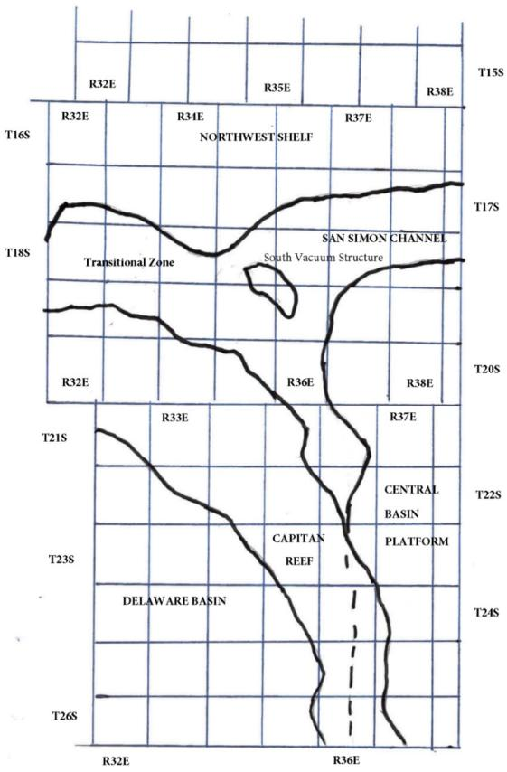

# Page 143

Figure D2 Formation Table

<table border=1 style='margin: auto; word-wrap: break-word;'><tr><td colspan="7">100&#x27; Plug to isolate upper and lower fresh water zones (typically 250&#x27; to 350&#x27;)</td></tr><tr><td style='text-align: center; word-wrap: break-word;'>Northwest Shelf</td><td style='text-align: center; word-wrap: break-word;'>Captan Reef Area</td><td style='text-align: center; word-wrap: break-word;'>Transition Zone</td><td style='text-align: center; word-wrap: break-word;'>San Simon Channel</td><td style='text-align: center; word-wrap: break-word;'>South Vacuum Structure</td><td style='text-align: center; word-wrap: break-word;'>Delaware Basin</td><td style='text-align: center; word-wrap: break-word;'>Central Basin Platform</td></tr><tr><td style='text-align: center; word-wrap: break-word;'>Granit Wash (Detrital basement material and fractured pre-Cambrian basement rock)</td><td style='text-align: center; word-wrap: break-word;'>Siluro-Devonian</td><td style='text-align: center; word-wrap: break-word;'>Morrow</td><td style='text-align: center; word-wrap: break-word;'>Siluro-Devonian</td><td style='text-align: center; word-wrap: break-word;'>Ellenburger</td><td style='text-align: center; word-wrap: break-word;'>Siluro-Devonian</td><td style='text-align: center; word-wrap: break-word;'>Granit Wash (Detrital basement material, fractured pre-Cambrian basement rock and fracture Mafic Volcanic intrusives)</td></tr><tr><td style='text-align: center; word-wrap: break-word;'>Montoya</td><td style='text-align: center; word-wrap: break-word;'>Mississippian</td><td style='text-align: center; word-wrap: break-word;'>Atoka</td><td style='text-align: center; word-wrap: break-word;'>Morrow</td><td style='text-align: center; word-wrap: break-word;'>Mckee</td><td style='text-align: center; word-wrap: break-word;'>Morrow</td><td style='text-align: center; word-wrap: break-word;'>Ellenburger</td></tr><tr><td style='text-align: center; word-wrap: break-word;'>Fusselman</td><td style='text-align: center; word-wrap: break-word;'>Morrow</td><td style='text-align: center; word-wrap: break-word;'>Strawn</td><td style='text-align: center; word-wrap: break-word;'>Wolfcamp</td><td style='text-align: center; word-wrap: break-word;'>Siluro-Devonian</td><td style='text-align: center; word-wrap: break-word;'>Atoka</td><td style='text-align: center; word-wrap: break-word;'>Connell</td></tr><tr><td style='text-align: center; word-wrap: break-word;'>Woodford</td><td style='text-align: center; word-wrap: break-word;'>Atoka</td><td style='text-align: center; word-wrap: break-word;'>Cisco</td><td style='text-align: center; word-wrap: break-word;'>Abo Reef</td><td style='text-align: center; word-wrap: break-word;'>Woodford</td><td style='text-align: center; word-wrap: break-word;'>Strawn</td><td style='text-align: center; word-wrap: break-word;'>Waddell</td></tr><tr><td style='text-align: center; word-wrap: break-word;'>Siluro-Devonian</td><td style='text-align: center; word-wrap: break-word;'>Strawn</td><td style='text-align: center; word-wrap: break-word;'>Pennsylvania</td><td style='text-align: center; word-wrap: break-word;'>Bone Spring</td><td style='text-align: center; word-wrap: break-word;'>Mississippian</td><td style='text-align: center; word-wrap: break-word;'>Pennsylvania</td><td style='text-align: center; word-wrap: break-word;'>Mckee</td></tr><tr><td style='text-align: center; word-wrap: break-word;'>Chester</td><td style='text-align: center; word-wrap: break-word;'>Pennsylvania</td><td style='text-align: center; word-wrap: break-word;'>Wolfcamp</td><td style='text-align: center; word-wrap: break-word;'>Delaware</td><td style='text-align: center; word-wrap: break-word;'>Barnett Shale</td><td style='text-align: center; word-wrap: break-word;'>Lower Wolfcamp</td><td style='text-align: center; word-wrap: break-word;'>Simpson Group</td></tr><tr><td style='text-align: center; word-wrap: break-word;'>Austin</td><td style='text-align: center; word-wrap: break-word;'>Wolfcamp</td><td style='text-align: center; word-wrap: break-word;'>Bone Spring</td><td style='text-align: center; word-wrap: break-word;'>San Andres</td><td style='text-align: center; word-wrap: break-word;'>Morrow</td><td style='text-align: center; word-wrap: break-word;'>Upper Wolfcamp</td><td style='text-align: center; word-wrap: break-word;'>Montoya</td></tr><tr><td style='text-align: center; word-wrap: break-word;'>Mississippian</td><td style='text-align: center; word-wrap: break-word;'>Abo Reef, if present</td><td style='text-align: center; word-wrap: break-word;'>Delaware</td><td style='text-align: center; word-wrap: break-word;'>Queen</td><td style='text-align: center; word-wrap: break-word;'>Atoka</td><td style='text-align: center; word-wrap: break-word;'>Wolfcamp</td><td style='text-align: center; word-wrap: break-word;'>Fusselman</td></tr><tr><td style='text-align: center; word-wrap: break-word;'>Morrow</td><td style='text-align: center; word-wrap: break-word;'>Abo, if present</td><td style='text-align: center; word-wrap: break-word;'>San Andres</td><td style='text-align: center; word-wrap: break-word;'>Yates</td><td style='text-align: center; word-wrap: break-word;'>Strawn</td><td style='text-align: center; word-wrap: break-word;'>Third Bone Spring Sand (Top of Wolfcone)</td><td style='text-align: center; word-wrap: break-word;'>Silurian</td></tr><tr><td style='text-align: center; word-wrap: break-word;'>Atoka</td><td style='text-align: center; word-wrap: break-word;'>Queen, if present</td><td style='text-align: center; word-wrap: break-word;'>Grayburg-San Andres</td><td style='text-align: center; word-wrap: break-word;'>Base of Salt</td><td style='text-align: center; word-wrap: break-word;'>Canyon</td><td style='text-align: center; word-wrap: break-word;'>First Bone Spring Sand (Top of Lower Bone Spring)</td><td style='text-align: center; word-wrap: break-word;'>Devonian</td></tr><tr><td style='text-align: center; word-wrap: break-word;'>Lower Pennsylvanian</td><td style='text-align: center; word-wrap: break-word;'>Bone Spring</td><td style='text-align: center; word-wrap: break-word;'>Queen</td><td style='text-align: center; word-wrap: break-word;'>Rustler</td><td style='text-align: center; word-wrap: break-word;'>Pennsylvanian</td><td style='text-align: center; word-wrap: break-word;'>Bone Spring</td><td style='text-align: center; word-wrap: break-word;'>Strawn</td></tr><tr><td style='text-align: center; word-wrap: break-word;'>Cisco-Canyon</td><td style='text-align: center; word-wrap: break-word;'>Delaware</td><td style='text-align: center; word-wrap: break-word;'>Seven Rivers</td><td style='text-align: center; word-wrap: break-word;'></td><td style='text-align: center; word-wrap: break-word;'>Blinebry</td><td style='text-align: center; word-wrap: break-word;'>Brushy Canyon</td><td style='text-align: center; word-wrap: break-word;'>Pennsylvanian</td></tr><tr><td style='text-align: center; word-wrap: break-word;'>Pennsylvanian</td><td style='text-align: center; word-wrap: break-word;'>Base Capitan Reef</td><td style='text-align: center; word-wrap: break-word;'>Yates</td><td style='text-align: center; word-wrap: break-word;'></td><td style='text-align: center; word-wrap: break-word;'>Bone Spring</td><td style='text-align: center; word-wrap: break-word;'>Delaware (Base of Salt)</td><td style='text-align: center; word-wrap: break-word;'>Wolfcamp</td></tr><tr><td style='text-align: center; word-wrap: break-word;'>Bough</td><td style='text-align: center; word-wrap: break-word;'>Seven Rivers</td><td style='text-align: center; word-wrap: break-word;'>Base of Salt</td><td style='text-align: center; word-wrap: break-word;'></td><td style='text-align: center; word-wrap: break-word;'>San Andres</td><td style='text-align: center; word-wrap: break-word;'>Rustler</td><td style='text-align: center; word-wrap: break-word;'>Abo</td></tr><tr><td style='text-align: center; word-wrap: break-word;'>Wolfcamp</td><td style='text-align: center; word-wrap: break-word;'>Yates</td><td style='text-align: center; word-wrap: break-word;'>Rustler</td><td style='text-align: center; word-wrap: break-word;'></td><td style='text-align: center; word-wrap: break-word;'>Queen</td><td style='text-align: center; word-wrap: break-word;'></td><td style='text-align: center; word-wrap: break-word;'>Abo Reef</td></tr><tr><td style='text-align: center; word-wrap: break-word;'>Abo</td><td style='text-align: center; word-wrap: break-word;'>Top Capitan Reef</td><td style='text-align: center; word-wrap: break-word;'></td><td style='text-align: center; word-wrap: break-word;'></td><td style='text-align: center; word-wrap: break-word;'>Base of Salt</td><td style='text-align: center; word-wrap: break-word;'></td><td style='text-align: center; word-wrap: break-word;'>Drinkard</td></tr><tr><td style='text-align: center; word-wrap: break-word;'>Abo Reef, if present</td><td style='text-align: center; word-wrap: break-word;'>Base of Salt</td><td style='text-align: center; word-wrap: break-word;'></td><td style='text-align: center; word-wrap: break-word;'></td><td style='text-align: center; word-wrap: break-word;'>Rustler</td><td style='text-align: center; word-wrap: break-word;'></td><td style='text-align: center; word-wrap: break-word;'>Tubb</td></tr><tr><td style='text-align: center; word-wrap: break-word;'>Yeso (Township 15 South to Township 17 South)</td><td style='text-align: center; word-wrap: break-word;'>Rustler</td><td style='text-align: center; word-wrap: break-word;'></td><td style='text-align: center; word-wrap: break-word;'></td><td style='text-align: center; word-wrap: break-word;'></td><td style='text-align: center; word-wrap: break-word;'></td><td style='text-align: center; word-wrap: break-word;'>Blinebry</td></tr><tr><td style='text-align: center; word-wrap: break-word;'>Drinkard or Lower Yeso (Township 15 South to Township 17 South)</td><td style='text-align: center; word-wrap: break-word;'></td><td style='text-align: center; word-wrap: break-word;'></td><td style='text-align: center; word-wrap: break-word;'></td><td style='text-align: center; word-wrap: break-word;'></td><td style='text-align: center; word-wrap: break-word;'></td><td style='text-align: center; word-wrap: break-word;'>Paddock</td></tr><tr><td style='text-align: center; word-wrap: break-word;'>Tubb (Township 15 South to Township 17 South)</td><td style='text-align: center; word-wrap: break-word;'></td><td style='text-align: center; word-wrap: break-word;'></td><td style='text-align: center; word-wrap: break-word;'></td><td style='text-align: center; word-wrap: break-word;'></td><td style='text-align: center; word-wrap: break-word;'></td><td style='text-align: center; word-wrap: break-word;'>Glorieta</td></tr><tr><td style='text-align: center; word-wrap: break-word;'>Blinebry (Township 15 South to Township 17 South)</td><td style='text-align: center; word-wrap: break-word;'></td><td style='text-align: center; word-wrap: break-word;'></td><td style='text-align: center; word-wrap: break-word;'></td><td style='text-align: center; word-wrap: break-word;'></td><td style='text-align: center; word-wrap: break-word;'></td><td style='text-align: center; word-wrap: break-word;'>San Andres</td></tr><tr><td style='text-align: center; word-wrap: break-word;'>Paddock (Township 15 South to Township 17 South)</td><td style='text-align: center; word-wrap: break-word;'></td><td style='text-align: center; word-wrap: break-word;'></td><td style='text-align: center; word-wrap: break-word;'></td><td style='text-align: center; word-wrap: break-word;'></td><td style='text-align: center; word-wrap: break-word;'></td><td style='text-align: center; word-wrap: break-word;'>Grayburg</td></tr><tr><td style='text-align: center; word-wrap: break-word;'>Glorieta</td><td style='text-align: center; word-wrap: break-word;'></td><td style='text-align: center; word-wrap: break-word;'></td><td style='text-align: center; word-wrap: break-word;'></td><td style='text-align: center; word-wrap: break-word;'></td><td style='text-align: center; word-wrap: break-word;'></td><td style='text-align: center; word-wrap: break-word;'>Grayburg-San Andres</td></tr><tr><td style='text-align: center; word-wrap: break-word;'>San Andres</td><td style='text-align: center; word-wrap: break-word;'></td><td style='text-align: center; word-wrap: break-word;'></td><td style='text-align: center; word-wrap: break-word;'></td><td style='text-align: center; word-wrap: break-word;'></td><td style='text-align: center; word-wrap: break-word;'></td><td style='text-align: center; word-wrap: break-word;'>Queen</td></tr><tr><td style='text-align: center; word-wrap: break-word;'>Queen (Township 15 South to Township 17 South)</td><td style='text-align: center; word-wrap: break-word;'></td><td style='text-align: center; word-wrap: break-word;'></td><td style='text-align: center; word-wrap: break-word;'></td><td style='text-align: center; word-wrap: break-word;'></td><td style='text-align: center; word-wrap: break-word;'></td><td style='text-align: center; word-wrap: break-word;'>Seven Rivers</td></tr><tr><td style='text-align: center; word-wrap: break-word;'>Seven Rivers (Township 15 South to Township 17 South)</td><td style='text-align: center; word-wrap: break-word;'></td><td style='text-align: center; word-wrap: break-word;'></td><td style='text-align: center; word-wrap: break-word;'></td><td style='text-align: center; word-wrap: break-word;'></td><td style='text-align: center; word-wrap: break-word;'></td><td style='text-align: center; word-wrap: break-word;'>Yates</td></tr><tr><td style='text-align: center; word-wrap: break-word;'>Yates (Township 15 South to Township 17 South)</td><td style='text-align: center; word-wrap: break-word;'></td><td style='text-align: center; word-wrap: break-word;'></td><td style='text-align: center; word-wrap: break-word;'></td><td style='text-align: center; word-wrap: break-word;'></td><td style='text-align: center; word-wrap: break-word;'></td><td style='text-align: center; word-wrap: break-word;'>Base of Salt</td></tr><tr><td style='text-align: center; word-wrap: break-word;'>Base of Salt</td><td style='text-align: center; word-wrap: break-word;'></td><td style='text-align: center; word-wrap: break-word;'></td><td style='text-align: center; word-wrap: break-word;'></td><td style='text-align: center; word-wrap: break-word;'></td><td style='text-align: center; word-wrap: break-word;'></td><td style='text-align: center; word-wrap: break-word;'>Rustler</td></tr><tr><td style='text-align: center; word-wrap: break-word;'>Rustler</td><td style='text-align: center; word-wrap: break-word;'></td><td style='text-align: center; word-wrap: break-word;'></td><td style='text-align: center; word-wrap: break-word;'></td><td style='text-align: center; word-wrap: break-word;'></td><td style='text-align: center; word-wrap: break-word;'></td><td style='text-align: center; word-wrap: break-word;'></td></tr></table>

# Page 144

# EXHIBIT "A" CASE 9316 ORDER R-111-P

# CONSOLIDATED LAND DESCRIPTION OF THE KNOWN POTASH LEASING AREA, AS OF FEBRUARY 3, 1988

## EDDY COUNTY, NEW MEXICO

## TOWNSHIP 18 SOUTH, RANGE 30 EAST, NMPM

Section 10: SE/4 SE/4

Section 11: S/2 SW/4

Section 13: W/2 SW/4 and SE/4 SW/4

Section 14: W/2 NE/4, NW/4 and S/2

Section 15: E/2 NE/4, SE/4 SW/4 and SE/4

Section 22: N/2, N/2 SW/4, SE/4 SW/4 and SE/4

Section 23: All

Section 24: N/2 NW/4, SW/4 NW/4 and NW/4 SW/4

Section 26: NE/4, N/2 NW/4 and SE/4 NW/4

Section 27: N/2 NE/4 and NE/4 NW/4

## TOWNSHIP 19 SOUTH, RANGE 29 EAST, NMPM

Section 11: SE/4 SE/4

Section 12: SE/4 NE/4 and S/2

Section 13: All

Section 14: NE/4, SE/4 NW/4 and S/2

Section 15: SE/4 SE/4

Section 22: NE/4, E/2 W/2 and SE/4

Section 23: All

Section 24: All

Section 25: NW/4 NW/4

Section 26: N/2 NE/4 AND NW/4

Section 27: NE/4 AND E/2 NW/4

## TOWNSHIP 19 SOUTH, RANGE 30 EAST, NMPM

Section 2: SW/4

Section 3:W/2 SW/4, SE/4 SW/4, S/2 SE/4 and

NE/4 SE/4

Section 4: Lots 3 and 4. SW/4 NE/4, S/2 NW/4 and S/2

Section 5: Lots 1, 2. and 3, S/2 NE/4.

S/2 NW/4 and S/2

Section 6: S/2 SE/4 and NE/4 SE/4

Sections 7 to 10 inclusive

Section 11: S/2 NE/4, NW/4 NW/4 and S/2

Section 12: NE/4, S/2 NW/4 and S/2

Section 13: NE/4, W/2, N/2 SE/4 and SW/4 SE/4

Sections 14 to 18 inclusive

Section 19: Lots 1, 2, and 3, NE/4, E/2 NW/4,

NW/4 SE/4

Sections 20 to 23 inclusive

# Page 145

Section 24: NW/4. NW/4 SW/4 and S/2 SW/4

# Page 146

Section 25: NW/4 NW/4

Section 26: NE/4 NE/4, W/2 NE/4, W/2, W/2 SE/4 and SE/4 SE/4

Section 27: AI1

Section 28: Al1

Section 29: E/2, E/2 NW/4 and NW/4 NW/4

Section 32: E/2 and SE/4 SW/4

Section 33 to 35 inclusive

Section 36: NW/4 NW/4, S/2 NW/4 and S/2

## TOWNSHIP 19 SOUTH RANGE 31 EAST NMPM

Section 7: Lots 1, 2, and 3 and E/2 NW/4

Section 18: Lots 1, 2, and 3 and SW/4 NE/4, E/2 NW/4 and NE/4 SW/4

Section 31: Lot 4

Section 34: SE/4 SE/4

Section 35: S/2 SW/4 and SW/4 SE/4

Section 36: S/2 SE/4

## LEA COUNTY, NEW MEXICO

## TOWNSHIP 19 SOUTH, RANGE 32 EAST, NMPM

<table border=1 style='margin: auto; word-wrap: break-word;'><tr><td style='text-align: center; word-wrap: break-word;'>Section 31:</td><td style='text-align: center; word-wrap: break-word;'>Lot 4</td></tr><tr><td style='text-align: center; word-wrap: break-word;'>Section 33:</td><td style='text-align: center; word-wrap: break-word;'>Lots 1 to 4 inclusive and N/2 S/2</td></tr><tr><td style='text-align: center; word-wrap: break-word;'>Section 34:</td><td style='text-align: center; word-wrap: break-word;'>Lots 1 to 4 inclusive and N/2 S/2</td></tr><tr><td style='text-align: center; word-wrap: break-word;'>Section 35:</td><td style='text-align: center; word-wrap: break-word;'>Lots 1 to 4 inclusive and N/2 S/2</td></tr><tr><td style='text-align: center; word-wrap: break-word;'>Section 36:</td><td style='text-align: center; word-wrap: break-word;'>Lots 1 to 4 inclusive, SE/4 NE/4, NW/4 SW/4 and NE/4 SE/4</td></tr></table>

## TOWNSHIP 19 SOUTH, RANGE 33 EAST, NMPM

Section 22: SE/4 NE/4, E/2 SW/4 and SE/4

Section 23: S/2 NW/4, SW/4. W/2 SE/4 and SE/4 SE/4

Section 25: SW/4 NW/4, W/2 SW/4 and SE/4 SW/4

Section 26: All

Section 27: All

Section 28: S/2 SE/4 and NE/4 SE/4

Section 30: Lots 2 to 4 inclusive, S/2 NE/4, SE/4 NW/4. E/2 SW/4 and SE/4

Section 31: All

Section 32: NE/4, S/2 NW/4 and S/2

Sections 33 to 35 inclusive

Section 36: W/2 NE/4, SE/4 NE/4, NW/4 and S/2

## TOWNSHIP 19 SOUTH, RANGE 34 EAST, NMPM

Section 31 Lots 3 and 4

# Page 147

## EDDY COUNTY, NEW MEXICO

## TOWNSHIP 20 SOUTH, RANGE 29 EAST, NMPM

Section 1: SE/4 NE/4 and E/2 SE/4

Section 13: SW/4 NW/4, W/2 SW/4 AND SE/4 SW/4

Section 14: NW/4 NE/4, S/2 NE/4, NW/4 and S/2

Section15: E/2 E/2, SE/4 SW/4 and W/2 SE/4

Section 22: E/2 and E/2 NW/4

Section 23: All

Section 24: SW/4 NE/4, W/2, W/2 SE/4 and SE/4 SE/4

Section 25: N/2, SW/4, W/2 SE/4 and NE/4 SE/4

Section 26: All

Section 27: E/2

Section 34: NE/4

Section 35: N/2

Section 36: W/2 NE/4 AND NW/4

## TOWNSHIP 20 SOUTH, RANGE 30 EAST, NMPM

Sections 1 to 4 inclusive

Section 5: Lots 1 to 3 inclusive, S/2 N/2

and S/2

Section 6 Lots 5, 6, and 7, S/2 NE/4, E/2 SW/4

and SE/4

Section 7 Lots 1 and 2. E/2 and E/2 NW/4

Sections 8 to 17 inclusive

Section 18 E/2

Section 19 E/2 and SE/4 SW/4

Sections 20 to 29 inclusive

Section 30: Lots 1 to 3 inclusive, E/2 and E/2 W/2

Section 31 E/4 and E/2 SE/4

Sections 32 to 35 inclusive

Sections 32 to 35 inclusive

## TOWNSHIP 20 SOUTH, RANGE 31 EAST, NMPM

Section 1 Lots 1 to3 inclusive, S/2 N/2

Section 3: Lots 1 and 2, S/2 NE/4 and SE/4

Section 6: Lots 4 to 7 inclusive, SE/4 NW/4, E/2 SW/4, W/2 SE/4 and SE/4 SE/4

Section 7: All

Section 8: S/2 N/2 and S/2

Section 9: S/2 NW/4, SW/4, W/2 SE/4 and SE/4 SE/4

Section 10: E/2 and SW/4

Section 11 to 36 inclusive

# Page 148

## LEA COUNTY, NEW MEXICO

TOWNSHIP 20 SOUTH, RANGE 32 EAST, NMPM

Sections 1 to 4 inclusive

Section 5: S/2 SE/4

Section 6: Lots 4 to 7 inclusive, SE/4 NW/4, E/2 SW/4 and SW/4 SE/4

Sections 7 to 36 inclusive

TOWNSHIP 20  $ \underline{\text{SOUTH}} $, RANGE 33 EAST, NMPM Sections 1 to 36 inclusive

TOWNSHIP 20 SOUTH, RANGE 34 EAST, NMPM

Section 6: Lots 3 to 7 inclusive, SE/4 NEW/4,

E/2SW/4, W/2 SE/4 AND

SE/4 SE/4

Section 8: SW/4, S/2 NW/4, W/2 SE/4 and

Section 16: W/2 NW/4, SE/4 NW/4, SW/4 and S/2 SE/4

Sections 17 to 21 inclusive

Section 22: N/2 NW/4, SW/4 NW/4, W/2 SE/4, and SE/4 SE/4

Section 26: SW/4, W/2 SE/4 and SE/4 SE/4

Sections 27 to 35 inclusive

Section 36: SW/4 NW/4 and W/2 SW/4

EDDY COUNTY, NEW MEXICO

Sections 1 to 3 inclusive

Section 4: Lots 1 through 16, NE/4 SW/4 and SE/4

Section 5: Lot 1

Section 10: N/2 NE/4, SE/4 NE/4 and SE/4 SE/4

Section 11 to 14 inclusive

Section 15: E/2 NE/4 and NE/4 SE/4

Section 23: N/2 NE/4

Section 24: E/2, N/2NW/4 and SE/4NW/4

Section 25: NE/4 NE/4 and S/2 SE/4

Section 35: Lots 2 to 4 inclusive, S/2 NE/4, NE/4 SW/4 and N/2 SE/4

Section 36: Lots 1 to 4 inclusive, NE/4, E/2 NW/4 AND N/2 S/2

TOWNSHIP 21 SOUTH, RANGE 30 EAST, NMPM

Sections 1 to 36 inclusive

# Page 149

## TOWNSHIP 21 SOUTH, RANGE 31 EAST, NMPM Sections 1 to 36 inclusive

## LEA COUNTY, NEW MEXICO

## TOWNSHIP 21 SOUTH, RANGE 32 EAST, NMPM

Sections 1 to 27 inclusive

Section 28: N/2 and N/2 S/2

Sections 29 to 31 inclusive

Section 32: NW/4 NE/4, NW/4 and NW/4 SW/4

Section 34: N/2 NE/4

Section 35: N/2 N/2

Section 36: E/2, N/2 NW/4, SE/4 NW/4 and NE/4 SW/4

## TOWNSHIP 21 SOUTH, RANGE 33 EAST, NMPM

Section 1: Lots 2 to 7 inclusive, Lots 10 to 14 inclusive, N/2 SW/4 and SW/4 SW/4

Sections 2 to 11 inclusive

Section 12: NW/4 NW/4 and SW/4 SW/4

Section 13: N/2 NW/4, S/2 N/2 and S/2

Sections 14 to 24 inclusive

Section 25: N/2. SW/4 and W/2 SE/4

Sections 26 to 30 inclusive

Section 31: Lots 1 to 4 inclusive, NE/4, E/2 W/2, N/2 SE/4 and SW/4 SE/4

Section 32: N/2 and NW/4 SW/4

Section 33: N/2

Section 34: NE/4, N/2 NW/4 and E/2 SE/4

Section 35: All

Section 36: W/2 NE/4, NW/4 and S/2

## TOWNSHIP 21 SOUTH, RANGE 34 EAST, NMPM

Section 17: W/2

Section 18: All

Section 19: Lots 1 to 4 inclusive, NE/4, E/2 W/2, N/2 SE/4 and SW/4 SE/4

Section 20: NW/4 NW/4

Section 30: Lots 1 and 2 and NE/4 NW/4

Section 31: Lots 3 and 4

EDDY COUNTY, NEW MEXICO

TOWNSHIP 22 SOUTH, RANGE 28 EAST, NMPM

Section 36: E/2 E/2

# Page 150

## TOWNSHIP 22 SOUTH, RANGE 29 EAST, NMPM

<table border=1 style='margin: auto; word-wrap: break-word;'><tr><td colspan="2">Sections 1 and 2 inclusive</td></tr><tr><td style='text-align: center; word-wrap: break-word;'>Section 3</td><td style='text-align: center; word-wrap: break-word;'>SE/4 SW/4 and SE/4</td></tr><tr><td style='text-align: center; word-wrap: break-word;'>Section 9</td><td style='text-align: center; word-wrap: break-word;'>S/2 NE/4 and S/2</td></tr><tr><td colspan="2">Sections 10 to 16 inclusive</td></tr><tr><td style='text-align: center; word-wrap: break-word;'>Section 17</td><td style='text-align: center; word-wrap: break-word;'>S/2 SE/4</td></tr><tr><td style='text-align: center; word-wrap: break-word;'>Section 19</td><td style='text-align: center; word-wrap: break-word;'>SE/4 NE/4 and E/2 SE/4</td></tr><tr><td colspan="2">Sections 20 to 28 inclusive</td></tr><tr><td style='text-align: center; word-wrap: break-word;'>Section 29</td><td style='text-align: center; word-wrap: break-word;'>N/2 N/2, S/2 NE/4 and SE/4</td></tr><tr><td style='text-align: center; word-wrap: break-word;'>Section 30</td><td style='text-align: center; word-wrap: break-word;'>NE/4 NE/4</td></tr><tr><td style='text-align: center; word-wrap: break-word;'>Section 31</td><td style='text-align: center; word-wrap: break-word;'>Lots 1 to 4 inclusive, S/2 NE/4, E/2 W/2 and SE/4</td></tr></table>

Sections 32 to 36 inclusive

## TOWNSHIP 22 SOUTH, RANGE 30 EAST, NMPM

Sections 1 to 36 inclusive

## TOWNSHIP 22 SOUTH, RANGE 31 EAST, NMPM

<table border=1 style='margin: auto; word-wrap: break-word;'><tr><td colspan="2">Sections 1 to 11 inclusive</td></tr><tr><td style='text-align: center; word-wrap: break-word;'>Section 12:</td><td style='text-align: center; word-wrap: break-word;'>NW/4 NE/4, NW/4 and NW/4 SW/4</td></tr><tr><td style='text-align: center; word-wrap: break-word;'>Section 13:</td><td style='text-align: center; word-wrap: break-word;'>S/2 NW/4 and SW/4</td></tr><tr><td colspan="2">Sections 14 through 23 inclusive</td></tr><tr><td style='text-align: center; word-wrap: break-word;'>Section 24:</td><td style='text-align: center; word-wrap: break-word;'>W/2</td></tr><tr><td style='text-align: center; word-wrap: break-word;'>Section 25:</td><td style='text-align: center; word-wrap: break-word;'>NW/4</td></tr><tr><td style='text-align: center; word-wrap: break-word;'>Section 26:</td><td style='text-align: center; word-wrap: break-word;'>NE/4 AND N/2 NW/4</td></tr><tr><td colspan="2">Sections 27 to 34 inclusive</td></tr></table>

## LEA COUNTY, NEW MEXICO

## TOWNSHIP 22 SOUTH, RANGE 32 EAST, NMPM

Section 6: Lots 2 to 7 inclusive and SE/4 NW/4

## TOWNSHIP 22 SOUTH, RANGE 33 EAST NMPM

<table border=1 style='margin: auto; word-wrap: break-word;'><tr><td style='text-align: center; word-wrap: break-word;'>Section 1: Lots 1 to 4 inclusive, S/2 N/2 and N/2 S/2</td></tr><tr><td style='text-align: center; word-wrap: break-word;'>Section 2: All</td></tr><tr><td style='text-align: center; word-wrap: break-word;'>Section 3: Lot 1, SE/4 NE/4 and SE/4</td></tr><tr><td style='text-align: center; word-wrap: break-word;'>Section 6: Lot 4</td></tr><tr><td style='text-align: center; word-wrap: break-word;'>Section 10: NE/4</td></tr><tr><td style='text-align: center; word-wrap: break-word;'>Section 11: NW/4 NE/4 AND NW/4</td></tr></table>

## TOWNSHIP 22 SOUTH, RANGE 34 EAST NMPM

Section 6: Lots 4 to 6 inclusive

# Page 151

## EDDY COUNTY, NEW MEXICO

## TOWNSHIP 23 SOUTH, RANGE 28 EAST, NMPM

Section 1: Lot 1

## TOWNSHIP 23 SOUTH, RANGE 29 EAST, NMPM

Sections 1 to 5 inclusive

Section 6: Lots 1 to 6 inclusive, S/2 NE/4, SE/4 NW/4, E/2 SW/4 and SE/4

Section 7:NE/4 and NE/4 NW/4

Section 8: N/2, N/2 SW/4, SE/4 SW/4 and SE/4

Sections 9 to 16 inclusive

Section 17: NE/4 and E/2 SE/4

Sections 21 to 23 inclusive

Section 24: N/2, SW/4 and N/2 SE/4

Section 25: W/2 NW/4 and NW/4 SW/4

Section 26: All

Section 27: All

Section 28: N/2, N/2 SW/4, SE/4 SW/4 and SE/4

Section 33: N/2 NE/4 and NE/4 NW/4

Section 34: NE/4, E/2 NW/4, NW/4 NW/4, NE/4 SW/4 and SE/4

Section 35: All

Section 36: W/2 NE/4, NW/4 and N/2 SW/4

## TOWNSHIP 23 SOUTH, RANGE 30 EAST, NMPM

Sections 1 to 18 inclusive

Section 19 N/2, N/2 SW/4, SE/4 SW/4 and SE/4

Section 20 All

Section 21 All

Section 22 N/2, S/2 SW/4, N/2 S/2 and SE/4 SE/4

Sections 23 to 25 inclusive

Section 26 E/2, SE/4 NW/4 and SW/4

Section 27 N/2 NW/4, SW/4 NW/4, SE/4 SW/4, S/2 SE/4 and NE/4 SE/4

Section 28 N/2 and SW/4 Sect ion 29 N/2 and SE/4

Section 30 N/2 NE/4

Section 32 N/2 NE/4

Section 33 SE/4 NE/4, N/2 NW/4, NE/4 SE/4 and S/2 SE/4

and S/2 SE/4

Sections 34 to 36 inclusive

TOWNSHIP 23 SOUTH, RANGE 31 EAST, NMPM

Section 2: Lot 4, SW/4 NW/4 and W/2 SE/4

Sections 3 to 7 inclusive

Section 8: NE/4 NE/4, W/2 NE/4 and W/2

Section 9: N/2 N/2

Section 10: NW/4 NW/4 and SE/4 SE/4

Section 11: S/2 NE/4, S/2 SW/4 and SE/4

# Page 152

Section 12: SW/4 NW/4 and SW/4

Section 13: SW/4 NE/4, W/2 and W/2 SE/4

Section 14: All

Section 15: E/2, SE/4 NW/4 and SW/4

Section 16: SW/4 and S/2 SE/4

Section 17: NW/4 and S/2

Sections 18 to 23 inclusive

Section 24: W/2 NE/4 and W/2

Section 25: W/2 NE/4, NW/4, N/2 SW/4 and NW/4 SE/4

Section 26 to 34 inclusive

Section 35: N/2 NW/4 and SW/4 NW/4

## TOWNSHIP 24 SOUTH, RANGE 29 EAST, NMPM

Section 2: Lots 2 to 4 inclusive

Section 3: Lot 1

## TOWNSHIP 24 SOUTH, RANGE 30 EAST, NMPM

Section 1: Lots 1 to 4 inclusive, S/2 N/2, SW/4 and NW/4 SE/4

Section 2: All

Section 3: All

Section 4:Lots 1 and 2, S/2 NE/4, SE/4 NW/4, SW/4 SW/4. E/2 SW/4 and SE/4

Section 9: N/2, N/2 SW/4, SE/4 SW/4 and SE/4

Section 10: All

Section 11: All

Section 12: W/2 NW/4 and NW/4 SW/4

Section 14: W/2 NE/4 and NW/4

Section 15: NE/4 and N/2 NW/4

## TOWNSHIP 24 SOUTH, RANGE 31 EAST, NMPM

Section 4: All

Section 5: Lots 1 to 4 inclusive, S/2 N/2,

Section 6: Lots 1 to 6 inclusive, S/2 NE/4, SE/4 NW/4, NE/4 SW/4 and N/2 SE/4

Section 9: E/2 and NW/4

Section 10: W/2 NE/4 and W/2

Section 35: Lots 1 to 4 inclusive, S/2 N/2 and N/2 S/2

Section 36: Lots 1 and 2, SW/4 NW/4 and N/2 SW/4

## TOWNSHIP 25 SOUTH, RANGE 31 EAST, NMPM

<table border=1 style='margin: auto; word-wrap: break-word;'><tr><td style='text-align: center; word-wrap: break-word;'>Section 1:</td><td style='text-align: center; word-wrap: break-word;'>Lots 3 and 4 and S/2 NW/4</td></tr><tr><td style='text-align: center; word-wrap: break-word;'>Section 2:</td><td style='text-align: center; word-wrap: break-word;'>Lots 1 to 4 inclusive and S/2 N/2</td></tr></table>

# Page 153

<table border=1 style='margin: auto; word-wrap: break-word;'><tr><td style='text-align: center; word-wrap: break-word;'>Well Name:</td><td style='text-align: center; word-wrap: break-word;'>Jericho BKJ State Com #2H</td></tr><tr><td style='text-align: center; word-wrap: break-word;'>Location:</td><td style='text-align: center; word-wrap: break-word;'>Sec. 15 T. 25S R. 27E , 660 FNL 330 FEL</td></tr><tr><td style='text-align: center; word-wrap: break-word;'>County:</td><td style='text-align: center; word-wrap: break-word;'>Eddy, NM</td></tr><tr><td style='text-align: center; word-wrap: break-word;'>Lat/Long:</td><td style='text-align: center; word-wrap: break-word;'>32.1356, -104.1708</td></tr><tr><td style='text-align: center; word-wrap: break-word;'>API #:</td><td style='text-align: center; word-wrap: break-word;'>30-015-37500</td></tr><tr><td style='text-align: center; word-wrap: break-word;'>Spud Date:</td><td style='text-align: center; word-wrap: break-word;'>RH 2/1/2010; RT 6/18/10</td></tr><tr><td style='text-align: center; word-wrap: break-word;'>Compl. Date:</td><td style='text-align: center; word-wrap: break-word;'>9/20/10</td></tr></table>

## Current Wellbore Diagram:

KB: 3190

GL: 3172

17-1/2" Hole

13-3/8" 48# H-40 @ 470'

Cmt w/ 365 sx Class C (circ) to surface

12-1/4" Hole

9-5/8" 36# J-55 to 2232'

Cmt w/ 760 sx Class C (circ) to surface

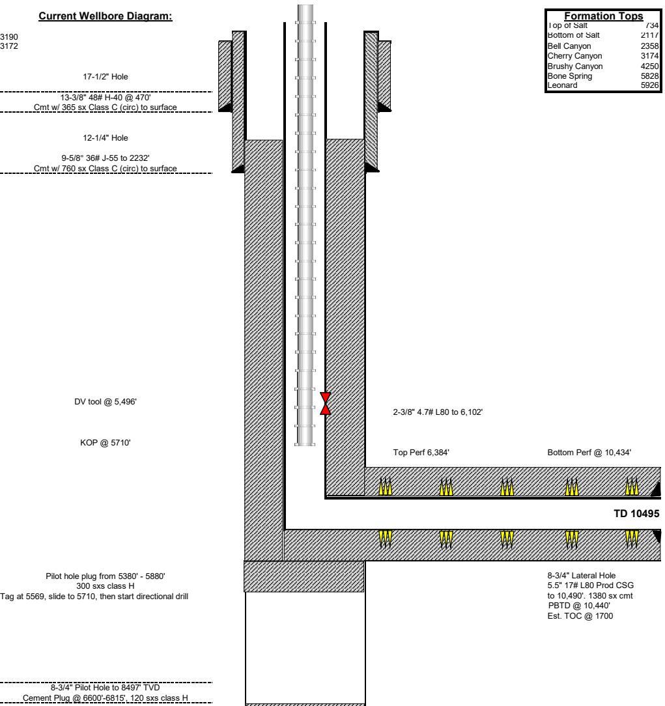

KOP @ 5710

DV tool @ 5,496'

Pilot hole plug from 5380' - 5880'

300 sxs class H

Tag at 5569, slide to 5710, then start directional drill

8-3/4" Pilot Hole to 8497' TVD

Cement Plug @ 6600'-6815', 120 sxs class H

<table border=1 style='margin: auto; word-wrap: break-word;'><tr><td colspan="2">Formation Tops</td></tr><tr><td style='text-align: center; word-wrap: break-word;'>Top of Salt</td><td style='text-align: center; word-wrap: break-word;'>734</td></tr><tr><td style='text-align: center; word-wrap: break-word;'>Bottom of Salt</td><td style='text-align: center; word-wrap: break-word;'>2117</td></tr><tr><td style='text-align: center; word-wrap: break-word;'>Bell Canyon</td><td style='text-align: center; word-wrap: break-word;'>2358</td></tr><tr><td style='text-align: center; word-wrap: break-word;'>Cherry Canyon</td><td style='text-align: center; word-wrap: break-word;'>3174</td></tr><tr><td style='text-align: center; word-wrap: break-word;'>Brushy Canyon</td><td style='text-align: center; word-wrap: break-word;'>4250</td></tr><tr><td style='text-align: center; word-wrap: break-word;'>Bone Spring</td><td style='text-align: center; word-wrap: break-word;'>5828</td></tr><tr><td style='text-align: center; word-wrap: break-word;'>Leonard</td><td style='text-align: center; word-wrap: break-word;'>5926</td></tr></table>

Bottom Perf @ 10,434'

TD 10495

Pilot Hole TD @ 8.500'

8-3/4" Lateral Hole

5.5" 17# L80 Prod CSG

to 10,490'. 1380 sx cmt

PBTD @ 10,440'

Est. TOC @ 1700

Not to Scale

By: DSC 4/23/26

# Page 154

<table border=1 style='margin: auto; word-wrap: break-word;'><tr><td style='text-align: center; word-wrap: break-word;'>Well Name:</td><td style='text-align: center; word-wrap: break-word;'>Jericho BKJ State Com #2H</td></tr><tr><td style='text-align: center; word-wrap: break-word;'>Location:</td><td style='text-align: center; word-wrap: break-word;'>Sec. 15 T. 25S R. 27E , 660 FNL 330 FEL</td></tr><tr><td style='text-align: center; word-wrap: break-word;'>County:</td><td style='text-align: center; word-wrap: break-word;'>Eddy, NM</td></tr><tr><td style='text-align: center; word-wrap: break-word;'>Lat/Long:</td><td style='text-align: center; word-wrap: break-word;'>32.1356, -104.1708</td></tr><tr><td style='text-align: center; word-wrap: break-word;'>API #:</td><td style='text-align: center; word-wrap: break-word;'>30-015-37500</td></tr><tr><td style='text-align: center; word-wrap: break-word;'>Spud Date:</td><td style='text-align: center; word-wrap: break-word;'>RH 2/1/2010; RT 6/18/10</td></tr><tr><td style='text-align: center; word-wrap: break-word;'>Compl. Date:</td><td style='text-align: center; word-wrap: break-word;'>9/20/10</td></tr></table>

## Current Wellbore Diagram:

KB: 3190

GL: 3172

17-1/2" Hole

13-3/8" 48# H-40 @ 470'

Cmt w/ 365 sx Class C (circ) to surface

12-1/4" Hole

9-5/8" 36# J-55 to 2232'

Cmt w/ 760 sx Class C (circ) to surface

DV tool @ 5,496'

KOP @ 5710

Pert @ 150'

PLUG: Sqz 64 sxs from 150' to 0'

15 sxs inside, 49 sxs outside

Pilot hole plug from 5380' - 5880'

300 sxs class H

Tag at 5569, slide to 5710, then start directional drill

8-3/4" Pilot Hole to 8497' TVD

Cement Plug @ 6600'-6815'

Perf @ 520' for surf shoe plug

PLUG: Sqz 51 sxs from 520' to 399'

12 sxs in, 39 sxs out. WOC/TAG.

Perf @ 784'

PLUG: Squeeze 64 sxs from 784' to 632'

15 sxs in, 49 sxs out

This will cover top of salt

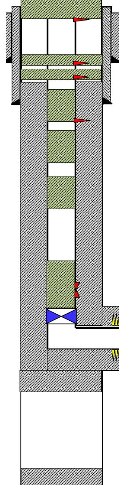

<table border=1 style='margin: auto; word-wrap: break-word;'><tr><td colspan="2">Formation Tops</td></tr><tr><td style='text-align: center; word-wrap: break-word;'>Top of Salt</td><td style='text-align: center; word-wrap: break-word;'>734</td></tr><tr><td style='text-align: center; word-wrap: break-word;'>Bottom of Salt</td><td style='text-align: center; word-wrap: break-word;'>2117</td></tr><tr><td style='text-align: center; word-wrap: break-word;'>Bell Canyon</td><td style='text-align: center; word-wrap: break-word;'>2358</td></tr><tr><td style='text-align: center; word-wrap: break-word;'>Cherry Canyon</td><td style='text-align: center; word-wrap: break-word;'>3174</td></tr><tr><td style='text-align: center; word-wrap: break-word;'>Brushy Canyon</td><td style='text-align: center; word-wrap: break-word;'>4250</td></tr><tr><td style='text-align: center; word-wrap: break-word;'>Bone Spring</td><td style='text-align: center; word-wrap: break-word;'>5828</td></tr><tr><td style='text-align: center; word-wrap: break-word;'>Leonard</td><td style='text-align: center; word-wrap: break-word;'>5926</td></tr></table>

Perf @ 2282', attempt to inject

PLUG: If able to inject, sqz 102 sxs class C from 2282-2040

24 sxs in, 78 sxs out. WOC/TAG.

This will cover the int. csg shoe and top of Delaware

PLUG: Spot 25 sxs class C from 3224 - 2971

This will cover the Cherry Canyon.

PLUG: Spot 25 sxs class C from 4300 - 4047

This will cover the Brushy Canyon.

Set CIBP @ 5710 (KOP)

Tag, test casing to 500 psi for 30 min

PLUG: Spot 35 sxs class C on CIBP from 5710 5356. WOC/TAG. This will cover the CIBP and DV tool.

Top Perf 6,384'

Bottom Perf @ 10,434'

TD 10495

Pilot Hole TD @ 8,500'

8-3/4" Lateral Hole

5.5" 17# L80 Prod CSG

to 10,490'. 1380 sx cmt

PBTD @ 10,440'

Not to Scale

By: DSC 4/23/26

# Page 155

Sante Fe Main Office

Phone: (505) 476-3441

General Information Phone: (505) 629-6116

CONDITIONS

Online Phone Directory

https://www.emnrd.nm.gov/ocd/contact-us

# State of New Mexico Energy, Minerals and Natural Resources Oil Conservation Division 1220 S. St Francis Dr. Santa Fe, NM 87505

Action 578535

CONDITIONS

<table border=1 style='margin: auto; word-wrap: break-word;'><tr><td style='text-align: center; word-wrap: break-word;'>Operator:</td><td style='text-align: center; word-wrap: break-word;'>OGRID:</td></tr><tr><td style='text-align: center; word-wrap: break-word;'>EOG RESOURCES INC</td><td style='text-align: center; word-wrap: break-word;'>7377</td></tr><tr><td style='text-align: center; word-wrap: break-word;'>5509 Champions Drive</td><td style='text-align: center; word-wrap: break-word;'>Action Number:</td></tr><tr><td style='text-align: center; word-wrap: break-word;'>Midland, TX 79706</td><td style='text-align: center; word-wrap: break-word;'>578535</td></tr><tr><td style='text-align: center; word-wrap: break-word;'></td><td style='text-align: center; word-wrap: break-word;'>Action Type: [C-103F] NOI Plug &amp; Abandon (C-103F)</td></tr></table>

CONDITIONS

<table border=1 style='margin: auto; word-wrap: break-word;'><tr><td style='text-align: center; word-wrap: break-word;'>Created By</td><td style='text-align: center; word-wrap: break-word;'>Condition</td><td style='text-align: center; word-wrap: break-word;'>Condition Date</td></tr><tr><td style='text-align: center; word-wrap: break-word;'>gcordero</td><td style='text-align: center; word-wrap: break-word;'>Adhere to current Plug &amp; Abandon (P&amp;A) Conditions Of Approvals (COA).</td><td style='text-align: center; word-wrap: break-word;'>5/20/2026</td></tr><tr><td style='text-align: center; word-wrap: break-word;'>gcordero</td><td style='text-align: center; word-wrap: break-word;'>A Cement Bond Log (CBL) is required to be submitted to electronic permitting.</td><td style='text-align: center; word-wrap: break-word;'>5/20/2026</td></tr><tr><td style='text-align: center; word-wrap: break-word;'>gcordero</td><td style='text-align: center; word-wrap: break-word;'>Submit Cement Bond Logs (CBL) prior to submittal of C-103P.</td><td style='text-align: center; word-wrap: break-word;'>5/20/2026</td></tr></table>
