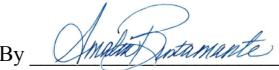

(For Division Use Only)

########### APPLICATION FOR EXCEPTION TO NO-FLARE RULE 19.15.18.12 (See Rule 19.15.18.12 NMAC and Rule 19.15.7.37 NMAC)

A. Applicant  $ \underline{\text{EOG Resources}} $

whose address is  $ \underline{\text{PO Box 2267, Midland, Texas 79702}} $,

hereby requests an exception to Rule 19.15.18.12 for  $ \underline{\text{90 (DEC.26, 2019)}} $ days or until

Name of Lease JERICHO BKJ Name of Pool WC-015 G-02 S252715A

Location of Battery: Unit Letter  $ \underline{A} $ Section  $ \underline{15} $ Township  $ \underline{25S} $ Range  $ \underline{27E} $

Number of wells producing into battery  $ \underline{2} $

B. Based upon oil production of ___ barrels per day, the estimated * volume of gas to be flared is ___ MCF; Value ___ per day.

C. Name and location of nearest gas gathering facility:

JERICHO CTB

D. Distance ___ Estimated cost of connection ___

E. This exception is requested for the following reasons: _____

Due to mid-stream volatility all gas will be metered and recorded prior to Flaring.

JERICHO BKJ STATE COM 2H - 30-015-37500 PERFECTO BOX STATE COM 1H - 30-015-37463

OPERATOR

I hereby certify that the rules and regulations of the Oil Conservation Division have been complied with and that the information given above is true and complete to the best of my knowledge and belief.

Signature  $ \underline{\text{Kristina Agee}} $

Printed Name

OIL CONSERVATION DIVISION

& Title Kristina Agee- Sr. Regulatory Administrator

E-mail Address  $ \underline{\text{Kristina_Agee@eogresources.com}} $

Approved Until  $ \underline{\text{3/25/2020}} $

Title  $ \underline{\text{BUSINESS OP. SPEC. - O}} $

Date 12/23/2019 Telephone No. 432-686-6996

Date  $ \underline{\text{12/27/2019}} $

COS's ATTACHED